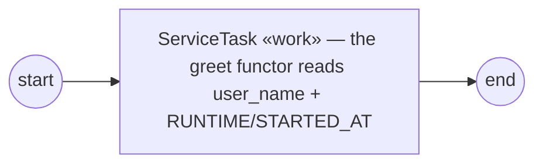

# GoBPM — BPMN 2.0 Process Engine for Go


[](https://codecov.io/github/dr-dobermann/gobpm)
[](https://pkg.go.dev/github.com/dr-dobermann/gobpm)

**GoBPM** is a native Go BPMN 2.0 engine. It is designed to embed directly into a Go application as a minimal, dependency-light **library** — and to scale up to a standalone process **server** through additive runtime components, without forcing library users to ship what they don't need.

> **Status:** active development, not yet production-ready.

The vision, scope, and architecture are defined in [SAD-001](docs/design/SAD-001-vision-and-architecture.md) and its ADRs; the delivery plan is the [Development Roadmap](docs/analytics/gobpm%20Development%20Roadmap.md).

## Two journeys

1. **Embedded library.** `import github.com/dr-dobermann/gobpm`, build an engine, register a process, run it. No external services required.
2. **Standalone runtime.** A `gobpm-server` (planned, `runtime/` module) exposes the engine over HTTP/gRPC with real persistence, identity, and observability — built *on* the library, never a fork of it.

The library carries no runtime baggage; the runtime never reimplements the engine.

## Key characteristics

- **Library, not framework** — embeds into your Go binary; no JVM, containers, or external services. Core depends only on the Go stdlib + `github.com/google/uuid`.
- **BPMN 2.0 Process Execution Conformance** — the Common Executable Subclass plus the ComplexGateway extension. Authoritative scope: [docs/bpmn-spec/conformance.md](docs/bpmn-spec/conformance.md).
- **Predictable execution model** — one event-loop goroutine per process instance owns state; each *track* (thread of execution) runs in its own goroutine, and a token is a projection of a track's position, not a stored object; `context.Context` is the cancellation contract. See [ADR-001](docs/design/ADR-001-execution-model.md).
- **Interface-driven extensibility** — persistence, expressions, messaging, observability, authorization, task distribution, and clock are all behind interfaces with in-core defaults. See [ADR-002](docs/design/ADR-002-extension-architecture.md).
- **Observable by default** — `Logger` defaults to `slog.Default()`; you opt *out* of telemetry, you don't opt in. Tracer/metrics default to no-op (OpenTelemetry adapter ships separately).
- **Message handling & correlation** — send/receive tasks and throw/catch message events over a pluggable broker; a message can **instantiate** a process (event-triggered instantiation) and **correlate** to the right instance by a key derived from the payload, and a **follow-up** message routes back to the specific running instance whose conversation it belongs to — across one or more keys (conversation-token threading). See [ADR-014](docs/design/ADR-014-message-handling.md) / [ADR-015](docs/design/ADR-015-event-triggered-instantiation.md) / [ADR-016](docs/design/ADR-016-message-correlation.md).
- **Definition versioning** — `RegisterProcess` returns a versioned registration handle; re-registering the same process id mints a new version, and older versions keep running their already-started instances. The **latest** version owns auto-start — a newer registration supersedes the previous one's starters, and unregistering the latest promotes the now-newest back. Start by handle (`StartProcess`), by newest (`StartLatest`), or by a specific version (`StartVersion`). See [ADR-019](docs/design/ADR-019-definition-versioning.md).
- **Programmatic model construction** — processes are built in Go. XML parsing is intentionally decoupled from the model layer.

## Architecture

```
Process model ──> Snapshot ──> Engine (Thresher) ──> Instance (orchestrator)
   pkg/model        immutable      pkg/thresher          1 goroutine / instance
                    definition                            ├── Tokens (1 goroutine each)
                                                          ├── EventHub + waiters
                                                          └── Scope (hierarchical data)
```

Dependencies flow downward only; lower layers know nothing of higher ones.

### Core packages

| Package | Description |
|---------|-------------|
| `pkg/thresher/` | Engine façade — process registry and instance lifecycle |
| `pkg/model/` | BPMN element types (activities, events, gateways, flow, data, …) |
| `pkg/convert/` | Interchange seam — import/export a definition; `bpmn/` reads and writes BPMN 2.0 XML |
| `pkg/errs/`, `pkg/set/` | Structured errors; utility data structures |
| `internal/instance/` | Instance / track / token execution (+ `snapshot/`) |
| `internal/eventproc/` | EventHub + event waiters (timer, …) |
| `internal/scope/` | Hierarchical data scoping and variable shadowing |

## Quick start

```bash
go get github.com/dr-dobermann/gobpm
```

The snippet below builds and runs this process — a start event, one
`ServiceTask` executing your Go functor, and an end event:



```go
// Start -> ServiceTask -> End  (errors elided for brevity)
engine, _ := thresher.New("demo-engine")

// CreateDefaultStates wires the data states that process properties use.
_ = data.CreateDefaultStates()

// A process-level property the ServiceTask reads at runtime.
proc, _ := process.New("demo-process",
    data.WithProperties(
        data.MustProperty("user_name",
            data.MustItemDefinition(values.NewVariable("dr.Dobermann"),
                foundation.WithID("user_name")),
            data.ReadyDataState)))
start, _ := events.NewStartEvent("start")

// A ServiceTask runs your Go code: gooper.New builds the operation straight
// from a functor. The functor receives a read-only DataReader over process
// data and engine runtime variables (and its optional bound input message —
// nil here, since this operation declares no messages).
op, _ := gooper.New("greet",
    func(ctx context.Context, r service.DataReader, _ *data.ItemDefinition) (*data.ItemDefinition, error) {
        user, _ := r.GetData("user_name")             // a process property
        started, _ := r.GetData("RUNTIME/STARTED_AT") // an engine runtime variable
        fmt.Printf("  ▶ hello, %v (started at %v)\n",
            user.Value().Get(ctx), started.Value().Get(ctx))
        return nil, nil
    })
task, _ := activities.NewServiceTask("work", op, activities.WithoutParams())

end, _ := events.NewEndEvent("end")

_ = proc.Add(start)
_ = proc.Add(task)
_ = proc.Add(end)
_, _ = flow.Link(start, task)
_, _ = flow.Link(task, end)

// RegisterProcess returns a registration handle naming the (key, version);
// re-registering the same process id mints a new version.
reg, _ := engine.RegisterProcess(proc)
_ = engine.Run(context.Background())

// Start the exact registered version by its handle. StartLatest(key) and
// StartVersion(key, n) address by process id instead. Each returns a read-only
// handle onto the running instance.
inst, _ := engine.StartProcess(reg)

// Block until the instance finishes — the guaranteed completion signal.
state, _ := inst.WaitCompletion(context.Background())
fmt.Println("done:", state) // "Completed"
```

The `gooper` functor is how you embed arbitrary Go logic in a process — here it
reads a process property and an engine runtime variable through its read-only
`DataReader`, and the same pattern scales to a real handler.

`StartProcess` hands back a read-only **`InstanceHandle`** — your window onto the
running instance: `State()`, a live `Tokens()` snapshot, full `History()` (every
track, including merged ones), read-only `Data()`, and `WaitCompletion(ctx)` to
await the finish. To follow progress as it happens, subscribe an observer to the
instance's lifecycle / token / node event stream:

```go
// an Observer is any type with OnFact(observability.Fact):
type logger struct{}

func (logger) OnFact(f observability.Fact) {
    fmt.Printf("  • %s %s %s\n", f.Kind, f.Phase, f.NodeName)
}

sub := inst.Observe(logger{})
defer sub.Cancel() // deregister + drain; sub.Dropped() counts any overflow
```

A `Fact` carries a `Kind` (EngineState, NodeProgress, JobState, Fault, …), a
`Phase`, node identity, and a masked `Details` map (ids/names/codes, never
payload). The same `Observe` exists on the engine itself —
`Thresher.Observe(...)` — to watch **every** instance plus engine-level facts
(process registration, hub and engine lifecycle) through one stream.

Delivery is best-effort and lossy — a slow observer drops facts rather than
blocking the engine — so the **completion** signal from `WaitCompletion` is the
one guaranteed, never-dropped signal.

A complete, runnable
version (with error handling and waiting for the task to run) lives in
[`examples/basic-process/`](examples/basic-process/); see also
[`examples/parallel-gateway/`](examples/parallel-gateway/) (concurrent
branches),
[`examples/process-data/`](examples/process-data/) (process data through the
task, plus a **DataObject** per branch — a scope-resident named container each
task writes to and is read back by name),
[`examples/data-store/`](examples/data-store/) (an engine-global **DataStore** —
a value one instance writes is read by a *separate* instance through a shared
`DataStoreReference`), and the timer examples
[`examples/simple-timer/`](examples/simple-timer/) ·
[`examples/timer-event/`](examples/timer-event/) ·
[`examples/usertask-sla/`](examples/usertask-sla/) (three **non-interrupting**
boundary timers marking 50% / 90% / 100% of a User Task's SLA — the task
overruns, every warning fires, and the work still completes).

For the routing gateways, see
[`examples/gateway-routing/`](examples/gateway-routing/) (exclusive choice) ·
[`examples/inclusive-join/`](examples/inclusive-join/) (inclusive split + OR-join) ·
[`examples/complex-gateway/`](examples/complex-gateway/) (activation-threshold join),
and the **Event-Based** gateway —
[`examples/event-based-gateway/`](examples/event-based-gateway/) (mid-flow deferred
choice: the first of several events to fire wins, the rest are dropped) ·
[`examples/event-based-parallel-start/`](examples/event-based-parallel-start/) (a
process **started** by an event gateway — the first of two correlated messages creates
the instance, the other re-arms to it, and it completes once both have arrived).

For message handling, see
[`examples/message-send-receive/`](examples/message-send-receive/) (a SendTask
publishes to the broker, a ReceiveTask waits and binds the payload) ·
[`examples/message-intermediate-events/`](examples/message-intermediate-events/)
(throw/catch message events), and
[`examples/inter-instance-correlation/`](examples/inter-instance-correlation/) —
a message **instantiates** a handler process and **correlates** by a key derived
from the payload (one handler instance per distinct order) ·
[`examples/conversation-routing/`](examples/conversation-routing/) — a follow-up
message **routes back** to the specific handler instance whose conversation it
belongs to (keyed in-instance receivers; two conversations stay isolated).

For signal events (broadcast, no correlation), see
[`examples/signal-broadcast/`](examples/signal-broadcast/) — one throw reaches
**every** waiting catcher in reach · and
[`examples/signal-start/`](examples/signal-start/) — a broadcast signal
**instantiates** processes whose start trigger is a signal (one broadcast → one
instance per signal-start declaration).

For Link events (an intra-process **GOTO**), see
[`examples/link-events/`](examples/link-events/) — a source Intermediate Throw
hands the token to the same-name target Intermediate Catch within one Process
level (static name-pairing, resolved at snapshot build, validated at
registration — not a wait, no broadcast). The example is an **on-page loop**:
two Link sources (an initial jump + a back-edge) redirect through one catch into
the work task, until a data condition exits.

For boundary events (interrupting an activity), see
[`examples/boundary-events/`](examples/boundary-events/) — an **interrupting timer
boundary** as a timeout on a long-running task: the 2s boundary fires before the
~4s activity finishes, cancels it, and routes the token onto the boundary's
exception flow.

For escalation events (a **non-critical** signal up the scope chain), see
[`examples/escalation-events/`](examples/escalation-events/) — a sub-process
raises an `OVER_BUDGET` escalation that an **interrupting Escalation boundary**
catches by code and routes to a manager. Unlike an Error, an escalation does not
fault the instance: it climbs to the innermost matching catcher (boundary or
event-sub-process start, interrupting or non-interrupting), and an **unresolved**
one is logged, never silently dropped.

For compensation events (undoing **completed** work — the saga pattern), see
[`examples/compensation-events/`](examples/compensation-events/) — a
trip-booking saga: each booking carries a **Compensation boundary** linked to
its `isForCompensation` undo handler; completed bookings enter the engine's
**completion ledger** with a data snapshot each, and a Compensation End Event
undoes them in **reverse completion order**, waiting for the handlers. Only
completed work compensates (presumed abort); a handler reads the snapshot its
activity completed with; an unresolved throw is logged, never a fault.

For durability, see [`examples/restart-recovery/`](examples/restart-recovery/)
— **instance checkpoints and restart recovery** (the first Persistence &
State slice): with an explicitly configured repository every instance
writes consistent-cut checkpoints at its lifecycle transitions, a crashed
engine's instances are claimed and restored by the next engine over the
same store (timers re-arm at their RECORDED deadlines — overdue fires
once; tasks re-announce; subscriptions re-register), and ownership leases
with CAS fencing keep zombie engines from ever corrupting state. The
zero-config engine stays volatile at zero overhead. The guide:
[**docs/guides/operating/persistence.md**](docs/guides/operating/persistence.md).

Durability now has a production backend:
[**`adapters/postgres`**](adapters/postgres/) stores the checkpoints in a
user-owned PostgreSQL database (`postgres.New(db)` over your `*sql.DB`;
the adapter migrates its own namespaced schema at `Run`). Engines that
should recover each other share an **engine group**
(`thresher.WithEngineGroup`; join-only assertion via
`WithExistingEngineGroup`) — an ungrouped engine is a solo group under
its own id, so clustering is explicit, never accidental. The storage is
tenant-ready: each record carries its tenant, with a flag-designated
default per group enforced by the database. Any adapter proves itself
against the published conformance suite
(`pkg/repository/repositorytest`) — the same one `memrepo` passes.

For a single-process deployment there is
[**`adapters/sqlite`**](adapters/sqlite/): durability in a file, with no
server to run and no CGo to build (`sqlite.Open("gobpm.db")`, or
`sqlite.New(db)` over a pool you own). It declares itself **not**
cluster-safe through `renv.ClusterAware` and names PostgreSQL as the
alternative, because one embedded writer cannot give several engines the
lease semantics recovery depends on — so the engine learns that limit by
asking the adapter rather than from a paragraph like this one. Being
embedded, it is also the first adapter whose conformance run needs no
server, and therefore the first to execute that suite on every push.

A technical failure no longer kills the instance — see
[`examples/incident-retry/`](examples/incident-retry/): an unhandled failure
opens an **incident** instead, a durable record carrying the cause chain, the
attempt history and a **failure-time data snapshot** (the variables exactly as
the failing attempt saw them), while sibling branches keep running and the
token stays visible at the stuck node. An **incident retry policy** (per
activity or engine-wide) re-enters the node on its own; when it exhausts —
or by default, with no policy — the incident waits for an **operator**:
inspect it via `Incidents()`, then `RetryIncident` (re-run the node now),
`ResolveIncident` (continue past it — the work's effect exists), or
`DropIncident` (a durable dead letter the process never silently completes
past). Armed boundary timers keep ticking against the stuck node and are never
reset by retries; incidents survive restarts through the checkpoint. The
guide: [**docs/guides/operating/incidents.md**](docs/guides/operating/incidents.md).

Since the composite-fidelity landing, the checkpoint covers every
construct **mid-flight**: iterations resume at their recorded pass,
parallel fan-outs re-open exactly their open instances, a resolving
compensation continues its sweep, an Ad-Hoc container resumes its
routing at the recorded progress (a pending manual offer included),
and a Call Activity's child is a durable instance re-linked to its
caller on recovery — nothing completed ever re-executes, and no
construct defers the capture.

The same switch buys **dehydration** — see
[`examples/dehydration/`](examples/dehydration/): an instance whose every
live track sits on a long wait releases *all* of its goroutines, its loop
included, and the checkpoint becomes the only thing that can wake it. A
trigger — a timer deadline, a correlated message, a broadcast signal, an
action on a parked human task, any arm of an event-based gateway, **or the
deadline of a boundary event guarding the wait** — rebuilds the instance and
continues the flow where it stopped. Ten thousand orders waiting three days
on a payment cost ten thousand rows, not ten thousand running processes. A
near-deadline timer stays resident on purpose: the round trip has to be worth
more than the wait.

"Approve within 24 hours or escalate" therefore keeps both halves of its
promise: the boundary is held and recorded alongside the task, so the
escalation survives both the release and a restart — and fires at the
deadline it was *originally* given, not one recomputed on the way back.

For human work, see [`examples/usertask/`](examples/usertask/) — a **User
Task** parks until a person acts, and the engine owns *who* that person is.
Eligibility is a Camunda-style assignee / candidate-user / candidate-group
triad, **resolved once when the task is announced** so a candidate set cannot
shift under a task that is already waiting. BPMN's own vocabulary works too:
declare a **`PotentialOwner`** or **`HumanPerformer`** and it decides
eligibility alongside the triad, resolved by the same path — the standard's
expression-based resource assignment, executed rather than merely modelled.
(Its other mode, a query into an organizational directory, is a declared
deviation: gobpm has no directory, so such a role is refused at registration
instead of carried and silently ignored.) On top of it sits BPMN's own
`actualOwner` (§10.3.4.1, Table 10.14): a candidate **claims** a task to take
exclusive hold, and only the holder may complete it — so offering one task to
twenty people no longer means twenty people can work it in parallel and
nineteen discard their effort. `Unclaim` returns it to the pool; `Reassign`
moves it when the holder is on sick leave or has left, deliberately
unguarded at the task level because the person doing it is an administrator,
not a participant. Completion records who actually performed the work, in the
engine's read-only `RUNTIME` area, so a later task can route on it — "send it
to the approver's manager" is a process decision, not glue code. Claiming
costs nothing while an instance is dehydrated: ownership lives beside the
task, not inside the instance.

For scripting, see [`examples/script-task/`](examples/script-task/) — a
**Script Task** runs an embedded Lua file on the pluggable **Script Engine
seam**: engines register with the repeatable `WithScriptEngine` (several
interpreters coexist, routed by the task's own `scriptFormat` MIME hint;
format-claim conflicts are rejected loudly at construction), and the
batteries `adapters/lua` interpreter executes each script on a fresh,
sandboxed, context-bound VM — lazy fail-loud `data` reads with a `has()`
probe, outputs returned as a table and committed as named process data.

For expressions, see
[`examples/expression-routing/`](examples/expression-routing/) — the
**language-routed expression layer** hosts several engines side by side
(the repeatable `WithExpressionEngine`; claim conflicts fail construction
loud): out of the box `gobpm:lite` **text conditions** — record paths, a
map probe with `has()`, a `time()` comparison — mix freely with `goexpr`
Go functors across task flows, an XOR gateway and even a UserTask whose
assignee is computed by a lite string expression.

For business decisions, see
[`examples/business-rule-task/`](examples/business-rule-task/) — a **Business
Rule Task** evaluates a named decision on the pluggable **Business Rule
Engine** (the batteries-included `gorules` Go decision registry by default;
swap in a DMN or any rules service with `thresher.WithRuleEngine` — the model
is untouched). The decision reads process data through the ordinary walk-up
and its result commits back as process data — a 1-row/1-output result folds
to a scalar, so the task's own conditional flows route on the outcome; an
unknown decision reference fails loud, and every evaluation emits a `Rules`
observability fact. For table-driven decisions, the **`adapters/dtable`**
module (the first out-of-core rule engine) evaluates DMN-shaped decision
tables — five hit policies, Go-functor conditions — and **deploys
structure-only JSON grids** over named Go behavior through its pluggable
Decoder seam: see
[`examples/decision-table/`](examples/decision-table/).

For composition, see [**docs/guides/subprocesses/index.md**](docs/guides/subprocesses/index.md).
An **embedded Sub-Process** is a nested scope inside the instance (the inner
flow reads the parent's data through the walk-up, its locals die with the
scope, the parent resumes when the scope drains, and boundary/Terminate/Error
act on the scope as a unit) —
[`examples/embedded-subprocess/`](examples/embedded-subprocess/). A **Call
Activity** invokes a separately registered process as an isolated **child
instance** — the reuse boundary: declared I/O cloned across the boundary,
latest-at-launch or pinned versioning, the output committed back —
[`examples/call-activity/`](examples/call-activity/). An **Event Sub-Process**
(`triggeredByEvent`) is a scope-armed handler: armed while its enclosing scope
is open, an interrupting one fires a **cancel-and-run** — it cancels the
scope's work, runs in the parent's data context, and absorbs the event so the
parent resumes on its normal flow; a **non-interrupting** one instead **forks**
— it spawns a concurrent handler instance per fire without cancelling, unlimited
—
[`examples/event-subprocess/`](examples/event-subprocess/). A **Transaction
Sub-Process** (`WithTransaction`) is a Sub-Process variant that aborts
atomically on a **Cancel End Event** — it compensates the completed activities
(reverse completion order, as an ACID-like barrier), terminates the rest, and
hands control out through its interrupting **Cancel boundary** (a Transaction
with no Cancel boundary ends there) —
[`examples/transaction-sub-process/`](examples/transaction-sub-process/). An
**Ad-Hoc Sub-Process** (`WithAdHoc`) is a Sub-Process variant whose inner
activities carry **no sequence flows**: what runs next is answered at runtime by
a host-supplied **Router** — consulted when the scope opens and after each inner
activity settles, reading the case's own data — so the container expresses work
whose order is not knowable in advance. An empty answer ends the asking track
and the container finishes when its scope drains; `WithAdHocManualSelection()`
offers the enabled set for a **human** to pick from, and ready-made Routers ship
in `pkg/adhoc/routers` —
[`examples/adhoc-subprocess/`](examples/adhoc-subprocess/).

Any activity can carry **iteration**
([**docs/guides/iteration/index.md**](docs/guides/iteration/index.md)): a **Standard Loop**
(§13.3.6) marked `WithLoop` re-runs it while a boolean condition holds — a leaf
Task in place, a composite by re-opening its child scope per iteration —
exposing a 0-based `loopCounter` to the condition and the activity each pass
([`examples/standard-loop/`](examples/standard-loop/)). A **Multi-Instance**
(§13.3.7) instead runs the activity once per element of a collection (or a fixed
count), binding each element by name and assembling the per-instance outputs
into an output collection — **sequentially**
([`examples/multi-instance-sequential/`](examples/multi-instance-sequential/)) or
**in parallel**, all instances at once in distinct scopes with a
`completionCondition` that cancels the remainder
([`examples/multi-instance-parallel/`](examples/multi-instance-parallel/)). A
Multi-Instance `behavior` can additionally throw a **boundary-catchable** event as
instances complete — e.g. a *quorum-reached* signal caught by a non-interrupting
boundary ([`examples/multi-instance-behavior/`](examples/multi-instance-behavior/)).

For conditional events (**data-driven waiting** — a wait released by the
process's own committed data, no polling), see
[`examples/conditional-events/`](examples/conditional-events/) — an
intermediate conditional catch parks a branch until a sibling task's commit
flips its condition false→true; conditional triggers also guard activities as
**boundary events** and race as **event-based-gateway arms**. The guide is
[**docs/guides/events/conditional.md**](docs/guides/events/conditional.md).

For abnormal process termination, see
[`examples/terminate-end-event/`](examples/terminate-end-event/) — a **Terminate
End Event** on one branch of a parallel process: the fraud-check branch reaches it
and ends the whole instance, cancelling the in-flight payment mid-charge — the
instance settles `Terminated`, not `Completed`.

Process data is fully **structural**: values are navigable by path
(`order.items[0].price`, `rates["EUR"]`) in every seam — conditions,
expressions, mappings, service code — writable and assemblable by the same
grammar, change-detected per path at commit, and your **own Go structs
participate live** via `adapters.Wrap` (wrap, not convert). The value kinds
are scalar, list, record, and **map** — a data-keyed dictionary you grow
key-by-key, with sorted enumeration and a `["key"]` path step. The complete
guide — the value model, the tiers, reading/writing/observing,
`gobpm:"..."` tags — is [**docs/guides/data/index.md**](docs/guides/data/index.md), with
runnable examples linked from it.

### Startup logging

`thresher.New` prints a startup report — an ASCII banner with the engine
version and last commit, then one line per resolved extension — so the wiring
is visible in the log at construction time. Both blocks are on by default; opt
out per block when the noise isn't wanted:

```go
// Fully silent startup:
eng, _ := thresher.New("worker-7",
    thresher.WithoutBanner(),        // drop the banner / version / commit
    thresher.WithoutStartupConfig(), // drop the per-extension config dump
)
```

## Development

```bash
make tools     # one-time: install pinned Go dev tools
make ci        # full pre-push gate — mirrors GitHub CI exactly (tidy, lint, build, race tests, diff-coverage, vuln scan)

make test         # tests (generates mocks first)
make lint         # lint core module
make build        # build to ./bin/
make cover-check  # diff-coverage gate — changed lines must be >= COVER_MIN (run after `make test-all`)
```

`make ci` is the contract: green locally ⇒ green on CI. The Go toolchain is pinned (`go.mod` → `go1.25.12`) so local and CI scan the identical standard library.

### How we work

- **Specification-first** — non-trivial changes start from a spec (SRD/FIX) referencing the governing ADR; the spec lands in the same change-set as its implementation.
- **`master` is protected** — changes land only through a PR with a green `check`; no direct, force, or admin-bypass pushes.
- **Diff-coverage gate** — CI fails when the lines a change *adds or modifies* are covered below `COVER_MIN` (95% now, rising toward 100%). It judges only changed lines, so the untouched-code backlog never blocks a PR. See [SRD-002](docs/srd/SRD-002-ci-diff-coverage-gate.md).
- **Design docs** under `docs/design/` ([SAD-001](docs/design/SAD-001-vision-and-architecture.md), [ADR-001…007](docs/design/)) are the source of truth; see [CONTRIBUTING.md](CONTRIBUTING.md).

### Requirements

- Go (toolchain pinned to `go1.25.12` via `go.mod`; `GOTOOLCHAIN=auto` fetches it automatically)
- Pinned Go dev tools via `make tools`: [mockery v3](https://github.com/vektra/mockery), [golangci-lint v2](https://golangci-lint.run/), [govulncheck](https://pkg.go.dev/golang.org/x/vuln/cmd/govulncheck), and [covercheck](https://github.com/dr-dobermann/covercheck). Make targets reject missing or stale versions instead of failing later with incompatible flags or config.
- GNU `timeout` for the end-to-end example gate. Linux provides it as
  `timeout`; on macOS install Homebrew coreutils once with
  `brew install coreutils` (the Makefile automatically detects `gtimeout`).

## Documentation

The manual, the design docs, and the BPMN 2.0 reference are published as a
searchable site at **<https://dr-dobermann.github.io/gobpm/>** — rebuilt on
every docs-touching merge. The same pages as files, for in-repo reading:

- [Vision & Architecture (SAD-001)](docs/design/SAD-001-vision-and-architecture.md) and [ADRs](docs/design/) — the conception
- [User Guides](docs/guides/index.md) — build and run processes, every BPMN element, with runnable code
- [Working with process data](docs/guides/data/index.md) — the structural-data guide (paths, tiers, native structs, change observation)
- [Conditional events](docs/guides/events/conditional.md) — data-driven waiting: positions, the false→true edge rule, dependency declarations
- [Activity iteration](docs/guides/iteration/index.md) — Standard Loop + Multi-Instance (sequential & parallel): loopCondition / testBefore / loopMaximum, cardinality / collection fan-out / completionCondition (stop vs. cancel), loopCounter & numberOf* attributes, leaf-in-place vs. composite / concurrent scopes
- [Composition](docs/guides/subprocesses/index.md) — sub-processes (nested scopes) & call activities (child-instance reuse boundary): the §13.3.4 shapes, data visibility/isolation, versioning, scope-wide interruption
- [Interchange converters](docs/guides/extending/converters.md) — import and export BPMN 2.0 XML: the format-agnostic `convert` seam, blank-import registration, id preservation as the version key, unsupported-element feedback, semantic round-trip
- [Persistence & recovery](docs/guides/operating/persistence.md) — instance checkpoints & restart recovery: arming with `WithRepository`, per-wait recovery semantics (overdue timers fire once), ownership leases + CAS fencing for shared stores, engine groups, the PostgreSQL adapter, stable element ids as the deployment-parity contract
- [Incidents & retry](docs/guides/operating/incidents.md) — a technical failure becomes durable, operable state: retry policies, the operator's retry/resolve/drop, failure-time snapshots, dead letters
- [Development Roadmap](docs/analytics/gobpm%20Development%20Roadmap.md) — workstreams + milestones
- [Conformance scope](docs/bpmn-spec/conformance.md) and [BPMN 2.0 reference KB](docs/bpmn-spec/) · [Conformance status](docs/design/conformance-status.md) — what's implemented vs what remains, mapped to issues
- [Documentation Index](README_INDEX.md) · [API Reference](https://pkg.go.dev/github.com/dr-dobermann/gobpm) · [Contributing](CONTRIBUTING.md) · [Changelog](CHANGELOG.md)

## License

LGPL-3.0 — see [LICENSE](LICENSE).
