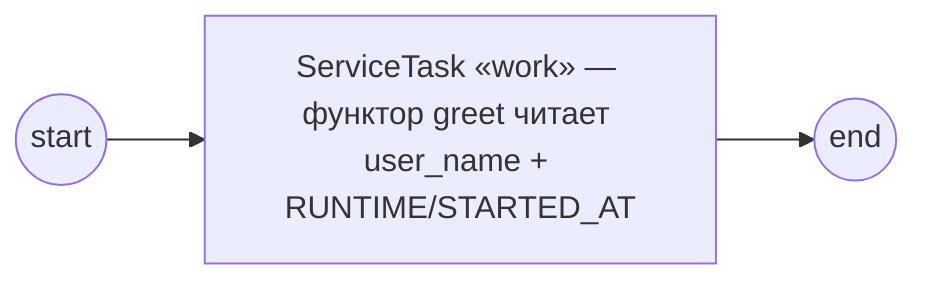

# GoBPM — BPMN 2.0 Process Engine for Go


[](https://codecov.io/github/dr-dobermann/gobpm)
[](https://pkg.go.dev/github.com/dr-dobermann/gobpm)

> EN-оригинал — канонический: [README.md](README.md). Этот файл — его перевод (twin).

**GoBPM** — нативный Go-движок BPMN 2.0. Он спроектирован встраиваться прямо в Go-приложение как минимальная, лёгкая по зависимостям **библиотека** — и масштабироваться до самостоятельного процессного **сервера** через аддитивные runtime-компоненты, не заставляя пользователей библиотеки тащить то, что им не нужно.

> **Статус:** активная разработка, пока не готово к production.

Видение, область и архитектура определены в [SAD-001](docs/design/SAD-001-vision-and-architecture.md) и его ADR'ах; план поставки — [Development Roadmap](docs/analytics/gobpm%20Development%20Roadmap.md).

## Два пути

1. **Встраиваемая библиотека.** `import github.com/dr-dobermann/gobpm`, собрать движок, зарегистрировать процесс, запустить. Никаких внешних сервисов не требуется.
2. **Самостоятельный runtime.** `gobpm-server` (планируется, модуль `runtime/`) предоставляет движок по HTTP/gRPC с настоящей персистентностью, идентификацией и observability — построенный *на* библиотеке, а не её форк.

Библиотека не несёт runtime-балласта; runtime никогда не переписывает движок заново.

## Ключевые характеристики

- **Библиотека, а не фреймворк** — встраивается в ваш Go-бинарь; ни JVM, ни контейнеров, ни внешних сервисов. Ядро зависит только от stdlib Go + `github.com/google/uuid`.
- **BPMN 2.0 Process Execution Conformance** — Common Executable Subclass плюс расширение ComplexGateway. Авторитетная область: [docs/bpmn-spec/conformance.md](docs/bpmn-spec/conformance.md).
- **Предсказуемая модель выполнения** — одна goroutine event-loop'а на инстанс процесса владеет состоянием; каждый *трек* (поток выполнения) работает в своей goroutine, а токен — это проекция позиции трека, а не хранимый объект; `context.Context` — контракт отмены. См. [ADR-001](docs/design/ADR-001-execution-model.md).
- **Расширяемость через интерфейсы** — персистентность, выражения, обмен сообщениями, observability, авторизация, распределение задач и часы — всё за интерфейсами с дефолтами в ядре. См. [ADR-002](docs/design/ADR-002-extension-architecture.md).
- **Наблюдаемость по умолчанию** — `Logger` по умолчанию `slog.Default()`; вы *отказываетесь* от телеметрии, а не подключаете её. Tracer/metrics по умолчанию no-op (адаптер OpenTelemetry поставляется отдельно).
- **Обработка сообщений и корреляция** — send/receive-задачи и throw/catch message-события через подключаемый брокер; сообщение может **инстанцировать** процесс (event-triggered instantiation) и **коррелировать** к нужному инстансу по ключу, выведенному из payload'а, а **последующее** сообщение маршрутизируется обратно к конкретному выполняющемуся инстансу, к чьей conversation оно относится — по одному или нескольким ключам (conversation-token threading). См. [ADR-014](docs/design/ADR-014-message-handling.md) / [ADR-015](docs/design/ADR-015-event-triggered-instantiation.md) / [ADR-016](docs/design/ADR-016-message-correlation.md).
- **Версионирование определений** — `RegisterProcess` возвращает версионированный дескриптор регистрации; повторная регистрация того же id процесса создаёт новую версию, а старые версии продолжают выполнять уже запущенные инстансы. **Последняя** версия владеет авто-стартом — новая регистрация вытесняет стартеры предыдущей, а снятие последней версии возвращает (промоутит) авто-старт к новейшей оставшейся. Запуск — по дескриптору (`StartProcess`), по новейшей (`StartLatest`) или по конкретной версии (`StartVersion`). См. [ADR-019](docs/design/ADR-019-definition-versioning.md).
- **Программное построение модели** — процессы строятся в Go. Разбор XML намеренно отвязан от модельного слоя.

## Архитектура

```
Process model ──> Snapshot ──> Engine (Thresher) ──> Instance (orchestrator)
   pkg/model        immutable      pkg/thresher          1 goroutine / instance
                    definition                            ├── Tokens (1 goroutine each)
                                                          ├── EventHub + waiters
                                                          └── Scope (hierarchical data)
```

Зависимости текут только вниз; нижние слои ничего не знают о верхних.

### Основные пакеты

| Пакет | Описание |
|---------|-------------|
| `pkg/thresher/` | Фасад движка — реестр процессов и жизненный цикл инстансов |
| `pkg/model/` | Типы элементов BPMN (activities, events, gateways, flow, data, …) |
| `pkg/convert/` | Шов обмена — импорт/экспорт определения; `bpmn/` читает и пишет BPMN 2.0 XML |
| `pkg/errs/`, `pkg/set/` | Структурированные ошибки; вспомогательные структуры данных |
| `internal/instance/` | Выполнение instance / track / token (+ `snapshot/`) |
| `internal/eventproc/` | EventHub + event-waiter'ы (timer, …) |
| `internal/scope/` | Иерархическое скоупирование данных и затенение переменных |

## Быстрый старт

```bash
go get github.com/dr-dobermann/gobpm
```

Фрагмент ниже строит и запускает вот такой процесс — стартовое событие, один
`ServiceTask`, исполняющий ваш Go-функтор, и завершающее событие:



```go
// Start -> ServiceTask -> End  (errors elided for brevity)
engine, _ := thresher.New("demo-engine")

// CreateDefaultStates wires the data states that process properties use.
_ = data.CreateDefaultStates()

// A process-level property the ServiceTask reads at runtime.
proc, _ := process.New("demo-process",
    data.WithProperties(
        data.MustProperty("user_name",
            data.MustItemDefinition(values.NewVariable("dr.Dobermann"),
                foundation.WithID("user_name")),
            data.ReadyDataState)))
start, _ := events.NewStartEvent("start")

// A ServiceTask runs your Go code: gooper.New builds the operation straight
// from a functor. The functor receives a read-only DataReader over process
// data and engine runtime variables (and its optional bound input message —
// nil here, since this operation declares no messages).
op, _ := gooper.New("greet",
    func(ctx context.Context, r service.DataReader, _ *data.ItemDefinition) (*data.ItemDefinition, error) {
        user, _ := r.GetData("user_name")             // a process property
        started, _ := r.GetData("RUNTIME/STARTED_AT") // an engine runtime variable
        fmt.Printf("  ▶ hello, %v (started at %v)\n",
            user.Value().Get(ctx), started.Value().Get(ctx))
        return nil, nil
    })
task, _ := activities.NewServiceTask("work", op, activities.WithoutParams())

end, _ := events.NewEndEvent("end")

_ = proc.Add(start)
_ = proc.Add(task)
_ = proc.Add(end)
_, _ = flow.Link(start, task)
_, _ = flow.Link(task, end)

// RegisterProcess возвращает дескриптор регистрации с (key, version);
// повторная регистрация того же id процесса создаёт новую версию.
reg, _ := engine.RegisterProcess(proc)
_ = engine.Run(context.Background())

// Запуск конкретной зарегистрированной версии по её дескриптору. StartLatest(key)
// и StartVersion(key, n) адресуют по id процесса. Каждый возвращает read-only
// дескриптор выполняющегося инстанса.
inst, _ := engine.StartProcess(reg)

// Block until the instance finishes — the guaranteed completion signal.
state, _ := inst.WaitCompletion(context.Background())
fmt.Println("done:", state) // "Completed"
```

Функтор `gooper` — это то, как вы встраиваете произвольную Go-логику в процесс: здесь он читает свойство процесса и runtime-переменную движка через read-only `DataReader`, и тот же паттерн масштабируется до настоящего обработчика.

`StartProcess` возвращает read-only **`InstanceHandle`** — ваше окно в выполняющийся инстанс: `State()`, живой снимок `Tokens()`, полную `History()` (каждый трек, включая слитые), read-only `Data()` и `WaitCompletion(ctx)` для ожидания завершения. Чтобы следить за прогрессом по мере его развития, подпишите наблюдателя на поток событий жизненного цикла / токенов / узлов инстанса:

```go
// an Observer is any type with OnFact(observability.Fact):
type logger struct{}

func (logger) OnFact(f observability.Fact) {
    fmt.Printf("  • %s %s %s\n", f.Kind, f.Phase, f.NodeName)
}

sub := inst.Observe(logger{})
defer sub.Cancel() // deregister + drain; sub.Dropped() counts any overflow
```

`Fact` несёт `Kind` (EngineState, NodeProgress, JobState, Fault, …), `Phase`, идентичность узла и маскированную мапу `Details` (id/имена/коды, никогда payload). Тот же `Observe` есть и у самого движка — `Thresher.Observe(...)` — чтобы одним потоком следить за **всеми** инстансами плюс фактами уровня движка (регистрация процессов, жизненный цикл hub'а и движка).

Доставка — best-effort и с потерями: медленный наблюдатель отбрасывает факты, а не блокирует движок — поэтому сигнал **завершения** от `WaitCompletion` — единственный гарантированный, никогда не теряемый сигнал.

Полная, запускаемая версия (с обработкой ошибок и ожиданием выполнения задачи) лежит в [`examples/basic-process/`](examples/basic-process/); см. также [`examples/parallel-gateway/`](examples/parallel-gateway/) (конкурентные ветви), [`examples/process-data/`](examples/process-data/) (данные процесса через задачу, плюс **DataObject** на каждую ветвь — резидентный в scope именованный контейнер, в который задача пишет и который читается по имени), [`examples/data-store/`](examples/data-store/) (глобальное для движка **DataStore** — значение, записанное одним экземпляром, читается *другим* экземпляром через общий `DataStoreReference`) и таймер-примеры [`examples/simple-timer/`](examples/simple-timer/) · [`examples/timer-event/`](examples/timer-event/) · [`examples/usertask-sla/`](examples/usertask-sla/) (три **непрерывающих** граничных таймера, отмечающих 50% / 90% / 100% SLA задачи User Task: задача выходит за срок, срабатывают все предупреждения, и работа всё равно завершается).

По маршрутизирующим шлюзам см. [`examples/gateway-routing/`](examples/gateway-routing/) (исключающий выбор) · [`examples/inclusive-join/`](examples/inclusive-join/) (включающий split + OR-join) · [`examples/complex-gateway/`](examples/complex-gateway/) (join по порогу активации), и **Event-Based**-шлюз — [`examples/event-based-gateway/`](examples/event-based-gateway/) (отложенный выбор по ходу потока: первое сработавшее из нескольких событий выигрывает, остальные отбрасываются) · [`examples/event-based-parallel-start/`](examples/event-based-parallel-start/) (процесс, **запускаемый** event-шлюзом — первое из двух коррелированных сообщений создаёт инстанс, второе перевзводится к нему, и он завершается, когда пришли оба).

По обработке сообщений см. [`examples/message-send-receive/`](examples/message-send-receive/) (SendTask публикует в брокер, ReceiveTask ждёт и связывает payload) · [`examples/message-intermediate-events/`](examples/message-intermediate-events/) (throw/catch message-события), и [`examples/inter-instance-correlation/`](examples/inter-instance-correlation/) — сообщение **инстанцирует** процесс-обработчик и **коррелирует** по ключу, выведенному из payload'а (один инстанс обработчика на отдельный заказ) · [`examples/conversation-routing/`](examples/conversation-routing/) — последующее сообщение **маршрутизируется обратно** к конкретному инстансу-обработчику, к чьей conversation оно относится (keyed in-instance receivers; две conversation'а остаются изолированными).

По signal-событиям (broadcast, без корреляции) см. [`examples/signal-broadcast/`](examples/signal-broadcast/) — один throw достигает **каждого** ожидающего перехватчика в зоне досягаемости · и [`examples/signal-start/`](examples/signal-start/) — broadcast-сигнал **инстанцирует** процессы, чей стартовый триггер — сигнал (один broadcast → один инстанс на каждое signal-start-объявление).

По граничным событиям (прерывание activity) см. [`examples/boundary-events/`](examples/boundary-events/) — **прерывающая таймер-граница** как таймаут на долгой задаче: 2-секундная граница срабатывает раньше, чем закончится ~4-секундная activity, отменяет её и направляет токен на exception-flow границы.

По escalation-событиям (**некритичный** сигнал вверх по цепочке областей) см. [`examples/escalation-events/`](examples/escalation-events/) — sub-process поднимает escalation `OVER_BUDGET`, которую **прерывающая Escalation-граница** ловит по коду и направляет к менеджеру. В отличие от Error, escalation не роняет экземпляр в fault: она поднимается к ближайшему подходящему перехватчику (граница или старт event-sub-process, прерывающий или непрерывающий), а **неразрешённая** escalation логируется, а не отбрасывается молча.

По compensation-событиям (отмена **завершённой** работы — паттерн «сага») см. [`examples/compensation-events/`](examples/compensation-events/) — сага бронирования поездки: каждое бронирование несёт **Compensation-границу** со своим `isForCompensation`-обработчиком отмены; завершённые бронирования попадают в **журнал завершений** движка со снимком данных, а Compensation End Event отменяет их в **обратном порядке завершения**, дожидаясь обработчиков. Компенсируется только завершённая работа (presumed abort); обработчик читает снимок данных на момент завершения своей activity; неразрешённый throw логируется и никогда не роняет экземпляр.

По долговечности см. [`examples/restart-recovery/`](examples/restart-recovery/) — **чекпоинты экземпляров и восстановление после рестарта** (первый срез Persistence & State): с явно сконфигурированным репозиторием каждый экземпляр пишет согласованные чекпоинты на переходах жизненного цикла; экземпляры упавшего движка забирает и восстанавливает следующий движок над тем же хранилищем (таймеры перевзводятся на ЗАПИСАННЫЙ дедлайн — просроченный срабатывает один раз; задачи переанонсируются; подписки перерегистрируются), а ownership-аренды с CAS-ограждением не дают «зомби»-движку испортить состояние. Движок без конфигурации остаётся волатильным с нулевыми накладными. Руководство: [**docs/guides/operating/persistence.md**](docs/guides/operating/persistence.md) (EN).

Техническая ошибка больше не убивает экземпляр — см. [`examples/incident-retry/`](examples/incident-retry/): необработанный сбой открывает **инцидент** — долговечную запись с цепочкой причин, историей попыток и **снимком данных на момент сбоя** (переменные ровно такими, какими их видела упавшая попытка), — а параллельные ветви продолжают работать, и токен остаётся видимым на застрявшем узле. **Политика повторов инцидента** (на активность или на весь движок) сама перезапускает узел; когда она исчерпана — или по умолчанию, без политики, — инцидент ждёт **оператора**: осмотреть через `Incidents()`, затем `RetryIncident` (перезапустить узел сейчас), `ResolveIncident` (продолжить мимо него — эффект работы существует) или `DropIncident` (долговечное «мёртвое письмо», мимо которого процесс никогда молча не завершится). Взведённые граничные таймеры продолжают тикать над застрявшим узлом и никогда не сбрасываются повторами; инциденты переживают рестарт через чекпоинт. Руководство: [**docs/guides/operating/incidents.md**](docs/guides/operating/incidents.md) (EN).

Со времени приземления composite-fidelity чекпоинт покрывает каждую
конструкцию **в полёте**: итерации возобновляются на записанном
проходе, параллельные развёртки переоткрывают ровно свои открытые
экземпляры, разрешающаяся компенсация продолжает свой обход, Ad-Hoc
контейнер возобновляет маршрутизацию с записанного прогресса (включая
ожидающее ручное предложение), а ребёнок Call Activity — долговечный
экземпляр, пересвязываемый с вызывающим при восстановлении, — ничто
завершённое никогда не выполняется повторно, и ни одна конструкция не
откладывает захват.

Тот же переключатель даёт **дегидратацию** — см. [`examples/dehydration/`](examples/dehydration/): экземпляр, у которого каждая живая дорожка стоит на долгом ожидании, освобождает **все** свои горутины, включая собственный цикл, и единственным, что способно его разбудить, остаётся чекпоинт. Триггер — дедлайн таймера, коррелированное сообщение, широковещательный сигнал, действие над припаркованной пользовательской задачей, любая ветвь event-based-шлюза **или дедлайн граничного события, охраняющего это ожидание**, — пересобирает экземпляр и продолжает поток с места остановки. Десять тысяч заказов, ждущих оплату три дня, стоят десяти тысяч записей, а не десяти тысяч работающих процессов. Таймер с близким дедлайном остаётся резидентным намеренно: круговой рейс через хранилище должен окупаться.

Поэтому «согласовать за 24 часа или эскалировать» держит обе половины своего обещания: граница удерживается и записывается наравне с задачей, так что эскалация переживает и освобождение, и рестарт — и срабатывает на **изначально** назначенный дедлайн, а не на пересчитанный по дороге назад.

По человеческой работе см. [`examples/usertask/`](examples/usertask/) — **User Task** паркуется, пока не подействует человек, и движок владеет вопросом, *кто* этот человек. Право на действие — триада в стиле Camunda (assignee / candidate-users / candidate-groups), **резолвящаяся один раз при анонсе задачи**, так что набор кандидатов не может измениться под уже ожидающей задачей. Собственный словарь BPMN тоже работает: объявите **`PotentialOwner`** или **`HumanPerformer`**, и он решает право на действие наравне с триадой, резолвясь тем же путём, — назначение ресурсов через выражение из стандарта, исполняемое, а не просто смоделированное. (Его второй режим, запрос к организационному каталогу, — объявленное отклонение: каталога у gobpm нет, поэтому такая роль отвергается при регистрации, а не переносится и молча игнорируется.) Поверх неё лежит собственный `actualOwner` из BPMN (§10.3.4.1, Таблица 10.14): кандидат **заявляет** задачу, получая эксклюзивное удержание, и завершить её может только держатель — так что предложение одной задачи двадцати людям больше не означает, что двадцать человек могут работать над ней параллельно, а девятнадцать выбросят свой труд. `Unclaim` возвращает её в пул; `Reassign` перемещает её, когда держатель на больничном или уволился, — намеренно неохраняемый на уровне задачи, потому что делает это администратор, а не участник. Завершение фиксирует, кто фактически выполнил работу, в read-only области `RUNTIME` движка, так что более поздняя задача может маршрутизировать по этому факту: «отправить руководителю согласующего» — решение процесса, а не клей в коде. Заявка ничего не стоит, пока инстанс дегидрирован: владение живёт рядом с задачей, а не внутри инстанса.

По скриптингу см. [`examples/script-task/`](examples/script-task/) — **Script Task** выполняет встроенный Lua-файл на подключаемом **Script Engine шве**: движки регистрируются повторяемой опцией `WithScriptEngine` (несколько интерпретаторов сосуществуют, маршрутизация — по собственному атрибуту задачи `scriptFormat`; конфликты заявок форматов громко отклоняются при конструировании), а батарейный интерпретатор `adapters/lua` выполняет каждый скрипт на свежей, изолированной, привязанной к контексту VM — ленивые fail-loud чтения `data` с пробой `has()`, выходы возвращаются таблицей и коммитятся как именованные данные процесса.

По выражениям см. [`examples/expression-routing/`](examples/expression-routing/) — **маршрутизируемый по языку слой выражений** размещает несколько движков бок о бок (повторяемая опция `WithExpressionEngine`; конфликты заявок громко падают при конструировании): «из коробки» **текстовые условия** `gobpm:lite` — пути по записям, проба карты через `has()`, сравнение `time()` — свободно смешиваются с Go-функторами `goexpr` на потоках задачи, XOR-шлюзе и даже UserTask, чей исполнитель вычисляется строковым lite-выражением.

По бизнес-решениям см. [`examples/business-rule-task/`](examples/business-rule-task/) — **Business Rule Task** вычисляет именованное решение на подключаемом **Business Rule Engine** (по умолчанию — встроенный Go-реестр решений `gorules`; DMN или любой внешний rules-сервис подставляется через `thresher.WithRuleEngine`, модель процесса при этом не меняется). Решение читает данные процесса через обычный walk-up, а результат коммитится обратно как данные процесса — результат из одной строки с одним выходом сворачивается в скаляр, так что условные потоки самой задачи маршрутизируются по исходу решения; неизвестная ссылка на решение падает громко, а каждое вычисление порождает observability-факт `Rules`. Для таблично-описанных решений модуль **`adapters/dtable`** (первый out-of-core rule engine) вычисляет DMN-подобные decision-таблицы — пять hit-политик, условия как Go-функторы — и **деплоит structure-only JSON-таблицы** поверх именованного Go-поведения через свой подключаемый Decoder-шов: см. [`examples/decision-table/`](examples/decision-table/).

По композиции см. руководство [**docs/guides/subprocesses/index.md**](docs/guides/subprocesses/index.md) (EN). **Встроенный Sub-Process** — вложенная область в том же экземпляре: внутренний поток читает данные родителя через walk-up, его локальные данные умирают вместе с областью, родитель возобновляется, когда область осушается, а boundary/Terminate/Error действуют на область как на единое целое ([`examples/embedded-subprocess/`](examples/embedded-subprocess/)). **Call Activity** запускает отдельно зарегистрированный процесс как изолированный **дочерний экземпляр** — граница переиспользования: объявленные вход/выход клонируются через границу, версия latest-at-launch или закреплённая, выход коммитится обратно ([`examples/call-activity/`](examples/call-activity/)). **Event Sub-Process** (`triggeredByEvent`) — обработчик, вооружённый на область: он вооружается, пока его объемлющая область открыта, и прерывающий вариант при срабатывании выполняет **cancel-and-run** — отменяет работу области, выполняется в контексте данных родителя и поглощает событие, так что родитель продолжается по своему обычному потоку; **непрерывающий** вариант вместо этого **форкается** — на каждое срабатывание порождает конкурентный экземпляр обработчика без отмены области, неограниченно ([`examples/event-subprocess/`](examples/event-subprocess/)). **Transaction Sub-Process** (`WithTransaction`) — вариант Sub-Process, атомарно прерывающийся по **Cancel End Event**: он компенсирует завершённые activity (в обратном порядке завершения, как ACID-подобный барьер), завершает остальные и выводит управление через свою прерывающую **Cancel-границу** (Transaction без Cancel-границы на этом и заканчивается) ([`examples/transaction-sub-process/`](examples/transaction-sub-process/)). **Ad-Hoc Sub-Process** (`WithAdHoc`) — вариант Sub-Process, внутренние activity которого не связаны **никакими потоками управления**: что выполнять дальше, во время работы отвечает предоставленный хостом **Router** — его спрашивают при открытии области и после завершения каждой внутренней activity, и он читает данные самого случая, — так что контейнер выражает работу, порядок которой заранее неизвестен. Пустой ответ завершает только спросившую дорожку, а контейнер заканчивается, когда его область осушается; `WithAdHocManualSelection()` предлагает набор доступных activity для выбора **человеком**, а готовые Router'ы поставляются в `pkg/adhoc/routers` ([`examples/adhoc-subprocess/`](examples/adhoc-subprocess/)).

Любая активность может нести **итерацию**
([**docs/guides/iteration/index.md**](docs/guides/iteration/index.md) (EN)): **Standard Loop**
(§13.3.6), помеченный `WithLoop`, повторяет её, пока булево условие истинно —
листовую Task на месте, композит — переоткрывая свою дочернюю область на каждой
итерации — предоставляя 0-based `loopCounter` условию и активности на каждом
проходе ([`examples/standard-loop/`](examples/standard-loop/)). **Multi-Instance**
(§13.3.7) вместо этого выполняет активность по разу на каждый элемент коллекции
(или фиксированное число раз), привязывая каждый элемент по имени и собирая
выходы экземпляров в выходную коллекцию — **последовательно**
([`examples/multi-instance-sequential/`](examples/multi-instance-sequential/)) или
**параллельно**, все экземпляры сразу в отдельных областях, с `completionCondition`,
отменяющим остаток
([`examples/multi-instance-parallel/`](examples/multi-instance-parallel/)). Атрибут
`behavior` у Multi-Instance дополнительно может **бросать событие, перехватываемое на
границе** активности по мере завершения экземпляров — например, сигнал *quorum-reached*,
перехватываемый непрерывающей границей
([`examples/multi-instance-behavior/`](examples/multi-instance-behavior/)).

По условным событиям (**ожидание, управляемое данными** — ветка освобождается закоммиченными данными самого процесса, без опроса) см. [`examples/conditional-events/`](examples/conditional-events/) — промежуточный условный catch паркует ветку, пока коммит соседней задачи не переключит его условие из false в true; условные триггеры также охраняют активности как **граничные события** и участвуют в гонке как **дуги event-based-шлюза**. Руководство — [**docs/guides/events/conditional.md**](docs/guides/events/conditional.md) (EN).

По аварийному завершению процесса см. [`examples/terminate-end-event/`](examples/terminate-end-event/) — **Terminate End Event** на одной из веток параллельного процесса: ветка проверки на мошенничество доходит до него и завершает весь экземпляр, отменяя незаконченный платёж на середине списания — экземпляр оказывается в состоянии `Terminated`, а не `Completed`.

Данные процесса полностью **структурны**: значения навигируемы по пути (`order.items[0].price`, `rates["EUR"]`) во всех швах — условиях, выражениях, маппингах, сервисном коде — записываемы и собираемы той же грамматикой, изменения детектируются по-путно при коммите, а **собственные Go-структуры** хоста участвуют вживую через `adapters.Wrap` (обёртка, не конвертация). Виды значений — скаляр, список, запись и **map** — словарь с data-ключами, растущий ключ-за-ключом, с сортированным перечислением и шагом пути `["key"]`. Полное руководство — модель значений, ярусы, чтение/запись/наблюдение, теги `gobpm:"..."` — в [**docs/guides/data/index.md**](docs/guides/data/index.md) (EN), с запускаемыми примерами.

### Логирование при старте

`thresher.New` печатает стартовый отчёт — ASCII-баннер с версией движка и последним коммитом, затем по одной строке на каждое разрешённое расширение — так что обвязка видна в логе в момент конструирования. Оба блока включены по умолчанию; отключайте поблочно, когда шум не нужен:

```go
// Fully silent startup:
eng, _ := thresher.New("worker-7",
    thresher.WithoutBanner(),        // drop the banner / version / commit
    thresher.WithoutStartupConfig(), // drop the per-extension config dump
)
```

## Разработка

```bash
make tools     # one-time: install pinned Go dev tools
make ci        # full pre-push gate — mirrors GitHub CI exactly (tidy, lint, build, race tests, diff-coverage, vuln scan)

make test         # tests (generates mocks first)
make lint         # lint core module
make build        # build to ./bin/
make cover-check  # diff-coverage gate — changed lines must be >= COVER_MIN (run after `make test-all`)
```

`make ci` — это контракт: зелёный локально ⇒ зелёный на CI. Go-toolchain запинен (`go.mod` → `go1.25.13`), так что локально и на CI сканируется идентичная стандартная библиотека.

### Как мы работаем

- **Spec-first** — нетривиальные изменения начинаются со спецификации (SRD/FIX), ссылающейся на управляющий ADR; спецификация приземляется в том же change-set'е, что и её реализация.
- **`master` защищён** — изменения приземляются только через PR с зелёным `check`; никаких прямых, force- или admin-bypass-пушей.
- **Diff-coverage gate** — CI падает, когда строки, которые изменение *добавляет или модифицирует*, покрыты ниже `COVER_MIN` (сейчас 95%, растёт к 100%). Он судит только изменённые строки, так что бэклог непокрытого нетронутого кода никогда не блокирует PR. См. [SRD-002](docs/srd/SRD-002-ci-diff-coverage-gate.md).
- **Design-доки** под `docs/design/` ([SAD-001](docs/design/SAD-001-vision-and-architecture.md), [ADR-001…007](docs/design/)) — источник истины; см. [CONTRIBUTING.md](CONTRIBUTING.md).

### Требования

- Go (toolchain запинен на `go1.25.13` через `go.mod`; `GOTOOLCHAIN=auto` подтянет его автоматически)
- Закреплённые Go dev-инструменты через `make tools`: [mockery v3](https://github.com/vektra/mockery), [golangci-lint v2](https://golangci-lint.run/), [govulncheck](https://pkg.go.dev/golang.org/x/vuln/cmd/govulncheck) и [covercheck](https://github.com/dr-dobermann/covercheck). Make-цели отклоняют отсутствующие и устаревшие версии до запуска несовместимых флагов или конфигурации.
- GNU `timeout` для сквозного прогона примеров. В Linux команда называется
  `timeout`; в macOS один раз установите Homebrew coreutils:
  `brew install coreutils` (Makefile автоматически обнаружит `gtimeout`).

## Документация

Руководства, design-документы и BPMN 2.0-справочник публикуются как сайт с
поиском: **<https://dr-dobermann.github.io/gobpm/>** — пересобирается при
каждом merge, затрагивающем документацию. Те же страницы файлами, для чтения
прямо в репозитории:

- [Vision & Architecture (SAD-001)](docs/design/SAD-001-vision-and-architecture.md) и [ADR'ы](docs/design/) — концепция
- [Руководства пользователя](docs/guides/index.md) — построение и запуск процессов, каждый элемент BPMN, с исполняемым кодом
- [Работа с данными процесса](docs/guides/data/index.md) — руководство по структурным данным (пути, ярусы, нативные структуры, наблюдение изменений; EN)
- [Условные события](docs/guides/events/conditional.md) — ожидание, управляемое данными: позиции, правило фронта false→true, декларации зависимостей (EN)
- [Композиция](docs/guides/subprocesses/index.md) — sub-process'ы (вложенные области) и call activity (граница переиспользования через дочерний экземпляр): формы §13.3.4, видимость/изоляция данных, версионирование, прерывание области целиком (EN)
- [Итерация активностей](docs/guides/iteration/index.md) — Standard Loop + Multi-Instance (последовательный и параллельный): loopCondition / testBefore / loopMaximum, кардинальность / развёртка по коллекции / completionCondition (остановка против отмены), loopCounter и numberOf*-атрибуты, лист на месте против композитных / конкурентных областей (EN)
- [Конвертеры обмена](docs/guides/extending/converters.md) — импорт и экспорт BPMN 2.0 XML: формат-агностичный шов `convert`, регистрация через blank-import, сохранение `id` как ключа версии, обратная связь по неподдерживаемым элементам, семантический round-trip (EN)
- [Development Roadmap](docs/analytics/gobpm%20Development%20Roadmap.md) — workstream'ы + вехи
- [Conformance scope](docs/bpmn-spec/conformance.md) и [BPMN 2.0 reference KB](docs/bpmn-spec/) · [Conformance status](docs/design/conformance-status.md) — что реализовано и что осталось, с привязкой к issues (EN)
- [Documentation Index](README_INDEX.md) · [API Reference](https://pkg.go.dev/github.com/dr-dobermann/gobpm) · [Contributing](CONTRIBUTING.md) · [Changelog](CHANGELOG.md)

## Лицензия

LGPL-3.0 — см. [LICENSE](LICENSE).
