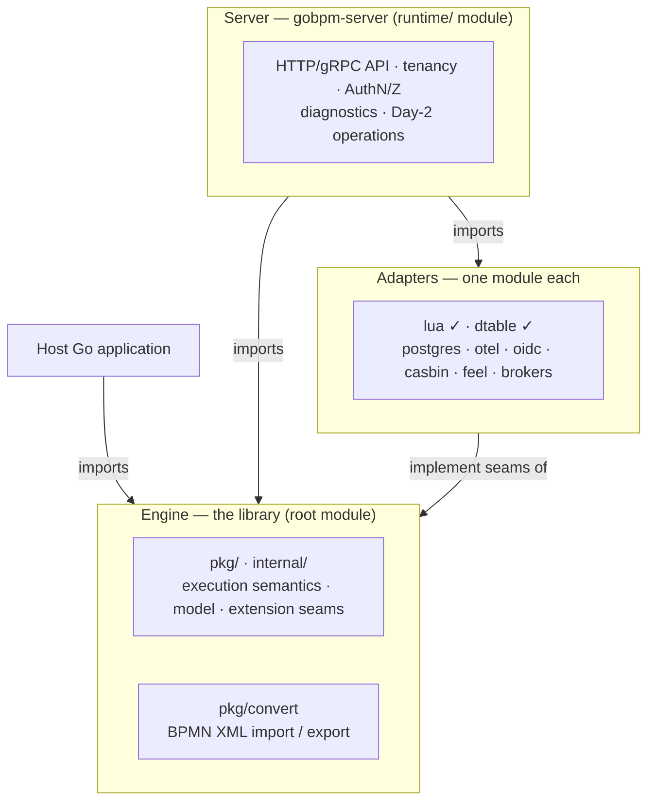

# gobpm Development Roadmap

| Property | Value |
| :---- | :---- |
| **Author** | dr-dobermann |
| **Status** | Living |
| **Version** | 4.1 |
| **Date** | 2026-08-04 |
| **Subordinate to** | [SAD-001 v.1.1 Vision & Architecture](../design/SAD-001-vision-and-architecture.md) |
| **Element ledger** | [docs/design/conformance-status.md](../design/conformance-status.md) |
| **Conformance scope** | [docs/bpmn-spec/conformance.md](../bpmn-spec/conformance.md) |

This roadmap orders the work that delivers [SAD-001 v.1.1](../design/SAD-001-vision-and-architecture.md). It is **subordinate** to the SAD and its ADRs: where they establish *what* and *why*, this orders the *when*. Anything here that looks like a new decision belongs in an ADR instead.

It replaces v3.1, which was organised as one product across six workstreams. That framing broke down for two reasons: its conformance premise was retracted two days after it was written (§2.2), and one of its six workstreams — "runtime overlay" — held an entire second product with its own users, its own module and its own obligations. v4.0 splits along that seam.

## 1. How this roadmap works

gobpm is built **specification-first**. Every non-trivial landing follows the SDD flow: a spec exists first (an **SRD** for one landing, a **FIX** for a bug) referencing its governing **ADR** up the hierarchy; the spec is agreed before implementation; implementation lands with tests and demonstrable verification; status flips and the change merges via PR.

Supporting discipline in force:

- **CI parity** — `make ci` mirrors the GitHub `check` workflow exactly. Green locally ⇒ green on CI. Every tool is version-pinned and installed by `make tools`; the Go toolchain is pinned in every `go.mod`.
- **Gates that fail** — diff-coverage on changed lines (`COVER_MIN` 95, rising), `-race` tests, `govulncheck`, mock drift, consumer smoke, and a blocking Markdown link check. All 47 examples run end-to-end and assert their own outcome.
- **Branch protection** — `master` takes changes only through a PR with a green `check`.
- **Document hierarchy** — references go up or sideways only, version-pinned. SAD ← ADR ← SRD/FIX. Only SAD and ADR carry versions; SRD and FIX are one-shot and never retro-edited.
- **Bilingual twins** — SAD/ADR get a Russian `.ru.md` twin at Accepted (EN canonical). This roadmap is a Living analytics artifact and stays EN.

## 2. Two products, one repository

### 2.1 The division

SAD-001 §2 makes two user journeys first-class, and §9.1 makes the boundary mechanical rather than aspirational:

| | **Engine (library)** | **Server (`gobpm-server`)** |
|---|---|---|
| Module | root | `runtime/` |
| User | a Go developer embedding it | an operator deploying it |
| Dependencies | stdlib + `uuid` (SAD-001 G2) | whatever it needs |
| Rule | MUST NOT carry runtime baggage | MUST NOT reimplement the engine |

The division is enforced by **import direction**, not by convention — which is why executing ADR-003's layout ([#269](https://github.com/dr-dobermann/gobpm/issues/269)) is the structural prerequisite it is: nothing in CI checks import direction today.

**The converter stays in the engine.** SAD-001 N7 justifies it: the parser is stdlib `encoding/xml`, so it costs core no dependency, and the engine never imports the converter — the invariant holds by import direction. The server consumes it.

### 2.2 What conformance means for each

gobpm targets **BPMN 2.0.2 §2.3 Process Execution Conformance**. Its two requirements have different owners:

| Requirement | Owner | State |
|---|---|---|
| **§2.3.1** execution semantics (§13) | **Engine** | Element set **complete**; every remaining divergence deliberate and registered in SAD-001 §14 |
| **§2.3.2** import of Process diagrams | **Server** | The converter covers an MVP subset; the claim is not yet sayable |

This corrects v3.1, which derived scope from the **Common Executable Subclass** and cited a non-existent "§2.1.2". The Common Executable Subclass is a Process *Modeling* sub-class mandating XML Schema, WSDL and XPath — the wrong target. Two consequences follow: `ComplexGateway` is **required**, not an extension; and `Lane`/`LaneSet` were a genuine gap, since closed as model-only carriers (SRD-076).

The honest present-tense claim is therefore:

> The library implements §13 execution semantics for the element set in `conformance.md`, with the deviations registered in SAD-001 §14.

**Not** "gobpm conforms". Conformance is a claim the *tool* makes, and it needs both halves.

A second gap sits between those sentences, and it is the engine's own: the element ledger is green on the strength of per-element review by the person who implemented each element. No gate protects it. That is what E1 exists for.

### 2.3 Sequencing: library first

**gobpm is a library first and a server later.** The engine reaches 1.0 before server work starts.

This is a scheduling decision as much as a product one. The project has one developer, and two tracks worked alternately is how both stall. The server milestones in §4 are **direction, not schedule** — they exist so engine work can be judged against where it leads, and so an item can be filed on the correct side the day it appears.

### 2.4 The adoption yardstick — replacing Camunda in production

A production Camunda user asked the question this roadmap should be able to
answer: *can gobpm take Camunda's place?* Their workload is the common shape —
business logic in **Python workers** on the external-task pattern, incidents
resolved and stalled jobs retried in **Operate**, state on **PostgreSQL**,
and the whole deployment **multitenant**.
That question is now the yardstick: when two items compete, the one that moves
this scenario wins.

| Bar | What Camunda gives them | Where it lives here |
|---|---|---|
| Durable state on PostgreSQL | RDB persistence | **E2** — [#276](https://github.com/dr-dobermann/gobpm/issues/276) `adapters/postgres` |
| Failures recorded, retried, operable | Incidents + Operate | **E2** [#80](https://github.com/dr-dobermann/gobpm/issues/80) → **S5** [#289](https://github.com/dr-dobermann/gobpm/issues/289) / [#96](https://github.com/dr-dobermann/gobpm/issues/96) + the ops console |
| Business logic in any language | External tasks / job workers | **E2** [#80](https://github.com/dr-dobermann/gobpm/issues/80) (job semantics) → **S1** external-task surface + Python reference client |
| Existing `.bpmn` files just deploy | Modeler → engine | **E4** [#284](https://github.com/dr-dobermann/gobpm/issues/284) → **S3** [#287](https://github.com/dr-dobermann/gobpm/issues/287) |
| Isolated tenants on one deployment | Multi-tenancy | **S2** [#73](https://github.com/dr-dobermann/gobpm/issues/73) — with the groundwork laid earlier: the E2 Postgres schema and every S1/S5 API shape carry `TenantID` from day one (§4.2) |
| Human tasks have an inbox | Tasklist | **S4** [#288](https://github.com/dr-dobermann/gobpm/issues/288) / [#75](https://github.com/dr-dobermann/gobpm/issues/75) |

Three things the yardstick **confirms** rather than changes: E2 is the right
core for 1.0 (every row above stands on it); the library-first sequencing
holds (nothing server-side is buildable before the engine records incidents
durably); and the engine track's content is untouched. What it *does* change
is weight on the server side: the external-task surface stops being one bullet
inside an epic, day-2 operations move ahead of tenancy and forms in the server
ladder (§4.2), and E3 → E4 becomes the stated order of early 1.x engine work,
because S5 stands on E3's intervention primitives and migration stands on E4.

## 3. Engine track

### 3.1 Where it stands

Grounded in the code, not aspiration. Baseline **v0.11.0** (2026-08-02).

**Complete.** The BPMN element set for §2.3.1 — all five gateways, every activity type, the full event catalogue (Message, Timer, Signal, Error, Terminate, Conditional, Escalation, Compensate, Link, Cancel), every sub-process shape (embedded, Call Activity, Event, Transaction, Ad-Hoc), Standard Loop and Multi-Instance in all three forms, the data elements, and the human-interaction layer including both Table 10.14 instance attributes. Per-element detail lives in [conformance-status.md](../design/conformance-status.md); this roadmap does not duplicate it.

**The layers underneath.** Two-layer execution (ADR-001 v.6) with one event-loop goroutine per instance as sole state mutator; the per-instance node graph (ADR-009 v.1); the container-scope data plane with per-execution frames (ADR-010 v.2) and structural navigable values in four kinds (ADR-011 v.7); channel-based event processing (ADR-017 v.1); thirteen extension seams, each with a bundled in-memory default — ADR-002 v.2's original nine, since joined by the rule-engine, script-engine, task-distributor and data-store seams; versioned definition registration (ADR-019 v.1); the observability taxonomy of 13 fact kinds (ADR-013 v.2); consistent-cut checkpoints with restart recovery (ADR-033 v.2) and goroutine-releasing dehydration with wake-on-trigger (ADR-007 v.2.1).

**Reach.** Every example is its own runnable module, each executed end-to-end by CI and asserting its own outcome (a gate guard now keeps that set complete). A guide tree under `docs/guides/`. Two shipped adapters — `adapters/lua`, `adapters/dtable`.

**Not there yet.**

| Gap | Consequence |
|---|---|
| **No conformance gate** | The ledger is asserted, not checked — a refactor can regress a green row silently |
| **Two role systems** | The Camunda triad and BPMN `ResourceRole` resolve separately and compose badly |
| **No listeners** | Extension is observe-only; nothing can react in-band |
| **Layout unexecuted** | ADR-003's `pkg/` catalogue and import-direction CI are not started |
| **Four documents Draft** | SAD-001 v.1.1, ADR-003 v.1, ADR-004 v.1, ADR-023 v.3 |

### 3.2 What v1.0.0 commits to

**For a library, 1.0 is an API commitment, not a feature claim.** The question is not what is built but what can still change shape. Sorted by that test:

- **Still breaking** — the ADR-003 layout migration (it relocates every public package) and the postgres adapter (the first *second* implementation of `Repository`; validating an interface routinely changes it).
- **Additive** — everything else, and safe in any 1.x minor.

1.0 therefore contains **E0 + E1 + E2** and nothing beyond:

- **E0**, because the layout migration is the last breaking change, and you cannot publish 1.0 and then relocate every import path.
- **E1**, because 1.0 promises *semantics* as much as signatures. Shipping it on a conformance claim nothing tests makes the promise least affordable to break the one never verified.
- **E2**, because a library whose restart recovery only works in memory is not usable in production, and `Repository` must be held against a real database before it is frozen.

The **core stays fully in-memory** on stdlib + `uuid` (G2); durability arrives through a separate adapter module. Both statements hold — the core is in-memory, the product is durable.

### 3.3 Milestones

| # | Milestone | Contains | Done when |
|---|---|---|---|
| **E0** | **Conception & layout stabilization** | ADR-003's `pkg/` catalogue, its 11 migration steps and depguard import rules ([#269](https://github.com/dr-dobermann/gobpm/issues/269)); SAD-001 accepted by reducing §13 to a stated non-design ([#270](https://github.com/dr-dobermann/gobpm/issues/270)); ADR-004 and ADR-023 re-accepted | No Draft document remains; CI fails on a disallowed import edge; the public package layout is final |
| **E1** | **Conformance evidence** | The element-coverage suite behind a CI target that fails ([#265](https://github.com/dr-dobermann/gobpm/issues/265)); §10.4.3 instance-attribute binding ([#263](https://github.com/dr-dobermann/gobpm/issues/263)); the process-level `ResourceRole` decision ([#264](https://github.com/dr-dobermann/gobpm/issues/264)); the directory / resource-query seam; **roles convergence**; **`timeDuration` + `timeCycle`** | A green run *is* the tracker — `conformance-status.md` becomes checked rather than asserted |
| **E2** | **Fault tolerance & durable state** | Incidents, retry, token preservation ([#80](https://github.com/dr-dobermann/gobpm/issues/80)); `adapters/postgres`; checkpoint fidelity for in-flight Call/MI/compensation; suspend/resume; the history / audit store; **event listeners**; **business key** | An engine survives a kill and resumes from a real database; a failure is recorded, retried and visible |
| → | **v1.0.0 — the public API frozen** | | E0–E2 green; the semver commitment begins |
| **E3** | **Instance lifecycle operations** *(first 1.x work — S5 stands on it, §2.4)* | Token relocation, live variable writes, cross-version token transfer — the primitives under the server's admin and migration APIs | An operator surface can be built on them with no engine change |
| **E4** | **Interchange element coverage** *(second 1.x work — migration from Camunda stands on it, §2.4)* | Import and export beyond the 7-element MVP subset; unblocks [#256](https://github.com/dr-dobermann/gobpm/issues/256) and the server's §2.3.2 | A modelled process survives XML → model → XML |
| **E5** | **Beyond 1.0** | FEEL expression adapter; codegen for native-struct adapters; whatever real use demands | — |

**Roles convergence** and **event listeners** are pre-1.0 because both change the public surface.

Convergence means the BPMN `ResourceRole` **lowers into** the triad rather than running beside it — one eligibility model, two authoring paths. Today they resolve separately, and `conformance-status.md` §3 records the symptom: *"the assignee gate still excludes roles; declaring a role closes an otherwise-open task."* A `PotentialOwner` and a `candidateGroups` entry mean the same thing and do not compose.

Listeners are categorically distinct from the ADR-013 observer stream, which is asynchronous, best-effort lossy and read-only **by design**, so that a slow observer cannot stall the engine. A listener is the opposite: synchronous, in-band, and able to fail the activity. Camunda 7's Execution and Task Listeners are the alignment target. Each of the two needs its own ADR.

## 4. Server track

### 4.1 Where it stands

`runtime/` is a `go.mod`, a `doc.go`, and a `cmd/gobpm-server/main.go` that prints "not yet implemented". ADR-004 v.1 is Draft. Nothing else exists.

That is §2.3 applied, not an oversight. The milestones below record **where work goes when it starts**, so an item surfacing during engine work is filed on the right side instead of distorting an engine milestone.

### 4.2 Milestones

| # | Milestone | Contains |
|---|---|---|
| **S0** | Server foundation | ADR-004 accepted; `runtime/` becomes real code; 7-phase startup and reverse-order graceful shutdown with drain; hierarchical YAML config; liveness/readiness |
| **S1** | Core API surface | Process registry; instance lifecycle; diagnostics (state, token positions, history); event streaming; **the external-task surface** — fetch-and-lock with lock timeouts and extension, complete / fail-with-retries / throw-BPMN-error, and a **Python reference client** proving the polyglot claim (its own epic, split from [#286](https://github.com/dr-dobermann/gobpm/issues/286) per §2.4); `adapters/otel` |
| **S2** | Identity, tenancy & authorization | `TenantID` through `context.Context` with Repository-enforced filtering ([#73](https://github.com/dr-dobermann/gobpm/issues/73)); the AuthN chain (OIDC/JWT/mTLS); `adapters/casbin`; a directory provider behind the engine's seam |
| **S3** | §2.3.2 import conformance | BPMN diagrams imported through the engine's converter; MIWG fixture selection; the point at which gobpm can state Process Execution Conformance |
| **S4** | Human interaction surface | The user-task inbox over `Take`/`Claim`/`Unclaim`/`Reassign`/`Complete`; Form Registry ([#75](https://github.com/dr-dobermann/gobpm/issues/75)) |
| **S5** | Day-2 operations | Incident resolution and the DLQ surface; migration plans, batch and dry-run ([#95](https://github.com/dr-dobermann/gobpm/issues/95)); the admin API and audit trail ([#96](https://github.com/dr-dobermann/gobpm/issues/96)); a **minimal operations console** — a web UI over the incident, diagnostics and intervention APIs, API-first and deliberately thin: the Operate workflows an operator runs daily (see the queue, retry, skip, resolve), not a modelling or analytics suite |
| **S6** | Distribution | The Distribution & Scale ADR; task-level remote execution; sticky routing with failover — when multi-node demand materialises |

The numbering is identity, not order. **The build order follows the yardstick
(§2.4): S0 → S1 → S5 → S2 → S3 → S4.** Day-2 operations come right after the
core API because resolving incidents and retrying stalled jobs is what a
production operator does *daily* — it cannot sit behind tenancy and forms.
S5 ahead of S2 also matches its dependency shape: it stands on E3's
intervention primitives, which is why E3 is the first 1.x engine work. S2
follows because the target deployment is multitenant (§2.4), and then S3,
because migrating existing `.bpmn` files needs import before more surface
area helps.

**Tenancy is scoped early and enforced later.** Multi-tenancy is the one
capability that cannot be retrofitted cheaply: bolting a tenant onto a
tenant-blind API breaks every endpoint shape, and onto a tenant-blind schema,
every table. So the *groundwork* does not wait for S2 — the E2 Postgres
schema carries `TenantID` from its first migration, and every S1/S5 API and
the external-task fetch are tenant-scoped from day one, running against a
single default tenant until S2 delivers identity, isolation enforcement and
per-tenant authorization.

`Reassign` is deliberately unauthorized at the engine (ADR-020 v.3 §2.5.2), so S4 owns deciding who may invoke it and recording who did.

## 5. Adapters — the shared tier

Each adapter is its own module implementing an engine seam, scheduled when its first consumer materialises, and declaring cluster compatibility via `ClusterAware`.

| Adapter | Seam | Scheduled |
|---|---|---|
| `lua` ✓ | Script engine | Shipped (ADR-031 v.1) |
| `dtable` ✓ | Rule engine | Shipped (ADR-029 v.1) |
| `postgres` | Repository | **E2** — a production *embedded* user needs durable state with no server involved |
| `otel` | Tracer + MetricsRecorder | S1 |
| `oidc` / `jwt` / `mtls`, `casbin` | AuthN, AuthorizationProvider | S2 |
| `feel` | Expression engine — plugs into ADR-032's language registry beside the built-ins | E5 |
| `redis` / `nats` | MessageBroker | On demand |

`adapters/sqlite/` is an empty reservation; it becomes a Repository adapter or is removed.

## 6. Issue ↔ milestone map

The alignment artifact. **Every open issue carries an `engine` or `server` label and exactly one milestone** — no issue sits outside this table, and the tracker can be read as a filtered view of it.

| Milestone | Issues |
|---|---|
| **E0** | [#269](https://github.com/dr-dobermann/gobpm/issues/269) ADR-003 layout · [#270](https://github.com/dr-dobermann/gobpm/issues/270) accept SAD-001 · [#272](https://github.com/dr-dobermann/gobpm/issues/272) re-accept ADR-004 + ADR-023 |
| **E1** | [#265](https://github.com/dr-dobermann/gobpm/issues/265) conformance suite · [#263](https://github.com/dr-dobermann/gobpm/issues/263) instance-attribute binding · [#264](https://github.com/dr-dobermann/gobpm/issues/264) process-level roles · [#273](https://github.com/dr-dobermann/gobpm/issues/273) directory seam · [#274](https://github.com/dr-dobermann/gobpm/issues/274) roles convergence · [#275](https://github.com/dr-dobermann/gobpm/issues/275) timer duration/cycle 🐛 |
| **E2** | [#80](https://github.com/dr-dobermann/gobpm/issues/80) incidents + retry · [#276](https://github.com/dr-dobermann/gobpm/issues/276) `adapters/postgres` · [#277](https://github.com/dr-dobermann/gobpm/issues/277) checkpoint fidelity · [#278](https://github.com/dr-dobermann/gobpm/issues/278) suspend/resume · [#279](https://github.com/dr-dobermann/gobpm/issues/279) listeners · [#280](https://github.com/dr-dobermann/gobpm/issues/280) business key · [#281](https://github.com/dr-dobermann/gobpm/issues/281) history store · [#298](https://github.com/dr-dobermann/gobpm/issues/298) incident wait-holder integration |
| **E3** | [#282](https://github.com/dr-dobermann/gobpm/issues/282) intervention primitives · [#283](https://github.com/dr-dobermann/gobpm/issues/283) cross-version token transfer |
| **E4** | [#284](https://github.com/dr-dobermann/gobpm/issues/284) converter coverage · [#256](https://github.com/dr-dobermann/gobpm/issues/256) generated diagrams |
| **E5** | [#295](https://github.com/dr-dobermann/gobpm/issues/295) data markers/tags on declared data |
| **S0** | [#285](https://github.com/dr-dobermann/gobpm/issues/285) server foundation |
| **S1** | [#286](https://github.com/dr-dobermann/gobpm/issues/286) registry, lifecycle, diagnostics · [#292](https://github.com/dr-dobermann/gobpm/issues/292) external-task surface + Python client |
| **S2** | [#73](https://github.com/dr-dobermann/gobpm/issues/73) tenancy & IAM |
| **S3** | [#287](https://github.com/dr-dobermann/gobpm/issues/287) §2.3.2 import conformance |
| **S4** | [#288](https://github.com/dr-dobermann/gobpm/issues/288) task inbox API · [#75](https://github.com/dr-dobermann/gobpm/issues/75) Form Registry |
| **S5** | [#289](https://github.com/dr-dobermann/gobpm/issues/289) incident resolution + DLQ · [#95](https://github.com/dr-dobermann/gobpm/issues/95) migration API · [#96](https://github.com/dr-dobermann/gobpm/issues/96) administration API · [#293](https://github.com/dr-dobermann/gobpm/issues/293) minimal operations console |
| **S6** | — when multi-node demand materialises |

Three former epics straddled the division and were split, engine half from server half: fault tolerance ([#80](https://github.com/dr-dobermann/gobpm/issues/80) / [#289](https://github.com/dr-dobermann/gobpm/issues/289)), migration ([#283](https://github.com/dr-dobermann/gobpm/issues/283) / [#95](https://github.com/dr-dobermann/gobpm/issues/95)), administration ([#282](https://github.com/dr-dobermann/gobpm/issues/282) / [#96](https://github.com/dr-dobermann/gobpm/issues/96)). The engine half is the semantics; the server half is the operator surface.

**E5 and S6 fill only when work becomes concrete** — filing speculative
issues against them would recreate the problem the released ADR-008 number
caused, work named before it was designed. S6 is still empty;
[#295](https://github.com/dr-dobermann/gobpm/issues/295) entered E5 concrete:
the incident work's data-snapshot discussion produced it, with its trigger
(operator feedback + the E3 editability gate) named in the issue.

## 7. Reading v3.x

v3.1's workstreams and milestones map forward as follows. The GitHub "Phase 0–5" milestones predate even v3.0 and are closed.

| v3.x | v4.0 |
|---|---|
| WS-A conception | E0 |
| WS-B1 extension architecture | done (ADR-002 v.2) |
| WS-B2 module layout | E0 |
| WS-B3 persistence | partly done; the remainder is E2 |
| WS-C element completion | done — the ledger is `conformance-status.md` |
| WS-D runtime overlay | the entire **server track**, S0–S5 |
| WS-E adapters | §5 |
| WS-F distribution | S6 |
| M0–M4 | superseded; M4's "full conformance ✅" was an overclaim (§2.2) |
| M5 standalone runtime | S0–S5 |
| M6 distribution | S6 |

v3.1's §2.3 document-status inventory is **deleted**, not migrated. It was a 6,000-character paragraph already labelled a stale snapshot; every document carries its own `Status`/`Version` header, and [conformance-status.md](../design/conformance-status.md) carries element coverage.

## 8. References

- [SAD-001 v.1.1 Vision & Architecture](../design/SAD-001-vision-and-architecture.md) — the architecture this roadmap delivers; §2 two journeys, §9.1 import rules, §14 registered deviations.
- [docs/design/conformance-status.md](../design/conformance-status.md) — the authoritative per-element tracker.
- [docs/bpmn-spec/conformance.md](../bpmn-spec/conformance.md) — the in/out-of-scope element list.
- [ADR-002 v.2 Extension Architecture](../design/ADR-002-extension-architecture.md) · [ADR-003 v.1 Module Layout](../design/ADR-003-module-layout.md) · [ADR-004 v.1 Runtime Environment Contract](../design/ADR-004-runtime-environment-contract.md) — the seams, their placement, and the server contract.
- [docs/backlog.md](../backlog.md) — the short-term working list. Long-term and blocked work lives in GitHub issues.

## Changes

### 2026-08-04

- **v4.1 — the adoption yardstick.** A production Camunda user's question —
  *can gobpm take Camunda's place?* — became the prioritization test (§2.4):
  Python workers on the external-task pattern, incidents resolved in an
  Operate-like surface, PostgreSQL persistence, a multitenant deployment.
  The yardstick **confirms** E2 as 1.0's core and the library-first
  sequencing; what it changes is server-side weight. The **external-task
  surface** left #286 for its own epic
  ([#292](https://github.com/dr-dobermann/gobpm/issues/292)) with a **Python
  reference client** — the project's first non-Go artifact; S5 gained a
  **minimal operations console**
  ([#293](https://github.com/dr-dobermann/gobpm/issues/293)); the server
  build order is now stated as **S0 → S1 → S5 → S2 → S3 → S4** (§4.2), with
  day-2 operations ahead of tenancy and forms; **tenancy is scoped early and
  enforced later** — `TenantID` in the E2 Postgres schema and every S1/S5
  API from day one, enforcement in S2; and **E3 → E4** is the stated order
  of early 1.x engine work, since S5 stands on E3 and migration on E4.

### 2026-08-03

- **v4.0 — split into engine and server tracks.** Reorganised around the two
  products SAD-001 §2 always described but the plan never separated: the
  **engine** (root module, §2.3.1 execution semantics) and the **server**
  (`runtime/`, §2.3.2 import). WS-A…F and M0–M6 are retired in favour of
  **E0–E5** and **S0–S6**, matched one-to-one by GitHub milestones, with an
  issue↔milestone map (§6) as the alignment artifact. **Library first**: the
  engine reaches 1.0 before server work starts (§2.3). **v1.0.0 is redefined as
  an API commitment** rather than a feature claim — E0 + E1 + E2, then freeze
  (§3.2) — with durability arriving through an adapter while the core stays
  in-memory.
  Corrections carried in: the **Common Executable Subclass** premise and the
  phantom "§2.1.2" citation are replaced by §2.3 with its two owners; M4's
  "full conformance ✅" is retracted as an overclaim; the Ad-Hoc
  "remaining gap" contradiction is gone (it landed in v0.10.0); ADR-003 has
  **11** migration steps, not 12; the §2.3 status inventory is deleted rather
  than annotated; and the reserved **ADR-008** number is released, so
  Distribution & Scale is now referred to by topic.
- **Tracker aligned.** Of the twenty items §6 first listed as unfiled, eighteen
  are now filed
  ([#272](https://github.com/dr-dobermann/gobpm/issues/272)…[#289](https://github.com/dr-dobermann/gobpm/issues/289));
  the AuthN chain folded into [#73](https://github.com/dr-dobermann/gobpm/issues/73)
  rather than standing alone, and distribution stayed unfiled because S6 has no
  trigger yet. The server milestones S0–S6 exist, and the four server epics
  predating this reorganisation ([#73](https://github.com/dr-dobermann/gobpm/issues/73),
  [#75](https://github.com/dr-dobermann/gobpm/issues/75),
  [#95](https://github.com/dr-dobermann/gobpm/issues/95),
  [#96](https://github.com/dr-dobermann/gobpm/issues/96)) are re-filed and
  re-scoped. Every open issue now carries a track label and exactly one
  milestone, so §6 describes the tracker completely rather than partially.

### 2026-07-30

- **v3.1 — current-state refresh (§2) and the element-tracker split.** §2.1 gained
  BPMN element completion, the Persistence & State slices, and engineering
  hygiene; §2.2 stopped duplicating the element ledger, naming
  `conformance-status.md` authoritative; §2.3's inventory was re-framed as a
  dated historical snapshot.

### 2026-07-20

- Link events landed (SRD-057); the structural-data workstream marked complete
  through the map kind (SRD-047).

### 2026-06-06

- **v3.0 — full rework.** Re-framed from BPMN-element phases to
  dependency-ordered workstreams crossed with capability milestones M0–M6.
  Added a grounded current-state baseline and explicit sequencing principles.

### 2026-05-29

- v2.0: aligned with SAD-001; §1.1 expanded with Security/Observability
  extension categories; Phase 0 reframed (IAM/multitenancy as a runtime
  concern).

### 2026-03-29

- v1.05: translated to English; stages synchronised with the architectural GAP
  analysis. Added Script Task, Event Sub-Process, Complex Gateway.
