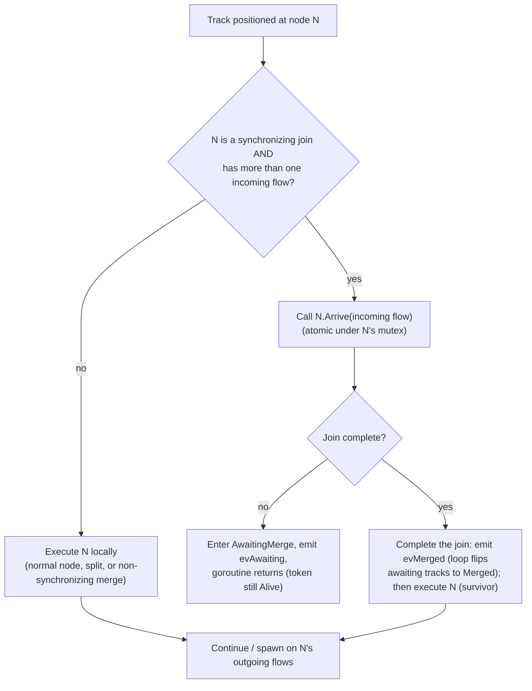
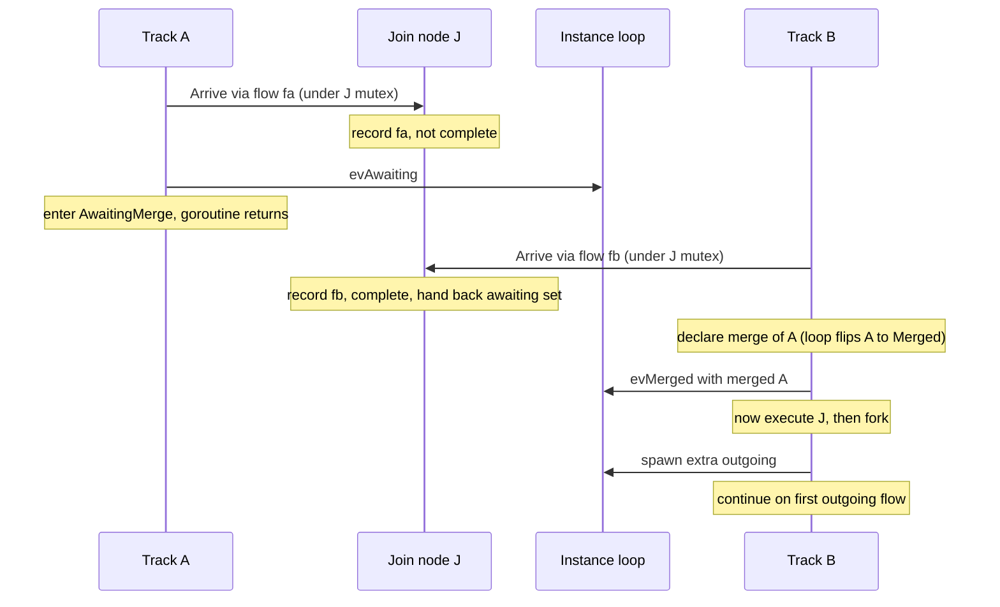
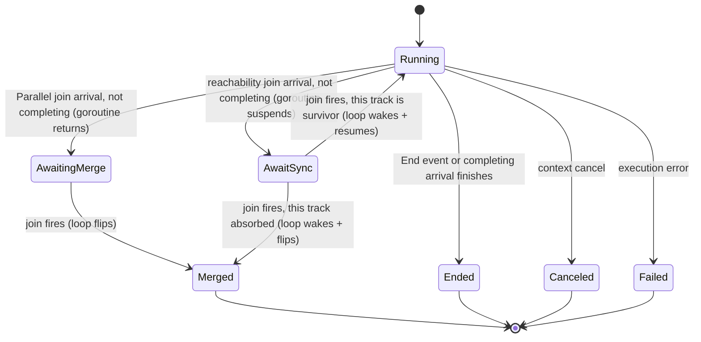
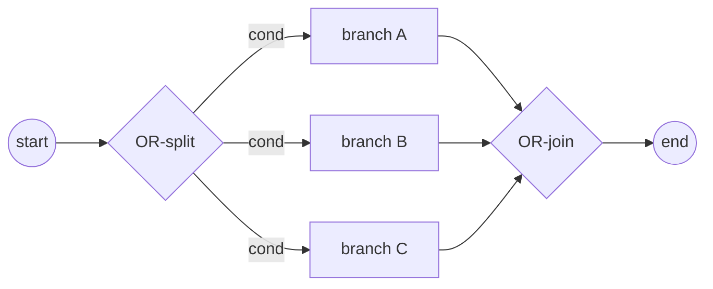
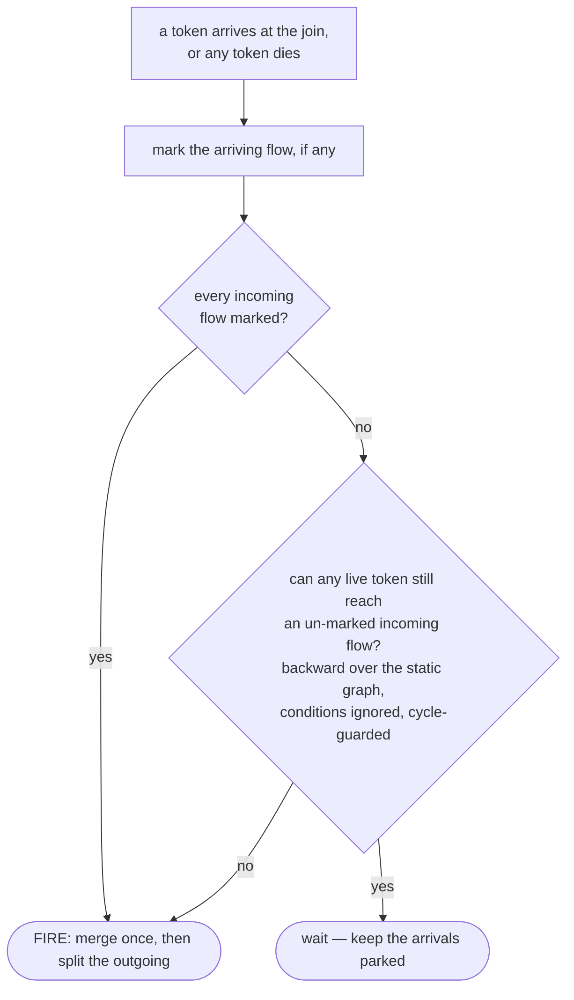
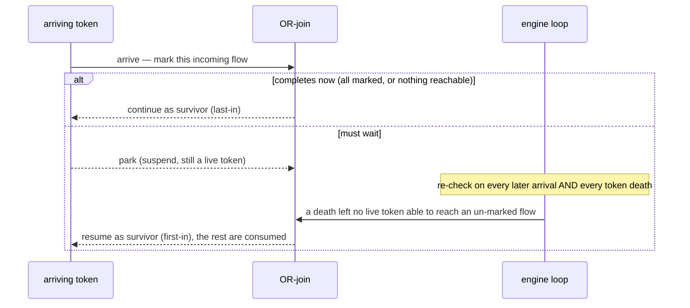
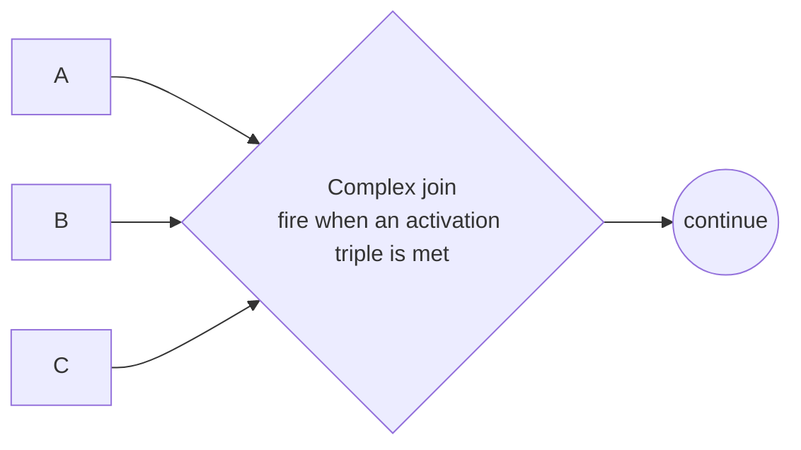
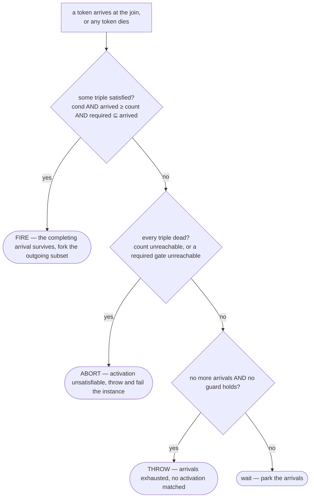

# ADR-005 — Gateways & Joins

| Field   | Value                                                     |
| ------- | --------------------------------------------------------- |
| Status  | Draft (v.3 amendment; v.2 Accepted + implemented)         |
| Version | v.3                                                       |
| Date    | 2026-06-09                                                |
| Owner   | Ruslan Gabitov                                            |
| Refines | [ADR-001 v.5 Execution Model](ADR-001-execution-model.md) |

> **Scope.** This ADR decides the **routing gateways** and the track-coordination
> model they share: **Parallel** (split §2.2 + synchronizing join §2.3–§2.4),
> **Exclusive** (split §2.8; its merge is the non-synchronizing pass-through §2.3),
> and **Inclusive** (split §2.9 + synchronizing **OR-join** §2.10), and **Complex**
> (split §2.9 + an **activation-driven synchronizing join** §2.11). **Event-Based** is
> deferred (§4). The OR-join pins a **conservative, two-tier,
> re-evaluated-on-token-death** realization of the standard's synchronizing merge
> (§2.10); the Complex join reuses that machinery with an activation-rule completion
> (§2.11).
>
> **Implementation status.** Parallel, the Exclusive and Inclusive splits, and the
> Inclusive **OR-join** (§2.10) — including its backward-reachability completion and
> death-trigger re-evaluation — are all implemented (with the accompanying SRDs). The
> **Complex** gateway (§2.11) is conception-ahead — its activation-driven synchronizing
> join lands with the accompanying SRD.

## 1. Context

BPMN routes the flow of control through **gateways**. A diverging gateway forks
token flow onto multiple outgoing paths; a converging gateway merges or
synchronizes incoming paths. The standard ([§13.4](../bpmn-spec/semantics/gateways.md))
defines distinct gateway types — Exclusive, Parallel, Inclusive, Complex,
Event-Based — each with its own fork-activation and join-synchronization rule.

[ADR-001](ADR-001-execution-model.md) established the engine's execution model:
an Instance owns one or more **tracks** (each a thread of execution carrying a
flow position); the **token** is a logical projection of a track's position; a
fork creates a track per additional branch (the arriving track continuing on
one); and **all instance-scoped lifecycle state is mutated by a single
event-loop goroutine** — tracks report progress as events and never mutate that
state directly. ADR-001 deliberately left two gateway concerns to this ADR:
which outgoing flows a fork activates (by gateway type), and what happens at a
converging node (join/merge).

This ADR decides both **for the Parallel gateway**, and in doing so fixes how
**synchronization** is owned in the two-layer model — which has a consequence for
the node-execution contract (§2.5).

## 2. Decision

### 2.1 Gateway behaviour is per type; the standard's object model is fixed

Each BPMN gateway type carries its own routing rule, so the engine realises each
type as its own node behaviour rather than a central switch over a type tag. A
gateway's direction (converging / diverging / mixed) and its sequence flows come
from the standard's gateway object model, which is the fixed ground truth; the
engine implements the standard's taxonomy, it does not invent one.

### 2.2 Parallel split — activate all outgoing

A diverging Parallel gateway produces one token on **every** outgoing sequence
flow, unconditionally (§13.4.1): no condition evaluation, no default flow, and it
cannot fail. In the two-layer model this is the ordinary fork — the arriving
track continues on one activated flow and each remaining activated flow becomes a
new track. (Its counterpart, the **Exclusive split** — exactly *one* outgoing
flow chosen by condition — is §2.8.)

### 2.3 Join — synchronizing vs non-synchronizing

A converging node (more than one incoming flow) either synchronizes or it does
not, decided **by gateway type**:

- **Non-synchronizing** — an Exclusive merge, or an activity's uncontrolled merge
  (which BPMN treats as an implicit Exclusive): each arriving token passes
  straight through and continues independently. No waiting, no consumption.
- **Synchronizing** — Parallel (and later Inclusive): the gateway waits for the
  expected set of incoming tokens, then consumes them and emits its outgoing
  token(s).

For the **Parallel join** the expected set is **one token on each incoming flow**
(§13.4.1): it fires only when every incoming flow has delivered a token, and
consumes exactly one token per flow (excess tokens on a flow are not consumed).

### 2.4 Synchronization is owned by the synchronizing node

A synchronizing gateway owns its synchronization **completely**: its per-instance
**arrival state** (which incoming flows have delivered a token — node-owned state
per [ADR-009 v.1](ADR-009-per-instance-node-graph.md)), its **completion rule**
(Parallel: every incoming flow has arrived; Inclusive, later: the reachable
subset), and the **serialization** that makes concurrent arrivals safe (a
**per-node mutex**). The track does what the node tells it; it does **not** ask
the loop to decide. The loop keeps only **lifecycle bookkeeping** — the track
registry and the awaiting/ended accounting — it no longer decides synchronization.
(This is the whole synchronization concern on the node; there is no
mechanism-on-the-loop / rule-on-the-node split — the only per-type variation is
the completion rule each synchronizing gateway implements.)

Two tracks can reach the join **concurrently** (separate goroutines), so the
node's arrival step is **atomic under its own mutex**: record the arriving flow,
test the completion rule, and — when complete — yield the awaiting tracks, all in
one critical section.

- **A non-completing arrival ends the track's goroutine.** The track enters the
  intermediate state **`AwaitingMerge`** and its **goroutine returns** — it is
  *not* suspended and cannot be resumed; the track object is **retained** as a
  record (`evAwaiting` tells the instance to keep it as *awaiting* — neither active
  nor ended). It is **not** marked `Merged` yet: until the join fires, which
  arrival is the survivor is unknown.
- **The completing arrival is the survivor.** Under the node mutex it has
  collected the awaiting tracks' ids. It **first completes the join** — declaring
  the merge (`evMerged`) so the loop flips each awaiting track to **`Merged`** (its
  token becomes `Consumed`) — **before** the node runs (§2.5: synchronization
  settles before execution). It **then** executes the join node and
  continues/forks on the outgoing flows.

No new track is created at a join — the continuation **rides the completing
arrival** (ADR-001's 1:1 track:position discipline holds). Which arriving track
survives is simply whichever token completes the set; BPMN requires only one
token out per outgoing flow.

**Convergence is not a parent edge.** A token reaching a join has *many*
predecessors (every branch that converged), but a token records a **single**
parent (its fork origin). The merge therefore does **not** re-parent the survivor
or fold the absorbed tracks into its lineage — doing so would make the survivor
claim a track it spawned as its own parent, a cycle that breaks history
reconstruction. Convergence is instead represented by each absorbed track's own
terminal (`Consumed`) entry at the join node; the survivor keeps its creation
lineage intact.

**Race-safety.** Only the survivor ever executes the join node, so no two tracks
run its `Exec` at once. The arrival state is node-local under the node's mutex and
per-instance ([ADR-009 v.1](ADR-009-per-instance-node-graph.md)) — never raced
across tracks or instances. (The cross-instance shared-node race an earlier draft
deferred to a future Persistence ADR is already resolved by ADR-009.)

The concrete protocol — the events a track sends the loop, how a track decides
what to do at a node, and the state/rendezvous diagrams — is §2.7.

### 2.5 Node-execution contract — a single Execute

A node's responsibility is to **execute**: produce its outgoing tokens (a
gateway's routing) or perform its activity. Synchronization (§2.4) is a separate
concern the synchronizing node settles **before** it executes — via its `Arrive`
step, not through pre-/post-execution hooks — so the node-execution contract
collapses to a **single Execute step**. The earlier
pre-/post-execution hooks (a node "prologue" and "epilogue") existed when nodes
drove flow control; under track coordination they are redundant and are
**removed**. The concerns they were used for move to the layer that owns them:

- A catch/receive node's **subscription** to a message/signal is owned by the
  event & subscription machinery (ADR-006), which suspends and later resumes the
  track; the node's Execute consumes the delivered event. It is not a node
  prologue/epilogue.
- A human task's **registration** for interaction is part of executing that task
  (its Execute registers, then awaits the outcome), not a separate hook.

Where this contradicts the current node interface, the implementation removes the
hooks and relocates their logic — the concept leads, the code follows.

### 2.6 Token consumption stays narrow

Tokens are consumed only at End Events and Terminate, as the absorbed tokens of a
synchronizing join (§2.4), and on withdrawal. A non-synchronizing merge never
consumes tokens.

### 2.7 Track ↔ Instance coordination (mechanics)

A track runs autonomously in its own goroutine, advancing node by node. At each
node it asks the node what to do; only a **synchronizing join** changes the
track's course. The Instance's single event-loop goroutine owns **lifecycle
bookkeeping** — the track registry and the awaiting/ended accounting; it is told
about lifecycle changes through events but does **not** decide synchronization.
Events flow track → loop — notifications; the loop never blocks waiting for a
reply. The one twist is a **parked** track: it suspends *itself* right after
notifying and waits for the loop's later resume signal (§2.10 / §2.11).

| Event (track → loop) | Raised when                                                                                 | Loop does                                                                           |
| -------------------- | ------------------------------------------------------------------------------------------- | ----------------------------------------------------------------------------------- |
| **spawn**            | a fork activated extra outgoing flows                                                       | creates + registers one track per extra flow                                        |
| **awaiting**         | a **Parallel** join arrival did not complete it, and the track's **goroutine returned**       | records the track as *awaiting* — neither active nor ended; the track object is kept |
| **parked**           | a **reachability** join arrival (OR §2.10 / Complex §2.11) did not complete it, and the track **suspended its goroutine** on a resume channel | records the track as *awaiting-sync*; its goroutine stays alive (still counted) until the loop **wakes** it — resume as survivor, or consume as merged |
| **merged**           | the completing track declares the absorbed tracks (by id)                                   | the loop resolves the ids and flips each to `Merged`, removing them from *awaiting* |
| **ended**            | the track terminated (end event, canceled, failed)                                          | deregisters it; when none remain active or awaiting, completes the instance         |

**What drives each event — uniform structural rules, not the node.** A track does
**not** ask the node "what event should I fire". It derives events from structure,
and only **one** question is node-specific:

- **Fork** is driven by how many flows `Exec` returns. For **any** node the track
  continues on one activated flow and emits `spawn` for the rest. The node
  controls only the *count* (Exclusive returns one → no fork; Parallel and an
  uncontrolled activity-split return all → fork). A Task with multiple outgoing
  forks exactly like a Parallel split — there is no node-type-specific fork logic.
- **Merge** is **only** a synchronizing-join concern. A non-synchronizing merge —
  a Task, an intermediate event, or an Exclusive gateway reached by more than one
  incoming flow — is **pass-through**: each arriving token executes the node
  independently and continues, with **no event and no consumption** (BPMN's
  uncontrolled merge = implicit Exclusive).

**How a track decides what to do at a node.** At node N the track asks the single
node-specific question: does N implement `SynchronizingJoin` **and** have more
than one incoming flow? If not, it executes N locally (a normal node, a split, or
a non-synchronizing merge). If so, it calls **`N.Arrive(its incoming flow)`** —
atomic under N's mutex (§2.4) — which returns one of exactly two answers: *stop
and wait* → park (a **Parallel** join enters `AwaitingMerge` and the goroutine
**returns**; a **reachability** join — OR §2.10 / Complex §2.11 — enters
`AwaitSync` and the goroutine **suspends** on a resume channel); *execute* →
proceed as the survivor.

**Synchronizing-join rendezvous** — two branches converge on join `J`; the
*completing* (second) arrival survives, the first is absorbed:

Which branch arrives first is immaterial — J's mutex serializes the arrivals, so
whichever token *completes* the set is the survivor.

**Track lifecycle** — `AwaitingMerge` (Parallel) is intermediate: the goroutine
has already returned; the track object is retained as a record until the join
fires. A **reachability** join (OR/Complex) instead uses `AwaitSync`: the
goroutine is **suspended, not returned**, and the loop **resumes** it when the
join fires (§2.10 / §2.11):

J's mutex makes arrival atomic, so exactly one arrival per join completes the set
and becomes the survivor; the rest enter `AwaitingMerge` (Parallel — their
goroutines have returned) or `AwaitSync` (reachability joins — their goroutines
are suspended) and are flipped to `Merged` when it fires. No track is created at a join; the continuation rides the
completing arrival (§2.4).

**Forking on the outgoing flows** (unchanged from ADR-001 §4.4). After a node's
`Exec` returns the activated outgoing flows, the track **continues on one itself**
— preferring a flow that loops back to the same node (a cyclic/self flow) if one
exists, otherwise the first — and emits **spawn** for the remaining flows, one new
track each. Parallel split feeds this with **all** outgoing flows (§2.2); the
mechanic is otherwise the same as any fork.

**Mixed gateway (N incoming *and* M outgoing).** BPMN permits one Parallel
gateway to both converge and diverge. This needs **no special machinery** — it is
the join half followed by the fork half on the **one surviving track**: the
completing arrival joins (emits `evMerged`), executes the node (`Exec` returns all
M outgoing), then forks (continues on one, emits `spawn` for the rest). So the
instance receives **`evMerged` then `spawn`** consecutively from the same
goroutine; the loop applies them FIFO (merge bookkeeping, then track creation).
The survivor stays **active across both events** — it never ends between them — so
the instance cannot prematurely complete; net, N tokens are consumed and M
produced (N−1 merged + survivor → survivor + M−1 spawned).

### 2.8 Exclusive split — data-based exclusive choice (first matching condition)

A diverging **Exclusive** gateway routes the arriving token to **exactly
one** outgoing flow — the data-based exclusive choice (§13.4.2, Table 13.2):

- The outgoing flows carry **condition expressions**, evaluated **in declared
  order**. The **first** condition that evaluates `true` selects that flow, and
  **no further conditions are evaluated** (short-circuit).
- If **no** condition is `true`, the token takes the **default** flow (the
  gateway's `default` attribute, §13.4.2).
- If no condition is `true` **and** there is no default flow, the gateway **fails
  the instance** with an exception (§13.4.2) — an unroutable token is a modelling
  error, never a silent drop.
- **Order is significant**: model authors express branch priority through the
  ordering of the gateway's outgoing flows (§13.4.2 engine note).

This is the per-type split rule §2.1 anticipates and the counterpart of the
Parallel split (§2.2): where Parallel returns **all** outgoing flows, Exclusive
returns **exactly one**. It therefore feeds the §2.7 fork mechanic with a single
flow — the surviving track continues on it and emits **no `spawn`** (no fork).
The Exclusive **merge** needs nothing new: it is the non-synchronizing
pass-through already decided in §2.3/§2.7 — each incoming token fires the gateway
independently, with no waiting and no consumption (BPMN's uncontrolled merge =
implicit Exclusive). So a *mixed* Exclusive gateway (N incoming, M outgoing) is
simply pass-through-per-arrival followed by the choose-one split, with no
synchronization.

The conditions are the standard's `FormalExpression` on the sequence flow,
evaluated against the instance's data. The **evaluation mechanics** — which
expression engine runs them, the data scope they read, how an evaluation error is
surfaced, and how a conditionless non-default flow is treated — are the
accompanying SRD's to pin (code-grounded); this ADR fixes only the **selection
rule** above, standard-grounded.

### 2.9 Inclusive split — fork every matching condition

A diverging **Inclusive** gateway routes the token to **every** outgoing
flow whose condition is `true` — one or more branches (§13.4.3, Table 13.3):

- All outgoing conditions are evaluated (no ordering guarantee); a token is
  produced on **each** flow whose condition is `true`.
- If **no** condition is `true`, the token takes the **default** flow.
- If no condition is `true` and there is no default, the gateway **fails the
  instance** (§13.4.3).

It is the §2.1 per-type split that sits between Parallel (all flows,
unconditional — §2.2) and Exclusive (exactly one — §2.8): Inclusive returns the
**conditionally-true subset** (≥1). Once the subset is chosen it feeds the §2.7
fork mechanic unchanged — the surviving track continues on one, `spawn` for the
rest. Evaluation mechanics are the SRD's (as §2.8).

### 2.10 Inclusive (OR) join — the synchronizing merge

The converging Inclusive gateway is the **synchronizing merge** (WCP-7):
it waits for every token that *could still* arrive, then fires once. It is a
synchronizing join (§2.3/§2.4) with a **non-local completion rule** — the only
gateway whose firing decision inspects token distribution across the whole
instance, not just its own incoming flows.

**Normative rule (§13.4.3, Table 13.3).** The join activates if and only if at least one
incoming flow has a token **and**, for every directed path (not visiting the join)
from a token-bearing flow to an *empty* incoming flow of the join, there is *also*
a path from that token to an already-*marked* incoming flow. On firing it consumes
one token per marked incoming flow, evaluates all outgoing conditions and forks
the true subset (default/exception per §2.9) — a §2.10 join immediately followed
by a §2.9 split on the survivor.

The diamond, and the decision the join makes on every arrival and every death:

**Engine realization (gobpm choice — conservative, two-tier, re-evaluated on token
death).** The spec's refinement clause is rarely material; gobpm realizes the
practical, conservative form Camunda 7 proves out (internal analysis: *Camunda 7 —
Inclusive Gateway join*), with one deliberate improvement over it:

- **Two-tier activation.** *Fast path* — a token has arrived on **every** incoming
  flow → fire, no analysis. *Slow path* — a **reachability** test over the static
  per-instance node graph (ADR-009): if **no** active track can still reach an
  un-marked incoming flow of the join, fire; otherwise wait. Concretely it walks
  **backward** from each un-marked incoming flow toward the start — that flow is
  still reachable if a live token sits anywhere on its backward closure (the walk
  short-circuits on the first one and never crosses the join). The walk is
  **cycle-guarded** (a visited-set, so cyclic models can't hang the decision) and
  **ignores flow conditions** (a token's future condition outcomes are unknowable
  at decision time, so it is treated as able to traverse any structural path). This
  is the conservative *single*-reachability-per-track form — it errs only toward
  **waiting longer** — not the spec's two-path refinement clause.
- **Re-evaluated on token death, not only on arrival.** The completion rule is
  re-checked both when a token **arrives** at the join **and** when any track
  **dies** (ends / is canceled / is merged elsewhere) — a death can remove the last
  token that could still reach an un-marked flow. This **fixes the worst Camunda 7
  failure mode**, where the join is checked *only* on arrival, so an interrupted
  awaited branch hangs the join **forever**. gobpm's single event-loop already
  observes every track's lifecycle, so re-evaluating each awaiting OR-join on a
  track death is a strict improvement the two-layer model makes natural.
- **Per-incoming-flow marking** (not a per-gateway token count), so the rule stays
  correct once loops re-arm a join (the re-arming itself is deferred, §4).
- **Ownership stays §2.4.** The join owns its arrival state under its **per-node
  mutex**; arrivals are atomic. The only widening is that its completion rule reads
  the instance's **active-track positions** (supplied by the loop) — the node still
  owns the *decision*, it just consults a wider marking than Parallel's local count.

**Park-and-resume.** This is the one capability a plain (Parallel) join does not
need. A Parallel arrival either completes the join (and continues) or ends; nothing
waits to be woken. An OR-join can complete with **no further arrival** (the death
case), so a token that arrives but cannot yet complete the join must **park** — it
suspends in place, still counted as a live token holding its position, neither
ended nor absorbed — until the engine's re-check settles its fate. The engine
re-checks an awaiting join on **two triggers**: every later **arrival** at it, and
every **token death** anywhere. When the check completes the join the engine wakes
the parked tokens: one **resumes** as the survivor, the rest are **consumed**
(merged). A token already **in transit onto** the join (on an incoming flow but not
yet registered) is an imminent arrival and **defers** firing until it registers —
so a sibling about to mark a flow is never raced into a premature fire.

**Firing & the survivor.** An **arrival** that completes the join is the
**survivor** — the completing arrival (**last-in**) continues straight on, consumes
the marked tokens, then executes and forks the outgoing subset (§2.9), exactly like
Parallel. A **death-triggered** firing has no arrival to ride, so the engine
**promotes the earliest-arrived parked token** (**first-in**) as the survivor and
resumes it; the rest are consumed. (Which parked token survives is immaterial to
the result — one token leaves the join either way — so it falls out of the
mechanism: last-in on an arrival, first-in on a death. Parallel never fires from
the loop; the OR-join's death-trigger is the one place the engine does.)

**Scope.** Acyclic, single-pass (§4): each incoming flow is marked once; loop
re-arming is deferred. The Complex gateway reuses this reachability test (§2.11).

### 2.11 Complex gateway — activation-driven synchronizing join (discriminator / partial join)

The Complex gateway is the general synchronizing gateway: it fires on its **own,
gateway-level condition**, not only on flow conditions. It is the one gateway in
gobpm's scope that sits **above** the Common Executable Subclass (conformance
§2.1.3) — an explicit extension included for the patterns the others cannot express:
**Structured / Blocking Discriminator** (WCP-9 / WCP-28) and **Structured / Blocking
Partial Join** (WCP-30 / WCP-31).

**Normative model (§13.4.5).** Each incoming gate carries an `activationCount` (tokens
on that flow); the gateway has an `activationExpression` — a Boolean over those counts
(e.g. `x1 + … + xm ≥ 3`), optionally over process data — and runs a **two-phase**
machine: *waitingForStart* (when the expression turns true, consume the arrived
tokens, evaluate outgoing conditions, emit the true subset / default) →
*waitingForReset* (wait for the trailing tokens — with the **Inclusive graph-reachability**
cutoff for ones that can no longer arrive — then re-arm). Diverging, it behaves as the
Inclusive split.

**Engine realization (gobpm choice — activation as guarded count-thresholds).**

- **Diverging** Complex = the Inclusive split (§2.9): fork the conditionally-true
  outgoing subset (default / exception as §2.8).
- **Converging** Complex = a **synchronizing join driven by an activation rule** — a
  disjunction of **triples** `(condition, count, requiredFlows)`:
  - **`condition`** — an optional data guard: an ordinary flow-style expression over
    **process data** (absent = always true);
  - **`count`** — how many incoming flows must have arrived (the total);
  - **`requiredFlows`** — an optional set of incoming flows that must be **among** the
    arrived.

  The gateway **fires when some triple is satisfied**: its `condition` holds, `arrived
  ≥ count`, and every `requiredFlows` gate has arrived. The bare threshold "N of M" is
  the degenerate triple `(—, N, ∅)` — **N = 1** the Discriminator, **1 < N < M** the
  Partial Join, **N = M** the Parallel join; a guard makes the threshold
  data-dependent; `requiredFlows` pins specific gates ("the CFO branch must be one of
  the two").

  > **Engine note — activation as a disjunction of guarded count-thresholds, not a
  > count-expression.** gobpm does **not** realize §13.4.5's `activationExpression` by
  > injecting per-gate `activationCount`s into the expression's namespace — that would
  > force reserved variable names that collide with process variables. Instead the
  > activation is **structured**: each triple's data `condition` stays a pure
  > process-data expression, while the **count** and the **gate identities**
  > (`requiredFlows`) live in the triple itself, never in the expression. The data
  > namespace is untouched (no reserved names, no prefixes), yet the rule still spans
  > the standard's space — count thresholds, data-aware activation, and per-gate
  > requirements. The one shape it omits is a *non-monotonic* count (e.g. "exactly
  > 2"), which §13.4.5 itself steers modelers away from to avoid oscillation. The
  > standard's `activationExpression` is documented above and remains the reference.

- **Reuses §2.10 wholesale.** The converging Complex gateway is a synchronizing join
  (§2.4): it **parks** non-completing arrivals and the engine **re-checks it on every
  arrival and every token death** — the same park/resume + reachability machinery as
  the OR-join. Only the **completion rule** differs. Let `arrived` = the incoming
  flows that have delivered a token and `reachable` = the un-marked incoming flows
  still reachable by a live token (the §2.10 backward test):

  - **Fire** when some triple is satisfied (`condition` true, `|arrived| ≥ count`,
    `requiredFlows ⊆ arrived`): the completing arrival is the **survivor** (last-in),
    consumes the marked tokens, then executes and forks the outgoing subset (§2.8–§2.9
    flow conditions / default / exception). If one arrival satisfies several triples,
    any of them fires — the result is the same.
  - **Abort** when **every** triple is **dead** — provably never satisfiable:
    `|arrived| + |reachable| < count` (its count can never be reached) **or** a
    `requiredFlows` gate is neither arrived nor reachable (a mandatory gate can never
    come). The gateway then **throws** and fails the instance instead of blocking
    forever — the OR-join death-trigger anti-hang (§2.10) applied to the activation
    rule. Every count is a `≥` threshold (monotonic) and gate-reachability is
    structural, so this test is **exact**.
  - **Exhaustion no-match** — when no more tokens can arrive (`reachable` empty) and no
    triple's `condition` holds, the gateway **throws** "arrivals exhausted, no
    activation matched," exactly the Exclusive "no condition matched and no default"
    rule (§2.8).
  - **Wait** otherwise: the arrival parks.

- **Trailing tokens.** Once fired, a Complex gateway in this scope **consumes** any
  later arrival on its other incoming flows (that token's track ends at the gateway) —
  the single-pass form of the standard's reset. It does **not** re-arm.

**Validation — every triple is bounded.** For each triple: `1 ≤ count ≤ M` (M = the
gateway's incoming-flow count — `count < 1` would fire on nothing, `count > M` is
unsatisfiable from the start), `count ≥ |requiredFlows|` (cannot demand more specific
gates than the budget allows), and every id in `requiredFlows` is an actual incoming
flow. `count ≥ 1` and the `count ≥ |requiredFlows|` check run when the gateway is
built; **`count ≤ M`** and the flow-id membership are checked at **process validation
(registration)**, once the incoming flows are linked — a process with an out-of-range
activation rule is **rejected, not run**. At least one triple is required.

**Scope — complete for the acyclic engine.** The converging activation join (firing,
abort, exhaustion no-match, and consuming trailing tokens after it fires), the §2.9
diverging split, and the activation validation are the **whole** Complex gateway under
the engine's single-pass model — there is **no Complex-specific follow-up**. The only
thing out of scope is **re-arming after a fire**: the standard's phase-2 *reset* is
exactly a re-arm, which needs a loop to deliver a second wave of tokens, so it is the
engine-wide loop deferral (§4) that applies identically to Parallel and OR — not a
Complex-shaped gap.

## 3. Consequences

- The engine gains real fork/join: any acyclic process using Parallel split
  and/or synchronizing join executes correctly — lifting it from linear-only to
  branching control flow (roadmap M1 MVP).
- The synchronizing node gains arrival accounting + a **per-node mutex**; the loop
  gains *awaiting*/*merged* bookkeeping (no decision logic). A Parallel non-completing
  arrival enters **`AwaitingMerge`** and its goroutine returns; a reachability join
  (OR/Complex) enters **`AwaitSync`** and its goroutine suspends until the loop
  resumes it (§2.7 / §2.10 / §2.11).
- The synchronizing-join seam (§2.4) is the reusable basis for Inclusive/Complex.
- The node interface simplifies to one Execute (§2.5); the prologue/epilogue hooks
  are removed and their logic relocated.
- A Parallel join whose expected incoming set can never complete (an upstream
  exclusive choice bypasses one incoming branch) **deadlocks the instance** — a
  BPMN modeling error; detecting it is out of scope (§4).
- The engine gains **data-based routing**: Exclusive chooses one branch by
  condition (§2.8), Inclusive forks the true subset (§2.9) — so a process can
  branch on data, not just fork unconditionally (Parallel). XOR completes the
  XOR/AND pair (epic #81); OR-split + the OR-join (§2.10) cover epic #93's
  Inclusive half. Both splits reuse the per-type framing (§2.1) and the §2.7 fork
  mechanic unchanged.
- The synchronization model (§2.4) gains its first **non-local** completion
  rule (the OR-join, §2.10): the loop re-evaluates an awaiting OR-join on **token
  death**, not only arrival, and can **fire a join itself** (promoting an awaiting
  track to survivor) — a new loop path Parallel never needed. This is what removes
  the classic Camunda-7 "OR-join hangs when the awaited branch is interrupted" trap.

## 4. Deferred / out of scope

- **OR-join refinement clause.** §2.10 takes the conservative
  single-reachability form; the standard's two-path refinement clause (a token
  that can *also* reach a marked incoming flow does not block) is **not**
  implemented — rarely material, and it only ever errs toward waiting longer.
- **Event-Based gateway** and its withdrawn-token producer (race-loss siblings end
  as withdrawn) — ties to event delivery ([ADR-006](ADR-006-events-and-subscriptions.md)).
  Deferred.
- **Loops & excess tokens (the one cross-cutting deferral).** This conception scopes
  to **acyclic, single-pass** joins — Parallel, OR, **and Complex** alike: each
  incoming flow is marked once and the join fires when its completion rule is met over
  a single pass. **Re-arming a join under a loop is deferred uniformly across all join
  types** — and the Complex gateway's standard **phase-2 reset is precisely its
  re-arm**, so it falls here, not as a Complex-specific gap. It needs loop support the
  engine does not yet have; no single gateway is left half-built by it.
- *(Resolved, no longer deferred:* the non-synchronizing-merge shared-node data
  race is fixed by [ADR-009 v.1](ADR-009-per-instance-node-graph.md)'s per-instance
  node graph — each instance owns its node objects, so a merge over one node no
  longer races across instances. Per-execution data flow within an instance is
  [ADR-010](ADR-010-process-data-model.md)'s concern.)*

## 5. Alternatives considered

- **First-arrived survivor** (vs. completing/last). Rejected: it forces the first
  track to wait and any merging track to touch the shared node; a completing-
  arrival survivor whose non-survivors never execute the node is simpler and
  race-avoiding (§2.4).
- **Spawning a fresh continuation track at the join.** Rejected: violates
  ADR-001's "no new track is created at a join" and the 1:1 track handoff.
- **A central gateway-type switch.** Rejected: per-type node behaviour is open for
  extension; a central switch is a closed set that every new gateway must edit.
- **Loop-serialized decision + verdict channel** (an earlier draft of this ADR):
  the track emits an `arrive` event and *blocks* on a reply channel while the loop
  records the arrival and decides. Rejected: now that the node owns its
  per-instance state ([ADR-009 v.1](ADR-009-per-instance-node-graph.md)), the
  track can ask the node directly; the loop round-trip and the verdict channel are
  unnecessary overhead. A narrow per-node mutex is simpler and clearer (§2.4).
- **A blocking node** (a node — or track — that keeps a goroutine **suspended**
  until siblings arrive). Rejected: an awaiting track's goroutine **returns**; the
  track is retained as an object in `AwaitingMerge`, so no goroutine is held
  (§2.7).
- **Mechanism-on-the-loop / rule-on-the-node split.** Rejected: with node-owned
  state and a per-node mutex the node owns the whole synchronization concern; the
  only per-type variation is the completion rule. There is no mechanism/policy
  layering to maintain.
- **Keeping the prologue/epilogue hooks.** Rejected (§2.5): redundant under track
  coordination; subscription and registration belong to their owning layers.

## 6. References

- [ADR-001 v.5 Execution Model](ADR-001-execution-model.md) — the two-layer
  runtime (fork §4.4; join relocated §4.5; runtime-state ownership §4.7).
- [ADR-009 v.1 Per-instance node graph](ADR-009-per-instance-node-graph.md) — the
  per-instance node graph the join's arrival state lives on; resolves the
  shared-node data race an earlier draft deferred.
- [bpmn-spec/semantics/gateways.md](../bpmn-spec/semantics/gateways.md) (§13.4 —
  Exclusive §13.4.2, Inclusive §13.4.3 + Table 13.3),
  [token-flow.md](../bpmn-spec/semantics/token-flow.md) — normative gateway/token
  semantics.
- [docs/camunda7/or-join-inclusive-gateway.md](../camunda7/or-join-inclusive-gateway.md)
  — internal reference analysis of Camunda 7's OR-join (engine precedent) that
  informed §2.10's conservative, two-tier, re-evaluated-on-token-death realization
  and the deviations gobpm deliberately keeps or fixes.

## 7. Open questions

- **None.** The routing gateways — Parallel, Exclusive, Inclusive (split + join),
  and Complex (activation join, §2.11) — are decided. Event-Based, the OR-join
  refinement clause, the Complex phase-2 reset / re-arm, and loop re-arming are
  deliberate deferrals (§4), not open questions.

## Document History

| Version | Date | Author | Change |
|---|---|---|---|
| v.1 | 2026-06-09 | Ruslan Gabitov | Authored in full for the **Parallel (AND) gateway** (split + synchronizing join), landed with its accompanying SRD. Decisions: per-type gateway behaviour (no central type switch); Parallel split produces a token on every outgoing flow; **synchronization is owned by the synchronizing node** — it holds its per-instance arrival state ([ADR-009 v.1](ADR-009-per-instance-node-graph.md), Accepted), the completion rule, and a **per-node mutex** that makes a concurrent `Arrive` atomic; a non-completing arrival enters the intermediate **`AwaitingMerge`** state and its goroutine returns (the track object is retained as a record, instance notified via `evAwaiting`); the **completing arrival** is the survivor — it first completes the join (declares the absorbed track ids via `evMerged`; the loop flips each to `Merged`) **before** executing the node, then executes and forks; the survivor's creation lineage is left intact (convergence is recorded by the absorbed tracks' own terminal `Consumed` entries, not by re-parenting the survivor); the loop keeps only awaiting/ended bookkeeping. The **node-execution contract collapses to a single Execute** — the prologue/epilogue hooks are removed and their concerns (subscription → ADR-006; interaction registration → the task's Execute) relocated. Inclusive/Complex/Event-Based and loops/excess tokens are deferred (§4); the non-synchronizing-merge shared-node race is **resolved by ADR-009**. Supersedes the v.1 Draft seed and an interim loop-serialized/verdict-channel draft (rejected once ADR-009 made the node own its state — §5). Refines pin ADR-001 v.5. |
| v.1 | 2026-06-11 | Ruslan Gabitov | **Accepted**, landed via SRD-005 v.1. Two contract details settled during implementation and folded back into §2.4/§2.7: the node's `Arrive` exchanges **track ids** (not `*track`/`any`), keeping the model-layer node free of the runtime type; and the merge does **not** fold the absorbed tracks into the survivor's lineage — a token at a join has many predecessors but a token records one parent, so convergence is carried by the absorbed tracks' own terminal `Consumed` entries (folding produced a cyclic parent edge). Refines pin ADR-001 v.5. |
| v.2 | 2026-06-19 | Ruslan Gabitov | Accepted. Completes the **routing-gateway** conception with three new sections. **§2.8 Exclusive (XOR) split** — data-based exclusive choice (§13.4.2, Table 13.2): conditions in declared order, **first-true** (short-circuit), **default** when none, **instance failure** when none + no default; counterpart of §2.2 (Parallel = all) returning exactly one → §2.7 fork with no `spawn`; XOR merge was already the non-sync pass-through (§2.3/§2.7). **§2.9 Inclusive (OR) split** — fork the conditionally-**true subset** (≥1), default/exception as XOR (§13.4.3). **§2.10 Inclusive (OR) join** — the synchronizing merge (WCP-7, §13.4.3/Table 13.3): a **non-local** completion rule realized as gobpm's **conservative, two-tier** form (fast path = all incoming marked; slow path = condition-ignoring, cycle-guarded **reachability** DFS over the ADR-009 static graph — fire when no active track can still reach an un-marked incoming flow), **re-evaluated on token death as well as arrival** (the loop re-checks awaiting OR-joins on any track end/cancel/merge and can itself fire the join by promoting an awaiting track to survivor) — deliberately fixing Camunda 7's arrival-only deviation that hangs an OR-join when the awaited branch is interrupted; per-incoming-flow marking; ownership/mutex stay §2.4. Conservative variant chosen over the spec refinement clause (rarely material, errs only toward waiting). Implementation sliced: **XOR + OR-split first, OR-join its own SRD**; evaluation/reachability mechanics delegated to those SRDs (code-grounded). Answers the v.1 OR-join open question (§7); Complex/Event-Based and loop re-arming remain deferred (§4). Standard-grounded against `bpmn-spec/semantics/gateways.md` §13.4.2/§13.4.3; OR-join informed by the internal Camunda 7 OR-join analysis (§6). Refines pin ADR-001 v.5. The Exclusive/Inclusive splits and the OR-join (§2.10) all land in this change-set. |
| v.3 | 2026-06-19 | Ruslan Gabitov | Draft. Adds **§2.11 Complex gateway** — an **activation-driven synchronizing join** (Discriminator / Partial Join, WCP-9/28/30/31; an explicit extension above the Common Executable Subclass, conformance §2.1.3). Converging Complex reuses §2.10's park/resume + reachability **wholesale**, changing only the completion rule. Activation is a disjunction of **triples** `(condition, count, requiredFlows)`: it **fires** when some triple holds — its data `condition` true, `arrived ≥ count`, and the `requiredFlows` gates all arrived; the completing arrival survives (last-in) and forks the outgoing subset (§2.8–§2.9); trailing tokens consumed. **Abort** (throw, fail the instance) when every triple is dead — count unreachable or a required gate unreachable — plus an Exclusive-style exhaustion no-match; the §2.10 anti-hang applied to the activation rule (exact, since counts are monotonic `≥` thresholds). Diverging Complex = the §2.9 split. **Engine note:** gobpm realizes §13.4.5's `activationExpression` as the structured triple form — the `count` and gate identities (`requiredFlows`) live in the triple, the `condition` stays a pure process-data expression — so per-gate `activationCount`s never enter the data namespace (no reserved names / collisions) while still covering count-thresholds, data-aware activation, and per-gate requirements; non-monotonic count rules are the omitted shape (§13.4.5 discourages them). **Validation:** per triple `1 ≤ count ≤ M`, `count ≥ |requiredFlows|`, `requiredFlows ⊆ incoming` — build + registration; out-of-range rejected. Scope: the single-pass converging activation join + the diverging split + the validation — **complete for the acyclic engine, no Complex-specific follow-up**; re-arming after a fire is the standard phase-2 *reset*, the engine-wide loop deferral identical to Parallel/OR (§4). Standard-grounded against `bpmn-spec/semantics/gateways.md` §13.4.5 + `conformance.md`. Also reconciles **§2.7** (the track→loop protocol) to document the reachability-join **block-park** (`AwaitSync` / `evParked` — the goroutine suspends and the loop resumes it) alongside the Parallel `AwaitingMerge` (goroutine returns) — a v.2 OR-join behaviour the §2.7 text had not captured. Refines pin ADR-001 v.5. Conception-ahead; the activation join lands with the accompanying SRD. |
