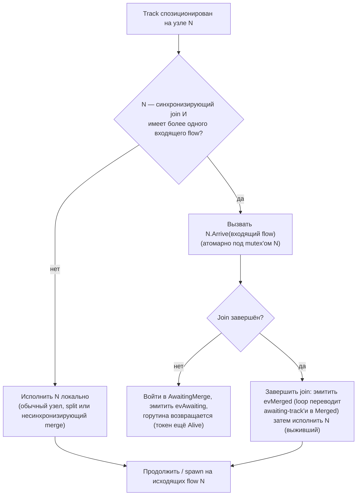
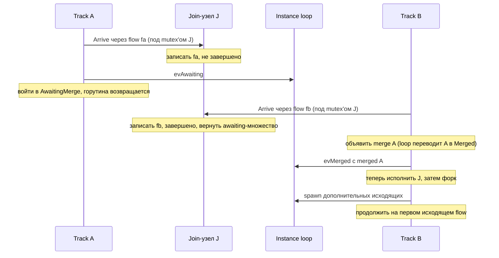
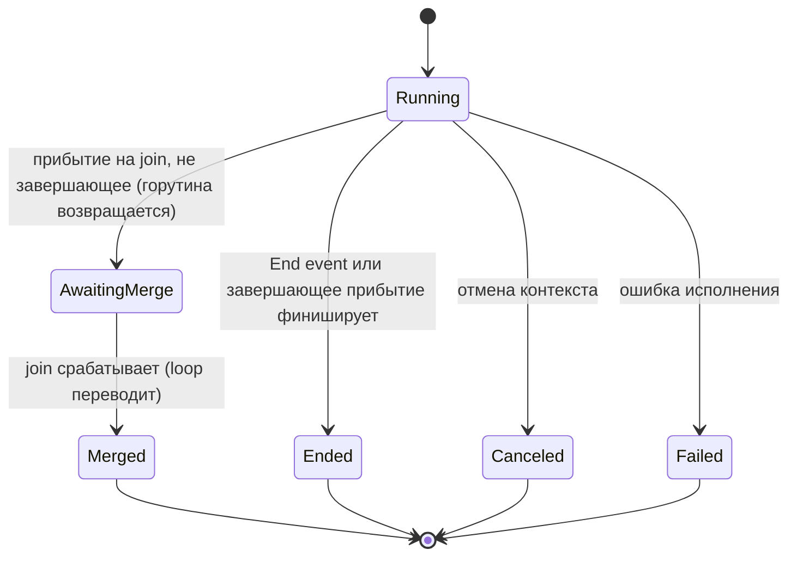

# ADR-005 — Шлюзы и join'ы

| Поле | Значение |
|---|---|
| Статус | Принято |
| Версия | v.1 |
| Дата | 2026-06-09 |
| Владелец | Руслан Габитов |
| Уточняет | [ADR-001 v.5 Execution Model](ADR-001-execution-model.md) |

> EN-оригинал — канонический: [ADR-005-gateways-and-joins.md](ADR-005-gateways-and-joins.md). Этот файл — его перевод (twin).

> **Область этой ревизии.** Здесь авторится концепция полностью **для Parallel
> (AND) шлюза** — split и синхронизирующий join — и модель координации track'ов,
> которая из неё следует. Inclusive (OR), Complex и Event-Based шлюзы названы, но
> **отложены** (§4); Parallel — это пилот, который устанавливает модель
> синхронизирующего join'а, переиспользуемую остальными. Его требования к лендингу
> и реализация специфицированы сопровождающим его SRD.

## 1. Контекст

BPMN маршрутизирует поток управления через **шлюзы**. Расходящийся шлюз форкает
поток токенов на несколько исходящих путей; сходящийся шлюз сливает или
синхронизирует входящие пути. Стандарт ([§13.4](../bpmn-spec/semantics/gateways.md))
определяет различные типы шлюзов — Exclusive, Parallel, Inclusive, Complex,
Event-Based — каждый со своим правилом активации форка и синхронизации join'а.

[ADR-001](ADR-001-execution-model.md) установил модель исполнения движка: Instance
владеет одним или несколькими **track'ами** (каждый — нить исполнения, несущая
позицию во flow); **токен** — это логическая проекция позиции track'а; форк создаёт
по track'у на каждую дополнительную ветку (прибывший track продолжает на одной); и
**всё состояние жизненного цикла уровня instance мутируется единственной горутиной
event-loop'а** — track'и сообщают о прогрессе событиями и никогда не мутируют это
состояние напрямую. ADR-001 умышленно оставил два шлюзовых концерна этому ADR:
какие исходящие flow активирует форк (по типу шлюза) и что происходит на сходящемся
узле (join/merge).

Этот ADR решает оба **для Parallel шлюза**, и тем самым фиксирует, как **владеется
синхронизация** в двухслойной модели — что имеет следствие для контракта исполнения
узла (§2.5).

## 2. Решение

### 2.1 Поведение шлюза — на каждый тип; объектная модель стандарта фиксирована

Каждый тип BPMN-шлюза несёт своё правило маршрутизации, поэтому движок реализует
каждый тип как своё поведение узла, а не как центральный switch по type-тегу.
Направление шлюза (сходящееся / расходящееся / смешанное) и его sequence flow
приходят из объектной модели шлюзов стандарта, которая является фиксированной
истиной; движок реализует таксономию стандарта, а не изобретает свою.

### 2.2 Parallel split — активировать все исходящие

Расходящийся Parallel шлюз производит один токен на **каждом** исходящем sequence
flow, безусловно (§13.4.1): без вычисления условий, без default-flow, и он не может
упасть. В двухслойной модели это обычный форк — прибывший track продолжает на одном
активированном flow, и каждый оставшийся активированный flow становится новым
track'ом.

### 2.3 Join — синхронизирующий vs несинхронизирующий

Сходящийся узел (более одного входящего flow) либо синхронизирует, либо нет —
решается **по типу шлюза**:

- **Несинхронизирующий** — Exclusive merge или неконтролируемый merge активности
  (который BPMN трактует как неявный Exclusive): каждый прибывший токен проходит
  насквозь и продолжает независимо. Без ожидания, без потребления.
- **Синхронизирующий** — Parallel (и позже Inclusive): шлюз ждёт ожидаемое
  множество входящих токенов, затем потребляет их и эмитит свой исходящий токен
  (токены).

Для **Parallel join'а** ожидаемое множество — это **один токен на каждом входящем
flow** (§13.4.1): он срабатывает, только когда каждый входящий flow доставил токен,
и потребляет ровно по одному токену на flow (избыточные токены на flow не
потребляются).

### 2.4 Синхронизацией владеет синхронизирующий узел

Синхронизирующий шлюз владеет своей синхронизацией **полностью**: своим
per-instance **состоянием прибытий** (какие входящие flow доставили токен —
состояние, принадлежащее узлу, по [ADR-009 v.1](ADR-009-per-instance-node-graph.md)),
своим **правилом завершения** (Parallel: каждый входящий flow прибыл; Inclusive,
позже: достижимое подмножество) и **сериализацией**, делающей конкурентные прибытия
безопасными (**per-node mutex**). Track делает то, что говорит ему узел; он **не**
просит loop решать. Loop держит только **учёт жизненного цикла** — реестр track'ов и
учёт awaiting/ended — он больше не решает синхронизацию. (Это весь концерн
синхронизации на узле; нет разделения механизм-на-loop'е / правило-на-узле —
единственная вариация на тип — это правило завершения, которое реализует каждый
синхронизирующий шлюз.)

Два track'а могут достичь join'а **конкурентно** (разные горутины), поэтому шаг
прибытия узла **атомарен под его собственным mutex'ом**: записать прибывший flow,
проверить правило завершения и — когда завершено — уступить awaiting-track'ам, всё в
одной критической секции.

- **Незавершающее прибытие завершает горутину track'а.** Track входит в
  промежуточное состояние **`AwaitingMerge`**, и его **горутина возвращается** — он
  *не* приостановлен и не может быть возобновлён; объект track'а **сохраняется** как
  запись (`evAwaiting` говорит instance'у держать его как *awaiting* — ни активным,
  ни завершённым). Он **ещё не** помечен `Merged`: пока join не сработал, какое
  прибытие окажется выжившим, неизвестно.
- **Завершающее прибытие — это выживший.** Под mutex'ом узла оно собрало id
  awaiting-track'ов. Оно **сначала завершает join** — объявляя merge (`evMerged`),
  так что loop переводит каждый awaiting-track в **`Merged`** (его токен становится
  `Consumed`) — **до того**, как узел исполняется (§2.5: синхронизация улаживается
  до исполнения). Затем оно **исполняет** join-узел и продолжает/форкает на исходящих
  flow.

На join'е не создаётся нового track'а — продолжение **едет на завершающем прибытии**
(дисциплина 1:1 track:позиция из ADR-001 держится). Какой прибывший track выживет —
это просто тот, чей токен завершает множество; BPMN требует лишь по одному токену
на исходящий flow.

**Сходимость — это не родительское ребро.** Токен, достигающий join'а, имеет *много*
предшественников (каждая сошедшаяся ветка), но токен записывает **единственного**
родителя (своё происхождение от форка). Поэтому merge **не** переназначает родителя
выжившему и не сворачивает поглощённые track'и в его родословную — сделать так
означало бы, что выживший претендует на track, который он же породил, как на своего
родителя — цикл, ломающий реконструкцию истории. Сходимость вместо этого
представлена собственной терминальной (`Consumed`) записью каждого поглощённого
track'а на join-узле; выживший сохраняет свою родословную создания нетронутой.

**Race-безопасность.** Только выживший когда-либо исполняет join-узел, поэтому
никакие два track'а не запускают его `Exec` одновременно. Состояние прибытий
node-локально под mutex'ом узла и per-instance
([ADR-009 v.1](ADR-009-per-instance-node-graph.md)) — никогда не гоняется между
track'ами или instance'ами. (Cross-instance гонку на разделяемом узле, которую более
ранний драфт откладывал в будущий Persistence ADR, уже разрешает ADR-009.)

Конкретный протокол — события, которые track шлёт loop'у, как track решает, что
делать на узле, и диаграммы состояния/рандеву — это §2.7.

### 2.5 Контракт исполнения узла — единственный Execute

Ответственность узла — **исполнять**: производить свои исходящие токены
(маршрутизация шлюза) или выполнять свою активность. Синхронизация (§2.4) — это
отдельный концерн, который синхронизирующий узел улаживает **до** того, как
исполняется — через свой шаг `Arrive`, а не через pre-/post-execution хуки — поэтому
контракт исполнения узла сворачивается до **единственного шага Execute**. Прежние
pre-/post-execution хуки (узловые «пролог» и «эпилог») существовали, когда узлы
управляли потоком; при координации track'ами они избыточны и **удалены**. Концерны,
для которых они использовались, переезжают на слой, которому принадлежат:

- **Подписка** catch/receive-узла на message/signal принадлежит машинерии событий и
  подписок (ADR-006), которая приостанавливает и позже возобновляет track; Execute
  узла потребляет доставленное событие. Это не узловой пролог/эпилог.
- **Регистрация** human task'а для взаимодействия — часть исполнения этого task'а
  (его Execute регистрирует, затем ждёт результата), а не отдельный хук.

Где это противоречит текущему интерфейсу узла, реализация удаляет хуки и
перемещает их логику — концепция ведёт, код следует.

### 2.6 Потребление токенов остаётся узким

Токены потребляются только на End Event'ах и Terminate, как поглощённые токены
синхронизирующего join'а (§2.4) и при отзыве (withdrawal). Несинхронизирующий merge
никогда не потребляет токены.

### 2.7 Координация Track ↔ Instance (механика)

Track работает автономно в своей собственной горутине, продвигаясь узел за узлом. На
каждом узле он спрашивает узел, что делать; только **синхронизирующий join** меняет
курс track'а. Единственная горутина event-loop'а Instance владеет **учётом
жизненного цикла** — реестром track'ов и учётом awaiting/ended; ей сообщают об
изменениях жизненного цикла через события, но она **не** решает синхронизацию. Три
события текут track → loop (все они — уведомления, ни одно не блокируется ради
ответа):

| Событие (track → loop) | Возникает, когда | Loop делает |
|---|---|---|
| **spawn** | форк активировал дополнительные исходящие flow | создаёт + регистрирует по track'у на каждый дополнительный flow |
| **awaiting** | track достиг синхронизирующего join'а, не завершил его, и **его горутина вернулась** | записывает track как *awaiting* — ни активным, ни завершённым |
| **merged** | завершающий track объявляет поглощённые track'и (по id) | loop разрешает id и переводит каждый в `Merged`, убирая их из *awaiting* |
| **ended** | track завершился (end event, отменён, упал) | дерегистрирует его; когда не осталось активных или awaiting, завершает instance |

**Что движет каждым событием — единообразные структурные правила, а не узел.** Track
**не** спрашивает узел «какое событие мне эмитить». Он выводит события из структуры,
и только **один** вопрос специфичен для узла:

- **Форк** движется тем, сколько flow возвращает `Exec`. Для **любого** узла track
  продолжает на одном активированном flow и эмитит `spawn` на остальные. Узел
  контролирует только *количество* (Exclusive возвращает один → нет форка; Parallel и
  неконтролируемый split активности возвращают все → форк). Task с несколькими
  исходящими форкает ровно как Parallel split — нет логики форка, специфичной для
  типа узла.
- **Merge** — это **только** концерн синхронизирующего join'а. Несинхронизирующий
  merge — Task, промежуточное событие или Exclusive шлюз, достигнутый более чем одним
  входящим flow — это **pass-through**: каждый прибывший токен исполняет узел
  независимо и продолжает, **без события и без потребления** (неконтролируемый merge
  BPMN = неявный Exclusive).

**Как track решает, что делать на узле.** На узле N track задаёт единственный
специфичный для узла вопрос: реализует ли N интерфейс `SynchronizingJoin` **и** имеет
ли более одного входящего flow? Если нет — он исполняет N локально (обычный узел,
split или несинхронизирующий merge). Если да — он вызывает **`N.Arrive(его входящий
flow)`** — атомарно под mutex'ом N (§2.4) — что возвращает один из ровно двух
ответов: *стоп и жди* → войти в `AwaitingMerge`, и горутина возвращается;
*исполняй* → продолжить как выживший.

**Рандеву синхронизирующего join'а** — две ветки сходятся на join'е `J`;
*завершающее* (второе) прибытие выживает, первое поглощается:

Какая ветка прибудет первой — несущественно: mutex J сериализует прибытия, поэтому
тот токен, что *завершает* множество, и есть выживший.

**Жизненный цикл track'а** — `AwaitingMerge` промежуточно: горутина уже вернулась;
объект track'а сохраняется как запись, пока join не сработает:

Mutex J делает прибытие атомарным, поэтому ровно одно прибытие на join завершает
множество и становится выжившим; остальные входят в `AwaitingMerge` (их горутины
вернулись) и переводятся в `Merged`, когда он срабатывает. На join'е не создаётся
track'а; продолжение едет на завершающем прибытии (§2.4).

**Форк на исходящих flow** (без изменений от ADR-001 §4.4). После того как `Exec`
узла возвращает активированные исходящие flow, track **продолжает сам на одном** —
предпочитая flow, который зацикливается назад на тот же узел (циклический/self-flow),
если такой существует, иначе первый — и эмитит **spawn** на оставшиеся flow, по
одному новому track'у на каждый. Parallel split питает это **всеми** исходящими flow
(§2.2); механика в остальном та же, что у любого форка.

**Смешанный шлюз (N входящих *и* M исходящих).** BPMN позволяет одному Parallel
шлюзу одновременно сходиться и расходиться. Это **не требует специальной машинерии**
— это join-половина, за которой следует fork-половина на **одном выжившем track'е**:
завершающее прибытие делает join (эмитит `evMerged`), исполняет узел (`Exec`
возвращает все M исходящих), затем форкает (продолжает на одном, эмитит `spawn` на
остальные). Так что instance получает **`evMerged`, затем `spawn`** подряд от той же
горутины; loop применяет их FIFO (учёт merge, затем создание track'ов). Выживший
остаётся **активным на протяжении обоих событий** — он никогда не завершается между
ними — поэтому instance не может преждевременно завершиться; итого N токенов
потребляется и M производится (N−1 merged + выживший → выживший + M−1 spawned).

## 3. Последствия

- Движок получает настоящий fork/join: любой ациклический процесс, использующий
  Parallel split и/или синхронизирующий join, исполняется корректно — поднимая его от
  только-линейного до ветвящегося потока управления (roadmap M1 MVP).
- Синхронизирующий узел получает учёт прибытий + **per-node mutex**; loop получает
  учёт *awaiting*/*merged* (без логики решений). Добавляется новое промежуточное
  состояние track'а **`AwaitingMerge`**; горутина awaiting-track'а возвращается
  (ничего не остаётся работать, пока track ждёт merge).
- Шов синхронизирующего join'а (§2.4) — это переиспользуемая основа для
  Inclusive/Complex.
- Интерфейс узла упрощается до одного Execute (§2.5); хуки пролог/эпилог удаляются, а
  их логика перемещается.
- Parallel join, чьё ожидаемое входящее множество никогда не сможет завершиться
  (вышестоящий exclusive-выбор обходит одну входящую ветку), **вводит instance в
  deadlock** — ошибка моделирования BPMN; её обнаружение вне области (§4).

## 4. Отложено / вне области

- **Inclusive (OR).** Его сходящаяся синхронизация условна и нелокальна: токен ждёт
  только входящие flow, которые *ещё могли бы* получить токен — а не «ждать всех».
  OR-join стандарта признанно-неоднозначен в литературе; этот ADR
  **зафиксирует одну совместимую семантику, когда OR лендится**, опираясь на
  машинерию, которую устанавливает Parallel — а не предполагая её сейчас. См.
  [[project_orjoin_synchronization_undecided]].
- **Complex шлюз** (переиспользует тест достижимости OR); **Event-Based шлюз** и его
  производитель отозванного токена (race-loss siblings заканчиваются как отозванные) —
  завязки на доставку событий ([ADR-006](ADR-006-events-and-subscriptions.md)).
- **Loop'ы и избыточные токены.** Эта концепция ограничивается **ациклическими,
  single-pass** join'ами: каждый входящий flow доставляет один токен; join срабатывает,
  когда все различные входящие flow прибыли однократно. Перевзвод join'а под loop'ом
  требует той же машинерии, что приносит OR — отложено.
- *(Разрешено, больше не отложено:* гонка данных на разделяемом узле при
  несинхронизирующем merge исправлена per-instance графом узлов
  [ADR-009 v.1](ADR-009-per-instance-node-graph.md) — каждый instance владеет своими
  объектами узлов, поэтому merge над одним узлом больше не гоняется между instance'ами.
  Поток данных per-execution внутри instance'а — концерн
  [ADR-010](ADR-010-process-data-model.md).)*

## 5. Рассмотренные альтернативы

- **Выживший — первый прибывший** (vs завершающий/последний). Отклонено: это
  заставляет первый track ждать, а любой merging-track трогать разделяемый узел;
  выживший-по-завершающему-прибытию, чьи не-выжившие никогда не исполняют узел, проще
  и race-избегающ (§2.4).
- **Порождение свежего track'а-продолжения на join'е.** Отклонено: нарушает «на join'е
  не создаётся нового track'а» из ADR-001 и передачу track'а 1:1.
- **Центральный switch по типу шлюза.** Отклонено: поведение узла на каждый тип
  открыто для расширения; центральный switch — это закрытое множество, которое каждый
  новый шлюз должен править.
- **Loop-сериализованное решение + канал вердикта** (более ранний драфт этого ADR):
  track эмитит событие `arrive` и *блокируется* на канале ответа, пока loop записывает
  прибытие и решает. Отклонено: теперь, когда узел владеет своим per-instance
  состоянием ([ADR-009 v.1](ADR-009-per-instance-node-graph.md)), track может спросить
  узел напрямую; round-trip к loop'у и канал вердикта — лишние накладные расходы. Узкий
  per-node mutex проще и яснее (§2.4).
- **Блокирующий узел** (узел — или track — который держит горутину
  **приостановленной**, пока siblings не прибудут). Отклонено: горутина
  awaiting-track'а **возвращается**; track сохраняется как объект в `AwaitingMerge`,
  поэтому ни одна горутина не удерживается (§2.7).
- **Разделение механизм-на-loop'е / правило-на-узле.** Отклонено: при состоянии,
  принадлежащем узлу, и per-node mutex'е узел владеет всем концерном синхронизации;
  единственная вариация на тип — правило завершения. Нет наслоения механизм/политика
  для сопровождения.
- **Сохранение хуков пролог/эпилог.** Отклонено (§2.5): избыточны при координации
  track'ами; подписка и регистрация принадлежат своим владеющим слоям.

## 6. Ссылки

- [ADR-001 v.5 Execution Model](ADR-001-execution-model.md) — двухслойный рантайм
  (форк §4.4; join перемещён §4.5; владение runtime-состоянием §4.7).
- [ADR-009 v.1 Per-instance node graph](ADR-009-per-instance-node-graph.md) —
  per-instance граф узлов, на котором живёт состояние прибытий join'а; разрешает гонку
  данных на разделяемом узле, которую откладывал более ранний драфт.
- [bpmn-spec/semantics/gateways.md](../bpmn-spec/semantics/gateways.md) (§13.4),
  [token-flow.md](../bpmn-spec/semantics/token-flow.md) — нормативная семантика
  шлюзов/токенов.

## 7. Открытые вопросы

- Ничего блокирующего для Parallel. Фиксация семантики OR-join (§4) — открытый вопрос
  **для следующей ревизии шлюзов**, умышленно не отвечённый здесь.

## История документа

| Версия | Дата | Автор | Изменение |
|---|---|---|---|
| v.1 | 2026-06-09 | Руслан Габитов | Авторено полностью для **Parallel (AND) шлюза** (split + синхронизирующий join), приземлено с сопровождающим его SRD. Решения: поведение шлюза на каждый тип (без центрального type-switch'а); Parallel split производит токен на каждом исходящем flow; **синхронизацией владеет синхронизирующий узел** — он держит своё per-instance состояние прибытий ([ADR-009 v.1](ADR-009-per-instance-node-graph.md), Accepted), правило завершения и **per-node mutex**, делающий конкурентный `Arrive` атомарным; незавершающее прибытие входит в промежуточное состояние **`AwaitingMerge`**, и его горутина возвращается (объект track'а сохраняется как запись, instance уведомлён через `evAwaiting`); **завершающее прибытие** — это выживший — оно сначала завершает join (объявляет id поглощённых track'ов через `evMerged`; loop переводит каждый в `Merged`) **до** исполнения узла, затем исполняет и форкает; родословная создания выжившего оставлена нетронутой (сходимость записывается собственными терминальными `Consumed`-записями поглощённых track'ов, а не переназначением родителя выжившему); loop держит только учёт awaiting/ended. **Контракт исполнения узла сворачивается до единственного Execute** — хуки пролог/эпилог удалены, а их концерны (подписка → ADR-006; регистрация взаимодействия → Execute task'а) перемещены. Inclusive/Complex/Event-Based и loop'ы/избыточные токены отложены (§4); гонка на разделяемом узле при несинхронизирующем merge **разрешена ADR-009**. Заменяет seed-драфт v.1 и промежуточный loop-сериализованный/verdict-channel драфт (отклонён, как только ADR-009 сделал узел владельцем своего состояния — §5). Уточняет pin ADR-001 v.5. |
| v.1 | 2026-06-11 | Руслан Габитов | **Accepted**, приземлено через SRD-005 v.1. Две детали контракта улажены в ходе реализации и свёрнуты обратно в §2.4/§2.7: `Arrive` узла обменивается **id track'ов** (не `*track`/`any`), оставляя узел модельного слоя свободным от runtime-типа; и merge **не** сворачивает поглощённые track'и в родословную выжившего — токен на join'е имеет много предшественников, но токен записывает одного родителя, поэтому сходимость несётся собственными терминальными `Consumed`-записями поглощённых track'ов (сворачивание порождало циклическое родительское ребро). Уточняет pin ADR-001 v.5. |
