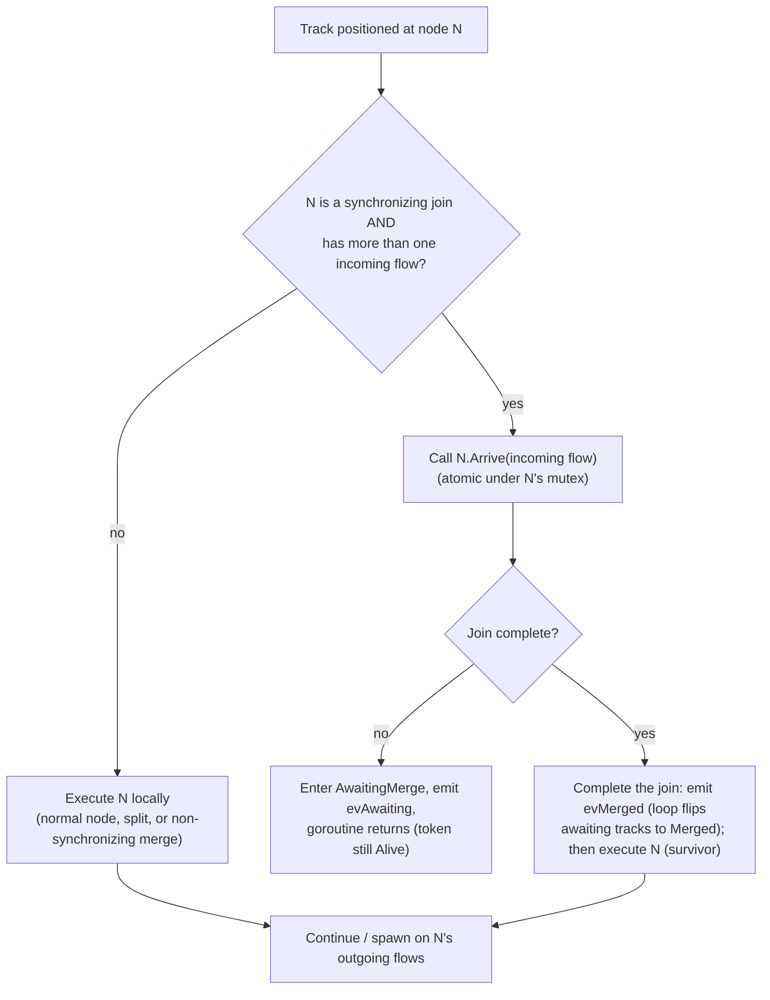
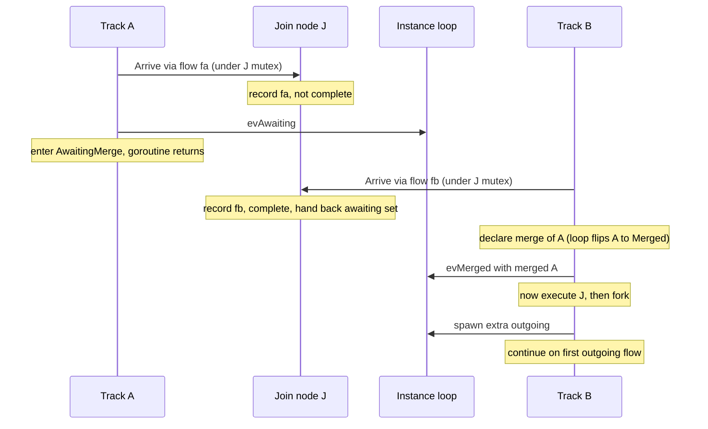
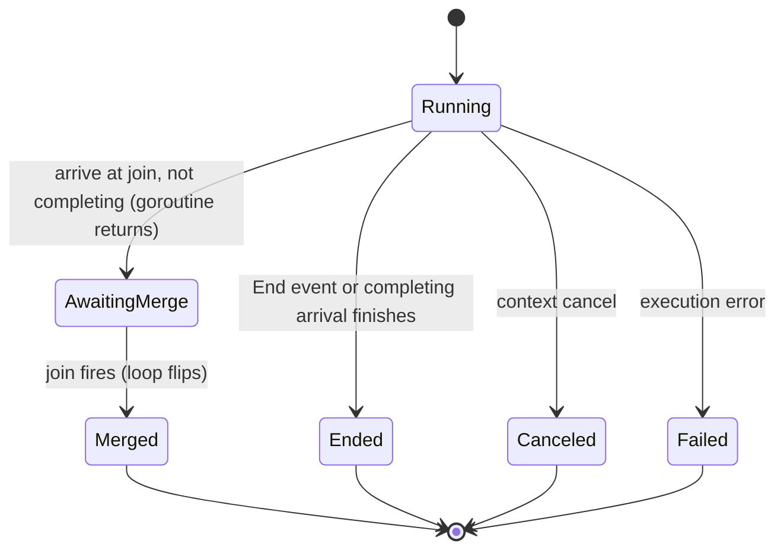

# ADR-005 — Шлюзы и объединения

| Поле | Значение |
|---|---|
| Статус | Принято |
| Версия | v.2 |
| Дата | 2026-06-09 |
| Владелец | Руслан Габитов |
| Уточняет | [ADR-001 v.5 Execution Model](ADR-001-execution-model.ru.md) |

> EN-оригинал — канонический: [ADR-005-gateways-and-joins.md](ADR-005-gateways-and-joins.md). Этот файл — его перевод (twin). При расхождении приоритет у английского текста.

> **Scope.** Этот ADR решает **маршрутизирующие шлюзы** и общую для них модель
> координации track'ов: **Parallel** (split §2.2 + синхронизирующее объединение
> §2.3–§2.4), **Exclusive** (split §2.8; его merge — несинхронизирующий
> pass-through §2.3) и **Inclusive** (split §2.9 + синхронизирующий **OR-join**
> §2.10). **Complex** и **Event-Based** шлюзы отложены (§4). OR-join фиксирует
> **консервативную, двухуровневую, переоцениваемую-при-смерти-токена** реализацию
> синхронизирующего merge'а из стандарта (§2.10).
>
> **Implementation status.** Parallel (SRD-005), Exclusive split и Inclusive split
> (SRD-021) реализованы. Inclusive **OR-join** (§2.10) — концепция впереди кода:
> его машинерия reachability + re-evaluation приземляется в SRD-022.

## 1. Контекст

BPMN маршрутизирует поток управления через **шлюзы** (gateways). Расходящийся шлюз
форкает поток токенов на несколько исходящих путей; сходящийся шлюз объединяет или
синхронизирует входящие пути. Стандарт ([§13.4](../bpmn-spec/semantics/gateways.md))
определяет отдельные типы шлюзов — Exclusive, Parallel, Inclusive, Complex,
Event-Based — каждый со своим правилом fork-активации и join-синхронизации.

[ADR-001](ADR-001-execution-model.ru.md) задал модель исполнения движка: Instance
владеет одним или несколькими **track'ами** (каждый — нить исполнения, несущая
позицию в потоке); **токен** — логическая проекция позиции track'а; fork создаёт
по track'у на каждую дополнительную ветку (пришедший track продолжает на одной);
и **всё instance-scoped lifecycle-состояние мутируется одной горутиной
event-loop'а** — track'и сообщают о прогрессе событиями и никогда не мутируют это
состояние напрямую. ADR-001 намеренно оставил два gateway-вопроса этому ADR: какие
исходящие потоки активирует fork (по типу шлюза) и что происходит в сходящемся
узле (join/merge).

Этот ADR решает оба **для Parallel-шлюза** и тем самым фиксирует, как **синхронизация**
владеется в двухслойной модели — что имеет следствие для контракта исполнения узла
(§2.5).

## 2. Решение

### 2.1 Поведение шлюза — per type; объектная модель стандарта фиксирована

Каждый тип BPMN-шлюза несёт своё правило маршрутизации, поэтому движок реализует
каждый тип как собственное поведение узла, а не как центральный switch по тегу
типа. Направление шлюза (converging / diverging / mixed) и его sequence flows
берутся из объектной модели шлюзов стандарта — это фиксированная ground truth;
движок реализует таксономию стандарта, а не изобретает свою.

### 2.2 Parallel split — активировать все исходящие

Расходящийся Parallel-шлюз производит по одному токену на **каждом** исходящем
sequence flow, безусловно (§13.4.1): без вычисления условий, без default flow, и
он не может упасть. В двухслойной модели это обычный fork — пришедший track
продолжает на одном активированном потоке, а каждый из оставшихся активированных
потоков становится новым track'ом. (Его контрагент, **Exclusive split** — ровно
*один* исходящий поток, выбранный по условию — это §2.8.)

### 2.3 Объединение — синхронизирующее vs несинхронизирующее

Сходящийся узел (более одного входящего потока) либо синхронизирует, либо нет —
решается **по типу шлюза**:

- **Несинхронизирующее** — Exclusive merge или неуправляемый merge активности
  (который BPMN трактует как неявный Exclusive): каждый пришедший токен проходит
  насквозь и продолжает независимо. Без ожидания, без потребления.
- **Синхронизирующее** — Parallel (и позже Inclusive): шлюз ждёт ожидаемый набор
  входящих токенов, затем потребляет их и испускает свой(и) исходящий(ие)
  токен(ы).

Для **Parallel join** ожидаемый набор — это **по одному токену на каждом входящем
потоке** (§13.4.1): он срабатывает только когда каждый входящий поток доставил
токен, и потребляет ровно один токен на поток (избыточные токены на потоке не
потребляются).

### 2.4 Синхронизация принадлежит синхронизирующему узлу

Синхронизирующий шлюз владеет своей синхронизацией **полностью**: своим
per-instance **arrival state** (какие входящие потоки доставили токен —
node-owned-состояние по [ADR-009 v.1](ADR-009-per-instance-node-graph.ru.md)),
своим **completion rule** (Parallel: пришёл каждый входящий поток; Inclusive,
позже: достижимое подмножество) и **сериализацией**, делающей конкурентные
прибытия безопасными (**per-node mutex**). Track делает то, что говорит ему узел;
он **не** просит loop принять решение. Loop держит только **lifecycle
bookkeeping** — реестр track'ов и учёт awaiting/ended — он больше не решает
синхронизацию. (Это весь concern синхронизации на узле; нет разделения
mechanism-on-the-loop / rule-on-the-node — единственная вариация per-type — это
completion rule, который реализует каждый синхронизирующий шлюз.)

Два track'а могут достичь join'а **конкурентно** (отдельные горутины), поэтому
arrival-шаг узла **атомарен под собственным mutex'ом**: записать пришедший поток,
проверить completion rule, и — когда полно — отдать awaiting-track'и, всё в одной
critical section.

- **Незавершающее прибытие завершает горутину track'а.** Track входит в
  промежуточное состояние **`AwaitingMerge`**, и его **горутина возвращается** —
  он *не* suspended и не может быть resumed; объект track'а **удерживается** как
  запись (`evAwaiting` говорит instance держать его как *awaiting* — ни активным,
  ни завершённым). Он **ещё не** помечен `Merged`: пока join не сработает,
  неизвестно, какое прибытие — выживший.
- **Завершающее прибытие — это выживший.** Под mutex'ом узла оно собрало id'ы
  awaiting-track'ов. Оно **сначала завершает join** — объявляя merge (`evMerged`),
  так что loop переводит каждый awaiting-track в **`Merged`** (его токен становится
  `Consumed`) — **перед** тем как узел исполняется (§2.5: синхронизация
  устаканивается до исполнения). Оно **затем** исполняет join-узел и
  продолжает/форкает на исходящих потоках.

В join'е новый track не создаётся — продолжение **едет на завершающем прибытии**
(дисциплина 1:1 track:position из ADR-001 сохраняется). Какой пришедший track
выживает — это просто тот, чей токен завершает набор; BPMN требует лишь один токен
наружу на каждый исходящий поток.

**Convergence — это не parent-ребро.** Токен, достигший join'а, имеет *много*
предшественников (каждая сошедшаяся ветка), но токен записывает **единственного**
родителя (свой fork-origin). Поэтому merge **не** re-parent'ит выжившего и не
складывает поглощённые track'и в его lineage — иначе выживший заявил бы track,
который он сам породил, своим родителем — цикл, ломающий реконструкцию истории.
Convergence вместо этого представлен собственной терминальной (`Consumed`) записью
каждого поглощённого track'а в join-узле; выживший сохраняет свою creation-lineage
нетронутой.

**Race-safety.** Только выживший когда-либо исполняет join-узел, поэтому никакие
два track'а не запускают его `Exec` одновременно. Arrival-state — node-local под
mutex'ом узла и per-instance ([ADR-009 v.1](ADR-009-per-instance-node-graph.ru.md))
— никогда не гоняется между track'ами или instance'ами. (Кросс-instance гонка
shared-узла, которую более ранний draft откладывал на будущий Persistence ADR,
уже решена ADR-009.)

Конкретный протокол — события, которые track шлёт loop'у, как track решает, что
делать в узле, и диаграммы состояния/rendezvous — это §2.7.

### 2.5 Контракт исполнения узла — единственный Execute

Ответственность узла — **исполнить**: произвести свои исходящие токены
(маршрутизация шлюза) или выполнить свою активность. Синхронизация (§2.4) — это
отдельный concern, который синхронизирующий узел устаканивает **перед** тем как
исполнить — через свой шаг `Arrive`, а не через pre-/post-execution хуки — поэтому
контракт исполнения узла схлопывается в **единственный шаг Execute**. Прежние
pre-/post-execution хуки (узловые «prologue» и «epilogue») существовали, когда
узлы управляли потоком; под track-координацией они избыточны и **удаляются**.
Concern'ы, под которые они использовались, переезжают на слой, который ими
владеет:

- **Подписка** узла catch/receive на message/signal принадлежит машинерии событий
  и подписок (ADR-006), которая suspend'ит и позже resume'ит track; `Execute`
  узла потребляет доставленное событие. Это не node prologue/epilogue.
- **Регистрация** human task на взаимодействие — часть исполнения этой задачи
  (его `Execute` регистрирует, затем ожидает исхода), а не отдельный хук.

Где это противоречит текущему интерфейсу узла, реализация удаляет хуки и
переносит их логику — концепция ведёт, код следует.

### 2.6 Потребление токенов остаётся узким

Токены потребляются только в End Events и Terminate, как поглощённые токены
синхронизирующего join'а (§2.4) и при withdrawal. Несинхронизирующий merge
никогда не потребляет токены.

### 2.7 Координация Track ↔ Instance (механика)

Track работает автономно в собственной горутине, продвигаясь узел за узлом. В
каждом узле он спрашивает узел, что делать; только **синхронизирующий join**
меняет курс track'а. Единственная горутина event-loop'а Instance владеет
**lifecycle bookkeeping** — реестром track'ов и учётом awaiting/ended; ей
сообщают о lifecycle-изменениях через события, но она **не** решает синхронизацию.
Три события текут track → loop (все — уведомления, ни одно не блокируется в
ожидании ответа):

| Событие (track → loop) | Поднимается когда | Loop делает |
|---|---|---|
| **spawn** | fork активировал дополнительные исходящие потоки | создаёт + регистрирует по track'у на каждый дополнительный поток |
| **awaiting** | track достиг синхронизирующего join'а, не завершил его, и **его горутина вернулась** | записывает track как *awaiting* — ни активным, ни завершённым |
| **merged** | завершающий track объявляет поглощённые track'и (по id) | loop резолвит id'ы и переводит каждый в `Merged`, убирая их из *awaiting* |
| **ended** | track завершился (end event, canceled, failed) | дерегистрирует его; когда не остаётся активных или awaiting, завершает instance |

**Что движет каждым событием — единообразные структурные правила, не узел.** Track
**не** спрашивает узел «какое событие мне поднять». Он выводит события из
структуры, и только **один** вопрос специфичен для узла:

- **Fork** движется тем, сколько потоков возвращает `Exec`. Для **любого** узла
  track продолжает на одном активированном потоке и испускает `spawn` для
  остальных. Узел контролирует только *количество* (Exclusive возвращает один → нет
  fork'а; Parallel и неуправляемый activity-split возвращают все → fork). Task с
  несколькими исходящими форкает ровно как Parallel split — нет fork-логики,
  специфичной для типа узла.
- **Merge** — **только** concern синхронизирующего join'а. Несинхронизирующий
  merge — Task, intermediate event или Exclusive-шлюз, достигнутый более чем одним
  входящим потоком — это **pass-through**: каждый пришедший токен исполняет узел
  независимо и продолжает, **без события и без потребления** (неуправляемый merge
  BPMN = неявный Exclusive).

**Как track решает, что делать в узле.** В узле N track задаёт единственный
специфичный для узла вопрос: реализует ли N `SynchronizingJoin` **и** имеет более
одного входящего потока? Если нет — он исполняет N локально (обычный узел, split
или несинхронизирующий merge). Если да — он вызывает **`N.Arrive(его входящий
поток)`** — атомарно под mutex'ом N (§2.4) — который возвращает один из ровно двух
ответов: *stop and wait* → войти в `AwaitingMerge`, и горутина возвращается;
*execute* → продолжить как выживший.

**Rendezvous синхронизирующего join'а** — две ветки сходятся на join'е `J`;
*завершающее* (второе) прибытие выживает, первое поглощается:

Какая ветка приходит первой — несущественно: mutex J сериализует прибытия, поэтому
тот токен, что *завершает* набор, и есть выживший.

**Жизненный цикл track'а** — `AwaitingMerge` промежуточный: горутина уже
вернулась; объект track'а удерживается как запись, пока join не сработает:

Mutex J делает прибытие атомарным, поэтому ровно одно прибытие на join завершает
набор и становится выжившим; остальные входят в `AwaitingMerge` (их горутины
вернулись) и переводятся в `Merged`, когда он срабатывает. В join'е track не
создаётся; продолжение едет на завершающем прибытии (§2.4).

**Форк на исходящих потоках** (без изменений относительно ADR-001 §4.4). После
того как `Exec` узла вернул активированные исходящие потоки, track **продолжает на
одном сам** — предпочитая поток, который зацикливается на тот же узел (cyclic/self
flow), если такой есть, иначе первый — и испускает **spawn** для оставшихся
потоков, по одному новому track'у на каждый. Parallel split кормит это **всеми**
исходящими потоками (§2.2); в остальном механика та же, что у любого fork'а.

**Смешанный шлюз (N входящих *и* M исходящих).** BPMN разрешает одному
Parallel-шлюзу и сходиться, и расходиться. Это **не требует специальной машинерии**
— это половина-join, за которой следует половина-fork на **одном выжившем
track'е**: завершающее прибытие join'ит (испускает `evMerged`), исполняет узел
(`Exec` возвращает все M исходящих), затем форкает (продолжает на одном, испускает
`spawn` для остальных). Так instance получает **`evMerged`, затем `spawn`** подряд
из той же горутины; loop применяет их FIFO (merge-bookkeeping, затем создание
track'ов). Выживший остаётся **активным сквозь оба события** — он никогда не
завершается между ними — поэтому instance не может преждевременно завершиться; в
итоге N токенов потреблено и M произведено (N−1 merged + выживший → выживший + M−1
spawned).

### 2.8 Exclusive split — data-based exclusive choice (первое подходящее условие)

Расходящийся **Exclusive**-шлюз маршрутизирует пришедший токен на **ровно один**
исходящий поток — data-based exclusive choice (§13.4.2, Table 13.2):

- Исходящие потоки несут **condition expressions**, вычисляемые **в порядке
  объявления**. **Первое** условие, вычислившееся в `true`, выбирает этот поток, и
  **дальнейшие условия не вычисляются** (short-circuit).
- Если **ни одно** условие не `true`, токен идёт по **default** потоку (атрибут
  `default` шлюза, §13.4.2).
- Если ни одно условие не `true` **и** нет default flow, шлюз **роняет instance**
  с исключением (§13.4.2) — немаршрутизируемый токен — это ошибка моделирования, а
  не молчаливый сброс.
- **Порядок значим**: авторы модели выражают приоритет ветвей через порядок
  исходящих потоков шлюза (§13.4.2 engine note).

Это per-type split-правило, предвосхищённое §2.1, и контрагент Parallel split
(§2.2): где Parallel возвращает **все** исходящие потоки, Exclusive возвращает
**ровно один**. Поэтому он кормит fork-механику §2.7 единственным потоком —
выживший track продолжает на нём и испускает **никакого `spawn`** (нет fork'а).
Exclusive **merge** не требует ничего нового: это несинхронизирующий pass-through,
уже решённый в §2.3/§2.7 — каждый пришедший токен срабатывает на шлюзе независимо,
без ожидания и без потребления (неуправляемый merge BPMN = неявный Exclusive).
Так что *смешанный* Exclusive-шлюз (N входящих, M исходящих) — это просто
pass-through-на-прибытие, за которым следует choose-one split, без синхронизации.

Условия — это стандартный `FormalExpression` на sequence flow, вычисляемый против
данных instance. **Механика вычисления** — какой expression engine их запускает,
какой data scope они читают, как surface'ится ошибка вычисления и как трактуется
non-default поток без условия — это к фиксации в сопровождающем SRD (code-grounded);
этот ADR фиксирует только **правило выбора** выше, standard-grounded.

### 2.9 Inclusive split — форк каждого подходящего условия

Расходящийся **Inclusive**-шлюз маршрутизирует токен на **каждый** исходящий
поток, чьё условие `true` — одна или более ветвей (§13.4.3, Table 13.3):

- Все исходящие условия вычисляются (без гарантии порядка); токен производится на
  **каждом** потоке, чьё условие `true`.
- Если **ни одно** условие не `true`, токен идёт по **default** потоку.
- Если ни одно условие не `true` и нет default, шлюз **роняет instance**
  (§13.4.3).

Это per-type split §2.1, что стоит между Parallel (все потоки, безусловно — §2.2)
и Exclusive (ровно один — §2.8): Inclusive возвращает **условно-истинное
подмножество** (≥1). Когда подмножество выбрано, оно кормит fork-механику §2.7 без
изменений — выживший track продолжает на одном, `spawn` для остальных. Механика
вычисления — это к SRD (как §2.8).

### 2.10 Inclusive (OR) join — синхронизирующий merge

Сходящийся Inclusive-шлюз — это **синхронизирующий merge** (WCP-7): он ждёт каждый
токен, который *ещё мог бы* прийти, затем срабатывает однажды. Это синхронизирующий
join (§2.3/§2.4) с **нелокальным completion rule** — единственный шлюз, чьё решение
о срабатывании инспектирует распределение токенов по всему instance, а не только
свои входящие потоки.

**Нормативное правило (§13.4.3, Table 13.3).** Join активируется тогда и только
тогда, когда хотя бы один входящий поток несёт токен **и** для каждого
направленного пути (не посещающего join) от потока-носителя-токена к *пустому*
входящему потоку join'а существует *также* путь от того токена к уже-*marked*
входящему потоку. При срабатывании он потребляет по одному токену на marked
входящий поток, вычисляет все исходящие условия и форкает true-подмножество
(default/exception по §2.9) — §2.10 join, за которым немедленно следует §2.9 split
на выжившем.

**Реализация в движке (выбор gobpm — консервативная, двухуровневая,
переоцениваемая при смерти токена).** Refinement-клауза спеки редко существенна;
gobpm реализует практичную консервативную форму, проверенную Camunda 7 (internal
analysis: *Camunda 7 — Inclusive Gateway join*), с одним намеренным улучшением над
ней:

- **Двухуровневая активация.** *Fast path* — токен пришёл на **каждый** входящий
  поток → сработать, без анализа. *Slow path* — тест **reachability** над
  статическим per-instance node graph'ом (ADR-009): если **ни один** активный
  track не может больше достичь un-marked входящего потока join'а — сработать;
  иначе ждать. DFS **cycle-guarded** (visited-set, поэтому циклические модели не
  могут подвесить решение) и **игнорирует условия потоков** (будущие исходы
  условий токена неизвестны в момент решения, поэтому он считается способным
  пройти любой структурный путь). Это консервативная форма *single*-reachability-
  per-track — она ошибается только в сторону **более долгого ожидания** — а не
  two-path refinement-клауза спеки.
- **Переоценивается при смерти токена, не только при прибытии.** Completion rule
  перепроверяется и когда токен **прибывает** на join, **и** когда любой track
  **умирает** (завершается / отменяется / merged'ится где-то ещё) — смерть может
  убрать последний токен, который ещё мог достичь un-marked потока. Это **чинит
  худший failure mode Camunda 7**, где join проверяется *только* при прибытии,
  поэтому прерванная ожидаемая ветка подвешивает join **навсегда**. Единственный
  event-loop gobpm уже наблюдает жизненный цикл каждого track'а, поэтому
  переоценка каждого awaiting OR-join'а при смерти track'а — строгое улучшение,
  которое двухслойная модель делает естественным.
- **Per-incoming-flow marking** (не per-gateway-счётчик токенов), поэтому правило
  остаётся корректным, когда циклы re-arm'ят join (само re-arming отложено, §4).
- **Владение остаётся §2.4.** Join владеет своим arrival-state под **per-node
  mutex**'ом; прибытия атомарны. Единственное расширение — что его completion rule
  читает **позиции активных track'ов** instance (поставляемые loop'ом) — узел
  по-прежнему владеет *решением*, он лишь сверяется с более широким marking'ом,
  чем локальный счёт Parallel.

**Срабатывание и выживший.** Как у Parallel (§2.4), **прибытие**, завершающее
join, — это **выживший**: оно едет на завершающем прибытии, потребляет marked
токены, затем исполняет и форкает (§2.9). У срабатывания, **запущенного смертью**,
нет прибытия, на котором ехать: loop, обнаружив, что join теперь может сработать,
**повышает один awaiting-track до выжившего** и возобновляет поток из join'а.
(Parallel никогда не срабатывает из loop'а; death-trigger OR-join'а — единственный
путь, который это делает — конкретная resume-механика — это к SRD OR-join'а.)

**Scope.** Ацикличный, single-pass (§4): каждый входящий поток marked однажды;
loop re-arming отложен. Complex-шлюз переиспользует этот reachability-тест (§4).

## 3. Последствия

- Движок получает настоящий fork/join: любой ацикличный процесс, использующий
  Parallel split и/или синхронизирующий join, исполняется корректно — поднимая его
  с linear-only до ветвящегося потока управления (roadmap M1 MVP).
- Синхронизирующий узел получает arrival accounting + **per-node mutex**; loop
  получает bookkeeping *awaiting*/*merged* (без decision-логики). Добавляется новое
  промежуточное состояние track'а **`AwaitingMerge`**; горутина awaiting-track'а
  возвращается (ничего не остаётся работающим, пока track ждёт merge).
- Шов синхронизирующего join'а (§2.4) — переиспользуемая основа для
  Inclusive/Complex.
- Интерфейс узла упрощается до одного Execute (§2.5); хуки prologue/epilogue
  удалены, а их логика перенесена.
- Parallel join, чей ожидаемый набор входящих никогда не может завершиться
  (вышестоящий exclusive choice обходит одну входящую ветку), **deadlock'ит
  instance** — ошибка моделирования BPMN; её обнаружение вне scope (§4).
- Движок получает **data-based routing**: Exclusive выбирает одну ветку по условию
  (§2.8), Inclusive форкает true-подмножество (§2.9) — так что процесс может
  ветвиться по данным, а не только форкать безусловно (Parallel). XOR завершает
  пару XOR/AND (epic #81); OR-split + OR-join (§2.10) покрывают Inclusive-половину
  epic #93. Оба split'а переиспользуют per-type framing (§2.1) и fork-механику §2.7
  без изменений.
- Модель синхронизации (§2.4) получает своё первое **нелокальное** completion rule
  (OR-join, §2.10): loop переоценивает awaiting OR-join при **смерти токена**, не
  только при прибытии, и может **сам сработать join** (повышая awaiting-track до
  выжившего) — новый путь loop'а, который Parallel'у никогда не был нужен. Это и
  убирает классическую ловушку Camunda-7 «OR-join подвисает, когда ожидаемая ветка
  прервана».

## 4. Отложено / вне scope

- **OR-join refinement-клауза.** §2.10 берёт консервативную форму
  single-reachability; two-path refinement-клауза стандарта (токен, который может
  *также* достичь marked входящего потока, не блокирует) **не** реализована —
  редко существенна, и она лишь ошибается в сторону более долгого ожидания.
- **Complex-шлюз** — переиспользует reachability-тест §2.10; **Event-Based шлюз** и
  его producer withdrawn-токенов (проигравшие гонку siblings заканчивают как
  withdrawn) — завязан на доставку событий
  ([ADR-006](ADR-006-events-and-subscriptions.ru.md)). Оба отложены.
- **Циклы и избыточные токены.** Эта концепция ограничена **ацикличными,
  single-pass** join'ами (Parallel и OR одинаково): каждый входящий поток marked
  однажды; join срабатывает, когда его completion rule выполнено за один проход.
  Re-arming join'а под циклом отложен.
- *(Решено, больше не отложено:* гонка данных shared-узла несинхронизирующего merge
  починена per-instance node graph'ом из [ADR-009 v.1](ADR-009-per-instance-node-graph.ru.md)
  — каждый instance владеет своими node-объектами, поэтому merge над одним узлом
  больше не гоняется между instance'ами. Per-execution поток данных внутри instance
  — это concern [ADR-010](ADR-010-process-data-model.ru.md).)*

## 5. Рассмотренные альтернативы

- **First-arrived survivor** (vs. completing/last). Отклонено: это заставляет
  первый track ждать, а любой merging track — трогать shared-узел;
  completing-arrival survivor, чьи non-survivors никогда не исполняют узел, проще и
  race-avoiding (§2.4).
- **Spawn'инг свежего continuation-track'а в join'е.** Отклонено: нарушает «в
  join'е track не создаётся» из ADR-001 и handoff 1:1 track.
- **Центральный switch по типу шлюза.** Отклонено: per-type node behaviour открыто
  для расширения; центральный switch — это замкнутое множество, которое каждый
  новый шлюз обязан редактировать.
- **Loop-serialized decision + verdict channel** (более ранний draft этого ADR):
  track испускает событие `arrive` и *блокируется* на reply-канале, пока loop
  записывает прибытие и решает. Отклонено: теперь, когда узел владеет своим
  per-instance состоянием ([ADR-009 v.1](ADR-009-per-instance-node-graph.ru.md)),
  track может спросить узел напрямую; round-trip к loop'у и verdict-канал — лишний
  overhead. Узкий per-node mutex проще и яснее (§2.4).
- **Блокирующий узел** (узел — или track — который держит горутину **suspended**,
  пока не придут siblings). Отклонено: горутина awaiting-track'а **возвращается**;
  track удерживается как объект в `AwaitingMerge`, поэтому никакая горутина не
  держится (§2.7).
- **Разделение mechanism-on-the-loop / rule-on-the-node.** Отклонено: при
  node-owned-состоянии и per-node mutex'е узел владеет всем concern'ом
  синхронизации; единственная per-type вариация — completion rule. Нет
  mechanism/policy-наслоения для поддержки.
- **Сохранение хуков prologue/epilogue.** Отклонено (§2.5): избыточны под
  track-координацией; subscription и registration принадлежат своим владеющим
  слоям.

## 6. Ссылки

- [ADR-001 v.5 Execution Model](ADR-001-execution-model.ru.md) — двухслойный
  рантайм (fork §4.4; join перенесён §4.5; владение runtime-state §4.7).
- [ADR-009 v.1 Per-instance node graph](ADR-009-per-instance-node-graph.ru.md) —
  per-instance node graph, на котором живёт arrival-state join'а; решает гонку
  данных shared-узла, которую более ранний draft откладывал.
- [bpmn-spec/semantics/gateways.md](../bpmn-spec/semantics/gateways.md) (§13.4 —
  Exclusive §13.4.2, Inclusive §13.4.3 + Table 13.3),
  [token-flow.md](../bpmn-spec/semantics/token-flow.md) — нормативная
  семантика шлюзов/токенов.
- [docs/camunda7/or-join-inclusive-gateway.md](../camunda7/or-join-inclusive-gateway.md)
  — внутренний референс-анализ OR-join'а Camunda 7 (engine precedent),
  информировавший консервативную, двухуровневую, переоцениваемую-при-смерти-токена
  реализацию §2.10 и отклонения, которые gobpm намеренно сохраняет или чинит.

## 7. Открытые вопросы

- **Нет.** Маршрутизирующие шлюзы — Parallel, Exclusive и Inclusive (split + join)
  — решены. Complex, Event-Based, OR-join refinement-клауза и loop re-arming —
  намеренные отложения (§4), а не открытые вопросы.

## История документа

| Версия | Дата | Автор | Изменение |
|---|---|---|---|
| v.1 | 2026-06-09 | Руслан Габитов | Написан полностью для **Parallel (AND) шлюза** (split + синхронизирующий join), приземлён с сопровождающим SRD. Решения: per-type поведение шлюза (без центрального type switch); Parallel split производит токен на каждом исходящем потоке; **синхронизация принадлежит синхронизирующему узлу** — он держит свой per-instance arrival-state ([ADR-009 v.1](ADR-009-per-instance-node-graph.ru.md), Accepted), completion rule и **per-node mutex**, делающий конкурентный `Arrive` атомарным; незавершающее прибытие входит в промежуточное состояние **`AwaitingMerge`**, и его горутина возвращается (объект track'а удерживается как запись, instance уведомлён через `evAwaiting`); **завершающее прибытие** — выживший — он сначала завершает join (объявляет id'ы поглощённых track'ов через `evMerged`; loop переводит каждый в `Merged`) **перед** исполнением узла, затем исполняет и форкает; creation-lineage выжившего оставлена нетронутой (convergence записывается собственными терминальными `Consumed`-записями поглощённых track'ов, а не re-parent'ингом выжившего); loop держит только bookkeeping awaiting/ended. **Контракт исполнения узла схлопывается в единственный Execute** — хуки prologue/epilogue удалены, а их concern'ы (subscription → ADR-006; регистрация interaction → `Execute` задачи) перенесены. Inclusive/Complex/Event-Based и циклы/избыточные токены отложены (§4); гонка shared-узла несинхронизирующего merge **решена ADR-009**. Замещает v.1 Draft seed и промежуточный loop-serialized/verdict-channel draft (отклонён, как только ADR-009 сделал узел владельцем своего состояния — §5). Refines pin ADR-001 v.5. |
| v.1 | 2026-06-11 | Руслан Габитов | **Принято**, приземлено через SRD-005 v.1. Две детали контракта устаканились в ходе реализации и сложены обратно в §2.4/§2.7: `Arrive` узла обменивается **track id'ами** (не `*track`/`any`), оставляя узел model-слоя свободным от runtime-типа; и merge **не** складывает поглощённые track'и в lineage выжившего — токен в join'е имеет много предшественников, но токен записывает одного родителя, поэтому convergence несётся собственными терминальными `Consumed`-записями поглощённых track'ов (складывание производило циклическое parent-ребро). Refines pin ADR-001 v.5. |
| v.2 | 2026-06-19 | Руслан Габитов | Draft. Завершает концепцию **маршрутизирующих шлюзов** тремя новыми секциями. **§2.8 Exclusive (XOR) split** — data-based exclusive choice (§13.4.2, Table 13.2): условия в порядке объявления, **first-true** (short-circuit), **default** когда ни одно, **instance failure** когда ни одно + нет default; контрагент §2.2 (Parallel = all), возвращающий ровно один → §2.7 fork без `spawn`; XOR merge уже был несинхронизирующим pass-through (§2.3/§2.7). **§2.9 Inclusive (OR) split** — форк условно-**истинного подмножества** (≥1), default/exception как XOR (§13.4.3). **§2.10 Inclusive (OR) join** — синхронизирующий merge (WCP-7, §13.4.3/Table 13.3): **нелокальное** completion rule, реализованное как **консервативная, двухуровневая** форма gobpm (fast path = все входящие marked; slow path = condition-ignoring, cycle-guarded **reachability** DFS над статическим графом ADR-009 — сработать, когда ни один активный track не может больше достичь un-marked входящего потока), **переоцениваемое при смерти токена так же, как при прибытии** (loop перепроверяет awaiting OR-join'ы при любом track end/cancel/merge и может сам сработать join, повышая awaiting-track до выжившего) — намеренно чиня arrival-only-отклонение Camunda 7, подвешивающее OR-join, когда ожидаемая ветка прервана; per-incoming-flow marking; владение/mutex остаются §2.4. Консервативный вариант выбран вместо spec refinement-клаузы (редко существенна, ошибается лишь в сторону ожидания). Реализация нарезана: **XOR + OR-split первыми, OR-join — свой SRD**; механика вычисления/reachability делегирована этим SRD'ам (code-grounded). Отвечает на v.1 OR-join открытый вопрос (§7); Complex/Event-Based и loop re-arming остаются отложенными (§4). Standard-grounded против `bpmn-spec/semantics/gateways.md` §13.4.2/§13.4.3; OR-join информирован внутренним анализом OR-join'а Camunda 7 (§6). Refines pin ADR-001 v.5. **Принято** с SRD-021, приземляющим Exclusive + Inclusive split'ы; OR-join (§2.10) — концепция впереди кода, ожидает SRD-022. |
