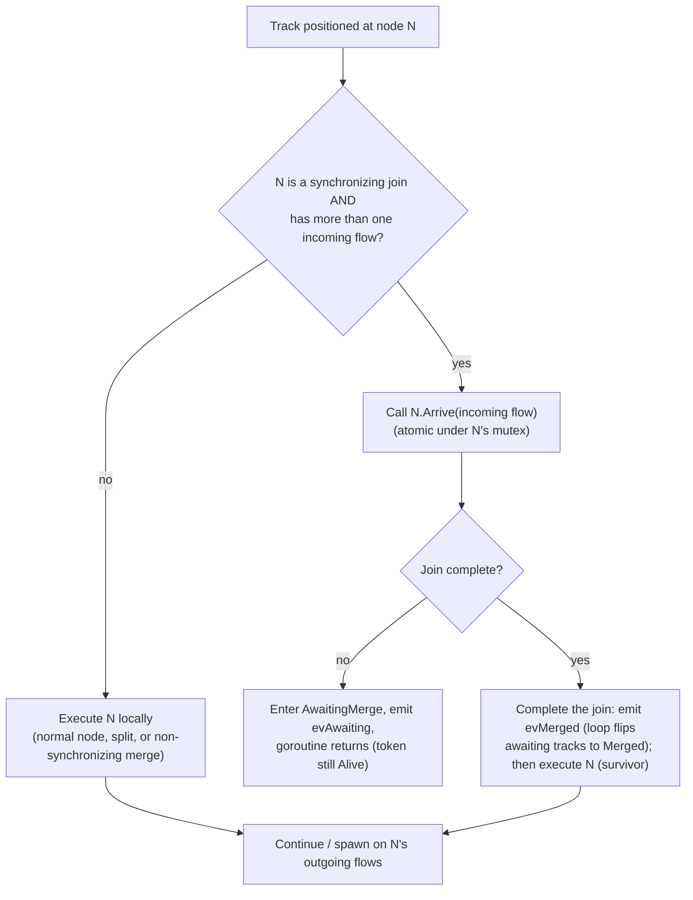
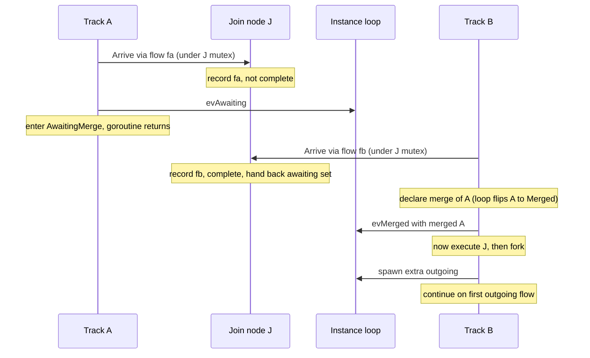
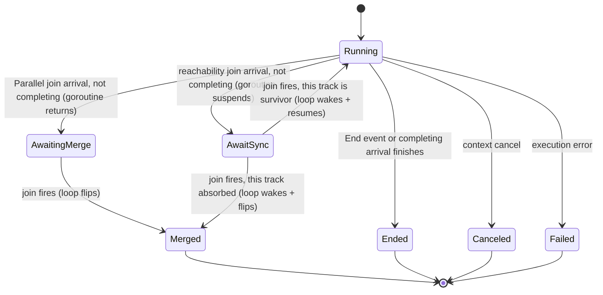
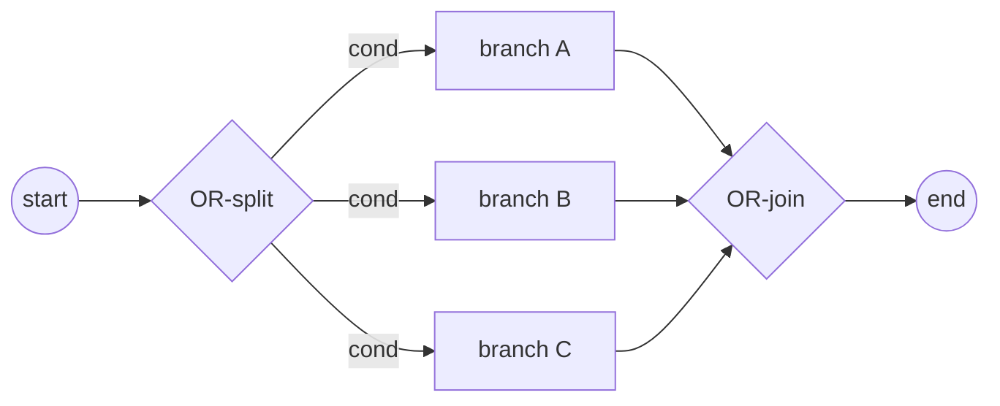
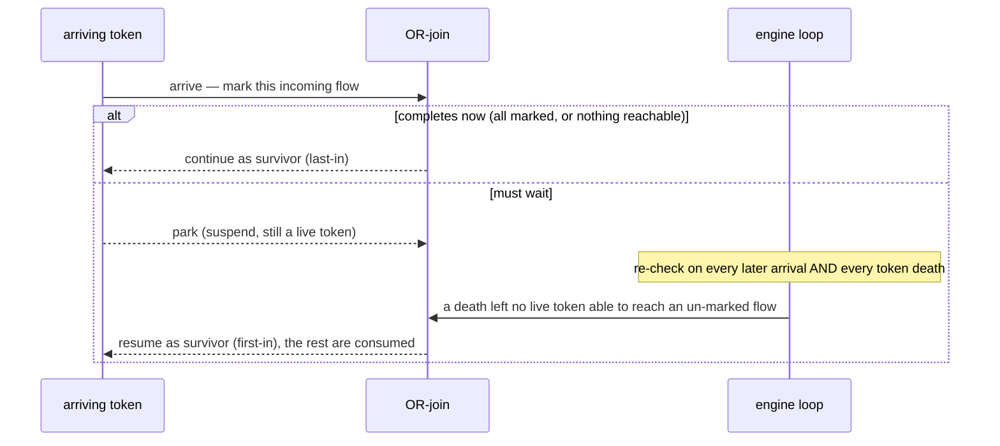
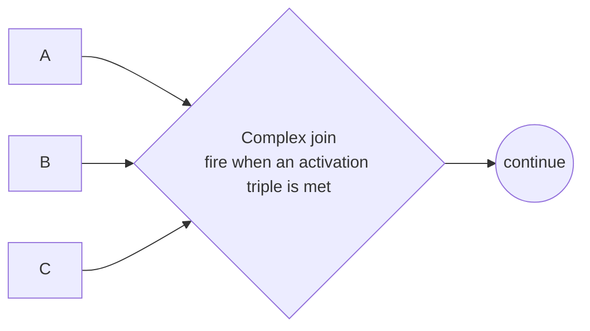
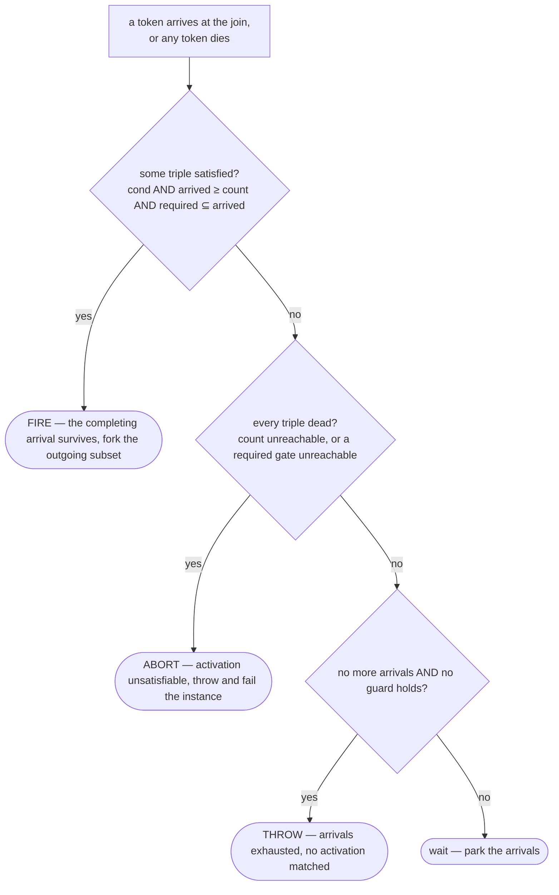

# ADR-005 — Шлюзы и Join'ы

| Поле | Значение |
|---|---|
| Статус | Принято |
| Версия | v.3 |
| Дата | 2026-06-09 |
| Владелец | Руслан Габитов |
| Уточняет | [ADR-001 v.5 Execution Model](ADR-001-execution-model.ru.md) |

> EN-оригинал — канонический: [ADR-005-gateways-and-joins.md](ADR-005-gateways-and-joins.md). Этот файл — его перевод (twin). При расхождении приоритет у английского текста.

> **Область.** Этот ADR решает **маршрутизирующие шлюзы** и общую для них модель
> координации track'ов: **Parallel** (split §2.2 + синхронизирующий join §2.3–§2.4),
> **Exclusive** (split §2.8; его merge — несинхронизирующий pass-through §2.3),
> **Inclusive** (split §2.9 + синхронизирующий **OR-join** §2.10) и **Complex**
> (split §2.9 + **activation-driven синхронизирующий join** §2.11). **Event-Based**
> отложен (§4). OR-join фиксирует **консервативную, двухуровневую,
> переоцениваемую-при-смерти-токена** реализацию стандартного синхронизирующего
> merge (§2.10); Complex join переиспользует ту же машинерию с завершением по
> activation-правилу (§2.11).
>
> **Статус реализации.** Parallel, Exclusive- и Inclusive-split'ы, Inclusive
> **OR-join** (§2.10) и шлюз **Complex** (§2.11 — activation-driven threshold join)
> все реализованы (вместе с сопровождающими SRD). Остаются Event-Based и отложенное
> из §4.

## 1. Контекст

BPMN маршрутизирует поток управления через **шлюзы**. Расходящийся шлюз форкает
поток токенов на несколько исходящих путей; сходящийся шлюз сливает или
синхронизирует входящие пути. Стандарт ([§13.4](../bpmn-spec/semantics/gateways.md))
определяет различные типы шлюзов — Exclusive, Parallel, Inclusive, Complex,
Event-Based — каждый со своим правилом fork-активации и join-синхронизации.

[ADR-001](ADR-001-execution-model.ru.md) установил модель исполнения движка:
Instance владеет одним или несколькими **track'ами** (каждый — нить исполнения,
несущая позицию потока); **токен** — логическая проекция позиции track'а; форк
создаёт track на каждую дополнительную ветвь (прибывший track продолжает на
одной); и **всё instance-scoped lifecycle-состояние мутируется единственной
goroutine event-loop'а** — track'и сообщают о прогрессе событиями и никогда не
мутируют это состояние напрямую. ADR-001 умышленно оставил два gateway-concern'а
этому ADR: какие исходящие flow активирует форк (по типу шлюза) и что происходит
в сходящемся узле (join/merge).

Этот ADR решает оба **для Parallel-шлюза** и тем самым фиксирует, как
**синхронизация** владеется в двухслойной модели — что имеет следствие для
контракта исполнения узла (§2.5).

## 2. Решение

### 2.1 Поведение шлюза — по типу; объектная модель стандарта зафиксирована

Каждый тип BPMN-шлюза несёт своё правило маршрутизации, поэтому движок реализует
каждый тип как собственное поведение узла, а не как центральный switch по
type-тегу. Направление шлюза (сходящийся / расходящийся / смешанный) и его
sequence flow берутся из объектной модели шлюзов стандарта, которая является
зафиксированной ground truth; движок реализует таксономию стандарта, он её не
изобретает.

### 2.2 Parallel split — активировать все исходящие

Расходящийся Parallel-шлюз производит один токен на **каждом** исходящем sequence
flow, безусловно (§13.4.1): без вычисления условий, без default flow, и он не
может упасть. В двухслойной модели это обычный форк — прибывший track продолжает
на одном активированном flow, а каждый оставшийся активированный flow становится
новым track'ом. (Его контрагент, **Exclusive split** — ровно *один* исходящий
flow, выбранный по условию — это §2.8.)

### 2.3 Join — синхронизирующий vs несинхронизирующий

Сходящийся узел (более одного входящего flow) либо синхронизирует, либо нет, что
решается **по типу шлюза**:

- **Несинхронизирующий** — Exclusive merge или неконтролируемый merge активности
  (который BPMN трактует как неявный Exclusive): каждый прибывший токен проходит
  насквозь и продолжает независимо. Никакого ожидания, никакого потребления.
- **Синхронизирующий** — Parallel (и позже Inclusive): шлюз ждёт ожидаемый набор
  входящих токенов, затем потребляет их и эмитит свой исходящий токен(ы).

Для **Parallel join** ожидаемый набор — **один токен на каждом входящем flow**
(§13.4.1): он срабатывает только когда каждый входящий flow доставил токен, и
потребляет ровно один токен на flow (избыточные токены на flow не потребляются).

### 2.4 Синхронизацией владеет синхронизирующий узел

Синхронизирующий шлюз владеет своей синхронизацией **полностью**: своим per-instance
**состоянием прибытия** (какие входящие flow доставили токен — node-owned состояние
согласно [ADR-009 v.1](ADR-009-per-instance-node-graph.ru.md)), своим **правилом
завершения** (Parallel: каждый входящий flow прибыл; Inclusive, позже: достижимое
подмножество) и **сериализацией**, делающей конкурентные прибытия безопасными
(**per-node mutex**). Track делает то, что говорит ему узел; он **не** просит loop
решать. Loop хранит только **lifecycle-бухгалтерию** — реестр track'ов и учёт
awaiting/ended — он больше не решает синхронизацию. (Это весь concern синхронизации
на узле; нет разделения mechanism-on-the-loop / rule-on-the-node — единственная
вариация по типу — это правило завершения, которое реализует каждый синхронизирующий
шлюз.)

Два track'а могут достичь join'а **конкурентно** (отдельные goroutine), поэтому шаг
прибытия узла **атомарен под его собственным mutex'ом**: записать прибывший flow,
проверить правило завершения и — когда завершено — освободить ожидающие track'и, всё
в одной критической секции.

- **Незавершающее прибытие завершает goroutine track'а.** Track входит в
  промежуточное состояние **`AwaitingMerge`**, и его **goroutine возвращается** — он
  *не* приостановлен и не может быть возобновлён; объект track'а **сохраняется** как
  запись (`evAwaiting` говорит instance держать его как *awaiting* — ни активным, ни
  завершённым). Он **ещё не** помечен `Merged`: пока join не сработал, какое прибытие
  является выжившим, неизвестно.
- **Завершающее прибытие — выживший.** Под node-mutex'ом оно собрало id ожидающих
  track'ов. Оно **сначала завершает join** — объявляя merge (`evMerged`), так что loop
  переводит каждый ожидающий track в **`Merged`** (его токен становится `Consumed`) —
  **прежде** чем узел исполняется (§2.5: синхронизация улаживается до исполнения).
  Затем оно **исполняет** join-узел и продолжает/форкает на исходящих flow.

В join'е не создаётся новый track — продолжение **едет на завершающем прибытии**
(дисциплина 1:1 track:позиция из ADR-001 держится). Какой прибывший track выживает —
просто тот токен, что завершает набор; BPMN требует только один токен наружу на
исходящий flow.

**Convergence — не parent-ребро.** Токен, достигающий join'а, имеет *много*
предшественников (каждая сошедшаяся ветвь), но токен записывает **одного** родителя
(его fork-origin). Поэтому merge **не** ре-парентит выжившего и не сворачивает
поглощённые track'и в его lineage — это заставило бы выжившего притязать на track,
который он породил, как на своего родителя, цикл, ломающий реконструкцию истории.
Convergence вместо этого представляется собственной терминальной (`Consumed`) записью
каждого поглощённого track'а в join-узле; выживший сохраняет свой creation lineage
нетронутым.

**Race-safety.** Только выживший когда-либо исполняет join-узел, поэтому никакие два
track'а не запускают его `Exec` одновременно. Состояние прибытия — node-local под
mutex'ом узла и per-instance ([ADR-009 v.1](ADR-009-per-instance-node-graph.ru.md))
— никогда не гонится между track'ами или instance'ами. (Cross-instance race на
разделяемом узле, который ранний draft откладывал на будущий Persistence ADR, уже
разрешён ADR-009.)

Конкретный протокол — события, которые track шлёт loop'у, как track решает, что
делать в узле, и диаграммы состояний/rendezvous — это §2.7.

### 2.5 Контракт исполнения узла — единственный Execute

Ответственность узла — **исполнить**: произвести свои исходящие токены (маршрутизация
шлюза) или выполнить свою активность. Синхронизация (§2.4) — отдельный concern,
который синхронизирующий узел улаживает **прежде** чем исполняет — через свой шаг
`Arrive`, не через pre-/post-execution-хуки — поэтому контракт исполнения узла
схлопывается в **единственный шаг Execute**. Прежние pre-/post-execution-хуки (узловой
"prologue" и "epilogue") существовали, когда узлы управляли потоком управления; при
координации track'ами они избыточны и **удалены**. Concern'ы, для которых они
использовались, перемещаются на слой, который ими владеет:

- **Subscription** catch/receive-узла на message/signal владеется event &
  subscription machinery (ADR-006), которая приостанавливает и позже возобновляет
  track; Execute узла потребляет доставленное событие. Это не узловой
  prologue/epilogue.
- **Регистрация** human task'а для взаимодействия — часть исполнения этого task'а
  (его Execute регистрирует, затем ждёт исход), не отдельный хук.

Где это противоречит текущему интерфейсу узла, реализация удаляет хуки и перемещает их
логику — концепция ведёт, код следует.

### 2.6 Потребление токенов остаётся узким

Токены потребляются только в End Event'ах и Terminate, как поглощённые токены
синхронизирующего join'а (§2.4), как **trailing-токены, которые Complex-шлюз
отбрасывает после срабатывания** (§2.11 — discriminator / partial join игнорирует
прибытия после активирующего) и при withdrawal. Несинхронизирующий merge никогда не
потребляет токены.

### 2.7 Координация track ↔ Instance (механика)

Track выполняется автономно в своей собственной goroutine, продвигаясь узел за узлом.
В каждом узле он спрашивает узел, что делать; только **синхронизирующий join** меняет
курс track'а. Единственная goroutine event-loop'а Instance'а владеет
**lifecycle-бухгалтерией** — реестром track'ов и учётом awaiting/ended; ей сообщают о
lifecycle-изменениях через события, но она **не** решает синхронизацию. События текут
track → loop — уведомления; loop никогда не блокируется в ожидании ответа.
Единственный нюанс — **parked** track: он приостанавливает *сам себя* сразу после
уведомления и ждёт позднейшего resume-сигнала loop'а (§2.10 / §2.11).

| Событие (track → loop) | Возникает когда | Loop делает |
| -------------------- | ------------------------------------------------------------------------------------------- | ----------------------------------------------------------------------------------- |
| **spawn**            | форк активировал дополнительные исходящие flow | создаёт + регистрирует один track на каждый дополнительный flow |
| **awaiting**         | прибытие на **Parallel** join не завершило его, и **goroutine track'а вернулась** | записывает track как *awaiting* — ни активным, ни завершённым; объект track'а сохраняется |
| **parked**           | прибытие на **reachability** join (OR §2.10 / Complex §2.11) не завершило его, и track **приостановил свою goroutine** на resume-канале | записывает track как *awaiting-sync*; его goroutine остаётся живой (по-прежнему учитывается), пока loop её не **разбудит** — возобновить как выжившего или потребить как merged |
| **merged**           | завершающий track объявляет поглощённые track'и (по id) | loop разрешает id и переводит каждый в `Merged`, удаляя их из *awaiting* |
| **ended**            | track завершился (end event, отменён, упал) | дерегистрирует его; когда не остаётся активных или ожидающих, завершает instance |

**Что управляет каждым событием — единообразные структурные правила, не узел.** Track
**не** спрашивает узел "какое событие мне эмитить". Он выводит события из структуры, и
только **один** вопрос специфичен для узла:

- **Форк** управляется тем, сколько flow возвращает `Exec`. Для **любого** узла track
  продолжает на одном активированном flow и эмитит `spawn` для остальных. Узел
  контролирует только *count* (Exclusive возвращает один → нет форка; Parallel и
  неконтролируемый activity-split возвращают все → форк). Task с несколькими исходящими
  форкает ровно как Parallel split — нет fork-логики, специфичной для типа узла.
- **Merge** — это **только** concern синхронизирующего join'а. Несинхронизирующий
  merge — Task, промежуточное событие или Exclusive-шлюз, достигнутый более чем одним
  входящим flow — это **pass-through**: каждый прибывший токен исполняет узел независимо
  и продолжает, с **никаким событием и никаким потреблением** (неконтролируемый merge
  BPMN = неявный Exclusive).

**Как track решает, что делать в узле.** В узле N track задаёт единственный
node-специфичный вопрос: реализует ли N `SynchronizingJoin` **и** имеет более одного
входящего flow? Если нет, он исполняет N локально (обычный узел, split или
несинхронизирующий merge). Если да, он вызывает **`N.Arrive(его входящий flow)`** —
атомарно под mutex'ом N (§2.4) — что возвращает один из ровно двух ответов: *стоп и
жди* → park (**Parallel** join входит в `AwaitingMerge`, и goroutine **возвращается**;
**reachability** join — OR §2.10 / Complex §2.11 — входит в `AwaitSync`, и goroutine
**приостанавливается** на resume-канале); *исполняй* → продолжай как выживший.

**Rendezvous синхронизирующего join'а** — две ветви сходятся на join `J`;
*завершающее* (второе) прибытие выживает, первое поглощается:

Какая ветвь прибывает первой — несущественно — mutex J сериализует прибытия, поэтому
тот токен, что *завершает* набор, является выжившим.

**Lifecycle track'а** — `AwaitingMerge` (Parallel) промежуточный: goroutine уже
вернулась; объект track'а сохраняется как запись, пока join не сработал. **Reachability**
join (OR/Complex) вместо этого использует `AwaitSync`: goroutine
**приостановлена, не возвращена**, и loop **возобновляет** её, когда join срабатывает
(§2.10 / §2.11):

Mutex J делает прибытие атомарным, поэтому ровно одно прибытие на join завершает набор
и становится выжившим; остальные входят в `AwaitingMerge` (Parallel — их goroutine
вернулись) или `AwaitSync` (reachability join'ы — их goroutine приостановлены) и
переводятся в `Merged`, когда он срабатывает. В join'е не создаётся track; продолжение
едет на завершающем прибытии (§2.4).

**Форк по исходящим flow** (без изменений относительно ADR-001 §4.4). После того как
`Exec` узла вернул активированные исходящие flow, track **продолжает на одном сам** —
предпочитая flow, петляющий обратно в тот же узел (cyclic/self flow), если такой есть,
иначе первый — и эмитит **spawn** для оставшихся flow, по одному новому track'у на
каждый. Parallel split питает это **всеми** исходящими flow (§2.2); механика в остальном
такая же, как у любого форка.

**Смешанный шлюз (N входящих *и* M исходящих).** BPMN позволяет одному Parallel-шлюзу
одновременно сходиться и расходиться. Это **не требует особой машинерии** — это
join-половина, за которой следует fork-половина на **одном выжившем track'е**:
завершающее прибытие join'ит (эмитит `evMerged`), исполняет узел (`Exec` возвращает все
M исходящих), затем форкает (продолжает на одном, эмитит `spawn` для остальных). Так
instance получает **`evMerged`, затем `spawn`** последовательно из той же goroutine;
loop применяет их FIFO (merge-бухгалтерия, затем создание track'ов). Выживший остаётся
**активным через оба события** — он никогда не завершается между ними — поэтому instance
не может преждевременно завершиться; нетто, N токенов потреблено и M произведено (N−1
merged + выживший → выживший + M−1 spawned).

### 2.8 Exclusive split — data-based exclusive choice (первое подходящее условие)

Расходящийся **Exclusive**-шлюз маршрутизирует прибывший токен на **ровно один**
исходящий flow — data-based exclusive choice (§13.4.2, Table 13.2):

- Исходящие flow несут **condition-выражения**, вычисляемые **в объявленном порядке**.
  **Первое** условие, вычисляющееся в `true`, выбирает этот flow, и **дальнейшие
  условия не вычисляются** (short-circuit).
- Если **ни одно** условие не `true`, токен берёт **default** flow (атрибут `default`
  шлюза, §13.4.2).
- Если ни одно условие не `true` **и** нет default flow, шлюз **роняет instance** с
  исключением (§13.4.2) — немаршрутизируемый токен — ошибка моделирования, никогда не
  тихий drop.
- **Порядок значим**: авторы моделей выражают приоритет ветвей через порядок исходящих
  flow шлюза (§13.4.2 engine note).

Это per-type split-правило, которое предвосхищает §2.1, и контрагент Parallel split
(§2.2): где Parallel возвращает **все** исходящие flow, Exclusive возвращает **ровно
один**. Поэтому он питает fork-механику §2.7 единственным flow — выживший track
продолжает на нём и эмитит **никакой `spawn`** (нет форка). Exclusive **merge** не
требует ничего нового: это несинхронизирующий pass-through, уже решённый в §2.3/§2.7 —
каждый входящий токен срабатывает шлюз независимо, без ожидания и без потребления
(неконтролируемый merge BPMN = неявный Exclusive). Так *смешанный* Exclusive-шлюз (N
входящих, M исходящих) — просто pass-through-на-прибытие, за которым следует
choose-one split, без синхронизации.

Условия — стандартный `FormalExpression` на sequence flow, вычисляемый против данных
instance'а. **Механика вычисления** — какой движок выражений их запускает, scope данных,
который они читают, как surface'ится ошибка вычисления и как трактуется
conditionless-non-default flow — то, что фиксирует сопровождающий SRD (code-grounded);
этот ADR фиксирует только **правило выбора** выше, standard-grounded.

### 2.9 Inclusive split — форкнуть каждое подходящее условие

Расходящийся **Inclusive**-шлюз маршрутизирует токен на **каждый** исходящий flow, чьё
условие `true` — одна или несколько ветвей (§13.4.3, Table 13.3):

- Все исходящие условия вычисляются (нет гарантии порядка); токен производится на
  **каждом** flow, чьё условие `true`.
- Если **ни одно** условие не `true`, токен берёт **default** flow.
- Если ни одно условие не `true` и нет default, шлюз **роняет instance** (§13.4.3).

Это §2.1 per-type split, который сидит между Parallel (все flow, безусловно — §2.2) и
Exclusive (ровно один — §2.8): Inclusive возвращает **условно-true подмножество** (≥1).
Раз подмножество выбрано, оно питает fork-механику §2.7 без изменений — выживший track
продолжает на одном, `spawn` для остальных. Механика вычисления — за SRD (как §2.8).

### 2.10 Inclusive (OR) join — синхронизирующий merge

Сходящийся Inclusive-шлюз — это **синхронизирующий merge** (WCP-7): он ждёт каждый
токен, который *ещё мог бы* прибыть, затем срабатывает один раз. Это синхронизирующий
join (§2.3/§2.4) с **нелокальным правилом завершения** — единственный шлюз, чьё решение
о срабатывании инспектирует распределение токенов по всему instance'у, не только свои
входящие flow.

**Нормативное правило (§13.4.3, Table 13.3).** Join активируется тогда и только тогда,
когда хотя бы один входящий flow имеет токен **и**, для каждого направленного пути (не
посещающего join) от токен-несущего flow к *пустому* входящему flow join'а, есть *также*
путь от того токена к уже-*marked* входящему flow join'а. При срабатывании он потребляет
один токен на marked входящий flow, вычисляет все исходящие условия и форкает true-
подмножество (default/exception по §2.9) — §2.10 join, за которым немедленно следует
§2.9 split на выжившем.

Diamond и решение, которое join принимает на каждом прибытии и каждой смерти:

**Реализация в движке (выбор gobpm — консервативная, двухуровневая,
переоцениваемая-при-смерти-токена).** refinement-clause спеки редко существенна; gobpm
реализует практичную, консервативную форму, которую подтверждает Camunda 7 (внутренний
анализ: *Camunda 7 — Inclusive Gateway join*), с одним намеренным улучшением над ней:

- **Двухуровневая активация.** *Fast path* — токен прибыл на **каждом** входящем flow
  → срабатывать, без анализа. *Slow path* — тест **reachability** над статическим
  per-instance графом узлов (ADR-009): если **никакой** активный track больше не может
  достичь un-marked входящего flow join'а, срабатывать; иначе ждать. Конкретно он идёт
  **назад** от каждого un-marked входящего flow к старту — этот flow всё ещё достижим,
  если живой токен сидит где-либо на его обратном замыкании (обход short-circuit'ится на
  первом и никогда не пересекает join). Обход **cycle-guarded** (visited-set, так что
  циклические модели не могут подвесить решение) и **игнорирует условия flow** (будущие
  исходы условий токена непознаваемы в момент решения, поэтому он трактуется как
  способный пройти любой структурный путь). Это консервативная форма *single*-reachability-
  per-track — она ошибается только в сторону **более долгого ожидания** — не two-path
  refinement-clause спеки.
- **Переоценивается при смерти токена, не только при прибытии.** Правило завершения
  перепроверяется как когда токен **прибывает** в join, **так и** когда любой track
  **умирает** (завершается / отменяется / merge'ится в другом месте) — смерть может
  убрать последний токен, который ещё мог достичь un-marked flow. Это **исправляет худший
  failure mode Camunda 7**, где join проверяется *только* при прибытии, поэтому
  прерванная ожидаемая ветвь подвешивает join **навсегда**. Единственный event-loop
  gobpm и так наблюдает lifecycle каждого track'а, поэтому переоценка каждого ожидающего
  OR-join при смерти track'а — строгое улучшение, которое двухслойная модель делает
  естественным.
- **Маркировка per-incoming-flow** (а не per-gateway token count), так что правило
  остаётся корректным, когда циклы пере-взводят join (само пере-взведение отложено, §4).
- **Ownership остаётся §2.4.** Join владеет своим состоянием прибытия под своим
  **per-node mutex'ом**; прибытия атомарны. Единственное расширение в том, что его
  правило завершения читает **позиции активных track'ов** instance'а (поставляемые
  loop'ом) — узел по-прежнему владеет *решением*, он просто консультируется с более
  широкой маркировкой, чем локальный count Parallel'а.

**Park-and-resume.** Это единственная способность, которая обычному (Parallel) join'у не
нужна. Parallel-прибытие либо завершает join (и продолжает), либо завершается; ничто не
ждёт пробуждения. OR-join может завершиться **без дальнейшего прибытия** (death-case),
поэтому токен, который прибыл, но ещё не может завершить join, должен **park'нуться** —
он приостанавливается на месте, по-прежнему учитываясь как живой токен, удерживающий
свою позицию, ни завершённый, ни поглощённый — пока re-check движка не уладит его судьбу.
Движок перепроверяет ожидающий join по **двум триггерам**: каждое позднейшее **прибытие**
в него и каждая **смерть токена** где угодно. Когда проверка завершает join, движок
будит park'нутые токены: один **возобновляется** как выживший, остальные **потребляются**
(merged). Токен, уже **в пути в** join (на входящем flow, но ещё не зарегистрированный),
— надвигающееся прибытие, и оно **откладывает** срабатывание, пока не зарегистрируется —
так sibling, который вот-вот пометит flow, никогда не загоняется в преждевременное
срабатывание.

**Срабатывание и выживший.** **Прибытие**, которое завершает join, — **выживший** —
завершающее прибытие (**last-in**) продолжает прямо, потребляет marked-токены, затем
исполняет и форкает исходящее подмножество (§2.9), ровно как Parallel. Срабатывание,
**вызванное смертью**, не имеет прибытия для езды, поэтому движок **промоутит
раньше-всех-прибывший park'нутый токен** (**first-in**) как выжившего и возобновляет
его; остальные потребляются. (Какой park'нутый токен выживает — несущественно для
результата — один токен покидает join в любом случае — поэтому это выпадает из механизма:
last-in на прибытии, first-in на смерти. Parallel никогда не срабатывает из loop'а;
death-trigger OR-join'а — единственное место, где движок это делает.)

**Область.** Ацикличный, single-pass (§4): каждый входящий flow маркируется однажды;
loop-re-arming отложен. Complex-шлюз переиспользует этот тест reachability (§2.11).

### 2.11 Complex-шлюз — activation-driven синхронизирующий join (discriminator / partial join)

Complex-шлюз — общий синхронизирующий шлюз: он срабатывает по своему **собственному,
gateway-level условию**, не только по flow-условиям. Это единственный шлюз в области
gobpm, который сидит **выше** Common Executable Subclass (conformance §2.1.3) — явное
расширение, включённое ради паттернов, которые остальные не могут выразить:
**Structured / Blocking Discriminator** (WCP-9 / WCP-28) и **Structured / Blocking
Partial Join** (WCP-30 / WCP-31).

**Нормативная модель (§13.4.5).** Каждый входящий gate несёт `activationCount` (токены
на этом flow); шлюз имеет `activationExpression` — Boolean над этими counts (например,
`x1 + … + xm ≥ 3`), опционально над данными процесса — и запускает **двухфазную**
машину: *waitingForStart* (когда выражение становится true, потребить прибывшие токены,
вычислить исходящие условия, эмитить true-подмножество / default) → *waitingForReset*
(ждать trailing-токены — с отсечением по **Inclusive graph-reachability** для тех, что
больше не могут прибыть — затем пере-взвестись). Расходясь, он ведёт себя как Inclusive
split.

**Реализация в движке (выбор gobpm — активация как guarded count-thresholds).**

- **Расходящийся** Complex = Inclusive split (§2.9): форкнуть условно-true исходящее
  подмножество (default / exception как §2.8).
- **Сходящийся** Complex = **синхронизирующий join, управляемый activation-правилом** —
  дизъюнкция **triple'ов** `(condition, count, requiredFlows)`:
  - **`condition`** — опциональный data guard: обычное flow-style выражение над
    **данными процесса** (отсутствует = всегда true);
  - **`count`** — сколько входящих flow должны были прибыть (всего);
  - **`requiredFlows`** — опциональный набор входящих flow, которые должны быть **среди**
    прибывших.

  Шлюз **срабатывает, когда некоторый triple удовлетворён**: его `condition` держится,
  `arrived ≥ count`, и каждый gate из `requiredFlows` прибыл. Голый порог "N из M" — это
  вырожденный triple `(—, N, ∅)` — **N = 1** Discriminator, **1 < N < M** Partial Join,
  **N = M** Parallel join; guard делает порог data-dependent; `requiredFlows`
  закрепляет конкретные gate'ы ("ветвь CFO должна быть одной из двух").

  > **Engine note — активация как дизъюнкция guarded count-thresholds, не
  > count-выражение.** gobpm **не** реализует `activationExpression` из §13.4.5
  > инъекцией per-gate `activationCount`'ов в namespace выражения — это вынудило бы
  > зарезервированные имена переменных, конфликтующие с переменными процесса. Вместо
  > этого активация **структурирована**: data `condition` каждого triple'а остаётся
  > чистым выражением над данными процесса, тогда как **count** и **идентичности gate'ов**
  > (`requiredFlows`) живут в самом triple'е, никогда в выражении. Namespace данных не
  > тронут (нет зарезервированных имён, нет префиксов), при этом правило всё равно
  > покрывает пространство стандарта — count-пороги, data-aware активацию и per-gate
  > требования. Единственная форма, которую он опускает, — *немонотонный* count
  > (например, "ровно 2"), от которого §13.4.5 сам отводит моделистов во избежание
  > осцилляции. `activationExpression` стандарта задокументирован выше и остаётся
  > референсом.

- **Переиспользует §2.10 целиком.** Сходящийся Complex-шлюз — синхронизирующий join
  (§2.4): он **park'ит** незавершающие прибытия, и движок **перепроверяет его при каждом
  прибытии и каждой смерти токена** — та же park/resume + reachability машинерия, что и
  у OR-join'а. Различается только **правило завершения**. Пусть `arrived` = входящие
  flow, доставившие токен, и `reachable` = un-marked входящие flow, всё ещё достижимые
  живым токеном (обратный тест §2.10):

  - **Fire** когда некоторый triple удовлетворён (`condition` true, `|arrived| ≥ count`,
    `requiredFlows ⊆ arrived`): завершающее прибытие — **выживший** (last-in),
    потребляет marked-токены, затем исполняет и форкает исходящее подмножество (§2.8–§2.9
    flow-условия / default / exception). Если одно прибытие удовлетворяет несколько
    triple'ов, любой из них срабатывает — результат тот же.
  - **Abort** когда **каждый** triple **мёртв** — доказуемо никогда не удовлетворим:
    `|arrived| + |reachable| < count` (его count никогда не может быть достигнут) **или**
    gate из `requiredFlows` ни прибыл, ни достижим (обязательный gate никогда не сможет
    прийти). Шлюз тогда **бросает** и роняет instance вместо вечной блокировки —
    death-trigger anti-hang OR-join'а (§2.10), применённый к activation-правилу. Каждый
    count — `≥`-порог (монотонный), а gate-reachability структурна, поэтому этот тест
    **точный**.
  - **Exhaustion no-match** — когда больше никакие токены не могут прибыть (`reachable`
    пуст) и ни одного triple'а `condition` не держится, шлюз **бросает** "arrivals
    exhausted, no activation matched", ровно правило Exclusive "no condition matched and
    no default" (§2.8).
  - **Wait** иначе: прибытие park'ится.

- **Trailing-токены.** Раз сработав, Complex-шлюз в этой области **потребляет** любое
  позднейшее прибытие на других своих входящих flow (track этого токена завершается в
  шлюзе) — single-pass форма reset'а стандарта. Он **не** пере-взводится.

**Валидация — каждый triple ограничен.** Для каждого triple'а: `1 ≤ count ≤ M` (M =
число входящих flow шлюза — `count < 1` срабатывал бы ни на чём, `count > M`
неудовлетворим с самого начала), `count ≥ |requiredFlows|` (нельзя требовать больше
конкретных gate'ов, чем позволяет бюджет), и каждый id в `requiredFlows` — настоящий
входящий flow. `count ≥ 1` и проверка `count ≥ |requiredFlows|` запускаются, когда шлюз
строится; **`count ≤ M`** и membership flow-id проверяются при **валидации процесса
(регистрации)**, раз входящие flow слинкованы — процесс с out-of-range activation-правилом
**отвергается, не запускается**. Требуется хотя бы один triple.

**Область — полна для ацикличного движка.** Сходящийся activation join (срабатывание,
abort, exhaustion no-match и потребление trailing-токенов после срабатывания), §2.9
расходящийся split и валидация активации — это **весь** Complex-шлюз под single-pass
моделью движка — нет **Complex-specific follow-up**. Единственное, что вне области, —
**пере-взведение после срабатывания**: phase-2 *reset* стандарта — ровно пере-взвод,
которому нужен loop для доставки второй волны токенов, поэтому это engine-wide
loop-deferral (§4), применяющийся идентично к Parallel и OR — не Complex-образный пробел.

## 3. Следствия

- Движок получает настоящий fork/join: любой ацикличный процесс, использующий Parallel
  split и/или синхронизирующий join, исполняется корректно — поднимая его с linear-only
  до ветвящегося потока управления (roadmap M1 MVP).
- Синхронизирующий узел получает учёт прибытий + **per-node mutex**; loop получает
  *awaiting*/*merged*-бухгалтерию (нет логики решения). Незавершающее Parallel-прибытие
  входит в **`AwaitingMerge`**, и его goroutine возвращается; reachability join
  (OR/Complex) входит в **`AwaitSync`**, и его goroutine приостанавливается, пока loop
  её не возобновит (§2.7 / §2.10 / §2.11).
- Шов синхронизирующего join'а (§2.4) — переиспользуемая основа для Inclusive/Complex.
- Интерфейс узла упрощается до одного Execute (§2.5); prologue/epilogue-хуки удалены, а
  их логика перемещена.
- Parallel join, чей ожидаемый входящий набор никогда не может завершиться (upstream
  exclusive choice обходит одну входящую ветвь), **дедлокит instance** — ошибка
  моделирования BPMN; её обнаружение вне области (§4).
- Движок получает **data-based routing**: Exclusive выбирает одну ветвь по условию
  (§2.8), Inclusive форкает true-подмножество (§2.9) — так процесс может ветвиться по
  данным, не только форкать безусловно (Parallel). XOR завершает пару XOR/AND (epic #81);
  OR-split + OR-join (§2.10) покрывают Inclusive-половину epic #93. Оба split'а
  переиспользуют per-type framing (§2.1) и fork-механику §2.7 без изменений.
- Модель синхронизации (§2.4) получает своё первое **нелокальное** правило завершения
  (OR-join, §2.10): loop переоценивает ожидающий OR-join при **смерти токена**, не только
  при прибытии, и может **сам сработать join** (промоутя ожидающий track в выжившего) —
  новый loop-путь, который Parallel никогда не нуждался. Это то, что убирает классическую
  ловушку Camunda-7 "OR-join подвисает, когда ожидаемая ветвь прервана".

## 4. Отложено / вне области

- **OR-join refinement clause.** §2.10 берёт консервативную single-reachability форму;
  two-path refinement-clause стандарта (токен, который может *также* достичь marked
  входящего flow, не блокирует) **не** реализован — редко существенен, и он всегда
  ошибается только в сторону более долгого ожидания.
- **Event-Based шлюз** и его producer withdrawn-токенов (race-loss sibling'и завершаются
  как withdrawn) — завязан на event-доставку
  ([ADR-006](ADR-006-events-and-subscriptions.ru.md)). Отложено.
- **Циклы и избыточные токены (единственный cross-cutting deferral).** Эта концепция
  ограничивается **ацикличными, single-pass** join'ами — Parallel, OR **и Complex**
  одинаково: каждый входящий flow маркируется однажды, и join срабатывает, когда его
  правило завершения выполнено за единственный проход. **Пере-взведение join'а под циклом
  отложено единообразно для всех типов join'ов** — и стандартный **phase-2 reset
  Complex-шлюза — это в точности его пере-взвод**, поэтому он попадает сюда, не как
  Complex-specific пробел. Ему нужна поддержка циклов, которой у движка ещё нет; ни один
  шлюз не остаётся наполовину построенным из-за этого.
- *(Разрешено, больше не отложено:* shared-node data race несинхронизирующего merge
  исправлен per-instance графом узлов [ADR-009 v.1](ADR-009-per-instance-node-graph.ru.md)
  — каждый instance владеет своими объектами узлов, поэтому merge над одним узлом больше
  не гонится между instance'ами. Per-execution поток данных внутри instance'а — concern
  [ADR-010](ADR-010-process-data-model.ru.md).)*

## 5. Рассмотренные альтернативы

- **First-arrived выживший** (vs. completing/last). Отклонено: это вынуждает первый
  track ждать, а любой merge'ащийся track трогать разделяемый узел; completing-arrival
  выживший, чьи не-выжившие никогда не исполняют узел, проще и race-avoiding (§2.4).
- **Спавн свежего continuation-track'а в join'е.** Отклонено: нарушает "в join'е новый
  track не создаётся" из ADR-001 и 1:1 track-handoff.
- **Центральный gateway-type switch.** Отклонено: per-type поведение узла открыто для
  расширения; центральный switch — закрытый набор, который каждый новый шлюз должен
  редактировать.
- **Loop-serialized решение + verdict-канал** (ранний draft этого ADR): track эмитит
  событие `arrive` и *блокируется* на reply-канале, пока loop записывает прибытие и
  решает. Отклонено: теперь, когда узел владеет своим per-instance состоянием
  ([ADR-009 v.1](ADR-009-per-instance-node-graph.ru.md)), track может спросить узел
  напрямую; loop round-trip и verdict-канал — ненужный overhead. Узкий per-node mutex
  проще и яснее (§2.4).
- **Блокирующий узел** (узел — или track — который держит goroutine **приостановленной**,
  пока не прибудут sibling'и). Отклонено: goroutine ожидающего track'а **возвращается**;
  track сохраняется как объект в `AwaitingMerge`, поэтому никакая goroutine не
  удерживается (§2.7).
- **Разделение mechanism-on-the-loop / rule-on-the-node.** Отклонено: при node-owned
  состоянии и per-node mutex'е узел владеет всем concern'ом синхронизации; единственная
  вариация по типу — правило завершения. Нет mechanism/policy-layering для поддержки.
- **Сохранение prologue/epilogue-хуков.** Отклонено (§2.5): избыточны при координации
  track'ами; subscription и регистрация принадлежат своим owning-слоям.

## 6. Ссылки

- [ADR-001 v.5 Execution Model](ADR-001-execution-model.ru.md) — двухслойный runtime
  (fork §4.4; join перемещён §4.5; владение runtime-состоянием §4.7).
- [ADR-009 v.1 Per-instance node graph](ADR-009-per-instance-node-graph.ru.md) —
  per-instance граф узлов, на котором живёт состояние прибытия join'а; разрешает
  shared-node data race, который ранний draft откладывал.
- [bpmn-spec/semantics/gateways.md](../bpmn-spec/semantics/gateways.md) (§13.4 —
  Exclusive §13.4.2, Inclusive §13.4.3 + Table 13.3),
  [token-flow.md](../bpmn-spec/semantics/token-flow.md) — нормативная gateway/token
  семантика.
- [docs/camunda7/or-join-inclusive-gateway.md](../camunda7/or-join-inclusive-gateway.md)
  — внутренний референс-анализ OR-join'а Camunda 7 (engine precedent), который обосновал
  консервативную, двухуровневую, переоцениваемую-при-смерти-токена реализацию §2.10 и
  отклонения, которые gobpm намеренно держит или исправляет.

## 7. Открытые вопросы

- **Нет.** Маршрутизирующие шлюзы — Parallel, Exclusive, Inclusive (split + join) и
  Complex (activation join, §2.11) — решены. Event-Based, OR-join refinement clause,
  Complex phase-2 reset / re-arm и loop re-arming — намеренные отложения (§4), не
  открытые вопросы.

## Document History

| Версия | Дата | Автор | Изменение |
|---|---|---|---|
| v.1 | 2026-06-09 | Руслан Габитов | Авторизован полностью для **Parallel (AND) шлюза** (split + синхронизирующий join), приземлён с сопровождающим SRD. Решения: per-type поведение шлюза (нет центрального type switch); Parallel split производит токен на каждом исходящем flow; **синхронизация принадлежит синхронизирующему узлу** — он держит своё per-instance состояние прибытия ([ADR-009 v.1](ADR-009-per-instance-node-graph.ru.md), Accepted), правило завершения и **per-node mutex**, делающий конкурентный `Arrive` атомарным; незавершающее прибытие входит в промежуточное состояние **`AwaitingMerge`**, и его goroutine возвращается (объект track'а сохраняется как запись, instance уведомлён через `evAwaiting`); **завершающее прибытие** — выживший — он сначала завершает join (объявляет id поглощённых track'ов через `evMerged`; loop переводит каждый в `Merged`) **перед** исполнением узла, затем исполняет и форкает; creation lineage выжившего оставлен нетронутым (convergence записывается собственными терминальными `Consumed`-записями поглощённых track'ов, а не ре-парентингом выжившего); loop хранит только awaiting/ended-бухгалтерию. **Контракт исполнения узла схлопывается в единственный Execute** — prologue/epilogue-хуки удалены, их concern'ы (subscription → ADR-006; регистрация взаимодействия → Execute task'а) перемещены. Inclusive/Complex/Event-Based и циклы/избыточные токены отложены (§4); shared-node race несинхронизирующего merge **разрешён ADR-009**. Заменяет seed v.1 Draft и промежуточный loop-serialized/verdict-channel драфт (отклонён, когда ADR-009 сделал узел владельцем своего состояния — §5). Refines pin ADR-001 v.5. |
| v.1 | 2026-06-11 | Руслан Габитов | **Принято**, приземлено через SRD-005 v.1. Две детали контракта улажены при реализации и свёрнуты обратно в §2.4/§2.7: `Arrive` узла обменивается **track id** (не `*track`/`any`), сохраняя узел model-слоя свободным от runtime-типа; и merge **не** сворачивает поглощённые track'и в lineage выжившего — токен в join'е имеет много предшественников, но токен записывает одного родителя, поэтому convergence несётся собственными терминальными `Consumed`-записями поглощённых track'ов (сворачивание производило циклическое parent-ребро). Refines pin ADR-001 v.5. |
| v.2 | 2026-06-19 | Руслан Габитов | Принято. Завершает концепцию **маршрутизирующих шлюзов** тремя новыми секциями. **§2.8 Exclusive (XOR) split** — data-based exclusive choice (§13.4.2, Table 13.2): условия в объявленном порядке, **first-true** (short-circuit), **default** когда ни одно, **instance failure** когда ни одно + нет default; контрагент §2.2 (Parallel = все), возвращающий ровно один → §2.7 fork без `spawn`; XOR merge уже был non-sync pass-through (§2.3/§2.7). **§2.9 Inclusive (OR) split** — форкнуть условно-**true подмножество** (≥1), default/exception как XOR (§13.4.3). **§2.10 Inclusive (OR) join** — синхронизирующий merge (WCP-7, §13.4.3/Table 13.3): **нелокальное** правило завершения, реализованное как **консервативная, двухуровневая** форма gobpm (fast path = все входящие marked; slow path = condition-ignoring, cycle-guarded **reachability** DFS над статическим графом ADR-009 — срабатывать, когда никакой активный track больше не может достичь un-marked входящего flow), **переоцениваемое при смерти токена, а также при прибытии** (loop перепроверяет ожидающие OR-join при любом track end/cancel/merge и может сам сработать join, промоутя ожидающий track в выжившего) — умышленно исправляя arrival-only отклонение Camunda 7, которое подвешивает OR-join, когда ожидаемая ветвь прервана; маркировка per-incoming-flow; ownership/mutex остаются §2.4. Консервативный вариант выбран вместо spec refinement clause (редко существенна, ошибается только в сторону ожидания). Реализация нарезана: **XOR + OR-split первыми, OR-join свой SRD**; механика вычисления/reachability делегирована этим SRD (code-grounded). Отвечает на v.1 OR-join open question (§7); Complex/Event-Based и loop re-arming остаются отложенными (§4). Standard-grounded против `bpmn-spec/semantics/gateways.md` §13.4.2/§13.4.3; OR-join обоснован внутренним анализом OR-join Camunda 7 (§6). Refines pin ADR-001 v.5. Exclusive/Inclusive split'ы и OR-join (§2.10) — все приземляются в этом change-set'е. |
| v.3 | 2026-06-19 | Руслан Габитов | Принято. Добавляет **§2.11 Complex-шлюз** — **activation-driven синхронизирующий join** (Discriminator / Partial Join, WCP-9/28/30/31; явное расширение выше Common Executable Subclass, conformance §2.1.3). Сходящийся Complex переиспользует park/resume + reachability из §2.10 **целиком**, меняя только правило завершения. Активация — дизъюнкция **triple'ов** `(condition, count, requiredFlows)`: он **срабатывает**, когда некоторый triple держится — его data `condition` true, `arrived ≥ count`, и gate'ы `requiredFlows` все прибыли; завершающее прибытие выживает (last-in) и форкает исходящее подмножество (§2.8–§2.9); trailing-токены потреблены. **Abort** (бросок, роняет instance) когда каждый triple мёртв — count недостижим или required gate недостижим — плюс Exclusive-style exhaustion no-match; anti-hang §2.10, применённый к activation-правилу (точный, поскольку count'ы — монотонные `≥`-пороги). Расходящийся Complex = §2.9 split. **Engine note:** gobpm реализует `activationExpression` из §13.4.5 как структурированную triple-форму — `count` и идентичности gate'ов (`requiredFlows`) живут в triple'е, `condition` остаётся чистым выражением над данными процесса — так per-gate `activationCount`'ы никогда не входят в namespace данных (нет зарезервированных имён / коллизий), при этом по-прежнему покрывая count-пороги, data-aware активацию и per-gate требования; немонотонные count-правила — опущенная форма (§13.4.5 их отговаривает). **Валидация:** на triple `1 ≤ count ≤ M`, `count ≥ |requiredFlows|`, `requiredFlows ⊆ incoming` — build + регистрация; out-of-range отвергается. Область: single-pass сходящийся activation join + расходящийся split + валидация — **полна для ацикличного движка, нет Complex-specific follow-up**; пере-взведение после срабатывания — стандартный phase-2 *reset*, engine-wide loop-deferral, идентичный Parallel/OR (§4). Standard-grounded против `bpmn-spec/semantics/gateways.md` §13.4.5 + `conformance.md`. Также сверяет **§2.7** (протокол track→loop) с тем, чтобы задокументировать **block-park** reachability-join'а (`AwaitSync` / `evParked` — goroutine приостанавливается, и loop её возобновляет) рядом с Parallel `AwaitingMerge` (goroutine возвращается) — v.2 OR-join поведение, которое текст §2.7 не захватил. Refines pin ADR-001 v.5. Activation join приземляется в этом change-set'е. |
