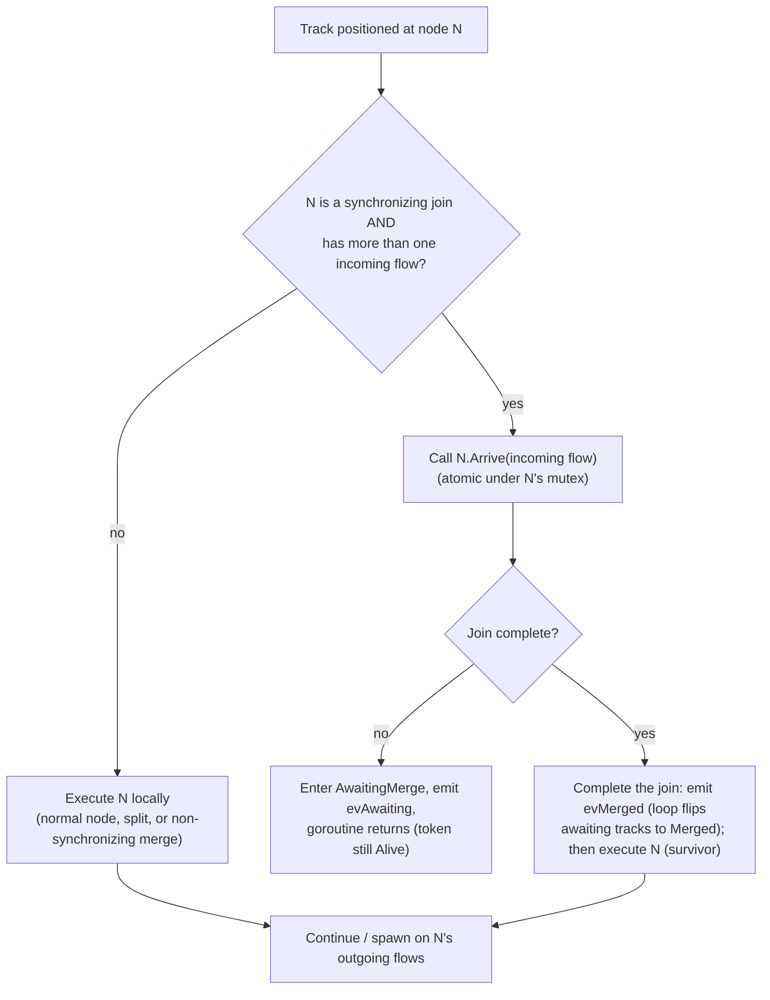
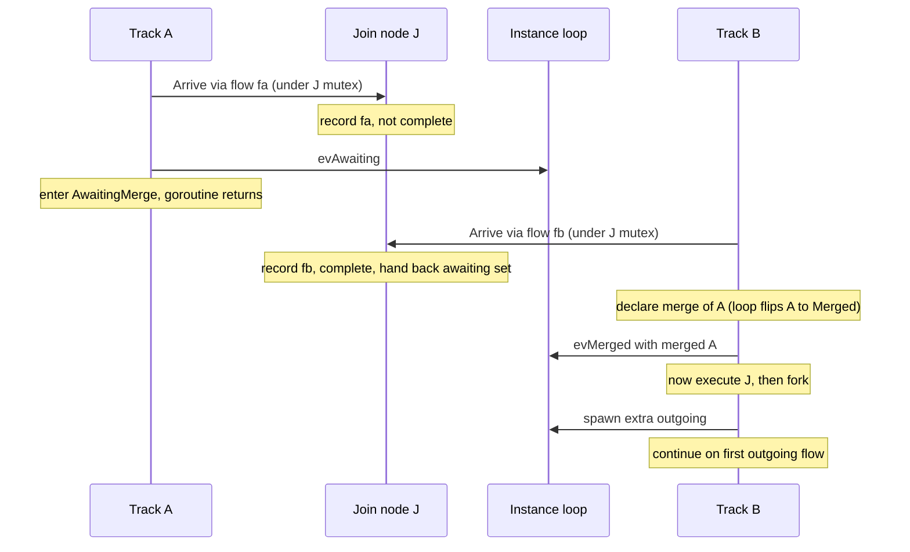
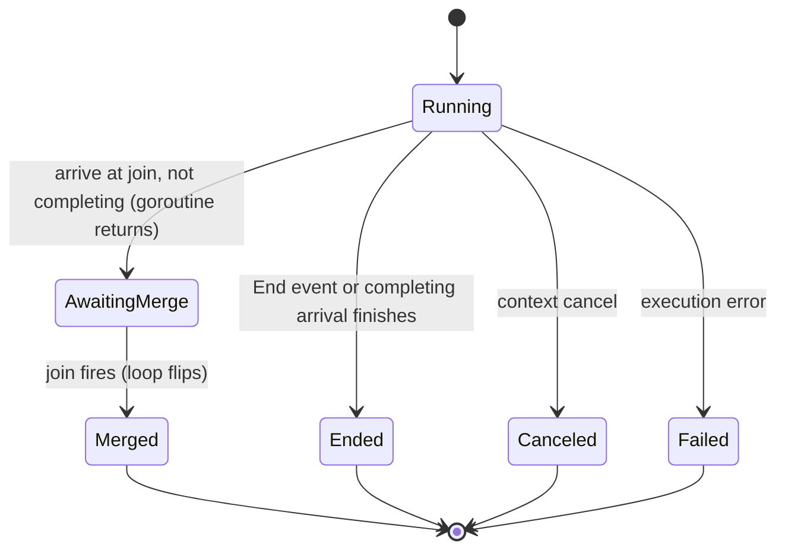
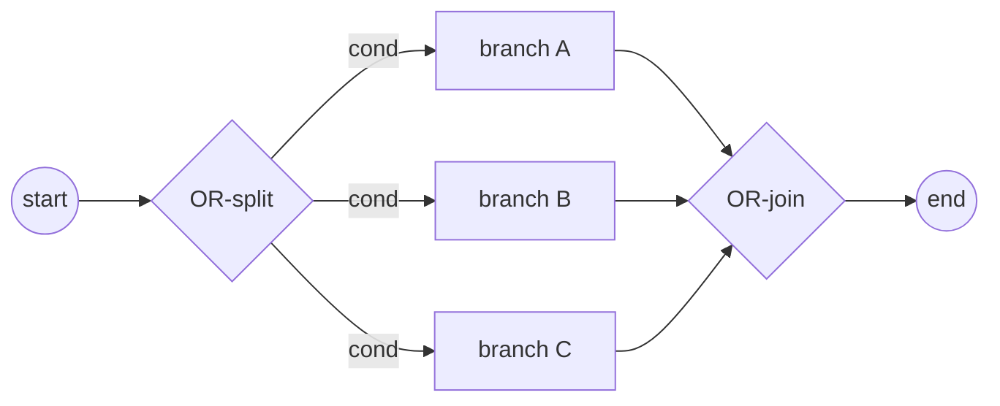

# ADR-005 — Шлюзы и объединения

| Поле | Значение |
|---|---|
| Статус | Принято |
| Версия | v.2 |
| Дата | 2026-06-09 |
| Владелец | Руслан Габитов |
| Уточняет | [ADR-001 v.5 Execution Model](ADR-001-execution-model.ru.md) |

> EN-оригинал — канонический: [ADR-005-gateways-and-joins.md](ADR-005-gateways-and-joins.md). Этот файл — его перевод (twin). При расхождении приоритет у английского текста.

> **Scope.** Этот ADR решает **маршрутизирующие шлюзы** и общую для них модель
> координации track'ов: **Parallel** (split §2.2 + синхронизирующее объединение
> §2.3–§2.4), **Exclusive** (split §2.8; его merge — несинхронизирующий
> pass-through §2.3) и **Inclusive** (split §2.9 + синхронизирующий **OR-join**
> §2.10). **Complex** и **Event-Based** шлюзы отложены (§4). OR-join фиксирует
> **консервативную, двухуровневую, переоцениваемую-при-смерти-токена** реализацию
> синхронизирующего merge'а из стандарта (§2.10).
>
> **Implementation status.** Parallel, Exclusive и Inclusive split'ы, а также
> Inclusive **OR-join** (§2.10) — включая его дополнение через обратную
> достижимость (backward-reachability) и переоценку по триггеру смерти токена —
> все реализованы (вместе с сопровождающими SRD).

## 1. Контекст

BPMN маршрутизирует поток управления через **шлюзы** (gateways). Расходящийся шлюз
форкает поток токенов на несколько исходящих путей; сходящийся шлюз объединяет или
синхронизирует входящие пути. Стандарт ([§13.4](../bpmn-spec/semantics/gateways.md))
определяет отдельные типы шлюзов — Exclusive, Parallel, Inclusive, Complex,
Event-Based — каждый со своим правилом активации форка и правилом синхронизации
объединения.

[ADR-001](ADR-001-execution-model.ru.md) установил модель исполнения движка:
Instance владеет одним или несколькими **track'ами** (каждый — нить исполнения,
несущая позицию во flow); **токен** — логическая проекция позиции track'а; форк
создаёт track на каждую дополнительную ветвь (прибывший track продолжает по
одной); и **всё instance-scoped lifecycle-состояние мутируется единственной
goroutine event-loop'а** — track'и сообщают о прогрессе событиями и никогда не
мутируют это состояние напрямую. ADR-001 умышленно оставил два gateway-concern'а
этому ADR: какие исходящие flow активирует форк (по типу шлюза) и что происходит в
сходящем узле (join/merge).

Этот ADR решает оба **для Parallel-шлюза** и тем самым фиксирует, как
**синхронизация** владеется в двухслойной модели — что имеет следствие для
контракта исполнения узла (§2.5).

## 2. Решение

### 2.1 Поведение шлюза задаётся по типу; объектная модель стандарта фиксирована

Каждый тип BPMN-шлюза несёт собственное правило маршрутизации, поэтому движок
реализует каждый тип как собственное поведение узла, а не как центральный switch
по type-тегу. Направление шлюза (converging / diverging / mixed) и его sequence
flow приходят из объектной модели шлюзов стандарта, которая является фиксированной
ground truth; движок реализует таксономию стандарта, он её не изобретает.

### 2.2 Parallel split — активировать все исходящие

Расходящийся Parallel-шлюз производит один токен на **каждом** исходящем sequence
flow, безусловно (§13.4.1): без вычисления условий, без default-flow и не может
упасть. В двухслойной модели это обычный форк — прибывший track продолжает по
одному активированному flow, а каждый оставшийся активированный flow становится
новым track'ом. (Его контрагент — **Exclusive split** — ровно *один* исходящий
flow, выбранный по условию — это §2.8.)

### 2.3 Объединение — синхронизирующее vs несинхронизирующее

Сходящий узел (более одного входящего flow) либо синхронизирует, либо нет —
решается **по типу шлюза**:

- **Несинхронизирующее** — Exclusive merge или неуправляемый merge активности
  (который BPMN трактует как неявный Exclusive): каждый прибывший токен проходит
  насквозь и продолжает независимо. Без ожидания, без consumption.
- **Синхронизирующее** — Parallel (и позже Inclusive): шлюз ждёт ожидаемого
  множества входящих токенов, затем consume'ит их и эмитит свой исходящий
  токен(ы).

Для **Parallel join'а** ожидаемое множество — **один токен на каждом входящем
flow** (§13.4.1): он срабатывает только когда каждый входящий flow доставил токен,
и consume'ит ровно один токен на flow (избыточные токены на flow не consume'ятся).

### 2.4 Синхронизация принадлежит синхронизирующему узлу

Синхронизирующий шлюз владеет своей синхронизацией **полностью**: своим
per-instance **состоянием прибытия** (какие входящие flow доставили токен —
node-owned состояние согласно [ADR-009 v.1](ADR-009-per-instance-node-graph.ru.md)),
своим **правилом завершения** (Parallel: прибыл каждый входящий flow; Inclusive,
позже: достижимое подмножество) и **сериализацией**, делающей конкурентные
прибытия безопасными (**per-node mutex**). Track делает то, что ему говорит узел;
он **не** просит loop принять решение. Loop хранит только **lifecycle-учёт** —
реестр track'ов и awaiting/ended-бухгалтерию — он больше не решает синхронизацию.
(Это весь synchronization-concern на узле; нет разделения mechanism-on-the-loop /
rule-on-the-node — единственная per-type вариация — это правило завершения,
которое реализует каждый синхронизирующий шлюз.)

Два track'а могут достичь join'а **конкурентно** (отдельные goroutine), поэтому
шаг прибытия узла **атомарен под его собственным mutex'ом**: записать прибывший
flow, проверить правило завершения и — когда завершено — отпустить ожидающие
track'и, всё в одной критической секции.

- **Незавершающее прибытие завершает goroutine track'а.** Track переходит в
  промежуточное состояние **`AwaitingMerge`**, и его **goroutine возвращается** —
  он *не* приостановлен и не может быть возобновлён; объект track'а **сохраняется**
  как запись (`evAwaiting` говорит instance держать его как *awaiting* — ни
  активным, ни завершённым). Он **ещё не** помечен `Merged`: пока join не
  сработал, неизвестно, какое прибытие — выживший.
- **Завершающее прибытие — выживший.** Под node-mutex'ом оно собрало id ожидающих
  track'ов. Оно **сначала завершает join** — объявляя merge (`evMerged`), чтобы
  loop перевёл каждый ожидающий track в **`Merged`** (его токен становится
  `Consumed`) — **перед** тем как узел исполнится (§2.5: синхронизация улаживается
  до исполнения). Оно **затем** исполняет узел join'а и продолжает/форкает по
  исходящим flow.

В join'е новый track не создаётся — продолжение **едет на завершающем прибытии**
(дисциплина 1:1 track:позиция из ADR-001 держится). Какой прибывший track выживает
— просто тот, чей токен завершает множество; BPMN требует только один токен наружу
на каждый исходящий flow.

**Convergence — не parent-ребро.** Токен, достигший join'а, имеет *множество*
предшественников (каждая сошедшаяся ветвь), но токен записывает **единственного**
родителя (своё происхождение от форка). Поэтому merge **не** ре-парентит выжившего
и не сворачивает поглощённые track'и в его lineage — это заставило бы выжившего
претендовать на track, который он породил, как на своего родителя, цикл, ломающий
реконструкцию истории. Convergence вместо этого представлена собственной
терминальной (`Consumed`) записью каждого поглощённого track'а в узле join'а;
выживший сохраняет свой creation lineage нетронутым.

**Race-safety.** Только выживший когда-либо исполняет узел join'а, поэтому никакие
два track'а не запускают его `Exec` одновременно. Состояние прибытия node-local
под node-mutex'ом и per-instance ([ADR-009 v.1](ADR-009-per-instance-node-graph.ru.md))
— никогда не гонится между track'ами или instance'ами. (Cross-instance
shared-node race, который ранний драфт откладывал на будущий Persistence ADR, уже
разрешён ADR-009.)

Конкретный протокол — события, которые track шлёт loop'у, как track решает, что
делать в узле, и диаграммы состояний/рандеву — это §2.7.

### 2.5 Контракт исполнения узла — единственный Execute

Ответственность узла — **исполниться**: произвести свои исходящие токены
(маршрутизация шлюза) или выполнить свою активность. Синхронизация (§2.4) — это
отдельный concern, который синхронизирующий узел улаживает **перед** исполнением —
через свой шаг `Arrive`, а не через pre-/post-execution-хуки — поэтому контракт
исполнения узла схлопывается в **единственный шаг Execute**. Прежние
pre-/post-execution-хуки (узловые "prologue" и "epilogue") существовали, когда
узлы драйвили flow control; под track-координацией они избыточны и **удаляются**.
Concern'ы, для которых они использовались, переезжают на слой, которому они
принадлежат:

- **Subscription** узла catch/receive на message/signal принадлежит event &
  subscription machinery (ADR-006), которая приостанавливает и позже возобновляет
  track; Execute узла consume'ит доставленное событие. Это не узловой
  prologue/epilogue.
- **Регистрация** human task'а на взаимодействие — часть исполнения этого task'а
  (его Execute регистрирует, затем ждёт исхода), а не отдельный хук.

Где это противоречит текущему интерфейсу узла, реализация удаляет хуки и
перемещает их логику — концепция ведёт, код следует.

### 2.6 Consumption токенов остаётся узким

Токены consume'ятся только в End Events и Terminate, как поглощённые токены
синхронизирующего join'а (§2.4) и при withdrawal. Несинхронизирующий merge никогда
не consume'ит токены.

### 2.7 Координация Track ↔ Instance (механика)

Track работает автономно в своей goroutine, продвигаясь узел за узлом. В каждом
узле он спрашивает узел, что делать; только **синхронизирующий join** меняет курс
track'а. Единственная goroutine event-loop'а Instance'а владеет
**lifecycle-учётом** — реестром track'ов и awaiting/ended-бухгалтерией; о
lifecycle-изменениях ей сообщают событиями, но она **не** решает синхронизацию.
Три события текут track → loop (все — нотификации, ни одно не блокируется ради
ответа):

| Событие (track → loop) | Когда поднимается | Что делает loop |
|---|---|---|
| **spawn** | форк активировал дополнительные исходящие flow | создаёт + регистрирует один track на каждый дополнительный flow |
| **awaiting** | track достиг синхронизирующего join'а, не завершил его и **его goroutine вернулась** | записывает track как *awaiting* — ни активным, ни завершённым |
| **merged** | завершающий track объявляет поглощённые track'и (по id) | loop разрешает id и переводит каждый в `Merged`, убирая их из *awaiting* |
| **ended** | track завершился (end event, отменён, упал) | дерегистрирует его; когда не остаётся активных или ожидающих, завершает instance |

**Что драйвит каждое событие — единообразные структурные правила, а не узел.**
Track **не** спрашивает узел "какое событие мне поднять". Он выводит события из
структуры, и только **один** вопрос специфичен для узла:

- **Форк** драйвится тем, сколько flow возвращает `Exec`. Для **любого** узла
  track продолжает по одному активированному flow и эмитит `spawn` для остальных.
  Узел контролирует только *количество* (Exclusive возвращает один → нет форка;
  Parallel и неуправляемый activity-split возвращают все → форк). Task с
  несколькими исходящими форкает в точности как Parallel split — нет
  node-type-специфичной логики форка.
- **Merge** — это **только** concern синхронизирующего join'а. Несинхронизирующий
  merge — Task, intermediate event или Exclusive-шлюз, достигнутый более чем одним
  входящим flow — это **pass-through**: каждый прибывший токен исполняет узел
  независимо и продолжает, **без события и без consumption** (неуправляемый merge
  BPMN = неявный Exclusive).

**Как track решает, что делать в узле.** В узле N track задаёт единственный
node-специфичный вопрос: реализует ли N `SynchronizingJoin` **и** имеет ли более
одного входящего flow? Если нет, он исполняет N локально (обычный узел, split или
несинхронизирующий merge). Если да, он вызывает **`N.Arrive(его входящий flow)`** —
атомарно под mutex'ом N (§2.4) — что возвращает один из ровно двух ответов: *стоп и
жди* → войти в `AwaitingMerge` и goroutine возвращается; *исполняй* → действовать
как выживший.



**Рандеву синхронизирующего join'а** — две ветви сходятся на join'е `J`;
*завершающее* (второе) прибытие выживает, первое поглощается:



Какая ветвь прибывает первой — несущественно: mutex J сериализует прибытия,
поэтому тот токен, который *завершает* множество, и есть выживший.

**Жизненный цикл track'а** — `AwaitingMerge` промежуточен: goroutine уже
вернулась; объект track'а сохраняется как запись, пока join не сработает:



Mutex J делает прибытие атомарным, поэтому ровно одно прибытие на join завершает
множество и становится выжившим; остальные входят в `AwaitingMerge` (их goroutine
вернулись) и переводятся в `Merged`, когда он срабатывает. В join'е track не
создаётся; продолжение едет на завершающем прибытии (§2.4).

**Форк по исходящим flow** (без изменений относительно ADR-001 §4.4). После того
как `Exec` узла вернул активированные исходящие flow, track **продолжает по одному
сам** — предпочитая flow, который зацикливается обратно на тот же узел (cyclic/self
flow), если такой есть, иначе первый — и эмитит **spawn** для оставшихся flow, по
одному новому track'у на каждый. Parallel split питает это **всеми** исходящими
flow (§2.2); в остальном механика та же, что у любого форка.

**Смешанный шлюз (N входящих *и* M исходящих).** BPMN позволяет одному
Parallel-шлюзу одновременно сходиться и расходиться. Это **не требует особой
machinery** — это join-половина, за которой следует fork-половина на **одном
выжившем track'е**: завершающее прибытие join'ится (эмитит `evMerged`), исполняет
узел (`Exec` возвращает все M исходящих), затем форкает (продолжает по одному,
эмитит `spawn` для остальных). Так instance получает **`evMerged`, затем `spawn`**
последовательно из той же goroutine; loop применяет их FIFO (merge-учёт, затем
создание track'а). Выживший остаётся **активным через оба события** — он никогда не
завершается между ними — поэтому instance не может преждевременно завершиться;
итого N токенов consume'ятся и M производятся (N−1 merged + выживший → выживший +
M−1 spawned).

### 2.8 Exclusive split — data-based exclusive choice (первое совпавшее условие)

Расходящийся **Exclusive**-шлюз маршрутизирует прибывший токен на **ровно
один** исходящий flow — data-based exclusive choice (§13.4.2, Table 13.2):

- Исходящие flow несут **condition expressions**, вычисляемые **в объявленном
  порядке**. **Первое** условие, вычислившееся в `true`, выбирает этот flow, и
  **дальнейшие условия не вычисляются** (short-circuit).
- Если **ни одно** условие не `true`, токен идёт по **default**-flow (атрибут
  `default` шлюза, §13.4.2).
- Если ни одно условие не `true` **и** нет default-flow, шлюз **роняет instance**
  с исключением (§13.4.2) — немаршрутизируемый токен — это ошибка моделирования,
  никогда не тихий drop.
- **Порядок значим**: авторы модели выражают приоритет ветвей через порядок
  исходящих flow шлюза (§13.4.2 engine note).

Это per-type split-правило, которое предвосхищает §2.1, и контрагент Parallel
split'а (§2.2): где Parallel возвращает **все** исходящие flow, Exclusive
возвращает **ровно один**. Поэтому он питает fork-механику §2.7 единственным flow —
выживший track продолжает по нему и эмитит **никакого `spawn`** (нет форка).
Exclusive **merge** не требует ничего нового: это несинхронизирующий pass-through,
уже решённый в §2.3/§2.7 — каждый входящий токен срабатывает шлюз независимо, без
ожидания и без consumption (неуправляемый merge BPMN = неявный Exclusive). Так что
*смешанный* Exclusive-шлюз (N входящих, M исходящих) — это просто
pass-through-per-arrival, за которым следует choose-one split, без синхронизации.

Условия — это `FormalExpression` стандарта на sequence flow, вычисляемые против
данных instance'а. **Механика вычисления** — какой движок выражений их запускает,
data scope, который они читают, как surface'ится ошибка вычисления и как
трактуется conditionless non-default flow — это то, что фиксирует сопровождающий
SRD (code-grounded); этот ADR фиксирует только **правило выбора** выше,
standard-grounded.

### 2.9 Inclusive split — форкнуть каждое совпавшее условие

Расходящийся **Inclusive**-шлюз маршрутизирует токен на **каждый** исходящий
flow, чьё условие `true` — одну или несколько ветвей (§13.4.3, Table 13.3):

- Все исходящие условия вычисляются (без гарантии порядка); токен производится на
  **каждом** flow, чьё условие `true`.
- Если **ни одно** условие не `true`, токен идёт по **default**-flow.
- Если ни одно условие не `true` и нет default, шлюз **роняет instance**
  (§13.4.3).

Это per-type split из §2.1, который сидит между Parallel (все flow, безусловно —
§2.2) и Exclusive (ровно один — §2.8): Inclusive возвращает **условно-true
подмножество** (≥1). Как только подмножество выбрано, оно питает fork-механику §2.7
без изменений — выживший track продолжает по одному, `spawn` для остальных.
Механика вычисления — за SRD (как §2.8).

### 2.10 Inclusive (OR) join — синхронизирующий merge

Сходящийся Inclusive-шлюз — это **синхронизирующий merge** (WCP-7): он ждёт каждый
токен, который *ещё мог бы* прибыть, затем срабатывает один раз. Это
синхронизирующий join (§2.3/§2.4) с **нелокальным правилом завершения** —
единственный шлюз, чьё решение о срабатывании инспектирует распределение токенов по
всему instance'у, а не только свои входящие flow.

**Нормативное правило (§13.4.3, Table 13.3).** Join активируется тогда и только
тогда, когда хотя бы один входящий flow имеет токен **и**, для каждого
направленного пути (не посещающего join) от flow с токеном до *пустого* входящего
flow join'а, существует *также* путь от этого токена до уже-*marked* входящего flow
join'а. При срабатывании он consume'ит один токен на каждый marked входящий flow,
вычисляет все исходящие условия и форкает true-подмножество (default/exception по
§2.9) — §2.10 join, за которым немедленно следует §2.9 split на выжившем.

Ромб и решение, которое join принимает на каждом прибытии и каждой смерти:




**Реализация в движке (выбор gobpm — консервативная, двухуровневая,
переоцениваемая при смерти токена).** Refinement-clause спецификации редко
существенна; gobpm реализует практичную, консервативную форму, которую обкатал
Camunda 7 (внутренний анализ: *Camunda 7 — Inclusive Gateway join*), с одним
умышленным улучшением над ней:

- **Двухуровневая активация.** *Fast path* — токен прибыл на **каждый** входящий
  flow → срабатывание, без анализа. *Slow path* — тест **достижимости**
  (reachability) над статическим per-instance графом узлов (ADR-009): если
  **никакой** активный track больше не может достичь un-marked входящего flow
  join'а, срабатывать; иначе ждать. Конкретно он идёт **назад** (backward) от
  каждого un-marked входящего flow к старту — этот flow всё ещё достижим, если
  живой токен сидит где-либо в его backward closure (обход short-circuit'ит на
  первом и никогда не пересекает join). Обход **cycle-guarded** (visited-set,
  чтобы циклические модели не подвешивали решение) и **игнорирует условия flow**
  (будущие исходы условий токена непознаваемы в момент решения, поэтому считается,
  что он способен пройти любой структурный путь). Это консервативная форма
  *single*-reachability-per-track — она ошибается только в сторону **более долгого
  ожидания** — не two-path refinement-clause спецификации.
- **Переоценивается при смерти токена, не только при прибытии.** Правило
  завершения перепроверяется и когда токен **прибывает** на join, **и** когда любой
  track **умирает** (завершается / отменяется / merged'ится в другом месте) —
  смерть может убрать последний токен, который ещё мог достичь un-marked flow. Это
  **исправляет худший failure mode Camunda 7**, где join проверяется *только* при
  прибытии, так что прерванная ожидаемая ветвь подвешивает join **навсегда**.
  Единственный event-loop gobpm уже наблюдает lifecycle каждого track'а, поэтому
  переоценка каждого ожидающего OR-join при смерти track'а — строгое улучшение,
  которое двухслойная модель делает естественным.
- **Маркировка per-incoming-flow** (а не per-gateway token count), чтобы правило
  оставалось корректным, когда циклы re-arm'ят join (само re-arming отложено, §4).
- **Ownership остаётся §2.4.** Join владеет своим состоянием прибытия под своим
  **per-node mutex'ом**; прибытия атомарны. Единственное расширение в том, что его
  правило завершения читает **позиции активных track'ов** instance'а
  (поставляемые loop'ом) — узел всё ещё владеет *решением*, он просто сверяется с
  более широкой маркировкой, чем локальный count Parallel'а.

**Park-and-resume.** Это единственная способность, которая не нужна простому
(Parallel) join'у. Parallel-прибытие либо завершает join (и продолжает), либо
завершается; ничто не ждёт пробуждения. OR-join может завершиться **без дальнейшего
прибытия** (death-кейс), поэтому токен, который прибыл, но ещё не может завершить
join, должен **припарковаться** (park) — он приостанавливается на месте, всё ещё
считаясь живым токеном, держащим свою позицию, ни завершённым, ни поглощённым —
пока re-check движка не уладит его судьбу. Движок перепроверяет ожидающий join по
**двум триггерам**: каждое последующее **прибытие** на него и каждая **смерть
токена** где угодно. Когда проверка завершает join, движок будит запаркованные
токены: один **возобновляется** как выживший, остальные **consume'ятся** (merged).
Токен, уже **в пути на** join (на входящем flow, но ещё не зарегистрированный) —
это неминуемое прибытие, и оно **откладывает** срабатывание, пока не
зарегистрируется — так что sibling, вот-вот пометящий flow, никогда не загоняется в
преждевременное срабатывание гонкой.

```mermaid
sequenceDiagram
    participant T as arriving token
    participant J as OR-join
    participant E as engine loop
    T->>J: arrive — mark this incoming flow
    alt completes now (all marked, or nothing reachable)
        J-->>T: continue as survivor (last-in)
    else must wait
        T-->>J: park (suspend; still a live token)
        Note over E: re-check on every later arrival AND every token death
        E->>J: a death left no live token able to reach an un-marked flow
        J-->>T: resume as survivor (first-in); the rest are consumed
    end
```

**Срабатывание и выживший.** **Прибытие**, которое завершает join, — это
**выживший** — завершающее прибытие (**last-in**) продолжает прямо, consume'ит
marked-токены, затем исполняет и форкает исходящее подмножество (§2.9), в точности
как Parallel. Срабатывание **по триггеру смерти** не имеет прибытия, на котором
ехать, поэтому движок **промоутит самый ранний запаркованный токен** (**first-in**)
как выжившего и возобновляет его; остальные consume'ятся. (Какой запаркованный
токен выживает — несущественно для результата — один токен покидает join в любом
случае — поэтому это выпадает из механизма: last-in при прибытии, first-in при
смерти. Parallel никогда не срабатывает из loop'а; death-trigger OR-join — это
единственное место, где движок это делает.)

**Scope.** Ацикличный, single-pass (§4): каждый входящий flow маркируется один
раз; loop re-arming отложен. Complex-шлюз переиспользует этот reachability-тест
(§4).

## 3. Последствия

- Движок получает настоящий fork/join: любой ацикличный процесс, использующий
  Parallel split и/или синхронизирующий join, исполняется корректно — поднимая его
  из linear-only в branching control flow (roadmap M1 MVP).
- Синхронизирующий узел получает arrival-учёт + **per-node mutex**; loop получает
  *awaiting*/*merged*-бухгалтерию (без decision-логики). Добавляется новое
  промежуточное состояние track'а **`AwaitingMerge`**; goroutine ожидающего
  track'а возвращается (ничто не остаётся работающим, пока track ждёт merge).
- Seam синхронизирующего join'а (§2.4) — переиспользуемая основа для
  Inclusive/Complex.
- Интерфейс узла упрощается до одного Execute (§2.5); prologue/epilogue-хуки
  удалены, их логика перемещена.
- Parallel join, чьё ожидаемое входящее множество никогда не может завершиться
  (upstream exclusive choice обходит одну входящую ветвь), **подвешивает instance в
  deadlock** — ошибка моделирования BPMN; её детектирование вне scope (§4).
- Движок получает **data-based routing**: Exclusive выбирает одну ветвь по условию
  (§2.8), Inclusive форкает true-подмножество (§2.9) — так что процесс может
  ветвиться на данных, а не только форкать безусловно (Parallel). XOR завершает
  пару XOR/AND (epic #81); OR-split + OR-join (§2.10) покрывают Inclusive-половину
  epic #93. Оба split'а переиспользуют per-type framing (§2.1) и fork-механику §2.7
  без изменений.
- Модель синхронизации (§2.4) получает своё первое **нелокальное** правило
  завершения (OR-join, §2.10): loop переоценивает ожидающий OR-join при **смерти
  токена**, не только при прибытии, и может **сам сработать join** (промоутя
  ожидающий track в выжившего) — новый loop-путь, который Parallel'у никогда не был
  нужен. Это то, что убирает классическую ловушку Camunda 7 "OR-join подвисает,
  когда ожидаемая ветвь прервана".

## 4. Отложено / вне scope

- **OR-join refinement clause.** §2.10 берёт консервативную
  single-reachability-форму; two-path refinement-clause стандарта (токен, который
  может *также* достичь marked входящего flow, не блокирует) **не** реализована —
  редко существенна, и она всегда ошибается только в сторону более долгого
  ожидания.
- **Complex-шлюз** — переиспользует reachability-тест §2.10; **Event-Based-шлюз** и
  его withdrawn-token producer (race-loss siblings завершаются как withdrawn) —
  завязан на event-доставку ([ADR-006](ADR-006-events-and-subscriptions.ru.md)).
  Оба отложены.
- **Циклы и избыточные токены.** Эта концепция scoped'ится на **ацикличные,
  single-pass** join'ы (Parallel и OR одинаково): каждый входящий flow маркируется
  один раз; join срабатывает, когда его правило завершения выполнено за один проход.
  Re-arming join'а под циклом отложен.
- *(Разрешено, больше не отложено:* shared-node data race несинхронизирующего merge
  исправлен per-instance графом узлов [ADR-009 v.1](ADR-009-per-instance-node-graph.ru.md)
  — каждый instance владеет своими объектами узлов, поэтому merge над одним узлом
  больше не гонится между instance'ами. Per-execution data flow внутри instance'а —
  concern [ADR-010](ADR-010-process-data-model.ru.md).)*

## 5. Рассмотренные альтернативы

- **First-arrived выживший** (vs. completing/last). Отклонено: это заставляет
  первый track ждать и любой merging-track трогать shared-узел; выживший как
  completing-прибытие, чьи non-survivors никогда не исполняют узел, проще и
  race-avoiding (§2.4).
- **Спавн свежего continuation-track'а в join'е.** Отклонено: нарушает "в join'е
  новый track не создаётся" из ADR-001 и 1:1 track-handoff.
- **Центральный gateway-type switch.** Отклонено: per-type поведение узла открыто
  для расширения; центральный switch — это закрытое множество, которое каждый новый
  шлюз должен править.
- **Loop-serialized решение + verdict-channel** (ранний драфт этого ADR): track
  эмитит событие `arrive` и *блокируется* на reply-канале, пока loop записывает
  прибытие и решает. Отклонено: теперь, когда узел владеет своим per-instance
  состоянием ([ADR-009 v.1](ADR-009-per-instance-node-graph.ru.md)), track может
  спросить узел напрямую; round-trip loop'а и verdict-канал — ненужный overhead.
  Узкий per-node mutex проще и яснее (§2.4).
- **Блокирующий узел** (узел — или track — который держит goroutine
  **приостановленной**, пока siblings не прибудут). Отклонено: goroutine ожидающего
  track'а **возвращается**; track сохраняется как объект в `AwaitingMerge`, поэтому
  никакая goroutine не держится (§2.7).
- **Разделение mechanism-on-the-loop / rule-on-the-node.** Отклонено: с node-owned
  состоянием и per-node mutex'ом узел владеет всем synchronization-concern'ом;
  единственная per-type вариация — правило завершения. Нет mechanism/policy
  layering для поддержки.
- **Сохранение prologue/epilogue-хуков.** Отклонено (§2.5): избыточны под
  track-координацией; subscription и регистрация принадлежат своим владеющим слоям.

## 6. Ссылки

- [ADR-001 v.5 Execution Model](ADR-001-execution-model.ru.md) — двухслойный
  runtime (fork §4.4; join перемещён §4.5; владение runtime-состоянием §4.7).
- [ADR-009 v.1 Per-instance node graph](ADR-009-per-instance-node-graph.ru.md) —
  per-instance граф узлов, на котором живёт состояние прибытия join'а; разрешает
  shared-node data race, который ранний драфт откладывал.
- [bpmn-spec/semantics/gateways.md](../bpmn-spec/semantics/gateways.md) (§13.4 —
  Exclusive §13.4.2, Inclusive §13.4.3 + Table 13.3),
  [token-flow.md](../bpmn-spec/semantics/token-flow.md) — нормативная
  gateway/token-семантика.
- [docs/camunda7/or-join-inclusive-gateway.md](../camunda7/or-join-inclusive-gateway.md)
  — внутренний reference-анализ OR-join Camunda 7 (engine-прецедент), который лёг в
  основу консервативной, двухуровневой, переоцениваемой-при-смерти-токена
  реализации §2.10 и отклонений, которые gobpm умышленно сохраняет или исправляет.

## 7. Открытые вопросы

- **Нет.** Маршрутизирующие шлюзы — Parallel, Exclusive и Inclusive (split +
  join) — решены. Complex, Event-Based, OR-join refinement clause и loop re-arming
  — умышленные отложки (§4), не открытые вопросы.

## История документа

| Версия | Дата | Автор | Изменение |
|---|---|---|---|
| v.1 | 2026-06-09 | Руслан Габитов | Авторизован полностью для **Parallel (AND) шлюза** (split + синхронизирующий join), приземлён с сопровождающим SRD. Решения: per-type поведение шлюза (нет центрального type switch); Parallel split производит токен на каждом исходящем flow; **синхронизация принадлежит синхронизирующему узлу** — он держит своё per-instance состояние прибытия ([ADR-009 v.1](ADR-009-per-instance-node-graph.ru.md), Accepted), правило завершения и **per-node mutex**, делающий конкурентный `Arrive` атомарным; незавершающее прибытие входит в промежуточное состояние **`AwaitingMerge`**, и его goroutine возвращается (объект track'а сохраняется как запись, instance уведомлён через `evAwaiting`); **завершающее прибытие** — выживший — он сначала завершает join (объявляет id поглощённых track'ов через `evMerged`; loop переводит каждый в `Merged`) **перед** исполнением узла, затем исполняет и форкает; creation lineage выжившего оставлен нетронутым (convergence записывается собственными терминальными `Consumed`-записями поглощённых track'ов, а не ре-парентингом выжившего); loop хранит только awaiting/ended-бухгалтерию. **Контракт исполнения узла схлопывается в единственный Execute** — prologue/epilogue-хуки удалены, их concern'ы (subscription → ADR-006; регистрация взаимодействия → Execute task'а) перемещены. Inclusive/Complex/Event-Based и циклы/избыточные токены отложены (§4); shared-node race несинхронизирующего merge **разрешён ADR-009**. Заменяет seed v.1 Draft и промежуточный loop-serialized/verdict-channel драфт (отклонён, когда ADR-009 сделал узел владельцем своего состояния — §5). Refines pin ADR-001 v.5. |
| v.1 | 2026-06-11 | Руслан Габитов | **Принято**, приземлено через SRD-005 v.1. Две детали контракта улажены при реализации и свёрнуты обратно в §2.4/§2.7: `Arrive` узла обменивается **track id** (не `*track`/`any`), сохраняя узел model-слоя свободным от runtime-типа; и merge **не** сворачивает поглощённые track'и в lineage выжившего — токен в join'е имеет много предшественников, но токен записывает одного родителя, поэтому convergence несётся собственными терминальными `Consumed`-записями поглощённых track'ов (сворачивание производило циклическое parent-ребро). Refines pin ADR-001 v.5. |
| v.2 | 2026-06-19 | Руслан Габитов | Принято. Завершает концепцию **маршрутизирующих шлюзов** тремя новыми секциями. **§2.8 Exclusive (XOR) split** — data-based exclusive choice (§13.4.2, Table 13.2): условия в объявленном порядке, **first-true** (short-circuit), **default** когда ни одно, **instance failure** когда ни одно + нет default; контрагент §2.2 (Parallel = все), возвращающий ровно один → §2.7 fork без `spawn`; XOR merge уже был non-sync pass-through (§2.3/§2.7). **§2.9 Inclusive (OR) split** — форкнуть условно-**true подмножество** (≥1), default/exception как XOR (§13.4.3). **§2.10 Inclusive (OR) join** — синхронизирующий merge (WCP-7, §13.4.3/Table 13.3): **нелокальное** правило завершения, реализованное как **консервативная, двухуровневая** форма gobpm (fast path = все входящие marked; slow path = condition-ignoring, cycle-guarded **reachability** DFS над статическим графом ADR-009 — срабатывать, когда никакой активный track больше не может достичь un-marked входящего flow), **переоцениваемое при смерти токена, а также при прибытии** (loop перепроверяет ожидающие OR-join при любом track end/cancel/merge и может сам сработать join, промоутя ожидающий track в выжившего) — умышленно исправляя arrival-only отклонение Camunda 7, которое подвешивает OR-join, когда ожидаемая ветвь прервана; маркировка per-incoming-flow; ownership/mutex остаются §2.4. Консервативный вариант выбран вместо spec refinement clause (редко существенна, ошибается только в сторону ожидания). Реализация нарезана: **XOR + OR-split первыми, OR-join свой SRD**; механика вычисления/reachability делегирована этим SRD (code-grounded). Отвечает на v.1 OR-join open question (§7); Complex/Event-Based и loop re-arming остаются отложенными (§4). Standard-grounded против `bpmn-spec/semantics/gateways.md` §13.4.2/§13.4.3; OR-join обоснован внутренним анализом OR-join Camunda 7 (§6). Refines pin ADR-001 v.5. Exclusive/Inclusive split'ы и OR-join (§2.10) — все приземляются в этом change-set'е. |
