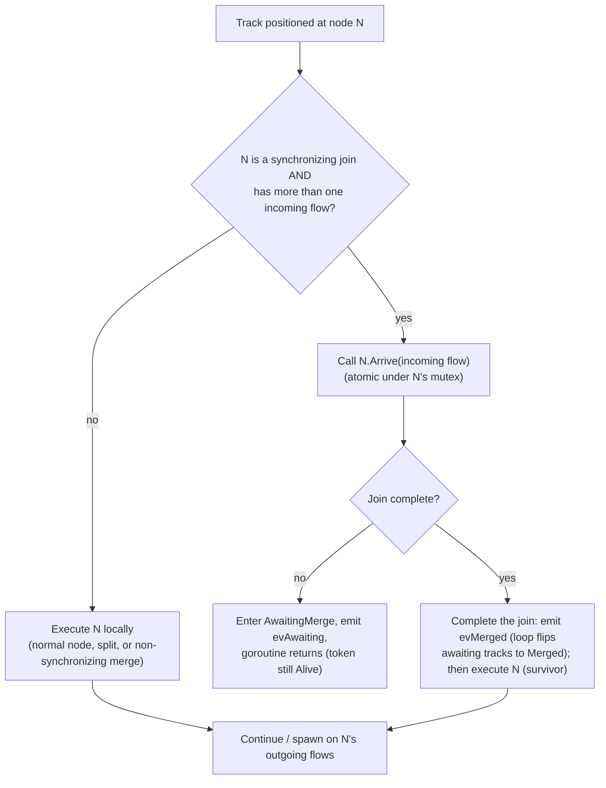
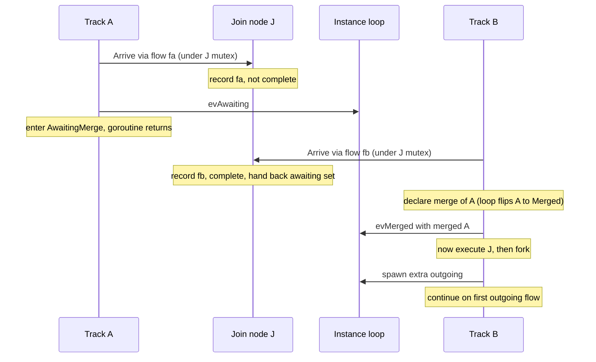
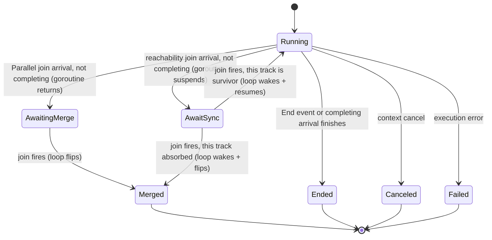
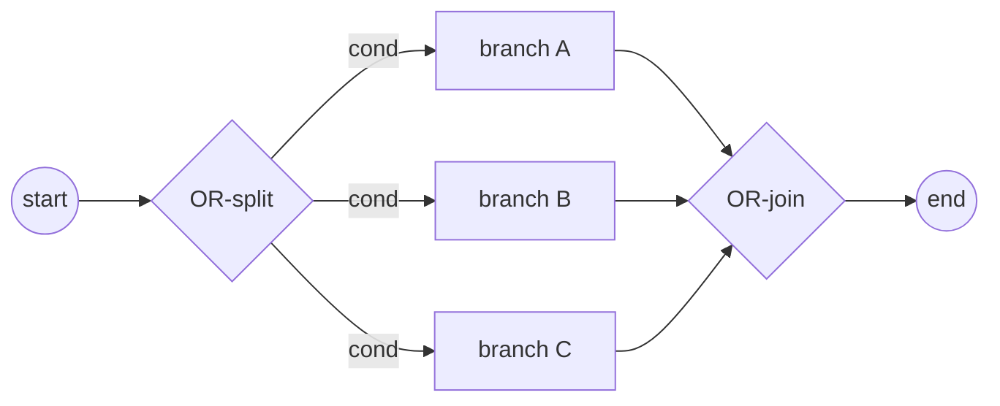
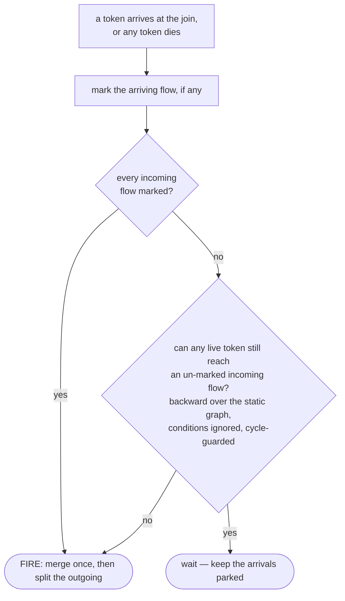
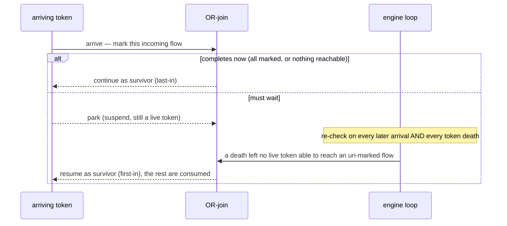
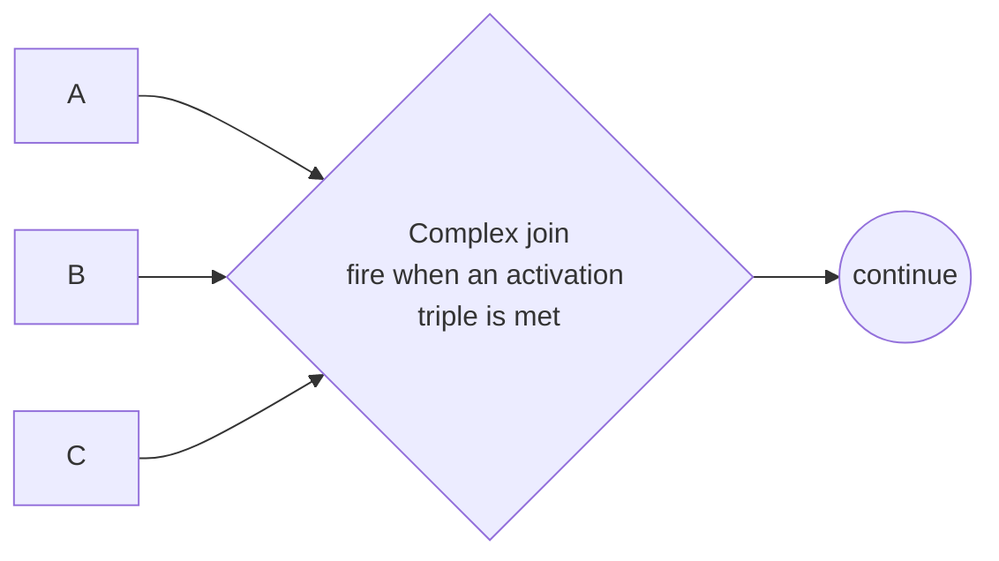
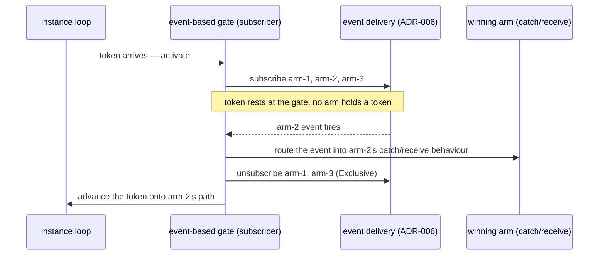

# ADR-005 — Шлюзы и Join'ы

| Поле | Значение |
|---|---|
| Статус | Принято |
| Версия | v.4 |
| Дата | 2026-06-09 |
| Владелец | Руслан Габитов |
| Уточняет | [ADR-001 v.5 Execution Model](ADR-001-execution-model.ru.md) |

> EN-оригинал — канонический: [ADR-005-gateways-and-joins.md](ADR-005-gateways-and-joins.md). Этот файл — его перевод (twin). При расхождении приоритет у английского текста.

> **Область.** Этот ADR решает **маршрутизирующие шлюзы** и общую для них модель
> координации track'ов: **Parallel** (split §2.2 + синхронизирующий join §2.3–§2.4),
> **Exclusive** (split §2.8; его merge — несинхронизирующий pass-through §2.3),
> **Inclusive** (split §2.9 + синхронизирующий **OR-join** §2.10), **Complex**
> (split §2.9 + **activation-driven синхронизирующий join** §2.11) и **Event-Based**
> (**deferred choice** §2.12 — gate подписывается на все свои arm'ы и маршрутизирует
> по первому сработавшему). OR-join фиксирует **консервативную, двухуровневую,
> переоцениваемую-при-смерти-токена** реализацию стандартного синхронизирующего
> merge (§2.10); Complex join переиспользует ту же машинерию с завершением по
> activation-правилу (§2.11).
>
> **Статус реализации.** Parallel, Exclusive- и Inclusive-split'ы, Inclusive
> **OR-join** (§2.10) и шлюз **Complex** (§2.11 — activation-driven threshold join)
> все реализованы (вместе с сопровождающими SRD). Шлюз **Event-Based** (§2.12) —
> gate-as-router deferred choice — реализован для формы **Exclusive mid-flow**
> (через SRD-024); Parallel-инстанциатор (correlation-gated) остаётся отложенным
> (§2.12.7); Conditional-arm'ы приземлились позже — решены в
> [ADR-006 v.3 §2.7](ADR-006-events-and-subscriptions.md). Отложенное из §4 остаётся.

## 1. Контекст

BPMN маршрутизирует поток управления через **шлюзы**. Расходящийся шлюз форкает
поток токенов на несколько исходящих путей; сходящийся шлюз сливает или
синхронизирует входящие пути. Стандарт ([§13.4](../bpmn-spec/semantics/gateways.md))
определяет различные типы шлюзов — Exclusive, Parallel, Inclusive, Complex,
Event-Based — каждый со своим правилом fork-активации и join-синхронизации.

[ADR-001](ADR-001-execution-model.ru.md) установил модель исполнения движка:
Instance владеет одним или несколькими **track'ами** (каждый — нить исполнения,
несущая позицию потока); **токен** — логическая проекция позиции track'а; форк
создаёт track на каждую дополнительную ветвь (прибывший track продолжает на
одной); и **всё instance-scoped lifecycle-состояние мутируется единственной
goroutine event-loop'а** — track'и сообщают о прогрессе событиями и никогда не
мутируют это состояние напрямую. ADR-001 умышленно оставил два gateway-concern'а
этому ADR: какие исходящие flow активирует форк (по типу шлюза) и что происходит
в сходящемся узле (join/merge).

Этот ADR решает оба **для Parallel-шлюза** и тем самым фиксирует, как
**синхронизация** владеется в двухслойной модели — что имеет следствие для
контракта исполнения узла (§2.5).

## 2. Решение

### 2.1 Поведение шлюза — по типу; объектная модель стандарта зафиксирована

Каждый тип BPMN-шлюза несёт своё правило маршрутизации, поэтому движок реализует
каждый тип как собственное поведение узла, а не как центральный switch по
type-тегу. Направление шлюза (сходящийся / расходящийся / смешанный) и его
sequence flow берутся из объектной модели шлюзов стандарта, которая является
зафиксированной ground truth; движок реализует таксономию стандарта, он её не
изобретает.

### 2.2 Parallel split — активировать все исходящие

Расходящийся Parallel-шлюз производит один токен на **каждом** исходящем sequence
flow, безусловно (§13.4.1): без вычисления условий, без default-flow и не может
упасть. В двухслойной модели это обычный форк — прибывший track продолжает на
одном активированном flow, а каждый оставшийся активированный flow становится
новым track'ом. (Его аналог, **Exclusive split** — выбирается ровно *один*
исходящий flow по условию — это §2.8.)

### 2.3 Join — синхронизирующий vs несинхронизирующий

Сходящийся узел (более одного входящего flow) либо синхронизирует, либо нет, что
решается **по типу шлюза**:

- **Несинхронизирующий** — Exclusive-merge или неуправляемый merge активности
  (который BPMN трактует как неявный Exclusive): каждый прибывающий токен проходит
  насквозь и продолжает независимо. Без ожидания, без потребления.
- **Синхронизирующий** — Parallel (и позже Inclusive): шлюз ждёт ожидаемого набора
  входящих токенов, затем потребляет их и эмитит свой исходящий токен (или токены).

Для **Parallel join** ожидаемый набор — это **один токен на каждом входящем flow**
(§13.4.1): он срабатывает только когда каждый входящий flow доставил токен, и
потребляет ровно по одному токену на flow (избыточные токены на flow не
потребляются).

### 2.4 Синхронизацией владеет синхронизирующий узел

Синхронизирующий шлюз владеет своей синхронизацией **полностью**: своим
per-instance **arrival-состоянием** (какие входящие flow доставили токен —
node-owned состояние согласно [ADR-009 v.1](ADR-009-per-instance-node-graph.ru.md)),
своим **правилом завершения** (Parallel: каждый входящий flow прибыл; Inclusive,
позже: достижимое подмножество) и **сериализацией**, делающей конкурентные
прибытия безопасными (**per-node mutex**). Track делает то, что говорит ему узел;
он **не** просит loop решать. Loop держит лишь **lifecycle-учёт** — реестр track'ов
и учёт awaiting/ended — он больше не решает синхронизацию. (Это весь
synchronization-concern на узле; нет разделения mechanism-on-the-loop /
rule-on-the-node — единственная per-type вариация — это правило завершения, которое
реализует каждый синхронизирующий шлюз.)

Два track'а могут достичь join **конкурентно** (отдельные goroutine'ы), поэтому
arrival-шаг узла **атомарен под его собственным mutex**: зафиксировать прибывший
flow, проверить правило завершения и — когда завершено — отдать ожидающие track'и,
всё в одной критической секции.

- **Незавершающее прибытие завершает goroutine track'а.** Track входит в
  промежуточное состояние **`AwaitingMerge`**, и его **goroutine возвращается** —
  он *не* приостановлен и не может быть возобновлён; объект track **сохраняется**
  как запись (`evAwaiting` говорит instance держать его как *awaiting* — ни
  активным, ни завершённым). Он **ещё не** помечен `Merged`: пока join не
  сработает, какое прибытие окажется выжившим — неизвестно.
- **Завершающее прибытие — выживший.** Под mutex узла оно собрало id ожидающих
  track'ов. Оно **сначала завершает join** — объявляя merge (`evMerged`), чтобы
  loop перевёл каждый ожидающий track в **`Merged`** (его токен становится
  `Consumed`) — **до** того как узел исполнится (§2.5: синхронизация улаживается до
  исполнения). Оно **затем** исполняет join-узел и продолжает/форкает на исходящих
  flow.

На join новый track не создаётся — продолжение **едет на завершающем прибытии**
(дисциплина 1:1 track:position из ADR-001 сохраняется). Какой прибывший track
выживает — это просто тот, чей токен завершает набор; BPMN требует лишь одного
токена на выходе на каждый исходящий flow.

**Сходимость — это не parent-ребро.** Токен, достигший join, имеет *множество*
предшественников (каждая сошедшаяся ветвь), но токен фиксирует **единственного**
родителя (его fork-origin). Поэтому merge **не** перепривязывает выжившего
(re-parent) и не складывает поглощённые track'и в его lineage — это заставило бы
выжившего претендовать на track, который он породил, как на собственного родителя,
цикл, ломающий реконструкцию истории. Вместо этого сходимость представлена
собственной терминальной (`Consumed`) записью каждого поглощённого track'а на
join-узле; выживший сохраняет свой creation-lineage нетронутым.

**Race-safety.** Только выживший когда-либо исполняет join-узел, поэтому никакие
два track'а не запускают его `Exec` одновременно. Arrival-состояние node-local под
mutex'ом узла и per-instance ([ADR-009 v.1](ADR-009-per-instance-node-graph.ru.md))
— никогда не гонится между track'ами или instance'ами. (Cross-instance
shared-node race, который ранний черновик откладывал на будущий Persistence ADR,
уже решён ADR-009.)

Конкретный протокол — события, которые track шлёт loop'у, как track решает что
делать в узле, и диаграммы состояний/rendezvous — это §2.7.

### 2.5 Контракт исполнения узла — единственный Execute

Ответственность узла — **исполнить**: произвести свои исходящие токены
(маршрутизация шлюза) или выполнить свою активность. Синхронизация (§2.4) — это
отдельный concern, который синхронизирующий узел улаживает **до** того как
исполнится — через свой шаг `Arrive`, а не через pre-/post-execution хуки — поэтому
контракт исполнения узла схлопывается до **единственного шага Execute**. Прежние
pre-/post-execution хуки (узловые «prologue» и «epilogue») существовали, когда узлы
управляли потоком; при track-координации они избыточны и **удалены**. Concern'ы,
для которых они использовались, переезжают на слой, который ими владеет:

- **Подписка** catch/receive-узла на message/signal владеется event &
  subscription-машинерией (ADR-006), которая приостанавливает и позже возобновляет
  track; Execute узла потребляет доставленное событие. Это не узловой
  prologue/epilogue.
- **Регистрация** human task на взаимодействие — часть исполнения этой задачи (её
  Execute регистрирует, затем ожидает исхода), а не отдельный хук.

Где это противоречит текущему интерфейсу узла, реализация удаляет хуки и
перемещает их логику — концепция ведёт, код следует.

### 2.6 Потребление токенов остаётся узким

Токены потребляются только на End Event'ах и Terminate, как поглощённые токены
синхронизирующего join (§2.4), как **хвостовые токены, которые Complex-шлюз
отбрасывает после срабатывания** (§2.11 — discriminator / partial join игнорирует
прибытия после активирующего), и при withdrawal. Несинхронизирующий merge никогда
не потребляет токены.

### 2.7 Координация Track ↔ Instance (механика)

Track работает автономно в собственной goroutine, продвигаясь узел за узлом. В
каждом узле он спрашивает узел, что делать; только **синхронизирующий join** меняет
курс track'а. Единственная goroutine event-loop'а Instance владеет
**lifecycle-учётом** — реестром track'ов и учётом awaiting/ended; ей сообщают о
lifecycle-изменениях через события, но она **не** решает синхронизацию. События
текут track → loop — это уведомления; loop никогда не блокируется в ожидании
ответа. Единственный нюанс — **parked** track: он приостанавливает *сам себя* сразу
после уведомления и ждёт более позднего resume-сигнала от loop (§2.10 / §2.11).

| Событие (track → loop) | Поднимается когда | Loop делает |
| -------------------- | ------------------------------------------------------------------------------------------- | ----------------------------------------------------------------------------------- |
| **spawn**            | форк активировал дополнительные исходящие flow                                               | создаёт + регистрирует один track на каждый лишний flow                              |
| **awaiting**         | прибытие на **Parallel** join его не завершило, и **goroutine track'а вернулась**            | фиксирует track как *awaiting* — ни активным, ни завершённым; объект track сохраняется |
| **parked**           | прибытие на **reachability** join (OR §2.10 / Complex §2.11) его не завершило, и track **приостановил свою goroutine** на resume-канале | фиксирует track как *awaiting-sync*; его goroutine остаётся живой (всё ещё учитывается), пока loop его **не разбудит** — возобновить как выжившего или потребить как merged |
| **merged**           | завершающий track объявляет поглощённые track'и (по id)                                      | loop разрешает id и переводит каждый в `Merged`, удаляя их из *awaiting*             |
| **ended**            | track завершился (end event, отменён, упал)                                                  | дерегистрирует его; когда не осталось активных или ожидающих, завершает instance     |

**Что движет каждым событием — единообразные структурные правила, не узел.** Track
**не** спрашивает узел «какое событие мне поднять». Он выводит события из
структуры, и только **один** вопрос специфичен узлу:

- **Fork** движется тем, сколько flow возвращает `Exec`. Для **любого** узла track
  продолжает на одном активированном flow и эмитит `spawn` для остальных. Узел
  контролирует лишь *количество* (Exclusive возвращает один → нет форка; Parallel и
  неуправляемый activity-split возвращают все → форк). Task с несколькими исходящими
  форкает в точности как Parallel split — нет fork-логики, специфичной типу узла.
- **Merge** — это **только** concern синхронизирующего join. Несинхронизирующий
  merge — Task, промежуточное событие или Exclusive-шлюз, достигнутый более чем
  одним входящим flow — это **pass-through**: каждый прибывающий токен исполняет
  узел независимо и продолжает, **без события и без потребления** (неуправляемый
  merge BPMN = неявный Exclusive).

**Как track решает что делать в узле.** В узле N track задаёт единственный
специфичный узлу вопрос: реализует ли N `SynchronizingJoin` **и** имеет ли более
одного входящего flow? Если нет, он исполняет N локально (обычный узел, split или
несинхронизирующий merge). Если да, он вызывает **`N.Arrive(его входящий flow)`** —
атомарно под mutex'ом N (§2.4) — что возвращает один из ровно двух ответов:
*остановиться и ждать* → park (**Parallel** join входит в `AwaitingMerge`, и
goroutine **возвращается**; **reachability** join — OR §2.10 / Complex §2.11 —
входит в `AwaitSync`, и goroutine **приостанавливается** на resume-канале);
*исполнить* → продолжить как выживший.

**Rendezvous синхронизирующего join** — две ветви сходятся на join `J`;
*завершающее* (второе) прибытие выживает, первое поглощается:

Какая ветвь прибывает первой — несущественно: mutex J сериализует прибытия, поэтому
выживший — тот токен, который *завершает* набор.

**Жизненный цикл track'а** — `AwaitingMerge` (Parallel) промежуточный: goroutine
уже вернулась; объект track сохраняется как запись, пока join не сработает.
**Reachability** join (OR/Complex) вместо этого использует `AwaitSync`: goroutine
**приостановлена, не возвращена**, и loop **возобновляет** её, когда join
срабатывает (§2.10 / §2.11):

Mutex J делает прибытие атомарным, поэтому ровно одно прибытие на join завершает
набор и становится выжившим; остальные входят в `AwaitingMerge` (Parallel — их
goroutine'ы вернулись) или `AwaitSync` (reachability join'ы — их goroutine'ы
приостановлены) и переводятся в `Merged`, когда он срабатывает. На join track не
создаётся; продолжение едет на завершающем прибытии (§2.4).

**Форк на исходящих flow** (без изменений относительно ADR-001 §4.4). После того
как `Exec` узла вернул активированные исходящие flow, track **продолжает на одном
сам** — предпочитая flow, который зацикливается обратно в тот же узел
(циклический/self-flow), если такой есть, иначе первый — и эмитит **spawn** для
оставшихся flow, по одному новому track'у на каждый. Parallel split питает это
**всеми** исходящими flow (§2.2); механика в остальном такая же, как у любого
форка.

**Смешанный шлюз (N входящих *и* M исходящих).** BPMN допускает, чтобы один
Parallel-шлюз одновременно сходился и расходился. Это не требует **никакой
специальной машинерии** — это join-половина, за которой следует fork-половина на
**одном выжившем track'е**: завершающее прибытие делает join (эмитит `evMerged`),
исполняет узел (`Exec` возвращает все M исходящих), затем форкает (продолжает на
одном, эмитит `spawn` для остальных). Поэтому instance получает **`evMerged`, затем
`spawn`** последовательно от одной goroutine; loop применяет их FIFO (merge-учёт,
затем создание track'ов). Выживший остаётся **активным на протяжении обоих
событий** — он никогда не завершается между ними — поэтому instance не может
преждевременно завершиться; в итоге N токенов потреблены и M произведены (N−1
merged + выживший → выживший + M−1 spawned).

### 2.8 Exclusive split — data-based exclusive choice (первое совпавшее условие)

Расходящийся **Exclusive**-шлюз маршрутизирует прибывший токен на **ровно один**
исходящий flow — data-based exclusive choice (§13.4.2, Table 13.2):

- Исходящие flow несут **condition-выражения**, вычисляемые **в объявленном
  порядке**. **Первое** условие, давшее `true`, выбирает этот flow, и **никакие
  дальнейшие условия не вычисляются** (short-circuit).
- Если **ни одно** условие не `true`, токен идёт по **default**-flow (атрибут
  `default` шлюза, §13.4.2).
- Если ни одно условие не `true` **и** нет default-flow, шлюз **роняет instance**
  с исключением (§13.4.2) — нероутабельный токен — это modelling-ошибка, а не
  тихий drop.
- **Порядок значим**: авторы модели выражают приоритет ветвей через порядок
  исходящих flow шлюза (§13.4.2 engine note).

Это per-type split-правило, которое предвосхищает §2.1, и аналог Parallel split
(§2.2): где Parallel возвращает **все** исходящие flow, Exclusive возвращает
**ровно один**. Поэтому он питает fork-механику §2.7 единственным flow — выживший
track продолжает на нём и эмитит **никакого `spawn`** (нет форка). Exclusive
**merge** не требует ничего нового: это несинхронизирующий pass-through, уже
решённый в §2.3/§2.7 — каждый входящий токен срабатывает на шлюзе независимо, без
ожидания и без потребления (неуправляемый merge BPMN = неявный Exclusive). Поэтому
*смешанный* Exclusive-шлюз (N входящих, M исходящих) — это просто
pass-through-per-arrival, за которым следует choose-one split, без синхронизации.

Условия — это `FormalExpression` стандарта на sequence flow, вычисляемые против
данных instance. **Механика вычисления** — какой expression-движок их запускает,
data-scope, который они читают, как поверхностится ошибка вычисления, и как
трактуется conditionless non-default flow — это для сопровождающего SRD
(code-grounded); этот ADR фиксирует лишь **правило выбора** выше,
standard-grounded.

### 2.9 Inclusive split — форкать каждое совпавшее условие

Расходящийся **Inclusive**-шлюз маршрутизирует токен на **каждый** исходящий flow,
чьё условие `true` — одну или более ветвей (§13.4.3, Table 13.3):

- Все исходящие условия вычисляются (без гарантии порядка); токен производится на
  **каждом** flow, чьё условие `true`.
- Если **ни одно** условие не `true`, токен идёт по **default**-flow.
- Если ни одно условие не `true` и нет default, шлюз **роняет instance** (§13.4.3).

Это per-type split из §2.1, который сидит между Parallel (все flow, безусловно —
§2.2) и Exclusive (ровно один — §2.8): Inclusive возвращает
**conditionally-true подмножество** (≥1). Как только подмножество выбрано, оно
питает fork-механику §2.7 без изменений — выживший track продолжает на одном,
`spawn` для остальных. Механика вычисления — для SRD (как §2.8).

### 2.10 Inclusive (OR) join — синхронизирующий merge

Сходящийся Inclusive-шлюз — это **синхронизирующий merge** (WCP-7): он ждёт каждый
токен, который *ещё мог бы* прибыть, затем срабатывает один раз. Это
синхронизирующий join (§2.3/§2.4) с **нелокальным правилом завершения** —
единственный шлюз, чьё решение о срабатывании инспектирует распределение токенов по
всему instance, а не только свои входящие flow.

**Нормативное правило (§13.4.3, Table 13.3).** Join активируется тогда и только
тогда, когда хотя бы один входящий flow имеет токен **и**, для каждого
направленного пути (не посещающего join) от flow с токеном к *пустому* входящему
flow join'а, существует *также* путь от этого токена к уже-*помеченному* входящему
flow. При срабатывании он потребляет по одному токену на каждый помеченный входящий
flow, вычисляет все исходящие условия и форкает true-подмножество (default/exception
по §2.9) — §2.10 join, за которым сразу следует §2.9 split на выжившем.

«Бриллиант» и решение, которое join принимает на каждом прибытии и каждой смерти:

**Реализация в движке (выбор gobpm — консервативный, двухуровневый,
переоцениваемый при смерти токена).** Refinement-клауза спецификации редко
существенна; gobpm реализует практичную, консервативную форму, которую обкатала
Camunda 7 (внутренний анализ: *Camunda 7 — Inclusive Gateway join*), с одним
умышленным улучшением над ней:

- **Двухуровневая активация.** *Fast path* — токен прибыл на **каждый** входящий
  flow → срабатывание, без анализа. *Slow path* — **reachability**-тест над
  статическим per-instance node-графом (ADR-009): если **ни один** активный track
  не может ещё достичь непомеченного входящего flow join'а → срабатывание, иначе
  ждать. Конкретно он идёт **назад** от каждого непомеченного входящего flow к
  старту — этот flow всё ещё достижим, если живой токен сидит где-либо на его
  обратном замыкании (обход short-circuit'ится на первом и никогда не пересекает
  join). Обход **cycle-guarded** (visited-set, чтобы циклические модели не могли
  подвесить решение) и **игнорирует условия flow** (будущие исходы условий токена
  неизвестны в момент решения, поэтому он трактуется как способный пройти любой
  структурный путь). Это консервативная форма *single*-reachability-per-track — она
  ошибается лишь в сторону **более долгого ожидания** — а не two-path
  refinement-клауза спецификации.
- **Переоценивается при смерти токена, не только при прибытии.** Правило завершения
  перепроверяется и когда токен **прибывает** на join, **и** когда любой track
  **умирает** (завершается / отменён / merged где-то ещё) — смерть может убрать
  последний токен, который ещё мог достичь непомеченного flow. Это **исправляет
  худший failure-mode Camunda 7**, где join проверяется *только* при прибытии,
  поэтому прерванная ожидаемая ветвь подвешивает join **навсегда**. Единственный
  event-loop gobpm уже наблюдает жизненный цикл каждого track'а, поэтому
  переоценка каждого ожидающего OR-join при смерти track'а — строгое улучшение,
  которое двухслойная модель делает естественным.
- **Маркировка по каждому входящему flow** (не per-gateway token count), поэтому
  правило остаётся корректным, когда циклы переарм-ят join (само переарм-ирование
  отложено, §4).
- **Владение остаётся §2.4.** Join владеет своим arrival-состоянием под своим
  **per-node mutex**; прибытия атомарны. Единственное расширение в том, что его
  правило завершения читает **позиции активных track'ов** instance
  (предоставляемые loop'ом) — узел всё ещё владеет *решением*, он лишь
  консультируется с более широкой маркировкой, чем локальный count у Parallel.

**Park-and-resume.** Это единственная способность, которая обычному (Parallel)
join не нужна. Parallel-прибытие либо завершает join (и продолжает), либо
завершается; ничто не ждёт пробуждения. OR-join может завершиться **без
дальнейшего прибытия** (случай смерти), поэтому токен, который прибыл, но не может
пока завершить join, должен **park** — он приостанавливается на месте, всё ещё
учитываемый как живой токен, держащий свою позицию, ни завершённый, ни поглощённый
— пока re-check движка не уладит его судьбу. Движок перепроверяет ожидающий join по
**двум триггерам**: каждое более позднее **прибытие** на нём и каждая **смерть
токена** где угодно. Когда проверка завершает join, движок будит запаркованные
токены: один **возобновляется** как выживший, остальные **потребляются** (merged).
Токен, уже **в пути на** join (на входящем flow, но ещё не зарегистрированный) —
это неминуемое прибытие, и оно **откладывает** срабатывание, пока не
зарегистрируется — поэтому sibling, который вот-вот пометит flow, никогда не будет
загнан в гонку преждевременного срабатывания.

**Срабатывание и выживший.** **Прибытие**, завершающее join — это **выживший**:
завершающее прибытие (**last-in**) продолжает прямо, потребляет помеченные токены,
затем исполняет и форкает исходящее подмножество (§2.9), в точности как Parallel.
**Death-triggered** срабатывание не имеет прибытия, на котором ехать, поэтому движок
**повышает раньше всех прибывший запаркованный токен** (**first-in**) до выжившего
и возобновляет его; остальные потребляются. (Какой запаркованный токен выживает —
несущественно для результата — один токен покидает join в любом случае — поэтому это
выпадает из механизма: last-in при прибытии, first-in при смерти. Parallel никогда
не срабатывает из loop'а; death-trigger OR-join'а — единственное место, где это
делает движок.)

**Область.** Ацикличный, single-pass (§4): каждый входящий flow помечается один
раз; loop-переарм-ирование отложено. Complex-шлюз переиспользует этот
reachability-тест (§2.11).

### 2.11 Complex-шлюз — activation-driven синхронизирующий join (discriminator / partial join)

Complex-шлюз — это общий синхронизирующий шлюз: он срабатывает по своему
**собственному, gateway-level условию**, а не только по условиям flow. Это
единственный шлюз в области gobpm, сидящий **выше** Common Executable Subclass
(conformance §2.1.3) — явное расширение, включённое ради паттернов, которые
остальные не могут выразить: **Structured / Blocking Discriminator** (WCP-9 /
WCP-28) и **Structured / Blocking Partial Join** (WCP-30 / WCP-31).

**Нормативная модель (§13.4.5).** Каждый входящий gate несёт `activationCount`
(токены на этом flow); у шлюза есть `activationExpression` — Boolean над этими
counts (например, `x1 + … + xm ≥ 3`), опционально над process-данными — и он
работает как **двухфазная** машина: *waitingForStart* (когда выражение становится
true, потребить прибывшие токены, вычислить исходящие условия, эмитить
true-подмножество / default) → *waitingForReset* (ждать хвостовые токены — с
**Inclusive graph-reachability** отсечением для тех, что больше не могут прибыть —
затем переарм). Расходясь, он ведёт себя как Inclusive split.

**Реализация в движке (выбор gobpm — активация как guarded count-thresholds).**

- **Расходящийся** Complex = Inclusive split (§2.9): форкать
  conditionally-true исходящее подмножество (default / exception как §2.8).
- **Сходящийся** Complex = **синхронизирующий join, движимый activation-правилом** —
  дизъюнкция **triple'ов** `(condition, count, requiredFlows)`:
  - **`condition`** — опциональный data-guard: обычное flow-style выражение над
    **process-данными** (отсутствует = всегда true);
  - **`count`** — сколько входящих flow должны были прибыть (всего);
  - **`requiredFlows`** — опциональный набор входящих flow, которые должны быть
    **среди** прибывших.

  Шлюз **срабатывает, когда некоторый triple удовлетворён**: его `condition`
  держится, `arrived ≥ count`, и каждый gate из `requiredFlows` прибыл. Голый
  порог «N of M» — это вырожденный triple `(—, N, ∅)` — **N = 1** Discriminator,
  **1 < N < M** Partial Join, **N = M** Parallel join; guard делает порог
  data-зависимым; `requiredFlows` пинит конкретные gate'ы («ветвь CFO должна быть
  одной из двух»).

  > **Engine note — активация как дизъюнкция guarded count-thresholds, а не
  > count-выражение.** gobpm **не** реализует `activationExpression` из §13.4.5
  > впрыском per-gate `activationCount`-ов в namespace выражения — это
  > навязало бы зарезервированные имена переменных, конфликтующие с process-
  > переменными. Вместо этого активация **структурирована**: data `condition`
  > каждого triple остаётся чистым process-data выражением, тогда как **count** и
  > **gate identities** (`requiredFlows`) живут в самом triple, никогда в
  > выражении. Data-namespace нетронут (нет зарезервированных имён, нет
  > префиксов), а правило всё равно покрывает пространство стандарта — count-пороги,
  > data-aware активацию и per-gate требования. Единственная форма, которую он
  > опускает — *немонотонный* count (например, «ровно 2»), от которого §13.4.5 сама
  > отговаривает модельеров во избежание осцилляции. `activationExpression`
  > стандарта задокументирован выше и остаётся reference'ом.

- **Переиспользует §2.10 целиком.** Сходящийся Complex-шлюз — синхронизирующий join
  (§2.4): он **park-ит** незавершающие прибытия, и движок **перепроверяет его на
  каждом прибытии и каждой смерти токена** — та же park/resume + reachability
  машинерия, что у OR-join. Различается только **правило завершения**. Пусть
  `arrived` = входящие flow, доставившие токен, и `reachable` = непомеченные
  входящие flow, всё ещё достижимые живым токеном (обратный тест §2.10):

  - **Fire**, когда некоторый triple удовлетворён (`condition` true, `|arrived| ≥
    count`, `requiredFlows ⊆ arrived`): завершающее прибытие — **выживший**
    (last-in), потребляет помеченные токены, затем исполняет и форкает исходящее
    подмножество (§2.8–§2.9 flow-условия / default / exception). Если одно прибытие
    удовлетворяет несколько triple'ов, срабатывает любой из них — результат тот же.
  - **Abort**, когда **каждый** triple **мёртв** — доказуемо никогда не
    удовлетворим: `|arrived| + |reachable| < count` (его count никогда не может
    быть достигнут) **или** gate из `requiredFlows` ни прибыл, ни достижим
    (обязательный gate никогда не придёт). Шлюз тогда **бросает** и роняет instance
    вместо вечной блокировки — death-trigger anti-hang OR-join'а (§2.10),
    применённый к activation-правилу. Каждый count — это `≥`-порог (монотонный), и
    gate-reachability структурна, поэтому этот тест **точен**.
  - **Exhaustion no-match** — когда больше никакие токены не могут прибыть
    (`reachable` пуст) и ни один `condition` triple'а не держится, шлюз **бросает**
    «arrivals exhausted, no activation matched», в точности как Exclusive-правило
    «no condition matched and no default» (§2.8).
  - **Wait** иначе: прибытие park-ится.

- **Хвостовые токены.** Сработав, Complex-шлюз в этой области **потребляет** любое
  более позднее прибытие на других входящих flow (track этого токена завершается на
  шлюзе) — single-pass форма reset'а стандарта. Он **не** переарм-ируется.

**Валидация — каждый triple ограничен.** Для каждого triple: `1 ≤ count ≤ M` (M =
число входящих flow шлюза — `count < 1` сработал бы ни на чём, `count > M`
неудовлетворим с самого начала), `count ≥ |requiredFlows|` (нельзя требовать
больше конкретных gate'ов, чем позволяет бюджет), и каждый id в `requiredFlows` —
реальный входящий flow. `count ≥ 1` и проверка `count ≥ |requiredFlows|`
выполняются, когда шлюз строится; **`count ≤ M`** и членство flow-id проверяются на
**валидации процесса (регистрации)**, как только входящие flow слинкованы — процесс
с out-of-range activation-правилом **отвергается, а не запускается**. Требуется хотя
бы один triple.

**Область — полна для ацикличного движка.** Сходящийся activation join
(срабатывание, abort, exhaustion no-match и потребление хвостовых токенов после
срабатывания), §2.9 расходящийся split и валидация активации — это **весь**
Complex-шлюз в single-pass модели движка — **нет Complex-специфичного
follow-up'а**. Единственное, что вне области — **переарм-ирование после
срабатывания**: phase-2 *reset* стандарта — это в точности переарм, который требует
loop для доставки второй волны токенов, поэтому это engine-wide loop-отсрочка (§4),
применяющаяся идентично к Parallel и OR — не Complex-образный пробел.

### §2.12 Event-Based gateway (deferred choice)

Event-Based gateway — это **deferred choice** (WCP-16): pass-through на своей
входящей стороне, который вместо вычисления data-условий **ждёт одно из нескольких
событий** и маршрутизирует по тому, **какое событие происходит первым**
(`bpmn-spec/semantics/gateways.md` §13.4.4, Table 13.4 — «choice of outgoing branch
is **deferred** until one of the subsequent Tasks or Events completes»). Его arm'ы —
промежуточные **catch event'ы** (Message, Timer, Signal, Conditional) или **Receive
Task'и** («Events/Tasks following an Event Gateway» из спецификации, §10.6.6).
Существуют две конфигурации — `eventGatewayType` **Exclusive** (default) и
**Parallel**. **Exclusive**-выбор может сидеть **mid-flow** или **в начале
процесса**; **Parallel** — **только в начале** — конструкция инстанциации
(§2.12.3), используется с `instantiate=true`.

#### §2.12.1 Gate — это подписчик и маршрутизатор (ядро механики)

Весь шлюз сводится к одной идее: **gate сам владеет ожиданием.** Когда gate
активируется, *он* подписывается на событие **каждого arm'а** — gate является
единственным получателем событий для всех своих arm'ов. Токен **не покидает gate**
на какой-либо arm; он остаётся на gate, пока событие не сработает (Table 13.4 —
ветвь *deferred*, поэтому ни одна ветвь не берётся, а значит ни на одной не
производится токен, до завершения). При срабатывании gate **маршрутизирует**
событие в выигравший arm: он передаёт событие собственному catch/receive-поведению
этого arm'а (arm связывает свой message/payload в точности так, как это сделал бы
самостоятельный catch event или Receive Task), затем позволяет единственному
токену продолжить **по пути этого arm'а**.

**Ни один токен никогда не сидит на arm'е, поэтому нечего «withdraw».** Arm — это
catch event или Receive Task **с исходящим flow**; токену там пришлось бы уйти через
этот flow — по termination-правилу токен покоится только в узле **без** исходящего
sequence flow (`bpmn-spec/state-machines/process-lifecycle.md` — «all tokens MUST
reach an end node (a node with no outgoing sequence flows)»). Поэтому проигравшие
arm'ы никогда не получают токен; gate просто **сбрасывает их подписки**.

> **Engine note — спецификационный `Ready → Withdrawn` — это subscription-учёт, а
> не токен.** Стандарт описывает arm'ы как активности, переходящие `Inactive →
> Ready`, когда gate срабатывает, и, для проигравших, `Ready → Withdrawn`
> (`bpmn-spec/semantics/gateways.md`, «Race-withdrawal interaction with Activity
> Lifecycle»). gobpm реализует этот жизненный цикл на **subscription-наборе gate'а**:
> *armed* = gate держит подписку этого arm'а, *withdrawn* = gate её сбросил. Нет
> arm-токена и потому **нет withdrawn-token producer'а** — состояние токена
> `TokenWithdrawn`, зарезервированное для этого шлюза, **упразднено** (ранняя
> догадка, что гонка будет чеканить loser-токены; она не чеканит). Если
> race-проигравших когда-нибудь нужно сделать видимыми в истории instance, это
> node-level запись «armed-but-not-taken», решаемая observability-срезом — никогда
> токен.

#### §2.12.2 Exclusive (default) — побеждает первое событие

Первый сработавший arm — это выбор: gate эмитит **один** токен на путь этого arm'а
и сбрасывает все остальные подписки. Поскольку gate — единственный подписчик,
питающий сериализованный приём событий instance, гонка **loop-owned** — loop
обрабатывает срабатывания по одному, и первое, которое он обработает, побеждает;
sibling-событие, прибывшее на волосок позже, обнаруживает свою подписку уже исчезнувшей
(та же single-writer дисциплина, что у синхронизирующих join'ов, §2.4/§2.10/§2.11).
Один токен вошёл, один вышел; альтернативы никогда не были токенами.

#### §2.12.3 Parallel — конструкция инстанциации (только в начале)

Согласно спецификации **Parallel**-конфигурация существует **только в начале
процесса**: каждое упоминание `eventGatewayType=Parallel` привязано к инстанциации
(`bpmn-spec/semantics/gateways.md` — «*If used at Process start* with
`eventGatewayType=Parallel`…»; `state-machines/process-lifecycle.md`), а mid-flow
текст §13.4.4 описывает только Exclusive-гонку (§2.12.2). **Нет mid-flow Parallel
event gateway** — mid-flow event gateway всегда Exclusive deferred choice.
Parallel-инстанциатор детализирован в §2.12.4.

Его семантика завершения — **completion gate, а не barrier** (проверено против
BPMN PDF — §10.6.6, §13.2). Первое событие создаёт instance, и его путь
продвигается; остальные события остаются armed, и **каждый последующий путь
продвигается по мере прибытия своего события**; лишь **завершение** instance ждёт
их всех (§10.6.6: когда первое событие инстанцирует, «the other Events … are not
disabled … still waiting and are expected to be triggered before the Process can
normally complete»; §13.2: «Process instance completes only if all Events that
succeed a Parallel Event-Based Gateway have occurred»). Ни один arm не удерживается
в ожидании своих sibling'ов.

#### §2.12.4 В начале процесса — инстанцирующий gate

Когда у gate нет входящего flow и `instantiate=true`, он — **инстанциатор**:
подписчик — это gate **на уровне definition** (engine-owned, той же формы, что и
message-start instance-starter, [ADR-015](ADR-015-event-triggered-instantiation.ru.md)),
а не токен в работающем instance. В начале допускаются только **message-based**
arm'ы (`bpmn-spec/semantics/gateways.md` Engine note).

- **Exclusive start:** каждое совпавшее событие **создаёт новый instance**, и этот
  instance продвигается по своему единственному создающему arm'у — он **не** ждёт
  других событий gate'а (`bpmn-spec/state-machines/process-lifecycle.md`,
  «Event-Based Gateway as instantiator»). Нет withdrawal — arm'ы это независимые
  рождения instance'ов.
- **Parallel start:** первое событие **создаёт один instance**; каждое
  **последующее** событие этого gate **коррелируется к тому же instance** («they
  MUST share correlation info with the first») и питает его оставшиеся arm'ы **по
  мере прибытия** — **завершение** instance гейтится на том, что все события
  сработали, а не barrier (§2.12.3). Зависит от **message correlation**
  ([ADR-016](ADR-016-message-correlation.ru.md)) — см. §2.12.7.

Ось инстанциации меняет лишь **кто владеет подпиской** (движок vs in-instance
токен) и добавляет correlation для Parallel-start; маршрутизация §2.12.1 —
subscribe-all, fire-routes-to-winner — идентична.

#### §2.12.5 Валидация (registration-time)

Well-formedness gate'а структурна и познаваема, как только flow слинкованы, поэтому
проверяется на регистрации (per-node validation hook, введённый §2.11).
Мальформированный gate отвергается до того, как построен снапшот:

1. **Хотя бы два исходящих arm'а** — deferred choice нуждается в альтернативах.
2. **Каждый arm — разрешённый тип узла** — промежуточный catch event (Message /
   Timer / Signal / Conditional) или Receive Task; никакой другой узел не может
   следовать за gate'ом (BPMN §10.6.6 — валидные триггеры это
   Message/Signal/Timer/Conditional; Error, Cancel, Compensation и Link — нет).
3. **У каждого arm'а ровно один входящий flow — gate.** Gate владеет ожиданием
   arm'а; второй входящий flow позволил бы токену достичь arm'а независимо от
   gate'а, что gate-driven arm не может обслужить. (Engine constraint, из §2.12.1.)
4. **Нет `conditionExpression` на исходящих flow gate'а.** Ветвь выбирается
   гоночным событием, никогда data-условием — условие на arm-flow здесь
   бессмысленно. (Engine constraint.)
5. **Receive-Task arm не несёт прикреплённых (boundary) событий** (BPMN §10.6.6:
   «Receive Tasks used in an Event Gateway configuration MUST NOT have any attached
   Intermediate Events»). Согласуется с §2.12.1 — gate поглощает ожидание receive,
   поэтому нет независимо-`Active` receive-активности, к которой boundary мог бы
   прикрепиться.
6. **В начале (`instantiate=true`): каждый arm message-based** (Message catch или
   Receive Task) — timer/signal/conditional не могут инстанцировать
   (`bpmn-spec/semantics/gateways.md` Engine note).
7. **Parallel-start arm'ы должны нести correlation**, чтобы последующие события
   маршрутизировались к созданному instance
   (`bpmn-spec/state-machines/process-lifecycle.md`).
8. **Message intermediate catch event и Receive Task не должны сосуществовать** как
   arm'ы одного gate (BPMN §10.6.6: «If Message Intermediate Events are used …
   Receive Tasks MUST NOT be used … and vice versa») — оба потребляют сообщения,
   поэтому конфигурация неоднозначна. Timer/Signal catch event'ы свободно
   смешиваются с Receive Task.

> **Engine note — единственный запрещённый микс — Message-catch + Receive-Task.**
> BPMN §10.6.6 позволяет arm'ам gate'а быть промежуточными catch event'ами и
> Receive Task'ами «in any combination» *кроме* того, что **Message** промежуточное
> событие и Receive Task не могут сосуществовать — оба потребляют сообщения,
> поэтому к какому из них маршрутизируется данное сообщение — неоднозначно. gobpm
> применяет в точности это: Timer/Signal catch-arm'ы свободно смешиваются с Receive
> Task; отвергается только message-vs-message пара. Этот запрет охраняет реальную
> неоднозначность, поэтому — в отличие от gratuitous-ограничения — он применяется,
> а не параметризуется.

#### §2.12.6 Почему это одна механика, а не четыре

Конфигурации — это **один** алгоритм — *подписаться на все arm'ы; при срабатывании
маршрутизировать событие в победителя и эмитить на его пути* — с двумя
ортогональными ручками (Parallel определён только в начале):

| | **Exclusive** | **Parallel** (только в начале) |
| --- | --- | --- |
| **mid-flow** | первое срабатывание → один токен; сбросить остальные | *n/a — не BPMN-конструкция; mid-flow всегда Exclusive* |
| **start** | каждое срабатывание → новый instance | каждый arm продвигается по мере срабатывания своего события; завершение гейтится на всех |

Withdrawal не появляется **ни в одной** клетке (arm-токенов никогда нет);
correlation появляется лишь в **одной** (Parallel-start). Gate, по сути, — это
activation-правило Complex-шлюза (§2.11), перенесённое на **event**-сторону:
политика над *тем, какие события сработали*, решающая *какие arm-flow открываются*
— вот почему более богатые политики (N-of-M, guarded) встали бы в тот же
маршрутизатор, если бы стандарт когда-нибудь этого потребовал.

#### §2.12.7 Область

Решённая модель выше полна. Реализация нарезана по готовности зависимостей (несётся
сопровождающим SRD):

- **Готово сейчас** — Exclusive **mid-flow** (Message/Timer/Signal arm'ы + Receive
  Task): чистая §2.12.1 маршрутизация над существующей доставкой catch-event'ов; нет
  новой подсистемы.
- **Готово, аддитивно** — **Exclusive-инстанциатор** (каждое событие — новый
  instance; переиспользует born-from-event,
  [ADR-015](ADR-015-event-triggered-instantiation.ru.md)).
- **Гейтится на correlation** — **Parallel-инстанциатор** (только в начале),
  которому нужна same-instance корреляция последующих триггеров
  ([ADR-016](ADR-016-message-correlation.ru.md), чьё conversation-token threading
  само отложено); его семантика **completion-gate** проверена (§2.12.3 — §10.6.6 /
  §13.2).
- **Гейтится на waiter** — **Conditional**-arm'ы: у conditional-события ещё нет
  waiter'а (оно должно переоцениваться при изменении данных, а не срабатывать один
  раз), поэтому это валидный arm в модели, но он не arm-абелен, пока этот waiter не
  приземлится. *Приземлились позже — решены в
  [ADR-006 v.3 §2.7](ADR-006-events-and-subscriptions.md): loop-owned (без
  hub-waiter'а), переоценка по commit-diff.*

## 3. Следствия

- Движок обретает реальный fork/join: любой ацикличный процесс, использующий
  Parallel split и/или синхронизирующий join, исполняется корректно — поднимая его
  из linear-only в ветвящийся control flow (roadmap M1 MVP).
- Синхронизирующий узел обретает arrival-учёт + **per-node mutex**; loop обретает
  *awaiting*/*merged* учёт (без decision-логики). Незавершающее Parallel-прибытие
  входит в **`AwaitingMerge`**, и его goroutine возвращается; reachability join
  (OR/Complex) входит в **`AwaitSync`**, и его goroutine приостанавливается, пока
  loop её не возобновит (§2.7 / §2.10 / §2.11).
- Шов синхронизирующего join (§2.4) — переиспользуемая основа для Inclusive/Complex.
- Интерфейс узла упрощается до одного Execute (§2.5); prologue/epilogue хуки удалены
  и их логика перемещена.
- Parallel join, чей ожидаемый набор входящих никогда не может завершиться (вышестоящий
  exclusive choice обходит одну входящую ветвь) **дедлокит instance** — BPMN
  modeling-ошибка; её обнаружение вне области (§4).
- Движок обретает **data-based routing**: Exclusive выбирает одну ветвь по условию
  (§2.8), Inclusive форкает true-подмножество (§2.9) — поэтому процесс может ветвиться
  на данных, а не только форкать безусловно (Parallel). XOR завершает пару XOR/AND
  (epic #81); OR-split + OR-join (§2.10) покрывают Inclusive-половину epic'а #93. Оба
  split'а переиспользуют per-type framing (§2.1) и fork-механику §2.7 без изменений.
- Модель синхронизации (§2.4) обретает своё первое **нелокальное** правило завершения
  (OR-join, §2.10): loop переоценивает ожидающий OR-join при **смерти токена**, а не
  только при прибытии, и может **сам сработать join** (повысив ожидающий track до
  выжившего) — новый loop-путь, который Parallel никогда не нуждался. Именно это
  убирает классическую ловушку Camunda 7 «OR-join подвисает, когда ожидаемая ветвь
  прервана».

## 4. Отложено / вне области

- **OR-join refinement-клауза.** §2.10 берёт консервативную single-reachability
  форму; two-path refinement-клауза стандарта (токен, который может *также* достичь
  помеченного входящего flow, не блокирует) **не** реализована — редко существенна,
  и она ошибается лишь в сторону более долгого ожидания.
- **Под-части Event-Based gateway.** Сам шлюз **решён в §2.12** (gate-as-router
  deferred choice). Producer `TokenWithdrawn`, который этот пункт когда-то
  предвосхищал, **упразднён** — нет arm-токенов для withdraw (§2.12.1). Одна
  под-часть остаётся отложенной: **Parallel-инстанциатор**, которому нужна
  same-instance корреляция последующих триггеров
  ([ADR-016](ADR-016-message-correlation.ru.md)). **Conditional**-arm'ы
  приземлились позже — решены в
  [ADR-006 v.3 §2.7](ADR-006-events-and-subscriptions.md): loop-owned,
  переоценка по commit-diff, без hub-waiter'а (§2.12.7).
- **Циклы и избыточные токены (единственная cross-cutting отсрочка).** Эта концепция
  ограничена **ацикличными, single-pass** join'ами — Parallel, OR **и Complex**
  одинаково: каждый входящий flow помечается один раз, и join срабатывает, когда его
  правило завершения выполнено за один проход. **Переарм-ирование join под циклом
  отложено единообразно для всех типов join** — а стандартный **phase-2 reset
  Complex-шлюза — это в точности его переарм**, поэтому он попадает сюда, а не как
  Complex-специфичный пробел. Это требует loop-поддержки, которой у движка ещё нет;
  ни один шлюз не оставлен им наполовину собранным.
- *(Решено, больше не отложено:* shared-node data race несинхронизирующего merge
  исправлен per-instance node-графом [ADR-009 v.1](ADR-009-per-instance-node-graph.ru.md)
  — каждый instance владеет своими node-объектами, поэтому merge над одним узлом
  больше не гонится между instance'ами. Per-execution поток данных внутри instance —
  это concern [ADR-010](ADR-010-process-data-model.ru.md).)*

## 5. Рассмотренные альтернативы

- **First-arrived выживший** (vs. completing/last). Отвергнуто: это заставляет
  первый track ждать, а любой merging track — трогать общий узел;
  completing-arrival выживший, чьи не-выжившие никогда не исполняют узел, проще и
  избегает гонок (§2.4).
- **Порождение свежего continuation-track'а на join.** Отвергнуто: нарушает «на
  join новый track не создаётся» из ADR-001 и handoff 1:1 track.
- **Центральный switch по типу шлюза.** Отвергнуто: per-type поведение узла открыто
  для расширения; центральный switch — закрытое множество, которое каждый новый
  шлюз должен править.
- **Loop-serialized решение + verdict-канал** (ранний черновик этого ADR): track
  эмитит событие `arrive` и *блокируется* на reply-канале, пока loop фиксирует
  прибытие и решает. Отвергнуто: теперь, когда узел владеет своим per-instance
  состоянием ([ADR-009 v.1](ADR-009-per-instance-node-graph.ru.md)), track может
  спросить узел напрямую; loop round-trip и verdict-канал — ненужный overhead.
  Узкий per-node mutex проще и яснее (§2.4).
- **Блокирующий узел** (узел — или track — держащий goroutine **приостановленной**,
  пока не прибудут sibling'и). Отвергнуто: goroutine ожидающего track'а
  **возвращается**; track сохраняется как объект в `AwaitingMerge`, поэтому ни одна
  goroutine не удерживается (§2.7).
- **Разделение mechanism-on-the-loop / rule-on-the-node.** Отвергнуто: при
  node-owned состоянии и per-node mutex узел владеет всем synchronization-concern'ом;
  единственная per-type вариация — правило завершения. Нет mechanism/policy
  слоистости для поддержки.
- **Сохранение prologue/epilogue хуков.** Отвергнуто (§2.5): избыточны при
  track-координации; subscription и registration принадлежат своим владеющим слоям.

## 6. Ссылки

- [ADR-001 v.5 Execution Model](ADR-001-execution-model.ru.md) — двухслойный
  runtime (fork §4.4; join перемещён в §4.5; владение runtime-состоянием §4.7).
- [ADR-009 v.1 Per-instance node graph](ADR-009-per-instance-node-graph.ru.md) —
  per-instance node-граф, на котором живёт arrival-состояние join'а; решает
  shared-node data race, который ранний черновик откладывал.
- [bpmn-spec/semantics/gateways.md](../bpmn-spec/semantics/gateways.md) (§13.4 —
  Exclusive §13.4.2, Inclusive §13.4.3 + Table 13.3),
  [token-flow.md](../bpmn-spec/semantics/token-flow.md) — нормативная
  gateway/token-семантика.
- [docs/camunda7/or-join-inclusive-gateway.md](../camunda7/or-join-inclusive-gateway.md)
  — внутренний reference-анализ OR-join Camunda 7 (engine-прецедент), который
  информировал консервативную, двухуровневую,
  переоцениваемую-при-смерти-токена реализацию §2.10 и отклонения, которые gobpm
  умышленно сохраняет или исправляет.

## 7. Открытые вопросы

- **Нет.** Маршрутизирующие шлюзы — Parallel, Exclusive, Inclusive (split + join),
  Complex (activation join, §2.11) и Event-Based (deferred choice, §2.12) — решены.
  OR-join refinement-клауза, Complex phase-2 reset / переарм, Event-Based
  Parallel-инстанциатор и Conditional-arm'ы (§2.12.7) и loop-переарм-ирование —
  умышленные отсрочки (§4), а не открытые вопросы.

## История документа

| Версия | Дата | Автор | Изменение |
|---|---|---|---|
| v.1 | 2026-06-09 | Руслан Габитов | Написан полностью для **Parallel (AND)-шлюза** (split + синхронизирующий join), приземлён вместе с сопровождающим SRD. Решения: per-type поведение шлюза (нет центрального type-switch); Parallel split производит токен на каждом исходящем flow; **синхронизацией владеет синхронизирующий узел** — он держит своё per-instance arrival-состояние ([ADR-009 v.1](ADR-009-per-instance-node-graph.ru.md), Принято), правило завершения и **per-node mutex**, делающий конкурентный `Arrive` атомарным; незавершающее прибытие входит в промежуточное состояние **`AwaitingMerge`**, и его goroutine возвращается (объект track сохраняется как запись, instance уведомлён через `evAwaiting`); **завершающее прибытие** — выживший — оно сначала завершает join (объявляет id поглощённых track'ов через `evMerged`; loop переводит каждый в `Merged`) **до** исполнения узла, затем исполняет и форкает; creation-lineage выжившего оставлен нетронутым (сходимость фиксируется собственными терминальными `Consumed`-записями поглощённых track'ов, а не re-parenting'ом выжившего); loop держит лишь awaiting/ended учёт. **Контракт исполнения узла схлопывается до единственного Execute** — prologue/epilogue хуки удалены, а их concern'ы (subscription → ADR-006; interaction registration → Execute задачи) перемещены. Inclusive/Complex/Event-Based и циклы/избыточные токены отложены (§4); shared-node race несинхронизирующего merge **решён ADR-009**. Заменяет v.1 Draft seed и промежуточный loop-serialized/verdict-channel черновик (отвергнут, как только ADR-009 сделал узел владельцем своего состояния — §5). Refines pin ADR-001 v.5. |
| v.1 | 2026-06-11 | Руслан Габитов | **Принято**, приземлено через SRD-005 v.1. Две детали контракта улажены в ходе реализации и сложены обратно в §2.4/§2.7: `Arrive` узла обменивается **track id** (не `*track`/`any`), сохраняя узел model-слоя свободным от runtime-типа; и merge **не** складывает поглощённые track'и в lineage выжившего — токен на join имеет много предшественников, но токен фиксирует одного родителя, поэтому сходимость несётся собственными терминальными `Consumed`-записями поглощённых track'ов (складывание производило циклическое parent-ребро). Refines pin ADR-001 v.5. |
| v.2 | 2026-06-19 | Руслан Габитов | Принято. Завершает концепцию **маршрутизирующих шлюзов** тремя новыми секциями. **§2.8 Exclusive (XOR) split** — data-based exclusive choice (§13.4.2, Table 13.2): условия в объявленном порядке, **first-true** (short-circuit), **default** когда ни одно, **сбой instance** когда ни одно + нет default; аналог §2.2 (Parallel = все), возвращающий ровно один → §2.7 fork без `spawn`; XOR merge уже был несинхронизирующим pass-through (§2.3/§2.7). **§2.9 Inclusive (OR) split** — форкать conditionally-**true подмножество** (≥1), default/exception как XOR (§13.4.3). **§2.10 Inclusive (OR) join** — синхронизирующий merge (WCP-7, §13.4.3/Table 13.3): **нелокальное** правило завершения, реализованное как **консервативная, двухуровневая** форма gobpm (fast path = все входящие помечены; slow path = condition-ignoring, cycle-guarded **reachability** DFS над статическим графом ADR-009 — срабатывание, когда ни один активный track не может ещё достичь непомеченного входящего flow), **переоцениваемое при смерти токена, а не только при прибытии** (loop перепроверяет ожидающие OR-join'ы при любом track end/cancel/merge и может сам сработать join, повысив ожидающий track до выжившего) — умышленно исправляя arrival-only отклонение Camunda 7, подвешивающее OR-join, когда ожидаемая ветвь прервана; маркировка по каждому входящему flow; владение/mutex остаются §2.4. Консервативный вариант выбран над spec refinement-клаузой (редко существенна, ошибается лишь в сторону ожидания). Реализация нарезана: **XOR + OR-split первыми, OR-join — свой SRD**; механика вычисления/reachability делегирована тем SRD (code-grounded). Отвечает на открытый вопрос v.1 об OR-join (§7); Complex/Event-Based и loop-переарм остаются отложенными (§4). Standard-grounded против `bpmn-spec/semantics/gateways.md` §13.4.2/§13.4.3; OR-join информирован внутренним анализом OR-join Camunda 7 (§6). Refines pin ADR-001 v.5. Exclusive/Inclusive split'ы и OR-join (§2.10) все приземляются в этом change-set'е. |
| v.3 | 2026-06-19 | Руслан Габитов | Принято. Добавляет **§2.11 Complex-шлюз** — **activation-driven синхронизирующий join** (Discriminator / Partial Join, WCP-9/28/30/31; явное расширение над Common Executable Subclass, conformance §2.1.3). Сходящийся Complex переиспользует park/resume + reachability §2.10 **целиком**, меняя только правило завершения. Активация — дизъюнкция **triple'ов** `(condition, count, requiredFlows)`: он **срабатывает**, когда некоторый triple держится — его data `condition` true, `arrived ≥ count`, и gate'ы `requiredFlows` все прибыли; завершающее прибытие выживает (last-in) и форкает исходящее подмножество (§2.8–§2.9); хвостовые токены потреблены. **Abort** (throw, сбой instance), когда каждый triple мёртв — count недостижим или required gate недостижим — плюс Exclusive-style exhaustion no-match; anti-hang §2.10, применённый к activation-правилу (точен, поскольку counts — монотонные `≥`-пороги). Расходящийся Complex = §2.9 split. **Engine note:** gobpm реализует `activationExpression` из §13.4.5 как структурированную triple-форму — `count` и gate identities (`requiredFlows`) живут в triple, `condition` остаётся чистым process-data выражением — поэтому per-gate `activationCount`-ы никогда не входят в data-namespace (нет зарезервированных имён / коллизий), всё ещё покрывая count-пороги, data-aware активацию и per-gate требования; немонотонные count-правила — опущенная форма (§13.4.5 от них отговаривает). **Валидация:** per triple `1 ≤ count ≤ M`, `count ≥ |requiredFlows|`, `requiredFlows ⊆ incoming` — build + registration; out-of-range отвергается. Область: single-pass сходящийся activation join + расходящийся split + валидация — **полна для ацикличного движка, нет Complex-специфичного follow-up'а**; переарм после срабатывания — стандартный phase-2 *reset*, engine-wide loop-отсрочка, идентичная Parallel/OR (§4). Standard-grounded против `bpmn-spec/semantics/gateways.md` §13.4.5 + `conformance.md`. Также примиряет **§2.7** (протокол track→loop), задокументировав **block-park** reachability-join (`AwaitSync` / `evParked` — goroutine приостанавливается, и loop её возобновляет) рядом с Parallel `AwaitingMerge` (goroutine возвращается) — поведение OR-join из v.2, которое текст §2.7 не захватывал. Refines pin ADR-001 v.5. Activation join приземляется в этом change-set'е. |
| v.4 | 2026-06-20 | Руслан Габитов | Принято. Добавляет **§2.12 Event-Based gateway** — **deferred choice** (WCP-16, §13.4.4): pass-through, подписывающийся на все свои arm'ы (промежуточные Message/Timer/Signal/Conditional catch event'ы или Receive Task'и) и маршрутизирующий по тому, **какое событие срабатывает первым**. Ядро модели — **gate является единственным подписчиком и маршрутизатором**: токен покоится на gate (никогда на arm'е — catch/receive-узел с исходящим flow не может держать токен, по termination-правилу process-lifecycle), и при срабатывании gate маршрутизирует событие в собственное catch/receive-поведение выигравшего arm'а и продвигает токен на путь этого arm'а. **Exclusive** (default): первое срабатывание побеждает, остальные подписки сброшены — **loop-owned** гонка. **Parallel** — **только в начале** (конструкция инстанциации — нет mid-flow Parallel в BPMN, §10.6.6): **completion gate** (проверено §10.6.6/§13.2) — каждый arm продвигается по мере срабатывания своего события, лишь завершение instance ждёт всех. **Инстанциация** (`instantiate=true`, только message-arm'ы): Exclusive-start = каждое событие новый instance; Parallel-start = первое событие создаёт один instance, последующие события коррелируются к нему. **Упраздняет состояние `TokenWithdrawn`** — спецификационный arm `Ready→Withdrawn` — это subscription-учёт на gate'е, а не токен, поэтому нет withdrawn-token producer'а (исправляя раннее предвосхищение §4). **Валидация** (registration, через per-node hook §2.11): ≥2 arm'а; каждый arm — разрешённый catch/receive-узел ровно с одним входящим flow (gate); нет `conditionExpression` на arm-flow; нет boundary-событий на Receive-Task arm'е; только message-arm'ы в начале; correlation на Parallel-start. Единственный запрещённый микс arm'ов — **Message catch event + Receive Task** (BPMN §10.6.6 — оба потребляют сообщения, неоднозначно); Timer/Signal catch-arm'ы свободно смешиваются с Receive Task. Standard-grounded против `bpmn-spec/semantics/gateways.md` §10.6.6/§13.4.4 + `state-machines/process-lifecycle.md` (§13.2), проверено против BPMN 2.0 PDF. Решает Event-Based отсрочку §4; Parallel-инстанциатор (нужна correlation ADR-016) и Conditional-arm'ы (нужен conditional-waiter) остаются отложенными (§2.12.7). Conception-ahead; gate приземляется с сопровождающим SRD. Refines pin ADR-001 v.5. |
