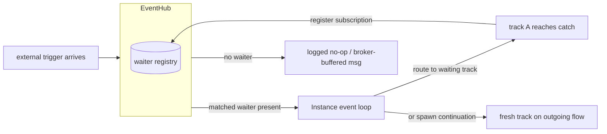
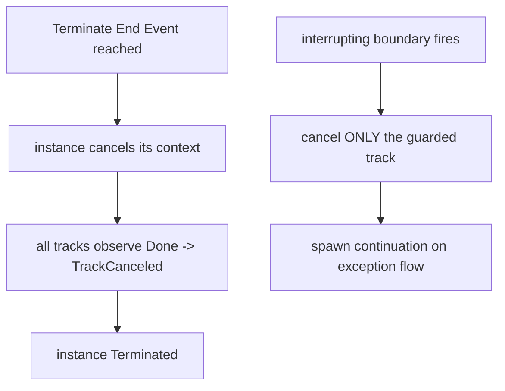
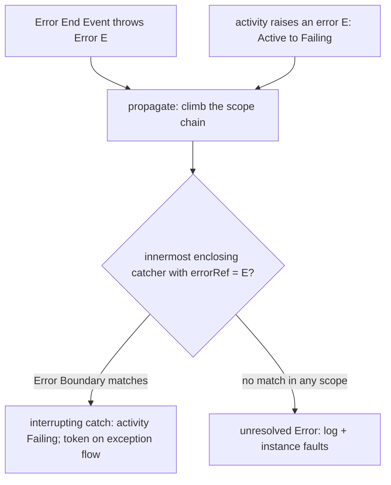

# ADR-006 — Events & Subscriptions

| Field | Value |
|---|---|
| Status | Accepted |
| Version | v.3 |
| Date | 2026-07-15 |
| Owner | Ruslan Gabitov |
| Refines | [ADR-001 v.6 Execution Model](ADR-001-execution-model.md) |

> Home for the event-delivery and event-triggered-cancellation conception
> relocated out of ADR-001 (which scopes itself to the built runtime core). This
> ADR decides, as **prescriptive conception** grounded in BPMN 2.0: how an
> external trigger reaches a running instance (§2.1), the BPMN nodes that
> *trigger* cancellation — Terminate End Event and boundary interruption (§2.2),
> the wait-node subscription model (§2.3), the in-memory delivery contract (§2.4),
> the waiter lifecycle (§2.5), Error events (§2.6), and Conditional events
> (§2.7). Implementation rides the events-workstream SRD(s); some parts are
> conception ahead of code, exactly as ADR-005 decides Inclusive/Complex joins
> ahead of their implementation.

## 1. Context

### 1.1 What ADR-001 left to this ADR

ADR-001 defines the runtime core and a **generic** `context` cancellation
cascade (Engine → Instance → track). It does **not** define how external event
arrivals (Message / Timer / Signal) reach a running instance, nor the
BPMN-specific nodes that *trigger* cancellation. The runtime today moves a track
to `TrackWaitForEvent` and registers an event-node's definitions, but the
**delivery edge** (how a trigger is routed back to the right track), the
**cancellation-trigger nodes** (Terminate End Event, interrupting boundary
event), and the **wait-release** shape are this ADR's scope. §2.1–§2.3 decide
them at the conception level; ADR-007 owns the in-memory release mechanics and
the persistence ADR owns durable rehydration.

### 1.2 Two delivery/lifecycle defects the audit flagged

The 2026-06-11 architecture audit found the event machinery's **contract
undefined** and its **waiter ownership ambiguous**:

- **2.4 — delivery semantics undefined (MAJOR).** In practice it is
  *at-most-once*: propagating an event with no registered waiter is an **error**,
  there is no buffer, and an event published before its subscriber registers is
  **lost** — while consumers (tracks resuming from a wait) assume guaranteed
  delivery. The contract was never stated, so the behaviour is accidental.
- **2.5 — waiter lifecycle unclosed (MAJOR).** Ownership is decided two ways at
  once: a waiter removes *itself* on trigger **and** the hub removes it on
  unregister — a double-removal race. There is no synchronization of waiter
  goroutines at shutdown (no `WaitGroup`), and a failed `Stop()` leaves the
  waiter in the registry with a live goroutine (a leak).

These are decided in §2.4/§2.5: **ADR-013's `Thresher.Shutdown(ctx)`** needs a
defined waiter-shutdown, and **ADR-014's `MessageWaiter`** is a new waiter that
must obey one delivery contract and one ownership model.

## 2. Decision

### 2.1 External-signal delivery: the instance's inbound edge

BPMN distinguishes four ways a thrown trigger reaches its catcher (§10.5.1):

| Strategy | Triggers | Reach |
|---|---|---|
| **Publication** | Message, Signal | Message → correlation-matched to one instance; Signal → broadcast to **every** catcher in reach |
| **Direct resolution** | Cancellation, Compensation, Termination | Aimed at a specific Process / Activity instance |
| **Propagation** | Error, Escalation | Climb the scope chain to the innermost enclosing catcher |
| **Implicit throw** | Timer, Conditional | Thrown automatically when time / Boolean condition is satisfied |

The `EventHub` is the in-process realization of these strategies. The decision:

- **A single serialized inbound edge.** An arriving trigger is delivered to the
  target instance's **event loop** through one dedicated inbound channel — the
  *second* inbound edge of the loop (the first is the existing track→Instance
  channel). Because ADR-001 makes the loop goroutine the **sole** mutator of
  instance state, external signals are applied in that same goroutine: routing a
  trigger to a track, spawning a continuation, or starting the termination
  cascade all happen lock-free, serialized against ordinary track events.

- **Routing within the instance.** A delivered trigger carries the identity of
  the subscription it satisfies (the waiting node). The loop routes it to the
  **one** waiting track that registered that subscription and releases it (§2.3);
  for an instantiating start event the broker/hub spawns a fresh instance instead
  (cross-instance instantiation is ADR-015's concern, correlation is
  ADR-014/ADR-016's).

- **Per-instance subscription identity (no cross-instance broadcast).** Under
  ADR-009 each instance owns a private node-graph clone; each clone's catch
  registers a **distinct** subscription, so a delivered point-to-point trigger
  resumes only *its* instance's track. Two concurrent instances waiting on the
  same modelled catch never share one waiter — the engine must preserve this
  per-instance identity for every waiter-backed event definition (a single
  occurrence resuming several instances is a defect, not BPMN delivery).

- **Publication reach is by strategy, not by accident.** A **Signal** has no
  correlation: every catching subscription in reach receives it (the hub needs a
  name→subscribers index, §10.5.1, §10.5.7). A **Message** is matched by ref
  **and** correlation (§10.5.1) — a subscriber sees it only when its conversation
  key matches (ADR-016). The hub honours the strategy; it does not turn a signal
  broadcast into a point-to-point delivery or vice-versa.

### 2.2 Cancellation-trigger nodes: Terminate End Event & boundary interruption

ADR-001 owns the *generic* cancellation cascade; this ADR owns the BPMN nodes
that **trigger** it.

**Terminate End Event (§13.5.6, §10.5.6 p279).** Reaching a Terminate End Event
**abnormally terminates this process instance**: remaining tokens are discarded,
other end-event behaviours are *not* performed, and **no other instance is
affected**. Realization: the instance cancels its own context → every track
observes `Done()` → each exits as canceled → the instance reaches `Terminated` —
the exact generic cascade ADR-001 already verifies. ADR-006 adds only the
*trigger*: the Terminate node asks the instance to cancel. At Sub-Process scope
(future work) Terminate ends **only that scope instance** (for a multi-instance
body, only the affected instance — §13.5.6), leaving the enclosing process
running.

**Interrupting boundary event (`cancelActivity=true`, §10.5.6, §13.5.3).** The
occurrence is consumed, the guarded activity is **terminated**, and a token is
generated on the boundary's outgoing **exception flow**. Realization: the
instance cancels **only the track executing the guarded activity** (not the whole
instance), then spawns a continuation track on the boundary's outgoing flow. The
boundary handler's subscription is registered for the **whole lifetime of the
activity it guards** (so §2.4's subscribe-before-publish always holds for it) and
is unregistered when the activity completes normally.

**Non-interrupting boundary event (`cancelActivity=false`).** The occurrence is
consumed, the activity **continues**, and a token is generated on the boundary's
outgoing flow **in parallel** — i.e. a fresh concurrent track — while the guarded
track runs on (§10.5.6).

**Engine notes.**
- *Error is always interrupting* (§10.5.6): there is no non-interrupting Error
  boundary. Error/Escalation use the **propagation** strategy — climb the scope
  chain to the innermost enclosing catcher (§10.5.1, §10.5.7); unresolved Error is
  critical (abort the instance), unresolved Escalation is silent. **The Error
  *event* model — throw points, `errorRef` matching, scope-chain propagation,
  catch, and the unmatched→fault outcome — is detailed in §2.6.** Scope-chain
  propagation lands with the sub-process/boundary workstream; ADR-006 fixes the
  *delivery* and *interruption* model it will use.
- *Handler multiplicity* (§10.5.6 p278): at most **one interrupting handler per
  Event Declaration** on a given activity; non-interrupting handlers are
  unbounded and run concurrently. The engine tracks multiplicity per
  (activity, EventDefinition) pair.
- *Terminate does **not** run compensation* (conformant default). Terminate is
  *abnormal* termination: tokens are discarded and "other End Events behaviour is
  NOT performed" (§13.5.6). Compensation is triggered **only** by a throw
  Compensation Event (§13.5.5), never by terminate — and a terminate in flight
  *interrupts* an in-progress compensation (`Compensating → Terminated`). This is
  the mandatory default. An **optional `compensate-on-terminate`** behaviour
  (running the triggerable compensations of already-completed activities before
  the instance dies) is a deliberate, **off-by-default** extension; both its
  **activation scope** (process- / instance-wide — *not* a blunt engine-wide
  switch) **and** its mechanism are decided in the **Compensation ADR**, since the
  firing itself needs the compensation machinery. ADR-006 fixes only the default.

### 2.3 Wait nodes & subscription lifecycle

A subscription is the registry entry that lets §2.1 route a trigger back to the
right track. **When** it is created and removed differs by subscriber kind, and
the standard prescribes three distinct lifecycles:

| Subscriber | Subscribe | Unsubscribe |
|---|---|---|
| **In-flow waiter** — Intermediate catch / ReceiveTask / Timer (§13.5.2) | when the **token reaches** the node (waiting starts on arrival; the track moves to `TrackWaitForEvent`) | on **consume** — the trigger occurs, is consumed once, outgoing flows are followed; or on track cancel |
| **Boundary handler, non-compensation** — Message / Timer / Signal / Conditional / Error / Escalation (§10.5.6, §13.5.3) | on the guarded activity's **entry** (it becomes active) | on the activity's **exit** — normal completion **or** interruption. This activity-lifetime subscription is what makes §2.4's subscribe-before-publish hold for the whole activity |
| **Compensation boundary handler** (§13.5.5) | **not a live subscription** — becomes *eligible* only when the guarded activity reaches **`Completed`** (a data snapshot is captured at that moment) | when the **enclosing scope finishes** (for a top-level activity, that scope **is** the instance) |

- **Why compensation is different.** A compensation handler does not catch a live
  trigger that interrupts a running activity; it undoes the effects of an activity
  that **already completed successfully**, and only when a **throw Compensation
  Event** later asks for it (§13.5.5). So it has no entry-time subscription — it
  is *armed* at `Completed` and stays armed across its scope's lifetime. ADR-006
  owns this **eligibility window** (the subscription-layer fact); the **handling**
  — `CompensateEventDefinition` throw resolution, reverse-order invocation,
  snapshot restore, the presumed-abort rule (§13.5.5 / §10.7) — is delegated to a
  dedicated **Compensation ADR** (to be authored with the compensation
  workstream).
- **The release mechanics are ADR-007's.** Whether the waiting goroutine parks or
  ends and a fresh track is spawned on the trigger (in-memory long-wait model) is
  decided in [ADR-007](ADR-007-in-memory-long-waits.md), which builds on §2.1
  delivery and §2.5 lifecycle. Durable release across restart is the persistence
  ADR's.
- **Pre-arriving messages are the broker's job.** A message that arrives before
  its ReceiveTask/catch is reached is buffered by the `MessageBroker` and
  delivered on subscribe (§2.4, ADR-014) — the one case that legitimately
  pre-arrives is not the hub's to store.

### 2.4 Delivery contract: in-memory, subscribe-before-publish, non-durable (decides audit 2.4)

The `EventHub` is an **in-memory, non-durable** dispatcher with an explicit
contract, replacing the accidental at-most-once behaviour:

- **Subscribe-before-publish.** A waiter must be registered **before** the event
  it awaits is propagated. The engine guarantees this for every case where a
  consumer *must* receive: a timer / intermediate-catch waiter is registered when
  its track reaches the wait (§2.3), and a **boundary / error / escalation**
  handler is registered for the **whole lifetime of the activity it guards**
  (§2.2) — so a targeted internal event always finds its waiter already present.
- **No waiter ⇒ no-op, not an error.** Propagating an event no one is waiting for
  is a **logged no-op** (debug), never an error. This is *correct* BPMN **signal**
  broadcast semantics (a signal thrown with no live catcher is simply not caught,
  §10.5.1) and harmless for any other kind. (Removes the "error if no waiter"
  defect.)
- **Messages are buffered by the broker, not the hub.** An external **message**
  arriving before its `ReceiveTask` / catch subscribes is held in the
  `MessageBroker`'s inbox and delivered on subscribe ([ADR-014](ADR-014-message-handling.md)).
  So the one case that genuinely needs pre-subscribe buffering is the broker's
  job; the hub stays a live dispatcher, not a store. The hub never duplicates the
  broker's buffer.
- **Not a durable bus.** The hub does not persist or replay events; durability
  and replay across restart are the persistence ADR's concern. In-memory delivery
  is the conformance target's model (single-process).

This makes the previously-accidental behaviour a **stated contract**: guaranteed
to present waiters, broker-buffered for messages, broadcast-to-current-listeners
for signals, and an explicit non-goal for durability.

### 2.5 Waiter lifecycle: the EventHub is the sole owner (decides audit 2.5)

One owner, one shutdown path:

- **The hub owns every waiter's lifecycle** — it creates it, starts its
  goroutine, stops it, and removes it from the registry. A waiter **never removes
  itself**; on trigger/completion it signals the hub (or returns) and the **hub**
  does the removal. This eliminates the double-removal race (self-delete vs
  hub-delete).
- **Shutdown is synchronized.** The hub tracks waiter goroutines with a
  `sync.WaitGroup`; `Shutdown(ctx)` (the public contract in ADR-013 §2.5) stops
  every waiter and **waits for their goroutines to exit**, bounded by `ctx`. No
  waiter goroutine outlives the hub.
- **A failed `Stop()` still cleans up.** If a waiter's `Stop()` errors, the hub
  **still removes it from the registry and ensures its goroutine terminates** —
  the error is logged, never swallowed-with-a-leak.
- **One mutex-guarded registry.** Register / unregister / propagate are atomic
  with respect to the registry, so a trigger racing an unregister cannot observe a
  half-removed waiter.

This single-ownership model is what `TimeWaiter`, ADR-014's `MessageWaiter`, and
any future waiter obey, and it is the mechanics ADR-013's `Thresher.Shutdown`
drives.

**(v.3)** Conditional subscriptions are the **deliberate exception** to this
sole-hub pattern: their trigger source is the instance's own data commits, so
they are owned by the instance loop, never registered as hub waiters — §2.7
Ownership. Every externally-triggered wait (message, timer, signal) stays
hub-owned as above.

### 2.6 Error events: throw, propagation, and catch

§2.2 fixes that an Error boundary is *always interrupting* and that Error uses the
**propagation** strategy; this section details the Error *event* model the engine
realizes — the throw points, the matching, the scope-chain propagation, and the
catch and unmatched outcomes. (The boundary **interruption mechanism** — how a
*running* activity is actually stopped — is the boundary workstream's, refining
§2.2; it is not re-decided here.)

**The Error object (§10.5.1; `event-definitions.md`).** An `ErrorEventDefinition`
carries an optional `errorRef` (0..1) to an `Error`, which carries an `errorCode`
(the contract identifier a catcher matches on), an optional `name`, and an
optional `structureRef` (the error payload's `ItemDefinition`). An Error event
definition is valid at **three positions only** (`conformance.md`): an **End
Event** (throw), a **Boundary Event** (catch — always interrupting), and an
**Event Sub-Process Start Event** (catch — deferred with Sub-Processes).

**Throw — two sources.**
- An **Error End Event** ends its path by throwing its associated `Error`
  (§10.5.6 p279; `end-events.md`: "Error End Event → the associated `Error` is
  thrown").
- An **activity raising an error** — a `ServiceTask` whose invoked operation
  returns a *fault*, a `ScriptTask` that throws, etc. — raises an interrupting
  Error, and the activity transitions `Active → Failing` (`tasks.md`:
  "treated as an interrupting error and the activity fails"; `activity-lifecycle.md`).

Either way the throw is **critical** (§10.5.1): execution is *suspended at the
throw location* — unlike an Escalation, which is non-critical and lets execution
continue at the throw location. There is **no Error Intermediate Throw Event** in
BPMN; an Error is thrown only at an End Event or by a failing activity.

**Propagation — climb the scope chain (§10.5.1, §10.5.7).** A thrown Error is
**forwarded from the throw location upward to the innermost enclosing scope
instance that has an attached catching Event whose `errorRef` matches**: the
engine walks from the throwing scope outward to enclosing scopes, and the **first**
matching catcher consumes the trigger (`event-handling.md`, scope-chain walk). A
*scope* (§10.5.7) is the execution context of an activity — its data objects, its
events available for catch/throw, its conversations; the **Process is the
outermost scope**, and each Sub-Process / Call Activity (future) introduces a
nested one. Matching is **per Event Declaration**: a catcher for `errorRef=X` does
not consume `errorRef=Y` (multiplicity is tracked per `(activity, EventDefinition)`
pair — §2.2).

**Catch — an Error Boundary Event (always interrupting).** A matched Error boundary
drives its guarded activity to `Failing` (§13.3.2; `activity-lifecycle.md`) and a
token is generated on the boundary's **exception flow**; per §10.5.6 the activity
is cancelled **after** the boundary's outgoing flow is followed (the §10.5.6 §7
interrupting-handler runtime order). *How* the running activity is interrupted is
fixed by the boundary workstream that refines §2.2 — ADR-006 owns only the event
model. The second standard catch path — an **Error Event Sub-Process** start
(`conformance.md`: event-sub-process only) — lands with Sub-Processes.

**Unmatched — the instance faults (engine choice).** If no catcher matches anywhere
in the scope chain, the Error is **unresolved** (§10.5.1). The standard does **not**
mandate a reaction; gobpm takes the typical one named in the spec — **log and fault
the instance** (an unresolved Error is critical). This is the engine choice that
turns a failed track into an instance failure.

**Engine note — the single-scope reality before Sub-Processes.** Until nested
scopes exist (Sub-Process / Call Activity are post-0.1.0; [SAD-001 v.1 §15.3](SAD-001-vision-and-architecture.md)),
the scope chain has exactly **one** level — the Process. Two consequences follow
with no loss of standard fidelity:
- an Error raised by an activity is catchable only by an Error Boundary **on that
  same activity** — there is no outer scope to climb to;
- an **Error End Event**, throwing at Process scope, has no enclosing in-process
  catcher, so it always resolves to an **instance fault** (the end-in-error case).

Cross-scope climbing and the Error-Event-Sub-Process catch path become live the
moment a nested scope is introduced; the propagation model above already describes
them, so no rework is needed then.

### 2.7 Conditional events: status-based triggering by commit-diff

A Conditional event is **implicitly thrown** — "Timer and Conditional triggers
are implicitly thrown. When they are activated they wait for a time based or
status based condition respectively to trigger the catch Event" (§10.5.1). Its
trigger is a **boolean `Expression`** (`ConditionalEventDefinition.condition`,
a `0..1` child per the metamodel): "This type of Event is triggered when a
condition becomes true. A condition is a type of Expression" (Tables
10.89/10.90).

#### Positions

| Position | Decision |
|---|---|
| **Intermediate Catch** (in-flow wait) | **In scope.** The catch parks like any wait node (§2.3 in-flow row: subscribe on arrival, consume on fire). |
| **Boundary** — interrupting and non-interrupting (Table 10.90; non-interrupting explicitly permitted for Conditional, `events.md`) | **In scope.** Arm on the guarded activity's entry, disarm on its exit (§2.3 boundary row — Conditional was already listed there); interrupting fires cancel the activity per §2.2, non-interrupting fires fork per §2.2 and may **re-fire** on a fresh false→true edge (the Table 10.84 edge rule, below). |
| **Event-Based Gateway arm** | **In scope.** The gateway's deferred choice ([ADR-005 v.4 §2.12](ADR-005-gateways-and-joins.md)) admits Conditional arms — "the 'Events following' are intermediate catching events: Message, Timer, Signal, Conditional" (`gateways.md`). A conditional arm is armed like a catch when the token reaches the gateway; the first fire among all arms wins the race and disarms the rest. This closes the arms deferral ADR-005 v.4 §2.12 recorded. |
| **Start Event (top-level)** | **Not supported — an engine choice, indefinitely.** Table 10.84 (§10.5.2): the condition "**MUST NOT refer to the data context or instance attribute of the Process** (as the Process instance has not yet been created). Instead, it MAY refer to **static Process attributes and states of entities in the environment**. The specification of mechanisms to access such states is **out of scope of the standard**." The engine has **no** static-process-attribute or environment-entity surface — a conformant top-level start condition would have nothing legal to reference; reference engines reduce it to an explicit evaluate-API with caller-supplied data (Camunda 7's condition evaluation; Camunda 8's staged gRPC evaluation). A Conditional trigger on a **top-level** Start Event is therefore **rejected at model validation** (the process-level placement check, run at registration before any instance) — fail-fast, not the silent never-fires the permissive allow-list would produce; the event's *construction* surface stays legal, since the same Start Event serves the event-sub-process home below. Should a real host need appear, the evaluate-API is the named shape; nothing here precludes it. |
| **Event Sub-Process start** | **The planned home for a Conditional start** — lands **with Sub-Processes** (`sub-processes.md` lists Conditional among event-sub-process start types). Unlike the top-level case, an event sub-process runs **inside a live instance**: its start condition legally references the **enclosing scope's data** (§10.4.3), evaluated by the same commit-diff re-evaluation this section decides — no new data surface needed. Decision recorded now; implementation rides the Sub-Process workstream. |

An End Event (or any throw position) cannot carry a Conditional trigger —
catch-only by the standard's tables; already rejected at configuration.

#### Evaluation semantics

- **Data context.** A catch/boundary/arm condition evaluates over the
  **instance's data scope** — the same context gateway conditions and
  expressions use (§10.4.3: "all elements accessible from the enclosing
  element … MUST be made available"). Nothing new is exposed.
- **When: at arm, then on every committed change.** The condition is evaluated
  **once when the subscription arms** — a condition already true fires
  immediately (the standard defines no first-evaluation timing; firing on true
  at subscription is the reference-engine behavior and avoids a wait that can
  never end) — and thereafter **re-evaluated when the instance's committed
  data changes**. The change signal is the **commit-diff seam**
  (ADR-011 v.6 §2.9.4): a frame commit at the activity boundary produces the
  committed changed-path set; a non-empty set triggers re-evaluation. This is
  the visibility rule already decided for data: a mid-activity write is not a
  committed change and MUST NOT fire a conditional.
- **The edge rule (normative).** "The condition Expression for the Event MUST
  become **false and then true** before the Event can be triggered again"
  (Table 10.84 wording, mirrored for the catch positions). Triggering is
  **edge-based, not level-based**: each armed subscription carries its last
  observed value; a fire requires a false→true transition (the arm-time
  evaluation seeds the state, and an arm-time `true` is the permitted first
  trigger). A non-interrupting boundary that fired re-arms and needs a fresh
  false→true edge to fire again.
- **Granularity — safe by default, filtered by the expression's own
  dependency statement.** A wrong dependency set means a silent missed
  wake-up, so nothing is ever *inferred*: runtime read-tracing is rejected
  (an opaque functor takes data-dependent paths and can bypass the data
  source entirely — e.g. a captured live wrapped struct), and there is **no
  processing mode** at any level — the rule is uniform, per subscription:

  - the expression contract is one optional capability,
    `Dependencies() []string` — the data paths the expression reads.
    **Absent, or nil/empty at runtime → the engine assumes it may read
    anything** (the fail-safe direction);
  - on every non-empty commit, an armed conditional **re-evaluates** when it
    has no dependency statement, or when the commit's changed-path set
    **intersects** its declared dependencies (segment-boundary prefix match:
    a change at `order` affects a dependency on `order.total`, and vice
    versa); otherwise it is skipped;
  - a **missing** statement therefore costs only performance, never
    correctness — the safe fallback is built into the rule, which is why no
    process-level mode or completeness validation is needed. A **wrong**
    statement is the author's contract (declared next to the expression's
    logic, visible in the model); a declarative introspectable expression
    (the expression-layer workstream) implements the same capability
    **structurally** — exact and error-free — and a conservative
    compile-time source analyzer on the codegen seam may derive it for
    functors, both failing toward re-evaluation, never toward a miss.
    **Declaring** constructors reject an explicitly empty statement
    ("depends on nothing" would mean *never* re-evaluate — the degenerate
    trap); should a runtime list still come back empty, the engine treats
    it as absent — fail-safe, per the first bullet.

- **Multi-fire ordering — one commit, one snapshot, arming order.** A single
  commit may satisfy several armed conditions at once — including an
  interrupting boundary whose fire cancels the track hosting another armed
  subscription. The rule: the pass evaluates **every** armed subscription
  against the same committed state (a fire commits no data, so one snapshot
  serves the whole pass), collects the fires, and **applies them in arming
  order**; applying a fire that disarms a later-collected subscription (an
  interrupting cancellation, a resolved gateway race) **voids** that
  delivery — the subscription no longer exists. Deterministic, and free of
  evaluation-order dependence.

#### Ownership — loop-local, not hub

Conditional subscriptions are **owned by the instance loop**, not the
engine-wide hub — deliberately breaking the §2.5 "sole-hub waiter" pattern for
this one kind: a conditional's trigger source is the **instance's own
commits**, which already arrive at the loop as track events; there is no
external or engine-wide trigger to route, so a hub registration would add a
cross-component round-trip for a purely loop-internal signal. The loop keeps
the armed set (catch parks, boundary watches, gateway arms), re-evaluates on
the commit signal, and delivers a fire through the §2.1 inbound edge exactly
like any other event — the single-writer discipline ([ADR-001 v.6 §4](ADR-001-execution-model.md)) holds
throughout. Timer stays hub-owned (the clock is an engine-wide source);
Conditional is loop-owned (the data plane is instance-scoped). The §2.4
delivery contract is unchanged: subscribe-before-publish holds by
construction (the subscription arms before any commit can re-evaluate it).

## 3. Consequences

- **Event delivery is a contract, not an accident.** Callers know: a present
  waiter is guaranteed delivery; a thrown-into-the-void signal is a no-op;
  messages are broker-buffered; nothing is durable. The "lost event" ambiguity is
  gone.
- **Data-driven waiting is expressible without polling (v.3).** A process
  reacts to its own committed state ("credit limit exceeded", "stock below
  threshold") through Conditional catches, boundaries, and gateway arms — the
  §2.9.4 commit-diff substrate makes the re-evaluation exact and cheap, with
  no hidden mid-activity firing.
- **The inbound edge is a single serialized owner.** External signals join track
  events in the one loop goroutine (§2.1), so adding event delivery, termination,
  and boundary interruption needs **no new locks** on instance state — it extends
  ADR-001's single-mutator model rather than bolting concurrency onto it.
- **Cancellation triggers reuse the proven cascade.** Terminate and interrupting
  boundary events are *triggers* over ADR-001's already-verified
  context-cancellation cascade (§2.2); the instance-wide vs single-track scoping
  is the only new decision.
- **`Shutdown` becomes possible and deterministic.** ADR-013's graceful stop has
  a defined waiter-shutdown to call (stop-all + `WaitGroup` wait); no leaked
  goroutines, no double-free.
- **ADR-014's message waiter slots in cleanly.** It is a waiter under §2.5
  ownership and rides §2.4's contract, with pre-subscribe messages covered by the
  broker — no special path.
- **No durable delivery (by design).** A process waiting on an event across an
  engine restart is not resumed until the persistence ADR; documented as a
  deliberate boundary, not a silent gap.
- **Conception ahead of code, explicitly.** Boundary interruption and
  Error/Escalation propagation (§2.2 engine notes) are decided here but land with
  the sub-process/boundary workstream and its SRD — the ADR-005 pattern (decide
  the join taxonomy, implement Parallel first).

## 4. Alternatives considered

- **Buffer all pending events in the hub (durable-ish in-memory queue).** Deliver
  to late subscribers generally. Rejected: unbounded-memory / staleness risk, and
  it conflates two needs — *messages* (which legitimately pre-arrive) are already
  the broker's job (ADR-014), while *signals* pre-arriving and being "caught late"
  would violate BPMN broadcast semantics. Targeted buffering at the broker beats a
  general hub buffer.
- **Strict subscribe-before-publish with no broker buffering** (even messages must
  subscribe first). Rejected: a message genuinely can arrive before its
  `ReceiveTask` is reached; forbidding that makes correct collaborations
  unrunnable. The broker's bounded inbox is the right place for that one case.
- **Make "no waiter" an error (keep current).** Rejected: it is wrong for signal
  broadcast (no listener is normal, §10.5.1) and turns a benign condition into a
  failure; a logged no-op is correct.
- **Per-waiter self-ownership (waiter removes itself, no central owner).** The
  current half-state. Rejected: it is exactly the double-removal race and gives no
  place to synchronize shutdown. Single hub ownership is the fix.
- **A second inbound channel per trigger kind (separate message/timer/signal
  edges into the loop).** Rejected: it multiplies the loop's select arms and the
  ordering guarantees without benefit — one `ExternalSignal` edge carrying a
  tagged trigger keeps the loop a single serialized owner (§2.1) and lets routing
  switch on the trigger kind in one place.
- **Terminate / boundary as a cross-goroutine kill of the target track.**
  Rejected: cancelling a track from outside its owning loop reintroduces the
  shared-state races ADR-001/ADR-009 removed. Routing the cancellation *through*
  the event loop (§2.1) keeps the single-mutator invariant — the loop cancels the
  instance context (Terminate) or the one track's sub-context (boundary).
- **A durable/persistent event bus now.** Rejected for this phase: durability is
  the persistence ADR's; the conformance target is single-process in-memory.

## 5. Enterprise-readiness recommendations

Advisory, not gating — for the implementing SRD(s):

- **Log a dropped/no-waiter propagation** at debug with the event kind + id, so an
  operator can tell a deliberate broadcast-miss from a modelling mistake.
- **Bound and observe the broker inbox** (ADR-014) — the one buffer in the path;
  surface its depth/drops via the metrics extension (ADR-002).
- **Make `Shutdown` waiter-drain ctx-bounded and report stragglers** — if a waiter
  goroutine doesn't exit within the deadline, log which, don't hang.
- **Emit waiter register/trigger/remove onto the lifecycle channel** (ADR-013) so
  waiting and resuming are observable, not just logged.
- **Index signals by name for O(1) broadcast** (§10.5.1) and metric the fan-out
  size — a signal with a surprising number of catchers is often a modelling
  smell.

## 6. Open questions

None. The delivery contract (§2.4), the waiter lifecycle (§2.5), the inbound
delivery edge and per-instance subscription identity (§2.1), the
cancellation-trigger nodes (§2.2 — Terminate + interrupting/non-interrupting
boundary), and the wait-node subscription model (§2.3) are decided as conception.
The in-memory wait-release mechanics are delegated to ADR-007, durable
rehydration to the persistence ADR, and scope-chain Error/Escalation propagation
lands with the sub-process/boundary workstream — these are delegations, not open
questions.

## 7. References

- [ADR-001 v.6 Execution Model](ADR-001-execution-model.md) — the runtime core,
  the single-mutator event loop, and the generic cancellation cascade this refines
  (event triggers feed it).
- [ADR-002 v.2 Extension Architecture](ADR-002-extension-architecture.md) — the
  Logger/Metrics extensions used to log/observe delivery (§5).
- [ADR-007 v.1 In-Memory Long Waits](ADR-007-in-memory-long-waits.md) —
  wait-release built on §2.1 delivery and §2.5 waiter lifecycle.
- [ADR-009 v.1 Per-Instance Node Graph](ADR-009-per-instance-node-graph.md) — the
  per-instance clone that gives each catch its own subscription identity (§2.1).
- [ADR-013 v.2 Instance Observability & Control](ADR-013-instance-observability.md)
  — its `Thresher.Shutdown(ctx)` consumes §2.5's waiter shutdown; its lifecycle
  channel can observe waiters (§5).
- [ADR-014 v.1 Message Handling](ADR-014-message-handling.md) — its `MessageWaiter`
  obeys §2.4/§2.5; the broker owns the pre-subscribe message buffering §2.4 defers
  to it.
- **(v.3)** [ADR-011 v.6 Process Data Flow](ADR-011-process-data-flow.md) — its
  §2.9.4 commit-diff (the committed changed-path set) is §2.7's re-evaluation
  signal; ADR-011 anticipated conditional events as that seam's future consumer.
- **(v.3)** [ADR-005 v.4 Gateways & Joins](ADR-005-gateways-and-joins.md) — its
  §2.12 Event-Based Gateway whose deferred Conditional arms §2.7 opens.
- **(v.3)** [ADR-018 v.1 Boundary Events](ADR-018-boundary-events-and-activity-interruption.md) — the
  boundary arm/disarm machinery §2.7's conditional boundary rides; its §2.7
  deferred list names Conditional — at this amendment's landing that row gains
  a "decided in ADR-006 v.3" annotation (a sync note, not an ADR-018 re-decision).
- [docs/bpmn-spec/semantics/event-handling.md](../bpmn-spec/semantics/event-handling.md)
  — §10.5.1 resolution strategies, §10.5.6 boundary/handler rules, §10.5.7 scopes:
  grounds §2.1/§2.2.
- [docs/bpmn-spec/semantics/events.md](../bpmn-spec/semantics/events.md) — §13.5.2
  intermediate-catch waiting and §13.5.3 boundary events: grounds §2.2/§2.3.
- [docs/bpmn-spec/semantics/end-events.md](../bpmn-spec/semantics/end-events.md) —
  §13.5.6 Terminate semantics underpinning §2.2.
- [docs/bpmn-spec/semantics/compensation.md](../bpmn-spec/semantics/compensation.md)
  — §13.5.5 / §10.7 compensation eligibility (armed on `Completed`, triggered only
  by a throw, no compensation on terminate): grounds the compensation rows of §2.2
  and §2.3.
- **Compensation ADR** (to be authored with the compensation workstream) —
  decides compensation *handling* (throw resolution, reverse-order invocation,
  snapshot restore, presumed-abort) and the optional `compensate-on-terminate`
  extension whose default §2.2 fixes. Unpinned forward-reference (not yet
  authored), like the persistence ADR referenced above.
- Architecture audit 2026-06-11 (`docs/audit/architecture-audit-2026-06-11.md`) —
  findings 2.4 (delivery semantics) and 2.5 (waiter lifecycle) decided here.

## Document History

| Version | Date | Author | Change |
|---|---|---|---|
| v.3 | 2026-07-15 | Ruslan Gabitov | Added **§2.7 "Conditional events: status-based triggering by commit-diff"** — the Conditional conception the taxonomy rows named but never decided. **Positions:** Intermediate Catch + Boundary (interrupting/non-interrupting, Tables 10.89/10.90) + **Event-Based Gateway arms** (closing the ADR-005 §2.12 arms deferral; `gateways.md` lists Conditional among the gateway's catching events) in scope; **top-level Conditional Start not supported indefinitely** — an engine choice grounded in Table 10.84's verbatim prohibition ("MUST NOT refer to the data context or instance attribute of the Process … MAY refer to static Process attributes and states of entities in the environment", access mechanisms "out of scope of the standard") + the engine having no such surface (reference engines reduce it to an explicit evaluate-API); **Event Sub-Process start is the planned Conditional-start home** (inside a live instance the condition legally reads the enclosing scope per §10.4.3) — decided now, lands with Sub-Processes. **Evaluation:** instance-scope data context (§10.4.3); evaluated at arm (an arm-time true fires — reference-engine behavior) then re-evaluated on **committed** data change only — the ADR-011 v.6 §2.9.4 commit-diff seam is the change signal (mid-activity writes never fire a conditional); the normative **false→true edge rule** (Table 10.84: "MUST become false and then true before the Event can be triggered again") realized as per-subscription edge state, governing non-interrupting boundary re-fires; opaque-expression granularity = re-evaluate all armed conditionals per non-empty commit by default, with an OPT-IN declared watched-paths filter settled as ONE uniform per-subscription rule with NO processing modes at any level: the expression carries an optional `Dependencies() []string` capability (`data.DependencyLister`; goexpr authors declare via `WithDependencies`, declarative expressions implement it structurally, a conservative codegen source analyzer may derive it) — absent/nil → the CE re-evaluates on every non-empty commit (the safe fallback: a missing statement costs performance, never correctness — which is why no mode or completeness validation exists); non-empty → re-evaluate only when the commit-diff intersects (segment-prefix); explicitly-empty rejected at construction (the never-fire trap); runtime read-tracing rejected (opaque closures take data-dependent paths and can bypass the data source via captured live structs → silently incomplete inferred sets); multi-fire ordering: one commit → one snapshot → evaluate per the rule, apply fires in arming order, a disarming fire voids later-collected deliveries. **Ownership:** conditional subscriptions are **loop-local** — a deliberate exception to §2.5's sole-hub pattern (the trigger source is the instance's own commits; timer stays hub-owned as a clock-driven engine-wide source); delivery through the §2.1 inbound edge, single-writer preserved, §2.4 subscribe-before-publish holds by construction. Added the §3 data-driven-waiting consequence. Standard-grounded against the BPMN 2.0 PDF (Tables 10.84/10.89/10.90, §10.5.1, §10.4.3 — verified verbatim via the spec notebook; the verified clauses added to `event-handling.md`'s appendix so future reviews ground in-repo) and `docs/bpmn-spec/` (`gateways.md`, `sub-processes.md`, `events.md`). §7 refreshed at the bump moment: stale pins ADR-001 v.5→v.6 and ADR-013 v.1→v.2 corrected; ADR-011 v.6 / ADR-005 v.4 / ADR-018 v.1 references added (the ADR-018 §2.7 deferred row gains a decided-here annotation at landing). §2.5 clarified: Conditional is the deliberate loop-owned exception to the sole-hub pattern. Conception; the accompanying SRD implements. |
| v.2 | 2026-06-27 | Ruslan Gabitov | Added **§2.6 "Error events: throw, propagation, and catch"** — the detailed Error *event* model §2.2 named but left at engine-note depth: the `Error`/`ErrorEventDefinition` object (`errorRef`→`errorCode`/`structureRef`, valid only at End / Boundary / Event-Sub-Process-Start positions per `conformance.md`); the two **throw** sources (Error End Event throwing its `Error`, §10.5.6/`end-events.md`; and an activity raising an interrupting error → `Active→Failing`, `tasks.md`/`activity-lifecycle.md`) and that the throw is **critical** (§10.5.1) with no Error Intermediate Throw Event; **propagation** as the scope-chain walk to the innermost enclosing catcher matching `errorRef` (§10.5.1/§10.5.7), matching **per Event Declaration**; **catch** at an always-interrupting Error Boundary (activity→`Failing`, token on the exception flow, cancel-after-flow per §10.5.6 §7; Error Event Sub-Process catch deferred with Sub-Processes); **unmatched→instance fault** as the engine choice for the spec's "unresolved Error"; and an **engine note** on the single-scope reality before Sub-Processes (no scope to climb to → an activity's error is caught only by a boundary on that same activity, and an Error End Event always resolves to an instance fault) cross-referencing [SAD-001 v.1 §15.3]. Fixed the §2.2 engine-note citation `§11`→`§10.5.7` and pointed it at §2.6. Refines pin updated ADR-001 v.5→v.6. Standard-grounded against `docs/bpmn-spec/` (§10.5.1/§10.5.6/§10.5.7, `event-definitions.md`/`tasks.md`/`end-events.md`/`conformance.md`/`activity-lifecycle.md`). No code/behaviour change — conception only. |
| v.1 | 2026-06-18 | Ruslan Gabitov | Accepted. Event-delivery & event-triggered-cancellation conception relocated from ADR-001 and authored in full: §2.1 external-signal delivery (single serialized inbound edge, per-instance subscription identity, publication/direct/propagation/implicit reach per §10.5.1), §2.2 cancellation-trigger nodes (Terminate End Event §13.5.6 over ADR-001's cascade; interrupting/non-interrupting boundary §10.5.6/§13.5.3; Error/Escalation propagation + handler multiplicity as engine notes), §2.3 wait-node subscription **lifecycle** (subscribe/unsubscribe per subscriber kind — in-flow on arrival/consume, non-compensation boundary on activity entry/exit, compensation boundary armed on `Completed` until enclosing scope finishes; §13.5.2/§13.5.3/§13.5.5; release mechanics delegated to ADR-007, compensation *handling* + the optional off-by-default `compensate-on-terminate` extension delegated to a future Compensation ADR; terminate runs **no** compensation by default per §13.5.6), §2.4 in-memory delivery contract (subscribe-before-publish, no-waiter no-op, broker-buffered messages, non-durable; remediates audit 2.4), §2.5 sole-hub waiter lifecycle (`WaitGroup`-synchronized shutdown, no self-removal, no leak on `Stop` error, single-lock registry; remediates audit 2.5). Standard-grounded against `docs/bpmn-spec/` (§10.5.1/§10.5.6/§10.5.7, §13.5.2/§13.5.3/§13.5.6). Refines ADR-001 v.5; siblings ADR-002 v.2, ADR-007 v.1, ADR-009 v.1, ADR-013 v.1, ADR-014 v.1. Conception; implementation rides the events-workstream SRD(s). |
