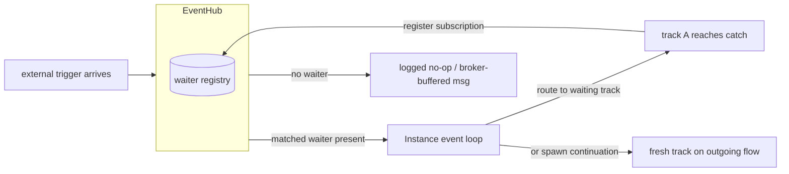
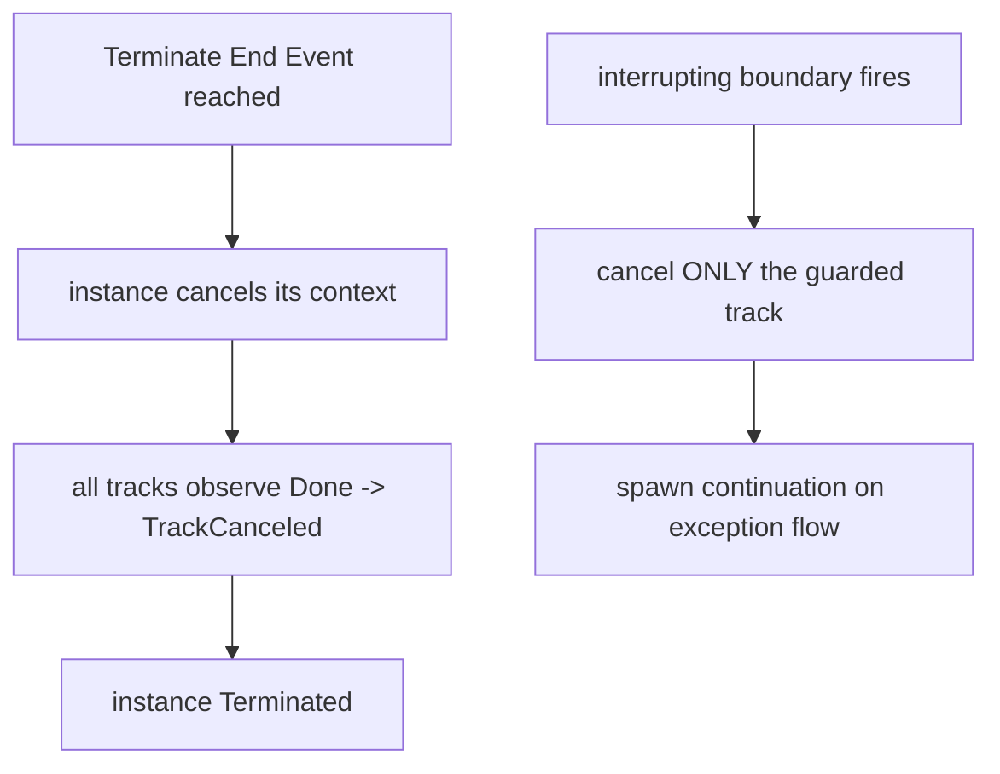
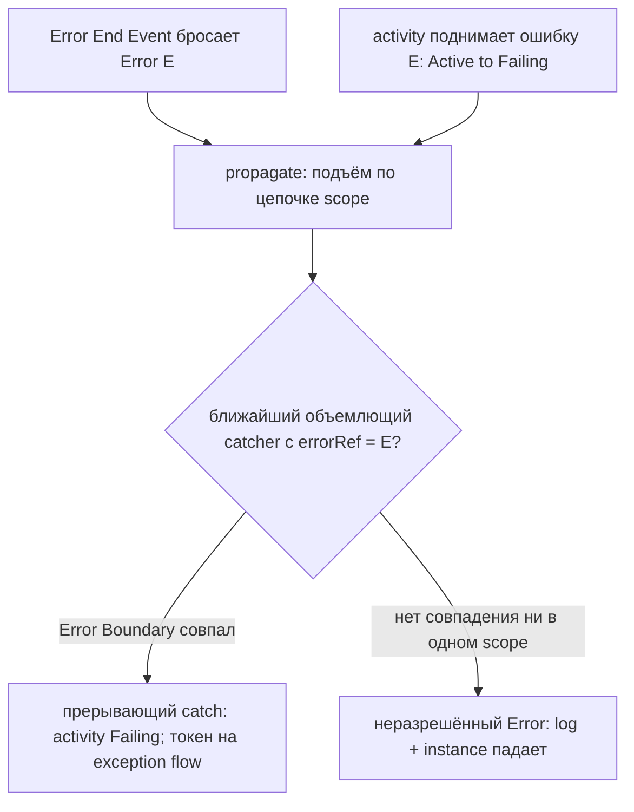

# ADR-006 — События и подписки

| Поле | Значение |
|---|---|
| Статус | Принято |
| Версия | v.4 |
| Дата | 2026-07-20 |
| Владелец | Руслан Габитов |
| Уточняет | [ADR-001 v.6 Execution Model](ADR-001-execution-model.md) |

> EN-оригинал — канонический: [ADR-006-events-and-subscriptions.md](ADR-006-events-and-subscriptions.md). Этот файл — его перевод (twin). При расхождении приоритет у английского текста.

> Дом для концепции доставки событий и инициируемой событием отмены, вынесенной
> из ADR-001 (который ограничен построенным ядром рантайма). Этот ADR решает, как
> **прескриптивную концепцию**, обоснованную BPMN 2.0: как внешний триггер
> достигает работающего instance (§2.1); BPMN-узлы, которые *инициируют* отмену —
> Terminate End Event и прерывание через boundary (§2.2); модель подписки
> wait-узлов (§2.3); in-memory-контракт доставки (§2.4); жизненный цикл waiter'а
> (§2.5); события Error (§2.6); события Conditional (§2.7); и события Link
> (§2.8 — интра-процессный GOTO по статическому спариванию имён, единственное
> «событие», которое не является подпиской). Реализация едет с
> SRD(ами) событийного workstream'а; часть — концепция впереди кода, ровно
> как ADR-005 решает Inclusive/Complex-join'ы раньше их реализации.

## 1. Контекст

### 1.1 Что ADR-001 оставил этому ADR

ADR-001 определяет ядро рантайма и **обобщённый** каскад отмены через `context`
(Engine → Instance → track). Он **не** определяет, как приходящие извне события
(Message / Timer / Signal) достигают работающего instance, как и BPMN-узлы,
которые *инициируют* отмену. Сегодня рантайм переводит track в
`TrackWaitForEvent` и регистрирует определения событий event-узла, но **грань
доставки** (как триггер маршрутизируется обратно нужному track'у), **узлы-инициаторы
отмены** (Terminate End Event, прерывающий boundary event) и форма
**wait-release** — это scope данного ADR. §2.1–§2.3 решают их на уровне
концепции; ADR-007 владеет in-memory-механикой release'а, а persistence ADR —
durable-регидрацией.

### 1.2 Два дефекта доставки/жизненного цикла, отмеченные аудитом

Архитектурный аудит 2026-06-11 нашёл, что контракт событийной машинерии
**не определён**, а владение waiter'ом **двусмысленно**:

- **2.4 — семантика доставки не определена (MAJOR).** На практике это
  *at-most-once*: propagation события без зарегистрированного waiter'а — это
  **ошибка**, буфера нет, а событие, опубликованное до регистрации подписчика,
  **теряется** — при том что потребители (track'и, возобновляющиеся из ожидания)
  предполагают гарантированную доставку. Контракт никогда не был заявлен, так что
  поведение случайно.
- **2.5 — жизненный цикл waiter'а не закрыт (MAJOR).** Владение решено двумя
  способами сразу: waiter удаляет *себя* при срабатывании **и** hub удаляет его при
  unregister — гонка двойного удаления. Нет синхронизации горутин waiter'ов на
  shutdown (нет `WaitGroup`), а упавший `Stop()` оставляет waiter в реестре с живой
  горутиной (утечка).

Они решены в §2.4/§2.5: **`Thresher.Shutdown(ctx)` из ADR-013** нуждается в
определённом waiter-shutdown, а **`MessageWaiter` из ADR-014** — это новый waiter,
который обязан подчиняться одному контракту доставки и одной модели владения.

## 2. Решение

### 2.1 Доставка внешнего сигнала: входящая грань instance

BPMN различает четыре способа, которыми брошенный триггер достигает своего
catcher'а (§10.5.1):

| Стратегия | Триггеры | Охват |
|---|---|---|
| **Publication** | Message, Signal | Message → сопоставляется по correlation одному instance; Signal → broadcast **каждому** catcher'у в пределах досягаемости |
| **Direct resolution** | Cancellation, Compensation, Termination | Нацелен на конкретный instance Process / Activity |
| **Propagation** | Error, Escalation | Поднимается по цепочке scope до ближайшего внешнего catcher'а |
| **Implicit throw** | Timer, Conditional | Бросается автоматически, когда выполнено условие времени / Boolean |

`EventHub` — это in-process-реализация этих стратегий. Решение:

- **Единственная сериализованная входящая грань.** Приходящий триггер
  доставляется в **event loop** целевого instance через один выделенный входящий
  канал — *вторую* входящую грань loop'а (первая — существующий канал
  track→Instance). Поскольку ADR-001 делает горутину loop'а **единственным**
  мутатором состояния instance, внешние сигналы применяются в той же горутине:
  маршрутизация триггера в track, порождение продолжения или запуск каскада
  завершения — всё происходит без локов, сериализованно относительно обычных
  событий track'ов.

- **Маршрутизация внутри instance.** Доставленный триггер несёт идентичность
  подписки, которую он удовлетворяет (ожидающий узел). Loop маршрутизирует его в
  **тот единственный** ожидающий track, что зарегистрировал эту подписку, и
  release'ит его (§2.3); для инстанцирующего start-события broker/hub вместо этого
  порождает свежий instance (межинстансное инстанцирование — забота ADR-015,
  correlation — ADR-014/ADR-016).

- **Per-instance-идентичность подписки (нет межинстансного broadcast'а).** По
  ADR-009 каждый instance владеет приватной копией графа узлов; catch каждой копии
  регистрирует **отдельную** подписку, так что доставленный point-to-point-триггер
  возобновляет только track *своего* instance. Два параллельных instance,
  ожидающих на одном смоделированном catch, никогда не делят один waiter — движок
  обязан сохранять эту per-instance-идентичность для каждого обеспеченного
  waiter'ом определения события (одно срабатывание, возобновляющее несколько
  instance, — это дефект, а не BPMN-доставка).

- **Охват publication — по стратегии, а не случайно.** У **Signal** нет
  correlation: его получает каждая catching-подписка в пределах досягаемости (hub
  нуждается в индексе name→subscribers, §10.5.1, §10.5.7). **Message**
  сопоставляется по ref **и** correlation (§10.5.1) — подписчик видит его только
  когда его conversation-ключ совпадает (ADR-016). Hub соблюдает стратегию; он не
  превращает signal broadcast в point-to-point-доставку и наоборот.

### 2.2 Узлы-инициаторы отмены: Terminate End Event и прерывание через boundary

ADR-001 владеет *обобщённым* каскадом отмены; этот ADR владеет BPMN-узлами,
которые его **инициируют**.

**Terminate End Event (§13.5.6, §10.5.6 p279).** Достижение Terminate End Event
**аномально завершает этот instance процесса**: оставшиеся токены отбрасываются,
поведения прочих end-событий *не* выполняются, и **ни один другой instance не
затрагивается**. Реализация: instance отменяет свой собственный context → каждый
track наблюдает `Done()` → каждый выходит как canceled → instance достигает
`Terminated` — ровно тот обобщённый каскад, что ADR-001 уже проверяет. ADR-006
добавляет только *триггер*: Terminate-узел просит instance отмениться. На уровне
scope Sub-Process (будущая работа) Terminate завершает **только этот scope
instance** (для multi-instance-тела — только затронутый instance, §13.5.6),
оставляя внешний процесс работающим.

**Прерывающий boundary event (`cancelActivity=true`, §10.5.6, §13.5.3).**
Срабатывание потребляется, охраняемая activity **завершается**, и на исходящем
**exception flow** boundary'я порождается токен. Реализация: instance отменяет
**только track, исполняющий охраняемую activity** (не весь instance), затем
порождает track-продолжение на исходящем flow boundary'я. Подписка
boundary-handler'а зарегистрирована на **весь срок жизни activity, которую она
охраняет** (так что §2.4 subscribe-before-publish всегда выполняется для неё) и
снимается, когда activity завершается нормально.

**Непрерывающий boundary event (`cancelActivity=false`).** Срабатывание
потребляется, activity **продолжается**, и на исходящем flow boundary'я
порождается токен **параллельно** — т.е. свежий конкурентный track — пока
охраняемый track работает дальше (§10.5.6).

**Engine notes.**
- *Error всегда прерывающий* (§10.5.6): непрерывающего Error boundary не
  существует. Error/Escalation используют стратегию **propagation** — поднимаются
  по цепочке scope до ближайшего внешнего catcher'а (§10.5.1, §10.5.7);
  неразрешённый Error критичен (abort instance), неразрешённый Escalation тих.
  **Модель *события* Error — точки throw, сопоставление по `errorRef`, propagation
  по цепочке scope, catch и исход «без сопоставления → fault» — детализирована в
  §2.6.** Propagation по цепочке scope приземляется с workstream'ом
  sub-process/boundary; ADR-006 фиксирует модель *доставки* и *прерывания*, которую
  он будет использовать.
- *Множественность handler'ов* (§10.5.6 p278): максимум **один прерывающий
  handler на Event Declaration** на данной activity; непрерывающие handler'ы
  неограниченны и работают конкурентно. Движок отслеживает множественность по паре
  (activity, EventDefinition).
- *Terminate **не** запускает компенсацию* (соответствующий стандарту дефолт).
  Terminate — это *аномальное* завершение: токены отбрасываются, и «поведения
  прочих End Events НЕ выполняются» (§13.5.6). Компенсация инициируется **только**
  throw Compensation Event (§13.5.5), никогда — terminate'ом, а terminate на лету
  *прерывает* идущую компенсацию (`Compensating → Terminated`). Это обязательный
  дефолт. **Опциональное `compensate-on-terminate`** поведение (запуск инициируемых
  компенсаций уже завершённых activity перед смертью instance) — это намеренное,
  **выключенное-по-умолчанию** расширение; и его **scope активации**
  (process-/instance-wide — *не* грубый engine-wide-переключатель), **и** механизм
  решаются в **Compensation ADR**, поскольку само срабатывание требует
  компенсационной машинерии. ADR-006 фиксирует только дефолт.

### 2.3 Wait-узлы и жизненный цикл подписки

Подписка — это запись реестра, которая позволяет §2.1 маршрутизировать триггер
обратно нужному track'у. **Когда** она создаётся и удаляется — различается по виду
подписчика, и стандарт предписывает три различных жизненных цикла:

| Подписчик | Subscribe | Unsubscribe |
|---|---|---|
| **In-flow waiter** — Intermediate catch / ReceiveTask / Timer (§13.5.2) | когда **токен достигает** узла (ожидание начинается по прибытии; track переходит в `TrackWaitForEvent`) | по **consume** — триггер происходит, потребляется один раз, следуются исходящие flow; или при отмене track'а |
| **Boundary handler, не-компенсационный** — Message / Timer / Signal / Conditional / Error / Escalation (§10.5.6, §13.5.3) | на **входе** в охраняемую activity (она становится активной) | на **выходе** activity — нормальное завершение **или** прерывание. Эта подписка на срок жизни activity и есть то, что заставляет §2.4 subscribe-before-publish выполняться для всей activity |
| **Компенсационный boundary handler** (§13.5.5) | **не живая подписка** — становится *eligible* только когда охраняемая activity достигает **`Completed`** (в этот момент захватывается snapshot данных) | когда **завершается объемлющий scope** (для activity верхнего уровня этот scope **и есть** instance) |

- **Почему компенсация иная.** Компенсационный handler не ловит живой триггер,
  прерывающий работающую activity; он отменяет эффекты activity, которая **уже
  успешно завершилась**, и только когда **throw Compensation Event** позже его
  запросит (§13.5.5). Так что у него нет подписки на входе — он *взводится* при
  `Completed` и остаётся взведённым на срок жизни своего scope. ADR-006 владеет
  этим **окном eligibility** (фактом уровня подписки); **обработка** —
  разрешение throw `CompensateEventDefinition`, вызов в обратном порядке,
  восстановление snapshot'а, правило presumed-abort (§13.5.5 / §10.7) —
  делегируется выделенному **Compensation ADR** (будет написан с компенсационным
  workstream'ом).
- **Механика release'а — забота ADR-007.** Паркуется ли ожидающая горутина или
  заканчивается, а на триггере порождается свежий track (in-memory-модель долгого
  ожидания), решается в [ADR-007](ADR-007-in-memory-long-waits.md), который
  строится на доставке §2.1 и жизненном цикле §2.5. Durable-release через рестарт —
  забота persistence ADR.
- **Заранее пришедшие сообщения — работа broker'а.** Сообщение, пришедшее до того,
  как достигнута его ReceiveTask/catch, буферизуется `MessageBroker`'ом и
  доставляется при подписке (§2.4, ADR-014) — единственный случай, который законно
  приходит заранее, не hub'у хранить.

### 2.4 Контракт доставки: in-memory, subscribe-before-publish, недолговечный (решает audit 2.4)

`EventHub` — это **in-memory, недолговечный** диспетчер с явным контрактом,
заменяющий случайное at-most-once-поведение:

- **Subscribe-before-publish.** Waiter обязан быть зарегистрирован **до** того,
  как событие, которое он ждёт, будет propagated. Движок гарантирует это для
  каждого случая, где потребитель *обязан* получить: timer-/intermediate-catch-
  waiter регистрируется, когда его track достигает ожидания (§2.3), а
  **boundary / error / escalation**-handler регистрируется на **весь срок жизни
  activity, которую он охраняет** (§2.2) — так что нацеленное внутреннее событие
  всегда находит свой waiter уже на месте.
- **Нет waiter'а ⇒ no-op, не ошибка.** Propagation события, которого никто не
  ждёт, — это **логируемый no-op** (debug), никогда не ошибка. Это *корректная*
  BPMN-семантика broadcast'а **signal** (signal, брошенный без живого catcher'а,
  просто не пойман, §10.5.1) и безвредно для любого другого вида. (Убирает дефект
  «ошибка, если нет waiter'а».)
- **Сообщения буферизует broker, не hub.** Внешнее **сообщение**, пришедшее до
  того, как его `ReceiveTask` / catch подписался, держится в inbox'е
  `MessageBroker`'а и доставляется при подписке ([ADR-014](ADR-014-message-handling.md)).
  Так что единственный случай, которому действительно нужна буферизация
  до-подписки, — работа broker'а; hub остаётся живым диспетчером, не хранилищем.
  Hub никогда не дублирует буфер broker'а.
- **Не durable-шина.** Hub не персистит и не реплеит события; долговечность и
  реплей через рестарт — забота persistence ADR. In-memory-доставка — это модель
  целевой conformance (single-process).

Это делает ранее случайное поведение **заявленным контрактом**: гарантированная
доставка присутствующим waiter'ам, буферизация broker'ом для сообщений,
broadcast-текущим-слушателям для signal'ов и явная non-goal по долговечности.

### 2.5 Жизненный цикл waiter'а: EventHub — единственный владелец (решает audit 2.5)

Один владелец, один путь shutdown'а:

- **Hub владеет жизненным циклом каждого waiter'а** — создаёт его, запускает его
  горутину, останавливает его и удаляет из реестра. Waiter **никогда не удаляет
  себя**; при срабатывании/завершении он сигналит hub'у (или возвращается), и
  **hub** делает удаление. Это устраняет гонку двойного удаления (self-delete vs
  hub-delete).
- **Shutdown синхронизирован.** Hub отслеживает горутины waiter'ов через
  `sync.WaitGroup`; `Shutdown(ctx)` (публичный контракт в ADR-013 §2.5)
  останавливает каждый waiter и **ждёт выхода их горутин**, ограниченный `ctx`. Ни
  одна горутина waiter'а не переживает hub.
- **Упавший `Stop()` всё равно прибирается.** Если `Stop()` waiter'а упал, hub
  **всё равно удаляет его из реестра и обеспечивает завершение его горутины** —
  ошибка логируется, никогда не проглатывается-с-утечкой.
- **Один реестр под mutex'ом.** Register / unregister / propagate атомарны
  относительно реестра, так что триггер, гоняющийся с unregister, не может
  наблюдать полу-удалённый waiter.

Этой модели единственного владения подчиняются `TimeWaiter`, `MessageWaiter` из
ADR-014 и любой будущий waiter, и это та механика, которой управляет
`Thresher.Shutdown` из ADR-013.

**(v.3)** Conditional-подписки — **намеренное исключение** из этого паттерна
единственного hub'а: источник их триггера — собственные data-коммиты instance,
поэтому они принадлежат loop'у instance и никогда не регистрируются как
hub-waiter'ы — §2.7 «Владение». Каждое ожидание с внешним триггером (message,
timer, signal) остаётся во владении hub'а, как выше.

### 2.6 События Error: throw, propagation и catch

§2.2 фиксирует, что Error boundary *всегда прерывающий* и что Error использует
стратегию **propagation**; этот раздел детализирует модель *события* Error,
которую реализует движок — точки throw, сопоставление, propagation по цепочке
scope, а также исходы catch и «без сопоставления». (Сам **механизм прерывания** —
как именно останавливается *работающая* activity — принадлежит workstream'у
boundary, уточняющему §2.2; здесь он не пере-решается.)

**Объект Error (§10.5.1; `event-definitions.md`).** `ErrorEventDefinition` несёт
опциональный `errorRef` (0..1) на `Error`, у которого есть `errorCode`
(идентификатор контракта, по которому сопоставляет catcher), опциональное `name`
и опциональный `structureRef` (`ItemDefinition` полезной нагрузки ошибки).
Определение события Error допустимо **только в трёх позициях** (`conformance.md`):
**End Event** (throw), **Boundary Event** (catch — всегда прерывающий) и **Start
Event Event-Sub-Process'а** (catch — приземлился вместе с прерывающим Event
Sub-Process, ADR-023 v.2 §2.10).

**Throw — два источника.**
- **Error End Event** завершает свой путь, бросая ассоциированный `Error`
  (§10.5.6 p279; `end-events.md`: «Error End Event → ассоциированный `Error`
  бросается»).
- **Activity, поднимающая ошибку** — `ServiceTask`, у которого вызванная operation
  вернула *fault*, `ScriptTask`, бросивший исключение, и т.п. — поднимает
  прерывающий Error, и activity переходит `Active → Failing` (`tasks.md`:
  «трактуется как прерывающая ошибка, и activity падает»; `activity-lifecycle.md`).

В любом случае throw **критичен** (§10.5.1): выполнение *приостанавливается в точке
throw* — в отличие от Escalation, который не критичен и позволяет выполнению
продолжиться в точке throw. **Промежуточного Error Throw Event в BPMN нет**; Error
бросается только в End Event или падающей activity.

**Propagation — подъём по цепочке scope (§10.5.1, §10.5.7).** Брошенный Error
**пересылается от точки throw вверх к ближайшему объемлющему экземпляру scope, у
которого есть присоединённое ловящее событие с совпадающим `errorRef`**: движок
идёт от бросившего scope наружу к объемлющим scope'ам, и **первый** совпавший
catcher поглощает триггер (`event-handling.md`, обход цепочки scope). *Scope*
(§10.5.7) — это контекст выполнения activity: её data objects, её события для
catch/throw, её conversations; **Process — внешний scope**, а каждый Sub-Process /
Call Activity (в будущем) вводит вложенный. Сопоставление — **на Event
Declaration**: catcher для `errorRef=X` не поглощает `errorRef=Y` (множественность
отслеживается по паре `(activity, EventDefinition)` — §2.2).

**Catch — Error Boundary Event (всегда прерывающий).** Совпавший Error boundary
переводит охраняемую activity в `Failing` (§13.3.2; `activity-lifecycle.md`), и
токен порождается на **exception flow** boundary'я; по §10.5.6 activity отменяется
**после** того, как пройден исходящий flow boundary'я (порядок runtime для
прерывающего handler'а, §10.5.6 §7). *Как именно* прерывается работающая activity —
фиксирует workstream boundary, уточняющий §2.2; ADR-006 владеет лишь моделью
события. Второй стандартный путь catch — **Start Event Event-Sub-Process'а**
(`conformance.md`: только event-sub-process) — приземлился вместе с Event
Sub-Process (ADR-023 v.2 §2.10): обход цепочки scope рассматривает Error-обработчик
event-sub'а scope'а наряду с Error-boundary композита.

**Без сопоставления — instance падает (выбор движка).** Если ни один catcher не
совпал нигде в цепочке scope, Error **неразрешён** (§10.5.1). Стандарт **не**
предписывает реакцию; gobpm берёт типовую, названную в спецификации — **залогировать
и уронить instance** (неразрешённый Error критичен). Это тот выбор движка, который
превращает упавший track в падение instance.

**Engine note — реальность единственного scope до Sub-Process'ов.** Пока вложенных
scope'ов нет (Sub-Process / Call Activity — после 0.1.0; [SAD-001 v.1 §15.3](SAD-001-vision-and-architecture.md)),
цепочка scope имеет ровно **один** уровень — Process. Из этого без потери
соответствия стандарту следуют два вывода:
- ошибка, поднятая activity, ловится только Error Boundary **на той же самой
  activity** — наружу подниматься некуда;
- **Error End Event**, бросающий на уровне Process, не имеет объемлющего
  внутри-процессного catcher'а, поэтому всегда разрешается в **падение instance**
  (случай end-in-error).

Кросс-scope-подъём и путь catch через Error-Event-Sub-Process становятся
актуальны в тот момент, когда вводится вложенный scope; модель propagation выше их
уже описывает, так что переделка тогда не понадобится.

### 2.7 События Conditional: срабатывание по состоянию через commit-diff

Conditional-событие **бросается неявно** — «триггеры Timer и Conditional
бросаются неявно. Будучи активированы, они ждут, пока условие — временно́е или
основанное на состоянии соответственно — не инициирует catch-событие»
(§10.5.1). Его триггер — **булево `Expression`**
(`ConditionalEventDefinition.condition`, ребёнок `0..1` по метамодели): «Этот
тип события инициируется, когда условие становится истинным. Условие — это
разновидность Expression» (Tables 10.89/10.90).

#### Позиции

| Позиция | Решение |
|---|---|
| **Intermediate Catch** (in-flow-ожидание) | **В scope.** Catch паркуется как любой wait-узел (строка in-flow §2.3: подписка по прибытии, consume при срабатывании). |
| **Boundary** — прерывающий и непрерывающий (Table 10.90; непрерывающий явно разрешён для Conditional, `events.md`) | **В scope.** Взводится на входе в охраняемую activity, снимается на её выходе (строка boundary §2.3 — Conditional там уже был перечислен); прерывающие срабатывания отменяют activity по §2.2, непрерывающие ветвят по §2.2 и могут **срабатывать повторно** на свежем фронте false→true (правило фронта Table 10.84, ниже). |
| **Arm Event-Based Gateway** | **В scope.** Отложенный выбор gateway ([ADR-005 v.4 §2.12](ADR-005-gateways-and-joins.md)) допускает Conditional-arm'ы — «"следующие события" — это промежуточные ловящие события: Message, Timer, Signal, Conditional» (`gateways.md`). Conditional-arm взводится как catch, когда токен достигает gateway; первое срабатывание среди всех arm'ов выигрывает гонку и снимает остальные. Это закрывает отсрочку по arm'ам, зафиксированную в ADR-005 v.4 §2.12. |
| **Start Event (верхнего уровня)** | **Не поддерживается — выбор движка, бессрочно.** Table 10.84 (§10.5.2): условие «**НЕ ДОЛЖНО (MUST NOT) ссылаться на контекст данных или атрибут экземпляра Process** (так как экземпляр Process ещё не создан). Вместо этого оно МОЖЕТ (MAY) ссылаться на **статические атрибуты Process и состояния сущностей окружения**. Спецификация механизмов доступа к таким состояниям — **вне scope стандарта**». У движка **нет** поверхности статических атрибутов процесса или сущностей окружения — конформному условию top-level-старта было бы не на что легально сослаться; референсные движки сводят его к явному evaluate-API с данными от вызывающего (condition evaluation в Camunda 7; поэтапная gRPC-оценка в Camunda 8). Поэтому Conditional-триггер на Start Event **верхнего уровня** **отклоняется на валидации модели** (проверка размещения уровня процесса, выполняемая при регистрации, до любого instance) — fail-fast, а не молчаливое «никогда-не-сработает», которое дал бы разрешительный allow-list; поверхность *конструирования* события остаётся легальной, поскольку тот же Start Event обслуживает дом event-sub-process ниже. Появись реальная нужда хоста — именованная форма это evaluate-API; ничто здесь его не исключает. |
| **Старт Event Sub-Process'а** | **Дом для Conditional-старта — приземлился** (ADR-023 v.2 §2.10; `sub-processes.md` перечисляет Conditional среди типов старта event-sub-process). В отличие от top-level-случая, event sub-process работает **внутри живого instance**: его стартовое условие легально ссылается на **данные объемлющего scope** (§10.4.3) и оценивается той же ре-оценкой по commit-diff, которую решает этот раздел, — новая поверхность данных не нужна. Conditional-старт взводится loop-local как собственная подписка scope'а и срабатывает на фронте false→true (или в момент взведения). |

End Event (как и любая throw-позиция) не может нести Conditional-триггер —
по таблицам стандарта только catch; уже отклоняется на конфигурации.

#### Семантика оценки

- **Контекст данных.** Условие catch/boundary/arm'а оценивается над
  **data-scope instance** — тем же контекстом, что используют условия gateway
  и выражения (§10.4.3: «все элементы, доступные из объемлющего элемента …
  ДОЛЖНЫ быть сделаны доступными»). Ничего нового не выставляется.
- **Когда: при взводе, затем на каждом закоммиченном изменении.** Условие
  оценивается **один раз при взводе подписки** — уже-истинное условие
  срабатывает немедленно (стандарт не определяет момент первой оценки;
  срабатывание на true при подписке — поведение референсных движков, и оно
  избегает ожидания, которое не может закончиться никогда) — и далее
  **пере-оценивается, когда меняются закоммиченные данные instance**. Сигнал
  изменения — **шов commit-diff** (ADR-011 v.6 §2.9.4): коммит frame'а на
  границе activity производит набор закоммиченных изменённых путей; непустой
  набор запускает пере-оценку. Это уже решённое для данных правило видимости:
  запись посреди activity — не закоммиченное изменение и НЕ ДОЛЖНА
  инициировать срабатывание conditional'а.
- **Правило фронта (нормативное).** «Condition Expression события ДОЛЖНО
  стать **ложным и затем истинным**, прежде чем событие может быть
  инициировано снова» (формулировка Table 10.84, зеркалируемая для
  catch-позиций). Срабатывание — **по фронту, не по уровню**: каждая
  взведённая подписка несёт своё последнее наблюдённое значение; для
  срабатывания нужен переход false→true (оценка при взводе сеет состояние, а
  `true` при взводе — разрешённый первый триггер). Непрерывающий boundary,
  который сработал, перевзводится и для нового срабатывания нуждается в
  свежем фронте false→true.
- **Гранулярность — безопасно по умолчанию, фильтруется собственной
  декларацией зависимостей выражения.** Неверный набор зависимостей означает
  молча пропущенное пробуждение, поэтому ничто никогда не *выводится*:
  runtime-трассировка чтений отклонена (непрозрачный функтор идёт путями,
  зависящими от данных, и может вовсе обойти источник данных — например,
  через захваченную живую обёрнутую структуру), и **режима обработки нет** ни
  на каком уровне — правило единообразно, per-subscription:

  - контракт выражения — одна опциональная способность,
    `Dependencies() []string` — пути данных, которые выражение читает.
    **Отсутствует, либо nil/пуста в runtime → движок предполагает, что оно
    может читать что угодно** (fail-safe-направление);
  - на каждом непустом коммите взведённый conditional **пере-оценивается**,
    когда у него нет декларации зависимостей или когда набор изменённых путей
    коммита **пересекается** с его декларированными зависимостями (префиксное
    совпадение по границе сегмента: изменение в `order` затрагивает
    зависимость от `order.total`, и наоборот); иначе он пропускается;
  - **отсутствующая** декларация, таким образом, стоит только
    производительности, никогда — корректности: безопасный fallback встроен в
    само правило, поэтому не нужны ни режим уровня процесса, ни валидация
    полноты. **Неверная** декларация — контракт автора (объявлена рядом с
    логикой выражения, видна в модели); декларативное интроспектируемое
    выражение (workstream слоя выражений) реализует ту же способность
    **структурно** — точно и без ошибок, а консервативный
    compile-time-анализатор исходников на шве codegen может выводить её для
    функторов; оба фейлятся в сторону пере-оценки, никогда — в сторону
    пропуска. **Декларирующие** конструкторы отклоняют явно пустую
    декларацию («ни от чего не зависит» значило бы *никогда* не
    пере-оценивать — вырожденная ловушка); если runtime-список всё же
    вернулся пустым, движок трактует его как отсутствующий — fail-safe, по
    первому пункту.

- **Упорядочивание множественных срабатываний — один коммит, один snapshot,
  порядок взвода.** Один коммит может удовлетворить сразу несколько
  взведённых условий — включая прерывающий boundary, чьё срабатывание
  отменяет track, несущий другую взведённую подписку. Правило: проход
  оценивает **каждую** взведённую подписку против одного и того же
  закоммиченного состояния (срабатывание не коммитит данных, так что один
  snapshot обслуживает весь проход), собирает срабатывания и **применяет их в
  порядке взвода**; применение срабатывания, снимающего позже-собранную
  подписку (прерывающая отмена, разрешённая гонка gateway), **аннулирует** ту
  доставку — подписки больше не существует. Детерминированно и свободно от
  зависимости от порядка оценки.

#### Владение — loop-локальное, не hub

Conditional-подписки **принадлежат loop'у instance**, не engine-wide hub'у —
намеренно нарушая паттерн §2.5 «единственный владелец — hub» для этого одного
вида: источник триггера conditional'а — **собственные коммиты instance**,
которые уже приходят в loop как события track'ов; внешнего или
engine-wide-триггера для маршрутизации нет, так что регистрация в hub'е
добавила бы меж-компонентный round-trip для чисто loop-внутреннего сигнала.
Loop держит взведённый набор (парковки catch, наблюдения boundary, arm'ы
gateway), пере-оценивает по сигналу коммита и доставляет срабатывание через
входящую грань §2.1 ровно как любое другое событие — дисциплина единственного
писателя ([ADR-001 v.6 §4](ADR-001-execution-model.md)) сохраняется на всём
протяжении. Timer остаётся во владении hub'а (часы — engine-wide-источник);
Conditional — во владении loop'а (плоскость данных ограничена instance'ом).
Контракт доставки §2.4 не меняется: subscribe-before-publish выполняется по
построению (подписка взводится прежде, чем какой-либо коммит может её
пере-оценить).

### 2.8 События Link: интра-процессный GOTO по статическому спариванию имён

Событие Link — это **коннектор между двумя участками одного уровня Process** —
«парное событие Link может использоваться как Off-Page Connector … [или] как
generic-объекты „Go To“ внутри уровня Process. Может быть несколько source-Link,
но только один target-Link» (§10.5.1). **Source** — это Intermediate **Throw**
(закрашенный маркер); **target** — Intermediate **Catch** (незакрашенный),
спариваемые по `name` (`LinkEventDefinition`: `name [0..1]`, `target:
LinkEventDefinition [0..1]`, `source: LinkEventDefinition [0..*]` — метамодель,
`elements/event-definitions.md`; кардинальность «много source → один target»
нормативна).

**Link — не wait-узел, это перенаправление потока.** Любой другой catch этого
ADR (Message, Timer, Signal, Conditional §2.7) *ждёт* триггер и живёт в таблице
подписок §2.3. Link-catch — нет: он **точка входа** участка потока, без входящего
sequence flow, активируемая только своим парным throw; Link-throw — **выход**
участка, без исходящего sequence flow, передающий управление на ту сторону.
Внешнего триггера или триггера по данным нет, нет времени, нет гонки — спаривание
**статически известно**. Поэтому Link не подписывается и не паркуется; достижение
source **перенаправляет** токен на исходящий поток target'а. Это делает его самым
простым видом события здесь: даже не loop-локальная *подписка* (Conditional §2.7),
а просто loop-локальное *разрешение*.

#### Позиции

| Позиция | Решение |
|---|---|
| **Intermediate Throw** (source) | **В scope.** Начало перенаправления; имеет входящий поток, нет исходящего — достижение передаёт парному target'у. |
| **Intermediate Catch** (target) | **В scope.** Назначение перенаправления; имеет исходящий поток, нет входящего — точка входа потока, не waiter §2.3. |
| **Boundary** | **Отклонено — недопустимо по стандарту.** «Link \| NO (only in normal flow)» (`semantics/event-handling.md`; также ADR-018 «None и Link недопустимы на boundary»). Link-триггер на boundary отвергается при валидации модели. |
| **Start / End** | **Отклонено.** Link — **только** intermediate throw/catch («only in normal flow», выше; `conformance.md` перечисляет его исключительно как IntermediateCatch/IntermediateThrow). Link-триггер на Start/End отвергается при валидации модели. |
| **Arm Event-Based Gateway** | **Отклонено.** Arm gateway — это *ловящее событие, ждущее триггер* ([ADR-005 v.4 §2.12](ADR-005-gateways-and-joins.md) допускает Message/Timer/Signal/Conditional); Link-catch не ждёт, поэтому не может быть arm'ом — уже исключён там. |

#### Спаривание и scope — статически, per-container, валидируется при регистрации

- **По имени, внутри одного flow-elements-container'а.** Спаривание разрешается
  внутри одного уровня Process: Process, либо scope Sub-Process / Event
  Sub-Process. Source **НЕ ДОЛЖЕН** спариваться через уровни — «нельзя связать
  родительский Process с Sub-Process» (§10.5.1). У каждого container'а своё
  пространство имён Link.
- **Много source → один target.** Для данного имени в container'е: **ровно один**
  target (catch) и **один или больше** source (throw). Проверяется **при
  регистрации** (до любого instance), fail-fast: имя без target'а но с ≥1 source
  → ошибка (throw в пустоту); ≥2 target'ов → ошибка (неоднозначное назначение);
  source или target, чей парный контрагент в **другом** container'е → ошибка
  (кросс-уровневый link).
- **Разрешение — артефакт snapshot'а.** Так как спаривание статично, разрешение
  имя→target вычисляется **один раз** при конвертации определения процесса в его
  launch-snapshot, не per-instance и не per-fire. Рантайм несёт разрешённую грань,
  а не имя для поиска.

#### Исполнение — loop-локальное перенаправление токена

Достижение **source** (throw) Link на track'е разрешается в его статически-парный
**target** (catch) и продолжает поток с **исходящего(их) sequence flow target'а**
— единственная передача на собственном event-loop'е instance'а, синхронно, внутри
того же instance'а и container'а. Оно **не** идёт через `EventHub` (§2.4) —
внешней доставки для маршрутизации нет — и не регистрирует waiter (§2.5).
Дисциплина единственного писателя ([ADR-001 v.6 §4](ADR-001-execution-model.md))
сохраняется. Каноническое применение Link — **on-page-циклы**, поэтому
перенаправление **реентерабельно** по построению.

#### Engine notes

- **Link не едет на машинерии подписок — и не мотивирует генерализацию
  `SubscriptionKey()`.** Концепция signal'а (§2.4/§2.5) припарковала генерализацию
  name-keyed-матчинга «до приземления Link, второго name-keyed-события». Эта
  предпосылка теперь **снята**: Link — статическое перенаправление, а не
  runtime-name-matched-подписка, так что **Signal остаётся единственной**
  name-keyed hub-подпиской, а генерализация остаётся необоснованной (один
  потребитель). Пункт `docs/backlog.md` перепрофилирован.
- **Link-throw расходится с generic-путём throw'а.** Существующий
  intermediate-throw `Exec` эмитит определения через producer и возвращает свои
  исходящие потоки; Link-throw **не имеет** исходящего потока и **не эмитит**
  hub-событие — вместо этого возвращает исходящие потоки разрешённого target'а.
  Приземляющий SRD даёт Link'у собственную обработку throw/redirect, а не
  `PropagateEvent`.

## 3. Последствия

- **События Link выражают интра-процессный GOTO без подписки (v.4).** On-page-циклы
  и off-page-connector'ы разрешаются как статическое, валидированное спаривание
  имён и loop-локальное перенаправление токена — без hub-round-trip'а, без
  waiter'а, без гонки по времени — самый простой вид события, решённый вопреки
  wait-модели, на которую он поверхностно похож.
- **Доставка событий — контракт, а не случайность.** Вызывающие знают:
  присутствующему waiter'у доставка гарантирована; signal, брошенный в пустоту, —
  no-op; сообщения буферизуются broker'ом; ничего не durable. Двусмысленность
  «потерянного события» ушла.
- **Ожидание, управляемое данными, выразимо без polling'а (v.3).** Процесс
  реагирует на собственное закоммиченное состояние («кредитный лимит
  превышен», «остаток ниже порога») через Conditional-catch'и, boundary'и и
  arm'ы gateway — субстрат commit-diff §2.9.4 делает пере-оценку точной и
  дешёвой, без скрытого срабатывания посреди activity.
- **Входящая грань — единственный сериализованный владелец.** Внешние сигналы
  присоединяются к событиям track'ов в одной горутине loop'а (§2.1), так что
  добавление доставки событий, завершения и прерывания через boundary не требует
  **новых локов** на состоянии instance — это расширяет модель единственного
  мутатора ADR-001, а не прикручивает конкурентность к ней.
- **Триггеры отмены переиспользуют проверенный каскад.** Terminate и прерывающие
  boundary events — это *триггеры* над уже-проверенным каскадом отмены через
  context ADR-001 (§2.2); единственное новое решение — scoping instance-wide vs
  single-track.
- **`Shutdown` становится возможным и детерминированным.** У graceful stop из
  ADR-013 есть определённый waiter-shutdown для вызова (stop-all + ожидание
  `WaitGroup`); нет утёкших горутин, нет double-free.
- **`MessageWaiter` из ADR-014 встаёт чисто.** Это waiter под владением §2.5,
  едущий на контракте §2.4, с до-подписочными сообщениями, покрытыми broker'ом —
  без особого пути.
- **Нет durable-доставки (by design).** Процесс, ждущий события через рестарт
  движка, не возобновляется до persistence ADR; задокументировано как намеренная
  граница, не молчаливый пробел.
- **Концепция впереди кода, явно.** Прерывание через boundary и propagation
  Error/Escalation (§2.2 engine notes) решены здесь, но приземляются с
  workstream'ом sub-process/boundary и его SRD — паттерн ADR-005 (решить
  таксономию join'ов, реализовать Parallel первым).

## 4. Рассмотренные альтернативы

- **Буферизовать все pending-события в hub'е (durable-ish in-memory-очередь).**
  Доставлять поздним подписчикам в общем случае. Отклонено: риск
  неограниченной-памяти / устаревания, и это смешивает две нужды — *сообщения*
  (которые законно приходят заранее) уже работа broker'а (ADR-014), тогда как
  *signal'ы*, приходящие заранее и «ловимые поздно», нарушали бы BPMN-семантику
  broadcast'а. Нацеленная буферизация на broker'е бьёт общий буфер hub'а.
- **Строгий subscribe-before-publish без буферизации broker'ом** (даже сообщения
  должны подписаться первыми). Отклонено: сообщение реально может прийти до того,
  как достигнута его `ReceiveTask`; запрет этого делает корректные коллаборации
  неисполнимыми. Ограниченный inbox broker'а — верное место для этого единственного
  случая.
- **Сделать «нет waiter'а» ошибкой (оставить текущее).** Отклонено: это неверно для
  signal broadcast (нет слушателя — норма, §10.5.1) и превращает безобидное условие
  в сбой; логируемый no-op корректен.
- **Само-владение per-waiter (waiter удаляет себя, без центрального владельца).**
  Текущее полу-состояние. Отклонено: это ровно гонка двойного удаления и не даёт
  места для синхронизации shutdown'а. Единственное владение hub'ом — это фикс.
- **Второй входящий канал на каждый вид триггера (отдельные message/timer/signal-
  грани в loop).** Отклонено: это умножает arm'ы select'а loop'а и гарантии
  упорядочивания без выгоды — одна грань `ExternalSignal`, несущая помеченный
  триггер, держит loop единственным сериализованным владельцем (§2.1) и позволяет
  маршрутизации переключаться по виду триггера в одном месте.
- **Terminate / boundary как межгорутинный kill целевого track'а.** Отклонено:
  отмена track'а извне его владеющего loop'а вновь вводит гонки разделяемого
  состояния, которые убрали ADR-001/ADR-009. Маршрутизация отмены *через* event
  loop (§2.1) сохраняет инвариант единственного мутатора — loop отменяет context
  instance (Terminate) или sub-context одного track'а (boundary).
- **Durable/персистентная шина событий сейчас.** Отклонено для этой фазы:
  долговечность — забота persistence ADR; целевая conformance — single-process
  in-memory.

## 5. Рекомендации по enterprise-готовности

Совещательно, не блокирующе — для реализующего SRD(ов):

- **Логировать dropped/no-waiter propagation** на debug с видом + id события, чтобы
  оператор мог отличить намеренный промах broadcast'а от ошибки моделирования.
- **Ограничить и наблюдать inbox broker'а** (ADR-014) — единственный буфер на
  пути; выводить его глубину/drop'ы через metrics-расширение (ADR-002).
- **Сделать waiter-drain `Shutdown`'а ограниченным ctx и докладывать отстающих** —
  если горутина waiter'а не вышла в дедлайн, логировать какая, не виснуть.
- **Эмитить register/trigger/remove waiter'а в lifecycle-канал** (ADR-013), чтобы
  ожидание и возобновление были наблюдаемы, не только логировались.
- **Индексировать signal'ы по имени для O(1)-broadcast'а** (§10.5.1) и метрить
  размер fan-out'а — signal с неожиданным числом catcher'ов часто запах
  моделирования.

## 6. Открытые вопросы

Нет. Контракт доставки (§2.4), жизненный цикл waiter'а (§2.5), входящая грань
доставки и per-instance-идентичность подписки (§2.1), узлы-инициаторы отмены
(§2.2 — Terminate + прерывающий/непрерывающий boundary), модель подписки
wait-узлов (§2.3), события Conditional (§2.7) и события Link (§2.8 —
статическое per-container-спаривание, loop-локальное перенаправление, не
подписка) решены как концепция. In-memory-механика wait-release делегирована
ADR-007, durable-регидрация — persistence ADR, а propagation Error/Escalation по
цепочке scope приземляется с workstream'ом sub-process/boundary — это делегирования,
не открытые вопросы.

## 7. Ссылки

- [ADR-001 v.6 Execution Model](ADR-001-execution-model.md) — ядро рантайма,
  event loop единственного мутатора и обобщённый каскад отмены, который этот ADR
  уточняет (триггеры событий питают его).
- [ADR-002 v.2 Extension Architecture](ADR-002-extension-architecture.md) —
  расширения Logger/Metrics, используемые для логирования/наблюдения доставки (§5).
- [ADR-007 v.1 In-Memory Long Waits](ADR-007-in-memory-long-waits.md) —
  wait-release, построенный на доставке §2.1 и жизненном цикле waiter'а §2.5.
- [ADR-009 v.1 Per-Instance Node Graph](ADR-009-per-instance-node-graph.md) —
  per-instance-копия, дающая каждому catch свою идентичность подписки (§2.1).
- [ADR-013 v.2 Instance Observability & Control](ADR-013-instance-observability.md)
  — её `Thresher.Shutdown(ctx)` потребляет waiter-shutdown §2.5; её lifecycle-канал
  может наблюдать waiter'ы (§5).
- [ADR-014 v.1 Message Handling](ADR-014-message-handling.md) — её `MessageWaiter`
  подчиняется §2.4/§2.5; broker владеет до-подписочной буферизацией сообщений,
  которую §2.4 ему делегирует.
- **(v.3)** [ADR-011 v.6 Process Data Flow](ADR-011-process-data-flow.md) — его
  §2.9.4 commit-diff (набор закоммиченных изменённых путей) — сигнал
  пере-оценки §2.7; ADR-011 предвидел conditional-события как будущего
  потребителя этого шва.
- **(v.3)** [ADR-005 v.4 Gateways & Joins](ADR-005-gateways-and-joins.md) — его
  §2.12 Event-Based Gateway, чьи отложенные Conditional-arm'ы открывает §2.7.
- **(v.3)** [ADR-018 v.1 Boundary Events](ADR-018-boundary-events-and-activity-interruption.md)
  — машинерия взвода/снятия boundary, на которой едет conditional-boundary
  §2.7; его список отложенного в §2.7 называет Conditional — при приземлении
  этой поправки та строка получает аннотацию «решено в ADR-006 v.3»
  (sync-заметка, не пере-решение ADR-018).
- [docs/bpmn-spec/semantics/event-handling.md](../bpmn-spec/semantics/event-handling.md)
  — §10.5.1 стратегии разрешения, §10.5.6 правила boundary/handler, §10.5.7 scope'ы:
  обосновывает §2.1/§2.2.
- [docs/bpmn-spec/semantics/events.md](../bpmn-spec/semantics/events.md) — §13.5.2
  ожидание intermediate-catch и §13.5.3 boundary events: обосновывает §2.2/§2.3.
- [docs/bpmn-spec/semantics/end-events.md](../bpmn-spec/semantics/end-events.md) —
  §13.5.6 семантика Terminate, лежащая в основе §2.2.
- [docs/bpmn-spec/semantics/compensation.md](../bpmn-spec/semantics/compensation.md)
  — §13.5.5 / §10.7 eligibility компенсации (взводится при `Completed`, инициируется
  только throw'ом, нет компенсации на terminate): обосновывает компенсационные
  строки §2.2 и §2.3.
- **Compensation ADR** (будет написан с компенсационным workstream'ом) — решает
  *обработку* компенсации (разрешение throw'а, вызов в обратном порядке,
  восстановление snapshot'а, presumed-abort) и опциональное расширение
  `compensate-on-terminate`, чей дефолт фиксирует §2.2. Незакреплённая
  forward-ссылка (ещё не написан), как persistence ADR выше.
- Архитектурный аудит 2026-06-11 (`docs/audit/architecture-audit-2026-06-11.md`) —
  находки 2.4 (семантика доставки) и 2.5 (жизненный цикл waiter'а) решены здесь.

## История документа

| Версия | Дата | Автор | Изменение |
|---|---|---|---|
| v.4 | 2026-07-20 | Руслан Габитов | **Принято** (приземлено через сопровождающий SRD — три майлстоуна, make ci зелёный, diff-coverage 100%). Добавлен **§2.8 «События Link: интра-процессный GOTO по статическому спариванию имён»** — концепция Link, которую строки таксономии называли, но не решали. **Ключевое решение: Link — не wait-узел.** В отличие от любого другого catch этого ADR (Message/Timer/Signal/Conditional §2.7), Link-catch не подписывается и не паркуется — это **точка входа** потока (без входящего sequence flow, активируемая только парным throw), а Link-throw — **выход** (без исходящего потока), **перенаправляющий** токен. Внешнего/данных триггера нет, времени нет, гонки нет — спаривание статически известно, поэтому Link — статическое per-container-спаривание имён плюс loop-локальное перенаправление токена, проще loop-локальной подписки Conditional'а. **Позиции:** только Intermediate Throw (source) + Intermediate Catch (target); Boundary/Start/End/arm-Event-Based-Gateway отклонены, каждый со ссылкой на стандарт (`event-handling.md` boundary-invalid; `conformance.md` intermediate-only; ADR-005 v.4 §2.12 для arm'ов). **Спаривание:** по `name` внутри одного flow-elements-container'а (нельзя связать родителя с sub-process, §10.5.1); много source → один target (метамодель); валидируется при регистрации fail-fast (нет-target-с-source, ≥2-target, кросс-уровневые пары — ошибки); разрешение — артефакт snapshot'а. **Исполнение:** достижение source перенаправляет на исходящий поток target'а — одна синхронная передача на loop'е, без `EventHub`, без waiter'а, единственный писатель сохранён; реентерабельно для on-page-циклов. **Engine notes:** Link **снимает предпосылку генерализации `SubscriptionKey()`** (концепция signal'а припарковала её «до Link — второго name-keyed-события»; Link — статическое перенаправление, не name-matched-подписка, так что Signal остаётся единственной); Link-throw **расходится с generic-путём throw'а** (нет исходящего потока, нет hub-эмита). Клаузы §10.5.1 про Link добавлены в приложение `event-handling.md`. Добавлено следствие §3 (GOTO без подписки); §2.8 внесён в scope-блёрб и §6. Концепция; реализует сопровождающий SRD. |
| v.3 | 2026-07-15 | Руслан Габитов | Добавлен **§2.7 «События Conditional: срабатывание по состоянию через commit-diff»** — концепция Conditional, которую строки таксономии называли, но никогда не решали. **Позиции:** Intermediate Catch + Boundary (прерывающий/непрерывающий, Tables 10.89/10.90) + **arm'ы Event-Based Gateway** (закрывает отсрочку по arm'ам ADR-005 §2.12; `gateways.md` перечисляет Conditional среди ловящих событий gateway) в scope; **top-level Conditional Start не поддерживается бессрочно** — выбор движка, обоснованный дословным запретом Table 10.84 («MUST NOT ссылаться на контекст данных или атрибут экземпляра Process … MAY ссылаться на статические атрибуты Process и состояния сущностей окружения», механизмы доступа «вне scope стандарта») + отсутствием у движка такой поверхности (референсные движки сводят это к явному evaluate-API); **старт Event Sub-Process'а — запланированный дом Conditional-старта** (внутри живого instance условие легально читает объемлющий scope по §10.4.3) — решено сейчас, приземляется с Sub-Process'ами. **Оценка:** контекст данных instance-scope (§10.4.3); оценка при взводе (true при взводе срабатывает — поведение референсных движков), далее пере-оценка только на **закоммиченном** изменении данных — сигнал изменения это шов commit-diff ADR-011 v.6 §2.9.4 (записи посреди activity никогда не инициируют срабатывание conditional'а); нормативное **правило фронта false→true** (Table 10.84: «ДОЛЖНО стать ложным и затем истинным, прежде чем событие может быть инициировано снова»), реализованное как per-subscription-состояние фронта, управляющее повторными срабатываниями непрерывающего boundary; гранулярность для непрозрачных выражений = по умолчанию пере-оценивать все взведённые conditional'ы на каждый непустой коммит, с OPT-IN-фильтром декларированных наблюдаемых путей, зафиксированным как ОДНО единообразное per-subscription-правило БЕЗ режимов обработки на любом уровне: выражение несёт опциональную способность `Dependencies() []string` (`data.DependencyLister`; авторы goexpr декларируют через `WithDependencies`, декларативные выражения реализуют её структурно, консервативный codegen-анализатор исходников может её выводить) — отсутствует/nil → CE пере-оценивается на каждом непустом коммите (безопасный fallback: отсутствующая декларация стоит производительности, никогда — корректности, поэтому нет ни режима, ни валидации полноты); непустая → пере-оценка только когда commit-diff пересекается (префикс по сегменту); явно-пустая отклоняется на конструировании (ловушка «никогда-не-сработает»); runtime-трассировка чтений отклонена (непрозрачные замыкания идут путями, зависящими от данных, и могут обойти источник данных через захваченные живые структуры → молча неполные выведенные наборы); упорядочивание множественных срабатываний: один коммит → один snapshot → оценка по правилу, применение срабатываний в порядке взвода, снимающее срабатывание аннулирует позже-собранные доставки. **Владение:** conditional-подписки **loop-локальны** — намеренное исключение из паттерна §2.5 «единственный владелец — hub» (источник триггера — собственные коммиты instance; timer остаётся во владении hub'а как engine-wide-источник, управляемый часами); доставка через входящую грань §2.1, единственный писатель сохранён, subscribe-before-publish §2.4 выполняется по построению. Добавлено следствие §3 об ожидании, управляемом данными. Обосновано по BPMN 2.0 PDF (Tables 10.84/10.89/10.90, §10.5.1, §10.4.3 — сверено дословно через spec-notebook; сверенные клаузы добавлены в приложение `event-handling.md`, чтобы будущие ревью основывались in-repo) и по `docs/bpmn-spec/` (`gateways.md`, `sub-processes.md`, `events.md`). §7 освежён в момент bump'а: исправлены устаревшие pin'ы ADR-001 v.5→v.6 и ADR-013 v.1→v.2; добавлены ссылки ADR-011 v.6 / ADR-005 v.4 / ADR-018 v.1 (строка отложенного §2.7 ADR-018 получает аннотацию «решено здесь» при приземлении). §2.5 уточнён: Conditional — намеренное loop-owned-исключение из паттерна единственного hub'а. Концепция; реализует сопровождающий SRD. |
| v.2 | 2026-06-27 | Руслан Габитов | Добавлен **§2.6 «События Error: throw, propagation и catch»** — детальная модель *события* Error, которую §2.2 назвал, но оставил на глубине engine-note: объект `Error`/`ErrorEventDefinition` (`errorRef`→`errorCode`/`structureRef`, допустим только в позициях End / Boundary / Start-Event-Sub-Process'а по `conformance.md`); два источника **throw** (Error End Event, бросающий свой `Error`, §10.5.6/`end-events.md`; и activity, поднимающая прерывающую ошибку → `Active→Failing`, `tasks.md`/`activity-lifecycle.md`), а также критичность throw (§10.5.1) и отсутствие промежуточного Error Throw Event; **propagation** как обход цепочки scope к ближайшему объемлющему catcher'у с совпадающим `errorRef` (§10.5.1/§10.5.7), сопоставление **на Event Declaration**; **catch** на всегда-прерывающем Error Boundary (activity→`Failing`, токен на exception flow, отмена-после-flow по §10.5.6 §7; catch через Error-Event-Sub-Process отложен с Sub-Process'ами); **без сопоставления → падение instance** как выбор движка для «неразрешённого Error» из спецификации; и **engine note** о реальности единственного scope до Sub-Process'ов (наружу подниматься некуда → ошибка activity ловится только boundary'ем на той же activity, а Error End Event всегда разрешается в падение instance) со ссылкой на [SAD-001 v.1 §15.3]. Исправлена ссылка engine-note §2.2 `§11`→`§10.5.7` и направлена на §2.6. Pin «Уточняет» обновлён ADR-001 v.5→v.6. Обосновано по `docs/bpmn-spec/` (§10.5.1/§10.5.6/§10.5.7, `event-definitions.md`/`tasks.md`/`end-events.md`/`conformance.md`/`activity-lifecycle.md`). Без изменения кода/поведения — только концепция. |
| v.1 | 2026-06-18 | Руслан Габитов | Принято. Концепция доставки событий и инициируемой событием отмены вынесена из ADR-001 и написана полностью: §2.1 доставка внешнего сигнала (единственная сериализованная входящая грань, per-instance-идентичность подписки, охват publication/direct/propagation/implicit по §10.5.1), §2.2 узлы-инициаторы отмены (Terminate End Event §13.5.6 над каскадом ADR-001; прерывающий/непрерывающий boundary §10.5.6/§13.5.3; propagation Error/Escalation + множественность handler'ов как engine notes; terminate по умолчанию **не** запускает компенсацию по §13.5.6), §2.3 жизненный цикл подписки wait-узлов (subscribe/unsubscribe по виду подписчика — in-flow на прибытии/consume, не-компенсационный boundary на входе/выходе activity, компенсационный boundary взводится при `Completed` до завершения объемлющего scope; §13.5.2/§13.5.3/§13.5.5; механика release делегирована ADR-007, *обработка* компенсации + опциональное выключенное-по-умолчанию расширение `compensate-on-terminate` делегированы будущему Compensation ADR), §2.4 in-memory-контракт доставки (subscribe-before-publish, no-op без waiter'а, сообщения буферизуются broker'ом, недолговечно; ремедиирует audit 2.4), §2.5 жизненный цикл waiter'а под единственным владением hub'а (shutdown, синхронизированный `WaitGroup`, без само-удаления, без утечки при падении `Stop`, реестр под одним локом; ремедиирует audit 2.5). Обосновано по `docs/bpmn-spec/` (§10.5.1/§10.5.6/§10.5.7, §13.5.2/§13.5.3/§13.5.6, §10.7). Уточняет ADR-001 v.5; siblings ADR-002 v.2, ADR-007 v.1, ADR-009 v.1, ADR-013 v.1, ADR-014 v.1. Концепция; реализация едет с SRD(ами) событийного workstream'а. |
