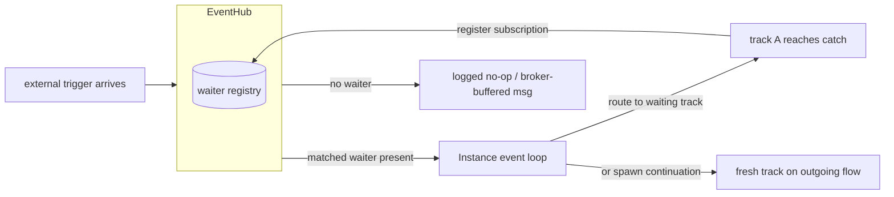
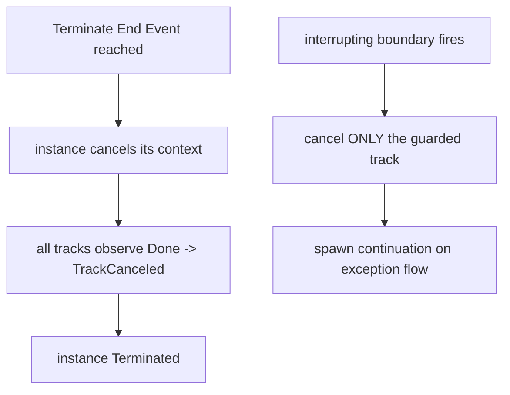

# ADR-006 — События и подписки

| Поле | Значение |
|---|---|
| Статус | Принято |
| Версия | v.1 |
| Дата | 2026-06-18 |
| Владелец | Руслан Габитов |
| Уточняет | [ADR-001 v.5 Execution Model](ADR-001-execution-model.md) |

> EN-оригинал — канонический: [ADR-006-events-and-subscriptions.md](ADR-006-events-and-subscriptions.md). Этот файл — его перевод (twin). При расхождении приоритет у английского текста.

> Дом для концепции доставки событий и инициируемой событием отмены, вынесенной
> из ADR-001 (который ограничен построенным ядром рантайма). Этот ADR решает, как
> **прескриптивную концепцию**, обоснованную BPMN 2.0: как внешний триггер
> достигает работающего instance (§2.1); BPMN-узлы, которые *инициируют* отмену —
> Terminate End Event и прерывание через boundary (§2.2); модель подписки
> wait-узлов (§2.3); in-memory-контракт доставки (§2.4); жизненный цикл waiter'а
> (§2.5). Реализация едет с SRD(ами) событийного workstream'а; часть (прерывание
> через boundary, propagation Error/Escalation) — концепция впереди кода, ровно
> как ADR-005 решает Inclusive/Complex-join'ы раньше их реализации.

## 1. Контекст

### 1.1 Что ADR-001 оставил этому ADR

ADR-001 определяет ядро рантайма и **обобщённый** каскад отмены через `context`
(Engine → Instance → track). Он **не** определяет, как приходящие извне события
(Message / Timer / Signal) достигают работающего instance, как и BPMN-узлы,
которые *инициируют* отмену. Сегодня рантайм переводит track в
`TrackWaitForEvent` и регистрирует определения событий event-узла, но **грань
доставки** (как триггер маршрутизируется обратно нужному track'у), **узлы-инициаторы
отмены** (Terminate End Event, прерывающий boundary event) и форма
**wait-release** — это scope данного ADR. §2.1–§2.3 решают их на уровне
концепции; ADR-007 владеет in-memory-механикой release'а, а persistence ADR —
durable-регидрацией.

### 1.2 Два дефекта доставки/жизненного цикла, отмеченные аудитом

Архитектурный аудит 2026-06-11 нашёл, что контракт событийной машинерии
**не определён**, а владение waiter'ом **двусмысленно**:

- **2.4 — семантика доставки не определена (MAJOR).** На практике это
  *at-most-once*: propagation события без зарегистрированного waiter'а — это
  **ошибка**, буфера нет, а событие, опубликованное до регистрации подписчика,
  **теряется** — при том что потребители (track'и, возобновляющиеся из ожидания)
  предполагают гарантированную доставку. Контракт никогда не был заявлен, так что
  поведение случайно.
- **2.5 — жизненный цикл waiter'а не закрыт (MAJOR).** Владение решено двумя
  способами сразу: waiter удаляет *себя* при срабатывании **и** hub удаляет его при
  unregister — гонка двойного удаления. Нет синхронизации горутин waiter'ов на
  shutdown (нет `WaitGroup`), а упавший `Stop()` оставляет waiter в реестре с живой
  горутиной (утечка).

Они решены в §2.4/§2.5: **`Thresher.Shutdown(ctx)` из ADR-013** нуждается в
определённом waiter-shutdown, а **`MessageWaiter` из ADR-014** — это новый waiter,
который обязан подчиняться одному контракту доставки и одной модели владения.

## 2. Решение

### 2.1 Доставка внешнего сигнала: входящая грань instance

BPMN различает четыре способа, которыми брошенный триггер достигает своего
catcher'а (§10.5.1):

| Стратегия | Триггеры | Охват |
|---|---|---|
| **Publication** | Message, Signal | Message → сопоставляется по correlation одному instance; Signal → broadcast **каждому** catcher'у в пределах досягаемости |
| **Direct resolution** | Cancellation, Compensation, Termination | Нацелен на конкретный instance Process / Activity |
| **Propagation** | Error, Escalation | Поднимается по цепочке scope до ближайшего внешнего catcher'а |
| **Implicit throw** | Timer, Conditional | Бросается автоматически, когда выполнено условие времени / Boolean |

`EventHub` — это in-process-реализация этих стратегий. Решение:

- **Единственная сериализованная входящая грань.** Приходящий триггер
  доставляется в **event loop** целевого instance через один выделенный входящий
  канал — *вторую* входящую грань loop'а (первая — существующий канал
  track→Instance). Поскольку ADR-001 делает горутину loop'а **единственным**
  мутатором состояния instance, внешние сигналы применяются в той же горутине:
  маршрутизация триггера в track, порождение продолжения или запуск каскада
  завершения — всё происходит без локов, сериализованно относительно обычных
  событий track'ов.

- **Маршрутизация внутри instance.** Доставленный триггер несёт идентичность
  подписки, которую он удовлетворяет (ожидающий узел). Loop маршрутизирует его в
  **тот единственный** ожидающий track, что зарегистрировал эту подписку, и
  release'ит его (§2.3); для инстанцирующего start-события broker/hub вместо этого
  порождает свежий instance (межинстансное инстанцирование — забота ADR-015,
  correlation — ADR-014/ADR-016).

- **Per-instance-идентичность подписки (нет межинстансного broadcast'а).** По
  ADR-009 каждый instance владеет приватной копией графа узлов; catch каждой копии
  регистрирует **отдельную** подписку, так что доставленный point-to-point-триггер
  возобновляет только track *своего* instance. Два параллельных instance,
  ожидающих на одном смоделированном catch, никогда не делят один waiter — движок
  обязан сохранять эту per-instance-идентичность для каждого обеспеченного
  waiter'ом определения события (одно срабатывание, возобновляющее несколько
  instance, — это дефект, а не BPMN-доставка).

- **Охват publication — по стратегии, а не случайно.** У **Signal** нет
  correlation: его получает каждая catching-подписка в пределах досягаемости (hub
  нуждается в индексе name→subscribers, §10.5.1, §10.5.7). **Message**
  сопоставляется по ref **и** correlation (§10.5.1) — подписчик видит его только
  когда его conversation-ключ совпадает (ADR-016). Hub соблюдает стратегию; он не
  превращает signal broadcast в point-to-point-доставку и наоборот.

### 2.2 Узлы-инициаторы отмены: Terminate End Event и прерывание через boundary

ADR-001 владеет *обобщённым* каскадом отмены; этот ADR владеет BPMN-узлами,
которые его **инициируют**.

**Terminate End Event (§13.5.6, §10.5.6 p279).** Достижение Terminate End Event
**аномально завершает этот instance процесса**: оставшиеся токены отбрасываются,
поведения прочих end-событий *не* выполняются, и **ни один другой instance не
затрагивается**. Реализация: instance отменяет свой собственный context → каждый
track наблюдает `Done()` → каждый выходит как canceled → instance достигает
`Terminated` — ровно тот обобщённый каскад, что ADR-001 уже проверяет. ADR-006
добавляет только *триггер*: Terminate-узел просит instance отмениться. На уровне
scope Sub-Process (будущая работа) Terminate завершает **только этот scope
instance** (для multi-instance-тела — только затронутый instance, §13.5.6),
оставляя внешний процесс работающим.

**Прерывающий boundary event (`cancelActivity=true`, §10.5.6, §13.5.3).**
Срабатывание потребляется, охраняемая activity **завершается**, и на исходящем
**exception flow** boundary'я порождается токен. Реализация: instance отменяет
**только track, исполняющий охраняемую activity** (не весь instance), затем
порождает track-продолжение на исходящем flow boundary'я. Подписка
boundary-handler'а зарегистрирована на **весь срок жизни activity, которую она
охраняет** (так что §2.4 subscribe-before-publish всегда выполняется для неё) и
снимается, когда activity завершается нормально.

**Непрерывающий boundary event (`cancelActivity=false`).** Срабатывание
потребляется, activity **продолжается**, и на исходящем flow boundary'я
порождается токен **параллельно** — т.е. свежий конкурентный track — пока
охраняемый track работает дальше (§10.5.6).

**Engine notes.**
- *Error всегда прерывающий* (§10.5.6): непрерывающего Error boundary не
  существует. Error/Escalation используют стратегию **propagation** — поднимаются
  по цепочке scope до ближайшего внешнего catcher'а (§10.5.1, §11); неразрешённый
  Error критичен (abort instance), неразрешённый Escalation тих. Propagation по
  цепочке scope приземляется с workstream'ом sub-process/boundary; ADR-006
  фиксирует модель *доставки* и *прерывания*, которую он будет использовать.
- *Множественность handler'ов* (§10.5.6 p278): максимум **один прерывающий
  handler на Event Declaration** на данной activity; непрерывающие handler'ы
  неограниченны и работают конкурентно. Движок отслеживает множественность по паре
  (activity, EventDefinition).
- *Terminate **не** запускает компенсацию* (соответствующий стандарту дефолт).
  Terminate — это *аномальное* завершение: токены отбрасываются, и «поведения
  прочих End Events НЕ выполняются» (§13.5.6). Компенсация инициируется **только**
  throw Compensation Event (§13.5.5), никогда — terminate'ом, а terminate на лету
  *прерывает* идущую компенсацию (`Compensating → Terminated`). Это обязательный
  дефолт. **Опциональное `compensate-on-terminate`** поведение (запуск инициируемых
  компенсаций уже завершённых activity перед смертью instance) — это намеренное,
  **выключенное-по-умолчанию** расширение; и его **scope активации**
  (process-/instance-wide — *не* грубый engine-wide-переключатель), **и** механизм
  решаются в **Compensation ADR**, поскольку само срабатывание требует
  компенсационной машинерии. ADR-006 фиксирует только дефолт.

### 2.3 Wait-узлы и жизненный цикл подписки

Подписка — это запись реестра, которая позволяет §2.1 маршрутизировать триггер
обратно нужному track'у. **Когда** она создаётся и удаляется — различается по виду
подписчика, и стандарт предписывает три различных жизненных цикла:

| Подписчик | Subscribe | Unsubscribe |
|---|---|---|
| **In-flow waiter** — Intermediate catch / ReceiveTask / Timer (§13.5.2) | когда **токен достигает** узла (ожидание начинается по прибытии; track переходит в `TrackWaitForEvent`) | по **consume** — триггер происходит, потребляется один раз, следуются исходящие flow; или при отмене track'а |
| **Boundary handler, не-компенсационный** — Message / Timer / Signal / Conditional / Error / Escalation (§10.5.6, §13.5.3) | на **входе** в охраняемую activity (она становится активной) | на **выходе** activity — нормальное завершение **или** прерывание. Эта подписка на срок жизни activity и есть то, что заставляет §2.4 subscribe-before-publish выполняться для всей activity |
| **Компенсационный boundary handler** (§13.5.5) | **не живая подписка** — становится *eligible* только когда охраняемая activity достигает **`Completed`** (в этот момент захватывается snapshot данных) | когда **завершается объемлющий scope** (для activity верхнего уровня этот scope **и есть** instance) |

- **Почему компенсация иная.** Компенсационный handler не ловит живой триггер,
  прерывающий работающую activity; он отменяет эффекты activity, которая **уже
  успешно завершилась**, и только когда **throw Compensation Event** позже его
  запросит (§13.5.5). Так что у него нет подписки на входе — он *взводится* при
  `Completed` и остаётся взведённым на срок жизни своего scope. ADR-006 владеет
  этим **окном eligibility** (фактом уровня подписки); **обработка** —
  разрешение throw `CompensateEventDefinition`, вызов в обратном порядке,
  восстановление snapshot'а, правило presumed-abort (§13.5.5 / §10.7) —
  делегируется выделенному **Compensation ADR** (будет написан с компенсационным
  workstream'ом).
- **Механика release'а — забота ADR-007.** Паркуется ли ожидающая горутина или
  заканчивается, а на триггере порождается свежий track (in-memory-модель долгого
  ожидания), решается в [ADR-007](ADR-007-in-memory-long-waits.md), который
  строится на доставке §2.1 и жизненном цикле §2.5. Durable-release через рестарт —
  забота persistence ADR.
- **Заранее пришедшие сообщения — работа broker'а.** Сообщение, пришедшее до того,
  как достигнута его ReceiveTask/catch, буферизуется `MessageBroker`'ом и
  доставляется при подписке (§2.4, ADR-014) — единственный случай, который законно
  приходит заранее, не hub'у хранить.

### 2.4 Контракт доставки: in-memory, subscribe-before-publish, недолговечный (решает audit 2.4)

`EventHub` — это **in-memory, недолговечный** диспетчер с явным контрактом,
заменяющий случайное at-most-once-поведение:

- **Subscribe-before-publish.** Waiter обязан быть зарегистрирован **до** того,
  как событие, которое он ждёт, будет propagated. Движок гарантирует это для
  каждого случая, где потребитель *обязан* получить: timer-/intermediate-catch-
  waiter регистрируется, когда его track достигает ожидания (§2.3), а
  **boundary / error / escalation**-handler регистрируется на **весь срок жизни
  activity, которую он охраняет** (§2.2) — так что нацеленное внутреннее событие
  всегда находит свой waiter уже на месте.
- **Нет waiter'а ⇒ no-op, не ошибка.** Propagation события, которого никто не
  ждёт, — это **логируемый no-op** (debug), никогда не ошибка. Это *корректная*
  BPMN-семантика broadcast'а **signal** (signal, брошенный без живого catcher'а,
  просто не пойман, §10.5.1) и безвредно для любого другого вида. (Убирает дефект
  «ошибка, если нет waiter'а».)
- **Сообщения буферизует broker, не hub.** Внешнее **сообщение**, пришедшее до
  того, как его `ReceiveTask` / catch подписался, держится в inbox'е
  `MessageBroker`'а и доставляется при подписке ([ADR-014](ADR-014-message-handling.md)).
  Так что единственный случай, которому действительно нужна буферизация
  до-подписки, — работа broker'а; hub остаётся живым диспетчером, не хранилищем.
  Hub никогда не дублирует буфер broker'а.
- **Не durable-шина.** Hub не персистит и не реплеит события; долговечность и
  реплей через рестарт — забота persistence ADR. In-memory-доставка — это модель
  целевой conformance (single-process).

Это делает ранее случайное поведение **заявленным контрактом**: гарантированная
доставка присутствующим waiter'ам, буферизация broker'ом для сообщений,
broadcast-текущим-слушателям для signal'ов и явная non-goal по долговечности.

### 2.5 Жизненный цикл waiter'а: EventHub — единственный владелец (решает audit 2.5)

Один владелец, один путь shutdown'а:

- **Hub владеет жизненным циклом каждого waiter'а** — создаёт его, запускает его
  горутину, останавливает его и удаляет из реестра. Waiter **никогда не удаляет
  себя**; при срабатывании/завершении он сигналит hub'у (или возвращается), и
  **hub** делает удаление. Это устраняет гонку двойного удаления (self-delete vs
  hub-delete).
- **Shutdown синхронизирован.** Hub отслеживает горутины waiter'ов через
  `sync.WaitGroup`; `Shutdown(ctx)` (публичный контракт в ADR-013 §2.5)
  останавливает каждый waiter и **ждёт выхода их горутин**, ограниченный `ctx`. Ни
  одна горутина waiter'а не переживает hub.
- **Упавший `Stop()` всё равно прибирается.** Если `Stop()` waiter'а упал, hub
  **всё равно удаляет его из реестра и обеспечивает завершение его горутины** —
  ошибка логируется, никогда не проглатывается-с-утечкой.
- **Один реестр под mutex'ом.** Register / unregister / propagate атомарны
  относительно реестра, так что триггер, гоняющийся с unregister, не может
  наблюдать полу-удалённый waiter.

Этой модели единственного владения подчиняются `TimeWaiter`, `MessageWaiter` из
ADR-014 и любой будущий waiter, и это та механика, которой управляет
`Thresher.Shutdown` из ADR-013.

## 3. Последствия

- **Доставка событий — контракт, а не случайность.** Вызывающие знают:
  присутствующему waiter'у доставка гарантирована; signal, брошенный в пустоту, —
  no-op; сообщения буферизуются broker'ом; ничего не durable. Двусмысленность
  «потерянного события» ушла.
- **Входящая грань — единственный сериализованный владелец.** Внешние сигналы
  присоединяются к событиям track'ов в одной горутине loop'а (§2.1), так что
  добавление доставки событий, завершения и прерывания через boundary не требует
  **новых локов** на состоянии instance — это расширяет модель единственного
  мутатора ADR-001, а не прикручивает конкурентность к ней.
- **Триггеры отмены переиспользуют проверенный каскад.** Terminate и прерывающие
  boundary events — это *триггеры* над уже-проверенным каскадом отмены через
  context ADR-001 (§2.2); единственное новое решение — scoping instance-wide vs
  single-track.
- **`Shutdown` становится возможным и детерминированным.** У graceful stop из
  ADR-013 есть определённый waiter-shutdown для вызова (stop-all + ожидание
  `WaitGroup`); нет утёкших горутин, нет double-free.
- **`MessageWaiter` из ADR-014 встаёт чисто.** Это waiter под владением §2.5,
  едущий на контракте §2.4, с до-подписочными сообщениями, покрытыми broker'ом —
  без особого пути.
- **Нет durable-доставки (by design).** Процесс, ждущий события через рестарт
  движка, не возобновляется до persistence ADR; задокументировано как намеренная
  граница, не молчаливый пробел.
- **Концепция впереди кода, явно.** Прерывание через boundary и propagation
  Error/Escalation (§2.2 engine notes) решены здесь, но приземляются с
  workstream'ом sub-process/boundary и его SRD — паттерн ADR-005 (решить
  таксономию join'ов, реализовать Parallel первым).

## 4. Рассмотренные альтернативы

- **Буферизовать все pending-события в hub'е (durable-ish in-memory-очередь).**
  Доставлять поздним подписчикам в общем случае. Отклонено: риск
  неограниченной-памяти / устаревания, и это смешивает две нужды — *сообщения*
  (которые законно приходят заранее) уже работа broker'а (ADR-014), тогда как
  *signal'ы*, приходящие заранее и «ловимые поздно», нарушали бы BPMN-семантику
  broadcast'а. Нацеленная буферизация на broker'е бьёт общий буфер hub'а.
- **Строгий subscribe-before-publish без буферизации broker'ом** (даже сообщения
  должны подписаться первыми). Отклонено: сообщение реально может прийти до того,
  как достигнута его `ReceiveTask`; запрет этого делает корректные коллаборации
  неисполнимыми. Ограниченный inbox broker'а — верное место для этого единственного
  случая.
- **Сделать «нет waiter'а» ошибкой (оставить текущее).** Отклонено: это неверно для
  signal broadcast (нет слушателя — норма, §10.5.1) и превращает безобидное условие
  в сбой; логируемый no-op корректен.
- **Само-владение per-waiter (waiter удаляет себя, без центрального владельца).**
  Текущее полу-состояние. Отклонено: это ровно гонка двойного удаления и не даёт
  места для синхронизации shutdown'а. Единственное владение hub'ом — это фикс.
- **Второй входящий канал на каждый вид триггера (отдельные message/timer/signal-
  грани в loop).** Отклонено: это умножает arm'ы select'а loop'а и гарантии
  упорядочивания без выгоды — одна грань `ExternalSignal`, несущая помеченный
  триггер, держит loop единственным сериализованным владельцем (§2.1) и позволяет
  маршрутизации переключаться по виду триггера в одном месте.
- **Terminate / boundary как межгорутинный kill целевого track'а.** Отклонено:
  отмена track'а извне его владеющего loop'а вновь вводит гонки разделяемого
  состояния, которые убрали ADR-001/ADR-009. Маршрутизация отмены *через* event
  loop (§2.1) сохраняет инвариант единственного мутатора — loop отменяет context
  instance (Terminate) или sub-context одного track'а (boundary).
- **Durable/персистентная шина событий сейчас.** Отклонено для этой фазы:
  долговечность — забота persistence ADR; целевая conformance — single-process
  in-memory.

## 5. Рекомендации по enterprise-готовности

Совещательно, не блокирующе — для реализующего SRD(ов):

- **Логировать dropped/no-waiter propagation** на debug с видом + id события, чтобы
  оператор мог отличить намеренный промах broadcast'а от ошибки моделирования.
- **Ограничить и наблюдать inbox broker'а** (ADR-014) — единственный буфер на
  пути; выводить его глубину/drop'ы через metrics-расширение (ADR-002).
- **Сделать waiter-drain `Shutdown`'а ограниченным ctx и докладывать отстающих** —
  если горутина waiter'а не вышла в дедлайн, логировать какая, не виснуть.
- **Эмитить register/trigger/remove waiter'а в lifecycle-канал** (ADR-013), чтобы
  ожидание и возобновление были наблюдаемы, не только логировались.
- **Индексировать signal'ы по имени для O(1)-broadcast'а** (§10.5.1) и метрить
  размер fan-out'а — signal с неожиданным числом catcher'ов часто запах
  моделирования.

## 6. Открытые вопросы

Нет. Контракт доставки (§2.4), жизненный цикл waiter'а (§2.5), входящая грань
доставки и per-instance-идентичность подписки (§2.1), узлы-инициаторы отмены
(§2.2 — Terminate + прерывающий/непрерывающий boundary) и модель подписки
wait-узлов (§2.3) решены как концепция. In-memory-механика wait-release делегирована
ADR-007, durable-регидрация — persistence ADR, а propagation Error/Escalation по
цепочке scope приземляется с workstream'ом sub-process/boundary — это делегирования,
не открытые вопросы.

## 7. Ссылки

- [ADR-001 v.5 Execution Model](ADR-001-execution-model.md) — ядро рантайма,
  event loop единственного мутатора и обобщённый каскад отмены, который этот ADR
  уточняет (триггеры событий питают его).
- [ADR-002 v.2 Extension Architecture](ADR-002-extension-architecture.md) —
  расширения Logger/Metrics, используемые для логирования/наблюдения доставки (§5).
- [ADR-007 v.1 In-Memory Long Waits](ADR-007-in-memory-long-waits.md) —
  wait-release, построенный на доставке §2.1 и жизненном цикле waiter'а §2.5.
- [ADR-009 v.1 Per-Instance Node Graph](ADR-009-per-instance-node-graph.md) —
  per-instance-копия, дающая каждому catch свою идентичность подписки (§2.1).
- [ADR-013 v.1 Instance Observability & Control](ADR-013-instance-observability.md)
  — её `Thresher.Shutdown(ctx)` потребляет waiter-shutdown §2.5; её lifecycle-канал
  может наблюдать waiter'ы (§5).
- [ADR-014 v.1 Message Handling](ADR-014-message-handling.md) — её `MessageWaiter`
  подчиняется §2.4/§2.5; broker владеет до-подписочной буферизацией сообщений,
  которую §2.4 ему делегирует.
- [docs/bpmn-spec/semantics/event-handling.md](../bpmn-spec/semantics/event-handling.md)
  — §10.5.1 стратегии разрешения, §10.5.6 правила boundary/handler, §10.5.7 scope'ы:
  обосновывает §2.1/§2.2.
- [docs/bpmn-spec/semantics/events.md](../bpmn-spec/semantics/events.md) — §13.5.2
  ожидание intermediate-catch и §13.5.3 boundary events: обосновывает §2.2/§2.3.
- [docs/bpmn-spec/semantics/end-events.md](../bpmn-spec/semantics/end-events.md) —
  §13.5.6 семантика Terminate, лежащая в основе §2.2.
- [docs/bpmn-spec/semantics/compensation.md](../bpmn-spec/semantics/compensation.md)
  — §13.5.5 / §10.7 eligibility компенсации (взводится при `Completed`, инициируется
  только throw'ом, нет компенсации на terminate): обосновывает компенсационные
  строки §2.2 и §2.3.
- **Compensation ADR** (будет написан с компенсационным workstream'ом) — решает
  *обработку* компенсации (разрешение throw'а, вызов в обратном порядке,
  восстановление snapshot'а, presumed-abort) и опциональное расширение
  `compensate-on-terminate`, чей дефолт фиксирует §2.2. Незакреплённая
  forward-ссылка (ещё не написан), как persistence ADR выше.
- Архитектурный аудит 2026-06-11 (`docs/audit/architecture-audit-2026-06-11.md`) —
  находки 2.4 (семантика доставки) и 2.5 (жизненный цикл waiter'а) решены здесь.

## История документа

| Версия | Дата | Автор | Изменение |
|---|---|---|---|
| v.1 | 2026-06-18 | Руслан Габитов | Принято. Концепция доставки событий и инициируемой событием отмены вынесена из ADR-001 и написана полностью: §2.1 доставка внешнего сигнала (единственная сериализованная входящая грань, per-instance-идентичность подписки, охват publication/direct/propagation/implicit по §10.5.1), §2.2 узлы-инициаторы отмены (Terminate End Event §13.5.6 над каскадом ADR-001; прерывающий/непрерывающий boundary §10.5.6/§13.5.3; propagation Error/Escalation + множественность handler'ов как engine notes; terminate по умолчанию **не** запускает компенсацию по §13.5.6), §2.3 жизненный цикл подписки wait-узлов (subscribe/unsubscribe по виду подписчика — in-flow на прибытии/consume, не-компенсационный boundary на входе/выходе activity, компенсационный boundary взводится при `Completed` до завершения объемлющего scope; §13.5.2/§13.5.3/§13.5.5; механика release делегирована ADR-007, *обработка* компенсации + опциональное выключенное-по-умолчанию расширение `compensate-on-terminate` делегированы будущему Compensation ADR), §2.4 in-memory-контракт доставки (subscribe-before-publish, no-op без waiter'а, сообщения буферизуются broker'ом, недолговечно; ремедиирует audit 2.4), §2.5 жизненный цикл waiter'а под единственным владением hub'а (shutdown, синхронизированный `WaitGroup`, без само-удаления, без утечки при падении `Stop`, реестр под одним локом; ремедиирует audit 2.5). Обосновано по `docs/bpmn-spec/` (§10.5.1/§10.5.6/§10.5.7, §13.5.2/§13.5.3/§13.5.6, §10.7). Уточняет ADR-001 v.5; siblings ADR-002 v.2, ADR-007 v.1, ADR-009 v.1, ADR-013 v.1, ADR-014 v.1. Концепция; реализация едет с SRD(ами) событийного workstream'а. |
