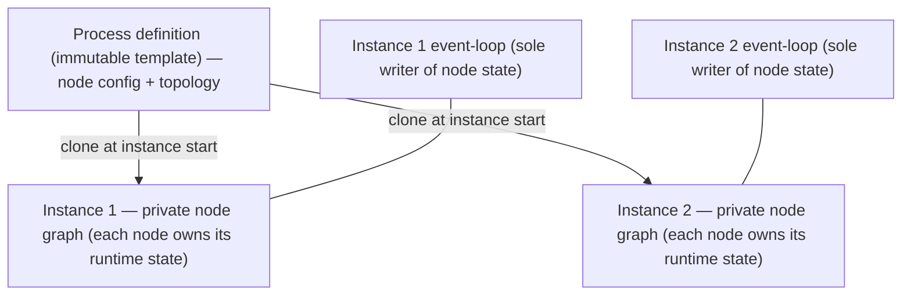

# ADR-009 — Per-instance node graph (node-owned runtime state)

| Field | Value |
|---|---|
| Status | Draft |
| Version | v.1 |
| Date | 2026-06-10 |
| Owner | Ruslan Gabitov |
| Refines | [ADR-001 v.4 Execution Model](ADR-001-execution-model.md) |

> **Scope.** This decides **where per-node runtime state lives** — the question
> ADR-001 §4.7 deferred. It is the foundation the synchronizing-gateway work
> (ADR-005) builds on, and it removes the shared-node data race. It covers
> *in-memory* runtime-state ownership only; durable persistence / rehydration of
> that state stays a separate future concern.

## 1. Context

[ADR-001](ADR-001-execution-model.md) defines the two-layer runtime: an Instance
owns tracks; nodes carry the per-element behaviour a track executes; and all
instance-scoped lifecycle state is mutated by a single event-loop goroutine.
ADR-001 §4.7 holds node **definitions** immutable and **shared** across instances
and tracks, and explicitly **defers** per-node mutable runtime state to a future
"Persistence & State ADR" — it never actually decides where that state lives.

That question is now on the critical path. Several elements need **per-instance,
per-node** runtime state *while the instance runs*:

- a **synchronizing gateway** (ADR-005 v.1) must accumulate which incoming flows
  have delivered a token, **per join node, per instance**;
- a **timer** node must hold its position/next-fire;
- a **catch/receive** node must hold its message/signal subscription.

There is nowhere clean to put any of it. A **shared** node cannot hold
per-instance state: two concurrent instances of the same process — and even two
tracks of one instance converging on the same node — would corrupt each other.
The same sharing already produces a **latent data race**: runtime data-loading
mutates the shared node definition (the End-event data-path case), which ADR-001
§4.7's own immutability invariant forbids.

Per our standing principle — *an earlier document supports the work, it does not
cage it; when a better model emerges we update the earlier document* — we decide
the deferred question here, refining ADR-001.

## 2. Decision

### 2.1 Each Instance owns a cloned node graph

The process definition is the **immutable template**. When an Instance starts it
**clones the template into its own private node graph**, which lives for the
Instance's lifetime. Instances no longer share node objects; they share only the
template they were cloned from.

### 2.2 A node is one per-instance, stateful object

A node is a **single** object carrying both its (immutable) configuration **and**
its per-instance runtime state. Its interface methods — execution, the
synchronizing-join completion rule, timer arming, subscription — read and write
that state **through the receiver**. There is **no separate state object** and
**no runtime wrapper** around the node: one type per node kind, state and
behaviour together. (Why not the alternatives: §4.)

### 2.3 Cloning is shallow over config, fresh over state

Cloning a node:

- **shares immutable configuration by reference** — event definitions,
  operations, conditions, ids, names: none change at runtime;
- allocates **fresh, zero-valued per-instance state** and empty flow collections.

Graph topology is rebuilt by **re-linking the cloned nodes with the engine's
existing sequence-flow linking** — no bespoke graph surgery. Per-instance startup
cost is proportional to (nodes + flows); memory stays low because the heavy
immutable config is shared and only state and wiring are new. Cloning is **eager**
(the whole graph at instance start) — simple and deterministic; the graph is
small.

### 2.4 The event-loop remains the single writer of node state

Per-node runtime state is still mutated **only by the Instance's single
event-loop goroutine** (ADR-001). Tracks never mutate node state directly — they
report via events and the loop applies them to the target node. This keeps node
mutation **lock-free and serialized**, and it is precisely what makes per-instance
nodes safe when several tracks converge on one node (a synchronizing join is a
cross-track rendezvous resolved in the loop).

### 2.5 Definition vs. runtime state — the boundary

Each node kind classifies its fields: **configuration** (immutable, shared by
reference from the template) vs. **runtime state** (fresh per instance). Only
runtime state is per-instance; getters over configuration read the shared
template data. This boundary is the contract a node author follows when adding a
node kind (and what the clone copies vs. allocates).

## 3. Consequences

- Synchronizing gateways (ADR-005), timers, and message correlation get a natural
  home for per-instance state **on the node itself** — e.g. a join node holds its
  own arrival accounting.
- **The shared-node data race is eliminated.** Runtime mutation (data loading,
  data-path, timer/subscription state) now targets per-instance nodes, so
  concurrent instances and tracks can't corrupt a shared definition. This closes
  the hazard ADR-001 §4.7 flagged and ADR-005 had to route around — the
  race-detector should be clean for concurrent same-process instances.
- **Cost:** each Instance allocates its node graph at start (clone nodes + relink
  flows) — bounded, config shared.
- **Maintenance rule:** each node kind implements a shallow clone and declares its
  config/state split; a new node kind must do so or it silently shares state
  again.
- **Refines ADR-001 §4.7:** runtime-state *ownership* is now decided (per-instance,
  node-owned). **Durable** persistence — serializing that state and rehydrating it
  across a restart — remains the separate future Persistence & State ADR; this ADR
  is in-memory ownership only. ADR-001 §4.7 is updated accordingly when this lands.

## 4. Alternatives considered

- **Shared immutable nodes + a separate per-instance state object** (keyed by node
  id). Rejected: a node's interface methods can't reach the state cleanly — you
  pass the state in or hold back-pointers, spreading state-plumbing across every
  interface signature.
- **Shared definition + a per-instance runtime *wrapper*** that embeds the
  definition. Rejected: two types per node kind and a permanent "definition method
  or runtime method?" split; extending an interface then risks touching both per
  kind — a direct tax on the engine's core extensibility (add-a-node /
  add-a-behaviour).
- **Instance-held generic structure** (e.g. a `map[node][flow][]track` in the
  loop). Rejected: it works, but it divorces state from the node and is awkward to
  read and extend — nested maps where a typed field on the node belongs.
- **Keep nodes shared, forbid per-node state.** Rejected: synchronizing joins,
  timers, and correlation fundamentally need per-instance state; this only
  relocates the problem and leaves the data race in place.

## 5. References

- [ADR-001 v.4 Execution Model](ADR-001-execution-model.md) — the two-layer
  runtime, the single event-loop writer, and §4.7 (node-immutability invariant +
  the per-node-state deferral this ADR decides; updated when this lands).
- BPMN 2.0 object model — node *configuration* (events, activities, gateways and
  their definitions) is the immutable template; per-instance runtime state is the
  engine's own concern.
- Persistence & State ADR *(future)* — durable serialization / rehydration of the
  per-instance node state this ADR establishes.

## 6. Open questions

- None blocking. The exact per-kind config/state split and the clone signatures
  are an implementation concern for the landing SRD, not this decision.

## Document History

| Version | Date | Author | Change |
|---|---|---|---|
| v.1 | 2026-06-10 | Ruslan Gabitov | Initial. Decides per-node runtime-state ownership (the ADR-001 §4.7 deferral): each Instance clones the immutable process template into its **own** node graph; a node is one per-instance stateful object holding config (shared by reference) + fresh runtime state, with behaviour and state on the same type (no separate state object, no wrapper); cloning is shallow-over-config + fresh-over-state with topology relinked via existing sequence-flow linking; the event-loop stays the single writer (lock-free). Eliminates the shared-node data race. Refines ADR-001 v.4 §4.7 (runtime-state ownership decided here; durable persistence stays the future Persistence & State ADR). Rejected: separate state object, embedding wrapper (type doubling), instance-held generic maps, no-per-node-state. |
