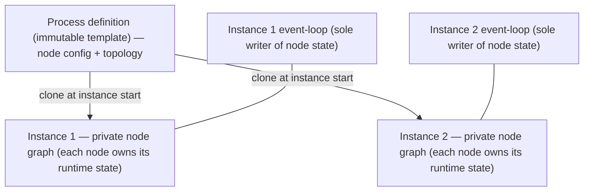

# ADR-009 — Per-instance граф узлов (runtime-состояние, принадлежащее узлу)

| Поле | Значение |
|---|---|
| Статус | Принято |
| Версия | v.1 |
| Дата | 2026-06-10 |
| Владелец | Руслан Габитов |
| Уточняет | [ADR-001 v.5 Execution Model](ADR-001-execution-model.md) |

> EN-оригинал — канонический: [ADR-009-per-instance-node-graph.md](ADR-009-per-instance-node-graph.md). Этот файл — его перевод (twin).

> **Область.** Этот ADR решает, **где живёт per-node runtime-состояние** — вопрос,
> отложенный в ADR-001 §4.7. Это фундамент, на котором строится работа по
> синхронизирующим шлюзам (ADR-005), и он устраняет гонку данных на разделяемом
> узле. Он покрывает только владение runtime-состоянием *в памяти*; долговечная
> персистентность / регидрация этого состояния остаётся отдельным будущим концерном.

## 1. Контекст

[ADR-001](ADR-001-execution-model.md) определяет двухслойный рантайм: Instance
владеет track'ами; узлы несут per-element поведение, которое исполняет track; и всё
состояние жизненного цикла уровня instance мутируется единственной горутиной
event-loop'а. ADR-001 §4.7 держит **определения** узлов неизменяемыми и
**разделяемыми** между instance'ами и track'ами и явно **откладывает** per-node
изменяемое runtime-состояние в будущий «Persistence & State ADR» — он так и не
решает, где это состояние живёт.

Этот вопрос теперь на критическом пути. Нескольким элементам нужно **per-instance,
per-node** runtime-состояние *пока instance исполняется*:

- **синхронизирующий шлюз** (ADR-005 v.1) должен накапливать, какие входящие flow
  доставили токен, **на каждый join-узел, на каждый instance**;
- узел **timer** должен держать свою позицию/следующее срабатывание;
- узел **catch/receive** должен держать свою подписку на message/signal.

Положить всё это некуда чисто. **Разделяемый** узел не может держать per-instance
состояние: два конкурентных instance'а одного процесса — и даже два track'а одного
instance'а, сходящиеся на одном узле — испортили бы друг друга. То же разделение уже
порождает **латентную гонку данных**: runtime-загрузка данных мутирует разделяемое
определение узла (случай data-path для End-event), что запрещает собственный
инвариант неизменяемости ADR-001 §4.7.

По нашему стоящему принципу — *более ранний документ поддерживает работу, а не
заключает её в клетку; когда возникает лучшая модель, мы обновляем ранний документ* —
мы решаем отложенный вопрос здесь, уточняя ADR-001.

## 2. Решение

### 2.1 Каждый Instance владеет клонированным графом узлов

Определение процесса — **неизменяемый шаблон**. Когда Instance стартует, он
**клонирует шаблон в свой собственный приватный граф узлов**, который живёт всё
время жизни Instance. Instance'ы больше не разделяют объекты узлов; они разделяют
только шаблон, из которого были клонированы.

### 2.2 Узел — это один stateful-объект на instance

Узел — это **единственный** объект, несущий и свою (неизменяемую) конфигурацию,
**и** своё per-instance runtime-состояние. Его интерфейсные методы — исполнение,
правило завершения синхронизирующего join'а, взвод timer'а, подписка — читают и
пишут это состояние **через ресивер**. **Нет отдельного объекта состояния** и
**нет runtime-обёртки** вокруг узла: один тип на вид узла, состояние и поведение
вместе. (Почему не альтернативы: §4.)

### 2.3 Клонирование — поверхностное над конфигом, свежее над состоянием

Клонирование узла:

- **разделяет неизменяемую конфигурацию по ссылке** — определения событий,
  операции, условия, id, имена: ничего из этого не меняется в рантайме;
- выделяет **свежее, обнулённое per-instance состояние** и пустые коллекции flow.

Топология графа перестраивается **повторной связкой клонированных узлов
существующей в движке линковкой sequence-flow** — без специальной хирургии графа.
Стоимость старта на instance пропорциональна (узлы + flow); память остаётся низкой,
потому что тяжёлый неизменяемый конфиг разделяется, и новыми являются только
состояние и связка. Клонирование **жадное** (весь граф на старте instance) — просто
и детерминированно; граф мал.

### 2.4 Event-loop остаётся единственным писателем состояния узла

Per-node runtime-состояние по-прежнему мутируется **только единственной горутиной
event-loop'а Instance** (ADR-001). Track'и никогда не мутируют состояние узла
напрямую — они сообщают через события, а loop применяет их к целевому узлу. Это
держит мутацию узла **без блокировок и сериализованной**, и это ровно то, что делает
per-instance узлы безопасными, когда несколько track'ов сходятся на одном узле
(синхронизирующий join — это cross-track рандеву, разрешаемое в loop'е).

### 2.5 Определение vs. runtime-состояние — граница

Каждый вид узла классифицирует свои поля: **конфигурация** (неизменяемая,
разделяемая по ссылке из шаблона) vs. **runtime-состояние** (свежее на instance).
Только runtime-состояние является per-instance; геттеры над конфигурацией читают
разделяемые данные шаблона. Эта граница — контракт, которому следует автор узла при
добавлении вида узла (и то, что клон копирует vs. выделяет).

## 3. Последствия

- Синхронизирующие шлюзы (ADR-005), timer'ы и корреляция message получают
  естественный дом для per-instance состояния **на самом узле** — например,
  join-узел держит свой собственный учёт прибытий.
- **Гонка данных на разделяемом узле устранена.** Runtime-мутация (загрузка данных,
  data-path, состояние timer'а/подписки) теперь нацелена на per-instance узлы,
  поэтому конкурентные instance'ы и track'и не могут испортить разделяемое
  определение. Это закрывает опасность, которую отметил ADR-001 §4.7 и которую
  ADR-005 пришлось обходить — race-detector должен быть чист для конкурентных
  instance'ов одного процесса.
- **Стоимость:** каждый Instance выделяет свой граф узлов на старте (клонирование
  узлов + повторная связка flow) — ограниченная, конфиг разделяется.
- **Правило сопровождения:** каждый вид узла реализует поверхностное клонирование и
  декларирует своё разделение config/state; новый вид узла обязан сделать это, иначе
  он молча снова начнёт разделять состояние.
- **Уточняет ADR-001 §4.7:** *владение* runtime-состоянием теперь решено
  (per-instance, принадлежащее узлу). **Долговечная** персистентность —
  сериализация этого состояния и его регидрация через рестарт — остаётся отдельным
  будущим Persistence & State ADR; этот ADR — только владение в памяти. ADR-001 §4.7
  обновляется соответственно, когда это лендится.

## 4. Рассмотренные альтернативы

- **Разделяемые неизменяемые узлы + отдельный per-instance объект состояния** (по
  ключу node id). Отклонено: интерфейсные методы узла не могут чисто дотянуться до
  состояния — вы либо передаёте состояние внутрь, либо держите обратные указатели,
  размазывая state-plumbing по каждой интерфейсной сигнатуре.
- **Разделяемое определение + per-instance runtime-*обёртка***, встраивающая
  определение. Отклонено: два типа на вид узла и постоянный раскол «метод определения
  или runtime-метод?»; расширение интерфейса тогда рискует затронуть оба на каждый
  вид — прямой налог на ключевую расширяемость движка (добавить-узел /
  добавить-поведение).
- **Generic-структура, держимая Instance'ом** (например, `map[node][flow][]track` в
  loop'е). Отклонено: это работает, но разводит состояние и узел и неудобно для
  чтения и расширения — вложенные мапы там, где место типизированному полю на узле.
- **Оставить узлы разделяемыми, запретить per-node состояние.** Отклонено:
  синхронизирующие join'ы, timer'ы и корреляция фундаментально нуждаются в
  per-instance состоянии; это лишь перемещает проблему и оставляет гонку данных на
  месте.

## 5. Ссылки

- [ADR-001 v.5 Execution Model](ADR-001-execution-model.md) — двухслойный рантайм,
  единственный писатель event-loop'а и §4.7 (инвариант неизменяемости узла +
  отложенное per-node-состояние, которое решает этот ADR; обновляется, когда это
  лендится).
- Объектная модель BPMN 2.0 — *конфигурация* узла (события, активности, шлюзы и их
  определения) является неизменяемым шаблоном; per-instance runtime-состояние —
  собственный концерн движка.
- Persistence & State ADR *(будущий)* — долговечная сериализация / регидрация
  per-instance состояния узла, которое устанавливает этот ADR.

## 6. Открытые вопросы

- Ничего блокирующего. Точное разделение config/state по видам и сигнатуры
  клонирования — концерн реализации для лендящего SRD, а не этого решения.

## История документа

| Версия | Дата | Автор | Изменение |
|---|---|---|---|
| v.1 | 2026-06-10 | Руслан Габитов | Первая. Решает владение per-node runtime-состоянием (отложенное в ADR-001 §4.7): каждый Instance клонирует неизменяемый шаблон процесса в **свой** граф узлов; узел — это один per-instance stateful-объект, держащий конфиг (разделяемый по ссылке) + свежее runtime-состояние, с поведением и состоянием на одном типе (нет отдельного объекта состояния, нет обёртки); клонирование — поверхностное-над-конфигом + свежее-над-состоянием с топологией, перевязанной через существующую линковку sequence-flow; event-loop остаётся единственным писателем (без блокировок). Устраняет гонку данных на разделяемом узле. Уточняет ADR-001 v.5 §4.7 (владение runtime-состоянием решено здесь; долговечная персистентность остаётся будущим Persistence & State ADR). Отклонено: отдельный объект состояния, встраивающая обёртка (удвоение типов), generic-мапы у Instance, без-per-node-состояния. |
