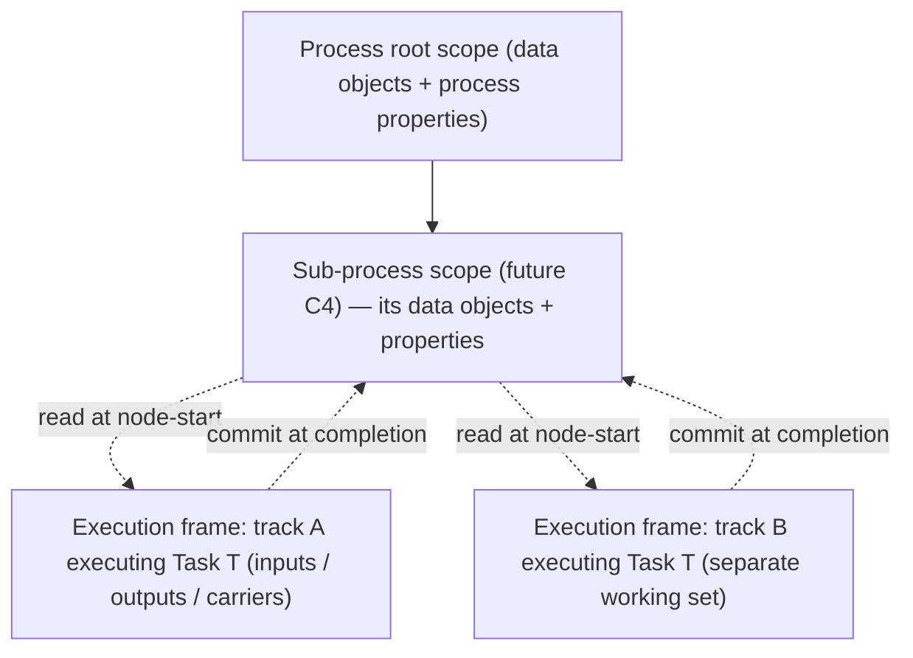
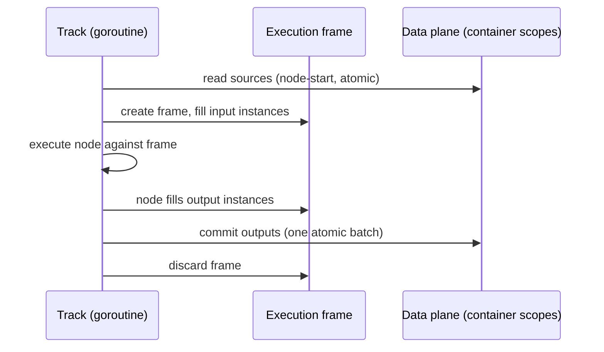

# ADR-010 — Process Data Model

| Field | Value |
|---|---|
| Status | Accepted |
| Version | v.1 |
| Date | 2026-06-12 |
| Owner | Ruslan Gabitov |
| Refines | [ADR-001 v.5 Execution Model](ADR-001-execution-model.md) |

> **Scope.** This decides the engine's **runtime data model**: where process
> data lives (container scopes), who may read and write it (the data plane and
> its concurrency discipline), and what carries the data of *one node
> execution* (the execution frame). It is the sibling of
> [ADR-009 v.1](ADR-009-per-instance-node-graph.md): ADR-009 owns node
> **lifetime** state (join arrivals, timer position, subscriptions — one per
> node per instance); this ADR owns **per-execution** data (the inputs,
> outputs, and working set of one node execution by one track). The *model
> layer* of data — `ItemDefinition` / `IoSpec` / `InputSet` / `OutputSet` /
> `DataAssociation` structures and their evaluation semantics — is reviewed in
> a separate data-flow ADR; this ADR only fixes the runtime contract those
> structures are evaluated against.

## 1. Context

### 1.1 What the standard requires

BPMN 2.0 (§10.4, §13.3.2) defines a precise runtime data model:

- **Data lives in containers.** `DataObject`s are contained in a `Process` or
  `SubProcess`; their lifecycle is tied to the container's, and their
  visibility is the container plus its children. `Property`s attach to a
  `Process`, `Activity`, or `Event` with the same containment-driven
  visibility (a process property is visible to all nested activities; an
  activity property only to that activity). Visibility is **structural** —
  resolution walks up the container chain, never sideways into another
  branch's working data.
- **Activity I/O is copied, not shared.** `DataInput`s are filled by
  `DataInputAssociation`s when the activity transitions Ready → Active, and
  `DataOutput`s are flushed back by `DataOutputAssociation`s on
  Completing → Completed (§10.4.2). The spec's language is consistently
  *copy*: a later change to the source does not propagate into an input
  already taken. The activity's inputs/outputs are therefore a **per-execution
  working set** — they belong to *one* execution of the activity, not to the
  activity as a definition and not to the container scope.
- **Data binding is synchronous to lifecycle transitions.** There is no
  parallel data plane: the activity does not become Active until its chosen
  InputSet's associations completed, and its outgoing tokens are not emitted
  until the OutputSet associations completed.
- **Tokens do not carry data.** DataAssociations have no effect on control
  flow, and the token model is purely positional — which matches ADR-001's
  token-as-projection decision.

### 1.2 What the engine does today

The engine holds all instance data in one flat, name-keyed structure: a map of
`DataPath → (name → data)` on the Instance, where a node's working data is
registered under `/<process>/<nodeName>` while the node executes and removed
afterwards. Three structural problems follow:

1. **Execution data is keyed by node name, not by execution.** Two tracks of
   the same instance crossing the same node — routine now that the Parallel
   gateway (ADR-005) forks tracks — collide on the same path: the second
   scope-extension errors on the duplicate name, and both executions
   read/write one working set.
2. **Execution data sits on the node object.** Nodes hold mutable
   per-execution fields — the scope route-key (`dataPath` on activities and
   events), a gateway's captured scope reference, a user task's response
   channel. ADR-009 made nodes per-instance, which removed the
   *cross-instance* corruption, but within one instance these fields are still
   per-node where they must be per-execution: loops, multi-instance, and
   two-track crossings all break them by construction. Worse, input/output
   *parameter structures are mutated in place* during loading and unloading —
   the parameter instances are shared between executions even though the
   standard's copy semantics make them per-execution.
3. **The storage is not safely concurrent.** Scope reads run unlocked and
   read-modify-write sequences drop the lock between the read and the write,
   so two tracks adding data concurrently lose updates or fault the runtime —
   the architecture audit (2026-06-11, §1.2) confirmed this as one of the
   engine's critical defects. The piecemeal `RWMutex` discipline failed
   because the *operations* are compound while the *locking* is per-access.

ADR-001 §4.1 makes the instance event loop the single writer of instance
*lifecycle* state. Data was never given an equivalent discipline: tracks
read and write scope storage directly, from their own goroutines, with
locking that does not match the operations. The data plane needs its own
explicit contract — one this ADR provides.

### 1.3 Why now

The Parallel gateway landed (ADR-005): concurrent tracks inside one instance
are now a first-class scenario, not a future. Every gap above is on the
execution hot path, and the upcoming workstreams — sub-processes (scope
nesting), multi-instance activities (per-branch working sets), persistence
(serializable data state) — all build on the answer to "where does data
live". Per our standing principle — an earlier document supports the work, it
does not cage it — we decide the model here, refining ADR-001's data side.

## 2. Decision

### 2.1 Persistent data lives in container scopes — and only there

The engine models BPMN's containment directly: an instance owns a **tree of
container scopes** — the process root scope, and (when sub-processes land) a
child scope per sub-process instance. A container scope holds the persistent,
shared, current values: data objects of that container and properties of the
container itself.

- **There is no track scope.** A track is an execution thread, not a scope
  level; it caches nothing. Reads always resolve against the live container
  scope, so they are always current.
- **There is no node scope.** A node's working data belongs to one execution
  (§2.3), not to a path in the shared namespace. The `/<process>/<nodeName>`
  registration pattern is retired.
- **Resolution walks up the tree.** A name (or item-definition id) lookup
  starts at the requesting execution's containing scope and walks parent-ward
  to the root — the standard's structural visibility, and the formalization
  of the path-walking the engine already does.

### 2.2 The data plane is a dedicated component with whole-operation atomicity

The scope tree moves out of the Instance into a **dedicated per-instance data
component** the Instance composes. The component owns its storage and its
serialization:

- **Every operation is atomic.** Get, add, batch-commit, scope creation and
  disposal each run under one critical section of the component's own lock —
  no caller-visible lock windows, no read-modify-write split across
  acquisitions. This retires, by construction, the audit-confirmed race
  class: there is no sequence of data-plane calls that interleaves another
  track's mutation inside one logical operation.
- **Access is direct, not loop-mediated.** Tracks call the data plane
  synchronously from their goroutines. The event loop owns *track lifecycle*
  and stays out of the data plane entirely — the standard makes data binding
  synchronous to lifecycle transitions, and forcing every data operation
  through the loop would put expression evaluation and I/O staging on the
  loop's critical path. (Precedent: ADR-005 gave the synchronizing join its
  own mutex rather than the loop, for the same reason — a component owns its
  serialization.)
- **The component is the only data authority.** Nothing else holds live data:
  not the Instance (it delegates), not nodes (§2.4), not tracks. This is the
  single place persistence will later serialize, observability will later
  watch, and conditional events will later subscribe to.

### 2.3 One node execution works on one execution frame

Each node execution gets an **execution frame** — the ephemeral working set
of exactly one execution of one node by one track:

- **Created at node-start.** The track creates the frame; input loading
  (evaluating the incoming data associations) fills the frame's **input
  parameter instances** from the container scope — current as of node-start,
  per the standard's copy semantics.
- **Isolated while executing.** The node works only on its frame: input and
  output parameter instances and execution carriers (a user task's response
  channel, a gateway's evaluation context) live in the frame or as locals of
  the executing code — never on the node, never keyed by node name. The frame
  carries what crosses the execution's stage boundaries (load → execute →
  commit); a carrier confined to one stage is per-execution by construction
  as a local. Two tracks crossing one node
  get two frames; loop iterations get one frame each; multi-instance branches
  (future) get one frame per branch.
- **Identified by (track, node).** A track executes sequentially, so at most
  one live frame exists per (track, node) pair at any moment — the pair is a
  sufficient frame key. A loop revisiting a node reuses the key only after
  the previous frame is gone; concurrent executions of one node are always
  *distinct tracks* — the Parallel fork today, and multi-instance branches
  later, which therefore must execute as their own tracks. No step ordinal or
  generated id is needed: live-frame identity is positional, and execution
  *history* is the token trail's concern (ADR-001), not the frame's.
- **Committed at completion.** Output unloading evaluates the outgoing data
  associations and pushes the frame's outputs into the container scope as
  **one atomic batch** (§2.2) — a frame's effect is all-or-nothing with
  respect to other tracks' reads. The frame is then discarded; nothing of it
  survives the execution.
- **A failed or terminated execution commits nothing.** When the node
  execution fails or its track is terminated, the frame is discarded
  uncommitted: the container scope never observes any partial output of a
  failed execution, and the discarded frame leaves nothing behind — no
  unreachable residue in the scope, unlike today's name-keyed registration.
  If the future boundary-event work needs a failing execution's data, it
  reads the frame before disposal — an extension point on the frame
  lifecycle, not a change to this contract.
- **Parameter instances are per-frame.** The input/output structures a node
  execution reads and fills are instantiated for the frame from the node's
  immutable I/O definitions. The in-place mutation of shared parameter
  objects — today's second clobber surface — ends: definitions stay on the
  node, instances live in the frame.

### 2.4 Nodes hold definitions; the track provides data access

A node object carries its immutable **data configuration** — I/O
specification, data associations, property definitions — and its ADR-009
**lifetime** state. It carries **no execution data**: the route-key fields,
captured scope references, and response carriers come off the node.

- A node touches data **only through the data-role contracts**: a consumer
  contract on the way in (load inputs into the frame) and a producer contract
  on the way out (yield outputs from the frame) — a node implements a role
  only if it has that side of data flow. The "node registers itself into the
  scope and remembers the path" pattern (`RegisterData` and the node-held
  `DataPath`) is **retired**.
- **The track hands the node its execution environment.** The environment a
  node executes against is constructed per-execution by the track: it exposes
  the frame (the node's own working set) and resolution into the container
  scopes (for scope-level reads), plus the engine services it already
  exposes today. The node's execution signature keeps its current shape —
  context plus runtime environment — but the environment value becomes
  per-execution rather than the instance itself.
- Events follow the same model: a throw event's inputs are loaded into its
  frame when it fires; a catch event's outputs are committed from its frame
  when it triggers (the standard gives events single-set, non-waiting data
  binding — the frame is the natural carrier).

### 2.5 Concurrency semantics at the scope

Within one container scope, concurrent committers are serialized by the data
plane (§2.2); the unit of isolation is the **operation**, not the
transaction. The engine's semantics for genuinely concurrent writes to the
same variable are **last-committed-wins**, applied atomically per batch — the
standard does not define cross-branch write ordering, and BPMN models that
need deterministic merging must express it structurally (a synchronizing
join before the write, per ADR-005). This is the same contract mainstream
engines ship, and it is documented here so it is a decision, not an
accident.

### 2.6 Out of scope

- **Model-layer data semantics** — `InputSet`/`OutputSet` selection rules,
  association evaluation order, availability ("unavailable") gating,
  `DataState` — the separate data-flow ADR. This ADR fixes *where* evaluation
  reads and writes; that one fixes *what* is evaluated.
- **`DataStore`** — storage that outlives the instance is a persistence-layer
  concern (the future Persistence & State ADR), reachable through the same
  data-plane interface when it lands.
- **Durable persistence / rehydration** of scopes and frames — the future
  Persistence & State ADR; this ADR only shapes the in-memory units that
  will be serialized (container scopes; frames of in-flight executions).
- **Scope-change subscriptions** (conditional events, listeners) — future
  work; §2.2's single data authority is deliberately the place such hooks
  attach.

## 3. Consequences

- **The audit's critical data race (§1.2) is fixed by construction**, not by
  patching lock placement: whole-operation atomicity in one data authority
  leaves no compound operation to interleave. The unlocked-read hazard goes
  with it.
- **Same-node concurrent executions become safe**: frames are keyed by
  execution, so the Parallel-gateway fork, loops, and (future) multi-instance
  branches stop sharing working sets. The duplicate-name scope collision
  disappears with the name-keyed registration pattern.
- **Instance sheds its scope role** — the data plane is its own component
  with its own locking discipline, directly reducing the Instance god-object
  problem (audit §2.3) and giving data behaviour an isolated test surface.
- **Sub-processes get their scope model for free**: a sub-process instance is
  a child container scope; visibility and lifecycle follow the tree.
- **Persistence gets its data unit**: container scopes (durable) and frames
  (in-flight executions) are the exact units a checkpoint serializes.
- **Migration cost:** every node kind's data path changes — loading and
  unloading move from node-held paths to frames, and the per-execution
  environment replaces instance-as-environment. The landing SRD stages this
  per node kind; the data-role contracts keep the surface mechanical.
- **Maintenance rule:** a node kind may hold exactly two things: its immutable
  data configuration (definitions), and its ADR-009 **lifetime** state — state
  that intentionally spans executions and is shared between tracks for the
  node's whole instance lifetime, such as the Parallel join's arrival
  accounting, a timer's position, or an event subscription. What it must
  **never** hold is **single-execution** data — anything one execution by one
  track reads, fills, or carries belongs to that execution's frame. The
  classification test: state that must survive an execution or be observed by
  another track's visit is lifetime state (node, ADR-009); state that must
  *not* be observed by any other execution is frame data (this ADR). A new
  node kind that files frame data under lifetime state reintroduces the
  clobber class.

## 4. Alternatives considered

- **Keep the flat instance-owned map and fix only the locking.** Cures the
  audit's race symptom, leaves everything else: name-keyed collisions,
  node-held execution data, in-place parameter mutation, no nesting path for
  sub-processes, the Instance god object. Rejected — it repairs the defect
  and preserves the architecture that produced it.
- **Route all data operations through the instance event loop** (extend
  ADR-001's single-writer to data). Serializes correctly, but puts every
  data read/write — including expression evaluation and staging — on the
  lifecycle loop's critical path, with request/response round-trips from
  every track for every operation. The standard's data binding is
  synchronous within the activity lifecycle; the loop is the wrong owner.
  Rejected (consistent with ADR-005's choice of component-owned locking for
  the join).
- **Per-track data scopes with merge at joins.** Gives isolation but invents
  semantics the standard does not have: BPMN visibility is container-based,
  and nothing defines how two branches' divergent copies merge at a join.
  Rejected — tracks read and commit against the shared container scope;
  isolation belongs to the *execution frame*, which has defined commit
  points.
- **Keep execution data on the (per-instance) node.** The ADR-009 status quo.
  Works only while at most one execution of a node is ever live per instance
  — false for loops and multi-instance, and false at gateway-fork crossings.
  Rejected: execution data is not node-lifetime state; the two were conflated
  and this ADR separates them.
- **Frames addressable in the scope path namespace** (e.g.
  `/<process>/<node>/<execution>`). Makes ephemeral working sets visible to
  scope resolution — other executions could observe a frame's intermediate
  values, violating the copy/commit semantics. Rejected: frames are handles,
  not paths; only container scopes resolve.

## 5. Enterprise-readiness recommendations

Advisory, not gating — conventions the landing SRD and later operations work
should follow:

- **Data observability without data leakage.** Log scope mutations at debug
  level as *names and paths, never values* — variable values are
  business-sensitive by default. A value-inclusive trace mode, if ever added,
  must be an explicit opt-in with its own audit trail.
- **Operational metrics at the data plane.** The single data authority should
  expose scope count, per-scope entry count, and frame count as engine
  metrics — runaway data growth (a process that accretes variables, a leak
  of undisposed frames) must be visible before it is an incident.
- **Commit-contention visibility.** Lock-wait or commit-latency accounting on
  the data plane (even a simple counter) gives operators the signal when a
  hot variable becomes a serialization bottleneck — the cure (restructure
  the model with a join) is the modeler's, but the signal is the engine's to
  provide.
- **Document the merge contract for modelers.** Last-committed-wins (§2.5)
  belongs in user-facing documentation with the standard's own remedy
  (synchronize before writing) — engines that leave this implicit generate
  support escalations that documentation prevents.

## 6. Open questions

- None. The per-kind data-configuration split and the concrete frame /
  scope API signatures are implementation concerns for the landing SRD, not
  open decisions.

## 7. References

- [ADR-001 v.5 Execution Model](ADR-001-execution-model.md) — two-layer
  runtime, event-loop ownership of lifecycle state, token-as-projection;
  §4.7/§6 the flagged shared-state hazards this ADR's data side resolves.
- [ADR-009 v.1 Per-instance node graph](ADR-009-per-instance-node-graph.md) —
  node **lifetime** state ownership; the sibling boundary this ADR completes
  (per-execution data off the node).
- [ADR-005 v.1 Gateways & Joins](ADR-005-gateways-and-joins.md) — the
  Parallel fork/join that makes concurrent same-node executions routine;
  precedent for component-owned serialization.
- BPMN 2.0 §10.4 (Items and Data), §10.4.2 (Execution Semantics for Data),
  §13.3.2 (data binding in the Activity Lifecycle) — the container/visibility
  model, copy semantics, and lifecycle-synchronous binding this ADR encodes;
  digested in the project's spec KB (`docs/bpmn-spec/semantics/data.md`,
  `sub-processes.md`).
- Architecture audit 2026-06-11 (`docs/audit/architecture-audit-2026-06-11.md`)
  — the confirmed data-race findings (§1.2) and Instance-decomposition
  finding (§2.3) this ADR remediates structurally.
- Persistence & State ADR *(future)* — durable serialization of container
  scopes and in-flight frames; `DataStore`.
- Data-flow ADR *(planned)* — model-layer review of `ItemDefinition` /
  `IoSpec` / `InputSet` / `OutputSet` / `DataAssociation` semantics against
  the standard.

## Document History

| Version | Date | Author | Change |
|---|---|---|---|
| v.1 | 2026-06-12 | Ruslan Gabitov | Full authoring (expands the 2026-06-11 seed). Decides the runtime data model: persistent data in per-instance **container scopes** (process root + future sub-process children; no track scopes, no node scopes); the scope tree extracted from Instance into a dedicated **data plane** with whole-operation atomicity (fixes the audit's §1.2 race class by construction); one **execution frame** per node execution, keyed by (track, node) — a track is sequential, so at most one live frame per pair; per-frame parameter instances, atomic batch commit, discard-uncommitted on failure (no partial flush, no scope residue); nodes keep data *definitions* + ADR-009 lifetime state only — `RegisterData`/node-held `DataPath` retired, track provides a per-execution environment; **last-committed-wins** for concurrent same-variable commits. Out of scope: model-layer data-flow semantics (separate ADR), DataStore & durable persistence (Persistence ADR), scope-change subscriptions. Rejected: lock-fix-only, loop-mediated data ops, per-track scopes with join merge, execution data on nodes, path-addressable frames. |
| v.1 | 2026-06-12 | Ruslan Gabitov | **Accepted**, landed via SRD-007 v.1 (M2–M5, `d30dd2c`…`6c86620`). One wording amendment during landing (§2.3): execution carriers live in the frame OR as locals of the executing code — the frame carries what crosses the load → execute → commit stage boundaries; a stage-confined carrier is per-execution by construction. The frame-mechanics details the implementation pinned (resolution order with outputs as non-resolving write targets; the Ready flip on association-filled inputs) live in SRD-007 §7 — they refine, not change, this decision. |
