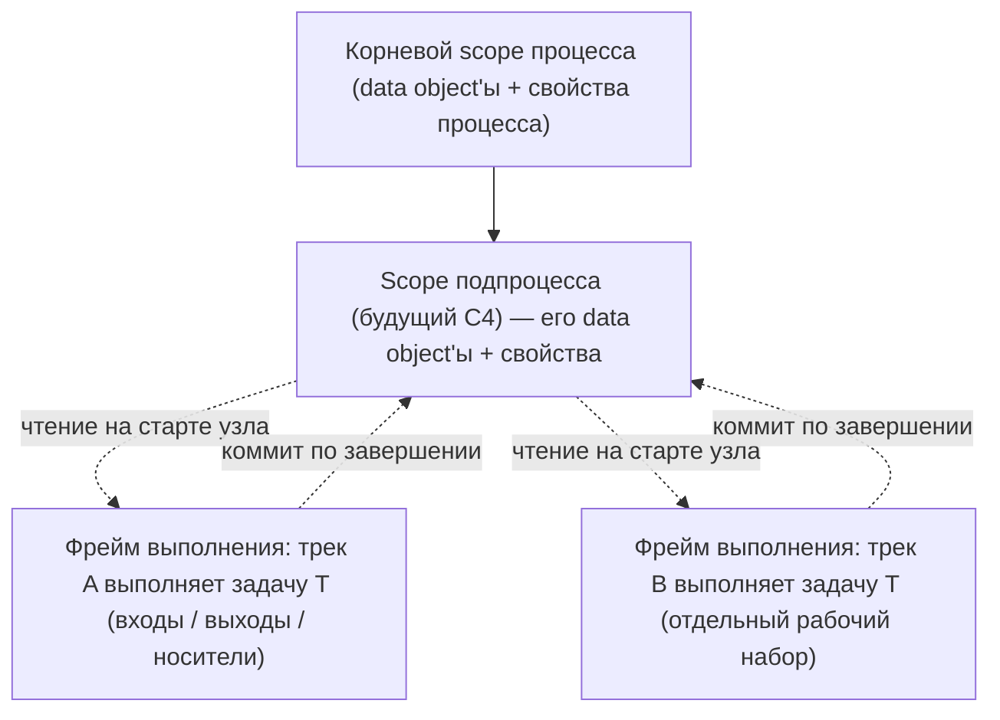
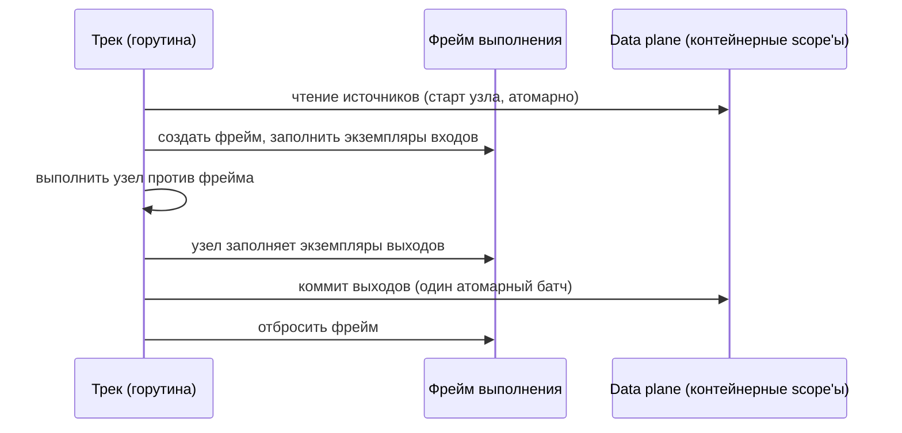

# ADR-010 — Модель данных процесса

| Поле | Значение |
|---|---|
| Статус | Принято |
| Версия | v.1 |
| Дата | 2026-06-12 |
| Владелец | Руслан Габитов |
| Уточняет | [ADR-001 v.5 Execution Model](ADR-001-execution-model.md) |

> EN-оригинал — канонический: [ADR-010-process-data-model.md](ADR-010-process-data-model.md). Этот файл — его перевод (twin).

> **Область.** Этот ADR решает **runtime-модель данных** движка: где живут
> данные процесса (контейнерные scope'ы), кто и как может их читать и писать
> (data plane и его дисциплина конкурентности) и что несёт данные *одного
> выполнения узла* (фрейм выполнения). Это парный документ к
> [ADR-009 v.1](ADR-009-per-instance-node-graph.md): ADR-009 владеет
> **lifetime-состоянием** узла (учёт прибытий join'а, позиция таймера,
> подписки — одно на узел на инстанс); этот ADR владеет **per-execution**
> данными (входы, выходы и рабочий набор одного выполнения одного узла одним
> треком). *Модельный слой* данных — структуры `ItemDefinition` / `IoSpec` /
> `InputSet` / `OutputSet` / `DataAssociation` и семантика их вычисления —
> рассматривается в отдельном data-flow ADR; этот ADR фиксирует только
> runtime-контракт, относительно которого эти структуры вычисляются.

## 1. Контекст

### 1.1 Чего требует стандарт

BPMN 2.0 (§10.4, §13.3.2) определяет точную runtime-модель данных:

- **Данные живут в контейнерах.** `DataObject`'ы содержатся в `Process` или
  `SubProcess`; их жизненный цикл привязан к контейнеру, а видимость — это
  контейнер плюс его дети. `Property` прикрепляются к `Process`, `Activity`
  или `Event` с той же видимостью по принципу содержания (свойство процесса
  видно всем вложенным activity; свойство activity — только ей самой).
  Видимость **структурна** — разрешение имени идёт вверх по цепочке
  контейнеров и никогда вбок, в рабочие данные другой ветки.
- **I/O activity копируется, а не разделяется.** `DataInput`'ы заполняются
  `DataInputAssociation`'ами на переходе Ready → Active, а `DataOutput`'ы
  выгружаются обратно `DataOutputAssociation`'ами на Completing → Completed
  (§10.4.2). Язык стандарта — последовательно *копирование*: позднее
  изменение источника не попадает во вход, который уже взят. Входы/выходы
  activity — это, таким образом, **per-execution рабочий набор**: они
  принадлежат *одному* выполнению activity, а не activity-определению и не
  контейнерному scope'у.
- **Привязка данных синхронна переходам жизненного цикла.** Параллельного
  data plane нет: activity не становится Active, пока ассоциации выбранного
  InputSet не завершились, а исходящие токены не эмитятся, пока не
  завершились ассоциации OutputSet.
- **Токены не несут данные.** DataAssociation не влияет на control flow, а
  модель токена чисто позиционна — что соответствует решению ADR-001
  «токен — проекция».

### 1.2 Что движок делает сегодня

Движок держит все данные инстанса в одной плоской структуре с ключом-именем:
карта `DataPath → (имя → данные)` на Instance, где рабочие данные узла
регистрируются под `/<process>/<nodeName>` на время выполнения узла и затем
удаляются. Отсюда три структурные проблемы:

1. **Данные выполнения ключуются именем узла, а не выполнением.** Два трека
   одного инстанса, пересекающие один узел — рутина теперь, когда Parallel
   gateway (ADR-005) порождает форки, — сталкиваются на одном пути: второе
   расширение scope'а падает на дубликате имени, и оба выполнения
   читают/пишут один рабочий набор.
2. **Данные выполнения лежат на объекте узла.** Узлы держат мутабельные
   per-execution поля — ключ-маршрут scope'а (`dataPath` на activity и
   событиях), захваченную ссылку на scope у шлюза, канал ответа у
   пользовательской задачи. ADR-009 сделал узлы per-instance, что убрало
   *межинстансовую* порчу, но внутри одного инстанса эти поля по-прежнему
   per-node там, где обязаны быть per-execution: циклы, multi-instance и
   пересечение узла двумя треками ломают их по построению. Хуже того,
   *структуры параметров входов/выходов мутируются на месте* при загрузке и
   выгрузке — экземпляры параметров разделяются между выполнениями, хотя
   семантика копирования стандарта делает их per-execution.
3. **Хранилище небезопасно при конкурентности.** Чтения scope'а идут без
   блокировки, а последовательности read-modify-write роняют блокировку между
   чтением и записью, поэтому два трека, конкурентно добавляющие данные,
   теряют записи или валят рантайм — архитектурный аудит (2026-06-11, §1.2)
   подтвердил это как один из критических дефектов движка. Поштучная
   дисциплина `RWMutex` провалилась, потому что *операции* составные, а
   *блокировки* — на каждый доступ.

ADR-001 §4.1 делает event loop инстанса единственным писателем
*lifecycle*-состояния инстанса. Данным эквивалентная дисциплина так и не была
дана: треки читают и пишут хранилище scope'а напрямую, из своих горутин, с
блокировками, не соответствующими операциям. Data plane нужен собственный
явный контракт — его и даёт этот ADR.

### 1.3 Почему сейчас

Parallel gateway приземлён (ADR-005): конкурентные треки внутри одного
инстанса — теперь первоклассный сценарий, а не будущее. Каждый разрыв выше
лежит на горячем пути выполнения, и предстоящие workstream'ы — подпроцессы
(вложенность scope'ов), multi-instance activity (рабочие наборы на ветку),
персистентность (сериализуемое состояние данных) — все строятся на ответе на
вопрос «где живут данные». По нашему постоянному принципу — более ранний
документ поддерживает работу, а не сажает её в клетку — мы решаем модель
здесь, уточняя сторону данных ADR-001.

## 2. Решение

### 2.1 Персистентные данные живут в контейнерных scope'ах — и только там

Движок моделирует BPMN-содержание напрямую: инстанс владеет **деревом
контейнерных scope'ов** — корневой scope процесса и (когда приземлятся
подпроцессы) дочерний scope на каждый инстанс подпроцесса. Контейнерный
scope хранит персистентные, разделяемые, актуальные значения: data object'ы
этого контейнера и свойства самого контейнера.

- **Track-scope'а не существует.** Трек — это поток выполнения, а не уровень
  scope'а; он ничего не кэширует. Чтения всегда разрешаются по живому
  контейнерному scope'у и потому всегда актуальны.
- **Node-scope'а не существует.** Рабочие данные узла принадлежат одному
  выполнению (§2.3), а не пути в разделяемом пространстве имён. Паттерн
  регистрации `/<process>/<nodeName>` упраздняется.
- **Разрешение идёт вверх по дереву.** Поиск по имени (или id
  item-definition) начинается в содержащем scope'е запрашивающего выполнения
  и идёт к корню — структурная видимость стандарта и формализация уже
  существующего в движке обхода путей.

### 2.2 Data plane — выделенный компонент с атомарностью целых операций

Дерево scope'ов выезжает из Instance в **выделенный per-instance компонент
данных**, который Instance компонует. Компонент владеет своим хранилищем и
своей сериализацией:

- **Каждая операция атомарна.** Чтение, добавление, батч-коммит, создание и
  закрытие scope'а выполняются в одной критической секции собственной
  блокировки компонента — никаких видимых вызывающему окон между
  блокировками, никаких read-modify-write, разорванных между захватами. Это
  по построению упраздняет подтверждённый аудитом класс гонок: не существует
  последовательности вызовов data plane, в которую вклинивается мутация
  другого трека внутри одной логической операции.
- **Доступ прямой, не через loop.** Треки вызывают data plane синхронно из
  своих горутин. Event loop владеет *жизненным циклом треков* и полностью вне
  data plane — стандарт делает привязку данных синхронной переходам
  жизненного цикла, а прогон каждой операции с данными через loop поставил бы
  вычисление выражений и staging I/O на критический путь loop'а. (Прецедент:
  ADR-005 по той же причине дал синхронизирующему join'у собственный мьютекс,
  а не loop — компонент владеет своей сериализацией.)
- **Компонент — единственный авторитет данных.** Живых данных больше не
  держит никто: ни Instance (он делегирует), ни узлы (§2.4), ни треки. Это
  единственное место, которое позже сериализует персистентность, наблюдает
  observability и на которое подписываются conditional-события.

### 2.3 Одно выполнение узла работает на одном фрейме выполнения

Каждое выполнение узла получает **фрейм выполнения** — эфемерный рабочий
набор ровно одного выполнения одного узла одним треком:

- **Создаётся на старте узла.** Фрейм создаёт трек; загрузка входов
  (вычисление входящих data association) заполняет **экземпляры входных
  параметров** фрейма из контейнерного scope'а — актуальные на момент старта
  узла, по семантике копирования стандарта.
- **Изолирован на время выполнения.** Узел работает только со своим фреймом:
  экземпляры входных и выходных параметров и носители выполнения (канал
  ответа пользовательской задачи, контекст вычисления шлюза) живут во фрейме
  или как локальные переменные исполняемого кода — никогда на узле, никогда
  под ключом-именем узла. Фрейм несёт то, что пересекает границы стадий
  выполнения (загрузка → выполнение → коммит); носитель, ограниченный одной
  стадией, per-execution по построению как локальная переменная. Два трека,
  пересекающие один узел, получают два фрейма; итерации цикла — по фрейму
  каждая; ветки multi-instance (будущее) — по фрейму на ветку.
- **Идентифицируется парой (track, node).** Трек выполняется последовательно,
  поэтому в любой момент существует не более одного живого фрейма на пару
  (track, node) — пара достаточна как ключ фрейма. Цикл, повторно посещающий
  узел, переиспользует ключ только после исчезновения предыдущего фрейма;
  конкурентные выполнения одного узла — это всегда *разные треки*: сегодня
  Parallel-форк, позже ветки multi-instance, которые поэтому обязаны
  выполняться собственными треками. Ни порядковый номер шага, ни
  сгенерированный id не нужны: идентичность живого фрейма позиционна, а
  *история* выполнения — забота следа токенов (ADR-001), не фрейма.
- **Коммитится по завершении.** Выгрузка выходов вычисляет исходящие data
  association и проталкивает выходы фрейма в контейнерный scope **одним
  атомарным батчем** (§2.2) — эффект фрейма «всё или ничего» относительно
  чтений других треков. Затем фрейм отбрасывается; ничто из него не переживает
  выполнение.
- **Сбойное или прерванное выполнение не коммитит ничего.** Когда выполнение
  узла падает или его трек прерван, фрейм отбрасывается незакоммиченным:
  контейнерный scope никогда не наблюдает частичный выход сбойного
  выполнения, и отброшенный фрейм не оставляет следов — никакого
  недостижимого осадка в scope'е, в отличие от сегодняшней регистрации по
  имени. Если будущей работе по boundary-событиям понадобятся данные
  сбойного выполнения — она читает фрейм перед утилизацией: точка расширения
  жизненного цикла фрейма, а не изменение этого контракта.
- **Экземпляры параметров — per-frame.** Структуры входов/выходов, которые
  читает и заполняет выполнение узла, инстанцируются для фрейма из
  иммутабельных I/O-определений узла. Мутация разделяемых объектов
  параметров на месте — вторая поверхность затирания сегодня — прекращается:
  определения остаются на узле, экземпляры живут во фрейме.

### 2.4 Узлы держат определения; доступ к данным даёт трек

Объект узла несёт свою иммутабельную **конфигурацию данных** —
I/O-спецификацию, data association, определения свойств — и своё
**lifetime**-состояние по ADR-009. Он **не несёт данных выполнения**: поля
ключей-маршрутов, захваченные ссылки на scope и носители ответов уходят с
узла.

- Узел трогает данные **только через контракты data-ролей**: контракт
  потребителя на входе (загрузить входы во фрейм) и контракт производителя на
  выходе (выдать выходы из фрейма) — узел реализует роль, только если у него
  есть эта сторона потока данных. Паттерн «узел регистрирует себя в scope'е и
  запоминает путь» (`RegisterData` и хранимый узлом `DataPath`)
  **упраздняется**.
- **Трек вручает узлу его окружение выполнения.** Окружение, против которого
  выполняется узел, трек конструирует per-execution: оно открывает фрейм
  (собственный рабочий набор узла) и разрешение в контейнерные scope'ы (для
  чтений уровня scope), плюс движковые сервисы, которые оно открывает уже
  сегодня. Сигнатура выполнения узла сохраняет текущую форму — контекст плюс
  runtime-окружение, — но значением окружения становится per-execution
  объект, а не сам инстанс.
- События следуют той же модели: входы throw-события загружаются в его фрейм
  при срабатывании; выходы catch-события коммитятся из его фрейма при
  триггере (стандарт даёт событиям одно-наборную, неожидающую привязку
  данных — фрейм её естественный носитель).

### 2.5 Семантика конкурентности на scope'е

Внутри одного контейнерного scope'а конкурентные коммитеры сериализуются
data plane'ом (§2.2); единица изоляции — **операция**, а не транзакция.
Семантика движка для действительно конкурентных записей одной переменной —
**last-committed-wins**, применяемая атомарно по батчам: стандарт не
определяет порядок записей между ветками, и BPMN-модели, которым нужно
детерминированное слияние, обязаны выразить его структурно (синхронизирующий
join перед записью, по ADR-005). Это тот же контракт, что поставляют
основные движки, и он задокументирован здесь, чтобы быть решением, а не
случайностью.

### 2.6 Вне области

- **Модельная семантика данных** — правила выбора `InputSet`/`OutputSet`,
  порядок вычисления ассоциаций, гейтинг доступности («unavailable»),
  `DataState` — отдельный data-flow ADR. Этот ADR фиксирует, *где* вычисление
  читает и пишет; тот — *что* вычисляется.
- **`DataStore`** — хранилище, переживающее инстанс, — забота слоя
  персистентности (будущий Persistence & State ADR), достижимая через тот же
  интерфейс data plane, когда приземлится.
- **Долговечная персистентность / регидрация** scope'ов и фреймов — будущий
  Persistence & State ADR; этот ADR лишь формирует in-memory единицы, которые
  будут сериализованы (контейнерные scope'ы; фреймы выполняющихся узлов).
- **Подписки на изменения scope'а** (conditional-события, слушатели) —
  будущая работа; единый авторитет данных §2.2 — намеренно то место, куда
  такие хуки прикрепляются.

## 3. Последствия

- **Критическая гонка данных аудита (§1.2) устранена по построению**, а не
  правкой расстановки блокировок: атомарность целых операций в едином
  авторитете данных не оставляет составной операции, в которую можно
  вклиниться. Опасность чтений без блокировки уходит вместе с ней.
- **Конкурентные выполнения одного узла становятся безопасными**: фреймы
  ключуются выполнением, поэтому форк Parallel-шлюза, циклы и (будущие)
  ветки multi-instance перестают делить рабочие наборы. Коллизия дубликата
  имени scope'а исчезает вместе с паттерном регистрации по имени.
- **Instance сбрасывает роль scope'а** — data plane становится собственным
  компонентом со своей дисциплиной блокировок, что напрямую уменьшает
  проблему god object'а Instance (аудит §2.3) и даёт поведению данных
  изолированную тестовую поверхность.
- **Подпроцессы получают свою модель scope'ов даром**: инстанс подпроцесса —
  это дочерний контейнерный scope; видимость и жизненный цикл следуют дереву.
- **Персистентность получает свою единицу данных**: контейнерные scope'ы
  (долговечные) и фреймы (выполняющиеся узлы) — ровно те единицы, которые
  сериализует чекпойнт.
- **Цена миграции:** путь данных каждого вида узла меняется — загрузка и
  выгрузка переезжают с хранимых узлом путей на фреймы, а per-execution
  окружение заменяет инстанс-как-окружение. Приземляющий SRD стадирует это по
  видам узлов; контракты data-ролей делают поверхность механической.
- **Правило сопровождения:** вид узла может держать ровно две вещи: свою
  иммутабельную конфигурацию данных (определения) и своё
  **lifetime**-состояние по ADR-009 — состояние, которое намеренно
  переживает выполнения и разделяется между треками на весь срок жизни узла в
  инстансе, как учёт прибытий Parallel-join'а, позиция таймера или подписка
  на событие. Чего он **никогда** не должен держать — это данные
  **одного выполнения**: всё, что одно выполнение одним треком читает,
  заполняет или несёт, принадлежит фрейму этого выполнения. Тест
  классификации: состояние, которое должно пережить выполнение или быть
  увиденным визитом другого трека, — lifetime-состояние (узел, ADR-009);
  состояние, которое *не должно* быть увидено никаким другим выполнением, —
  данные фрейма (этот ADR). Новый вид узла, записавший данные фрейма в
  lifetime-состояние, возвращает класс затираний.

## 4. Рассмотренные альтернативы

- **Оставить плоскую карту на инстансе и починить только блокировки.** Лечит
  симптом гонки из аудита, оставляя всё остальное: коллизии по имени, данные
  выполнения на узлах, мутацию параметров на месте, отсутствие пути
  вложенности для подпроцессов, god object Instance. Отклонено — это
  ремонтирует дефект, сохраняя архитектуру, которая его породила.
- **Прогонять все операции с данными через event loop инстанса** (расширить
  single-writer ADR-001 на данные). Сериализует корректно, но ставит каждое
  чтение/запись данных — включая вычисление выражений и staging — на
  критический путь lifecycle-loop'а, с round-trip'ами запрос/ответ от каждого
  трека на каждую операцию. Привязка данных стандарта синхронна внутри
  жизненного цикла activity; loop — неправильный владелец. Отклонено
  (согласуется с выбором ADR-005 — блокировка, принадлежащая компоненту, для
  join'а).
- **Per-track scope'ы данных со слиянием на join'ах.** Даёт изоляцию, но
  изобретает семантику, которой нет в стандарте: видимость BPMN
  контейнерная, и ничто не определяет, как две разошедшиеся копии веток
  сливаются на join'е. Отклонено — треки читают и коммитят в разделяемый
  контейнерный scope; изоляция принадлежит *фрейму выполнения* с его
  определёнными точками коммита.
- **Оставить данные выполнения на (per-instance) узле.** Статус-кво ADR-009.
  Работает, только пока на инстанс живо не более одного выполнения узла —
  ложь для циклов и multi-instance и ложь на пересечениях форка шлюза.
  Отклонено: данные выполнения — не lifetime-состояние узла; эти два были
  смешаны, и этот ADR их разделяет.
- **Фреймы, адресуемые в пространстве путей scope'а** (например,
  `/<process>/<node>/<execution>`). Делает эфемерные рабочие наборы видимыми
  разрешению scope'а — другие выполнения могли бы наблюдать промежуточные
  значения фрейма, нарушая семантику копирования/коммита. Отклонено: фреймы —
  это handle'ы, а не пути; разрешаются только контейнерные scope'ы.

## 5. Рекомендации enterprise-готовности

Совещательные, не гейтирующие — конвенции, которым стоит следовать
приземляющему SRD и позднейшей эксплуатационной работе:

- **Наблюдаемость данных без утечки данных.** Логировать мутации scope'а на
  debug-уровне как *имена и пути, никогда значения* — значения переменных
  по умолчанию чувствительны для бизнеса. Режим трассировки со значениями,
  если когда-нибудь появится, обязан быть явным opt-in с собственным
  audit-следом.
- **Эксплуатационные метрики на data plane.** Единый авторитет данных должен
  открывать число scope'ов, число записей на scope и число фреймов как
  метрики движка — неконтролируемый рост данных (процесс, копящий
  переменные; утечка неутилизированных фреймов) должен быть виден до того,
  как станет инцидентом.
- **Видимость контеншена коммитов.** Учёт ожидания блокировки или латентности
  коммита на data plane (хотя бы простой счётчик) даёт операторам сигнал,
  когда горячая переменная становится бутылочным горлышком сериализации —
  лечение (перестроить модель через join) за моделером, но сигнал обязан
  давать движок.
- **Документировать контракт слияния для моделеров.** Last-committed-wins
  (§2.5) принадлежит пользовательской документации вместе со штатным
  средством стандарта (синхронизироваться перед записью) — движки,
  оставляющие это неявным, порождают эскалации в поддержку, которые
  документация предотвращает.

## 6. Открытые вопросы

- Нет. Разбиение конфигурации данных по видам узлов и конкретные сигнатуры
  API фрейма/scope'а — концерны реализации для приземляющего SRD, а не
  открытые решения.

## 7. Ссылки

- [ADR-001 v.5 Execution Model](ADR-001-execution-model.md) — двухслойный
  рантайм, владение lifecycle-состоянием у event loop, токен-как-проекция;
  §4.7/§6 — отмеченные там опасности разделяемого состояния, которые сторона
  данных этого ADR устраняет.
- [ADR-009 v.1 Per-instance node graph](ADR-009-per-instance-node-graph.md) —
  владение **lifetime**-состоянием узла; парная граница, которую этот ADR
  завершает (per-execution данные уходят с узла).
- [ADR-005 v.1 Gateways & Joins](ADR-005-gateways-and-joins.md) —
  Parallel-форк/join, делающий конкурентные выполнения одного узла рутиной;
  прецедент сериализации, принадлежащей компоненту.
- BPMN 2.0 §10.4 (Items and Data), §10.4.2 (Execution Semantics for Data),
  §13.3.2 (привязка данных в Activity Lifecycle) — модель
  контейнеров/видимости, семантика копирования и синхронная жизненному циклу
  привязка, которые кодирует этот ADR; конспект в KB проекта
  (`docs/bpmn-spec/semantics/data.md`, `sub-processes.md`).
- Архитектурный аудит 2026-06-11
  (`docs/audit/architecture-audit-2026-06-11.md`) — подтверждённые находки о
  гонке данных (§1.2) и декомпозиции Instance (§2.3), которые этот ADR
  устраняет структурно.
- Persistence & State ADR *(будущий)* — долговечная сериализация контейнерных
  scope'ов и выполняющихся фреймов; `DataStore`.
- Data-flow ADR *(планируемый)* — ревизия модельного слоя `ItemDefinition` /
  `IoSpec` / `InputSet` / `OutputSet` / `DataAssociation` против стандарта.

## История документа

| Версия | Дата | Автор | Изменение |
|---|---|---|---|
| v.1 | 2026-06-12 | Руслан Габитов | Полное авторство (разворачивает seed от 2026-06-11). Решает runtime-модель данных: персистентные данные в per-instance **контейнерных scope'ах** (корень процесса + будущие дети-подпроцессы; никаких track-scope'ов, никаких node-scope'ов); дерево scope'ов извлечено из Instance в выделенный **data plane** с атомарностью целых операций (устраняет класс гонок §1.2 аудита по построению); один **фрейм выполнения** на выполнение узла, с ключом (track, node) — трек последователен, поэтому не более одного живого фрейма на пару; per-frame экземпляры параметров, атомарный батч-коммит, отбрасывание незакоммиченным при сбое (без частичной выгрузки, без осадка в scope'е); узлы держат только *определения* данных + lifetime-состояние ADR-009 — `RegisterData`/хранимый узлом `DataPath` упразднены, трек строит per-execution окружение; **last-committed-wins** для конкурентных коммитов одной переменной. Вне области: модельная семантика data flow (отдельный ADR), DataStore + долговечная персистентность (Persistence ADR), подписки на изменения scope'а. Отклонено: только-починка-блокировок, операции с данными через loop, per-track scope'ы со слиянием на join'е, данные выполнения на узлах, фреймы, адресуемые путями. |
| v.1 | 2026-06-12 | Руслан Габитов | **Принято**, приземлено через SRD-007 v.1 (M2–M5, `d30dd2c`…`6c86620`). Одна правка формулировки при приземлении (§2.3): носители выполнения живут во фрейме ИЛИ как локальные переменные исполняемого кода — фрейм несёт то, что пересекает границы стадий загрузка → выполнение → коммит; носитель, ограниченный одной стадией, per-execution по построению. Детали механики фрейма, закреплённые реализацией (порядок разрешения с выходами как неразрешаемыми целями записи; флип Ready на входах, заполненных ассоциациями), живут в SRD-007 §7 — они уточняют, а не меняют это решение. |
