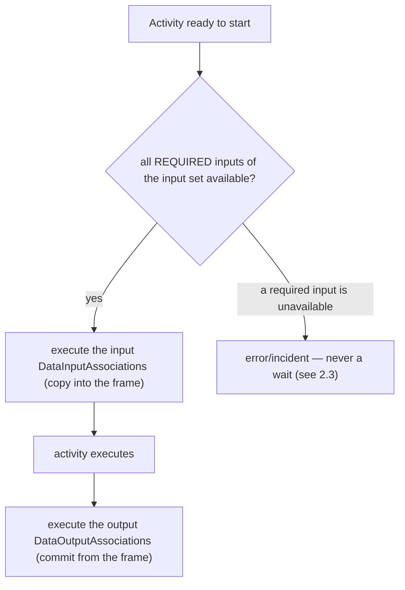

# ADR-011 — Process Data Flow

| Field | Value |
|---|---|
| Status | Accepted |
| Version | v.1 |
| Date | 2026-06-13 |
| Owner | Ruslan Gabitov |
| Refines | [ADR-001 v.5 Execution Model](ADR-001-execution-model.md) |

> **Scope.** This decides the engine's **model-layer data-flow semantics** — *what*
> is evaluated when data crosses an activity or event: the `ItemDefinition` /
> `IoSpec` / `InputSet` / `OutputSet` / `DataAssociation` model, how an input set
> is selected, how data states gate that selection, how associations copy data,
> what in-process service code may read, and the shape the model layer should
> take. It is the sibling of [ADR-010 v.1](ADR-010-process-data-model.md): ADR-010
> decided **where** data lives and the runtime contract it is evaluated against
> (container scopes, the data plane, execution frames); this ADR decides **what**
> the model evaluates against that contract. ADR-010 §2.6 explicitly deferred the
> model-layer data semantics here. Durable persistence (a future Persistence ADR),
> the model-layer **layering** of executor contracts (the layering ADR), and
> observing instance data **from outside** the process (the observability ADR)
> are out of scope — see §2.8.

## 1. Context

### 1.1 What the standard requires

BPMN 2.0 (§8.4.10, §10.4, §13.3.2) defines a precise model for how data flows
into and out of activities and events.

- **Items are typed and item-aware elements carry them.** An `ItemDefinition`
  describes a structure (`structureRef`, `itemKind` Information/Physical,
  `isCollection`). Every data-carrying element — `DataObject`, `Property`,
  `DataInput`, `DataOutput` — is an `ItemAwareElement`: it references an
  `ItemDefinition` and carries an optional `dataState`. The standard makes
  `dataState` semantics **engine-defined** (§9), but treats **availability** —
  whether an item currently holds a usable value — as a first-class condition.
- **An activity's I/O is declared by an `InputOutputSpecification`.** It holds
  ordered `dataInputs`/`dataOutputs` and **at least one** `InputSet` and **at
  least one** `OutputSet`. An `InputSet` is a named set of `dataInputRefs` that
  together form *one valid way* to start the activity; it may mark some of them
  `optionalInputRefs` (may be unavailable at start) or `whileExecutingInputRefs`
  (evaluated during execution). `InputSet` declaration order is **significant**.
  An **empty** `InputSet` means the activity needs no data to start.
- **Input-set selection is ordered and availability-gated** (§10.4.2). When an
  activity is ready, its `InputSet`s are evaluated in declaration order; the
  **first** one all of whose *required* inputs are available is selected, and
  every `DataInputAssociation` targeting that set's inputs executes. The standard
  says that if no set is available the activity **waits** until one becomes so
  (re-evaluation timing left to the engine).
- **Output sets mirror inputs, with an IORule.** At completion the first
  available `OutputSet` is selected and its `DataOutputAssociation`s execute; if
  none is available the engine raises a runtime exception. An `InputSet` may pin,
  via `outputSetRefs`, which `OutputSet`s are legal to produce — the **IORule** —
  and a mismatch at completion is a runtime exception.
- **Data associations copy, with three shapes** (§10.4.2). A `DataAssociation`
  moves data from source(s) to one target: a `transformation` expression whose
  result *replaces* the target; or per-`assignment` `from`→`to` copies; or, with
  neither, a plain copy that allows **exactly one** source. Tokens never flow
  along associations. A source in the **unavailable** state blocks the
  association.
- **Events carry data without input sets** (§10.4.2). A throw event's
  `DataInputAssociation`s fill its inputs from context when it fires; a catch
  event's `DataOutputAssociation`s push the triggering element's data into
  context. Events have no `InputSet`/`OutputSet` and never wait on data.
- **Evaluation is synchronous to the lifecycle, by copy** (§9). There is no
  parallel data plane; an activity does not become Active until its selected
  set's associations complete, and emits no tokens until its output associations
  complete. Every association is a *copy* — later changes to a source do not
  propagate.

### 1.2 What the engine has today

ADR-010 already decided the runtime data plane: per-instance container scopes,
the execution frame, copy/commit semantics, per-execution parameter instances.
The **model layer** that those frames evaluate, however, is partial and uneven:

- The item-aware **types exist** — `ItemDefinition`, `ItemAwareElement` with a
  first-class state (`Undefined` / `Unavailable` / `Ready`), `Parameter`, `Set`,
  `DataAssociation`, `Property`, `DataObject`. State *tracking* and *per-association*
  availability checks are present.
- **Input-set selection does not exist.** There is no ordered evaluation of
  `InputSet`s, no first-available selection, no `optionalInputRefs` /
  `whileExecutingInputRefs` distinction, no `OutputSet` selection, and no IORule
  check. A single structural validity check ("are this set's default parameters
  Ready?") stands in for the whole §10.4.2 algorithm.
- **The model-layer shapes have accreted problems.** The `IoSpec`↔`Parameter`↔`Set`
  graph is a large, two-sided, mutually-referential structure that must keep
  invariants across types in step. The collection value type embeds a
  change-notification callback system that fires asynchronously in goroutines —
  inside a model whose evaluation the standard requires to be synchronous. Event
  construction routes through eight adapter interfaces resolved by runtime type
  assertion, so a mismatched trigger/event pairing surfaces at run time rather
  than compile time. The process container is freely mutable and unvalidated, so a
  malformed graph (a flow to a missing node, a mistyped element) is caught late,
  deep in execution, or not at all. Two outright defects exist (a
  collection key-listing that returns a double-length half-nil slice; a parameter
  removal on a value receiver that mutates a copy).
- **In-process service code is data-starved.** A `ServiceTask`'s operation runs a
  Go functor, but the functor receives only its operation's input message item —
  not the per-execution environment. The environment can already read process
  properties by name; the functor simply is never handed a reader. So service
  code cannot read a process property or a runtime variable by name, even though
  the data plane exposes exactly that.

### 1.3 Why now

The Parallel gateway and the data plane (ADR-005, ADR-010) made concurrent,
data-carrying execution real. The model layer is now the limiting factor:
element-completion work (more task and event types), data-driven gateways, and a
genuinely useful service API all stand on a settled data-flow conception. ADR-010
deferred this layer explicitly; this ADR settles it. Per our standing principle —
an earlier document supports the work, it does not cage it — where the model
conflicts with this conception, the code is fixed during implementation.

## 2. Decision

### 2.1 The item-aware data model is the standard's, kept minimal

gobpm keeps the BPMN item-aware model verbatim in its vocabulary:
`ItemDefinition` (structure, kind, collection flag) typing every
`ItemAwareElement` (`DataObject`, `Property`, `DataInput`/`DataOutput` as a
`Parameter`). Data **state** is the engine's own concern (§9), and gobpm defines
exactly three: **Undefined** (no value ever set), **Unavailable** (declared but
not yet holding a usable value), **Ready** (holds a usable value). These three
are sufficient for selection and association gating; gobpm does **not** introduce
domain `DataState` values (Draft/Approved/…) — those are a modelling concern a
process expresses with its own data, not an engine primitive. The state set is
closed by decision; a future need reopens it here, not ad hoc.

### 2.2 One input set and one output set per activity

An activity has **exactly one** `InputSet` and **exactly one** `OutputSet` — the
standard's cardinality minimum (≥1 each). gobpm does **not** model multiple sets
or the ordered, data-driven selection between them; multiple I/O sets are an
explicit non-goal (§2.8) on the same principle as §2.3 — a set *chosen by which
data happens to be available* is hidden, non-diagram branching, and every real
alternative is modelled with a gateway or boundary event. The rich within-set
distinctions the standard defines are kept; only the multi-set *selection* is
dropped.

- **Required vs. optional, within the one set.** An input is *required* unless it
  is in `optionalInputRefs`. When the activity is ready, every **required** input
  must be available; an optional input may legitimately be absent. A required
  input that is unavailable is an error (§2.3 — never a wait).
- **While-executing inputs.** `whileExecutingInputRefs` are evaluated *during*
  execution, not at start — a hook the activity lifecycle exposes; they do not
  gate the start.
- **Inputs fill, outputs commit.** The input associations execute when the
  activity starts, copying into the execution frame's input instances (ADR-010
  copy semantics); the output associations execute at completion, committing from
  the frame. If no output is produced where one is required, that is an error —
  gobpm never silently produces nothing.
- **Empty sets are first-class.** An empty `InputSet` means "starts with no data";
  an empty `OutputSet` means "produces no data" — the common case for today's
  tasks, modelled explicitly, not as a degenerate validity result.

The model layer is shaped (§2.7) so the single-set evaluation is a small,
self-contained component over the I/O graph — which keeps the door open: if a
real demand for multiple I/O sets ever appears, the ordered-selection variant can
be **added as an extension** to that component without reshaping the data model.
The conception scopes to one set; the structure does not foreclose more.

### 2.3 Availability gates selection; it never makes the activity wait

The standard says an activity with no available input set **waits** until one
becomes available. **gobpm rejects this.** A data-availability wait is a *hidden
synchronization*: a token sits and waits on a condition that does not appear
anywhere on the process diagram, so the behaviour is unobservable to the modeller
and effectively undefined. It is the same hazard gobpm avoids in control-flow
synchronization — implicit gates the diagram does not show.

**Decision.** When an activity is ready and **no** `InputSet` qualifies (no set
has all its required inputs available), gobpm raises an **error / incident** — it
does not wait and does not re-evaluate. Likewise an unavailable required source
of a selected association, or no available `OutputSet` at completion, is an error.
If a process must pause until some data is present, the modeller expresses that
**explicitly** with a catch event or a gateway — a construct visible on the
diagram — not by relying on an invisible data gate.

> **Engine note — deviation from BPMN §10.4.2.** The standard's text:
> *"If NO InputSet is available, execution waits until the condition is met
> (timing out of scope)."* gobpm deliberately does not implement this wait. The
> availability **state** and the **optional/required** distinction are kept —
> they decide *which* set is selected and *which* inputs may be absent — but the
> *wait* is replaced by a fail-fast error. Rationale: a non-diagram-visible data
> wait yields unpredictable, unmodellable behaviour; explicit waiting belongs to
> events/gateways. This is a permanent gobpm semantics, not a deferral.

### 2.4 Data associations copy, in the standard's three shapes

A `DataAssociation` evaluation follows §10.4.2 exactly: a `transformation`
expression whose result **replaces** the target; or each `assignment` evaluated
`from`→`to`; or, with neither, a **single-source** plain copy. Every association
is a **copy** — consistent with ADR-010's frame/commit model, a value taken into
an input does not track later source changes. A source in the **Unavailable**
state blocks its association; under §2.3 that surfaces as a selection failure or
an execution error, never a wait. The expression-driven shapes evaluate through
the engine's `ExpressionEngine` (ADR-002), so the transformation/assignment
language is swappable.

### 2.5 Events carry data without sets

Throw and catch events follow the standard's event model (§10.4.2): a throw
event's input associations fill its inputs from the execution environment when it
fires; a catch event's output associations push the triggering element's data
into the environment. Events have **no** `InputSet`/`OutputSet` and, by §2.3 and
by the standard alike, **never wait on data** — a throw event with an unavailable
required input is an error at fire time. The process-level Start/End special case
(process `DataInput`s as targets of a Start event's output associations; process
`DataOutput`s as sources of an End event's input associations) is part of the
conception and lands with the messaging/call-activity work that needs it.

### 2.6 In-process service code reads data by name through a narrow reader

A service implementation (today a Go functor behind a `ServiceTask`'s operation)
**receives a narrow, public data reader** in addition to its operation input. The
reader exposes read access **by name** and **by item-definition id** over the
execution's data — its operation inputs, the process properties in scope, and the
engine's runtime variables — resolving with the execution's normal frame→container
walk (ADR-010).

- **Reader, not the environment.** The service is handed a *narrow read-only*
  interface, not the internal runtime environment. Service code is user-facing
  and must not depend on internal engine types; the reader is the public surface
  (its placement relative to the layering decision is the layering ADR's, but its
  *existence and shape* are decided here). It offers read-by-name / read-by-id and
  nothing else — no scope mutation, no lifecycle, no event access.
- **Runtime variables are addressable by name.** The engine exposes a small set of
  runtime variables (`STARTED_AT`, `STATE`, `TRACKS_CNT`) in a reserved, read-only
  region of the data plane. The reader resolves them **by their names** alongside
  process properties, so service code can read them without knowing the reserved
  addressing — the reader hides it.
- **Read, not observe-from-outside.** This is *in-process* access — code running
  *as part of* the process execution. Observing an instance's data from *outside*
  (a caller inspecting a running instance's properties / runtime variables) is a
  separate concern: the public engine API is write-only today (the audit's §2.2),
  and that belongs to the observability ADR, not here.

This makes a service a first-class data consumer: it can read a process property
and a runtime variable by name and act on them, the way in-process Go code should
be able to.

### 2.7 The model layer is shaped for the conception

The data-flow model must be a clean foundation for §2.2–§2.6. gobpm prescribes the
target shapes (the implementing SRD does the file-level work):

- **Single-ownership of the I/O graph.** The `InputOutputSpecification` is the one
  owner of its parameters and sets; the parameter↔set relationship is
  **one-directional** (a set knows its parameters; a parameter does not carry
  back-references to every set it belongs to). The two-sided, mutually-referential
  graph that must keep cross-type invariants in step is replaced by single
  ownership with derived queries. Mutation has one authority, not two.
- **Set evaluation is a distinct concern from storage.** The input/output **set
  evaluation** (§2.2 — required-availability check, association execution) is its
  own component over the I/O graph, not methods smeared across the storage types.
  Keeping it separated is also what makes the multi-set extension (§2.8)
  addable later without reshaping the data structures, should it ever be demanded.
- **A value holds data; change-notification is separate.** The collection value
  type holds elements and nothing else. Change-notification (the callback/observer
  mechanism) is a **separate, opt-in decorator** over a value, not embedded in it
  — and it must not impose asynchrony on the synchronous evaluation the standard
  requires. (Where a change-notification mechanism is later needed — e.g. for
  conditional events — it is designed there, on this separated seam, not baked
  into every collection.)
- **Event construction is checked at the type level.** The eight runtime-type-
  assertion adapter interfaces are replaced by a construction mechanism that pairs
  a trigger with its event kind at compile time (a mismatched trigger/event is a
  build error, not a runtime surprise). Activities and events converge on **one**
  options idiom rather than two opposed ones.
- **The process is validated at registration.** `Process` gains an explicit
  `Validate()` (a well-formed graph: flows connect existing nodes; no dangling or
  mistyped elements — the unchecked type assertions become guarded), run when the
  process is registered, **before** its snapshot is built, so a malformed graph
  fails with a clear error instead of producing a broken snapshot. No separate
  *freeze* is introduced: the snapshot already **is** the frozen model —
  `snapshot.New` copies the graph into its own maps and the running instance
  executes a per-instance `Clone()` of it, so the live `Process` is never read
  during execution and post-registration mutation cannot reach a running instance.
- **The two defects are corrected.** Collection key-listing returns the index set,
  not a double-length half-nil slice; parameter removal mutates through a pointer
  receiver, not a copy. (Mechanical; named here so the conception is complete, but
  they carry no design weight.)

### 2.8 Non-goals and out of scope

- **Multiple input/output sets (a non-goal — deliberate BPMN deviation).** gobpm
  models exactly one `InputSet` and one `OutputSet` per activity (§2.2); the
  standard's ordered, data-driven *selection* among several sets, and the IORule
  pairing (`outputSetRefs`/`inputSetRefs`), are not implemented. Rationale: a set
  chosen by which data is available is hidden, non-diagram branching — the same
  hazard as the data wait (§2.3) and OR-join synchronization — and in practice
  alternative input/output modes are modelled clearly with gateways or boundary
  events. The optional/required and while-executing distinctions are kept *within*
  the single set, so nothing practical is lost. The model layer (§2.7) is shaped
  so the ordered-selection variant can be **added as an extension** if a real
  demand ever appears, without reshaping the data model. This deviation and the
  no-wait deviation (§2.3) are registered in the engine's conformance scope
  ([SAD-001 v.1 §14.1](SAD-001-vision-and-architecture.md)).
- **Where data lives and the runtime contract** — ADR-010 (container scopes, the
  data plane, frames, copy/commit, last-committed-wins). This ADR evaluates
  *against* that contract.
- **Durable persistence / serialization** of data — the future Persistence &
  State ADR.
- **Layering of executor / reader contracts** (which package the public reader and
  the node-executor interfaces live in, so `pkg/model` stops importing internal
  packages) — the layering ADR. This ADR decides the reader's *existence and
  shape*; its *placement* is reconciled there.
- **Observing instance data from outside the process** (a caller reading a running
  instance's properties / runtime variables; the write-only public API) — the
  observability ADR.
- **Data-driven gateways and conditional events** (control flow reacting to data)
  — element-completion work; they consume this model but are not decided here.

## 3. Consequences

- **Activity I/O has real, availability-gated semantics.** The single input/output
  set gets a genuine required-availability check and association execution — closing
  the engine's data-binding gap (it stood on a partial "default-Ready" check) without
  the complexity of multi-set selection.
- **Behaviour is predictable: no hidden data-driven control.** A process never
  silently blocks on invisible data conditions (no wait, §2.3) and never silently
  picks a different input/output mode based on available data (no multi-set
  selection, §2.8). Missing required data fails loudly; both waiting and branching
  are always something the diagram shows. Two deliberate, documented deviations from
  the standard, flowing from one principle.
- **Service code becomes a real data consumer.** A functor can read process
  properties and runtime variables by name through a narrow public reader —
  Go-in-process gains access to process data, not just its operation message.
- **The model layer gets simpler and safer.** Single ownership of the I/O graph,
  selection separated from storage, value-vs-notification separated,
  compile-time-checked event construction, a validated process, and the
  two defects gone — a foundation later element work builds on.
- **Cost: a substantial model-layer refactor.** The I/O graph, the collection
  value, event options, and the process container all change shape; the implementing
  SRD(s) stage this and keep `make ci` green per step. The reader API adds a
  parameter to the service-implementation signature — a public surface change the
  layering ADR later places.
- **Maintenance rule.** Data state stays the closed three-value set (§2.1);
  availability gates selection but never waits (§2.3); a value type never embeds
  notification (§2.7). A change that needs a new data state, a data wait, or an
  in-value callback reopens the relevant decision here, it does not work around it.

## 4. Alternatives considered

- **Keep the single "are default params Ready?" check.** Cheap, but it ignores the
  optional/required distinction and availability gating entirely, and silently
  mismodels any I/O spec that uses them. Rejected for a real single-set evaluation
  (§2.2).
- **Implement the full multiple-set selection (the standard's §10.4.2).** Ordered
  evaluation of several `InputSet`s, first-available selection, the IORule pairing.
  Conformant to the letter, but it is data-driven branching the diagram does not show
  — the same hidden-control hazard as the data wait — and in practice the feature is
  near-unused (tools barely expose it; engines barely implement it); every real
  alternative input/output mode is clearer as a gateway. Rejected on the modelling
  principle (§2.8); the structure stays open to adding it if a real demand appears.
- **Implement the standard's data-availability wait.** Conformant to the letter,
  but introduces exactly the hidden, non-diagram synchronization gobpm rejects
  (§2.3) — unpredictable, unmodellable blocking. Rejected on the modelling
  principle, not on cost.
- **Defer the wait rather than reject it** (the author's first proposal). Treats
  the wait as a future target gated on data-change subscriptions. Rejected by the
  owner: the wait is undesirable *in principle* (hidden synchronization), not
  merely unimplemented — holding it as a target would invite re-introducing the
  hazard. Fail-fast is the permanent semantics.
- **Pass the internal runtime environment to service functors.** Simplest wiring,
  but leaks internal engine types into user-facing service code — the very
  layering coupling a later ADR must remove, and a hard-to-narrow surface.
  Rejected for a narrow public reader (§2.6).
- **Leave the model-layer shapes as they are and fix only the two bugs.** Cures the
  symptoms, leaves the two-sided I/O graph, the in-value async notifications, the
  runtime-asserted event options, and the unguarded mutable process — the
  structural drag the audit flagged (3.1–3.3). Rejected: the conception needs a
  clean foundation, not a patched one.
- **A richer/extensible `DataState`** (domain states as an engine primitive).
  Rejected: the standard makes domain state values a modelling concern, not an
  engine one; three states suffice for selection and gating, and an open set adds
  surface with no execution semantics behind it.

## 5. Enterprise-readiness recommendations

Advisory, not gating — conventions the landing SRD(s) and later work should follow:

- **Surface data-flow failures as incidents, not panics.** An unavailable required
  input, or no available output where one is required, is an operational event a
  process owner must see and act on. Model it as a structured, classified failure
  (an incident, when the incident/fault-tolerance work lands) carrying which
  activity and which input failed — never a bare error or a silent no-op.
- **Validate I/O specs at build, not just at run.** `Process.Validate()` (§2.7)
  should reject a malformed `IoSpec` (no input set, a set referencing an undeclared
  input) when the model is built, so authoring errors fail at construction with a
  clear message, not mid-execution.
- **Document the no-wait deviation for modellers.** §2.3 is a real divergence from
  BPMN; user-facing docs must state it plainly — "gobpm does not wait for data;
  unavailable required input is an error; model waiting with an event/gateway" —
  so a modeller coming from another engine is not surprised.
- **Keep the service reader read-only and minimal.** The §2.6 reader must not grow
  into a general scope handle; a service that needs to *write* does so through its
  declared outputs, preserving the copy/commit discipline. A read-only reader keeps
  service code from coupling to engine internals.
- **Mask values in data-flow logs.** Logging set selection and association
  evaluation aids debugging, but log *names, ids, states, and availability* — never
  values, which are business-sensitive (consistent with ADR-010's recommendation).

## 6. Open questions

- None. The one-set scope (multiple I/O sets a non-goal), the availability/no-wait
  semantics, the service reader shape, the data-state closed set, and the model-layer
  target shapes are all decided above. The exact reader interface signature and the
  model-layer refactor sequencing are implementation concerns for the landing SRD(s),
  not open conception questions.

## 7. References

- [SAD-001 v.1 Vision & Architecture](SAD-001-vision-and-architecture.md) — §14
  Conformance & Compliance Scope; §14.1 registers the two intentional BPMN
  deviations this ADR decides (the no-wait rule §2.3, the single-set rule §2.8).
- [ADR-001 v.5 Execution Model](ADR-001-execution-model.md) — the two-layer
  runtime and lifecycle this data flow is synchronous to; the data side it refines.
- [ADR-010 v.1 Process Data Model](ADR-010-process-data-model.md) — **where** data
  lives and the runtime contract (container scopes, the data plane, execution
  frames, copy/commit). §2.6 deferred the model-layer semantics decided here; this
  ADR is its sibling continuation.
- [ADR-002 v.1 Extension Architecture](ADR-002-extension-architecture.md) — the
  `ExpressionEngine` the transformation/assignment association shapes evaluate
  through.
- BPMN 2.0 §8.4.10 (ItemDefinition), §10.4 (Items and Data), §10.4.2 (Execution
  Semantics for Data), §13.3.2 (data binding in the Activity Lifecycle) — the
  item-aware model, set selection, association semantics, and IORule this ADR
  encodes (and, for the data wait, deliberately deviates from); digested in the
  project's spec KB (`docs/bpmn-spec/semantics/data.md`).
- Architecture audit 2026-06-11 (`docs/audit/architecture-audit-2026-06-11.md`) —
  the model-layer findings this ADR's §2.7 remediates (1.6 data items; 3.1 I/O-spec
  complexity and the collection notification coupling; 3.2 event-option adapters;
  3.3 process validation).
- Persistence & State ADR *(future)* — durable serialization of data.
- Layering ADR *(future)* — placement of the public service reader and node-executor
  contracts.
- Observability ADR *(future)* — observing instance data from outside the process.

## Document History

| Version | Date | Author | Change |
|---|---|---|---|
| v.1 | 2026-06-13 | Ruslan Gabitov | **Accepted**, first model-layer-hardening part landed via SRD-008 v.1 (`f920b11`, `3658acc`, `7bba5e6`); the §2.7 "freeze after snapshot" was dropped during that landing (the snapshot is already the frozen model) — kept here as the validate-at-registration decision. The §2.2–§2.6 evaluation/reader semantics and the deferred §2.7 items (value-notification split, event-options unification) land via later SRDs. Decides the model-layer data-flow semantics (the layer ADR-010 §2.6 deferred): the item-aware model with a closed three-value data state; **exactly one `InputSet` and one `OutputSet` per activity** with a real required-availability check and association execution — multiple I/O sets and their ordered, data-driven selection + IORule pairing are an explicit **non-goal** (hidden non-diagram branching, near-unused in practice, modelled with gateways instead; structure left extensible if ever demanded); **availability gates the start but never makes the activity wait** — a deliberate documented deviation from §10.4.2 (a data wait is a hidden, non-diagram synchronization → unpredictable; unavailable required input is an error, explicit waiting is modelled with events/gateways); optional/required and while-executing kept *within* the single set; data associations copy in the standard's three shapes; events carry data without sets and never wait; in-process service code receives a **narrow public data reader** (read by name/id over operation inputs, properties, and runtime variables — runtime vars addressable by name); and the model layer is reshaped (single-ownership I/O graph, set-evaluation separated from storage, value-vs-notification separated, compile-time-checked event construction, `Process.Validate()` run at registration (no freeze — the snapshot is already the frozen model), the GetKeys/RemoveParameter defects corrected). Two deliberate BPMN deviations (no data wait, no multiple I/O sets) from one principle — no hidden data-driven control. Refines ADR-001 v.5 (data side); sibling of ADR-010 v.1. Out of scope: persistence, executor/reader layering, observe-from-outside, data-driven gateways. Rejected: partial "default-Ready" check, full multi-set selection, the standard data wait, deferring (vs rejecting) the wait, leaking the runtime env to functors, bug-fix-only, an extensible DataState. |
