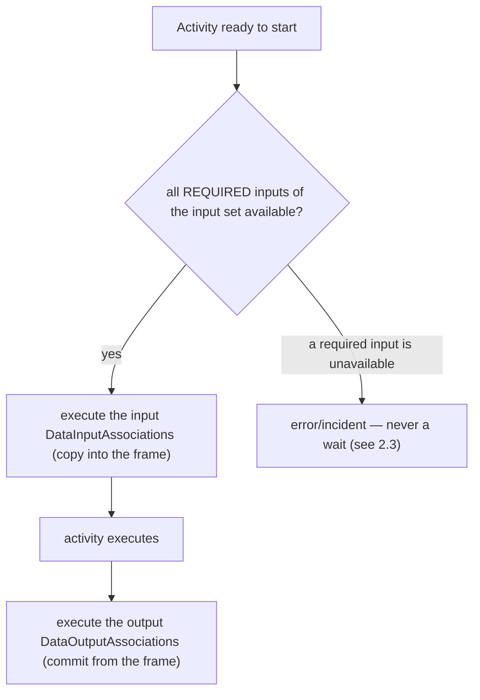

# ADR-011 — Process Data Flow

| Field | Value |
|---|---|
| Status | Draft |
| Version | v.7 |
| Date | 2026-07-19 |
| Owner | Ruslan Gabitov |
| Refines | [ADR-001 v.6 Execution Model](ADR-001-execution-model.md) |

> **Scope.** This decides the engine's **model-layer data-flow semantics** — *what*
> is evaluated when data crosses an activity or event: the `ItemDefinition` /
> `IoSpec` / `InputSet` / `OutputSet` / `DataAssociation` model, how an input set
> is selected, how data states gate that selection, how associations copy data,
> what in-process service code may read, and the shape the model layer should
> take. It is the sibling of [ADR-010 v.2](ADR-010-process-data-model.md): ADR-010
> decided **where** data lives and the runtime contract it is evaluated against
> (container scopes, the data plane, execution frames); this ADR decides **what**
> the model evaluates against that contract. ADR-010 §2.6 explicitly deferred the
> model-layer data semantics here. Durable persistence (a future Persistence ADR),
> the model-layer **layering** of executor contracts (the layering ADR), and
> observing instance data **from outside** the process (the observability ADR)
> are out of scope — see §2.8.

## 1. Context

### 1.1 What the standard requires

BPMN 2.0 (§8.4.10, §10.4, §13.3.2) defines a precise model for how data flows
into and out of activities and events.

- **Items are typed and item-aware elements carry them.** An `ItemDefinition`
  describes a structure (`structureRef`, `itemKind` Information/Physical,
  `isCollection`). Every data-carrying element — `DataObject`, `Property`,
  `DataInput`, `DataOutput` — is an `ItemAwareElement`: it references an
  `ItemDefinition` and carries an optional `dataState`. The standard makes
  `dataState` semantics **engine-defined** (§9), but treats **availability** —
  whether an item currently holds a usable value — as a first-class condition.
- **An activity's I/O is declared by an `InputOutputSpecification`.** It holds
  ordered `dataInputs`/`dataOutputs` and **at least one** `InputSet` and **at
  least one** `OutputSet`. An `InputSet` is a named set of `dataInputRefs` that
  together form *one valid way* to start the activity; it may mark some of them
  `optionalInputRefs` (may be unavailable at start) or `whileExecutingInputRefs`
  (evaluated during execution). `InputSet` declaration order is **significant**.
  An **empty** `InputSet` means the activity needs no data to start.
- **Input-set selection is ordered and availability-gated** (§10.4.2). When an
  activity is ready, its `InputSet`s are evaluated in declaration order; the
  **first** one all of whose *required* inputs are available is selected, and
  every `DataInputAssociation` targeting that set's inputs executes. The standard
  says that if no set is available the activity **waits** until one becomes so
  (re-evaluation timing left to the engine).
- **Output sets mirror inputs, with an IORule.** At completion the first
  available `OutputSet` is selected and its `DataOutputAssociation`s execute; if
  none is available the engine raises a runtime exception. An `InputSet` may pin,
  via `outputSetRefs`, which `OutputSet`s are legal to produce — the **IORule** —
  and a mismatch at completion is a runtime exception.
- **Data associations copy, with three shapes** (§10.4.2). A `DataAssociation`
  moves data from source(s) to one target: a `transformation` expression whose
  result *replaces* the target; or per-`assignment` `from`→`to` copies; or, with
  neither, a plain copy that allows **exactly one** source. Tokens never flow
  along associations. A source in the **unavailable** state blocks the
  association.
- **Events carry data without input sets** (§10.4.2). A throw event's
  `DataInputAssociation`s fill its inputs from context when it fires; a catch
  event's `DataOutputAssociation`s push the triggering element's data into
  context. Events have no `InputSet`/`OutputSet` and never wait on data.
- **Evaluation is synchronous to the lifecycle, by copy** (§9). There is no
  parallel data plane; an activity does not become Active until its selected
  set's associations complete, and emits no tokens until its output associations
  complete. Every association is a *copy* — later changes to a source do not
  propagate.

### 1.2 What the engine has today

ADR-010 decided the runtime data plane (per-instance container scopes, the
execution frame, copy/commit semantics, per-execution parameter instances), and
this ADR's own v.1–v.5 landings built the **model layer** on top of it. As of v.6
that layer is settled:

- The item-aware **model is in place** — `ItemDefinition` / `ItemAwareElement` with
  the closed three-value state (`Undefined` / `Unavailable` / `Ready`),
  `Parameter`, `DataAssociation`, `Property`, `DataObject`. There is **no** reified
  `Set` type — the `IoSpec` owns its `DataInput` / `DataOutput` parameters directly
  (v.2), with required / optional / while-executing as per-parameter attributes.
- **Single-set evaluation works.** One `InputSet` / one `OutputSet` per activity
  with a real required-availability check and association execution; availability
  gates the start but never waits (§2.3). Ordered multiple-set selection and the
  IORule pairing remain a deliberate non-goal (§2.8).
- **The model layer was cleaned up** (v.1–v.5) — a single-ownership I/O graph,
  set-evaluation separated from storage, value-vs-notification separated,
  compile-time-checked event construction, `Process.Validate()` at registration,
  and the two earlier defects gone.
- **In-process service code reads data.** The polymorphic `Operation` (§2.6, v.5):
  an in-process Go operation composes a narrow public reader over process
  properties + runtime variables (by name, or `SOURCE/addr` per ADR-010 §2.7) with
  optional message I/O; an external message operation stays message-only.

What the layer **could not** do as of v.6 — the gap §2.9 closed — was reach
*into* a value. An `ItemDefinition`'s structure was **opaque**: a value was flat
— a scalar (`Variable`) or a homogeneous list (`Array`), with no record kind and
no engine-visible shape — so mapping, associations, expressions, and conditions
could address a *whole* value but not `order.items[0].price`, and could not
build a nested output (§2.9).

**(v.7)** The structural slices S1–S4 have since landed: values are navigable
(`Record` beside `Collection`), writable through paths, change-detected by
commit-diff, and native Go structs participate through cached adapters. What the
kind set still lacks is a **data-keyed dictionary**: `scalar｜list｜record` has no
kind whose keys are *data* rather than schema, so a process cannot hold a
dictionary it grows key-by-key, and a native `map[string]V` struct field
participates only as an opaque, non-navigable scalar leaf (the S4 builder's
deliberate fallback). §2.9.7 closes that.

### 1.3 Why now

The Parallel gateway and the data plane (ADR-005, ADR-010) made concurrent,
data-carrying execution real. The model layer is now the limiting factor:
element-completion work (more task and event types), data-driven gateways, and a
genuinely useful service API all stand on a settled data-flow conception. ADR-010
deferred this layer explicitly; this ADR settles it. **(v.6)** With that layer now
settled, the limiting factor becomes *structural* reach-in — expressions,
conditional / gateway conditions, and rich input/output mappings all need to see
*into* values, which the opaque structure cannot support; §2.9 settles that.
**(v.7)** The concrete driver §2.8 said the map kind waits for has arrived:
processes genuinely hold data-keyed dictionaries (accumulating results under
run-time keys), and the landed S4 adapter tier makes the `map[string]V` gap
visible in practice — a native map field is the one common Go shape the engine
cannot navigate; §2.9.7 settles that. Per
our standing principle — an earlier document supports the work, it does not cage
it — where the model conflicts with this conception, the code is fixed during
implementation.

## 2. Decision

### 2.1 The item-aware data model is the standard's, kept minimal

gobpm keeps the BPMN item-aware model verbatim in its vocabulary:
`ItemDefinition` (structure, kind, collection flag) typing every
`ItemAwareElement` (`DataObject`, `Property`, `DataInput`/`DataOutput` as a
`Parameter`). Data **state** is the engine's own concern (§9), and gobpm defines
exactly three: **Undefined** (no value ever set), **Unavailable** (declared but
not yet holding a usable value), **Ready** (holds a usable value). These three
are sufficient for selection and association gating; gobpm does **not** introduce
domain `DataState` values (Draft/Approved/…) — those are a modelling concern a
process expresses with its own data, not an engine primitive. The state set is
closed by decision; a future need reopens it here, not ad hoc.

**(v.6)** The `structure` an `ItemDefinition` types is no longer opaque: §2.9
makes it a navigable `scalar｜list｜record` composition the engine can address
by path. The state model here and the set semantics (§2.2/§2.3) are untouched —
v.6 refines *what a value's shape is*, not *when it is selected or committed*.

### 2.2 One input set and one output set per activity

An activity has **exactly one** `InputSet` and **exactly one** `OutputSet` — the
standard's cardinality minimum (≥1 each). Because there is always exactly one of
each, gobpm does **not** reify a `Set` object: an activity's input set **is** its
list of `DataInput` parameters and its output set its list of `DataOutput`
parameters, held directly by the `InputOutputSpecification`. `InputSet` /
`OutputSet` remain as **BPMN vocabulary** for those per-direction lists, exposed
as `IoSpec` views, not as a separate stateful type (§2.7). gobpm does **not**
model multiple sets or the ordered, data-driven selection between them; multiple
I/O sets are an explicit non-goal (§2.8) on the same principle as §2.3 — a set
*chosen by which data happens to be available* is hidden, non-diagram branching,
and every real alternative is modelled with a gateway or boundary event.

The rich within-set distinctions the standard defines are kept, as
**per-parameter attributes** rather than set membership: a `DataInput` is
**required** unless flagged `optional` (the standard's `optionalInputRefs` /
`optional` attribute, default `false`); a `DataOutput` likewise
(`optionalOutputRefs`); `whileExecuting` marks the niche inputs/outputs the
standard evaluates *during* execution. Only the multi-set *selection* is dropped.

- **Required vs. optional, within the one set.** An input is *required* unless it
  is in `optionalInputRefs`. When the activity is ready, every **required** input
  must be available; an optional input may legitimately be absent. A required
  input that is unavailable is an error (§2.3 — never a wait).
- **While-executing inputs.** `whileExecutingInputRefs` are evaluated *during*
  execution, not at start — a hook the activity lifecycle exposes; they do not
  gate the start.
- **Inputs fill, outputs commit.** The input associations execute when the
  activity starts, copying into the execution frame's input instances (ADR-010
  copy semantics); the output associations execute at completion, committing from
  the frame. If no output is produced where one is required, that is an error —
  gobpm never silently produces nothing.
- **Empty sets are first-class.** An empty `InputSet` means "starts with no data";
  an empty `OutputSet` means "produces no data" — the common case for today's
  tasks, modelled explicitly, not as a degenerate validity result.

The model layer is shaped (§2.7) so single-set evaluation is a small,
self-contained component over the `IoSpec`'s parameter lists. The conception
scopes to one set; re-introducing multiple sets would mean reintroducing a `Set`
abstraction and ordered selection over it — a reshape, not a drop-in extension
(§2.8) — an accepted trade-off for the simpler model.

### 2.3 Availability gates selection; it never makes the activity wait

The standard says an activity with no available input set **waits** until one
becomes available. **gobpm rejects this.** A data-availability wait is a *hidden
synchronization*: a token sits and waits on a condition that does not appear
anywhere on the process diagram, so the behaviour is unobservable to the modeller
and effectively undefined. It is the same hazard gobpm avoids in control-flow
synchronization — implicit gates the diagram does not show.

**Decision.** When an activity is ready and **no** `InputSet` qualifies (no set
has all its required inputs available), gobpm raises an **error / incident** — it
does not wait and does not re-evaluate. Likewise an unavailable required source
of a selected association, or no available `OutputSet` at completion, is an error.
If a process must pause until some data is present, the modeller expresses that
**explicitly** with a catch event or a gateway — a construct visible on the
diagram — not by relying on an invisible data gate.

> **Engine note — deviation from BPMN §10.4.2.** The standard's text:
> *"If NO InputSet is available, execution waits until the condition is met
> (timing out of scope)."* gobpm deliberately does not implement this wait. The
> availability **state** and the **optional/required** distinction are kept —
> they decide *which* set is selected and *which* inputs may be absent — but the
> *wait* is replaced by a fail-fast error. Rationale: a non-diagram-visible data
> wait yields unpredictable, unmodellable behaviour; explicit waiting belongs to
> events/gateways. This is a permanent gobpm semantics, not a deferral.

### 2.4 Data associations copy, in the standard's three shapes

A `DataAssociation` evaluation follows §10.4.2 exactly: a `transformation`
expression whose result **replaces** the target; or each `assignment` evaluated
`from`→`to`; or, with neither, a **single-source** plain copy. Every association
is a **copy** — consistent with ADR-010's frame/commit model, a value taken into
an input does not track later source changes. A source in the **Unavailable**
state blocks its association; under §2.3 that surfaces as a selection failure or
an execution error, never a wait. The expression-driven shapes evaluate through
the engine's `ExpressionEngine` (ADR-002), so the transformation/assignment
language is swappable.

### 2.5 Events carry data without sets

Throw and catch events follow the standard's event model (§10.4.2): a throw
event's input associations fill its inputs from the execution environment when it
fires; a catch event's output associations push the triggering element's data
into the environment. Events have **no** `InputSet`/`OutputSet` and, by §2.3 and
by the standard alike, **never wait on data** — a throw event with an unavailable
required input is an error at fire time. The process-level Start/End special case
(process `DataInput`s as targets of a Start event's output associations; process
`DataOutput`s as sources of an End event's input associations) is part of the
conception and lands with the messaging/call-activity work that needs it.

### 2.6 The Operation is polymorphic by execution locus; in-process code composes message and reader access

A `ServiceTask`'s `Operation` is **polymorphic**. BPMN fixes the *message
contract* of an Operation (`inMessageRef`/`outMessageRef`/`errorRef`) but leaves
*how* it is implemented engine-defined — `implementationRef` is a mechanism hint
(`##WebService`, `##Unspecified`, or vendor-specific). gobpm splits the kinds by
**where the implementation runs**, and lets in-process code **compose** its
data-access methods rather than forcing one:

- **External message operation (canonical).** An out-of-process implementation
  (a web service, a connector — an `Implementor`). Data flows in through the
  operation's `inMessage` (bound from the activity's `DataInput`s by data
  associations) and out through its `outMessage`; the implementation sees **only
  its message**. It is message-only **by locus** — an out-of-process service
  cannot be handed an in-process reader — which is exactly the decoupled,
  conformant path for external services.
- **In-process Go operation (gobpm-native).** An in-process Go functor. It
  receives the **narrow, public, read-only data reader** (the data plane's
  addressable reads — [ADR-010 v.2 §2.7](ADR-010-process-data-model.md): default
  scope by plain name, named sources by `SOURCE/var`, discovery
  `GetSources`/`List`) **and** its **optional bound input message**, may declare
  an **optional output message**, and **returns its result** (committed by the
  `ServiceTask`, filling the output message when one is declared). Message-based
  and reader-based access **compose**: the author uses the reader, the message
  I/O, or both — whichever the task needs. This is a deliberate extension to the
  standard's message-only Operation, registered in the conformance scope
  ([SAD-001 v.1 §14.2](SAD-001-vision-and-architecture.md)); `implementationRef`
  marks the mechanism.

The split is by **execution locus**, not by data-access method — the correction
over the earlier "the Go kind is message-free, the message kind cannot reach
scope" framing, which restricted in-process code for no reason the conformance
boundary requires. The boundary that *does* matter is preserved: **ambient scope
access is confined to in-process code**. An external service never receives a
reader (it can't), so the canonical message contract stays pure and decoupled;
an in-process functor — code running *as part of* the execution — composes its
message I/O and reader access freely. The reader's properties:

- **Reader, not the environment.** A *narrow read-only* interface, not the internal
  runtime environment. Service code is user-facing and must not depend on internal
  engine types; the reader is the public surface (its placement relative to the
  layering decision is the layering ADR's, but its *existence and shape* are
  decided here). It offers read-by-name / read-by-id and nothing else — no scope
  mutation, no lifecycle, no event access, and **no write** (a Go operation returns
  its result; the `ServiceTask` commits it as the activity's output).
- **Runtime variables are read via the `RUNTIME` data source.** The engine's
  read-only runtime variables (`STARTED_AT`, `STATE`, `TRACKS_CNT`, …) are a named
  data source; the functor reads them by their explicit path `RUNTIME/<var>`
  (ADR-010 v.2 §2.7), which never intersects the process's own properties — a
  process may keep its own `STATE`. The addressing is explicit, not hidden.
- **Read, not observe-from-outside.** This is *in-process* access — code running
  *as part of* the process execution. Observing an instance's data from *outside*
  (a caller inspecting a running instance's properties / runtime variables) is a
  separate concern: the public engine API is write-only today (the audit's §2.2),
  and that belongs to the observability ADR, not here.

A Go operation is thus a first-class data consumer: it reads a process property
(plain name) and a runtime variable (`RUNTIME/<var>`), and — when the task warrants
it — also consumes/produces messages, returning its result the way in-process Go
code should be able to, without compromising the canonical (external) message
contract. The author decides whether to combine the two access methods or use one.

The **node-level** message-handling seam (a `SendTask` producing, a `ReceiveTask`
consuming, throw/catch message events) — e.g. `MessageProducer` / `MessageConsumer`
role interfaces — is a separate concern that lands with the `SendTask`/`ReceiveTask`
executors (a future SRD), where there are several implementors to force its shape;
it is not needed to grant the in-process composition above.

### 2.7 The model layer is shaped for the conception

The data-flow model must be a clean foundation for §2.2–§2.6. gobpm prescribes the
target shapes (the implementing SRD does the file-level work):

- **No `Set` type; the `IoSpec` owns parameters directly.** Because an activity
  has exactly one input and one output set (§2.2), a reified `Set` object carries
  no information beyond the `InputOutputSpecification`'s own per-direction
  parameter lists. gobpm therefore **drops the `Set` type**: the `IoSpec` owns its
  `DataInput`/`DataOutput` parameters directly, each carrying its own
  `optional`/`whileExecuting` attributes, and exposes `InputSet()`/`OutputSet()`
  as views over those lists. This **supersedes the earlier two-sided
  `Parameter`↔`Set` graph** (and the single-ownership remediation SRD-008 used to
  harden it) — with no `Set`, there is no cross-type invariant to keep. Mutation
  has one owner, the `IoSpec`.
- **Set evaluation is a distinct concern from storage.** The input/output **set
  evaluation** (§2.2 — required-availability check, association execution) is its
  own component over the `IoSpec`'s parameter lists, not methods smeared across the
  storage types.
- **A value holds data; change-notification is separate.** The collection value
  type holds elements and nothing else. Change-notification (the callback/observer
  mechanism) is a **separate, opt-in decorator** over a value, not embedded in it
  — and it must not impose asynchrony on the synchronous evaluation the standard
  requires. (Where a change-notification mechanism is later needed — e.g. for
  conditional events — it is designed there, on this separated seam, not baked
  into every collection.)
- **Event construction is checked at the type level.** The eight runtime-type-
  assertion adapter interfaces are replaced by a construction mechanism that pairs
  a trigger with its event kind at compile time (a mismatched trigger/event is a
  build error, not a runtime surprise). Activities and events converge on **one**
  options idiom rather than two opposed ones.
- **The process is validated at registration.** `Process` gains an explicit
  `Validate()` (a well-formed graph: flows connect existing nodes; no dangling or
  mistyped elements — the unchecked type assertions become guarded), run when the
  process is registered, **before** its snapshot is built, so a malformed graph
  fails with a clear error instead of producing a broken snapshot. No separate
  *freeze* is introduced: the snapshot already **is** the frozen model —
  `snapshot.New` copies the graph into its own maps and the running instance
  executes a per-instance `Clone()` of it, so the live `Process` is never read
  during execution and post-registration mutation cannot reach a running instance.
- **The two defects are corrected.** Collection key-listing returns the index set,
  not a double-length half-nil slice; parameter removal mutates through a pointer
  receiver, not a copy. (Mechanical; named here so the conception is complete, but
  they carry no design weight.)

### 2.8 Non-goals and out of scope

- **Multiple input/output sets (a non-goal — deliberate BPMN deviation).** gobpm
  models exactly one `InputSet` and one `OutputSet` per activity (§2.2); the
  standard's ordered, data-driven *selection* among several sets, and the IORule
  pairing (`outputSetRefs`/`inputSetRefs`), are not implemented. Rationale: a set
  chosen by which data is available is hidden, non-diagram branching — the same
  hazard as the data wait (§2.3) and OR-join synchronization — and in practice
  alternative input/output modes are modelled clearly with gateways or boundary
  events. The optional/required and while-executing distinctions are kept as
  per-parameter attributes within the single set, so nothing practical is lost.
  Re-introducing multiple sets would require reintroducing a `Set` abstraction and
  ordered selection over it — a reshape, not a drop-in extension — an accepted
  trade-off for the simpler single-set model (§2.7). This deviation and the
  no-wait deviation (§2.3) are registered in the engine's conformance scope
  ([SAD-001 v.1 §14.1](SAD-001-vision-and-architecture.md)).
- **Where data lives and the runtime contract** — ADR-010 (container scopes, the
  data plane, frames, copy/commit, last-committed-wins). This ADR evaluates
  *against* that contract.
- **Durable persistence / serialization** of data — the future Persistence &
  State ADR.
- **Layering of executor / reader contracts** (which package the public reader and
  the node-executor interfaces live in, so `pkg/model` stops importing internal
  packages) — the layering ADR. This ADR decides the reader's *existence and
  shape*; its *placement* is reconciled there.
- **Observing instance data from outside the process** (a caller reading a running
  instance's properties / runtime variables; the write-only public API) — the
  observability ADR.
- **Data-driven gateways and conditional events** (control flow reacting to data)
  — element-completion work; they consume this model but are not decided here.
  **(v.6)** §2.9.4's committed changed-path seam is the substrate a conditional
  event subscribes to (re-evaluate its `condition` when a referenced variable
  changes); the events themselves remain element-completion work.
- **(v.6) Hot-path reflection.** Reflection on the execution path stays
  rejected. The *bounded* exception §2.9.5 grants — building a type's structural
  adapter **once at registration**, cached, codegen-replaceable per type — is the
  full extent; per-access reflective navigation is not implemented.
- **(v.6) A full schema / type system.** Shape is investigated by traversing the
  value graph (§2.9.1) for navigation and owner-enforced write-checking; there
  is no stored schema artifact, no XSD validator, no constraint language, no
  coercion engine — and resolving `import` / `structureRef` to an external XSD
  is not decided here.
- **(v.6) The structure of foreign provider data.** A `SOURCE/addr` provider
  (ADR-010 §2.7) keeps its address space opaque; engine-native structural
  navigation is for engine-managed values only (§2.9.2).
- **(v.7) Non-string-keyed native maps.** The map kind (§2.9.7) makes
  `map[string]V` struct fields navigable; a Go map with any **other** key type
  (`map[int]V`, `map[K]V` over a comparable struct, …) stays what it is today —
  an opaque, whole-value scalar leaf in the adapter tier. Key **stringification**
  is rejected: it is a silent coercion (against §2.9.3's fail-loud posture),
  format-ambiguous (`1` vs `01`, negative numbers, composite keys), and
  irreversible on the write path. A type that needs a non-string-keyed map
  navigable lifts itself per-type through the custom-adapter hook (§2.9.5's
  registry), not through an engine-wide coercion rule. *(The map kind itself,
  deferred here through v.6 "until a concrete driver arrives", is decided in
  §2.9.7 — the driver arrived: see §1.3.)*

### 2.9 Structural data: navigable values (v.6)

v.1's §2.1 kept `ItemDefinition.structure` **opaque** — one whole `Value` the
engine reads and writes entire. That was enough while activities exchanged whole
scalars and homogeneous lists. Service-task and mapping work exposed the gap:
mapping and conditions can address a **whole** value but cannot reach *into* it —
no `order.items[0].price`, no assembling a nested output. v.6 closes it by making
structure first-class, and does so **on the standard's own terms**:
`ItemDefinition.structureRef` is defined as "the concrete data structure
(typically an XSD complex type or element)" (§8.4.10, Table 8.47) — BPMN data is
*meant* to be structured; gobpm had simply kept the structure opaque. This
extends §2.1 (the item model) without reopening §2.2/§2.3 (set cardinality and
the no-wait rule are untouched).

#### 2.9.1 The value model — `Record` joins `Collection` on the `Value` family

Structure is expressed **the Go way — as optional capability interfaces on the
existing `Value`**, not as a parallel node-tree type system. The engine already
has this pattern: `Collection` is the optional list capability discovered by type
assertion. v.6 mirrors it with **one new capability**:

- **scalar** — a `Value` implementing neither capability (today's `Variable`);
  a path step into it is a clean resolution error;
- **list** — a `Value` implementing `Collection` (today's `Array`, reused
  verbatim; the standard's `isCollection` / an XSD `maxOccurs > 1`);
- **record** — a `Value` implementing the new **`Record`** capability: ordered
  field names (`Keys`), field read (`Field`), structural field write
  (`SetField`) — an XSD complex type's element set;
- **map (v.7)** — a `Value` implementing the **`Map`** capability: homogeneous
  values under **data** keys — arbitrary strings, not identifier field-names —
  with deterministic key enumeration, entry read/write, and first-class entry
  **deletion** (§2.9.7). A genuinely distinct kind from a record: a record's
  keys are its *schema*; a map's keys are *data*.

The kind set is these four, and it is closed until a decision here reopens it.

A node's *kind* is **which capability it implements** (one type assertion); a
`Value` must implement **at most one** structural capability — kind probes test
in one documented, fixed order, and the model does not define a value that is
simultaneously a record and a map. A
leaf's type is the existing `Value.Type()`. Nesting composes to **any depth**
because a field's value may itself be a `Record` or `Collection`. One new
concrete type ships — an insertion-ordered **`values.Record`** — for
dynamic, engine-assembled data; native Go objects satisfy the same capability
through adapters (§2.9.5), so both navigate identically and nest inside each
other. **(v.7)** The map kind ships its own dynamic concrete — a generic
**`values.Map[T]`** mirroring `Array[T]`: homogeneity is enforced by the type
parameter, and `Map[any]` is the zero-setup dictionary for engine-assembled
data (§2.9.7).

**The schema is not a stored artifact — it is the value graph itself.** Shape
is investigated by *traversing* the same capabilities (small free helpers: a
one-level "fields and their kinds at this path" and a full-descent walk), so
there is no separate schema type to declare or keep in sync; a typed value
answers its shape from its Go type even before it holds data. An
**under-specified** item — `itemSubjectRef` omitted, which the standard
explicitly permits (§10.4.1: "MAY be omitted if the modeler doesn't want to
specify structure") — stays a dynamic, opaque scalar, exactly as today.
Navigation is method dispatch over these interfaces — the execution hot path
performs **no reflection** (§2.9.5 bounds where reflection may run).

#### 2.9.2 Path addressing lives in the data-access seam, not in mapping

Reach-in is `order.items[0].price`: `.field` descends into a **record**, `[i]`
indexes a **list**, and **(v.7)** `["key"]` — a double-quoted,
backslash-escapable string in brackets — selects a **map** entry
(`rates["EUR"].value`). The bracket forms do not collide: a bare number is a
list index, a quoted string is a map key (`[0]` indexes a list; `["0"]`
addresses the map key `"0"`). Crucially this is a property of **data access** — the
`data.Source` / scope resolver — **not** of the mapping code. So **every**
consumer navigates through the one resolver: input mapping, output mapping,
expressions, and **sequence-flow / gateway conditions**
(`ConditionalEventDefinition.condition` and a flow's `conditionExpression` read
structural paths the same way). `Source.Find(ctx, "order.items[0].price")`
returns the addressed leaf or subtree; a gateway condition `order.total > 100`
resolves through the identical path walk.

**Reconciliation with ADR-010 v.2 §2.7 (addressable access).** ADR-010 already
owns address-based access to **foreign** data via pluggable providers: the
leading `SOURCE/` split (on the first `/`) selects a provider and hands it an
**opaque** address. That is unchanged. Structural addressing operates in a
**different layer with different characters**: a plain name resolves to a value
as today, then `.`/`[]` walk *into* the **engine-managed** value the engine can
see. `/` is the **provider seam** (external data, structure opaque to the engine,
the provider parses its own address); `.`/`[]` is **structural navigation**
(engine-managed data, structure engine-visible). They compose without clashing —
`BUSINESS/order.items[0].price` still rides to a provider verbatim, while a
process-local `order` value is walked natively.

#### 2.9.3 Read and write both flow through the path

The path resolves on **both** sides. Read: address a leaf or subtree. Write:
`WithOutputMapping` (and a `DataOutputAssociation`) MAY target a nested field —
set `order.items[0].price`, or **assemble** a record/list output — closing the
write-gap (today mapping and associations replace **whole** values only). The
write walks to the **parent** and mutates through its capability (`SetField` /
the collection's index write), so the owner enforces its own shape: a **typed**
value rejects an unknown field or a type clash *by construction* (its `SetField`
knows only its real fields); a **dynamic** `values.Record` is permissive and
accepts assembled fields. **(v.7)** A **map** write is permissive on the *key*
by definition — keys are data, so `SetPath` on `rates["EUR"]` upserts the entry
— while the *value* side stays owner-enforced (a typed `values.Map[T]` or an
adapted `map[string]V` rejects a value-type clash). Missing intermediate
records on the path are created
when the target permits it — **(v.7)** a step followed by `["key"]` vivifies an
empty dynamic map, exactly as a following `.field` vivifies a record and a
following `[i]` a list; a violating write is an **error**, never a silent
coercion — the same fail-loud posture as §2.2's "never silently produce
nothing".

#### 2.9.4 Change notification by commit-diff — the Conditional-Event substrate

"Which data changed" is answered at **commit**, not by a value callback. At
`Scope.Commit` the scope **diffs** the committed value graph against its prior
and produces a **committed changed-path set**, exposed as an internal seam. This is
the reopening the §2.7 maintenance rule anticipated ("a change that needs an
in-value callback reopens the relevant decision here") — and it decides
**against** an in-value callback, keeping §2.7's value-vs-notification separation
intact: the value never embeds notification; the **scope** detects change at the
commit boundary.

Rationale, over a per-`Value` subscription:

- **Correct visibility boundary.** §10.4.2 wires data copies into the
  activity-lifecycle transitions (input associations on Ready→Active, output on
  Completing→Completed), so a committed variable change lands at an activity
  boundary — which is exactly commit. A subscription on a `Value` fires on
  transient, mid-activity frame writes — not a committed variable change.
- **Robust to the execution model.** Frame-clone-then-replace (ADR-010) drops a
  value's callbacks on clone and replaces the whole datum on commit, so an
  in-value subscription is fragile by construction; the scope owns commit, so the
  diff is authoritative.
- **One signal, many consumers.** The changed-path set feeds **DataChange
  observability now** — v.6 finally wires the deferred `KindDataChange` facts
  (one `Value_Added` / `Value_Updated` / `Value_Deleted` per changed path, per
  ADR-013 v.2) — and makes **Conditional Events cheap later**: a
  `ConditionalEventDefinition.condition` fires when its condition becomes true,
  which this engine evaluates on change of the variables it references — exactly
  the changed-path set. v.6 builds the seam and the DataChange consumer; the
  conditional-event
  consumer stays element-completion work (§2.8), now with a substrate waiting for
  it. The data plane never names its consumers.

**The dormant in-value subscription mechanism is removed.** The existing
`Updater` / `UpdateCallback` machinery (per-value registrations with an async
per-value fan-out) has zero consumers, cannot survive the engine's own
clone/commit cycle, and is superseded by this decision — it is deleted with the
first slice that reshapes the value types, per the stale-interface rule.
**`ChangeType` (`Value_Added/Updated/Deleted`) is retained and retargeted** as
the commit-diff's change-kind vocabulary — each diff entry is a
`(path, ChangeType)` pair — keeping the wire names the ADR-013 v.2 phases
already mirror.

#### 2.9.5 Go interop: native objects behind a per-type adapter, resolved once

A host's **own Go struct participates directly** — no conversion, no
to/from-tree codec: the object satisfies the `Record`/`Collection` capabilities
and the engine navigates the **live value**. How a type answers those
capabilities is a per-type **structural adapter**, resolved **once** through a
type→adapter registry (the `encoding/json` type-cache pattern) and cached; the
resolver, writes, diff, and conditions only ever see the capability interfaces
and never know which adapter kind answers. Three tiers, freely **mixed and
nested** (a reflection-backed record may contain a generated one):

- **dynamic** — `values.Record`/`values.Array` need no adapter at all: the
  zero-setup path for engine-assembled data, any depth, no boilerplate;
- **reflection adapter (the standard for native structs, S4)** — built **once at
  registration** by walking the Go type, then cached; field access thereafter is
  a cached accessor call. Zero boilerplate, no build step — and **no per-access
  reflection**: this is a deliberate, *bounded* relaxation of the engine's
  anti-reflection stance — reflection may run **once per type, at registration,
  off the execution path**, and nowhere else (an engine choice to record in
  SAD-001's engine-choices scope at landing);
- **codegen adapter (the per-type upgrade)** — a `go:generate` tool emits the
  same adapter as static code (a small per-type accessor table) from the same
  struct tags; its generated registration pre-empts the reflection builder for
  that type. Fully compiler-checked (a renamed field fails the build, not the
  run), zero reflection anywhere. Adopting it later requires **no engine or
  consumer change** — a type upgrades tier by adding the generate directive;
  hand-writing the same adapter remains the escape hatch.

**Struct tags configure the adapter build, never the runtime.** `gobpm:"..."`
tags reconcile Go naming with process naming (`ID` → `id`), exclude fields, and
carry per-field options; both the reflection builder (at registration) and the
generator (at build) read them — the hot path reads only the cached adapter.
The standard-vs-upgrade split is deliberate: registration-time reflection gives
frictionless adoption; codegen gives compile-time field checking and a
reflection-free binary — a per-type choice, driven by need, on one seam.

#### 2.9.6 Phasing — conception now, implemented in slices

This section decides the **whole** structural model; the implementation lands
**incrementally** (the ADR-005 pattern — decide once, build in slices), each a
conformance-preserving increment landed by its own SRD:

- **S1 — the value model + read-path addressing.** The `Record` capability and
  the dynamic `values.Record`; the shape-by-traversal helpers; path resolution in
  the data-access seam; **conditions, expressions, and mapping reads** navigate
  structural paths (the §2.9.2 acceptance criterion). The dormant
  `Updater`/`UpdateCallback` machinery is deleted here (§2.9.4 — the value types
  are being reshaped anyway); `ChangeType` is kept for S3.
- **S2 — write-path.** Nested set / build in output mapping and associations,
  owner-enforced shape checks (§2.9.3).
- **S3 — commit-diff + DataChange wiring.** The changed-path seam (§2.9.4),
  emitting `(path, ChangeType)`, and its first consumer — the `KindDataChange`
  facts deferred by ADR-013 v.2.
- **S4 — native-struct interop.** The structural-adapter contract + type→adapter
  registry, the registration-time reflection builder, and the `gobpm:"..."` tag
  vocabulary (§2.9.5). The codegen generator is an **additive follow-up** on the
  same seam — it requires no engine change and may land with S4 or after it.
- **(v.7) S5 — the map kind.** The `Map` capability and the dynamic
  `values.Map[T]`; the `["key"]` path step on read, write, and vivify; the
  per-entry commit-diff walk; the adapter tier's `map[string]V` lift (§2.9.7).
  Additive over S1–S4 — no landed surface changes shape; the S4 "map field is
  an opaque leaf" fallback narrows to non-string-keyed maps (§2.8).

ADR-011 v.6 is **Accepted** once S1 proves the model; S2–S4 refine against it.
**(v.7)** S1–S4 have landed; S5 rides the same pattern — one conception here,
landed whole by the accompanying maps SRD.

#### 2.9.7 The map kind — homogeneous values under data keys (v.7)

v.6 recognized the map as a distinct, additive future kind and parked it in
§2.8 pending a concrete driver; the driver arrived (§1.3), and this section
decides it. **A map is a dictionary whose keys are *data*** — arbitrary strings
produced at run time — where a record's keys are its *schema*. That one
difference drives every choice below.

**The capability.** `data.Map` joins `Record` / `Collection` as the fourth kind
(§2.9.1): key enumeration (`Keys`), entry read, entry upsert, and entry
**delete** — deletion is first-class *because* keys are data (a record never
loses a schema field at run time; a map legitimately loses an entry). Values
are **homogeneous** — one value shape under all keys, the Go-map contract —
and may themselves be records, lists, or maps: nesting composes as everywhere
else.

**Determinism over Go's randomized iteration.** Go map iteration order is
deliberately random; the engine's enumeration surfaces must not be. Every
surface that enumerates map entries — `Keys`, the shape/walk helpers, and above
all the commit-diff — enumerates in **sorted key order**. A map has no
insertion order worth preserving (unlike `values.Record`, whose order is its
schema's); sorting is the one canonical order that is stable across clones,
commits, and process restarts, so diffs, `DataChange` facts, and walk output
are reproducible.

**Whole-value semantics follow the homogeneous kinds.** The dynamic
`values.Map[T]` mirrors `Array[T]` (§2.9.1): `Get` snapshots to a
`map[string]T`; `Update` **replaces** the entry set with the given one —
`Get`/`Update` round-trip, and a replace can express deletion. The
merge-on-`Update` posture of `values.Record` does *not* transfer: a record
merges because unknown keys are schema violations to reject; a map has no
unknown keys, so "merge" would silently become an upsert that can never
remove — surgery belongs to the entry operations, wholesale replacement to
`Update`.

**Path, write, and diff.** `["key"]` is the map step in the one path grammar
(§2.9.2) — read, write (upsert + vivify, §2.9.3), and conditions all walk it
through the same resolver. The commit-diff (§2.9.4) walks a map like a record
— per entry, union of old and new keys, emitting `(path, ChangeType)` with
`Value_Added` / `Value_Updated` / `Value_Deleted` per key — so map changes
feed `KindDataChange` facts and the conditional-event substrate with no new
vocabulary.

**Native `map[string]V` participates through the same adapter seam** (§2.9.5):
the reflection builder classifies a string-keyed map field as the map kind and
serves it through a cached adapter over the **live** map — wrap, not convert —
exactly as structs and slices already ride `Record` / `Collection`. Non-string
key types stay opaque leaves (§2.8). This narrows S4's deliberate "map field is
an opaque leaf" fallback to the shapes that genuinely cannot carry a path key.
One **engine note**: a host language's map value may not be *addressable* (Go's
is not), so for a native map the write contract is **entry-level** — the whole
value under a key is replaced or removed, live — while a *composite* value read
out of a native map is a navigable **snapshot** (a deep write into it fails
loud rather than mutating a detached copy). The dynamic `values.Map` has no such
limit; this bounds only the native-interop tier, and the landing SRD records it.

**Standard grounding.** BPMN's own data model needs no dictionary kind —
`ItemDefinition.structureRef` points at "the concrete data structure, typically
an XSD complex type or element" (§8.4.10, Table 8.47), and XSD composes records
and lists; the standard is silent on data-keyed dictionaries. The map kind is
therefore an **engine choice** — a Go-interop and modelling convenience, not a
conformance item — recorded as such, like the other deliberate engine choices,
in SAD-001's engine-choices scope at landing.

## 3. Consequences

- **Activity I/O has real, availability-gated semantics.** The single input/output
  set gets a genuine required-availability check and association execution — closing
  the engine's data-binding gap (it stood on a partial "default-Ready" check) without
  the complexity of multi-set selection.
- **Behaviour is predictable: no hidden data-driven control.** A process never
  silently blocks on invisible data conditions (no wait, §2.3) and never silently
  picks a different input/output mode based on available data (no multi-set
  selection, §2.8). Missing required data fails loudly; both waiting and branching
  are always something the diagram shows. Two deliberate, documented deviations from
  the standard, flowing from one principle.
- **Service code becomes a real data consumer, without bending the standard.**
  The `Operation` is polymorphic by execution locus: an external message
  operation stays message-only (decoupled, conformant — by locus), while an
  in-process Go operation composes a narrow public reader (process properties +
  runtime variables by name) with optional message I/O and takes its return —
  ambient scope access confined to the in-process kind.
- **The model layer gets simpler and safer.** No `Set` type (the `IoSpec` owns
  parameters directly), selection separated from storage, value-vs-notification
  separated, compile-time-checked event construction, a validated process, and the
  two defects gone — a foundation later element work builds on.
- **Cost: a substantial model-layer refactor.** The I/O graph, the collection
  value, event options, and the process container all change shape; the implementing
  SRD(s) stage this and keep `make ci` green per step. The reader API adds a
  parameter to the service-implementation signature — a public surface change the
  layering ADR later places.
- **(v.6) Data becomes navigable end to end.** One path resolver in the
  data-access seam serves reads, writes, conditions, and expressions — reaching
  `order.items[0].price` is uniform, with no per-consumer special-casing;
  whole-value mapping remains the degenerate (empty-path) case.
- **(v.6) The deferred DataChange facts get a home.** Commit-diff (§2.9.4) is the
  signal ADR-013 v.2 reserved `KindDataChange` for; wiring it needs no in-value
  callback, and the same seam later makes conditional events cheap.
- **(v.6) Cost: a new capability, a resolver, a diff, and an adapter seam.** The
  `Record` capability + `values.Record`, path resolution, commit-diff, and the
  adapter registry with its reflection builder (later the codegen generator) are
  real new surface, landed in slices S1–S4 (§2.9.6) each keeping `make ci` green.
  The execution hot path stays reflection-free; the bounded registration-time
  exception (§2.9.5) is the one deliberate relaxation, recorded as an engine
  choice.
- **(v.7) The kind set is complete for Go-shaped data.** With the map kind
  (§2.9.7), every common Go data shape — scalar, slice, struct, string-keyed
  map, nested any way — participates in paths, conditions, mappings, writes,
  and change detection; the one deliberate residue is the non-string-keyed
  native map (§2.8), liftable per-type via the custom-adapter hook.
- **(v.7) Cost: a fourth kind threads through every kind-probe surface.** The
  path grammar gains the quoted-key step; the kind classifier, shape/walk
  helpers, write walker with its vivify rule, commit-diff, and the adapter
  builder each gain one map arm — additive at each seam (no landed surface
  changes shape), landed as slice S5 (§2.9.6) keeping `make ci` green.
- **Maintenance rule.** Data state stays the closed three-value set (§2.1);
  availability gates selection but never waits (§2.3); a value type never embeds
  notification (§2.7). A change that needs a new data state or a data wait reopens
  the relevant decision here, it does not work around it. **(v.6) The in-value
  callback question was reopened and decided:** change is detected by commit-diff
  at the scope (§2.9.4), so the value *still* embeds no notification.

## 4. Alternatives considered

- **Keep the single "are default params Ready?" check.** Cheap, but it ignores the
  optional/required distinction and availability gating entirely, and silently
  mismodels any I/O spec that uses them. Rejected for a real single-set evaluation
  (§2.2).
- **Implement the full multiple-set selection (the standard's §10.4.2).** Ordered
  evaluation of several `InputSet`s, first-available selection, the IORule pairing.
  Conformant to the letter, but it is data-driven branching the diagram does not show
  — the same hidden-control hazard as the data wait — and in practice the feature is
  near-unused (tools barely expose it; engines barely implement it); every real
  alternative input/output mode is clearer as a gateway. Rejected on the modelling
  principle (§2.8); re-adding it would be a reshape (reintroducing a `Set`
  abstraction), an accepted trade-off for the simpler single-set model.
- **Implement the standard's data-availability wait.** Conformant to the letter,
  but introduces exactly the hidden, non-diagram synchronization gobpm rejects
  (§2.3) — unpredictable, unmodellable blocking. Rejected on the modelling
  principle, not on cost.
- **Defer the wait rather than reject it** (the author's first proposal). Treats
  the wait as a future target gated on data-change subscriptions. Rejected by the
  owner: the wait is undesirable *in principle* (hidden synchronization), not
  merely unimplemented — holding it as a target would invite re-introducing the
  hazard. Fail-fast is the permanent semantics.
- **Pass the internal runtime environment to service functors.** Simplest wiring,
  but leaks internal engine types into user-facing service code — the very
  layering coupling a later ADR must remove, and a hard-to-narrow surface.
  Rejected for a narrow public reader (§2.6).
- **Bolt a reader onto every operation** (the v.2 §2.6 shape). Gives ambient
  read access to *all* services, contaminating the standard's message-only
  Operation even for external/conformant ones. Rejected for the locus-based split
  (§2.6): an external message operation stays pure (it cannot receive an
  in-process reader); ambient scope access is confined to the in-process Go kind,
  which the standard already sanctions via the engine-defined `implementationRef`
  mechanism.
- **Force the in-process kind to be message-free** (the v.3/v.4 §2.6 shape).
  Split the kinds by *data-access method* — message-only vs reader-only — so a Go
  functor could not also use messages. Rejected (§2.6 v.5): the conformance
  boundary only requires that *external* services stay message-only; restricting
  *in-process* code from composing message I/O with reader access is gratuitous.
  The split is by execution locus; in-process authors compose both methods.
- **Leave the model-layer shapes as they are and fix only the two bugs.** Cures the
  symptoms, leaves the two-sided I/O graph, the in-value async notifications, the
  runtime-asserted event options, and the unguarded mutable process — the
  structural drag the audit flagged (3.1–3.3). Rejected: the conception needs a
  clean foundation, not a patched one.
- **A richer/extensible `DataState`** (domain states as an engine primitive).
  Rejected: the standard makes domain state values a modelling concern, not an
  engine one; three states suffice for selection and gating, and an open set adds
  surface with no execution semantics behind it.
- **(v.6) Provider-only reach-in** (extend ADR-010's opaque address space). Realize
  `order.items[0].price` entirely as a provider concern — a structural/JSONPath
  provider under `SOURCE/addr`, plus a write-side on the provider contract.
  Rejected: it leaves structure **opaque to the engine**, so conditions and
  expressions can be neither shape-validated nor optimized, change-notification and
  codegen have no first-class home, and every structural feature would live inside
  each provider. Providers stay right for **foreign** data (§2.9.2); engine-managed
  data earns a first-class tree.
- **(v.6) A parallel node-tree type system** (a `Node` union — scalar/list/record
  — beside `Value`, plus a stored `Schema` and a `ToTree/FromTree` codec). The
  first-draft shape. Rejected as cumbersome and un-Go: two type systems with
  adapters between them, a schema to declare and keep in sync, and a conversion
  codec per native type. The chosen model extends the existing `Value` family
  with one capability interface (`Record`, mirroring the existing `Collection`),
  derives shape by traversal, and navigates native objects live (§2.9.1/§2.9.5).
- **(v.6) Per-access reflective navigation** (struct tags + `reflect` on every
  read/write). The zero-boilerplate, no-codegen path. Rejected: it erases static
  typing and puts `reflect` on the engine's hottest path. Its *bounded* cousin —
  reflect **once at registration** into a cached adapter — is adopted instead
  (§2.9.5): same zero boilerplate, no per-access reflection.
- **(v.6) Codegen as the only native-struct path.** Fully static and
  reflection-free, but it makes a build step the price of admission — needless
  adoption friction when a registration-time-built adapter serves the same seam.
  Kept instead as the **per-type upgrade** (compile-time field checking, a
  reflection-free binary) on the same registry, adoptable later with no engine
  change (§2.9.5).
- **(v.6) Change notification by per-`Value` subscription** (the Camunda model).
  Register a callback on the value object, fire on change. Rejected for *this*
  execution model (§2.9.4): frame-clone-then-replace drops callbacks on clone and
  swaps the whole datum on commit, so the subscription is fragile, and it fires on
  transient frame writes rather than committed variable changes. Commit-diff is
  both more robust here and better aligned with §10.4.2's boundary-scoped
  data-copy semantics.

## 5. Enterprise-readiness recommendations

Advisory, not gating — conventions the landing SRD(s) and later work should follow:

- **Surface data-flow failures as incidents, not panics.** An unavailable required
  input, or no available output where one is required, is an operational event a
  process owner must see and act on. Model it as a structured, classified failure
  (an incident, when the incident/fault-tolerance work lands) carrying which
  activity and which input failed — never a bare error or a silent no-op.
- **Validate I/O specs at build, not just at run.** `Process.Validate()` (§2.7)
  should reject a malformed `IoSpec` (no input set, a set referencing an undeclared
  input) when the model is built, so authoring errors fail at construction with a
  clear message, not mid-execution.
- **Document the no-wait deviation for modellers.** §2.3 is a real divergence from
  BPMN; user-facing docs must state it plainly — "gobpm does not wait for data;
  unavailable required input is an error; model waiting with an event/gateway" —
  so a modeller coming from another engine is not surprised.
- **Keep the service reader read-only and minimal.** The §2.6 reader must not grow
  into a general scope handle; a service that needs to *write* does so through its
  declared outputs, preserving the copy/commit discipline. A read-only reader keeps
  service code from coupling to engine internals.
- **Mask values in data-flow logs.** Logging set selection and association
  evaluation aids debugging, but log *names, ids, states, and availability* — never
  values, which are business-sensitive (consistent with ADR-010's recommendation).

## 6. Open questions

- None. The one-set scope (multiple I/O sets a non-goal), the availability/no-wait
  semantics, the service reader shape, the data-state closed set, and the model-layer
  target shapes are all decided above. **(v.6)** The `Record` capability model,
  the path-addressing syntax and its ADR-010 reconciliation, commit-diff change
  detection (with the `Updater` removal), and the adapter-registry interop
  (reflection-standard, codegen-upgrade, dynamic zero-setup) are likewise decided
  (§2.9). The exact `Record`/adapter signatures, the path parser, the traversal
  helpers, the diff algorithm, the tag vocabulary, and the refactor sequencing
  are implementation concerns for the landing SRD(s), not open conception
  questions. **(v.7)** The map kind is likewise decided (§2.9.7): the capability
  shape, sorted enumeration, replace-on-`Update`, the `["key"]` grammar with its
  list/map bracket disambiguation, first-class deletion, and the
  `map[string]V`-only adapter lift (no key stringification, §2.8). The exact
  `Map` signatures, the quoted-step lexer, and the diff/vivify mechanics are the
  landing SRD's concern.

## 7. References

- [SAD-001 v.1 Vision & Architecture](SAD-001-vision-and-architecture.md) — §14
  Conformance & Compliance Scope; §14.1 registers the two intentional BPMN
  deviations this ADR decides (the no-wait rule §2.3, the single-set rule §2.8).
- [ADR-001 v.6 Execution Model](ADR-001-execution-model.md) — the two-layer
  runtime and lifecycle this data flow is synchronous to; the data side it refines.
- [ADR-010 v.2 Process Data Model](ADR-010-process-data-model.md) — **where** data
  lives and the runtime contract (container scopes, the data plane, execution
  frames, copy/commit). §2.6 deferred the model-layer semantics decided here; this
  ADR is its sibling continuation. **(v.6)** §2.7 addressable access is the seam the
  structural path walk (§2.9.2) extends, and frame-clone-then-replace is why
  change-detection is commit-diff (§2.9.4).
- [ADR-013 v.2 Instance Observability](ADR-013-instance-observability.md) — **(v.6)**
  the `KindDataChange` facts §2.9.4's commit-diff wires; ADR-013 v.2 landed the
  vocabulary and deferred the emission to this data-plane rework.
- [ADR-006 v.2 Events & Subscriptions](ADR-006-events-and-subscriptions.md) —
  **(v.6)** conditional events, the future consumer of §2.9.4's committed
  changed-path seam (`ConditionalEventDefinition.condition` re-evaluated on a
  referenced-variable change); decided there, not here.
- [ADR-002 v.2 Extension Architecture](ADR-002-extension-architecture.md) — the
  `ExpressionEngine` the transformation/assignment association shapes evaluate
  through.
- BPMN 2.0 §8.4.10 (ItemDefinition, incl. `structureRef` = "the concrete data
  structure, typically an XSD complex type" — the standard basis for §2.9's
  record/list/scalar tree), §10.4 (Items and Data), §10.4.1 (`itemSubjectRef` MAY
  be omitted — the under-specified/opaque path), §10.4.2 (Execution Semantics for
  Data — the commit-boundary change semantics), §13.3.2 (data binding), and
  `ConditionalEventDefinition.condition` (the future consumer of §2.9.4) — the
  item-aware model, structure, association semantics, and IORule this ADR encodes
  (and, for the data wait, deliberately deviates from); digested in the project's
  spec KB (`docs/bpmn-spec/semantics/data.md`, `elements/data.md`).
- Architecture audit 2026-06-11 (`docs/audit/architecture-audit-2026-06-11.md`) —
  the model-layer findings this ADR's §2.7 remediates (1.6 data items; 3.1 I/O-spec
  complexity and the collection notification coupling; 3.2 event-option adapters;
  3.3 process validation).
- Persistence & State ADR *(future)* — durable serialization of data.
- Layering ADR *(future)* — placement of the public service reader and node-executor
  contracts.
- Observability ADR *(future)* — observing instance data from outside the process.

## Document History

| Version | Date | Author | Change |
|---|---|---|---|
| v.7 | 2026-07-19 | Ruslan Gabitov | **Draft.** Added §2.9.7 — the **map kind**, un-deferring the §2.8 "map / dictionary value kind" non-goal now that its stated driver arrived (processes holding data-keyed dictionaries; the landed S4 adapter tier leaving `map[string]V` fields opaque). The kind set becomes `scalar｜list｜record｜map` (§2.9.1): **`data.Map`** is the fourth capability — homogeneous values under **data** keys (a record's keys are schema; a map's keys are data), with key enumeration, entry read/upsert, and **first-class deletion** (keys are data, so entries legitimately disappear). **Determinism over Go's randomized iteration:** every enumeration surface (Keys, walk/shape helpers, commit-diff) uses **sorted key order** — the one order stable across clones/commits/restarts. Dynamic concrete: generic **`values.Map[T]`** mirroring `Array[T]` (homogeneity by type parameter; `Map[any]` for assembled data); whole-value `Update` **replaces** the entry set (the `values.Record` merge rationale does not transfer — a map has no unknown keys to reject, and merge could never delete). Path grammar gains the **`["key"]`** step (double-quoted, backslash-escapable) with bracket disambiguation — bare number = list index, quoted string = map key; write upserts and a following `["key"]` step vivifies an empty dynamic map (§2.9.2/§2.9.3). Commit-diff walks maps per entry (union of keys) emitting the existing `ChangeType` vocabulary (§2.9.4). Adapter tier lifts **`map[string]V`** fields to navigable maps over the live value; **non-string-keyed maps stay opaque leaves** — key stringification rejected as silent, format-ambiguous, irreversible coercion (new §2.8 non-goal; per-type custom adapter is the lift). Standard grounding: BPMN/XSD is record+list and silent on dictionaries (§8.4.10) — the map kind is a recorded **engine choice**, not a conformance item. Phasing gains **S5** (§2.9.6), additive over landed S1–S4. Amends §1.2/§1.3/§2.8/§2.9.1/§2.9.2/§2.9.3/§2.9.6/§3/§6; adds §2.9.7. Lands via the accompanying maps SRD. |
| v.6 | 2026-07-13 | Ruslan Gabitov | **Accepted** (v.6 conception; S1 — the read path — landed by the accompanying wiring SRD, proving the model per §2.9.6; S2–S4 are future slices). Added §2.9 **structural data — navigable values**, closing the "can address a whole value but not reach *into* it" gap that service-task/mapping work exposed. Grounded in the standard's own `ItemDefinition.structureRef` ("the concrete data structure, typically an XSD complex type", §8.4.10). **The value model is the Go way** (§2.9.1): the existing `Value` family gains one capability interface — **`Record`** (ordered `Keys`/`Field`/`SetField`), mirroring the existing `Collection`; kind = which capability a value implements; nesting composes to any depth; one new concrete `values.Record` for dynamic data; **shape is derived by traversing the value graph** (no stored schema artifact); under-specified items stay opaque scalars per §10.4.1. **Path addressing** (`order.items[0].price`) lives in the **data-access seam** (§2.9.2) — one resolver serves mapping, expressions, and **gateway/flow conditions**; reconciled with ADR-010 v.2 §2.7 (`/` selects a provider, foreign+opaque; `.`/`[]` walk engine-managed values). **Read and write** both flow through the path (§2.9.3, owner-enforced shape: typed values reject by construction, dynamic records are permissive). **Change detection is commit-diff** (§2.9.4 — the scope diffs committed values into a `(path, ChangeType)` set), chosen over a per-`Value` subscription (fragile under frame-clone-then-replace; commit is the activity boundary §10.4.2's data copies land on); it homes the `KindDataChange` facts ADR-013 v.2 deferred, is the future substrate for conditional events (ADR-006), and **deletes the dormant `Updater`/`UpdateCallback` machinery** (zero consumers; `ChangeType` retargeted as the diff vocabulary). **Native-struct interop rides a per-type adapter registry** (§2.9.5): dynamic values need no adapter; the **registration-time reflection builder is the standard** (reflect once per type, cached, off the execution path — a deliberate *bounded* relaxation of the anti-reflection stance, to be recorded as an engine choice in SAD-001); the **codegen generator is the per-type upgrade** on the same seam (compile-checked, reflection-free, adoptable later with no engine change); `gobpm:"..."` struct tags configure the adapter build only. Hot-path reflection stays rejected. Phased **S1–S4** (§2.9.6 — Accepted once S1 proves the model). Honors §2.7's value-vs-notification separation and leaves §2.2/§2.3 untouched. Also refreshed §1.2 to the post-v.5 current state (per the current-state-freshness review rule). Amends §1.2/§1.3/§2.1/§2.8/§3/§4/§6/§7; adds refs ADR-013 v.2, ADR-006 v.2. Lands via the structural-data SRD(s). |
| v.5 | 2026-06-14 | Ruslan Gabitov | Refined §2.6 to split the kinds by **execution locus**, not by data-access method. The earlier "the Go kind is message-free, the message kind cannot reach scope" framing restricted in-process code gratuitously. New shape: an **external message operation** (`Implementor`, out-of-process) is message-only **by locus** (it cannot receive an in-process reader — the decoupled, conformant path); an **in-process Go operation** receives the reader **and** its optional bound input message, may declare an optional output message, and returns its result — message-based and reader-based access **compose**, the author's choice. The preserved boundary: ambient scope access is confined to in-process code. The node-level message-handling seam (`MessageProducer`/`MessageConsumer` for `SendTask`/`ReceiveTask`/throw-catch events) is deferred to the executor SRD. Amends §2.6/§3/§4. Lands via SRD-011. |
| v.4 | 2026-06-13 | Ruslan Gabitov | Aligned §2.6 to the data-source access model: the Go reader is the public face of the data-plane's addressable read interface ([ADR-010 v.2 §2.7](ADR-010-process-data-model.md)) — default scope by plain name, named sources by `SOURCE/var`, discovery via `GetSources`/`List`. Runtime variables are read via the explicit `RUNTIME/<var>` path (a named data source), **not** "by name with the reader hiding the reserved addressing" (dropped) — so engine runtime vars never intersect a process's own `STATE`/`INSTANCE`. No special accessor is needed. Lands via SRD-010 (data plane) + SRD-011 (service reader). Amends §2.6. |
| v.3 | 2026-06-13 | Ruslan Gabitov | Reshaped §2.6: the `Operation` is **polymorphic**, not "a reader handed to every operation." Grounding the standard — an Operation is a pure message-in/message-out contract (`inMessageRef`/`outMessageRef`/`errorRef`), and `implementationRef` leaves the mechanism engine-defined — gobpm makes `Operation` an interface with two kinds: a **message operation** (canonical, decoupled, message-only) and a **Go operation** (gobpm-native: the in-process functor receives a narrow public read-only data reader over process properties + runtime-vars-by-name and **returns its result**, no message ceremony). This keeps the canonical model pure and confines ambient read access to the explicit Go kind (a standard-sanctioned `implementationRef` mechanism), instead of contaminating every operation. The Go operation is registered as a deliberate extension in SAD-001 v.1 §14.1. Lands via the service-reader SRD. Amends §2.6/§3/§4. |
| v.2 | 2026-06-13 | Ruslan Gabitov | Dropped the reified `Set` type. With exactly one input/output set per activity (§2.2), a `Set` object only duplicated the `IoSpec`'s per-direction parameter lists; the `IoSpec` now owns its `DataInput`/`DataOutput` parameters directly, with **required/optional/while-executing as per-parameter attributes** (`optional` default `false`) rather than set membership. `InputSet`/`OutputSet` are kept as BPMN vocabulary (IoSpec views), not a stateful type. Supersedes v.1 §2.7's single-ownership `Parameter`↔`Set` graph (landed by SRD-008) — with no `Set`, there is no cross-type graph. §2.8: re-introducing multiple sets would now be a reshape (reintroducing `Set`), not a drop-in extension — an accepted trade-off for the simpler model. Lands via SRD-009. Amends §2.2/§2.7/§2.8/§3/§4. |
| v.1 | 2026-06-13 | Ruslan Gabitov | **Accepted**, first model-layer-hardening part landed via SRD-008 v.1 (`f920b11`, `3658acc`, `7bba5e6`); the §2.7 "freeze after snapshot" was dropped during that landing (the snapshot is already the frozen model) — kept here as the validate-at-registration decision. The §2.2–§2.6 evaluation/reader semantics and the deferred §2.7 items (value-notification split, event-options unification) land via later SRDs. Decides the model-layer data-flow semantics (the layer ADR-010 §2.6 deferred): the item-aware model with a closed three-value data state; **exactly one `InputSet` and one `OutputSet` per activity** with a real required-availability check and association execution — multiple I/O sets and their ordered, data-driven selection + IORule pairing are an explicit **non-goal** (hidden non-diagram branching, near-unused in practice, modelled with gateways instead; structure left extensible if ever demanded); **availability gates the start but never makes the activity wait** — a deliberate documented deviation from §10.4.2 (a data wait is a hidden, non-diagram synchronization → unpredictable; unavailable required input is an error, explicit waiting is modelled with events/gateways); optional/required and while-executing kept *within* the single set; data associations copy in the standard's three shapes; events carry data without sets and never wait; in-process service code receives a **narrow public data reader** (read by name/id over operation inputs, properties, and runtime variables — runtime vars addressable by name); and the model layer is reshaped (single-ownership I/O graph, set-evaluation separated from storage, value-vs-notification separated, compile-time-checked event construction, `Process.Validate()` run at registration (no freeze — the snapshot is already the frozen model), the GetKeys/RemoveParameter defects corrected). Two deliberate BPMN deviations (no data wait, no multiple I/O sets) from one principle — no hidden data-driven control. Refines ADR-001 v.5 (data side); sibling of ADR-010 v.1. Out of scope: persistence, executor/reader layering, observe-from-outside, data-driven gateways. Rejected: partial "default-Ready" check, full multi-set selection, the standard data wait, deferring (vs rejecting) the wait, leaking the runtime env to functors, bug-fix-only, an extensible DataState. |
