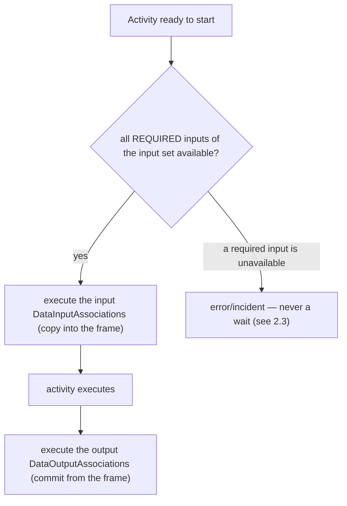

# ADR-011 — Process Data Flow

| Поле | Значение |
|---|---|
| Статус | Accepted |
| Версия | v.6 |
| Дата | 2026-07-13 |
| Владелец | Руслан Габитов |
| Уточняет | [ADR-001 v.6 Execution Model](ADR-001-execution-model.md) |

> EN-оригинал — канонический: [ADR-011-process-data-flow.md](ADR-011-process-data-flow.md). Этот файл — его перевод (twin).

> **Охват.** Решает **семантику data-flow слоя модели** движка — *что* вычисляется,
> когда данные пересекают activity или event: модель `ItemDefinition` /
> `IoSpec` / `InputSet` / `OutputSet` / `DataAssociation`, как выбирается input set,
> как data states гейтят этот выбор, как associations копируют данные, что может
> читать in-process service-код и какую форму должен принять слой модели. Это
> sibling [ADR-010 v.2](ADR-010-process-data-model.md): ADR-010 решил, **где**
> живут данные и против какого рантайм-контракта они вычисляются (container scopes,
> data plane, execution frames); этот ADR решает, **что** модель вычисляет против
> этого контракта. ADR-010 §2.6 явно отложил семантику данных слоя модели сюда.
> Долговременное хранение (будущий Persistence ADR), **layering** контрактов
> исполнителей в слое модели (layering ADR) и наблюдение данных экземпляра
> **извне** процесса (observability ADR) — вне охвата, см. §2.8.

## 1. Контекст

### 1.1 Что требует стандарт

BPMN 2.0 (§8.4.10, §10.4, §13.3.2) определяет точную модель того, как данные текут
в activities/events и из них.

- **Элементы типизированы, и item-aware-элементы их несут.** `ItemDefinition`
  описывает структуру (`structureRef`, `itemKind` Information/Physical,
  `isCollection`). Каждый несущий данные элемент — `DataObject`, `Property`,
  `DataInput`, `DataOutput` — является `ItemAwareElement`: он ссылается на
  `ItemDefinition` и несёт опциональный `dataState`. Стандарт делает семантику
  `dataState` **engine-defined** (§9), но трактует **availability** — держит ли
  элемент сейчас пригодное значение — как полноправное условие.
- **I/O activity объявляется через `InputOutputSpecification`.** Он держит
  упорядоченные `dataInputs`/`dataOutputs` и **минимум один** `InputSet` и
  **минимум один** `OutputSet`. `InputSet` — именованный набор `dataInputRefs`,
  вместе образующих *один корректный способ* стартовать activity; он может пометить
  часть как `optionalInputRefs` (могут быть недоступны на старте) или
  `whileExecutingInputRefs` (вычисляются во время выполнения). Порядок объявления
  `InputSet` **значим**. **Пустой** `InputSet` означает, что activity не нужны
  данные для старта.
- **Выбор input set упорядочен и гейтится доступностью** (§10.4.2). Когда activity
  готова, её `InputSet`'ы вычисляются в порядке объявления; выбирается **первый**,
  у которого все *required* входы доступны, и выполняется каждый
  `DataInputAssociation`, нацеленный на входы этого набора. Стандарт говорит: если
  ни один набор не доступен, activity **ждёт**, пока какой-то станет доступен
  (тайминг переоценки оставлен движку).
- **Output sets зеркалят входы, с IORule.** На завершении выбирается первый
  доступный `OutputSet` и выполняются его `DataOutputAssociation`'ы; если ни один
  не доступен, движок поднимает runtime-исключение. `InputSet` может через
  `outputSetRefs` зафиксировать, какие `OutputSet`'ы легально производить — это
  **IORule** — и несовпадение на завершении есть runtime-исключение.
- **Data associations копируют, в трёх формах** (§10.4.2). `DataAssociation`
  переносит данные из source(ов) в один target: выражение `transformation`, чей
  результат *замещает* target; или покомпонентные `assignment` `from`→`to`; или, при
  отсутствии обоих, простое копирование, допускающее **ровно один** source. Токены
  никогда не текут вдоль associations. Source в состоянии **unavailable** блокирует
  association.
- **Events несут данные без input sets** (§10.4.2). `DataInputAssociation`'ы throw-
  события заполняют его входы из контекста, когда оно срабатывает;
  `DataOutputAssociation`'ы catch-события проталкивают данные триггерящего элемента
  в контекст. У событий нет `InputSet`/`OutputSet`, и они никогда не ждут данных.
- **Вычисление синхронно жизненному циклу, копированием** (§9). Нет параллельного
  data plane; activity не становится Active, пока associations выбранного набора не
  завершатся, и не эмитит токены, пока не завершатся её output-associations. Каждая
  association — *копия*: позднейшие изменения source'а не распространяются.

### 1.2 Что есть в движке сегодня

ADR-010 решил рантайм data plane (per-instance container scopes, execution frame,
copy/commit-семантику, per-execution-экземпляры параметров), а собственные
приземления этого ADR (v.1–v.5) построили **слой модели** поверх него. По
состоянию на v.6 этот слой устоялся:

- Item-aware **модель на месте** — `ItemDefinition` / `ItemAwareElement` с закрытым
  трёхзначным состоянием (`Undefined` / `Unavailable` / `Ready`), `Parameter`,
  `DataAssociation`, `Property`, `DataObject`. Реифицированного типа `Set` **нет** —
  `IoSpec` владеет своими параметрами `DataInput` / `DataOutput` напрямую (v.2), с
  required / optional / while-executing как атрибутами на каждом параметре.
- **Single-set evaluation работает.** Один `InputSet` / один `OutputSet` на activity
  с реальной проверкой required-availability и выполнением associations;
  availability гейтит старт, но никогда не ждёт (§2.3). Упорядоченный
  многонаборный выбор и IORule-спаривание остаются умышленной не-целью (§2.8).
- **Слой модели был вычищен** (v.1–v.5) — единоличный I/O-граф, вычисление наборов
  отделено от хранения, value-vs-notification отделены, конструирование событий
  проверяется в compile-time, `Process.Validate()` на регистрации, и два прежних
  дефекта устранены.
- **In-process service-код читает данные.** Полиморфная `Operation` (§2.6, v.5):
  in-process Go-operation комбинирует узкий публичный reader над process properties
  + runtime-переменными (по имени или `SOURCE/addr` по ADR-010 §2.7) с опциональным
  message-I/O; external message operation остаётся message-only.

Чего слой **не умеет** — пробел, который закрывает v.6 — это дотянуться *внутрь*
значения. Структура `ItemDefinition` **непрозрачна**: значение плоское — скаляр
(`Variable`) или однородный список (`Array`), без record-вида и без видимой движку
формы, — так что mapping, associations, выражения и условия могут адресовать
*целое* значение, но не `order.items[0].price`, и не могут собрать вложенный выход
(§2.9).

### 1.3 Почему сейчас

Parallel gateway и data plane (ADR-005, ADR-010) сделали конкурентное, несущее
данные выполнение реальным. Слой модели теперь — ограничивающий фактор: работа по
завершению элементов (больше типов task и event), data-driven gateways и
по-настоящему полезный service API — всё стоит на устоявшейся концепции data-flow.
ADR-010 явно отложил этот слой; этот ADR его закрывает. **(v.6)** Теперь, когда этот
слой устоялся, ограничивающим фактором становится *структурная* дотяжка-внутрь —
выражениям, conditional/gateway-условиям и богатым input/output-mapping'ам всем
нужно видеть *внутрь* значений, чего непрозрачная структура поддержать не может;
§2.9 это закрывает. По нашему постоянному принципу — более ранний документ
поддерживает работу, а не клеткой её держит — там, где модель конфликтует с этой
концепцией, код чинится при реализации.

## 2. Решение

### 2.1 Item-aware-модель данных — стандартная, держится минимальной

gobpm держит BPMN item-aware-модель дословно в своём словаре: `ItemDefinition`
(структура, kind, флаг коллекции) типизирует каждый `ItemAwareElement` (`DataObject`,
`Property`, `DataInput`/`DataOutput` как `Parameter`). **Состояние** данных — забота
самого движка (§9), и gobpm определяет ровно три: **Undefined** (значение никогда не
ставилось), **Unavailable** (объявлено, но пока не держит пригодного значения),
**Ready** (держит пригодное значение). Этих трёх достаточно для выбора и гейтинга
associations; gobpm **не** вводит доменные значения `DataState` (Draft/Approved/…) —
это забота моделирования, которую процесс выражает своими данными, а не примитив
движка. Набор состояний закрыт решением; будущая нужда переоткрывает его здесь, а не
ad hoc.

**(v.6)** `structure`, которую типизирует `ItemDefinition`, больше не непрозрачна:
§2.9 делает её навигируемой композицией `scalar｜list｜record`, которую движок может
адресовать по пути. Модель состояний здесь и семантика наборов (§2.2/§2.3) не
затронуты — v.6 уточняет *какова форма значения*, а не *когда оно выбирается или
коммитится*.

### 2.2 Один input set и один output set на activity

У activity **ровно один** `InputSet` и **ровно один** `OutputSet` — минимум
кардинальности стандарта (≥1 каждого). Поскольку каждого всегда ровно один, gobpm
**не** реифицирует объект `Set`: input set активности **есть** её список параметров
`DataInput`, а output set — её список параметров `DataOutput`, держимые напрямую
`InputOutputSpecification`. `InputSet` / `OutputSet` остаются как **словарь BPMN**
для этих по-направленных списков, выставляемые как views `IoSpec`, а не как отдельный
stateful-тип (§2.7). gobpm **не** моделирует несколько наборов или упорядоченный
data-driven-выбор между ними; множественные I/O sets — явная не-цель (§2.8) по тому
же принципу, что и §2.3 — набор, *выбираемый тем, какие данные случайно доступны*,
есть скрытое, не-диаграммное ветвление, и любая реальная альтернатива моделируется
gateway'ем или boundary event.

Богатые внутринаборные различения, которые определяет стандарт, сохранены, как
**атрибуты на каждом параметре**, а не членство в наборе: `DataInput` **required**,
если не помечен `optional` (стандартные `optionalInputRefs` / атрибут `optional`, по
умолчанию `false`); `DataOutput` аналогично (`optionalOutputRefs`); `whileExecuting`
помечает нишевые входы/выходы, которые стандарт вычисляет *во время* выполнения.
Отброшен лишь много-наборный *выбор*.

- **Required vs. optional, внутри одного набора.** Вход *required*, если он не в
  `optionalInputRefs`. Когда activity готова, каждый **required** вход должен быть
  доступен; optional-вход может законно отсутствовать. Required-вход, который
  unavailable, есть ошибка (§2.3 — никогда не ожидание).
- **While-executing-входы.** `whileExecutingInputRefs` вычисляются *во время*
  выполнения, не на старте — хук, выставляемый жизненным циклом activity; они не
  гейтят старт.
- **Входы заполняют, выходы коммитят.** Input-associations выполняются, когда
  activity стартует, копируя в input-экземпляры execution frame (copy-семантика
  ADR-010); output-associations выполняются на завершении, коммитя из frame. Если
  не произведён выход там, где он требуется, это ошибка — gobpm никогда молча не
  производит ничего.
- **Пустые наборы полноправны.** Пустой `InputSet` означает «стартует без данных»;
  пустой `OutputSet` означает «не производит данных» — частый случай для нынешних
  task'ов, моделируемый явно, а не как вырожденный результат валидности.

Слой модели сформирован (§2.7) так, чтобы single-set evaluation был малым,
самодостаточным компонентом над списками параметров `IoSpec`. Концепция сужена до
одного набора; повторное введение нескольких наборов означало бы повторное введение
абстракции `Set` и упорядоченного выбора над ней — переформирование, а не drop-in-
расширение (§2.8) — принятый компромисс ради более простой модели.

### 2.3 Availability гейтит выбор; ожидания activity он никогда не вызывает

Стандарт говорит, что activity без доступного input set **ждёт**, пока какой-то
станет доступен. **gobpm это отвергает.** Ожидание доступности данных — это *скрытая
синхронизация*: токен сидит и ждёт условия, которое нигде не появляется на диаграмме
процесса, так что поведение ненаблюдаемо для моделлера и фактически не определено.
Это та же опасность, что gobpm избегает в синхронизации потока управления — неявные
гейты, которые диаграмма не показывает.

**Решение.** Когда activity готова и **ни один** `InputSet` не квалифицируется (ни у
одного набора не доступны все его required-входы), gobpm поднимает **ошибку /
инцидент** — не ждёт и не переоценивает. Аналогично unavailable required source
выбранной association или отсутствие доступного `OutputSet` на завершении есть
ошибка. Если процесс должен паузиться до появления каких-то данных, моделлер
выражает это **явно** — catch event'ом или gateway'ем, конструктом, видимым на
диаграмме, — а не опираясь на невидимый data-гейт.

> **Engine note — отклонение от BPMN §10.4.2.** Текст стандарта: *«Если НИ ОДИН
> InputSet не доступен, выполнение ждёт, пока условие не выполнится (тайм-аут вне
> охвата)».* gobpm умышленно не реализует это ожидание. **Состояние** доступности и
> различение **optional/required** сохранены — они решают, *какой* набор выбран и
> *какие* входы могут отсутствовать, — но *ожидание* заменено fail-fast-ошибкой.
> Обоснование: невидимое на диаграмме ожидание данных даёт непредсказуемое,
> немоделируемое поведение; явное ожидание принадлежит events/gateways. Это
> постоянная семантика gobpm, а не отсрочка.

### 2.4 Data associations копируют, в трёх формах стандарта

Вычисление `DataAssociation` следует §10.4.2 точно: выражение `transformation`, чей
результат **замещает** target; либо каждый `assignment`, вычисляемый `from`→`to`;
либо, при отсутствии обоих, **single-source** простое копирование. Каждая
association — **копия**: согласно frame/commit-модели ADR-010, значение, взятое во
вход, не отслеживает позднейшие изменения source'а. Source в состоянии
**Unavailable** блокирует свою association; по §2.3 это всплывает как неуспех выбора
или ошибка выполнения, никогда как ожидание. Формы, управляемые выражениями,
вычисляются через `ExpressionEngine` движка (ADR-002), так что язык
transformation/assignment сменяем.

### 2.5 Events несут данные без наборов

Throw- и catch-события следуют событийной модели стандарта (§10.4.2): input-
associations throw-события заполняют его входы из execution-окружения, когда оно
срабатывает; output-associations catch-события проталкивают данные триггерящего
элемента в окружение. У событий **нет** `InputSet`/`OutputSet` и, по §2.3 и по
стандарту равно, они **никогда не ждут данных** — throw-событие с unavailable
required-входом есть ошибка во время срабатывания. Особый случай уровня процесса
Start/End (process `DataInput`'ы как targets output-associations Start-события;
process `DataOutput`'ы как sources input-associations End-события) — часть концепции
и приземляется с работой по messaging/call-activity, которой он нужен.

### 2.6 Operation полиморфна по локусу исполнения; in-process-код комбинирует message- и reader-доступ

`Operation` у `ServiceTask` **полиморфна**. BPMN фиксирует *message-контракт*
Operation (`inMessageRef`/`outMessageRef`/`errorRef`), но оставляет *как* она
реализована engine-defined — `implementationRef` это подсказка о механизме
(`##WebService`, `##Unspecified` или vendor-specific). gobpm разделяет виды по
тому, **где исполняется реализация**, и позволяет in-process-коду **комбинировать**
свои методы доступа к данным, а не навязывает один:

- **External message operation (каноническая).** Out-of-process-реализация
  (web-сервис, коннектор — `Implementor`). Данные входят через `inMessage`
  operation (связанный с `DataInput`'ами activity через data associations) и
  выходят через `outMessage`; реализация видит **только своё сообщение**. Она
  message-only **по локусу** — out-of-process-сервис нельзя снабдить in-process-
  reader'ом — что и есть отвязанный conformant-путь для внешних сервисов.
- **In-process Go operation (gobpm-native).** In-process Go-functor. Он получает
  **узкий публичный read-only data reader** (адресуемые чтения data plane —
  [ADR-010 v.2 §2.7](ADR-010-process-data-model.md): default scope по простому
  имени, именованные источники по `SOURCE/var`, обнаружение `GetSources`/`List`)
  **и** своё **опциональное связанное входное сообщение**, может объявить
  **опциональное выходное сообщение** и **возвращает свой результат** (коммитится
  `ServiceTask`'ом, заполняя выходное сообщение, если оно объявлено). Message- и
  reader-доступ **комбинируются**: автор использует reader, message-I/O или оба —
  что нужно задаче. Это умышленное расширение message-only-Operation стандарта,
  зарегистрированное в охвате conformance
  ([SAD-001 v.1 §14.2](SAD-001-vision-and-architecture.md)); `implementationRef`
  помечает механизм.

Разделение — по **локусу исполнения**, а не по методу доступа к данным; это
исправление прежней формулировки «Go-вид message-free, message-вид не может
дотянуться до scope», которая ограничивала in-process-код без причины,
требуемой границей conformance. Сохраняемая граница: **ambient-доступ к scope
ограничен in-process-кодом**. Внешний сервис никогда не получает reader (не
может), так что канонический message-контракт остаётся чистым и отвязанным;
in-process-functor — код, исполняющийся *как часть* выполнения — свободно
комбинирует message-I/O и reader-доступ. Свойства reader'а:

- **Reader, а не окружение.** *Узкий read-only*-интерфейс, а не внутреннее
  рантайм-окружение. Service-код user-facing и не должен зависеть от внутренних
  типов движка; reader — публичная поверхность (его размещение относительно решения
  о layering — забота layering ADR, но его *существование и форма* решены здесь). Он
  предлагает read-by-name / read-by-id и больше ничего — ни мутации scope, ни
  жизненного цикла, ни доступа к событиям, и **никакой записи** (Go operation
  возвращает свой результат; `ServiceTask` коммитит его как выход activity).
- **Runtime-переменные читаются через data source `RUNTIME`.** Read-only-
  переменные движка (`STARTED_AT`, `STATE`, `TRACKS_CNT`, …) — именованный data
  source; functor читает их по явному пути `RUNTIME/<var>` (ADR-010 v.2 §2.7),
  который никогда не пересекается с собственными properties процесса — процесс
  может держать свой `STATE`. Адресация явная, а не скрытая.
- **Read, а не observe-from-outside.** Это *in-process*-доступ — код, исполняющийся
  *как часть* выполнения процесса. Наблюдение данных экземпляра *извне* (вызывающий,
  инспектирующий properties / runtime-переменные работающего экземпляра) — отдельная
  забота: публичный API движка сегодня write-only (§2.2 аудита), и это принадлежит
  observability ADR, не сюда.

Go operation таким образом — полноправный потребитель данных: она читает process
property (простое имя) и runtime-переменную (`RUNTIME/<var>`), а — когда задача
того требует — также потребляет/производит сообщения, возвращая свой результат
так, как должен уметь in-process Go-код, не компрометируя канонический (внешний)
message-контракт. Автор решает, комбинировать ли два метода доступа или
использовать один.

**Node-level** message-handling-шов (`SendTask`-производитель, `ReceiveTask`-
потребитель, throw/catch message-события) — например, role-интерфейсы
`MessageProducer` / `MessageConsumer` — отдельная забота, приземляемая вместе с
исполнителями `SendTask`/`ReceiveTask` (будущий SRD), где несколько реализаций
зафиксируют его форму; для in-process-комбинации выше он не нужен.

### 2.7 Слой модели сформирован под концепцию

Модель data-flow должна быть чистым фундаментом для §2.2–§2.6. gobpm предписывает
целевые формы (реализующий SRD делает файловую работу):

- **Нет типа `Set`; `IoSpec` владеет параметрами напрямую.** Поскольку у activity
  ровно один input- и один output-набор (§2.2), реифицированный объект `Set` не
  несёт информации сверх собственных по-направленных списков параметров
  `InputOutputSpecification`. Поэтому gobpm **отбрасывает тип `Set`**: `IoSpec`
  владеет своими параметрами `DataInput`/`DataOutput` напрямую, каждый несёт свои
  атрибуты `optional`/`whileExecuting`, и выставляет `InputSet()`/`OutputSet()` как
  views над этими списками. Это **замещает прежний двусторонний граф
  `Parameter`↔`Set`** (и единоличную ремедиацию, которой SRD-008 его упрочнял) — при
  отсутствии `Set` нет межтипового инварианта, который надо держать. У мутации один
  владелец — `IoSpec`.
- **Вычисление наборов — отдельная забота от хранения.** **Вычисление input/output
  set** (§2.2 — проверка required-availability, выполнение associations) — свой
  компонент над списками параметров `IoSpec`, а не методы, размазанные по типам
  хранения.
- **Значение держит данные; нотификация об изменениях отдельна.** Тип-значение
  коллекции держит элементы и ничего более. Нотификация об изменениях
  (callback/observer-механизм) — **отдельный opt-in-декоратор** над значением, а не
  встроена в него — и она не должна навязывать асинхронность синхронному вычислению,
  которого требует стандарт. (Где механизм нотификации позже понадобится — напр. для
  conditional events — он проектируется там, на этом отделённом шве, а не запекается
  в каждую коллекцию.)
- **Конструирование событий проверяется на уровне типов.** Восемь адаптерных
  интерфейсов с рантайм-type-assertion заменяются механизмом конструирования,
  спаривающим trigger с его видом события в compile-time (несовпадение trigger/event
  — ошибка сборки, а не рантайм-сюрприз). Activities и events сходятся на **одной**
  идиоме options, а не двух противоположных.
- **Процесс валидируется на регистрации.** `Process` получает явный `Validate()`
  (корректный граф: flows соединяют существующие узлы; нет висячих или
  неверно-типизированных элементов — непроверенные type assertions становятся
  защищёнными), исполняемый при регистрации процесса, **до** построения его
  snapshot'а, так что некорректный граф падает с понятной ошибкой вместо
  производства сломанного snapshot'а. Отдельный *freeze* не вводится: snapshot уже
  **является** замороженной моделью — `snapshot.New` копирует граф в свои maps, а
  работающий экземпляр исполняет его per-instance `Clone()`, так что живой `Process`
  никогда не читается во время выполнения и пост-регистрационная мутация не может
  достичь работающего экземпляра.
- **Два дефекта исправлены.** Листинг ключей коллекции возвращает набор индексов, а
  не срез двойной длины с нулевой половиной; удаление параметра мутирует через
  pointer receiver, а не копию. (Механически; названо здесь, чтобы концепция была
  полной, но проектного веса они не несут.)

### 2.8 Не-цели и вне охвата

- **Множественные input/output sets (не-цель — умышленное отклонение от BPMN).**
  gobpm моделирует ровно один `InputSet` и один `OutputSet` на activity (§2.2);
  упорядоченный, data-driven *выбор* среди нескольких наборов и IORule-спаривание
  (`outputSetRefs`/`inputSetRefs`) не реализованы. Обоснование: набор, выбираемый
  тем, какие данные доступны, — скрытое, не-диаграммное ветвление, та же опасность,
  что data wait (§2.3) и OR-join-синхронизация, — и на практике альтернативные
  input/output-режимы понятно моделируются gateways или boundary events. Различения
  optional/required и while-executing сохранены как атрибуты на каждом параметре
  внутри одного набора, так что ничего практического не теряется. Повторное введение
  нескольких наборов потребовало бы повторного введения абстракции `Set` и
  упорядоченного выбора над ней — переформирование, а не drop-in-расширение —
  принятый компромисс ради более простой single-set-модели (§2.7). Это отклонение и
  no-wait-отклонение (§2.3) зарегистрированы в охвате conformance движка
  ([SAD-001 v.1 §14.1](SAD-001-vision-and-architecture.md)).
- **Где живут данные и рантайм-контракт** — ADR-010 (container scopes, data plane,
  frames, copy/commit, last-committed-wins). Этот ADR вычисляет *против* этого
  контракта.
- **Долговременное хранение / сериализация** данных — будущий Persistence & State
  ADR.
- **Layering контрактов executor / reader** (в каком пакете живут публичный reader и
  интерфейсы node-executor'а, чтобы `pkg/model` перестал импортировать внутренние
  пакеты) — layering ADR. Этот ADR решает *существование и форму* reader'а; его
  *размещение* согласуется там.
- **Наблюдение данных экземпляра извне процесса** (вызывающий, читающий properties /
  runtime-переменные работающего экземпляра; write-only публичный API) —
  observability ADR.
- **Data-driven gateways и conditional events** (поток управления, реагирующий на
  данные) — работа по завершению элементов; они потребляют эту модель, но здесь не
  решаются. **(v.6)** Шов закоммиченных изменённых путей §2.9.4 — это субстрат, на
  который подписывается conditional event (переоценивать свой `condition`, когда
  меняется упомянутая переменная); сами события остаются работой по завершению
  элементов.
- **(v.6) Reflection на горячем пути.** Reflection на пути выполнения остаётся
  отвергнутой. *Ограниченное* исключение, которое даёт §2.9.5 — построение
  структурного адаптера типа **один раз на регистрации**, с кэшированием, заменяемое
  codegen'ом на каждый тип — это полный его объём; per-access-рефлективная навигация
  не реализуется.
- **(v.6) Полноценная схема / система типов.** Форма исследуется обходом графа
  значений (§2.9.1) для навигации и проверки записи, форсируемой владельцем; нет
  хранимого артефакта схемы, нет XSD-валидатора, нет языка ограничений, нет движка
  приведения типов — и разрешение `import` / `structureRef` во внешний XSD здесь не
  решается.
- **(v.6) Структура данных чужого провайдера.** Провайдер `SOURCE/addr` (ADR-010
  §2.7) держит своё адресное пространство непрозрачным; engine-native-структурная
  навигация — только для engine-managed-значений (§2.9.2).
- **Вид-значение map / словарь (признанное будущее расширение, не сейчас).**
  Решённый набор видов — `scalar｜list｜record` (§2.9.1). **map** — однородные
  значения под **данными**-ключами (произвольные строки, не идентификаторы-имена
  полей), адресуемые `["key"]` — это по-настоящему *отличный* вид от record
  (ключи record'а — это его схема; ключи map'а — данные) и *аддитивный*:
  capability-интерфейсная модель допускает способность `data.Map` рядом с
  `Record`/`Collection`, а грамматика путей — шаг `["key"]`, ничего приземлённого
  не задевая. Он **вне охвата до появления конкретного драйвера** — interop с
  Go-`map[K]V` (S4-tier адаптеров, где поле-map не может быть record'ом) или
  процесс, реально держащий словарь по данным-ключам — и тогда приземляется своим
  небольшим срезом, а не внутри S1–S4. Собственная модель BPMN его не требует (XSD
  — это record + list; map — удобство языка программирования), так что это не
  пробел по conformance.

### 2.9 Структурные данные: навигируемые значения (v.6)

§2.1 из v.1 держала `ItemDefinition.structure` **непрозрачной** — одно целое
`Value`, которое движок читает и пишет целиком. Этого хватало, пока activities
обменивались целыми скалярами и однородными списками. Работа над service-task и
mapping'ом обнажила пробел: mapping и условия могут адресовать **целое** значение,
но не могут дотянуться *внутрь* него — ни `order.items[0].price`, ни сборки
вложенного выхода. v.6 закрывает это, делая структуру полноправной, и делает это
**на условиях самого стандарта**: `ItemDefinition.structureRef` определён как
«конкретная структура данных (обычно XSD complex type или element)» (§8.4.10,
Table 8.47) — BPMN-данные *задуманы* структурированными; gobpm просто держал
структуру непрозрачной. Это расширяет §2.1 (item-модель), не переоткрывая §2.2/§2.3
(кардинальность наборов и правило no-wait не затронуты).

#### 2.9.1 Модель значений — `Record` присоединяется к `Collection` в семействе `Value`

Структура выражается **по-Go-шному — как опциональные capability-интерфейсы на
существующем `Value`**, а не как параллельная система типов node-tree. У движка уже
есть этот паттерн: `Collection` — опциональная list-способность, обнаруживаемая type
assertion'ом. v.6 зеркалит её **одной новой способностью**:

- **scalar** — `Value`, не реализующий ни одной способности (сегодняшний
  `Variable`); шаг пути внутрь него — чистая ошибка разрешения;
- **list** — `Value`, реализующий `Collection` (сегодняшний `Array`, переиспользуемый
  дословно; стандартный `isCollection` / XSD `maxOccurs > 1`);
- **record** — `Value`, реализующий новую способность **`Record`**: упорядоченные
  имена полей (`Keys`), чтение поля (`Field`), структурная запись поля (`SetField`) —
  набор элементов XSD complex type.

Набор видов — эти три. **map по данным-ключам** (однородные значения под
произвольными строковыми ключами, адресация `["key"]`) — признанный *аддитивный*
будущий вид: способность `data.Map` рядом с `Record`/`Collection`, отложенная до
появления конкретного драйвера (§2.8).

*Вид* узла — это **какую способность он реализует** (один type assertion); тип
листа — существующий `Value.Type()`. Вложенность композируется до **любой глубины**,
потому что значение поля может само быть `Record` или `Collection`. Поставляется
один новый конкретный тип — обобщённый, сохраняющий порядок вставки **`values.Record`**
— для динамических, собираемых движком данных; нативные Go-объекты удовлетворяют ту
же способность через адаптеры (§2.9.5), так что оба навигируются одинаково и
вкладываются друг в друга.

**Схема — не хранимый артефакт, это сам граф значений.** Форма исследуется
*обходом* тех же способностей (маленькие свободные хелперы: одноуровневый «поля и их
виды на этом пути» и полный обход-вглубь), так что нет отдельного типа схемы, который
надо объявлять или держать в синхроне; типизированное значение отвечает о своей форме
из своего Go-типа ещё до того, как держит данные. **Недоспецифицированный** элемент —
`itemSubjectRef` опущен, что стандарт явно позволяет (§10.4.1: «МОЖЕТ быть опущен,
если моделлер не хочет специфицировать структуру») — остаётся динамическим,
непрозрачным скаляром, ровно как сегодня. Навигация — это диспетчеризация методов над
этими интерфейсами; горячий путь выполнения **не выполняет reflection** (§2.9.5
ограничивает, где reflection может исполняться).

#### 2.9.2 Адресация по пути живёт в шве доступа к данным, а не в mapping'е

Дотяжка-внутрь — это `order.items[0].price`: `.field` спускается в **record**, `[i]`
индексирует **list**. Критически это свойство **доступа к данным** — резолвера
`data.Source` / scope — **а не** кода mapping'а. Так что **каждый** потребитель
навигирует через один резолвер: input mapping, output mapping, выражения и
**условия sequence-flow / gateway** (`ConditionalEventDefinition.condition` и
`conditionExpression` потока читают структурные пути так же).
`Source.Find(ctx, "order.items[0].price")` возвращает адресованный лист или
поддерево; gateway-условие `order.total > 100` разрешается через тот же обход пути.

**Согласование с ADR-010 v.2 §2.7 (адресуемый доступ).** ADR-010 уже владеет
адресным доступом к **чужим** данным через подключаемые провайдеры: ведущий split
`SOURCE/` (по первому `/`) выбирает провайдер и вручает ему **непрозрачный** адрес.
Это неизменно. Структурная адресация оперирует в **другом слое с другими
символами**: простое имя разрешается в значение как сегодня, затем `.`/`[]` идут
*внутрь* **engine-managed**-значения, которое движок может видеть. `/` — это **шов
провайдера** (внешние данные, структура непрозрачна движку, провайдер парсит свой
адрес); `.`/`[]` — это **структурная навигация** (engine-managed-данные, структура
видима движку). Они композируются без столкновения — `BUSINESS/order.items[0].price`
всё так же едет к провайдеру дословно, тогда как process-local-значение `order`
обходится нативно.

#### 2.9.3 Чтение и запись оба текут через путь

Путь разрешается на **обеих** сторонах. Чтение: адресовать лист или поддерево.
Запись: `WithOutputMapping` (и `DataOutputAssociation`) МОЖЕТ нацелиться на
вложенное поле — установить `order.items[0].price` или **собрать** record/list-выход —
закрывая пробел записи (сегодня mapping и associations замещают только **целые**
значения). Запись идёт к **родителю** и мутирует через его способность (`SetField` /
индексная запись коллекции), так что владелец форсирует свою собственную форму:
**типизированное** значение отвергает неизвестное поле или несовпадение типа *по
построению* (его `SetField` знает лишь свои реальные поля); **динамический**
`values.Record` пермиссивен и принимает собранные поля. Отсутствующие промежуточные
records на пути создаются, когда target это позволяет; нарушающая запись —
**ошибка**, никогда не молчаливое приведение — та же fail-loud-позиция, что «никогда
молча не производит ничего» из §2.2.

#### 2.9.4 Нотификация об изменениях через commit-diff — субстрат Conditional-Event

«Какие данные изменились» отвечается на **commit**, а не value-callback'ом. На
`Scope.Commit` scope **диффит** закоммиченный граф значений против его предыдущего и
производит **набор закоммиченных изменённых путей**, выставляемый как внутренний шов.
Это то переоткрытие, которое предвосхищало правило сопровождения §2.7 («изменение,
которому нужен in-value callback, переоткрывает соответствующее решение здесь») — и
оно решает **против** in-value callback'а, сохраняя разделение value-vs-notification
§2.7 нетронутым: значение никогда не встраивает нотификацию; **scope** обнаруживает
изменение на границе commit'а.

Обоснование, против подписки на каждый `Value`:

- **Корректная граница видимости.** §10.4.2 подшивает копии данных в переходы
  жизненного цикла activity (input-associations на Ready→Active, output на
  Completing→Completed), так что закоммиченное изменение переменной приземляется на
  границе activity — что и есть commit. Подписка на `Value` срабатывает на
  транзиентных, mid-activity frame-записях — а не на закоммиченном изменении
  переменной.
- **Устойчиво к модели выполнения.** Frame-clone-then-replace (ADR-010) сбрасывает
  callback'и значения при clone и замещает весь datum на commit, так что in-value-
  подписка хрупка по построению; scope владеет commit'ом, так что дифф авторитетен.
- **Один сигнал, много потребителей.** Набор изменённых путей питает
  **DataChange-observability сейчас** — v.6 наконец подшивает отложенные факты
  `KindDataChange` (один `Value_Added` / `Value_Updated` / `Value_Deleted` на
  изменённый путь, по ADR-013 v.2) — и делает **Conditional Events дешёвыми позже**:
  `ConditionalEventDefinition.condition` срабатывает, когда его условие становится
  истинным, что этот движок вычисляет при изменении переменных, на которые оно
  ссылается — ровно набор изменённых путей. v.6 строит шов и потребителя DataChange;
  потребитель conditional-event остаётся работой по завершению элементов (§2.8),
  теперь с субстратом, который его ждёт. Data plane никогда не именует своих
  потребителей.

**Дремлющий механизм in-value-подписки удаляется.** Существующая машинерия
`Updater` / `UpdateCallback` (per-value-регистрации с асинхронным per-value fan-out)
имеет ноль потребителей, не может пережить собственный clone/commit-цикл движка и
замещается этим решением — она удаляется первым срезом, переформировывающим типы
значений, по правилу stale-interface. **`ChangeType` (`Value_Added/Updated/Deleted`)
сохраняется и перенацеливается** как change-kind-словарь commit-diff'а — каждая
запись диффа — пара `(path, ChangeType)` — сохраняя wire-имена, которые фазы ADR-013
v.2 уже зеркалят.

#### 2.9.5 Go-interop: нативные объекты за per-type-адаптером, разрешаемым один раз

**Собственный Go-struct хоста участвует напрямую** — без конверсии, без
to/from-tree-кодека: объект удовлетворяет способности `Record`/`Collection`, и движок
навигирует **живое значение**. Как тип отвечает на эти способности — это per-type
**структурный адаптер**, разрешаемый **один раз** через реестр type→adapter (паттерн
type-cache из `encoding/json`) и кэшируемый; резолвер, записи, дифф и условия всегда
видят лишь capability-интерфейсы и никогда не знают, какой вид адаптера отвечает. Три
уровня, свободно **смешиваемые и вложенные** (record на рефлексии может содержать
сгенерированный):

- **dynamic** — `values.Record`/`values.Array` не нуждаются в адаптере вовсе: путь с
  нулевой настройкой для собираемых движком данных, любой глубины, без boilerplate'а;
- **reflection adapter (стандарт для нативных struct'ов, S4)** — строится **один раз
  на регистрации** обходом Go-типа, затем кэшируется; доступ к полю далее — вызов
  кэшированного аксессора. Ноль boilerplate'а, без build-шага — и **без per-access
  reflection**: это умышленное, *ограниченное* послабление anti-reflection-позиции
  движка — reflection может исполняться **один раз на тип, на регистрации, вне пути
  выполнения**, и нигде более (engine choice, фиксируемый в engine-choices-охвате
  SAD-001 при приземлении);
- **codegen adapter (per-type-апгрейд)** — инструмент `go:generate` эмитит тот же
  адаптер как статический код (маленькую per-type-таблицу аксессоров) из тех же
  struct-тегов; его сгенерированная регистрация вытесняет reflection-builder для этого
  типа. Полностью проверяемо компилятором (переименованное поле проваливает сборку, а
  не запуск), ноль reflection где-либо. Принятие его позже не требует **никакого
  изменения движка или потребителя** — тип апгрейдит уровень, добавив generate-
  директиву; ручное написание того же адаптера остаётся escape hatch'ем.

**Struct-теги конфигурируют построение адаптера, никогда не рантайм.** Теги
`gobpm:"..."` согласуют Go-именование с process-именованием (`ID` → `id`),
исключают поля и несут per-field-опции; и reflection-builder (на регистрации), и
генератор (на сборке) их читают — горячий путь читает лишь кэшированный адаптер.
Разделение стандарт-vs-апгрейд умышленно: reflection на регистрации даёт
беспроблемное принятие; codegen даёт compile-time-проверку полей и reflection-free-
бинарь — per-type-выбор, движимый нуждой, на одном шве.

#### 2.9.6 Фазирование — концепция сейчас, реализация срезами

Эта секция решает **всю** структурную модель; реализация приземляется
**инкрементально** (паттерн ADR-005 — решить один раз, строить срезами), каждый —
conformance-сохраняющий инкремент, приземляемый своим SRD:

- **S1 — модель значений + адресация read-path.** Способность `Record` и
  динамический `values.Record`; хелперы shape-by-traversal; разрешение пути в шве
  доступа к данным; **условия, выражения и mapping-чтения** навигируют структурные
  пути (acceptance-критерий §2.9.2). Дремлющая машинерия `Updater`/`UpdateCallback`
  удаляется здесь (§2.9.4 — типы значений так и так переформировываются); `ChangeType`
  сохраняется для S3.
- **S2 — write-path.** Вложенный set / build в output mapping и associations,
  проверки формы, форсируемые владельцем (§2.9.3).
- **S3 — commit-diff + DataChange-проводка.** Шов изменённых путей (§2.9.4),
  эмитящий `(path, ChangeType)`, и его первый потребитель — факты `KindDataChange`,
  отложенные ADR-013 v.2.
- **S4 — native-struct-interop.** Контракт структурного адаптера + реестр
  type→adapter, reflection-builder на регистрации и словарь тегов `gobpm:"..."`
  (§2.9.5). Codegen-генератор — **аддитивное продолжение** на том же шве — он не
  требует изменения движка и может приземлиться с S4 или после него.

ADR-011 v.6 **принят** (Accepted), как только S1 доказывает модель; S2–S4 уточняют
против неё.

## 3. Последствия

- **У I/O activity появляется реальная, гейтящаяся по доступности семантика.** Один
  input/output set получает подлинную проверку required-availability и выполнение
  associations — закрывая пробел data-binding движка (он стоял на частичной «default-
  Ready»-проверке) без сложности много-наборного выбора.
- **Поведение предсказуемо: нет скрытого data-driven-управления.** Процесс никогда
  молча не блокируется на невидимых условиях данных (нет ожидания, §2.3) и никогда
  молча не выбирает другой input/output-режим по доступным данным (нет много-
  наборного выбора, §2.8). Отсутствующие required-данные падают громко; и ожидание,
  и ветвление — всегда то, что диаграмма показывает. Два умышленных,
  задокументированных отклонения от стандарта, вытекающих из одного принципа.
- **Service-код становится реальным потребителем данных, не ломая стандарт.**
  `Operation` полиморфна по локусу исполнения: external message operation
  остаётся message-only (отвязанной, conformant — по локусу), а in-process Go
  operation комбинирует узкий публичный reader (process properties +
  runtime-переменные по имени) с опциональным message-I/O и берёт свой возврат —
  ambient-доступ к scope ограничен in-process-видом.
- **Слой модели становится проще и безопаснее.** Нет типа `Set` (`IoSpec` владеет
  параметрами напрямую), выбор, отделённый от хранения, value-vs-notification
  отделены, конструирование событий, проверяемое в compile-time, валидируемый процесс
  и оба дефекта устранены — фундамент, на котором строится последующая работа по
  элементам.
- **Цена: существенный рефакторинг слоя модели.** I/O-граф, тип-значение коллекции,
  event options и контейнер процесса все меняют форму; реализующий(е) SRD это
  стейджит и держит `make ci` зелёным на каждом шаге. Reader API добавляет параметр в
  сигнатуру реализации сервиса — изменение публичной поверхности, которое позже
  размещает layering ADR.
- **(v.6) Данные становятся навигируемыми от края до края.** Один резолвер путей в
  шве доступа к данным обслуживает чтения, записи, условия и выражения — дотягивание
  до `order.items[0].price` единообразно, без per-consumer-спецкейсов; whole-value-
  mapping остаётся вырожденным (empty-path) случаем.
- **(v.6) Отложенные факты DataChange получают дом.** Commit-diff (§2.9.4) — это
  сигнал, под который ADR-013 v.2 зарезервировал `KindDataChange`; его проводка не
  требует in-value callback'а, и тот же шов позже делает conditional events дешёвыми.
- **(v.6) Цена: новая способность, резолвер, дифф и шов адаптера.** Способность
  `Record` + `values.Record`, разрешение пути, commit-diff и реестр адаптеров с его
  reflection-builder'ом (позже codegen-генератор) — реальная новая поверхность,
  приземляемая срезами S1–S4 (§2.9.6), каждый держит `make ci` зелёным. Горячий путь
  выполнения остаётся reflection-free; ограниченное исключение на регистрации
  (§2.9.5) — единственное умышленное послабление, зафиксированное как engine choice.
- **Правило сопровождения.** Состояние данных остаётся закрытым набором из трёх
  значений (§2.1); availability гейтит выбор, но никогда не ждёт (§2.3); тип-значение
  никогда не встраивает нотификацию (§2.7). Изменение, которому нужно новое состояние
  данных или data wait, переоткрывает соответствующее решение здесь, а не обходит его.
  **(v.6) Вопрос in-value callback'а был переоткрыт и решён:** изменение обнаруживается
  через commit-diff на scope (§2.9.4), так что значение *по-прежнему* не встраивает
  нотификацию.

## 4. Рассмотренные альтернативы

- **Оставить единственную проверку «Ready ли default-params?».** Дёшево, но
  полностью игнорирует различение optional/required и гейтинг по доступности и молча
  неверно моделирует любой I/O spec, их использующий. Отвергнуто в пользу реального
  single-set evaluation (§2.2).
- **Реализовать полный multiple-set-выбор (§10.4.2 стандарта).** Упорядоченное
  вычисление нескольких `InputSet`'ов, first-available-выбор, IORule-спаривание.
  Соответствует букве, но это data-driven-ветвление, которое диаграмма не показывает
  — та же опасность скрытого управления, что data wait, — и на практике фича почти
  не используется (инструменты едва её выставляют; движки едва реализуют); любой
  реальный альтернативный input/output-режим понятнее как gateway. Отвергнуто по
  принципу моделирования (§2.8); повторное добавление было бы переформированием
  (повторным введением абстракции `Set`) — принятый компромисс ради более простой
  single-set-модели.
- **Реализовать data-availability-ожидание стандарта.** Соответствует букве, но
  вводит ровно ту скрытую, не-диаграммную синхронизацию, что gobpm отвергает (§2.3)
  — непредсказуемое, немоделируемое блокирование. Отвергнуто по принципу
  моделирования, не по цене.
- **Отложить ожидание, а не отвергнуть его** (первое предложение автора). Трактует
  ожидание как будущую цель, гейтящуюся на подписках об изменении данных. Отвергнуто
  владельцем: ожидание нежелательно *в принципе* (скрытая синхронизация), а не просто
  не реализовано — держать его целью значило бы приглашать повторное введение
  опасности. Fail-fast — постоянная семантика.
- **Передавать внутреннее рантайм-окружение в service-functor'ы.** Простейшая
  проводка, но протекает внутренними типами движка в user-facing service-код — ровно
  то layering-сцепление, которое позднейший ADR должен убрать, и трудно-сужаемая
  поверхность. Отвергнуто в пользу узкого публичного reader (§2.6).
- **Прикрутить reader к каждой operation** (форма §2.6 v.2). Даёт ambient-доступ на
  чтение *всем* сервисам, контаминируя message-only-Operation стандарта даже для
  внешних/conformant. Отвергнуто в пользу разделения по локусу (§2.6): external
  message operation остаётся чистой (она не может получить in-process-reader);
  ambient-доступ к scope ограничен in-process Go-видом, который стандарт уже
  санкционирует через engine-defined-механизм `implementationRef`.
- **Заставить in-process-вид быть message-free** (форма §2.6 v.3/v.4). Разделять
  виды по *методу доступа к данным* — message-only vs reader-only — так что Go-
  functor не мог бы также использовать сообщения. Отвергнуто (§2.6 v.5): граница
  conformance требует лишь того, чтобы *внешние* сервисы оставались message-only;
  ограничивать *in-process*-код от комбинирования message-I/O с reader-доступом
  излишне. Разделение — по локусу исполнения; in-process-авторы комбинируют оба
  метода.
- **Оставить формы слоя модели как есть и починить только два бага.** Лечит
  симптомы, оставляет двусторонний I/O-граф, in-value async-нотификации, event
  options с рантайм-assertion и незащищённый мутабельный процесс — структурный груз,
  отмеченный аудитом (3.1–3.3). Отвергнуто: концепции нужен чистый фундамент, а не
  залатанный.
- **Богатый/расширяемый `DataState`** (доменные состояния как примитив движка).
  Отвергнуто: стандарт делает доменные значения состояния заботой моделирования, а
  не движка; трёх состояний достаточно для выбора и гейтинга, а открытый набор
  добавляет поверхность без исполнительной семантики за ней.
- **(v.6) Дотяжка-внутрь только через провайдер** (расширить непрозрачное адресное
  пространство ADR-010). Реализовать `order.items[0].price` целиком как заботу
  провайдера — структурный/JSONPath-провайдер под `SOURCE/addr` плюс write-сторона на
  контракте провайдера. Отвергнуто: это оставляет структуру **непрозрачной движку**,
  так что условия и выражения нельзя ни валидировать по форме, ни оптимизировать, у
  нотификации об изменениях и codegen нет полноправного дома, и каждая структурная
  фича жила бы внутри каждого провайдера. Провайдеры остаются правильны для **чужих**
  данных (§2.9.2); engine-managed-данные заслуживают полноправного дерева.
- **(v.6) Параллельная система типов node-tree** (union `Node` — scalar/list/record
  — рядом с `Value`, плюс хранимая `Schema` и кодек `ToTree/FromTree`). Форма
  первого драфта. Отвергнуто как громоздкое и не-Go: две системы типов с адаптерами
  между ними, схема, которую надо объявлять и держать в синхроне, и кодек конверсии
  на каждый нативный тип. Выбранная модель расширяет существующее семейство `Value`
  одним capability-интерфейсом (`Record`, зеркалящим существующий `Collection`),
  выводит форму обходом и навигирует нативные объекты вживую (§2.9.1/§2.9.5).
- **(v.6) Рефлективная навигация на каждый доступ** (struct-теги + `reflect` на
  каждое чтение/запись). Путь с нулевым boilerplate'ом и без codegen. Отвергнуто: он
  стирает статическую типизацию и кладёт `reflect` на самый горячий путь движка. Его
  *ограниченный* родич — рефлексия **один раз на регистрации** в кэшированный адаптер
  — принят вместо него (§2.9.5): тот же нулевой boilerplate, без per-access
  reflection.
- **(v.6) Codegen как единственный путь для native-struct.** Полностью статичен и
  reflection-free, но делает build-шаг ценой входа — ненужное трение принятия, когда
  адаптер, построенный на регистрации, обслуживает тот же шов. Оставлен вместо этого
  как **per-type-апгрейд** (compile-time-проверка полей, reflection-free-бинарь) на
  том же реестре, принимаемый позже без изменения движка (§2.9.5).
- **(v.6) Нотификация об изменениях подпиской на каждый `Value`** (модель Camunda).
  Регистрировать callback на объекте-значении, срабатывать на изменение. Отвергнуто
  для *этой* модели выполнения (§2.9.4): frame-clone-then-replace сбрасывает callback'и
  при clone и меняет весь datum на commit, так что подписка хрупка, и она срабатывает
  на транзиентных frame-записях, а не на закоммиченных изменениях переменной.
  Commit-diff здесь и устойчивее, и лучше выровнен с boundary-scoped-семантикой
  копирования данных §10.4.2.

## 5. Рекомендации Enterprise-готовности

Совещательные, не гейтящие — конвенции, которым приземляющий(е) SRD и последующая
работа должны следовать:

- **Поднимать сбои data-flow как incidents, а не паники.** Unavailable required-вход
  или отсутствие доступного выхода там, где он требуется, — операционное событие,
  которое владелец процесса должен видеть и на которое должен реагировать.
  Моделировать как структурированный, классифицированный сбой (incident, когда
  приземлится работа по incident/fault-tolerance), несущий, какая activity и какой
  вход упали — никогда как голую ошибку или молчаливый no-op.
- **Валидировать I/O specs на сборке, не только в рантайме.** `Process.Validate()`
  (§2.7) должен отвергать некорректный `IoSpec` (нет input set, набор ссылается на
  необъявленный вход), когда модель строится, так что ошибки авторинга падают на
  конструировании с понятным сообщением, а не посреди выполнения.
- **Документировать no-wait-отклонение для моделлеров.** §2.3 — реальное расхождение
  с BPMN; user-facing-документация должна заявлять это прямо — «gobpm не ждёт данных;
  unavailable required-вход есть ошибка; ожидание моделируется event'ом/gateway'ем» —
  чтобы моделлер, пришедший с другого движка, не был удивлён.
- **Держать service reader read-only и минимальным.** Reader §2.6 не должен
  разрастаться в общий scope-handle; сервис, которому нужно *писать*, делает это
  через свои объявленные выходы, сохраняя copy/commit-дисциплину. Read-only reader
  держит service-код от сцепления с внутренностями движка.
- **Маскировать значения в data-flow-логах.** Логирование выбора набора и вычисления
  association помогает отладке, но логировать *имена, ids, состояния и доступность* —
  никогда значения, которые бизнес-чувствительны (согласно рекомендации ADR-010).

## 6. Открытые вопросы

- Нет. Охват одного набора (множественные I/O sets — не-цель), семантика
  availability/no-wait, форма service reader, закрытый набор data-state и целевые
  формы слоя модели — всё решено выше. **(v.6)** Модель способности `Record`,
  синтаксис адресации по пути и его согласование с ADR-010, обнаружение изменений
  через commit-diff (с удалением `Updater`) и interop через реестр адаптеров
  (reflection-стандарт, codegen-апгрейд, dynamic с нулевой настройкой) равным образом
  решены (§2.9). Точные сигнатуры `Record`/адаптера, парсер пути, хелперы обхода,
  алгоритм диффа, словарь тегов и секвенирование рефакторинга — заботы реализации для
  приземляющего(их) SRD, а не открытые концептуальные вопросы.

## 7. Ссылки

- [SAD-001 v.1 Vision & Architecture](SAD-001-vision-and-architecture.md) — §14
  Conformance & Compliance Scope; §14.1 регистрирует два умышленных BPMN-отклонения,
  которые решает этот ADR (правило no-wait §2.3, правило single-set §2.8).
- [ADR-001 v.6 Execution Model](ADR-001-execution-model.md) — двухслойный рантайм и
  жизненный цикл, которому синхронен этот data flow; сторона данных, которую он
  уточняет.
- [ADR-010 v.2 Process Data Model](ADR-010-process-data-model.md) — **где** живут
  данные и рантайм-контракт (container scopes, data plane, execution frames,
  copy/commit). §2.6 отложил семантику слоя модели, решённую здесь; этот ADR — его
  sibling-продолжение. **(v.6)** §2.7 адресуемый доступ — шов, который расширяет
  структурный обход пути (§2.9.2), а frame-clone-then-replace — причина, по которой
  обнаружение изменений — commit-diff (§2.9.4).
- [ADR-013 v.2 Instance Observability](ADR-013-instance-observability.md) — **(v.6)**
  факты `KindDataChange`, которые подшивает commit-diff §2.9.4; ADR-013 v.2 приземлил
  словарь и отложил эмиссию до этой переработки data plane.
- [ADR-006 v.2 Events & Subscriptions](ADR-006-events-and-subscriptions.md) —
  **(v.6)** conditional events, будущий потребитель шва закоммиченных изменённых путей
  §2.9.4 (`ConditionalEventDefinition.condition`, переоцениваемый при изменении
  упомянутой переменной); решено там, не здесь.
- [ADR-002 v.2 Extension Architecture](ADR-002-extension-architecture.md) —
  `ExpressionEngine`, через который вычисляются формы transformation/assignment
  association.
- BPMN 2.0 §8.4.10 (ItemDefinition, вкл. `structureRef` = «конкретная структура
  данных, обычно XSD complex type» — стандартная основа для record/list/scalar-дерева
  §2.9), §10.4 (Items and Data), §10.4.1 (`itemSubjectRef` МОЖЕТ быть опущен —
  недоспецифицированный/непрозрачный путь), §10.4.2 (Execution Semantics for Data —
  семантика изменений на границе commit'а), §13.3.2 (data binding) и
  `ConditionalEventDefinition.condition` (будущий потребитель §2.9.4) — item-aware-
  модель, структура, семантика association и IORule, которые этот ADR кодирует (и,
  для data wait, умышленно отклоняется); дайджест в spec-KB проекта
  (`docs/bpmn-spec/semantics/data.md`, `elements/data.md`).
- Architecture audit 2026-06-11 (`docs/audit/architecture-audit-2026-06-11.md`) —
  находки слоя модели, которые ремедиатит §2.7 этого ADR (1.6 data items; 3.1
  сложность I/O-spec и сцепление нотификации коллекции; 3.2 event-option-адаптеры;
  3.3 валидация процесса).
- Persistence & State ADR *(будущий)* — долговременная сериализация данных.
- Layering ADR *(будущий)* — размещение публичного service reader и контрактов
  node-executor.
- Observability ADR *(будущий)* — наблюдение данных экземпляра извне процесса.

## История документа

| Версия | Дата | Автор | Изменение |
|---|---|---|---|
| v.6 | 2026-07-13 | Руслан Габитов | **Draft.** Добавлена §2.9 **структурные данные — навигируемые значения**, закрывающая пробел «может адресовать целое значение, но не дотянуться *внутрь* него», обнажённый работой над service-task/mapping'ом. Заземлено на собственный `ItemDefinition.structureRef` стандарта («конкретная структура данных, обычно XSD complex type», §8.4.10). **Модель значений — по-Go-шному** (§2.9.1): существующее семейство `Value` получает один capability-интерфейс — **`Record`** (упорядоченные `Keys`/`Field`/`SetField`), зеркалящий существующий `Collection`; вид = какую способность реализует значение; вложенность композируется до любой глубины; один новый конкретный `values.Record` для динамических данных; **форма выводится обходом графа значений** (нет хранимого артефакта схемы); недоспецифицированные элементы остаются непрозрачными скалярами по §10.4.1. **Адресация по пути** (`order.items[0].price`) живёт в **шве доступа к данным** (§2.9.2) — один резолвер обслуживает mapping, выражения и **gateway/flow-условия**; согласовано с ADR-010 v.2 §2.7 (`/` выбирает провайдер, чужой+непрозрачный; `.`/`[]` обходят engine-managed-значения). **Чтение и запись** оба текут через путь (§2.9.3, форма, форсируемая владельцем: типизированные значения отвергают по построению, динамические records пермиссивны). **Обнаружение изменений — commit-diff** (§2.9.4 — scope диффит закоммиченные значения в набор `(path, ChangeType)`), выбранный против подписки на каждый `Value` (хрупкой под frame-clone-then-replace; commit — граница activity, на которую приземляются копии данных §10.4.2); он даёт дом фактам `KindDataChange`, отложенным ADR-013 v.2, является будущим субстратом для conditional events (ADR-006) и **удаляет дремлющую машинерию `Updater`/`UpdateCallback`** (ноль потребителей; `ChangeType` перенацелен как словарь диффа). **Native-struct-interop едет на реестре per-type-адаптеров** (§2.9.5): динамическим значениям адаптер не нужен; **reflection-builder на регистрации — стандарт** (reflect один раз на тип, кэшируется, вне пути выполнения — умышленное *ограниченное* послабление anti-reflection-позиции, фиксируемое как engine choice в SAD-001); **codegen-генератор — per-type-апгрейд** на том же шве (compile-checked, reflection-free, принимаемый позже без изменения движка); struct-теги `gobpm:"..."` конфигурируют лишь построение адаптера. Reflection на горячем пути остаётся отвергнутой. Фазировано **S1–S4** (§2.9.6 — принято, как только S1 доказывает модель). Соблюдает разделение value-vs-notification §2.7 и оставляет §2.2/§2.3 нетронутыми. Также обновлена §1.2 до post-v.5-текущего состояния (по правилу ревью current-state-freshness). Правит §1.2/§1.3/§2.1/§2.8/§3/§4/§6/§7; добавляет ссылки ADR-013 v.2, ADR-006 v.2. Приземляется через структурно-data SRD(ы). |
| v.5 | 2026-06-14 | Руслан Габитов | §2.6 уточнён: виды разделены по **локусу исполнения**, а не по методу доступа к данным. Прежняя формулировка «Go-вид message-free, message-вид не может дотянуться до scope» ограничивала in-process-код излишне. Новая форма: **external message operation** (`Implementor`, out-of-process) message-only **по локусу** (не может получить in-process-reader — отвязанный conformant-путь); **in-process Go operation** получает reader **и** своё опциональное связанное входное сообщение, может объявить опциональное выходное сообщение и возвращает результат — message- и reader-доступ **комбинируются**, на выбор автора. Сохраняемая граница: ambient-доступ к scope ограничен in-process-кодом. Node-level message-handling-шов (`MessageProducer`/`MessageConsumer` для `SendTask`/`ReceiveTask`/throw-catch-событий) отложен до SRD исполнителей. Правит §2.6/§3/§4. Приземляется через SRD-011. |
| v.4 | 2026-06-13 | Руслан Габитов | §2.6 приведён в соответствие с моделью data-source-доступа: Go reader — публичное лицо адресуемого интерфейса чтения data plane ([ADR-010 v.2 §2.7](ADR-010-process-data-model.md)) — default scope по простому имени, именованные источники по `SOURCE/var`, обнаружение через `GetSources`/`List`. Runtime-переменные читаются по явному пути `RUNTIME/<var>` (именованный data source), **а не** «по имени с reader'ом, прячущим зарезервированную адресацию» (снято) — так runtime-переменные движка никогда не пересекаются с собственными `STATE`/`INSTANCE` процесса. Специальный аксессор не нужен. Приземляется через SRD-010 (data plane) + SRD-011 (service reader). Правит §2.6. |
| v.3 | 2026-06-13 | Руслан Габитов | Переформирован §2.6: `Operation` **полиморфна**, а не «reader, вручённый каждой operation». Заземляя стандарт — Operation это чистый message-in/message-out-контракт (`inMessageRef`/`outMessageRef`/`errorRef`), а `implementationRef` оставляет механизм engine-defined — gobpm делает `Operation` интерфейсом с двумя видами: **message operation** (каноническая, отвязанная, message-only) и **Go operation** (gobpm-native: in-process-functor получает узкий публичный read-only data reader над process properties + runtime-vars-by-name и **возвращает свой результат**, без message-церемонии). Это держит каноническую модель чистой и ограничивает ambient-доступ на чтение явным Go-видом (санкционированный стандартом механизм `implementationRef`), вместо контаминации каждой operation. Go operation зарегистрирована как умышленное расширение в SAD-001 v.1 §14.1. Приземляется через service-reader SRD. Правит §2.6/§3/§4. |
| v.2 | 2026-06-13 | Руслан Габитов | Отброшен реифицированный тип `Set`. При ровно одном input/output-наборе на activity (§2.2) объект `Set` лишь дублировал по-направленные списки параметров `IoSpec`; теперь `IoSpec` владеет своими параметрами `DataInput`/`DataOutput` напрямую, с **required/optional/while-executing как атрибутами на каждом параметре** (`optional` по умолчанию `false`), а не членством в наборе. `InputSet`/`OutputSet` оставлены как словарь BPMN (views `IoSpec`), а не stateful-тип. Замещает единоличный граф `Parameter`↔`Set` из §2.7 v.1 (приземлён SRD-008) — при отсутствии `Set` межтипового графа нет. §2.8: повторное введение нескольких наборов теперь было бы переформированием (повторным введением `Set`), а не drop-in-расширением — принятый компромисс ради более простой модели. Приземляется через SRD-009. Правит §2.2/§2.7/§2.8/§3/§4. |
| v.1 | 2026-06-13 | Руслан Габитов | **Принято**, первая часть упрочнения слоя модели приземлена через SRD-008 v.1 (`f920b11`, `3658acc`, `7bba5e6`); §2.7 «freeze after snapshot» было снято при этом приземлении (snapshot уже является замороженной моделью) — оставлено здесь как решение «валидация на регистрации». Семантика evaluation/reader §2.2–§2.6 и отложенные пункты §2.7 (разделение value/notification, унификация event-options) приземляются через последующие SRD'ы. Решает семантику data-flow слоя модели (слой, отложенный ADR-010 §2.6): item-aware-модель с закрытым набором из трёх состояний данных; **ровно один `InputSet` и один `OutputSet` на activity** с реальной проверкой required-availability и выполнением associations — множественные I/O sets и их упорядоченный, data-driven-выбор + IORule-спаривание являются явной **не-целью** (скрытое не-диаграммное ветвление, почти не используется на практике, моделируется gateways; структура оставлена расширяемой, если когда-то потребуется); **availability гейтит старт, но никогда не вызывает ожидания activity** — умышленное задокументированное отклонение от §10.4.2 (data wait — скрытая, не-диаграммная синхронизация → непредсказуемо; unavailable required-вход есть ошибка, явное ожидание моделируется events/gateways); optional/required и while-executing оставлены *внутри* одного набора; data associations копируют в трёх формах стандарта; events несут данные без наборов и никогда не ждут; in-process service-код получает **узкий публичный data reader** (чтение по name/id над входами operation, properties и runtime-переменными — runtime-переменные адресуемы по имени); и слой модели переформирован (единоличный I/O-граф, вычисление наборов отделено от хранения, value-vs-notification отделены, конструирование событий проверяется в compile-time, `Process.Validate()` исполняется на регистрации (без freeze — snapshot уже является замороженной моделью), дефекты GetKeys/RemoveParameter исправлены). Два умышленных BPMN-отклонения (нет data wait, нет множественных I/O sets) из одного принципа — нет скрытого data-driven-управления. Уточняет ADR-001 v.5 (сторона данных); sibling ADR-010 v.1. Вне охвата: persistence, layering executor/reader, observe-from-outside, data-driven gateways. Отвергнуто: частичная «default-Ready»-проверка, полный multi-set-выбор, стандартный data wait, отсрочка (vs отвержение) ожидания, протекание рантайм-env в functor'ы, only-bugfix, расширяемый DataState. |
