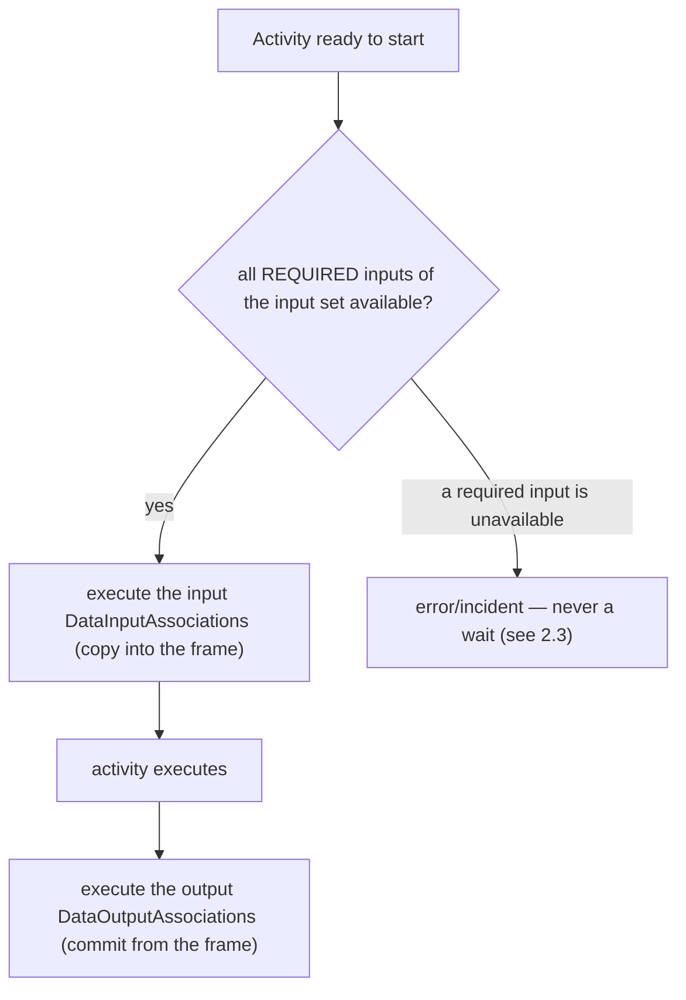

# ADR-011 — Process Data Flow

| Поле | Значение |
|---|---|
| Статус | Принято |
| Версия | v.2 |
| Дата | 2026-06-13 |
| Владелец | Руслан Габитов |
| Уточняет | [ADR-001 v.5 Execution Model](ADR-001-execution-model.md) |

> EN-оригинал — канонический: [ADR-011-process-data-flow.md](ADR-011-process-data-flow.md). Этот файл — его перевод (twin).

> **Охват.** Решает **семантику data-flow слоя модели** движка — *что* вычисляется,
> когда данные пересекают activity или event: модель `ItemDefinition` /
> `IoSpec` / `InputSet` / `OutputSet` / `DataAssociation`, как выбирается input set,
> как data states гейтят этот выбор, как associations копируют данные, что может
> читать in-process service-код и какую форму должен принять слой модели. Это
> sibling [ADR-010 v.1](ADR-010-process-data-model.md): ADR-010 решил, **где**
> живут данные и против какого рантайм-контракта они вычисляются (container scopes,
> data plane, execution frames); этот ADR решает, **что** модель вычисляет против
> этого контракта. ADR-010 §2.6 явно отложил семантику данных слоя модели сюда.
> Долговременное хранение (будущий Persistence ADR), **layering** контрактов
> исполнителей в слое модели (layering ADR) и наблюдение данных экземпляра
> **извне** процесса (observability ADR) — вне охвата, см. §2.8.

## 1. Контекст

### 1.1 Что требует стандарт

BPMN 2.0 (§8.4.10, §10.4, §13.3.2) определяет точную модель того, как данные текут
в activities/events и из них.

- **Элементы типизированы, и item-aware-элементы их несут.** `ItemDefinition`
  описывает структуру (`structureRef`, `itemKind` Information/Physical,
  `isCollection`). Каждый несущий данные элемент — `DataObject`, `Property`,
  `DataInput`, `DataOutput` — является `ItemAwareElement`: он ссылается на
  `ItemDefinition` и несёт опциональный `dataState`. Стандарт делает семантику
  `dataState` **engine-defined** (§9), но трактует **availability** — держит ли
  элемент сейчас пригодное значение — как полноправное условие.
- **I/O activity объявляется через `InputOutputSpecification`.** Он держит
  упорядоченные `dataInputs`/`dataOutputs` и **минимум один** `InputSet` и
  **минимум один** `OutputSet`. `InputSet` — именованный набор `dataInputRefs`,
  вместе образующих *один корректный способ* стартовать activity; он может пометить
  часть как `optionalInputRefs` (могут быть недоступны на старте) или
  `whileExecutingInputRefs` (вычисляются во время выполнения). Порядок объявления
  `InputSet` **значим**. **Пустой** `InputSet` означает, что activity не нужны
  данные для старта.
- **Выбор input set упорядочен и гейтится доступностью** (§10.4.2). Когда activity
  готова, её `InputSet`'ы вычисляются в порядке объявления; выбирается **первый**,
  у которого все *required* входы доступны, и выполняется каждый
  `DataInputAssociation`, нацеленный на входы этого набора. Стандарт говорит: если
  ни один набор не доступен, activity **ждёт**, пока какой-то станет доступен
  (тайминг переоценки оставлен движку).
- **Output sets зеркалят входы, с IORule.** На завершении выбирается первый
  доступный `OutputSet` и выполняются его `DataOutputAssociation`'ы; если ни один
  не доступен, движок поднимает runtime-исключение. `InputSet` может через
  `outputSetRefs` зафиксировать, какие `OutputSet`'ы легально производить — это
  **IORule** — и несовпадение на завершении есть runtime-исключение.
- **Data associations копируют, в трёх формах** (§10.4.2). `DataAssociation`
  переносит данные из source(ов) в один target: выражение `transformation`, чей
  результат *замещает* target; или покомпонентные `assignment` `from`→`to`; или, при
  отсутствии обоих, простое копирование, допускающее **ровно один** source. Токены
  никогда не текут вдоль associations. Source в состоянии **unavailable** блокирует
  association.
- **Events несут данные без input sets** (§10.4.2). `DataInputAssociation`'ы throw-
  события заполняют его входы из контекста, когда оно срабатывает;
  `DataOutputAssociation`'ы catch-события проталкивают данные триггерящего элемента
  в контекст. У событий нет `InputSet`/`OutputSet`, и они никогда не ждут данных.
- **Вычисление синхронно жизненному циклу, копированием** (§9). Нет параллельного
  data plane; activity не становится Active, пока associations выбранного набора не
  завершатся, и не эмитит токены, пока не завершатся её output-associations. Каждая
  association — *копия*: позднейшие изменения source'а не распространяются.

### 1.2 Что есть в движке сегодня

ADR-010 уже решил рантайм data plane: per-instance container scopes, execution
frame, copy/commit-семантику, per-execution-экземпляры параметров. Однако **слой
модели**, который эти frames вычисляют, частичен и неровен:

- Item-aware **типы существуют** — `ItemDefinition`, `ItemAwareElement` с
  полноправным состоянием (`Undefined` / `Unavailable` / `Ready`), `Parameter`,
  `Set`, `DataAssociation`, `Property`, `DataObject`. *Отслеживание* состояния и
  *per-association* проверки доступности присутствуют.
- **Выбора input set не существует.** Нет упорядоченного вычисления `InputSet`'ов,
  нет first-available-выбора, нет различения `optionalInputRefs` /
  `whileExecutingInputRefs`, нет выбора `OutputSet` и нет IORule-проверки.
  Единственная структурная проверка корректности («Ready ли default-параметры этого
  набора?») заменяет собой весь алгоритм §10.4.2.
- **Формы слоя модели накопили проблемы.** Граф `IoSpec`↔`Parameter`↔`Set` —
  большая, двусторонняя, взаимно-ссылочная структура, обязанная синхронно держать
  инварианты между типами. Тип-значение коллекции встраивает callback-систему
  нотификации об изменениях, срабатывающую асинхронно в горутинах — внутри модели,
  чьё вычисление стандарт требует синхронным. Конструирование событий идёт через
  восемь адаптерных интерфейсов, разрешаемых рантайм type assertion'ом, так что
  несовпадение пары trigger/event всплывает в рантайме, а не в compile-time.
  Контейнер процесса свободно мутабелен и невалидируем, так что некорректный граф
  (flow на отсутствующий узел, элемент с неверным типом) ловится поздно, глубоко в
  выполнении, или вовсе не ловится. Существуют два прямых дефекта (листинг ключей
  коллекции, возвращающий срез двойной длины с нулевой половиной; удаление
  параметра на value receiver, мутирующее копию).
- **In-process service-код голодает по данным.** Operation `ServiceTask`'а
  исполняет Go-functor, но functor получает лишь item входного сообщения своей
  operation — а не per-execution-окружение. Окружение уже умеет читать process
  properties по имени; functor'у просто никогда не передают reader. Так что
  service-код не может прочитать process property или runtime-переменную по имени,
  хотя data plane выставляет ровно это.

### 1.3 Почему сейчас

Parallel gateway и data plane (ADR-005, ADR-010) сделали конкурентное, несущее
данные выполнение реальным. Слой модели теперь — ограничивающий фактор: работа по
завершению элементов (больше типов task и event), data-driven gateways и
по-настоящему полезный service API — всё стоит на устоявшейся концепции data-flow.
ADR-010 явно отложил этот слой; этот ADR его закрывает. По нашему постоянному
принципу — более ранний документ поддерживает работу, а не клеткой её держит — там,
где модель конфликтует с этой концепцией, код чинится при реализации.

## 2. Решение

### 2.1 Item-aware-модель данных — стандартная, держится минимальной

gobpm держит BPMN item-aware-модель дословно в своём словаре: `ItemDefinition`
(структура, kind, флаг коллекции) типизирует каждый `ItemAwareElement` (`DataObject`,
`Property`, `DataInput`/`DataOutput` как `Parameter`). **Состояние** данных — забота
самого движка (§9), и gobpm определяет ровно три: **Undefined** (значение никогда не
ставилось), **Unavailable** (объявлено, но пока не держит пригодного значения),
**Ready** (держит пригодное значение). Этих трёх достаточно для выбора и гейтинга
associations; gobpm **не** вводит доменные значения `DataState` (Draft/Approved/…) —
это забота моделирования, которую процесс выражает своими данными, а не примитив
движка. Набор состояний закрыт решением; будущая нужда переоткрывает его здесь, а не
ad hoc.

### 2.2 Один input set и один output set на activity

У activity **ровно один** `InputSet` и **ровно один** `OutputSet` — минимум
кардинальности стандарта (≥1 каждого). Поскольку каждого всегда ровно один, gobpm
**не** реифицирует объект `Set`: input set активности **есть** её список параметров
`DataInput`, а output set — её список параметров `DataOutput`, держимые напрямую
`InputOutputSpecification`. `InputSet` / `OutputSet` остаются как **словарь BPMN**
для этих по-направленных списков, выставляемые как views `IoSpec`, а не как отдельный
stateful-тип (§2.7). gobpm **не** моделирует несколько наборов или упорядоченный
data-driven-выбор между ними; множественные I/O sets — явная не-цель (§2.8) по тому
же принципу, что и §2.3 — набор, *выбираемый тем, какие данные случайно доступны*,
есть скрытое, не-диаграммное ветвление, и любая реальная альтернатива моделируется
gateway'ем или boundary event.

Богатые внутринаборные различения, которые определяет стандарт, сохранены, как
**атрибуты на каждом параметре**, а не членство в наборе: `DataInput` **required**,
если не помечен `optional` (стандартные `optionalInputRefs` / атрибут `optional`, по
умолчанию `false`); `DataOutput` аналогично (`optionalOutputRefs`); `whileExecuting`
помечает нишевые входы/выходы, которые стандарт вычисляет *во время* выполнения.
Отброшен лишь много-наборный *выбор*.

- **Required vs. optional, внутри одного набора.** Вход *required*, если он не в
  `optionalInputRefs`. Когда activity готова, каждый **required** вход должен быть
  доступен; optional-вход может законно отсутствовать. Required-вход, который
  unavailable, есть ошибка (§2.3 — никогда не ожидание).
- **While-executing-входы.** `whileExecutingInputRefs` вычисляются *во время*
  выполнения, не на старте — хук, выставляемый жизненным циклом activity; они не
  гейтят старт.
- **Входы заполняют, выходы коммитят.** Input-associations выполняются, когда
  activity стартует, копируя в input-экземпляры execution frame (copy-семантика
  ADR-010); output-associations выполняются на завершении, коммитя из frame. Если
  не произведён выход там, где он требуется, это ошибка — gobpm никогда молча не
  производит ничего.
- **Пустые наборы полноправны.** Пустой `InputSet` означает «стартует без данных»;
  пустой `OutputSet` означает «не производит данных» — частый случай для нынешних
  task'ов, моделируемый явно, а не как вырожденный результат валидности.

Слой модели сформирован (§2.7) так, чтобы single-set evaluation был малым,
самодостаточным компонентом над списками параметров `IoSpec`. Концепция сужена до
одного набора; повторное введение нескольких наборов означало бы повторное введение
абстракции `Set` и упорядоченного выбора над ней — переформирование, а не drop-in-
расширение (§2.8) — принятый компромисс ради более простой модели.

### 2.3 Availability гейтит выбор; ожидания activity он никогда не вызывает

Стандарт говорит, что activity без доступного input set **ждёт**, пока какой-то
станет доступен. **gobpm это отвергает.** Ожидание доступности данных — это *скрытая
синхронизация*: токен сидит и ждёт условия, которое нигде не появляется на диаграмме
процесса, так что поведение ненаблюдаемо для моделлера и фактически не определено.
Это та же опасность, что gobpm избегает в синхронизации потока управления — неявные
гейты, которые диаграмма не показывает.

**Решение.** Когда activity готова и **ни один** `InputSet` не квалифицируется (ни у
одного набора не доступны все его required-входы), gobpm поднимает **ошибку /
инцидент** — не ждёт и не переоценивает. Аналогично unavailable required source
выбранной association или отсутствие доступного `OutputSet` на завершении есть
ошибка. Если процесс должен паузиться до появления каких-то данных, моделлер
выражает это **явно** — catch event'ом или gateway'ем, конструктом, видимым на
диаграмме, — а не опираясь на невидимый data-гейт.

> **Engine note — отклонение от BPMN §10.4.2.** Текст стандарта: *«Если НИ ОДИН
> InputSet не доступен, выполнение ждёт, пока условие не выполнится (тайм-аут вне
> охвата)».* gobpm умышленно не реализует это ожидание. **Состояние** доступности и
> различение **optional/required** сохранены — они решают, *какой* набор выбран и
> *какие* входы могут отсутствовать, — но *ожидание* заменено fail-fast-ошибкой.
> Обоснование: невидимое на диаграмме ожидание данных даёт непредсказуемое,
> немоделируемое поведение; явное ожидание принадлежит events/gateways. Это
> постоянная семантика gobpm, а не отсрочка.

### 2.4 Data associations копируют, в трёх формах стандарта

Вычисление `DataAssociation` следует §10.4.2 точно: выражение `transformation`, чей
результат **замещает** target; либо каждый `assignment`, вычисляемый `from`→`to`;
либо, при отсутствии обоих, **single-source** простое копирование. Каждая
association — **копия**: согласно frame/commit-модели ADR-010, значение, взятое во
вход, не отслеживает позднейшие изменения source'а. Source в состоянии
**Unavailable** блокирует свою association; по §2.3 это всплывает как неуспех выбора
или ошибка выполнения, никогда как ожидание. Формы, управляемые выражениями,
вычисляются через `ExpressionEngine` движка (ADR-002), так что язык
transformation/assignment сменяем.

### 2.5 Events несут данные без наборов

Throw- и catch-события следуют событийной модели стандарта (§10.4.2): input-
associations throw-события заполняют его входы из execution-окружения, когда оно
срабатывает; output-associations catch-события проталкивают данные триггерящего
элемента в окружение. У событий **нет** `InputSet`/`OutputSet` и, по §2.3 и по
стандарту равно, они **никогда не ждут данных** — throw-событие с unavailable
required-входом есть ошибка во время срабатывания. Особый случай уровня процесса
Start/End (process `DataInput`'ы как targets output-associations Start-события;
process `DataOutput`'ы как sources input-associations End-события) — часть концепции
и приземляется с работой по messaging/call-activity, которой он нужен.

### 2.6 In-process service-код читает данные по имени через узкий reader

Реализация сервиса (сегодня — Go-functor за operation'ом `ServiceTask`'а)
**получает узкий публичный data reader** в дополнение к входу своей operation.
Reader выставляет доступ на чтение **по имени** и **по item-definition id** над
данными выполнения — входами его operation, process properties в области видимости и
runtime-переменными движка — резолвя нормальным для выполнения обходом
frame→container (ADR-010).

- **Reader, а не окружение.** Сервису передаётся *узкий read-only*-интерфейс, а не
  внутреннее рантайм-окружение. Service-код user-facing и не должен зависеть от
  внутренних типов движка; reader — публичная поверхность (его размещение
  относительно решения о layering — забота layering ADR, но его *существование и
  форма* решены здесь). Он предлагает read-by-name / read-by-id и больше ничего — ни
  мутации scope, ни жизненного цикла, ни доступа к событиям.
- **Runtime-переменные адресуемы по имени.** Движок выставляет малый набор runtime-
  переменных (`STARTED_AT`, `STATE`, `TRACKS_CNT`) в зарезервированной read-only-
  области data plane. Reader резолвит их **по их именам** наряду с process
  properties, так что service-код может их читать, не зная зарезервированной
  адресации — reader её прячет.
- **Read, а не observe-from-outside.** Это *in-process*-доступ — код, исполняющийся
  *как часть* выполнения процесса. Наблюдение данных экземпляра *извне* (вызывающий,
  инспектирующий properties / runtime-переменные работающего экземпляра) — отдельная
  забота: публичный API движка сегодня write-only (§2.2 аудита), и это принадлежит
  observability ADR, не сюда.

Это делает сервис полноправным потребителем данных: он может прочитать process
property и runtime-переменную по имени и действовать на их основе — так, как должен
уметь in-process Go-код.

### 2.7 Слой модели сформирован под концепцию

Модель data-flow должна быть чистым фундаментом для §2.2–§2.6. gobpm предписывает
целевые формы (реализующий SRD делает файловую работу):

- **Нет типа `Set`; `IoSpec` владеет параметрами напрямую.** Поскольку у activity
  ровно один input- и один output-набор (§2.2), реифицированный объект `Set` не
  несёт информации сверх собственных по-направленных списков параметров
  `InputOutputSpecification`. Поэтому gobpm **отбрасывает тип `Set`**: `IoSpec`
  владеет своими параметрами `DataInput`/`DataOutput` напрямую, каждый несёт свои
  атрибуты `optional`/`whileExecuting`, и выставляет `InputSet()`/`OutputSet()` как
  views над этими списками. Это **замещает прежний двусторонний граф
  `Parameter`↔`Set`** (и единоличную ремедиацию, которой SRD-008 его упрочнял) — при
  отсутствии `Set` нет межтипового инварианта, который надо держать. У мутации один
  владелец — `IoSpec`.
- **Вычисление наборов — отдельная забота от хранения.** **Вычисление input/output
  set** (§2.2 — проверка required-availability, выполнение associations) — свой
  компонент над списками параметров `IoSpec`, а не методы, размазанные по типам
  хранения.
- **Значение держит данные; нотификация об изменениях отдельна.** Тип-значение
  коллекции держит элементы и ничего более. Нотификация об изменениях
  (callback/observer-механизм) — **отдельный opt-in-декоратор** над значением, а не
  встроена в него — и она не должна навязывать асинхронность синхронному вычислению,
  которого требует стандарт. (Где механизм нотификации позже понадобится — напр. для
  conditional events — он проектируется там, на этом отделённом шве, а не запекается
  в каждую коллекцию.)
- **Конструирование событий проверяется на уровне типов.** Восемь адаптерных
  интерфейсов с рантайм-type-assertion заменяются механизмом конструирования,
  спаривающим trigger с его видом события в compile-time (несовпадение trigger/event
  — ошибка сборки, а не рантайм-сюрприз). Activities и events сходятся на **одной**
  идиоме options, а не двух противоположных.
- **Процесс валидируется на регистрации.** `Process` получает явный `Validate()`
  (корректный граф: flows соединяют существующие узлы; нет висячих или
  неверно-типизированных элементов — непроверенные type assertions становятся
  защищёнными), исполняемый при регистрации процесса, **до** построения его
  snapshot'а, так что некорректный граф падает с понятной ошибкой вместо
  производства сломанного snapshot'а. Отдельный *freeze* не вводится: snapshot уже
  **является** замороженной моделью — `snapshot.New` копирует граф в свои maps, а
  работающий экземпляр исполняет его per-instance `Clone()`, так что живой `Process`
  никогда не читается во время выполнения и пост-регистрационная мутация не может
  достичь работающего экземпляра.
- **Два дефекта исправлены.** Листинг ключей коллекции возвращает набор индексов, а
  не срез двойной длины с нулевой половиной; удаление параметра мутирует через
  pointer receiver, а не копию. (Механически; названо здесь, чтобы концепция была
  полной, но проектного веса они не несут.)

### 2.8 Не-цели и вне охвата

- **Множественные input/output sets (не-цель — умышленное отклонение от BPMN).**
  gobpm моделирует ровно один `InputSet` и один `OutputSet` на activity (§2.2);
  упорядоченный, data-driven *выбор* среди нескольких наборов и IORule-спаривание
  (`outputSetRefs`/`inputSetRefs`) не реализованы. Обоснование: набор, выбираемый
  тем, какие данные доступны, — скрытое, не-диаграммное ветвление, та же опасность,
  что data wait (§2.3) и OR-join-синхронизация, — и на практике альтернативные
  input/output-режимы понятно моделируются gateways или boundary events. Различения
  optional/required и while-executing сохранены как атрибуты на каждом параметре
  внутри одного набора, так что ничего практического не теряется. Повторное введение
  нескольких наборов потребовало бы повторного введения абстракции `Set` и
  упорядоченного выбора над ней — переформирование, а не drop-in-расширение —
  принятый компромисс ради более простой single-set-модели (§2.7). Это отклонение и
  no-wait-отклонение (§2.3) зарегистрированы в охвате conformance движка
  ([SAD-001 v.1 §14.1](SAD-001-vision-and-architecture.md)).
- **Где живут данные и рантайм-контракт** — ADR-010 (container scopes, data plane,
  frames, copy/commit, last-committed-wins). Этот ADR вычисляет *против* этого
  контракта.
- **Долговременное хранение / сериализация** данных — будущий Persistence & State
  ADR.
- **Layering контрактов executor / reader** (в каком пакете живут публичный reader и
  интерфейсы node-executor'а, чтобы `pkg/model` перестал импортировать внутренние
  пакеты) — layering ADR. Этот ADR решает *существование и форму* reader'а; его
  *размещение* согласуется там.
- **Наблюдение данных экземпляра извне процесса** (вызывающий, читающий properties /
  runtime-переменные работающего экземпляра; write-only публичный API) —
  observability ADR.
- **Data-driven gateways и conditional events** (поток управления, реагирующий на
  данные) — работа по завершению элементов; они потребляют эту модель, но здесь не
  решаются.

## 3. Последствия

- **У I/O activity появляется реальная, гейтящаяся по доступности семантика.** Один
  input/output set получает подлинную проверку required-availability и выполнение
  associations — закрывая пробел data-binding движка (он стоял на частичной «default-
  Ready»-проверке) без сложности много-наборного выбора.
- **Поведение предсказуемо: нет скрытого data-driven-управления.** Процесс никогда
  молча не блокируется на невидимых условиях данных (нет ожидания, §2.3) и никогда
  молча не выбирает другой input/output-режим по доступным данным (нет много-
  наборного выбора, §2.8). Отсутствующие required-данные падают громко; и ожидание,
  и ветвление — всегда то, что диаграмма показывает. Два умышленных,
  задокументированных отклонения от стандарта, вытекающих из одного принципа.
- **Service-код становится реальным потребителем данных.** Functor может читать
  process properties и runtime-переменные по имени через узкий публичный reader —
  Go-in-process получает доступ к данным процесса, а не только к сообщению своей
  operation.
- **Слой модели становится проще и безопаснее.** Нет типа `Set` (`IoSpec` владеет
  параметрами напрямую), выбор, отделённый от хранения, value-vs-notification
  отделены, конструирование событий, проверяемое в compile-time, валидируемый процесс
  и оба дефекта устранены — фундамент, на котором строится последующая работа по
  элементам.
- **Цена: существенный рефакторинг слоя модели.** I/O-граф, тип-значение коллекции,
  event options и контейнер процесса все меняют форму; реализующий(е) SRD это
  стейджит и держит `make ci` зелёным на каждом шаге. Reader API добавляет параметр в
  сигнатуру реализации сервиса — изменение публичной поверхности, которое позже
  размещает layering ADR.
- **Правило сопровождения.** Состояние данных остаётся закрытым набором из трёх
  значений (§2.1); availability гейтит выбор, но никогда не ждёт (§2.3); тип-значение
  никогда не встраивает нотификацию (§2.7). Изменение, которому нужно новое состояние
  данных, data wait или in-value callback, переоткрывает соответствующее решение
  здесь, а не обходит его.

## 4. Рассмотренные альтернативы

- **Оставить единственную проверку «Ready ли default-params?».** Дёшево, но
  полностью игнорирует различение optional/required и гейтинг по доступности и молча
  неверно моделирует любой I/O spec, их использующий. Отвергнуто в пользу реального
  single-set evaluation (§2.2).
- **Реализовать полный multiple-set-выбор (§10.4.2 стандарта).** Упорядоченное
  вычисление нескольких `InputSet`'ов, first-available-выбор, IORule-спаривание.
  Соответствует букве, но это data-driven-ветвление, которое диаграмма не показывает
  — та же опасность скрытого управления, что data wait, — и на практике фича почти
  не используется (инструменты едва её выставляют; движки едва реализуют); любой
  реальный альтернативный input/output-режим понятнее как gateway. Отвергнуто по
  принципу моделирования (§2.8); повторное добавление было бы переформированием
  (повторным введением абстракции `Set`) — принятый компромисс ради более простой
  single-set-модели.
- **Реализовать data-availability-ожидание стандарта.** Соответствует букве, но
  вводит ровно ту скрытую, не-диаграммную синхронизацию, что gobpm отвергает (§2.3)
  — непредсказуемое, немоделируемое блокирование. Отвергнуто по принципу
  моделирования, не по цене.
- **Отложить ожидание, а не отвергнуть его** (первое предложение автора). Трактует
  ожидание как будущую цель, гейтящуюся на подписках об изменении данных. Отвергнуто
  владельцем: ожидание нежелательно *в принципе* (скрытая синхронизация), а не просто
  не реализовано — держать его целью значило бы приглашать повторное введение
  опасности. Fail-fast — постоянная семантика.
- **Передавать внутреннее рантайм-окружение в service-functor'ы.** Простейшая
  проводка, но протекает внутренними типами движка в user-facing service-код — ровно
  то layering-сцепление, которое позднейший ADR должен убрать, и трудно-сужаемая
  поверхность. Отвергнуто в пользу узкого публичного reader (§2.6).
- **Оставить формы слоя модели как есть и починить только два бага.** Лечит
  симптомы, оставляет двусторонний I/O-граф, in-value async-нотификации, event
  options с рантайм-assertion и незащищённый мутабельный процесс — структурный груз,
  отмеченный аудитом (3.1–3.3). Отвергнуто: концепции нужен чистый фундамент, а не
  залатанный.
- **Богатый/расширяемый `DataState`** (доменные состояния как примитив движка).
  Отвергнуто: стандарт делает доменные значения состояния заботой моделирования, а
  не движка; трёх состояний достаточно для выбора и гейтинга, а открытый набор
  добавляет поверхность без исполнительной семантики за ней.

## 5. Рекомендации Enterprise-готовности

Совещательные, не гейтящие — конвенции, которым приземляющий(е) SRD и последующая
работа должны следовать:

- **Поднимать сбои data-flow как incidents, а не паники.** Unavailable required-вход
  или отсутствие доступного выхода там, где он требуется, — операционное событие,
  которое владелец процесса должен видеть и на которое должен реагировать.
  Моделировать как структурированный, классифицированный сбой (incident, когда
  приземлится работа по incident/fault-tolerance), несущий, какая activity и какой
  вход упали — никогда как голую ошибку или молчаливый no-op.
- **Валидировать I/O specs на сборке, не только в рантайме.** `Process.Validate()`
  (§2.7) должен отвергать некорректный `IoSpec` (нет input set, набор ссылается на
  необъявленный вход), когда модель строится, так что ошибки авторинга падают на
  конструировании с понятным сообщением, а не посреди выполнения.
- **Документировать no-wait-отклонение для моделлеров.** §2.3 — реальное расхождение
  с BPMN; user-facing-документация должна заявлять это прямо — «gobpm не ждёт данных;
  unavailable required-вход есть ошибка; ожидание моделируется event'ом/gateway'ем» —
  чтобы моделлер, пришедший с другого движка, не был удивлён.
- **Держать service reader read-only и минимальным.** Reader §2.6 не должен
  разрастаться в общий scope-handle; сервис, которому нужно *писать*, делает это
  через свои объявленные выходы, сохраняя copy/commit-дисциплину. Read-only reader
  держит service-код от сцепления с внутренностями движка.
- **Маскировать значения в data-flow-логах.** Логирование выбора набора и вычисления
  association помогает отладке, но логировать *имена, ids, состояния и доступность* —
  никогда значения, которые бизнес-чувствительны (согласно рекомендации ADR-010).

## 6. Открытые вопросы

- Нет. Охват одного набора (множественные I/O sets — не-цель), семантика
  availability/no-wait, форма service reader, закрытый набор data-state и целевые
  формы слоя модели — всё решено выше. Точная сигнатура интерфейса reader и
  секвенирование рефакторинга слоя модели — заботы реализации для приземляющего(их)
  SRD, а не открытые концептуальные вопросы.

## 7. Ссылки

- [SAD-001 v.1 Vision & Architecture](SAD-001-vision-and-architecture.md) — §14
  Conformance & Compliance Scope; §14.1 регистрирует два умышленных BPMN-отклонения,
  которые решает этот ADR (правило no-wait §2.3, правило single-set §2.8).
- [ADR-001 v.5 Execution Model](ADR-001-execution-model.md) — двухслойный рантайм и
  жизненный цикл, которому синхронен этот data flow; сторона данных, которую он
  уточняет.
- [ADR-010 v.1 Process Data Model](ADR-010-process-data-model.md) — **где** живут
  данные и рантайм-контракт (container scopes, data plane, execution frames,
  copy/commit). §2.6 отложил семантику слоя модели, решённую здесь; этот ADR — его
  sibling-продолжение.
- [ADR-002 v.1 Extension Architecture](ADR-002-extension-architecture.md) —
  `ExpressionEngine`, через который вычисляются формы transformation/assignment
  association.
- BPMN 2.0 §8.4.10 (ItemDefinition), §10.4 (Items and Data), §10.4.2 (Execution
  Semantics for Data), §13.3.2 (data binding в Activity Lifecycle) — item-aware-
  модель, выбор набора, семантика association и IORule, которые этот ADR кодирует (и,
  для data wait, умышленно отклоняется); дайджест в spec-KB проекта
  (`docs/bpmn-spec/semantics/data.md`).
- Architecture audit 2026-06-11 (`docs/audit/architecture-audit-2026-06-11.md`) —
  находки слоя модели, которые ремедиатит §2.7 этого ADR (1.6 data items; 3.1
  сложность I/O-spec и сцепление нотификации коллекции; 3.2 event-option-адаптеры;
  3.3 валидация процесса).
- Persistence & State ADR *(будущий)* — долговременная сериализация данных.
- Layering ADR *(будущий)* — размещение публичного service reader и контрактов
  node-executor.
- Observability ADR *(будущий)* — наблюдение данных экземпляра извне процесса.

## История документа

| Версия | Дата | Автор | Изменение |
|---|---|---|---|
| v.2 | 2026-06-13 | Руслан Габитов | Отброшен реифицированный тип `Set`. При ровно одном input/output-наборе на activity (§2.2) объект `Set` лишь дублировал по-направленные списки параметров `IoSpec`; теперь `IoSpec` владеет своими параметрами `DataInput`/`DataOutput` напрямую, с **required/optional/while-executing как атрибутами на каждом параметре** (`optional` по умолчанию `false`), а не членством в наборе. `InputSet`/`OutputSet` оставлены как словарь BPMN (views `IoSpec`), а не stateful-тип. Замещает единоличный граф `Parameter`↔`Set` из §2.7 v.1 (приземлён SRD-008) — при отсутствии `Set` межтипового графа нет. §2.8: повторное введение нескольких наборов теперь было бы переформированием (повторным введением `Set`), а не drop-in-расширением — принятый компромисс ради более простой модели. Приземляется через SRD-009. Правит §2.2/§2.7/§2.8/§3/§4. |
| v.1 | 2026-06-13 | Руслан Габитов | **Принято**, первая часть упрочнения слоя модели приземлена через SRD-008 v.1 (`f920b11`, `3658acc`, `7bba5e6`); §2.7 «freeze after snapshot» было снято при этом приземлении (snapshot уже является замороженной моделью) — оставлено здесь как решение «валидация на регистрации». Семантика evaluation/reader §2.2–§2.6 и отложенные пункты §2.7 (разделение value/notification, унификация event-options) приземляются через последующие SRD'ы. Решает семантику data-flow слоя модели (слой, отложенный ADR-010 §2.6): item-aware-модель с закрытым набором из трёх состояний данных; **ровно один `InputSet` и один `OutputSet` на activity** с реальной проверкой required-availability и выполнением associations — множественные I/O sets и их упорядоченный, data-driven-выбор + IORule-спаривание являются явной **не-целью** (скрытое не-диаграммное ветвление, почти не используется на практике, моделируется gateways; структура оставлена расширяемой, если когда-то потребуется); **availability гейтит старт, но никогда не вызывает ожидания activity** — умышленное задокументированное отклонение от §10.4.2 (data wait — скрытая, не-диаграммная синхронизация → непредсказуемо; unavailable required-вход есть ошибка, явное ожидание моделируется events/gateways); optional/required и while-executing оставлены *внутри* одного набора; data associations копируют в трёх формах стандарта; events несут данные без наборов и никогда не ждут; in-process service-код получает **узкий публичный data reader** (чтение по name/id над входами operation, properties и runtime-переменными — runtime-переменные адресуемы по имени); и слой модели переформирован (единоличный I/O-граф, вычисление наборов отделено от хранения, value-vs-notification отделены, конструирование событий проверяется в compile-time, `Process.Validate()` исполняется на регистрации (без freeze — snapshot уже является замороженной моделью), дефекты GetKeys/RemoveParameter исправлены). Два умышленных BPMN-отклонения (нет data wait, нет множественных I/O sets) из одного принципа — нет скрытого data-driven-управления. Уточняет ADR-001 v.5 (сторона данных); sibling ADR-010 v.1. Вне охвата: persistence, layering executor/reader, observe-from-outside, data-driven gateways. Отвергнуто: частичная «default-Ready»-проверка, полный multi-set-выбор, стандартный data wait, отсрочка (vs отвержение) ожидания, протекание рантайм-env в functor'ы, only-bugfix, расширяемый DataState. |
