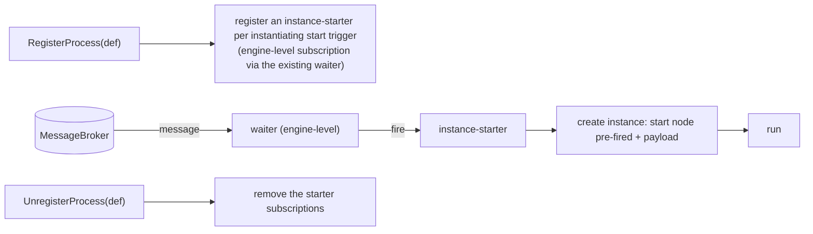

# ADR-015 — Event-triggered instantiation

| Field | Value |
|---|---|
| Status | Draft |
| Version | v.1 |
| Date | 2026-06-16 |
| Owner | Ruslan Gabitov |
| Refines | [ADR-001 v.5 Execution Model](ADR-001-execution-model.md) |

> **Draft.** Decides **event-triggered instantiation**: the engine creating a
> process instance when a *start trigger* fires — a **message start event** or an
> unbounded (`instantiate=true`) `ReceiveTask` — via a definition-level
> instance-starter, born-from-event seeding, and an opt-out **manual-start** mode.
> It completes the instantiation half of [ADR-014 v.1 §2.7](ADR-014-message-handling.md).
> The companion **correlation** conception — *which* instance a message belongs
> to, including the message-to-instance resolution model this ADR's starter
> consumes — lives in its sibling
> [ADR-016 v.1 Message correlation](ADR-016-message-correlation.md). The
> implementing SRDs do the file-level, code-grounded work.

## 1. Context & problem

[ADR-014 v.1](ADR-014-message-handling.md) landed message handling for the
common case: a `SendTask` / throw message event publishes to the `MessageBroker`;
a `ReceiveTask` / intermediate catch message event subscribes and binds the
payload. Routing is **phase-1 name-match** — a message
reaches a waiter subscribed to the same message name — and every receiver runs
**inside an already-started instance**. Two capabilities the standard requires
are still missing, and ADR-014 §2.6/§2.7 deferred them here:

1. **Event-triggered instantiation.** BPMN creates a process instance when a
   *start trigger* occurs — a **message start event**, or an unbounded
   (`instantiate=true`) `ReceiveTask`. Today gobpm only creates an instance on an
   explicit `Thresher.StartProcess` call; a message that should *spawn* a process
   has nowhere to go. Worse, `createTracks` currently seeds an initial track for
   any no-incoming node — **including a message start event** — so an eagerly
   created instance would park on its own start event (an instance existing
   before its trigger; wasteful and semantically wrong).

Instantiation is one branch of BPMN's single **message-to-instance resolution
algorithm** (§8.4.2): correlation matches a message to an existing
conversation/instance; if none matches and the message can instantiate, a new
instance is created. This ADR owns **the act of creating** that instance; the
resolution decision itself (route to existing vs instantiate vs hold) and the
**correlation** that drives it — *which* instance a message belongs to, using
values extracted from the payload — are the companion
[ADR-016 v.1 §2.3](ADR-016-message-correlation.md). The instance-starter here
**consumes** that decision: it instantiates on the "no existing match, but
instantiable" branch.

### 1.1 Two semantics that must not be conflated

- **Event-instantiation** — a start trigger *creates a new instance*. No instance
  exists until the trigger fires. A **definition/engine-level** concern.
- **In-instance wait** — an intermediate catch / receive task parks a token in an
  *already-running* instance and resumes it. A **per-instance** concern, already
  built on the EventHub + `MessageWaiter` (ADR-014).

The engine must keep these distinct: the same broker message can either wake a
parked receiver *or* spawn a fresh instance, decided by correlation.

## 2. Decision

### 2.1 Message-to-instance resolution — owned by ADR-016

The single resolution model (route to an existing instance vs instantiate vs
hold; **create-or-route atomic per key**, §13.5.1; specificity of a keyed
receiver over the wildcard starter) is the **correlation** decision and lives in
[ADR-016 v.1 §2.3](ADR-016-message-correlation.md). This ADR's instance-starter
(§2.2) **consumes** that decision: it instantiates on the "no existing match,
but instantiable" branch and joins/skips when an instance already exists for the
key.

### 2.2 Event-triggered instantiation: a definition-level instance-starter

A start trigger is **not** a parked instance. When a process is **registered**
(`RegisterProcess`), the engine registers each instantiating start trigger as an
**instance-starter** — a subscription owned at the engine/definition level, with
no instance behind it. When a matching message arrives, the starter **creates a
new instance** and seeds it with the start node already fired (its outputs bound
from the message payload), then runs it.

Mechanically this reuses the existing machinery, because the `MessageWaiter` is
**node-agnostic** (it fires any event processor) and the `EventHub` is **engine-
level**. The only thing that differs between in-instance waiting and
instantiation is *what the fired event does*:

- **In-instance wait** — the event processor is the *track*; firing resumes the token.
- **Instantiation** — the event processor is the *instance-starter*; firing creates an instance.

Decided properties:

- **Ownership.** The starter is owned by the **Thresher** (which already owns the
  process registry, the broker, and instance creation) via a **focused
  collaborator** (a start-subscription manager), *not* inline in the Thresher and
  **never on `Instance`** — no instance exists yet, and this avoids enlarging the
  `Instance` responsibilities the 2026-06-11 audit flagged. Extracting the
  collaborator to its own package later is allowed if it grows (start hosted-in-
  Thresher; YAGNI).
- **Subscription lifecycle: a single-shot/persistent flag, removal owned by the
  EventHub.** The starter reuses the **existing** message waiter with a
  **single-shot vs persistent flag** — not a new waiter type. The waiter
  **never removes itself**; the **EventHub is the sole remover**
  ([ADR-006 v.1 §2.5](ADR-006-events-and-subscriptions.md)). A **single-shot**
  waiter (the in-instance receiver) is removed by the hub after it fires once; a
  **persistent** waiter (the instance-starter) fires for *every* matching message
  and is retained until `UnregisterProcess` (→ the hub unregisters it). This both
  fixes the current waiter self-removal and gives instantiation its long-lived
  subscription with no new lifecycle machinery.
- **`createTracks` stops seeding instantiating start events.** A start event with
  an instantiating trigger no longer becomes an eager parked initial track; the
  instance is born from the starter when the trigger fires, with that start node
  pre-fired. (A *none* start event keeps the explicit `StartProcess` path.)
- **Instance seeding.** `createInstance` gains a "born from event X with payload
  Y" entry path distinct from the plain `StartProcess`: the start node is treated
  as already fired (its outputs are the bound payload), and the token starts on
  the start node's outgoing flow.
- **Registration mode — auto (default) vs manual (engine note, a deliberate
  deviation).** BPMN has no switch to disable a message start event's
  instantiation — a matching message creates an instance, full stop (§13.2 /
  §13.5.1). gobpm keeps that as the **default** (auto): every instantiating start
  trigger registers a persistent instance-starter, as above. It additionally
  offers an **opt-out at registration** (`Thresher.RegisterProcess` with a
  `WithManualStart` option): a process registered manual-start gets **no**
  persistent instance-starter, so no message ever spawns an instance of it — it
  is instantiated **only** via an explicit `StartProcess`. Inside such a manually
  started instance, its instantiating start nodes are **not** skipped by
  `createTracks`; they are seeded as **ordinary in-instance catches** and obey the
  same wait rule as intermediate catch events (a `StartEvent` embeds `catchEvent`,
  so it already is an `EventProcessor` the track parks and registers a single-shot
  waiter for). The visible semantic difference: in auto mode the instance exists
  *because* the message arrived; in manual mode the instance exists *before* the
  message and then waits for it. This is purely an **engine affordance** — for
  tests (avoiding an instance-start storm from a shared broker) and for
  back-pressure control — and it never changes the conformant default; it is the
  toggle that also disambiguates `StartProcess` on a message-start process
  (auto = born-from-event only; manual = `StartProcess`-driven, start-as-catch).
  It is trigger-agnostic (covers a future timer start and the instantiate
  `ReceiveTask` the same way).

### 2.3 Correlation, phased — owned by ADR-016

Correlation (key-based now; conversation-token threading and context-based
later), its phasing, and the Conversation-less process-level key declaration are
owned by [ADR-016 v.1 §2.2/§2.4/§2.5/§2.6/§2.8](ADR-016-message-correlation.md).
The instance-starter derives the incoming message's key and resolves
create-or-route-or-join per that model.

### 2.4 Instantiation entry points

In scope: the **message start event**, and the **instantiate `ReceiveTask`** (no
incoming sequence flow). Both follow the same rule (§13.2 / §13.3.3 / §13.5.1): a
matching message creates a new instance **unless** correlation matches an existing
instance for the same conversation, in which case it routes there (subsequent
start triggers sharing correlation info join the existing instance).

Deferred (§2.6): the **event-based gateway** used at start (its node type is not
implemented yet) and the parallel-event-gateway start.

### 2.5 No-target messages are a broker concern — owned by ADR-016

When resolution yields **no target** (nothing waits and the message can't
instantiate), the disposition (hold / drop / TTL, bounded buffer,
pull-on-subscribe delivery) is a **broker** concern owned by
[ADR-016 v.1 §2.7](ADR-016-message-correlation.md) (with
[ADR-002 v.1](ADR-002-extension-architecture.md) / ADR-008). The
bounded-count floor (no-OOM) is non-negotiable; the starter raises no error to
the publisher (fire-and-forget at this layer).

### 2.6 Non-goals and out of scope (each with a named home)

- **Correlation conception** (object model, key-based / context-based mechanisms,
  conversation-token threading, the Conversation-less key declaration) — the
  sibling [ADR-016 v.1](ADR-016-message-correlation.md).
- **Event-based-gateway instantiation** — needs the event-based gateway node
  (a separate gateway-implementation milestone).
- **Durable subscriptions / persistence** of starters and pending receivers
  across a restart — the Persistence ADR.
- **Cross-instance delivery guarantees, ordering, dead-letter** — broker-quality
  concerns of the broker implementation and the future Distribution & Scale ADR
  (ADR-008).

## 3. Consequences

- The engine gains a clean split: **instantiation = engine/definition-level**
  (the starter), **in-instance waiting = per-instance** (the track) — one waiter
  abstraction, two event-processor kinds. No parallel instantiation pathway.
- `createTracks` no longer eagerly parks message-start instances; the resource
  waste and the "instance before its trigger" smell are removed.
- The `Thresher` grows a bounded new responsibility (the start-subscription
  manager) behind a focused collaborator, kept out of `Instance`.
- Correlation makes "many parallel instances, message routed by payload key" work
  — the core of long-running business processes.
- The waiter lifecycle becomes two-mode (one-shot vs persistent); the waiter
  contract (ADR-006 §2.5) must accommodate a non-self-removing subscription.

## 4. Alternatives considered

- **Eager instance + parked start event** (rejected). Create the instance on
  registration/StartProcess and let the message start event park as an in-
  instance waiter. Rejected: an instance exists before its trigger (wrong
  semantics), idle parked instances waste resources, and it conflates
  instantiation with in-instance waiting — one pre-created instance catches one
  message instead of one message spawning one instance.
- **Standalone instantiation component** (deferred, not rejected). A package fully
  decoupled from the Thresher that asks it to create instances via a public API.
  Cleaner separation but more moving parts; we start with a Thresher-hosted
  collaborator and extract later only if start-routing grows (correlation,
  multi-trigger).
- **Per-message new instance always** (rejected). Ignore correlation and spawn an
  instance per message. Trivial but wrong for follow-up messages that must reach
  the originating instance — the create-or-route decision is owned by
  [ADR-016 v.1 §2.3](ADR-016-message-correlation.md).
- **A separate persistent-waiter type vs a flag** (chose the flag). The starter
  could be a new waiter type parallel to the in-instance waiter. Rejected as
  duplication: the existing message waiter already does the broker subscription
  and payload reconstruction; a **single-shot/persistent flag** plus
  **EventHub-owned removal** (ADR-006 §2.5) covers both with one type and no
  parallel lifecycle path.

(Correlation-specific alternatives — technical sticky tokens, correlation-in-broker,
keys on a `Conversation` vs the process — are weighed in
[ADR-016 v.1 §4](ADR-016-message-correlation.md).)

## 5. Enterprise-readiness recommendations

Advisory, for operators embedding gobpm; not all are phase-1 deliverables.

- **Instance-explosion protection.** A flood of instantiating messages spawns
  unbounded instances. Recommend a per-definition concurrency/rate guard and a
  metric (`instances_started_total{process}`) so operators can alarm on runaway
  instantiation.
- **Manual-start for tests / back-pressure.** A process registered manual-start is
  never auto-instantiated by a message (it runs only via an explicit start) —
  recommend it to isolate tests from a shared broker and to gate instantiation
  under load.
- **Born-from-event contract testing.** A message start event's
  payload→start-output binding is an integration contract with external
  participants; recommend round-trip tests against representative payloads.

(Correlation-side operational recommendations — no-target observability,
idempotency, sensitive-key masking — are in
[ADR-016 v.1 §5](ADR-016-message-correlation.md).)

## 6. References

- [ADR-016 v.1 Message correlation](ADR-016-message-correlation.md) — sibling;
  owns *which* instance a message belongs to and the message-to-instance
  resolution model (§2.3) this ADR's instance-starter consumes.
- [ADR-014 v.1 Message Handling](ADR-014-message-handling.md) — the message
  send/receive model this completes; §2.7 (instantiation deferred) points here;
  the `MessageProducer`/`MessageConsumer` seam and the node-agnostic
  `MessageWaiter` this ADR reuses.
- [ADR-006 v.1 Events & Subscriptions](ADR-006-events-and-subscriptions.md) —
  §2.4 delivery and §2.5 waiter lifecycle; the instance-starter is a new,
  persistent (non-self-removing) subscriber on the same EventHub.
- [ADR-002 v.1 Extension Architecture](ADR-002-extension-architecture.md) — the
  `MessageBroker` is the pluggable boundary the starter subscribes on.
- [ADR-001 v.5 Execution Model](ADR-001-execution-model.md) — instances, tracks,
  and the lifecycle this instantiation path feeds.
- BPMN 2.0 **§8.4.2** (Correlation), **§13.2 / §13.5.1** (instantiating start
  events), **§13.3.3** (Receive Task), **§13.4.4 / §10.6.6** (Event-Based Gateway
  start) — the standard model this ADR is grounded in (`docs/bpmn-spec/`).

## 7. Open questions

None. Scope: **event-triggered instantiation** only — the instance-starter
(message start event, instantiate `ReceiveTask`), born-from-event seeding, and
manual-start. Correlation (which instance a message belongs to, the resolution
model) is the sibling [ADR-016 v.1](ADR-016-message-correlation.md);
event-based-gateway start, durability, and broker-quality guarantees are
deferred to named follow-ups.

## Document History

| Version | Date | Author | Change |
|---|---|---|---|
| v.1 | 2026-06-16 | Ruslan Gabitov | Draft. **Event-triggered instantiation**: a definition-level **instance-starter** registered at `RegisterProcess` as an engine-level event processor reusing the node-agnostic `MessageWaiter` as a **persistent** subscription; on a matching message it creates a new instance with the start node **born from the event** (pre-fired, payload bound). Owned by a **Thresher-hosted collaborator** (never on `Instance`); `createTracks` stops eagerly seeding instantiating start events. Entry points: message start event + instantiate `ReceiveTask` (event-based-gateway start deferred). Adds a **manual-start** registration mode (opt out of auto-instantiation; start-as-catch). The **correlation** conception (object model, key-based / context-based mechanisms, the message-to-instance resolution model, conversation-token threading, Conversation-less key declaration, no-target/bounded-buffer) was **carved out to the sibling [ADR-016 v.1](ADR-016-message-correlation.md)** while this ADR was still Draft; this ADR's starter consumes ADR-016's resolution decision. Refines ADR-001 v.5; siblings ADR-016 v.1, ADR-006 v.1, ADR-014 v.1; grounded in BPMN §13.2 / §13.3.3 / §13.5.1. |
