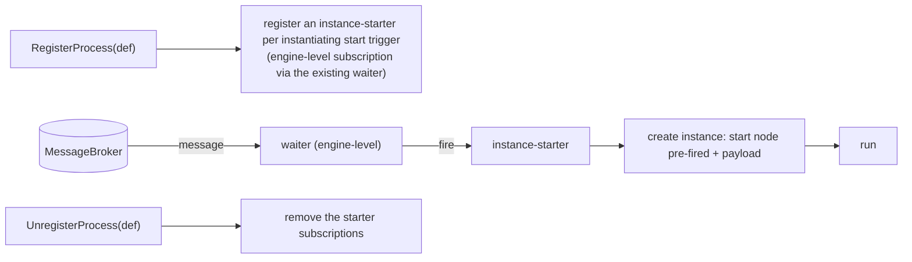

# ADR-015 — Инстанцирование по событию

| Поле | Значение |
|---|---|
| Статус | Принято |
| Версия | v.1 |
| Дата | 2026-06-16 |
| Владелец | Ruslan Gabitov |
| Уточняет | [ADR-001 v.5 Модель исполнения](ADR-001-execution-model.ru.md) |

> **Принято** — внедрено сопровождающим его SRD.
> Решает **инстанцирование по событию**: движок создаёт экземпляр процесса,
> когда срабатывает *стартовый триггер* — **стартовое событие-сообщение** или
> неограниченный (`instantiate=true`) `ReceiveTask` — через стартер экземпляров
> уровня определения, посев «рождённого из события» узла и режим **manual-start**
> с возможностью отказа. Это завершает инстанцирующую половину
> [ADR-014 v.1 §2.7](ADR-014-message-handling.ru.md). Сопутствующая концепция
> **корреляции** — *какому* экземпляру принадлежит сообщение, включая модель
> разрешения «сообщение→экземпляр», которую потребляет стартер этого ADR, —
> живёт в соседнем [ADR-016 v.1 Корреляция сообщений](ADR-016-message-correlation.ru.md).
> Реализующие SRD делают пофайловую, привязанную к коду работу.

## 1. Контекст и проблема

[ADR-014 v.1](ADR-014-message-handling.ru.md) внедрил обработку сообщений для
типового случая: `SendTask` / бросающее событие-сообщение публикует в
`MessageBroker`; `ReceiveTask` / промежуточное ловящее событие-сообщение
подписывается и связывает payload. Маршрутизация — это **фаза-1, сопоставление
по имени**: сообщение достигает ожидателя (waiter), подписанного на то же имя
сообщения, и каждый получатель работает **внутри уже запущенного экземпляра**.
Двух возможностей, которые требует стандарт, всё ещё нет, и ADR-014 §2.6/§2.7
отложил их сюда:

1. **Инстанцирование по событию.** BPMN создаёт экземпляр процесса, когда
   наступает *стартовый триггер* — **стартовое событие-сообщение** или
   неограниченный (`instantiate=true`) `ReceiveTask`. Сегодня gobpm создаёт
   экземпляр только по явному вызову `Thresher.StartProcess`; сообщению, которое
   должно *породить* процесс, некуда деться. Хуже того, `createTracks` сейчас
   засевает начальную дорожку (track) для любого узла без входящего потока —
   **включая стартовое событие-сообщение**, — так что преждевременно созданный
   экземпляр припарковался бы на собственном стартовом событии (экземпляр
   существует раньше своего триггера; расточительно и семантически неверно).

Инстанцирование — это одна из ветвей единого **алгоритма разрешения
«сообщение→экземпляр»** BPMN (§8.4.2): корреляция сопоставляет сообщение с
существующей беседой/экземпляром; если совпадения нет, а сообщение может
инстанцировать, создаётся новый экземпляр. Этот ADR владеет **актом создания**
такого экземпляра; само решение о разрешении (маршрутизировать в существующий
vs инстанцировать vs придержать) и **корреляция**, которая им управляет, —
*какому* экземпляру принадлежит сообщение, на основе значений, извлечённых из
payload, — это соседний [ADR-016 v.1 §2.3](ADR-016-message-correlation.ru.md).
Стартер экземпляров здесь **потребляет** это решение: он инстанцирует на ветке
«нет существующего совпадения, но инстанцируемо».

### 1.1 Две семантики, которые нельзя смешивать

- **Инстанцирование по событию** — стартовый триггер *создаёт новый экземпляр*.
  До срабатывания триггера экземпляра не существует. Это забота уровня
  **определения/движка**.
- **Ожидание внутри экземпляра** — промежуточное ловящее / receive task
  паркует токен в *уже работающем* экземпляре и возобновляет его. Это
  **поэкземплярная** забота, уже построенная на EventHub + `MessageWaiter`
  (ADR-014).

Движок должен держать их раздельно: одно и то же сообщение брокера может либо
разбудить припаркованного получателя, *либо* породить свежий экземпляр — это
решает корреляция.

## 2. Решение

### 2.1 Разрешение «сообщение→экземпляр» — владеет ADR-016

Единая модель разрешения (маршрутизировать в существующий экземпляр vs
инстанцировать vs придержать; **create-or-route атомарно по ключу**, §13.5.1;
приоритет получателя с ключом над wildcard-стартером) — это решение
**корреляции**, и оно живёт в
[ADR-016 v.1 §2.3](ADR-016-message-correlation.ru.md). Стартер экземпляров этого
ADR (§2.2) **потребляет** это решение: он инстанцирует на ветке «нет
существующего совпадения, но инстанцируемо» и присоединяется/пропускает, когда
экземпляр для ключа уже существует.

### 2.2 Инстанцирование по событию: стартер экземпляров уровня определения

Стартовый триггер — это **не** припаркованный экземпляр. Когда процесс
**регистрируется** (`RegisterProcess`), движок регистрирует каждый
инстанцирующий стартовый триггер как **стартер экземпляров** — подписку, которой
владеют на уровне движка/определения, без экземпляра за ней. Когда приходит
подходящее сообщение, стартер **создаёт новый экземпляр** и засевает его с уже
сработавшим стартовым узлом (его выходы связаны из payload сообщения), затем
запускает его.

Механически это переиспользует существующий механизм, потому что `MessageWaiter`
**не привязан к узлу** (он срабатывает на любой event processor), а `EventHub`
работает **на уровне движка**. Единственное, что различается между ожиданием
внутри экземпляра и инстанцированием — это *что делает сработавшее событие*:

- **Ожидание внутри экземпляра** — event processor является *дорожкой (track)*;
  срабатывание возобновляет токен.
- **Инстанцирование** — event processor является *стартером экземпляров*;
  срабатывание создаёт экземпляр.

Решённые свойства:

- **Владение.** Стартером владеет **Thresher** (который уже владеет реестром
  процессов, брокером и созданием экземпляров) через **сфокусированного
  коллаборатора** (менеджер стартовых подписок), а *не* инлайн в Thresher и
  **никогда на `Instance`** — экземпляра ещё нет, и это избегает раздувания
  ответственностей `Instance`, на которое указал аудит 2026-06-11. Вынос
  коллаборатора в отдельный пакет позже допустим, если он разрастётся (старт —
  хостинг внутри Thresher; YAGNI).
- **Жизненный цикл подписки: флаг single-shot/persistent, удаление принадлежит
  EventHub.** Стартер переиспользует **существующий** message waiter с **флагом
  single-shot vs persistent** — а не новый тип waiter. Waiter **никогда не
  удаляет себя сам**; **EventHub — единственный, кто удаляет**
  ([ADR-006 v.1 §2.5](ADR-006-events-and-subscriptions.md)). **Single-shot**
  waiter (получатель внутри экземпляра) удаляется хабом после однократного
  срабатывания; **persistent** waiter (стартер экземпляров) срабатывает на
  *каждое* подходящее сообщение и удерживается до `UnregisterProcess` (→ хаб его
  снимает). Это одновременно чинит текущее самоудаление waiter и даёт
  инстанцированию его долгоживущую подписку без новой машинерии жизненного цикла.
- **`createTracks` перестаёт засевать инстанцирующие стартовые события.**
  Стартовое событие с инстанцирующим триггером больше не становится
  преждевременно припаркованной начальной дорожкой; экземпляр рождается из
  стартера, когда срабатывает триггер, с этим стартовым узлом, уже сработавшим.
  (Стартовое событие *none* сохраняет явный путь `StartProcess`.)
- **Посев экземпляра.** `createInstance` получает входной путь «рождён из события
  X с payload Y», отличный от обычного `StartProcess`: стартовый узел считается
  уже сработавшим (его выходы — это связанный payload), а токен стартует на
  исходящем потоке стартового узла.
- **Режим регистрации — auto (по умолчанию) vs manual (примечание движка,
  намеренное отклонение).** В BPMN нет переключателя, чтобы отключить
  инстанцирование стартового события-сообщения — подходящее сообщение создаёт
  экземпляр, точка (§13.2 / §13.5.1). gobpm сохраняет это как **поведение по
  умолчанию** (auto): каждый инстанцирующий стартовый триггер регистрирует
  persistent-стартер экземпляров, как выше. Дополнительно он предлагает
  **отказ при регистрации** (`Thresher.RegisterProcess` с опцией
  `WithManualStart`): процесс, зарегистрированный как manual-start, **не**
  получает persistent-стартер, так что никакое сообщение никогда не порождает его
  экземпляр — он инстанцируется **только** через явный `StartProcess`. Внутри
  такого вручную запущенного экземпляра его инстанцирующие стартовые узлы **не**
  пропускаются `createTracks`; они засеваются как **обычные ловящие узлы внутри
  экземпляра** и подчиняются тому же правилу ожидания, что и промежуточные
  ловящие события (`StartEvent` встраивает `catchEvent`, так что он уже является
  `EventProcessor`, на котором дорожка паркуется и регистрирует single-shot
  waiter). Видимая семантическая разница: в режиме auto экземпляр существует
  *потому что* пришло сообщение; в режиме manual экземпляр существует *до*
  сообщения и затем ждёт его. Это чисто **аффорданс движка** — для тестов
  (избежать шторма стартов экземпляров от общего брокера) и для контроля
  обратного давления (back-pressure) — и он никогда не меняет конформное
  поведение по умолчанию; это переключатель, который заодно снимает
  неоднозначность `StartProcess` на процессе со стартом-сообщением
  (auto = только born-from-event; manual = управляемый `StartProcess`,
  старт-как-ловля). Он не привязан к типу триггера (покрывает будущий таймерный
  старт и инстанцирующий `ReceiveTask` одинаково).

### 2.3 Корреляция, поэтапно — владеет ADR-016

Корреляция (key-based сейчас; conversation-token threading и context-based
позже), её поэтапность и Conversation-less объявление ключа на уровне процесса
принадлежат
[ADR-016 v.1 §2.2/§2.4/§2.5/§2.6/§2.8](ADR-016-message-correlation.ru.md).
Стартер экземпляров выводит ключ входящего сообщения и разрешает
create-or-route-or-join согласно этой модели.

### 2.4 Точки входа инстанцирования

В scope: **стартовое событие-сообщение** и **инстанцирующий `ReceiveTask`**
(без входящего потока управления). Оба следуют одному правилу
(§13.2 / §13.3.3 / §13.5.1): подходящее сообщение создаёт новый экземпляр,
**если только** корреляция не сопоставит существующий экземпляр для той же
беседы, в каковом случае оно маршрутизируется туда (последующие стартовые
триггеры с той же корреляционной информацией присоединяются к существующему
экземпляру).

Отложено (§2.6): **event-based gateway**, используемый на старте (его тип узла
ещё не реализован), и старт через parallel-event-gateway.

### 2.5 Сообщения без адресата — забота брокера — владеет ADR-016

Когда разрешение даёт **нет адресата** (ничто не ждёт, и сообщение не может
инстанцировать), распоряжение (hold / drop / TTL, ограниченный буфер, доставка
pull-on-subscribe) — это забота **брокера**, которой владеет
[ADR-016 v.1 §2.7](ADR-016-message-correlation.ru.md) (вместе с
[ADR-002 v.1](ADR-002-extension-architecture.ru.md) / ADR-008). Нижняя граница
по ограничению количества (no-OOM) непреложна; стартер не поднимает ошибку
публикатору (fire-and-forget на этом слое).

### 2.6 Не-цели и вне scope (у каждой — названный дом)

- **Концепция корреляции** (объектная модель, механизмы key-based / context-based,
  conversation-token threading, Conversation-less объявление ключа) — соседний
  [ADR-016 v.1](ADR-016-message-correlation.ru.md).
- **Инстанцирование через event-based-gateway** — нужен узел event-based gateway
  (отдельная веха реализации шлюзов).
- **Долговечные подписки / персистентность** стартеров и ожидающих получателей
  между перезапусками — ADR про персистентность.
- **Гарантии межэкземплярной доставки, упорядочивание, dead-letter** —
  заботы качества брокера в его реализации и будущий ADR про Distribution &
  Scale (ADR-008).

## 3. Последствия

- Движок получает чистое разделение: **инстанцирование = уровень
  движка/определения** (стартер), **ожидание внутри экземпляра = поэкземплярно**
  (дорожка) — одна абстракция waiter, два вида event processor. Без параллельного
  пути инстанцирования.
- `createTracks` больше не паркует преждевременно экземпляры со
  стартом-сообщением; расточительство ресурсов и запах «экземпляр раньше своего
  триггера» устранены.
- `Thresher` обзаводится ограниченной новой ответственностью (менеджер стартовых
  подписок) за сфокусированным коллаборатором, держа её вне `Instance`.
- Корреляция заставляет работать «много параллельных экземпляров, сообщение
  маршрутизируется по ключу из payload» — ядро долгоживущих бизнес-процессов.
- Жизненный цикл waiter становится двухрежимным (one-shot vs persistent);
  контракт waiter (ADR-006 §2.5) должен вмещать несамоудаляющуюся подписку.

## 4. Рассмотренные альтернативы

- **Преждевременный экземпляр + припаркованное стартовое событие** (отклонено).
  Создать экземпляр при регистрации/StartProcess и дать стартовому
  событию-сообщению припарковаться как waiter внутри экземпляра. Отклонено:
  экземпляр существует раньше своего триггера (неверная семантика), простаивающие
  припаркованные экземпляры тратят ресурсы, и это смешивает инстанцирование с
  ожиданием внутри экземпляра — один предварительно созданный экземпляр ловит
  одно сообщение вместо того, чтобы одно сообщение порождало один экземпляр.
- **Самостоятельный компонент инстанцирования** (отложено, не отклонено). Пакет,
  полностью развязанный от Thresher, который просит его создавать экземпляры
  через публичный API. Более чистое разделение, но больше движущихся частей; мы
  начинаем с коллаборатора, хостящегося в Thresher, и выносим позже только если
  маршрутизация старта разрастётся (корреляция, мульти-триггер).
- **Всегда новый экземпляр на сообщение** (отклонено). Игнорировать корреляцию и
  порождать экземпляр на каждое сообщение. Тривиально, но неверно для
  последующих сообщений, которые должны достичь породившего экземпляра — решение
  create-or-route принадлежит
  [ADR-016 v.1 §2.3](ADR-016-message-correlation.ru.md).
- **Отдельный тип persistent-waiter vs флаг** (выбран флаг). Стартер мог бы быть
  новым типом waiter, параллельным waiter внутри экземпляра. Отклонено как
  дублирование: существующий message waiter уже делает подписку на брокер и
  реконструкцию payload; **флаг single-shot/persistent** плюс **удаление,
  принадлежащее EventHub** (ADR-006 §2.5) покрывают оба одним типом без
  параллельного пути жизненного цикла.

(Специфичные для корреляции альтернативы — технические sticky-токены,
корреляция-в-брокере, ключи на `Conversation` vs процессе — взвешены в
[ADR-016 v.1 §4](ADR-016-message-correlation.ru.md).)

## 5. Рекомендации по enterprise-готовности

Совещательные, для операторов, встраивающих gobpm; не все являются поставками
фазы-1.

- **Защита от взрыва экземпляров.** Поток инстанцирующих сообщений порождает
  неограниченное число экземпляров. Рекомендуется guard на
  параллелизм/частоту per-definition и метрика
  (`instances_started_total{process}`), чтобы операторы могли алармить на
  неуправляемое инстанцирование.
- **Manual-start для тестов / обратного давления.** Процесс, зарегистрированный
  как manual-start, никогда не инстанцируется автоматически сообщением (он
  запускается только через явный старт) — рекомендуется изолировать тесты от
  общего брокера и затворять инстанцирование под нагрузкой.
- **Контрактное тестирование born-from-event.** Связывание
  payload→старт-выход стартового события-сообщения — это интеграционный контракт
  с внешними участниками; рекомендуются round-trip тесты на репрезентативных
  payload.

(Операционные рекомендации со стороны корреляции — наблюдаемость отсутствия
адресата, идемпотентность, маскирование чувствительных ключей — в
[ADR-016 v.1 §5](ADR-016-message-correlation.ru.md).)

## 6. Ссылки

- [ADR-016 v.1 Корреляция сообщений](ADR-016-message-correlation.ru.md) —
  соседний; владеет тем, *какому* экземпляру принадлежит сообщение, и моделью
  разрешения «сообщение→экземпляр» (§2.3), которую потребляет стартер
  экземпляров этого ADR.
- [ADR-014 v.1 Обработка сообщений](ADR-014-message-handling.ru.md) — модель
  send/receive сообщений, которую это завершает; §2.7 (инстанцирование отложено)
  указывает сюда; шов `MessageProducer`/`MessageConsumer` и не привязанный к узлу
  `MessageWaiter`, которые переиспользует этот ADR.
- [ADR-006 v.1 События и подписки](ADR-006-events-and-subscriptions.md) —
  §2.4 доставка и §2.5 жизненный цикл waiter; стартер экземпляров — новый,
  persistent (несамоудаляющийся) подписчик на том же EventHub.
- [ADR-002 v.1 Архитектура расширений](ADR-002-extension-architecture.ru.md) —
  `MessageBroker` — это подключаемая граница, на которую подписывается стартер.
- [ADR-001 v.5 Модель исполнения](ADR-001-execution-model.ru.md) — экземпляры,
  дорожки и жизненный цикл, в который вливается этот путь инстанцирования.
- BPMN 2.0 **§8.4.2** (Корреляция), **§13.2 / §13.5.1** (инстанцирующие
  стартовые события), **§13.3.3** (Receive Task), **§13.4.4 / §10.6.6**
  (старт через Event-Based Gateway) — модель стандарта, на которой этот ADR
  заземлён (`docs/bpmn-spec/`).

## 7. Открытые вопросы

Нет. Scope: только **инстанцирование по событию** — стартер экземпляров
(стартовое событие-сообщение, инстанцирующий `ReceiveTask`), посев
born-from-event и manual-start. Корреляция (какому экземпляру принадлежит
сообщение, модель разрешения) — это соседний
[ADR-016 v.1](ADR-016-message-correlation.ru.md); старт через event-based-gateway,
долговечность и гарантии качества брокера отложены в названные follow-up.

## История документа

| Версия | Дата | Автор | Изменение |
|---|---|---|---|
| v.1 (Принято) | 2026-06-16 | Ruslan Gabitov | **Принято** — внедрено сопровождающим его SRD: стартер экземпляров (стартовое событие-сообщение + инстанцирующий ReceiveTask), посев born-from-event и отказ через manual-start, каждая веха с зелёным `make ci`. |
| v.1 | 2026-06-16 | Ruslan Gabitov | Draft. **Инстанцирование по событию**: **стартер экземпляров** уровня определения, регистрируемый при `RegisterProcess` как event processor уровня движка, переиспользующий не привязанный к узлу `MessageWaiter` как **persistent**-подписку; по подходящему сообщению он создаёт новый экземпляр со стартовым узлом, **рождённым из события** (предварительно сработавшим, со связанным payload). Владеет **коллаборатор, хостящийся в Thresher** (никогда на `Instance`); `createTracks` перестаёт преждевременно засевать инстанцирующие стартовые события. Точки входа: стартовое событие-сообщение + инстанцирующий `ReceiveTask` (старт через event-based-gateway отложен). Добавляет режим регистрации **manual-start** (отказ от авто-инстанцирования; старт-как-ловля). Концепция **корреляции** (объектная модель, механизмы key-based / context-based, модель разрешения «сообщение→экземпляр», conversation-token threading, Conversation-less объявление ключа, no-target/ограниченный буфер) была **вынесена в соседний [ADR-016 v.1](ADR-016-message-correlation.ru.md)**, пока этот ADR был ещё в Draft; стартер этого ADR потребляет решение о разрешении из ADR-016. Уточняет ADR-001 v.5; соседи ADR-016 v.1, ADR-006 v.1, ADR-014 v.1; заземлён в BPMN §13.2 / §13.3.3 / §13.5.1. |
