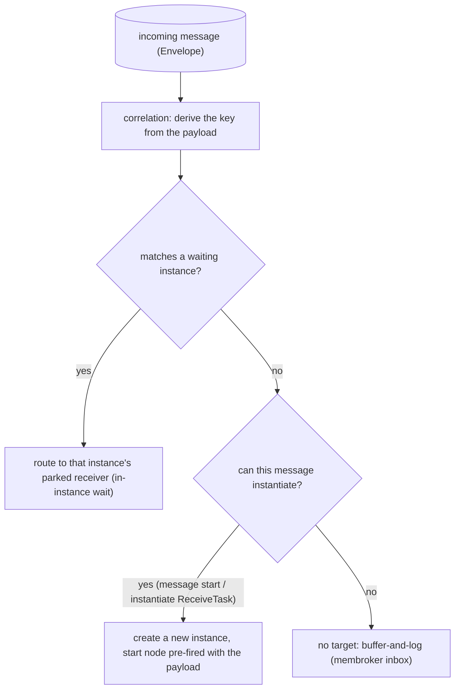
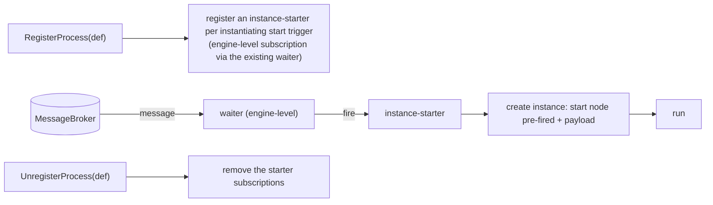

# ADR-015 — Message correlation & event-triggered instantiation

| Field | Value |
|---|---|
| Status | Draft |
| Version | v.1 |
| Date | 2026-06-16 |
| Owner | Ruslan Gabitov |
| Refines | [ADR-001 v.5 Execution Model](ADR-001-execution-model.md) |

> **Draft — not yet implemented.** Decides how an incoming message is routed to a
> process: the **message-to-instance resolution** model (new instance vs route
> to an existing one), **event-triggered instantiation** (the engine creating an
> instance when a start trigger fires), and **correlation** (which instance a
> message belongs to). It completes the deferrals of [ADR-014 v.1 §2.6/§2.7](ADR-014-message-handling.md):
> correlation-key derivation and message-triggered instantiation. Scope is
> **phased** — this ADR decides the full conceptual model; the implementing SRDs
> stage it (key-based correlation + basic instantiation first, context-based
> correlation later). The implementing SRDs do the file-level, code-grounded
> work.

## 1. Context & problem

[ADR-014 v.1](ADR-014-message-handling.md) landed message handling for the
common case: a `SendTask` / throw message event publishes to the `MessageBroker`;
a `ReceiveTask` / intermediate catch message event subscribes and binds the
payload. Routing is **phase-1 name-match** — a message
reaches a waiter subscribed to the same message name — and every receiver runs
**inside an already-started instance**. Two capabilities the standard requires
are still missing, and ADR-014 §2.6/§2.7 deferred them here:

1. **Event-triggered instantiation.** BPMN creates a process instance when a
   *start trigger* occurs — a **message start event**, or an unbounded
   (`instantiate=true`) `ReceiveTask`. Today gobpm only creates an instance on an
   explicit `Thresher.StartProcess` call; a message that should *spawn* a process
   has nowhere to go. Worse, `createTracks` currently seeds an initial track for
   any no-incoming node — **including a message start event** — so an eagerly
   created instance would park on its own start event (an instance existing
   before its trigger; wasteful and semantically wrong).

2. **Correlation.** Long-running processes run many instances in parallel (one
   per order, per customer, …). When an asynchronous message arrives the engine
   MUST decide whether it **creates a new** instance or routes to an **existing**
   one, and *which* one — using values **extracted from the message payload
   itself** (an `orderID`, a `customerID`), not technical sticky tokens. Name-
   match cannot distinguish two running order processes both waiting for
   `"payment received"`.

These are one problem. BPMN §8.4.2 frames it as a single **message-to-instance
resolution algorithm**: correlation matches the message to a conversation/
instance; if none matches and the message can instantiate, a new instance is
created. Instantiation is the "no existing match" branch of correlation.

### 1.1 Two semantics that must not be conflated

- **Event-instantiation** — a start trigger *creates a new instance*. No instance
  exists until the trigger fires. A **definition/engine-level** concern.
- **In-instance wait** — an intermediate catch / receive task parks a token in an
  *already-running* instance and resumes it. A **per-instance** concern, already
  built on the EventHub + `MessageWaiter` (ADR-014).

The engine must keep these distinct: the same broker message can either wake a
parked receiver *or* spawn a fresh instance, decided by correlation.

## 2. Decision

### 2.1 One message-to-instance resolution model

Every incoming message is resolved the same way, regardless of whether it ends at
a task or an event (BPMN §8.4.2 footnote 1: send/receive tasks and message
throw/catch events behave identically for correlation):

Correlation produces the routing key; the engine then either resumes a parked
receiver, creates a new instance, or holds the message. This single model unifies
in-instance waiting (ADR-014) and instantiation (this ADR).

### 2.2 Event-triggered instantiation: a definition-level instance-starter

A start trigger is **not** a parked instance. When a process is **registered**
(`RegisterProcess`), the engine registers each instantiating start trigger as an
**instance-starter** — a subscription owned at the engine/definition level, with
no instance behind it. When a matching message arrives, the starter **creates a
new instance** and seeds it with the start node already fired (its outputs bound
from the message payload), then runs it.

Mechanically this reuses the existing machinery, because the `MessageWaiter` is
**node-agnostic** (it fires any event processor) and the `EventHub` is **engine-
level**. The only thing that differs between in-instance waiting and
instantiation is *what the fired event does*:

- **In-instance wait** — the event processor is the *track*; firing resumes the token.
- **Instantiation** — the event processor is the *instance-starter*; firing creates an instance.

Decided properties:

- **Ownership.** The starter is owned by the **Thresher** (which already owns the
  process registry, the broker, and instance creation) via a **focused
  collaborator** (a start-subscription manager), *not* inline in the Thresher and
  **never on `Instance`** — no instance exists yet, and this avoids enlarging the
  `Instance` responsibilities the 2026-06-11 audit flagged. Extracting the
  collaborator to its own package later is allowed if it grows (start hosted-in-
  Thresher; YAGNI).
- **Subscription lifecycle is the inverse of an in-instance waiter.** An in-
  instance `MessageWaiter` is **one-shot** (it unregisters after the single
  resume). An instance-starter subscription is **long-lived**: every matching
  message spawns *another* instance, so it persists for the lifetime of the
  process registration and must not self-remove. `UnregisterProcess` removes it.
- **`createTracks` stops seeding instantiating start events.** A start event with
  an instantiating trigger no longer becomes an eager parked initial track; the
  instance is born from the starter when the trigger fires, with that start node
  pre-fired. (A *none* start event keeps the explicit `StartProcess` path.)
- **Instance seeding.** `createInstance` gains a "born from event X with payload
  Y" entry path distinct from the plain `StartProcess`: the start node is treated
  as already fired (its outputs are the bound payload), and the token starts on
  the start node's outgoing flow.

### 2.3 Correlation, phased

Correlation answers "which instance" by extracting values from the message
payload. gobpm phases it:

- **Phase 1 — name-match (done).** A message reaches a waiter by message name
  (ADR-014 §2.6). Enough for a single waiter per name; cannot disambiguate
  parallel instances.
- **Phase 2 — key-based correlation (this ADR decides; next SRD implements).** A
  `CorrelationKey` is a composite of `CorrelationProperty` values, each extracted
  from the message payload by a `CorrelationPropertyRetrievalExpression`
  (`messagePath` over the payload, selected by `messageRef`). The key is
  **initialized** by the first send/receive in the exchange and **matched** on
  every subsequent message: the derived composite key must equal the instance's
  initialized key. A key is valid only once **all** its properties are populated.
  This is what disambiguates "payment received for order 42" among many order
  instances.
- **Phase 3 — context-based / predicate correlation (this ADR decides; later
  SRD).** A `CorrelationSubscription` evaluates `FormalExpression`s
  (`CorrelationPropertyBinding.dataPath`) over the **process context** (properties
  / data objects) rather than the payload, and may **re-target** mid-run as that
  context changes. Built atop key-based; coexists with it (non-exclusive per
  §8.4.2). Key-based admits **at most one** active receiver per key; predicate-
  based MAY match **multiple** receivers.

The `Envelope.CorrelationKey` field (already present) carries the derived key, so
adding derivation does not reshape the producer/consumer seam (ADR-014 §2.2).

### 2.4 Instantiation entry points

In scope: the **message start event**, and the **instantiate `ReceiveTask`** (no
incoming sequence flow). Both follow the same rule (§13.2 / §13.3.3 / §13.5.1): a
matching message creates a new instance **unless** correlation matches an existing
instance for the same conversation, in which case it routes there (subsequent
start triggers sharing correlation info join the existing instance).

Deferred (§2.6): the **event-based gateway** used at start (its node type is not
implemented yet) and the parallel-event-gateway start.

### 2.5 No-target messages are a broker concern (and the buffer is bounded)

Resolution yields a target — an existing instance or a new one — or **no
target**. The standard is silent on the no-target case (§8.4.2: "drops or holds
… per implementation policy"), and crucially *what happens next* is a property of
the broker, not the model layer. This ADR owns **resolution**, not **message
lifetime**: the disposition of a no-target message (drop / hold / TTL /
dead-letter) and the mechanism by which a held message reaches a later consumer
are **broker concerns** ([ADR-002 v.1](ADR-002-extension-architecture.md) / the
future Distribution & Scale ADR-008).

Two properties hold regardless of the broker implementation:

- **Held buffering MUST be bounded.** A broker that holds no-target messages MUST
  cap what it retains (by count and/or memory) and evict beyond the cap, so an
  unconsumed-message backlog can **never exhaust memory** (the
  bounded-in-memory-defaults principle, ADR-002). The default `membroker` already
  does this — a bounded inbox that drops the oldest past its cap.
- **Delivery is pull-on-subscribe (current default).** A held message is
  re-examined **only when a matching consumer subscribes** — the in-instance
  receiver when its token reaches the node, the instance-starter at
  `RegisterProcess` — which then drains the matching buffered messages. There is
  **no background sweeper**.

The no-target disposition is intended to be a **configurable broker policy**
along three dimensions: **drop vs keep**, **how many** (retention count), and
**how long** (a TTL / retention time after which a held message is discarded
even unconsumed). The **bounded-count floor is non-negotiable** (no-OOM,
above); TTL and the drop/keep mode are operator choices. The default `membroker`
exposes the count today (a max-inbox cap); a drop mode and a TTL are future
broker options. Designing those knobs is the broker's job
([ADR-002 v.1](ADR-002-extension-architecture.md) / ADR-008), not this ADR.

No error is raised to the publisher (messaging is fire-and-forget at this layer).

### 2.6 Non-goals and out of scope (each with a named home)

- **`Conversation`** — the logical message-grouping container is out of
  conformance scope; correlation is modelled directly on keys/subscriptions
  without the `Conversation` element.
- **Event-based-gateway instantiation** — needs the event-based gateway node
  (a separate gateway-implementation milestone).
- **Context-based / predicate correlation implementation** — decided here,
  implemented in a later SRD after key-based lands.
- **Durable subscriptions / persistence** of starters and pending receivers
  across a restart — the Persistence ADR.
- **Cross-instance delivery guarantees, ordering, dead-letter** — broker-quality
  concerns of the broker implementation and the future Distribution & Scale ADR
  (ADR-008).

## 3. Consequences

- The engine gains a clean split: **instantiation = engine/definition-level**
  (the starter), **in-instance waiting = per-instance** (the track) — one waiter
  abstraction, two event-processor kinds. No parallel instantiation pathway.
- `createTracks` no longer eagerly parks message-start instances; the resource
  waste and the "instance before its trigger" smell are removed.
- The `Thresher` grows a bounded new responsibility (the start-subscription
  manager) behind a focused collaborator, kept out of `Instance`.
- Correlation makes "many parallel instances, message routed by payload key" work
  — the core of long-running business processes.
- The waiter lifecycle becomes two-mode (one-shot vs persistent); the waiter
  contract (ADR-006 §2.5) must accommodate a non-self-removing subscription.

## 4. Alternatives considered

- **Eager instance + parked start event** (rejected). Create the instance on
  registration/StartProcess and let the message start event park as an in-
  instance waiter. Rejected: an instance exists before its trigger (wrong
  semantics), idle parked instances waste resources, and it conflates
  instantiation with in-instance waiting — one pre-created instance catches one
  message instead of one message spawning one instance.
- **Standalone instantiation component** (deferred, not rejected). A package fully
  decoupled from the Thresher that asks it to create instances via a public API.
  Cleaner separation but more moving parts; we start with a Thresher-hosted
  collaborator and extract later only if start-routing grows (correlation,
  multi-trigger).
- **Technical correlation tokens** (rejected by the standard). Sticky IDs injected
  by the engine instead of payload-derived keys. BPMN deliberately correlates on
  business data in the payload; we follow it.
- **Per-message new instance always** (rejected). Ignore correlation and spawn an
  instance per message. Trivial but wrong for follow-up messages that must reach
  the originating instance.

## 5. Enterprise-readiness recommendations

Advisory, for operators embedding gobpm; not all are phase-1 deliverables.

- **Instance-explosion protection.** A flood of instantiating messages spawns
  unbounded instances. Recommend a per-definition concurrency/rate guard and a
  metric (`instances_started_total{process}`) so operators can alarm on runaway
  instantiation.
- **No-target-message observability.** Emit a counter + a sampled log (message
  name + correlation key, never payload values) for messages that match no
  instance and cannot instantiate, and a counter for **bounded-buffer evictions**,
  so silent buffering and silent drops are both visible. A TTL + dead-letter sink
  is the durable broker-side answer.
- **Idempotency / duplicate delivery.** At-least-once brokers redeliver. Recommend
  documenting that correlation + a business idempotency key is the dedup strategy;
  the engine does not dedup messages itself.
- **Sensitive correlation data.** Correlation keys are business identifiers and
  may be PII. Keys appear in logs/metrics/traces — recommend masking conventions
  (log key *names* and hashes, not raw values) consistent with ADR-010/011/014.
- **Contract testing.** A message start event's payload→start-output binding and a
  key's `messagePath` extraction are integration contracts with external
  participants; recommend round-trip tests against representative payloads.

## 6. References

- [ADR-014 v.1 Message Handling](ADR-014-message-handling.md) — the message
  send/receive model this completes; §2.6 (phase-1 name-match, key-derivation
  deferred) and §2.7 (instantiation deferred) point here; the
  `MessageProducer`/`MessageConsumer` seam and the node-agnostic `MessageWaiter`
  this ADR reuses.
- [ADR-006 v.1 Events & Subscriptions](ADR-006-events-and-subscriptions.md) —
  §2.4 delivery and §2.5 waiter lifecycle; the instance-starter is a new,
  persistent (non-self-removing) subscriber on the same EventHub.
- [ADR-002 v.1 Extension Architecture](ADR-002-extension-architecture.md) — the
  `MessageBroker` is the pluggable boundary the starter subscribes on.
- [ADR-001 v.5 Execution Model](ADR-001-execution-model.md) — instances, tracks,
  and the lifecycle this instantiation path feeds.
- BPMN 2.0 **§8.4.2** (Correlation), **§13.2 / §13.5.1** (instantiating start
  events), **§13.3.3** (Receive Task), **§13.4.4 / §10.6.6** (Event-Based Gateway
  start) — the standard model this ADR is grounded in (`docs/bpmn-spec/`).

## 7. Open questions

None. Scope confirmed: one ADR for correlation + event-triggered instantiation;
decide the full conceptual model and implement **key-based correlation + basic
instantiation (message start event, instantiate `ReceiveTask`)** in the next SRD,
with context-based/predicate correlation and event-based-gateway start deferred
to named follow-ups; the instance-starter is a **Thresher-hosted collaborator**
reusing the node-agnostic waiter as a persistent subscription; `createTracks`
stops seeding instantiating start events; `Conversation` and durability are out
of scope.

## Document History

| Version | Date | Author | Change |
|---|---|---|---|
| v.1 | 2026-06-16 | Ruslan Gabitov | Draft. Decides message-to-instance resolution as one model (correlation matches new-vs-existing; instantiation is the no-match branch). **Event-triggered instantiation**: a definition-level **instance-starter** registered at `RegisterProcess` as an engine-level event processor reusing the node-agnostic `MessageWaiter`; on a matching message it creates a new instance with the start node pre-fired from the payload. Owned by a **Thresher-hosted collaborator** (never on `Instance`); the starter subscription is **persistent** (inverse of the one-shot in-instance waiter); `createTracks` stops eagerly seeding instantiating start events. **Correlation phased**: name-match (done) → **key-based** (`CorrelationKey` from `CorrelationProperty`/`CorrelationPropertyRetrievalExpression` over the payload; decided here, implemented next) → **context-based/predicate** (`CorrelationSubscription` over process context; decided here, later SRD). Instantiation entry points: message start event + instantiate `ReceiveTask`; event-based-gateway start deferred. **No-target-message disposition is a configurable broker concern** (this ADR owns resolution, not message lifetime): a policy over *drop vs keep*, *how many* (retention count), and *how long* (TTL), with the bounded-count floor non-negotiable (no-OOM, ADR-002 bounded-in-memory principle) and delivery pull-on-subscribe (no sweeper). The current `membroker` is a bounded inbox; drop-mode/TTL/dead-letter are deferred broker options. `Conversation`, predicate-correlation implementation, durability, and broker-quality guarantees are out of scope. Refines ADR-001 v.5; sibling to ADR-006 v.1 and ADR-014 v.1; grounded in BPMN §8.4.2 / §13.x. |
