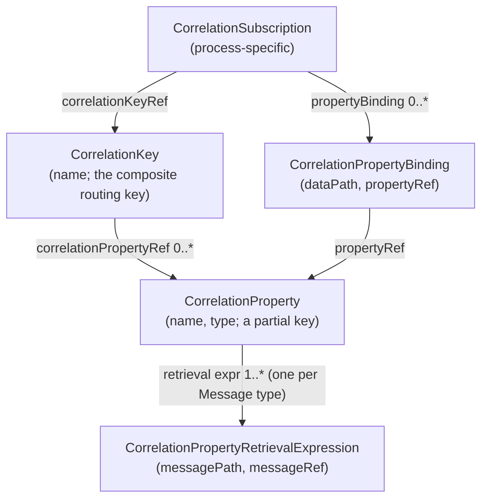
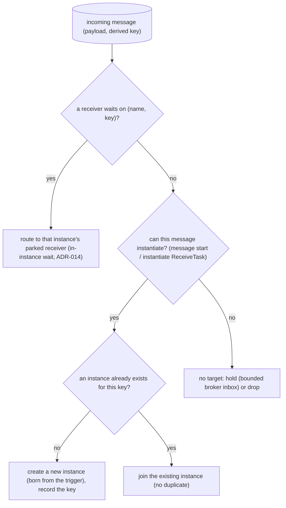
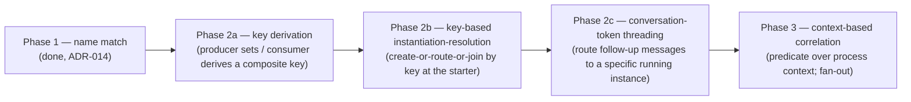

# ADR-016 — Message correlation

| Field | Value |
|---|---|
| Status | Draft |
| Version | v.1 |
| Date | 2026-06-16 |
| Owner | Ruslan Gabitov |
| Refines | [ADR-001 v.5 Execution Model](ADR-001-execution-model.md) |

> **Draft.** Decides the **message correlation** conception in full: how an
> incoming message is matched to the conversation/instance it belongs to, the
> **message-to-instance resolution model** (route to an existing instance vs
> instantiate a new one vs hold), and the **phasing** of correlation
> (key-based now, conversation-token threading and context-based correlation
> later). Carved out of [ADR-015 v.1](ADR-015-event-triggered-instantiation.md),
> which keeps **event-triggered instantiation**; the two are siblings — ADR-015
> owns *when a message creates an instance*, this ADR owns *which instance a
> message belongs to*. Grounded in **BPMN 2.0 §8.4.2** (Correlation) and its
> cross-clauses (§13.2 / §13.3.3 / §13.5.1). The implementing SRDs do the
> file-level, code-grounded work.

## 1. Context & problem

A long-running engine runs many instances of the same process in parallel — one
per order, per customer, per claim. When an asynchronous message arrives the
engine MUST decide (§8.4.2, p72):

- does this message create a **new** instance, or route to an **existing** one?
- if an existing instance — *which* one?

BPMN answers with **correlation**: values **extracted from the message payload
itself** (an `orderID`, a `customerID`) identify the conversation a message
belongs to — no technical sticky tokens. Phase-1 name-match (ADR-014 §2.6) — a
message reaches a waiter subscribed to the same message name — cannot
distinguish two running order processes both waiting for `"payment received"`.
Correlation is the disambiguator.

This was bundled into ADR-015 while the instantiation work was the immediate
goal. Correlation is a large topic in its own right — a five-element object
model, two non-exclusive mechanisms (key-based, context-based), a conversation
identity model, and a single-receiver-per-key invariant — and it cross-cuts
*all* message endpoints (tasks **and** events; §8.4.2 footnote 1), not just
instantiation. It earns its own ADR so the conception is complete and the
deferred parts (conversation-token threading, context-based correlation) have a
named conceptual home rather than living as ad-hoc narrowings of an SRD.

### 1.1 Correlation and instantiation are one algorithm, two ADRs

BPMN §8.4.2 frames a single **message-to-instance resolution algorithm**:
correlation matches a message to a conversation/instance; if none matches and
the message can instantiate, a new instance is created. Instantiation is the
"no existing match, but instantiable" branch.

We split the *documentation* along the conceptual seam, not the algorithm:

- **This ADR (correlation)** — *which* instance a message belongs to: the key
  model, derivation/matching, the resolution decision, conversation identity.
- **[ADR-015 (event-triggered instantiation)](ADR-015-event-triggered-instantiation.md)**
  — *the act of creating* an instance when a start trigger fires: the
  definition-level instance-starter, born-from-event seeding, manual-start.

The resolution algorithm (§2.3) is owned here because it is the correlation
decision; ADR-015's starter consumes that decision.

## 2. Decision

### 2.1 The object model is the standard's, verbatim

gobpm models correlation with the five BPMN elements exactly as specified
(§8.4.2, Tables 8.31–8.35), preserving the standard taxonomy:

- **CorrelationKey** — a composite key out of one or more **CorrelationProperty**
  partial keys. A key is **valid only once all** its properties are populated
  (§8.4.2; the engine MUST track per-property population state).
- **CorrelationProperty** — a partial key; carries **one
  CorrelationPropertyRetrievalExpression per message type** in the conversation.
- **CorrelationPropertyRetrievalExpression** — `messagePath` (a `FormalExpression`
  extracting the value from `messageRef`'s payload) + `messageRef` (the message
  it applies to).
- **CorrelationSubscription** / **CorrelationPropertyBinding** — the process-side
  counterpart for **context-based** correlation: `dataPath` expressions over the
  process context rather than the message payload (§2.5).

### 2.2 Key-based correlation (the primary mechanism)

The simple, efficient mechanism (§8.4.2, p74–75). A conversation is identified
by one or more `CorrelationKey`s; both sides derive the same composite key from
the shared payload structure.

- **Population (producer / first participant).** The first send or receive in a
  conversation populates the key by evaluating each property's retrieval
  expression (whose `messageRef` matches the message in flight) over the
  message payload. The producer carries the derived composite key on the
  outgoing message (the "joint conversation token", §8.4.2).
- **Matching (consumer).** An incoming message derives its composite key the same
  way — each property's `messagePath` (selected by `messageRef`) evaluated over
  the **incoming** payload — and the derived key must equal the conversation's
  initialized key to route there.
- **All-or-nothing.** A composite key with any unresolved property is **invalid**
  and matches nothing — never a partial match.
- **At most one receiver per key (§13.3.3).** Under key-based correlation the
  engine MUST NOT have two active receivers for the same `CorrelationKey`
  simultaneously; a message matches **at most one** instance. (Context-based
  correlation relaxes this to fan-out — §2.5.)

### 2.3 The message-to-instance resolution model

Every incoming message is resolved the same way regardless of whether it ends at
a task or an event (§8.4.2 footnote 1 — send/receive tasks and message
throw/catch events behave identically for correlation):

- **Create-or-route is atomic per key (§13.5.1).** Two messages for the *same*
  not-yet-existing key MUST NOT each spawn an instance — resolution per
  `(name, key)` is **single-flight**: the first creates, concurrent/subsequent
  start triggers sharing the key **join** that instance. "New vs existing" and
  the act of creating are one atomic step keyed by the correlation key, not a
  check-then-act.
- **Specificity: a keyed receiver beats a wildcard starter.** When both an
  existing instance's keyed receiver and the engine-level instance-starter could
  accept a message, the **keyed receiver wins** (route to the existing instance);
  the starter only instantiates when no keyed receiver waits. This is what makes
  "route to existing vs instantiate" deterministic rather than registration-order
  dependent.
- **No target → broker concern (§2.7).** If nothing matches and the message
  can't instantiate, disposition (hold/drop/TTL) is the broker's policy.

### 2.4 Conversation-token threading (decided; implementation phased)

The full conversation model is a **joint token passed back and forth** in every
message of an exchange (§8.4.2): the key is initialized by the first
send/receive and **matched on every subsequent message**; a follow-up message
whose key was already initialized MUST equal the conversation's value (mismatch
= no route), and a follow-up that derives a **not-yet-initialized** secondary key
**lazily associates** that value with the conversation.

Conceptually decided here. Two consequences for the engine:

- A running instance carries its conversation key(s); its in-instance receivers
  match incoming messages on `(name, key)`, so a follow-up message routes to the
  *specific* instance whose conversation it belongs to (§2.3 specificity).
- Lazy secondary-key initialization and multi-key layered routing are part of
  this model.

**Phasing.** Routing a follow-up message to a *specific already-running*
instance's keyed receiver (the full token-threading) is **deferred** to a later
SRD; the first implementation lands **key-based instantiation-resolution** (the
create-or-route-or-join decision at the starter, §2.3) which already realizes
"two parallel instances disambiguated by key" and "subsequent start joins
existing, no duplicate". The deferral is a decided phase of *this* model, not a
narrowing — see §2.8.

### 2.5 Context-based correlation (decided; deferred)

The more expressive mechanism (§8.4.2 p76; "predicate-based" in §13.3.3), built
**on top of** key-based and **non-exclusive** with it. A process provides a
`CorrelationSubscription` whose `CorrelationPropertyBinding.dataPath` expressions
evaluate over the **process context** (data objects / properties) rather than
the message payload. It is **reactive**: when a referenced data item changes the
subscription re-evaluates, so a process can **re-target** mid-run what messages
it accepts. Unlike key-based (at most one receiver per key), predicate-based MAY
deliver a message to **multiple** receivers (fan-out; the message is not consumed
after first delivery). Decided as the conception; implemented after key-based.

### 2.6 Where correlation keys are declared — Conversation-less (engine note)

In BPMN a `CorrelationKey` belongs to a `Conversation` (§8.4.2 / §9.5.1). The
full `Conversation` / `Collaboration` metamodel (`Pool`, `Participant`,
`ConversationNode`) is **out of Process-Execution-Conformance scope**, yet the
**logical conversation** — a grouping of messages sharing a key, the identity
scope of an exchange — is referenced by the instance-routing rules (§13.2 /
§13.5.1) and cannot be cleanly excised.

**Engine choice (a deliberate, standard-grounded deviation):** gobpm declares a
`CorrelationKey` at the **process level** (the standard already binds keys to a
process via `CorrelationSubscription`), and a message start event / receiver /
sender references the key it correlates on. The standard's **object model is
preserved verbatim** (§2.1) — only the *container* (a `Conversation` element) is
replaced by the process. The logical conversation survives as "the binding
between the process's message endpoints and the external world". The
`Conversation` container remains the standard escape hatch if cross-process
grouping is ever needed (deferred).

### 2.7 No-target messages are a broker concern (bounded buffer)

Resolution yields an existing instance, a new one, or **no target**. The standard
is **silent** on the no-target case (§8.4.2: the engine "drops or holds the
message per implementation policy"). This ADR owns **resolution**, not **message
lifetime**: the disposition of a no-target message (drop / hold / TTL /
dead-letter) and how a held message reaches a later consumer are **broker
concerns** ([ADR-002 v.1](ADR-002-extension-architecture.md) / the future
Distribution & Scale ADR-008). Two properties hold regardless of broker:

- **Held buffering MUST be bounded** — a broker that holds no-target messages
  MUST cap retention (count and/or memory) and evict beyond it, so a backlog can
  **never exhaust memory** (bounded-in-memory-defaults, ADR-002). The default
  in-memory broker already caps its inbox and drops the oldest past the cap.
- **Delivery is pull-on-subscribe (current default)** — a held message is
  re-examined only when a matching consumer subscribes (an in-instance receiver
  when its token arrives; the instance-starter at process registration), which
  drains the matching buffered messages. No background sweeper.

The no-target disposition is intended to be a **configurable broker policy**:
**drop vs keep**, **how many** (retention count), **how long** (TTL). The
**bounded-count floor is non-negotiable**; TTL and drop/keep are operator
choices. Designing those knobs is the broker's job (ADR-002 / ADR-008), not
this ADR. No error is raised to the publisher (fire-and-forget at this layer).

### 2.8 Phasing

- **Phase 1 (done)** — name match (ADR-014 §2.6).
- **Phase 2a (done)** — composite-key **derivation** from a payload (all
  properties required), and the producer setting the derived key on the outgoing
  message.
- **Phase 2b (next)** — **key-based instantiation-resolution**: the starter
  derives the incoming key and does atomic create-or-route-or-join (§2.3); the
  producer carries the key. Realizes "two instances disambiguated by key" and
  "subsequent start joins existing".
- **Phase 2c (deferred)** — **conversation-token threading** (§2.4): keyed
  in-instance receivers + specificity-routing so a follow-up message reaches the
  *specific* running instance; lazy secondary-key init.
- **Phase 3 (deferred)** — **context-based** correlation (§2.5).

### 2.9 Non-goals (each with a named home)

- **`Conversation` / `Collaboration` metamodel** (`Pool`, `Participant`, …) —
  out of conformance scope; keys are declared on the process (§2.6).
- **Event-based-gateway instantiation correlation** (§13.4.4 / §10.6.6, incl. the
  parallel-event-gateway same-correlation constraint) — needs the event-based
  gateway node; a gateway-implementation milestone.
- **Context-based / predicate correlation implementation** — decided (§2.5),
  implemented after key-based.
- **Conversation-token threading implementation** — decided (§2.4), Phase 2c.
- **Durable correlation state across restart** — the Persistence ADR.
- **Cross-instance delivery guarantees, ordering, dead-letter** — broker-quality
  concerns (ADR-002 / ADR-008).

## 3. Consequences

- Correlation has a single conceptual home; ADR-015 (instantiation) and ADR-014
  (message handling) reference it sideways for *which instance*.
- The resolution model (§2.3) unifies in-instance waiting (ADR-014) and
  instantiation (ADR-015): one decision tree, three outcomes (route / create /
  hold). No parallel correlation pathway per endpoint kind (§8.4.2 footnote 1).
- The phased model lets key-based instantiation-resolution land now while
  conversation-token threading and context-based correlation remain *decided*,
  not improvised, when their SRDs come.
- The single-receiver-per-key invariant (§13.3.3) and the all-properties-required
  key validity become engine obligations the implementing SRDs must honour.

## 4. Alternatives considered

| Alternative | Why rejected |
|---|---|
| **Correlation in the broker** (the broker derives keys and routes to instances) | The broker is a transport boundary (ADR-002) that is intentionally model-agnostic — it matches by name + opaque key only. Putting payload extraction + the conversation model in the broker couples transport to the BPMN object model and blocks alternative brokers. Correlation is an **engine** concern; the broker carries the opaque derived key. |
| **Consumer trusts the producer-set key blindly** (no consumer-side derivation) | Simpler, but breaks the standard's symmetry — the consumer MUST derive from *its* retrieval expressions to match (§8.4.2), and an external producer may not set a key at all. The producer-set key is an optimization on the wire; the consumer still derives to validate/route. (Phase 2b's starter derives from the payload; it does not blindly trust the wire key.) |
| **Technical sticky correlation IDs** (engine-assigned conversation tokens) | Explicitly the thing BPMN correlation avoids (§8.4.2): correlation uses business values from the payload so no out-of-band token plumbing is imposed on participants. |
| **Keep correlation inside ADR-015** | Conflates two concerns; the deferred parts (token threading, context-based) had no conceptual home and surfaced as ad-hoc SRD narrowings. A sibling ADR keeps each ADR self-contained (this carve-out). |
| **One bundled "correlation phase 2"** (key-based + token threading together) | Too large and risky for one landing; token threading needs keyed in-instance receivers + specificity-routing + key plumbing through the registration seam. Phasing 2a/2b/2c lands testable value early. |

## 5. Enterprise-readiness recommendations

- **Observe correlation outcomes, never payloads.** Emit a structured event per
  resolution — `name`, the derived key (or its hash), the outcome
  (routed / created / joined / held) and the target instance id — but **never**
  payload values or raw key components (they carry business PII). This is the
  audit trail operators need to debug mis-routing.
- **Make the key separator / hashing explicit and stable.** The composite key is
  a contract between independently deployed producers and consumers; document the
  join/normalization rule so a producer and a consumer built separately derive
  identical keys.
- **Surface the single-receiver-per-key invariant as a validation.** A model with
  two active key-based receivers for one key is ill-formed (§13.3.3); flag it at
  registration where possible, and guard at runtime when MI activities can spawn
  receivers.
- **Treat held-message retention as an operational SLO.** The bounded inbox
  (§2.7) drops oldest under pressure; expose its depth/eviction count as a metric
  so operators see correlation backlog before it becomes silent message loss.
- **Plan for durable correlation state.** In-memory keys/subscriptions are lost
  on restart; a deployment that must survive restarts needs the Persistence ADR
  before relying on long-running conversations.

## 6. References

- **BPMN 2.0 §8.4.2** (Correlation, pp.72–78; Tables 8.31–8.35) and cross-clauses
  **§13.2 / §13.3.3 / §13.5.1** (instantiating start, receive task, start event),
  **§13.4.4 / §10.6.6** (event-based gateway), **§9.5.1** (Conversation, context
  only) — the governing standard, via the vendored extract.
- [ADR-015 v.1 Event-triggered instantiation](ADR-015-event-triggered-instantiation.md)
  — sibling; consumes the resolution decision (§2.3) at the instance-starter.
- [ADR-014 v.1 Message Handling](ADR-014-message-handling.md) — the
  producer/consumer seam, the `MessageBroker`/`MessageWaiter`, and the
  `Envelope` key field this correlation rides on.
- [ADR-006 v.1 Events & Subscriptions](ADR-006-events-and-subscriptions.md) — the
  EventHub-owned waiter lifecycle keyed receivers extend.
- [ADR-002 v.1 Extension Architecture](ADR-002-extension-architecture.md) — the
  `MessageBroker` boundary and bounded-in-memory defaults (§2.7).
- [ADR-001 v.5 Execution Model](ADR-001-execution-model.md) — instances/tracks
  the resolution model feeds.

## 7. Open questions

None.

## Document History

| Version | Date | Change |
|---|---|---|
| v.1 | 2026-06-16 | Initial draft. Carved the correlation conception out of ADR-015 v.1 (object model, key-based mechanism, resolution model, conversation-token threading, context-based correlation, Conversation-less key declaration, no-target/bounded-buffer) and added the phasing (2a/2b/2c/3). |
