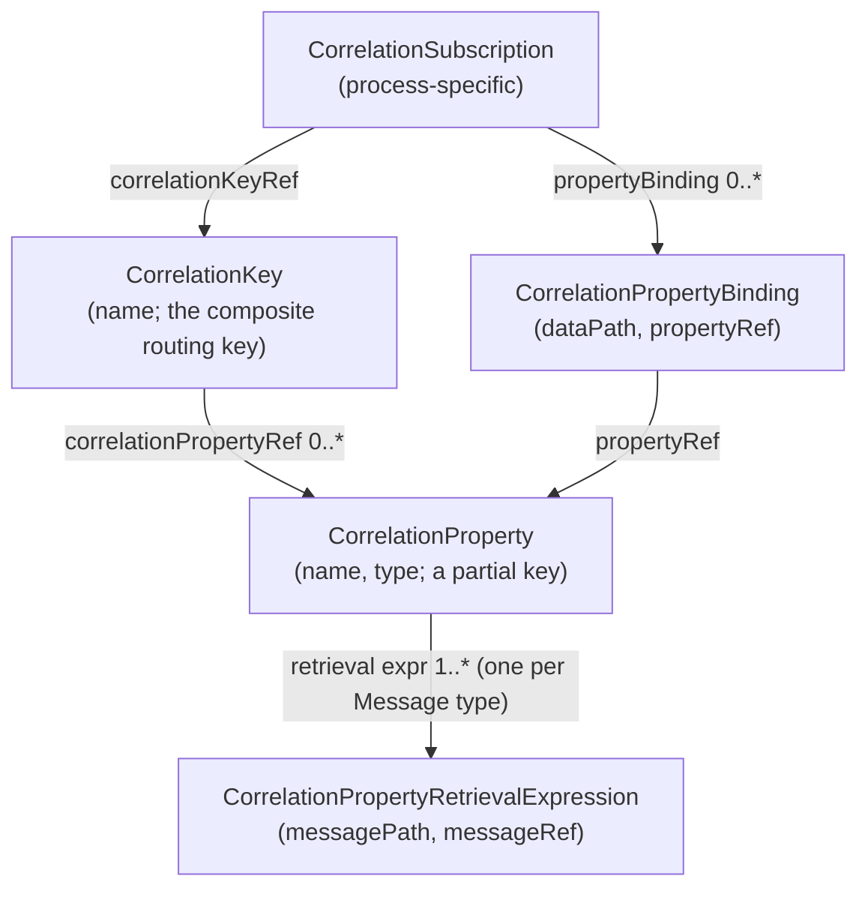
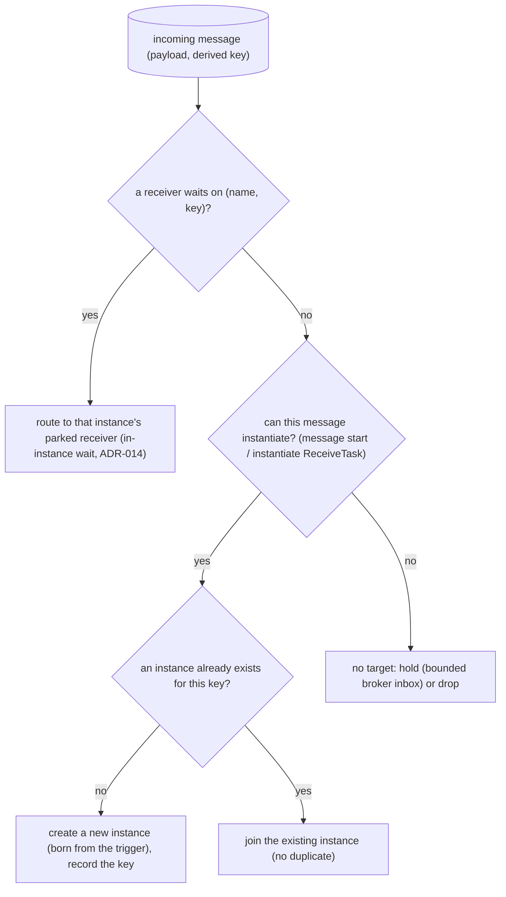
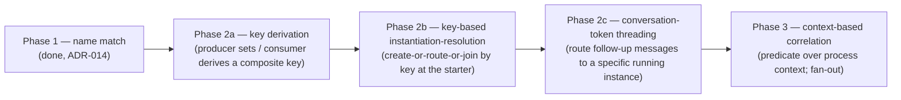

# ADR-016 — Корреляция сообщений

| Поле | Значение |
|---|---|
| Статус | Принято |
| Версия | v.1 |
| Дата | 2026-06-16 |
| Владелец | Ruslan Gabitov |
| Уточняет | [ADR-001 v.5 Execution Model](ADR-001-execution-model.ru.md) |

> **Принято** — концепция решена; её первые фазы (2a — вывод ключа, 2b —
> инстанцирование с разрешением по ключу) реализованы, тогда как «протягивание»
> conversation-token (фаза 2c) и контекстная корреляция (фаза 3) остаются
> решёнными-но-отложенными (§2.8). Полностью фиксирует концепцию **корреляции
> сообщений**: как входящее сообщение сопоставляется с conversation/экземпляром,
> которому оно принадлежит, **модель разрешения «сообщение → экземпляр»**
> (маршрутизировать в существующий экземпляр, либо создать новый, либо
> придержать) и **фазирование** корреляции (ключевая — сейчас, протягивание
> conversation-token и контекстная корреляция — позже). Выделено из
> [ADR-015 v.1](ADR-015-event-triggered-instantiation.ru.md), который сохраняет
> **инстанцирование по событию**; это два sibling-документа — ADR-015 владеет
> *когда сообщение создаёт экземпляр*, а данный ADR — *какому экземпляру
> принадлежит сообщение*. Обосновано **BPMN 2.0 §8.4.2** (Correlation) и его
> смежными пунктами (§13.2 / §13.3.3 / §13.5.1). Реализующие SRD выполняют
> работу на уровне файлов и кода.

## 1. Контекст и проблема

Долгоживущий движок выполняет множество экземпляров одного и того же процесса
параллельно — по одному на заказ, на клиента, на заявку. Когда приходит
асинхронное сообщение, движок ДОЛЖЕН решить (§8.4.2, p72):

- создаёт ли это сообщение **новый** экземпляр или маршрутизируется в
  **существующий**?
- если в существующий — то *в какой*?

BPMN отвечает **корреляцией**: значения, **извлечённые из самого payload-а
сообщения** (`orderID`, `customerID`), определяют conversation, которому
принадлежит сообщение — без технических «липких» токенов. Фаза-1, сопоставление
по имени (ADR-014 §2.6) — сообщение достигает waiter-а, подписанного на то же
имя сообщения — не способна различить два выполняющихся процесса-заказа, оба
ждущие `"payment received"`. Корреляция и есть тот различитель.

Это было объединено в ADR-015, пока непосредственной целью была работа по
инстанцированию. Корреляция — крупная тема сама по себе: объектная модель из
пяти элементов, два неисключающих механизма (ключевой, контекстный), модель
идентичности conversation и инвариант «не более одного получателя на ключ» — и
она пронизывает *все* конечные точки сообщений (задачи **и** события; §8.4.2,
сноска 1), а не только инстанцирование. Она заслуживает собственного ADR, чтобы
концепция была полной, а отложенные части (протягивание conversation-token,
контекстная корреляция) получили именованный концептуальный дом, а не жили как
ad-hoc сужения в SRD.

### 1.1 Корреляция и инстанцирование — один алгоритм, два ADR

BPMN §8.4.2 формулирует единый **алгоритм разрешения «сообщение → экземпляр»**:
корреляция сопоставляет сообщение с conversation/экземпляром; если совпадения
нет, а сообщение может инстанцировать — создаётся новый экземпляр.
Инстанцирование — это ветка «нет существующего совпадения, но можно
инстанцировать».

Мы разделяем *документацию* по концептуальному шву, а не алгоритм:

- **Данный ADR (корреляция)** — *какому* экземпляру принадлежит сообщение:
  модель ключа, вывод/сопоставление, решение о разрешении, идентичность
  conversation.
- **[ADR-015 (инстанцирование по событию)](ADR-015-event-triggered-instantiation.ru.md)**
  — *само создание* экземпляра при срабатывании стартового триггера:
  instance-starter уровня определения, born-from-event-посев, manual-start.

Алгоритм разрешения (§2.3) принадлежит сюда, потому что это решение корреляции;
starter из ADR-015 это решение потребляет.

## 2. Решение

### 2.1 Объектная модель — стандартная, дословно

gobpm моделирует корреляцию пятью элементами BPMN ровно так, как они заданы
(§8.4.2, Tables 8.31–8.35), сохраняя стандартную таксономию:

- **CorrelationKey** — составной ключ из одного или нескольких частичных ключей
  **CorrelationProperty**. Ключ **действителен только когда все** его свойства
  заполнены (§8.4.2; движок ДОЛЖЕН отслеживать состояние заполнения каждого
  свойства).
- **CorrelationProperty** — частичный ключ; несёт **по одному
  CorrelationPropertyRetrievalExpression на каждый тип сообщения** в
  conversation.
- **CorrelationPropertyRetrievalExpression** — `messagePath` (`FormalExpression`,
  извлекающий значение из payload-а `messageRef`) + `messageRef` (сообщение, к
  которому он применяется).
- **CorrelationSubscription** / **CorrelationPropertyBinding** — со стороны
  процесса, аналог для **контекстной** корреляции: выражения `dataPath` над
  контекстом процесса, а не над payload-ом сообщения (§2.5).

### 2.2 Ключевая корреляция (основной механизм)

Простой, эффективный механизм (§8.4.2, p74–75). Conversation идентифицируется
одним или несколькими `CorrelationKey`; обе стороны выводят один и тот же
составной ключ из общей структуры payload-а.

- **Заполнение (производитель / первый участник).** Первый send или receive в
  conversation заполняет ключ, вычисляя retrieval-выражение каждого свойства
  (чей `messageRef` совпадает с сообщением в полёте) над payload-ом сообщения.
  Производитель несёт выведенный составной ключ на исходящем сообщении («joint
  conversation token», §8.4.2).
- **Сопоставление (потребитель).** Входящее сообщение выводит свой составной
  ключ тем же способом — `messagePath` каждого свойства (выбранный по
  `messageRef`) вычисляется над **входящим** payload-ом — и выведенный ключ
  должен совпасть с инициализированным ключом conversation, чтобы туда
  маршрутизироваться.
- **Всё-или-ничего.** Составной ключ с любым неразрешённым свойством
  **недействителен** и не совпадает ни с чем — частичного совпадения не бывает.
- **Не более одного получателя на ключ (§13.3.3).** При ключевой корреляции
  движок НЕ ДОЛЖЕН иметь два активных получателя на один и тот же
  `CorrelationKey` одновременно; сообщение совпадает **не более чем с одним**
  экземпляром. (Контекстная корреляция ослабляет это до fan-out — §2.5.)

### 2.3 Модель разрешения «сообщение → экземпляр»

Каждое входящее сообщение разрешается одинаково, независимо от того,
заканчивается ли оно на задаче или на событии (§8.4.2, сноска 1 — send/receive
задачи и throw/catch события сообщений ведут себя для корреляции одинаково):

- **«Создать-или-маршрутизировать» атомарно по ключу (§13.5.1).** Два сообщения
  с *одним и тем же* ещё-не-существующим ключом НЕ ДОЛЖНЫ каждое порождать
  экземпляр — разрешение по `(name, key)` это **single-flight**: первое создаёт,
  конкурентные/последующие стартовые триггеры с тем же ключом **присоединяются**
  к этому экземпляру. «Новый или существующий» и сам акт создания — один
  атомарный шаг по ключу корреляции, а не check-then-act.
- **Специфичность: получатель с ключом побеждает wildcard-starter.** Когда и
  получатель существующего экземпляра с ключом, и instance-starter уровня
  движка могли бы принять сообщение, **побеждает получатель с ключом**
  (маршрутизация в существующий экземпляр); starter инстанцирует только когда
  ни один получатель с ключом не ждёт. Именно это делает выбор «в существующий
  или инстанцировать» детерминированным, а не зависящим от порядка регистрации.
- **Нет цели → забота брокера (§2.7).** Если ничто не совпало, а сообщение не
  может инстанцировать, распоряжение (придержать/отбросить/TTL) — политика
  брокера.

### 2.4 Протягивание conversation-token (решено; реализация фазирована)

Полная модель conversation — это **совместный токен, передаваемый туда-обратно**
в каждом сообщении обмена (§8.4.2): ключ инициализируется первым send/receive и
**сопоставляется на каждом последующем сообщении**; последующее сообщение, чей
ключ уже был инициализирован, ДОЛЖНО совпасть со значением conversation
(несовпадение = нет маршрутизации), а последующее, выводящее **ещё-не-
инициализированный** вторичный ключ, **лениво ассоциирует** это значение с
conversation.

Концептуально решено здесь. Два следствия для движка:

- Выполняющийся экземпляр несёт свой conversation-ключ (или ключи); его
  in-instance-получатели сопоставляют входящие сообщения по `(name, key)`, так
  что последующее сообщение маршрутизируется в *конкретный* экземпляр, чьему
  conversation оно принадлежит (§2.3, специфичность).
- Ленивая инициализация вторичного ключа и многоключевая слоистая маршрутизация
  — часть этой модели.

**Фазирование.** Маршрутизация последующего сообщения в *конкретный уже
выполняющийся* экземпляр через его получателя с ключом (полное протягивание
токена) **отложена** в следующий SRD; первая реализация landing-ит
**инстанцирование с разрешением по ключу** (решение create-or-route-or-join у
starter-а, §2.3), которое уже реализует «два параллельных экземпляра, различаемых
по ключу» и «последующий старт присоединяется к существующему, без дубликата».
Отсрочка — решённая фаза *этой* модели, а не сужение — см. §2.8.

### 2.5 Контекстная корреляция (решено; отложено)

Более выразительный механизм (§8.4.2 p76; «predicate-based» в §13.3.3),
построенный **поверх** ключевой и **неисключающий** с ней. Процесс предоставляет
`CorrelationSubscription`, чьи выражения `CorrelationPropertyBinding.dataPath`
вычисляются над **контекстом процесса** (data objects / properties), а не над
payload-ом сообщения. Он **реактивен**: при изменении ссылаемого элемента данных
подписка перевычисляется, так что процесс может **перенацелить** на ходу, какие
сообщения он принимает. В отличие от ключевой (не более одного получателя на
ключ), predicate-based МОЖЕТ доставить сообщение **нескольким** получателям
(fan-out; сообщение не «съедается» после первой доставки). Решено как концепция;
реализуется после ключевой.

### 2.6 Где объявляются ключи корреляции — без Conversation (заметка движка)

В BPMN `CorrelationKey` принадлежит `Conversation` (§8.4.2 / §9.5.1). Полная
метамодель `Conversation` / `Collaboration` (`Pool`, `Participant`,
`ConversationNode`) **вне области Process-Execution-Conformance**, однако
**логический conversation** — группировка сообщений, разделяющих ключ, область
идентичности обмена — упоминается правилами маршрутизации экземпляров (§13.2 /
§13.5.1) и не может быть чисто вырезан.

**Выбор движка (намеренное, обоснованное стандартом отклонение):** gobpm
объявляет `CorrelationKey` на **уровне процесса** (стандарт уже привязывает
ключи к процессу через `CorrelationSubscription`), а стартовое событие
сообщения / получатель / отправитель ссылается на ключ, по которому он
коррелирует. **Объектная модель стандарта сохранена дословно** (§2.1) — заменён
лишь *контейнер* (элемент `Conversation`) на процесс. Логический conversation
выживает как «привязка между конечными точками сообщений процесса и внешним
миром». Контейнер `Conversation` остаётся штатной отдушиной стандарта, если
когда-либо понадобится кросс-процессная группировка (отложено).

### 2.7 Сообщения без цели — забота брокера (ограниченный буфер)

Разрешение даёт существующий экземпляр, новый или **отсутствие цели**. Стандарт
**молчит** о случае «нет цели» (§8.4.2: движок «drops or holds the message per
implementation policy»). Данный ADR владеет **разрешением**, а не **временем
жизни сообщения**: распоряжение сообщением без цели (drop / hold / TTL /
dead-letter) и то, как придержанное сообщение достигает позднего потребителя —
**заботы брокера** ([ADR-002 v.1](ADR-002-extension-architecture.ru.md) /
будущий ADR-008 Distribution & Scale). Два свойства держатся независимо от
брокера:

- **Придерживание ДОЛЖНО быть ограниченным** — брокер, удерживающий сообщения
  без цели, ДОЛЖЕН ограничивать удержанное (по числу и/или памяти) и вытеснять
  сверх этого, чтобы backlog **никогда не исчерпал память** (принцип
  bounded-in-memory-defaults, ADR-002). In-memory-брокер по умолчанию уже
  ограничивает свой inbox и отбрасывает самые старые сверх предела.
- **Доставка — pull-on-subscribe (текущий дефолт)** — придержанное сообщение
  пере-рассматривается только когда подписывается совпадающий потребитель
  (in-instance-получатель, когда до него доходит токен; instance-starter при
  регистрации процесса), который сливает совпадающие буферизованные сообщения.
  Фонового sweeper-а нет.

Распоряжение «нет цели» задумано как **настраиваемая политика брокера**:
**отбрасывать или хранить**, **сколько** (число удержания), **как долго** (TTL).
**Нижняя граница по числу не обсуждается**; TTL и режим drop/keep — выбор
оператора. Проектирование этих ручек — дело брокера (ADR-002 / ADR-008), а не
данного ADR. Издателю ошибка не возвращается (на этом слое — fire-and-forget).

### 2.8 Фазирование

- **Фаза 1 (готово)** — сопоставление по имени (ADR-014 §2.6).
- **Фаза 2a (готово)** — **вывод** составного ключа из payload-а (все свойства
  обязательны) и установка производителем выведенного ключа на исходящем
  сообщении.
- **Фаза 2b (далее)** — **инстанцирование с разрешением по ключу**: starter
  выводит входящий ключ и делает атомарный create-or-route-or-join (§2.3);
  производитель несёт ключ. Реализует «два экземпляра, различаемых по ключу» и
  «последующий старт присоединяется к существующему».
- **Фаза 2c (отложено)** — **протягивание conversation-token** (§2.4):
  in-instance-получатели с ключом + маршрутизация по специфичности, чтобы
  последующее сообщение достигало *конкретного* выполняющегося экземпляра;
  ленивая инициализация вторичного ключа.
- **Фаза 3 (отложено)** — **контекстная** корреляция (§2.5).

### 2.9 Не-цели (у каждой — именованный дом)

- **Метамодель `Conversation` / `Collaboration`** (`Pool`, `Participant`, …) —
  вне области conformance; ключи объявляются на процессе (§2.6).
- **Корреляция инстанцирования через event-based gateway** (§13.4.4 / §10.6.6,
  включая ограничение одинаковой корреляции parallel-event-gateway) — нужен узел
  event-based gateway; веха реализации шлюзов.
- **Реализация контекстной / predicate-корреляции** — решено (§2.5),
  реализуется после ключевой.
- **Реализация протягивания conversation-token** — решено (§2.4), фаза 2c.
- **Долговечное состояние корреляции между перезапусками** — ADR по Persistence.
- **Гарантии межэкземплярной доставки, упорядочивание, dead-letter** — заботы
  качества брокера (ADR-002 / ADR-008).

## 3. Последствия

- У корреляции единый концептуальный дом; ADR-015 (инстанцирование) и ADR-014
  (обработка сообщений) ссылаются на неё вбок за *каким экземпляром*.
- Модель разрешения (§2.3) объединяет in-instance-ожидание (ADR-014) и
  инстанцирование (ADR-015): одно дерево решений, три исхода (маршрутизировать /
  создать / придержать). Нет параллельного пути корреляции на каждый вид
  конечной точки (§8.4.2, сноска 1).
- Фазированная модель позволяет инстанцированию с разрешением по ключу
  приземлиться сейчас, тогда как протягивание conversation-token и контекстная
  корреляция остаются *решёнными*, а не импровизируемыми, когда придут их SRD.
- Инвариант «не более одного получателя на ключ» (§13.3.3) и действительность
  ключа «все свойства обязательны» становятся обязательствами движка, которые
  реализующие SRD должны соблюдать.

## 4. Рассмотренные альтернативы

| Альтернатива | Почему отвергнута |
|---|---|
| **Корреляция в брокере** (брокер выводит ключи и маршрутизирует в экземпляры) | Брокер — транспортная граница (ADR-002), намеренно model-agnostic — он сопоставляет лишь по имени + непрозрачному ключу. Размещение извлечения payload-а + модели conversation в брокере связывает транспорт с объектной моделью BPMN и блокирует альтернативные брокеры. Корреляция — забота **движка**; брокер несёт непрозрачный выведенный ключ. |
| **Потребитель слепо доверяет ключу, установленному производителем** (без вывода на стороне потребителя) | Проще, но ломает симметрию стандарта — потребитель ДОЛЖЕН выводить по *своим* retrieval-выражениям для сопоставления (§8.4.2), и внешний производитель может вообще не выставлять ключ. Установленный производителем ключ — оптимизация на проводе; потребитель всё равно выводит для валидации/маршрутизации. (Starter фазы 2b выводит из payload-а; он не доверяет ключу с провода слепо.) |
| **Технические «липкие» ID корреляции** (conversation-токены, назначаемые движком) | Ровно то, чего корреляция BPMN избегает (§8.4.2): корреляция использует бизнес-значения из payload-а, чтобы не навязывать участникам внеполосную возню с токенами. |
| **Оставить корреляцию внутри ADR-015** | Смешивает две заботы; отложенные части (протягивание токена, контекстная) не имели концептуального дома и всплывали как ad-hoc сужения в SRD. Sibling-ADR держит каждый ADR самодостаточным (это выделение). |
| **Одна объединённая «фаза 2 корреляции»** (ключевая + протягивание токена вместе) | Слишком крупно и рискованно для одного landing-а; протягивание токена требует in-instance-получателей с ключом + маршрутизации по специфичности + проброса ключа через шов регистрации. Фазирование 2a/2b/2c приземляет проверяемую ценность рано. |

## 5. Рекомендации по enterprise-готовности

- **Наблюдайте исходы корреляции, но не payload-ы.** Эмитьте структурированное
  событие на каждое разрешение — `name`, выведенный ключ (или его хеш), исход
  (routed / created / joined / held) и id целевого экземпляра — но **никогда** не
  значения payload-а и не сырые компоненты ключа (они несут бизнес-PII). Это тот
  аудит-след, который операторам нужен для отладки неверной маршрутизации.
- **Сделайте разделитель/хеширование ключа явным и стабильным.** Составной ключ
  — контракт между независимо развёрнутыми производителями и потребителями;
  задокументируйте правило соединения/нормализации, чтобы производитель и
  потребитель, собранные раздельно, выводили идентичные ключи.
- **Выведите инвариант «один получатель на ключ» в валидацию.** Модель с двумя
  активными ключевыми получателями на один ключ некорректна (§13.3.3); отмечайте
  это при регистрации, где возможно, и охраняйте в рантайме, когда MI-активности
  могут порождать получателей динамически.
- **Относитесь к удержанию сообщений как к операционному SLO.** Ограниченный
  inbox (§2.7) отбрасывает самые старые под давлением; выставьте его
  глубину/число вытеснений метрикой, чтобы операторы видели backlog корреляции
  до того, как он станет тихой потерей сообщений.
- **Планируйте долговечное состояние корреляции.** In-memory ключи/подписки
  теряются при перезапуске; развёртывание, которое должно переживать перезапуски,
  нуждается в ADR по Persistence прежде, чем полагаться на долгие conversation.

## 6. Ссылки

- **BPMN 2.0 §8.4.2** (Correlation, pp.72–78; Tables 8.31–8.35) и смежные пункты
  **§13.2 / §13.3.3 / §13.5.1** (инстанцирующий старт, receive task, start event),
  **§13.4.4 / §10.6.6** (event-based gateway), **§9.5.1** (Conversation, только
  контекст) — управляющий стандарт, через вендоренную выжимку.
- [ADR-015 v.1 Event-triggered instantiation](ADR-015-event-triggered-instantiation.ru.md)
  — sibling; потребляет решение о разрешении (§2.3) в instance-starter.
- [ADR-014 v.1 Message Handling](ADR-014-message-handling.ru.md) — шов
  производитель/потребитель, `MessageBroker`/`MessageWaiter` и поле ключа
  `Envelope`, на которых эта корреляция едет.
- [ADR-006 v.1 Events & Subscriptions](ADR-006-events-and-subscriptions.md) —
  принадлежащий EventHub жизненный цикл waiter-ов, который расширяют получатели
  с ключом.
- [ADR-002 v.1 Extension Architecture](ADR-002-extension-architecture.ru.md) —
  граница `MessageBroker` и bounded-in-memory-дефолты (§2.7).
- [ADR-001 v.5 Execution Model](ADR-001-execution-model.ru.md) —
  экземпляры/треки, которые питает модель разрешения.

## 7. Открытые вопросы

Нет.

## История документа

| Версия | Дата | Изменение |
|---|---|---|
| v.1 (Принято) | 2026-06-16 | **Принято** — концепция решена; фазы 2a (вывод ключа) и 2b (инстанцирование с разрешением по ключу) реализованы landing-SRD; фаза 2c (протягивание conversation-token) и фаза 3 (контекстная корреляция) решены-но-отложены (§2.8). |
| v.1 | 2026-06-16 | Первичный черновик. Выделил концепцию корреляции из ADR-015 v.1 (объектная модель, ключевой механизм, модель разрешения, протягивание conversation-token, контекстная корреляция, объявление ключей без Conversation, нет-цели/ограниченный буфер) и добавил фазирование (2a/2b/2c/3). |
