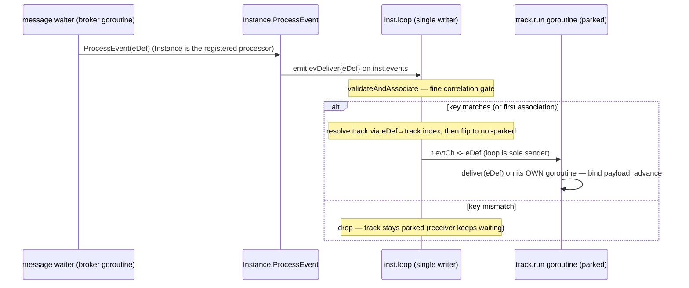
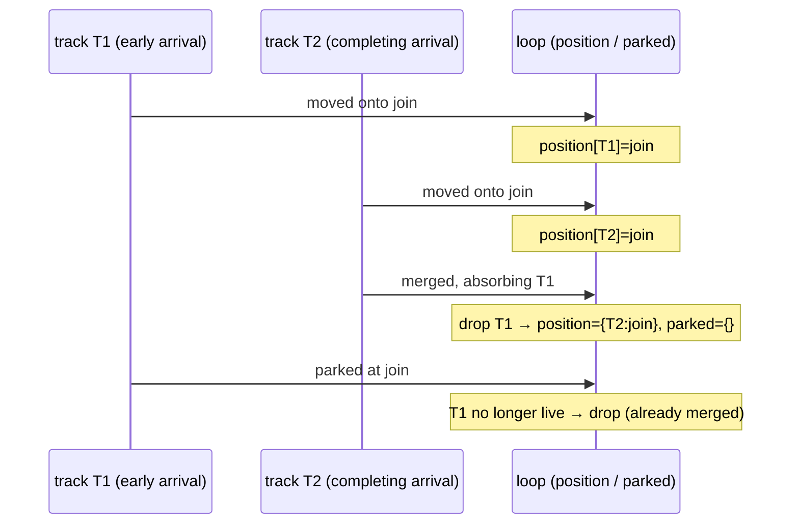
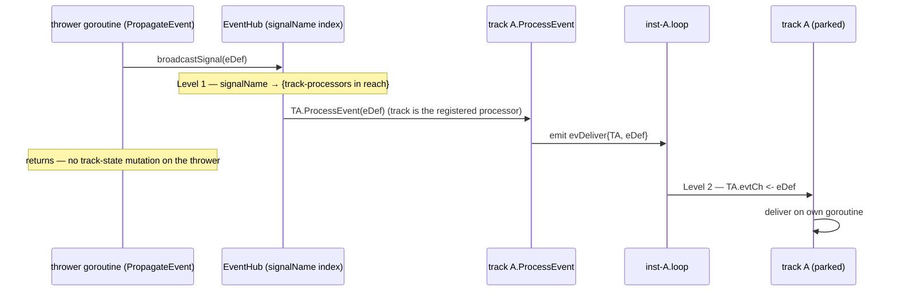

# ADR-017 — Channel-based event processing (single-writer execution model)

| Field | Value |
|---|---|
| Status | Accepted |
| Version | v.1 |
| Date | 2026-06-25 |
| Owner | Ruslan Gabitov |
| Refines | [ADR-001 v.5 Execution Model](ADR-001-execution-model.md) |

> **Accepted (conception decided; both slices landed by the accompanying SRDs — SRD-027 inbound,
> SRD-028 outbound).** Reworks the
> event-processing subsystem (EPS) onto a **Go-native, channel-based** model with two rules: a
> waiting track receives events by **parking on a channel** fed **only by the per-instance loop**
> (a producer *emits* the fired event to the loop, it never calls into the track), and a track
> **never exposes its mutable state for others to read** — the **loop is the single owner** of the
> shared view (token positions, join state). This extends ADR-001 v.5's single-writer principle to
> **both** event delivery and cross-goroutine state reads, eliminating — by construction — the race
> class that has been patched site by site. Because the loop is *already* the single writer of
> lifecycle state, making it the single **dispatcher** of inbound events too means teardown,
> broadcast fan-out, and deferred-choice atomicity all fall out of **one** mechanism. The model
> lands as two SRD slices (inbound, then outbound).

---

## 1. Context & problem

ADR-001 v.5 makes the per-instance **loop** the single owner of an instance's lifecycle state:
tracks never mutate that state directly — they **emit** events to the loop (`inst.events`), which
applies them in order on one goroutine, so no lock guards lifecycle state. That single-writer
discipline is what makes the engine's concurrency tractable.

**The event-processing subsystem bypasses that discipline**, on both sides of the track boundary:

- **Inbound — synchronous foreign-goroutine delivery.** `EventProducer` calls a track's
  `ProcessEvent` **on the producer's own goroutine** — mutating the track (advancing it past its
  wait, transitioning its state, appending its next step) *while the track's own goroutine is
  concurrently reading and executing it*. Signal delivery is the worst case: `PropagateEvent →
  broadcastSignal → ProcessEvent` runs entirely on the *thrower's* goroutine. The waiting track
  meanwhile **busy-spins** (`track.run` loops on `TrackWaitForEvent` with a `runtime.Gosched`),
  burning CPU, and track-status access is guarded by **mutexes** to paper over the two goroutines.
- **Outbound — cross-goroutine state reads.** The loop (and joins) **read a track's positions
  directly** while the track's goroutine advances them, so the loop observes another goroutine's
  half-settled state.

This is not the Go way — *"don't communicate by sharing memory; share memory by communicating"* —
and it violates ADR-001 v.5's model. The cost is a **recurring race class**, not isolated bugs:

- A **waiter goroutine mutating a track while its own run loop reads it** — the concurrent-fire /
  deferred-choice double-win at the Event-Based gateway (two events both pass the "still waiting?"
  guard; the run loop executes a position the waiter moved out from under it).
- The **loop reading track positions while a track's goroutine advances them** — a satisfiable
  Complex / OR-join transiently read as unsatisfiable and spuriously aborted.

Each has been patched **site by site** — a per-track event mutex, a re-read of the position after
the wait-guard, a `runtime.Gosched` to stop the busy-spin starving the loop, a one-shot positional
snapshot. Each patch is correct; the *class* persists, because **delivery and state-sharing run on
the wrong goroutines**. The root cause is structural and is best removed structurally.

## 2. Decision

**Extend the single-writer principle across the whole EPS** with two rules — both instances of
*communicate, don't share* — realized through the loop the engine already runs.

### Rule 1 — Inbound (events → track): channel-park, loop-dispatched

A waiting track exposes a **buffered channel** (`t.evtCh`, a fixed single-slot buffer — see §3) and
parks in a blocking `select { case <-ctx.Done(): … case eDef :=
<-t.evtCh: … }`. A producer **never mutates track state** and **never sends to its channel
directly**: a producer's `ProcessEvent` only **emits** the fired event to the loop and returns (it no
longer touches the track), and the **loop is the sole sender** to a track's channel. Everything
inbound funnels through `inst.events` — the same channel tracks already use to report lifecycle
changes — and the loop dispatches from the registry it *already owns* (`inst.tracks`, lock-free). No
busy-spin (a blocked goroutine parks at zero CPU), no event mutex (only the track's own goroutine
touches its state when it receives), no idle computation.

**What the hub holds as the registered `EventProcessor` is chosen by trigger — and the choice is
driven by one question: *does this trigger correlate?*** Correlation is the only reason to centralize
the hub boundary above the track, and in BPMN it is a **Message-only** condition (Correlation §8.4.2;
`docs/bpmn-spec/conformance.md:113`, `:177`).

- **Message — the Instance is the registered processor.** Message is the only BPMN trigger matched
  by a key derived from the event payload (`docs/bpmn-spec/semantics/event-handling.md:220`: a
  subscriber "doesn't see a published Message unless the Message's correlation matches the
  subscriber's Conversation correlation"). That matching state — the conversation keys, their lazy
  association (ADR-016 v.1), and the keyed broker subscription — is **instance-owned**, so the
  Instance is the natural boundary: it subscribes once carrying its keys, and its `ProcessEvent`
  emits `evDeliver` to its own loop. The **loop** then runs the fine correlation gate
  (`validateAndAssociate`): a non-matching publication is **dropped with the track left parked** (the
  receiver keeps waiting — `event-handling.md:220`); a match flips the track and is dispatched. The
  loop resolves the target track through a **per-instance `eDef → track` index** it builds as tracks
  park.
- **Signal, Timer — the track is the registered processor.** Neither correlates. Signal is an
  unscoped **broadcast** ("Signals do NOT use correlation. Every catching Signal handler in reach …
  receives the Signal" — `event-handling.md:221`) whose fan-out already addresses each catching track
  directly; Timer is **clock-driven**, point-to-point per instance. For both, the track is an opaque
  `EventProcessor` to the hub: its `ProcessEvent` emits `evDeliver` to the loop, which dispatches.
  Routing these through the Instance would force a needless internal re-fan-out and centralize no
  matching state.

In **every** case the producer's `ProcessEvent` only **emits to the loop and returns**; the loop is
the universal dispatcher. So a mixed-trigger **Event-Based gateway** (*receive-reply OR timeout* — a
message arm and a timer arm on one track) stays correct: the message arm registers via the Instance,
the timer arm via the track, but **both deliveries meet at the same loop targeting the same track**,
where the deferred-choice flip (§3) picks the winner. The flip is never split across registration
paths because Model Y funnels everything through the loop regardless of who was registered.

Signal and Timer skip the Instance: their producer calls the **track's** `ProcessEvent`, which emits
`evDeliver{track}` to the loop (the broadcast path is diagrammed below).

**Matching (concrete, not a framework).** The loop addresses the track(s) a fired event targets. For
**message**, the Instance's loop resolves the track via the per-instance `eDef → track` index above
(message correlation keeps its two-tier shape — a coarse name+key match in the broker, then the fine
`validateAndAssociate`, now run **in the loop** rather than on the track goroutine; unchanged from
ADR-014/016 in *what* it matches). For **signal** — unscoped broadcast within reach — a
`map[signalName][]subscriber` index replaces today's O(n) linear scan of *all* waiters. A general
polymorphic match key over every BPMN trigger kind is **deliberately deferred**: only
signal/message/timer are wired today, and universality for three cases costs more than it brings; the
index — and the instance-vs-track boundary — generalize when Error / Escalation / Link / Conditional
actually land.

**Engine note — why only Message is instance-level.** Centralizing the hub boundary at the Instance
earns its keep exactly when there is **instance-scoped matching state** to own: conversation keys and
their association. That is a Message-only condition. Signal broadcasts without correlation
(`event-handling.md:221`), Timer fires by the clock, and the not-yet-built data/internal triggers
either evaluate against local data (Conditional) or route **structurally through the scope chain**,
not by an external key (Error / Escalation: `event-handling.md:218` — "walk from the throwing scope
outward … checking each for a catching Event with matching `errorRef`/`escalationRef`"). The rule is
therefore **instance-as-processor iff the trigger correlates**, which today means **Message alone**;
the boundary moves only if a future correlated trigger lands.

### Rule 2 — Outbound (track state → loop): the loop owns the shared view

A track **never exposes mutable state for others to read while it is running**. It **emits** its
state changes — position moves, lifecycle transitions — to the loop, and the **loop is the sole
owner** of the instance's authoritative shared state (token positions, join state) that reachability
and joins consult. The loop never reads a **live** track's position or state; it reads only its own
loop-owned view.

The one place the loop touches a track's own fields is **finalizing a quiescent track** — flipping a
merged track to `Merged` and recording the transition after its goroutine has returned or parked on
its resume channel; that is the ADR-001 single-writer pattern, ordered by the same `emit`/`parkCh`
handoff, not a concurrent read. Since `track` is an **unexported entity of the instance package**
(the loop and the track cooperate inside one internal abstraction, not across a public boundary), a
small per-track lock is **retained** to guard that handoff rather than removed — making a track's
state lock-free-by-construction would rest correctness on happens-before reasoning without structural
enforcement, a deliberate non-goal for no practical gain (the lock is uncontended).

Together, **a live track's state is touched by exactly one goroutine**, and everything else
cross-goroutine is a channel send into the loop. Rule 1 and Rule 2 are not two mechanisms but one: the loop the
engine already runs becomes the single point that both *applies* track-emitted changes and
*dispatches* inbound events — the same move ADR-001 v.5 made for lifecycle state, now covering the
two EPS paths that still bypassed it.

### Rule 2 mechanics — building the loop-owned view

The loop-owned shared view is two maps, each keyed by track:

- **position** — every **live** track's current node. A track enters it when it is spawned (its
  initial node) and updates it on every move it reports; it leaves when it dies (ends / fails) or is
  merged away at a join.
- **parked** — the join node of every track currently suspended at a reachability/Complex join. It is
  a **subset** of the live set: a parked token still occupies its join, so a parked entry implies a
  position entry.

The loop builds both **purely from the events tracks emit** — it never reads a running track to learn
a position:

| track event | position | parked |
|---|---|---|
| spawned | set to the initial node | — |
| moved onto a node | set to that node | drop (moving ⟹ no longer parked) |
| parked at a join | — | set to that join — **iff** the track is still live and not terminating |
| awaiting (Parallel join) | keep (still alive at the join) | — |
| merged (absorbing others) | drop each absorbed track | drop each absorbed track |
| ended / failed | drop | drop |
| stop (shutdown) | clear | clear |

**Invariants.** `parked ⊆ position`; a node counts as *occupied* for reachability iff some live
track's position is that node; and a parked entry's join node is **carried in the park event**, never
inferred from the position view — so it cannot go stale or null.

**Edge case — the merge race.** When several branches arrive at one reachability join, each records
its arrival and, unless it completes the join, reports a park; the **completing** arrival instead
reports a merge that absorbs the others. Those reports race into the loop, so a completing merge can
be applied **before** a co-arriver's own park — and the merge has already dropped the absorbed track
from the view. The co-arriver's late park then finds the track **no longer live** and is **dropped**
(its fate is settled), rather than re-recording a stale, already-merged token.

The non-racing order (the park applied first) records the park, the recheck defers on the
still-in-transit completing token, and the later merge drops it — same end state, no stale entry.

**Edge case — shutdown.** On termination the loop clears the view and joins no longer fire; a track
that reaches a join afterwards still reports a park, which the loop **skips** — the track is woken by
context cancellation and unwinds, never by a loop recheck (mirroring the inbound wait's shutdown
guard).

### Broadcast fan-out is two-level

A signal reaches every catching handler in reach, across instances — and because Signal is
track-registered, the fan-out addresses each catching **track** directly (no instance-level
indirection). The hub does **Level 1** (`signalName → {track-processors in reach}`) and calls each
catching track's `ProcessEvent`, which emits an `evDeliver` to that track's own loop; each loop does
**Level 2** (the targeted send to its own parked track). The thrower mutates no track state — the
fan-out is N emits and a return.

The diagram shows one catcher; the hub repeats `ProcessEvent` per catching track in reach (across
instances), each emitting to its own loop.

## 3. Consequences

- **The race class is eliminated by construction.** No foreign-goroutine mutation (Rule 1); no
  cross-goroutine read of a **live** track's position/state (Rule 2). The per-track event mutex, the
  post-guard re-read, the `Gosched`, and the positional snapshot all become unnecessary. A small
  per-track lock is **kept** for the one remaining seam — the loop finalizing a *quiescent* merged
  track's lifecycle state under the `emit`/`parkCh` handoff, the ADR-001 single-writer pattern, not a
  concurrent touch (full lock removal is a deliberate non-goal — see Rule 2).
- **Deferred choice is atomic at the loop.** The loop is single-threaded, so when it dispatches the
  **first** matching event to a track it **flips that track to not-parked in the same step** and
  tears down the track's sibling subscriptions. A second event arriving for that track (the losing
  arm of an Event-Based gateway) then sees a not-parked target and is **correctly dropped** — the
  gateway already picked. The FIX-007 concurrent-fire double-win cannot occur; "exactly one arm
  wins" holds without a guard. This holds even for a **mixed-trigger** gateway (a message arm
  registered via the Instance, a timer arm via the track): both arms deliver `evDeliver` to the same
  loop targeting the same track, so the flip sees them serially — the hybrid registration never
  splits the choice.
- **Teardown is free by construction.** The loop is the **sole sender** to `t.evtCh` *and* the sole
  owner of the subscription index. "Unsubscribe" and "dispatch" are the same goroutine's serial
  steps, so the loop can never send to a track it just retired — the **send-on-closed-channel trap
  cannot arise**, and no `done`-guarded send is needed.
- **The loop hop is not net overhead — it substitutes for a lock.** A single delivery costs **two
  goroutine handoffs** — producer → loop (`emit(evDeliver)`) and loop → track (`t.evtCh`) — plus the
  track's ordinary post-delivery `emit` reporting its advance back to the loop. That **outbound
  notify is unavoidable in any design**: the loop is the single owner of lifecycle state (ADR-001
  v.5), so the track must report its state change however the event reached it. Model Y's inbound
  `emit(evDeliver)` is the *same channel-send machinery* as that mandatory notify, and it earns the
  loop the lock-free deferred-choice flip and teardown above. Alternative D (direct producer →
  `t.evtCh`) drops the inbound `emit` but must reintroduce a lock to make the flip atomic and to dodge
  send-on-closed — so it trades a cheap, lock-free channel send for a lock, not for nothing. The
  **hybrid adds no hop on top of this**: Message and Signal/Timer have identical handoff counts; only
  the registered adapter (Instance vs track) and the loop's in-line work for Message (the
  `eDef → track` lookup + the correlation gate, intrinsic to correlation) differ.
- **Synchronous producer→loop binding (bounded, decouplable later).** The hub invokes `ProcessEvent`
  synchronously on the producer goroutine; `emit`'s `<-loopDone` arm bounds this to the instance's
  lifetime — **no deadlock, no send-on-closed, and a stale processor reference is a safe no-op**
  (a dying instance unblocks the producer immediately rather than blocking it). Producers never run
  on a loop goroutine, so there is no reentrancy cycle (even a self-signal is `track → loop`). The
  only residual cost is **broadcast head-of-line latency** — signal fan-out is sequential on the
  thrower's goroutine — bounded by the loop's drain rate, and the loop does no CPU-bound work (node
  execution stays on track goroutines); **message is unaffected** (the broker calls
  `Instance.ProcessEvent` on a per-waiter goroutine, naturally parallel). Binding the hub to the
  **long-lived Instance** for Message is in fact *more* stable than a per-track binding (the
  reference lasts the instance's life, not each receive episode). Full decoupling — an async,
  buffered per-instance inbound queue the hub posts to without blocking — is the deferred
  buffered-intake / durability seam (§5), to be added **only on measured contention**, not
  speculatively.
- **Buffering / backpressure.** `t.evtCh` is a **fixed single-slot buffer** (a constant, not an
  engine option — under flip-on-dispatch the loop sends at most one event per parked episode, so one
  slot is exactly enough and the only correct value). The single slot decouples the loop's send from
  the track's scheduling so the loop never blocks; unbuffered would risk blocking it in the window
  between the track's `evWaiting` and its receive. The policy is **never drop an event aimed at a
  parked track**; dropping an event for an already-dispatched, not-parked track is correct (it is a
  losing arm, not a lost trigger). Ordering: per-track FIFO via the channel; per-instance, the
  loop's arrival order; cross-track, none — tracks are concurrent.
- **Execution serializes per instance for shared state; concurrency lives between instances.** The
  loop applies events and owns shared state on one goroutine, so an instance's shared-state changes
  are serial. This is acceptable and conventional — BPMN parallel branches are *orchestration*, not
  CPU-bound work, and mature engines (Zeebe, Temporal, Camunda) run a workflow instance
  single-threaded; real parallelism is **across** instances.
- **BPMN delivery semantics are preserved across the async boundary** — the async path changes
  *which goroutine applies* delivery, never *what* is delivered:
  - **Signal broadcast stays unscoped and name-matched.** "Signal publication is unscoped within
    reach: Signals do NOT use correlation. Every catching Signal handler in reach … receives the
    Signal. Engines need a Signal-name → set-of-subscribers index"
    (`docs/bpmn-spec/semantics/event-handling.md:221`; publication is "broadcast within and across
    Pools, Processes, and diagrams", ibid. :15). The Level-1 index is exactly that.
  - **A no-catcher broadcast stays a benign no-op** (ADR-006 v.1 §2.4: "No waiter ⇒ no-op, not an
    error"): an empty subscriber set emits nothing.
  - **Message correlation rejection still leaves the receiver waiting** — the fine
    `validateAndAssociate` runs **in the loop** when the Instance emits an inbound message; a
    non-matching publication is dropped and the track stays parked (`event-handling.md:220`). Moving
    the gate from the track goroutine to the loop changes *which goroutine* decides, never the
    verdict.
- **Net simplification once landed.** The site-by-site EPS guards are removed; the engine gains one
  place to reason about event ordering, delivery, and teardown, consistent with the rest of the
  single-writer model.

## 4. Alternatives considered

- **A — Loop-dispatched channel delivery + loop-owned state (chosen).** Track parks on a channel;
  the producer emits to the loop; the loop is the sole dispatcher to tracks and the sole owner of
  positions. Removes the race class by construction, no lock, and folds delivery, teardown,
  fan-out, and deferred-choice atomicity into **one** mechanism — the loop the engine already runs.
  This is the Go-native realization of the "loop owns one event flow" direction. The hub boundary is
  **per-trigger** (Rule 1): the Instance for Message (correlation is instance-owned), the track
  otherwise. Cost: a per-track channel and one extra in-process hop (producer → loop → track),
  negligible for orchestration.
- **B — Per-site locks / defensive re-reads (the status quo + the patches).** Guard each site
  individually (a per-track event mutex; re-read positions after a guard; a snapshot). *Rejected as
  the end state:* correct per site but does not generalize — lock proliferation, and every new
  delivery/read site must independently re-derive the correct interleaving; a missed site is a
  silent, rare race. Useful only as interim safety.
- **C — One coarse instance-wide lock around all delivery and run.** Serialize delivery and the run
  loop under a single instance lock. *Rejected:* serializes far more than necessary (kills track
  concurrency) and holding a lock across node execution invites deadlock — the same reasons
  ADR-001 v.5 chose emit-to-loop over a big lock.
- **D — Direct per-track channel (producer sends straight to `t.evtCh`).** The most literal "the
  channel is the parking primitive and the handoff" framing; lowest latency, no loop hop.
  *Rejected in favour of A:* it makes the producer the sender, so teardown returns as the producer's
  problem (a `done`-guarded send to dodge send-on-closed at every site), and the producer needs its
  own view of which tracks are parked — a **second registry racing the loop's `inst.tracks`**, which
  is exactly the cross-goroutine read Rule 2 forbids, merely relocated to the send side. A keeps a
  single owner; D trades that for a hop it does not need.
- **E — Uniform instance-as-processor (every trigger registered via the Instance).** Make the hub
  talk only to Instances; the Instance routes every fired event to its tracks. Conceptually tidy —
  the hub never holds a track. *Rejected in favour of the per-trigger boundary in A/Rule 1:* it pays
  a cost only Message redeems. Signal is the worst fit — a shared cross-instance signal waiter
  fanning out to **Instances** would force each Instance to **re-fan-out internally** to its catching
  tracks, replacing the broadcast's natural per-track addressing with an extra redispatch for zero
  correlation benefit; Timer gains nothing either. Uniformity here optimizes a non-problem (the hub
  holding an opaque `EventProcessor` leaks nothing for non-correlated triggers) while complicating
  the one path — broadcast — that is simplest per-track. The hybrid centralizes **only** where
  instance-scoped matching state exists.

## 5. Enterprise-readiness recommendations

- **Queue observability:** expose per-track `t.evtCh` depth and loop-dispatch counts (including
  dropped losing-arm events) as metrics, so operators see delivery saturation and deferred-choice
  contention before they become latency.
- **Foundation for durability/replay:** the per-instance loop intake is a single ordered point
  through which every applied event flows — the natural seam for **durable, replayable** delivery
  later (persist the intake stream; replay on hydration), a prerequisite for the deferred
  persistence workstream. Not required now, but the model must not preclude it.
- **Delivery-contract documentation:** the implementing SRD slices should specify the new async
  contract (ordering, the fixed single-slot buffer, teardown) as first-class public behaviour,
  since it changes how hosts and the broker observe delivery outcomes.

## 6. References

- [ADR-001 v.5 Execution Model](ADR-001-execution-model.md) — the single-writer principle (the loop
  owns shared state; tracks emit, the loop applies) that this ADR extends to event delivery **and**
  cross-goroutine state reads.
- [ADR-006 v.1 Events & subscriptions](ADR-006-events-and-subscriptions.md) — the event-delivery
  contract (broadcast, no-catcher no-op §2.4, waiter lifecycle) whose *semantics* are preserved
  across the new async boundary.
- [ADR-014 v.1 Message handling](ADR-014-message-handling.md) / [ADR-016 v.1 Message correlation](ADR-016-message-correlation.md)
  — the message broker stays the message backend; its two-tier correlation match (broker name+key,
  then the fine `validateAndAssociate`) is unchanged in *what* it matches. This rework relocates the
  fine step from the track goroutine to the **loop**, and makes the **Instance** the hub-facing
  processor for Message so its conversation keys and keyed subscription stay instance-owned.
- BPMN 2.0 — `docs/bpmn-spec/semantics/event-handling.md`: signal publication is unscoped within
  reach and carries no correlation (:221), publication is broadcast across Pools/Processes (:15),
  Message publication is correlation-matched (:220). The async path keeps these intact.

## 7. Rollout plan

The model lands as **two SRD slices on a single branch** (`feat/adr-017-eps-rework`), each authored
and implemented under the project's SDD discipline (its own SRD, milestones, and tests):

1. **Inbound slice (first).** Channel-park delivery: the per-track `t.evtCh`, the `evDeliver`
   loop-dispatch path, the **per-trigger hub boundary** (the Instance as the registered processor for
   Message, the track otherwise), the loop-side correlation gate (`validateAndAssociate`) with its
   per-instance `eDef → track` index, the `signalName → subscribers` index, deferred-choice
   atomicity, and subscription teardown. Removes the busy-spin, the per-track event mutex, the
   track's correlation-keys exposure, and the synchronous signal foreign-goroutine path; makes
   deferred choice free.
2. **Outbound slice (second).** Loop-owned positions: the loop becomes the sole owner of the
   token-position / join view that reachability and joins read, removing the loop-reads-track-state
   race (the Complex / OR-join transient spurious abort).

**Open questions: None.** Buffering/backpressure (a fixed single-slot buffer; never-drop for a
parked track), teardown (loop-as-sole-sender), and broadcast fan-out (the two-level index) are
decided above (§2–§3); the SRD slices fix the concrete signatures and tests, not the model.

## Document History

| Version | Date | Author | Change |
|---|---|---|---|
| v.1 (Accepted) | 2026-06-26 | Ruslan Gabitov | **Accepted** — conception decided and fully realized; both slices landed on `feat/adr-017-eps-rework`. **Rule 1 (inbound)** via SRD-027: a waiting track parks on `t.evtCh`, producers emit to the loop (`evDeliver`), the loop is the sole dispatcher; the busy-spin and the per-track event mutex are gone; an O(1) `signalName → subscribers` index replaces the broadcast scan; the Instance is the hub `EventProcessor` for Message (instance-owned correlation), the track for Signal/Timer. **Rule 2 (outbound)** via SRD-028: the loop owns the `position`/`parked` view, fed by `evMoved` + a node-carrying `evParked`; `joinPositions` is pure over those maps; the dead live `FlowChecker` is removed; `t.m` is retained for the quiescent merged-track finalization seam (full removal a deliberate non-goal — `track` is unexported within the instance package). The race-freedom gate is exercised: `make ci` green, `pkg/thresher` under `-race` ×40 clean, diff-coverage 99.7%. |
| v.1 (Draft) | 2026-06-25 | Ruslan Gabitov | Draft conception of the EPS concurrency model: a waiting track **parks on a channel** fed **only by the per-instance loop** (producers emit to the loop, never send to the track directly) and **never exposes mutable state for others to read** (the loop owns the shared view of positions/joins). Extends ADR-001 v.5's single-writer principle to both event delivery and cross-goroutine state reads, making the loop the single **dispatcher** of inbound events so teardown, broadcast fan-out, and deferred-choice atomicity fall out of one mechanism; eliminates the foreign-goroutine / cross-read race class by construction; preserves ADR-006 v.1 / ADR-014 / ADR-016 delivery semantics. The hub-facing `EventProcessor` is **per-trigger**: the **Instance** for Message (correlation — conversation keys, lazy association, keyed subscription — is instance-owned, so the fine `validateAndAssociate` runs **in the loop**, which resolves the target track via a per-instance `eDef → track` index) and the **track** for Signal/Timer (no correlation; broadcast/clock address the track directly). Signal matching becomes a `signalName → subscribers` index (the O(n) scan dropped); a general polymorphic match key, and the instance-vs-track boundary, are deferred until more event kinds land. Lands as two SRD slices (inbound, then outbound) on one branch. |
