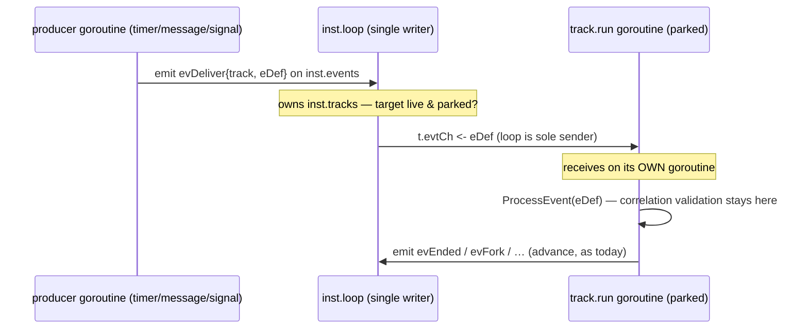
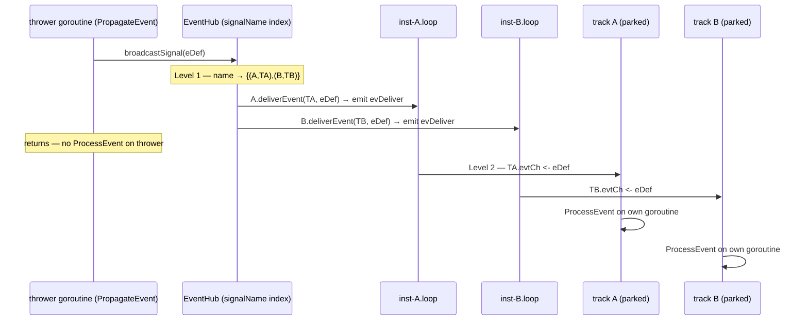

# ADR-017 — Channel-based event processing (single-writer execution model)

| Field | Value |
|---|---|
| Status | Draft |
| Version | v.1 |
| Date | 2026-06-22 |
| Owner | Ruslan Gabitov |
| Refines | [ADR-001 v.5 Execution Model](ADR-001-execution-model.md) |

> **Draft (conception; implementation sliced into accompanying SRDs).** Reworks the
> event-processing subsystem (EPS) onto a **Go-native, channel-based** model with two rules: a
> waiting track receives events by **parking on a channel** fed **only by the per-instance loop**
> (a producer *emits* the fired event to the loop, it never calls into the track), and a track
> **never exposes its mutable state for others to read** — the **loop is the single owner** of the
> shared view (token positions, join state). This extends ADR-001 v.5's single-writer principle to
> **both** event delivery and cross-goroutine state reads, eliminating — by construction — the race
> class that has been patched site by site. Because the loop is *already* the single writer of
> lifecycle state, making it the single **dispatcher** of inbound events too means teardown,
> broadcast fan-out, and deferred-choice atomicity all fall out of **one** mechanism. The model
> lands as two SRD slices (inbound, then outbound).

---

## 1. Context & problem

ADR-001 v.5 makes the per-instance **loop** the single owner of an instance's lifecycle state:
tracks never mutate that state directly — they **emit** events to the loop (`inst.events`), which
applies them in order on one goroutine, so no lock guards lifecycle state. That single-writer
discipline is what makes the engine's concurrency tractable.

**The event-processing subsystem bypasses that discipline**, on both sides of the track boundary:

- **Inbound — synchronous foreign-goroutine delivery.** `EventProducer` calls a track's
  `ProcessEvent` **on the producer's own goroutine** — mutating the track (advancing it past its
  wait, transitioning its state, appending its next step) *while the track's own goroutine is
  concurrently reading and executing it*. Signal delivery is the worst case: `PropagateEvent →
  broadcastSignal → ProcessEvent` runs entirely on the *thrower's* goroutine. The waiting track
  meanwhile **busy-spins** (`track.run` loops on `TrackWaitForEvent` with a `runtime.Gosched`),
  burning CPU, and track-status access is guarded by **mutexes** to paper over the two goroutines.
- **Outbound — cross-goroutine state reads.** The loop (and joins) **read a track's positions
  directly** while the track's goroutine advances them, so the loop observes another goroutine's
  half-settled state.

This is not the Go way — *"don't communicate by sharing memory; share memory by communicating"* —
and it violates ADR-001 v.5's model. The cost is a **recurring race class**, not isolated bugs:

- A **waiter goroutine mutating a track while its own run loop reads it** — the concurrent-fire /
  deferred-choice double-win at the Event-Based gateway (two events both pass the "still waiting?"
  guard; the run loop executes a position the waiter moved out from under it).
- The **loop reading track positions while a track's goroutine advances them** — a satisfiable
  Complex / OR-join transiently read as unsatisfiable and spuriously aborted.

Each has been patched **site by site** — a per-track event mutex, a re-read of the position after
the wait-guard, a `runtime.Gosched` to stop the busy-spin starving the loop, a one-shot positional
snapshot. Each patch is correct; the *class* persists, because **delivery and state-sharing run on
the wrong goroutines**. The root cause is structural and is best removed structurally.

## 2. Decision

**Extend the single-writer principle across the whole EPS** with two rules — both instances of
*communicate, don't share* — realized through the loop the engine already runs.

### Rule 1 — Inbound (events → track): channel-park, loop-dispatched

A waiting track exposes a **buffered channel** (`t.evtCh`, depth a parametrized engine option,
**default 1** — see §3) and parks in a blocking `select { case <-ctx.Done(): … case ev :=
<-t.evtCh: … }`. A producer **never calls into the track** and **never sends to the track
directly**: it **emits the fired event to the per-instance loop** — the same `inst.events` channel
tracks already use to report lifecycle changes — and returns. The **loop is the sole sender** to a
track's channel: it looks up the target track in the registry it *already owns* (`inst.tracks`,
lock-free) and dispatches. No busy-spin (a blocked goroutine parks at zero CPU), no event mutex
(only the track's own goroutine touches its state when it receives), no idle computation.

**Matching (concrete, not a framework).** The loop dispatches to the track(s) a fired event
addresses. For the **per-instance** kinds — timer and message — the waiter already knows its target
track, so addressing is direct (message correlation keeps its two-tier shape: a coarse name+key
match in the broker, then the fine `validateAndAssociate` on the track goroutine — unchanged from
ADR-014/016). For **signal** — unscoped broadcast within reach — a `map[signalName][]subscriber`
index replaces today's O(n) linear scan of *all* waiters. A general polymorphic match key over
every BPMN trigger kind is **deliberately deferred**: only signal/message/timer are wired today, and
universality for three cases costs more than it brings; the index generalizes when Error /
Escalation / Link / Conditional actually land.

### Rule 2 — Outbound (track state → loop): the loop owns the shared view

A track **never exposes mutable state for others to read**. It **emits** its state changes —
position moves, lifecycle transitions — to the loop, and the **loop is the sole owner** of the
instance's authoritative shared state (token positions, join state) that reachability and joins
consult. No goroutine reads another goroutine's state; the loop reads only its own.

Together, **a track's state is touched by exactly one goroutine**, and everything cross-goroutine
is a channel send into the loop. Rule 1 and Rule 2 are not two mechanisms but one: the loop the
engine already runs becomes the single point that both *applies* track-emitted changes and
*dispatches* inbound events — the same move ADR-001 v.5 made for lifecycle state, now covering the
two EPS paths that still bypassed it.

### Broadcast fan-out is two-level

A signal reaches every catching handler in reach, across instances. The hub does **Level 1**
(`signalName → {(instance, track)}`) and emits an `evDeliver` to each target instance's loop; each
loop does **Level 2** (the targeted send to its own parked track). The thrower touches no track — it
emits N times and returns.

## 3. Consequences

- **The race class is eliminated by construction.** No foreign-goroutine mutation (Rule 1); no
  cross-goroutine state reads (Rule 2). The per-track event mutex, the post-guard re-read, the
  `Gosched`, and the positional snapshot all become unnecessary — there is no longer a window for
  two goroutines to touch a track's state, so there is nothing to guard.
- **Deferred choice is atomic at the loop.** The loop is single-threaded, so when it dispatches the
  **first** matching event to a track it **flips that track to not-parked in the same step** and
  tears down the track's sibling subscriptions. A second event arriving for that track (the losing
  arm of an Event-Based gateway) then sees a not-parked target and is **correctly dropped** — the
  gateway already picked. The FIX-007 concurrent-fire double-win cannot occur; "exactly one arm
  wins" holds without a guard.
- **Teardown is free by construction.** The loop is the **sole sender** to `t.evtCh` *and* the sole
  owner of the subscription index. "Unsubscribe" and "dispatch" are the same goroutine's serial
  steps, so the loop can never send to a track it just retired — the **send-on-closed-channel trap
  cannot arise**, and no `done`-guarded send is needed.
- **Buffering / backpressure.** `t.evtCh` depth is a parametrized engine option, **default 1**: a
  parked track receives immediately, and depth 1 covers the dispatch→receive window (and the
  deferred-choice flip above, so the loop never blocks on the send). The policy is **never drop an
  event aimed at a parked track**; dropping an event for an already-dispatched, not-parked track is
  correct (it is a losing arm, not a lost trigger). Ordering: per-track FIFO via the channel;
  per-instance, the loop's arrival order; cross-track, none — tracks are concurrent.
- **Execution serializes per instance for shared state; concurrency lives between instances.** The
  loop applies events and owns shared state on one goroutine, so an instance's shared-state changes
  are serial. This is acceptable and conventional — BPMN parallel branches are *orchestration*, not
  CPU-bound work, and mature engines (Zeebe, Temporal, Camunda) run a workflow instance
  single-threaded; real parallelism is **across** instances.
- **BPMN delivery semantics are preserved across the async boundary** — the async path changes
  *which goroutine applies* delivery, never *what* is delivered:
  - **Signal broadcast stays unscoped and name-matched.** "Signal publication is unscoped within
    reach: Signals do NOT use correlation. Every catching Signal handler in reach … receives the
    Signal. Engines need a Signal-name → set-of-subscribers index"
    (`docs/bpmn-spec/semantics/event-handling.md:221`; publication is "broadcast within and across
    Pools, Processes, and diagrams", ibid. :15). The Level-1 index is exactly that.
  - **A no-catcher broadcast stays a benign no-op** (ADR-006 v.1 §2.4: "No waiter ⇒ no-op, not an
    error"): an empty subscriber set emits nothing.
  - **Message correlation rejection still leaves the receiver waiting** — the fine
    `validateAndAssociate` runs on the track goroutine after receive; a non-matching publication is
    not delivered (`event-handling.md:220`).
- **Net simplification once landed.** The site-by-site EPS guards are removed; the engine gains one
  place to reason about event ordering, delivery, and teardown, consistent with the rest of the
  single-writer model.

## 4. Alternatives considered

- **A — Loop-dispatched channel delivery + loop-owned state (chosen).** Track parks on a channel;
  the producer emits to the loop; the loop is the sole dispatcher to tracks and the sole owner of
  positions. Removes the race class by construction, no lock, and folds delivery, teardown,
  fan-out, and deferred-choice atomicity into **one** mechanism — the loop the engine already runs.
  This is the Go-native realization of the "loop owns one event flow" direction. Cost: a per-track
  channel and one extra in-process hop (producer → loop → track), negligible for orchestration.
- **B — Per-site locks / defensive re-reads (the status quo + the patches).** Guard each site
  individually (a per-track event mutex; re-read positions after a guard; a snapshot). *Rejected as
  the end state:* correct per site but does not generalize — lock proliferation, and every new
  delivery/read site must independently re-derive the correct interleaving; a missed site is a
  silent, rare race. Useful only as interim safety.
- **C — One coarse instance-wide lock around all delivery and run.** Serialize delivery and the run
  loop under a single instance lock. *Rejected:* serializes far more than necessary (kills track
  concurrency) and holding a lock across node execution invites deadlock — the same reasons
  ADR-001 v.5 chose emit-to-loop over a big lock.
- **D — Direct per-track channel (producer sends straight to `t.evtCh`).** The most literal "the
  channel is the parking primitive and the handoff" framing; lowest latency, no loop hop.
  *Rejected in favour of A:* it makes the producer the sender, so teardown returns as the producer's
  problem (a `done`-guarded send to dodge send-on-closed at every site), and the producer needs its
  own view of which tracks are parked — a **second registry racing the loop's `inst.tracks`**, which
  is exactly the cross-goroutine read Rule 2 forbids, merely relocated to the send side. A keeps a
  single owner; D trades that for a hop it does not need.

## 5. Enterprise-readiness recommendations

- **Queue observability:** expose per-track `t.evtCh` depth and loop-dispatch counts (including
  dropped losing-arm events) as metrics, so operators see delivery saturation and deferred-choice
  contention before they become latency.
- **Foundation for durability/replay:** the per-instance loop intake is a single ordered point
  through which every applied event flows — the natural seam for **durable, replayable** delivery
  later (persist the intake stream; replay on hydration), a prerequisite for the deferred
  persistence workstream. Not required now, but the model must not preclude it.
- **Delivery-contract documentation:** the implementing SRD slices should specify the new async
  contract (ordering, the default-1 buffer and its tuning, teardown) as first-class public
  behaviour, since it changes how hosts and the broker observe delivery outcomes.

## 6. References

- [ADR-001 v.5 Execution Model](ADR-001-execution-model.md) — the single-writer principle (the loop
  owns shared state; tracks emit, the loop applies) that this ADR extends to event delivery **and**
  cross-goroutine state reads.
- [ADR-006 v.1 Events & subscriptions](ADR-006-events-and-subscriptions.md) — the event-delivery
  contract (broadcast, no-catcher no-op §2.4, waiter lifecycle) whose *semantics* are preserved
  across the new async boundary.
- [ADR-014 v.1 Message handling](ADR-014-message-handling.md) / [ADR-016 v.1 Message correlation](ADR-016-message-correlation.md)
  — the message broker stays the message backend; its two-tier correlation match (broker name+key,
  then track-side `validateAndAssociate`) is unchanged by this rework.
- BPMN 2.0 — `docs/bpmn-spec/semantics/event-handling.md`: signal publication is unscoped within
  reach and carries no correlation (:221), publication is broadcast across Pools/Processes (:15),
  Message publication is correlation-matched (:220). The async path keeps these intact.

## 7. Rollout plan

The model lands as **two SRD slices on a single branch** (`feat/adr-017-eps-rework`), each authored
and implemented under the project's SDD discipline (its own SRD, milestones, and tests):

1. **Inbound slice (first).** Channel-park delivery: the per-track `t.evtCh`, the `evDeliver`
   loop-dispatch path, the `signalName → subscribers` index, deferred-choice atomicity, and
   subscription teardown. Removes the busy-spin, the per-track event mutex, and the synchronous
   signal foreign-goroutine path; makes deferred choice free.
2. **Outbound slice (second).** Loop-owned positions: the loop becomes the sole owner of the
   token-position / join view that reachability and joins read, removing the loop-reads-track-state
   race (the Complex / OR-join transient spurious abort).

**Open questions: None.** Buffering/backpressure (parametrized depth, default 1; never-drop for a
parked track), teardown (loop-as-sole-sender), and broadcast fan-out (the two-level index) are
decided above (§2–§3); the SRD slices fix the concrete signatures and tests, not the model.

## Document History

| Version | Date | Author | Change |
|---|---|---|---|
| v.1 (Draft) | 2026-06-22 | Ruslan Gabitov | Draft conception of the EPS concurrency model: a waiting track **parks on a channel** fed **only by the per-instance loop** (producers emit to the loop, never call `ProcessEvent` or send to the track directly) and **never exposes mutable state for others to read** (the loop owns the shared view of positions/joins). Extends ADR-001 v.5's single-writer principle to both event delivery and cross-goroutine state reads, making the loop the single **dispatcher** of inbound events so teardown, broadcast fan-out, and deferred-choice atomicity fall out of one mechanism; eliminates the foreign-goroutine / cross-read race class by construction; preserves ADR-006 v.1 / ADR-014 / ADR-016 delivery semantics. Signal matching becomes a `signalName → subscribers` index (the O(n) scan dropped); a general polymorphic match key is deferred until more event kinds land. Lands as two SRD slices (inbound, then outbound) on one branch. |
