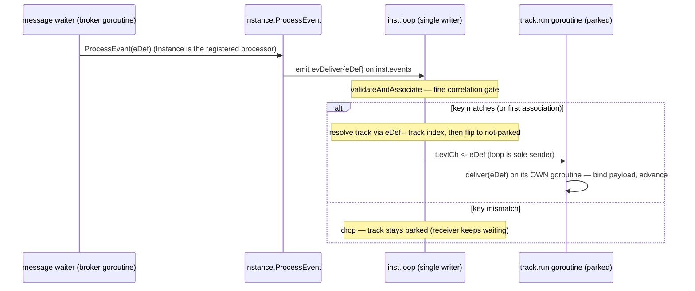
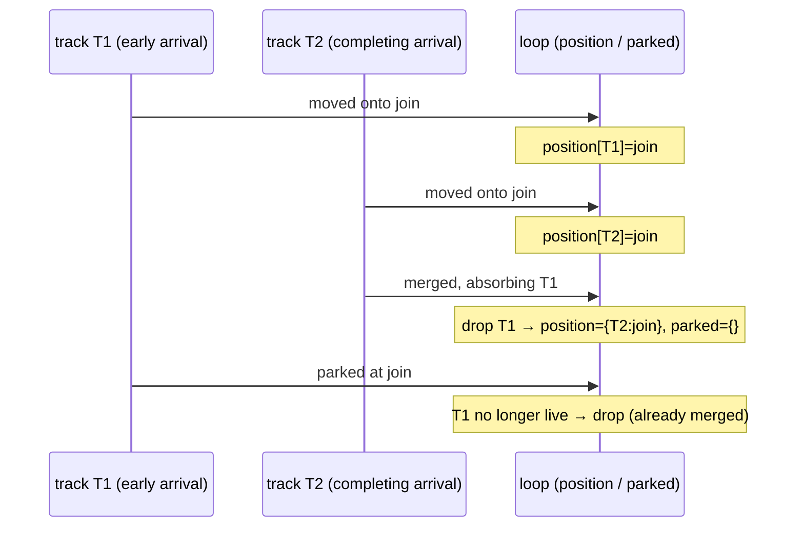
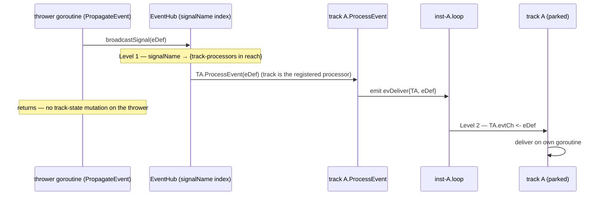

# ADR-017 — Канальная обработка событий (модель исполнения с единственным писателем)

| Поле | Значение |
|---|---|
| Статус | Принято |
| Версия | v.1 |
| Дата | 2026-06-25 |
| Владелец | Ruslan Gabitov |
| Уточняет | [ADR-001 v.5 Execution Model](ADR-001-execution-model.md) |

> EN-оригинал — канонический: [ADR-017-channel-based-event-processing.md](ADR-017-channel-based-event-processing.md). Этот файл — его перевод (twin).

> **Принято (концепция решена; оба среза приземлены сопровождающими SRD — SRD-027
> входящий, SRD-028 исходящий).** Переводит подсистему обработки событий (EPS) на
> **Go-нативную, канальную** модель с двумя правилами: ждущий track получает события,
> **паркуясь на канале**, питаемом **только per-instance loop'ом** (производитель
> *эмитит* сработавшее событие в loop, он никогда не вызывает track напрямую), и track
> **никогда не выставляет своё изменяемое состояние на чтение другим** — **loop является
> единственным владельцем** разделяемого вида (позиции токенов, состояние join'ов). Это
> распространяет принцип единственного писателя из ADR-001 v.5 на **оба** аспекта —
> доставку событий и кросс-горутинные чтения состояния, устраняя — по построению — класс
> гонок, который латали точечно от места к месту. Поскольку loop *уже* является
> единственным писателем lifecycle-состояния, сделать его и единственным **диспетчером**
> входящих событий означает, что teardown, broadcast-разветвление и атомарность
> отложенного выбора все выпадают из **одного** механизма. Модель приземляется двумя
> SRD-срезами (входящий, затем исходящий).

---

## 1. Контекст и проблема

ADR-001 v.5 делает per-instance **loop** единственным владельцем lifecycle-состояния
instance: track'и никогда не мутируют это состояние напрямую — они **эмитят** события в
loop (`inst.events`), который применяет их по порядку на одной горутине, так что никакой
lock не охраняет lifecycle-состояние. Именно эта дисциплина единственного писателя делает
конкурентность движка управляемой.

**Подсистема обработки событий обходит эту дисциплину**, по обе стороны границы track'а:

- **Входящее — синхронная доставка с чужой горутины.** `EventProducer` вызывает у track'а
  `ProcessEvent` **на собственной горутине производителя** — мутируя track (продвигая его
  за пределы его ожидания, переводя его состояние, дописывая его следующий шаг) *в то время
  как собственная горутина track'а конкурентно читает и исполняет его*. Доставка сигнала —
  худший случай: `PropagateEvent → broadcastSignal → ProcessEvent` целиком выполняется на
  горутине *бросающего*. Ждущий track тем временем **busy-spin'ит** (`track.run` крутится
  на `TrackWaitForEvent` с `runtime.Gosched`), сжигая CPU, а доступ к статусу track'а
  охраняется **мьютексами**, чтобы замаскировать две горутины.
- **Исходящее — кросс-горутинные чтения состояния.** Loop (и join'ы) **читают позиции
  track'а напрямую**, пока горутина track'а их продвигает, так что loop наблюдает
  полу-устаканенное состояние другой горутины.

Это не Go-way — *«не коммуницируй разделяя память; разделяй память коммуницируя»* — и это
нарушает модель ADR-001 v.5. Цена — **повторяющийся класс гонок**, а не изолированные
баги:

- **Горутина-waiter, мутирующая track, пока её собственный run-loop его читает** — двойная
  победа при конкурентном срабатывании / отложенном выборе на Event-Based gateway (два
  события оба проходят guard «всё ещё ждём?»; run-loop исполняет позицию, которую waiter
  увёл из-под него).
- **Loop, читающий позиции track'а, пока горутина track'а их продвигает** — выполнимый
  Complex / OR-join, транзиентно прочитанный как невыполнимый и ложно прерванный.

Каждое латали **точечно от места к месту** — per-track event-мьютекс, перечитывание позиции
после wait-guard'а, `runtime.Gosched`, чтобы busy-spin не голодал loop, одноразовый снимок
позиций. Каждая заплатка корректна; *класс* сохраняется, потому что **доставка и
разделение состояния идут на неправильных горутинах**. Корневая причина структурна и лучше
всего устраняется структурно.

## 2. Решение

**Распространить принцип единственного писателя на всю EPS** с двумя правилами — оба
инстансы *коммуницируй, не разделяй* — реализованными через loop, который движок уже
крутит.

### Правило 1 — Входящее (события → track): канальный park, диспетчеризуемый loop'ом

Ждущий track выставляет **буферизованный канал** (`t.evtCh`, фиксированный буфер на один
слот — см. §3) и паркуется в блокирующем `select { case <-ctx.Done(): … case eDef :=
<-t.evtCh: … }`. Производитель **никогда не мутирует состояние track'а** и **никогда не
шлёт в его канал напрямую**: `ProcessEvent` производителя лишь **эмитит** сработавшее
событие в loop и возвращается (он больше не трогает track), а **loop — единственный
отправитель** в канал track'а. Всё входящее воронкой проходит через `inst.events` — тот же
канал, который track'и уже используют, чтобы сообщать lifecycle-изменения — и loop
диспетчеризует из реестра, которым он *уже владеет* (`inst.tracks`, lock-free). Никакого
busy-spin'а (заблокированная горутина паркуется при нулевом CPU), никакого event-мьютекса
(только собственная горутина track'а трогает его состояние, когда он получает), никаких
холостых вычислений.

**Что хаб держит как зарегистрированный `EventProcessor`, выбирается по триггеру — и выбор
ведётся одним вопросом: *коррелирует ли этот триггер?*** Корреляция — единственная причина
централизовать границу хаба над track'ом, и в BPMN это **только-Message** условие
(Correlation §8.4.2; `docs/bpmn-spec/conformance.md:113`, `:177`).

- **Message — зарегистрированным процессором является Instance.** Message — единственный
  BPMN-триггер, сопоставляемый ключом, выведенным из payload-а события
  (`docs/bpmn-spec/semantics/event-handling.md:220`: подписчик «не видит опубликованное
  Message, если корреляция Message не совпадает с корреляцией Conversation подписчика»). Это
  состояние сопоставления — conversation-ключи, их ленивая ассоциация (ADR-016 v.1) и keyed
  broker-подписка — **принадлежит instance'у**, так что Instance — естественная граница: он
  подписывается единожды, неся свои ключи, и его `ProcessEvent` эмитит `evDeliver` в свой
  собственный loop. **Loop** затем выполняет тонкий корреляционный gate
  (`validateAndAssociate`): несовпадающая публикация **отбрасывается, а track оставляется
  запаркованным** (получатель продолжает ждать — `event-handling.md:220`); совпадение
  переключает track и диспетчеризуется. Loop разрешает целевой track через
  **per-instance индекс `eDef → track`**, который он строит по мере того, как track'и
  паркуются.
- **Signal, Timer — зарегистрированным процессором является track.** Ни тот, ни другой не
  коррелируют. Signal — нескоупленный **broadcast** («Signals НЕ используют корреляцию.
  Каждый ловящий Signal-handler в пределах досягаемости … получает Signal» —
  `event-handling.md:221`), чьё разветвление уже адресует каждый ловящий track напрямую;
  Timer — **clock-driven**, точка-в-точку на instance. Для обоих track — непрозрачный
  `EventProcessor` для хаба: его `ProcessEvent` эмитит `evDeliver` в loop, который
  диспетчеризует. Маршрутизация их через Instance вынудила бы ненужное внутреннее
  пере-разветвление и не централизовала бы никакого состояния сопоставления.

В **каждом** случае `ProcessEvent` производителя лишь **эмитит в loop и возвращается**;
loop — универсальный диспетчер. Так что **Event-Based gateway** со смешанными триггерами
(*receive-reply ИЛИ timeout* — message-плечо и timer-плечо на одном track'е) остаётся
корректным: message-плечо регистрируется через Instance, timer-плечо — через track, но
**обе доставки встречаются на одном и том же loop'е, нацеленные на один и тот же track**,
где переключение отложенного выбора (§3) выбирает победителя. Переключение никогда не
расщепляется между путями регистрации, потому что Модель Y воронкой проводит всё через loop
вне зависимости от того, кто был зарегистрирован.

Signal и Timer пропускают Instance: их производитель вызывает `ProcessEvent` **track'а**,
который эмитит `evDeliver{track}` в loop (broadcast-путь продиаграммирован ниже).

**Сопоставление (конкретное, не фреймворк).** Loop адресует track(и), на которые нацелено
сработавшее событие. Для **message** loop Instance'а разрешает track через per-instance
индекс `eDef → track` выше (корреляция сообщений сохраняет свою двухуровневую форму —
грубое совпадение по имени+ключу в брокере, затем тонкий `validateAndAssociate`, теперь
выполняемый **в loop'е**, а не на горутине track'а; неизменно из ADR-014/016 в том, *что*
оно сопоставляет). Для **signal** — нескоупленный broadcast в пределах досягаемости —
индекс `map[signalName][]subscriber` заменяет сегодняшнее O(n) линейное сканирование *всех*
waiter'ов. Общий полиморфный match-ключ над каждым видом BPMN-триггера **намеренно
отложен**: сегодня запроводнены только signal/message/timer, и универсальность ради трёх
случаев стоит больше, чем приносит; индекс — и граница instance-vs-track — обобщатся, когда
Error / Escalation / Link / Conditional реально приземлятся.

**Заметка движка — почему только Message на уровне instance.** Централизация границы хаба
на Instance оправдывает себя ровно тогда, когда есть **instance-скоупленное состояние
сопоставления**, которым нужно владеть: conversation-ключи и их ассоциация. Это
только-Message условие. Signal вещает без корреляции (`event-handling.md:221`), Timer
срабатывает по часам, а ещё-не-построенные data/internal триггеры либо вычисляются против
локальных данных (Conditional), либо маршрутизируются **структурно через цепочку scope'ов**,
а не по внешнему ключу (Error / Escalation: `event-handling.md:218` — «идти от бросающего
scope наружу … проверяя каждый на ловящее Event с совпадающим `errorRef`/`escalationRef`»).
Поэтому правило таково: **instance-как-процессор тогда и только тогда, когда триггер
коррелирует**, что сегодня означает **Message в одиночку**; граница сдвигается, только если
приземлится будущий коррелирующий триггер.

### Правило 2 — Исходящее (состояние track'а → loop): loop владеет разделяемым видом

Track **никогда не выставляет изменяемое состояние на чтение другим, пока он выполняется**.
Он **эмитит** свои изменения состояния — перемещения позиции, lifecycle-переходы — в loop,
а **loop является единственным владельцем** авторитетного разделяемого состояния instance
(позиции токенов, состояние join'ов), которое консультируют reachability и join'ы. Loop
никогда не читает позицию или состояние **живого** track'а; он читает только свой
собственный, принадлежащий loop'у вид.

Единственное место, где loop трогает собственные поля track'а — **финализация затихшего
track'а** — переключение слитого track'а в `Merged` и фиксация перехода после того, как его
горутина вернулась или запарковалась на своём resume-канале; это паттерн единственного
писателя из ADR-001, упорядоченный тем же handoff'ом `emit`/`parkCh`, а не конкурентным
чтением. Поскольку `track` — **неэкспортируемая сущность пакета instance** (loop и track
кооперируют внутри одной внутренней абстракции, а не через публичную границу), небольшой
per-track lock **сохраняется**, чтобы охранять этот handoff, а не убирается — сделать
состояние track'а lock-free-by-construction означало бы возложить корректность на
рассуждения happens-before без структурного принуждения, намеренная не-цель ради нулевого
практического выигрыша (lock неконкурентен).

Вместе **состояние живого track'а трогается ровно одной горутиной**, а всё остальное
кросс-горутинное — это канальная отправка в loop. Правило 1 и Правило 2 — не два механизма,
а один: loop, который движок уже крутит, становится единственной точкой, которая и
*применяет* эмитированные track'ом изменения, и *диспетчеризует* входящие события — тот же
ход, что ADR-001 v.5 сделал для lifecycle-состояния, теперь покрывающий два пути EPS,
которые его всё ещё обходили.

### Механика Правила 2 — построение принадлежащего loop'у вида

Принадлежащий loop'у разделяемый вид — это две карты, каждая ключуется по track'у:

- **position** — текущий узел каждого **живого** track'а. Track входит в неё, когда он
  порождён (его начальный узел), и обновляет её на каждом перемещении, о котором сообщает;
  он покидает её, когда умирает (заканчивается / падает) или сливается на join'е.
- **parked** — join-узел каждого track'а, в данный момент приостановленного на
  reachability/Complex join'е. Это **подмножество** живого множества: запаркованный токен
  всё ещё занимает свой join, так что запись в parked подразумевает запись в position.

Loop строит обе **чисто из событий, которые эмитят track'и** — он никогда не читает
выполняющийся track, чтобы узнать позицию:

| событие track'а | position | parked |
|---|---|---|
| spawned | установить в начальный узел | — |
| moved onto a node | установить в этот узел | сбросить (движение ⟹ больше не запаркован) |
| parked at a join | — | установить в этот join — **тогда и только тогда, когда** track всё ещё жив и не завершается |
| awaiting (Parallel join) | сохранить (всё ещё жив на join'е) | — |
| merged (absorbing others) | сбросить каждый поглощённый track | сбросить каждый поглощённый track |
| ended / failed | сбросить | сбросить |
| stop (shutdown) | очистить | очистить |

**Инварианты.** `parked ⊆ position`; узел считается *занятым* для reachability тогда и
только тогда, когда позиция некоторого живого track'а — этот узел; и join-узел запись из
parked **переносится в событии park**, никогда не выводится из вида position — так что он
не может устареть или стать null.

**Краевой случай — гонка слияния.** Когда несколько ветвей прибывают на один
reachability-join, каждая фиксирует своё прибытие и, если она не завершает join, сообщает
о park'е; **завершающее** прибытие вместо этого сообщает merge, поглощающий остальные. Эти
сообщения гонятся в loop, так что завершающий merge может быть применён **раньше**
собственного park'а со-прибывающего — а merge уже сбросил поглощённый track из вида.
Запоздалый park со-прибывающего тогда находит track **более не живым** и **отбрасывается**
(его судьба решена), вместо того чтобы перезаписать устаревший, уже слитый токен.

Не-гоночный порядок (park применён первым) фиксирует park, recheck откладывается на
всё-ещё-in-transit завершающий токен, а последующий merge его сбрасывает — то же конечное
состояние, без устаревшей записи.

**Краевой случай — shutdown.** При завершении loop очищает вид, и join'ы больше не
срабатывают; track, достигающий join'а после этого, всё ещё сообщает park, который loop
**пропускает** — track пробуждается отменой контекста и сворачивается, никогда не
loop-recheck'ом (зеркаля shutdown-guard входящего ожидания).

### Broadcast-разветвление двухуровневое

Signal достигает каждого ловящего handler'а в пределах досягаемости, через instance'ы — и
поскольку Signal track-зарегистрирован, разветвление адресует каждый ловящий **track**
напрямую (без instance-уровневой непрямоты). Хаб делает **Уровень 1**
(`signalName → {track-процессоры в досягаемости}`) и вызывает `ProcessEvent` каждого
ловящего track'а, который эмитит `evDeliver` в собственный loop этого track'а; каждый loop
делает **Уровень 2** (нацеленная отправка в свой собственный запаркованный track).
Бросающий не мутирует никакого состояния track'а — разветвление это N эмитов и return.

Диаграмма показывает одного ловца; хаб повторяет `ProcessEvent` на каждый ловящий track в
досягаемости (через instance'ы), каждый эмитит в собственный loop.

## 3. Последствия

- **Класс гонок устранён по построению.** Никакой мутации с чужой горутины (Правило 1);
  никакого кросс-горутинного чтения позиции/состояния **живого** track'а (Правило 2).
  Per-track event-мьютекс, перечитывание после guard'а, `Gosched` и снимок позиций — все
  становятся ненужными. Небольшой per-track lock **сохраняется** для единственного
  оставшегося шва — loop, финализирующий lifecycle-состояние *затихшего* слитого track'а
  под handoff'ом `emit`/`parkCh`, паттерн единственного писателя ADR-001, а не конкурентное
  касание (полное удаление lock'а — намеренная не-цель — см. Правило 2).
- **Отложенный выбор атомарен на loop'е.** Loop однопоточен, так что когда он
  диспетчеризует **первое** совпавшее событие в track, он **переключает этот track в
  not-parked тем же шагом** и сворачивает sibling-подписки track'а. Второе событие,
  приходящее для этого track'а (проигравшее плечо Event-Based gateway), тогда видит
  not-parked цель и **корректно отбрасывается** — gateway уже выбрал. Двойная победа при
  конкурентном срабатывании из FIX-007 не может произойти; «ровно одно плечо побеждает»
  держится без guard'а. Это держится даже для **смешанно-триггерного** gateway (message-
  плечо, зарегистрированное через Instance, timer-плечо — через track): оба плеча доставляют
  `evDeliver` в один и тот же loop, нацеленный на один и тот же track, так что переключение
  видит их последовательно — гибридная регистрация никогда не расщепляет выбор.
- **Teardown бесплатен по построению.** Loop — **единственный отправитель** в `t.evtCh`
  *и* единственный владелец индекса подписок. «Отписаться» и «диспетчеризовать» — это
  последовательные шаги одной и той же горутины, так что loop никогда не может отправить в
  track, который он только что вывел из строя — **ловушка send-on-closed-channel возникнуть
  не может**, и никакая `done`-охраняемая отправка не нужна.
- **Loop-hop — не чистый overhead — он замещает lock.** Одна доставка стоит **двух
  передач горутины** — производитель → loop (`emit(evDeliver)`) и loop → track (`t.evtCh`)
  — плюс обычный для track'а пост-доставочный `emit`, сообщающий его продвижение обратно в
  loop. Этот **исходящий notify неизбежен в любом дизайне**: loop — единственный владелец
  lifecycle-состояния (ADR-001 v.5), так что track обязан сообщить своё изменение состояния
  как бы событие до него ни дошло. Входящий `emit(evDeliver)` Модели Y — это *та же
  машинерия канальной отправки*, что и этот обязательный notify, и он зарабатывает loop'у
  lock-free переключение отложенного выбора и teardown выше. Альтернатива D (прямой
  производитель → `t.evtCh`) опускает входящий `emit`, но обязана переввести lock, чтобы
  сделать переключение атомарным и увернуться от send-on-closed — так что она меняет
  дешёвую, lock-free канальную отправку на lock, а не на ничто. **Гибрид не добавляет hop'а
  поверх этого**: Message и Signal/Timer имеют идентичное число передач; различаются лишь
  зарегистрированный адаптер (Instance vs track) и in-line работа loop'а для Message
  (поиск `eDef → track` + корреляционный gate, внутренне присущие корреляции).
- **Синхронная привязка производитель→loop (ограниченная, расцепляемая позже).** Хаб
  вызывает `ProcessEvent` синхронно на горутине производителя; плечо `<-loopDone` у `emit`
  ограничивает это временем жизни instance — **нет deadlock'а, нет send-on-closed, а
  устаревшая ссылка на процессор — безопасный no-op** (умирающий instance немедленно
  разблокирует производителя, а не блокирует его). Производители никогда не выполняются на
  горутине loop'а, так что нет цикла реентрантности (даже само-сигнал — это `track → loop`).
  Единственная остаточная цена — **broadcast head-of-line latency** — разветвление сигнала
  последовательно на горутине бросающего — ограниченная скоростью дренажа loop'а, а loop не
  делает CPU-bound работы (исполнение узлов остаётся на горутинах track'ов); **message не
  затронут** (брокер вызывает `Instance.ProcessEvent` на per-waiter горутине, естественно
  параллельно). Привязка хаба к **долгоживущему Instance** для Message фактически *более*
  стабильна, чем per-track привязка (ссылка живёт всю жизнь instance, а не каждый эпизод
  receive). Полное расцепление — асинхронная, буферизованная per-instance входящая очередь,
  в которую хаб постит, не блокируясь — это отложенный шов буферизованного приёма /
  durability (§5), добавляемый **только по измеренной конкуренции**, а не спекулятивно.
- **Буферизация / backpressure.** `t.evtCh` — **фиксированный буфер на один слот**
  (константа, не опция движка — при flip-on-dispatch loop отправляет не более одного
  события на эпизод парковки, так что одного слота ровно достаточно и это единственное
  корректное значение). Единственный слот расцепляет отправку loop'а от планирования
  track'а, так что loop никогда не блокируется; небуферизованный рисковал бы заблокировать
  его в окне между `evWaiting` track'а и его receive. Политика — **никогда не отбрасывать
  событие, нацеленное на запаркованный track**; отбрасывание события для уже
  диспетчеризованного, not-parked track'а корректно (это проигравшее плечо, а не
  потерянный триггер). Упорядочивание: per-track FIFO через канал; per-instance — порядок
  прибытия loop'а; cross-track — никакого, track'и конкурентны.
- **Исполнение сериализуется per instance для разделяемого состояния; конкурентность живёт
  между instance'ами.** Loop применяет события и владеет разделяемым состоянием на одной
  горутине, так что изменения разделяемого состояния instance'а последовательны. Это
  приемлемо и конвенционально — параллельные ветви BPMN это *оркестрация*, а не CPU-bound
  работа, и зрелые движки (Zeebe, Temporal, Camunda) исполняют instance workflow
  однопоточно; реальный параллелизм — **между** instance'ами.
- **Семантика доставки BPMN сохранена через асинхронную границу** — асинхронный путь меняет
  *какая горутина применяет* доставку, никогда — *что* доставляется:
  - **Broadcast сигнала остаётся нескоупленным и сопоставляемым по имени.** «Публикация
    Signal нескоуплена в пределах досягаемости: Signals НЕ используют корреляцию. Каждый
    ловящий Signal-handler в досягаемости … получает Signal. Движкам нужен индекс
    Signal-name → set-of-subscribers» (`docs/bpmn-spec/semantics/event-handling.md:221`;
    публикация — «broadcast в пределах и между Pool'ами, Process'ами и диаграммами», там
    же :15). Индекс Уровня 1 — это ровно оно.
  - **Broadcast без ловца остаётся доброкачественным no-op'ом** (ADR-006 v.1 §2.4: «Нет
    waiter'а ⇒ no-op, а не ошибка»): пустое множество подписчиков ничего не эмитит.
  - **Отклонение корреляции сообщения всё ещё оставляет получателя ждущим** — тонкий
    `validateAndAssociate` выполняется **в loop'е**, когда Instance эмитит входящее
    сообщение; несовпадающая публикация отбрасывается, а track остаётся запаркованным
    (`event-handling.md:220`). Перемещение gate'а с горутины track'а на loop меняет *какая
    горутина* решает, никогда — вердикт.
- **Чистое упрощение после приземления.** Точечные guard'ы EPS убраны; движок получает
  одно место для рассуждения об упорядочивании событий, доставке и teardown'е,
  согласованное с остальной частью модели единственного писателя.

## 4. Рассмотренные альтернативы

- **A — Канальная доставка, диспетчеризуемая loop'ом + принадлежащее loop'у состояние
  (выбрано).** Track паркуется на канале; производитель эмитит в loop; loop — единственный
  диспетчер к track'ам и единственный владелец позиций. Убирает класс гонок по построению,
  без lock'а, и складывает доставку, teardown, разветвление и атомарность отложенного выбора
  в **один** механизм — loop, который движок уже крутит. Это Go-нативная реализация
  направления «loop владеет одним потоком событий». Граница хаба — **per-trigger** (Правило
  1): Instance для Message (корреляция принадлежит instance'у), track иначе. Цена: per-track
  канал и один лишний in-process hop (производитель → loop → track), пренебрежимо для
  оркестрации.
- **B — Per-site lock'и / защитные перечитывания (статус-кво + заплатки).** Охранять каждое
  место по отдельности (per-track event-мьютекс; перечитывание позиций после guard'а;
  снимок). *Отклонено как конечное состояние:* корректно по месту, но не обобщается —
  пролиферация lock'ов, и каждое новое место доставки/чтения должно независимо перевывести
  правильное чередование; пропущенное место — тихая, редкая гонка. Полезно лишь как
  промежуточная безопасность.
- **C — Один грубый instance-wide lock вокруг всей доставки и run.** Сериализовать доставку
  и run-loop под единым instance-lock'ом. *Отклонено:* сериализует куда больше, чем нужно
  (убивает конкурентность track'ов), а удержание lock'а через исполнение узла приглашает
  deadlock — те же причины, по которым ADR-001 v.5 выбрал emit-to-loop вместо большого
  lock'а.
- **D — Прямой per-track канал (производитель шлёт прямо в `t.evtCh`).** Самая буквальная
  трактовка «канал — это park-примитив и handoff»; наименьшая latency, без loop-hop'а.
  *Отклонено в пользу A:* она делает производителя отправителем, так что teardown
  возвращается как проблема производителя (`done`-охраняемая отправка, чтобы увернуться от
  send-on-closed на каждом месте), а производителю нужен собственный вид того, какие track'и
  запаркованы — **второй реестр, гоняющийся с `inst.tracks` loop'а**, что и есть ровно то
  кросс-горутинное чтение, которое запрещает Правило 2, лишь переселённое на сторону
  отправки. A держит единственного владельца; D меняет это на hop, который ей не нужен.
- **E — Единообразный instance-как-процессор (каждый триггер регистрируется через
  Instance).** Заставить хаб говорить только с Instance'ами; Instance маршрутизирует каждое
  сработавшее событие в свои track'и. Концептуально аккуратно — хаб никогда не держит track.
  *Отклонено в пользу per-trigger границы в A/Правиле 1:* она платит цену, которую
  искупает только Message. Signal — худшее соответствие — разделяемый межинстансный
  signal-waiter, разветвляющийся к **Instance'ам**, вынудил бы каждый Instance
  **пере-разветвлять внутренне** к своим ловящим track'ам, заменяя естественную per-track
  адресацию broadcast'а лишним передиспетчером ради нулевой корреляционной выгоды; Timer
  тоже ничего не выигрывает. Единообразие здесь оптимизирует не-проблему (хаб, держащий
  непрозрачный `EventProcessor`, ничего не утекает для не-коррелирующих триггеров),
  усложняя при этом единственный путь — broadcast — который проще всего per-track. Гибрид
  централизует **только** там, где существует instance-скоупленное состояние сопоставления.

## 5. Рекомендации по enterprise-готовности

- **Наблюдаемость очереди:** выставьте глубину per-track `t.evtCh` и счётчики
  loop-диспетчеризации (включая отброшенные проигравшие-плечо события) как метрики, чтобы
  операторы видели насыщение доставки и конкуренцию отложенного выбора до того, как они
  станут latency.
- **Фундамент для durability/replay:** per-instance приём loop'а — это единственная
  упорядоченная точка, через которую протекает каждое применённое событие — естественный
  шов для **долговечной, воспроизводимой** доставки позже (персистить поток приёма;
  воспроизводить при гидрации), предпосылка для отложенного направления персистентности. Не
  требуется сейчас, но модель не должна это исключать.
- **Документация контракта доставки:** реализующие SRD-срезы должны специфицировать новый
  асинхронный контракт (упорядочивание, фиксированный буфер на один слот, teardown) как
  first-class публичное поведение, поскольку оно меняет то, как хосты и брокер наблюдают
  исходы доставки.

## 6. Ссылки

- [ADR-001 v.5 Execution Model](ADR-001-execution-model.md) — принцип единственного
  писателя (loop владеет разделяемым состоянием; track'и эмитят, loop применяет), который
  этот ADR распространяет на доставку событий **и** кросс-горутинные чтения состояния.
- [ADR-006 v.1 Events & subscriptions](ADR-006-events-and-subscriptions.md) — контракт
  доставки событий (broadcast, no-catcher no-op §2.4, жизненный цикл waiter'а), чья
  *семантика* сохранена через новую асинхронную границу.
- [ADR-014 v.1 Message handling](ADR-014-message-handling.md) / [ADR-016 v.1 Message correlation](ADR-016-message-correlation.md)
  — message-брокер остаётся message-бэкендом; его двухуровневое корреляционное совпадение
  (имя+ключ в брокере, затем тонкий `validateAndAssociate`) неизменно в том, *что* оно
  сопоставляет. Этот рефакторинг переселяет тонкий шаг с горутины track'а на **loop** и
  делает **Instance** обращённым к хабу процессором для Message, чтобы его conversation-ключи
  и keyed-подписка оставались принадлежащими instance'у.
- BPMN 2.0 — `docs/bpmn-spec/semantics/event-handling.md`: публикация сигнала нескоуплена в
  пределах досягаемости и не несёт корреляции (:221), публикация — broadcast через
  Pool'ы/Process'ы (:15), публикация Message сопоставляется по корреляции (:220). Асинхронный
  путь сохраняет это нетронутым.

## 7. План раскатки

Модель приземляется как **два SRD-среза на одной ветке** (`feat/adr-017-eps-rework`),
каждый авторится и реализуется под SDD-дисциплиной проекта (свой SRD, вехи и тесты):

1. **Входящий срез (первый).** Канальная park-доставка: per-track `t.evtCh`,
   `evDeliver`-путь loop-диспетчеризации, **per-trigger граница хаба** (Instance как
   зарегистрированный процессор для Message, track иначе), loop-side корреляционный gate
   (`validateAndAssociate`) с его per-instance индексом `eDef → track`, индекс
   `signalName → subscribers`, атомарность отложенного выбора и teardown подписок. Убирает
   busy-spin, per-track event-мьютекс, выставление корреляционных ключей track'ом и
   синхронный signal-путь с чужой горутины; делает отложенный выбор бесплатным.
2. **Исходящий срез (второй).** Принадлежащие loop'у позиции: loop становится единственным
   владельцем вида позиций токенов / join'ов, который читают reachability и join'ы, убирая
   гонку loop-читает-состояние-track'а (транзиентный ложный abort Complex / OR-join).

**Открытые вопросы: нет.** Буферизация/backpressure (фиксированный буфер на один слот;
never-drop для запаркованного track'а), teardown (loop-as-sole-sender) и
broadcast-разветвление (двухуровневый индекс) решены выше (§2–§3); SRD-срезы фиксируют
конкретные сигнатуры и тесты, а не модель.

## История документа

| Версия | Дата | Автор | Изменение |
|---|---|---|---|
| v.1 (Принято) | 2026-06-26 | Ruslan Gabitov | **Принято** — концепция решена и полностью реализована; оба среза приземлены на `feat/adr-017-eps-rework`. **Правило 1 (входящее)** через SRD-027: ждущий track паркуется на `t.evtCh`, производители эмитят в loop (`evDeliver`), loop — единственный диспетчер; busy-spin и per-track event-мьютекс ушли; O(1) индекс `signalName → subscribers` заменяет broadcast-сканирование; Instance — хаб-`EventProcessor` для Message (instance-владеемая корреляция), track — для Signal/Timer. **Правило 2 (исходящее)** через SRD-028: loop владеет видом `position`/`parked`, питаемым `evMoved` + узел-несущим `evParked`; `joinPositions` чист над этими картами; мёртвый живой `FlowChecker` удалён; `t.m` сохранён для шва финализации затихшего слитого track'а (полное удаление — намеренная не-цель — `track` неэкспортируем внутри пакета instance). Гейт свободы от гонок проверен: `make ci` зелёный, `pkg/thresher` под `-race` ×40 чисто, diff-coverage 99.7%. |
| v.1 (Draft) | 2026-06-25 | Ruslan Gabitov | Черновик концепции модели конкурентности EPS: ждущий track **паркуется на канале**, питаемом **только per-instance loop'ом** (производители эмитят в loop, никогда не шлют в track напрямую) и **никогда не выставляет изменяемое состояние на чтение другим** (loop владеет разделяемым видом позиций/join'ов). Распространяет принцип единственного писателя из ADR-001 v.5 на оба аспекта — доставку событий и кросс-горутинные чтения состояния, делая loop единственным **диспетчером** входящих событий так, что teardown, broadcast-разветвление и атомарность отложенного выбора выпадают из одного механизма; устраняет класс гонок чужая-горутина / кросс-чтение по построению; сохраняет семантику доставки ADR-006 v.1 / ADR-014 / ADR-016. Обращённый к хабу `EventProcessor` — **per-trigger**: **Instance** для Message (корреляция — conversation-ключи, ленивая ассоциация, keyed-подписка — принадлежит instance'у, так что тонкий `validateAndAssociate` выполняется **в loop'е**, который разрешает целевой track через per-instance индекс `eDef → track`) и **track** для Signal/Timer (без корреляции; broadcast/часы адресуют track напрямую). Сопоставление сигнала становится индексом `signalName → subscribers` (O(n) сканирование отброшено); общий полиморфный match-ключ и граница instance-vs-track отложены, пока не приземлятся новые виды событий. Приземляется двумя SRD-срезами (входящий, затем исходящий) на одной ветке. |
