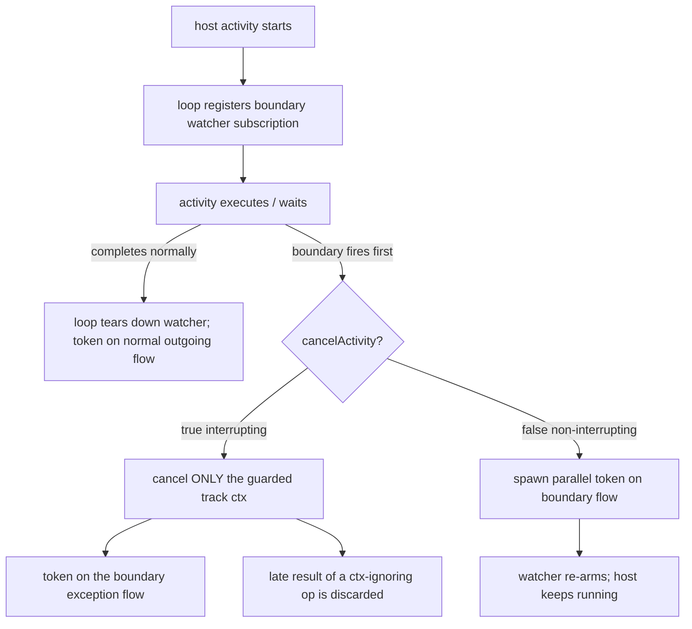
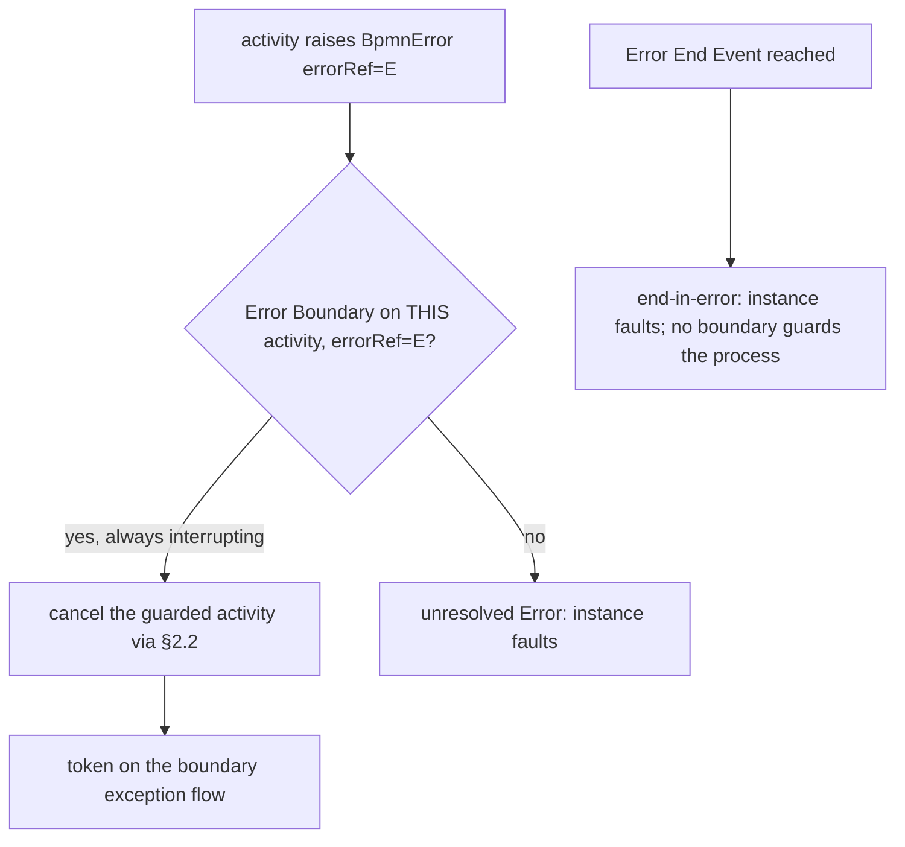

# ADR-018 — Boundary Events & Activity Interruption

| Field | Value |
|---|---|
| Status | Accepted |
| Version | v.1 |
| Date | 2026-06-27 |
| Owner | Ruslan Gabitov |
| Refines | [ADR-006 v.2 Events & Subscriptions](ADR-006-events-and-subscriptions.md) §2.2, §2.6, [ADR-001 v.6 Execution Model](ADR-001-execution-model.md) |

> **Accepted** — landed by the accompanying SRD (SRD-029, M1–M5 on `feat/adr-018-boundary-events`). Decides the **mechanism** that
> [ADR-006 v.2](ADR-006-events-and-subscriptions.md) §2.2 left open: how an interrupting boundary
> event actually **interrupts a running activity**, how a boundary subscription is realized over an
> activity's execution window, and how an **Error Boundary** catches a thrown error. The Error
> *event* model itself — throw points, `errorRef` matching, scope-chain propagation, unmatched→fault
> — is owned by [ADR-006 v.2 §2.6](ADR-006-events-and-subscriptions.md); this ADR adds only the
> boundary's contribution to it. ADR-006 §2.2 fixes the *delivery and interruption model* (cancel
> only the guarded track; spawn the exception-flow continuation; subscription for the activity's
> lifetime; Error always interrupts; one interrupting handler per Event Declaration); this ADR
> refines it into a buildable mechanism on the
> [ADR-017 v.1](ADR-017-channel-based-event-processing.md) single-writer event-processing core.
> Scope is the 0.1.0 boundary set (Timer, Message, Signal, Error) — see [SAD-001 v.1 §15.3](SAD-001-vision-and-architecture.md).

---

## 1. Context & problem

Boundary events are the first 0.1.0 gap ([SAD-001 v.1 §15.3](SAD-001-vision-and-architecture.md)): the
**Timer boundary** is the most-used boundary in practice (timeouts, SLAs, escalations), and the
**Error boundary** is the primary way to model business-error paths. Neither is buildable without
answering one question ADR-006 §2.2 deliberately deferred to "the boundary workstream":

> **How is a *running* activity interrupted?**

A boundary event is a `CatchEvent` attached to an activity (`attachedToRef`) with a `cancelActivity`
flag (default `true`). When it fires:
- **interrupting** (`cancelActivity=true`; **Error/Cancel always**) — the guarded activity is
  terminated and a token leaves on the boundary's **exception flow** (BPMN §10.5.6);
- **non-interrupting** (`cancelActivity=false`; Timer/Message/Signal/Conditional/Escalation) — the
  activity **keeps running** and a token starts on the boundary flow **in parallel** (§10.5.6).

The single-writer execution model ([ADR-001 v.6](ADR-001-execution-model.md)) and the channel-based
EPS ([ADR-017 v.1](ADR-017-channel-based-event-processing.md)) give us most of the parts —
loop-owned event subscription, channel-park delivery, parallel-token fork — but not the **interruption
hook**: a token-bearing activity runs inside a synchronous call, and a Go goroutine cannot be
force-killed from outside. The conception below resolves that, plus how an **Error Boundary catches**
a thrown error (the Error *event* model itself living in [ADR-006 v.2 §2.6](ADR-006-events-and-subscriptions.md)).

## 2. Decision

### 2.1 A boundary is a loop-owned **watcher subscription** over the activity's execution window

A boundary event is realized as a **catch subscription owned by the per-instance loop**, registered
when the guarded activity **starts** executing and torn down when the activity **leaves** execution
(by normal completion *or* by a boundary firing). This is the direct realization of ADR-006 §2.2
("subscription registered for the whole lifetime of the activity it guards") on the ADR-017 delivery
core: the boundary reuses the **same** catch machinery as an intermediate catch event — it parks on
the loop's delivery path and the loop is the sole dispatcher of a fired event to it. No new delivery
mechanism is introduced; a boundary is "an intermediate catch whose lifetime is bounded by its host
activity's execution, and whose firing acts on the host."

Because the loop is the **single writer** that both (a) applies the host activity's completion and
(b) dispatches a boundary fire, the **completion-vs-fire race is arbitrated for free**: whichever the
loop applies first wins, and the loser is dropped — the host's completion tears down a still-pending
boundary, and a boundary fire that the loop applies first cancels the host. This is the same
deferred-choice atomicity ADR-017 already established (flip-to-not-parked on dispatch); the boundary
needs no extra lock or ad-hoc race guard.

### 2.2 Interrupting = **cooperative cancellation** of the guarded activity

When an interrupting boundary fires, the loop cancels **only the track executing the guarded
activity** (never the whole instance — ADR-006 §2.2) and routes a token onto the boundary's exception
flow. "Cancel the activity" is realized as **cooperative cancellation through a per-activity
cancellation signal** derived from the track's context:

- A **waiting** activity (a `ReceiveTask` parked for a message, a `UserTask` parked for human input)
  observes the cancellation immediately and exits — a **clean, prompt** interruption. This is the
  common, valuable case (timeout-on-wait).
- A **running** activity (a `ServiceTask` executing an operation) is asked to stop via its context.
  An operation that honours `ctx.Done()` stops promptly. An operation that **ignores** its context
  runs to completion in its own goroutine — Go cannot force-kill it — but its result is **abandoned**:
  the engine has already moved the token onto the exception flow and discards the late result.

This **cooperative** semantics is a deliberate, documented limitation (§4 Alternatives, §5
Consequences): the engine guarantees the *control-flow* effect of interruption (the token leaves
immediately on the exception flow, the activity's outputs are not committed) even when it cannot
guarantee the *immediate cessation* of a context-ignoring operation. It is consistent with how every
goroutine-based engine on a non-preemptible host behaves.

**Interruption is not failure.** A cancelled activity routes to the boundary's exception flow (or,
under instance terminate, simply ends) — it does *not* enter the error-propagation / instance-fault
path of §2.4. The engine treats the interruption as authoritative: an error the activity's operation
returns while unwinding does not turn the interruption into a failure.

### 2.3 Non-interrupting = **parallel continuation track**, re-arming

A non-interrupting boundary consumes the occurrence, leaves the guarded activity running, and spawns
a **fresh concurrent track** on the boundary's outgoing flow (the existing fork mechanism). The
watcher then **re-arms** — a non-interrupting boundary may fire repeatedly while its host runs (e.g. a
non-interrupting timer that ticks every N minutes). The subscription is torn down only when the host
activity leaves execution. Non-interrupting is permitted only for Message/Signal/Timer/Conditional/
Escalation (§10.5.6); **Error is never non-interrupting**.

### 2.4 Error catch at the boundary (the event model is [ADR-006 v.2 §2.6](ADR-006-events-and-subscriptions.md))

The Error *event* model — throw points, `errorRef` matching, scope-chain propagation, and the
unmatched→fault outcome — is owned by [ADR-006 v.2 §2.6](ADR-006-events-and-subscriptions.md). This
ADR adds only what the **boundary** contributes: the Error Boundary Event is the catch point, it is
**always interrupting**, and it realizes the catch through §2.2's cooperative cancellation. Concretely
for the 0.1.0 scope — **no Sub-Processes, so a single scope (the Process) and no chain to walk**
([SAD-001 v.1 §15.3](SAD-001-vision-and-architecture.md)):

- **The catchable error is an activity raising a `BpmnError`** (`errorCode`) — a `ServiceTask`
  operation returning a fault, a `ScriptTask` throwing, etc. (ADR-006 v.2 §2.6, throw source 2).
  With no enclosing scope to climb to, it is caught **only by an Error Boundary on that same
  activity** whose `errorRef` matches.
- **The catch** drives the guarded activity to `Failing` and routes a token onto the boundary's
  **exception flow** via §2.2 (always interrupting; §10.5.6 cancel-after-flow). This is the
  business-error path 0.1.0 delivers.
- **An Error End Event** throws at Process scope with no enclosing in-process catcher, so it ends the
  instance **in error** — an instance fault (the end-in-error case). A boundary guards an *activity*,
  not the process, so in 0.1.0 nothing catches it; it intercepts what is otherwise the
  failed-track→instance-failure path.
- **Cross-scope propagation** (climbing nested scopes) and the **Error Event Sub-Process** catch path
  are reachable only once Sub-Processes exist (0.2.0, §2.7); ADR-006 v.2 §2.6 already models them and
  this ADR's mechanism extends to them unchanged.

### 2.5 Multiplicity

Consistent with ADR-006 §2.2 and BPMN §10.5.6: **at most one interrupting handler per Event
Declaration** on a given activity; **non-interrupting** handlers are unbounded and run concurrently.
The engine enforces this per `(activity, EventDefinition)` pair. Distinct declarations (different
`errorRef`/`messageRef`/etc.) may each carry their own interrupting boundary.

### 2.6 Attachment scope

A boundary attaches to an **Activity** via `attachedToRef`. In 0.1.0 the host set is the **Tasks**
that exist (`ServiceTask`, `UserTask`, `SendTask`, `ReceiveTask`); boundary-on-**Sub-Process** and
boundary-on-**Call Activity** arrive with those structures in 0.2.0 (the mechanism here is designed to
extend to them unchanged — a sub-process is interrupted by cancelling its scope, the same cooperative
cancellation applied to a composite host).

### 2.7 0.1.0 trigger scope

| Trigger | 0.1.0 | Modes |
|---|---|---|
| **Timer** | ✅ (priority) | interrupting + non-interrupting |
| **Message** | ✅ | interrupting + non-interrupting |
| **Signal** | ✅ | interrupting + non-interrupting |
| **Error** | ✅ | interrupting only (always) |
| Conditional | ❌ deferred | — (no conditional waiter yet) |
| Escalation | ❌ deferred | — |
| Cancel | ❌ deferred | — (Transaction sub-process only) |
| Compensation | ❌ deferred | — (needs the compensation machinery) |
| Multiple / Parallel-Multiple | ❌ deferred | — |

## 3. Standard grounding

| Claim | BPMN source |
|---|---|
| BoundaryEvent is a CatchEvent with `attachedToRef` + `cancelActivity` (default true) | §10.5.6; `docs/bpmn-spec/elements/events.md` (BoundaryEvent) |
| Interrupting terminates the activity, token on the exception flow; non-interrupting keeps it running + parallel token | §10.5.6; `docs/bpmn-spec/semantics/event-handling.md` §4 |
| Non-interrupting only for Message/Signal/Timer/Conditional/Escalation; **Error always interrupting** | §10.5.6; `event-handling.md` §4 |
| None and Link are invalid on a boundary | `event-handling.md` §4 |
| Interrupting activity transition Active/Ready/Completing → Terminating (non-error) / Failing (error) | §13.3.2; `state-machines/activity-lifecycle.md` |
| Error propagation climbs the scope chain to the innermost matching catcher; unresolved Error is critical | §10.5.1, §10.5.7; `event-handling.md` |
| One interrupting handler per Event Declaration; non-interrupting unbounded, concurrent, non-deterministic order | §10.5.6; `event-handling.md` §5 |

## 4. Alternatives considered

- **Force-kill the activity goroutine** — *impossible.* Go has no goroutine kill; cancellation is
  cooperative by construction. Rejected as unrealizable; it is the reason §2.2 is cooperative.
- **Host track multiplexes (select over activity-exec + boundary events)** — the activity's `Exec` is
  a synchronous, blocking call; the host track cannot `select` alongside it without wrapping every
  activity in its own goroutine and a result channel, duplicating what the loop already does for
  subscriptions. Rejected: the watcher-subscription model (§2.1) reuses the ADR-017 delivery path and
  keeps the race under the single writer.
- **The interruption mechanism folded into ADR-006 as a version bump** (vs a new ADR) — rejected per
  the owner's decision: cooperative activity cancellation is a substantial new *mechanism*, not an
  edit to ADR-006's event-subscription model; a dedicated ADR keeps it reviewable and lets ADR-006
  §2.2 remain the stable higher-level model this refines. (The Error *event* model proper — throw,
  matching, propagation, catch — *does* live in ADR-006, detailed in **v.2 §2.6**, since events are
  ADR-006's domain; this ADR adds only the boundary catch + the cooperative interruption it needs.)
- **Error caught by an Error Event Sub-Process** — the second standard error-catch path; deferred
  with Sub-Processes (0.2.0). 0.1.0 catches errors only at an Error Boundary Event.
- **Pre-emptive timeout via a separate timer goroutine that aborts the instance** — rejected: it
  cancels too much (the instance, not the guarded track) and bypasses the loop's single-writer
  arbitration, reintroducing the race class ADR-017 removed.

## 5. Consequences

- **Timeouts and error paths become modellable** — the two highest-frequency 0.1.0 gaps close on one
  mechanism.
- **Cooperative-cancellation limitation** — a `ServiceTask` operation that ignores its context cannot
  be stopped mid-flight; the engine guarantees the control-flow effect (token on the exception flow,
  outputs not committed) but not immediate cessation. **Operations should honour `ctx.Done()`**; this
  becomes a documented contract of the operation interface.
- **No new race surface** — the boundary fire and the host completion are both loop-applied, so the
  single writer arbitrates them; no new lock.
- **Subscription pressure is bounded** — a boundary subscription lives only for its host activity's
  execution window, not the whole instance; teardown is loop-owned (no leak, no send-on-closed),
  inheriting ADR-017's teardown discipline.
- **Re-arming non-interrupting boundaries** can fire many times — observability (below) should make
  each firing visible.

## 6. Enterprise-readiness recommendations

- **Observability** — emit a structured signal on every boundary subscribe / fire / teardown and on
  each activity interruption (trigger type, `cancelActivity`, host activity id, exception-flow target,
  and for Error the `errorCode`). A non-interrupting boundary's repeated firings and an abandoned
  late ServiceTask result are exactly the things operators need to see.
- **Operation context contract** — document that a `ServiceTask` operation **must** observe
  `ctx.Done()` to be promptly interruptible; provide a lint/contract test in the operation SDK and a
  conformance note that a non-cooperative operation degrades to "result abandoned".
- **Timeout configuration** — Timer-boundary durations should be expressible as configuration/policy,
  not only hard-coded in the model, so SLAs can be tuned without re-deploying the process.
- **Error-code registry & contract testing** — an `errorCode` is a contract between a throwing
  activity and its catching boundary; recommend a registry of error codes and contract tests that a
  thrown code has a catcher (or an intended fault).
- **Dead-letter for unmatched errors** — an unresolved Error faults the instance; operators should
  get the faulting error on a dead-letter/incident channel rather than only a log line (ties into the
  future Fault-Tolerance epic).
- **Sensitive data** — the abandoned result of an interrupted operation must not be logged or
  committed; the interruption path should drop the execution frame, not flush it.

## 7. Rollout plan

The accompanying **SRD** lands this on the ADR-017 core, in milestones (indicative):
1. Model — concrete `BoundaryEvent` type (`attachedToRef`, `cancelActivity`, trigger definition) +
   the activity-attachment builder; wire the existing `activity.boundaryEvents` placeholder.
2. The interruption hook — a per-activity cancellation signal in the track step lifecycle (clean for
   waiting activities; cooperative for running ones).
3. Loop-owned boundary watcher subscription — register on host start, tear down on host exit/fire;
   token routing for interrupting (exception flow) and non-interrupting (parallel fork + re-arm).
4. Error path — wire the boundary catch onto ADR-006 v.2 §2.6's event model: an activity-raised
   `BpmnError` caught by an Error Boundary on that activity (single scope — no chain walk in 0.1.0);
   an Error End Event resolves to an instance fault (end-in-error); unmatched → instance fault.
5. Verification — `-race` tests for the completion-vs-fire race and the re-arm path; a runnable
   example (timeout-on-task + error-boundary).

ADR-006 §2.2 already points generically to "the boundary workstream" that this ADR fulfils. The
boundary **interruption mechanism** is added *here*; the Error **event model** the boundary catches is
detailed in **ADR-006 v.2 §2.6** (events are ADR-006's domain — that bump is part of this same
change-set). ADR-006 carries **no** reference back to this ADR (hierarchy: a refined ADR must not
reference the ADR that refines it).

## 8. References

- [ADR-006 v.2 Events & Subscriptions](ADR-006-events-and-subscriptions.md) §2.2 (boundary
  interruption model, refined here), §2.6 (the Error event model this boundary catches), §2.4
  (subscribe-before-publish).
- [ADR-001 v.6 Execution Model](ADR-001-execution-model.md) §4.6 (cancellation cascade — a boundary
  cancels one track, not the instance).
- [ADR-017 v.1 Channel-based event processing](ADR-017-channel-based-event-processing.md) (the
  loop-owned subscription + single-writer delivery this builds on).
- [ADR-005 v.4 Gateways & Joins](ADR-005-gateways-and-joins.md) (the fork mechanism a non-interrupting
  boundary reuses).
- [SAD-001 v.1 §15.3 Release 0.1.0 — MVP element scope](SAD-001-vision-and-architecture.md).
- `docs/bpmn-spec/` — `semantics/event-handling.md` (§4 boundary + trigger rules,
  §5 multiplicity, §1–2 propagation), `state-machines/activity-lifecycle.md` (Failing/Terminating),
  `elements/events.md` (BoundaryEvent).

## Open questions

None.

## Document History

| Version | Date | Author | Change |
|---|---|---|---|
| v.1 (Accepted) | 2026-06-28 | Ruslan Gabitov | **Accepted** — conception realized; landed by the accompanying SRD (SRD-029) across milestones M1–M5 on `feat/adr-018-boundary-events`: the `BoundaryEvent` model + host attachment, the per-track cancellable context (the interruption signal the codebase lacked), the loop-owned `boundaryWatch` subscription with interrupting/non-interrupting firing and re-arm, the `BpmnError` typed error with the `evFailed` Error-boundary catch, and the Error End Event instance fault. The completion-vs-fire race is arbitrated by the ADR-017 single writer; interruption is cooperative track cancellation honoured at the §3.7 checkpoint (discard, not fault). `make ci` green, `-race` clean, diff-coverage 98.5% on touched files; a runnable `examples/boundary-events/` demonstrates the interrupting timer boundary as a timeout. |
| v.1 (Draft) | 2026-06-27 | Ruslan Gabitov | Draft conception. Decides the boundary-event **mechanism** ADR-006 v.2 §2.2 deferred to the boundary workstream: a boundary is a **loop-owned watcher subscription** over the guarded activity's execution window (reusing the ADR-017 delivery core, so the completion-vs-fire race is arbitrated by the single writer); interrupting is **cooperative cancellation** of only the guarded track (clean for waiting activities, result-abandoning for a ctx-ignoring running ServiceTask — an inherent Go limitation); non-interrupting spawns a parallel continuation track and re-arms. Wires the **boundary's Error catch** onto the Error event model detailed in ADR-006 v.2 §2.6: in 0.1.0's single scope (no Sub-Processes), an activity-raised `BpmnError` is caught by an Error Boundary on that same activity (no chain walk), and an Error End Event resolves to an instance fault (end-in-error). 0.1.0 trigger scope: Timer (priority), Message, Signal (interrupting + non-interrupting) and Error (interrupting-only); Conditional/Escalation/Cancel/Compensation/Multiple deferred. Boundary-on-Sub-Process/Call-Activity deferred to 0.2.0. Refines ADR-006 v.2 §2.2/§2.6 and ADR-001 v.6. |
