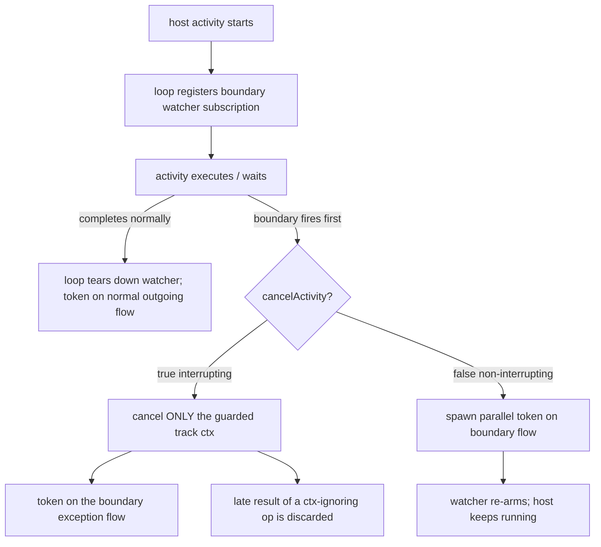
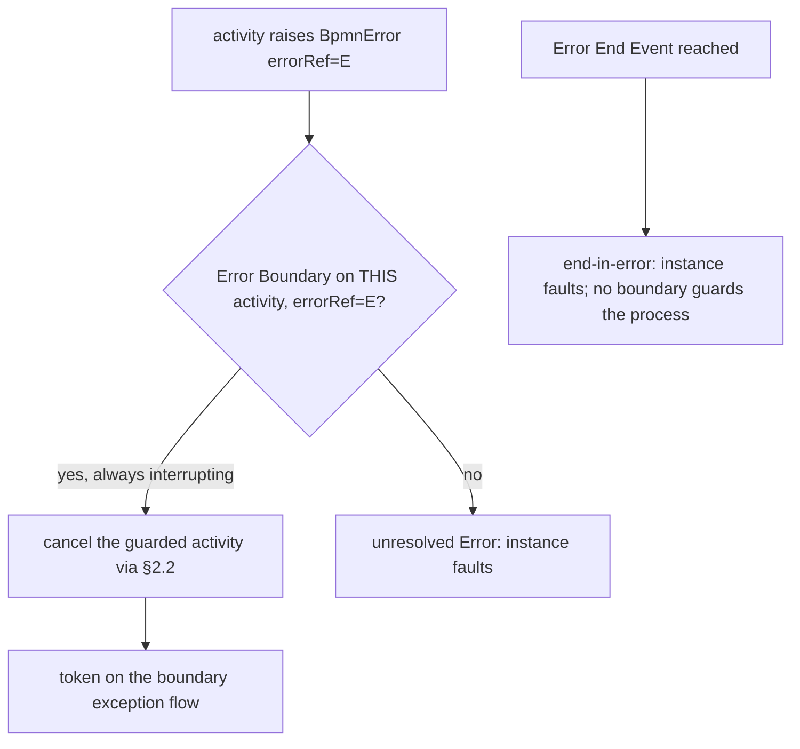

# ADR-018 — Boundary Events & Activity Interruption

| Поле | Значение |
|---|---|
| Статус | Принято |
| Версия | v.1 |
| Дата | 2026-06-27 |
| Владелец | Руслан Габитов |
| Уточняет | [ADR-006 v.2 Events & Subscriptions](ADR-006-events-and-subscriptions.md) §2.2, §2.6, [ADR-001 v.6 Execution Model](ADR-001-execution-model.md) |

> EN-оригинал — канонический: [ADR-018-boundary-events-and-activity-interruption.md](ADR-018-boundary-events-and-activity-interruption.md). Этот файл — его перевод (twin).

> **Принято** — реализовано сопровождающим SRD (SRD-029, M1–M5 в ветке `feat/adr-018-boundary-events`).
> Решает **механизм**, который [ADR-006 v.2](ADR-006-events-and-subscriptions.md) §2.2 оставил открытым:
> как прерывающее граничное событие реально **прерывает выполняющуюся activity**, как граничная подписка
> реализуется на окне выполнения activity и как **Error Boundary** перехватывает брошенную ошибку. Сама
> модель *события* Error — точки выброса, сопоставление `errorRef`, распространение по цепочке областей,
> непойманное→fault — принадлежит [ADR-006 v.2 §2.6](ADR-006-events-and-subscriptions.md); этот ADR
> добавляет лишь вклад границы в неё. ADR-006 §2.2 фиксирует *модель доставки и прерывания* (отменить
> только охраняемый трек; породить продолжение по exception-flow; подписка на всё время жизни activity;
> Error всегда прерывает; один прерывающий обработчик на Event Declaration); этот ADR доводит её до
> строящегося механизма поверх ядра однопоточной обработки событий
> [ADR-017 v.1](ADR-017-channel-based-event-processing.md). Область — набор границ 0.1.0 (Timer, Message,
> Signal, Error) — см. [SAD-001 v.1 §15.3](SAD-001-vision-and-architecture.md).

---

## 1. Контекст и проблема

Граничные события — первый пробел 0.1.0 ([SAD-001 v.1 §15.3](SAD-001-vision-and-architecture.md)):
**Timer-граница** — самая используемая граница на практике (таймауты, SLA, эскалации), а
**Error-граница** — основной способ моделировать пути бизнес-ошибок. Ни одну нельзя построить, не
ответив на вопрос, который ADR-006 §2.2 намеренно отложил до «boundary workstream»:

> **Как прерывается *выполняющаяся* activity?**

Граничное событие — это `CatchEvent`, прикреплённый к activity (`attachedToRef`), с флагом
`cancelActivity` (по умолчанию `true`). При его срабатывании:
- **прерывающее** (`cancelActivity=true`; **Error/Cancel всегда**) — охраняемая activity завершается
  принудительно, и токен уходит по **exception-flow** границы (BPMN §10.5.6);
- **непрерывающее** (`cancelActivity=false`; Timer/Message/Signal/Conditional/Escalation) — activity
  **продолжает работать**, а токен стартует по граничному потоку **параллельно** (§10.5.6).

Однопоточная модель выполнения ([ADR-001 v.6](ADR-001-execution-model.md)) и канальный EPS
([ADR-017 v.1](ADR-017-channel-based-event-processing.md)) дают почти все детали — loop-owned подписку
на события, доставку через channel-park, fork параллельного токена — но не **хук прерывания**:
несущая токен activity выполняется внутри синхронного вызова, а goroutine в Go нельзя убить извне.
Конструкция ниже решает это, а также то, как **Error Boundary перехватывает** брошенную ошибку (сама
модель *события* Error живёт в [ADR-006 v.2 §2.6](ADR-006-events-and-subscriptions.md)).

## 2. Решение

### 2.1 Граница — это loop-owned **watcher-подписка** на окно выполнения activity

Граничное событие реализуется как **catch-подписка, которой владеет per-instance loop**,
регистрируемая, когда охраняемая activity **начинает** выполнение, и снимаемая, когда activity
**покидает** выполнение (нормальным завершением *или* срабатыванием границы). Это прямая реализация
ADR-006 §2.2 («подписка регистрируется на всё время жизни охраняемой activity») на ядре доставки
ADR-017: граница переиспользует **ту же** catch-машинерию, что и промежуточное catch-событие — она
паркуется на пути доставки loop'а, и loop — единственный диспетчер сработавшего события для неё.
Новый механизм доставки не вводится; граница — это «промежуточный catch, чьё время жизни ограничено
выполнением его host-activity и чьё срабатывание действует на host».

Поскольку loop — **единственный писатель**, который и (a) применяет завершение host-activity, и
(b) диспетчеризует срабатывание границы, **гонка завершение-против-срабатывания арбитрируется даром**:
что loop применит первым — то и выигрывает, а проигравший отбрасывается — завершение host'а снимает
ещё ожидающую границу, а срабатывание границы, применённое loop'ом первым, отменяет host. Это та же
атомарность отложенного выбора, что ADR-017 уже установил (flip-to-not-parked при диспетчеризации);
границе не нужны ни дополнительный лок, ни специальный guard от гонки.

### 2.2 Прерывание = **кооперативная отмена** охраняемой activity

Когда прерывающая граница срабатывает, loop отменяет **только трек, выполняющий охраняемую activity**
(никогда не весь инстанс — ADR-006 §2.2) и направляет токен на exception-flow границы. «Отменить
activity» реализуется как **кооперативная отмена через per-activity сигнал отмены**, производный от
контекста трека:

- **Ожидающая** activity (`ReceiveTask`, запаркованный на сообщение; `UserTask`, запаркованный на ввод
  человека) наблюдает отмену немедленно и выходит — **чистое, быстрое** прерывание. Это частый,
  ценный случай (таймаут-на-ожидании).
- **Выполняющаяся** activity (`ServiceTask`, исполняющий операцию) просится остановиться через свой
  контекст. Операция, уважающая `ctx.Done()`, останавливается быстро. Операция, **игнорирующая** свой
  контекст, доработает до конца в своей goroutine — Go не может убить её принудительно — но её результат
  **отброшен**: движок уже перевёл токен на exception-flow и отбрасывает поздний результат.

Эта **кооперативная** семантика — намеренное, документированное ограничение (§4 Альтернативы, §5
Последствия): движок гарантирует *эффект на поток управления* от прерывания (токен немедленно уходит
по exception-flow, выходы activity не фиксируются), даже когда он не может гарантировать *немедленную
остановку* игнорирующей контекст операции. Это согласуется с поведением любого движка на goroutine на
непрерываемом хосте.

**Прерывание — не сбой.** Отменённая activity направляется на exception-flow границы (или, при
terminate инстанса, просто завершается) — она *не* входит на путь распространения-ошибки /
fault-инстанса из §2.4. Движок трактует прерывание как авторитетное: ошибка, которую операция activity
возвращает при разматывании, не превращает прерывание в сбой.

### 2.3 Непрерывающее = **параллельный трек-продолжение**, с перевзводом

Непрерывающая граница потребляет вхождение события, оставляет охраняемую activity работать и порождает
**свежий конкурентный трек** на исходящем потоке границы (существующий механизм fork). Watcher затем
**перевзводится** — непрерывающая граница может срабатывать многократно, пока работает её host (напр.
непрерывающий таймер, тикающий каждые N минут). Подписка снимается лишь когда host-activity покидает
выполнение. Непрерывающий режим разрешён только для Message/Signal/Timer/Conditional/Escalation
(§10.5.6); **Error непрерывающим не бывает**.

### 2.4 Перехват ошибки на границе (модель события — [ADR-006 v.2 §2.6](ADR-006-events-and-subscriptions.md))

Модель *события* Error — точки выброса, сопоставление `errorRef`, распространение по цепочке областей и
исход непойманное→fault — принадлежит [ADR-006 v.2 §2.6](ADR-006-events-and-subscriptions.md). Этот ADR
добавляет лишь то, что вносит **граница**: Error Boundary Event — это точка перехвата, она **всегда
прерывающая** и реализует перехват через кооперативную отмену §2.2. Конкретно для области 0.1.0 — **без
Sub-Process'ов, поэтому единственная область (Process) и нет цепочки для обхода**
([SAD-001 v.1 §15.3](SAD-001-vision-and-architecture.md)):

- **Перехватываемая ошибка — это activity, бросающая `BpmnError`** (`errorCode`) — операция
  `ServiceTask`, вернувшая fault, бросающий `ScriptTask` и т.п. (ADR-006 v.2 §2.6, источник выброса 2).
  Без объемлющей области, куда можно подняться, она перехватывается **только Error Boundary на этой же
  activity**, чей `errorRef` совпадает.
- **Перехват** переводит охраняемую activity в `Failing` и направляет токен на **exception-flow**
  границы через §2.2 (всегда прерывающий; §10.5.6 cancel-after-flow). Это путь бизнес-ошибки, который
  поставляет 0.1.0.
- **Error End Event** бросает на уровне области Process без объемлющего in-process перехватчика, поэтому
  завершает инстанс **с ошибкой** — fault инстанса (случай end-in-error). Граница охраняет *activity*,
  а не процесс, поэтому в 0.1.0 её ничто не перехватывает; она перехватывает то, что иначе было бы путём
  failed-track→instance-failure.
- **Межобластное распространение** (подъём по вложенным областям) и путь перехвата **Error Event
  Sub-Process** достижимы только когда появятся Sub-Process'ы (0.2.0, §2.7); ADR-006 v.2 §2.6 уже
  моделирует их, и механизм этого ADR расширяется на них без изменений.

### 2.5 Кратность (multiplicity)

Согласованно с ADR-006 §2.2 и BPMN §10.5.6: **не более одного прерывающего обработчика на Event
Declaration** на данной activity; **непрерывающих** обработчиков неограниченно, и они выполняются
конкурентно. Движок обеспечивает это на пару `(activity, EventDefinition)`. Различные declaration'ы
(разные `errorRef`/`messageRef`/и т.п.) могут нести каждый свою прерывающую границу.

### 2.6 Область прикрепления

Граница прикрепляется к **Activity** через `attachedToRef`. В 0.1.0 набор host'ов — это существующие
**Task'и** (`ServiceTask`, `UserTask`, `SendTask`, `ReceiveTask`); граница-на-**Sub-Process** и
граница-на-**Call Activity** приходят вместе с этими структурами в 0.2.0 (механизм здесь спроектирован
расширяться на них без изменений — sub-process прерывается отменой его области, той же кооперативной
отменой, применённой к составному host'у).

### 2.7 Набор триггеров 0.1.0

| Триггер | 0.1.0 | Режимы |
|---|---|---|
| **Timer** | ✅ (приоритет) | прерывающий + непрерывающий |
| **Message** | ✅ | прерывающий + непрерывающий |
| **Signal** | ✅ | прерывающий + непрерывающий |
| **Error** | ✅ | только прерывающий (всегда) |
| Conditional | ✅ приземлилось позже | решено в [ADR-006 v.3 §2.7](ADR-006-events-and-subscriptions.md) — loop-owned переоценка по commit-diff, прерывающее + непрерывающее |
| Escalation | ❌ отложено | — |
| Cancel | ❌ отложено | — (только Transaction sub-process) |
| Compensation | ❌ отложено | — (нужна машинерия компенсации) |
| Multiple / Parallel-Multiple | ❌ отложено | — |

## 3. Обоснование стандартом

| Утверждение | Источник BPMN |
|---|---|
| BoundaryEvent — это CatchEvent с `attachedToRef` + `cancelActivity` (по умолчанию true) | §10.5.6; `docs/bpmn-spec/elements/events.md` (BoundaryEvent) |
| Прерывающее завершает activity, токен на exception-flow; непрерывающее оставляет её работать + параллельный токен | §10.5.6; `docs/bpmn-spec/semantics/event-handling.md` §4 |
| Непрерывающее только для Message/Signal/Timer/Conditional/Escalation; **Error всегда прерывающий** | §10.5.6; `event-handling.md` §4 |
| None и Link недопустимы на границе | `event-handling.md` §4 |
| Прерывание: переход activity Active/Ready/Completing → Terminating (non-error) / Failing (error) | §13.3.2; `state-machines/activity-lifecycle.md` |
| Распространение ошибки поднимается по цепочке областей к ближайшему совпавшему перехватчику; непойманная Error критична | §10.5.1, §10.5.7; `event-handling.md` |
| Один прерывающий обработчик на Event Declaration; непрерывающих неограниченно, конкурентно, порядок недетерминирован | §10.5.6; `event-handling.md` §5 |

## 4. Рассмотренные альтернативы

- **Принудительно убить goroutine activity** — *невозможно.* В Go нет kill для goroutine; отмена
  кооперативна по построению. Отклонено как нереализуемое; именно поэтому §2.2 кооперативна.
- **Host-трек мультиплексирует (select по activity-exec + граничным событиям)** — `Exec` activity —
  синхронный, блокирующий вызов; host-трек не может `select` рядом с ним, не обернув каждую activity в
  собственную goroutine и канал результата, дублируя то, что loop уже делает для подписок. Отклонено:
  модель watcher-подписки (§2.1) переиспользует путь доставки ADR-017 и держит гонку под единственным
  писателем.
- **Механизм прерывания, свёрнутый в ADR-006 как bump версии** (вместо нового ADR) — отклонено по
  решению владельца: кооперативная отмена activity — это существенный новый *механизм*, а не правка
  модели event-subscription ADR-006; выделенный ADR держит его обозримым и позволяет ADR-006 §2.2
  оставаться стабильной моделью более высокого уровня, которую этот ADR уточняет. (Сама модель *события*
  Error — выброс, сопоставление, распространение, перехват — *живёт* в ADR-006, детально в **v.2 §2.6**,
  поскольку события — домен ADR-006; этот ADR добавляет лишь граничный перехват + нужную ему
  кооперативную отмену.)
- **Error, перехваченная Error Event Sub-Process** — второй стандартный путь перехвата ошибки; отложено
  с Sub-Process'ами (0.2.0). 0.1.0 перехватывает ошибки только на Error Boundary Event.
- **Превентивный таймаут через отдельную таймер-goroutine, прерывающую инстанс** — отклонено: отменяет
  слишком много (инстанс, а не охраняемый трек) и обходит арбитраж единственным писателем loop'а,
  возвращая класс гонок, который ADR-017 устранил.

## 5. Последствия

- **Таймауты и пути ошибок становятся моделируемыми** — два самых частотных пробела 0.1.0 закрываются
  одним механизмом.
- **Ограничение кооперативной отмены** — операция `ServiceTask`, игнорирующая свой контекст, не может
  быть остановлена на лету; движок гарантирует эффект на поток управления (токен на exception-flow,
  выходы не зафиксированы), но не немедленную остановку. **Операции должны уважать `ctx.Done()`**; это
  становится документированным контрактом интерфейса операции.
- **Нет новой поверхности гонок** — срабатывание границы и завершение host'а оба применяются loop'ом,
  так что единственный писатель их арбитрирует; новый лок не нужен.
- **Давление подписок ограничено** — граничная подписка живёт только на окне выполнения её host'а, а не
  всего инстанса; снятие — loop-owned (нет утечки, нет send-on-closed), наследуя дисциплину снятия
  ADR-017.
- **Перевзводящиеся непрерывающие границы** могут срабатывать много раз — observability (ниже) должна
  делать каждое срабатывание видимым.

## 6. Рекомендации Enterprise-готовности

- **Observability** — испускать структурированный сигнал на каждую подписку / срабатывание / снятие
  границы и на каждое прерывание activity (тип триггера, `cancelActivity`, id host-activity, цель
  exception-flow, а для Error — `errorCode`). Повторные срабатывания непрерывающей границы и отброшенный
  поздний результат ServiceTask — ровно то, что операторам нужно видеть.
- **Контракт контекста операции** — задокументировать, что операция `ServiceTask` **обязана** наблюдать
  `ctx.Done()`, чтобы быть быстро прерываемой; предоставить lint/contract-тест в SDK операций и
  conformance-заметку, что некооперативная операция деградирует до «результат отброшен».
- **Конфигурация таймаутов** — длительности Timer-границ должны выражаться как конфигурация/политика, а
  не только хардкодиться в модели, чтобы SLA можно было тюнить без передеплоя процесса.
- **Реестр кодов ошибок и contract-тестирование** — `errorCode` — это контракт между бросающей activity
  и её перехватывающей границей; рекомендуем реестр кодов ошибок и contract-тесты на то, что у
  брошенного кода есть перехватчик (или намеренный fault).
- **Dead-letter для непойманных ошибок** — непойманная Error фолтит инстанс; операторы должны получать
  фолтящую ошибку на канал dead-letter/incident, а не только строку в логе (связано с будущим эпиком
  Fault-Tolerance).
- **Чувствительные данные** — отброшенный результат прерванной операции не должен логироваться или
  фиксироваться; путь прерывания должен сбрасывать кадр выполнения, а не флашить его.

## 7. План внедрения

Сопровождающий **SRD** приземляет это на ядре ADR-017, по этапам (ориентировочно):
1. Модель — конкретный тип `BoundaryEvent` (`attachedToRef`, `cancelActivity`, определение триггера) +
   builder прикрепления к activity; подключить существующий placeholder `activity.boundaryEvents`.
2. Хук прерывания — per-activity сигнал отмены в жизненном цикле шага трека (чистый для ожидающих
   activity; кооперативный для выполняющихся).
3. Loop-owned граничная watcher-подписка — регистрация на старте host'а, снятие на выходе/срабатывании;
   маршрутизация токена для прерывающего (exception-flow) и непрерывающего (параллельный fork +
   перевзвод).
4. Путь ошибки — подключить граничный перехват на модель события ADR-006 v.2 §2.6: брошенный activity
   `BpmnError`, перехваченный Error Boundary на этой activity (единственная область — без обхода цепочки
   в 0.1.0); Error End Event разрешается в fault инстанса (end-in-error); непойманное → fault инстанса.
5. Верификация — `-race`-тесты на гонку завершение-против-срабатывания и путь перевзвода; запускаемый
   пример (таймаут-на-задаче + error-boundary).

ADR-006 §2.2 уже обобщённо указывает на «boundary workstream», которую этот ADR исполняет. **Механизм
прерывания** границы добавлен *здесь*; **модель события** Error, которую граница перехватывает, детально
описана в **ADR-006 v.2 §2.6** (события — домен ADR-006 — этот bump часть того же change-set'а). ADR-006
**не** несёт обратной ссылки на этот ADR (иерархия: уточняемый ADR не должен ссылаться на ADR, который
его уточняет).

## 8. Ссылки

- [ADR-006 v.2 Events & Subscriptions](ADR-006-events-and-subscriptions.md) §2.2 (модель граничного
  прерывания, уточняемая здесь), §2.6 (модель события Error, которую перехватывает граница), §2.4
  (subscribe-before-publish).
- [ADR-001 v.6 Execution Model](ADR-001-execution-model.md) §4.6 (каскад отмены — граница отменяет один
  трек, а не инстанс).
- [ADR-017 v.1 Channel-based event processing](ADR-017-channel-based-event-processing.md) (loop-owned
  подписка + однопоточная доставка, на которой это строится).
- [ADR-005 v.4 Gateways & Joins](ADR-005-gateways-and-joins.md) (механизм fork, который переиспользует
  непрерывающая граница).
- [SAD-001 v.1 §15.3 Release 0.1.0 — MVP element scope](SAD-001-vision-and-architecture.md).
- `docs/bpmn-spec/` — `semantics/event-handling.md` (§4 границы + правила триггеров, §5 кратность,
  §1–2 распространение), `state-machines/activity-lifecycle.md` (Failing/Terminating),
  `elements/events.md` (BoundaryEvent).

## Открытые вопросы

Нет.

## История документа

| Версия | Дата | Автор | Изменение |
|---|---|---|---|
| v.1 (Принято) | 2026-06-28 | Руслан Габитов | **Принято** — концепция реализована; приземлена сопровождающим SRD (SRD-029) на этапах M1–M5 в ветке `feat/adr-018-boundary-events`: модель `BoundaryEvent` + прикрепление к host'у, per-track отменяемый контекст (сигнал прерывания, которого не хватало кодовой базе), loop-owned подписка `boundaryWatch` с прерывающим/непрерывающим срабатыванием и перевзводом, типизированная ошибка `BpmnError` с перехватом Error-границы в `evFailed`, и fault инстанса от Error End Event. Гонка завершение-против-срабатывания арбитрируется единственным писателем ADR-017; прерывание — кооперативная отмена трека, уважаемая в чекпоинте §3.7 (отбросить, не фолтить). `make ci` зелёный, `-race` чистый, diff-покрытие 98.5% на затронутых файлах; запускаемый `examples/boundary-events/` демонстрирует прерывающую таймер-границу как таймаут. |
| v.1 (Draft) | 2026-06-27 | Руслан Габитов | Черновик концепции. Решает **механизм** граничного события, который ADR-006 v.2 §2.2 отложил до boundary workstream: граница — это **loop-owned watcher-подписка** на окно выполнения охраняемой activity (переиспользуя ядро доставки ADR-017, так что гонка завершение-против-срабатывания арбитрируется единственным писателем); прерывание — **кооперативная отмена** только охраняемого трека (чисто для ожидающих activity, с отбрасыванием результата для игнорирующего контекст выполняющегося ServiceTask — врождённое ограничение Go); непрерывающее порождает параллельный трек-продолжение и перевзводится. Подключает **граничный перехват Error** на модель события Error, детально описанную в ADR-006 v.2 §2.6: в единственной области 0.1.0 (без Sub-Process'ов) брошенный activity `BpmnError` перехватывается Error Boundary на этой же activity (без обхода цепочки), а Error End Event разрешается в fault инстанса (end-in-error). Набор триггеров 0.1.0: Timer (приоритет), Message, Signal (прерывающий + непрерывающий) и Error (только прерывающий); Conditional/Escalation/Cancel/Compensation/Multiple отложены. Граница-на-Sub-Process/Call-Activity отложена до 0.2.0. Уточняет ADR-006 v.2 §2.2/§2.6 и ADR-001 v.6. |
