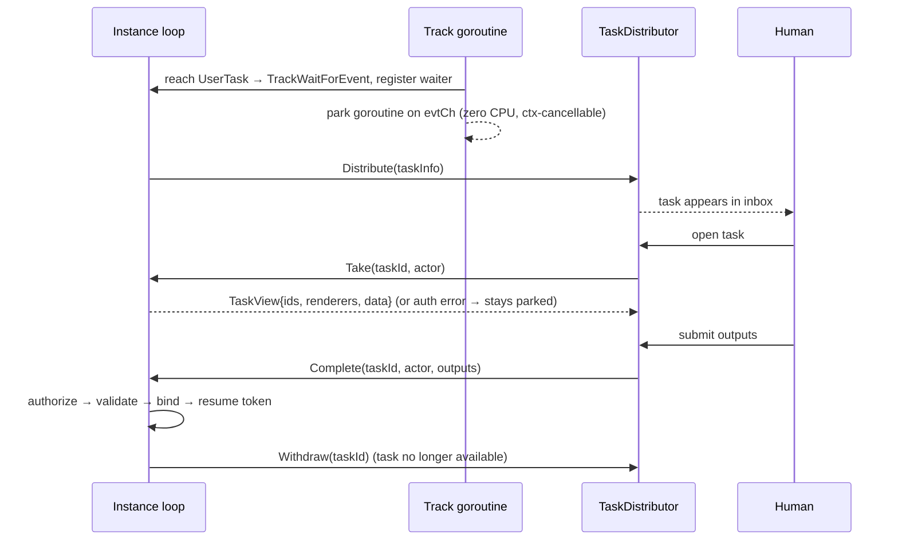

# ADR-020 — Human-Interaction Execution Model (UserTask & ManualTask)

| Field | Value |
|---|---|
| Status | Draft |
| Version | v.1 |
| Date | 2026-07-02 |
| Owner | Ruslan Gabitov |
| Refines | [ADR-001 v.6 Execution Model](ADR-001-execution-model.md), [ADR-017 v.1 Channel-Based Event Processing](ADR-017-channel-based-event-processing.md) §2, [SAD-001 v.1](SAD-001-vision-and-architecture.md) §6, §10, §11 |

> **Draft** — the accompanying **SRD-034** lands it on `feat/human-interaction-model`. Decides how a
> **UserTask** executes on gobpm's park/resume core: it is a **wait node** whose completion is an
> **external event** driven by a human through a pluggable **`TaskDistributor`** boundary (the
> interface [SAD-001 v.1 §6](SAD-001-vision-and-architecture.md) defers to "a dedicated
> human-interaction ADR" — this one). Fixes the class of defect where UserTask was modeled on a
> **blocking `Exec`** — a leftover of the removed Prologue-Exec-Epilogue mechanism — that loops on a
> *foreign* rendering channel and **ignores `ctx`**, so a waiting UserTask can't be cancelled and
> bypasses the loop's single-writer discipline. The fix makes UserTask park on the **same cooperative
> wait-node mechanism every event catch uses** ([ADR-017 v.1](ADR-017-channel-based-event-processing.md),
> SRD-027/028) — no new pause/resume machinery. Also decides the **authorization model** (a Camunda-style
> `assignee` / `candidateUsers` / `candidateGroups` triad expressed on the BPMN `ResourceRole`
> object model) that gates **both** reading and completing a task, and lands **ManualTask** as a
> no-op pass-through. Scope is 0.1.0; full dynamic resource-query subsystems are deferred (§7).

---

## 1. Context & problem

BPMN gives a UserTask a deceptively short execution rule ([§13.3.3](../bpmn-spec/semantics/tasks.md),
spec p430): on activation it is **distributed** to the assigned people (per its
`HumanPerformer` / `PotentialOwner` / `Performer` / `Rendering` — [human-interaction.md](../bpmn-spec/elements/human-interaction.md));
when the work is done, it **completes**. The spec deliberately leaves the *distribution mechanism*
implementation-defined ("The spec does not mandate a specific task list / inbox structure") and puts
the identity model (who a "User" or "Group" is) **out of scope**. Everything interesting is a gap the
engine must decide.

Three concrete problems motivate this ADR:

1. **UserTask uses a foreign execution model.** gobpm executes wait nodes by *park and resume*
   ([ADR-017 v.1](ADR-017-channel-based-event-processing.md), [ADR-001 v.6](ADR-001-execution-model.md)):
   a node that must wait transitions to `TrackWaitForEvent` and its goroutine **parks on the loop-fed
   channel** (`evtCh`) — zero CPU, cooperatively cancellable via `ctx`, and woken only when the
   instance loop (the single writer) delivers the fired trigger. The goroutine is *held* while parked,
   but it never blocks on an external source and it always honors cancellation. UserTask, however, was
   built on a **blocking activation** — a leftover shape from the removed Prologue-Exec-Epilogue
   mechanism — that loops on a *foreign* rendering channel and **ignores `ctx`**. So a parked UserTask
   **cannot be cancelled** (instance abort or an interrupting boundary leaves its goroutine blocked
   forever — the real defect behind the "goroutine leak" audit finding), and it bypasses the loop's
   single-writer discipline. It is a structural mismatch, not a tuning issue — the fix is to make
   UserTask park on the **same cooperative rails as every other wait node**, not to invent a second
   pause/resume mechanism. (Note: *releasing* a parked goroutine entirely — the goroutine-free long
   wait of [SAD-001 v.1 §10](SAD-001-vision-and-architecture.md) — is the future **dehydration /
   rehydration** layer, deferred uniformly for events, long timers, and UserTasks alike; §7. Today all
   wait kinds hold an in-memory parked goroutine, and UserTask simply must do so the same way.)

2. **There is no runtime authorization.** The `ResourceRole` object model is *declared* (a UserTask
   can carry roles) but **never evaluated**: nothing resolves a role to a set of people, there is no
   notion of an **actor** (the acting human) in the engine, and nothing checks whether an actor may
   see or complete a task. A UserTask that anyone can complete — or worse, whose input data anyone can
   read — is not acceptable, and the standard's resource-assignment model exists precisely to prevent
   it.

3. **ManualTask has no execution.** BPMN lists ManualTask as **non-operational**
   ([§13.1](../bpmn-spec/semantics/tasks.md)) — "never actually executed by an IT system." The engine
   needs a defined behavior (a no-op) so a process containing one runs to completion.

This ADR decides the **whole human-interaction execution model** — the wait-node lifecycle, the
`TaskDistributor` boundary, the authorization model, and what a human's client is handed to render the
task — as one coherent concept. The code-level reconciliation (which types change, the goroutine-leak
and rendering-multiplicity defects, tests) is owned by the accompanying **SRD-034**.

## 2. Decision

### 2.1 A UserTask is a **wait node**; its completion is an **external event**

On activation the engine treats the UserTask as a **wait node — the *same* wait-node mechanism every
event catch uses**, no new machinery. It:

1. builds an immutable **task descriptor** (task id, the task's `Renderer`s, its resolved input
   `data.Data`, its declared `ResourceRole`s, and its output specification),
2. announces the task to the **`TaskDistributor`** (§2.2) so a human client can surface it,
3. transitions the track to `TrackWaitForEvent` and **parks its goroutine on the loop-fed channel**
   (`evtCh`) — zero CPU, cooperatively cancellable via `ctx` — exactly as a Message/Timer/Signal catch
   parks ([ADR-017 v.1 §2](ADR-017-channel-based-event-processing.md), [ADR-006 v.2](ADR-006-events-and-subscriptions.md),
   SRD-027/028). The goroutine is *held in memory* while parked (as every wait kind is today); it is
   **not** returned.

The task then sits parked until a human **completes** it. Completion is delivered as an **event into the
instance loop** — the single writer — which routes it to the parked track's `evtCh`, waking the track's
own goroutine to authorize/validate/bind and resume the token onto the outgoing flow(s). This is
"completion-as-an-event": a UserTask is a catch whose trigger is a human action instead of a message or
a timer, riding the identical delivery path. The old blocking, `ctx`-ignoring activation is removed;
because parking is now cooperative and loop-owned, cancelling a parked UserTask (e.g. an interrupting
boundary event, [ADR-018 v.1](ADR-018-boundary-events-and-activity-interruption.md)) is just the standard
parked-waiter teardown (`ctx` cancel / `evtCh` close) plus a `Withdraw` to the distributor (§2.2) —
closing the "goroutine leak" by cooperative cancellation, not by exiting the goroutine.

*(Releasing the parked goroutine entirely for very long waits — dehydration to `Repository` and
rehydration on the trigger, [SAD-001 v.1 §10](SAD-001-vision-and-architecture.md) — is deferred and will
be built once, uniformly, for events, long timers, and UserTasks together; §7.)*



### 2.2 The `TaskDistributor` — a pluggable boundary (embedder-provided)

Human routing is an **embedder concern**, injected like every other boundary
([SAD-001 v.1 §6](SAD-001-vision-and-architecture.md): `MessageBroker`, `Clock`, … and the deferred
`TaskDistributor`). The engine owns *when* a task becomes available and *who* may act on it; the
embedder owns *how* it reaches a human (inbox, web form, mobile push — all valid, the spec mandates
none). The boundary the engine calls **outward**:

```go
// TaskDistributor is the embedder-provided boundary that surfaces human tasks.
// The engine calls it to announce and retract tasks; it does not drive execution.
type TaskDistributor interface {
    // Distribute announces a newly parked UserTask as available for human work.
    Distribute(ctx context.Context, task TaskInfo) error
    // Withdraw retracts a task that is no longer completable — it was completed,
    // or its activity was cancelled (e.g. an interrupting boundary event fired).
    Withdraw(ctx context.Context, taskID string) error
}
```

The **inward** direction — the human acting — is two engine entry points the embedder's client calls.
The engine owns both because it is the custodian of the parked instance's data and the authority on the
task's resource assignment (§2.5):

```go
// Take claims/reads a parked UserTask. It authorizes actor against the task's
// resource assignment BEFORE returning any data; on failure it returns an error and
// exposes nothing — the task stays parked, waiting for an authorized actor.
Take(ctx context.Context, taskID string, actor Actor) (TaskView, error)

// Complete submits an actor's outputs. It authorizes actor, then validates the
// outputs against the task's output spec; only if both pass does it bind the outputs
// and resume the token. An authorization failure is NON-terminal — the task stays
// parked and waits for the right actor.
Complete(ctx context.Context, taskID string, actor Actor, outputs []data.Data) error
```

Only **one** production behavior is mandated by default: if no `TaskDistributor` is injected, a UserTask
still parks and is still completable through `Take`/`Complete` — distribution is an announcement, not a
precondition. (An embedder with no inbox can drive tasks directly by id.)

### 2.3 `Take` — the authorized **read**

`Take` is a human claiming and reading a task. Because the task's input data **is** instance data,
`Take` must authorize **before** exposing anything (§2.5) — otherwise an unauthorized actor could read
variables they have no right to see. On success it returns a **`TaskView`** (§2.8) carrying the runtime
identity, the renderers, and the self-describing data the client needs to build the UI. On authorization
failure it returns an error and exposes **no** data; the task remains parked. `Take` does not resume the
token — reading is not completing.

### 2.4 `Complete` — the authorized **write**, in two rejectable stages

`Complete` is the trigger event. It is **not** fire-on-anything (unlike a message catch); it has
acceptance criteria and is **re-triable**:

1. **Authorization** against the task's resource assignment (§2.5). **Fail → non-terminal rejection:**
   the token stays parked, the task stays open and keeps waiting for an authorized actor.
   `Complete` returns an "unauthorized" error; the process is unaffected.
2. **Output validation** against the task's output specification (required outputs present, types
   conform). **Fail → rejection:** the actor corrects and resubmits; the task stays parked.

Only when **both** pass does the engine **bind** the outputs into the task's scope and **resume** the
token. Completion is therefore **single-shot at the first *accepted* completion** — rejected attempts
(wrong actor, invalid outputs) do not consume the wait. This is the precise sense in which a
UserTask "completes once."

**Where the checks live — `Authorizer` + `OutputValidator`, both on the `UserTask`.** Both checks belong
to the `UserTask` — it declares the triad and the output spec, so it is the element that validates
against them. They are **two separate** capability interfaces (interface segregation), so `Take` can
reuse authorization without depending on output validation, the two failure modes stay distinct
(security vs correctness, §5), and the security-critical ordering (authorize *before* touching outputs)
is explicit at the call site:

```go
// Authorizer resolves the task's triad (static or FormalExpression) against the
// runtime data and decides membership (§2.5). Implemented by UserTask; called at
// BOTH Take and Complete.
type Authorizer interface {
    Authorize(ctx context.Context, actor Actor, src data.Source, eng expression.Engine) error
}

// OutputValidator validates submitted outputs against the task's output spec.
// Implemented by UserTask; called at Complete only.
type OutputValidator interface {
    ValidateOutputs(outputs []data.Data) error
}
```

The **`Instance` is a thin orchestrator**: `Take` → `task.Authorize`; `Complete` → `task.Authorize`
then `task.ValidateOutputs`; on success it binds the outputs and resumes the token. It *provides* the
runtime context (a `data.Source` view over its scope + the expression engine) but holds **no** check
logic; the `TaskDistributor` holds none either. This keeps layering clean — the `UserTask` self-checks
using only **model-layer** abstractions (`data.Source`, `expression.Engine`, `Actor`), exactly as
correlation expressions already resolve over a `data.Source` (`msgflow.DeriveKey`), so
`pkg/model/activities` never imports `internal/`. A per-deployment **pluggable authorization *policy***
(beyond the triad + expression) is a deferred forward-pointer (§7), not a 0.1.0 seam.

### 2.5 Authorization model — a Camunda triad on the BPMN `ResourceRole` base

BPMN's resource-assignment model ([human-interaction.md](../bpmn-spec/elements/human-interaction.md))
gives a `ResourceRole` two mutually-exclusive ways to name its people: a static `resourceRef` **or** a
`resourceAssignmentExpression` whose expression "MUST return Resource entity related data types, like
Users or Groups" and "MAY refer to Task instance data." That is the whole authorization primitive the
standard offers, and it is deliberately silent on identity.

We express it through the vocabulary embedders already know from Camunda — **`assignee`**,
**`candidateUsers`**, **`candidateGroups`** — as an **ergonomic façade over `ResourceRole`**
(`PotentialOwner`/`HumanPerformer`), *not* a parallel representation. The role objects remain the
single, standard-conformant source of truth; the triad is how a modeler declares them and how the
UserTask's `Authorizer` (§2.4) reads them.

**The unifying rule: resolve each triad member to a set of identifiers, then check membership.**

| Triad member | BPMN role | Resolves to | Matched against |
|---|---|---|---|
| `assignee` | `HumanPerformer` (actual owner) | a user-id set (usually one) | `actor.UserID` |
| `candidateUsers` | `PotentialOwner` (users) | a user-id set | `actor.UserID` |
| `candidateGroups` | `PotentialOwner` (groups) | a group-id set | `actor.Groups` |

Authorization verdict for an `actor`:

- **`assignee` set and non-empty** → authorized iff `actor.UserID ∈ assignee-set` (the restrictive
  gate: once a task has an actual owner, only that owner may read/complete it — the Camunda semantic).
- **else** → authorized iff `actor.UserID ∈ candidateUsers` **or** `actor.Groups ∩ candidateGroups ≠ ∅`.
- **no triad member declared** → **open**: any actor is authorized. This is BPMN's "unspecified
  performer" and the engine's default-permissive stance ([SAD-001 v.1 §12](SAD-001-vision-and-architecture.md):
  "Default impl allows all") — the engine does not gratuitously restrict.

The same verdict gates **both** `Take` and `Complete` (§2.3, §2.4). A claim (a candidate's first
successful `Take`) may set the runtime `assignee`, after which the restrictive gate applies — the
familiar claim→complete flow — but claim bookkeeping is a distributor concern; the engine's invariant is
only "authorized actor ⇔ member of the resolved set."

> **Relationship to `AuthorizationProvider`.** [SAD-001 v.1](SAD-001-vision-and-architecture.md) defines
> a coarse, cross-cutting `AuthorizationProvider.Authorize(operation, …)` gate for sensitive operations
> ("start process", "claim user task", "cancel instance"; default allow-all). That is **orthogonal** to
> this triad: the provider answers "may this principal claim *any* task at all?"; the triad answers "is
> this actor a candidate/assignee of *this specific* task?" They compose — a deployment may wire
> both. This ADR decides only the task-level, standard-grounded triad.

### 2.6 The `Actor` — runtime identity

The engine's runtime notion of an acting human is minimal and carries exactly what the triad matches.
It is named **`Actor`** to avoid collision with the BPMN `Performer` *element* (a `ResourceRole`
subtype, a role declaration) — the `Actor` is the authenticated identity *acting on* a task, not a role:

```go
// Actor is the authenticated human acting on a task. The TaskDistributor
// authenticates the human and supplies this; the engine authorizes it (§2.5).
type Actor interface {
    UserID() string    // matched against assignee / candidateUsers
    Groups() []string  // matched against candidateGroups
}
```

Identity and group membership are **authenticated by the `TaskDistributor`** (the embedder's IAM
concern, out of BPMN scope) and **trusted** by the engine — the engine authorizes (set membership), it
does not authenticate. This keeps the engine free of any user directory while still enforcing the
model's resource assignment.

### 2.7 Static identifiers **or** a `FormalExpression`

Mirroring the `resourceRef`-vs-`resourceAssignmentExpression` duality, each triad member is declared by
**either** static identifiers **or** a `FormalExpression` that evaluates to a list (possibly a single
element) of identifiers/names. The paired option constructors keep the static path free of expression
ceremony and match the project's explicit-option idiom:

| Static | Dynamic (expression → `[]string`) |
|---|---|
| `WithAssignee(userID string)` | `WithAssigneeExpr(expr data.Expression)` |
| `WithCandidateUsers(ids ...string)` | `WithCandidateUsersExpr(expr data.Expression)` |
| `WithCandidateGroups(ids ...string)` | `WithCandidateGroupsExpr(expr data.Expression)` |

Static and dynamic forms for the same member are **mutually exclusive** (the existing `ResourceRole`
"resource XOR assignment-expression" invariant). The UserTask's `Authorizer` (§2.4) resolves an
expression-backed member **at authorization time**, against the **instance's data scope** (via the expression
engine) — so a candidate set may depend on process data and is **dynamic per instance**, which is
exactly what `resourceAssignmentExpression` is for. Resolution failure of an expression is treated as an
empty result set (BPMN: "Failed Resource queries are treated like Resource queries that return an empty
result set" — [human-interaction.md](../bpmn-spec/elements/human-interaction.md)), i.e. it authorizes
no one rather than everyone.

### 2.8 `TaskView` — what `Take` returns

The client rendering a task needs more than the raw output variables — it needs to know *which form* to
render, *what* runtime context it is in, and the *self-describing* data to lay out. `Take` returns a
**typed descriptor with an open data bag**:

```go
// TaskView is the authorized snapshot a client renders. Runtime identity is typed
// (always present); the payload is a self-describing data.Data bag.
type TaskView struct {
    TaskID     string          // this task instance
    InstanceID string          // owning process instance
    NodeID     string          // the UserTask node (activity) id
    ProcessID  string          // the process definition id
    Renderers  []hi.Renderer   // form/field descriptions, carried to the client (not invoked inline by the engine)
    Data       []data.Data     // inputs + task Properties (e.g. FORM_ID), each self-describing
}
```

- **Runtime identity is typed.** `InstanceID` / `NodeID` / `ProcessID` / `TaskID` are always present and
  known to the engine; a typed field is discoverable and cannot collide with a business variable, unlike
  a stringly-named reserved key.
- **The payload is a `data.Data` bag.** Every item self-describes via `Name()`, `Value()`, `State()`,
  and `ItemDefinition()` (its type) — the client can build UI without reading engine code. This includes
  the task's business inputs **and** its `Property`s (a `Property` *is* a `data.Data`).
- **`FORM_ID` is a userland property convention, not an engine field.** A modeler attaches a `FORM_ID`
  Property (any name they like — `LAYOUT`, `FORM_VERSION`, …); the engine stays ignorant of it and just
  returns it in `Data`; the client reads it and picks the form. The engine grows no form registry —
  composition over restriction.
- **`Complete` is symmetric** — it accepts `[]data.Data` outputs (self-describing), validated against
  the task's output spec.

### 2.9 Rendering — carried in the descriptor, multiplicity by **identity**

A UserTask's `Renderer`s are **carried in the task descriptor** (the `TaskView`, §2.8), not invoked
inline by the engine during activation — inline invocation was part of the old blocking path. Whether
and how a client evaluates a `Renderer` (its `Render` method) to produce form data is the embedder's
choice; the engine only conveys the renderers to the client, untouched. BPMN models `Rendering` as an
**optional, repeatable** element on a UserTask
([human-interaction.md](../bpmn-spec/elements/human-interaction.md) documents the `Rendering` element
itself; its `0..*` association to a UserTask is declared in the full spec's UserTask section), so a task
MAY carry several renderers — e.g. a web form and a mobile form. Distinct renderers are distinguished
**by identity** (`ID()`), never by their implementation-type marker: two renderers of the same
implementation kind are legitimately different renderings and must both survive. (This corrects a defect
where a second renderer of the same implementation type was
silently dropped — reconciled in SRD-034.)

### 2.10 ManualTask — no-op pass-through

A ManualTask is **non-operational** ([§13.1](../bpmn-spec/semantics/tasks.md): "never actually executed
by an IT system"; Process Execution Conformance permits an engine to "MAY ignore Manual Tasks / treat as
no-op pass-through"). The engine treats it as a **pass-through**: the token flows straight to the
outgoing sequence flow(s) with no descriptor, no distribution, and no wait. This matches
[SAD-001 v.1 §15](SAD-001-vision-and-architecture.md) ("the engine treats it as a pass-through … near-zero
execution value") and closes the last non-operational-task gap for 0.1.0.

## 3. Standard grounding

| Claim | Source | What it says |
|---|---|---|
| UserTask distributes then completes; mechanism implementation-defined | [§13.3.3](../bpmn-spec/semantics/tasks.md) (spec p430) | "distributed to the assigned person or group … When the work has been done, the User Task completes"; "distribution mechanism is implementation-defined." |
| Resource-assignment object model | [human-interaction.md](../bpmn-spec/elements/human-interaction.md) | `ResourceRole` has `resourceRef` (0..1) XOR `resourceAssignmentExpression` (0..1); `PotentialOwner → HumanPerformer → Performer → ResourceRole`; `Rendering` is an optional, repeatable element (the extract documents the `Rendering` element; its `0..*` association to a UserTask is in the full spec's UserTask section). |
| Assignment expression returns Users/Groups, may read task data | [human-interaction.md](../bpmn-spec/elements/human-interaction.md) (§ResourceAssignmentExpression) | "MUST return Resource entity related data types, like Users or Groups"; parameter bindings "MAY refer to Task instance data." |
| Failed resource query ⇒ empty set | [human-interaction.md](../bpmn-spec/elements/human-interaction.md) | "Failed Resource queries are treated like Resource queries that return an empty result set." |
| ManualTask is non-operational | [§13.1](../bpmn-spec/semantics/tasks.md) | Listed non-operational; conforming engine MAY treat as no-op pass-through. |

Where gobpm **chooses** beyond the standard's silence, it is called out as an engine decision, not
attributed to the spec: the `assignee`/`candidateUsers`/`candidateGroups` **vocabulary** (a Camunda
convention, mapped onto `ResourceRole`), the **`Actor` identity shape**, the **park/resume**
execution (the standard is silent on threading), and gating **`Take`** by authorization (the standard
speaks of completion, not of reading).

## 4. Alternatives considered

1. **Keep the blocking activation, just add `ctx` cancellation to the foreign rendering-channel loop.**
   Rejected: it would stop the leak but keep UserTask a **special case with its own pause/resume path**,
   duplicating the wait-node mechanism the event core already provides. The cause isn't "holds a
   goroutine" (every wait kind does today, in memory) — it's *a second, foreign parking mechanism*.
   Reusing `TrackWaitForEvent`/`evtCh` unifies UserTask with events, and is exactly the single mechanism
   the eventual dehydration/rehydration layer will lift uniformly for all wait kinds.

2. **Authorize on the `TaskDistributor` side; the engine trusts a "done" verdict.** Rejected: it
   contradicts the requirement that the *engine* enforce resource assignment, and a buggy or malicious
   embedder could bypass the model. The engine holds the roles; the engine must render the verdict.

3. **Authorize only on `Complete`, treat `Take` as pure distributor bookkeeping.** Rejected: `Take`
   reads instance data, so skipping its authorization leaks variables to unauthorized actors. Both gates
   authorize.

4. **Build a full User/Group directory + resource-query subsystem now.** Rejected as speculative
   universality: there is no identity subsystem to hang it on, and the `FormalExpression` form already
   covers dynamic, data-dependent candidate sets. The actor self-reports authenticated identity +
   groups; richer directory integration is an embedder concern and a forward pointer (§7).

5. **Triad as first-class `UserTask` fields alongside `Roles()`.** Rejected: two parallel
   representations that can drift. The triad is a **façade over `ResourceRole`** so the standard object
   model stays the single source of truth (§2.5).

6. **`Take` returns `[]variable` (bare values).** Rejected: it discards data **state** and **type** and
   cannot carry Properties (`FORM_ID`) or runtime context. `TaskView` + `[]data.Data` gives the client a
   self-describing, renderable snapshot (§2.8).

7. **Flat `[]data.Data` for the whole `Take` result, runtime ids as reserved keys.** Rejected in favor
   of a typed `TaskView`: always-present runtime identity deserves a typed, collision-free contract; only
   the genuinely open payload is a bag.

8. **A single `CompleteChecker` bundling authorization + output validation.** Rejected in favor of two
   segregated interfaces (`Authorizer`, `OutputValidator`, §2.4): `Take` needs authorization but has no
   outputs to validate, so a bundled `CheckComplete(actor, outputs)` can't serve it; the two failure
   modes are distinct (security-relevant unauthorized vs fix-and-resubmit invalid-output); and the
   security-critical authorize-before-outputs ordering is better made explicit at the orchestrating call
   site than hidden inside one method. Both interfaces still live on the `UserTask` (the shared goal with
   the bundled option — keep check logic off the Instance and TaskDistributor).

## 5. Consequences

- **UserTask parks on the one shared wait-node mechanism.** It reuses `TrackWaitForEvent`/`evtCh` —
  no second pause/resume path — so the `ctx`-ignoring blocking loop (and its uncancellable "leak") is
  gone: a parked UserTask is now cooperatively cancellable like every catch. The goroutine is still
  *held in memory* (as all wait kinds are today); releasing it for very long waits is the deferred,
  uniform dehydration layer (§7), not something this ADR claims.
- **A parked UserTask is cancellable.** An interrupting boundary event
  ([ADR-018 v.1](ADR-018-boundary-events-and-activity-interruption.md)) tears down the parked waiter and
  `Withdraw`s the task from the distributor — no orphaned goroutine, no orphaned inbox entry.
- **Authorization is enforced, standard-grounded, and default-permissive.** No-triad tasks stay open
  (frictionless for simple processes); declared tasks are enforced at both read and write.
- **Check logic is cohesive, on the model element.** `Authorizer` + `OutputValidator` live on the
  `UserTask`; the `Instance` only orchestrates (authorize → validate → bind → resume) and the
  `TaskDistributor` holds none. Adding a task type or a check evolves one place, not three.
- **Embedders get a familiar surface.** The Camunda triad + `FORM_ID` property convention means the API
  reads the way BPM practitioners expect, while the engine stays a thin, standard-conformant core.
- **New injected boundary.** `TaskDistributor` joins the engine's option set (`MessageBroker`, `Clock`,
  …). It is optional; absent it, tasks are still completable by id.
- **`Renderer` is no longer engine-invoked.** The engine carries renderers to the client instead of
  calling them inline — simpler, and it removes the inline-invocation blocking path.

## 6. Enterprise-readiness recommendations

- **Observability.** Emit task lifecycle signals — `task.distributed`, `task.taken` (with actor),
  `task.completion.rejected` (with reason: unauthorized vs invalid-output), `task.completed`,
  `task.withdrawn` — through the existing instance observability channel
  ([ADR-013 v.1](ADR-013-instance-observability.md)). Rejected completions are security-relevant and
  should be observable without logging task payloads.
- **Audit the authorization decision, not the data.** Log *who* was authorized/denied for *which* task,
  never the task's variables (which may be sensitive). The verdict is the audit artifact.
- **Idempotent `Complete`.** Clients may retry; the engine must treat a `Complete` on an
  already-completed task as a well-defined no-op/error, not a second resume.
- **`AuthorizationProvider` composition.** Deployments needing coarse gates ("may this principal claim
  tasks at all?") wire [SAD-001 v.1](SAD-001-vision-and-architecture.md)'s `AuthorizationProvider`
  alongside the triad; document the two-layer model for operators.
- **Sensitive data in `TaskView`.** Since `Take` exposes instance data, embedders surfacing tasks to
  browsers should treat `TaskView.Data` as need-to-know and avoid over-broad candidate groups.

## 7. Rollout plan

Landed by **SRD-034** on `feat/human-interaction-model` (code-grounded milestones there):

1. `Actor` identity + the triad authorization model (static + expression resolution) + the UserTask's
   `Authorizer` and `OutputValidator` checks (§2.4).
2. UserTask wait-node redesign (descriptor, park, `Take`/`Complete`, `TaskView`) on the ADR-017 core,
   with the `Instance` as check orchestrator; `TaskDistributor` boundary + engine option.
3. Rendering multiplicity fix (dedup by identity, §2.9).
4. ManualTask no-op pass-through.

**Deferred (forward pointers, not built now):**

- A directory/resource-query subsystem (LDAP/DB-backed candidate resolution) beyond `FormalExpression`
  — an embedder concern; the pluggable path is the expression form and the actor's self-reported
  groups.
- A per-deployment **pluggable authorization *policy*** (overriding the triad-membership rule itself,
  not just its inputs). The 0.1.0 check logic lives on the `UserTask` (§2.4); the triad +
  `FormalExpression` already covers dynamic candidate sets, so a policy-override seam is unnecessary now.
- Task escalation / reassignment / delegation and formal claim/unclaim state machines — a later
  human-task-lifecycle ADR if demand appears.
- **Dehydration / rehydration of parked waits** — releasing the in-memory parked goroutine, externalizing
  its state to `Repository`, and rehydrating on the trigger ([ADR-009 v.1](ADR-009-per-instance-node-graph.md),
  [SAD-001 v.1 §10](SAD-001-vision-and-architecture.md)). This is **not specific to UserTask**: today
  every wait kind (events, long timers, UserTasks) holds an in-memory parked goroutine, and the
  goroutine-free long wait is a single mechanism to be built **once, uniformly, for all of them**. The
  sequencing is deliberate — prove UserTask on the in-memory park first (this ADR), then lift the whole
  set of wait kinds to dehydration together, rather than inventing a UserTask-specific persistence path.

## 8. References

- [ADR-001 v.6 Execution Model](ADR-001-execution-model.md) — park/resume, token lifecycle.
- [ADR-017 v.1 Channel-Based Event Processing](ADR-017-channel-based-event-processing.md) §2 — the
  wait-node core UserTask now rides.
- [ADR-006 v.2 Events & Subscriptions](ADR-006-events-and-subscriptions.md) — waiter registration model.
- [ADR-010 v.2 Process Data Model](ADR-010-process-data-model.md) — Property (`FORM_ID`) is a `data.Data`.
- [ADR-011 v.5 Process Data Flow](ADR-011-process-data-flow.md) — scope binding of task outputs.
- [ADR-013 v.1 Instance Observability](ADR-013-instance-observability.md) — task lifecycle signals.
- [ADR-018 v.1 Boundary Events & Activity Interruption](ADR-018-boundary-events-and-activity-interruption.md)
  — cancellation of a parked UserTask.
- [SAD-001 v.1 Vision & Architecture](SAD-001-vision-and-architecture.md) §6 & §11 (`TaskDistributor`
  deferral), §12 (`AuthorizationProvider`), §10 (no goroutines on long waits), §15 (ManualTask pass-through).
- BPMN 2.0 [§13.3.3 UserTask](../bpmn-spec/semantics/tasks.md), [§13.1 ManualTask](../bpmn-spec/semantics/tasks.md),
  [Human Interaction elements](../bpmn-spec/elements/human-interaction.md).

## Open questions

None.

## Document History

| Version | Date | Change |
|---|---|---|
| v.1 | 2026-07-02 | Initial draft — UserTask as a wait node parking on the shared `TrackWaitForEvent`/`evtCh` mechanism (goroutine held, not returned; dehydration deferred uniformly); `TaskDistributor` boundary; `Take`/`Complete` authorization-gated entry points; Camunda triad over `ResourceRole` (static + `FormalExpression`); `Actor` runtime identity; `Authorizer` + `OutputValidator` checks owned by the `UserTask`, `Instance` as orchestrator; `TaskView` return; renderer multiplicity by identity; ManualTask no-op. |
