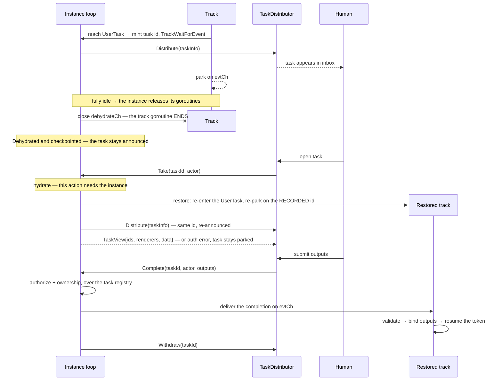

# ADR-020 — Human-Interaction Execution Model (UserTask & ManualTask)

| Field | Value |
|---|---|
| Status | Draft (v.4 — flips back to Accepted when the v.4 changes land) |
| Version | v.4 |
| Date | 2026-08-25 |
| Owner | Ruslan Gabitov |
| Refines | [ADR-001 v.6 Execution Model](ADR-001-execution-model.md), [ADR-017 v.1 Channel-Based Event Processing](ADR-017-channel-based-event-processing.md) §2, [ADR-007 v.2.1 In-Memory Long Waits](ADR-007-in-memory-long-waits.md) §2.4, [SAD-001 v.1.1](SAD-001-vision-and-architecture.md) §6, §10, §11 |

This ADR decides how a **UserTask** and a **ManualTask** execute. A UserTask is a
**wait node** whose trigger is a human action, announced through a pluggable
**`TaskDistributor`** boundary and acted on through engine entry points the engine
authorizes. It decides who **may** act (eligibility — the Camunda triad and BPMN's
own `ResourceRole` kinds), who **holds** the task now (ownership — `actualOwner`,
`Claim`/`Unclaim`/`Reassign`), what completion **records**, what a client is handed
to render, and what an **iterated** UserTask means. A ManualTask is a no-op
pass-through.

---

## 1. Context & problem

BPMN gives a UserTask a deceptively short execution rule
([§13.3.3](../bpmn-spec/semantics/tasks.md), spec p430): on activation it is
**distributed** to the assigned people (per its `HumanPerformer` /
`PotentialOwner` / `Performer` / `Rendering` —
[human-interaction.md](../bpmn-spec/elements/human-interaction.md)); when the work
is done, it **completes**. The spec deliberately leaves the *distribution
mechanism* implementation-defined ("The spec does not mandate a specific task list
/ inbox structure") and puts the identity model (who a "User" or "Group" is) **out
of scope**. Everything interesting is a gap the engine must decide.

Three properties of human work shape every decision below.

1. **A human wait is a long wait.** It is measured in hours and days, not
   milliseconds, so it must ride the engine's *one* park/resume mechanism
   ([ADR-017 v.1](ADR-017-channel-based-event-processing.md),
   [ADR-001 v.6](ADR-001-execution-model.md)) rather than a second, human-specific
   one. Only then is a waiting task cooperatively cancellable, subject to the
   loop's single-writer discipline, and lifted by the dehydration layer that
   releases goroutines uniformly for events, long timers and human tasks alike
   ([ADR-007 v.2.1](ADR-007-in-memory-long-waits.md) §2.4).

2. **The engine must enforce resource assignment itself.** A UserTask's input data
   *is* instance data, so "who may read this task" is a security question, not
   inbox bookkeeping. The `ResourceRole` object model exists precisely to answer
   it, and an engine that carries roles without evaluating them offers no
   protection at all.

3. **ManualTask has no execution.** BPMN lists it as **non-operational**
   ([§13.1](../bpmn-spec/semantics/tasks.md)) — "never actually executed by an IT
   system" — so the engine still needs a defined behaviour for a process that
   contains one.

Two further problems are specific enough to state at length, because the decisions
they drive (§2.5.1–§2.5.4) are the least obvious in this document.

### 1.4 Eligibility is not exclusivity

BPMN splits a UserTask's attributes across two tables. **Table 10.13** carries the
*model* attributes — the design-time shape (`implementation`, `renderings`) an XML
definition serializes. **Table 10.14** carries the *instance* attributes — runtime
facts about a live task, which no XML definition contains because they do not exist
until a task is running:

> **Table 10.14 – User Task instance attributes** (§10.3.4.1)
> `actualOwner: string` — Returns the "user" who picked/claimed the User task and
> became the actual owner of it. The value is a literal representing the user's id,
> email address etc.
> `taskPriority: integer` — Returns the priority of the User Task.

Design-time assignment alone — a `ResourceRole` model naming who **may** read and
complete a task (§2.5) — leaves authorization as the *only* gate on acting: every
eligible candidate is, permanently and simultaneously, equally entitled to complete
the task. Three problems follow.

**Candidates collide.** A task offered to a group of candidates can be worked by
all of them at once. Nothing lets one candidate signal "I am doing this", and
nothing stops a second from completing it while the first fills in the form —
whoever submits first wins and the other's effort is silently discarded. The wasted
work is also invisible: the loser's submission is refused as an unknown task,
indistinguishable from one that was cancelled. Offering work to N people is a
routine and correct way to model human work; the missing piece is the **claim**
that converts an offer into an assignment — precisely the transition `actualOwner`
describes ("picked/claimed … became the actual owner"). Its absence is a
conformance gap, not a missing convenience.

**Nothing records who performed the work.** The design-time assignment is a
*constant* — a declared identifier or an expression evaluated to decide
eligibility. It answers "who was allowed to do this", never "who did it". So there
is no audit answer to "who completed this task", and — more limiting — a process
**cannot route on its own history**. The canonical pattern of sending work to the
previous performer's manager for approval is unmodellable, because the previous
performer's identity is recorded nowhere the process can read. The standard
anticipates the need: instance attributes are expression-readable, via the
`getActivityInstanceAttribute` XPath binding (§10.4.3).

**Stuck human work has no remedy.** With eligibility fixed at design time and no
administrative operation, a task whose intended performer becomes unavailable — on
vacation, ill, or gone from the company — is completable by nobody, and the
instance stalls indefinitely on a wait only an actor who will never act can
satisfy. Three real situations demand a handover: a department manager designating
a responsible person; an administrator rescuing a task from an unavailable
performer; and the wholesale transfer of a departing employee's workload. The first
is expressible through an assignment expression reading process data (§2.7) — but
note that it *produces* the very single-assignee tasks the second situation must
later rescue. Assignment and reassignment are therefore not alternatives: a design
supporting the first **must** support the second.

The standard supplies the attribute and the vocabulary and stops there — no
operations for acquiring or transferring ownership, and no ownership states in its
activity lifecycle (§13.3.2). Those are the engine's to decide, and §2.5.1–§2.5.3
decide them.

### 1.5 A declared role that authorizes nobody

BPMN assigns people to work through one primitive: an `Activity` carries
`resources: ResourceRole [0..*]` (Table 10.3), and a `ResourceRole` names its
people in one of **two mutually exclusive** ways. The exclusivity is not inferred —
Table 10.5 states it in the attribute text itself:

> **Table 10.5 – Resource Role model associations** (§10.3.1)
> `resourceRef: Resource [0..1]` — "The Resource that is associated with Activity.
> **Should not be specified when `resourceAssignmentExpression` is provided.**"
> `resourceAssignmentExpression: ResourceAssignmentExpression [0..1]` — "This
> defines the Expression used for the Resource assignment. **Should not be
> specified when a `resourceRef` is provided.**"
> `resourceParameterBindings: ResourceParameterBinding [0..*]` — "This defines the
> Parameter bindings used for the Resource assignment. **Is only applicable if a
> `resourceRef` is specified.**"

The two modes have very different costs. **Directory mode** (`resourceRef` + its
parameter bindings) is a *query* — §8.4.12 *Resources* describes a parameterized
`Resource` resolved by a query "e.g., into an Organizational Directory" — a
subsystem the standard assumes and gobpm does not have. **Expression mode** needs
nothing external: §10.3.1 *Expression Assignment* says the expressions "MUST return
Resource entity related data types, like Users or Groups", and that "all of them
are assigned to the respective subclass of the `ResourceRole` element, for example
as potential owners."

That second mode is **exactly** what the triad does — resolve an expression (or a
static list) to identifiers, then check the acting party against them (§2.5, §2.7).
So the semantic content of expression-based resource assignment is implemented;
what the standard adds is a **name** for it. Treating the two surfaces as
coexisting-but-unrelated has one consequence that is a defect:

**A declared role must not be inert.** A modeller who writes the standard's own
vocabulary — a `PotentialOwner` on a UserTask — declares who may claim the task,
and must not get **no authorization at all**. A role that is carried, surfaced to
the distributor, and never consulted is worse than an unsupported element: an
unsupported element can be rejected at registration, loudly, and the modeller
learns immediately. A silently inert one looks like it works. The engine's own
fail-loud-on-unusable-declaration stance
([SAD-001 v.1.1](SAD-001-vision-and-architecture.md) §14.1's value-less item-aware
element, rejected at registration rather than "admitted as a dead placeholder")
applies to its own authorization surface too.

**The conformance position must be statable.** gobpm targets the Common Executable
Subclass, within which the resource model sits. Recording `Performer` /
`HumanPerformer` / `PotentialOwner` as simply *absent* mis-states it twice over: the
engine implements one of the standard's two assignment modes completely, and the
mode it does **not** implement is missing for a stated architectural reason (no
directory subsystem), which is a *registered deviation*, not a gap. A conformance
register that says "absent" where the truth is "one mode executed, one mode
deliberately declined" is not merely modest — it is inaccurate, and it is the
document a reader coming from another engine trusts.

The fix follows from the object model rather than from taste. Because the
subclasses add nothing — "[t]he `HumanPerformer` element inherits the attributes
and model associations of `ResourceRole` … but **does not have any additional
attributes or model associations**" (§10.3.4.1) — the whole `PotentialOwner →
HumanPerformer → Performer → ResourceRole` chain is a **discriminator**, not a data
hierarchy. Naming the role costs one field, and executing it costs a resolution
path that already exists (§2.5.4).

## 2. Decision

### 2.1 A UserTask is a **wait node**; its completion is an **external event**

On activation the engine treats the UserTask as a **wait node — the *same*
wait-node mechanism every event catch uses**, no new machinery. It:

1. mints the task's **identity** and builds an immutable **task descriptor** (task
   id, the task's `Renderer`s, its resolved input `data.Data`, its declared
   `ResourceRole`s, its resolved eligibility and its output specification),
2. announces the task to the **`TaskDistributor`** (§2.2) so a human client can
   surface it,
3. transitions the track to `TrackWaitForEvent` and parks it on the loop-fed
   channel (`evtCh`) — zero CPU, cooperatively cancellable via `ctx` — exactly as a
   Message/Timer/Signal catch parks
   ([ADR-017 v.1 §2](ADR-017-channel-based-event-processing.md),
   [ADR-006 v.6](ADR-006-events-and-subscriptions.md)).

**The wait then outlives the goroutine that reached it.** A human wait is the
archetypal long wait, so as soon as every live track is parked on a dehydratable
wait that an engine-level holder has accepted, and nothing pins the instance
resident, the instance is **released**: each parked track's goroutine **ends**
(`TrackDehydrated`), the loop settles the instance `Dehydrated` and writes a
consistent-cut checkpoint ([ADR-007 v.2.1](ADR-007-in-memory-long-waits.md) §2.4,
[SAD-001 v.1.1 §10](SAD-001-vision-and-architecture.md)). Nothing is withdrawn and
nothing is forgotten — the announcement stays in the embedder's inbox, and the
engine's task registry keeps the identity, the frozen eligible set (§2.7) and the
owner (§2.5.1). What is gone is only the goroutine.

**A task action brings the instance back.** `Take` and `Complete` need it — the
first to read the instance's data, the second to bind outputs and move the token —
so each hydrates a released instance; the ownership operations need nothing from it
and do not (§2.1.1). Hydration here is **trigger-absent**: a human task is not an
event firing through a node, it is a wait the instance must simply be *present*
for. So the rebuild re-materializes the track as a **continuation fork** — a *new*
track goroutine — which **re-enters the UserTask node and re-parks it**. Two
properties make that safe to repeat any number of times:

- the re-parked task keeps its **recorded** id rather than minting a fresh one, so
  the handle a human or a UI is holding stays valid across every release/hydrate
  cycle;
- it is **re-announced** to the distributor under that same id — which is why
  `Distribute` must be idempotent by task id: an inbox that appended on every call
  would show one task many times.

**Completion resumes whichever track is parked there.** It is delivered as an
**event into the instance loop** — the single writer — which routes it to the
parked track's `evtCh`; that track wakes, validates and binds the outputs, and
resumes the token onto the outgoing flow(s). This is "completion-as-an-event": a
UserTask is a catch whose trigger is a human action instead of a message or a
timer, riding the identical delivery path.

The resident case is the same path with one step missing. While an instance stays
resident — no repository and holder wired, or a resident pin held — the goroutine
that reached the node is the one that resumes, and nothing above changes except
that the release never happens. **The node's execution is continuous even when the
goroutine is not**, which is exactly what makes releasing it safe.

Cancelling a parked UserTask (e.g. an interrupting boundary event,
[ADR-018 v.1](ADR-018-boundary-events-and-activity-interruption.md)) is the
standard parked-waiter teardown — `ctx` cancel / `evtCh` close — plus a `Withdraw`
to the distributor (§2.2).


```mermaid
sequenceDiagram
    participant IL as Instance loop
    participant T1 as Track
    participant TD as TaskDistributor
    participant Human

    T1->>IL: reach UserTask → mint task id, TrackWaitForEvent
    IL->>TD: Distribute(taskInfo)
    TD-->>Human: task appears in inbox
    T1-->>T1: park on evtCh
    Note over IL,T1: fully idle → the instance releases its goroutines
    destroy T1
    IL-xT1: close dehydrateCh — the track goroutine ENDS
    Note over IL: Dehydrated and checkpointed — the task stays announced
    Human->>TD: open task
    TD->>IL: Take(taskId, actor)
    Note over IL: hydrate — this action needs the instance
    create participant T2 as Restored track
    IL->>T2: restore: re-enter the UserTask, re-park on the RECORDED id
    IL->>TD: Distribute(taskInfo) — same id, re-announced
    IL-->>TD: TaskView{ids, renderers, data} — or auth error, task stays parked
    Human->>TD: submit outputs
    TD->>IL: Complete(taskId, actor, outputs)
    IL->>IL: authorize + ownership, over the task registry
    IL->>T2: deliver the completion on evtCh
    T2->>T2: validate → bind outputs → resume the token
    IL->>TD: Withdraw(taskId)
```

#### 2.1.1 Ownership and the parked token

An ownership operation (§2.5.2) changes who holds the task and returns. It does
**not** advance the token, deliver an event, or wake the parked track. The task
stays parked and keeps waiting for human action; **only completion resumes it**
(§2.4). Three consequences follow, and each is a decision:

**Ownership is not an activity state.** The BPMN activity lifecycle (§13.3.2,
Figure 13.2) defines `Inactive`, `Ready`, `Active`, `Withdrawn`, `Completing`,
`Completed`, `Compensating`, `Compensated`, `Failing`, `Terminating`, `Failed`,
`Terminated`, `Closed` — and **no ownership state**. Claiming a task therefore does
not transition the activity: an owned task is `Active`, exactly as an unowned
parked task is. Ownership is an *attribute* of a running activity, which is
precisely why the standard puts it in the instance-attribute table and not in the
state machine. The engine reports ownership as its own class of observable fact
(§6), alongside — never in place of — the node's progress signals.

**Ownership operations do not require a resident instance.** A parked human task
releases its instance's goroutines
([ADR-007 v.2.1](ADR-007-in-memory-long-waits.md) §2.4) precisely because human
waits are long. Ownership operations are the ones most likely to arrive during such
a wait, and they are exactly the ones that need nothing from the instance: after
§2.7's freeze the eligible set is already materialized, and ownership is a single
identity compared against it — no process data, no scope access, no running track.
Ownership state and the materialized eligible set therefore live **at the engine
level, alongside task distribution**, not inside the instance's execution
machinery, and a claim, release or handover during a long wait leaves a dehydrated
instance dehydrated. **Completion** — which must bind outputs and resume a token —
hydrates the instance, but only after its first two stages (§2.4) have passed
against the engine-level registry, so a wrong-actor or unowned attempt is refused
without hydrating anything. This also keeps ownership on the engine's single-writer
discipline: concurrent claims on one task are resolved by one authority rather than
by a race between candidates.

**Ownership never resists cancellation.** The process outranks the human. When an
interrupting boundary event fires
([ADR-018 v.1](ADR-018-boundary-events-and-activity-interruption.md)), the
enclosing scope terminates, or the instance is aborted, an owned task is torn down
and `Withdraw`n exactly as an unowned one is. Ownership grants an exclusive right
to *complete* a task while it lives; it grants no claim on the task's continued
existence. Stating this explicitly is worthwhile because "claimed" invites the
opposite intuition — that holding a task confers a right to finish it. It does not:
a claim is exclusivity against *other actors*, never against the process.

### 2.2 The `TaskDistributor` — a pluggable boundary (embedder-provided)

Human routing is an **embedder concern**, injected like every other boundary
([SAD-001 v.1.1 §6](SAD-001-vision-and-architecture.md): `MessageBroker`, `Clock`,
…). The engine owns *when* a task becomes available and *who* may act on it; the
embedder owns *how* it reaches a human (inbox, web form, mobile push — all valid,
the spec mandates none). The boundary the engine calls **outward**:

```go
// TaskDistributor is the embedder-provided boundary that surfaces human tasks.
// The engine calls it to announce and retract tasks; it does not drive execution.
type TaskDistributor interface {
    // Distribute announces a newly parked UserTask as available for human work.
    Distribute(ctx context.Context, task TaskInfo) error
    // Withdraw retracts a task that is no longer completable — it was completed,
    // or its activity was cancelled (e.g. an interrupting boundary event fired).
    Withdraw(ctx context.Context, taskID string) error
}
```

`TaskInfo` is a **pre-authorization** announcement: identity, the declared roles
and the resolved eligible set (both of which an inbox routes on), and the task's
priority — and deliberately **no task data**. Instance variables must not reach the
distributor before an authorized `Take`.

`Distribute` announces **the current state of a task, not a new task**: it is
called again under the same `TaskID` every time a released instance is hydrated
(§2.1). An inbox must therefore be keyed by `TaskID` and updated, never appended
to — an embedder that treats each call as a fresh arrival shows one task many
times.

**The engine is held to the same rule.** A re-announcement carries no news about a
task the engine already knows, so it must not replace what the engine is tracking:
the task keeps its `actualOwner` (§2.5.1) and the eligible set it was frozen with
(§2.7). Both are load-bearing. Rebuilding the record instead releases a claim taken
during the wait — the holder's own `Complete` is then refused as unowned, and a
second candidate can take the task out from under them — which is the exclusivity
of §2.4.1 lapsing on exactly the long-lived tasks it exists for. Ownership is lost
only on an engine **restart** (§5), where the task is genuinely re-registered by an
engine that never saw the claim.

The **inward** direction — the human acting — is engine entry points the embedder's
client calls. The engine owns them because it is the custodian of the parked
instance's data and the authority on the task's resource assignment (§2.5):

```go
// Take reads a parked UserTask. It authorizes actor against the task's resolved
// eligibility BEFORE returning any data; on failure it returns an error and
// exposes nothing — the task stays parked, waiting for an authorized actor.
Take(ctx context.Context, taskID string, actor Actor) (TaskView, error)

// Complete submits an actor's outputs. It authorizes actor, checks ownership, then
// validates the outputs against the task's output spec; only if all three pass does
// it bind the outputs and resume the token. Every failure is NON-terminal — the
// task stays parked.
Complete(ctx context.Context, taskID string, actor Actor, outputs []data.Data) error
```

alongside the three ownership operations of §2.5.2.

Only **one** production behaviour is mandated by default: if no `TaskDistributor`
is injected, a UserTask still parks and is still completable through the entry
points above — distribution is an announcement, not a precondition. (An embedder
with no inbox can drive tasks directly by id.) The engine's default is a no-op
distributor rather than a nil one, so no code path nil-checks the boundary.

### 2.3 `Take` — the authorized **read**

`Take` is a human reading a task. Because the task's input data **is** instance
data, `Take` must authorize **before** exposing anything (§2.5) — otherwise an
unauthorized actor could read variables they have no right to see. On success it
returns a **`TaskView`** (§2.8) carrying the runtime identity, the renderers, and
the self-describing data the client needs to build the UI. On authorization failure
it returns an error and exposes **no** data; the task remains parked.

`Take` **reserves nothing**. It does not resume the token — reading is not
completing — and it does not acquire ownership: taking a hold is an explicit
`Claim` (§2.5.2). A read that silently claimed would make browsing an inbox
indistinguishable from committing to the work.

### 2.4 `Complete` — the authorized **write**, in three rejectable stages

`Complete` is the trigger event. It is **not** fire-on-anything (unlike a message
catch); it has acceptance criteria and is **re-triable**:

1. **Authorization** against the task's resolved eligibility (§2.5). **Fail →
   non-terminal rejection:** the token stays parked, the task stays open and keeps
   waiting for an authorized actor.
2. **Ownership** — the actor must be the task's `actualOwner` (§2.4.1). **Fail →
   non-terminal rejection:** the task stays parked, held by whoever holds it.
3. **Output validation** against the task's output specification (required outputs
   present, types conform). **Fail → rejection:** the actor corrects and resubmits;
   the task stays parked.

Only when **all three** pass does the engine **bind** the outputs into the task's
scope and **resume** the token. Completion is therefore **single-shot at the first
*accepted* completion** — rejected attempts (wrong actor, not the owner, invalid
outputs) do not consume the wait. This is the precise sense in which a UserTask
"completes once."

Each refusal carries its own **class** — unauthorized, `TASK_UNCLAIMED`,
`TASK_NOT_OWNER`, invalid output — so an embedder can tell *why* a completion was
refused without parsing a message, and can say so in the UI.

**Where the checks live — `Authorizer` + `OutputValidator`, both on the
`UserTask`.** Both checks belong to the `UserTask` — it declares the assignment and
the output spec, so it is the element that validates against them. They are **two
separate** capability interfaces (interface segregation), so `Take` can reuse
authorization without depending on output validation, the two failure modes stay
distinct (security vs correctness, §5), and the security-critical ordering
(authorize *before* touching outputs) is explicit at the call site:

```go
// Authorizer decides membership of the task's resolved eligible set (§2.5).
// Implemented by UserTask; consulted at BOTH Take and Complete.
type Authorizer interface {
    Authorize(ctx context.Context, actor Actor, src data.Source, eng expression.Engine) error
}

// OutputValidator validates submitted outputs against the task's output spec.
// Implemented by UserTask; called at Complete only.
type OutputValidator interface {
    ValidateOutputs(outputs []data.Data) error
}
```

The **`Instance` is a thin orchestrator**: `Take` → authorize; `Complete` →
authorize, then validate; on success it binds the outputs and resumes the token. It
*provides* the runtime context (a `data.Source` view over its scope + the
expression engine) but holds **no** check logic; the `TaskDistributor` holds none
either. This keeps layering clean — the `UserTask` self-checks using only
**model-layer** abstractions (`data.Source`, `expression.Engine`, `Actor`), exactly
as correlation expressions already resolve over a `data.Source`, so
`pkg/model/activities` never imports `internal/`. A per-deployment **pluggable
authorization *policy*** (beyond the assignment model) is a forward pointer (§7),
not a 0.1.0 seam.

#### 2.4.1 Completion is strict: only the actual owner may complete

A UserTask is completable **only by its `actualOwner`** (§2.5.1). An unowned task
is completable by nobody: `Claim` is a **mandatory** step before `Complete`, not an
optional courtesy.

This is the decision that gives ownership meaning. A claim that merely advertised
intent, leaving completion open to every eligible actor, would not prevent the
collision of §1.4 — it would only document it after the fact. Exclusivity has to be
enforced at the point of the write, or it is not exclusivity.

Authorization at completion is therefore **two-part**: §2.5's model decides
*eligibility*, and ownership decides *which single eligible actor* may act now. The
second is always a narrowing of the first, never a widening — an owner who is not
eligible cannot arise, since every path to ownership (§2.5.2, §2.5.3) checks
eligibility first.

#### 2.4.2 `completedBy` — the durable performer record

Completion records the identity of the completing actor as a **durable fact in the
instance's data**, readable by expressions for the remainder of the instance's
life.

`actualOwner` cannot serve this purpose. It is *current* ownership and it dies with
the task: a completed task is retired and `Withdraw`n from distribution (§2.2), so
an attribute living on it is gone exactly when downstream nodes need it. The
approval pattern of §1.4 reads the performer's identity from a node that has
**already finished** — so the record must outlive the task.

**It lives in the reserved read-only `RUNTIME` subtree, not in the process's
data**, under the name `COMPLETED_BY`. The record is *engine-published*: a process
must be able to **read** who performed a task, and must **not** be able to
overwrite it or collide with it by naming a variable the same way. Committing it
into the data plane would give a modeller both powers by construction. `RUNTIME`
already serves recorded facts of this kind — the instance's start time is a
retained constant, not live state — so the register is not a new category of thing,
only a new entry.

It is exposed as **one map-valued variable**, node name → completer, rather than
one variable per task. That keeps the runtime name set **closed**: an open per-task
namespace would force prefix matching in the supplier and make the exposed name
list grow with every completion.

**The register is carried across a hydrate.** This is the part that must not be
skipped: a human task is the wait most likely to dehydrate, so a register held only
in memory would vanish precisely in the case it exists for — a later node asking
who performed an earlier task, after a weekend's wait. It therefore rides the
instance checkpoint alongside the conversation keys.

Making it **expression-readable** is what makes it useful rather than merely
auditable: the process must be able to route on it, which is the whole point of the
pattern. The standard treats instance attributes as expression-accessible values,
exposing them through the `getActivityInstanceAttribute` XPath binding (§10.4.3);
the `RUNTIME` source is the equivalent surface here.

Keyed by **node name**, because that is the handle a modeller writing an expression
has; an unnamed node falls back to its id. A looped or multi-instance UserTask
completes more than once and each pass overwrites its entry, so the record names
the **last** completer, which for N instances is arbitrary. It stays that way for
compatibility with every non-iterated model; the honest per-instance source is
`ITERATION_OWNERS` (§2.12,
[ADR-025 v.5.1](ADR-025-activity-iteration-loop-and-multi-instance.md) §2.9.2),
one entry per ordinal.

The record is written **once per completion** and never mutated by anything else —
unlike `actualOwner`, which changes with every claim and reassignment. The
distinction matters: a reassigned task's record is whoever actually finished it,
not whoever was first assigned, so the trail reflects performance rather than
intent. It is engine-written, never actor-supplied — a self-reported performer
identity is precisely the field that must not come from the caller (§4, alternative
15).

### 2.5 Authorization — eligibility, and the ownership it makes exclusive

Two questions have to be answered separately. **Eligibility** — who *may* act on
this task — is process definition, decided by the model. **Ownership** — who holds
it *now* — is runtime state, decided by what people do. §2.5 decides eligibility;
§2.5.1–§2.5.3 decide ownership; §2.5.4 adds the standard's own vocabulary as a
second eligibility source.

BPMN's resource-assignment model
([human-interaction.md](../bpmn-spec/elements/human-interaction.md)) gives a
`ResourceRole` two mutually-exclusive ways to name its people: a static
`resourceRef` **or** a `resourceAssignmentExpression` whose expression "MUST return
Resource entity related data types, like Users or Groups" and "MAY refer to Task
instance data." That is the whole authorization primitive the standard offers, and
it is deliberately silent on identity.

We express it through the vocabulary embedders already know from Camunda —
**`assignee`**, **`candidateUsers`**, **`candidateGroups`**. The standard
`ResourceRole` cannot itself carry the triad — it holds one `Resource` ref **or** an
expression, with no user-vs-group distinction, no static id-**list**, and no slot
marker — so, exactly as Camunda keeps the triad in extension attributes rather than
BPMN `ResourceRole`, the triad is a **typed structure on the UserTask** (each member
either static identifiers or a `FormalExpression`, §2.7), exposed via a typed
accessor and read by the UserTask's `Authorizer` (§2.4).

**The unifying rule: resolve each triad member to a set of identifiers, then check
membership.**

| Triad member | BPMN role | Resolves to | Matched against |
|---|---|---|---|
| `assignee` | `HumanPerformer` (designated performer) | a user-id set (usually one) | `actor.UserID` |
| `candidateUsers` | `PotentialOwner` (users) | a user-id set | `actor.UserID` |
| `candidateGroups` | `PotentialOwner` (groups) | a group-id set | `actor.Groups` |

Authorization verdict for an `actor`:

- **`assignee` declared** → authorized iff `actor.UserID ∈ assignee-set` (the
  restrictive gate: a designated performer excludes the candidate slots and the
  roles of §2.5.4 entirely — the Camunda semantic). This is *eligibility*,
  design-time; the runtime holder is `actualOwner` (§2.5.1), and where a single
  `assignee` resolves it also *initializes* that holder (§2.5.3).
- **else** → authorized iff `actor.UserID ∈ candidateUsers`, or
  `actor.Groups ∩ candidateGroups ≠ ∅`, or the actor matches a human-kind role
  (§2.5.4).
- **nothing declared at all** — no triad member and no human-kind role → **open**:
  any actor is authorized. This is BPMN's "unspecified performer" and the engine's
  default-permissive stance
  ([SAD-001 v.1.1 §12](SAD-001-vision-and-architecture.md): "Default impl allows
  all") — the engine does not gratuitously restrict.

A resolution that **fails** is not the same as one that finds nobody, and it must
not read as the open case: a triad the engine could not resolve authorizes
**nobody**, leaving the task parked and uncompletable — visible and recoverable —
rather than open to everyone.

The same verdict gates **both** `Take` and `Complete` (§2.3, §2.4), and every
ownership operation checks its nominee against it (§2.5.2).

> **Relationship to `AuthorizationProvider`.**
> [SAD-001 v.1.1](SAD-001-vision-and-architecture.md) defines a coarse, cross-cutting
> `AuthorizationProvider.Authorize(operation, …)` gate for sensitive operations
> ("start process", "claim user task", "cancel instance"; default allow-all). That
> is **orthogonal** to the assignment model: the provider answers "may this
> principal claim *any* task at all?"; the assignment model answers "is this actor
> eligible for *this specific* task?" They compose — a deployment may wire both.
> This ADR decides only the task-level, standard-grounded half.

#### 2.5.1 `actualOwner` — runtime ownership, distinct from eligibility

A parked UserTask carries an **actual owner**: at most one actor identity, or none.
It is the engine's realization of the BPMN instance attribute (Table 10.14,
§10.3.4.1) and it uses the standard's name — `actualOwner` — not a coined synonym.
Its value is a **user-id literal**, as the standard specifies ("the user's id, email
address etc."), which makes it comparable against `Actor.UserID()` (§2.6) without an
identity subsystem.

It is **runtime state, not configuration.** The eligibility declaration (§2.5) is
immutable process definition, shared by every instance of the process and every task
derived from it. The actual owner belongs to **one task of one instance** and
changes during that task's life. Conflating the two — letting a claim write back
into the triad — would leak one instance's ownership into every other instance of
the same process, and would destroy the definition it overwrote: after one claim the
process would no longer record who was *eligible*, leaving `Unclaim` nothing to
return the task to and `Reassign` no set to validate against (§4, alternative 9).
The two layers coexist: the declaration decides **eligibility**, `actualOwner`
records **assignment**.

#### 2.5.2 `Claim` / `Unclaim` / `Reassign` — three operations, three guards

Ownership changes through exactly three operations. BPMN defines none of them, so
each guard is an explicit engine choice; they differ because the operations answer
to different authorities.

| Operation | Guard | Effect |
|---|---|---|
| **Claim** | actor **eligible** (§2.5) **and** the task **not held by someone else** | actor becomes `actualOwner`; a no-op if it already is |
| **Unclaim** | actor **is** the current owner | task returns to unowned; any eligible actor may claim it |
| **Reassign** | **none at the task level** — but the nominee must be **eligible** | nominee becomes `actualOwner`, replacing any existing one |

**Claim is checked; Reassign is not.** The asymmetry follows established practice:
Camunda draws exactly this line between `claim`, which "performs a check to see if
the task is already assigned to a user", and `setAssignee`, which overrides
unconditionally. A participant claiming work must not seize a colleague's task by
accident, so `Claim` fails on a task **another** actor holds. An administrator
rescuing a stalled task must override precisely *because* it is owned — a guard
would defeat the operation's only purpose.

**Claim is idempotent for the actor that already holds the task.** The guard exists
to stop one participant taking *another's* work; a same-owner claim takes nothing
from anybody. Refusing it would make the operation unsafe to retry, and — more
importantly — would break the natural embedder flow of claiming before every
completion: a **directly-assigned** task is born owned (§2.5.3), so an unconditional
claim would be refused and the task left uncompletable by the very actor the process
assigned it to. Camunda draws the line the same way, failing only when the existing
assignee is a different user.

**Reassign is unguarded at the task level because the task cannot express its
authority.** Its callers are the situations in §1.4 — a manager, an administrator,
an offboarding process — and none is a *participant* in the task. They will
routinely fail its eligibility check, so gating `Reassign` on it would forbid every
legitimate use. Authorizing the caller is therefore the **embedder's**
responsibility: it owns identity, roles and organizational structure, and already
mediates every human interaction with the engine. This mirrors Camunda, which gates
`setAssignee` through its own authorization framework rather than the task's
candidate list, and it composes with
[SAD-001 v.1.1](SAD-001-vision-and-architecture.md)'s coarse `AuthorizationProvider`
gate for deployments wanting an engine-side check.

**The nominee is still checked.** `Reassign` bypasses authority over the *caller*,
never over the *outcome*: it cannot hand a task to someone the process says may not
perform it. An administrator may choose *among* eligible actors; they may not
enlarge the eligible set. The process definition stays authoritative over who may
act — the guarantee §2.5 exists to provide — while handover becomes possible.

**A consequence worth naming: a nominee eligible only through a candidate *group*
cannot be nominated.** Group membership is authenticated by the embedder for a
**present** actor (§2.6) and cannot be asserted on an absent person's behalf, so a
task whose only eligibility is `candidateGroups` has no reassignable nominee — even
though any present member of that group may freely claim it. This is a real
capability gap, not an oversight: "reassign this to anyone in the reviewers group"
is unavailable, and closing it needs the directory/resource-query subsystem §7
defers. An embedder that must reassign such a task can declare the individual as a
candidate user, or resolve the group itself and reassign to a named member.

#### 2.5.3 A single resolved assignee owns the task from distribution

When the model designates **exactly one** actor, that actor becomes `actualOwner`
**at distribution**, without an explicit claim. The task is born owned.

The standard's wording anticipates this: `actualOwner` is the user who
"picked/**claimed**" the task, and a task assigned to precisely one person has in
substance already been assigned — no offer to accept, no competing candidate to
exclude. A ceremonial self-claim would add a step that can only ever succeed, and
would break every process modelling direct assignment. Camunda behaves the same way:
a task modelled with an assignee is created with the slot filled, and claiming it
fails as already-assigned.

**A born-owned task remains fully releasable and reassignable.** This is essential
rather than incidental: as §1.4 notes, designating a responsible person through an
assignment expression *produces* exactly these single-owner tasks, and they are the
ones an administrator must later rescue. Ownership acquired at distribution is
ordinary ownership — `Unclaim` returns the task to the eligible pool, `Reassign`
moves it — and carries no special immunity.

Where the model designates **several** actors, or resolves to none (the open case,
§2.5), the task is born **unowned** and awaits a claim.

#### 2.5.4 The standard-named roles — `Performer` / `HumanPerformer` / `PotentialOwner`

A `ResourceRole` declared on an activity is an **authorization source**, resolved by
the same rule as a triad member and unioned with it. The triad remains a distinct
declaration — nothing is projected *into* it, and it is never rewritten — but a
declared human-kind role is not inert: it contributes to the eligible set. §1.5
records why a carried-but-unconsulted role is a defect.

**One type, a role kind — not four types.** The chain `PotentialOwner →
HumanPerformer → Performer → ResourceRole` adds no attributes at any level
(§10.3.4.1, quoted in §1.5), so it carries exactly one bit of information: *which*
role this is. It is modelled as a **kind discriminator on `ResourceRole`**, with one
typed constant per level of the chain. Four Go types that differ in no field would
encode the same one bit as three empty wrappers, and Go has no inheritance to make
the chain mean anything — a `PotentialOwner` could not be passed where a `Performer`
is expected without an explicit interface whose only method returns the kind. The
discriminator *is* the hierarchy, expressed directly.

| Kind | BPMN meaning (§10.3.1, §10.3.4.1) | Authorization effect |
|---|---|---|
| `RoleResource` | a bare `ResourceRole` — a resource associated with the activity, human or not | **none** — declarative only |
| `RolePerformer` | BPMN 1.2's generic performer: the resource that performs the activity | **none** — declarative only |
| `RoleHumanPerformer` | "a specific `HumanPerformer` element allowing specifying more specific human roles" | **eligible** |
| `RolePotentialOwner` | "persons who can claim and work on [a User Task]" | **eligible** |

**Only the two human kinds authorize.** A bare `ResourceRole` or a `Performer` may
name a machine, a system, or a department — the standard says a `Performer` is the
resource that performs the activity and does not restrict it to people, whereas
`HumanPerformer` exists precisely because "BPMN 1.2 traditionally only has the
`Performer` role" and 2.0 needed a *human* specialization. Treating a generic
`Performer` as a grant of human authorization would read a claim into the standard
that its own §10.3.4.1 rationale denies. The two non-human kinds stay declarative —
carried, surfaced, never consulted.

**Resolution: identifiers, then membership — the existing rule.** A human-kind role
in **expression mode** resolves through the same path as a triad member (§2.7):
evaluate the `resourceAssignmentExpression`, coerce the result to identifiers, and
check the actor. A failed evaluation yields the empty set, per §10.3.1's directive
that "[f]ailed Resource queries are treated like Resource queries that return an
empty result set" — a broken role authorizes nobody rather than everybody, matching
the triad's stance.

**An identifier matches either the actor's user id or one of its groups.** The
standard is doubly explicit that a role may name either and doubly silent on which:
the expressions "MUST return Resource entity related data types, like Users **or**
Groups" (§10.3.1), and Table 10.3 says the resource "can be specified in the form of
a specific individual, **a group**, an organization role or position, or an
organization" — an enumeration with no accompanying attribute to record which form
was used. Unlike the triad, whose slots are named by Camunda's vocabulary, a
`ResourceRole` therefore has nowhere to put the distinction. The engine does not
invent one: a resolved identifier authorizes an actor when it equals
`Actor.UserID()` **or** appears in `Actor.Groups()`. This is the only reading that
needs no information the standard declines to carry. It is deliberately more
permissive than a slotted match, and that asymmetry is the honest cost of an
undistinguished set — a modeller who needs the distinction has the triad, which is
exactly why the triad exists (§2.5).

**Composition with the triad.** A task's eligible set is the **union** of its
triad-derived set and its human-role-derived set, evaluated under the triad's
precedence rule:

- The **restrictive `assignee` gate wins.** A declared `assignee` excludes the
  candidate slots (§2.5) — and excludes roles too. A designated performer means
  *that person*, and a role declared alongside cannot re-open the task to a wider
  group without contradicting the designation.
- **Otherwise**, an actor is authorized if it satisfies the candidate slots **or**
  any human-kind role.
- **Declaring a role is a restriction**, which is its entire purpose: the open case
  (§2.5) requires that no triad member **and** no human-kind role is declared.
  Leaving the whole surface undeclared remains permissive.

Roles resolve **once, at distribution**, with the triad and under the same rationale
(§2.7): a task's eligible set must not change under an actor between the read that
offers it and the write that completes it. `Claim`, `Unclaim` and `Reassign`
(§2.5.2) check nominees against the composed set, so a role-eligible actor may claim
and own a task exactly as a candidate may — `PotentialOwner`'s normative meaning
("[a] potential owner becomes the actual owner of a Task, usually by explicitly
claiming it") is then the behaviour the engine implements, reached through the
standard's own name for it.

**A role that can never authorize is refused, not carried.** The defect §1.5 names
is a declaration that looks like authorization and grants none. Two shapes of
human-kind role have that property, and both are refused rather than admitted:

| Shape | Why it can never authorize | Refused at |
|---|---|---|
| **Directory mode** — a `resourceRef`, with or without `resourceParameterBindings` | resolving it needs an Organizational Directory (§8.4.12 *Resources*) gobpm does not provide | **registration** |
| **Neither mode** — no `resourceRef` and no `resourceAssignmentExpression` | the role names a label and no people, so it resolves to the empty set by construction | **construction** |

Both refusals apply **only to the authorizing kinds** (`HumanPerformer`,
`PotentialOwner`). A bare `ResourceRole` or a `Performer` is declarative at every
moment — it grants nothing whether or not it can be resolved — so neither shape is a
defect there: a `Performer` naming a directory-held resource, or one carrying only a
name, is a conformant model the engine handles correctly by carrying and surfacing
it. Refusing those too would buy uniformity by rejecting models that work.

The two refusals sit at different moments because their evidence arrives at
different moments. "Names nobody" is visible in the role itself, so the constructor
catches it at the line that wrote it. "Needs a directory" is a statement about the
*engine*, not the role, and the natural place to apply an engine capability is where
the engine accepts a process — the same principle as the value-less item-aware
element ([SAD-001 v.1.1](SAD-001-vision-and-architecture.md) §14.1): a declaration
the engine can never satisfy is refused at build time rather than admitted and
silently ignored at run time. Directory mode is registered as a deviation there, and
the forward path is the directory subsystem §7 defers, at which point the same
declaration becomes executable with no model change.

Mutual exclusivity is enforced at construction, as Table 10.5 requires: a role
carrying both a `resourceRef` and a `resourceAssignmentExpression` is refused, as is
a `resourceParameterBinding` on a role with no `resourceRef` ("only applicable if a
`resourceRef` is specified").

**Only *activity*-level roles authorize; process-level roles stay declarative.** A
`Process` carries `resources: ResourceRole [0..*]` as well (Table 10.1), and the
standard distinguishes the two by what they are responsible *for*: an Activity's
roles define "the resource that will perform or will be responsible for the
**Activity**" (Table 10.3), a Process's "for the **Process**". Letting a
process-level `PotentialOwner` authorize every UserTask inside would read a per-task
performer assignment out of a statement about process-level responsibility — a much
stronger claim than the standard makes, and one that would silently widen every task
in a process the moment a role is declared at the top. Process-level roles are
therefore carried and surfaced; a task that wants role-based eligibility declares it
on the task. If a concrete need for process-wide default eligibility appears, it is
an additive decision (a documented inheritance rule) this ADR deliberately does not
pre-empt.

### 2.6 The `Actor` — runtime identity

The engine's runtime notion of an acting human is minimal and carries exactly what
the eligible set matches. It is named **`Actor`** to avoid collision with the BPMN
`Performer` *element* (a `ResourceRole` subtype, a role declaration) — the `Actor`
is the authenticated identity *acting on* a task, not a role:

```go
// Actor is the authenticated human acting on a task. The TaskDistributor
// authenticates the human and supplies this; the engine authorizes it (§2.5).
type Actor interface {
    UserID() string    // matched against assignee / candidateUsers / roles
    Groups() []string  // matched against candidateGroups / roles
}
```

Identity and group membership are **authenticated by the embedder** (its IAM
concern, out of BPMN scope) and **trusted** by the engine — the engine authorizes
(set membership), it does not authenticate. This keeps the engine free of any user
directory while still enforcing the model's resource assignment.

### 2.7 Static identifiers **or** a `FormalExpression` — resolved **once**, at distribution

Mirroring the `resourceRef`-vs-`resourceAssignmentExpression` duality, each triad
member is declared by **either** static identifiers **or** a `FormalExpression` that
evaluates to a list (possibly a single element) of identifiers. The paired option
constructors keep the static path free of expression ceremony and match the
project's explicit-option idiom:

| Static | Dynamic (expression → identifiers) |
|---|---|
| `WithAssignee(userID string)` | `WithAssigneeExpr(expr data.FormalExpression)` |
| `WithCandidateUsers(ids ...string)` | `WithCandidateUsersExpr(expr data.FormalExpression)` |
| `WithCandidateGroups(ids ...string)` | `WithCandidateGroupsExpr(expr data.FormalExpression)` |

Static and dynamic forms for the same member are **mutually exclusive** (the
`ResourceRole` "resource XOR assignment-expression" invariant). An
expression-backed member is resolved against the **instance's data scope** via the
expression engine — so a candidate set may depend on process data and is **dynamic
per instance**, which is exactly what `resourceAssignmentExpression` is for.
Resolution failure of an expression is treated as an empty result set (BPMN: "Failed
Resource queries are treated like Resource queries that return an empty result set"
— spec text; see §3's pin note), i.e. it authorizes no one rather than everyone.

**Resolution happens once, when the task is distributed**, and the resulting
eligible set is fixed for that task's life. Every later check — `Take`, `Complete`,
and each ownership operation (§2.5.2) — tests the actor against that materialized
set rather than re-evaluating the expression.

The reason is ownership. An owner acquires a *durable* right to complete a task
(§2.4.1), so eligibility becomes a premise the engine must keep true for as long as
the task lives — and a premise re-derived from mutable data is not a premise.
Because expressions may read process data, a re-evaluated set is a **moving
target**: an unrelated data change could revoke an owner's ability to complete work
they legitimately hold, or withdraw an invitation a candidate was already told to
act on. Only the *moment* of resolution is fixed; the declaration model above is
untouched — still static-or-expression, still mutually exclusive, still resolved
against the instance's data scope, still empty-set-on-failure. "Dynamic per
instance" narrows accordingly: a candidate set still varies per instance according
to that instance's data, but never across a single task's lifetime.

Freezing also makes ownership operations **independent of process data**, which
§2.1.1 turns into the ability to serve them without a resident instance — but the
freeze is justified on the semantics alone, not on that convenience (§4, alternative
14). Camunda agrees in practice: it materializes identity links onto the task at
creation rather than re-deriving them per request.

### 2.8 `TaskView` — what `Take` returns

The client rendering a task needs more than the raw output variables — it needs to
know *which form* to render, *what* runtime context it is in, and the
*self-describing* data to lay out. `Take` returns a **typed descriptor with an open
data bag**:

```go
// TaskRef is the identity of a parked human task, declared once and embedded in
// both the pre-authorization announcement (TaskInfo) and the authorized snapshot.
type TaskRef struct {
    TaskID     string // this task instance
    InstanceID string // owning process instance
    NodeID     string // the UserTask node (activity) id
    ProcessID  string // the process definition id
}

// TaskView is the authorized snapshot a client renders: runtime identity is typed
// (always present); the payload is a self-describing data.Data bag.
type TaskView struct {
    TaskRef
    Renderers []hi.Renderer // form/field descriptions, carried to the client
    Data      []data.Data   // inputs + task Properties (e.g. FORM_ID)
}
```

- **Runtime identity is typed.** The four ids are always present and known to the
  engine; typed fields are discoverable and cannot collide with a business
  variable, unlike stringly-named reserved keys. Sharing `TaskRef` with the
  announcement means the identity is declared once.
- **The payload is a `data.Data` bag.** Every item self-describes via `Name()`,
  `Value()`, `State()`, and `ItemDefinition()` (its type) — the client can build UI
  without reading engine code. This includes the task's business inputs **and** its
  `Property`s (a `Property` *is* a `data.Data`).
- **`FORM_ID` is a userland property convention, not an engine field.** A modeller
  attaches a `FORM_ID` Property (any name they like — `LAYOUT`, `FORM_VERSION`, …);
  the engine stays ignorant of it and just returns it in `Data`; the client reads it
  and picks the form. The engine grows no form registry — composition over
  restriction.
- **`Complete` is symmetric** — it accepts `[]data.Data` outputs
  (self-describing), validated against the task's output spec.

### 2.9 Rendering — carried in the descriptor, multiplicity by **identity**

A UserTask's `Renderer`s are **carried in the task descriptor** (the `TaskView`,
§2.8), not invoked by the engine during activation. Whether and how a client
evaluates a `Renderer` (its `Render` method) to produce form data is the embedder's
choice; the engine only conveys the renderers to the client, untouched. BPMN models
`Rendering` as an **optional, repeatable** element on a UserTask
([human-interaction.md](../bpmn-spec/elements/human-interaction.md) documents the
`Rendering` element itself; its `0..*` association to a UserTask is declared in the
full spec's UserTask section), so a task MAY carry several renderers — e.g. a web
form and a mobile form. Distinct renderers are distinguished **by identity**
(`ID()`), never by their implementation-type marker: two renderers of the same
implementation kind are legitimately different renderings and must both survive.

### 2.10 ManualTask — no-op pass-through

A ManualTask is **non-operational** ([§13.1](../bpmn-spec/semantics/tasks.md):
"never actually executed by an IT system"; Process Execution Conformance permits an
engine to "MAY ignore Manual Tasks / treat as no-op pass-through"). The engine
treats it as a **pass-through**: the token flows straight to the outgoing sequence
flow(s) with no descriptor, no distribution, and no wait. This matches
[SAD-001 v.1.1 §15](SAD-001-vision-and-architecture.md) ("the engine treats it as a
pass-through … near-zero execution value").

### 2.11 `taskPriority` — the other instance attribute

**The standard's entire normative text is one sentence:** "`taskPriority: integer` —
Returns the priority of the User Task." There is no scale, no direction (is 1 urgent
or trivial?), no default, no bounds, and no behaviour anywhere in §13 that reads it.
It is also an **instance** attribute, so — exactly as with `actualOwner` — no BPMN
XML can set it; the standard describes only a value a *live* task returns.
Corroborating practice: Camunda 7 exposes task priority through its **own**
extension attribute (`camunda:priority`, the `camundaPriority` builder method)
rather than through the BPMN attribute — which is what one would expect if the BPMN
one is unsettable from a definition, though the standard does not state the motive.

**Therefore the conformant surface is a reader, and gobpm implements exactly that:**
a live UserTask returns a priority, and it travels to the embedder in the task
announcement the distributor already receives (§2.2), because ordering an inbox is
exactly what a distributor does with it. That is the whole of the conformance
obligation Table 10.14 states.

**It is deliberately *not* published as a process-readable runtime value.** §10.4.3
does make instance attributes available to expressions through
`getActivityInstanceAttribute`, and gobpm does not implement that binding — for
`actualOwner` either. The reserved read-only `RUNTIME` subtree publishes what a
*process* has a modelling reason to route on, and it carries exactly one such record
(`COMPLETED_BY`, §2.4.2) because routing to the previous performer's manager is a
real pattern with no other source. No comparable pattern routes on a priority the
engine assigns no meaning to (§4, alternative 21), so adding it would grow the
closed `RUNTIME` name set for a hypothetical. Should §10.4.3's binding be
implemented, it should be implemented **uniformly for the instance attributes**, not
one attribute at a time.

**Any setter is an engine extension and is documented as one.** gobpm provides one
(`WithTaskPriority`), because a write-only-by-nobody integer is useless: a priority
may be declared on the UserTask. But it is registered in
[SAD-001 v.1.1](SAD-001-vision-and-architecture.md) §14.2 as an extension, not
presented as standard behaviour, and the engine **assigns the value no meaning**: it
does not sort, schedule, escalate, or route on it. The default is the typed zero.

**It is deliberately not wired into any engine decision — in particular not Ad-Hoc
routing.** An Ad-Hoc Sub-Process Router
([ADR-035 v.1](ADR-035-adhoc-sub-process.md) §2.2) chooses which activities to
enable, and "priority" is a tempting input. Using it would mean inventing the
ordering semantics the standard declined to give — a direction, a comparison, a
tie-break — and shipping them under the standard's name, where a modeller coming
from another engine would reasonably assume the standard defined them. An engine
that needs priority-ordered selection should express it as its own concept in a
Router, which is precisely the seam ADR-035 provides. Priority is carried and
reported; it is not a control input.

### 2.12 An iterated UserTask is N ordinary tasks

An activity carrying loop characteristics may be a UserTask, and
[ADR-025 v.5.1](ADR-025-activity-iteration-loop-and-multi-instance.md) §2.15 decides what
that construct means. This section says what it means **here** — for the
distributor, for the three ownership operations, and for an embedder building an
inbox.

The whole of it follows from one rule:

> **Each instance is an ordinary parked task.** Its own task id, its own resolved
> eligibility, its own `actualOwner`, its own `TaskView`, its own completion.

Nothing in §2.1–§2.11 is special-cased for iteration. `Take` authorizes and returns
one instance's view; `Complete` validates and resumes one instance; `Claim` /
`Unclaim` / `Reassign` (§2.5.2) act on one instance and answer to the same three
guards. An embedder that already integrates a UserTask integrates an iterated one
without learning anything new.

**What differs is only how many, and when.**

| | Sequential (`isSequential = true`) | Parallel |
|---|---|---|
| Tasks announced at once | one | N, at activation |
| A pass's id | its own — never reused from the previous pass | one per instance |
| Completing one | starts the next pass | leaves the others parked |
| `completionCondition` fires | no further pass starts | outstanding tasks are **withdrawn** |

**A pass mints its own id, and that is a rule rather than an accident.** The id is
what a person or a UI is holding; reusing one across passes would make "the task you
were sent" ambiguous — the same handle naming two units of work that are separately
assigned, separately authorized and separately completed. `Withdraw` and `Complete`
both name an id, so a reused one cannot say which pass it means.

**Eligibility is resolved per instance**, over that instance's own data (ADR-025 v.5.1
§2.15). This is what makes the construct worth having: a fan-out whose instances all
offer the same candidate list is one task announced N times. The triad, its
expression forms and §2.7's resolve-once-at-distribution rule are otherwise
unchanged — "once" now means once **per instance**, at that instance's announcement.

**Withdrawal is a first-class outcome, not a teardown detail.** BPMN §13.3.7 cancels
the remaining instances when a `completionCondition` becomes true, and for human
work cancelling means the task stops being offered. So:

- the distributor's `Withdraw` is called for each outstanding instance;
- the instance's `actualOwner`, if any, ceases to exist with the task;
- a later `Complete`, `Take`, `Claim` or `Unclaim` naming a withdrawn id is
  **refused**, and the completion is not counted toward the result.

Someone may be holding that work when the quorum closes. Telling them it is gone is
the point; silently accepting their answer and discarding it is the failure this
rule exists to prevent.

**One actor may hold several instances of one activity.** No guard forbids it, by
decision rather than omission (ADR-025 v.5.1 §2.15b): "each participant answers once" is a
business rule, and a supervisor covering two absences is a legitimate model. Where a
model does require it, ADR-025 v.5.1 §2.6.1's `map` result keyed by the assignee with
`ErrorOnKeyRewrite` makes the second answer a fault — the rule expressed where the
rule belongs.

**Routing is by id; the account is by person.** ADR-025 v.5.1 §2.15 keeps the
completion account keyed by *assignee*, because "2 of 5 approved, waiting on carol
and dave" is the question a model and an operator both ask. That never becomes the
addressing: a `Take`, a `Complete` and a `Withdraw` all name an engine-minted
`TaskID`. An instance may be offered to a **group**, where the completer is unknown
until someone acts; a task may be reassigned, so the actor who finishes need not be
the assignee; and nothing forbids a model naming one person twice. Correctness
therefore never rests on a modelling choice, while everything a human reads is in
terms of people.

**The announcement carries the instance's ordinal.** N instances of one activity
share a `NodeID` and differ only by an opaque `TaskID`, which is not something a
person can be shown. The ordinal is the instance's position in the fan-out — the
same handle `ITERATION_OWNERS` is keyed by (ADR-025 v.5.1 §2.9.2) — so an inbox can
label and order the work ("line 3 of 7") before anyone is authorized to see the data
behind it. It is an ordinal, not task data, so it does not breach §2.2's rule that
the pre-authorization announcement carries none. A lone task's ordinal is zero.

**An instance nobody may act on stalls the whole activity.** Eligibility fails
closed (§2.5): an instance whose expression resolves to nobody is parked and
uncompletable, and a parallel fan-out completes only when its own rules are
satisfied — so one unresolvable instance holds the activity open. This is the
correct outcome rather than a defect: the alternative is an approval silently
skipped because nobody could be found to give it. A model that must tolerate it
declares a `completionCondition`, which closes on the answers it did get and
withdraws the rest.

**Cancelling the activity withdraws every instance.** An interrupting boundary event
([ADR-018 v.1](ADR-018-boundary-events-and-activity-interruption.md)), a terminating
enclosing scope, or an aborted instance tears down all N parked tasks and
`Withdraw`s each, under the same refusal rule as a `completionCondition`. Ownership
grants no immunity here either (§2.1.1) — it never resists the process.

**A superseded id names nothing.** Because a pass mints its own id, an id from an
earlier sequential pass — or from a withdrawn instance — is unknown to the engine
once its task is retired, and any action naming it is refused as such. A client
holding a stale reference gets a clear "no such task", never someone else's work.

**For an embedder, the practical shape is:** N announcements arrive carrying the
same `NodeID`, distinct `TaskID`s and distinct ordinals. Group an inbox by
`(InstanceID, NodeID)` to show "3 of 5 approvals outstanding"; act on the individual
`TaskID`. No new API, no iteration-aware call — which is the point of deciding that
an instance is an ordinary task.

**Reading the outcome.** Per-instance outputs assemble by the model's chosen
strategy (ADR-025 v.5.1 §2.6.1) — positionally by ordinal, or keyed by assignee,
which is the shape a review board wants. WHO acted is `RUNTIME/ITERATION_OWNERS`
(activity id → ordinal → actual owner), readable during the activity and after it
completes. The performer register of §2.4.2 keeps only the last completer, which for
N instances is arbitrary; it stays for compatibility, and `ITERATION_OWNERS` is the
honest source.

## 3. Standard grounding

| Claim | Source | What it says |
|---|---|---|
| UserTask distributes then completes; mechanism implementation-defined | [§13.3.3](../bpmn-spec/semantics/tasks.md) (spec p430) | "distributed to the assigned person or group … When the work has been done, the User Task completes"; "distribution mechanism is implementation-defined." |
| Resource-assignment object model | [human-interaction.md](../bpmn-spec/elements/human-interaction.md) | `PotentialOwner → HumanPerformer → Performer → ResourceRole`; the role carries `resourceRef` (0..1), `resourceAssignmentExpression` (0..1), `name` and parameter bindings — and **no ownership slot**. `Rendering` is an optional, repeatable element. (Their mutual exclusivity is spec prose, not an extract cardinality.) |
| Assignment expression returns Users/Groups, may read task data | BPMN 2.0 spec text (§ResourceAssignmentExpression) | "MUST return Resource entity related data types, like Users or Groups"; parameter bindings "MAY refer to Task instance data." — the premise §2.7's freeze rests on. |
| Failed resource query ⇒ empty set | BPMN 2.0 spec text | "Failed Resource queries are treated like Resource queries that return an empty result set." |
| ManualTask is non-operational | [§13.1](../bpmn-spec/semantics/tasks.md) | Listed non-operational; conforming engine MAY treat as no-op pass-through. |
| **`actualOwner` is a UserTask *instance* attribute, and the act is *claiming*** | BPMN 2.0 §10.3.4.1, **Table 10.14** | "Returns the 'user' who picked/claimed the User task and became the actual owner of it. The value is a literal representing the user's id, email address etc." |
| A UserTask has instance attributes inherited from Activity | BPMN 2.0 §10.3.4.1 | "The User Task inherits the instance attributes of Activity (see Table 8.49). Table 10.14 presents the instance attributes of the User Task element." **Erratum:** Table 8.49 is *"Resource attributes and model associations"*; the Activity instance attributes are **Table 10.4** (spec p151), whose sole row is `state: string = None` → §13.3.2. The inherited set is therefore one attribute, and gobpm implements it as the activity lifecycle. |
| `taskPriority` is the sibling instance attribute | BPMN 2.0 §10.3.4.1, **Table 10.14** | "Returns the priority of the User Task." — the attribute's *entire* normative text: no scale, no direction, no default, and no §13 behaviour reads it. Implemented as a reader per §2.11; any setter is an engine extension. |
| **An Activity carries the roles, and a role may name a person *or* a group** | BPMN 2.0 **Table 10.3** ([activities.md](../bpmn-spec/elements/activities.md)) | `resources: ResourceRole [0..*]` — "Defines the resource that will perform or will be responsible for the Activity. The resource, e.g., a performer, can be specified in the form of **a specific individual, a group, an organization role or position, or an organization**." The attachment point is `Activity`, not `UserTask`; and the enumeration — individual *and* group, with no attribute distinguishing which — is the warrant for §2.5.4's undiscriminated match. |
| **A Process carries roles too** | BPMN 2.0 **Table 10.1** (Process Attributes & Model Associations) | `resources: ResourceRole [0..*]` — "Defines the resource that will perform or will be responsible for the **Process**." Process-level responsibility, not per-task performer assignment; §2.5.4 keeps these declarative for that reason. |
| **The two assignment modes are mutually exclusive** | BPMN 2.0 §10.3.1, **Table 10.5** | `resourceRef` "Should not be specified when `resourceAssignmentExpression` is provided"; `resourceAssignmentExpression` "Should not be specified when a `resourceRef` is provided"; `resourceParameterBindings` "Is only applicable if a `resourceRef` is specified." The exclusivity is stated in the attribute text — the premise §1.5 and §2.5.4 rest on. |
| **Expression assignment is directory-free** | BPMN 2.0 §10.3.1, *Expression Assignment* | "Resources can be assigned to an Activity using Expressions. These Expressions MUST return Resource entity related data types, like Users or Groups. Different Expressions can return multiple Resources. All of them are assigned to the respective subclass of the ResourceRole element, for example as potential owners." — needs no Organizational Directory, which is why gobpm implements this mode and declines the other. |
| **`HumanPerformer` exists to mark the *human* specialization** | BPMN 2.0 §10.3.4.1, *Human Performers* | "BPMN 1.2 traditionally only has the Performer role. In addition to supporting the Performer role, BPMN 2.0 defines a specific HumanPerformer element allowing specifying more specific human roles as specialization of HumanPerformer, such as PotentialOwner." — the warrant for §2.5.4 authorizing on the human kinds only. |
| **The subclasses add nothing** | BPMN 2.0 §10.3.4.1, *Human Performers* | "The HumanPerformer element inherits the attributes and model associations of ResourceRole (see Table 10.5), through its relationship to Performer, but **does not have any additional attributes or model associations**." — the warrant for modelling the chain as a kind discriminator rather than four types (§2.5.4, §4). |
| **A potential owner claims to become the actual owner** | BPMN 2.0 §10.3.4.1, *Potential Owners* | "Potential owners of a User Task are persons who can claim and work on it. A potential owner becomes the actual owner of a Task, usually by explicitly claiming it." — joins `PotentialOwner` (§2.5.4) to the `Claim`/`actualOwner` machinery of §2.5.1–§2.5.2. |
| `implementation` defaults to `##unspecified` | BPMN 2.0 §10.3.4.1, **Table 10.13** | "`implementation: string = ##unspecified`… Valid values are `##unspecified`…, `##WebService`… or a URI identifying any other technology or coordination protocol." |
| The spec directs attribute extensions to **WS-HumanTask** | BPMN 2.0 §10.3.4.1 | "A User Task for instance can be implemented using WS-HumanTask by setting the implementation attribute to `http://docs.oasis-open.org/ns/bpel4people/ws-humantask/protocol/200803`." … "If implementations extend these attributes …, they **SHOULD** use attributes defined by the OASIS WS-HumanTask specification." |
| Instance attributes are expression-readable | BPMN 2.0 §10.4.3 ([data.md](../bpmn-spec/semantics/data.md)) | XPath extension functions for instance attributes, incl. `getActivityInstanceAttribute` — the warrant for §2.4.2. |
| The activity lifecycle has **no** ownership state | BPMN 2.0 §13.3.2, Figure 13.2 (spec p428–429) ([activity-lifecycle.md](../bpmn-spec/state-machines/activity-lifecycle.md)) | `Inactive`/`Ready`/`Active`/`Withdrawn`/`Completing`/`Completed`/`Compensating`/`Compensated`/`Failing`/`Terminating`/`Failed`/`Terminated`/`Closed` — the basis for §2.1.1. |
| A `completionCondition` cancels the remaining instances | BPMN 2.0 §13.3.7 | The warrant for §2.12's withdrawal rule: for human work, cancelling an instance means the task stops being offered. |

**Pin provenance — what is quoted from where.** Rows pinned to a `../bpmn-spec/…`
path are quoted from the **vendored extract**, which carries those section refs
itself. Rows pinned to "BPMN 2.0 spec text" are quoted from the **specification
document**, because the extract does not contain them: it is generated from a
metamodel of XML-serializable *model* properties, so it holds no instance attributes
and none of the standard's normative prose. The extract's silence on instance
attributes is why an early reviewer checking it for an ownership slot would
correctly find none and wrongly conclude the standard has none.

**Where gobpm chooses beyond the standard's silence, it is called out as an engine
decision, not attributed to the spec:**

- the `assignee` / `candidateUsers` / `candidateGroups` **vocabulary** (a Camunda
  convention, mapped onto `ResourceRole`), the **`Actor` identity shape**, the
  **park/resume** execution (the standard is silent on threading), and gating
  **`Take`** by authorization (the standard speaks of completion, not of reading);
- the existence and naming of **`Claim` / `Unclaim` / `Reassign`** (§2.5.2);
  **strict completion**, i.e. that ownership gates the write at all (§2.4.1);
  **`Claim` checked, `Reassign` unguarded**, with the embedder as the authority over
  reassignment (§2.5.2); **birth-ownership** for a single resolved assignee
  (§2.5.3); **freezing eligibility** at distribution (§2.7); **`completedBy`** as a
  durable instance-data record (§2.4.2) — the standard's `actualOwner` is current
  ownership only and defines no completion record; and ownership operations **not
  requiring residency** (§2.1.1);
- modelling the subclass chain as a **kind discriminator** rather than four types
  (§2.5.4 — warranted by, but not mandated by, the "no additional attributes"
  clause); authorizing on **`HumanPerformer` and `PotentialOwner` only** (§2.5.4);
  matching a resolved identifier against **either** the actor's user id **or** its
  groups, since "Users or Groups" carries no discriminator (§2.5.4);
  **union-with-the-triad** composition and the `assignee` gate's precedence over
  roles (§2.5.4); resolving roles **once at distribution**; **rejecting directory
  mode at registration** rather than ignoring it (§2.5.4); and treating
  `taskPriority` as a **reported value with no engine meaning**, with its setter an
  extension (§2.11);
- **per-instance task identity, eligibility and ownership** for an iterated
  UserTask, and **withdrawal as a refusable outcome** (§2.12) — the standard
  supplies the cancellation semantics (§13.3.7) and says nothing about how human
  work is addressed.

**Corroborating prior art**, cited as practice rather than authority.
**WS-HumanTask** — the specification BPMN's `implementation` attribute names, and
the source the spec says extensions SHOULD borrow from — defines "an *actual owner*
of a task is the person actually performing the task" and "*potential owners* … are
persons who receive the task so that they can claim and complete it" (§3.1), a
ten-state task model (§3.8.4), and transitions including release, delegate and
forward (§4.10, §7.1). BPMN's Table 10.14 adopts its `actualOwner` notion; §7
declines the state machine. **Camunda 7** distinguishes a checked `claim` from an
unconditional `setAssignee` ("the difference … is that here a check is done if the
task already has a user assigned to it"), with `unclaim` returning the task to the
pool — the §2.5.2 asymmetry — and materializes identity links at task creation, the
§2.7 freeze.

## 4. Alternatives considered

**Execution model and boundary.**

1. **A human-specific blocking activation, cancellable via `ctx`.** Rejected: it
   would keep UserTask a **special case with its own pause/resume path**,
   duplicating the wait-node mechanism the event core already provides. Reusing the
   shared park/resume rails unifies UserTask with events, and is exactly what the
   dehydration layer later lifted uniformly for all wait kinds.

2. **Authorize on the `TaskDistributor` side; the engine trusts a "done" verdict.**
   Rejected: it contradicts the requirement that the *engine* enforce resource
   assignment, and a buggy or malicious embedder could bypass the model. The engine
   holds the roles; the engine must render the verdict.

3. **Authorize only on `Complete`, treat `Take` as pure distributor bookkeeping.**
   Rejected: `Take` reads instance data, so skipping its authorization leaks
   variables to unauthorized actors. Both gates authorize.

4. **Build a full User/Group directory + resource-query subsystem now.** Rejected as
   speculative universality: there is no identity subsystem to hang it on, and the
   `FormalExpression` form already covers dynamic, data-dependent candidate sets. The
   actor self-reports authenticated identity + groups; richer directory integration
   is an embedder concern and a forward pointer (§7).

5. **Triad stored as generic `ResourceRole`s.** Rejected: `ResourceRole` can't
   express the slot, the user/group kind, or a static id-**list**, so it is lossy and
   forces re-parsing in `Authorize`. The triad is its own typed structure (§2.5),
   coexisting with the declared roles — as Camunda keeps it in extension attributes,
   not BPMN `ResourceRole`.

6. **`Take` returns bare values.** Rejected: it discards data **state** and **type**
   and cannot carry Properties (`FORM_ID`) or runtime context. `TaskView` +
   `[]data.Data` gives the client a self-describing, renderable snapshot (§2.8).

7. **Flat `[]data.Data` for the whole `Take` result, runtime ids as reserved keys.**
   Rejected in favour of a typed `TaskRef`: always-present runtime identity deserves
   a typed, collision-free contract; only the genuinely open payload is a bag.

8. **A single `CompleteChecker` bundling authorization + output validation.**
   Rejected in favour of two segregated interfaces (`Authorizer`,
   `OutputValidator`, §2.4): `Take` needs authorization but has no outputs to
   validate, so a bundled `CheckComplete(actor, outputs)` can't serve it; the two
   failure modes are distinct (security-relevant unauthorized vs fix-and-resubmit
   invalid-output); and the security-critical authorize-before-outputs ordering is
   better made explicit at the orchestrating call site than hidden inside one
   method. Both interfaces still live on the `UserTask`.

**Ownership.**

9. **Ownership as a mutable design-time assignment** (a claim overwrites
   `assignee`). Rejected: the triad is process *definition*, shared by every
   instance and task derived from it, so a claim in one instance would silently
   reassign the same task in all others. It also destroys the definition — after one
   claim the process no longer records who was *eligible*, so `Unclaim` has nothing
   to return the task to and `Reassign` cannot validate its nominee. Eligibility and
   assignment must be distinct values, which is what Table 10.14 implies by placing
   `actualOwner` among *instance* attributes (§2.5.1).

10. **Advisory ownership, or strict-only-when-owned.** Two variants of one weakness.
    *Advisory* ownership treats the owner as distribution metadata and leaves
    completion open to every eligible actor — documenting the collision of §1.4
    without preventing it. *Strict-only-when-owned* enforces exclusivity for claimed
    tasks while leaving unclaimed ones completable by all; it is backward
    compatible, which is its entire appeal, but it makes the guarantee **opt-in per
    task instance at runtime**: whether concurrent work is prevented depends on
    whether somebody happened to claim first, so the very race the feature exists to
    eliminate decides whether protection applies. A safety property that holds only
    when it was not needed is not a safety property.

11. **Adopt the WS-HumanTask state machine** (§3.8.4's ten states, suspend/resume,
    delegate vs forward). Rejected: BPMN itself adopted only the *actual owner*
    notion from that specification, and gobpm has no driver for the remainder —
    nothing suspends a human task, and the delegate/forward distinction
    (return-to-sender vs hand-off) presupposes a task hierarchy the engine does not
    model. Ten states to exercise three is speculative machinery, and every
    unexercised state drifts from real behaviour.

12. **Ownership as activity-lifecycle states.** Rejected: it contradicts §13.3.2,
    whose state set contains no ownership state and whose transitions are the
    observable points where an engine persists state and emits events — a claim is
    neither an execution step nor a data transition. Engine-specific states grafted
    onto a normative state machine also break consumers expecting the standard's set
    (§2.1.1).

13. **Holder-only (delegation) reassignment.** Restricting handover to the current
    owner is the strongest conflict guarantee: nobody loses a task without letting
    it go. Rejected because it fails the motivating cases outright — §1.4's stalled
    task exists *because* the owner cannot act, and a departed employee cannot
    delegate anything. Delegation remains expressible *on top of* the unguarded
    operation (an embedder restricts its own callers), whereas recovering an
    administrative override from an owner-only primitive is impossible.

14. **Re-resolving eligibility on every ownership operation.** Keeping eligibility
    continuously current sounds strictly more correct. Rejected: because expressions
    may read process data, it makes eligibility a moving target — an actor's right
    to complete work they already hold could be revoked by an unrelated data change
    — and it binds every ownership operation to live process data, forcing a
    long-parked instance to be rebuilt merely to record a claim (§2.7, §2.1.1).

15. **Recording the performer as a task output.** Reuses the existing data path with
    no new mechanism. Rejected: outputs are validated against the declared output
    specification, so an engine-supplied identity is either refused as undeclared or
    must be declared by every modeller who wants it — making an engine-level audit
    fact opt-in, and absent from exactly the processes that never thought to ask.
    Worse, outputs are submitted *by the actor*, so a self-reported performer
    identity is precisely the field that must not be caller-supplied (§2.4.2).

**The standard-named roles, and priority.**

16. **Leaving the roles inert and registering the whole resource model as a
    deviation.** The cheapest option: no code, one `§14.1` row saying gobpm uses the
    Camunda triad instead of the `Performer` subclasses. Rejected because the
    registration would be **false**. A deviation register records behaviour the
    engine *declines* to implement; here the engine already implements the semantics
    of expression-based assignment in full (§1.5) and declines only the standard's
    *name* for it. Registering that as a deviation would understate conformance
    while leaving a surface that accepts declarations and silently ignores them.

17. **Four Go types mirroring the subclass chain** (`Performer`, `HumanPerformer`,
    `PotentialOwner` embedding one another). The literal transcription of the UML.
    Rejected: the chain adds no attributes at any level (§3), so three of the four
    types would be empty wrappers whose only content is their name. Go has no
    inheritance, so the chain would not even buy substitutability — a
    `PotentialOwner` could not be passed where a `Performer` is expected except
    through an interface whose sole method returns the kind, which is the
    discriminator again with four extra types around it.

18. **Projecting roles into the triad at registration** — rewriting a declared
    `PotentialOwner` into `candidateUsers`/`candidateGroups` so only one
    authorization path exists at run time. Attractive because it leaves the runtime
    untouched. Rejected: the projection is not well-defined in the direction
    required. A role's identifiers are *undistinguished* (§2.5.4), so projecting
    them demands a user-vs-group split the standard does not provide — the engine
    would have to guess a slot, and guess wrongly for every group named in a role.
    It also destroys the modeller's declaration: the role accessor would report
    something the author never wrote, and an error message would name a triad slot
    that appears nowhere in their model.

19. **Authorizing on every role kind, including a bare `ResourceRole`.** Simpler —
    one rule, no kind table. Rejected: it reads a grant of human authorization into
    elements the standard does not make human. A `Performer` is the resource that
    performs the activity, and §10.3.4.1's own rationale for introducing
    `HumanPerformer` is that the generic role was *not* specific to people. An
    engine that let a `ResourceRole` naming a printer authorize a human completion
    would be inventing semantics, and would do so in the permissive direction, where
    the error is a security surface rather than a rejected model.

20. **Accepting directory-mode roles and ignoring them at run time.** Maximally
    lenient: models from directory-backed engines would register without change.
    Rejected as the exact defect §1.5 exists to remove — a declaration the engine
    cannot satisfy, accepted silently, authorizing nobody. A modeller migrating from
    such an engine is precisely the reader who must be told, and registration is the
    moment they can still act on it. Failing loud also keeps the forward path
    honest: when the directory subsystem (§7) lands, the same model starts working
    instead of silently changing behaviour.

21. **Giving `taskPriority` engine meaning — ordering a distributor's inbox or an
    Ad-Hoc Router's selection.** The obvious use of a priority. Rejected: Table
    10.14 supplies no scale, no direction and no default (§2.11), so any ordering
    would be invented semantics shipped under the standard's name, and a modeller
    from another engine would reasonably assume the standard defined them. An
    embedder wanting priority-ordered work sorts its own inbox on the reported
    value; an engine wanting priority-driven selection expresses it as its own
    concept in a Router ([ADR-035 v.1](ADR-035-adhoc-sub-process.md) §2.2).

22. **Refusing directory mode on *every* role kind.** One rule, no kind check, and
    one consistent story about what gobpm does with a `resourceRef`. Rejected: it
    would refuse conformant models the engine handles perfectly well. A bare
    `ResourceRole` or a `Performer` grants no authorization whether or not it can be
    resolved, so a directory-held resource named there is documentation — exactly
    what Table 10.3 describes it as. Failing it buys uniformity by rejecting a model
    that costs nothing and loses the modeller a legitimate annotation.

23. **Letting a human-kind role that names nobody register, resolving it to the
    empty set.** Defensible on the letter of §10.3.1 — a failed resource query
    yields an empty result set, and a role with no query trivially yields one.
    Rejected: that rule governs a query that *ran and found nobody*, which is a
    legitimate runtime outcome; a role with neither a `resourceRef` nor an
    expression never had a query to run, and is a modelling mistake with exactly one
    observable effect — a task nobody can act on, for a reason invisible at the
    point of declaration. Refusing it at construction (§2.5.4) puts the error on the
    line that wrote it.

**Iteration.**

24. **An iteration-aware task API** — `Take(taskID, ordinal)`, a
    `CompleteIteration`, an inbox entry that means "the third of five". Rejected:
    it makes every embedder that touches human work learn the iteration model, for a
    distinction the embedder has no use for. A person does one piece of work; that
    it is the third instance of a fan-out is the *process's* business, not theirs.
    Per-instance identity (§2.12) delivers the same addressing with no new call.

25. **One shared task for a fan-out**, completed once on behalf of all instances.
    Superficially the cheapest reading of "the activity is one node". Rejected: it
    is not the same construct — a fan-out of five approvals is five decisions, and
    collapsing them into one completion silently discards four. Worse, it fails
    invisibly: the activity completes, the process moves on, and nothing anywhere
    says that four approvals were modelled and never performed. A wrong answer that
    looks like a right one is the worst outcome available (§1.4).

## 5. Consequences

- **UserTask parks on the one shared wait-node mechanism**, so it is cooperatively
  cancellable like every catch, subject to the loop's single-writer discipline, and
  dehydratable with every other wait kind
  ([ADR-007 v.2.1](ADR-007-in-memory-long-waits.md) §2.4).
- **A parked UserTask is cancellable.** An interrupting boundary event
  ([ADR-018 v.1](ADR-018-boundary-events-and-activity-interruption.md)) tears down
  the parked waiter and `Withdraw`s the task from the distributor — no orphaned
  goroutine, no orphaned inbox entry.
- **Authorization is enforced, standard-grounded, and default-permissive.**
  Undeclared tasks stay open (frictionless for simple processes); declared tasks are
  enforced at both read and write, and a *failed* resolution fails closed.
- **Check logic is cohesive, on the model element.** `Authorizer` +
  `OutputValidator` live on the `UserTask`; the `Instance` only orchestrates
  (authorize → validate → bind → resume) and the `TaskDistributor` holds none.
  Adding a task type or a check evolves one place, not three.
- **Embedders get a familiar surface.** The Camunda triad + the `FORM_ID` property
  convention means the API reads the way BPM practitioners expect, while the engine
  stays a thin, standard-conformant core. BPMN's own vocabulary works too: a
  modeller may write `PotentialOwner` / `HumanPerformer` and have it authorize.
- **Concurrent work on one task is structurally impossible** (§2.4.1), so offering a
  task to many candidates is safe — the collision of §1.4 cannot occur rather than
  being merely discouraged.
- **Processes can route on their own history** (§2.4.2): the
  approver-is-the-performer's-manager pattern is modellable.
- **Stalled human work has a remedy** that does not require the unavailable person
  (§2.5.2), and **ownership operations are cheap during long waits** — no hydration,
  no process data (§2.1.1).
- **Claiming is a required step.** A multi-candidate task must be claimed before it
  can be completed; an embedder that submits without claiming gets a refusal with
  the `TASK_UNCLAIMED` class. Single-assignee processes are unaffected — those tasks
  are born owned (§2.5.3).
- **Unguarded reassignment shifts a security boundary to the embedder** (§2.5.2). An
  embedder exposing it carelessly lets anyone move anyone's work. The engine narrows
  the blast radius by still enforcing eligibility on the nominee, so the worst case
  is misassignment among people the process already trusts — never privilege
  escalation.
- **Frozen eligibility can go stale** (§2.7). A long-parked task keeps the set
  computed at distribution even if the data behind it changed. This is the intended
  trade (§4, alternative 14); `Reassign` is the escape hatch when a frozen set has
  become wrong.
- **Ownership does not survive engine restart.** It is scoped to dehydration
  survival (§2.1.1). A restart rebuilds instances from durable state, and ownership
  is not part of it, so tasks return unowned and must be re-claimed — with strict
  completion that surfaces as a visible refusal, not a silent loss. Closing it
  belongs with [ADR-033 v.5](ADR-033-persistence-and-state.md): a durable ownership
  record has no meaning until the tasks it refers to are themselves durable.
- **A human-kind role that can never authorize is rejected, narrowly.** Directory
  mode fails at registration and a role naming nobody fails at construction
  (§2.5.4); each error must say so plainly enough that the reader understands they
  lost nothing but silence. Declarative roles are untouched — a bare `ResourceRole`
  or `Performer` still accepts both shapes, so nothing that merely *documents* a
  resource is affected.
- **Declaring a role restricts a task that would otherwise be open** (§2.5.4). This
  is the declaration doing what it says, and it cannot surprise anyone who wrote the
  role deliberately.
- **Role matching is deliberately looser than the triad's.** An identifier
  authorizes on user id *or* group (§2.5.4), so a role cannot express "this group
  only". A modeller needing that precision uses the triad. The engine does not
  simulate a distinction the standard omits.
- **`taskPriority` is carried but inert by design** (§2.11). Embedders get a value
  to sort on; the engine never acts on it, and no future engine behaviour should
  start acting on it without a decision that supplies the semantics BPMN did not.
- **An iterated UserTask costs an embedder no new API** (§2.12). N announcements
  share a `NodeID` and differ by `TaskID` and ordinal; every call an embedder
  already makes works unchanged on one instance. What it does add is an inbox
  obligation: work must be grouped and counted, because "3 of 5 outstanding" is
  now a state a person can be in.
- **A fan-out is only as completable as its least-resolvable instance** (§2.12).
  An instance whose eligibility resolves to nobody holds the activity open until a
  `completionCondition` closes it. That is the fail-closed stance of §2.5 reaching
  its logical end, and the alternative — skipping an approval nobody could be found
  for — is worse.
- **New injected boundary.** `TaskDistributor` joins the engine's option set
  (`MessageBroker`, `Clock`, …). It is optional; absent it, tasks are still
  completable by id.

## 6. Enterprise-readiness recommendations

- **Observability.** Emit task lifecycle signals — `task.distributed`, `task.taken`
  (with actor), `task.completion.rejected` (with reason: unauthorized vs
  not-the-owner vs invalid-output), `task.completed`, `task.withdrawn`, and one per
  ownership transition — `task.claimed`, `task.unclaimed`, `task.reassigned`
  (carrying **both** parties) — through the existing instance observability channel
  ([ADR-013 v.3](ADR-013-instance-observability.md)). Rejected completions are
  security-relevant and should be observable without logging task payloads.
  Ownership transitions are the audit trail of human work and the input to "who sat
  on this task for three days". For an iterated activity, emit them per instance —
  the ordinal on every fact — so the stream and `ITERATION_OWNERS` (§2.12) tell the
  same story.
- **Audit the authorization decision, not the data.** Log *who* was
  authorized/denied for *which* task, never the task's variables (which may be
  sensitive). The verdict is the audit artifact.
- **Idempotent `Complete`.** Clients may retry; the engine must treat a `Complete`
  on an already-completed task as a well-defined no-op/error, not a second resume.
- **Idempotent `Distribute`, keyed by task id.** A long-parked task is re-announced
  under its recorded id on every hydration (§2.1, §2.2). An inbox that upserts on
  `TaskID` is correct; one that appends duplicates the task once per Take.
- **`AuthorizationProvider` composition.** Deployments needing coarse gates ("may
  this principal claim tasks at all?") wire
  [SAD-001 v.1.1](SAD-001-vision-and-architecture.md)'s `AuthorizationProvider`
  alongside the assignment model; document the two-layer model for operators.
- **Sensitive data in `TaskView`.** Since `Take` exposes instance data, embedders
  surfacing tasks to browsers should treat `TaskView.Data` as need-to-know and avoid
  over-broad candidate groups.
- **Treat reassignment as a privileged operation.** Log the caller, not only the
  outcome: §2.5.2 leaves the engine unable to answer "who moved this task", so the
  embedder must.
- **Surface ownership in the inbox.** A distributor that shows a task's owner lets
  candidates avoid claimed work before attempting it, turning a refusal into an
  absence.
- **Expect re-claiming after a restart** until ownership is durable, and make it
  visible in the UI rather than surprising an actor with a refused completion.

## 7. Scope and deferrals

**In scope:** the wait-node lifecycle and `TaskDistributor` boundary (§2.1–§2.2);
the authorization surface — triad, standard-named roles, `Actor`, resolve-once
(§2.5–§2.7); the ownership lifecycle — `actualOwner`, `Claim`/`Unclaim`/`Reassign`,
birth-ownership, strict completion and the `COMPLETED_BY` register
(§2.4.1–§2.4.2, §2.5.1–§2.5.3); `TaskView` and rendering (§2.8–§2.9); ManualTask
(§2.10); `taskPriority` (§2.11); and the human-interaction surface of an iterated
UserTask (§2.12), whose iteration machinery is
[ADR-025 v.5.1](ADR-025-activity-iteration-loop-and-multi-instance.md)'s to build.

**Deferred — forward pointers, not decided here:**

- **A directory/resource-query subsystem** (LDAP/DB-backed candidate resolution)
  beyond `FormalExpression` — an embedder concern; the pluggable path is the
  expression form and the actor's self-reported groups. It is a **registered
  deviation** ([SAD-001 v.1.1](SAD-001-vision-and-architecture.md) §14.1) rather
  than an unmarked absence, and it is what makes a `resourceRef` role unsatisfiable
  and therefore rejected at registration (§2.5.4). Landing it turns that rejection
  into execution with no model change.
- **Reassignment to a group-only nominee** — `Reassign` validates the nominee
  against the frozen eligible set (§2.5.2), but group membership can only be
  authenticated for a *present* actor, who reports its own groups (§2.6); it cannot
  be asserted for an absent one. So a task eligible solely via `candidateGroups` —
  or via a role resolving to group identifiers — can be claimed by any member and
  reassigned to none. Closing it needs the same directory subsystem, for the same
  reason. Registered in
  [SAD-001 v.1.1](SAD-001-vision-and-architecture.md) §14.1.
- **A per-deployment pluggable authorization *policy*** (overriding the
  membership rule itself, not just its inputs). The check logic lives on the
  `UserTask` (§2.4); the triad + `FormalExpression` already covers dynamic candidate
  sets, so a policy-override seam is unnecessary now.
- **Escalation** (a task that breaches a deadline routing itself onward), and the
  WS-HumanTask **delegate-vs-forward** distinction and **suspend/resume** (§4,
  alternative 11).
- **Cross-instance / bulk ownership operations** — transferring a departing
  employee's whole workload (§1.4) spans arbitrarily many instances. The engine's
  ownership surface is **per task**; a sweep over "everything this person holds" is
  a query over the embedder's own inbox, which already records which tasks exist and
  who holds them. The engine provides the per-task operation the sweep is built from
  and does not grow a bulk API.
- **Ownership surviving engine restart** — scoped to dehydration survival only
  (§2.1.1, §5); durability belongs with
  [ADR-033 v.5](ADR-033-persistence-and-state.md).
- **§10.4.3's instance-attribute expression binding**
  (`getActivityInstanceAttribute`). If implemented, it should be implemented
  uniformly for the instance attributes rather than one at a time (§2.11).

## 8. References

- [ADR-001 v.6 Execution Model](ADR-001-execution-model.md) — park/resume, token lifecycle.
- [ADR-017 v.1 Channel-Based Event Processing](ADR-017-channel-based-event-processing.md) §2 — the
  wait-node core UserTask rides.
- [ADR-006 v.6 Events & Subscriptions](ADR-006-events-and-subscriptions.md) — waiter registration model.
- [ADR-007 v.2.1 In-Memory Long Waits](ADR-007-in-memory-long-waits.md) §2.4 — a parked human task
  releases its instance's goroutines; the constraint behind §2.1.1.
- [ADR-010 v.2 Process Data Model](ADR-010-process-data-model.md) — Property (`FORM_ID`) is a `data.Data`.
- [ADR-011 v.7 Process Data Flow](ADR-011-process-data-flow.md) — scope binding of task outputs; the
  instance-data surface `completedBy` lands on (§2.4.2).
- [ADR-013 v.3 Instance Observability](ADR-013-instance-observability.md) — task lifecycle signals,
  including the ownership transitions of §6.
- [ADR-018 v.1 Boundary Events & Activity Interruption](ADR-018-boundary-events-and-activity-interruption.md)
  — cancellation of a parked UserTask.
- [ADR-025 Activity Iteration](ADR-025-activity-iteration-loop-and-multi-instance.md) §2.6.1, §2.9.2,
  §2.15 — what an iterated activity means; §2.12 decides what it means for human work.
- [ADR-033 v.5 Persistence & State](ADR-033-persistence-and-state.md) — durable state; owns the
  restart-survival deferral (§5, §7).
- [ADR-035 v.1 Ad-Hoc Sub-Process](ADR-035-adhoc-sub-process.md) §2.2 — the Router seam priority is
  deliberately NOT wired into (§2.11).
- [SAD-001 v.1.1 Vision & Architecture](SAD-001-vision-and-architecture.md) §6 & §11 (`TaskDistributor`),
  §12 (`AuthorizationProvider`), §10 (no goroutines on long waits), §15 (ManualTask pass-through), and
  §14.1–§14.2 (the registered deviations and extensions §2.5.4 and §2.11 rely on).
- BPMN 2.0 [§13.3.3 UserTask](../bpmn-spec/semantics/tasks.md), [§13.1 ManualTask](../bpmn-spec/semantics/tasks.md),
  [Human Interaction elements](../bpmn-spec/elements/human-interaction.md); §10.3.4.1 with Table 10.13 /
  **Table 10.14** (UserTask model and **instance** attributes), §10.4.3 (instance-attribute expression
  bindings), [§13.3.2 Activity lifecycle](../bpmn-spec/state-machines/activity-lifecycle.md), §13.3.7
  (multi-instance completion condition).
- BPMN 2.0 **§10.3.1 Resource Assignment** with **Table 10.5** (`ResourceRole` model associations and
  the two mutually exclusive assignment modes) and its *Expression Assignment* subsection; **§10.3.4.1**
  *Human Performers* / *Potential Owners*; **Table 10.3** (`Activity.resources`,
  [activities.md](../bpmn-spec/elements/activities.md)); **Table 10.4** (Activity instance attributes —
  the table §10.3.4.1 misreferences as 8.49); **§8.4.12** *Resources* (the parameterized-`Resource`
  query "e.g., into an Organizational Directory" that directory mode requires).
- OASIS WS-HumanTask 1.1 §3.1 (actual / potential owner), §3.8.4 (task states), §4.10 & §7.1 (state
  transitions and client operations) — the specification BPMN's `implementation` attribute names;
  corroborating prior art (§3).
- Camunda 7 `TaskService` — `claim` vs `setAssignee` vs `unclaim` — and `camunda:priority` (the
  `camundaPriority` builder method on `AbstractUserTaskBuilder`, 7.22 javadoc), task priority carried as
  a **vendor extension attribute** rather than as BPMN's `taskPriority` — corroborating prior art (§3,
  §2.11).

## Open questions

None.

## Document History

| Version | Date | Change |
|---|---|---|
| v.1 | 2026-07-02 | Initial version. UserTask decided as a **wait node** parking on the shared park/resume mechanism, with completion delivered as an external event through the instance loop; the `TaskDistributor` boundary and the authorization-gated `Take`/`Complete` entry points; the Camunda triad expressed over BPMN's `ResourceRole` (static identifiers or a `FormalExpression`); the `Actor` runtime identity; `Authorizer` + `OutputValidator` owned by the `UserTask` with the `Instance` as orchestrator; `TaskView` as the authorized snapshot; renderer multiplicity by identity; ManualTask as a no-op pass-through. |
| v.2 | 2026-07-30 | **The ownership lifecycle.** Implements BPMN's `actualOwner` instance attribute (§10.3.4.1, Table 10.14) rather than inventing an ownership concept: `actualOwner` as runtime state distinct from design-time eligibility (§2.5.1); `Claim` (checked) / `Unclaim` (owner-only) / `Reassign` (unguarded at the task level, embedder-gated, nominee still checked) (§2.5.2); birth-ownership for a single resolved assignee (§2.5.3); strict owner-only completion as a third rejectable stage (§2.4.1); the durable `completedBy` register in the read-only `RUNTIME` subtree (§2.4.2); and ownership as an attribute of an `Active` activity — never a state, never resuming a token, never resisting cancellation, and served without hydrating a released instance (§2.1.1). **Contract change:** eligibility resolution moves from per-authorization-call to **once at distribution** (§2.7). |
| v.3 | 2026-08-01 | **The standard-named roles.** A declared `HumanPerformer` / `PotentialOwner` becomes an authorization source, resolved at distribution and unioned into the eligible set under the `assignee` gate's precedence, with the subclass chain modelled as a **kind discriminator** rather than four types, and a human-kind role that can never authorize refused rather than carried inertly — directory mode at registration, a role naming nobody at construction (§2.5.4, §1.5). **Contract change:** a declared role is no longer inert. Adds `taskPriority` as a reader with no engine meaning and an extension setter (§2.11), and corrects §10.3.4.1's Table 8.49 → Table 10.4 erratum in §3. |
| v.4 | 2026-08-25 | **An iterated UserTask is N ordinary tasks** (§2.12): each instance is an ordinary parked task with its own id, eligibility, `actualOwner`, `TaskView` and completion, so nothing in §2.1–§2.11 is special-cased and an embedder learns no new call; withdrawal on a `completionCondition` becomes a refusable outcome rather than a teardown detail; one actor may hold several instances by decision. Routing stays on the engine-minted `TaskID` while the completion account is kept by person; the announcement carries the instance's **ordinal**, so an inbox can label and order work before anyone is authorized to see the data behind it; an instance whose eligibility resolves to nobody holds the activity open, the fail-closed stance of §2.5 reaching its end; cancelling the activity withdraws every instance; and a superseded id names nothing. The iteration machinery this rests on is [ADR-025](ADR-025-activity-iteration-loop-and-multi-instance.md) §2.15's to build — §2.12 is the human-interaction contract it must satisfy. Document rewritten for currency: the changelog preamble and the per-version annotations are removed (git carries the history), §7 is now scope-and-deferrals rather than a landed rollout plan, §4's alternatives are one continuous list, and every claim is re-grounded against the code. |
