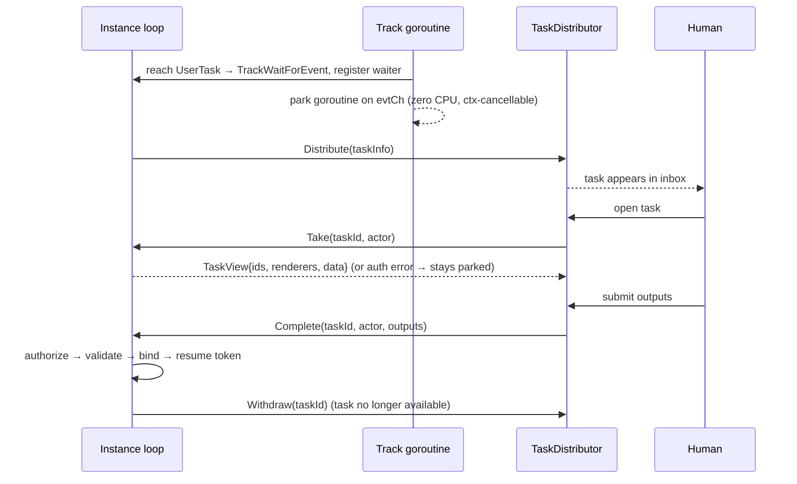

# ADR-020 — Human-Interaction Execution Model (UserTask & ManualTask)

| Field | Value |
|---|---|
| Status | Accepted |
| Version | v.2 |
| Date | 2026-07-30 |
| Owner | Ruslan Gabitov |
| Refines | [ADR-001 v.6 Execution Model](ADR-001-execution-model.md), [ADR-017 v.1 Channel-Based Event Processing](ADR-017-channel-based-event-processing.md) §2, [ADR-007 v.2.1 In-Memory Long Waits](ADR-007-in-memory-long-waits.md) §2.4, [SAD-001 v.1](SAD-001-vision-and-architecture.md) §6, §10, §11 |

> **v.2 — the ownership lifecycle.** This version adds the **runtime ownership** half of human
> interaction: who currently holds a parked UserTask, how that holder is acquired, released and
> replaced, and what it means for completion. BPMN supplies the state being tracked — **Table 10.14**
> (§10.3.4.1) defines `actualOwner` as a UserTask **instance attribute**, "the 'user' who
> picked/claimed the User task and became the actual owner of it" — which v.1 declared eligibility for
> but never implemented. So the ownership work is largely **conformance**: wire `actualOwner`, and
> decide what the standard leaves open (the operations, their guards, the effect on completion).
> Where to read it: **§2.5.1** (the attribute), **§2.5.2** (Claim / Unclaim / Reassign and their
> guards), **§2.5.3** (birth-ownership), **§2.4.1** (strict completion), **§2.4.2** (`completedBy`),
> **§2.1.1** (ownership and the parked token), and **§2.7** (eligibility resolved once — the one
> section whose v.1 contract this version **changes**).
>
> **v.1 — the execution model** (below, unchanged unless marked). Decides how a
> **UserTask** executes on gobpm's park/resume core: it is a **wait node** whose completion is an
> **external event** driven by a human through a pluggable **`TaskDistributor`** boundary (the
> interface [SAD-001 v.1 §6](SAD-001-vision-and-architecture.md) defers to "a dedicated
> human-interaction ADR" — this one). Fixes the class of defect where UserTask was modeled on a
> **blocking `Exec`** — a leftover of the removed Prologue-Exec-Epilogue mechanism — that loops on a
> *foreign* rendering channel and **ignores `ctx`**, so a waiting UserTask can't be cancelled and
> bypasses the loop's single-writer discipline. The fix makes UserTask park on the **same cooperative
> wait-node mechanism every event catch uses**
> ([ADR-017 v.1](ADR-017-channel-based-event-processing.md)) — no new pause/resume machinery. Also decides the **authorization model** (a Camunda-style
> `assignee` / `candidateUsers` / `candidateGroups` triad expressed on the BPMN `ResourceRole`
> object model) that gates **both** reading and completing a task, and lands **ManualTask** as a
> no-op pass-through. Scope is 0.1.0; full dynamic resource-query subsystems are deferred (§7).

---

## 1. Context & problem

BPMN gives a UserTask a deceptively short execution rule ([§13.3.3](../bpmn-spec/semantics/tasks.md),
spec p430): on activation it is **distributed** to the assigned people (per its
`HumanPerformer` / `PotentialOwner` / `Performer` / `Rendering` — [human-interaction.md](../bpmn-spec/elements/human-interaction.md));
when the work is done, it **completes**. The spec deliberately leaves the *distribution mechanism*
implementation-defined ("The spec does not mandate a specific task list / inbox structure") and puts
the identity model (who a "User" or "Group" is) **out of scope**. Everything interesting is a gap the
engine must decide.

Three concrete problems motivate this ADR:

1. **UserTask uses a foreign execution model.** gobpm executes wait nodes by *park and resume*
   ([ADR-017 v.1](ADR-017-channel-based-event-processing.md), [ADR-001 v.6](ADR-001-execution-model.md)):
   a node that must wait transitions to `TrackWaitForEvent` and its goroutine **parks on the loop-fed
   channel** (`evtCh`) — zero CPU, cooperatively cancellable via `ctx`, and woken only when the
   instance loop (the single writer) delivers the fired trigger. The goroutine is *held* while parked,
   but it never blocks on an external source and it always honors cancellation. UserTask, however, was
   built on a **blocking activation** — a leftover shape from the removed Prologue-Exec-Epilogue
   mechanism — that loops on a *foreign* rendering channel and **ignores `ctx`**. So a parked UserTask
   **cannot be cancelled** (instance abort or an interrupting boundary leaves its goroutine blocked
   forever — the real defect behind the "goroutine leak" audit finding), and it bypasses the loop's
   single-writer discipline. It is a structural mismatch, not a tuning issue — the fix is to make
   UserTask park on the **same cooperative rails as every other wait node**, not to invent a second
   pause/resume mechanism. (Note: *releasing* a parked goroutine entirely — the goroutine-free long
   wait of [SAD-001 v.1 §10](SAD-001-vision-and-architecture.md) — is the future **dehydration /
   rehydration** layer, deferred uniformly for events, long timers, and UserTasks alike; §7. Today all
   wait kinds hold an in-memory parked goroutine, and UserTask simply must do so the same way.)

2. **There is no runtime authorization.** The `ResourceRole` object model is *declared* (a UserTask
   can carry roles) but **never evaluated**: nothing resolves a role to a set of people, there is no
   notion of an **actor** (the acting human) in the engine, and nothing checks whether an actor may
   see or complete a task. A UserTask that anyone can complete — or worse, whose input data anyone can
   read — is not acceptable, and the standard's resource-assignment model exists precisely to prevent
   it.

3. **ManualTask has no execution.** BPMN lists ManualTask as **non-operational**
   ([§13.1](../bpmn-spec/semantics/tasks.md)) — "never actually executed by an IT system." The engine
   needs a defined behavior (a no-op) so a process containing one runs to completion.

This ADR decides the **whole human-interaction execution model** — the wait-node lifecycle, the
`TaskDistributor` boundary, the authorization model, and what a human's client is handed to render the
task — as one coherent concept. The code-level reconciliation (which types change, the goroutine-leak
and rendering-multiplicity defects, tests) is owned by the accompanying SRD.

### 1.4 Added in v.2 — the ownership gap

BPMN splits a UserTask's attributes across two tables. **Table 10.13** carries the *model* attributes —
the design-time shape (`implementation`, `renderings`) an XML definition serializes. **Table 10.14**
carries the *instance* attributes — runtime facts about a live task, which no XML definition contains
because they do not exist until a task is running:

> **Table 10.14 – User Task instance attributes** (§10.3.4.1)
> `actualOwner: string` — Returns the "user" who picked/claimed the User task and became the actual
> owner of it. The value is a literal representing the user's id, email address etc.
> `taskPriority: integer` — Returns the priority of the User Task.

v.1 implemented the design-time half thoroughly — a `ResourceRole`-based model naming who **may** read
and complete a task (§2.5) — and none of the runtime half. With no notion of a current owner,
authorization is the *only* gate on acting: every eligible candidate is, permanently and
simultaneously, equally entitled to complete the task. Three problems follow.

4. **Eligibility is not exclusivity, so candidates collide.** A task offered to a group of candidates
   can be worked by all of them at once. Nothing lets one candidate signal "I am doing this", and
   nothing stops a second from completing it while the first fills in the form — whoever submits first
   wins and the other's effort is silently discarded. The wasted work is also invisible: the loser's
   submission is refused as an unknown task, indistinguishable from one that was cancelled. Offering
   work to N people is a routine and correct way to model human work; the missing piece is the
   **claim** that converts an offer into an assignment — precisely the transition `actualOwner`
   describes ("picked/claimed … became the actual owner"). Its absence is a conformance gap, not a
   missing convenience.

5. **Nothing records who performed the work.** The design-time assignment is a *constant* — a declared
   identifier or an expression evaluated to decide eligibility. It answers "who was allowed to do
   this", never "who did it". So there is no audit answer to "who completed this task", and — more
   limiting — a process **cannot route on its own history**. The canonical pattern of sending work to
   the previous performer's manager for approval is unmodellable, because the previous performer's
   identity is never recorded anywhere the process can read. The standard anticipates the need:
   instance attributes are expression-readable, via the `getActivityInstanceAttribute` XPath binding
   (§10.4.3).

6. **Stuck human work has no remedy.** Because eligibility is fixed at design time and no
   administrative operation exists, a task whose intended performer becomes unavailable — on vacation,
   ill, or gone from the company — is completable by nobody, and the instance stalls indefinitely on a
   wait only an actor who will never act can satisfy. Three real situations demand a handover: a
   department manager designating a responsible person; an administrator rescuing a task from an
   unavailable performer; and the wholesale transfer of a departing employee's workload. The first is
   already expressible through an assignment expression reading process data (§2.7) — but note that it
   *produces* the very single-assignee tasks the second situation must later rescue. Assignment and
   reassignment are therefore not alternatives: a design supporting the first **must** support the
   second.

The standard supplies the attribute and the vocabulary and stops there — no operations for acquiring
or transferring ownership, and no ownership states in its activity lifecycle (§13.3.2). Those are the
engine's to decide, and v.2 decides them.

## 2. Decision

### 2.1 A UserTask is a **wait node**; its completion is an **external event**

On activation the engine treats the UserTask as a **wait node — the *same* wait-node mechanism every
event catch uses**, no new machinery. It:

1. builds an immutable **task descriptor** (task id, the task's `Renderer`s, its resolved input
   `data.Data`, its declared `ResourceRole`s, and its output specification),
2. announces the task to the **`TaskDistributor`** (§2.2) so a human client can surface it,
3. transitions the track to `TrackWaitForEvent` and **parks its goroutine on the loop-fed channel**
   (`evtCh`) — zero CPU, cooperatively cancellable via `ctx` — exactly as a Message/Timer/Signal catch
   parks ([ADR-017 v.1 §2](ADR-017-channel-based-event-processing.md),
   [ADR-006 v.4](ADR-006-events-and-subscriptions.md)). The goroutine is *held in memory* while parked
   under v.1 — see §2.1.1 and [ADR-007 v.2.1](ADR-007-in-memory-long-waits.md) §2.4 for what changed.

The task then sits parked until a human **completes** it. Completion is delivered as an **event into the
instance loop** — the single writer — which routes it to the parked track's `evtCh`, waking the track's
own goroutine to authorize/validate/bind and resume the token onto the outgoing flow(s). This is
"completion-as-an-event": a UserTask is a catch whose trigger is a human action instead of a message or
a timer, riding the identical delivery path. The old blocking, `ctx`-ignoring activation is removed;
because parking is now cooperative and loop-owned, cancelling a parked UserTask (e.g. an interrupting
boundary event, [ADR-018 v.1](ADR-018-boundary-events-and-activity-interruption.md)) is just the standard
parked-waiter teardown (`ctx` cancel / `evtCh` close) plus a `Withdraw` to the distributor (§2.2) —
closing the "goroutine leak" by cooperative cancellation, not by exiting the goroutine.

*(Releasing the parked goroutine entirely for very long waits — dehydration to `Repository` and
rehydration on the trigger, [SAD-001 v.1 §10](SAD-001-vision-and-architecture.md) — was deferred by v.1
and has **since landed** uniformly for events, long timers and UserTasks
([ADR-007 v.2.1](ADR-007-in-memory-long-waits.md) §2.4): a parked human task is dehydratable, and the
distributor's completion path is its wake-holder. §2.1.1 decides what that means for ownership.)*


```mermaid
sequenceDiagram
    participant IL as Instance loop
    participant Track as Track goroutine
    participant TD as TaskDistributor
    participant Human

    Track->>IL: reach UserTask → TrackWaitForEvent, register waiter
    Track-->>Track: park goroutine on evtCh (zero CPU, ctx-cancellable)
    IL->>TD: Distribute(taskInfo)
    TD-->>Human: task appears in inbox
    Human->>TD: open task
    TD->>IL: Take(taskId, actor)
    IL-->>TD: TaskView{ids, renderers, data}  (or auth error → stays parked)
    Human->>TD: submit outputs
    TD->>IL: Complete(taskId, actor, outputs)
    IL->>IL: authorize → validate → bind → resume token
    IL->>TD: Withdraw(taskId)  (task no longer available)
```

#### 2.1.1 Ownership and the parked token *(v.2)*

An ownership operation (§2.5.2) changes who holds the task and returns. It does **not** advance the
token, deliver an event, or wake the parked track. The task stays parked and keeps waiting for human
action; **only completion resumes it** (§2.4). Three consequences follow, and each is a decision:

**Ownership is not an activity state.** The BPMN activity lifecycle (§13.3.2, Figure 13.2) defines
`Inactive`, `Ready`, `Active`, `Withdrawn`, `Completing`, `Completed`, `Compensating`, `Compensated`,
`Failing`, `Terminating`, `Failed`, `Terminated`, `Closed` — and **no ownership state**. Claiming a task
therefore does not transition the activity: an owned task is `Active`, exactly as an unowned parked task
is. Ownership is an *attribute* of a running activity, which is precisely why the standard puts it in
the instance-attribute table and not in the state machine. The engine reports ownership as its own class
of observable fact (§6), alongside — never in place of — the node's progress signals.

**Ownership operations do not require a resident instance.** A parked human task releases its instance's
goroutines ([ADR-007 v.2.1](ADR-007-in-memory-long-waits.md) §2.4) precisely because human waits are
long. Ownership operations are the ones most likely to arrive during such a wait, and they are exactly
the ones that need nothing from the instance: after §2.7's freeze the eligible set is already
materialized, and ownership is a single identity compared against it — no process data, no scope access,
no running track. Ownership state and the materialized eligible set therefore live **at the engine
level, alongside task distribution**, not inside the instance's execution machinery, and a claim,
release or handover during a long wait leaves a dehydrated instance dehydrated. **Completion** — which
must bind outputs and resume a token — hydrates the instance as before. This also keeps ownership on the
engine's single-writer discipline: concurrent claims on one task are resolved by one authority rather
than by a race between candidates.

**Ownership never resists cancellation.** The process outranks the human. When an interrupting boundary
event fires ([ADR-018 v.1](ADR-018-boundary-events-and-activity-interruption.md)), the enclosing scope
terminates, or the instance is aborted, an owned task is torn down and `Withdraw`n exactly as an unowned
one is. Ownership grants an exclusive right to *complete* a task while it lives; it grants no claim on
the task's continued existence. Stating this explicitly is worthwhile because "claimed" invites the
opposite intuition — that holding a task confers a right to finish it. It does not: a claim is
exclusivity against *other actors*, never against the process.

### 2.2 The `TaskDistributor` — a pluggable boundary (embedder-provided)

Human routing is an **embedder concern**, injected like every other boundary
([SAD-001 v.1 §6](SAD-001-vision-and-architecture.md): `MessageBroker`, `Clock`, … and the deferred
`TaskDistributor`). The engine owns *when* a task becomes available and *who* may act on it; the
embedder owns *how* it reaches a human (inbox, web form, mobile push — all valid, the spec mandates
none). The boundary the engine calls **outward**:

```go
// TaskDistributor is the embedder-provided boundary that surfaces human tasks.
// The engine calls it to announce and retract tasks; it does not drive execution.
type TaskDistributor interface {
    // Distribute announces a newly parked UserTask as available for human work.
    Distribute(ctx context.Context, task TaskInfo) error
    // Withdraw retracts a task that is no longer completable — it was completed,
    // or its activity was cancelled (e.g. an interrupting boundary event fired).
    Withdraw(ctx context.Context, taskID string) error
}
```

The **inward** direction — the human acting — is two engine entry points the embedder's client calls.
The engine owns both because it is the custodian of the parked instance's data and the authority on the
task's resource assignment (§2.5):

```go
// Take claims/reads a parked UserTask. It authorizes actor against the task's
// resource assignment BEFORE returning any data; on failure it returns an error and
// exposes nothing — the task stays parked, waiting for an authorized actor.
Take(ctx context.Context, taskID string, actor Actor) (TaskView, error)

// Complete submits an actor's outputs. It authorizes actor, then validates the
// outputs against the task's output spec; only if both pass does it bind the outputs
// and resume the token. An authorization failure is NON-terminal — the task stays
// parked and waits for the right actor.
Complete(ctx context.Context, taskID string, actor Actor, outputs []data.Data) error
```

Only **one** production behavior is mandated by default: if no `TaskDistributor` is injected, a UserTask
still parks and is still completable through `Take`/`Complete` — distribution is an announcement, not a
precondition. (An embedder with no inbox can drive tasks directly by id.)

### 2.3 `Take` — the authorized **read**

`Take` is a human claiming and reading a task. Because the task's input data **is** instance data,
`Take` must authorize **before** exposing anything (§2.5) — otherwise an unauthorized actor could read
variables they have no right to see. On success it returns a **`TaskView`** (§2.8) carrying the runtime
identity, the renderers, and the self-describing data the client needs to build the UI. On authorization
failure it returns an error and exposes **no** data; the task remains parked. `Take` does not resume the
token — reading is not completing.

### 2.4 `Complete` — the authorized **write**, in three rejectable stages

`Complete` is the trigger event. It is **not** fire-on-anything (unlike a message catch); it has
acceptance criteria and is **re-triable**:

1. **Authorization** against the task's resource assignment (§2.5). **Fail → non-terminal rejection:**
   the token stays parked, the task stays open and keeps waiting for an authorized actor.
   `Complete` returns an "unauthorized" error; the process is unaffected.
2. **Ownership** *(v.2)* — the actor must be the task's `actualOwner` (§2.4.1). **Fail → non-terminal
   rejection:** the task stays parked, held by whoever holds it.
3. **Output validation** against the task's output specification (required outputs present, types
   conform). **Fail → rejection:** the actor corrects and resubmits; the task stays parked.

Only when **all three** pass does the engine **bind** the outputs into the task's scope and **resume**
the token. Completion is therefore **single-shot at the first *accepted* completion** — rejected attempts
(wrong actor, not the owner, invalid outputs) do not consume the wait. This is the precise sense in which
a UserTask "completes once."

**Where the checks live — `Authorizer` + `OutputValidator`, both on the `UserTask`.** Both checks belong
to the `UserTask` — it declares the triad and the output spec, so it is the element that validates
against them. They are **two separate** capability interfaces (interface segregation), so `Take` can
reuse authorization without depending on output validation, the two failure modes stay distinct
(security vs correctness, §5), and the security-critical ordering (authorize *before* touching outputs)
is explicit at the call site:

```go
// Authorizer resolves the task's triad (static or FormalExpression) against the
// runtime data and decides membership (§2.5). Implemented by UserTask; called at
// BOTH Take and Complete.
type Authorizer interface {
    Authorize(ctx context.Context, actor Actor, src data.Source, eng expression.Engine) error
}

// OutputValidator validates submitted outputs against the task's output spec.
// Implemented by UserTask; called at Complete only.
type OutputValidator interface {
    ValidateOutputs(outputs []data.Data) error
}
```

The **`Instance` is a thin orchestrator**: `Take` → `task.Authorize`; `Complete` → `task.Authorize`
then `task.ValidateOutputs`; on success it binds the outputs and resumes the token. It *provides* the
runtime context (a `data.Source` view over its scope + the expression engine) but holds **no** check
logic; the `TaskDistributor` holds none either. This keeps layering clean — the `UserTask` self-checks
using only **model-layer** abstractions (`data.Source`, `expression.Engine`, `Actor`), exactly as
correlation expressions already resolve over a `data.Source` (`msgflow.DeriveKey`), so
`pkg/model/activities` never imports `internal/`. A per-deployment **pluggable authorization *policy***
(beyond the triad + expression) is a deferred forward-pointer (§7), not a 0.1.0 seam.

#### 2.4.1 Completion is strict: only the actual owner may complete *(v.2)*

A UserTask is completable **only by its `actualOwner`** (§2.5.1). An unowned task is completable by
nobody: `Claim` is a **mandatory** step before `Complete`, not an optional courtesy.

This is the decision that gives ownership meaning. A claim that merely advertised intent, leaving
completion open to every eligible actor, would not prevent the collision of §1.4 — it would only document
it after the fact. Exclusivity has to be enforced at the point of the write, or it is not exclusivity.

Authorization at completion is therefore **two-part**: §2.5's model decides *eligibility*, and ownership
decides *which single eligible actor* may act now. The second is always a narrowing of the first, never a
widening — an owner who is not eligible cannot arise, since every path to ownership (§2.5.2, §2.5.3)
checks eligibility first.

**This changes v.1's contract**, knowingly: a completion that succeeded under v.1 — any eligible actor
against an unclaimed task — is refused until the task is claimed. The compatible alternative (enforce
ownership only for already-claimed tasks) is rejected in §4 (v.2 alternative 2).

#### 2.4.2 `completedBy` — the durable performer record *(v.2)*

Completion records the identity of the completing actor as a **durable fact in the instance's data**,
readable by expressions for the remainder of the instance's life.

`actualOwner` cannot serve this purpose. It is *current* ownership and it dies with the task: a completed
task is retired and `Withdraw`n from distribution (§2.2), so an attribute living on it is gone exactly
when downstream nodes need it. The approval pattern of §1.4 reads the performer's identity from a node
that has **already finished** — so the record must outlive the task.

**It lives in the reserved read-only `RUNTIME` subtree, not in the process's data.** The record is
*engine-published*: a process must be able to **read** who performed a task, and must **not** be able to
overwrite it or collide with it by naming a variable the same way. Committing it into the data plane
would give a modeler both powers by construction. `RUNTIME` already serves recorded facts of this
kind — the instance's start time is a retained constant, not live state — so the register is not a new
category of thing, only a new entry.

It is exposed as **one map-valued variable**, node name → completer, rather than one variable per task.
That keeps the runtime name set **closed**: an open per-task namespace would force prefix matching in the
supplier and make the exposed name list grow with every completion.

**The register is carried across a hydrate.** This is the part that must not be skipped: a human task is
the wait most likely to dehydrate, so a register held only in memory would vanish precisely in the case
it exists for — a later node asking who performed an earlier task, after a weekend's wait. It therefore
rides the instance checkpoint alongside the conversation keys.

Making it **expression-readable** is what makes it useful rather than merely auditable: the process must
be able to route on it, which is the whole point of the pattern. The standard treats instance attributes
as expression-accessible values, exposing them through the `getActivityInstanceAttribute` XPath binding
(§10.4.3); the `RUNTIME` source is the equivalent surface here.

Keyed by **node name**, because that is the handle a modeler writing an expression has; an unnamed node
falls back to its id. A looped or multi-instance UserTask completes more than once and each pass
overwrites its entry, so the record names the **last** completer — the per-iteration trail belongs to the
observer stream (§6), not to a single data value.

The record is written **once per completion** and never mutated by anything else — unlike `actualOwner`,
which changes with every claim and reassignment. The distinction matters: a reassigned task's record is
whoever actually finished it, not whoever was first assigned, so the trail reflects performance rather
than intent. It is engine-written, never actor-supplied — a self-reported performer identity is precisely
the field that must not come from the caller (§4, v.2 alternative 7).

### 2.5 Authorization model — a Camunda triad on the BPMN `ResourceRole` base

BPMN's resource-assignment model ([human-interaction.md](../bpmn-spec/elements/human-interaction.md))
gives a `ResourceRole` two mutually-exclusive ways to name its people: a static `resourceRef` **or** a
`resourceAssignmentExpression` whose expression "MUST return Resource entity related data types, like
Users or Groups" and "MAY refer to Task instance data." That is the whole authorization primitive the
standard offers, and it is deliberately silent on identity.

We express it through the vocabulary embedders already know from Camunda — **`assignee`**,
**`candidateUsers`**, **`candidateGroups`**. The standard `ResourceRole` cannot itself carry the triad —
it holds one `Resource` ref **or** an expression, with no user-vs-group distinction, no static
id-**list**, and no slot marker — so, exactly as Camunda keeps the triad in extension attributes rather
than BPMN `ResourceRole`, the triad is a **typed structure on the UserTask** (each member either static
identifiers or a `FormalExpression`, §2.7), the **single source of truth**, exposed via a typed accessor
and read by the UserTask's `Authorizer` (§2.4). It **coexists** with the generic `Roles()` (any BPMN
`ResourceRole`s declared via `WithRoles`); the two are not conflated and neither is projected into the
other.

**The unifying rule: resolve each triad member to a set of identifiers, then check membership.**

| Triad member | BPMN role | Resolves to | Matched against |
|---|---|---|---|
| `assignee` | `HumanPerformer` (designated performer) | a user-id set (usually one) | `actor.UserID` |
| `candidateUsers` | `PotentialOwner` (users) | a user-id set | `actor.UserID` |
| `candidateGroups` | `PotentialOwner` (groups) | a group-id set | `actor.Groups` |

Authorization verdict for an `actor`:

- **`assignee` set and non-empty** → authorized iff `actor.UserID ∈ assignee-set` (the restrictive
  gate: a designated performer excludes the candidate slots entirely — the Camunda semantic). Note
  *(v.2)*: this is **eligibility**, design-time. The runtime holder is `actualOwner` (§2.5.1); the two
  are distinct values, and where a single `assignee` resolves it also *initializes* the holder (§2.5.3).
- **else** → authorized iff `actor.UserID ∈ candidateUsers` **or** `actor.Groups ∩ candidateGroups ≠ ∅`.
- **no triad member declared** → **open**: any actor is authorized. This is BPMN's "unspecified
  performer" and the engine's default-permissive stance ([SAD-001 v.1 §12](SAD-001-vision-and-architecture.md):
  "Default impl allows all") — the engine does not gratuitously restrict.

The same verdict gates **both** `Take` and `Complete` (§2.3, §2.4). It establishes *eligibility* — the
engine's invariant here is only "eligible actor ⇔ member of the resolved set."

> **Changed in v.2.** v.1 added that "a claim (a candidate's first successful `Take`) may set the runtime
> `assignee` … but **claim bookkeeping is a distributor concern**." Both halves are now decided
> otherwise. `Take` is a read and sets no holder (§2.3); acquiring a holder is an explicit `Claim`
> (§2.5.2). And ownership is an **engine** concern, not a distributor one: the engine enforces it at
> completion (§2.4.1), so it must own the state that enforcement reads. A distributor-held claim could
> not bind the engine, and would leave the exclusivity guarantee at an embedder's discretion.

> **Relationship to `AuthorizationProvider`.** [SAD-001 v.1](SAD-001-vision-and-architecture.md) defines
> a coarse, cross-cutting `AuthorizationProvider.Authorize(operation, …)` gate for sensitive operations
> ("start process", "claim user task", "cancel instance"; default allow-all). That is **orthogonal** to
> this triad: the provider answers "may this principal claim *any* task at all?"; the triad answers "is
> this actor a candidate/assignee of *this specific* task?" They compose — a deployment may wire
> both. This ADR decides only the task-level, standard-grounded triad.

#### 2.5.1 `actualOwner` — runtime ownership, distinct from eligibility *(v.2)*

A parked UserTask carries an **actual owner**: at most one actor identity, or none. It is the engine's
realization of the BPMN instance attribute (Table 10.14, §10.3.4.1) and it uses the standard's name —
`actualOwner` — not a coined synonym. Its value is a **user-id literal**, as the standard specifies ("the
user's id, email address etc."), which makes it comparable against `Actor.UserID()` (§2.6) without an
identity subsystem.

It is **runtime state, not configuration.** The triad (§2.5) is immutable process definition, shared by
every instance of the process and every task derived from it. The actual owner belongs to **one task of
one instance** and changes during that task's life. Conflating the two — letting a claim write back into
the triad — would leak one instance's ownership into every other instance of the same process, and would
destroy the definition it overwrote: after one claim the process would no longer record who was
*eligible*, leaving `Unclaim` nothing to return the task to and `Reassign` no set to validate against
(§4, v.2 alternative 1). The two layers coexist: the triad decides **eligibility**, `actualOwner` records
**assignment**.

#### 2.5.2 `Claim` / `Unclaim` / `Reassign` — three operations, three guards *(v.2)*

Ownership changes through exactly three operations. BPMN defines none of them, so each guard is an
explicit engine choice; they differ because the operations answer to different authorities.

| Operation | Guard | Effect |
|---|---|---|
| **Claim** | actor **eligible** (§2.5) **and** the task **not held by someone else** | actor becomes `actualOwner`; a no-op if it already is |
| **Unclaim** | actor **is** the current owner | task returns to unowned; any eligible actor may claim it |
| **Reassign** | **none at the task level** — but the nominee must be **eligible** | nominee becomes `actualOwner`, replacing any existing one |

**Claim is checked; Reassign is not.** The asymmetry follows established practice: Camunda draws exactly
this line between `claim`, which "performs a check to see if the task is already assigned to a user", and
`setAssignee`, which overrides unconditionally. A participant claiming work must not seize a colleague's
task by accident, so `Claim` fails on a task **another** actor holds. An administrator rescuing a stalled
task must override precisely *because* it is owned — a guard would defeat the operation's only purpose.

**Claim is idempotent for the actor that already holds the task.** The guard exists to stop one
participant taking *another's* work; a same-owner claim takes nothing from anybody. Refusing it would make
the operation unsafe to retry, and — more importantly — would break the natural embedder flow of claiming
before every completion: a **directly-assigned** task is born owned (§2.5.3), so an unconditional claim
would be refused and the task left uncompletable by the very actor the process assigned it to. Camunda
draws the line the same way, failing only when the existing assignee is a different user.

**Reassign is unguarded at the task level because the task cannot express its authority.** Its callers are
the situations in §1.4 — a manager, an administrator, an offboarding process — and none is a *participant*
in the task. They will routinely fail its triad check, so gating `Reassign` on the triad would forbid every
legitimate use. Authorizing the caller is therefore the **embedder's** responsibility: it owns identity,
roles and organizational structure, and already mediates every human interaction with the engine. This
mirrors Camunda, which gates `setAssignee` through its own authorization framework rather than the task's
candidate list, and it composes with [SAD-001 v.1](SAD-001-vision-and-architecture.md)'s coarse
`AuthorizationProvider` gate (the blockquote above) for deployments wanting an engine-side check.

**The nominee is still checked.** `Reassign` bypasses authority over the *caller*, never over the
*outcome*: it cannot hand a task to someone the process says may not perform it. An administrator may
choose *among* eligible actors; they may not enlarge the eligible set. The process definition stays
authoritative over who may act — the guarantee §2.5 exists to provide — while handover becomes possible.

**A consequence worth naming: a nominee eligible only through a candidate *group* cannot be nominated.**
Group membership is authenticated by the embedder for a **present** actor (§2.6) and cannot be asserted on
an absent person's behalf, so a task whose only eligibility is `candidateGroups` has no reassignable
nominee — even though any present member of that group may freely claim it. This is a real capability
gap, not an oversight: "reassign this to anyone in the reviewers group" is unavailable, and closing it
needs the directory/resource-query subsystem §7 defers. An embedder that must reassign such a task can
declare the individual as a candidate user, or resolve the group itself and reassign to a named member.

#### 2.5.3 A single resolved assignee owns the task from distribution *(v.2)*

When the triad designates **exactly one** actor, that actor becomes `actualOwner` **at distribution**,
without an explicit claim. The task is born owned.

The standard's wording anticipates this: `actualOwner` is the user who "picked/**claimed**" the task, and a
task assigned to precisely one person has in substance already been assigned — no offer to accept, no
competing candidate to exclude. A ceremonial self-claim would add a step that can only ever succeed, and
would break every process modelling direct assignment. Camunda behaves the same way: a task modelled with
an assignee is created with the slot filled, and claiming it fails as already-assigned.

**A born-owned task remains fully releasable and reassignable.** This is essential rather than incidental:
as §1.4 notes, designating a responsible person through an assignment expression *produces* exactly these
single-owner tasks, and they are the ones an administrator must later rescue. Ownership acquired at
distribution is ordinary ownership — `Unclaim` returns the task to the eligible pool, `Reassign` moves it —
and carries no special immunity.

Where the triad designates **several** actors, or resolves to none (the open case, §2.5), the task is born
**unowned** and awaits a claim.

### 2.6 The `Actor` — runtime identity

The engine's runtime notion of an acting human is minimal and carries exactly what the triad matches.
It is named **`Actor`** to avoid collision with the BPMN `Performer` *element* (a `ResourceRole`
subtype, a role declaration) — the `Actor` is the authenticated identity *acting on* a task, not a role:

```go
// Actor is the authenticated human acting on a task. The TaskDistributor
// authenticates the human and supplies this; the engine authorizes it (§2.5).
type Actor interface {
    UserID() string    // matched against assignee / candidateUsers
    Groups() []string  // matched against candidateGroups
}
```

Identity and group membership are **authenticated by the `TaskDistributor`** (the embedder's IAM
concern, out of BPMN scope) and **trusted** by the engine — the engine authorizes (set membership), it
does not authenticate. This keeps the engine free of any user directory while still enforcing the
model's resource assignment.

### 2.7 Static identifiers **or** a `FormalExpression` — resolved **once**, at distribution

Mirroring the `resourceRef`-vs-`resourceAssignmentExpression` duality, each triad member is declared by
**either** static identifiers **or** a `FormalExpression` that evaluates to a list (possibly a single
element) of identifiers/names. The paired option constructors keep the static path free of expression
ceremony and match the project's explicit-option idiom:

| Static | Dynamic (expression → `[]string`) |
|---|---|
| `WithAssignee(userID string)` | `WithAssigneeExpr(expr data.Expression)` |
| `WithCandidateUsers(ids ...string)` | `WithCandidateUsersExpr(expr data.Expression)` |
| `WithCandidateGroups(ids ...string)` | `WithCandidateGroupsExpr(expr data.Expression)` |

Static and dynamic forms for the same member are **mutually exclusive** (the existing `ResourceRole`
"resource XOR assignment-expression" invariant). An expression-backed member is resolved against the
**instance's data scope** via the expression engine — so a candidate set may depend on process data and is
**dynamic per instance**, which is exactly what `resourceAssignmentExpression` is for. Resolution failure of
an expression is treated as an empty result set (BPMN: "Failed Resource queries are treated like Resource
queries that return an empty result set" — spec text; see §3's pin note), i.e. it authorizes no one rather
than everyone.

**Resolution happens once, when the task is distributed** *(changed in v.2)*, and the resulting eligible
set is fixed for that task's life. Every later check — `Take`, `Complete`, and each ownership operation
(§2.5.2) — tests the actor against that materialized set rather than re-evaluating the expression.

> **Changed in v.2.** v.1 prescribed the opposite timing: the `Authorizer` resolved an expression-backed
> member "**at authorization time**". That was sound while authorization was a momentary yes/no —
> re-deriving it was harmless, and nothing depended on a stable answer. **Ownership changes that.** An
> owner acquires a *durable* right to complete a task (§2.4.1), so eligibility becomes a premise the
> engine must keep true for as long as the task lives — and a premise re-derived from mutable data is not
> a premise. Because expressions may read process data, a re-evaluated set is a **moving target**: an
> unrelated data change could revoke an owner's ability to complete work they legitimately hold, or
> withdraw an invitation a candidate was already told to act on. Only the *moment* of resolution moves;
> the declaration model above is untouched — still static-or-expression, still mutually exclusive, still
> resolved against the instance's data scope, still empty-set-on-failure. "Dynamic per instance" narrows
> accordingly: a candidate set still varies per instance according to that instance's data, but no longer
> varies across a single task's lifetime.

Freezing also makes ownership operations **independent of process data**, which §2.1.1 turns into the
ability to serve them without a resident instance — but the freeze is justified on the semantics alone,
not on that convenience (§4, v.2 alternative 6). Camunda agrees in practice: it materializes identity
links onto the task at creation rather than re-deriving them per request.

### 2.8 `TaskView` — what `Take` returns

The client rendering a task needs more than the raw output variables — it needs to know *which form* to
render, *what* runtime context it is in, and the *self-describing* data to lay out. `Take` returns a
**typed descriptor with an open data bag**:

```go
// TaskView is the authorized snapshot a client renders. Runtime identity is typed
// (always present); the payload is a self-describing data.Data bag.
type TaskView struct {
    TaskID     string          // this task instance
    InstanceID string          // owning process instance
    NodeID     string          // the UserTask node (activity) id
    ProcessID  string          // the process definition id
    Renderers  []hi.Renderer   // form/field descriptions, carried to the client (not invoked inline by the engine)
    Data       []data.Data     // inputs + task Properties (e.g. FORM_ID), each self-describing
}
```

- **Runtime identity is typed.** `InstanceID` / `NodeID` / `ProcessID` / `TaskID` are always present and
  known to the engine; a typed field is discoverable and cannot collide with a business variable, unlike
  a stringly-named reserved key.
- **The payload is a `data.Data` bag.** Every item self-describes via `Name()`, `Value()`, `State()`,
  and `ItemDefinition()` (its type) — the client can build UI without reading engine code. This includes
  the task's business inputs **and** its `Property`s (a `Property` *is* a `data.Data`).
- **`FORM_ID` is a userland property convention, not an engine field.** A modeler attaches a `FORM_ID`
  Property (any name they like — `LAYOUT`, `FORM_VERSION`, …); the engine stays ignorant of it and just
  returns it in `Data`; the client reads it and picks the form. The engine grows no form registry —
  composition over restriction.
- **`Complete` is symmetric** — it accepts `[]data.Data` outputs (self-describing), validated against
  the task's output spec.

### 2.9 Rendering — carried in the descriptor, multiplicity by **identity**

A UserTask's `Renderer`s are **carried in the task descriptor** (the `TaskView`, §2.8), not invoked
inline by the engine during activation — inline invocation was part of the old blocking path. Whether
and how a client evaluates a `Renderer` (its `Render` method) to produce form data is the embedder's
choice; the engine only conveys the renderers to the client, untouched. BPMN models `Rendering` as an
**optional, repeatable** element on a UserTask
([human-interaction.md](../bpmn-spec/elements/human-interaction.md) documents the `Rendering` element
itself; its `0..*` association to a UserTask is declared in the full spec's UserTask section), so a task
MAY carry several renderers — e.g. a web form and a mobile form. Distinct renderers are distinguished
**by identity** (`ID()`), never by their implementation-type marker: two renderers of the same
implementation kind are legitimately different renderings and must both survive. (This corrects a defect
where a second renderer of the same implementation type was
silently dropped — reconciled in the accompanying SRD.)

### 2.10 ManualTask — no-op pass-through

A ManualTask is **non-operational** ([§13.1](../bpmn-spec/semantics/tasks.md): "never actually executed
by an IT system"; Process Execution Conformance permits an engine to "MAY ignore Manual Tasks / treat as
no-op pass-through"). The engine treats it as a **pass-through**: the token flows straight to the
outgoing sequence flow(s) with no descriptor, no distribution, and no wait. This matches
[SAD-001 v.1 §15](SAD-001-vision-and-architecture.md) ("the engine treats it as a pass-through … near-zero
execution value") and closes the last non-operational-task gap for 0.1.0.

## 3. Standard grounding

| Claim | Source | What it says |
|---|---|---|
| UserTask distributes then completes; mechanism implementation-defined | [§13.3.3](../bpmn-spec/semantics/tasks.md) (spec p430) | "distributed to the assigned person or group … When the work has been done, the User Task completes"; "distribution mechanism is implementation-defined." |
| Resource-assignment object model | [human-interaction.md](../bpmn-spec/elements/human-interaction.md) | `PotentialOwner → HumanPerformer → Performer → ResourceRole`; the role carries `resourceRef` (0..1), `resourceAssignmentExpression` (0..1), `name` and parameter bindings — and **no ownership slot**. `Rendering` is an optional, repeatable element. (Their mutual exclusivity is spec prose, not an extract cardinality.) |
| Assignment expression returns Users/Groups, may read task data | BPMN 2.0 spec text (§ResourceAssignmentExpression) | "MUST return Resource entity related data types, like Users or Groups"; parameter bindings "MAY refer to Task instance data." — the premise §2.7's freeze rests on. |
| Failed resource query ⇒ empty set | BPMN 2.0 spec text | "Failed Resource queries are treated like Resource queries that return an empty result set." |
| ManualTask is non-operational | [§13.1](../bpmn-spec/semantics/tasks.md) | Listed non-operational; conforming engine MAY treat as no-op pass-through. |
| **`actualOwner` is a UserTask *instance* attribute, and the act is *claiming*** *(v.2)* | BPMN 2.0 §10.3.4.1, **Table 10.14** | "Returns the 'user' who picked/claimed the User task and became the actual owner of it. The value is a literal representing the user's id, email address etc." |
| A UserTask has instance attributes inherited from Activity *(v.2)* | BPMN 2.0 §10.3.4.1 | "The User Task inherits the instance attributes of Activity (see Table 8.49). Table 10.14 presents the instance attributes of the User Task element." |
| `taskPriority` is the sibling instance attribute *(v.2)* | BPMN 2.0 §10.3.4.1, **Table 10.14** | "Returns the priority of the User Task." — unimplemented; deferred (§7). |
| `implementation` defaults to `##unspecified` *(v.2)* | BPMN 2.0 §10.3.4.1, **Table 10.13** | "`implementation: string = ##unspecified`… Valid values are `##unspecified`…, `##WebService`… or a URI identifying any other technology or coordination protocol." |
| The spec directs attribute extensions to **WS-HumanTask** *(v.2)* | BPMN 2.0 §10.3.4.1 | "A User Task for instance can be implemented using WS-HumanTask by setting the implementation attribute to `http://docs.oasis-open.org/ns/bpel4people/ws-humantask/protocol/200803`." … "If implementations extend these attributes …, they **SHOULD** use attributes defined by the OASIS WS-HumanTask specification." |
| Instance attributes are expression-readable *(v.2)* | BPMN 2.0 §10.4.3 ([data.md](../bpmn-spec/semantics/data.md)) | XPath extension functions for instance attributes, incl. `getActivityInstanceAttribute` — the warrant for §2.4.2. |
| The activity lifecycle has **no** ownership state *(v.2)* | BPMN 2.0 §13.3.2, Figure 13.2 (spec p428–429) ([activity-lifecycle.md](../bpmn-spec/state-machines/activity-lifecycle.md)) | `Inactive`/`Ready`/`Active`/`Withdrawn`/`Completing`/`Completed`/`Compensating`/`Compensated`/`Failing`/`Terminating`/`Failed`/`Terminated`/`Closed` — the basis for §2.1.1. |

**Pin provenance — what is quoted from where.** Rows pinned to a `../bpmn-spec/…` path are quoted from the
**vendored extract**, which carries those section refs itself. Rows pinned to "BPMN 2.0 spec text" are
quoted from the **specification document**, because the extract does not contain them: it is generated
from a metamodel of XML-serializable *model* properties, so it holds no instance attributes and none of
the standard's normative prose. *(v.1 attributed the three `ResourceRole` prose quotes above to
`human-interaction.md`; that file contains none of them, and the attribution is corrected here.)* The
extract's silence on instance attributes is also why `actualOwner` went unnoticed through v.1 — a
reviewer checking it for an ownership slot would correctly find none and wrongly conclude the standard
has none; closing that gap is a v.2 rollout item (§7).

Where gobpm **chooses** beyond the standard's silence, it is called out as an engine decision, not
attributed to the spec: the `assignee`/`candidateUsers`/`candidateGroups` **vocabulary** (a Camunda
convention, mapped onto `ResourceRole`), the **`Actor` identity shape**, the **park/resume**
execution (the standard is silent on threading), and gating **`Take`** by authorization (the standard
speaks of completion, not of reading).

**Engine choices added in v.2.** BPMN supplies `actualOwner` and its vocabulary and stops — it defines no
operations for acquiring or transferring ownership, and no ownership states. Each of the following is
therefore an engine decision: the existence and naming of **`Claim` / `Unclaim` / `Reassign`** (§2.5.2);
**strict completion**, i.e. that ownership gates the write at all (§2.4.1); **`Claim` checked, `Reassign`
unguarded**, with the embedder as the authority over reassignment (§2.5.2); **birth-ownership** for a
single resolved assignee (§2.5.3); **freezing eligibility** at distribution (§2.7); **`completedBy`** as a
durable instance-data record (§2.4.2) — the standard's `actualOwner` is current ownership only and defines
no completion record; and ownership operations **not requiring residency** (§2.1.1).

**Corroborating prior art**, cited as practice rather than authority. **WS-HumanTask** — the specification
BPMN's `implementation` attribute names, and the source the spec says extensions SHOULD borrow from
(above) — defines "an *actual owner* of a task is the person actually performing the task" and "*potential
owners* … are persons who receive the task so that they can claim and complete it" (§3.1), a ten-state task
model (§3.8.4), and transitions including release, delegate and forward (§4.10, §7.1). BPMN's Table 10.14
adopts its `actualOwner` notion; §7 declines the state machine. **Camunda 7** distinguishes a checked
`claim` from an unconditional `setAssignee` ("the difference … is that here a check is done if the task
already has a user assigned to it"), with `unclaim` returning the task to the pool — the §2.5.2
asymmetry — and materializes identity links at task creation, the §2.7 freeze.

## 4. Alternatives considered

1. **Keep the blocking activation, just add `ctx` cancellation to the foreign rendering-channel loop.**
   Rejected: it would stop the leak but keep UserTask a **special case with its own pause/resume path**,
   duplicating the wait-node mechanism the event core already provides. The cause isn't "holds a
   goroutine" (every wait kind does today, in memory) — it's *a second, foreign parking mechanism*.
   Reusing `TrackWaitForEvent`/`evtCh` unifies UserTask with events, and is exactly the single mechanism
   the eventual dehydration/rehydration layer will lift uniformly for all wait kinds.

2. **Authorize on the `TaskDistributor` side; the engine trusts a "done" verdict.** Rejected: it
   contradicts the requirement that the *engine* enforce resource assignment, and a buggy or malicious
   embedder could bypass the model. The engine holds the roles; the engine must render the verdict.

3. **Authorize only on `Complete`, treat `Take` as pure distributor bookkeeping.** Rejected: `Take`
   reads instance data, so skipping its authorization leaks variables to unauthorized actors. Both gates
   authorize.

4. **Build a full User/Group directory + resource-query subsystem now.** Rejected as speculative
   universality: there is no identity subsystem to hang it on, and the `FormalExpression` form already
   covers dynamic, data-dependent candidate sets. The actor self-reports authenticated identity +
   groups; richer directory integration is an embedder concern and a forward pointer (§7).

5. **Triad stored as generic `ResourceRole`s (in / projected into `Roles()`).** Rejected: `ResourceRole`
   can't express the slot, the user/group kind, or a static id-**list**, so it is lossy and forces
   re-parsing in `Authorize`. The triad is its own typed structure (§2.5), the single source of truth,
   **coexisting** with the generic `Roles()` — as Camunda keeps it in extension attributes, not BPMN
   `ResourceRole`.

6. **`Take` returns `[]variable` (bare values).** Rejected: it discards data **state** and **type** and
   cannot carry Properties (`FORM_ID`) or runtime context. `TaskView` + `[]data.Data` gives the client a
   self-describing, renderable snapshot (§2.8).

7. **Flat `[]data.Data` for the whole `Take` result, runtime ids as reserved keys.** Rejected in favor
   of a typed `TaskView`: always-present runtime identity deserves a typed, collision-free contract; only
   the genuinely open payload is a bag.

8. **A single `CompleteChecker` bundling authorization + output validation.** Rejected in favor of two
   segregated interfaces (`Authorizer`, `OutputValidator`, §2.4): `Take` needs authorization but has no
   outputs to validate, so a bundled `CheckComplete(actor, outputs)` can't serve it; the two failure
   modes are distinct (security-relevant unauthorized vs fix-and-resubmit invalid-output); and the
   security-critical authorize-before-outputs ordering is better made explicit at the orchestrating call
   site than hidden inside one method. Both interfaces still live on the `UserTask` (the shared goal with
   the bundled option — keep check logic off the Instance and TaskDistributor).

**Added in v.2 — ownership alternatives.** Numbered separately; referenced elsewhere as "v.2 alternative N".

1. **Ownership as a mutable design-time assignment** (a claim overwrites `assignee`). Rejected: the triad
   is process *definition*, shared by every instance and task derived from it, so a claim in one instance
   would silently reassign the same task in all others. It also destroys the definition — after one claim
   the process no longer records who was *eligible*, so `Unclaim` has nothing to return the task to and
   `Reassign` cannot validate its nominee. Eligibility and assignment must be distinct values, which is
   what Table 10.14 implies by placing `actualOwner` among *instance* attributes (§2.5.1).

2. **Advisory ownership, or strict-only-when-owned.** Two variants of one weakness. *Advisory* ownership
   treats the owner as distribution metadata and leaves completion open to every eligible actor —
   documenting the collision of §1.4 without preventing it. *Strict-only-when-owned* enforces exclusivity
   for claimed tasks while leaving unclaimed ones completable by all; it is backward compatible, which is
   its entire appeal, but it makes the guarantee **opt-in per task instance at runtime**: whether
   concurrent work is prevented depends on whether somebody happened to claim first, so the very race the
   feature exists to eliminate decides whether protection applies. A safety property that holds only when
   it was not needed is not a safety property. The one-time breaking change (§2.4.1) buys an invariant
   that always holds.

3. **Adopt the WS-HumanTask state machine** (§3.8.4's ten states, suspend/resume, delegate vs forward).
   Rejected: BPMN itself adopted only the *actual owner* notion from that specification, and gobpm has no
   driver for the remainder — nothing suspends a human task, and the delegate/forward distinction
   (return-to-sender vs hand-off) presupposes a task hierarchy the engine does not model. Ten states to
   exercise three is speculative machinery, and every unexercised state drifts from real behaviour. What
   §2.5 does define maps onto the standard's own attribute, so a later expansion stays open.

4. **Ownership as activity-lifecycle states.** Rejected: it contradicts §13.3.2, whose state set contains
   no ownership state and whose transitions are the observable points where an engine persists state and
   emits events — a claim is neither an execution step nor a data transition. Engine-specific states
   grafted onto a normative state machine also break consumers expecting the standard's set (§2.1.1).

5. **Holder-only (delegation) reassignment.** Restricting handover to the current owner is the strongest
   conflict guarantee: nobody loses a task without letting it go. Rejected because it fails the motivating
   cases outright — §1.4's stalled task exists *because* the owner cannot act, and a departed employee
   cannot delegate anything. Delegation remains expressible *on top of* the unguarded operation (an
   embedder restricts its own callers), whereas recovering an administrative override from an owner-only
   primitive is impossible.

6. **Re-resolving eligibility on every ownership operation.** Keeping eligibility continuously current
   sounds strictly more correct. Rejected: because expressions may read process data, it makes eligibility
   a moving target — an actor's right to complete work they already hold could be revoked by an unrelated
   data change — and it binds every ownership operation to live process data, forcing a long-parked
   instance to be rebuilt merely to record a claim (§2.7, §2.1.1).

7. **Recording the performer as a task output.** Reuses the existing data path with no new mechanism.
   Rejected: outputs are validated against the declared output specification, so an engine-supplied
   identity is either refused as undeclared or must be declared by every modeller who wants it — making an
   engine-level audit fact opt-in, and absent from exactly the processes that never thought to ask. Worse,
   outputs are submitted *by the actor*, so a self-reported performer identity is precisely the field that
   must not be caller-supplied (§2.4.2).

## 5. Consequences

- **UserTask parks on the one shared wait-node mechanism.** It reuses `TrackWaitForEvent`/`evtCh` —
  no second pause/resume path — so the `ctx`-ignoring blocking loop (and its uncancellable "leak") is
  gone: a parked UserTask is now cooperatively cancellable like every catch. The goroutine was still
  *held in memory* under v.1 (as all wait kinds were); releasing it for very long waits was the deferred
  uniform dehydration layer, which has **since landed**
  ([ADR-007 v.2.1](ADR-007-in-memory-long-waits.md) §2.4).
- **A parked UserTask is cancellable.** An interrupting boundary event
  ([ADR-018 v.1](ADR-018-boundary-events-and-activity-interruption.md)) tears down the parked waiter and
  `Withdraw`s the task from the distributor — no orphaned goroutine, no orphaned inbox entry.
- **Authorization is enforced, standard-grounded, and default-permissive.** No-triad tasks stay open
  (frictionless for simple processes); declared tasks are enforced at both read and write.
- **Check logic is cohesive, on the model element.** `Authorizer` + `OutputValidator` live on the
  `UserTask`; the `Instance` only orchestrates (authorize → validate → bind → resume) and the
  `TaskDistributor` holds none. Adding a task type or a check evolves one place, not three.
- **Embedders get a familiar surface.** The Camunda triad + `FORM_ID` property convention means the API
  reads the way BPM practitioners expect, while the engine stays a thin, standard-conformant core.
- **New injected boundary.** `TaskDistributor` joins the engine's option set (`MessageBroker`, `Clock`,
  …). It is optional; absent it, tasks are still completable by id.
- **`Renderer` is no longer engine-invoked.** The engine carries renderers to the client instead of
  calling them inline — simpler, and it removes the inline-invocation blocking path.

**Added in v.2 — ownership.**

- **A conformance gap closes.** `actualOwner` (Table 10.14) becomes real, under the standard's own name
  and value shape.
- **Concurrent work on one task becomes structurally impossible** (§2.4.1), so offering a task to many
  candidates is safe — the collision of §1.4 cannot occur rather than being merely discouraged.
- **Processes can route on their own history** (§2.4.2): the approver-is-the-performer's-manager pattern
  becomes modellable.
- **Stalled human work has a remedy** that does not require the unavailable person (§2.5.2).
- **Ownership operations are cheap during long waits** — no hydration, no process data (§2.1.1).
- **A breaking change to completion** (§2.4.1): embedders must claim before completing. Existing
  single-assignee processes keep working via §2.5.3; multi-candidate processes that completed without
  claiming must add the step. Accepted deliberately; the compatible variant is §4 v.2 alternative 2.
- **Unguarded reassignment shifts a security boundary to the embedder** (§2.5.2). An embedder exposing it
  carelessly lets anyone move anyone's work. The engine narrows the blast radius by still enforcing
  eligibility on the nominee, so the worst case is misassignment among people the process already
  trusts — never privilege escalation.
- **Frozen eligibility can go stale** (§2.7). A long-parked task keeps the set computed at distribution
  even if the data behind it changed. This is the intended trade (§4 v.2 alternative 6); `Reassign` is the
  escape hatch when a frozen set has become wrong.
- **Ownership does not survive engine restart.** Scoped to dehydration survival (§2.1.1). A restart
  rebuilds instances from durable state, and ownership is not part of it, so tasks return unowned and must
  be re-claimed — with strict completion that surfaces as a visible refusal, not a silent loss. Closing it
  belongs with [ADR-033 v.2](ADR-033-persistence-and-state.md): a durable ownership record has no meaning
  until the tasks it refers to are themselves durable.

## 6. Enterprise-readiness recommendations

- **Observability.** Emit task lifecycle signals — `task.distributed`, `task.taken` (with actor),
  `task.completion.rejected` (with reason: unauthorized vs **not-the-owner** vs invalid-output),
  `task.completed`, `task.withdrawn`, and *(v.2)* one per ownership transition — `task.claimed`,
  `task.unclaimed`, `task.reassigned` (carrying **both** parties) — through the existing instance
  observability channel ([ADR-013 v.2](ADR-013-instance-observability.md)). Rejected completions are
  security-relevant and should be observable without logging task payloads. Ownership transitions are the
  audit trail of human work and the input to "who sat on this task for three days".
- **Audit the authorization decision, not the data.** Log *who* was authorized/denied for *which* task,
  never the task's variables (which may be sensitive). The verdict is the audit artifact.
- **Idempotent `Complete`.** Clients may retry; the engine must treat a `Complete` on an
  already-completed task as a well-defined no-op/error, not a second resume.
- **`AuthorizationProvider` composition.** Deployments needing coarse gates ("may this principal claim
  tasks at all?") wire [SAD-001 v.1](SAD-001-vision-and-architecture.md)'s `AuthorizationProvider`
  alongside the triad; document the two-layer model for operators.
- **Sensitive data in `TaskView`.** Since `Take` exposes instance data, embedders surfacing tasks to
  browsers should treat `TaskView.Data` as need-to-know and avoid over-broad candidate groups.
- **Treat reassignment as a privileged operation** *(v.2)*. Log the caller, not only the outcome: §2.5.2
  leaves the engine unable to answer "who moved this task", so the embedder must.
- **Surface ownership in the inbox** *(v.2)*. A distributor that shows a task's owner lets candidates avoid
  claimed work before attempting it, turning a refusal into an absence.
- **Expect re-claiming after a restart** *(v.2)* until ownership is durable, and make it visible in the UI
  rather than surprising an actor with a refused completion.

## 7. Rollout plan

**v.1** — landed by its accompanying SRD on `feat/human-interaction-model` (code-grounded milestones
there):

1. `Actor` identity + the triad authorization model (static + expression resolution) + the UserTask's
   `Authorizer` and `OutputValidator` checks (§2.4).
2. UserTask wait-node redesign (descriptor, park, `Take`/`Complete`, `TaskView`) on the ADR-017 core,
   with the `Instance` as check orchestrator; `TaskDistributor` boundary + engine option.
3. Rendering multiplicity fix (dedup by identity, §2.9).
4. ManualTask no-op pass-through.

**v.2 — ownership** — delivered by the accompanying SRD in one branch, sequenced so each step is
independently verifiable:

1. **Ownership state and its operations** at the engine level — `actualOwner`, the materialized eligible
   set, `Claim` / `Unclaim` / `Reassign`, served without hydration (§2.5.1, §2.5.2, §2.7, §2.1.1).
2. **Birth-ownership** for a single resolved assignee (§2.5.3).
3. **Strict completion** and the `completedBy` record (§2.4.1, §2.4.2), including the ownership facts of
   §6.
4. **Cancellation and teardown parity** for owned tasks (§2.1.1).
5. **`docs/bpmn-spec/` instance-attribute coverage** for Table 10.14 (§3's pin note), so the extract stops
   hiding the layer this version implements.
6. Embedder-facing updates — the reference distribution boundary and the runnable examples — to the
   claim-then-complete flow.

**Deferred (forward pointers, not built now):**

- A directory/resource-query subsystem (LDAP/DB-backed candidate resolution) beyond `FormalExpression`
  — an embedder concern; the pluggable path is the expression form and the actor's self-reported
  groups.
- A per-deployment **pluggable authorization *policy*** (overriding the triad-membership rule itself,
  not just its inputs). The 0.1.0 check logic lives on the `UserTask` (§2.4); the triad +
  `FormalExpression` already covers dynamic candidate sets, so a policy-override seam is unnecessary now.
- ~~Task escalation / reassignment / delegation and formal claim/unclaim state machines~~ — **claim /
  unclaim / reassign are built in v.2** (§2.5.2). Still deferred from that set: **escalation** (a task
  that breaches a deadline routing itself onward), and the WS-HumanTask **delegate-vs-forward**
  distinction and **suspend/resume** (§4, v.2 alternative 3).
- **`taskPriority`** *(v.2)* — the sibling instance attribute in Table 10.14 (§3). A distribution and
  ranking concern with no bearing on ownership or execution semantics; deferred rather than overlooked.
- **Cross-instance / bulk ownership operations** *(v.2)* — transferring a departing employee's whole
  workload (§1.4) spans arbitrarily many instances. The engine's ownership surface is **per task**; a
  sweep over "everything this person holds" is a query over the embedder's own inbox, which already
  records which tasks exist and who holds them. The engine provides the per-task operation the sweep is
  built from and does not grow a bulk API.
- **Ownership surviving engine restart** *(v.2)* — scoped to dehydration survival only (§2.1.1, §5);
  durability belongs with [ADR-033 v.2](ADR-033-persistence-and-state.md).
- ~~**Dehydration / rehydration of parked waits**~~ — releasing the in-memory parked goroutine,
  externalizing its state to `Repository`, and rehydrating on the trigger. Deferred by v.1 as a mechanism
  to be built **once, uniformly** for events, long timers and UserTasks together rather than as a
  UserTask-specific persistence path — and **since landed** on exactly that basis
  ([ADR-007 v.2.1](ADR-007-in-memory-long-waits.md) §2.4; [ADR-009 v.1](ADR-009-per-instance-node-graph.md),
  [SAD-001 v.1 §10](SAD-001-vision-and-architecture.md)). The sequencing worked as intended: UserTask was
  proven on the in-memory park first, then lifted with the rest.

## 8. References

- [ADR-001 v.6 Execution Model](ADR-001-execution-model.md) — park/resume, token lifecycle.
- [ADR-017 v.1 Channel-Based Event Processing](ADR-017-channel-based-event-processing.md) §2 — the
  wait-node core UserTask now rides.
- [ADR-006 v.4 Events & Subscriptions](ADR-006-events-and-subscriptions.md) — waiter registration model.
- [ADR-007 v.2.1 In-Memory Long Waits](ADR-007-in-memory-long-waits.md) §2.4 — a parked human task
  releases its instance's goroutines; the constraint behind §2.1.1.
- [ADR-010 v.2 Process Data Model](ADR-010-process-data-model.md) — Property (`FORM_ID`) is a `data.Data`.
- [ADR-011 v.7 Process Data Flow](ADR-011-process-data-flow.md) — scope binding of task outputs; the
  instance-data surface `completedBy` lands on (§2.4.2).
- [ADR-013 v.2 Instance Observability](ADR-013-instance-observability.md) — task lifecycle signals,
  including the ownership transitions of §6.
- [ADR-033 v.2 Persistence & State](ADR-033-persistence-and-state.md) — durable state; owns the
  restart-survival deferral (§5, §7).
- [ADR-018 v.1 Boundary Events & Activity Interruption](ADR-018-boundary-events-and-activity-interruption.md)
  — cancellation of a parked UserTask.
- [SAD-001 v.1 Vision & Architecture](SAD-001-vision-and-architecture.md) §6 & §11 (`TaskDistributor`
  deferral), §12 (`AuthorizationProvider`), §10 (no goroutines on long waits), §15 (ManualTask pass-through).
- BPMN 2.0 [§13.3.3 UserTask](../bpmn-spec/semantics/tasks.md), [§13.1 ManualTask](../bpmn-spec/semantics/tasks.md),
  [Human Interaction elements](../bpmn-spec/elements/human-interaction.md); and *(v.2)* §10.3.4.1 with
  Table 10.13 / **Table 10.14** (UserTask model and **instance** attributes), §10.4.3
  (instance-attribute expression bindings),
  [§13.3.2 Activity lifecycle](../bpmn-spec/state-machines/activity-lifecycle.md).
- *(v.2)* OASIS WS-HumanTask 1.1 §3.1 (actual / potential owner), §3.8.4 (task states), §4.10 & §7.1
  (state transitions and client operations) — the specification BPMN's `implementation` attribute names;
  corroborating prior art (§3).
- *(v.2)* Camunda 7 `TaskService` — `claim` vs `setAssignee` vs `unclaim` — corroborating prior art (§3).

## Open questions

None.

## Document History

| Version | Date | Change |
|---|---|---|
| v.1 | 2026-07-02 | Initial draft — UserTask as a wait node parking on the shared `TrackWaitForEvent`/`evtCh` mechanism (goroutine held, not returned; dehydration deferred uniformly); `TaskDistributor` boundary; `Take`/`Complete` authorization-gated entry points; Camunda triad over `ResourceRole` (static + `FormalExpression`); `Actor` runtime identity; `Authorizer` + `OutputValidator` checks owned by the `UserTask`, `Instance` as orchestrator; `TaskView` return; renderer multiplicity by identity; ManualTask no-op. |
| v.2 | 2026-07-30 | **The ownership lifecycle** — closes the claim/unclaim deferral §7 recorded, by implementing BPMN's `actualOwner` **instance** attribute (§10.3.4.1, Table 10.14) rather than inventing an ownership concept. New: §2.5.1 `actualOwner` as runtime state distinct from the design-time triad; §2.5.2 `Claim` (checked) / `Unclaim` (owner-only) / `Reassign` (unguarded at the task level, embedder-gated, nominee still eligibility-checked); §2.5.3 birth-ownership for a single resolved assignee, releasable and reassignable; §2.4.1 strict owner-only completion as a third rejectable stage; §2.4.2 a write-once, expression-readable `completedBy` outliving the task; §2.1.1 ownership as an attribute of an `Active` activity — never an activity state, never resuming a token, never resisting cancellation, and served without hydrating a released instance. **Contract change:** §2.7's resolution timing moves from *per authorization call* to **once at distribution** (the declaration model itself is unchanged); §2.5's claim paragraph is reversed — ownership is an engine concern, not distributor bookkeeping, and `Take` sets no holder. §3 gains the instance-attribute, WS-HumanTask-directive and activity-lifecycle rows plus a pin-provenance note, and **corrects v.1's mis-attribution** of three `ResourceRole` prose quotes to the vendored extract, which contains none of them. Refreshed stale v.1 statements: dehydration is no longer "deferred" (landed in ADR-007 v.2.1) in §2.1, §5 and §7; outgoing pins ADR-006 v.2→v.4, ADR-011 v.5→v.7, ADR-013 v.1→v.2. Newly deferred: `taskPriority`, escalation, WS-HumanTask's delegate-vs-forward and suspend/resume, cross-instance bulk operations, restart-durable ownership. Three decisions were refined while landing, each caught by running the code rather than reading it: **`Claim` is idempotent for the actor that already holds the task** (§2.5.2) — a directly-assigned task is born owned, so a guard of "task unowned" left it uncompletable by its own assignee and made the operation unsafe to retry, and Camunda fails only on a *different* assignee for the same reason; the performer record is served from the read-only **`RUNTIME`** subtree rather than committed into the data plane (§2.4.2), because a process must read it and must not be able to overwrite it or collide with it — a data-plane commit granted both by construction, and additionally could not use a `.` in its name (reserved) nor a `Property` datum (uncloneable, which silently deferred every later checkpoint). |
