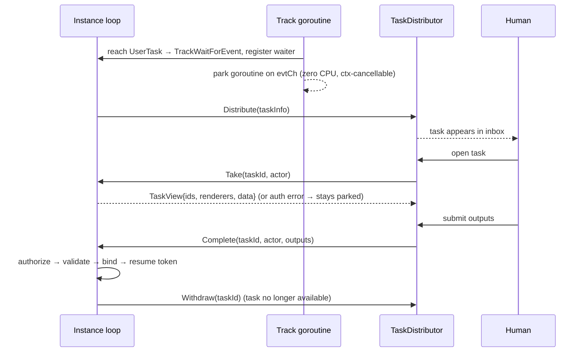

# ADR-020 — Human-Interaction Execution Model (UserTask & ManualTask)

| Поле | Значение |
|---|---|
| Статус | Принято |
| Версия | v.1 |
| Дата | 2026-07-02 |
| Владелец | Руслан Габитов |
| Уточняет | [ADR-001 v.6 Execution Model](ADR-001-execution-model.md), [ADR-017 v.1 Channel-Based Event Processing](ADR-017-channel-based-event-processing.md) §2, [SAD-001 v.1](SAD-001-vision-and-architecture.md) §6, §10, §11 |

> EN-оригинал — канонический: [ADR-020-human-interaction-execution-model.md](ADR-020-human-interaction-execution-model.md). Этот файл — его перевод (twin).

> **Принято** — реализовано сопровождающим **SRD-034** (M1–M5 в ветке `feat/human-interaction-model`). Решает,
> как **UserTask** выполняется на park/resume-ядре gobpm: это **wait-node**, чьё завершение — это
> **внешнее событие**, инициируемое человеком через подключаемую границу **`TaskDistributor`** (интерфейс,
> который [SAD-001 v.1 §6](SAD-001-vision-and-architecture.md) откладывает до «выделенного
> human-interaction ADR» — этого). Исправляет класс дефекта, где UserTask моделировался на
> **блокирующем `Exec`** — рудименте удалённого механизма Prologue-Exec-Epilogue — который крутится на
> *чужом* rendering-канале и **игнорирует `ctx`**, так что ожидающий UserTask нельзя отменить, и он
> обходит дисциплину единственного писателя loop'а. Исправление заставляет UserTask паркуваться на **том же
> кооперативном механизме wait-node, что использует каждый catch события**
> ([ADR-017 v.1](ADR-017-channel-based-event-processing.md), SRD-027/028) — без новой машинерии
> pause/resume. Также решает **модель авторизации** (триаду в стиле Camunda —
> `assignee` / `candidateUsers` / `candidateGroups` — выраженную на объектной модели BPMN `ResourceRole`),
> которая охраняет **и** чтение, **и** завершение задачи, и приземляет **ManualTask** как no-op
> pass-through. Область — 0.1.0; полноценные подсистемы динамического resource-query отложены (§7).

---

## 1. Контекст и проблема

BPMN даёт UserTask обманчиво короткое правило выполнения ([§13.3.3](../bpmn-spec/semantics/tasks.md),
spec p430): при активации она **распределяется** назначенным людям (согласно её
`HumanPerformer` / `PotentialOwner` / `Performer` / `Rendering` — [human-interaction.md](../bpmn-spec/elements/human-interaction.md));
когда работа сделана, она **завершается**. Спецификация намеренно оставляет *механизм распределения*
implementation-defined («Спецификация не предписывает конкретную структуру task list / inbox») и выносит
модель идентичности (кто такой «User» или «Group») **за область**. Всё интересное — это пробел, который
движок должен решить.

Три конкретные проблемы мотивируют этот ADR:

1. **UserTask использует чужую модель выполнения.** gobpm выполняет wait-node через *park and resume*
   ([ADR-017 v.1](ADR-017-channel-based-event-processing.md), [ADR-001 v.6](ADR-001-execution-model.md)):
   узел, который должен ждать, переходит в `TrackWaitForEvent`, а его goroutine **паркуется на
   loop-fed-канале** (`evtCh`) — ноль CPU, кооперативно отменяемо через `ctx`, и пробуждается только когда
   loop инстанса (единственный писатель) доставляет сработавший триггер. Goroutine *удерживается* пока
   запаркована, но она никогда не блокируется на внешнем источнике и всегда чтит отмену. UserTask, однако,
   была построена на **блокирующей активации** — рудиментной форме из удалённого механизма
   Prologue-Exec-Epilogue — которая крутится на *чужом* rendering-канале и **игнорирует `ctx`**. Так что
   запаркованный UserTask **нельзя отменить** (abort инстанса или прерывающая граница оставляют его
   goroutine заблокированной навсегда — реальный дефект за находкой аудита «goroutine leak»), и он обходит
   дисциплину единственного писателя loop'а. Это структурное несоответствие, а не вопрос тюнинга —
   исправление в том, чтобы UserTask паркуувался на **тех же кооперативных рельсах, что и любой другой
   wait-node**, а не изобретал второй механизм pause/resume. (Замечание: *освобождение* запаркованной
   goroutine целиком — goroutine-free долгое ожидание из [SAD-001 v.1 §10](SAD-001-vision-and-architecture.md) —
   это будущий слой **dehydration / rehydration**, отложенный единообразно для событий, долгих таймеров и
   UserTask'ов вместе; §7. Сегодня все виды ожидания держат in-memory запаркованную goroutine, и UserTask
   просто должен делать это тем же способом.)

2. **Нет runtime-авторизации.** Объектная модель `ResourceRole` *объявлена* (UserTask может нести роли), но
   **никогда не вычисляется**: ничто не резолвит роль в набор людей, нет понятия **актора** (действующего
   человека) в движке, и ничто не проверяет, может ли актор увидеть или завершить задачу. UserTask, которую
   кто угодно может завершить — или, хуже того, чьи входные данные кто угодно может прочитать — неприемлема,
   а стандартная модель resource-assignment существует именно чтобы этого не допустить.

3. **У ManualTask нет выполнения.** BPMN перечисляет ManualTask как **non-operational**
   ([§13.1](../bpmn-spec/semantics/tasks.md)) — «никогда фактически не выполняется IT-системой». Движку
   нужно определённое поведение (no-op), чтобы процесс, содержащий её, доходил до завершения.

Этот ADR решает **всю модель выполнения human-interaction** — жизненный цикл wait-node, границу
`TaskDistributor`, модель авторизации и то, что вручается клиенту человека для рендеринга задачи — как одну
согласованную концепцию. Согласование на уровне кода (какие типы меняются, дефекты goroutine-leak и
rendering-multiplicity, тесты) принадлежит сопровождающему **SRD-034**.

## 2. Решение

### 2.1 UserTask — это **wait-node**; её завершение — это **внешнее событие**

При активации движок трактует UserTask как **wait-node — *тот же* механизм wait-node, что использует каждый
catch события**, без новой машинерии. Он:

1. строит неизменяемый **дескриптор задачи** (task id, `Renderer`'ы задачи, её резолвнутые входные
   `data.Data`, её объявленные `ResourceRole`'ы и её output-спецификацию),
2. анонсирует задачу **`TaskDistributor`** (§2.2), чтобы клиент человека мог её показать,
3. переводит трек в `TrackWaitForEvent` и **паркует его goroutine на loop-fed-канале**
   (`evtCh`) — ноль CPU, кооперативно отменяемо через `ctx` — ровно как паркуется catch Message/Timer/Signal
   ([ADR-017 v.1 §2](ADR-017-channel-based-event-processing.md), [ADR-006 v.2](ADR-006-events-and-subscriptions.md),
   SRD-027/028). Goroutine *удерживается в памяти* пока запаркована (как и каждый вид ожидания сегодня); она
   **не** возвращается.

Далее задача сидит запаркованной, пока человек её не **завершит**. Завершение доставляется как **событие в
loop инстанса** — единственному писателю — который маршрутизирует его в `evtCh` запаркованного трека,
пробуждая собственную goroutine трека, чтобы авторизовать/провалидировать/забиндить и возобновить токен на
исходящий(-ие) поток(-и). Это «completion-as-an-event»: UserTask — это catch, чей триггер — действие человека
вместо сообщения или таймера, едущий по идентичному пути доставки. Старая блокирующая, игнорирующая `ctx`
активация удалена; поскольку парковка теперь кооперативна и loop-owned, отмена запаркованного UserTask (напр.
прерывающее граничное событие, [ADR-018 v.1](ADR-018-boundary-events-and-activity-interruption.md)) — это
просто стандартный teardown запаркованного waiter'а (`ctx` cancel / `evtCh` close) плюс `Withdraw`
дистрибьютору (§2.2) — закрывая «goroutine leak» кооперативной отменой, а не выходом из goroutine.

*(Освобождение запаркованной goroutine целиком для очень долгих ожиданий — dehydration в `Repository` и
rehydration по триггеру, [SAD-001 v.1 §10](SAD-001-vision-and-architecture.md) — отложено и будет построено
один раз, единообразно, для событий, долгих таймеров и UserTask'ов вместе; §7.)*



### 2.2 `TaskDistributor` — подключаемая граница (предоставляемая embedder'ом)

Маршрутизация к человеку — **забота embedder'а**, инъектируемая как и любая другая граница
([SAD-001 v.1 §6](SAD-001-vision-and-architecture.md): `MessageBroker`, `Clock`, … и отложенный
`TaskDistributor`). Движок владеет тем, *когда* задача становится доступной и *кто* может над ней
действовать; embedder владеет тем, *как* она достигает человека (inbox, web-форма, mobile push — всё
валидно, спецификация не предписывает ничего). Граница, которую движок вызывает **наружу**:

```go
// TaskDistributor is the embedder-provided boundary that surfaces human tasks.
// The engine calls it to announce and retract tasks; it does not drive execution.
type TaskDistributor interface {
    // Distribute announces a newly parked UserTask as available for human work.
    Distribute(ctx context.Context, task TaskInfo) error
    // Withdraw retracts a task that is no longer completable — it was completed,
    // or its activity was cancelled (e.g. an interrupting boundary event fired).
    Withdraw(ctx context.Context, taskID string) error
}
```

Направление **внутрь** — человек действует — это две точки входа движка, которые вызывает клиент embedder'а.
Движок владеет обеими, потому что он хранитель данных запаркованного инстанса и авторитет по
resource-assignment задачи (§2.5):

```go
// Take claims/reads a parked UserTask. It authorizes actor against the task's
// resource assignment BEFORE returning any data; on failure it returns an error and
// exposes nothing — the task stays parked, waiting for an authorized actor.
Take(ctx context.Context, taskID string, actor Actor) (TaskView, error)

// Complete submits an actor's outputs. It authorizes actor, then validates the
// outputs against the task's output spec; only if both pass does it bind the outputs
// and resume the token. An authorization failure is NON-terminal — the task stays
// parked and waits for the right actor.
Complete(ctx context.Context, taskID string, actor Actor, outputs []data.Data) error
```

Только **одно** production-поведение предписано по умолчанию: если `TaskDistributor` не инъектирован,
UserTask всё равно паркуется и всё равно завершаема через `Take`/`Complete` — распределение это анонс, а не
предусловие. (Embedder без inbox может гонять задачи напрямую по id.)

### 2.3 `Take` — авторизованное **чтение**

`Take` — это человек, заявляющий и читающий задачу. Поскольку входные данные задачи **это** данные инстанса,
`Take` обязан авторизовать **до** выставления чего-либо наружу (§2.5) — иначе неавторизованный актор мог бы
прочитать переменные, видеть которые не имеет права. При успехе он возвращает **`TaskView`** (§2.8), несущий
runtime-идентичность, рендереры и самоописывающие данные, нужные клиенту для сборки UI. При провале
авторизации он возвращает ошибку и не выставляет **никаких** данных; задача остаётся запаркованной. `Take` не
возобновляет токен — чтение это не завершение.

### 2.4 `Complete` — авторизованная **запись**, в две отклоняемые стадии

`Complete` — это триггер-событие. Оно **не** fire-on-anything (в отличие от message-catch); у него есть
критерии приёмки, и оно **повторяемо**:

1. **Авторизация** против resource-assignment задачи (§2.5). **Провал → нетерминальное отклонение:** токен
   остаётся запаркованным, задача остаётся открытой и продолжает ждать авторизованного актора. `Complete`
   возвращает ошибку «unauthorized»; процесс не затронут.
2. **Валидация выходов** против output-спецификации задачи (обязательные выходы присутствуют, типы
   соответствуют). **Провал → отклонение:** актор исправляет и пересылает; задача остаётся запаркованной.

Только когда **обе** проходят, движок **биндит** выходы в scope задачи и **возобновляет** токен. Завершение
поэтому **single-shot на первом *принятом* завершении** — отклонённые попытки (не тот актор, невалидные
выходы) не потребляют ожидание. Это точный смысл, в котором UserTask «завершается один раз».

**Где живут проверки — `Authorizer` + `OutputValidator`, обе на `UserTask`.** Обе проверки принадлежат
`UserTask` — она объявляет триаду и output-спецификацию, поэтому именно этот элемент валидирует против них.
Это **два раздельных** capability-интерфейса (interface segregation), так что `Take` может переиспользовать
авторизацию, не завися от валидации выходов, два режима провала остаются различимыми (security vs
correctness, §5), а security-критичный порядок (авторизовать *до* прикосновения к выходам) явен в точке
вызова:

```go
// Authorizer resolves the task's triad (static or FormalExpression) against the
// runtime data and decides membership (§2.5). Implemented by UserTask; called at
// BOTH Take and Complete.
type Authorizer interface {
    Authorize(ctx context.Context, actor Actor, src data.Source, eng expression.Engine) error
}

// OutputValidator validates submitted outputs against the task's output spec.
// Implemented by UserTask; called at Complete only.
type OutputValidator interface {
    ValidateOutputs(outputs []data.Data) error
}
```

**`Instance` — тонкий оркестратор**: `Take` → `task.Authorize`; `Complete` → `task.Authorize`, затем
`task.ValidateOutputs`; при успехе он биндит выходы и возобновляет токен. Он *предоставляет* runtime-контекст
(view `data.Source` над своим scope + expression engine), но не держит **никакой** check-логики;
`TaskDistributor` тоже не держит никакой. Это держит слоение чистым — `UserTask` self-проверяет, используя
только абстракции **model-слоя** (`data.Source`, `expression.Engine`, `Actor`), ровно как correlation-выражения
уже резолвятся над `data.Source` (`msgflow.DeriveKey`), так что `pkg/model/activities` никогда не импортирует
`internal/`. Per-deployment **подключаемая *политика* авторизации** (сверх триады + выражения) — отложенный
forward-pointer (§7), а не seam 0.1.0.

### 2.5 Модель авторизации — триада Camunda на базе BPMN `ResourceRole`

Модель resource-assignment BPMN ([human-interaction.md](../bpmn-spec/elements/human-interaction.md)) даёт
`ResourceRole` два взаимоисключающих способа назвать своих людей: статический `resourceRef` **или**
`resourceAssignmentExpression`, чьё выражение «MUST return Resource entity related data types, like Users or
Groups» и «MAY refer to Task instance data». Это весь примитив авторизации, который предлагает стандарт, и он
намеренно молчит об идентичности.

Мы выражаем его через словарь, который embedder'ы уже знают из Camunda — **`assignee`**,
**`candidateUsers`**, **`candidateGroups`**. Стандартный `ResourceRole` сам по себе не может нести триаду —
он держит один `Resource`-ref **или** выражение, без различия user-vs-group, без статического
id-**списка** и без маркера слота — поэтому, ровно как Camunda держит триаду в extension-атрибутах, а не в
BPMN `ResourceRole`, триада — это **типизированная структура на UserTask** (каждый член либо статические
идентификаторы, либо `FormalExpression`, §2.7), **единственный источник истины**, доступный через
типизированный аксессор и читаемый `Authorizer`'ом UserTask (§2.4). Она **сосуществует** с обобщённым
`Roles()` (любые BPMN `ResourceRole`'ы, объявленные через `WithRoles`); эти два не смешиваются, и ни один не
проецируется в другой.

**Объединяющее правило: резолвить каждого члена триады в набор идентификаторов, затем проверить членство.**

| Член триады | BPMN-роль | Резолвится в | Сопоставляется с |
|---|---|---|---|
| `assignee` | `HumanPerformer` (фактический владелец) | набор user-id (обычно один) | `actor.UserID` |
| `candidateUsers` | `PotentialOwner` (пользователи) | набор user-id | `actor.UserID` |
| `candidateGroups` | `PotentialOwner` (группы) | набор group-id | `actor.Groups` |

Вердикт авторизации для `actor`:

- **`assignee` задан и непуст** → авторизован iff `actor.UserID ∈ assignee-set` (ограничительная охрана:
  как только у задачи есть фактический владелец, только он может читать/завершать её — семантика Camunda).
- **иначе** → авторизован iff `actor.UserID ∈ candidateUsers` **или** `actor.Groups ∩ candidateGroups ≠ ∅`.
- **ни один член триады не объявлен** → **открыто**: любой актор авторизован. Это BPMN'овский «unspecified
  performer» и default-permissive позиция движка ([SAD-001 v.1 §12](SAD-001-vision-and-architecture.md):
  «Default impl allows all») — движок не ограничивает без нужды.

Тот же вердикт охраняет **и** `Take`, **и** `Complete` (§2.3, §2.4). Заявка (первый успешный `Take`
кандидата) может установить runtime-`assignee`, после чего применяется ограничительная охрана — знакомый
поток claim→complete — но бухгалтерия заявок это забота дистрибьютора; инвариант движка — только
«авторизованный актор ⇔ член резолвнутого набора».

> **Отношение к `AuthorizationProvider`.** [SAD-001 v.1](SAD-001-vision-and-architecture.md) определяет
> грубую, cross-cutting охрану `AuthorizationProvider.Authorize(operation, …)` для чувствительных операций
> («start process», «claim user task», «cancel instance»; по умолчанию allow-all). Это **ортогонально**
> этой триаде: провайдер отвечает на «может ли этот принципал заявить *любую* задачу вообще?»; триада
> отвечает на «является ли этот актор кандидатом/assignee *этой конкретной* задачи?». Они композируются —
> деплой может подключить оба. Этот ADR решает только task-level, стандарт-обоснованную триаду.

### 2.6 `Actor` — runtime-идентичность

Runtime-понятие движка о действующем человеке минимально и несёт ровно то, что сопоставляет триада. Оно
названо **`Actor`**, чтобы избежать коллизии с BPMN-*элементом* `Performer` (подтип `ResourceRole`,
объявление роли) — `Actor` это аутентифицированная идентичность, *действующая над* задачей, а не роль:

```go
// Actor is the authenticated human acting on a task. The TaskDistributor
// authenticates the human and supplies this; the engine authorizes it (§2.5).
type Actor interface {
    UserID() string    // matched against assignee / candidateUsers
    Groups() []string  // matched against candidateGroups
}
```

Идентичность и членство в группах **аутентифицируются `TaskDistributor`'ом** (IAM-забота embedder'а, вне
области BPMN) и **доверяются** движком — движок авторизует (членство в наборе), он не аутентифицирует. Это
держит движок свободным от какого-либо каталога пользователей, всё ещё обеспечивая resource-assignment
модели.

### 2.7 Статические идентификаторы **или** `FormalExpression`

Отражая двойственность `resourceRef`-vs-`resourceAssignmentExpression`, каждый член триады объявляется
**либо** статическими идентификаторами, **либо** `FormalExpression`, вычисляющимся в список (возможно, из
одного элемента) идентификаторов/имён. Парные option-конструкторы держат статический путь свободным от
expression-церемонии и соответствуют явно-option'ной идиоме проекта:

| Статически | Динамически (выражение → `[]string`) |
|---|---|
| `WithAssignee(userID string)` | `WithAssigneeExpr(expr data.Expression)` |
| `WithCandidateUsers(ids ...string)` | `WithCandidateUsersExpr(expr data.Expression)` |
| `WithCandidateGroups(ids ...string)` | `WithCandidateGroupsExpr(expr data.Expression)` |

Статическая и динамическая формы для одного члена **взаимоисключающи** (существующий инвариант `ResourceRole`
«resource XOR assignment-expression»). `Authorizer` UserTask (§2.4) резолвит члена на основе выражения **в
момент авторизации**, против **scope данных инстанса** (через expression engine) — так что набор кандидатов
может зависеть от данных процесса и **динамичен на инстанс**, что и есть то, для чего существует
`resourceAssignmentExpression`. Провал резолвинга выражения трактуется как пустой результат (BPMN: «Failed
Resource queries are treated like Resource queries that return an empty result set» —
[human-interaction.md](../bpmn-spec/elements/human-interaction.md)), т.е. он авторизует никого, а не всех.

### 2.8 `TaskView` — что возвращает `Take`

Клиенту, рендерящему задачу, нужно больше, чем сырые выходные переменные — ему нужно знать, *какую форму*
рендерить, *в каком* runtime-контексте он находится, и *самоописывающие* данные для раскладки. `Take`
возвращает **типизированный дескриптор с открытым data-мешком**:

```go
// TaskView is the authorized snapshot a client renders. Runtime identity is typed
// (always present); the payload is a self-describing data.Data bag.
type TaskView struct {
    TaskID     string          // this task instance
    InstanceID string          // owning process instance
    NodeID     string          // the UserTask node (activity) id
    ProcessID  string          // the process definition id
    Renderers  []hi.Renderer   // form/field descriptions, carried to the client (not invoked inline by the engine)
    Data       []data.Data     // inputs + task Properties (e.g. FORM_ID), each self-describing
}
```

- **Runtime-идентичность типизирована.** `InstanceID` / `NodeID` / `ProcessID` / `TaskID` всегда присутствуют
  и известны движку; типизированное поле обнаружимо и не может коллизировать с бизнес-переменной, в отличие
  от stringly-именованного зарезервированного ключа.
- **Payload — мешок `data.Data`.** Каждый элемент самоописывается через `Name()`, `Value()`, `State()` и
  `ItemDefinition()` (его тип) — клиент может строить UI, не читая код движка. Это включает бизнес-входы
  задачи **и** её `Property`'и (`Property` *есть* `data.Data`).
- **`FORM_ID` — конвенция userland-property, а не поле движка.** Моделер прикрепляет `FORM_ID`-Property (любое
  имя на его выбор — `LAYOUT`, `FORM_VERSION`, …); движок остаётся неведающим о нём и просто возвращает его в
  `Data`; клиент читает его и выбирает форму. Движок не обрастает form-реестром — композиция над
  ограничением.
- **`Complete` симметричен** — он принимает выходы `[]data.Data` (самоописывающие), валидируемые против
  output-спецификации задачи.

### 2.9 Рендеринг — переносится в дескрипторе, кратность по **идентичности**

`Renderer`'ы UserTask **переносятся в дескрипторе задачи** (`TaskView`, §2.8), а не вызываются inline движком
во время активации — inline-вызов был частью старого блокирующего пути. Оценивает ли клиент `Renderer` (его
метод `Render`), чтобы произвести form-данные, и как — выбор embedder'а; движок лишь доносит рендереры до
клиента нетронутыми. BPMN моделирует `Rendering` как **опциональный, повторяемый** элемент на UserTask
([human-interaction.md](../bpmn-spec/elements/human-interaction.md) документирует сам элемент `Rendering`;
его ассоциация `0..*` к UserTask объявлена в секции UserTask полной спецификации), так что задача МОЖЕТ нести
несколько рендереров — напр. web-форму и mobile-форму. Различные рендереры различаются **по идентичности**
(`ID()`), никогда по маркеру их implementation-типа: два рендерера одного вида реализации — это законно
разные рендеринги, и оба должны выжить. (Это исправляет дефект, где второй рендерер того же
implementation-типа молча отбрасывался — согласовано в SRD-034.)

### 2.10 ManualTask — no-op pass-through

ManualTask **non-operational** ([§13.1](../bpmn-spec/semantics/tasks.md): «никогда фактически не выполняется
IT-системой»; Process Execution Conformance разрешает движку «MAY ignore Manual Tasks / treat as no-op
pass-through»). Движок трактует её как **pass-through**: токен течёт прямо на исходящий(-ие) sequence
flow(-ы) без дескриптора, без распределения и без ожидания. Это соответствует
[SAD-001 v.1 §15](SAD-001-vision-and-architecture.md) («движок трактует её как pass-through … near-zero
execution value») и закрывает последний пробел non-operational-task для 0.1.0.

## 3. Обоснование стандартом

| Утверждение | Источник | Что говорит |
|---|---|---|
| UserTask распределяет, затем завершается; механизм implementation-defined | [§13.3.3](../bpmn-spec/semantics/tasks.md) (spec p430) | «distributed to the assigned person or group … When the work has been done, the User Task completes»; «distribution mechanism is implementation-defined.» |
| Объектная модель resource-assignment | [human-interaction.md](../bpmn-spec/elements/human-interaction.md) | `ResourceRole` имеет `resourceRef` (0..1) XOR `resourceAssignmentExpression` (0..1); `PotentialOwner → HumanPerformer → Performer → ResourceRole`; `Rendering` — опциональный, повторяемый элемент (extract документирует элемент `Rendering`; его ассоциация `0..*` к UserTask — в секции UserTask полной спецификации). |
| Assignment-выражение возвращает Users/Groups, может читать task-данные | [human-interaction.md](../bpmn-spec/elements/human-interaction.md) (§ResourceAssignmentExpression) | «MUST return Resource entity related data types, like Users or Groups»; parameter bindings «MAY refer to Task instance data.» |
| Провалившийся resource-query ⇒ пустой набор | [human-interaction.md](../bpmn-spec/elements/human-interaction.md) | «Failed Resource queries are treated like Resource queries that return an empty result set.» |
| ManualTask non-operational | [§13.1](../bpmn-spec/semantics/tasks.md) | Перечислена non-operational; соответствующий движок MAY трактовать как no-op pass-through. |

Там, где gobpm **выбирает** сверх молчания стандарта, это обозначено как решение движка, а не приписано
спецификации: **словарь** `assignee`/`candidateUsers`/`candidateGroups` (конвенция Camunda, отображённая на
`ResourceRole`), **форма идентичности `Actor`**, **park/resume**-выполнение (стандарт молчит о threading) и
охрана **`Take`** авторизацией (стандарт говорит о завершении, не о чтении).

## 4. Рассмотренные альтернативы

1. **Оставить блокирующую активацию, лишь добавить отмену через `ctx` в чужой цикл rendering-канала.**
   Отклонено: это остановило бы утечку, но оставило бы UserTask **особым случаем со своим путём
   pause/resume**, дублируя механизм wait-node, который event-ядро уже предоставляет. Причина не «держит
   goroutine» (каждый вид ожидания сегодня держит, в памяти) — это *второй, чужой механизм парковки*.
   Переиспользование `TrackWaitForEvent`/`evtCh` унифицирует UserTask с событиями и является ровно тем
   единственным механизмом, который будущий слой dehydration/rehydration поднимет единообразно для всех видов
   ожидания.

2. **Авторизовать на стороне `TaskDistributor`; движок доверяет вердикту «готово».** Отклонено: это
   противоречит требованию, чтобы *движок* обеспечивал resource-assignment, а багованый или зловредный
   embedder мог бы обойти модель. Движок держит роли; движок должен выносить вердикт.

3. **Авторизовать только на `Complete`, трактовать `Take` как чисто бухгалтерию дистрибьютора.** Отклонено:
   `Take` читает данные инстанса, поэтому пропуск его авторизации утекает переменные неавторизованным
   акторам. Обе охраны авторизуют.

4. **Построить полный каталог User/Group + подсистему resource-query сейчас.** Отклонено как спекулятивная
   универсальность: нет подсистемы идентичности, на которую это повесить, а форма `FormalExpression` уже
   покрывает динамические, зависящие от данных наборы кандидатов. Актор самоотчитывается об аутентифицированной
   идентичности + группах; более богатая интеграция каталога — забота embedder'а и forward-pointer (§7).

5. **Триада хранится как обобщённые `ResourceRole`'ы (в / проецированная в `Roles()`).** Отклонено:
   `ResourceRole` не может выразить слот, вид user/group или статический id-**список**, так что это lossy и
   вынуждает re-parsing в `Authorize`. Триада — своя типизированная структура (§2.5), единственный источник
   истины, **сосуществующая** с обобщённым `Roles()` — как Camunda держит её в extension-атрибутах, а не в
   BPMN `ResourceRole`.

6. **`Take` возвращает `[]variable` (голые значения).** Отклонено: это отбрасывает **состояние** и **тип**
   данных и не может нести Properties (`FORM_ID`) или runtime-контекст. `TaskView` + `[]data.Data` даёт
   клиенту самоописывающий, рендерируемый снимок (§2.8).

7. **Плоский `[]data.Data` для всего результата `Take`, runtime-id как зарезервированные ключи.** Отклонено в
   пользу типизированного `TaskView`: всегда-присутствующая runtime-идентичность заслуживает
   типизированного, collision-free контракта; только по-настоящему открытый payload — мешок.

8. **Единый `CompleteChecker`, объединяющий авторизацию + валидацию выходов.** Отклонено в пользу двух
   раздельных интерфейсов (`Authorizer`, `OutputValidator`, §2.4): `Take` нуждается в авторизации, но у него
   нет выходов для валидации, так что объединённый `CheckComplete(actor, outputs)` не может ему служить; два
   режима провала различны (security-relevant unauthorized vs fix-and-resubmit invalid-output); а
   security-критичный порядок authorize-before-outputs лучше сделать явным в оркестрирующей точке вызова, чем
   спрятать внутри одного метода. Оба интерфейса всё равно живут на `UserTask` (общая цель с объединённым
   вариантом — держать check-логику вне Instance и TaskDistributor).

## 5. Последствия

- **UserTask паркуется на едином общем механизме wait-node.** Он переиспользует `TrackWaitForEvent`/`evtCh` —
  нет второго пути pause/resume — так что игнорирующий `ctx` блокирующий цикл (и его неотменяемая «утечка»)
  ушёл: запаркованный UserTask теперь кооперативно отменяем, как любой catch. Goroutine всё ещё
  *удерживается в памяти* (как все виды ожидания сегодня); освобождение её для очень долгих ожиданий — это
  отложенный, единообразный слой dehydration (§7), а не то, что заявляет этот ADR.
- **Запаркованный UserTask отменяем.** Прерывающее граничное событие
  ([ADR-018 v.1](ADR-018-boundary-events-and-activity-interruption.md)) сносит запаркованный waiter и делает
  `Withdraw` задачи из дистрибьютора — нет осиротевшей goroutine, нет осиротевшей записи в inbox.
- **Авторизация обеспечивается, обоснована стандартом и default-permissive.** No-triad задачи остаются
  открытыми (без трения для простых процессов); объявленные задачи обеспечиваются и на чтении, и на записи.
- **Check-логика когезивна, на model-элементе.** `Authorizer` + `OutputValidator` живут на `UserTask`;
  `Instance` только оркестрирует (authorize → validate → bind → resume), а `TaskDistributor` не держит
  ничего. Добавление типа задачи или проверки эволюционирует одно место, а не три.
- **Embedder'ы получают знакомую поверхность.** Триада Camunda + конвенция property `FORM_ID` означают, что
  API читается так, как BPM-практики ожидают, при этом движок остаётся тонким, стандарт-соответствующим ядром.
- **Новая инъектируемая граница.** `TaskDistributor` присоединяется к option-набору движка (`MessageBroker`,
  `Clock`, …). Она опциональна; в её отсутствие задачи всё равно завершаемы по id.
- **`Renderer` больше не вызывается движком.** Движок доносит рендереры до клиента вместо inline-вызова —
  проще, и это убирает inline-invocation блокирующий путь.

## 6. Рекомендации Enterprise-готовности

- **Observability.** Испускать сигналы жизненного цикла задачи — `task.distributed`, `task.taken` (с
  актором), `task.completion.rejected` (с причиной: unauthorized vs invalid-output), `task.completed`,
  `task.withdrawn` — через существующий канал observability инстанса
  ([ADR-013 v.1](ADR-013-instance-observability.md)). Отклонённые завершения security-relevant и должны быть
  наблюдаемы без логирования payload'ов задачи.
- **Аудировать решение авторизации, а не данные.** Логировать, *кто* был авторизован/отклонён для *какой*
  задачи, никогда переменные задачи (которые могут быть чувствительными). Вердикт — это аудит-артефакт.
- **Идемпотентный `Complete`.** Клиенты могут ретраить; движок должен трактовать `Complete` на уже
  завершённой задаче как well-defined no-op/error, а не второе возобновление.
- **Композиция `AuthorizationProvider`.** Деплои, нуждающиеся в грубых охранах («может ли этот принципал
  заявлять задачи вообще?»), подключают `AuthorizationProvider` из
  [SAD-001 v.1](SAD-001-vision-and-architecture.md) рядом с триадой; документировать двухслойную модель для
  операторов.
- **Чувствительные данные в `TaskView`.** Поскольку `Take` выставляет данные инстанса, embedder'ы,
  показывающие задачи браузерам, должны трактовать `TaskView.Data` как need-to-know и избегать чрезмерно
  широких групп кандидатов.

## 7. План внедрения

Приземлено **SRD-034** в ветке `feat/human-interaction-model` (code-grounded этапы там):

1. Идентичность `Actor` + модель авторизации триады (статическая + резолвинг выражений) + проверки
   `Authorizer` и `OutputValidator` UserTask (§2.4).
2. Редизайн UserTask как wait-node (дескриптор, park, `Take`/`Complete`, `TaskView`) на ядре ADR-017, с
   `Instance` как оркестратором проверок; граница `TaskDistributor` + option движка.
3. Исправление кратности рендеринга (dedup по идентичности, §2.9).
4. ManualTask no-op pass-through.

**Отложено (forward-pointer'ы, не строится сейчас):**

- Подсистема directory/resource-query (LDAP/DB-backed резолвинг кандидатов) сверх `FormalExpression` — забота
  embedder'а; подключаемый путь — это форма выражения и самоотчитанные группы актора.
- Per-deployment **подключаемая *политика* авторизации** (переопределяющая само правило членства в триаде, а
  не только его входы). Check-логика 0.1.0 живёт на `UserTask` (§2.4); триада + `FormalExpression` уже
  покрывают динамические наборы кандидатов, так что seam переопределения политики сейчас не нужен.
- Эскалация / переназначение / делегирование задач и формальные state-machine claim/unclaim — более поздний
  human-task-lifecycle ADR, если появится спрос.
- **Dehydration / rehydration запаркованных ожиданий** — освобождение in-memory запаркованной goroutine,
  экстернализация её состояния в `Repository` и rehydration по триггеру
  ([ADR-009 v.1](ADR-009-per-instance-node-graph.md),
  [SAD-001 v.1 §10](SAD-001-vision-and-architecture.md)). Это **не специфично для UserTask**: сегодня каждый
  вид ожидания (события, долгие таймеры, UserTask'и) держит in-memory запаркованную goroutine, а
  goroutine-free долгое ожидание — это единый механизм, который надо построить **один раз, единообразно, для
  всех них**. Последовательность намеренна — сначала доказать UserTask на in-memory-парковке (этот ADR),
  затем поднять весь набор видов ожидания до dehydration вместе, а не изобретать UserTask-специфичный путь
  персистентности.

## 8. Ссылки

- [ADR-001 v.6 Execution Model](ADR-001-execution-model.md) — park/resume, жизненный цикл токена.
- [ADR-017 v.1 Channel-Based Event Processing](ADR-017-channel-based-event-processing.md) §2 — ядро
  wait-node, на котором теперь едет UserTask.
- [ADR-006 v.2 Events & Subscriptions](ADR-006-events-and-subscriptions.md) — модель регистрации waiter'ов.
- [ADR-010 v.2 Process Data Model](ADR-010-process-data-model.md) — Property (`FORM_ID`) — это `data.Data`.
- [ADR-011 v.5 Process Data Flow](ADR-011-process-data-flow.md) — scope-биндинг выходов задачи.
- [ADR-013 v.1 Instance Observability](ADR-013-instance-observability.md) — сигналы жизненного цикла задачи.
- [ADR-018 v.1 Boundary Events & Activity Interruption](ADR-018-boundary-events-and-activity-interruption.md)
  — отмена запаркованного UserTask.
- [SAD-001 v.1 Vision & Architecture](SAD-001-vision-and-architecture.md) §6 & §11 (отсрочка
  `TaskDistributor`), §12 (`AuthorizationProvider`), §10 (нет goroutine на долгих ожиданиях), §15 (ManualTask
  pass-through).
- BPMN 2.0 [§13.3.3 UserTask](../bpmn-spec/semantics/tasks.md), [§13.1 ManualTask](../bpmn-spec/semantics/tasks.md),
  [Human Interaction elements](../bpmn-spec/elements/human-interaction.md).

## Открытые вопросы

Нет.

## История документа

| Версия | Дата | Изменение |
|---|---|---|
| v.1 | 2026-07-02 | Первичный черновик — UserTask как wait-node, паркующийся на общем механизме `TrackWaitForEvent`/`evtCh` (goroutine удерживается, не возвращается; dehydration отложена единообразно); граница `TaskDistributor`; охраняемые авторизацией точки входа `Take`/`Complete`; триада Camunda над `ResourceRole` (статическая + `FormalExpression`); runtime-идентичность `Actor`; проверки `Authorizer` + `OutputValidator`, принадлежащие `UserTask`, `Instance` как оркестратор; возврат `TaskView`; кратность рендереров по идентичности; ManualTask no-op. |
