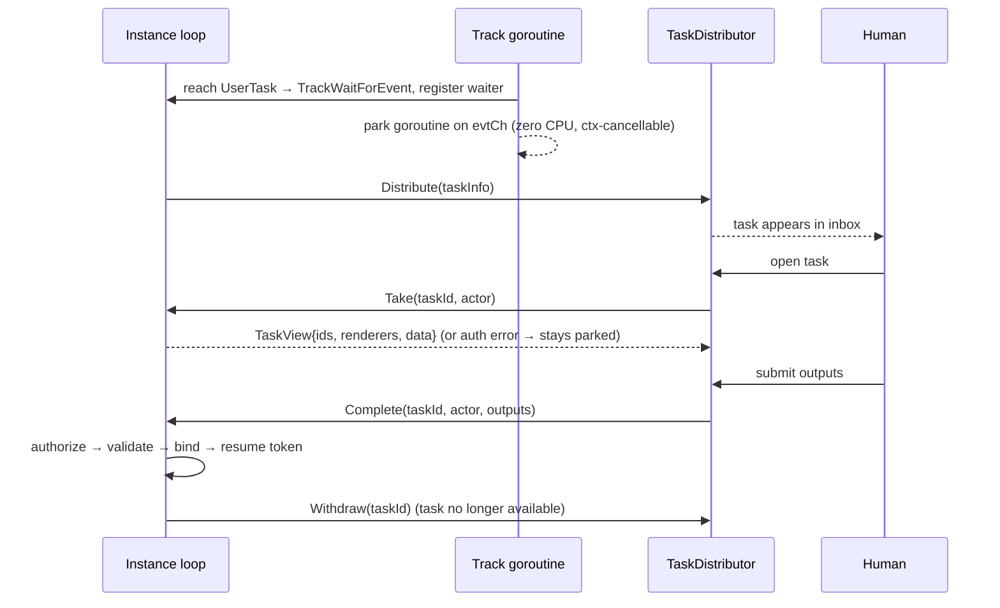

# ADR-020 — Human-Interaction Execution Model (UserTask & ManualTask)

| Поле | Значение |
|---|---|
| Статус | Черновик |
| Версия | v.2 |
| Дата | 2026-07-30 |
| Владелец | Руслан Габитов |
| Уточняет | [ADR-001 v.6 Execution Model](ADR-001-execution-model.md), [ADR-017 v.1 Channel-Based Event Processing](ADR-017-channel-based-event-processing.md) §2, [ADR-007 v.2.1 In-Memory Long Waits](ADR-007-in-memory-long-waits.md) §2.4, [SAD-001 v.1](SAD-001-vision-and-architecture.md) §6, §10, §11 |

> EN-оригинал — канонический: [ADR-020-human-interaction-execution-model.md](ADR-020-human-interaction-execution-model.md). Этот файл — его перевод (twin).

> **v.2 — жизненный цикл владения.** Эта версия добавляет **runtime-половину** человеческого
> взаимодействия: кто в данный момент держит запаркованную UserTask, как этот держатель приобретается,
> освобождается и заменяется, и что это означает для завершения. Отслеживаемое состояние даёт сам BPMN —
> **Таблица 10.14** (§10.3.4.1) определяет `actualOwner` как **атрибут экземпляра** UserTask: «пользователь,
> который взял/заявил права на User-задачу и стал её фактическим владельцем». v.1 объявляла право на
> действие, но никогда не реализовывала атрибут, фиксирующий, кто действует **фактически**. Поэтому работа
> по владению — это в основном **соответствие стандарту**: подключить `actualOwner` и решить то, что
> стандарт оставляет открытым (операции, их охраны, влияние на завершение).
> Где это читать: **§2.5.1** (атрибут), **§2.5.2** (Claim / Unclaim / Reassign и их охраны), **§2.5.3**
> (владение с рождения), **§2.4.1** (строгое завершение), **§2.4.2** (`completedBy`), **§2.1.1** (владение и
> запаркованный токен) и **§2.7** — единственная секция, чей контракт эта версия **меняет**.
>
> **v.1 — модель выполнения** (ниже, без изменений, если не отмечено иное). Решает,
> как **UserTask** выполняется на park/resume-ядре gobpm: это **wait-node**, чьё завершение — это
> **внешнее событие**, инициируемое человеком через подключаемую границу **`TaskDistributor`** (интерфейс,
> который [SAD-001 v.1 §6](SAD-001-vision-and-architecture.md) откладывает до «выделенного
> human-interaction ADR» — этого). Исправляет класс дефекта, где UserTask моделировался на
> **блокирующем `Exec`** — рудименте удалённого механизма Prologue-Exec-Epilogue — который крутится на
> *чужом* rendering-канале и **игнорирует `ctx`**, так что ожидающий UserTask нельзя отменить, и он
> обходит дисциплину единственного писателя loop'а. Исправление заставляет UserTask паркуваться на **том же
> кооперативном механизме wait-node, что использует каждый catch события**
> ([ADR-017 v.1](ADR-017-channel-based-event-processing.md)) — без новой машинерии
> pause/resume. Также решает **модель авторизации** (триаду в стиле Camunda —
> `assignee` / `candidateUsers` / `candidateGroups` — выраженную на объектной модели BPMN `ResourceRole`),
> которая охраняет **и** чтение, **и** завершение задачи, и приземляет **ManualTask** как no-op
> pass-through. Область — 0.1.0; полноценные подсистемы динамического resource-query отложены (§7).

---

## 1. Контекст и проблема

BPMN даёт UserTask обманчиво короткое правило выполнения ([§13.3.3](../bpmn-spec/semantics/tasks.md),
spec p430): при активации она **распределяется** назначенным людям (согласно её
`HumanPerformer` / `PotentialOwner` / `Performer` / `Rendering` — [human-interaction.md](../bpmn-spec/elements/human-interaction.md));
когда работа сделана, она **завершается**. Спецификация намеренно оставляет *механизм распределения*
implementation-defined («Спецификация не предписывает конкретную структуру task list / inbox») и выносит
модель идентичности (кто такой «User» или «Group») **за область**. Всё интересное — это пробел, который
движок должен решить.

Три конкретные проблемы мотивируют этот ADR:

1. **UserTask использует чужую модель выполнения.** gobpm выполняет wait-node через *park and resume*
   ([ADR-017 v.1](ADR-017-channel-based-event-processing.md), [ADR-001 v.6](ADR-001-execution-model.md)):
   узел, который должен ждать, переходит в `TrackWaitForEvent`, а его goroutine **паркуется на
   loop-fed-канале** (`evtCh`) — ноль CPU, кооперативно отменяемо через `ctx`, и пробуждается только когда
   loop инстанса (единственный писатель) доставляет сработавший триггер. Goroutine *удерживается* пока
   запаркована, но она никогда не блокируется на внешнем источнике и всегда чтит отмену. UserTask, однако,
   была построена на **блокирующей активации** — рудиментной форме из удалённого механизма
   Prologue-Exec-Epilogue — которая крутится на *чужом* rendering-канале и **игнорирует `ctx`**. Так что
   запаркованный UserTask **нельзя отменить** (abort инстанса или прерывающая граница оставляют его
   goroutine заблокированной навсегда — реальный дефект за находкой аудита «goroutine leak»), и он обходит
   дисциплину единственного писателя loop'а. Это структурное несоответствие, а не вопрос тюнинга —
   исправление в том, чтобы UserTask паркуувался на **тех же кооперативных рельсах, что и любой другой
   wait-node**, а не изобретал второй механизм pause/resume. (Замечание: *освобождение* запаркованной
   goroutine целиком — goroutine-free долгое ожидание из [SAD-001 v.1 §10](SAD-001-vision-and-architecture.md) —
   это будущий слой **dehydration / rehydration**, отложенный единообразно для событий, долгих таймеров и
   UserTask'ов вместе; §7. Сегодня все виды ожидания держат in-memory запаркованную goroutine, и UserTask
   просто должен делать это тем же способом.)

2. **Нет runtime-авторизации.** Объектная модель `ResourceRole` *объявлена* (UserTask может нести роли), но
   **никогда не вычисляется**: ничто не резолвит роль в набор людей, нет понятия **актора** (действующего
   человека) в движке, и ничто не проверяет, может ли актор увидеть или завершить задачу. UserTask, которую
   кто угодно может завершить — или, хуже того, чьи входные данные кто угодно может прочитать — неприемлема,
   а стандартная модель resource-assignment существует именно чтобы этого не допустить.

3. **У ManualTask нет выполнения.** BPMN перечисляет ManualTask как **non-operational**
   ([§13.1](../bpmn-spec/semantics/tasks.md)) — «никогда фактически не выполняется IT-системой». Движку
   нужно определённое поведение (no-op), чтобы процесс, содержащий её, доходил до завершения.

Этот ADR решает **всю модель выполнения human-interaction** — жизненный цикл wait-node, границу
`TaskDistributor`, модель авторизации и то, что вручается клиенту человека для рендеринга задачи — как одну
согласованную концепцию. Согласование на уровне кода (какие типы меняются, дефекты goroutine-leak и
rendering-multiplicity, тесты) принадлежит сопровождающему SRD.

### 1.4 Добавлено в v.2 — пробел во владении

BPMN разносит атрибуты UserTask по двум таблицам. **Таблица 10.13** несёт атрибуты *модели* — design-time
форму (`implementation`, `renderings`), которую сериализует XML-определение. **Таблица 10.14** несёт
атрибуты *экземпляра* — runtime-факты о живой задаче, которых нет ни в одном XML-определении, потому что до
запуска они не существуют:

> **Таблица 10.14 – атрибуты экземпляра User Task** (§10.3.4.1)
> `actualOwner: string` — возвращает «пользователя», который взял/заявил права на User-задачу и стал её
> фактическим владельцем. Значение — литерал, представляющий id пользователя, email и т.п.
> `taskPriority: integer` — возвращает приоритет User-задачи.

v.1 реализовала design-time половину основательно — модель на базе `ResourceRole`, называющую, кто **может**
читать и завершать задачу (§2.5), — и не реализовала runtime-половину вовсе. Без понятия текущего владельца
авторизация остаётся **единственной** охраной действия: каждый подходящий кандидат постоянно и одновременно
одинаково вправе завершить задачу. Отсюда три проблемы.

4. **Право на действие — не эксклюзивность, поэтому кандидаты сталкиваются.** Задачу, предложенную группе
   кандидатов, могут одновременно выполнять все они. Ничто не позволяет одному кандидату сигнализировать «я
   этим занимаюсь», и ничто не мешает второму завершить её, пока первый заполняет форму: побеждает тот, кто
   отправил раньше, а работа другого молча выбрасывается. Потерянная работа к тому же невидима: отправку
   проигравшего отклоняют как неизвестную задачу — неотличимо от задачи, которую отменили. Предлагать работу
   N людям — обычный и корректный способ моделировать человеческий труд; недостаёт именно **заявки**
   (claim), превращающей предложение в назначение. Это ровно тот переход, который описывает `actualOwner`
   («взял/заявил права … стал фактическим владельцем»), и его отсутствие — пробел в соответствии стандарту,
   а не отсутствие удобства.

5. **Ничто не фиксирует, кто выполнил работу.** Design-time назначение — это *константа*: объявленный
   идентификатор или выражение, вычисляемое для решения о праве на действие. Оно отвечает на вопрос «кому
   было позволено это сделать», но никогда — «кто это сделал». Отсюда два следствия: нет ответа для аудита
   на вопрос «кто завершил эту задачу» и — что ограничивает сильнее — процесс **не может маршрутизировать по
   собственной истории**. Канонический шаблон «отправить работу руководителю предыдущего исполнителя»
   немоделируем, потому что личность предыдущего исполнителя нигде не фиксируется так, чтобы процесс мог её
   прочитать. Стандарт эту потребность предвидит: атрибуты экземпляра доступны выражениям через
   XPath-биндинг `getActivityInstanceAttribute` (§10.4.3).

6. **У застрявшей человеческой работы нет средства исправления.** Поскольку право на действие фиксируется на
   design-time и никакой административной операции не существует, задача, чей предполагаемый исполнитель стал
   недоступен — отпуск, болезнь, уход из компании, — не может быть завершена никем, и инстанс бесконечно
   стоит на ожидании, удовлетворить которое способен лишь актор, который никогда не подействует. Передачи
   требуют три реальные ситуации: руководитель отдела назначает ответственного; администратор спасает задачу
   у недоступного исполнителя; и оптовый перенос всей нагрузки уходящего сотрудника. Первая уже выразима
   через assignment-выражение, читающее данные процесса (§2.7), — но заметьте, что она *порождает* ровно те
   задачи с единственным assignee, которые вторая ситуация обязана спасать. Назначение и переназначение,
   таким образом, не альтернативы: дизайн, поддерживающий первое, **обязан** поддерживать второе.

Стандарт даёт атрибут и словарь — и на этом останавливается: никаких операций приобретения или передачи
владения и никаких состояний владения в жизненном цикле активности (§13.3.2). Это решает движок, и v.2
решает это.

## 2. Решение

### 2.1 UserTask — это **wait-node**; её завершение — это **внешнее событие**

При активации движок трактует UserTask как **wait-node — *тот же* механизм wait-node, что использует каждый
catch события**, без новой машинерии. Он:

1. строит неизменяемый **дескриптор задачи** (task id, `Renderer`'ы задачи, её резолвнутые входные
   `data.Data`, её объявленные `ResourceRole`'ы и её output-спецификацию),
2. анонсирует задачу **`TaskDistributor`** (§2.2), чтобы клиент человека мог её показать,
3. переводит трек в `TrackWaitForEvent` и **паркует его goroutine на loop-fed-канале**
   (`evtCh`) — ноль CPU, кооперативно отменяемо через `ctx` — ровно как паркуется catch Message/Timer/Signal
   ([ADR-017 v.1 §2](ADR-017-channel-based-event-processing.md),
   [ADR-006 v.4](ADR-006-events-and-subscriptions.md)). Goroutine *удерживалась в памяти* пока запаркована в
   v.1 — что изменилось, см. §2.1.1 и [ADR-007 v.2.1](ADR-007-in-memory-long-waits.md) §2.4; она
   **не** возвращается.

Далее задача сидит запаркованной, пока человек её не **завершит**. Завершение доставляется как **событие в
loop инстанса** — единственному писателю — который маршрутизирует его в `evtCh` запаркованного трека,
пробуждая собственную goroutine трека, чтобы авторизовать/провалидировать/забиндить и возобновить токен на
исходящий(-ие) поток(-и). Это «completion-as-an-event»: UserTask — это catch, чей триггер — действие человека
вместо сообщения или таймера, едущий по идентичному пути доставки. Старая блокирующая, игнорирующая `ctx`
активация удалена; поскольку парковка теперь кооперативна и loop-owned, отмена запаркованного UserTask (напр.
прерывающее граничное событие, [ADR-018 v.1](ADR-018-boundary-events-and-activity-interruption.md)) — это
просто стандартный teardown запаркованного waiter'а (`ctx` cancel / `evtCh` close) плюс `Withdraw`
дистрибьютору (§2.2) — закрывая «goroutine leak» кооперативной отменой, а не выходом из goroutine.

*(Освобождение запаркованной goroutine целиком для очень долгих ожиданий — dehydration в `Repository` и
rehydration по триггеру, [SAD-001 v.1 §10](SAD-001-vision-and-architecture.md) — было отложено в v.1 и с тех
пор **реализовано** единообразно для событий, долгих таймеров и UserTask'ов
([ADR-007 v.2.1](ADR-007-in-memory-long-waits.md) §2.4): запаркованная человеческая задача дегидрируема, а
её wake-holder — путь завершения через дистрибьютор. Что это значит для владения — решает §2.1.1.)*


```mermaid
sequenceDiagram
    participant IL as Instance loop
    participant Track as Track goroutine
    participant TD as TaskDistributor
    participant Human

    Track->>IL: reach UserTask → TrackWaitForEvent, register waiter
    Track-->>Track: park goroutine on evtCh (zero CPU, ctx-cancellable)
    IL->>TD: Distribute(taskInfo)
    TD-->>Human: task appears in inbox
    Human->>TD: open task
    TD->>IL: Take(taskId, actor)
    IL-->>TD: TaskView{ids, renderers, data}  (or auth error → stays parked)
    Human->>TD: submit outputs
    TD->>IL: Complete(taskId, actor, outputs)
    IL->>IL: authorize → validate → bind → resume token
    IL->>TD: Withdraw(taskId)  (task no longer available)
```

#### 2.1.1 Владение и запаркованный токен *(v.2)*

Операция владения (§2.5.2) меняет держателя задачи и возвращает управление. Она **не** продвигает токен, не
доставляет событие и не будит запаркованный track. Задача остаётся запаркованной и продолжает ждать действия
человека; **возобновляет её только завершение** (§2.4). Отсюда три следствия, и каждое — решение:

**Владение — не состояние активности.** Жизненный цикл активности BPMN (§13.3.2, Рисунок 13.2) определяет
`Inactive`, `Ready`, `Active`, `Withdrawn`, `Completing`, `Completed`, `Compensating`, `Compensated`,
`Failing`, `Terminating`, `Failed`, `Terminated`, `Closed` — и **ни одного состояния владения**. Поэтому
заявка на задачу не переводит активность: задача с владельцем находится в `Active` ровно так же, как
запаркованная задача без владельца. Владение — это *атрибут* выполняющейся активности, и именно поэтому
стандарт помещает его в таблицу атрибутов экземпляра, а не в машину состояний. Движок сообщает о владении
собственным классом наблюдаемых фактов (§6) — рядом с сигналами прогресса узла, но никогда вместо них.

**Операции владения не требуют резидентного инстанса.** Запаркованная человеческая задача освобождает
goroutine'ы своего инстанса ([ADR-007 v.2.1](ADR-007-in-memory-long-waits.md) §2.4) именно потому, что
человеческие ожидания длинны. Операции владения — те, что вероятнее всего придут во время такого ожидания, и
ровно они не требуют от инстанса ничего: после заморозки §2.7 набор подходящих акторов уже материализован, а
владение — это одна идентичность, сверяемая с ним; ни данных процесса, ни доступа к scope, ни работающего
track'а. Поэтому состояние владения и материализованный набор живут **на уровне движка, рядом с раздачей
задач**, а не внутри исполнительной машинерии инстанса, и заявка, освобождение или передача во время долгого
ожидания оставляют дегидрированный инстанс дегидрированным. **Завершение** — которому нужно связать выходы и
возобновить токен — гидрирует инстанс, как и раньше. Это же удерживает владение на дисциплине единственного
писателя: конкурентные заявки на одну задачу разрешает один авторитет, а не гонка между кандидатами.

**Владение никогда не сопротивляется отмене.** Процесс главнее человека. Когда срабатывает прерывающее
граничное событие ([ADR-018 v.1](ADR-018-boundary-events-and-activity-interruption.md)), завершается
объемлющий scope или прерывается инстанс, задача с владельцем сносится и `Withdraw`-ится ровно так же, как
задача без владельца. Владение даёт эксклюзивное право *завершить* задачу, пока она жива; оно не даёт
никаких прав на её дальнейшее существование. Сказать это явно стоит потому, что «заявлена» подсказывает
обратную интуицию — будто удержание задачи даёт право её закончить. Не даёт: заявка — это эксклюзивность
против *других акторов*, но никогда против процесса.

### 2.2 `TaskDistributor` — подключаемая граница (предоставляемая embedder'ом)

Маршрутизация к человеку — **забота embedder'а**, инъектируемая как и любая другая граница
([SAD-001 v.1 §6](SAD-001-vision-and-architecture.md): `MessageBroker`, `Clock`, … и отложенный
`TaskDistributor`). Движок владеет тем, *когда* задача становится доступной и *кто* может над ней
действовать; embedder владеет тем, *как* она достигает человека (inbox, web-форма, mobile push — всё
валидно, спецификация не предписывает ничего). Граница, которую движок вызывает **наружу**:

```go
// TaskDistributor is the embedder-provided boundary that surfaces human tasks.
// The engine calls it to announce and retract tasks; it does not drive execution.
type TaskDistributor interface {
    // Distribute announces a newly parked UserTask as available for human work.
    Distribute(ctx context.Context, task TaskInfo) error
    // Withdraw retracts a task that is no longer completable — it was completed,
    // or its activity was cancelled (e.g. an interrupting boundary event fired).
    Withdraw(ctx context.Context, taskID string) error
}
```

Направление **внутрь** — человек действует — это две точки входа движка, которые вызывает клиент embedder'а.
Движок владеет обеими, потому что он хранитель данных запаркованного инстанса и авторитет по
resource-assignment задачи (§2.5):

```go
// Take claims/reads a parked UserTask. It authorizes actor against the task's
// resource assignment BEFORE returning any data; on failure it returns an error and
// exposes nothing — the task stays parked, waiting for an authorized actor.
Take(ctx context.Context, taskID string, actor Actor) (TaskView, error)

// Complete submits an actor's outputs. It authorizes actor, then validates the
// outputs against the task's output spec; only if both pass does it bind the outputs
// and resume the token. An authorization failure is NON-terminal — the task stays
// parked and waits for the right actor.
Complete(ctx context.Context, taskID string, actor Actor, outputs []data.Data) error
```

Только **одно** production-поведение предписано по умолчанию: если `TaskDistributor` не инъектирован,
UserTask всё равно паркуется и всё равно завершаема через `Take`/`Complete` — распределение это анонс, а не
предусловие. (Embedder без inbox может гонять задачи напрямую по id.)

### 2.3 `Take` — авторизованное **чтение**

`Take` — это человек, заявляющий и читающий задачу. Поскольку входные данные задачи **это** данные инстанса,
`Take` обязан авторизовать **до** выставления чего-либо наружу (§2.5) — иначе неавторизованный актор мог бы
прочитать переменные, видеть которые не имеет права. При успехе он возвращает **`TaskView`** (§2.8), несущий
runtime-идентичность, рендереры и самоописывающие данные, нужные клиенту для сборки UI. При провале
авторизации он возвращает ошибку и не выставляет **никаких** данных; задача остаётся запаркованной. `Take` не
возобновляет токен — чтение это не завершение.

### 2.4 `Complete` — авторизованная **запись**, в три отклоняемые стадии

`Complete` — это триггер-событие. Оно **не** fire-on-anything (в отличие от message-catch); у него есть
критерии приёмки, и оно **повторяемо**:

1. **Авторизация** против resource-assignment задачи (§2.5). **Провал → нетерминальное отклонение:** токен
   остаётся запаркованным, задача остаётся открытой и продолжает ждать авторизованного актора. `Complete`
   возвращает ошибку «unauthorized»; процесс не затронут.
2. **Владение** *(v.2)* — актор обязан быть `actualOwner` задачи (§2.4.1). **Провал → нетерминальное
   отклонение:** задача остаётся запаркованной, у того, кто её держит.
3. **Валидация выходов** против output-спецификации задачи (обязательные выходы присутствуют, типы
   соответствуют). **Провал → отклонение:** актор исправляет и пересылает; задача остаётся запаркованной.

Только когда проходят **все три**, движок **биндит** выходы в scope задачи и **возобновляет** токен.
Завершение поэтому **single-shot на первом *принятом* завершении** — отклонённые попытки (не тот актор, не
владелец, невалидные выходы) не потребляют ожидание. Это точный смысл, в котором UserTask «завершается один
раз».

**Где живут проверки — `Authorizer` + `OutputValidator`, обе на `UserTask`.** Обе проверки принадлежат
`UserTask` — она объявляет триаду и output-спецификацию, поэтому именно этот элемент валидирует против них.
Это **два раздельных** capability-интерфейса (interface segregation), так что `Take` может переиспользовать
авторизацию, не завися от валидации выходов, два режима провала остаются различимыми (security vs
correctness, §5), а security-критичный порядок (авторизовать *до* прикосновения к выходам) явен в точке
вызова:

```go
// Authorizer resolves the task's triad (static or FormalExpression) against the
// runtime data and decides membership (§2.5). Implemented by UserTask; called at
// BOTH Take and Complete.
type Authorizer interface {
    Authorize(ctx context.Context, actor Actor, src data.Source, eng expression.Engine) error
}

// OutputValidator validates submitted outputs against the task's output spec.
// Implemented by UserTask; called at Complete only.
type OutputValidator interface {
    ValidateOutputs(outputs []data.Data) error
}
```

**`Instance` — тонкий оркестратор**: `Take` → `task.Authorize`; `Complete` → `task.Authorize`, затем
`task.ValidateOutputs`; при успехе он биндит выходы и возобновляет токен. Он *предоставляет* runtime-контекст
(view `data.Source` над своим scope + expression engine), но не держит **никакой** check-логики;
`TaskDistributor` тоже не держит никакой. Это держит слоение чистым — `UserTask` self-проверяет, используя
только абстракции **model-слоя** (`data.Source`, `expression.Engine`, `Actor`), ровно как correlation-выражения
уже резолвятся над `data.Source` (`msgflow.DeriveKey`), так что `pkg/model/activities` никогда не импортирует
`internal/`. Per-deployment **подключаемая *политика* авторизации** (сверх триады + выражения) — отложенный
forward-pointer (§7), а не seam 0.1.0.

#### 2.4.1 Завершение строгое: завершить может только фактический владелец *(v.2)*

UserTask завершаема **только своим `actualOwner`** (§2.5.1). Задача без владельца не завершаема никем:
`Claim` — **обязательный** шаг перед `Complete`, а не необязательная любезность.

Именно это решение придаёт владению смысл. Заявка, лишь объявляющая намерение и оставляющая завершение
открытым для каждого подходящего актора, не предотвратила бы столкновение из §1.4 — она бы только
задокументировала его постфактум. Эксклюзивность должна принудительно применяться в точке записи, иначе это
не эксклюзивность.

Авторизация при завершении поэтому **двухчастна**: модель §2.5 решает вопрос *права на действие*, а владение
решает, *какой именно из подходящих акторов* может действовать сейчас. Второе всегда сужает первое и никогда
не расширяет: владелец, не имеющий права на действие, возникнуть не может, потому что каждый путь к владению
(§2.5.2, §2.5.3) сначала проверяет это право.

**Это меняет контракт v.1**, сознательно: завершение, которое проходило в v.1 — любой подходящий актор по
незаявленной задаче — отклоняется, пока задача не заявлена. Совместимая альтернатива (применять владение
только к уже заявленным задачам) отклонена в §4 (альтернатива 2 версии v.2).

#### 2.4.2 `completedBy` — долговечная запись об исполнителе *(v.2)*

Завершение фиксирует личность завершившего актора как **долговечный факт**, доступный выражениям до конца
жизни инстанса.

`actualOwner` для этого не годится. Это *текущее* владение, и оно умирает вместе с задачей: завершённая
задача снимается и `Withdraw`-ится из раздачи (§2.2), так что живущий на ней атрибут исчезает ровно тогда,
когда он нужен нижележащим узлам. Шаблон согласования из §1.4 читает личность исполнителя у узла, который
**уже завершился**, — значит, запись обязана пережить задачу.

**Она живёт в зарезервированном read-only поддереве `RUNTIME`, а не в данных процесса.** Запись
*публикуется движком*: процесс обязан иметь возможность **прочитать**, кто выполнил задачу, и **не** должен
иметь возможности перезаписать её или столкнуться с ней, назвав переменную так же. Коммит в плоскость данных
дал бы моделирующему обе возможности по построению. `RUNTIME` уже обслуживает подобные зафиксированные
факты — время старта инстанса это удерживаемая константа, а не живое состояние, — поэтому реестр не новая
категория сущностей, а лишь новая запись.

Он выставлен как **одна переменная-map**, имя узла → исполнитель, а не по переменной на задачу. Так набор
runtime-имён остаётся **закрытым**: открытое пространство имён на задачу потребовало бы префиксного
сопоставления в поставщике и заставило бы список имён расти с каждым завершением.

**Реестр переносится через гидрацию.** Эту часть пропускать нельзя: человеческая задача — ожидание, чаще
всего приводящее к дегидрации, поэтому реестр, живущий только в памяти, исчезал бы ровно в том случае, ради
которого существует, — когда более поздний узел спрашивает, кто выполнил более раннюю задачу после
выходных. Поэтому он едет в checkpoint'е инстанса рядом с ключами разговоров.

Доступность **выражениям** — это то, что делает запись полезной, а не только аудируемой: процесс должен
уметь маршрутизировать по ней, в чём и весь смысл шаблона. Стандарт трактует атрибуты экземпляра как
доступные выражениям значения, выставляя их через XPath-биндинг `getActivityInstanceAttribute` (§10.4.3);
источник `RUNTIME` — эквивалентная поверхность здесь.

Ключ — **имя узла**, потому что это та рукоятка, которая есть у моделирующего, пишущего выражение; узел без
имени откатывается к своему id. UserTask в цикле или multi-instance завершается более одного раза, и каждый
проход перезаписывает свою запись, поэтому реестр называет **последнего** исполнителя — по-итерационный след
принадлежит потоку наблюдателя (§6), а не одному значению данных.

Запись делается **один раз за завершение** и ничем больше не меняется — в отличие от `actualOwner`, который
меняется при каждой заявке и переназначении. Различие существенно: у переназначенной задачи запись — это
тот, кто фактически её закончил, а не тот, кому её назначили первым, так что след отражает исполнение, а не
намерение. Её пишет движок, и никогда не поставляет актор: самостоятельно заявленная личность исполнителя —
ровно то поле, которое не должно приходить от вызывающего (§4, альтернатива 7 версии v.2).

### 2.5 Модель авторизации — триада Camunda на базе BPMN `ResourceRole`

Модель resource-assignment BPMN ([human-interaction.md](../bpmn-spec/elements/human-interaction.md)) даёт
`ResourceRole` два взаимоисключающих способа назвать своих людей: статический `resourceRef` **или**
`resourceAssignmentExpression`, чьё выражение «MUST return Resource entity related data types, like Users or
Groups» и «MAY refer to Task instance data». Это весь примитив авторизации, который предлагает стандарт, и он
намеренно молчит об идентичности.

Мы выражаем его через словарь, который embedder'ы уже знают из Camunda — **`assignee`**,
**`candidateUsers`**, **`candidateGroups`**. Стандартный `ResourceRole` сам по себе не может нести триаду —
он держит один `Resource`-ref **или** выражение, без различия user-vs-group, без статического
id-**списка** и без маркера слота — поэтому, ровно как Camunda держит триаду в extension-атрибутах, а не в
BPMN `ResourceRole`, триада — это **типизированная структура на UserTask** (каждый член либо статические
идентификаторы, либо `FormalExpression`, §2.7), **единственный источник истины**, доступный через
типизированный аксессор и читаемый `Authorizer`'ом UserTask (§2.4). Она **сосуществует** с обобщённым
`Roles()` (любые BPMN `ResourceRole`'ы, объявленные через `WithRoles`); эти два не смешиваются, и ни один не
проецируется в другой.

**Объединяющее правило: резолвить каждого члена триады в набор идентификаторов, затем проверить членство.**

| Член триады | BPMN-роль | Резолвится в | Сопоставляется с |
|---|---|---|---|
| `assignee` | `HumanPerformer` (назначенный исполнитель) | набор user-id (обычно один) | `actor.UserID` |
| `candidateUsers` | `PotentialOwner` (пользователи) | набор user-id | `actor.UserID` |
| `candidateGroups` | `PotentialOwner` (группы) | набор group-id | `actor.Groups` |

Вердикт авторизации для `actor`:

- **`assignee` задан и непуст** → авторизован iff `actor.UserID ∈ assignee-set` (ограничительная охрана:
  назначенный исполнитель полностью исключает candidate-слоты — семантика Camunda). Замечание *(v.2)*: это
  **право на действие**, design-time. Runtime-держатель — `actualOwner` (§2.5.1); это два разных значения, и
  там, где единственный `assignee` резолвится, он также *инициализирует* держателя (§2.5.3).
- **иначе** → авторизован iff `actor.UserID ∈ candidateUsers` **или** `actor.Groups ∩ candidateGroups ≠ ∅`.
- **ни один член триады не объявлен** → **открыто**: любой актор авторизован. Это BPMN'овский «unspecified
  performer» и default-permissive позиция движка ([SAD-001 v.1 §12](SAD-001-vision-and-architecture.md):
  «Default impl allows all») — движок не ограничивает без нужды.

Тот же вердикт охраняет **и** `Take`, **и** `Complete` (§2.3, §2.4). Он устанавливает *право на действие* —
инвариант движка здесь только «подходящий актор ⇔ член резолвнутого набора».

> **Изменено в v.2.** v.1 добавляла, что «заявка (первый успешный `Take` кандидата) может установить
> runtime-`assignee` … но бухгалтерия заявок это забота дистрибьютора». Обе половины теперь решены иначе.
> `Take` — это чтение, и оно не устанавливает держателя (§2.3); приобретение держателя — это явный `Claim`
> (§2.5.2). А владение — забота **движка**, а не дистрибьютора: движок принудительно применяет его при
> завершении (§2.4.1), поэтому он обязан владеть состоянием, которое это применение читает. Заявка,
> удерживаемая дистрибьютором, не связывала бы движок и оставила бы гарантию эксклюзивности на усмотрение
> embedder'а.

> **Отношение к `AuthorizationProvider`.** [SAD-001 v.1](SAD-001-vision-and-architecture.md) определяет
> грубую, cross-cutting охрану `AuthorizationProvider.Authorize(operation, …)` для чувствительных операций
> («start process», «claim user task», «cancel instance»; по умолчанию allow-all). Это **ортогонально**
> этой триаде: провайдер отвечает на «может ли этот принципал заявить *любую* задачу вообще?»; триада
> отвечает на «является ли этот актор кандидатом/assignee *этой конкретной* задачи?». Они композируются —
> деплой может подключить оба. Этот ADR решает только task-level, стандарт-обоснованную триаду.

#### 2.5.1 `actualOwner` — runtime-владение, отличное от права на действие *(v.2)*

Запаркованная UserTask несёт **фактического владельца**: не более одной идентичности актора либо ни одной.
Это реализация движком атрибута экземпляра BPMN (Таблица 10.14, §10.3.4.1), и она использует имя стандарта —
`actualOwner`, — а не выдуманный синоним. Значение — **литерал user-id**, как предписывает стандарт («id
пользователя, email и т.п.»), что делает его сравнимым с `Actor.UserID()` (§2.6) без подсистемы
идентичности.

Это **runtime-состояние, а не конфигурация.** Триада (§2.5) — неизменяемое определение процесса, общее для
каждого инстанса процесса и каждой производной от него задачи. Фактический владелец принадлежит **одной
задаче одного инстанса** и меняется в течение её жизни. Смешение этих двух — если позволить заявке писать
обратно в триаду — протекло бы владением одного инстанса во все прочие инстансы того же процесса и
уничтожило бы перезаписанное определение: после первой заявки процесс больше не фиксировал бы, кто имел
*право*, не оставив `Unclaim` набора для возврата, а `Reassign` — набора для проверки (§4, альтернатива 1
версии v.2). Слои сосуществуют: триада решает **право на действие**, `actualOwner` фиксирует **назначение**.

#### 2.5.2 `Claim` / `Unclaim` / `Reassign` — три операции, три охраны *(v.2)*

Владение меняется ровно тремя операциями. BPMN не определяет ни одной из них, поэтому каждая охрана —
явное решение движка; они различаются, потому что операции отвечают перед разными авторитетами.

| Операция | Охрана | Эффект |
|---|---|---|
| **Claim** | актор **имеет право** (§2.5) **и** задачу **не держит кто-то другой** | актор становится `actualOwner`; no-op, если уже является |
| **Unclaim** | актор **является** текущим владельцем | задача возвращается в пул; заявить её может любой подходящий актор |
| **Reassign** | **никакой на уровне задачи** — но кандидат обязан **иметь право** | кандидат становится `actualOwner`, заменяя любого текущего |

**Claim проверяется; Reassign — нет.** Асимметрия следует установившейся практике: Camunda проводит ровно
эту черту между `claim`, который «делает проверку, назначена ли задача уже пользователю», и `setAssignee`,
который перезаписывает безусловно. Участник, заявляющий работу, не должен по случайности отнять задачу
коллеги, поэтому `Claim` проваливается на задаче, которую держит **другой** актор. Администратор, спасающий
застрявшую задачу, обязан иметь возможность перезаписать именно *потому*, что она удерживается: охрана
свела бы на нет единственное назначение операции.

**Claim идемпотентен для актора, который уже держит задачу.** Охрана существует, чтобы один участник не
забрал работу *другого*; заявка тем же владельцем ни у кого ничего не отнимает. Отказ сделал бы операцию
небезопасной для повтора и — что важнее — сломал бы естественный поток embedder'а «заявить перед каждым
завершением»: **напрямую назначенная** задача рождается с владельцем (§2.5.3), поэтому безусловная заявка
была бы отклонена, а задача осталась бы незавершаемой тем самым актором, которому её назначил процесс.
Camunda проводит черту так же, проваливаясь только при *другом* assignee.

**Reassign не охраняется на уровне задачи, потому что задача не может выразить нужный авторитет.** Её
вызывающие — ситуации из §1.4: руководитель, администратор, процесс офбординга, — и ни один из них не
*участник* задачи. Они закономерно не пройдут её triad-проверку, поэтому охрана `Reassign` триадой запретила
бы каждое законное использование. Авторизация вызывающего — ответственность **embedder'а**: он владеет
идентичностью, ролями и оргструктурой и уже опосредует каждое взаимодействие человека с движком. Это
отражает Camunda, которая охраняет `setAssignee` собственным фреймворком авторизации, а не candidate-списком
задачи, и композируется с грубой охраной `AuthorizationProvider` из
[SAD-001 v.1](SAD-001-vision-and-architecture.md) (см. врезку выше) для развёртываний, желающих проверки на
стороне движка.

**Кандидат при этом проверяется.** `Reassign` обходит авторитет над *вызывающим*, но никогда над
*результатом*: передать задачу тому, кому процесс запрещает её выполнять, нельзя. Администратор может
выбирать *среди* подходящих акторов, но не расширять их множество. Определение процесса остаётся
авторитетным в вопросе, кто может действовать — гарантия, ради которой существует §2.5, — и при этом
передача становится возможной.

#### 2.5.3 Единственный резолвнутый assignee владеет задачей с момента раздачи *(v.2)*

Когда триада назначает **ровно одного** актора, он становится `actualOwner` **в момент раздачи**, без явной
заявки. Задача рождается с владельцем.

Формулировка стандарта это предвосхищает: `actualOwner` — пользователь, который «взял/**заявил права**» на
задачу, а задача, назначенная ровно одному человеку, по существу уже назначена: нет предложения, которое
надо принять, и нет конкурирующего кандидата, которого надо исключить. Церемониальная само-заявка добавила
бы шаг, который может только всегда завершаться успехом, и сломала бы каждый процесс, моделирующий прямое
назначение. Camunda ведёт себя так же: задача, смоделированная с assignee, создаётся с заполненным слотом, а
заявка на неё проваливается как уже назначенная.

**Задача, рождённая с владельцем, полностью освобождаема и переназначаема.** Это существенно, а не побочно:
как отмечает §1.4, назначение ответственного через assignment-выражение *порождает* ровно такие
одновладельческие задачи, и именно их администратору позже приходится спасать. Владение, приобретённое при
раздаче, — обычное владение: `Unclaim` возвращает задачу в пул подходящих, `Reassign` перемещает её, и
никакого особого иммунитета оно не несёт.

Там, где триада назначает **нескольких** акторов или не резолвится ни в кого (открытый случай, §2.5), задача
рождается **без владельца** и ждёт заявки.

### 2.6 `Actor` — runtime-идентичность

Runtime-понятие движка о действующем человеке минимально и несёт ровно то, что сопоставляет триада. Оно
названо **`Actor`**, чтобы избежать коллизии с BPMN-*элементом* `Performer` (подтип `ResourceRole`,
объявление роли) — `Actor` это аутентифицированная идентичность, *действующая над* задачей, а не роль:

```go
// Actor is the authenticated human acting on a task. The TaskDistributor
// authenticates the human and supplies this; the engine authorizes it (§2.5).
type Actor interface {
    UserID() string    // matched against assignee / candidateUsers
    Groups() []string  // matched against candidateGroups
}
```

Идентичность и членство в группах **аутентифицируются `TaskDistributor`'ом** (IAM-забота embedder'а, вне
области BPMN) и **доверяются** движком — движок авторизует (членство в наборе), он не аутентифицирует. Это
держит движок свободным от какого-либо каталога пользователей, всё ещё обеспечивая resource-assignment
модели.

### 2.7 Статические идентификаторы **или** `FormalExpression` — резолвятся **один раз**, при раздаче

Отражая двойственность `resourceRef`-vs-`resourceAssignmentExpression`, каждый член триады объявляется
**либо** статическими идентификаторами, **либо** `FormalExpression`, вычисляющимся в список (возможно, из
одного элемента) идентификаторов/имён. Парные option-конструкторы держат статический путь свободным от
expression-церемонии и соответствуют явно-option'ной идиоме проекта:

| Статически | Динамически (выражение → `[]string`) |
|---|---|
| `WithAssignee(userID string)` | `WithAssigneeExpr(expr data.Expression)` |
| `WithCandidateUsers(ids ...string)` | `WithCandidateUsersExpr(expr data.Expression)` |
| `WithCandidateGroups(ids ...string)` | `WithCandidateGroupsExpr(expr data.Expression)` |

Статическая и динамическая формы для одного члена **взаимоисключающи** (существующий инвариант `ResourceRole`
«resource XOR assignment-expression»). Член на основе выражения резолвится против **scope данных инстанса**
через expression engine — так что набор кандидатов может зависеть от данных процесса и **динамичен на
инстанс**, что и есть то, для чего существует `resourceAssignmentExpression`. Провал резолвинга выражения
трактуется как пустой результат (BPMN: «Failed Resource queries are treated like Resource queries that
return an empty result set» — текст спецификации; см. заметку о пинах в §3), т.е. он авторизует никого, а не
всех.

**Резолвинг происходит один раз, когда задача раздаётся** *(изменено в v.2)*, и полученный набор подходящих
акторов фиксируется на всю жизнь задачи. Каждая последующая проверка — `Take`, `Complete` и каждая операция
владения (§2.5.2) — сверяет актора с этим материализованным набором, а не перевычисляет выражение.

> **Изменено в v.2.** v.1 предписывала противоположный момент: `Authorizer` резолвил член на основе
> выражения «**в момент авторизации**». Это было разумно, пока авторизация была сиюминутным «да/нет»:
> перевычисление было безвредным, и ничто не зависело от стабильности ответа. **Владение это меняет.**
> Владелец приобретает *долговечное* право завершить задачу (§2.4.1), поэтому право на действие становится
> посылкой, которую движок обязан удерживать истинной столько, сколько живёт задача, — а посылка,
> перевыводимая из изменяемых данных, не посылка. Поскольку выражения могут читать данные процесса,
> перевычисляемый набор — это **движущаяся мишень**: несвязанное изменение данных могло бы отозвать у
> владельца возможность завершить работу, которую он законно держит, или отменить приглашение, по которому
> кандидату уже сказали действовать. Двигается только *момент* резолвинга; модель объявления выше не
> тронута — по-прежнему статически-или-выражением, по-прежнему взаимоисключающе, по-прежнему против scope
> данных инстанса, по-прежнему пустой набор при провале. «Динамичен на инстанс» сужается соответственно:
> набор кандидатов по-прежнему различается между инстансами согласно данным конкретного инстанса, но больше
> не меняется в течение жизни одной задачи.

Заморозка также делает операции владения **независимыми от данных процесса**, что §2.1.1 превращает в
возможность обслуживать их без резидентного инстанса — но заморозка оправдана самой семантикой, а не этим
удобством (§4, альтернатива 6 версии v.2). Camunda на практике согласна: она материализует identity-links на
задаче при создании, а не перевыводит их на каждый запрос.

### 2.8 `TaskView` — что возвращает `Take`

Клиенту, рендерящему задачу, нужно больше, чем сырые выходные переменные — ему нужно знать, *какую форму*
рендерить, *в каком* runtime-контексте он находится, и *самоописывающие* данные для раскладки. `Take`
возвращает **типизированный дескриптор с открытым data-мешком**:

```go
// TaskView is the authorized snapshot a client renders. Runtime identity is typed
// (always present); the payload is a self-describing data.Data bag.
type TaskView struct {
    TaskID     string          // this task instance
    InstanceID string          // owning process instance
    NodeID     string          // the UserTask node (activity) id
    ProcessID  string          // the process definition id
    Renderers  []hi.Renderer   // form/field descriptions, carried to the client (not invoked inline by the engine)
    Data       []data.Data     // inputs + task Properties (e.g. FORM_ID), each self-describing
}
```

- **Runtime-идентичность типизирована.** `InstanceID` / `NodeID` / `ProcessID` / `TaskID` всегда присутствуют
  и известны движку; типизированное поле обнаружимо и не может коллизировать с бизнес-переменной, в отличие
  от stringly-именованного зарезервированного ключа.
- **Payload — мешок `data.Data`.** Каждый элемент самоописывается через `Name()`, `Value()`, `State()` и
  `ItemDefinition()` (его тип) — клиент может строить UI, не читая код движка. Это включает бизнес-входы
  задачи **и** её `Property`'и (`Property` *есть* `data.Data`).
- **`FORM_ID` — конвенция userland-property, а не поле движка.** Моделер прикрепляет `FORM_ID`-Property (любое
  имя на его выбор — `LAYOUT`, `FORM_VERSION`, …); движок остаётся неведающим о нём и просто возвращает его в
  `Data`; клиент читает его и выбирает форму. Движок не обрастает form-реестром — композиция над
  ограничением.
- **`Complete` симметричен** — он принимает выходы `[]data.Data` (самоописывающие), валидируемые против
  output-спецификации задачи.

### 2.9 Рендеринг — переносится в дескрипторе, кратность по **идентичности**

`Renderer`'ы UserTask **переносятся в дескрипторе задачи** (`TaskView`, §2.8), а не вызываются inline движком
во время активации — inline-вызов был частью старого блокирующего пути. Оценивает ли клиент `Renderer` (его
метод `Render`), чтобы произвести form-данные, и как — выбор embedder'а; движок лишь доносит рендереры до
клиента нетронутыми. BPMN моделирует `Rendering` как **опциональный, повторяемый** элемент на UserTask
([human-interaction.md](../bpmn-spec/elements/human-interaction.md) документирует сам элемент `Rendering`;
его ассоциация `0..*` к UserTask объявлена в секции UserTask полной спецификации), так что задача МОЖЕТ нести
несколько рендереров — напр. web-форму и mobile-форму. Различные рендереры различаются **по идентичности**
(`ID()`), никогда по маркеру их implementation-типа: два рендерера одного вида реализации — это законно
разные рендеринги, и оба должны выжить. (Это исправляет дефект, где второй рендерер того же
implementation-типа молча отбрасывался — согласовано в сопровождающем SRD.)

### 2.10 ManualTask — no-op pass-through

ManualTask **non-operational** ([§13.1](../bpmn-spec/semantics/tasks.md): «никогда фактически не выполняется
IT-системой»; Process Execution Conformance разрешает движку «MAY ignore Manual Tasks / treat as no-op
pass-through»). Движок трактует её как **pass-through**: токен течёт прямо на исходящий(-ие) sequence
flow(-ы) без дескриптора, без распределения и без ожидания. Это соответствует
[SAD-001 v.1 §15](SAD-001-vision-and-architecture.md) («движок трактует её как pass-through … near-zero
execution value») и закрывает последний пробел non-operational-task для 0.1.0.

## 3. Обоснование стандартом

| Утверждение | Источник | Что говорит |
|---|---|---|
| UserTask распределяет, затем завершается; механизм implementation-defined | [§13.3.3](../bpmn-spec/semantics/tasks.md) (spec p430) | «distributed to the assigned person or group … When the work has been done, the User Task completes»; «distribution mechanism is implementation-defined.» |
| Объектная модель resource-assignment | [human-interaction.md](../bpmn-spec/elements/human-interaction.md) | `PotentialOwner → HumanPerformer → Performer → ResourceRole`; роль несёт `resourceRef` (0..1), `resourceAssignmentExpression` (0..1), `name` и parameter bindings — и **ни одного слота владения**. `Rendering` — опциональный, повторяемый элемент. (Их взаимоисключающность — проза спецификации, а не кардинальность extract'а.) |
| Assignment-выражение возвращает Users/Groups, может читать task-данные | текст спецификации BPMN 2.0 (§ResourceAssignmentExpression) | «MUST return Resource entity related data types, like Users or Groups»; parameter bindings «MAY refer to Task instance data.» — посылка, на которой стоит заморозка §2.7. |
| Провалившийся resource-query ⇒ пустой набор | текст спецификации BPMN 2.0 | «Failed Resource queries are treated like Resource queries that return an empty result set.» |
| ManualTask non-operational | [§13.1](../bpmn-spec/semantics/tasks.md) | Перечислена non-operational; соответствующий движок MAY трактовать как no-op pass-through. |
| **`actualOwner` — атрибут *экземпляра* UserTask, а действие называется *заявкой*** *(v.2)* | BPMN 2.0 §10.3.4.1, **Таблица 10.14** | «Returns the "user" who picked/claimed the User task and became the actual owner of it. The value is a literal representing the user's id, email address etc.» |
| UserTask наследует атрибуты экземпляра от Activity *(v.2)* | BPMN 2.0 §10.3.4.1 | «The User Task inherits the instance attributes of Activity (see Table 8.49). Table 10.14 presents the instance attributes of the User Task element.» |
| `taskPriority` — соседний атрибут экземпляра *(v.2)* | BPMN 2.0 §10.3.4.1, **Таблица 10.14** | «Returns the priority of the User Task.» — не реализован; отложен (§7). |
| `implementation` по умолчанию `##unspecified` *(v.2)* | BPMN 2.0 §10.3.4.1, **Таблица 10.13** | «`implementation: string = ##unspecified`… Valid values are `##unspecified`…, `##WebService`… or a URI identifying any other technology or coordination protocol.» |
| Спецификация направляет расширения атрибутов к **WS-HumanTask** *(v.2)* | BPMN 2.0 §10.3.4.1 | «A User Task for instance can be implemented using WS-HumanTask by setting the implementation attribute to `http://docs.oasis-open.org/ns/bpel4people/ws-humantask/protocol/200803`.» … «If implementations extend these attributes …, they **SHOULD** use attributes defined by the OASIS WS-HumanTask specification.» |
| Атрибуты экземпляра доступны выражениям *(v.2)* | BPMN 2.0 §10.4.3 ([data.md](../bpmn-spec/semantics/data.md)) | XPath-функции расширения для атрибутов экземпляра, включая `getActivityInstanceAttribute` — основание для §2.4.2. |
| В жизненном цикле активности **нет** состояния владения *(v.2)* | BPMN 2.0 §13.3.2, Рисунок 13.2 (spec p428–429) ([activity-lifecycle.md](../bpmn-spec/state-machines/activity-lifecycle.md)) | `Inactive`/`Ready`/`Active`/`Withdrawn`/`Completing`/`Completed`/`Compensating`/`Compensated`/`Failing`/`Terminating`/`Failed`/`Terminated`/`Closed` — основание для §2.1.1. |

**Происхождение пинов — что откуда процитировано.** Строки с пином на путь `../bpmn-spec/…` цитируются из
**вендоренного extract'а**, который сам несёт эти §-ссылки. Строки с пином «текст спецификации BPMN 2.0»
цитируются из **документа спецификации**, потому что extract их не содержит: он генерируется из метамодели
XML-сериализуемых свойств *модели*, поэтому в нём нет ни атрибутов экземпляра, ни нормативной прозы
стандарта. *(v.1 приписывала три приведённые выше цитаты о `ResourceRole` файлу `human-interaction.md`; он не
содержит ни одной из них, и здесь атрибуция исправлена.)* Молчание extract'а об атрибутах экземпляра — также
причина, по которой `actualOwner` остался незамеченным в v.1: рецензент, проверяющий его на наличие слота
владения, закономерно не найдёт ничего и ошибочно заключит, что его нет и в стандарте; закрытие этого пробела
— пункт внедрения v.2 (§7).

Там, где gobpm **выбирает** сверх молчания стандарта, это обозначено как решение движка, а не приписано
спецификации: **словарь** `assignee`/`candidateUsers`/`candidateGroups` (конвенция Camunda, отображённая на
`ResourceRole`), **форма идентичности `Actor`**, **park/resume**-выполнение (стандарт молчит о threading) и
охрана **`Take`** авторизацией (стандарт говорит о завершении, не о чтении).

**Решения движка, добавленные в v.2.** BPMN даёт `actualOwner` и его словарь — и останавливается: он не
определяет ни операций приобретения или передачи владения, ни состояний владения. Поэтому решениями движка
являются: существование и именование **`Claim` / `Unclaim` / `Reassign`** (§2.5.2); **строгое завершение**,
т.е. само по себе то, что владение охраняет запись (§2.4.1); **`Claim` проверяется, `Reassign` — нет**, с
embedder'ом как авторитетом над переназначением (§2.5.2); **владение с рождения** для единственного
резолвнутого assignee (§2.5.3); **заморозка права на действие** при раздаче (§2.7); **`completedBy`** как
долговечная запись (§2.4.2) — стандартный `actualOwner` описывает только текущее владение и не определяет
записи о завершении; и то, что операции владения **не требуют резидентности** (§2.1.1).

**Подтверждающая практика**, цитируемая как практика, а не как авторитет. **WS-HumanTask** — спецификация, на
которую указывает атрибут `implementation` BPMN и к которой стандарт направляет расширения (см. выше), —
определяет «an *actual owner* of a task is the person actually performing the task» и «*potential owners* …
are persons who receive the task so that they can claim and complete it» (§3.1), модель из десяти состояний
задачи (§3.8.4) и переходы, включая release, delegate и forward (§4.10, §7.1). Таблица 10.14 BPMN перенимает
её понятие `actualOwner`; §7 отказывается от её машины состояний. **Camunda 7** различает проверяемый `claim`
и безусловный `setAssignee` («the difference … is that here a check is done if the task already has a user
assigned to it»), а `unclaim` возвращает задачу в пул — асимметрия §2.5.2 — и материализует identity-links
при создании задачи, что есть заморозка §2.7.

## 4. Рассмотренные альтернативы

1. **Оставить блокирующую активацию, лишь добавить отмену через `ctx` в чужой цикл rendering-канала.**
   Отклонено: это остановило бы утечку, но оставило бы UserTask **особым случаем со своим путём
   pause/resume**, дублируя механизм wait-node, который event-ядро уже предоставляет. Причина не «держит
   goroutine» (каждый вид ожидания сегодня держит, в памяти) — это *второй, чужой механизм парковки*.
   Переиспользование `TrackWaitForEvent`/`evtCh` унифицирует UserTask с событиями и является ровно тем
   единственным механизмом, который будущий слой dehydration/rehydration поднимет единообразно для всех видов
   ожидания.

2. **Авторизовать на стороне `TaskDistributor`; движок доверяет вердикту «готово».** Отклонено: это
   противоречит требованию, чтобы *движок* обеспечивал resource-assignment, а багованый или зловредный
   embedder мог бы обойти модель. Движок держит роли; движок должен выносить вердикт.

3. **Авторизовать только на `Complete`, трактовать `Take` как чисто бухгалтерию дистрибьютора.** Отклонено:
   `Take` читает данные инстанса, поэтому пропуск его авторизации утекает переменные неавторизованным
   акторам. Обе охраны авторизуют.

4. **Построить полный каталог User/Group + подсистему resource-query сейчас.** Отклонено как спекулятивная
   универсальность: нет подсистемы идентичности, на которую это повесить, а форма `FormalExpression` уже
   покрывает динамические, зависящие от данных наборы кандидатов. Актор самоотчитывается об аутентифицированной
   идентичности + группах; более богатая интеграция каталога — забота embedder'а и forward-pointer (§7).

5. **Триада хранится как обобщённые `ResourceRole`'ы (в / проецированная в `Roles()`).** Отклонено:
   `ResourceRole` не может выразить слот, вид user/group или статический id-**список**, так что это lossy и
   вынуждает re-parsing в `Authorize`. Триада — своя типизированная структура (§2.5), единственный источник
   истины, **сосуществующая** с обобщённым `Roles()` — как Camunda держит её в extension-атрибутах, а не в
   BPMN `ResourceRole`.

6. **`Take` возвращает `[]variable` (голые значения).** Отклонено: это отбрасывает **состояние** и **тип**
   данных и не может нести Properties (`FORM_ID`) или runtime-контекст. `TaskView` + `[]data.Data` даёт
   клиенту самоописывающий, рендерируемый снимок (§2.8).

7. **Плоский `[]data.Data` для всего результата `Take`, runtime-id как зарезервированные ключи.** Отклонено в
   пользу типизированного `TaskView`: всегда-присутствующая runtime-идентичность заслуживает
   типизированного, collision-free контракта; только по-настоящему открытый payload — мешок.

8. **Единый `CompleteChecker`, объединяющий авторизацию + валидацию выходов.** Отклонено в пользу двух
   раздельных интерфейсов (`Authorizer`, `OutputValidator`, §2.4): `Take` нуждается в авторизации, но у него
   нет выходов для валидации, так что объединённый `CheckComplete(actor, outputs)` не может ему служить; два
   режима провала различны (security-relevant unauthorized vs fix-and-resubmit invalid-output); а
   security-критичный порядок authorize-before-outputs лучше сделать явным в оркестрирующей точке вызова, чем
   спрятать внутри одного метода. Оба интерфейса всё равно живут на `UserTask` (общая цель с объединённым
   вариантом — держать check-логику вне Instance и TaskDistributor).

**Добавлено в v.2 — альтернативы владения.** Нумеруются отдельно; в остальном тексте — «альтернатива N
версии v.2».

1. **Владение как изменяемое design-time назначение** (заявка перезаписывает `assignee`). Отклонено: триада
   — это *определение* процесса, общее для каждого инстанса и каждой производной задачи, поэтому заявка в
   одном инстансе молча переназначила бы ту же задачу во всех остальных. Она также уничтожает определение:
   после первой заявки процесс больше не фиксирует, кто имел *право*, так что `Unclaim` нечему возвращать
   задачу, а `Reassign` нечем проверить кандидата. Право на действие и назначение обязаны быть разными
   значениями — ровно то, что подразумевает Таблица 10.14, помещая `actualOwner` среди атрибутов
   *экземпляра* (§2.5.1).

2. **Уведомительное владение или строгость только при наличии владельца.** Два варианта одной слабости.
   *Уведомительное* владение трактует владельца как метаданные раздачи и оставляет завершение открытым для
   каждого подходящего актора — документируя столкновение §1.4, но не предотвращая его. *Строгость только
   при наличии владельца* применяет эксклюзивность к заявленным задачам, оставляя незаявленные завершаемыми
   всеми; она обратно совместима, в чём и вся её привлекательность, но делает гарантию **включаемой на
   инстанс задачи в runtime**: предотвращена ли конкурентная работа, зависит от того, успел ли кто-то
   заявить первым, — то есть ровно та гонка, ради устранения которой существует фича, решает, применяется ли
   защита. Свойство безопасности, действующее лишь тогда, когда оно не нужно, — не свойство безопасности.
   Одноразовое ломающее изменение (§2.4.1) покупает инвариант, действующий всегда.

3. **Перенять машину состояний WS-HumanTask** (десять состояний §3.8.4, suspend/resume, delegate vs
   forward). Отклонено: сам BPMN перенял из той спецификации только понятие *фактического владельца*, а у
   gobpm нет драйвера для остального — ничто не приостанавливает человеческую задачу, а различие
   delegate/forward (вернуть отправителю vs передать дальше) предполагает иерархию задач, которую движок не
   моделирует. Десять состояний ради трёх используемых — спекулятивная машинерия, и каждое неиспользуемое
   состояние дрейфует от реального поведения. То, что §2.5 всё-таки определяет, ложится на собственный
   атрибут стандарта, поэтому позднее расширение остаётся открытым.

4. **Владение как состояния жизненного цикла активности.** Отклонено: противоречит §13.3.2, чей набор
   состояний не содержит состояния владения и чьи переходы — это наблюдаемые точки, где движок обязан
   персистить состояние и эмитить события; заявка не является ни шагом выполнения, ни переходом данных.
   Специфичные для движка состояния, привитые к нормативной машине состояний, к тому же ломают потребителей,
   ожидающих стандартный набор (§2.1.1).

5. **Переназначение только держателем (делегирование).** Ограничение передачи текущим владельцем — сильнейшая
   гарантия от конфликтов: никто не теряет задачу, не отпустив её. Отклонено, потому что напрямую проваливает
   мотивирующие случаи: застрявшая задача из §1.4 существует *потому*, что владелец не может действовать, а
   ушедший сотрудник не может делегировать ничего. Делегирование остаётся выразимым *поверх* неохраняемой
   операции (embedder ограничивает собственных вызывающих), тогда как обратное — восстановить
   административную перезапись из примитива «только владелец» — невозможно.

6. **Перерезолвинг права на действие при каждой операции владения.** Поддержание права непрерывно актуальным
   звучит строго корректнее. Отклонено: поскольку выражения могут читать данные процесса, это делает право
   движущейся мишенью — право актора завершить работу, которую он уже держит, могло бы быть отозвано
   несвязанным изменением данных, — и привязывает каждую операцию владения к живым данным процесса, заставляя
   пересобирать давно запаркованный инстанс лишь ради фиксации заявки (§2.7, §2.1.1).

7. **Фиксация исполнителя как выхода задачи.** Переиспользует существующий путь данных без новой механики.
   Отклонено: выходы валидируются против объявленной output-спецификации, поэтому поставляемая движком
   личность либо отклоняется как необъявленная, либо должна объявляться каждым моделирующим, кому она нужна —
   что делает факт уровня движка включаемым и отсутствующим ровно в тех процессах, которые не подумали его
   запросить. Хуже того, выходы отправляет *актор*, поэтому самостоятельно заявленная личность исполнителя —
   ровно то поле, которое не должно приходить от вызывающего (§2.4.2).

## 5. Последствия

- **UserTask паркуется на едином общем механизме wait-node.** Он переиспользует `TrackWaitForEvent`/`evtCh` —
  нет второго пути pause/resume — так что игнорирующий `ctx` блокирующий цикл (и его неотменяемая «утечка»)
  ушёл: запаркованный UserTask теперь кооперативно отменяем, как любой catch. В v.1 goroutine всё ещё
  *удерживалась в памяти* (как и все виды ожидания тогда); освобождение её для очень долгих ожиданий было
  отложенным единообразным слоем dehydration, который с тех пор **реализован**
  ([ADR-007 v.2.1](ADR-007-in-memory-long-waits.md) §2.4).
- **Запаркованный UserTask отменяем.** Прерывающее граничное событие
  ([ADR-018 v.1](ADR-018-boundary-events-and-activity-interruption.md)) сносит запаркованный waiter и делает
  `Withdraw` задачи из дистрибьютора — нет осиротевшей goroutine, нет осиротевшей записи в inbox.
- **Авторизация обеспечивается, обоснована стандартом и default-permissive.** No-triad задачи остаются
  открытыми (без трения для простых процессов); объявленные задачи обеспечиваются и на чтении, и на записи.
- **Check-логика когезивна, на model-элементе.** `Authorizer` + `OutputValidator` живут на `UserTask`;
  `Instance` только оркестрирует (authorize → validate → bind → resume), а `TaskDistributor` не держит
  ничего. Добавление типа задачи или проверки эволюционирует одно место, а не три.
- **Embedder'ы получают знакомую поверхность.** Триада Camunda + конвенция property `FORM_ID` означают, что
  API читается так, как BPM-практики ожидают, при этом движок остаётся тонким, стандарт-соответствующим ядром.
- **Новая инъектируемая граница.** `TaskDistributor` присоединяется к option-набору движка (`MessageBroker`,
  `Clock`, …). Она опциональна; в её отсутствие задачи всё равно завершаемы по id.
- **`Renderer` больше не вызывается движком.** Движок доносит рендереры до клиента вместо inline-вызова —
  проще, и это убирает inline-invocation блокирующий путь.

**Добавлено в v.2 — владение.**

- **Закрывается пробел в соответствии стандарту.** `actualOwner` (Таблица 10.14) становится реальным, под
  собственным именем стандарта и в его форме значения.
- **Конкурентная работа над одной задачей становится структурно невозможной** (§2.4.1), поэтому предлагать
  задачу многим кандидатам безопасно — столкновение §1.4 не может произойти, а не просто не поощряется.
- **Процессы могут маршрутизировать по собственной истории** (§2.4.2): шаблон «согласующий — руководитель
  исполнителя» становится моделируемым.
- **У застрявшей человеческой работы появляется средство исправления**, не требующее недоступного человека
  (§2.5.2).
- **Операции владения дёшевы во время долгих ожиданий** — без гидрации, без данных процесса (§2.1.1).
- **Ломающее изменение в завершении** (§2.4.1): embedder'ы обязаны заявлять задачу перед завершением.
  Существующие процессы с единственным assignee продолжают работать благодаря §2.5.3; процессы с несколькими
  кандидатами, завершавшие без заявки, обязаны добавить шаг. Принято сознательно; совместимый вариант — §4,
  альтернатива 2 версии v.2.
- **Неохраняемое переназначение смещает границу безопасности к embedder'у** (§2.5.2). Embedder, выставивший
  его небрежно, позволяет кому угодно перемещать чужую работу. Движок сужает радиус поражения, по-прежнему
  проверяя право кандидата, поэтому худший случай — ошибочное назначение среди людей, которым процесс уже
  доверяет, но никогда не эскалация привилегий.
- **Замороженное право на действие может устареть** (§2.7). Долго запаркованная задача сохраняет набор,
  вычисленный при раздаче, даже если данные за ним изменились. Это намеренный размен (§4, альтернатива 6
  версии v.2); `Reassign` — аварийный выход, когда замороженный набор стал неверным.
- **Владение не переживает перезапуск движка.** Область — только переживание дегидрации (§2.1.1). Перезапуск
  пересобирает инстансы из долговечного состояния, и владение в него не входит, поэтому задачи возвращаются
  без владельца и должны быть заявлены заново — при строгом завершении это видимый отказ, а не молчаливая
  потеря. Закрытие этого принадлежит [ADR-033 v.2](ADR-033-persistence-and-state.md): долговечная запись о
  владении не имеет смысла, пока сами задачи, к которым она относится, недолговечны.

## 6. Рекомендации Enterprise-готовности

- **Observability.** Испускать сигналы жизненного цикла задачи — `task.distributed`, `task.taken` (с
  актором), `task.completion.rejected` (с причиной: unauthorized vs **не-владелец** vs invalid-output),
  `task.completed`, `task.withdrawn`, и *(v.2)* по одному на каждый переход владения — `task.claimed`,
  `task.unclaimed`, `task.reassigned` (несущий **обе** стороны) — через существующий канал observability
  инстанса ([ADR-013 v.2](ADR-013-instance-observability.md)). Отклонённые завершения security-relevant и
  должны быть наблюдаемы без логирования payload'ов задачи. Переходы владения — это аудит-след человеческой
  работы и вход для вопроса «кто сидел на этой задаче три дня».
- **Аудировать решение авторизации, а не данные.** Логировать, *кто* был авторизован/отклонён для *какой*
  задачи, никогда переменные задачи (которые могут быть чувствительными). Вердикт — это аудит-артефакт.
- **Идемпотентный `Complete`.** Клиенты могут ретраить; движок должен трактовать `Complete` на уже
  завершённой задаче как well-defined no-op/error, а не второе возобновление.
- **Композиция `AuthorizationProvider`.** Деплои, нуждающиеся в грубых охранах («может ли этот принципал
  заявлять задачи вообще?»), подключают `AuthorizationProvider` из
  [SAD-001 v.1](SAD-001-vision-and-architecture.md) рядом с триадой; документировать двухслойную модель для
  операторов.
- **Чувствительные данные в `TaskView`.** Поскольку `Take` выставляет данные инстанса, embedder'ы,
  показывающие задачи браузерам, должны трактовать `TaskView.Data` как need-to-know и избегать чрезмерно
  широких групп кандидатов.
- **Трактовать переназначение как привилегированную операцию** *(v.2)*. Логировать вызывающего, а не только
  результат: §2.5.2 оставляет движок неспособным ответить, «кто переместил эту задачу», поэтому это обязан
  делать embedder.
- **Показывать владение во входящих** *(v.2)*. Дистрибьютор, показывающий владельца задачи, позволяет
  кандидатам не браться за уже заявленную работу, превращая отказ в отсутствие.
- **Ожидать повторной заявки после перезапуска** *(v.2)*, пока владение недолговечно, и делать это видимым в
  UI, а не удивлять актора отклонённым завершением.

## 7. План внедрения

**v.1** — приземлено сопровождающим SRD в ветке `feat/human-interaction-model` (code-grounded этапы там):

1. Идентичность `Actor` + модель авторизации триады (статическая + резолвинг выражений) + проверки
   `Authorizer` и `OutputValidator` UserTask (§2.4).
2. Редизайн UserTask как wait-node (дескриптор, park, `Take`/`Complete`, `TaskView`) на ядре ADR-017, с
   `Instance` как оркестратором проверок; граница `TaskDistributor` + option движка.
3. Исправление кратности рендеринга (dedup по идентичности, §2.9).
4. ManualTask no-op pass-through.

**v.2 — владение** — приземляется сопровождающим SRD в одной ветке, последовательностью, где каждый шаг
проверяем независимо:

1. **Состояние владения и его операции** на уровне движка — `actualOwner`, материализованный набор
   подходящих акторов, `Claim` / `Unclaim` / `Reassign`, обслуживаемые без гидрации (§2.5.1, §2.5.2, §2.7,
   §2.1.1).
2. **Владение с рождения** для единственного резолвнутого assignee (§2.5.3).
3. **Строгое завершение** и запись `completedBy` (§2.4.1, §2.4.2), включая факты владения из §6.
4. **Паритет отмены и teardown** для задач с владельцем (§2.1.1).
5. **Покрытие атрибутов экземпляра в `docs/bpmn-spec/`** для Таблицы 10.14 (заметка о пинах в §3), чтобы
   extract перестал скрывать слой, который реализует эта версия.
6. Обновления, обращённые к embedder'у — эталонная граница раздачи и запускаемые примеры — на поток
   claim-then-complete.

**Отложено (forward-pointer'ы, не строится сейчас):**

- Подсистема directory/resource-query (LDAP/DB-backed резолвинг кандидатов) сверх `FormalExpression` — забота
  embedder'а; подключаемый путь — это форма выражения и самоотчитанные группы актора.
- Per-deployment **подключаемая *политика* авторизации** (переопределяющая само правило членства в триаде, а
  не только его входы). Check-логика 0.1.0 живёт на `UserTask` (§2.4); триада + `FormalExpression` уже
  покрывают динамические наборы кандидатов, так что seam переопределения политики сейчас не нужен.
- ~~Эскалация / переназначение / делегирование задач и формальные state-machine claim/unclaim~~ — **claim /
  unclaim / reassign построены в v.2** (§2.5.2). Из этого набора по-прежнему отложены: **эскалация** (задача,
  нарушившая срок, сама маршрутизируется дальше), а также различие **delegate-vs-forward** и
  **suspend/resume** из WS-HumanTask (§4, альтернатива 3 версии v.2).
- **`taskPriority`** *(v.2)* — соседний атрибут экземпляра из Таблицы 10.14 (§3). Забота раздачи и
  ранжирования, не влияющая ни на владение, ни на семантику выполнения; отложен, а не упущен.
- **Кросс-инстансные / оптовые операции владения** *(v.2)* — перенос всей нагрузки уходящего сотрудника
  (§1.4) охватывает произвольно много инстансов. Поверхность владения движка — **на задачу**; проход по
  «всему, что держит этот человек» — это запрос к собственным входящим embedder'а, которые уже знают, какие
  задачи существуют и кто их держит. Движок даёт операцию на задачу, из которой этот проход строится, и не
  отращивает bulk-API.
- **Переживание владением перезапуска движка** *(v.2)* — область ограничена переживанием дегидрации (§2.1.1,
  §5); долговечность принадлежит [ADR-033 v.2](ADR-033-persistence-and-state.md).
- ~~**Dehydration / rehydration запаркованных ожиданий**~~ — освобождение in-memory запаркованной goroutine,
  экстернализация её состояния в `Repository` и rehydration по триггеру. Отложено в v.1 как механизм, который
  надо построить **один раз, единообразно** для событий, долгих таймеров и UserTask'ов вместе, а не как
  UserTask-специфичный путь персистентности — и **с тех пор реализовано** ровно на этом основании
  ([ADR-007 v.2.1](ADR-007-in-memory-long-waits.md) §2.4;
  [ADR-009 v.1](ADR-009-per-instance-node-graph.md),
  [SAD-001 v.1 §10](SAD-001-vision-and-architecture.md)). Последовательность сработала как задумано: UserTask
  сначала доказали на in-memory-парковке, затем подняли вместе с остальными.

## 8. Ссылки

- [ADR-001 v.6 Execution Model](ADR-001-execution-model.md) — park/resume, жизненный цикл токена.
- [ADR-017 v.1 Channel-Based Event Processing](ADR-017-channel-based-event-processing.md) §2 — ядро
  wait-node, на котором теперь едет UserTask.
- [ADR-006 v.4 Events & Subscriptions](ADR-006-events-and-subscriptions.md) — модель регистрации waiter'ов.
- [ADR-007 v.2.1 In-Memory Long Waits](ADR-007-in-memory-long-waits.md) §2.4 — запаркованная человеческая
  задача освобождает goroutine'ы своего инстанса; ограничение, стоящее за §2.1.1.
- [ADR-010 v.2 Process Data Model](ADR-010-process-data-model.md) — Property (`FORM_ID`) — это `data.Data`.
- [ADR-011 v.7 Process Data Flow](ADR-011-process-data-flow.md) — scope-биндинг выходов задачи; поверхность
  данных инстанса, на которую ложится `completedBy` (§2.4.2).
- [ADR-013 v.2 Instance Observability](ADR-013-instance-observability.md) — сигналы жизненного цикла задачи,
  включая переходы владения из §6.
- [ADR-033 v.2 Persistence & State](ADR-033-persistence-and-state.md) — долговечное состояние; владеет
  отсрочкой переживания перезапуска (§5, §7).
- [ADR-018 v.1 Boundary Events & Activity Interruption](ADR-018-boundary-events-and-activity-interruption.md)
  — отмена запаркованного UserTask.
- [SAD-001 v.1 Vision & Architecture](SAD-001-vision-and-architecture.md) §6 & §11 (отсрочка
  `TaskDistributor`), §12 (`AuthorizationProvider`), §10 (нет goroutine на долгих ожиданиях), §15 (ManualTask
  pass-through).
- BPMN 2.0 [§13.3.3 UserTask](../bpmn-spec/semantics/tasks.md), [§13.1 ManualTask](../bpmn-spec/semantics/tasks.md),
  [Human Interaction elements](../bpmn-spec/elements/human-interaction.md); и *(v.2)* §10.3.4.1 с Таблицами
  10.13 / **10.14** (атрибуты модели и **экземпляра** UserTask), §10.4.3 (биндинги атрибутов экземпляра в
  выражениях), [§13.3.2 жизненный цикл активности](../bpmn-spec/state-machines/activity-lifecycle.md).
- *(v.2)* OASIS WS-HumanTask 1.1 §3.1 (фактический / потенциальный владелец), §3.8.4 (состояния задачи),
  §4.10 и §7.1 (переходы состояний и операции клиентских приложений) — спецификация, которую называет атрибут
  `implementation` BPMN; подтверждающая практика (§3).
- *(v.2)* Camunda 7 `TaskService` — `claim` vs `setAssignee` vs `unclaim` — подтверждающая практика (§3).

## Открытые вопросы

Нет.

## История документа

| Версия | Дата | Изменение |
|---|---|---|
| v.1 | 2026-07-02 | Первичный черновик — UserTask как wait-node, паркующийся на общем механизме `TrackWaitForEvent`/`evtCh` (goroutine удерживается, не возвращается; dehydration отложена единообразно); граница `TaskDistributor`; охраняемые авторизацией точки входа `Take`/`Complete`; триада Camunda над `ResourceRole` (статическая + `FormalExpression`); runtime-идентичность `Actor`; проверки `Authorizer` + `OutputValidator`, принадлежащие `UserTask`, `Instance` как оркестратор; возврат `TaskView`; кратность рендереров по идентичности; ManualTask no-op. |
| v.2 | 2026-07-30 | **Жизненный цикл владения** — закрывает отсрочку claim/unclaim, зафиксированную в §7, реализуя атрибут **экземпляра** `actualOwner` из BPMN (§10.3.4.1, Таблица 10.14), а не изобретая понятие владения. Новое: §2.5.1 `actualOwner` как runtime-состояние, отличное от design-time триады; §2.5.2 `Claim` (проверяемый) / `Unclaim` (только владелец) / `Reassign` (неохраняемый на уровне задачи, охраняемый embedder'ом, кандидат по-прежнему проверяется на право); §2.5.3 владение с рождения для единственного резолвнутого assignee — освобождаемое и переназначаемое; §2.4.1 строгое завершение только владельцем как третья отклоняемая стадия; §2.4.2 запись `completedBy`, пишущаяся один раз, доступная выражениям и переживающая задачу; §2.1.1 владение как атрибут активности в состоянии `Active` — никогда не состояние активности, никогда не возобновляет токен, никогда не сопротивляется отмене и обслуживается без гидрации освобождённого инстанса. **Изменение контракта:** момент резолвинга §2.7 переезжает с *каждого вызова авторизации* на **один раз при раздаче** (сама модель объявления не тронута); абзац §2.5 о заявке развёрнут — владение это забота движка, а не бухгалтерия дистрибьютора, и `Take` не устанавливает держателя. §3 получает строки об атрибутах экземпляра, директиве WS-HumanTask и жизненном цикле активности плюс заметку о происхождении пинов, и **исправляет** ошибочную атрибуцию v.1: три цитаты о `ResourceRole` приписывались вендоренному extract'у, который не содержит ни одной. Обновлены устаревшие утверждения v.1: dehydration больше не «отложена» (реализована в ADR-007 v.2.1) в §2.1, §5 и §7; исходящие пины ADR-006 v.2→v.4, ADR-011 v.5→v.7, ADR-013 v.1→v.2. Новые отсрочки: `taskPriority`, эскалация, delegate-vs-forward и suspend/resume из WS-HumanTask, кросс-инстансные операции, переживание перезапуска. Три решения были уточнены по ходу приземления, и каждое поймано запуском кода, а не чтением: **`Claim` идемпотентен для актора, который уже держит задачу** (§2.5.2) — напрямую назначенная задача рождается с владельцем, поэтому охрана «задача не удерживается» оставляла её незавершаемой собственным assignee и делала операцию небезопасной для повтора, а Camunda проваливается только при *другом* assignee по той же причине; запись об исполнителе обслуживается из read-only поддерева **`RUNTIME`**, а не коммитится в плоскость данных (§2.4.2), потому что процесс обязан её читать и не должен иметь возможности перезаписать её или столкнуться с ней — коммит в плоскость данных отдавал обе возможности по построению и вдобавок не мог использовать `.` в имени (зарезервирован) и датум `Property` (неклонируемый, что молча откладывало каждый последующий checkpoint). |
