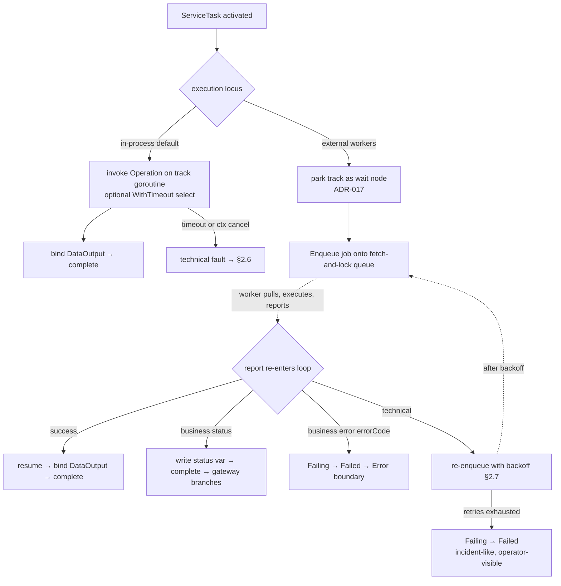
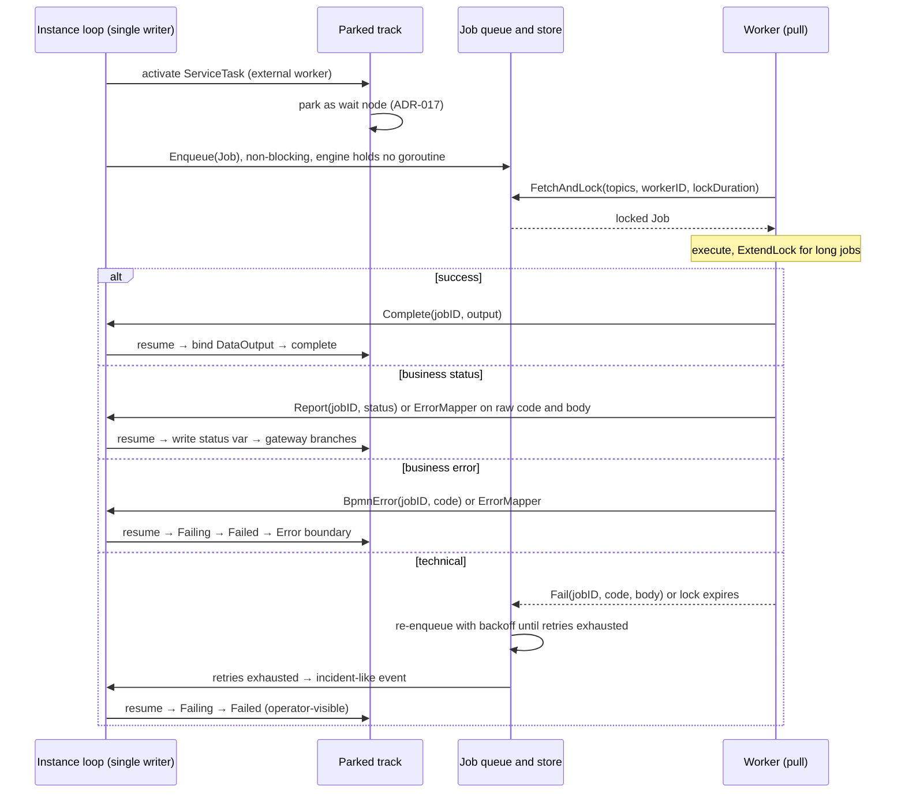

# ADR-021 — Service Task Execution Model (in-process & external workers)

| Field | Value |
|---|---|
| Status | Accepted |
| Version | v.1 |
| Date | 2026-07-05 |
| Owner | Ruslan Gabitov |
| Refines | [ADR-001 v.6 Execution Model](ADR-001-execution-model.md), [ADR-011 v.5 Process Data Flow](ADR-011-process-data-flow.md), [ADR-017 v.1 Channel-Based Event Processing](ADR-017-channel-based-event-processing.md) §2, [ADR-018 v.1 Boundary Events & Activity Interruption](ADR-018-boundary-events-and-activity-interruption.md), [ADR-020 v.1 Human-Interaction Execution Model](ADR-020-human-interaction-execution-model.md), [SAD-001 v.1](SAD-001-vision-and-architecture.md) §11, §13 |

> **Accepted** — landed incrementally by its accompanying SRDs. Decides how a
> **ServiceTask** — "the primary automation primitive" — executes on gobpm's park/resume core. A ServiceTask
> has **two cleanly-separated execution loci**: **in-process** (the synchronous `Operation` invocation on the
> track goroutine — the default — now optionally **time-bounded and cancellable** via `WithTimeout`) and
> **external workers** (a **wait node** that **enqueues a job** onto an asynchronous, Camunda-style
> **fetch-and-lock** queue; workers **pull** the job, execute it, and **report** the outcome, which re-enters the
> instance loop and resumes the parked track). The external path is **fully asynchronous and pull-based** — this
> ADR **redefines** the `WorkerDispatcher` seam that [SAD-001 v.1 §11/§13.2](SAD-001-vision-and-architecture.md)
> reserved from a blocking dispatch into a job queue, and **revises SAD-001 §13.2** ("direct dispatch, not a
> queue" → async fetch-and-lock). It also decides how a worker's outcome is **classified** — combining the
> protocol **code and response body** via a first-class, pluggable **`ErrorMapper`** whose rules map a fault to a
> BPMN **Error** (interrupting → error chain), a **status variable** (non-interrupting → the task completes and a
> gateway branches), or a **technical** retry — with a **trust knob** (`WithWorkerTrust`) deciding whether the
> worker or the engine runs the whole policy bundle (mapping + classification + retries); retries are an
> extendable, batteries-included policy (engine-wide
> **and** per-service). Defaults are aligned **as closely as possible to Camunda 7**; every deviation is an
> explicit engine choice. The **remote transport** (HTTP/gRPC), a **durable** job store, and a first-class
> **Incident** construct are deferred (§7). Scope is 0.1.x.

---

## 1. Context & problem

BPMN gives a ServiceTask a short execution rule ([§13.3.3](../bpmn-spec/semantics/tasks.md), spec p430):

1. On activation, the referenced `Operation`'s `inMessage` is assigned from the ServiceTask's `DataInput`.
2. The `Operation` is **invoked**.
3. On completion, the ServiceTask's `DataOutput` is assigned from the `Operation`'s `outMessage`, and the task
   **completes**.
4. If the invoked service returns a **fault**, that fault is treated as an **interrupting error** and the
   activity **fails** (`Failing → Failed`) ([tasks.md](../bpmn-spec/semantics/tasks.md) §ServiceTask).

The spec deliberately leaves the *invocation mechanism* engine-defined: the `implementation` attribute is only
a string hint (`##WebService`, `##Unspecified`) for "the invocation mechanism"
([tasks.md](../bpmn-spec/semantics/tasks.md) Engine notes). Everything about *how* the operation actually runs
— in-process, remote, retried, timed-out — is a gap the engine must decide.

Four concrete problems motivate this ADR:

1. **A ServiceTask can only run one way today: synchronously, in-process, unbounded.** gobpm invokes the
   `Operation` directly on the track goroutine and blocks until it returns. That is correct for an in-process Go
   operation (a `goOperation` — a Go closure, [ADR-011 v.5](ADR-011-process-data-flow.md)), but the call has **no
   time bound and cannot be interrupted**: a hanging or non-cooperative operation wedges the track, and a
   boundary timer / instance-abort ([ADR-018 v.1](ADR-018-boundary-events-and-activity-interruption.md)) cannot
   reach it. And a ServiceTask is *the* automation primitive (epic #78) — real automation calls **out-of-process
	   workers** that finish **asynchronously**, which a blocking in-process call cannot model at all.

2. **The worker seam is reserved but unconsumed — and reserved for the wrong shape.**
   [SAD-001 v.1 §11](SAD-001-vision-and-architecture.md) reserves a `WorkerDispatcher` extension point
   (*"Remote-worker dispatch for ServiceTask / GlobalTask … default in-process (local execution — no
   dispatch)"*), and §13.2 sketches a **direct-dispatch** worker model (*"dispatches direct (not via queue)"*).
   The interface and a default in-process implementation exist and are wired into the runtime, but **nothing
   calls them**. Moreover, direct dispatch (the engine actively *pushing* work to a worker) forces the engine to
   reach every worker and — critically — holds a **live in-flight call** it cannot persist. For a workflow engine
   that aspires to durable, dehydratable instances (ADR-009), the mature model is the opposite: an
   **asynchronous job queue** the engine only *enqueues* into, that **workers pull from** (Camunda's external
   tasks, Zeebe's job workers). This ADR revisits that reservation.

3. **Real services fail in two fundamentally different ways, and BPMN only models one.** A validation rejection
   ("amount exceeds limit") is a **business** outcome the process should react to — BPMN models it as an
   `Operation`'s declared **`errorRef`** ([service-interfaces.md](../bpmn-spec/elements/service-interfaces.md)
   §Operation, `errorRef: Error 0..*`), caught by an Error boundary event / event sub-process. A connection
   reset or a timeout is a **technical** failure — transient, retryable, and *not* a process-model concern.
   Collapsing the two (fault on every timeout; retry every business rejection) is wrong in both directions. And
   a protocol status alone is often ambiguous — an HTTP `404` is usually technical but sometimes a business
   "not found" — so classification must inspect the **response body**, not just the status code.

4. **Who classifies — and do we trust the worker?** The worker has the richest context to classify its own
   failure (Camunda lets it call `handleBpmnError` vs `handleFailure`), but a shared, third-party, or generic
   worker may be untrusted, and the **process model** may need to own the interpretation uniformly. Classification
   authority is itself a decision the engine must expose.

**North star for defaults.** Where the standard is silent (retry, classification, transport, timeout), this ADR
aligns default behaviour **as closely as possible to Camunda 7**, the mature BPMN reference implementation, so
users get least-surprise semantics. Camunda 7's **external-task** pattern (fetch-and-lock + `handleBpmnError` /
`handleFailure` + job retries + incidents) is the direct analog and is the reference throughout; deliberate
deviations are flagged as engine choices (§2, §3 Engine notes).

## 2. Decision

### 2.1 A ServiceTask has **two execution loci** on one node

A ServiceTask executes in one of two modes, decided at build time. The two are **deliberately different** — we
already have a synchronous, coupled path, so the external path has no reason to imitate it:

- **In-process (default).** The `Operation` is invoked **synchronously**, binding `inMessage` from `DataInput`,
  calling the operation, binding `DataOutput` from `outMessage`, and completing. Coupled, low-latency, simple —
  the right model for a `goOperation` (an in-process Go closure) or a synchronous in-process message operation.
  Optionally **time-bounded and cancellable** via `WithTimeout` (§2.9).

- **External workers.** The ServiceTask is a **wait node**. On activation it **parks** on the same cooperative
  park/resume mechanism every event catch uses ([ADR-017 v.1](ADR-017-channel-based-event-processing.md) §2) —
  the track transitions to *wait-for-event* and **yields its goroutine**. The engine **enqueues a
  job** onto an asynchronous **fetch-and-lock queue** (§2.4); a **worker pulls** it, executes it, and **reports**
  the outcome; the report re-enters the **instance loop** as a synthetic event, is routed to the parked track,
  and the track resumes — completes (success / status) or transitions `Failing → Failed` (fault). Decoupled,
  asynchronous, and — because the engine holds no live call, only a queued job + a parked track — **durable**.

This mirrors how [ADR-020 v.1](ADR-020-human-interaction-execution-model.md) models a **UserTask**: a wait node
whose completion is an external event on a pluggable boundary. An external-worker ServiceTask is the same shape
with the "actor" being a **worker** instead of a **human** — so it **reuses** the park/resume machinery rather
than introducing new pause/resume mechanics.



### 2.2 Selection is **explicit** — `WithWorker(topic, …)`

The external-worker locus is an **opt-in** construction option on the ServiceTask; the **default is in-process**.
The standard, always-available behaviour (synchronous in-process invocation) is what you get with no option;
external workers is the relaxation you deliberately choose. `topic` names the worker job type — the key workers
**fetch-and-lock** against.

This is preferred over inferring the locus from the `Operation` kind or the BPMN `implementation` attribute:
the operational weight of running off-process argues for an **explicit, visible** decision at model-build time,
not a value silently derived from an attribute. (Standard note: BPMN leaves the mechanism engine-defined, so
selecting it via an engine option — rather than overloading the `implementation` hint — is a conformant engine
choice; see §3.)

Configuration options, and their engine-wide default forms on the Thresher (the per-service form overrides):

| Scope | Per-service option | Engine-wide default | Section |
|---|---|---|---|
| In-process | `WithTimeout(d)` | — | §2.9 |
| External | `WithWorker(topic, …)` | — | §2.4 |
| External | `WithRetryPolicy(p)` | `WithWorkerRetryPolicy(p)` | §2.7 |
| External | `WithErrorMapper(m)` | `WithWorkerErrorMapper(m)` | §2.6 |
| External | `WithOutputMapping(rules)` | — | §2.5 |
| External | `WithStatus(name, overwrite)` | — | §2.6 |
| External | `WithWorkerTrust(mode)` | `WithWorkerTrustDefault(mode)` | §2.6 |
| External | `WithLockDuration(d)` / `WithMaxLockDuration(cap)` | `WithWorkerLockDuration(d)` / `WithWorkerMaxLockDuration(cap)` | §2.4 |

### 2.3 The external-worker locus is valid **only on message-operations**

A `goOperation` is an **in-process Go closure** ([ADR-011 v.5](ADR-011-process-data-flow.md)) — it cannot be
serialized into a job and pulled by an out-of-process worker. The external-worker locus therefore requires the
operation's contract be expressed as **in/out messages** (`Operation.inMessageRef` / `outMessageRef`,
[service-interfaces.md](../bpmn-spec/elements/service-interfaces.md)). Applying `WithWorker` to a ServiceTask
whose operation is a Go functor is a **build-time error** — caught when the model is assembled, not at run time.
This falls directly out of the model: the message contract is exactly the marshallable job boundary a worker
needs; a Go closure has no such boundary.

### 2.4 The external seam is an **asynchronous job queue** — enqueue + fetch-and-lock + report

The `WorkerDispatcher` seam is **redefined** from a blocking `Dispatch(job) (result, error)` into an
**asynchronous job queue** — the Camunda external-task model:

- **Engine → queue (non-blocking).** On activation the engine calls **`Enqueue(job)`**; the job enters the **job
  store**, keyed by `topic`, and the ServiceTask **parks**. The engine holds **no goroutine and no live call** —
  only a queued job and a parked track, both of which are **persistable state**.
- **Worker ← queue (pull).** A worker long-polls **`FetchAndLock(topics, workerID, lockDuration) → [jobs]`**,
  executes the job, then **reports** exactly one outcome for it: `Complete(jobID, output)` /
  `Report(jobID, status)` / `BpmnError(jobID, code)` / `Fail(jobID, code, body[, retries])`. *What* it reports —
  a classified **verdict** (`WorkerTrusted`) vs the **raw** `{code, body}` (`EngineAuthoritative`) — depends on
  `WithWorkerTrust` (§2.6).
- **Report → loop → resume.** A report re-enters the **instance loop** (single-writer, ADR-017) as the synthetic
  completion event, is routed to the parked track, and resumes it (§2.6 decides the terminal).
- **Retry = re-enqueue with backoff** (§2.7) — a technical outcome puts the job back in the store, fetchable
  again after the policy's delay. No sleeping goroutine.
- **Worker-crash resilience = lock expiry.** A locked job whose lock expires without a report (worker died)
  becomes fetchable again — free at-least-once delivery.
- **Long jobs — `ExtendLock(jobID, workerID, newDuration)`.** A worker whose real duration isn't known upfront
  extends its lock (by `newDuration` from now) rather than let it expire mid-execution and be re-fetched
  (duplicate execution). **Holder-only** auth: `workerID` must match the current lock holder; extending a
  **foreign** or **already-expired** lock **fails** (another worker may have fetched it since). Extension is
  **allowed but bounded** — see below.

**Lock durations & the extension cap (`maxLockDuration`).** Extension must be **capped**, not unbounded: retries
count *failed attempts*, but a worker that keeps extending **never fails**, so the retry machinery cannot catch a
hung or hostile worker monopolising a job — an unbounded lock is a pure liveness hole. So a configurable
**`maxLockDuration`** (total, measured from first lock) caps extension; past the cap, `ExtendLock` is **refused**,
the lock eventually expires, and the job re-enters the queue → retry → eventually retries-exhausted →
incident-like `Failed` (§2.8). The system stays live regardless of worker behaviour. Both durations — the initial
`lockDuration` and the `maxLockDuration` cap — are **two-level policy** (engine-wide default + per-topic
override), like retry (§2.7). *(Engine choice: Camunda 7's `extendLock` is effectively unbounded, relying on
operational monitoring; gobpm caps it by default — the same footgun-avoidance rationale as the backoff-over-`PT0S`
default (§2.7). The default cap is **generous but finite**, configurable up to effectively-unbounded for callers
who want Camunda's behaviour.)*

**The interface is the contract; implementations are swappable (batteries-included default).** The job-queue
operations above (`Enqueue` / `FetchAndLock` / report / `ExtendLock`) are the **standard `WorkerDispatcher`
interface** — an extension point ([SAD-001 v.1 §11](SAD-001-vision-and-architecture.md)). gobpm ships a
**batteries-included default implementation** (`localdispatcher`): an **in-memory** job store + a **local worker
pool** that fetch-and-locks, needing zero extra infrastructure. It is *one* implementation of the interface, not
the interface itself — an embedder can supply an alternative: a **durable** store (deferred, ADR-009) for
crash-surviving queues, or a **remote** adapter exposing `FetchAndLock` / report over the wire (long-poll HTTP /
gRPC, deferred to ADR-004) for out-of-process / cross-host workers. The **engine side is identical** across all
three — it only ever `Enqueue`s and consumes reports. The wire protocol and durable store are out of scope here.

**Engine choice — fetch-and-lock (pull), Camunda-aligned. Revises SAD-001 §13.2.** This ADR **reverses** the
reserved direct-dispatch ("not a queue") model of
[SAD-001 v.1 §13.2](SAD-001-vision-and-architecture.md) in favour of Camunda 7's external-task fetch-and-lock,
because pull is strictly better for gobpm's goals: (a) **decoupling** — the engine never needs to reach or
address a worker; (b) **dehydration** — with no held goroutine, a process waiting on a worker is fully
persistable (the job sits in the store, the track is parked), directly enabling ADR-009 rather than fighting it;
(c) **retry-as-re-enqueue** and **crash-resilience-as-lock-expiry** fall out for free; (d) **back-pressure** —
workers fetch when ready, the queue buffers bursts. The parent-doc §13.2 edit is surfaced separately for
approval (SAD is the parent; the ADR drives the change upward).

### 2.5 `Job` ↔ `Operation` marshalling — the operation is the contract

The `Operation` still defines the **contract** (its in/out messages and declared errors); the external locus
swaps the **executor**, not the contract. The `Job` carries:

- **`Job.Input`** — the bound **input message** item (the `Operation`'s `inMessage`, populated from the
  ServiceTask's `DataInput`s, exactly as the in-process path binds it before invocation).
- **`Job.Type`** — the **topic** from `WithWorker(topic)` (the fetch key).
- **`Job.ID`** — a stable per-execution identifier (instance + track + node), the worker's **idempotency key**
  (§6) — re-enqueue and at-least-once fetch mean a worker may see the same job twice.
- **`Job.Policy`** *(shipped only under `WorkerTrusted`, §2.6)* — the **policy bundle** the worker runs itself:
  the `ErrorMapper` rules, the `WithOutputMapping` rules, and the `RetryPolicy`. **Empty under
  `EngineAuthoritative`**, where the worker returns the raw `{code, body}` and the engine applies the policy.

The policy is **resolved at enqueue** (from the per-service config, or the engine default in effect then). The
**locked-job view** a worker gets from `FetchAndLock` wraps the `Job` with its **lock deadline** (and the holding
`workerID`); the worker calls `ExtendLock` before it (§2.4). Everything else stays on the **engine-side job
record** and never crosses to the worker: the **lock state** (holder, expiry, `lockDuration`, `maxLockDuration`)
and — under `EngineAuthoritative` — the per-job **retry state** (attempt count; under `WorkerTrusted` the worker
owns retry accounting within its lock). The security property holds: an `EngineAuthoritative` (untrusted) worker
**never** sees the policy and cannot influence how the engine classifies or retries its outcome. The only retry
lever a worker may supply is an optional `retries` override on a `Fail` report (the Camunda
`handleFailure(retries)` analog, §2.4) — a report parameter, not a `Job` field.

**Output mapping — response body → `DataOutput`.** On a `Complete`, the worker's result must land in the
ServiceTask's `DataOutput`. If the worker returns data **already shaped as the `Operation`'s `outMessage`** (e.g.
a Go worker that constructs it), reconciliation is **direct** — `outMessage` → `DataOutput`, the same path the
in-process invocation uses on completion. But a **generic worker returns a raw response body** (JSON for REST)
whose shape does not match `outMessage`; extracting the needed fields requires a mapping. An optional
**`WithOutputMapping`** declares rules `{ body-path → output variable }` (e.g. `$.data.id → orderId`,
`$.data.status → orderStatus`) that extract from the response body into the `outMessage` / `DataOutput`. This is
the **success-path twin of the `ErrorMapper`** (§2.6): both read the response body through the **same** path
mechanism — **JSONPath for HTTP/JSON (deferred to ADR-004), gobpm expressions in-process** — one to *shape the
output*, the other to *classify a fault*. Absent a mapping, the worker's `Complete` payload is taken as the
`outMessage` directly (it must match the shape); a **required** output path the response does not satisfy is a
**fault** (the worker's response violated the contract → technical, §2.6). The marshalling boundary is precisely
the message contract SAD-001 §13.2 relies on ("inputs bounded by the activity's DataInputs, not the full instance
context"). *(The input side is symmetric: `Job.Input` is the bound `inMessage` above; a request-shaping input
mapping for a generic HTTP adapter rides with the transport — ADR-004.)*

**The Operation's executor is ignored when worker-dispatched.** Because the worker performs the work, the
Operation's in-process **executor** (a message operation's `Implementor` body) is **never invoked** — and a
present one is **silently ignored, not a build error**. The Operation contributes **only its contract** (in/out
messages, `errorRef`). This is deliberate: the *same* `Operation` definition can serve **either** locus — run
in-process, or hand its contract to a worker — without a separate declaration, and a modeler can attach a
`WithWorker` topic to an already-executable ServiceTask to move it off-process, its `Implementor` simply going
dormant. (A `goOperation` remains rejected at build time per §2.3: its executor *is* its contract — a Go closure
with no separable, shippable message boundary — so there is nothing to hand off.)

### 2.6 Outcome classification — **business** vs **technical**, by **code + body** (Camunda-faithful)

A worker outcome resolves to one of **four kinds**. A fault is **not** a bare Go `error` — it is a **structured
outcome** carrying a **`code`** (a protocol/domain status — e.g. an HTTP status, once a remote transport exists)
and a **`body`** (the response payload). Classification (evaluated when the **report** arrives — no goroutine)
decides which:

- **Success** — the worker `Complete`s with a result; it is bound to `DataOutput` and the task completes.

- **Business Error** *(interrupting)* — a declared, model-relevant failure the process handles as an
  **exception**. BPMN models these as the `Operation`'s **`errorRef`** Errors
  ([service-interfaces.md](../bpmn-spec/elements/service-interfaces.md), `errorRef: Error 0..*`); the engine
  raises the mapped **BPMN Error** (errorCode) — an **interrupting** error that transitions the activity
  `Failing → Failed` and propagates on the standard error-handling chain (up the scope chain to a matching Error
  **boundary event** / **event sub-process**, unresolved → abort;
  [event-handling.md](../bpmn-spec/semantics/event-handling.md) §1, §11; handled per
  [ADR-018 v.1](ADR-018-boundary-events-and-activity-interruption.md)). Never retried — a deterministic model
  outcome. The mapped `errorCode` **should correspond to one of the `Operation`'s declared `errorRef` Errors** so
  a boundary event can catch it.

- **Business Status** *(non-interrupting)* — a business-relevant outcome the process handles as **normal flow**,
  not an exception. The engine writes a **status variable** into the task's scope and the task **completes
  normally** (`Completing → Completed`, tokens emitted on the outgoing flows); a downstream **exclusive gateway**
  reads the variable and branches. This is the Camunda-Connector "response-mapping → variable → gateway" idiom —
  the right choice for *expected* variations (e.g. "not found → create it") that belong in the main flow rather
  than on a boundary. The variable is named by **`WithStatus`** (below). Writing a data output and completing is
  standard ServiceTask completion (`DataOutput` assignment, [tasks.md](../bpmn-spec/semantics/tasks.md)
  §ServiceTask); only the mapper *deciding* the value is the engine addition. Never retried.

- **Technical fault** — a transient infrastructure failure (timeout, connection reset, unregistered topic, an
  in-process `WithTimeout` expiry). It feeds the **retry policy** (§2.7).

**Why classification needs the body, not just the code.** A status code alone is **ambiguous**. An HTTP `404`
is *usually* technical (a wrong route/endpoint), but sometimes means *"the business entity you asked for does
not exist"* — a legitimate **business** outcome a process gate should branch on. The two are only
distinguishable by inspecting the **response body**:

> **Worked contrast.** `code = 404` **and** body `$.type == "NOT_FOUND"` can map either way, the modeler's
> choice: → **Business Status** `SetStatus("NOT_FOUND")` (task completes → an exclusive gateway routes to a
> "create it" branch in the main flow) **or** → **Business Error** `ResourceNotFound` (Error boundary → an
> exception path). `code = 409` `$.type == "CONFLICT"` → **Business Error** `ResourceConflict`. `code = 500`
> (unmatched) → **technical** → retry.

**The `ErrorMapper` rule model.** A rule matches on the **`code`** and/or a **predicate over the `body`**, and
yields one **outcome**:

```
ErrorMapper = ordered [ rule ]                         // first match wins
rule    = match(code, bodyClause?) -> outcome
outcome = BpmnError{ code, message? }                  // Business Error  (interrupting -> ADR-018 chain)
        | Status{ value }                              // Business Status (value written to the WithStatus var)
        | Technical                                    // -> retry policy (also the implicit default)
```

`value` is a **literal** (e.g. `"NOT_FOUND"`) or **body-extracted** (a path over `body` — the same predicate
mechanism; JSONPath for HTTP/JSON, per the deferral below). A **pluggable custom `ErrorMapper`** interface
covers imperative cases the rule list can't express.

**Who runs mapping & retries — `WithWorkerTrust(mode)` (the trust knob).** This one setting governs **where the
whole policy bundle executes** — output mapping (§2.5), fault classification, and retries (§2.7) — turning the
two modes into two protocols:

- **`WorkerTrusted`** *(default, Camunda-aligned)* — the engine ships the policy to the worker (§2.5); the worker
  maps its output, **classifies its own faults** (`BpmnError(code)` = `handleBpmnError`, `Report(status)` = a
  status, `Fail(...)` = `handleFailure`/technical), **retries technical faults internally** (§2.7), and reports
  only a **final verdict**. The engine `ErrorMapper` is a **fallback** the worker applies to raw/unclassified
  faults. Fewest round-trips.
- **`EngineAuthoritative`** — the worker gets **no policy** and returns the **raw** `{code, body}`; the **engine**
  runs the `ErrorMapper` (sole authority) and `WithOutputMapping`, and manages retries by **re-enqueue** (§2.7).
  For untrusted / third-party / generic workers where the **process model** must own interpretation; the worker's
  self-classification, if any, is **ignored**.

Classification precedence (`WorkerTrusted`): **explicit worker classification** > **`ErrorMapper`** over the raw
`{code, body}` > **default technical**. (`EngineAuthoritative`: `ErrorMapper` then default technical.) Default
technical matches Camunda 7 — an unhandled delegate exception decrements job retries; business outcomes must be
*explicitly* signalled, never inferred.

**Honest limit — authority ≠ honesty.** `EngineAuthoritative` stops a misbehaving worker from *deciding* the
classification, but cannot stop one that **lies about the raw `{code, body}`** (fakes a `200`/success).
Defending against that needs **output validation / schemas** on the worker's raw claims — a separate concern,
deferred (§7), not overclaimed here.

**`WithStatus(statusName string, overwrite bool)` — the status variable.** A `Status` outcome writes into the
single task-scoped variable named by this option. **`overwrite = false`** (default): if a variable named
`statusName` **already exists** in the task's scope when the `Status` outcome fires, the write is a **runtime
fault** (`Failing → Failed` with a collision diagnostic) — never a silent clobber. **`overwrite = true`**:
**upsert** — overwrite the existing variable or create it. A rule that yields `Status` on a ServiceTask with
**no** `WithStatus` configured is a **build-time error** (validate the public surface — a `Status` outcome has
nowhere to write otherwise).

Like the retry policy (§2.7), the `ErrorMapper` and `WithWorkerTrust` are configured **two-level**: an
**engine-wide default** and a **per-service override** (see the §2.2 table).

**Engine choice — mappers are bound to a *protocol binding*; JSON/HTTP-REST is the batteries-included one.** The
mapper *abstraction* (a rule matches `code` + a predicate over `body`) is fixed here and **shared** by the
`ErrorMapper` and `WithOutputMapping` (§2.5). But the **concrete body-analysis is protocol-bound** — a
`(body format, path language)` pair that only makes sense for a given transport: **JSONPath over a JSON body** is
meaningful for HTTP/REST, **not universal**. Per the same **batteries-included** principle as the default
`localdispatcher` (§2.4) and the stock `RetryPolicy` impls (§2.7), gobpm ships a **default HTTP/REST binding**
(JSON body + JSONPath + HTTP-status semantics) — delivered **with the HTTP transport adapter in ADR-004**, the
protocol that actually produces such bodies. In the in-process `localdispatcher` (0.1.x) the binding is
**Go values + gobpm's expression mechanism** (no JSON/JSONPath); ADR-004 plugs the HTTP/REST binding into this
ready seam. An embedder can implement a binding for any other protocol.

### 2.7 Retry policy — extendable, batteries-included, two-level (Camunda-faithful)

Retries apply to **technical faults only** (worker `Fail` / unclassified faults / in-process `WithTimeout`
expiry). A **`RetryPolicy`** abstraction decides, given the attempt count and the technical error, whether to
retry and the backoff delay before the next attempt:

- **Extendable** — `RetryPolicy` is an interface an embedder can implement for custom strategies.
- **Batteries-included implementations** — at least `NoRetry`, `FixedDelay(maxAttempts, delay)`, and
  `ExponentialBackoff(maxAttempts, base, max, jitter)`.
- **Default policy — 3 attempts, exponential backoff with jitter.** The **count of 3** matches Camunda 7's
  `defaultNumberOfRetries`. *(Engine choice: Camunda 7's default retry has **no** wait between attempts
  (`R3/PT0S`) and relies on `retryTimeCycle` for backoff; gobpm defaults to exponential-backoff-with-jitter
  because a zero-wait retry storm is a well-known footgun — a mild, deliberate improvement over the raw Camunda
  default, still trivially overridable.)*
- **Two configuration levels** — engine-wide `WithWorkerRetryPolicy(p)` default, `WithWorker(topic,
  WithRetryPolicy(p))` per-service override.

**Retry mechanism — trust-dependent (§2.6).** Under **`EngineAuthoritative`** a technical outcome **re-enqueues**
the job with the policy's backoff (Camunda's job-retry model): no sleeping goroutine, the parked track stays
parked, only the terminal outcome reaches the loop. Under **`WorkerTrusted`** the worker retries **internally** —
holding and extending its lock (§2.4, bounded by `maxLockDuration`), backing off in-process — and reports only
after its own retries succeed or exhaust, eliminating re-enqueue / re-fetch round-trips. **Retry ownership is
exclusive per mode, never both:** a `WorkerTrusted` worker's terminal fail *after* internal exhaustion is treated
as retries-exhausted (§2.8), not re-enqueued again. Either way the engine holds no live call — a re-enqueued or a
locked-and-being-retried job, plus a parked track, are both persistable.

### 2.8 Retries-exhausted → **incident-like `Failed`** (Camunda-faithful); Incident deferred

When the retry policy is exhausted, the ServiceTask transitions `Failing → Failed` as a **terminal,
operator-visible failure** — logged and observable — and is **not** auto-raised as a catchable BPMN Error. This
aligns with Camunda 7, where exhausted retries create an **incident** (a stuck-job state for an operator to
resolve), *not* a BPMN error that flows in the model. Keeping infra exhaustion out of the BPMN error vocabulary
preserves the distinction in §2.6: the model's Error boundary events catch *business* faults; infrastructure
exhaustion is an *operational* condition.

gobpm has **no first-class Incident construct** today. A Camunda-style Incident (stuck-job registry + operator
"retry/annotate/resolve" surface, instance stays alive) is **deferred to its own future ADR** (§7). Until then,
"incident-like" means: `Failed`, with a diagnostic that identifies the exhausted job (topic, attempts, last
error) for observability.

### 2.9 In-process **timeout & cancellation** — `WithTimeout`

The in-process locus (§2.1) runs `op.Execute` synchronously on the track goroutine. `WithTimeout(d)` makes that
call **time-bounded and cancellable** without changing the locus: the track goroutine runs the operation in a
sub-goroutine and blocks on a `select`:

```
done := make(chan opResult, 1)          // buffered: the sub-goroutine can always send & exit
go func() { done <- op.Execute(ctx, re) }()
select {
case r := <-done:      // completed → bind DataOutput / classify fault
case <-ctx.Done():     // boundary interrupt / instance abort — the track can now react
case <-time.After(d):  // timeout → technical fault (§2.6 → retry policy §2.7)
}
```

This gives the in-process operation the **cancellation + timeout** it lacks today, and makes it
**boundary-interruptible** even when the operation ignores `ctx`. A timeout is a **technical fault** — the same
classification/retry machinery as a worker timeout, so both loci share one timeout story.

**Honest limit — Go cannot kill a goroutine.** The `select` bounds *the track's* wait, **not the operation's
execution**. A non-cooperative operation (one that ignores `ctx`) keeps running in its leaked sub-goroutine until
it eventually returns — or forever. Consequences, stated plainly:

- The wrapper protects **the engine** (the track moves on, stays responsive) at the cost of a **possibly-leaked
  goroutine**; true cancellation still requires the operation to honour `ctx`.
- The leaked goroutine's **return is safely dropped** (buffered channel). Operations **must confine their effects
  to the returned output** (which the track binds via `re.Put`) — a leaked goroutine mutating the scope directly
  after a timeout would race the track. This is a contract on operation authors.
- **Retry caveat** — retrying a timed-out in-process operation spawns *another* sub-goroutine; a non-cooperative
  operation under retry can leak several. In-process timeouts should lean toward *fault* over aggressive retry.

**Default — no timeout** (opt-in). Camunda in-process delegates run to completion in the transaction; the
Camunda-aligned default is unbounded. `WithTimeout(d)` is the deliberate opt-in; without it, behaviour is exactly
as today. (For fan-out over *multiple* operations a `sync.WaitGroup` would fit — but a ServiceTask has one
operation; multi-instance/parallel is a separate future feature.)

### 2.10 Summary of the external-worker lifecycle



## 3. Standard grounding

Every standard-claim below is verified against the vendored BPMN 2.0 extract and cited by section
(project rule: standard-claims cited, not asserted from memory).

- **ServiceTask execution rule** — bind `inMessage` from `DataInput` → invoke `Operation` → bind `DataOutput`
  from `outMessage` → complete ([tasks.md](../bpmn-spec/semantics/tasks.md) §ServiceTask, §13.3.3).
- **Fault = interrupting error → `Failing → Failed`** — "If the invoked service returns a fault, that fault is
  treated as an interrupting error and the activity fails"
  ([tasks.md](../bpmn-spec/semantics/tasks.md) §ServiceTask). Faults follow the standard error-handling chain —
  boundary error events, error event sub-processes, or unhandled propagation up the parent chain
  ([tasks.md](../bpmn-spec/semantics/tasks.md) §"Faults during execution").
- **Operation declares its errors** — `Operation.errorRef: Error 0..*`
  ([service-interfaces.md](../bpmn-spec/elements/service-interfaces.md) §Operation). This is the standard basis
  for the *business-fault → BPMN Error* mapping (§2.6).
- **Error propagation semantics** — Errors are *critical*: they suspend execution at the throw location and
  propagate **upward to the innermost enclosing scope** with a catching Event; no match → *unresolved* →
  typically abort ([event-handling.md](../bpmn-spec/semantics/event-handling.md) §1). Error boundary events are
  **always interrupting** ([event-handling.md](../bpmn-spec/semantics/event-handling.md) §4).
- **Invocation mechanism is engine-defined** — the `implementation` attribute is only a hint
  ([tasks.md](../bpmn-spec/semantics/tasks.md) Engine notes). Selecting in-process vs external-worker via an
  explicit engine option (§2.2) is therefore a conformant engine choice.

**Engine notes (deliberate deviations / additions — not from the standard).**

- **Transport, retry, classification, and timeout are NOT in BPMN.** BPMN models only the business fault
  (`errorRef`). The job queue, technical-vs-business classification, retry policy, mapping authority, and
  in-process timeout are engine extensions, reserved by
  [SAD-001 v.1 §11/§13.2](SAD-001-vision-and-architecture.md). Defaults follow Camunda 7 (§1, §2.4–§2.9).
- **Fetch-and-lock (pull), Camunda-aligned — revises SAD-001 §13.2** (was "direct dispatch, not a queue"): §2.4.
- **`ExtendLock` is capped** by a configurable `maxLockDuration` (generous-finite default), deviating from
  Camunda 7's effectively-unbounded `extendLock` — a liveness guard against a worker monopolising a job — §2.4.
- **Default retry adds backoff** over Camunda 7's `PT0S` default — §2.7.
- **Mappers are protocol-bound; the batteries-included HTTP/REST binding rides with ADR-004.** ADR-021 fixes the
  generic mapper abstraction (a rule = `code` + a body-predicate), shared by `ErrorMapper` and `WithOutputMapping`;
  the concrete `(JSON body + JSONPath + HTTP-status)` binding is the default **HTTP/REST** implementation, arriving
  with the HTTP transport adapter — §2.5, §2.6.
- **`WithWorkerTrust` default `WorkerTrusted`** — the worker runs the whole policy bundle (output mapping,
  classification, internal retries; Camunda `handleBpmnError` / `handleFailure`); `EngineAuthoritative` moves the
  bundle engine-side (raw `{code, body}` back) for untrusted workers — §2.5, §2.6, §2.7.
- **In-process `WithTimeout` is opt-in** (default unbounded, Camunda-aligned); it bounds the track, not the
  operation (Go cannot kill a goroutine) — §2.9.
- **Retries-exhausted is incident-like, Incident construct deferred** — §2.8.

## 4. Alternatives considered

| # | Decision | Alternatives | Chosen — why |
|---|---|---|---|
| 1 | Locus selection | (a) explicit `WithWorker` option; (b) inferred from operation kind; (c) from the `implementation` attribute | **(a)** — running off-process is operationally weighty; the choice should be explicit and visible at build time, not silently derived. |
| 2 | External transport model | (a) **async job queue / fetch-and-lock (pull)**; (b) direct dispatch (push) — the engine calls the worker; (c) push wrapped in an engine goroutine for async | **(a)** — pull decouples (no worker addressing), is **dehydration-friendly** (no held goroutine — a worker-waiting process is persistable, enabling ADR-009), and gives retry-as-re-enqueue + crash-resilience-as-lock-expiry for free. (b)/(c) hold a live call the engine can't persist. **Reverses SAD-001 §13.2.** |
| 3 | Execution-path shape | (a) full async wait node (park + resume on report); (b) synchronous dispatch on the track goroutine | **(a)** — workers complete asynchronously; only a wait node models that, and it reuses the ADR-017 / ADR-020 park machinery. |
| 4 | Retry location & mechanism | (a) engine-level policy, **re-enqueue** with backoff; (b) model retries in the process graph; (c) sleep in a per-job goroutine | **(a)** — retries are infra, not model concern; re-enqueue needs no held goroutine and is persistable. |
| 5 | Fault handling | (a) classify business vs technical; (b) treat every fault as a BPMN error | **(a)** — retrying a deterministic business rejection is wrong; faulting on a transient timeout is equally wrong. |
| 6 | Business/technical signalling | (a) worker self-classifies **and** a first-class declarative `ErrorMapper` on **code + body**; (b) worker only; (c) engine `ErrorMapper` only | **(a)** — a status code alone is ambiguous (`404` = technical *or* business "not found"); disambiguation needs code+body. Both loci of classification exist; `WithWorkerTrust` picks which is authoritative. |
| 7 | Worker trust (`WithWorkerTrust`) | (a) optioned — `WorkerTrusted` default / `EngineAuthoritative`, governing **where the whole policy bundle runs** (output mapping + classification + retry); (b) always trust; (c) always engine | **(a)** — trust is a per-service boundary. `WorkerTrusted` ships the policy to the worker (mapping + internal retries → fewest round-trips, Camunda external-task model); `EngineAuthoritative` keeps the whole bundle engine-side (raw `{code, body}` back) for untrusted / generic / remote workers. |
| 8 | Error-mapper layering | (a) mapper **abstraction** in ADR-021, HTTP-status + JSONPath binding in ADR-004; (b) full JSONPath mapper in 0.1.x | **(a)** — protocol `code` + response `body` are transport-specific; fix the generic mapper now, bind HTTP + JSONPath with its transport. |
| 9 | Mapper outcome kinds | (a) `BpmnError` \| `Status`-variable \| `Technical`; (b) `BpmnError` \| `Technical` only | **(a)** — a fault is often an *expected* variation better modeled as normal flow + a gateway than an interrupting Error event (Camunda-Connector idiom). `WithStatus(name, overwrite)` names the variable with a no-silent-clobber guard. |
| 10 | In-process controllability | (a) opt-in `WithTimeout` (`select` wrapper — cancellation + timeout); (b) always synchronous, unbounded | **(a)** — bounds a hanging op and makes it boundary-interruptible; default stays unbounded (Camunda-aligned). Honest limit: bounds the track, not the op (Go can't kill a goroutine). |
| 11 | Retries-exhausted terminal | (a) incident-like `Failed` (Camunda); (b) auto-raise a catchable engine errorCode | **(a)** — Camunda 7 creates an incident, not a model-flow error; keeps infra failure out of the BPMN vocabulary. |
| 12 | Lock-extension bounding | (a) `ExtendLock` **bounded** by a configurable `maxLockDuration` cap (generous-finite default); (b) unbounded extension (Camunda) | **(a)** — retries count *failed attempts*, but an extending worker never fails, so unbounded extension is a liveness hole the retry machinery can't catch; a cap guarantees the job eventually re-enters the queue. Mild deviation from Camunda's unbounded `extendLock` (same footgun rationale as backoff-over-`PT0S`). |

## 5. Consequences

**Positive.**

- The `WorkerDispatcher` seam ([SAD-001 v.1 §11/§13.2](SAD-001-vision-and-architecture.md)) is finally
  **consumed** — ServiceTask gains a fully-async external-worker path.
- **Dehydration-friendly** — the engine holds **no live call** for a worker-waiting task, only a queued job and a
  parked track: a process awaiting a worker is **persistable**, directly enabling the ADR-009 durability story
  instead of blocking it. (This is the decisive win over the push model.)
- **Free operational properties** — retry = re-enqueue with backoff; worker-crash resilience = lock expiry;
  back-pressure / load-leveling = the queue buffers bursts; no worker addressing.
- **No new pause/resume machinery** — reuses the ADR-017 wait-node park/resume and the ADR-020 UserTask shape.
- **Model stays clean** — retries and technical failures never appear in the process graph; business faults ride
  the ADR-018 error chain; expected variations ride a status variable + gateway.
- **Both loci controllable** — in-process gains `WithTimeout` cancellation; external is interruptible by
  construction (parked).
- **Least-surprise defaults** — behaviour tracks Camunda 7 (fetch-and-lock, worker classification, 3 retries,
  incident on exhaustion).

**Costs.**

- ServiceTask gains a **wait-node path** (park diversion, synthetic completion event, event-processor role) —
  mirroring the UserTask wait-node path ([ADR-020 v.1](ADR-020-human-interaction-execution-model.md)); more
  moving parts than a pure synchronous call.
- **A job store with lock management** is real infrastructure even in-memory: lock duration, lock expiry,
  heartbeat/`ExtendLock`, retry timing. Bigger 0.1.x surface than a handler call.
- A new **engine-reserved diagnostic vocabulary** for retries-exhausted (topic/attempts/last-error) until a
  first-class Incident exists.
- In-process `WithTimeout` can **leak a goroutine** for a non-cooperative operation (§2.9) — it bounds the track,
  not the op.

**Durability.** A worker-waiting task **is** now dehydratable in principle (queued job + parked track are
persistable state) — the pull model removes the held-goroutine blocker the push model had. What remains deferred
is a **durable** job store (in-memory in 0.1.x → durable with **ADR-009**) and in-flight in-process timeout state.

## 6. Enterprise-readiness recommendations

- **Observability.** Each enqueue, fetch, report, lock-extension, retry/re-enqueue, backoff, classification,
  lock-expiry, and terminal outcome should emit structured `slog` records and be traceable (per the project
  observability policy). Recommend metrics for queue depth per topic, in-flight (locked) jobs, per-topic attempt
  counts, lock extensions, `maxLockDuration` **cap-hits**, lock expiries, and retries-exhausted incidents.
  Repeated cap-hits on a topic are a **stuck-worker signal** — alert on them.
- **Idempotency.** Workers **must** treat **`Job.ID`** as an idempotency key — re-enqueue + at-least-once
  fetch-and-lock mean a job whose prior attempt actually completed may be delivered again.
- **Bypassed executor visibility.** A worker-dispatched ServiceTask whose Operation carries an in-process
  executor (never invoked, §2.5) should **log that the executor is bypassed** — so a modeler who wired an
  `Implementor` expecting it to run is not left guessing (accidental silence is the worse failure per the
  project observability policy).
- **Lock tuning.** `lockDuration` should exceed the expected job time; long jobs heartbeat/`ExtendLock`. Too
  short → duplicate execution; too long → slow crash recovery.
- **Timeout as the canonical technical trigger.** A per-service `WithTimeout` (in-process) or per-topic job
  timeout (external) is the primary, well-understood technical-fault source — deterministic and observable.
- **Contract testing.** The job-queue boundary and each topic's in/out message shapes should have contract tests;
  a topic with no worker ever fetching is a stuck job — surface it (queue-depth alarm).
- **Sensitive data.** `Job.Input` crosses the worker boundary — document which DataInputs may carry sensitive
  data and how a remote transport (future) must protect them. Worker **honesty** (a lying worker faking success)
  needs output validation/schemas — deferred (§2.6, §7).

## 7. Rollout plan

- **0.1.x (this ADR + its accompanying SRD).** In-process (unchanged default) **plus** `WithTimeout` cancellation/timeout;
  external workers via the in-process `localdispatcher` implementing the **in-memory job queue** (enqueue +
  fetch-and-lock + report + retry-via-re-enqueue + lock-expiry) with a local worker pool; explicit `WithWorker`
  selection; message-operation constraint; classification by **code + body** — worker self-classification **and**
  the first-class declarative `ErrorMapper` (mapping to BPMN Error / `WithStatus` status variable / technical),
  with `WithWorkerTrust` (`WorkerTrusted` default — worker runs mapping + internal retries; `EngineAuthoritative`
  moves them engine-side); extendable retry policy with the Camunda-aligned
  default; incident-like retries-exhausted terminal.
- **Deferred.**
  - **Remote transport** (HTTP long-poll / gRPC fetch-and-lock + report) **and the batteries-included HTTP/REST
    mapper binding** (`JSON body + JSONPath + HTTP-status`, shared by `ErrorMapper` / `WithOutputMapping`) → **ADR-004**
    ([SAD-001 v.1 §13.2](SAD-001-vision-and-architecture.md)).
  - **Durable job store** and dehydration of worker-waiting / in-flight-timeout tasks → with the broader
    persistence work (**ADR-009**).
  - **First-class Incident** construct (stuck-job registry + operator resolution surface) → its own future ADR.
  - **Worker output validation / schemas** (defence against a dishonest worker) → future work (§2.6 honest limit).

## 8. References

- **Upward:** [SAD-001 v.1](SAD-001-vision-and-architecture.md) §11 (extension table — `WorkerDispatcher`),
  §13.1–§13.2 (task-level remote execution, worker model — **this ADR revises §13.2** to fetch-and-lock; the
  parent-doc edit is surfaced separately for approval).
- **Sideways:** [ADR-001 v.6](ADR-001-execution-model.md) (execution model),
  [ADR-011 v.5](ADR-011-process-data-flow.md) (operation / data-flow model),
  [ADR-017 v.1](ADR-017-channel-based-event-processing.md) §2 (wait-node park/resume),
  [ADR-018 v.1](ADR-018-boundary-events-and-activity-interruption.md) (boundary error events, activity
  interruption), [ADR-020 v.1](ADR-020-human-interaction-execution-model.md) (UserTask wait-node template).
- **BPMN 2.0 (vendored extract):** [tasks.md](../bpmn-spec/semantics/tasks.md) §13.3.3 (ServiceTask semantics,
  faults), [service-interfaces.md](../bpmn-spec/elements/service-interfaces.md) (Operation, `errorRef`),
  [event-handling.md](../bpmn-spec/semantics/event-handling.md) §10.5.1/.6/.7 (error propagation, scopes;
  internal §1 propagation, §4 boundary interruption, §11 engine notes).
- **External reference for defaults:** Camunda 7 external-task model (fetch-and-lock, `handleBpmnError` /
  `handleFailure`, `defaultNumberOfRetries=3`, incidents on exhausted retries).

## Open questions

None.

## Document History

| Version | Date | Author | Change |
|---|---|---|---|
| v.1 | 2026-07-05 | Ruslan Gabitov | Initial draft — two loci: in-process (default, synchronous, optional `WithTimeout` cancellation/timeout) and external workers (a wait node that **enqueues** onto an asynchronous **fetch-and-lock** job queue; workers pull, execute, report; report resumes the parked track). Redefines the `WorkerDispatcher` seam from a blocking dispatch to a job queue and **revises SAD-001 §13.2** (direct-dispatch → fetch-and-lock) for decoupling + dehydration. Outcome classification by **code + body** (worker self-classification + a first-class declarative `ErrorMapper` → BPMN Error / `WithStatus` status variable / technical), with a `WithWorkerTrust` trust knob (`WorkerTrusted` default / `EngineAuthoritative`) governing where the whole policy bundle (output mapping + classification + retry) runs — shipped to the worker (fewest round-trips, internal retries) or kept engine-side; JSONPath/HTTP binding deferred to ADR-004. Extendable retry policy (Camunda-aligned default 3× + backoff, retry = re-enqueue or worker-internal per trust). Incident-like retries-exhausted terminal. Remote transport, durable job store, first-class Incident, and worker output-validation deferred. |
