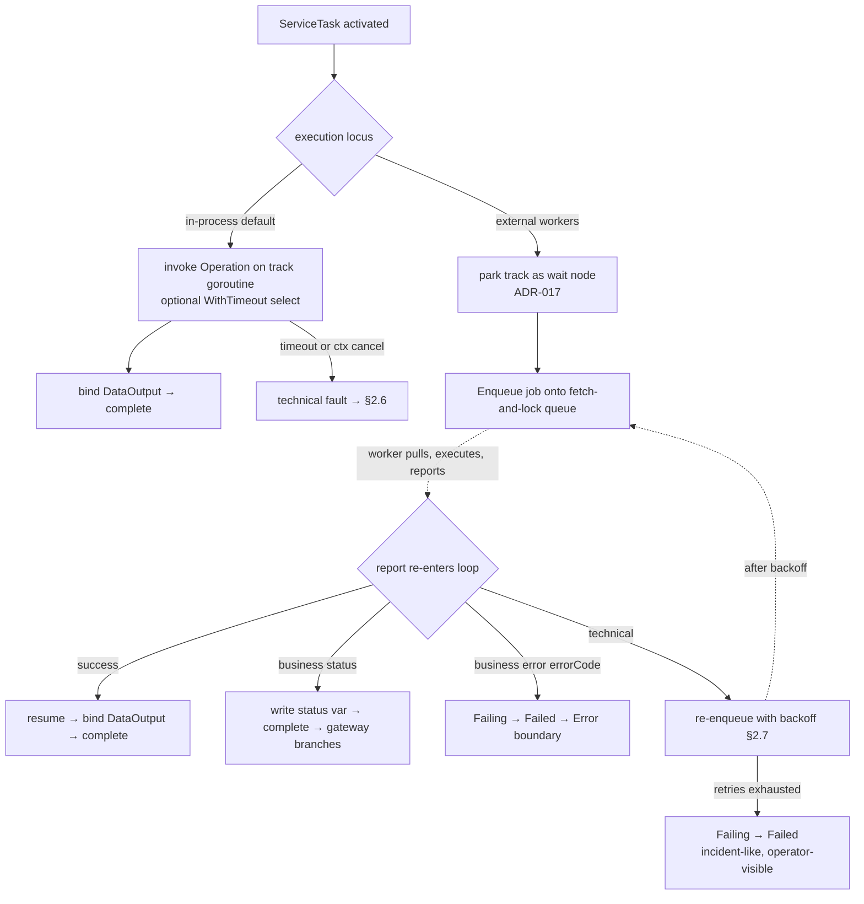
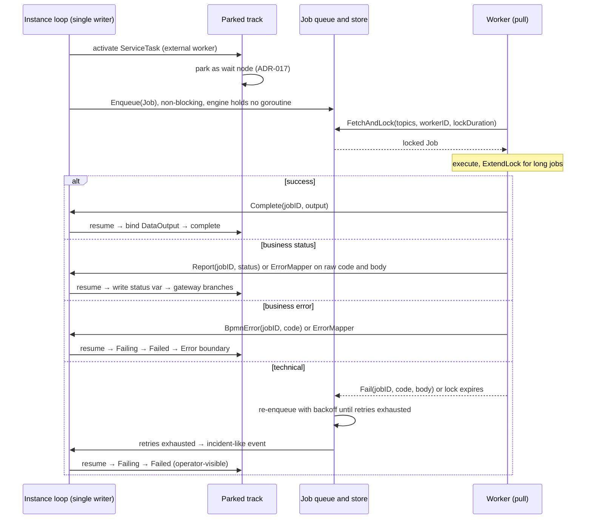

# ADR-021 — Service Task Execution Model (in-process & external workers)

| Поле | Значение |
|---|---|
| Статус | Принято |
| Версия | v.1 |
| Дата | 2026-07-05 |
| Владелец | Руслан Габитов |
| Уточняет | [ADR-001 v.6 Execution Model](ADR-001-execution-model.md), [ADR-011 v.5 Process Data Flow](ADR-011-process-data-flow.md), [ADR-017 v.1 Channel-Based Event Processing](ADR-017-channel-based-event-processing.md) §2, [ADR-018 v.1 Boundary Events & Activity Interruption](ADR-018-boundary-events-and-activity-interruption.md), [ADR-020 v.1 Human-Interaction Execution Model](ADR-020-human-interaction-execution-model.md), [SAD-001 v.1](SAD-001-vision-and-architecture.md) §11, §13 |

> EN-оригинал — канонический: [ADR-021-service-task-execution-model.md](ADR-021-service-task-execution-model.md). Этот файл — его перевод (twin).

> **Принято** — приземляется инкрементально сопровождающими её SRD. Решает, как
> **ServiceTask** — «первичный примитив автоматизации» — выполняется на park/resume-ядре gobpm. У ServiceTask
> **два чисто разделённых локуса выполнения**: **in-process** (синхронный вызов `Operation` на goroutine
> трека — по умолчанию — теперь опционально **ограниченный по времени и отменяемый** через `WithTimeout`) и
> **внешние воркеры** (**wait-node**, который **ставит задание в очередь** — асинхронную, в стиле Camunda
> **fetch-and-lock** — очередь; воркеры **забирают** задание, выполняют его и **докладывают** исход, который
> заново входит в loop инстанса и возобновляет запаркованный трек). Внешний путь **полностью асинхронный и
> pull-based** — этот ADR **переопределяет** seam `WorkerDispatcher`, который
> [SAD-001 v.1 §11/§13.2](SAD-001-vision-and-architecture.md) зарезервировал, из блокирующего диспатча в
> очередь заданий, и **пересматривает SAD-001 §13.2** («прямой диспатч, не очередь» → асинхронный
> fetch-and-lock). Он также решает, как исход воркера **классифицируется** — комбинируя протокольный **code и
> тело ответа** через first-class, подключаемый **`ErrorMapper`**, чьи правила отображают ошибку в BPMN
> **Error** (прерывающий → цепочка error), **status-переменную** (непрерывающий → задача завершается и gateway
> ветвится) или **технический** ретрай — с **ручкой доверия** (`WithWorkerTrust`), решающей, кто — воркер или
> движок — прогоняет весь бандл политики (mapping + классификация + ретраи); ретраи — это расширяемая,
> batteries-included политика (engine-wide **и** per-service). Дефолты выровнены **как можно ближе к
> Camunda 7**; каждое отклонение — это явный выбор движка. **Удалённый транспорт** (HTTP/gRPC), **durable**
> job-store и first-class конструкт **Incident** отложены (§7). Область — 0.1.x.

---

## 1. Контекст и проблема

BPMN даёт ServiceTask короткое правило выполнения ([§13.3.3](../bpmn-spec/semantics/tasks.md), spec p430):

1. При активации `inMessage` референсируемой `Operation` присваивается из `DataInput` ServiceTask.
2. `Operation` **вызывается**.
3. По завершении `DataOutput` ServiceTask присваивается из `outMessage` `Operation`, и задача
   **завершается**.
4. Если вызванный сервис возвращает **fault**, этот fault трактуется как **прерывающая ошибка**, и activity
   **проваливается** (`Failing → Failed`) ([tasks.md](../bpmn-spec/semantics/tasks.md) §ServiceTask).

Спецификация намеренно оставляет *механизм вызова* engine-defined: атрибут `implementation` — лишь строковая
подсказка (`##WebService`, `##Unspecified`) для «механизма вызова»
([tasks.md](../bpmn-spec/semantics/tasks.md) Engine notes). Всё о том, *как* операция реально выполняется —
in-process, удалённо, с ретраями, с таймаутом — это пробел, который движок должен решить.

Четыре конкретные проблемы мотивируют этот ADR:

1. **Сегодня ServiceTask может выполняться лишь одним способом: синхронно, in-process, без ограничений.** gobpm
   вызывает `Operation` прямо на goroutine трека и блокируется до её возврата. Это корректно для in-process
   Go-операции (`goOperation` — Go-замыкание, [ADR-011 v.5](ADR-011-process-data-flow.md)), но у вызова **нет
   ограничения по времени, и его нельзя прервать**: зависшая или некооперативная операция заклинивает трек, а
   граничный таймер / abort инстанса ([ADR-018 v.1](ADR-018-boundary-events-and-activity-interruption.md)) не
   может до неё дотянуться. А ServiceTask — это *главный* примитив автоматизации (эпик #78) — реальная
   автоматизация вызывает **out-of-process воркеров**, которые завершаются **асинхронно**, что блокирующий
   in-process-вызов вообще не может смоделировать.

2. **Worker-seam зарезервирован, но не задействован — и зарезервирован под неправильную форму.**
   [SAD-001 v.1 §11](SAD-001-vision-and-architecture.md) резервирует точку расширения `WorkerDispatcher`
   (*«Remote-worker dispatch for ServiceTask / GlobalTask … default in-process (local execution — no
   dispatch)»*), а §13.2 набрасывает модель воркера с **прямым диспатчем** (*«dispatches direct (not via
   queue)»*). Интерфейс и дефолтная in-process-реализация существуют и подключены в рантайм, но **их никто не
   вызывает**. Более того, прямой диспатч (движок активно *пушит* работу воркеру) вынуждает движок дотягиваться
   до каждого воркера и — критически — удерживает **живой in-flight-вызов**, который нельзя персистировать. Для
   workflow-движка, стремящегося к durable, дегидрируемым инстансам (ADR-009), зрелая модель противоположна:
   **асинхронная очередь заданий**, в которую движок лишь *enqueue*'ит и из которой **воркеры забирают**
   (external tasks у Camunda, job workers у Zeebe). Этот ADR пересматривает ту резервацию.

3. **Реальные сервисы отказывают двумя фундаментально разными способами, а BPMN моделирует лишь один.** Отказ
   валидации («сумма превышает лимит») — это **бизнес**-исход, на который процесс должен отреагировать — BPMN
   моделирует его как объявленный у `Operation` **`errorRef`**
   ([service-interfaces.md](../bpmn-spec/elements/service-interfaces.md) §Operation, `errorRef: Error 0..*`),
   перехватываемый Error-граничным событием / event sub-process. Сброс соединения или таймаут — это
   **технический** отказ — транзиентный, ретраибельный и *не* забота процессной модели. Схлопывание этих двух
   (fault на каждый таймаут; ретрай на каждый бизнес-отказ) неверно в обе стороны. И один протокольный статус
   часто неоднозначен — HTTP `404` обычно технический, но иногда бизнес-«не найдено» — поэтому классификация
   должна инспектировать **тело ответа**, а не только код статуса.

4. **Кто классифицирует — и доверяем ли мы воркеру?** У воркера богатейший контекст, чтобы классифицировать
   собственный отказ (Camunda позволяет ему вызвать `handleBpmnError` vs `handleFailure`), но общий, сторонний
   или generic-воркер может быть недоверенным, и **процессной модели** может понадобиться единообразно владеть
   интерпретацией. Полномочие классификации само по себе — решение, которое движок должен выставить наружу.

**Ориентир для дефолтов.** Там, где стандарт молчит (ретрай, классификация, транспорт, таймаут), этот ADR
выравнивает поведение по умолчанию **как можно ближе к Camunda 7**, зрелой референсной реализации BPMN, чтобы
пользователи получили семантику наименьшего удивления. Паттерн **external-task** Camunda 7 (fetch-and-lock +
`handleBpmnError` / `handleFailure` + job-ретраи + инциденты) — прямой аналог и референс на всём протяжении;
намеренные отклонения помечены как выборы движка (§2, §3 Engine notes).

## 2. Решение

### 2.1 У ServiceTask **два локуса выполнения** на одном узле

ServiceTask выполняется в одном из двух режимов, решаемом на этапе сборки. Эти два **намеренно различны** — у
нас уже есть синхронный, связанный путь, так что внешнему пути незачем ему подражать:

- **In-process (по умолчанию).** `Operation` вызывается **синхронно**, биндя `inMessage` из `DataInput`,
  вызывая операцию, биндя `DataOutput` из `outMessage` и завершаясь. Связанно, низколатентно, просто —
  правильная модель для `goOperation` (in-process Go-замыкание) или синхронной in-process message-операции.
  Опционально **ограниченно по времени и отменяемо** через `WithTimeout` (§2.9).

- **Внешние воркеры.** ServiceTask — это **wait-node**. При активации она **паркуется** на том же
  кооперативном механизме park/resume, что использует каждый catch события
  ([ADR-017 v.1](ADR-017-channel-based-event-processing.md) §2) — трек переходит в *wait-for-event* и
  **уступает свою goroutine**. Движок **ставит задание в очередь** — асинхронную **fetch-and-lock-очередь**
  (§2.4); **воркер забирает** его, выполняет и **докладывает** исход; доклад заново входит в **loop инстанса**
  как синтетическое событие, маршрутизируется в запаркованный трек, и трек возобновляется — завершается
  (успех / статус) или переходит в `Failing → Failed` (fault). Развязанно, асинхронно и — поскольку движок не
  держит живого вызова, только задание в очереди + запаркованный трек — **durable**.

Это зеркалит то, как [ADR-020 v.1](ADR-020-human-interaction-execution-model.md) моделирует **UserTask**:
wait-node, чьё завершение — внешнее событие на подключаемой границе. ServiceTask с внешним воркером — та же
форма, где «актором» выступает **воркер** вместо **человека** — так что она **переиспользует** машинерию
park/resume, а не вводит новую механику pause/resume.



### 2.2 Выбор **явный** — `WithWorker(topic, …)`

Локус внешнего воркера — это **opt-in** конструкционная опция на ServiceTask; **по умолчанию — in-process**.
Стандартное, всегда доступное поведение (синхронный in-process-вызов) — это то, что вы получаете без опции;
внешние воркеры — это послабление, которое вы намеренно выбираете. `topic` именует тип задания воркера — ключ,
по которому воркеры делают **fetch-and-lock**.

Это предпочтительнее вывода локуса из вида `Operation` или BPMN-атрибута `implementation`: операционный вес
выполнения off-process говорит в пользу **явного, видимого** решения на этапе сборки модели, а не значения,
молча выведенного из атрибута. (Замечание по стандарту: BPMN оставляет механизм engine-defined, поэтому выбор
его через опцию движка — а не перегрузку подсказки `implementation` — это конформный выбор движка; см. §3.)

Опции конфигурации и их engine-wide дефолтные формы на Thresher (per-service-форма переопределяет):

| Область | Per-service опция | Engine-wide дефолт | Секция |
|---|---|---|---|
| In-process | `WithTimeout(d)` | — | §2.9 |
| Внешний | `WithWorker(topic, …)` | — | §2.4 |
| Внешний | `WithRetryPolicy(p)` | `WithWorkerRetryPolicy(p)` | §2.7 |
| Внешний | `WithErrorMapper(m)` | `WithWorkerErrorMapper(m)` | §2.6 |
| Внешний | `WithOutputMapping(rules)` | — | §2.5 |
| Внешний | `WithStatus(name, overwrite)` | — | §2.6 |
| Внешний | `WithWorkerTrust(mode)` | `WithWorkerTrustDefault(mode)` | §2.6 |
| Внешний | `WithLockDuration(d)` / `WithMaxLockDuration(cap)` | `WithWorkerLockDuration(d)` / `WithWorkerMaxLockDuration(cap)` | §2.4 |

### 2.3 Локус внешнего воркера валиден **только на message-операциях**

`goOperation` — это **in-process Go-замыкание** ([ADR-011 v.5](ADR-011-process-data-flow.md)) — его нельзя
сериализовать в задание и забрать out-of-process-воркером. Локус внешнего воркера поэтому требует, чтобы
контракт операции был выражен как **in/out-сообщения** (`Operation.inMessageRef` / `outMessageRef`,
[service-interfaces.md](../bpmn-spec/elements/service-interfaces.md)). Применение `WithWorker` к ServiceTask,
чья операция — Go-функтор, это **ошибка этапа сборки** — ловится при сборке модели, а не в рантайме. Это прямо
вытекает из модели: message-контракт — ровно та маршалимая граница задания, которая нужна воркеру; у
Go-замыкания такой границы нет.

### 2.4 Внешний seam — это **асинхронная очередь заданий** — enqueue + fetch-and-lock + report

Seam `WorkerDispatcher` **переопределён** из блокирующего `Dispatch(job) (result, error)` в **асинхронную
очередь заданий** — модель external-task из Camunda:

- **Движок → очередь (неблокирующе).** При активации движок вызывает **`Enqueue(job)`**; задание попадает в
  **job-store**, ключуемое по `topic`, и ServiceTask **паркуется**. Движок не держит **ни goroutine, ни живого
  вызова** — только задание в очереди и запаркованный трек, оба из которых — **персистируемое состояние**.
- **Воркер ← очередь (pull).** Воркер long-poll'ит **`FetchAndLock(topics, workerID, lockDuration) → [jobs]`**,
  выполняет задание, затем **докладывает** ровно один исход по нему: `Complete(jobID, output)` /
  `Report(jobID, status)` / `BpmnError(jobID, code)` / `Fail(jobID, code, body[, retries])`. *Что* он
  докладывает — классифицированный **вердикт** (`WorkerTrusted`) vs **сырой** `{code, body}`
  (`EngineAuthoritative`) — зависит от `WithWorkerTrust` (§2.6).
- **Report → loop → resume.** Доклад заново входит в **loop инстанса** (единственный писатель, ADR-017) как
  синтетическое событие завершения, маршрутизируется в запаркованный трек и возобновляет его (§2.6 решает
  терминал).
- **Ретрай = re-enqueue с backoff** (§2.7) — технический исход возвращает задание в store, снова доступным для
  fetch после задержки политики. Никакой спящей goroutine.
- **Устойчивость к падению воркера = истечение лока.** Залоченное задание, чей лок истёк без доклада (воркер
  умер), снова становится доступным для fetch — бесплатная at-least-once доставка.
- **Долгие задания — `ExtendLock(jobID, workerID, newDuration)`.** Воркер, чья реальная длительность заранее
  неизвестна, продлевает свой лок (на `newDuration` от текущего момента), вместо того чтобы дать ему истечь
  посреди выполнения и быть перезабранным (дублирующее выполнение). Авторизация **только для держателя**:
  `workerID` должен совпадать с текущим держателем лока; продление **чужого** или **уже истёкшего** лока
  **проваливается** (другой воркер мог его с тех пор забрать). Продление **разрешено, но ограничено** — см.
  ниже.

**Длительности локов и потолок продления (`maxLockDuration`).** Продление должно быть **ограничено потолком**,
не безгранично: ретраи считают *провалившиеся попытки*, но воркер, который продолжает продлевать, **никогда не
проваливается**, так что машинерия ретраев не может поймать зависший или враждебный воркер, монополизирующий
задание — безграничный лок это чистая дыра в liveness. Поэтому конфигурируемый **`maxLockDuration`**
(суммарный, отсчитываемый от первого лока) ограничивает продление; за потолком `ExtendLock` **отклоняется**,
лок в итоге истекает, и задание заново входит в очередь → ретрай → в итоге ретраи исчерпаны → incident-подобный
`Failed` (§2.8). Система остаётся живой независимо от поведения воркера. Обе длительности — исходная
`lockDuration` и потолок `maxLockDuration` — это **двухуровневая политика** (engine-wide дефолт + per-topic
переопределение), как ретрай (§2.7). *(Выбор движка: `extendLock` у Camunda 7 фактически безграничен,
полагаясь на операционный мониторинг; gobpm ограничивает его по умолчанию — то же обоснование избегания
footgun'а, что и дефолт backoff-вместо-`PT0S` (§2.7). Дефолтный потолок **щедрый, но конечный**,
конфигурируемый вплоть до фактически-безграничного для вызывающих, желающих поведения Camunda.)*

**Интерфейс — это контракт; реализации сменяемы (batteries-included по умолчанию).** Операции очереди заданий
выше (`Enqueue` / `FetchAndLock` / report / `ExtendLock`) — это **стандартный интерфейс `WorkerDispatcher`** —
точка расширения ([SAD-001 v.1 §11](SAD-001-vision-and-architecture.md)). gobpm поставляет **batteries-included
дефолтную реализацию** (`localdispatcher`): **in-memory** job-store + **локальный пул воркеров**, делающий
fetch-and-lock, не требующий никакой дополнительной инфраструктуры. Это *одна* реализация интерфейса, а не сам
интерфейс — embedder может поставить альтернативу: **durable** store (отложено, ADR-009) для переживающих
падение очередей, или **удалённый** адаптер, выставляющий `FetchAndLock` / report по сети (long-poll HTTP /
gRPC, отложено до ADR-004) для out-of-process / cross-host воркеров. **Сторона движка идентична** во всех трёх —
он лишь `Enqueue`'ит и потребляет доклады. Сетевой протокол и durable store здесь вне области.

**Выбор движка — fetch-and-lock (pull), выровнено на Camunda. Пересматривает SAD-001 §13.2.** Этот ADR
**разворачивает** зарезервированную модель прямого диспатча («не очередь») из
[SAD-001 v.1 §13.2](SAD-001-vision-and-architecture.md) в пользу external-task fetch-and-lock из Camunda 7,
потому что pull строго лучше для целей gobpm: (a) **развязка** — движку никогда не нужно дотягиваться до
воркера или адресовать его; (b) **дегидрация** — без удерживаемой goroutine процесс, ждущий воркера, полностью
персистируем (задание лежит в store, трек запаркован), прямо включая ADR-009, а не воюя с ним; (c)
**ретрай-как-re-enqueue** и **устойчивость-к-падению-как-истечение-лока** получаются бесплатно; (d)
**back-pressure** — воркеры забирают, когда готовы, очередь буферизует всплески. Правка §13.2 родительского
документа вынесена на согласование отдельно (SAD — родитель; ADR двигает изменение вверх).

### 2.5 Маршалинг `Job` ↔ `Operation` — контракт задаёт операция

`Operation` по-прежнему определяет **контракт** (свои in/out-сообщения и объявленные ошибки); внешний локус
меняет **исполнителя**, а не контракт. `Job` несёт:

- **`Job.Input`** — забинженный элемент **входного сообщения** (`inMessage` у `Operation`, наполненный из
  `DataInput`'ов ServiceTask, ровно как in-process-путь биндит его перед вызовом).
- **`Job.Type`** — **топик** из `WithWorker(topic)` (ключ fetch).
- **`Job.ID`** — стабильный per-execution идентификатор (инстанс + трек + узел), **ключ идемпотентности**
  воркера (§6) — re-enqueue и at-least-once fetch означают, что воркер может увидеть одно и то же задание
  дважды.
- **`Job.Policy`** *(отправляется только при `WorkerTrusted`, §2.6)* — **бандл политики**, который воркер
  прогоняет сам: правила `ErrorMapper`, правила `WithOutputMapping` и `RetryPolicy`. **Пуст при
  `EngineAuthoritative`**, где воркер возвращает сырой `{code, body}`, а политику применяет движок.

Политика **резолвится на enqueue** (из per-service конфигурации или действующего тогда дефолта движка). **View
залоченного задания**, которое воркер получает из `FetchAndLock`, оборачивает `Job` его **дедлайном лока** (и
держащим `workerID`); воркер вызывает `ExtendLock` до него (§2.4). Всё остальное остаётся в **job-записи на
стороне движка** и никогда не переходит к воркеру: **состояние лока** (держатель, истечение, `lockDuration`,
`maxLockDuration`) и — при `EngineAuthoritative` — per-job **состояние ретраев** (счётчик попыток; при
`WorkerTrusted` воркер владеет учётом ретраев в рамках своего лока). Свойство безопасности держится:
`EngineAuthoritative` (недоверенный) воркер **никогда** не видит политику и не может повлиять на то, как движок
классифицирует или ретраит его исход. Единственный рычаг ретрая, который воркер может предоставить, —
опциональное переопределение `retries` в докладе `Fail` (аналог Camunda `handleFailure(retries)`, §2.4) —
параметр доклада, а не поле `Job`.

**Output mapping — тело ответа → `DataOutput`.** На `Complete` результат воркера должен приземлиться в
`DataOutput` ServiceTask. Если воркер возвращает данные **уже в форме `outMessage` у `Operation`** (напр.
Go-воркер, который его конструирует), согласование **прямое** — `outMessage` → `DataOutput`, тот же путь, что
использует in-process-вызов по завершении. Но **generic-воркер возвращает сырое тело ответа** (JSON для REST),
чья форма не совпадает с `outMessage`; извлечение нужных полей требует mapping'а. Опциональный
**`WithOutputMapping`** объявляет правила `{ body-path → output variable }` (напр. `$.data.id → orderId`,
`$.data.status → orderStatus`), извлекающие из тела ответа в `outMessage` / `DataOutput`. Это **twin
`ErrorMapper` на success-пути** (§2.6): оба читают тело ответа через **тот же** path-механизм — **JSONPath для
HTTP/JSON (отложено до ADR-004), выражения gobpm in-process** — один чтобы *сформировать выход*, другой чтобы
*классифицировать fault*. При отсутствии mapping'а payload `Complete` воркера берётся как `outMessage` напрямую
(он должен совпадать по форме); **обязательный** output-путь, который ответ не удовлетворяет, — это **fault**
(ответ воркера нарушил контракт → технический, §2.6). Граница маршалинга — ровно тот message-контракт, на
который опирается SAD-001 §13.2 («inputs bounded by the activity's DataInputs, not the full instance context»).
*(Входная сторона симметрична: `Job.Input` — это забинженный `inMessage` выше; input-mapping, формирующий запрос
для generic HTTP-адаптера, едет с транспортом — ADR-004.)*

**Исполнитель Operation игнорируется при диспатче на воркер.** Поскольку работу выполняет воркер,
in-process-**исполнитель** Operation (тело `Implementor` у message-операции) **никогда не вызывается** — и
присутствующий **молча игнорируется, а не является ошибкой сборки**. Operation вносит **только свой контракт**
(in/out-сообщения, `errorRef`). Это намеренно: *одно и то же* определение `Operation` может обслуживать
**любой** локус — выполниться in-process или передать свой контракт воркеру — без отдельного объявления, и
моделер может прикрепить топик `WithWorker` к уже исполняемой ServiceTask, чтобы увести её off-process, а её
`Implementor` просто уснёт. (`goOperation` остаётся отвергнутым на этапе сборки согласно §2.3: его исполнитель
*и есть* его контракт — Go-замыкание без отделимой, отправляемой message-границы — так что передавать нечего.)

### 2.6 Классификация исхода — **бизнес** vs **технический**, по **code + body** (верно Camunda)

Исход воркера разрешается в один из **четырёх видов**. Fault — это **не** голая Go-`error` — это
**структурированный исход**, несущий **`code`** (протокольный/доменный статус — напр. HTTP-статус, как только
появится удалённый транспорт) и **`body`** (payload ответа). Классификация (вычисляемая, когда приходит
**доклад** — без goroutine) решает, какой:

- **Success** — воркер делает `Complete` с результатом; он биндится в `DataOutput`, и задача завершается.

- **Business Error** *(прерывающий)* — объявленный, релевантный модели отказ, который процесс обрабатывает как
  **исключение**. BPMN моделирует их как Error'ы из **`errorRef`** у `Operation`
  ([service-interfaces.md](../bpmn-spec/elements/service-interfaces.md), `errorRef: Error 0..*`); движок
  поднимает отображённую **BPMN Error** (errorCode) — **прерывающую** ошибку, которая переводит activity в
  `Failing → Failed` и распространяется по стандартной цепочке обработки ошибок (вверх по цепочке областей к
  сопоставляющемуся Error-**граничному событию** / **event sub-process**, непойманная → abort;
  [event-handling.md](../bpmn-spec/semantics/event-handling.md) §1, §11; обрабатывается согласно
  [ADR-018 v.1](ADR-018-boundary-events-and-activity-interruption.md)). Никогда не ретраится —
  детерминированный исход модели. Отображённый `errorCode` **должен соответствовать одному из объявленных у
  `Operation` Error'ов `errorRef`**, чтобы граничное событие могло его перехватить.

- **Business Status** *(непрерывающий)* — бизнес-релевантный исход, который процесс обрабатывает как
  **нормальный поток**, а не исключение. Движок записывает **status-переменную** в scope задачи, и задача
  **завершается нормально** (`Completing → Completed`, токены испускаются на исходящих потоках); нижележащий
  **exclusive gateway** читает переменную и ветвится. Это идиома Camunda-Connector «response-mapping → variable
  → gateway» — верный выбор для *ожидаемых* вариаций (напр. «не найдено → создать»), которым место в основном
  потоке, а не на границе. Переменная именуется через **`WithStatus`** (ниже). Запись data-output и завершение —
  это стандартное завершение ServiceTask (присваивание `DataOutput`,
  [tasks.md](../bpmn-spec/semantics/tasks.md) §ServiceTask); лишь *принятие* значения mapper'ом — это добавление
  движка. Никогда не ретраится.

- **Технический fault** — транзиентный инфраструктурный отказ (таймаут, сброс соединения, незарегистрированный
  топик, истечение in-process `WithTimeout`). Он питает **политику ретраев** (§2.7).

**Почему классификации нужно тело, а не только code.** Один код статуса **неоднозначен**. HTTP `404` *обычно*
технический (неверный маршрут/endpoint), но иногда означает *«запрошенной вами бизнес-сущности не существует»* —
легитимный **бизнес**-исход, на котором процессный шлюз должен ветвиться. Эти два различимы только инспекцией
**тела ответа**:

> **Разобранный контраст.** `code = 404` **и** тело `$.type == "NOT_FOUND"` можно отобразить любым способом, на
> выбор моделера: → **Business Status** `SetStatus("NOT_FOUND")` (задача завершается → exclusive gateway
> направляет на ветку «создать» в основном потоке) **или** → **Business Error** `ResourceNotFound` (Error-граница
> → путь исключения). `code = 409` `$.type == "CONFLICT"` → **Business Error** `ResourceConflict`. `code = 500`
> (без совпадения) → **технический** → ретрай.

**Модель правил `ErrorMapper`.** Правило матчит по **`code`** и/или **предикату над `body`** и выдаёт один
**исход**:

```
ErrorMapper = ordered [ rule ]                         // first match wins
rule    = match(code, bodyClause?) -> outcome
outcome = BpmnError{ code, message? }                  // Business Error  (interrupting -> ADR-018 chain)
        | Status{ value }                              // Business Status (value written to the WithStatus var)
        | Technical                                    // -> retry policy (also the implicit default)
```

`value` — это **литерал** (напр. `"NOT_FOUND"`) или **извлечённое из body** (путь над `body` — тот же механизм
предиката; JSONPath для HTTP/JSON, согласно отсрочке ниже). **Подключаемый кастомный интерфейс `ErrorMapper`**
покрывает императивные случаи, которые список правил не может выразить.

**Кто прогоняет mapping и ретраи — `WithWorkerTrust(mode)` (ручка доверия).** Эта одна настройка управляет тем,
**где выполняется весь бандл политики** — output mapping (§2.5), классификация fault'ов и ретраи (§2.7) —
превращая два режима в два протокола:

- **`WorkerTrusted`** *(по умолчанию, выровнено на Camunda)* — движок отправляет политику воркеру (§2.5); воркер
  мапит свой выход, **классифицирует собственные fault'ы** (`BpmnError(code)` = `handleBpmnError`,
  `Report(status)` = статус, `Fail(...)` = `handleFailure`/технический), **ретраит технические fault'ы
  внутренне** (§2.7) и докладывает только **финальный вердикт**. Движковый `ErrorMapper` — это **fallback**,
  который воркер применяет к сырым/неклассифицированным fault'ам. Наименьшее число round-trip'ов.
- **`EngineAuthoritative`** — воркер **не получает политику** и возвращает **сырой** `{code, body}`; **движок**
  прогоняет `ErrorMapper` (единственный авторитет) и `WithOutputMapping` и управляет ретраями через
  **re-enqueue** (§2.7). Для недоверенных / сторонних / generic-воркеров, где **процессная модель** должна
  владеть интерпретацией; самоклассификация воркера, если она есть, **игнорируется**.

Приоритет классификации (`WorkerTrusted`): **явная классификация воркера** > **`ErrorMapper`** над сырым
`{code, body}` > **дефолтный технический**. (`EngineAuthoritative`: `ErrorMapper`, затем дефолтный
технический.) Дефолтный технический соответствует Camunda 7 — необработанное исключение делегата декрементирует
job-ретраи; бизнес-исходы должны быть *явно* сигнализированы, никогда не выведены.

**Честное ограничение — авторитет ≠ честность.** `EngineAuthoritative` не даёт нехорошо ведущему себя воркеру
*решать* классификацию, но не может остановить того, кто **врёт о сыром `{code, body}`** (подделывает
`200`/успех). Защита от этого требует **валидации выходов / схем** над сырыми утверждениями воркера — отдельная
забота, отложенная (§7), здесь не преувеличивается.

**`WithStatus(statusName string, overwrite bool)` — status-переменная.** Исход `Status` пишет в единственную
переменную scope задачи, именованную этой опцией. **`overwrite = false`** (по умолчанию): если переменная с
именем `statusName` **уже существует** в scope задачи в момент срабатывания исхода `Status`, запись — это
**runtime-fault** (`Failing → Failed` с диагностикой коллизии) — никогда не молчаливое затирание. **`overwrite =
true`**: **upsert** — перезаписать существующую переменную или создать её. Правило, выдающее `Status` на
ServiceTask **без** сконфигурированного `WithStatus`, — это **ошибка этапа сборки** (валидируем публичную
поверхность — иначе исходу `Status` некуда писать).

Как и политика ретраев (§2.7), `ErrorMapper` и `WithWorkerTrust` конфигурируются **двухуровнево**: **engine-wide
дефолт** и **per-service переопределение** (см. таблицу §2.2).

**Выбор движка — mapper'ы привязаны к *протокольному binding*'у; JSON/HTTP-REST — batteries-included.**
*Абстракция* mapper'а (правило матчит `code` + предикат над `body`) фиксируется здесь и **разделяется**
`ErrorMapper` и `WithOutputMapping` (§2.5). Но **конкретный анализ тела привязан к протоколу** — пара `(формат
тела, язык путей)`, которая осмысленна лишь для данного транспорта: **JSONPath над JSON-телом** осмыслен для
HTTP/REST, **не универсален**. По тому же принципу **batteries-included**, что и дефолтный `localdispatcher`
(§2.4) и штатные реализации `RetryPolicy` (§2.7), gobpm поставляет **дефолтный binding HTTP/REST** (JSON-тело +
JSONPath + семантика HTTP-статусов) — доставляемый **с HTTP transport-адаптером в ADR-004**, протоколом, который
реально производит такие тела. В in-process `localdispatcher` (0.1.x) binding — это **Go-значения + механизм
выражений gobpm** (без JSON/JSONPath); ADR-004 подключает binding HTTP/REST в этот готовый seam. Embedder может
реализовать binding для любого другого протокола.

### 2.7 Политика ретраев — расширяемая, batteries-included, двухуровневая (верно Camunda)

Ретраи применяются **только к техническим fault'ам** (`Fail` воркера / неклассифицированные fault'ы / истечение
in-process `WithTimeout`). Абстракция **`RetryPolicy`** решает, по счётчику попыток и технической ошибке,
ретраить ли и задержку backoff перед следующей попыткой:

- **Расширяема** — `RetryPolicy` это интерфейс, который embedder может реализовать под кастомные стратегии.
- **Batteries-included реализации** — как минимум `NoRetry`, `FixedDelay(maxAttempts, delay)` и
  `ExponentialBackoff(maxAttempts, base, max, jitter)`.
- **Дефолтная политика — 3 попытки, экспоненциальный backoff с jitter.** **Число 3** соответствует
  `defaultNumberOfRetries` у Camunda 7. *(Выбор движка: дефолтный ретрай Camunda 7 **не** имеет ожидания между
  попытками (`R3/PT0S`) и полагается на `retryTimeCycle` для backoff; gobpm по умолчанию делает
  exponential-backoff-with-jitter, потому что retry-шторм с нулевым ожиданием — известный footgun — мягкое,
  намеренное улучшение поверх сырого дефолта Camunda, всё ещё тривиально переопределяемое.)*
- **Два уровня конфигурации** — engine-wide дефолт `WithWorkerRetryPolicy(p)`, per-service переопределение
  `WithWorker(topic, WithRetryPolicy(p))`.

**Механизм ретраев — зависит от доверия (§2.6).** При **`EngineAuthoritative`** технический исход
**re-enqueue**'ит задание с backoff'ом политики (job-retry-модель Camunda): никакой спящей goroutine,
запаркованный трек остаётся запаркованным, до loop'а доходит лишь терминальный исход. При **`WorkerTrusted`**
воркер ретраит **внутренне** — удерживая и продлевая свой лок (§2.4, ограничен `maxLockDuration`), делая backoff
in-process — и докладывает только после того, как его собственные ретраи преуспеют или исчерпаются, устраняя
round-trip'ы re-enqueue / re-fetch. **Владение ретраями эксклюзивно на режим, никогда не оба:** терминальный
fail `WorkerTrusted`-воркера *после* внутреннего исчерпания трактуется как ретраи исчерпаны (§2.8), а не
re-enqueue'ится снова. В любом случае движок не держит живого вызова — re-enqueue'нутое или
залоченное-и-ретраящееся задание плюс запаркованный трек оба персистируемы.

### 2.8 Ретраи исчерпаны → **incident-подобный `Failed`** (верно Camunda); Incident отложен

Когда политика ретраев исчерпана, ServiceTask переходит в `Failing → Failed` как **терминальный, видимый
оператору отказ** — логируемый и наблюдаемый — и **не** авто-поднимается как перехватываемая BPMN Error. Это
выровнено на Camunda 7, где исчерпанные ретраи создают **инцидент** (состояние застрявшего job'а для разрешения
оператором), *а не* BPMN-ошибку, текущую в модели. Держание инфра-исчерпания вне словаря ошибок BPMN сохраняет
различие из §2.6: Error-граничные события модели ловят *бизнес*-fault'ы; инфраструктурное исчерпание — это
*операционное* состояние.

Сегодня у gobpm **нет first-class конструкта Incident**. Инцидент в стиле Camunda (реестр застрявших job'ов +
операторская поверхность «retry/annotate/resolve», инстанс остаётся живым) **отложен в собственный будущий ADR**
(§7). До тех пор «incident-подобный» означает: `Failed` с диагностикой, идентифицирующей исчерпанный job (топик,
попытки, последняя ошибка) для наблюдаемости.

### 2.9 In-process **таймаут и отмена** — `WithTimeout`

In-process-локус (§2.1) выполняет `op.Execute` синхронно на goroutine трека. `WithTimeout(d)` делает этот вызов
**ограниченным по времени и отменяемым** без смены локуса: goroutine трека выполняет операцию в суб-goroutine и
блокируется на `select`:

```
done := make(chan opResult, 1)          // buffered: the sub-goroutine can always send & exit
go func() { done <- op.Execute(ctx, re) }()
select {
case r := <-done:      // completed → bind DataOutput / classify fault
case <-ctx.Done():     // boundary interrupt / instance abort — the track can now react
case <-time.After(d):  // timeout → technical fault (§2.6 → retry policy §2.7)
}
```

Это даёт in-process-операции **отмену + таймаут**, которых ей сегодня недостаёт, и делает её **прерываемой
границей**, даже когда операция игнорирует `ctx`. Таймаут — это **технический fault** — та же машинерия
классификации/ретраев, что и таймаут воркера, так что оба локуса разделяют одну историю таймаутов.

**Честное ограничение — Go не может убить goroutine.** `select` ограничивает ожидание *трека*, **а не
выполнение операции**. Некооперативная операция (та, что игнорирует `ctx`) продолжает выполняться в своей
утёкшей суб-goroutine, пока в итоге не вернётся — или бесконечно. Последствия, прямо:

- Обёртка защищает **движок** (трек движется дальше, остаётся отзывчивым) ценой **возможно-утёкшей goroutine**;
  настоящая отмена всё ещё требует, чтобы операция чтила `ctx`.
- **Возврат** утёкшей goroutine **безопасно отбрасывается** (буферизованный канал). Операции **должны
  ограничивать свои эффекты возвращаемым выходом** (который трек биндит через `re.Put`) — утёкшая goroutine,
  мутирующая scope напрямую после таймаута, гоняла бы с треком. Это контракт для авторов операций.
- **Оговорка про ретрай** — ретрай истёкшей по таймауту in-process-операции порождает *ещё одну* суб-goroutine;
  некооперативная операция под ретраем может утечь несколькими. In-process-таймауты должны склоняться к *fault*
  вместо агрессивного ретрая.

**По умолчанию — без таймаута** (opt-in). In-process-делегаты Camunda выполняются до завершения в транзакции;
выровненный на Camunda дефолт — безграничный. `WithTimeout(d)` — намеренный opt-in; без него поведение ровно как
сегодня. (Для fan-out над *несколькими* операциями подошёл бы `sync.WaitGroup` — но у ServiceTask одна операция;
multi-instance/параллель — отдельная будущая фича.)

### 2.10 Сводка жизненного цикла внешнего воркера



## 3. Обоснование стандартом

Каждое утверждение о стандарте ниже проверено против вендоренного extract'а BPMN 2.0 и процитировано по секции
(правило проекта: утверждения о стандарте цитируются, а не утверждаются по памяти).

- **Правило выполнения ServiceTask** — забиндить `inMessage` из `DataInput` → вызвать `Operation` → забиндить
  `DataOutput` из `outMessage` → завершить ([tasks.md](../bpmn-spec/semantics/tasks.md) §ServiceTask, §13.3.3).
- **Fault = прерывающая ошибка → `Failing → Failed`** — «If the invoked service returns a fault, that fault is
  treated as an interrupting error and the activity fails» ([tasks.md](../bpmn-spec/semantics/tasks.md)
  §ServiceTask). Fault'ы следуют стандартной цепочке обработки ошибок — граничные error-события, error event
  sub-process'ы или необработанное распространение вверх по родительской цепочке
  ([tasks.md](../bpmn-spec/semantics/tasks.md) §«Faults during execution»).
- **Operation объявляет свои ошибки** — `Operation.errorRef: Error 0..*`
  ([service-interfaces.md](../bpmn-spec/elements/service-interfaces.md) §Operation). Это стандартная основа для
  отображения *бизнес-fault → BPMN Error* (§2.6).
- **Семантика распространения ошибок** — Error'ы *критичны*: они приостанавливают выполнение в точке выброса и
  распространяются **вверх к ближайшей объемлющей области** с ловящим Event'ом; нет совпадения → *unresolved* →
  обычно abort ([event-handling.md](../bpmn-spec/semantics/event-handling.md) §1). Error-граничные события
  **всегда прерывающие** ([event-handling.md](../bpmn-spec/semantics/event-handling.md) §4).
- **Механизм вызова engine-defined** — атрибут `implementation` — лишь подсказка
  ([tasks.md](../bpmn-spec/semantics/tasks.md) Engine notes). Выбор in-process vs внешний воркер через явную
  опцию движка (§2.2) поэтому конформный выбор движка.

**Engine notes (намеренные отклонения / добавления — не из стандарта).**

- **Транспорт, ретрай, классификация и таймаут — НЕ в BPMN.** BPMN моделирует лишь бизнес-fault (`errorRef`).
  Очередь заданий, классификация технический-vs-бизнес, политика ретраев, полномочие mapping'а и
  in-process-таймаут — это расширения движка, зарезервированные
  [SAD-001 v.1 §11/§13.2](SAD-001-vision-and-architecture.md). Дефолты следуют Camunda 7 (§1, §2.4–§2.9).
- **Fetch-and-lock (pull), выровнено на Camunda — пересматривает SAD-001 §13.2** (было «direct dispatch, not a
  queue»): §2.4.
- **`ExtendLock` ограничен потолком** конфигурируемого `maxLockDuration` (щедрый-конечный дефолт), отклоняясь от
  фактически-безграничного `extendLock` у Camunda 7 — liveness-охрана против воркера, монополизирующего job —
  §2.4.
- **Дефолтный ретрай добавляет backoff** поверх дефолта `PT0S` у Camunda 7 — §2.7.
- **Mapper'ы привязаны к протоколу; batteries-included binding HTTP/REST едет с ADR-004.** ADR-021 фиксирует
  generic-абстракцию mapper'а (правило = `code` + предикат над body), разделяемую `ErrorMapper` и
  `WithOutputMapping`; конкретный binding `(JSON body + JSONPath + HTTP-status)` — это дефолтная реализация
  **HTTP/REST**, прибывающая с HTTP transport-адаптером — §2.5, §2.6.
- **Дефолт `WithWorkerTrust` — `WorkerTrusted`** — воркер прогоняет весь бандл политики (output mapping,
  классификация, внутренние ретраи; Camunda `handleBpmnError` / `handleFailure`); `EngineAuthoritative`
  перемещает бандл на сторону движка (сырой `{code, body}` обратно) для недоверенных воркеров — §2.5, §2.6, §2.7.
- **In-process `WithTimeout` — opt-in** (по умолчанию безграничный, выровнено на Camunda); он ограничивает трек,
  а не операцию (Go не может убить goroutine) — §2.9.
- **Ретраи исчерпаны — incident-подобно, конструкт Incident отложен** — §2.8.

## 4. Рассмотренные альтернативы

| # | Решение | Альтернативы | Выбор — почему |
|---|---|---|---|
| 1 | Выбор локуса | (a) явная опция `WithWorker`; (b) выведенный из вида операции; (c) из атрибута `implementation` | **(a)** — выполнение off-process операционно весомо; выбор должен быть явным и видимым на этапе сборки, а не молча выведенным. |
| 2 | Модель внешнего транспорта | (a) **асинхронная очередь заданий / fetch-and-lock (pull)**; (b) прямой диспатч (push) — движок вызывает воркера; (c) push, обёрнутый в goroutine движка для асинхронности | **(a)** — pull развязывает (нет адресации воркера), **дружественен к дегидрации** (нет удерживаемой goroutine — ждущий воркера процесс персистируем, включая ADR-009) и даёт ретрай-как-re-enqueue + устойчивость-к-падению-как-истечение-лока бесплатно. (b)/(c) держат живой вызов, который движок не может персистировать. **Разворачивает SAD-001 §13.2.** |
| 3 | Форма пути выполнения | (a) полностью асинхронный wait-node (park + resume на доклад); (b) синхронный диспатч на goroutine трека | **(a)** — воркеры завершаются асинхронно; только wait-node это моделирует, и он переиспользует park-машинерию ADR-017 / ADR-020. |
| 4 | Расположение и механизм ретраев | (a) политика уровня движка, **re-enqueue** с backoff; (b) моделировать ретраи в графе процесса; (c) sleep в per-job goroutine | **(a)** — ретраи — это инфра, не забота модели; re-enqueue не требует удерживаемой goroutine и персистируем. |
| 5 | Обработка fault'ов | (a) классифицировать бизнес vs технический; (b) трактовать каждый fault как BPMN-ошибку | **(a)** — ретрай детерминированного бизнес-отказа неверен; fault на транзиентном таймауте столь же неверен. |
| 6 | Сигнализация бизнес/технический | (a) воркер самоклассифицирует **и** first-class декларативный `ErrorMapper` по **code + body**; (b) только воркер; (c) только движковый `ErrorMapper` | **(a)** — один код статуса неоднозначен (`404` = технический *или* бизнес-«не найдено»); разрешение неоднозначности требует code+body. Оба локуса классификации существуют; `WithWorkerTrust` выбирает, какой авторитетен. |
| 7 | Доверие воркеру (`WithWorkerTrust`) | (a) опционально — `WorkerTrusted` по умолчанию / `EngineAuthoritative`, управляя тем, **где выполняется весь бандл политики** (output mapping + классификация + ретрай); (b) всегда доверять; (c) всегда движок | **(a)** — доверие — это per-service граница. `WorkerTrusted` отправляет политику воркеру (mapping + внутренние ретраи → наименьшее число round-trip'ов, модель external-task Camunda); `EngineAuthoritative` держит весь бандл на стороне движка (сырой `{code, body}` обратно) для недоверенных / generic / удалённых воркеров. |
| 8 | Слоение error-mapper'а | (a) **абстракция** mapper'а в ADR-021, binding HTTP-status + JSONPath в ADR-004; (b) полный JSONPath-mapper в 0.1.x | **(a)** — протокольный `code` + `body` ответа специфичны для транспорта; зафиксировать generic-mapper сейчас, привязать HTTP + JSONPath с его транспортом. |
| 9 | Виды исходов mapper'а | (a) `BpmnError` \| `Status`-переменная \| `Technical`; (b) только `BpmnError` \| `Technical` | **(a)** — fault часто *ожидаемая* вариация, лучше моделируемая как нормальный поток + gateway, чем прерывающее Error-событие (идиома Camunda-Connector). `WithStatus(name, overwrite)` именует переменную с охраной от молчаливого затирания. |
| 10 | Управляемость in-process | (a) opt-in `WithTimeout` (обёртка `select` — отмена + таймаут); (b) всегда синхронно, безгранично | **(a)** — ограничивает зависшую операцию и делает её прерываемой границей; дефолт остаётся безграничным (выровнено на Camunda). Честное ограничение: ограничивает трек, а не операцию (Go не может убить goroutine). |
| 11 | Терминал исчерпанных ретраев | (a) incident-подобный `Failed` (Camunda); (b) авто-поднять перехватываемый движковый errorCode | **(a)** — Camunda 7 создаёт инцидент, а не ошибку потока модели; держит инфра-отказ вне словаря BPMN. |
| 12 | Ограничение продления лока | (a) `ExtendLock` **ограничен** конфигурируемым потолком `maxLockDuration` (щедрый-конечный дефолт); (b) безграничное продление (Camunda) | **(a)** — ретраи считают *провалившиеся попытки*, но продлевающий воркер никогда не проваливается, так что безграничное продление — дыра в liveness, которую машинерия ретраев не может поймать; потолок гарантирует, что job в итоге заново войдёт в очередь. Мягкое отклонение от безграничного `extendLock` у Camunda (то же обоснование footgun'а, что и backoff-вместо-`PT0S`). |

## 5. Последствия

**Плюсы.**

- Seam `WorkerDispatcher` ([SAD-001 v.1 §11/§13.2](SAD-001-vision-and-architecture.md)) наконец
  **задействован** — ServiceTask получает полностью асинхронный путь внешнего воркера.
- **Дружественен к дегидрации** — движок не держит **живого вызова** для ждущей воркера задачи, только задание в
  очереди и запаркованный трек: процесс, ожидающий воркера, **персистируем**, прямо включая durability-историю
  ADR-009 вместо блокирования её. (Это решающий выигрыш над push-моделью.)
- **Бесплатные операционные свойства** — ретрай = re-enqueue с backoff; устойчивость к падению воркера =
  истечение лока; back-pressure / выравнивание нагрузки = очередь буферизует всплески; нет адресации воркера.
- **Никакой новой машинерии pause/resume** — переиспользует park/resume wait-node из ADR-017 и форму UserTask из
  ADR-020.
- **Модель остаётся чистой** — ретраи и технические отказы никогда не появляются в графе процесса; бизнес-fault'ы
  едут по цепочке ошибок ADR-018; ожидаемые вариации едут через status-переменную + gateway.
- **Оба локуса управляемы** — in-process получает отмену `WithTimeout`; внешний прерываем по конструкции
  (запаркован).
- **Дефолты наименьшего удивления** — поведение отслеживает Camunda 7 (fetch-and-lock, классификация воркером, 3
  ретрая, инцидент при исчерпании).

**Издержки.**

- ServiceTask получает **путь wait-node** (отвод в парковку, синтетическое событие завершения, роль
  event-processor) — зеркаля путь wait-node у UserTask
  ([ADR-020 v.1](ADR-020-human-interaction-execution-model.md)); больше движущихся частей, чем у чистого
  синхронного вызова.
- **Job-store с управлением локами** — реальная инфраструктура даже in-memory: длительность лока, истечение
  лока, heartbeat/`ExtendLock`, тайминг ретраев. Большая поверхность 0.1.x, чем вызов хендлера.
- Новый **зарезервированный движком словарь диагностики** для исчерпанных ретраев
  (топик/попытки/последняя-ошибка), пока не появится first-class Incident.
- In-process `WithTimeout` может **утечь goroutine** для некооперативной операции (§2.9) — он ограничивает трек,
  а не операцию.

**Durability.** Ждущая воркера задача **теперь** в принципе дегидрируема (задание в очереди + запаркованный трек
— персистируемое состояние) — pull-модель убирает блокер удерживаемой goroutine, который был у push-модели.
Отложенным остаётся **durable** job-store (in-memory в 0.1.x → durable с **ADR-009**) и состояние in-flight
in-process-таймаута.

## 6. Рекомендации Enterprise-готовности

- **Observability.** Каждый enqueue, fetch, доклад, продление лока, ретрай/re-enqueue, backoff, классификация,
  истечение лока и терминальный исход должны испускать структурированные `slog`-записи и быть трассируемыми
  (согласно политике observability проекта). Рекомендуются метрики для глубины очереди на топик, in-flight
  (залоченных) job'ов, счётчиков попыток на топик, продлений лока, **достижений потолка** `maxLockDuration`,
  истечений лока и инцидентов исчерпанных ретраев. Повторяющиеся достижения потолка на топике — **сигнал
  застрявшего воркера** — алертить по ним.
- **Идемпотентность.** Воркеры **обязаны** трактовать **`Job.ID`** как ключ идемпотентности — re-enqueue +
  at-least-once fetch-and-lock означают, что job, чья предыдущая попытка фактически завершилась, может быть
  доставлен снова.
- **Видимость обойдённого исполнителя.** Диспатченная на воркер ServiceTask, чья Operation несёт
  in-process-исполнитель (никогда не вызываемый, §2.5), должна **залогировать, что исполнитель обойдён** — чтобы
  моделер, подключивший `Implementor` в ожидании его запуска, не оставался в догадках (случайная тишина —
  худший отказ по политике observability проекта).
- **Тюнинг локов.** `lockDuration` должен превышать ожидаемое время job'а; долгие job'ы делают
  heartbeat/`ExtendLock`. Слишком короткий → дублирующее выполнение; слишком длинный → медленное восстановление
  после падения.
- **Таймаут как канонический технический триггер.** Per-service `WithTimeout` (in-process) или per-topic
  job-таймаут (внешний) — первичный, хорошо понятный источник технического fault'а — детерминированный и
  наблюдаемый.
- **Контрактное тестирование.** Граница очереди заданий и формы in/out-сообщений каждого топика должны иметь
  контрактные тесты; топик, из которого ни один воркер никогда не забирает, — это застрявший job — выносить его
  наружу (алярм по глубине очереди).
- **Чувствительные данные.** `Job.Input` пересекает границу воркера — документировать, какие DataInput'ы могут
  нести чувствительные данные и как удалённый транспорт (будущий) должен их защищать. **Честность** воркера
  (врущий воркер, подделывающий успех) требует валидации выходов/схем — отложено (§2.6, §7).

## 7. План внедрения

- **0.1.x (этот ADR + сопровождающий его SRD).** In-process (неизменный дефолт) **плюс** отмена/таймаут
  `WithTimeout`; внешние воркеры через in-process `localdispatcher`, реализующий **in-memory очередь заданий**
  (enqueue + fetch-and-lock + report + retry-через-re-enqueue + истечение лока) с локальным пулом воркеров; явный
  выбор `WithWorker`; ограничение message-операции; классификация по **code + body** — самоклассификация воркера
  **и** first-class декларативный `ErrorMapper` (отображение в BPMN Error / status-переменную `WithStatus` /
  технический), с `WithWorkerTrust` (`WorkerTrusted` по умолчанию — воркер прогоняет mapping + внутренние
  ретраи; `EngineAuthoritative` перемещает их на сторону движка); расширяемая политика ретраев с выровненным на
  Camunda дефолтом; incident-подобный терминал исчерпанных ретраев.
- **Отложено.**
  - **Удалённый транспорт** (HTTP long-poll / gRPC fetch-and-lock + report) **и batteries-included binding
    mapper'а HTTP/REST** (`JSON body + JSONPath + HTTP-status`, разделяемый `ErrorMapper` / `WithOutputMapping`)
    → **ADR-004** ([SAD-001 v.1 §13.2](SAD-001-vision-and-architecture.md)).
  - **Durable job-store** и дегидрация ждущих воркера / in-flight-timeout задач → с более широкой работой по
    персистентности (**ADR-009**).
  - **First-class конструкт Incident** (реестр застрявших job'ов + операторская поверхность разрешения) →
    собственный будущий ADR.
  - **Валидация выходов воркера / схемы** (защита от нечестного воркера) → будущая работа (§2.6 честное
    ограничение).

## 8. Ссылки

- **Вверх:** [SAD-001 v.1](SAD-001-vision-and-architecture.md) §11 (таблица расширений — `WorkerDispatcher`),
  §13.1–§13.2 (удалённое выполнение на уровне задачи, модель воркера — **этот ADR пересматривает §13.2** на
  fetch-and-lock; правка родительского документа вынесена на согласование отдельно).
- **Вбок:** [ADR-001 v.6](ADR-001-execution-model.md) (модель выполнения),
  [ADR-011 v.5](ADR-011-process-data-flow.md) (модель операции / потока данных),
  [ADR-017 v.1](ADR-017-channel-based-event-processing.md) §2 (park/resume wait-node),
  [ADR-018 v.1](ADR-018-boundary-events-and-activity-interruption.md) (граничные error-события, прерывание
  activity), [ADR-020 v.1](ADR-020-human-interaction-execution-model.md) (шаблон wait-node UserTask).
- **BPMN 2.0 (вендоренный extract):** [tasks.md](../bpmn-spec/semantics/tasks.md) §13.3.3 (семантика
  ServiceTask, fault'ы), [service-interfaces.md](../bpmn-spec/elements/service-interfaces.md) (Operation,
  `errorRef`), [event-handling.md](../bpmn-spec/semantics/event-handling.md) §10.5.1/.6/.7 (распространение
  ошибок, области; внутренние §1 распространение, §4 прерывание границей, §11 engine notes).
- **Внешний референс для дефолтов:** модель external-task Camunda 7 (fetch-and-lock, `handleBpmnError` /
  `handleFailure`, `defaultNumberOfRetries=3`, инциденты при исчерпанных ретраях).

## Открытые вопросы

Нет.

## История документа

| Версия | Дата | Автор | Изменение |
|---|---|---|---|
| v.1 | 2026-07-05 | Руслан Габитов | Первичный черновик — два локуса: in-process (по умолчанию, синхронный, опциональные отмена/таймаут `WithTimeout`) и внешние воркеры (wait-node, который **ставит в очередь** на асинхронную **fetch-and-lock** очередь заданий; воркеры забирают, выполняют, докладывают; доклад возобновляет запаркованный трек). Переопределяет seam `WorkerDispatcher` из блокирующего диспатча в очередь заданий и **пересматривает SAD-001 §13.2** (прямой диспатч → fetch-and-lock) ради развязки + дегидрации. Классификация исхода по **code + body** (самоклассификация воркера + first-class декларативный `ErrorMapper` → BPMN Error / status-переменная `WithStatus` / технический), с ручкой доверия `WithWorkerTrust` (`WorkerTrusted` по умолчанию / `EngineAuthoritative`), управляющей тем, где выполняется весь бандл политики (output mapping + классификация + ретрай) — отправлен воркеру (наименьшее число round-trip'ов, внутренние ретраи) или оставлен на стороне движка; binding JSONPath/HTTP отложен до ADR-004. Расширяемая политика ретраев (выровненный на Camunda дефолт 3× + backoff, ретрай = re-enqueue или внутри воркера по доверию). Incident-подобный терминал исчерпанных ретраев. Удалённый транспорт, durable job-store, first-class Incident и валидация выходов воркера отложены. |
