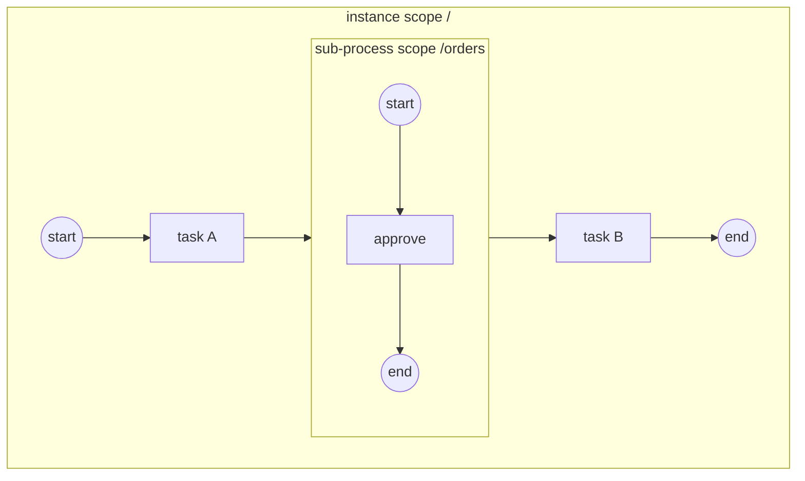

# ADR-023 — Sub-Process & Call Activity Execution Model (nested scopes)

| Field | Value |
|---|---|
| Status | Draft |
| Version | v.2 |
| Date | 2026-07-16 (v.1 accepted 2026-07-17; v.2 draft 2026-07-17) |
| Owner | Ruslan Gabitov |
| Refines | [ADR-001 v.6 Execution Model](ADR-001-execution-model.md), [ADR-010 v.2 Process Data Model](ADR-010-process-data-model.md) §2.2, [ADR-018 v.1 Boundary Events & Activity Interruption](ADR-018-boundary-events-and-activity-interruption.md) §2.2/§2.6, [ADR-006 v.3 Events & Subscriptions](ADR-006-events-and-subscriptions.md) §2.6/§2.7, [ADR-019 v.1 Definition Versioning](ADR-019-definition-versioning-and-registry.md), [SAD-001 v.1](SAD-001-vision-and-architecture.md) §15.3 |

> **Draft (v.2)** — extends the accepted v.1 with the **Event Sub-Process**
> decision (§2.10), promoting it from the v.1 "designed-for" seam (§2.8) to a
> full conception. The v.1 keystone stays as accepted: the **embedded
> Sub-Process** (§2.2–§2.6) as a **nested execution scope inside the same
> instance** — one loop, one single writer, a scope *tree* where today there
> is one flat scope — and the **Call Activity** (§2.7) as a **child
> instance** of a separately registered process, invoked through the
> versioned registry with the standard's direct I/O mapping (epic #85,
> landed). One concept carries all of it: the **scope** — the joint
> token/data/event context of §10.5.7 — opened when the composite activity
> is entered, completed when **no tokens remain in it** (§13.3.4), and
> cancellable **as a unit** (the ADR-018 cooperative cancellation applied
> to a composite host). v.2 realizes the next rider on that scope: an
> **Event Sub-Process** (§2.10, epic #91) is a `triggeredByEvent` handler
> **armed while its enclosing scope is open** — the boundary-watch pattern
> lifted from an activity's window to a scope's window — with the
> interrupting-handler budget **shared with boundary events** and the
> **absorb-vs-re-throw** precedence. Boundary events on composites, the
> **scoped** Terminate End Event (§13.5.6), and the Error **scope-chain**
> walk that ADR-006 §2.6 modelled and ADR-018 deferred are all live from
> v.1. Still designed-for, not yet decided: Transaction, Ad-Hoc,
> multi-instance (§2.8). Implementation is sliced by the accompanying SRDs;
> the scope keystone is epic #85, the event sub-process is epic #91.

---

## 1. Context & problem

Every gobpm process today is **flat**: one graph, one token scope, one data
scope, one event context. That was the deliberate 0.1.0 shape
([SAD-001 v.1 §15.3](SAD-001-vision-and-architecture.md) deferred Sub-Process
and Call Activity to 0.2.0), and a set of recorded deferrals has been
converging on this ADR ever since:

- [ADR-018 v.1](ADR-018-boundary-events-and-activity-interruption.md) §2.6:
  boundary events on a Sub-Process / Call Activity — "a sub-process is
  interrupted by cancelling its scope, the same cooperative cancellation
  applied to a composite host"; the mechanism was designed to extend
  unchanged.
- [ADR-006 v.2 §2.6](ADR-006-events-and-subscriptions.md): the Error
  **scope-chain propagation** model — fully specified, waiting for a second
  scope level to exist ("no rework is needed then").
- [ADR-006 v.3 §2.7](ADR-006-events-and-subscriptions.md): the conditional
  **start** belongs to event sub-processes — "decided now, lands with the
  Sub-Process workstream".
- The scoped **Terminate End Event** (§13.5.6): today a Terminate stops the
  whole instance, which is correct only while the instance IS the one scope.
- The data plane (ADR-010 §2.2) was **built as a container-scope tree** from
  day one — open/close of child scopes and parent-ward name resolution exist
  and are exercised only at the root.

Without composition the engine cannot express reuse (a fragment shared
between processes), structure (a cancellable/compensable unit of work), or
the event-handler containers of §13.5.4. Epic #85 names this the keystone:
event sub-processes and Transaction (#91), Ad-Hoc (#92), scope-chain error
management (#79) and boundary-on-composite all stack on the scope model
decided here.

## 2. Decision

### 2.1 One concept: the execution scope

A **scope** is the execution context of §10.5.7 — the joint set of

- **tokens**: the flow-node graph the scope's tokens move in;
- **data**: the variables/data objects visible per the container walk-up
  ("a Property of a Sub-Process is accessible by that Sub-Process and its
  immediate children"; the parent's data is visible from the child, never
  the reverse);
- **events**: the handlers armed while the scope is active (boundary events
  on its composite host today; event-sub-process handlers when #91 lands).

Scopes form a **tree** rooted at the process instance. gobpm identifies a
scope by its **path** — the instance root is `/`, an embedded sub-process
`orders` opens `/orders`, a nested one `/orders/retry` — reusing the data
plane's container-scope addressing verbatim, so the *data* tree and the
*execution* tree are the same tree.

**An embedded sub-process runs inside its parent instance.** One instance,
one event loop, one single writer (ADR-001 v.6): nested tokens are ordinary
tracks that additionally **carry their scope path**, and the loop's
registries gain scope awareness instead of being duplicated per scope. A
child *instance* exists only across a **Call Activity** boundary (§2.7),
where the standard itself draws the reuse line.

### 2.2 The embedded Sub-Process node — a container that is a node

The Sub-Process is **both**: a flow node in its parent's graph (an activity
— it has incoming/outgoing sequence flows, boundary events, a lifecycle) and
a **container** of its own inner graph. The model layer already reserves
this duality (the `Container` abstraction names Sub-Process as a container
kind); this ADR activates it.

**Containment is strict** (Table 7.2 p.29; §7.6.1 p.40): *"Sequence Flows
cannot cross the boundary of a Sub-Process"* — an inner node connects only
to inner nodes; the composite connects to the parent's graph only through
its own node edges and boundary events.

**Engine choice — the §13.3.4 self-contradiction resolved toward §7.6.1.**
§13.3.4 (p.430) contains a paragraph allowing a sub-process with no incoming
flows to be instantiated through *"Start Events that are target of Sequence
Flows from outside the Sub-Process"*. That directly contradicts the
connection rules above (and Table 7.2's explicit note), is a BPMN 1.x
remnant, and is implemented by no reference engine. gobpm rejects
boundary-crossing flows unconditionally; the clause is **not supported**.

### 2.3 Instantiation — deterministic, validated shapes

Verified verbatim (§13.3.4 p.430): *"A Sub-Process is instantiated when it
is reached by a Sequence Flow token. The Sub-Process has either a **unique
empty Start Event**, which gets a token upon instantiation, or it has **no
Start Event** but Activities and Gateways without incoming Sequence Flows.
In the latter case **all such Activities and Gateways get a token**. A
Sub-Process **MUST not have any non-empty Start Events**."* Table 10.85
(p.241) grounds the why: *"the flow of the Process (a token) from the parent
Process **is** the trigger of the Sub-Process"*.

gobpm supports **both normative shapes** and rejects everything else at
**process validation** (the model-build placement gate, run at registration
before any instance — the same seam that rejects a top-level conditional
start):

| Shape | Behavior |
|---|---|
| Exactly one **None** Start Event | The start gets the entry token; inner flow proceeds from it. |
| **No** Start Event | Every inner activity/gateway without incoming flows gets a token (a parallel-start fan-out). |
| A triggered Start Event inside | **Rejected** — Message/Timer/Signal/Conditional starts belong to event sub-processes (#91) or top-level processes. |
| A None start **mixed** with other flow-less nodes | **Rejected** — the spec words the shapes as an exclusive alternative; the mixed form is unspecified, and silent half-starts are the misbehavior class gobpm fails fast on. |
| More than one None start | **Rejected** — "a unique empty Start Event". |

The generic activity rules are untouched: multiple incoming flows on the
composite = the implicit exclusive merge (each arriving token is an
independent instantiation, §13.3.1); `startQuantity`/`completionQuantity`
stay in their existing deferral.

### 2.4 Scope lifecycle — open, drain, close

When the host track enters the Sub-Process node:

1. **Open** the child scope (its data container opens under the parent's
   path; its handlers arm — today the composite's boundary events on the
   host, per ADR-018 unchanged).
2. **Seed** the inner tokens per the validated shape (§2.3) — inner tracks
   carrying the child scope's path.
3. The **host track parks** — the composite is a wait node in its parent's
   flow, exactly like the engine's other park-and-resume activities. The
   park is **in-instance**: no child instance exists for an embedded
   sub-process (§2.1) — the inner tracks are siblings in the same loop,
   and the resume signal is the loop's own drain accounting, not an
   external completion.
4. **Drain-completion** (§13.3.4): the scope completes when **no tokens
   remain inside it** — every inner track has ended and none of its inner
   activities is still active. The loop, which already owns per-track
   accounting, extends it per scope.
5. **Close** the scope: its data container closes (inner variables are
   disposed with it — DataObject lifecycle is tied to its container,
   §10.5.7), its handlers disarm, the host track **resumes** and selects
   its outgoing flows by the standard activity rules (conditional/default
   flows included).

Inner **End Events** keep their behavior (a Message end sends, a Signal end
broadcasts, §13.3.4); they end their own track, feeding the drain rule. The
**Error End Event** and **Terminate End Event** get scope-aware semantics
(§2.5/§2.6).

### 2.5 Interruption — the scope cancels as a unit

Everything ADR-018 decided for a single activity extends to the composite by
replacing "cancel the track" with "**cancel the scope**": stop every track
whose path is inside the scope (cooperative cancellation, the discard
checkpoint), close the scope, and continue per the interrupting construct:

- **Boundary events on the composite** (interrupting): the fire cancels the
  child scope and routes the token onto the boundary's exception flow —
  the arming/disarming window is the host's execution window, unchanged.
  Non-interrupting boundaries fork in parallel as today. The full boundary
  trigger set applies (Message/Timer/Signal/Conditional per their existing
  models; Error per §2.6).
- **Scoped Terminate** (§13.5.6, verified): a Terminate End Event
  *"terminates its **enclosing scope** — for a sub-process, only the
  affected instance; higher-level scopes are NOT affected"*. Reaching a
  Terminate inside a sub-process discards the remaining tokens of **that
  scope only** and completes the composite abnormally-but-locally; the
  parent continues. A top-level Terminate keeps today's whole-instance
  semantics — the instance is simply the root scope. (Terminate runs no
  compensation, per ADR-006 §2.3.)
- **Instance terminate / shutdown** cancels the root scope, which cascades
  to every nested scope by the tree.

### 2.6 Error propagation — the scope chain becomes real

This realizes [ADR-006 v.2 §2.6](ADR-006-events-and-subscriptions.md)
exactly as promised there, replacing the single-scope engine note:

1. An activity fails with a `BpmnError` → match an **Error boundary on that
   activity** (today's rule, unchanged).
2. No match → **walk outward**: at each enclosing scope, match an Error
   boundary **on that scope's composite host** (the innermost enclosing
   catcher, §10.5.1/§10.5.7). A match cancels that scope (the boundary's
   interrupting semantics, Error is always interrupting) and routes its
   exception flow.
3. No match anywhere up the chain → **instance fault** (the unmatched →
   fault engine choice ADR-006 §2.6 records).
4. An **Error End Event** inside a sub-process throws at its scope's
   boundary: the walk starts at the enclosing composite — an error end in a
   nested scope is catchable by the parent, and only an uncaught one faults
   the instance (the end-in-error case narrows to the root scope).

Escalation follows the same chain when it lands (#90); event-sub-process
Error handlers join the same match points when #91 lands (the standard's
inline-handler precedence is decided there).

### 2.7 Call Activity — a child instance through the registry

The Call Activity is the standard's **reuse** boundary (§13.3.4): it invokes
a `CallableElement` — for gobpm, a **separately registered process**. The
composition is by **reference**, not containment, so the execution unit is a
**child instance**, not a nested scope:

- **Resolution & version binding.** The `calledElement` names a registry
  key ([ADR-019 v.1](ADR-019-definition-versioning-and-registry.md)).
  Default binding is **latest-at-launch** (the registry's "just run the
  current one" semantics, Camunda-aligned); a **pinned version** is an
  explicit option on the Call Activity. Resolution happens at **call time**
  — a missing key/version fails the caller's activity (a classified error
  entering the §2.6 chain as a technical fault).
- **Invocation semantics** (§13.3.4, verified): the called process
  instantiates by its **None** Start Event; its triggered Start Events —
  legal on a global process — are **ignored on the call path** (*"these
  non-empty Start Events are alternative to the empty Start Event and hence
  they are ignored when the Process is called"*). The called instance has
  the same instantiation/termination semantics as a sub-process.
- **The caller parks asynchronously** — the Call Activity is a wait node in
  the parent (the external-work park/resume pattern of the engine's job
  seam): the child instance runs its own loop; its terminal state re-enters
  the caller's loop and resumes the parked track. Completed → outputs bind
  and the caller continues; Terminated/Failed → a fault enters the caller's
  §2.6 chain at the Call Activity node (catchable by an Error boundary on
  it).
- **I/O — the standard's direct mapping** (§10.4/data semantics, verified):
  a Call Activity's DataInputs/DataOutputs map to the callable's
  InputOutputSpecification **without explicit data associations** —
  positional/by-name direct binding. Inputs are bound into the child's root
  scope at launch; outputs bind back into the caller's scope at completion.
  The child's data plane is **isolated** — no walk-up crosses the call
  boundary (the reuse contract: a called process must run identically
  however it is reached).
- **Cancel cascade — engine choice** (the standard is silent on
  caller-initiated termination): cancelling the caller's Call Activity —
  an interrupting boundary on it, a scoped Terminate of its scope, or
  instance terminate — **cascades a Terminate to the child instance**. A
  fire-and-forget call is out of scope (no BPMN construct expresses it;
  revisit only with a real need).
- **Observability linkage**: the child instance's facts carry the parent
  linkage (caller instance id + Call Activity node id) so a trace can be
  stitched across the boundary (§6).

### 2.8 Designed-for: what rides the scope model next

Decided here as **seams**, implemented by their own workstreams:

- **Event sub-processes** (#91): **now decided in §2.10 (v.2)** — a handler
  container armed while its enclosing scope is open, promoted from this seam
  to a full conception. The seam was correct; §2.10 fixes the budget,
  precedence, and lifecycle it deferred.
- **Transaction** (#91): a sub-process variant whose Cancel End / Cancel
  boundary ride scope-cancel plus compensation — nothing in this model
  precludes it.
- **Ad-Hoc** (#92): a container whose inner enablement is selection-driven
  rather than flow-driven — it reuses the scope (data/lifecycle/cancel) and
  replaces only the token-seeding rule.
- **Multi-instance on composites** (#88): each MI instance is its own scope
  (per-instance data snapshot; a Terminate affects only the affected
  instance, §13.5.6 — the scoped Terminate above already words it this
  way).
- **Escalation scope-chain** (#90): the §2.6 walk with non-critical
  semantics.

### 2.9 Recursion & depth

Nesting depth is **unbounded by design** (scopes are a tree; paths compose).
A Call Activity may call its own process (recursion is legal composition —
resolution is by registry key at call time); a static cycle check is neither
required by the standard nor decidable across versions. Runaway recursion is
the modeller's error; §6 recommends an operational depth guard rather than a
model-layer prohibition.

### 2.10 Event Sub-Process — a scope-armed handler (v.2)

An **Event Sub-Process** (BPMN §13.5.4) is a `SubProcess` marked
`triggeredByEvent`: a handler fragment that lives **inside** a scope and is
**armed by an event**, not reached by a sequence flow. It is the scope-level
counterpart of the boundary event — where a boundary guards a single
activity's window, an event sub-process guards a whole **scope's** window.
This realizes the §2.8 seam with the budget, precedence, and lifecycle that
seam deferred.

**The model.** An event sub-process reuses the §2.2 scope container (the same
inner graph, the same nested-scope data/lifecycle of §2.4) and adds exactly
what the standard demands and forbids:

- **A single triggered Start Event** (§10.5.2 p.241: *"An Event Sub-Process
  MUST have a single Start Event"*) of one kind — Message, Timer, Signal,
  Error, or Conditional in this workstream (Escalation rides #90); the
  start's `isInterrupting` flag selects the variant.
- **Self-contained** (§13.5.4): no sequence flow to or from the parent's
  graph — reached *only* by its start firing. Because its start is
  *triggered*, it is **never** an entry node: the §2.3 instantiation seeds
  the None-start / flow-less nodes and **skips** the event sub-process,
  registering it as a **scope handler** instead.
- **No boundary events** on it (§13.5.4).
- **Runs in the parent's data context** (§13.5.4): its inner nodes read the
  enclosing scope through the §2.4/§10.5.7 walk-up, like any inner node.

**Arming — the boundary-watch pattern at scope granularity.** When a scope
opens (§2.4, or the instance root at start), the loop **arms** each event
sub-process declared directly in it, registering the start's trigger with the
same per-kind machinery a boundary event uses:

| Trigger | Arming mechanism |
|---|---|
| Message | a hub waiter keyed by the message, delivered as the loop event |
| Signal | a hub waiter on the signal name (broadcast-safe) |
| Timer | the timer subsystem, firing into the loop |
| Conditional | a **loop-local conditional subscription** (ADR-006 v.3 §2.7) — the false→true edge; this is where the **conditional start** ADR-006 v.3 deferred to (a conditional start legally reads the enclosing scope, §10.4.3) |
| Error | the §2.6 **scope-chain walk** at the throw site — no armed waiter; the walk finds the innermost enclosing scope whose handler catches the code |

A handler is armed for the **lifetime of its scope** — disarmed when the
scope drains (§2.4), is cancelled (§2.5), or, for an interrupting handler,
once **any** interrupting handler in the scope has fired (the budget below).

**Interrupting — cancel the scope, run the handler in it.** On an
interrupting trigger (`isInterrupting=true`):

1. The loop **cancels the enclosing scope's sibling tracks** — §2.5's
   `cancelScope` applied to the handler's *own* scope. The scope's **data
   plane stays open**; the handler runs in it.
2. The parent lifecycle reflects the trigger (§13.5.4): an **Error** start
   puts the parent into *Failing*, a **non-error** interrupting start into
   *Terminating*. gobpm has **no distinct Failing/Terminating token state**
   (consistent with the §2.1 choice not to add activity-lifecycle states the
   loop doesn't need); the distinction is realized by *which* cancellation
   path runs (the §2.6 Error walk vs a plain scope-cancel) and surfaced in
   observability.
3. The loop **seeds the handler's inner flow** from its triggered start (the
   start treated as fired, its payload bound the §2.4 born-event way) into
   the cleared scope; the handler runs to its End in the scope's data
   context.
4. When the handler **drains**, the scope completes and resumes the parent's
   host token (the §2.4 drain-resume), following the handler's outcome.

**The shared interrupting budget & absorb-vs-re-throw.** For a given Event
Declaration, **only ONE interrupting handler** may fire in a scope — *and
that budget is shared between the event sub-process and any boundary event on
the same scope host* (§10.5.6 p.278). Once an interrupting handler starts,
**no further handler** may be initiated for that scope. gobpm enforces this
with **one interrupting-arm registry per scope**, keyed by Event Declaration,
that both the boundary-watch and the event-sub arming write into; the first
interrupting fire flips the scope to *interrupted* and disarms the rest. When
a scope has both an inline event sub-process **and** a boundary for the same
`EventDefinition` (§10.5.6 / p.278 precedence):

- the handler **completes without re-throwing** → it **absorbs** the event:
  the boundary does **not** fire, the parent resumes on its normal flow;
- the handler **re-throws** the event (a Throw of the same kind at its End) →
  the boundary fires **after** the handler: the inline handler is a
  **decorator**, not terminal.

This gives the modeller explicit terminal-vs-decorator control; the **absorb**
path is primary in this workstream, re-throw composes with the existing throw
+ boundary machinery.

**Non-interrupting (decided; implementation sliced second).** A
non-interrupting event sub-process (`isInterrupting=false`, any trigger except
Error — errors always interrupt, §10.5.6) runs **concurrently** with the
parent: the trigger is consumed, a handler instance spawns as a **new track
in a fresh child scope** under the parent, and the parent keeps running.
Multiple may run at once (§10.5.6: unlimited, non-deterministic order); each
is its own scope, and the parent does not drain-complete until every spawned
handler has drained (the §2.4 scope-drain accounting already counts every
track under the path). Nothing in the interrupting design precludes it — a
non-interrupting fire is "spawn a handler track, don't cancel the scope". The
**implementation is sliced second** (the accompanying SRDs land interrupting
first).

## 3. Standard grounding

| Claim | Source |
|---|---|
| Instantiation by the parent's token; unique None start XOR no-start/flow-less seeding; non-empty starts forbidden | §13.3.4 p.430 (verified verbatim via the spec notebook) |
| "The flow of the Process (a token) from the parent Process is the trigger of the Sub-Process"; None is the only sub-process start type | §10.5.2 p.241 + Table 10.85 |
| Sequence flows cannot cross a sub-process boundary | Table 7.2 p.29; §7.6.1 p.40 (the §13.3.4 external-start paragraph rejected as self-contradictory — §2.2 engine choice) |
| Completion = no tokens remain inside, no inner activity active | §13.3.4 p.430 (`sub-processes.md`) |
| Scope = data/events/conversations context; property visibility parent→children; DataObject lifecycle tied to container | §10.5.7 p.280 (`data.md`) |
| Scoped Terminate — only the affected (sub-)instance; higher scopes unaffected | §13.5.6 p.443 (`event-handling.md`) |
| Error/Escalation propagate to the innermost enclosing catcher; Error critical | §10.5.1 / §10.5.7 (`event-handling.md`) |
| Call Activity invokes a CallableElement; same instantiation/termination semantics as a sub-process; called process's triggered starts ignored on the call path | §13.3.4 p.430-431 (verified verbatim) |
| Call Activity I/O maps to the callable without explicit data associations | §10.4 data semantics (`data.md` §8) |
| Boundary triggers on composites; Error always interrupting | §10.5.4 / §10.5.6 (`event-handling.md` §4) |
| Event sub-process (§2.10): `triggeredByEvent`; single triggered start; self-contained; no boundary events; parent data context; Error→Failing, non-error interrupting→Terminating; Completing awaits active handlers | §13.5.4 p.436-439; §10.5.2 p.241 ("An Event Sub-Process MUST have a single Start Event") |
| ONE interrupting handler per Event Declaration, **shared** event-sub + boundary; unlimited non-interrupting; interrupting/non-interrupting trigger sets (Error interrupting-only) | §10.5.6 p.278 (`event-handling.md` §5) |
| Inline handler **absorb** (no re-throw → boundary suppressed) vs **re-throw** (→ boundary fires after) | §10.5.6 p.278 (`event-handling.md` §6) |
| A Conditional start legally reads the enclosing scope (hence it lands with event sub-processes, not at top level) | §10.4.3 |
| Implicit exclusive merge on multiple incoming flows | §13.3.1 p.427 |

Standard silences resolved as engine choices: the boundary-crossing start
paragraph (§2.2); caller-cancel cascade to the called instance (§2.7);
unresolved-error → instance fault (inherited from ADR-006 §2.6); the
Failing/Terminating parent-lifecycle states realized by the cancellation path
+ observability rather than a distinct token state (§2.10) — no
activity-lifecycle states the loop doesn't need; concurrent non-interrupting
handlers run in the loop's non-deterministic track order (§10.5.6, honoured
by making no ordering guarantee).

## 4. Alternatives considered

| Alternative | Why rejected |
|---|---|
| **A child instance per embedded sub-process** (uniform with Call Activity) | An embedded sub-process *shares* its parent's context (§10.5.7 visibility; #91 handlers read the enclosing scope's data) — a child instance would need a cross-instance data bridge that the walk-up gives for free; it multiplies loops and event plumbing for zero isolation gain; completion/cancel coupling becomes inter-instance protocol instead of in-loop accounting. The instance boundary is meaningful — the standard puts it at the *reuse* line (Call Activity), and so does this ADR. |
| **Graph inlining for Call Activity** (copy the called graph into the caller's snapshot at registration) | Breaks the reuse contract: the binding freezes at registration (ADR-019 gives launch-time latest), recursion becomes impossible (infinite expansion), the called process's own observability/versioning identity disappears, and caller/callee isolation (§2.7) is lost. |
| **Flattening the embedded sub-process** into the parent graph with name-prefixed nodes (no runtime scope) | Loses exactly what the composite exists for: drain-completion, scope-cancel, scoped Terminate, the error chain's match points, per-scope data lifecycle — each would need per-node special-casing that the scope concept gives once. |
| **An engine-global scope registry** (scopes as first-class engine objects outside instances) | Nothing crosses an instance boundary except the Call Activity protocol; hoisting scopes out of the instance would re-introduce the shared-state locking ADR-001/ADR-017 removed. |
| **Event sub-processes as a top-level handler registry** (global catchers, §2.10) | Breaks the scope-locality the standard mandates (a handler catches only within its scope) and duplicates the §2.6 scope-chain. An event sub-process *is* a scope (data context, drain, cancel) — a scope-parallel runtime would re-implement §2.2–§2.5. |
| **Model event sub-processes as N boundary events on the scope host** (§2.10) | A boundary guards one activity's *occupied* window; an event sub-process guards the scope's *open* window (a different lifetime), catches from *anywhere inside*, and runs *in* the scope's data context. The shared interrupting **budget** is the only overlap — modelled as a shared per-scope registry, not by collapsing the two constructs. |
| **Interrupting + non-interrupting in one event-sub slice** (§2.10) | Non-interrupting adds concurrent-handler lifetime + scope-drain interplay; interrupting is the common exception case and lands first, non-interrupting second, on the same arming (owner decision). |

## 5. Consequences

- The engine gains **composition**: reuse (Call Activity over the versioned
  registry), structure (cancellable units), and the container the #91/#92
  constructs require. The conformance tracker's keystone row unblocks four
  dependents.
- **The loop stays the single writer.** Nested execution adds scope
  awareness to existing registries (a track knows its scope path;
  completion/cancel account per subtree) — not a second synchronization
  domain. This is the same "extend the accounting, not the concurrency
  model" move as ADR-017's.
- **The data plane needs no new concept** — the container-scope tree built
  by ADR-010 §2.2 finally exercises its child scopes; visibility and
  disposal come from the existing walk-up and close.
- ADR-018's promise is kept: boundary-on-composite arrives with **no changes
  to the boundary mechanism** — only a composite host and scope-cancel
  behind the same interface.
- ADR-006 §2.6's engine note ("single-scope reality") retires: the scope
  chain walks. The Error End Event stops always-faulting the instance —
  it becomes catchable by enclosing scopes (§2.6.4).
- **Risk — loop complexity.** Scope accounting (per-scope active counts,
  subtree cancellation, drain detection) concentrates in the loop; the
  accompanying SRDs must keep it as table-driven bookkeeping, and the
  single-writer confinement makes it testable deterministically.
- **Risk — snapshot shape.** The flat snapshot becomes a tree (a container
  node owning an inner graph); cloning, wiring and the static precomputes
  (instantiating starts, conditional presence) recurse. Mechanical, but it
  touches the clone-correctness class of bugs (a dropped field disables a
  feature silently) — the landing must pin every recursive copy with tests.
- A Terminate End Event inside a sub-process **changes meaning** from
  "terminate the instance" to "terminate the scope" — semantically new,
  not a break: no existing model can place a Terminate inside a sub-process
  today.

## 6. Enterprise-readiness recommendations

- **Observability.** Scope lifecycle should be first-class in the fact
  stream: scope opened/completed/cancelled with the scope path and the
  composite node identity — a process operator reasons in sub-process
  units, not raw tracks. Call Activity linkage: the child instance's facts
  carry `parent_instance_id` + `call_activity_node_id`; the caller emits
  call-started/call-completed. Keep the existing kinds where they fit
  (NodeProgress on the composite host) and prefer one new scope-lifecycle
  kind over overloading InstanceState.
- **Operational depth guard.** Expose an engine option for maximum
  scope-tree depth + call-chain depth (default generous, e.g. 64), failing
  the instance with a classified error naming the chain — turning runaway
  recursion from a resource exhaustion into a diagnosable fault.
- **Version pinning discipline.** Latest-at-launch is the right default,
  but production callers should be able to pin (the option exists in
  §2.7); recommend surfacing the resolved (key, version) in the
  call-started fact so operators can audit what actually ran.
- **Contract testing.** A called process is an interface: its
  InputOutputSpecification is the contract the caller binds against.
  Recommend registry-time validation that a pinned callable version
  satisfies the Call Activity's declared I/O, and a documented deprecation
  path for callables (register new version → migrate callers → retire).
- **Sensitive data.** The call boundary is a data boundary: only declared
  inputs cross it. Document this as the isolation guarantee (no accidental
  parent-scope leakage into reusable processes).

## 7. Rollout plan

1. **Slice 1 — the embedded Sub-Process** (the accompanying SRD): the
   container node model + validation shapes (§2.3), the snapshot tree, the
   scope-aware loop (open/seed/drain/close, per-scope accounting), scope
   cancel + boundary-on-composite, scoped Terminate, the §2.6 error chain.
2. **Slice 2 — the Call Activity** (its own SRD): the callable resolution +
   version binding, the child-instance launch/park/resume protocol, direct
   I/O binding, cancel cascade, observability linkage.
3. Then, on this substrate, their own conceptions: event sub-processes +
   Transaction (#91), Ad-Hoc (#92), MI on composites (#88), Escalation
   (#90).

## 8. References

- BPMN 2.0 (v2.0.2, formal/2013-12-09): §7.6.1, Table 7.2, §10.4, §10.5.1,
  §10.5.2 (Table 10.85), §10.5.4, §10.5.6, §10.5.7, §13.3.1, §13.3.4,
  §13.5.4, §13.5.6 — key start-semantics clauses verified verbatim against
  the PDF via the spec notebook (session 2026-07-16); the vendored extract
  (`docs/bpmn-spec/semantics/sub-processes.md`, `data.md`,
  `event-handling.md`) carries the working copies.
- [ADR-001 v.6](ADR-001-execution-model.md) — the track/loop single-writer
  core this extends.
- [ADR-010 v.2](ADR-010-process-data-model.md) §2.2 — the container-scope
  tree this activates.
- [ADR-018 v.1](ADR-018-boundary-events-and-activity-interruption.md) —
  the interruption mechanism this applies to composites.
- [ADR-006 v.3](ADR-006-events-and-subscriptions.md) §2.6/§2.7 — the error
  propagation model realized here; the conditional start hosted by §2.8.
- [ADR-019 v.1](ADR-019-definition-versioning-and-registry.md) — the
  registry the Call Activity resolves against.
- GitHub epics: #85 (this ADR), #91, #92, #88, #90, #79.

## Open questions

None.

## Document History

| Version | Date | Author | Change |
|---|---|---|---|
| v.1 | 2026-07-16 | Ruslan Gabitov | Draft conception. Decides composition on ONE concept — the **execution scope** (§10.5.7 token/data/event context) as a tree inside the instance: the **embedded Sub-Process** is a container-node opening a child scope in the SAME instance (one loop, single writer preserved; tracks carry scope paths), with **validated instantiation shapes** (unique None start XOR no-start/flow-less seeding — §13.3.4 verified verbatim; triggered/mixed/multiple starts rejected at process validation), **drain-completion** (no tokens remain), **scope-cancel as the unit of interruption** (boundary-on-composite via the unchanged ADR-018 mechanism; **scoped Terminate** per §13.5.6), and the **Error scope-chain walk** realizing ADR-006 v.2 §2.6 (activity boundary → enclosing composites → instance fault; the Error End Event becomes catchable by enclosing scopes). The **Call Activity** is the reuse boundary: a **child instance** of a registry-resolved callable (ADR-019; **latest-at-launch default**, pinned option), async park/resume for the caller, the standard's **direct I/O mapping** (no explicit associations), isolated child data plane, and a **terminate cascade** on caller cancel (standard-silent, engine choice). Rejects the §13.3.4 boundary-crossing-start paragraph as self-contradictory with §7.6.1/Table 7.2 (engine choice, documented). §2.8 shapes the model for what rides it: event sub-processes (#91 — scope-armed handlers incl. the ADR-006 v.3 conditional start), Transaction, Ad-Hoc, MI-per-scope, Escalation chain. Alternatives rejected: child-instance-per-embedded, Call-Activity graph inlining, flattening, engine-global scopes. Standard-grounded against the BPMN 2.0 PDF (start-semantics clauses verified verbatim via the spec notebook) and `docs/bpmn-spec/`. Implementation sliced by the accompanying SRDs (embedded first, Call Activity second); epic #85. |
| v.1 | 2026-07-17 | Ruslan Gabitov | **Accepted** — both slices landed (the embedded Sub-Process and the Call Activity, via the accompanying SRDs); epic #85 closed. Status flip only, no conception change (no version bump). |
| v.2 | 2026-07-17 | Ruslan Gabitov | **Draft** — adds §2.10 **Event Sub-Process**, promoting the §2.8 seam to a full conception (epic #91): a `triggeredByEvent` handler **armed while its enclosing scope is open** (the boundary-watch pattern lifted from an activity window to a scope window), reusing the per-kind trigger machinery (hub Message/Signal, Timer, the ADR-006 v.3 **conditional start** landing here, the §2.6 Error walk); an **interrupting** start cancels its scope's sibling tracks (§2.5) and runs the handler in the parent's data context (Error→Failing / non-error→Terminating realized by cancellation path + observability, no new token state); the **interrupting budget is one per Event Declaration, shared with boundary events** (§10.5.6), enforced by a per-scope interrupting-arm registry; **absorb vs re-throw** (§10.5.6) gives terminal-vs-decorator control. **Non-interrupting** decided (concurrent handler spawn, unlimited, Error excluded) but implementation sliced second. **Transaction/compensation + the Escalation trigger stay out of scope** — they need #90; §2.8 keeps them as designed-for. §2.8 event-sub bullet updated to point at §2.10; §3 grounding + §4 alternatives + Engine-notes extended. v.1 keystone (§2.1–§2.7) unchanged and stays accepted. Standard-grounded against §13.5.4 / §10.5.2 / §10.5.6 / §10.4.3. Implementation by the accompanying SRD (interrupting first). |
