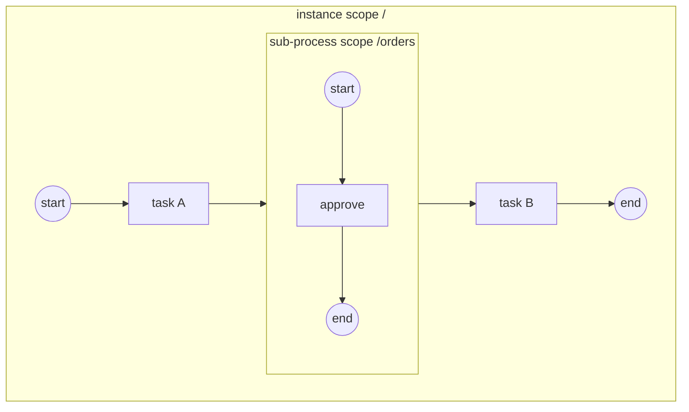

# ADR-023 — Sub-Process & Call Activity Execution Model (nested scopes)

| Field | Value |
|---|---|
| Status | Draft (v.5 — flips back to Accepted when the v.5 changes land) |
| Version | v.5 |
| Date | 2026-08-28 |
| Owner | Ruslan Gabitov |
| Refines | [ADR-001 v.6](ADR-001-execution-model.md), [ADR-010 v.2](ADR-010-process-data-model.md) §2.2, [ADR-018 v.1](ADR-018-boundary-events-and-activity-interruption.md) §2.2/§2.6, [ADR-006 v.6](ADR-006-events-and-subscriptions.md) §2.6/§2.7, [ADR-019 v.1](ADR-019-definition-versioning.md), [SAD-001 v.1.3](SAD-001-vision-and-architecture.md) §15.3 |

This ADR decides how a gobpm process **composes**, on one concept: the
**execution scope** — the joint token, data and event context of §10.5.7 — as a
tree. An **embedded Sub-Process** is a container node that opens a child scope
**inside the same instance**, with validated instantiation shapes,
drain-completion, scope-cancel as the unit of interruption, and the Error
scope-chain walk. An **Event Sub-Process** is a handler armed for the lifetime of
that scope. A **Call Activity** is the reuse boundary the standard draws, and
therefore the one place a **child instance** appears: a callable resolved through
the versioned registry at call time, with the standard's direct I/O mapping and a
cancel cascade.

---

## 1. Context & problem

A process the engine cannot nest is a process that cannot express **reuse** (a
fragment shared between definitions), **structure** (a cancellable, compensable
unit of work), or the **event-handler containers** of §13.5.4. Those are not
three features but one missing concept, and the shape of that concept decides
several things at once: what a token's context is, where data lives and dies,
which handler catches a thrown error, and what "this activity finished" means
when the activity contains a graph.

The risk in answering them separately is a per-construct engine — one rule for
sub-process completion, another for handler lifetime, a third for what a
Terminate terminates. This ADR answers them once, and the constraint it must
respect is that gobpm's loop is a **single writer** ([ADR-001 v.6](ADR-001-execution-model.md)):
composition must extend the loop's accounting rather than add a second
synchronization domain.

## 2. Decision

### 2.1 One concept: the execution scope

A **scope** is the execution context of §10.5.7 — the joint set of

- **tokens**: the flow-node graph the scope's tokens move in;
- **data**: the variables and data objects visible per the container walk-up (a
  Property of a Sub-Process is accessible by that Sub-Process and its immediate
  children; the parent's data is visible from the child, never the reverse);
- **events**: the handlers armed while the scope is active — boundary events on
  its composite host, and the event sub-processes declared in it (§2.10).

Scopes form a **tree** rooted at the process instance. gobpm identifies a scope
by its **path** — the instance root is `/`, an embedded sub-process `orders` opens
`/orders`, a nested one `/orders/retry` — reusing the data plane's container-scope
addressing verbatim, so the *data* tree and the *execution* tree are the same
tree.

**An embedded sub-process runs inside its parent instance.** One instance, one
event loop, one single writer: nested tokens are ordinary tracks that additionally
**carry their scope path**, and the loop's registries gain scope awareness instead
of being duplicated per scope. This is the same "extend the accounting, not the
concurrency model" move the channel-based event processing made, and it is what
keeps composition out of the locking design. A child *instance* exists only across
a **Call Activity** boundary (§2.7), where the standard itself draws the reuse
line.

```mermaid
flowchart TD
    subgraph inst["instance scope /"]
        s((start)) --> t1[task A]
        t1 --> sp
        subgraph sp["sub-process scope /orders"]
            s2((start)) --> t2[approve]
            t2 --> e2((end))
        end
        sp --> t3[task B]
        t3 --> e((end))
    end
```

### 2.2 The embedded Sub-Process node — a container that is a node

The Sub-Process is **both**: a flow node in its parent's graph — it has incoming
and outgoing sequence flows, boundary events, an activity lifecycle — and a
**container** of its own inner graph.

**Containment is strict** (Table 7.2 p.29; §7.6.1 p.40): *"Sequence Flows cannot
cross the boundary of a Sub-Process"* — an inner node connects only to inner
nodes, and the composite connects to the parent's graph only through its own node
edges and boundary events.

**Engine choice — the §13.3.4 self-contradiction resolved toward §7.6.1.**
§13.3.4 (p.430) contains a paragraph allowing a sub-process with no incoming flows
to be instantiated through *"Start Events that are target of Sequence Flows from
outside the Sub-Process"*. That directly contradicts the connection rules above
and Table 7.2's explicit note, is a BPMN 1.x remnant, and is implemented by no
reference engine. gobpm rejects boundary-crossing flows unconditionally; the
clause is **not supported**.

### 2.3 Instantiation — deterministic, validated shapes

Verified verbatim (§13.3.4 p.430): *"A Sub-Process is instantiated when it is
reached by a Sequence Flow token. The Sub-Process has either a **unique empty
Start Event**, which gets a token upon instantiation, or it has **no Start Event**
but Activities and Gateways without incoming Sequence Flows. In the latter case
**all such Activities and Gateways get a token**. A Sub-Process **MUST not have
any non-empty Start Events**."* Table 10.85 (p.241) grounds the why: *"the flow of
the Process (a token) from the parent Process **is** the trigger of the
Sub-Process"*.

gobpm supports **both normative shapes** and rejects everything else at **process
validation** — before any instance exists, so a malformed composite is a
registration error rather than a runtime surprise:

| Shape | Behavior |
|---|---|
| Exactly one **None** Start Event | The start gets the entry token; inner flow proceeds from it. |
| **No** Start Event | Every inner activity and gateway without incoming flows gets a token (a parallel-start fan-out). |
| A triggered Start Event inside | **Rejected** — Message/Timer/Signal/Conditional starts belong to event sub-processes (§2.10) or to top-level processes. |
| A None start **mixed** with other flow-less nodes | **Rejected** — the spec words the shapes as an exclusive alternative; the mixed form is unspecified, and silent half-starts are the misbehavior class gobpm fails fast on. |
| More than one None start | **Rejected** — *"a unique empty Start Event"*. |

The generic activity rules are untouched: multiple incoming flows on the composite
are the implicit exclusive merge, each arriving token an independent
instantiation (§13.3.1). `startQuantity`/`completionQuantity` ≠ 1 are a
**deliberate non-goal** ([SAD-001 v.1.3](SAD-001-vision-and-architecture.md) §4
N8); the runtime honours the default 1.

### 2.4 Scope lifecycle — open, seed, drain, close

When execution enters the Sub-Process node:

1. **Open** the child scope: its data container opens under the parent's path, and
   its handlers arm — the composite's boundary events on the host, and the event
   sub-processes declared inside it (§2.10).
2. **Seed** the inner tokens per the validated shape (§2.3) — inner tracks
   carrying the child scope's path.
3. The composite's execution **awaits its body**. The wait is **in-instance**: no
   child instance exists for an embedded sub-process (§2.1), the inner tracks are
   siblings in the same loop, and what ends the wait is the loop's own drain
   accounting rather than an external completion. (Parking proper — a track
   suspended awaiting an external event — is the Call Activity's shape, §2.7. How
   a composite's execution is driven, and by what, is
   [ADR-025 v.5.1](ADR-025-activity-iteration-loop-and-multi-instance.md)
   §2.12/§2.13's decision, not this one's.)
4. **Drain-completion** (§13.3.4): the scope completes when **no tokens remain
   inside it** — every inner track has ended and no inner activity is still
   active. The loop's per-track accounting extends per scope.
5. **Close** the scope: its data container closes, and inner variables are
   disposed with it (a DataObject's lifecycle is tied to its container, §10.5.7);
   its handlers disarm; the composite completes and selects its outgoing flows by
   the standard activity rules, conditional and default flows included.

Inner **End Events** keep their behavior — a Message end sends, a Signal end
broadcasts — and end their own track, feeding the drain rule. The **Error End
Event** and **Terminate End Event** get scope-aware semantics (§2.5, §2.6).

### 2.5 Interruption — the scope cancels as a unit

Everything [ADR-018 v.1](ADR-018-boundary-events-and-activity-interruption.md)
decided for a single activity extends to the composite by replacing "cancel the
track" with "**cancel the scope**": stop every track whose path is inside the
scope by the same cooperative cancellation, close the scope, and continue per the
interrupting construct.

- **Boundary events on the composite** (interrupting): the fire cancels the child
  scope and routes the token onto the boundary's exception flow; the
  arming/disarming window is the host's execution window, unchanged.
  Non-interrupting boundaries fork in parallel, also unchanged. The full boundary
  trigger set applies — Message, Timer, Signal and Conditional per their existing
  models, Error per §2.6.
- **Scoped Terminate** (§13.5.6, verified): a Terminate End Event *"terminates its
  **enclosing scope** — for a sub-process, only the affected instance;
  higher-level scopes are NOT affected"*. Reaching a Terminate inside a
  sub-process discards the remaining tokens of **that scope only** and completes
  the composite abnormally but locally; the parent continues. A top-level
  Terminate keeps whole-instance semantics, because the instance is simply the
  root scope. Terminate runs no compensation
  ([ADR-006 v.6](ADR-006-events-and-subscriptions.md) §2.2; the opt-in override is
  [ADR-026 v.1](ADR-026-compensation-events.md) §2.8, off by default).
- **Instance terminate or shutdown** cancels the root scope, which cascades to
  every nested scope by the tree.

### 2.6 Error propagation — the scope chain

An error finds its handler by walking outward, and the walk is the same one for
every scope level:

1. An activity fails with a `BpmnError` → match an **Error boundary on that
   activity**.
2. No match → **walk outward**: at each enclosing scope, match an Error boundary
   **on that scope's composite host**, and an Error-started event sub-process
   declared in that scope (§2.10) — the innermost enclosing catcher,
   §10.5.1/§10.5.7. A match cancels that scope (Error is always interrupting) and
   routes its exception flow.
3. No match anywhere up the chain → **instance fault**, the unmatched-error engine
   choice [ADR-006 v.6](ADR-006-events-and-subscriptions.md) §2.6 records.
4. An **Error End Event** inside a sub-process throws at its scope's boundary: the
   walk starts at the enclosing composite, so an error end in a nested scope is
   catchable by the parent, and only an uncaught one faults the instance.

Escalation follows the same chain with non-critical semantics.

### 2.7 Call Activity — a child instance through the registry

The Call Activity is the standard's **reuse** boundary (§13.3.4): it invokes a
`CallableElement` — for gobpm, a **separately registered process**. The
composition is by **reference**, not containment, so the execution unit is a
**child instance**, not a nested scope.

- **Resolution & version binding.** The `calledElement` is a **callable
  reference**: a key, optionally qualified by the **namespace** of the definitions
  document the callable was declared in. An unqualified reference names a registry
  key directly ([ADR-019 v.1](ADR-019-definition-versioning.md)). Default binding
  is **latest-at-launch** — the registry's "just run the current one" semantics —
  and a **pinned version** is an explicit option on the Call Activity. Resolution
  happens at **call time**, so a callable may be registered later or re-versioned;
  a missing key or version fails the caller's activity as a classified error
  entering the §2.6 chain as a technical fault.
- **Callable resolution is a host seam — engine choice.** The standard types
  `calledElement` as a plain `String` and leaves how a reference finds its
  `CallableElement` to the tool; a reference into another document is meaningful
  only through that document's `<import>`. The engine therefore owns no naming
  convention. A **callable resolver** — a host contract, supplied once per engine
  — turns a callable reference into the registry key it serves, and is consulted
  at call time for every call, **outside every engine lock**, because it is host
  code. The **default resolver** keeps the unqualified case exact (the reference
  *is* the key) and answers a qualified reference with a classified error naming
  the namespace: a host that never imports across documents configures nothing,
  and a host that does supplies the mapping instead of the engine guessing one.
- **A global task is a callable, and the registry serves it as a process — engine
  choice.** The standard's `GlobalTask` family is a `CallableElement` with no flow
  of its own, and §13.3.4 gives a call the semantics of the called Process. The
  engine realizes a global task as a **process whose body is that one task** — a
  None Start, the task, a None End — which the host registers under the global
  task's id like any other process, with the callable's `ioSpecification` as the
  process's declared contract
  ([ADR-040 v.2](ADR-040-process-io-contract.md)). Reuse stays **by reference**:
  one registration, any number of callers, and re-registration mints a version
  like any process. Nothing on the call path distinguishes a called global task
  from a called process, which is what §13.3.4 says a call is.
- **Invocation semantics** (§13.3.4, verified): the called process instantiates by
  its **None** Start Event; its triggered Start Events — legal on a global process
  — are **ignored on the call path** (*"these non-empty Start Events are
  alternative to the empty Start Event and hence they are ignored when the Process
  is called"*). The called instance has the same instantiation and termination
  semantics as a sub-process.
- **The caller waits on external work.** The Call Activity is a genuine wait node
  in the parent: the child instance runs its own loop, and its terminal state
  re-enters the caller's loop and resumes the waiting track. Completed → outputs
  bind and the caller continues; Terminated or Failed → a fault enters the caller's
  §2.6 chain at the Call Activity node, catchable by an Error boundary on it.
- **I/O — the standard's direct mapping** (verified): a Call Activity's
  DataInputs/DataOutputs map to the callable's InputOutputSpecification **without
  explicit data associations** — direct by-name binding. Inputs bind into the
  child's root scope at launch; outputs bind back into the caller's scope at
  completion. The child's data plane is **isolated** — no walk-up crosses the call
  boundary, because a called process must run identically however it is reached,
  and that isolation is also the privacy guarantee: only declared inputs cross.
  The callee's side of the mapping — the process's own declared inputs and
  outputs, what binds at its launch, what is read at its completion, and the
  by-name check of the caller's parameters against the resolved callable at launch
  — is [ADR-040 v.2](ADR-040-process-io-contract.md).
- **Cancel cascade — engine choice** (the standard is silent on caller-initiated
  termination): cancelling the caller's Call Activity — an interrupting boundary
  on it, a scoped Terminate of its scope, or instance terminate — **cascades a
  Terminate to the child instance**. A fire-and-forget call is out of scope: no
  BPMN construct expresses it.
- **Observability linkage.** The child instance's facts carry the parent linkage —
  the caller's instance id and the Call Activity node id — so a trace stitches
  across the boundary.
- **Restart contract — the call survives a restart whole** (the standard is silent
  on engine restarts; engine choice, governed by
  [ADR-033 v.5](ADR-033-persistence-and-state.md) §2.10): the child instance is
  **durable in its own right**, checkpointing under the same repository and
  discipline as any instance and carrying the parent linkage, while the caller's
  checkpoint records the in-flight call — the awaited child instance id and the
  call node. Recovery restores **both ends and re-links them**: the caller's
  waiting track resumes on the recovered child, the child's terminal state
  re-enters the restored caller exactly as it would a resident one, and the cancel
  cascade survives the restart. A restored caller whose awaited child record is
  missing **fails its restore loudly** — the call is recorded state, so silently
  re-launching the child is designed out; conversely a recovered child whose
  parent record vanished fails loudly rather than running orphaned.

### 2.8 Composites that ride this scope model

The scope is deliberately general, and several constructs are **variants of it**
rather than new execution models. Each is decided by its own ADR, and each takes
the scope's data lifecycle, drain-completion and cancel unchanged:

- **Transaction** — a sub-process variant whose Cancel End and Cancel boundary
  ride scope-cancel plus compensation
  ([ADR-028 v.2](ADR-028-transaction-sub-process.md)).
- **Ad-Hoc** — a container whose inner enablement is selection-driven rather than
  flow-driven: it reuses the scope and replaces only the token-seeding rule
  ([ADR-035 v.1](ADR-035-adhoc-sub-process.md)).
- **Iteration** — Standard Loop and Multi-Instance over an activity, including a
  composite one. Which activities get a child scope per iteration, and which
  iterate in place, is
  [ADR-025 v.5.1](ADR-025-activity-iteration-loop-and-multi-instance.md)'s
  decision, not this ADR's.
- **Compensation** — the completion ledger the scope tree carries, and the
  handlers it invokes ([ADR-026 v.1](ADR-026-compensation-events.md)).

### 2.9 Recursion & depth

Nesting depth is **unbounded by design**: scopes are a tree and paths compose. A
Call Activity may call its own process — recursion is legal composition, and
resolution is by registry key at call time — so a static cycle check is neither
required by the standard nor decidable across versions. Runaway recursion is the
modeller's error, answered by an operational depth guard (§6) rather than a
model-layer prohibition.

### 2.10 Event Sub-Process — a scope-armed handler

An **Event Sub-Process** (§13.5.4) is a `SubProcess` marked `triggeredByEvent`: a
handler fragment that lives **inside** a scope and is **armed by an event**, not
reached by a sequence flow. It is the scope-level counterpart of the boundary
event — where a boundary guards a single activity's window, an event sub-process
guards a whole **scope's** window.

**The model.** An event sub-process reuses the §2.2 container and the §2.4 nested
scope, and adds exactly what the standard demands and forbids:

- **A single triggered Start Event** (§10.5.2 p.241: *"An Event Sub-Process MUST
  have a single Start Event"*) of one kind — Message, Timer, Signal, Error,
  Conditional or Escalation; the start's `isInterrupting` flag selects the
  variant.
- **Self-contained** (§13.5.4): no sequence flow to or from the parent's graph,
  reached *only* by its start firing. Because its start is *triggered*, it is
  **never** an entry node: §2.3's instantiation seeds the None-start or flow-less
  nodes and **skips** the event sub-process, registering it as a **scope handler**
  instead.
- **No boundary events** on it (§13.5.4).
- **Runs in the parent's data context** (§13.5.4): its inner nodes read the
  enclosing scope through the §2.4 walk-up, like any inner node.

**Arming — the boundary-watch pattern at scope granularity.** When a scope opens
(§2.4, or the instance root at start), each event sub-process declared directly in
it is **armed**, registering the start's trigger with the same per-kind machinery
a boundary event uses:

| Trigger | Arming mechanism |
|---|---|
| Message | a hub waiter keyed by the message, delivered as a loop event |
| Signal | a hub waiter on the signal name (broadcast-safe) |
| Timer | the timer subsystem, firing into the loop |
| Conditional | a loop-local conditional subscription on the false→true edge ([ADR-006 v.6](ADR-006-events-and-subscriptions.md) §2.7) — this is where the conditional start lands, and it legally reads the enclosing scope |
| Error | the §2.6 scope-chain walk at the throw site — no armed waiter; the walk finds the innermost enclosing scope whose handler catches the code |

A handler is armed for the **lifetime of its scope** — disarmed when the scope
drains (§2.4), is cancelled (§2.5), or, for an interrupting handler, once **any**
interrupting handler in the scope has fired.

**Interrupting — cancel the scope, run the handler in it.** On an interrupting
trigger:

1. The enclosing scope's sibling tracks are cancelled — §2.5's scope cancel
   applied to the handler's *own* scope. The scope's **data plane stays open**;
   the handler runs in it.
2. The parent lifecycle reflects the trigger (§13.5.4): an **Error** start puts
   the parent into *Failing*, a **non-error** interrupting start into
   *Terminating*. The engine keeps no distinct Failing/Terminating token state —
   consistent with §2.1's choice not to add activity-lifecycle states the loop
   does not need — and realizes the distinction by *which* cancellation path runs
   (the §2.6 Error walk versus a plain scope-cancel), surfacing it in
   observability.
3. The handler's inner flow is seeded from its triggered start, with the start
   treated as fired and its payload bound the §2.4 born-event way, into the
   cleared scope; the handler runs to its End in the scope's data context.
4. When the handler **drains**, the scope completes and the composite resumes,
   following the handler's outcome.

**The shared interrupting budget, and absorb vs. re-throw.** For a given Event
Declaration, **only one interrupting handler** may fire in a scope — *and that
budget is shared between the event sub-process and any boundary event on the same
scope host* (§10.5.6 p.278). The locus is therefore **one interrupting-arm
register per scope**, keyed by Event Declaration, that both the boundary watch and
the event-sub arming consult; the first interrupting fire flips the scope to
*interrupted* and disarms the rest. When a scope carries both an inline event
sub-process and a boundary for the same `EventDefinition`:

- the handler **completes without re-throwing** → it **absorbs** the event: the
  boundary does not fire, and the parent resumes on its normal flow;
- the handler **re-throws** the event — a Throw of the same kind at its End → the
  boundary fires **after** the handler: the inline handler is a **decorator**, not
  terminal.

That gives the modeller explicit terminal-versus-decorator control.

**Non-interrupting.** A non-interrupting event sub-process (`isInterrupting=false`,
any trigger except Error — errors always interrupt, §10.5.6) runs **concurrently**
with the parent: the trigger is consumed, a handler instance spawns as a new track
in a **fresh child scope** under the parent, and the parent keeps running. Several
may run at once (§10.5.6: unlimited, non-deterministic order); each is its own
scope, and the parent does not drain-complete until every spawned handler has
drained, which the §2.4 accounting already covers by counting every track under
the path.

## 3. Standard grounding

| Claim | Source |
|---|---|
| Instantiation by the parent's token; unique None start XOR no-start/flow-less seeding; non-empty starts forbidden | §13.3.4 p.430 (verified verbatim) |
| *"The flow of the Process (a token) from the parent Process is the trigger of the Sub-Process"*; None is the only sub-process start type | §10.5.2 p.241 + Table 10.85 |
| Sequence flows cannot cross a sub-process boundary | Table 7.2 p.29; §7.6.1 p.40 (the §13.3.4 external-start paragraph rejected as self-contradictory — §2.2 engine choice) |
| Completion = no tokens remain inside, no inner activity active | §13.3.4 p.430 (`sub-processes.md`) |
| Scope = data/events/conversations context; property visibility parent→children; DataObject lifecycle tied to its container | §10.5.7 (`data.md`) |
| Scoped Terminate — only the affected (sub-)instance; higher scopes unaffected | §13.5.6 p.443 (`event-handling.md`) |
| Error and Escalation propagate to the innermost enclosing catcher; Error is critical | §10.5.1 / §10.5.7 (`event-handling.md`) |
| Call Activity invokes a CallableElement; same instantiation/termination semantics as a sub-process; the called process's triggered starts are ignored on the call path | §13.3.4 p.430-431 (verified verbatim) |
| `calledElement` is a plain `String`, 0..1; the standard fixes no naming convention for it | the `CallActivity` own-property table (`elements/activities.md`) |
| A reference into another definitions document is declared through `Import` (`importType`, `location`, `namespace`) | the `Import` element table (`elements/foundation.md`) |
| `GlobalTask` and its four subtypes are `CallableElement`s (`GlobalTask → CallableElement → RootElement`) carrying a `name`, an `ioSpecification` and `resources`, and no flow of their own | the GlobalTask family tables (`elements/activities.md`) |
| Only Tasks and CallableElements (Processes, GlobalTasks) MAY declare DataInputs/DataOutputs | §10.4.1 p.210 (`data.md`, the containment rules) |
| Call Activity I/O maps to the callable without explicit data associations | data semantics (`data.md`, the CallActivity row) |
| Boundary triggers on composites; Error always interrupting | §10.5.4 / §10.5.6 (`event-handling.md`) |
| Event sub-process: `triggeredByEvent`; a single triggered start; self-contained; no boundary events; parent data context; Error→Failing, non-error interrupting→Terminating | §13.5.4 p.436-439; §10.5.2 p.241 |
| One interrupting handler per Event Declaration, **shared** between event sub-process and boundary; unlimited non-interrupting; Error is interrupting-only | §10.5.6 p.278 (`event-handling.md`) |
| Inline handler **absorb** (no re-throw → boundary suppressed) vs **re-throw** (→ boundary fires after) | §10.5.6 p.278 (`event-handling.md`) |
| Implicit exclusive merge on multiple incoming flows | §13.3.1 p.427 |

Rows citing an element table cite the vendored extract's file: the structural
metamodel is transcribed from bpmn-moddle and carries no OMG § of its own.

**Standard silences resolved as engine choices:** the boundary-crossing start
paragraph (§2.2); the caller-cancel cascade to the called instance and the
callable-resolution seam (§2.7); the unresolved-error instance fault (inherited
from [ADR-006 v.6](ADR-006-events-and-subscriptions.md) §2.6); the
Failing/Terminating parent lifecycle realized by the cancellation path plus
observability rather than a distinct token state (§2.10); and concurrent
non-interrupting handlers running in the loop's non-deterministic track order,
honoured by making no ordering guarantee.

## 4. Alternatives considered

| Alternative | Why rejected |
|---|---|
| **A child instance per embedded sub-process** (uniform with Call Activity) | An embedded sub-process *shares* its parent's context (§10.5.7 visibility; handlers read the enclosing scope's data), so a child instance would need a cross-instance data bridge that the walk-up gives for free. It multiplies loops and event plumbing for zero isolation gain, and turns completion and cancel coupling into an inter-instance protocol instead of in-loop accounting. The instance boundary is meaningful — the standard puts it at the *reuse* line. |
| **Graph inlining for Call Activity** (copy the called graph into the caller's snapshot at registration) | Breaks the reuse contract: the binding freezes at registration where ADR-019 gives latest-at-launch, recursion becomes impossible through infinite expansion, the called process's own observability and versioning identity disappears, and caller/callee isolation is lost. |
| **Flattening the embedded sub-process** into the parent graph with name-prefixed nodes and no runtime scope | Loses exactly what the composite exists for — drain-completion, scope-cancel, scoped Terminate, the error chain's match points, per-scope data lifecycle — each of which would need per-node special-casing that the scope concept gives once. |
| **An engine-global scope registry** (scopes as first-class engine objects outside instances) | Nothing crosses an instance boundary except the Call Activity protocol; hoisting scopes out of the instance would re-introduce the shared-state locking the channel-based event model removed. |
| **Event sub-processes as a top-level handler registry** (global catchers) | Breaks the scope-locality the standard mandates — a handler catches only within its scope — and duplicates the §2.6 chain. An event sub-process *is* a scope, so a scope-parallel runtime would re-implement §2.2–§2.5. |
| **Event sub-processes modelled as N boundary events on the scope host** | A boundary guards one activity's *occupied* window; an event sub-process guards the scope's *open* window (a different lifetime), catches from *anywhere inside*, and runs *in* the scope's data context. The shared interrupting budget is the only overlap, and it is modelled as a shared per-scope register rather than by collapsing the two constructs. |

## 5. Consequences

- The engine gains **composition**: reuse through the Call Activity over the
  versioned registry, structure through cancellable units, and the container that
  the transaction, ad-hoc and handler constructs are variants of.
- **The loop stays the single writer.** Nested execution adds scope awareness to
  existing registries — a track knows its scope path, completion and cancel
  account per subtree — rather than a second synchronization domain.
- **The data plane needs no new concept**: the container-scope tree already built
  by [ADR-010 v.2](ADR-010-process-data-model.md) §2.2 exercises its child scopes,
  and visibility and disposal come from the existing walk-up and close.
- **The boundary mechanism is unchanged**: boundary-on-composite is the same
  interface with a composite host and scope-cancel behind it, which is what
  [ADR-018 v.1](ADR-018-boundary-events-and-activity-interruption.md) §2.6
  anticipated.
- **The Error End Event stops always-faulting the instance** — it becomes
  catchable by enclosing scopes, and only an uncaught error reaches the instance.
- **A Terminate End Event inside a sub-process means "terminate the scope"**, not
  "terminate the instance". Semantically new rather than a break, since a
  Terminate could not previously sit inside a composite at all.
- **Scope accounting concentrates in the loop** — per-scope active counts, subtree
  cancellation, drain detection. Keeping it table-driven bookkeeping under the
  single writer is what keeps it deterministically testable.

## 6. Enterprise-readiness recommendations

- **Observability.** Scope lifecycle should be first-class in the fact stream —
  scope opened, completed, cancelled, with the scope path and the composite node
  identity — because an operator reasons in sub-process units, not raw tracks.
  (The call boundary itself is done: it carries the parent linkage and the
  **resolved (key, version)** the resolver decided on, §2.7, so an audit shows
  which registration actually ran rather than which one the file named. Where
  that key is not yet knowable — a re-attached child before it is resident —
  the attribute is absent rather than approximated by the reference, which
  would name a different registration; [ADR-022 v.3](ADR-022-error-propagation-and-logging-policy.md) §2.5.)
- **Operational depth guard.** Expose an engine option for maximum scope-tree and
  call-chain depth (generous by default), failing the instance with a classified
  error naming the chain — turning runaway recursion from resource exhaustion into
  a diagnosable fault.
- **Version pinning discipline.** Latest-at-launch is the right default, but
  production callers should be able to pin (§2.7), and a callable's evolution
  wants a documented deprecation path: register the new version, migrate callers,
  retire the old.
- **Contract testing.** A called process is an interface — its declared I/O is the
  contract the caller binds against ([ADR-040 v.2](ADR-040-process-io-contract.md)
  §2.4 validates the pair at launch, since latest-at-launch means the pair is only
  known then).

## 7. Scope and deferrals

**In scope:** the execution scope as a tree (§2.1); the embedded Sub-Process as a
container node with validated instantiation shapes, drain-completion and scope
lifecycle (§2.2–§2.4); scope-cancel as the unit of interruption, including the
scoped Terminate (§2.5); the Error scope chain (§2.6); the Call Activity as a
child instance with callable resolution, direct I/O, cancel cascade and the
restart contract (§2.7); unbounded nesting (§2.9); and the Event Sub-Process as a
scope-armed handler with its shared interrupting budget and absorb-vs-re-throw
precedence (§2.10).

**Decided elsewhere — pointers, not deferrals** (§2.8): transaction semantics
[ADR-028 v.2](ADR-028-transaction-sub-process.md); ad-hoc selection
[ADR-035 v.1](ADR-035-adhoc-sub-process.md); iteration over an activity and what
drives a composite's execution
[ADR-025 v.5.1](ADR-025-activity-iteration-loop-and-multi-instance.md)
§2.12/§2.13; compensation [ADR-026 v.1](ADR-026-compensation-events.md); the
callee's own I/O contract [ADR-040 v.2](ADR-040-process-io-contract.md).

**Non-goals:**

- `startQuantity`/`completionQuantity` ≠ 1 (§2.3) — implicit token multiplication
  with no diagram notation; an explicit Parallel Gateway covers the intent
  visibly.
- A fire-and-forget Call Activity (§2.7) — no BPMN construct expresses it.
- The §13.3.4 boundary-crossing start paragraph (§2.2) — self-contradictory with
  §7.6.1 and Table 7.2.
- A static recursion check (§2.9) — not decidable across registry versions.

## 8. References

**Design (up / sideways, versioned):**

- [ADR-001 v.6](ADR-001-execution-model.md) — the track/loop single-writer core
  this extends.
- [ADR-010 v.2](ADR-010-process-data-model.md) §2.2 — the container-scope tree
  this activates.
- [ADR-018 v.1](ADR-018-boundary-events-and-activity-interruption.md) — the
  interruption mechanism applied to composites.
- [ADR-006 v.6](ADR-006-events-and-subscriptions.md) §2.2/§2.6/§2.7 — terminate
  and compensation, the error propagation model realized here, and the conditional
  start hosted by §2.10.
- [ADR-019 v.1](ADR-019-definition-versioning.md) — the registry the Call Activity
  resolves against.
- [ADR-033 v.5](ADR-033-persistence-and-state.md) §2.10 — the composite-fidelity
  rule governing §2.7's restart contract.
- [ADR-025 v.5.1](ADR-025-activity-iteration-loop-and-multi-instance.md) — the
  iteration model riding this scope, and the execution unit that drives a
  composite.
- [ADR-026 v.1](ADR-026-compensation-events.md) — the compensation ledger the
  scope tree carries.
- [ADR-028 v.2](ADR-028-transaction-sub-process.md) — the transaction variant.
- [ADR-035 v.1](ADR-035-adhoc-sub-process.md) — the ad-hoc variant.
- [ADR-040 v.2](ADR-040-process-io-contract.md) — the callee's declared I/O
  contract and its launch-time validation.
- [SAD-001 v.1.3](SAD-001-vision-and-architecture.md) §15.3, §4 N8.

**Standard (BPMN 2.0 KB):** §7.6.1, Table 7.2, §10.4.1, §10.5.1, §10.5.2
(Table 10.85), §10.5.4, §10.5.6, §10.5.7, §13.3.1, §13.3.4, §13.5.4, §13.5.6 —
the working copies are
[`sub-processes.md`](../bpmn-spec/semantics/sub-processes.md),
[`data.md`](../bpmn-spec/semantics/data.md) and
[`event-handling.md`](../bpmn-spec/semantics/event-handling.md).

## Open questions

None.

## Document History

| Version | Date | Change |
|---|---|---|
| v.1 | 2026-07-16 | Initial conception, accepted on its landing. Composition decided on ONE concept — the **execution scope** as a tree inside the instance: the embedded Sub-Process as a container node opening a child scope in the same instance (one loop, single writer preserved, tracks carrying scope paths), with validated instantiation shapes, drain-completion, scope-cancel as the unit of interruption including the scoped Terminate, and the Error scope-chain walk. The **Call Activity** is the reuse boundary: a child instance of a registry-resolved callable, latest-at-launch by default, async wait for the caller, the standard's direct I/O mapping, an isolated child data plane and a terminate cascade on caller cancel. The §13.3.4 boundary-crossing-start paragraph is rejected as self-contradictory with §7.6.1 and Table 7.2. |
| v.2 | 2026-07-17 | **The Event Sub-Process** (§2.10), accepted once the interrupting slice landed: a `triggeredByEvent` handler armed while its enclosing scope is open — the boundary-watch pattern lifted from an activity's window to a scope's — reusing the per-kind trigger machinery and hosting the conditional start. An interrupting start cancels its scope's sibling tracks and runs the handler in the parent's data context; the interrupting budget is one per Event Declaration and **shared with boundary events**; absorb vs. re-throw gives terminal-versus-decorator control. Non-interrupting handlers spawn concurrently in fresh child scopes. |
| v.3 | 2026-07-22 | Accepted 2026-08-08. `startQuantity`/`completionQuantity` ≠ 1 recharacterized from a deferral into a **deliberate non-goal**, and §2.7 gains the **restart contract**: the child instance is durable in its own right, the caller's checkpoint records the in-flight call, recovery restores both ends and re-links them, and a missing counterpart record fails the restore loudly rather than duplicating or orphaning a child. |
| v.4 | 2026-08-26 | The callee's side of the I/O mapping moves to [ADR-040 v.2](ADR-040-process-io-contract.md) and is pointed at rather than restated: the process's own declared inputs and outputs, launch binding, completion reading, and the launch-time by-name validation of the caller's parameters against the resolved callable. Pointers only; no execution semantics change. |
| v.5 | 2026-08-28 | **The callable reference and its resolver seam** (§2.7): a `calledElement` may be qualified by the namespace of the document that declared the callable; a host-supplied resolver turns a reference into a registry key at call time, outside every engine lock; the default resolver keeps the unqualified case exact and refuses a qualified one by name. §2.7 also decides the **GlobalTask family** — a global task is a callable process whose body is that one task, registered under its id with the callable's `ioSpecification` as the process contract, so reuse stays by reference. Both are engine choices on ground the standard leaves to the tool. The document is also **rewritten for currency**: the version blockquote, the landed-slice rollout plan and the "when it lands" forward references are gone, §2.8 becomes the register of composites decided by their own ADRs, §2.4 stops prescribing who drives a composite's execution ([ADR-025 v.5.1](ADR-025-activity-iteration-loop-and-multi-instance.md) §2.12 owns that), and the cross-doc pins are re-verified. |
