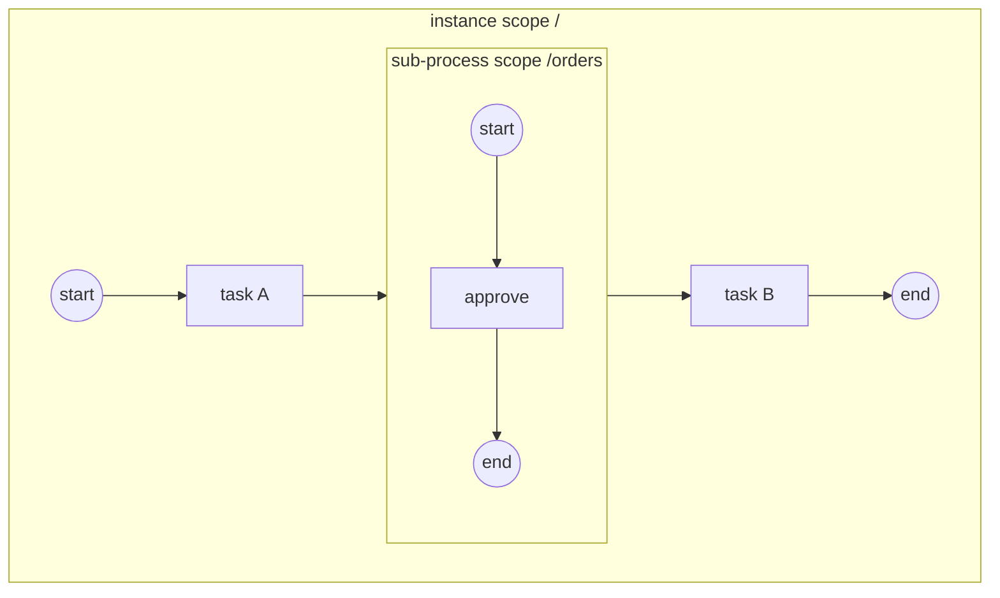

# ADR-023 — Sub-Process & Call Activity Execution Model (nested scopes)

| Поле | Значение |
|---|---|
| Статус | Принято |
| Версия | v.1 |
| Дата | 2026-07-16 (принято 2026-07-17) |
| Владелец | Руслан Габитов |
| Уточняет | [ADR-001 v.6 Execution Model](ADR-001-execution-model.md), [ADR-010 v.2 Process Data Model](ADR-010-process-data-model.md) §2.2, [ADR-018 v.1 Boundary Events & Activity Interruption](ADR-018-boundary-events-and-activity-interruption.md) §2.2/§2.6, [ADR-006 v.3 Events & Subscriptions](ADR-006-events-and-subscriptions.md) §2.6, [ADR-019 v.1 Definition Versioning](ADR-019-definition-versioning-and-registry.md), [SAD-001 v.1](SAD-001-vision-and-architecture.md) §15.3 |

> EN-оригинал — канонический: [ADR-023-sub-process-and-call-activity.md](ADR-023-sub-process-and-call-activity.md). Этот файл — его перевод (twin).

> **Принято** — структурный краеугольный камень 0.2.0, теперь полностью
> приземлён: встроенный Sub-Process по SRD-049 и Call Activity по SRD-050
> (эпик #85 закрыт). Решает, как gobpm выполняет **композицию**: **встроенный
> Sub-Process** (§2.2–§2.6) как **вложенную область выполнения внутри того же
> экземпляра** — один loop, один единственный писатель, *дерево* областей там,
> где сегодня одна плоская область — и **Call Activity** (§2.7) как **дочерний
> экземпляр** отдельно зарегистрированного процесса, вызываемый через
> версионированный реестр со стандартным прямым отображением I/O. Оба несёт
> одна концепция — **область** (scope): совместный контекст токенов/данных/
> событий из §10.5.7 — открывается при входе в композитную activity,
> завершается, когда **в ней не остаётся токенов** (§13.3.4), и отменяема **как
> единое целое** (кооперативная отмена ADR-018, применённая к композитному
> хосту). Граничные события на композитах, **scoped** Terminate End Event
> (§13.5.6) и обход **цепочки областей** для Error, который ADR-006 §2.6
> смоделировал, а ADR-018 отложил, — всё становится живым здесь. Модель области
> намеренно сформирована так, чтобы принять то, что поедет на ней дальше —
> event sub-processes (с conditional start из ADR-006 v.3), Transaction,
> Ad-Hoc, multi-instance — без переделки (§2.8). Реализация нарезана
> сопровождающими SRD; область работ — эпик #85.

---

## 1. Контекст и проблема

Каждый процесс gobpm сегодня **плоский**: один граф, одна область токенов,
одна область данных, один контекст событий. Это была намеренная форма 0.1.0
([SAD-001 v.1 §15.3](SAD-001-vision-and-architecture.md) отложил Sub-Process и
Call Activity до 0.2.0), и набор зафиксированных отложек с тех пор сходился
именно к этому ADR:

- [ADR-018 v.1](ADR-018-boundary-events-and-activity-interruption.md) §2.6:
  граничные события на Sub-Process / Call Activity — «sub-process прерывается
  отменой его области, той же кооперативной отменой, применённой к композитному
  хосту»; механизм был спроектирован расширяться без изменений.
- [ADR-006 v.2 §2.6](ADR-006-events-and-subscriptions.md): модель
  **распространения Error по цепочке областей** — полностью специфицирована,
  ждала появления второго уровня области («переделка тогда не понадобится»).
- [ADR-006 v.3 §2.7](ADR-006-events-and-subscriptions.md): conditional
  **start** принадлежит event sub-processes — «решено сейчас, приземляется с
  workstream'ом Sub-Process».
- Scoped **Terminate End Event** (§13.5.6): сегодня Terminate останавливает
  весь экземпляр, что корректно лишь пока экземпляр И ЕСТЬ единственная область.
- Плоскость данных (ADR-010 §2.2) была **построена как дерево
  container-областей** с первого дня — открытие/закрытие дочерних областей и
  разрешение имён вверх к родителю существуют и задействованы только в корне.

Без композиции движок не может выразить переиспользование (фрагмент, общий
для нескольких процессов), структуру (отменяемую/компенсируемую единицу
работы) или контейнеры обработчиков событий из §13.5.4. Эпик #85 называет
это краеугольным камнем: event sub-processes и Transaction (#91), Ad-Hoc
(#92), scope-chain error management (#79) и boundary-on-composite — всё
надстраивается над моделью области, решённой здесь.

## 2. Решение

### 2.1 Одна концепция: область выполнения

**Область** (scope) — это контекст выполнения из §10.5.7 — совместный набор:

- **токенов**: граф flow-node, в котором движутся токены области;
- **данных**: переменные/data objects, видимые по обходу контейнеров вверх
  («Property Sub-Process доступно этому Sub-Process и его непосредственным
  детям»; данные родителя видны из ребёнка, никогда наоборот);
- **событий**: обработчики, взведённые пока область активна (граничные события
  на её композитном хосте сегодня; обработчики event-sub-process, когда
  приземлится #91).

Области образуют **дерево** с корнем в экземпляре процесса. gobpm
идентифицирует область её **путём** (path) — корень экземпляра `/`, встроенный
sub-process `orders` открывает `/orders`, вложенный — `/orders/retry` —
переиспользуя адресацию container-областей плоскости данных дословно, так что
дерево *данных* и дерево *выполнения* — одно и то же дерево.

**Встроенный sub-process исполняется внутри своего родительского экземпляра.**
Один экземпляр, один event loop, один единственный писатель (ADR-001 v.6):
вложенные токены — это обычные треки, дополнительно **несущие свой путь
области**, а реестры loop'а приобретают осведомлённость об областях вместо
дублирования на каждую область. Дочерний *экземпляр* существует только за
границей **Call Activity** (§2.7), где сам стандарт проводит границу
переиспользования.

### 2.2 Узел встроенного Sub-Process — контейнер, который является узлом

Sub-Process — это **и то и другое**: flow-узел в графе своего родителя
(activity — у него есть входящие/исходящие sequence flows, граничные события,
жизненный цикл) и **контейнер** своего внутреннего графа. Слой модели уже
резервирует эту двойственность (абстракция `Container` называет Sub-Process
одним из видов контейнера); этот ADR её активирует.

**Замыкание строгое** (Table 7.2 p.29; §7.6.1 p.40): *«Sequence Flows не могут
пересекать границу Sub-Process»* — внутренний узел соединяется только с
внутренними узлами; композит соединяется с графом родителя только через рёбра
собственного узла и граничные события.

**Выбор движка — самопротиворечие §13.3.4 разрешено в пользу §7.6.1.**
§13.3.4 (p.430) содержит абзац, допускающий инстанциацию sub-process без
входящих flows через *«Start Events, являющиеся целью Sequence Flows извне
Sub-Process»*. Это прямо противоречит правилам соединения выше (и явной
пометке Table 7.2), является остатком BPMN 1.x и не реализовано ни одним
референсным движком. gobpm безусловно отвергает пересекающие границу flows;
клауза **не поддерживается**.

### 2.3 Инстанциация — детерминированные, валидированные формы

Проверено дословно (§13.3.4 p.430): *«Sub-Process инстанциируется, когда его
достигает токен Sequence Flow. У Sub-Process либо **единственный пустой Start
Event**, который получает токен при инстанциации, либо **нет Start Event**, но
есть Activities и Gateways без входящих Sequence Flows. В последнем случае **все
такие Activities и Gateways получают токен**. У Sub-Process **НЕ ДОЛЖНО быть
непустых Start Events».* Table 10.85 (p.241) обосновывает почему: *«поток
Process (токен) из родительского Process **и есть** триггер Sub-Process»*.

gobpm поддерживает **обе нормативные формы** и отвергает всё остальное на
**валидации процесса** (гейт размещения при сборке модели, прогоняемый при
регистрации до любого экземпляра — тот же шов, что отвергает conditional start
верхнего уровня):

| Форма | Поведение |
|---|---|
| Ровно один **None** Start Event | Start получает токен входа; внутренний поток идёт от него. |
| **Нет** Start Event | Каждая внутренняя activity/gateway без входящих flows получает токен (параллельный fan-out старта). |
| Триггерный Start Event внутри | **Отвергается** — Message/Timer/Signal/Conditional старты принадлежат event sub-processes (#91) или процессам верхнего уровня. |
| None start **смешанный** с другими flow-less узлами | **Отвергается** — спека формулирует формы как исключающую альтернативу; смешанная форма неспецифицирована, а тихие полустарты — класс misbehavior, на котором gobpm падает fail-fast. |
| Более одного None start | **Отвергается** — «единственный пустой Start Event». |

Общие правила activity не тронуты: несколько входящих flows на композите =
неявное exclusive-слияние (каждый прибывающий токен — независимая
инстанциация, §13.3.1); `startQuantity`/`completionQuantity` остаются в своей
существующей отложке.

### 2.4 Жизненный цикл области — open, drain, close

Когда хост-трек входит в узел Sub-Process:

1. **Open** дочерней области (её container данных открывается под путём
   родителя; её обработчики взводятся — сегодня граничные события композита на
   хосте, по ADR-018 без изменений).
2. **Seed** внутренних токенов по валидированной форме (§2.3) — внутренние
   треки, несущие путь дочерней области.
3. **Хост-трек паркуется** — композит является wait-node в потоке родителя,
   ровно как прочие park-and-resume activities движка. Парк **in-instance**:
   для встроенного sub-process дочернего экземпляра не существует (§2.1) —
   внутренние треки суть сиблинги в том же loop'е, и сигнал возобновления — это
   собственный drain-учёт loop'а, а не внешнее завершение.
4. **Drain-completion** (§13.3.4): область завершается, когда **внутри неё не
   остаётся токенов** — каждый внутренний трек завершился и ни одна из её
   внутренних activities больше не активна. Loop, который уже владеет
   per-track-учётом, расширяет его на область.
5. **Close** области: её container данных закрывается (внутренние переменные
   утилизируются вместе с ним — жизненный цикл DataObject привязан к
   контейнеру, §10.5.7), её обработчики разоружаются, хост-трек
   **возобновляется** и выбирает исходящие flows по стандартным правилам
   activity (conditional/default flows включительно).

Внутренние **End Events** сохраняют своё поведение (Message end шлёт, Signal
end бродкастит, §13.3.4); они завершают собственный трек, питая правило drain.
**Error End Event** и **Terminate End Event** получают scope-aware-семантику
(§2.5/§2.6).

### 2.5 Прерывание — область отменяется как единое целое

Всё, что ADR-018 решил для одиночной activity, расширяется на композит заменой
«отменить трек» на «**отменить область**»: остановить каждый трек, чей путь
внутри области (кооперативная отмена, discard checkpoint), закрыть область и
продолжить по прерывающей конструкции:

- **Граничные события на композите** (прерывающие): срабатывание отменяет
  дочернюю область и направляет токен на exception-flow границы — окно
  взведения/разоружения совпадает с окном исполнения хоста, без изменений.
  Непрерывающие границы форкают параллельно как сегодня. Применяется полный
  набор граничных триггеров (Message/Timer/Signal/Conditional по их
  существующим моделям; Error по §2.6).
- **Scoped Terminate** (§13.5.6, проверено): Terminate End Event *«завершает
  свою **охватывающую область** — для sub-process только затронутый экземпляр;
  области более высокого уровня НЕ затрагиваются»*. Достижение Terminate внутри
  sub-process сбрасывает оставшиеся токены **только этой области** и завершает
  композит аномально-но-локально; родитель продолжает. Terminate верхнего
  уровня сохраняет сегодняшнюю whole-instance-семантику — экземпляр попросту
  является корневой областью. (Terminate не запускает компенсацию, по ADR-006
  §2.3.)
- **Instance terminate / shutdown** отменяет корневую область, что каскадирует
  на каждую вложенную область по дереву.

### 2.6 Распространение Error — цепочка областей становится реальной

Это реализует [ADR-006 v.2 §2.6](ADR-006-events-and-subscriptions.md) в
точности как там обещано, заменяя single-scope engine note:

1. Activity проваливается с `BpmnError` → сопоставить **Error-границу на этой
   activity** (сегодняшнее правило, без изменений).
2. Нет совпадения → **идём наружу**: на каждой охватывающей области сопоставить
   Error-границу **на композитном хосте этой области** (внутреннейший
   охватывающий catcher, §10.5.1/§10.5.7). Совпадение отменяет эту область
   (прерывающая семантика границы, Error всегда прерывающий) и направляет её
   exception-flow.
3. Нигде по цепочке нет совпадения → **instance fault** (выбор движка
   unmatched → fault, зафиксированный ADR-006 §2.6).
4. **Error End Event** внутри sub-process бросает на границе своей области:
   обход начинается с охватывающего композита — error end во вложенной области
   перехватываем родителем, и только неперехваченный дефолтит экземпляр (случай
   end-in-error сужается до корневой области).

Escalation следует той же цепочке, когда приземлится (#90); Error-обработчики
event-sub-process присоединяются к тем же точкам совпадения, когда приземлится
#91 (precedence инлайн-обработчика из стандарта решается там).

### 2.7 Call Activity — дочерний экземпляр через реестр

Call Activity — это граница **переиспользования** из стандарта (§13.3.4): она
вызывает `CallableElement` — для gobpm это **отдельно зарегистрированный
процесс**. Композиция — по **ссылке**, а не замыканию, поэтому единица
выполнения — **дочерний экземпляр**, а не вложенная область:

- **Разрешение и привязка версии.** `calledElement` именует ключ реестра
  ([ADR-019 v.1](ADR-019-definition-versioning-and-registry.md)). Привязка по
  умолчанию — **latest-at-launch** (семантика реестра «просто запусти текущую»,
  выровнено с Camunda); **закреплённая версия** — явная опция на Call Activity.
  Разрешение происходит **во время вызова** — отсутствующий ключ/версия
  проваливает activity вызывающего (классифицированная ошибка, входящая в
  цепочку §2.6 как технический fault).
- **Семантика вызова** (§13.3.4, проверено): вызываемый процесс инстанциируется
  своим **None** Start Event; его триггерные Start Events — легальные на
  глобальном процессе — **игнорируются на пути вызова** (*«эти непустые Start
  Events суть альтернатива пустому Start Event и потому игнорируются, когда
  Process вызывается»*). У вызванного экземпляра та же семантика
  инстанциации/завершения, что и у sub-process.
- **Вызывающий паркуется асинхронно** — Call Activity является wait-node в
  родителе (паттерн park/resume внешней работы из job-шва движка): дочерний
  экземпляр гоняет собственный loop; его терминальное состояние заново входит в
  loop вызывающего и возобновляет запаркованный трек. Completed → выходы
  биндятся и вызывающий продолжает; Terminated/Failed → fault входит в цепочку
  §2.6 вызывающего на узле Call Activity (перехватываем Error-границей на нём).
- **I/O — прямое отображение из стандарта** (§10.4/семантика данных,
  проверено): DataInputs/DataOutputs Call Activity отображаются на
  InputOutputSpecification вызываемого **без явных data associations** —
  позиционная/по-имени прямая привязка. Входы биндятся в корневую область
  ребёнка при запуске; выходы биндятся обратно в область вызывающего при
  завершении. Плоскость данных ребёнка **изолирована** — никакой обход вверх не
  пересекает границу вызова (контракт переиспользования: вызванный процесс
  должен исполняться идентично, как бы до него ни дошли).
- **Каскад отмены — выбор движка** (стандарт молчит о завершении по инициативе
  вызывающего): отмена Call Activity вызывающего — прерывающая граница на ней,
  scoped Terminate её области или instance terminate — **каскадирует Terminate
  дочернему экземпляру**. Fire-and-forget-вызов вне области (нет BPMN-
  конструкции, выражающей его; пересмотреть только при реальной необходимости).
- **Связка наблюдаемости**: факты дочернего экземпляра несут связку с родителем
  (id экземпляра вызывающего + id узла Call Activity), чтобы трейс можно было
  сшить через границу (§6).

### 2.8 Спроектировано под: что поедет на модели области дальше

Решено здесь как **швы**, реализуется собственными workstream'ами:

- **Event sub-processes** (#91): контейнер обработчиков, **взведённый пока его
  охватывающая область открыта** — паттерн boundary-watch, сдвинутый с окна
  activity на окно области. Его триггерный start переиспользует существующую
  машинерию триггеров по виду (hub waiters для Message/Timer/Signal; loop-local
  conditional subscriptions для **conditional start, уже решённого ADR-006
  v.3**; обход §2.6 для Error). Прерывающий start обработчика отменяет
  сиблинг-треки своей области — scope-cancel из §2.5, переиспользован. Бюджет
  прерывающего обработчика (один на Event Declaration, **разделяемый с
  граничными событиями**) и правила precedence absorb-vs-rethrow — это решения
  того ADR.
- **Transaction** (#91): вариант sub-process, чей Cancel End / Cancel boundary
  едут на scope-cancel плюс компенсации — ничто в этой модели этому не мешает.
- **Ad-Hoc** (#92): контейнер, чьё внутреннее включение определяется выбором, а
  не потоком — переиспользует область (данные/жизненный цикл/отмену) и заменяет
  только правило seeding'а токенов.
- **Multi-instance на композитах** (#88): каждый MI-экземпляр — своя область
  (per-instance snapshot данных; Terminate затрагивает только затронутый
  экземпляр, §13.5.6 — scoped Terminate выше уже так и формулирует).
- **Escalation scope-chain** (#90): обход §2.6 с некритической семантикой.

### 2.9 Рекурсия и глубина

Глубина вложенности **не ограничена by design** (области — дерево; пути
компонуются). Call Activity может вызвать собственный процесс (рекурсия —
легальная композиция — разрешение по ключу реестра во время вызова);
статическая проверка цикла ни требуется стандартом, ни разрешима между
версиями. Runaway-рекурсия — ошибка моделирующего; §6 рекомендует
операционный ограничитель глубины, а не запрет на уровне модели.

## 3. Grounding по стандарту

| Утверждение | Источник |
|---|---|
| Инстанциация токеном родителя; уникальный None start XOR no-start/flow-less seeding; непустые старты запрещены | §13.3.4 p.430 (проверено дословно через spec notebook) |
| «Поток Process (токен) из родительского Process есть триггер Sub-Process»; None — единственный тип старта sub-process | §10.5.2 p.241 + Table 10.85 |
| Sequence flows не могут пересекать границу sub-process | Table 7.2 p.29; §7.6.1 p.40 (абзац external-start из §13.3.4 отвергнут как самопротиворечивый — выбор движка §2.2) |
| Completion = внутри не осталось токенов, ни одна внутренняя activity не активна | §13.3.4 p.430 (`sub-processes.md`) |
| Scope = контекст данных/событий/conversations; видимость property parent→children; жизненный цикл DataObject привязан к контейнеру | §10.5.7 p.280 (`data.md`) |
| Scoped Terminate — только затронутый (sub-)экземпляр; более высокие области не затронуты | §13.5.6 p.443 (`event-handling.md`) |
| Error/Escalation распространяются к внутреннейшему охватывающему catcher; Error критический | §10.5.1 / §10.5.7 (`event-handling.md`) |
| Call Activity вызывает CallableElement; та же семантика инстанциации/завершения, что у sub-process; триггерные старты вызванного процесса игнорируются на пути вызова | §13.3.4 p.430-431 (проверено дословно) |
| I/O Call Activity отображается на callable без явных data associations | §10.4 семантика данных (`data.md` §8) |
| Граничные триггеры на композитах; Error всегда прерывающий | §10.5.4 / §10.5.6 (`event-handling.md` §4) |
| Event sub-process: единственный триггерный start, event-instantiated, контекст родителя, бюджет прерывающего | §13.5.4 p.436-439; §10.5.2 p.241 («An Event Sub-Process MUST have a single Start Event») — только швы, решается с #91 |
| Неявное exclusive-слияние на нескольких входящих flows | §13.3.1 p.427 |

Молчания стандарта, разрешённые как выборы движка: абзац
boundary-crossing-start (§2.2); каскад caller-cancel на вызванный экземпляр
(§2.7); unresolved-error → instance fault (унаследовано от ADR-006 §2.6).

## 4. Рассмотренные альтернативы

| Альтернатива | Почему отвергнута |
|---|---|
| **Дочерний экземпляр на каждый встроенный sub-process** (единообразно с Call Activity) | Встроенный sub-process *разделяет* контекст родителя (видимость §10.5.7; обработчики #91 читают данные охватывающей области) — дочернему экземпляру понадобился бы cross-instance data bridge, который обход вверх даёт бесплатно; он умножает loop'ы и event-обвязку ради нулевого выигрыша в изоляции; связывание completion/cancel становится inter-instance-протоколом вместо in-loop-учёта. Граница экземпляра осмысленна — стандарт ставит её на границе *переиспользования* (Call Activity), и так же делает этот ADR. |
| **Graph inlining для Call Activity** (скопировать вызываемый граф в snapshot вызывающего при регистрации) | Ломает контракт переиспользования: привязка замерзает на регистрации (ADR-019 даёт launch-time latest), рекурсия становится невозможной (бесконечное разворачивание), собственная идентичность наблюдаемости/версионирования вызванного процесса исчезает, а изоляция вызывающий/вызванный (§2.7) теряется. |
| **Уплощение встроенного sub-process** в граф родителя с name-prefixed узлами (без рантайм-области) | Теряет ровно то, ради чего существует композит: drain-completion, scope-cancel, scoped Terminate, точки совпадения цепочки ошибок, per-scope жизненный цикл данных — каждое потребовало бы per-node special-casing, который концепция области даёт один раз. |
| **Engine-global реестр областей** (области как first-class engine-объекты вне экземпляров) | Ничто не пересекает границу экземпляра, кроме протокола Call Activity; вынос областей из экземпляра заново ввёл бы shared-state-блокировки, которые убрали ADR-001/ADR-017. |

## 5. Последствия

- Движок приобретает **композицию**: переиспользование (Call Activity над
  версионированным реестром), структуру (отменяемые единицы) и контейнер,
  которого требуют конструкции #91/#92. Краеугольная строка conformance-
  трекера разблокирует четырёх зависимых.
- **Loop остаётся единственным писателем.** Вложенное выполнение добавляет
  осведомлённость об областях существующим реестрам (трек знает свой путь
  области; completion/cancel учитывается per-subtree) — не второй домен
  синхронизации. Это тот же ход «расширь учёт, а не модель конкурентности»,
  что и у ADR-017.
- **Плоскости данных не нужна новая концепция** — дерево container-областей,
  построенное ADR-010 §2.2, наконец задействует свои дочерние области;
  видимость и утилизация приходят из существующего обхода вверх и close.
- Обещание ADR-018 сдержано: boundary-on-composite приходит **без изменений
  механизма границ** — только композитный хост и scope-cancel за тем же
  интерфейсом.
- Engine note из ADR-006 §2.6 («single-scope reality») уходит в отставку:
  цепочка областей обходится. Error End Event перестаёт всегда дефолтить
  экземпляр — он становится перехватываемым охватывающими областями (§2.6.4).
- **Риск — сложность loop'а.** Учёт областей (per-scope active counts,
  subtree-отмена, drain-детекция) концентрируется в loop'е; сопровождающие SRD
  должны держать его как table-driven-бухгалтерию, а single-writer-конфайнмент
  делает его детерминированно тестируемым.
- **Риск — форма snapshot'а.** Плоский snapshot становится деревом (узел-
  контейнер, владеющий внутренним графом); клонирование, wiring и статические
  предвычисления (instantiating starts, наличие conditional) рекурсируют.
  Механически, но задевает класс багов clone-корректности (пропущенное поле
  тихо отключает фичу) — приземление должно закрепить каждую рекурсивную копию
  тестами.
- Terminate End Event внутри sub-process **меняет смысл** с «завершить
  экземпляр» на «завершить область» — семантически новое, не поломка: никакая
  существующая модель не может разместить Terminate внутри sub-process сегодня.

## 6. Рекомендации по enterprise-готовности

- **Наблюдаемость.** Жизненный цикл области должен быть first-class в потоке
  фактов: scope opened/completed/cancelled с путём области и идентичностью
  композитного узла — оператор процесса рассуждает в единицах sub-process, а не
  сырых треков. Связка Call Activity: факты дочернего экземпляра несут
  `parent_instance_id` + `call_activity_node_id`; вызывающий эмитит
  call-started/call-completed. Сохранить существующие виды там, где они подходят
  (NodeProgress на композитном хосте), и предпочесть один новый вид
  scope-lifecycle перегрузке InstanceState.
- **Операционный ограничитель глубины.** Выставить engine-опцию максимальной
  глубины дерева областей + глубины call-chain (дефолт щедрый, напр. 64),
  проваливающую экземпляр классифицированной ошибкой, именующей цепочку —
  превращая runaway-рекурсию из исчерпания ресурсов в диагностируемый fault.
- **Дисциплина закрепления версий.** Latest-at-launch — правильный дефолт, но
  продакшн-вызывающие должны иметь возможность закрепить (опция существует в
  §2.7); рекомендуется выводить разрешённые (key, version) в факт call-started,
  чтобы операторы могли аудировать, что реально исполнилось.
- **Контрактное тестирование.** Вызванный процесс — это интерфейс: его
  InputOutputSpecification — контракт, к которому биндится вызывающий.
  Рекомендуется registry-time-валидация, что закреплённая версия callable
  удовлетворяет объявленному I/O Call Activity, и документированный путь
  deprecation для callables (зарегистрировать новую версию → мигрировать
  вызывающих → вывести из эксплуатации).
- **Чувствительные данные.** Граница вызова — граница данных: только
  объявленные входы её пересекают. Документировать это как гарантию изоляции
  (никакой случайной утечки parent-scope в переиспользуемые процессы).

## 7. План раскатки

1. **Slice 1 — встроенный Sub-Process** (сопровождающий SRD): модель узла-
   контейнера + формы валидации (§2.3), дерево snapshot'а, scope-aware loop
   (open/seed/drain/close, per-scope-учёт), scope cancel + boundary-on-composite,
   scoped Terminate, цепочка ошибок §2.6.
2. **Slice 2 — Call Activity** (свой SRD): разрешение callable + привязка
   версии, протокол launch/park/resume дочернего экземпляра, прямая привязка
   I/O, каскад отмены, связка наблюдаемости.
3. Затем, на этом субстрате, собственные концепции: event sub-processes +
   Transaction (#91), Ad-Hoc (#92), MI на композитах (#88), Escalation (#90).

## 8. Ссылки

- BPMN 2.0 (v2.0.2, formal/2013-12-09): §7.6.1, Table 7.2, §10.4, §10.5.1,
  §10.5.2 (Table 10.85), §10.5.4, §10.5.6, §10.5.7, §13.3.1, §13.3.4,
  §13.5.4, §13.5.6 — ключевые клаузы start-семантики проверены дословно против
  PDF через spec notebook (сессия 2026-07-16); vendored-извлечение
  (`docs/bpmn-spec/semantics/sub-processes.md`, `data.md`,
  `event-handling.md`) несёт рабочие копии.
- [ADR-001 v.6](ADR-001-execution-model.md) — ядро track/loop single-writer,
  которое это расширяет.
- [ADR-010 v.2](ADR-010-process-data-model.md) §2.2 — дерево container-областей,
  которое это активирует.
- [ADR-018 v.1](ADR-018-boundary-events-and-activity-interruption.md) —
  механизм прерывания, который это применяет к композитам.
- [ADR-006 v.3](ADR-006-events-and-subscriptions.md) §2.6/§2.7 — модель
  распространения ошибок, реализованная здесь; conditional start, хостящийся
  в §2.8.
- [ADR-019 v.1](ADR-019-definition-versioning-and-registry.md) — реестр, против
  которого разрешается Call Activity.
- GitHub-эпики: #85 (этот ADR), #91, #92, #88, #90, #79.

## Открытые вопросы

Нет.

## История документа

| Версия | Дата | Автор | Изменение |
|---|---|---|---|
| v.1 | 2026-07-16 | Руслан Габитов | Черновик концепции. Решает композицию на ОДНОЙ концепции — **области выполнения** (контекст токенов/данных/событий §10.5.7) как дереве внутри экземпляра: **встроенный Sub-Process** — это узел-контейнер, открывающий дочернюю область в ТОМ ЖЕ экземпляре (один loop, single writer сохранён; треки несут пути областей), с **валидированными формами инстанциации** (уникальный None start XOR no-start/flow-less seeding — §13.3.4 проверено дословно; триггерные/смешанные/множественные старты отвергаются на валидации процесса), **drain-completion** (не осталось токенов), **scope-cancel как единицей прерывания** (boundary-on-composite через неизменённый механизм ADR-018; **scoped Terminate** по §13.5.6) и **обходом Error по цепочке областей**, реализующим ADR-006 v.2 §2.6 (граница activity → охватывающие композиты → instance fault; Error End Event становится перехватываемым охватывающими областями). **Call Activity** — граница переиспользования: **дочерний экземпляр** callable, разрешённого через реестр (ADR-019; **дефолт latest-at-launch**, опция закрепления), async park/resume для вызывающего, **прямое отображение I/O** из стандарта (без явных associations), изолированная плоскость данных ребёнка и **каскад terminate** при отмене вызывающего (стандарт молчит, выбор движка). Отвергает абзац boundary-crossing-start из §13.3.4 как самопротиворечивый с §7.6.1/Table 7.2 (выбор движка, задокументировано). §2.8 формирует модель под то, что поедет на ней: event sub-processes (#91 — scope-armed handlers включая conditional start из ADR-006 v.3), Transaction, Ad-Hoc, MI-per-scope, Escalation chain. Отвергнутые альтернативы: child-instance-per-embedded, graph inlining Call Activity, уплощение, engine-global scopes. Grounded против PDF BPMN 2.0 (клаузы start-семантики проверены дословно через spec notebook) и `docs/bpmn-spec/`. Реализация нарезана сопровождающими SRD (сначала встроенный, вторым Call Activity); эпик #85. |
| v.1 | 2026-07-17 | Руслан Габитов | **Принято** — оба слайса приземлены: встроенный Sub-Process (SRD-049) и Call Activity (SRD-050); эпик #85 закрыт. Только флип статуса, без изменения концепции (без bump версии). |
