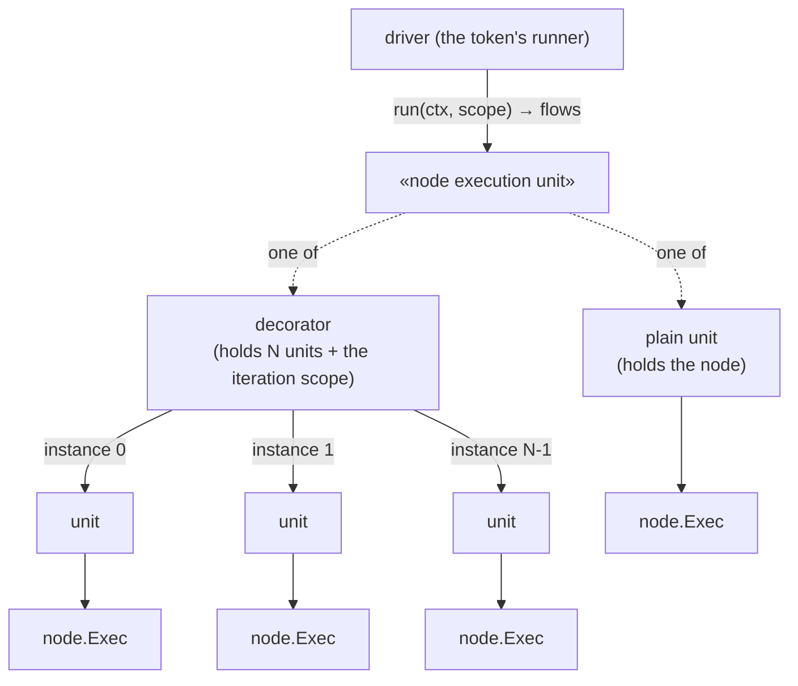
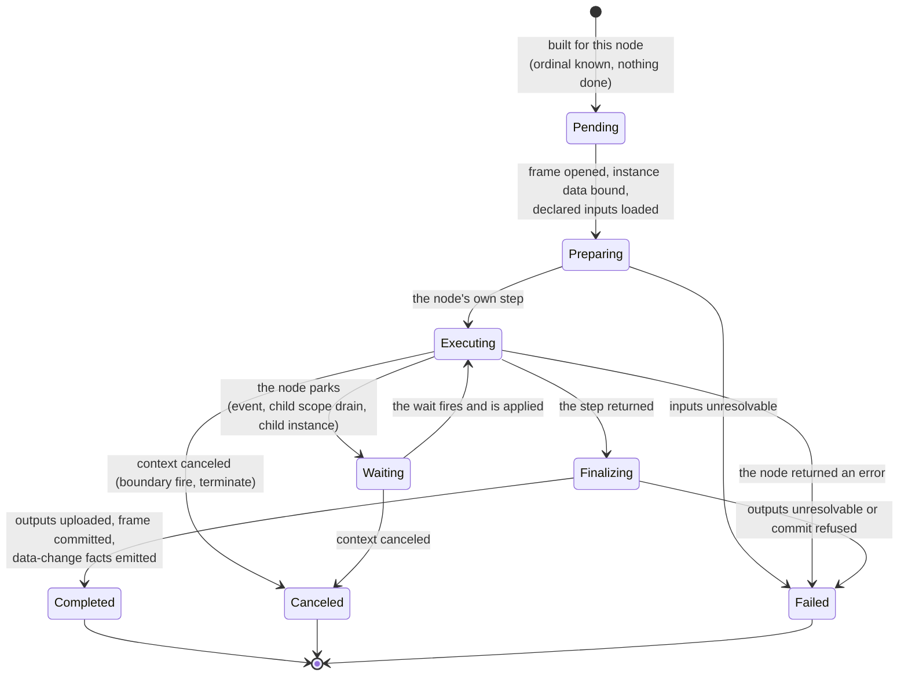
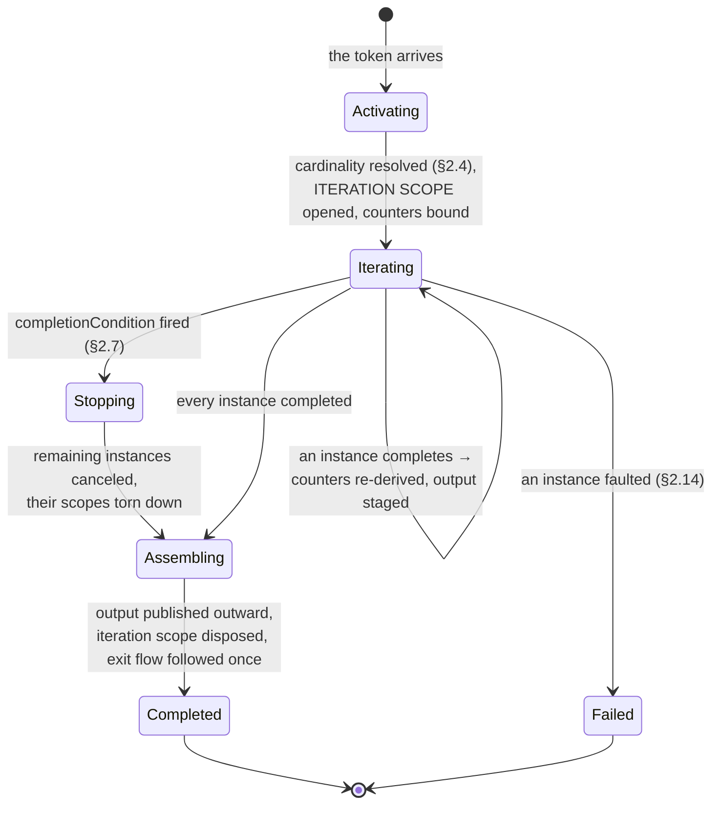
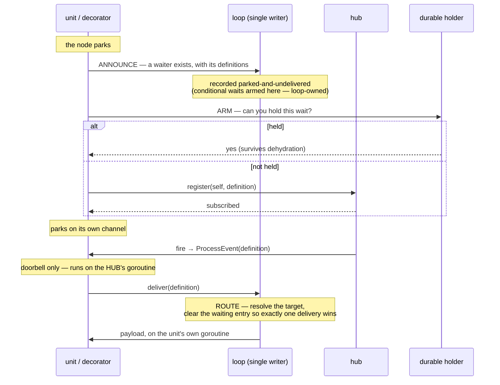

# ADR-025 — Activity Iteration: Standard Loop & Multi-Instance

| Field | Value |
|---|---|
| Status | Draft (v.5.1 — flips back to Accepted when the §2.13–§2.15 changes land) |
| Version | v.5.1 |
| Date | 2026-08-17 |
| Owner | Ruslan Gabitov |
| Refines | [SAD-001](SAD-001-vision-and-architecture.md) §5 / §15.3, [ADR-023](ADR-023-sub-process-and-call-activity.md) (the execution-scope model this reuses), [ADR-018](ADR-018-boundary-events-and-activity-interruption.md) (boundary catch for thrown behavior events), [ADR-017](ADR-017-channel-based-event-processing.md) (the single-writer execution model §2.12–§2.13 extend), [ADR-006](ADR-006-events-and-subscriptions.md) (event throwing/catching; §2.9 in-instance delivery, whose processor-identity seam §2.13 moves) |
| Related | [ADR-007](ADR-007-in-memory-long-waits.md) §2.4 (holdable waits and the per-arm releasability rule §2.13 extends to iteration granularity), [ADR-013](ADR-013-instance-observability.md) (the token view §2.9.1 enriches), [ADR-010](ADR-010-process-data-model.md) (the execution frame that isolates an iteration), [ADR-036](ADR-036-incidents-and-fault-tolerance.md) §2.1–§2.3 (the incident and retry contract §2.14 applies at iteration granularity) |

This ADR decides how an activity marked with *loop characteristics* runs **more
than once**: BPMN's **Standard Loop** (a condition-driven sequential loop,
§13.3.6) and **Multi-Instance** (a cardinality-driven fan-out, sequential or
parallel, over a data collection, §13.3.7). It fixes what an iteration means —
how instances are counted, isolated, fed and re-assembled, when the activity is
done, and what an observer sees — and it fixes the runtime shape that carries
them: a **node executor** runs one instance of an activity and owns whatever
that instance awaits, and a **decorator** holds N of those and implements the
same interface, so a track drives one executor and cannot tell how many
instances are behind it. A track therefore means *a token walking a path*, and
nothing outside the decorator learns that the node iterates.

It is prescriptive and grounded in the BPMN 2.0 object model; names of code
symbols are deliberately absent, because that grounding belongs to the
accompanying SRDs, which land it incrementally.

---

## 1. Context & problem

A token reaching an activity runs it **once** — that is the base case every
other decision in the engine is built on. BPMN 2.0 lets an activity carry *loop
characteristics* that make it run repeatedly without duplicating the node in the
diagram, and an engine that supports them has to answer what the extra
executions are, what they share, and what an observer of them sees. Two forms
exist
(§13.3), both attached to any `Activity` — `Task`, `SubProcess`, or
`CallActivity`:

- **Standard Loop** (§13.3.6) — a structured `while`/`until` loop: run the
  activity, re-evaluate a boolean `loopCondition`, repeat. Purely sequential.
  Workflow pattern WCP-21 (Structured Loop).
- **Multi-Instance** (§13.3.7) — run the activity a *fixed* number of times
  (decided once at activation), either **sequentially** (one after another) or
  **in parallel** (all at once), typically **once per element of a collection**.
  Workflow patterns WCP-13/14 (Multiple Instances), WCP-34/36. This is the
  engine's answer to "do X for each line item in the order".

Both are core to the BPMN *Process Execution Conformance* target
([conformance.md](../bpmn-spec/conformance.md), the project's scope). Mass
per-element processing is impossible to express without them.

The problem this ADR solves is **conceptual**, not mechanical: *what does it
mean for one activity to be many executions* — how instances are counted, how
each instance is isolated from its siblings, how per-instance data is split from
and re-assembled into a collection, when the whole thing is considered done, and
how progress can be observed from the boundary. The mechanics (which existing
runtime seam carries each part) are the SRDs' job.

### Object model (BPMN 2.0, verbatim from the vendored extract)

From [activities.md §StandardLoopCharacteristics / §MultiInstanceLoopCharacteristics /
§ComplexBehaviorDefinition](../bpmn-spec/elements/activities.md) and
[multi-instance.md](../bpmn-spec/semantics/multi-instance.md):

- `StandardLoopCharacteristics → LoopCharacteristics → BaseElement`:
  `testBefore` (Boolean, default `False`), `loopCondition` (Expression),
  `loopMaximum` (Integer).
- `MultiInstanceLoopCharacteristics → LoopCharacteristics → BaseElement`:
  `isSequential` (Boolean, default `False`), `behavior`
  (`MultiInstanceBehavior`, default `All`), `loopCardinality` (Expression),
  `loopDataInputRef` / `loopDataOutputRef` (ItemAwareElement refs), `inputDataItem`
  (DataInput), `outputDataItem` (DataOutput), `complexBehaviorDefinition`
  (0..*), `completionCondition` (Expression), `oneBehaviorEventRef` /
  `noneBehaviorEventRef` (EventDefinition refs).
- `ComplexBehaviorDefinition → BaseElement`: `condition` (FormalExpression),
  `event` (ImplicitThrowEvent).

`LoopCharacteristics` is the shared abstract base — the two concrete forms are
mutually exclusive on a given activity.

---

## 2. Decision

### 2.1 One family: loop characteristics as an activity marker

An activity's iteration is a **marker** it carries, not a new node type. The
abstract `LoopCharacteristics` gains two concrete forms —
`StandardLoopCharacteristics` and `MultiInstanceLoopCharacteristics` — and an
activity carries **at most one**. An activity with no loop characteristics runs
once — iteration is strictly additive, and a model that declares none is
unaffected by everything below.

The marker is orthogonal to *what* the activity is: the same iteration model
wraps a Task, a Sub-Process, or a Call Activity. A looped Sub-Process runs its
whole body per iteration; a looped Task runs the task per iteration; a looped
Call Activity launches a child instance per iteration.

### 2.2 Each iteration is isolated; the mechanism fits the activity kind

The central decision: **each iteration of a looped activity runs in its own
isolated execution context**, so per-iteration state — the current element, a
per-iteration `loopCounter` — never bleeds across iterations. Isolation is the
invariant; the *mechanism* is the cheapest one that satisfies it for the
activity kind:

- **A leaf activity (Task)** iterates **in place**: the engine re-executes the
  activity once per pass, each pass in a **fresh execution frame**. A frame is
  already the per-execution data boundary (ADR-010), so a new frame per
  iteration *is* the isolation — no heavier construct is needed, and the
  activity's single outgoing flow is followed once, after the loop exits.
- **A composite activity (Sub-Process, Call Activity)** iterates by **re-opening
  its child scope per iteration** — the ADR-023 nested-scope open/drain/close
  lifecycle it already runs for its body. Sequential iteration = the scope for
  iteration *i+1* opens only after iteration *i*'s scope has drained and closed
  (the re-entry seam); the composite follows its single outgoing flow once, after
  the final iteration.

Both mechanisms share one lifecycle shape — run, test the continuation, repeat —
and both let a boundary event on the looped activity arm **once** and guard every
iteration (the desirable BPMN semantics: a boundary timer spans the whole loop).

**One rule decides the mechanism: a frame per iteration always; a scope only
where the activity is itself a scope host.** Every iteration runs in its
own execution frame, the per-execution data boundary (ADR-010): its inputs,
properties and locals are its own, and no iteration can read another's
in-flight state. A composite additionally opens its child scope per iteration —
not for isolation, but because a Sub-Process body *is* a scope and needs one to
exist at all.

A frame bounds an **execution**, not its **results**: what an instance commits
goes to the enclosing scope. What that means across iterations — a reduce when
sequential, order-dependent when parallel, deterministic when a strategy is
declared — is §2.6.1, and it is a separate decision from this one. Reading the
frame as though it also isolated results is the mistake §2.6.1 exists to
prevent.

**Parallel Multi-Instance is not an exception to that rule.** It is tempting to
give every parallel instance its own scope even for a leaf Task, reasoning that
concurrent instances must not share state. The premise is true; the conclusion
only follows if an iteration is executed by a *track*, because one track has one
frame — so concurrency would force a heavier construct. An iteration is executed
by a **node executor** (§2.13) that owns its own frame, so concurrent iterations
have concurrent frames and no exception is needed. A leaf activity therefore
never gets a child scope, sequential or parallel; a composite always does,
sequential or parallel; and *why* is the same sentence in both cases.

A looped leaf Task gets no child scope for a second reason too: a Task is not a
scope container, so a scope would mean seeding an empty inner graph and routing
a synthetic completion, all for isolation the fresh frame already provides.

Per-instance **addressability** does not depend on a scope either: it is the
executor's ordinal (§2.9) — stable, derived from the activity and the 0-based
instance number, and available whether or not a scope exists.

This subsection fixes the *mechanism*; **who drives it** for a composite activity
— the activity's own off-loop execution, not the per-instance loop goroutine — is
§2.12.

### 2.2a Rejected: an iteration scope

The alternative to §2.2's rule is that an iterated activity gets its own data
scope, owned by the decorator, holding Table 10.30's outer attributes and the
output staging — so those values could not outlive the activity nor collide with
model data.

**It is rejected, because §2.9.2 already solves that problem and solves it
better.** The two defects the scope would be for are exactly the two §2.9.2
names, and its answer is the reserved read-only **RUNTIME** source: an engine-served
subtree that no model can declare into and no model can overwrite, whose
values are computed from live state rather than stored. A scope isolates by
*position in a tree*; RUNTIME isolates by *who answers the read*. The second
is stronger — it cannot be written at all — and it costs no structure.

**What the scope would have cost, for nothing gained:** a level between the
activity's container and its instances, so every per-instance scope path gains
a segment. Paths reach the observability facts, key the compensation ledger,
and are what a restored scope is matched by. Four mechanisms would have moved
to buy an isolation that a supplier already provides.

**The rule this leaves.** One problem, one mechanism. Engine-published values
that a model must not overwrite live in RUNTIME — which is where the instance
state, the start time and the performer register already live. A second
mechanism for a problem that already has one is the mistake this rejection
exists to prevent.

**What the scope would not have bought either** is per-execution addressing.
`loopCounter` differs per executing instance, and §2.9.2 resolves that by
publishing it **frame-local** — the frame already being the per-execution
address space. An iteration scope sits at the activity, one level above the
instances, so it would have been no better placed to tell them apart.

**The output staging** is the one thing RUNTIME does not answer for: it is not
a named variable a model reads, but the decorator's own working state. It
needs no scope either — it is the decorator's field, and §2.6's positional
assembly reads it there.

### 2.3 Standard Loop — a sequential condition-driven loop

A Standard-Loop activity runs its inner activity repeatedly **in sequence**,
one iteration at a time (by the §2.2 mechanism for its activity kind), governed
by:

- `loopCondition` — a boolean expression re-evaluated each pass. The loop
  continues while it is `true`.
- `testBefore` — `False` (default) → **post-tested** (`do…while`): run once,
  then test. `True` → **pre-tested** (`while`): test before each run, so zero
  iterations are possible.
- `loopMaximum` — an optional cap: when set, no more than that many iterations
  run regardless of the condition (a guard against runaway loops; unset =
  unbounded).

The loop exposes a per-iteration **`loopCounter`** (0-based) to expressions
inside the activity and to `loopCondition`. Standard Loop has **no** collection
data-flow, no parallelism, no completion condition, and no `behavior` — those
are Multi-Instance concepts. When the loop finishes (condition `false` or the
maximum reached), control flows out of the activity's outgoing sequence flow
once.

### 2.4 Multi-Instance — cardinality decided once at activation

A Multi-Instance activity computes its instance count **exactly once, at
activation** (§13.3.7), from one of two sources — the engine supports both:

- `loopCardinality` — an integer-valued expression, evaluated once.
- **Collection** — `loopDataInputRef` points at a collection-valued data item;
  the cardinality is that collection's element count.

The count is fixed for the activity's lifetime: adding elements to the source
collection mid-flight does not spawn more instances. If both a cardinality and a
collection are supplied, that is a modelling error surfaced at validation (they
are alternative cardinality sources, not composable).

### 2.5 Sequential vs. parallel

`isSequential` selects the execution shape:

- `True` — **sequential**: instance *i+1* begins only after instance *i* has
  completed (by the §2.2 mechanism for the activity kind). At most one instance
  runs at a time; ordering is the collection/cardinality order.
- `False` (default) — **parallel**: all instances start at activation and run
  concurrently, each in its own execution context (§2.2); the activity completes
  when the last one does. The per-iteration **frame** is what keeps concurrent
  instances from sharing per-instance data — not a scope, which a leaf activity
  never gets.

Both shapes expose per-instance **`loopCounter`** (0-based ordinal) and the
aggregate runtime attributes of §2.9 to the activity's expressions.

For a composite activity these two shapes are the decorator's two driving
strategies — await-each (sequential) and fan-out-then-await-all (parallel) — run
on the activity's own execution (§2.12).

### 2.6 Data flow — split in, assemble out

Multi-Instance is fundamentally a **collection transform**
([multi-instance.md §Data semantics](../bpmn-spec/semantics/multi-instance.md)).
The spec calls the split/assemble *mediator* "under-specified"; this ADR fixes a
concrete engine convention:

- **Split.** Before each instance runs, the engine binds that instance's
  `inputDataItem` to element *`loopCounter`* of the `loopDataInputRef`
  collection. The instance reads it by name in its input data associations,
  exactly like any other per-scope datum.
- **Assemble.** When an instance completes, the engine writes that instance's
  `outputDataItem` into slot *`loopCounter`* of the `loopDataOutputRef`
  collection, preserving positional correspondence with the input.
- **Visibility barrier.** The spec **recommends** the `loopDataOutputRef`
  collection not be accessible until *all* instances have completed
  ([multi-instance.md §Data semantics](../bpmn-spec/semantics/multi-instance.md):
  "should not be accessible" — token-passing alone cannot guarantee the
  collection is fully written). The engine **strengthens this recommendation
  into a guarantee**: the collection must not be readable by concurrent
  activities before completion — the assembled output is published to the
  enclosing scope only at activity completion, never incrementally.

Positional assembly (output slot = input ordinal) is the engine's realization of
the spec's under-specified mediator, chosen for determinism: the output
collection mirrors the input order regardless of instance completion order
(critical for parallel MI, where completion order is nondeterministic).

#### 2.6.1 Iteration results — one default, three declared strategies

§2.6 above governs the **declared** MI collection. It says nothing about what
happens to everything *else* an instance writes, and that gap is load-bearing:
an instance runs in its own frame, but a frame's commit target is the
**enclosing scope** — isolation of an execution is not invisibility of its
writes. This subsection decides what an iteration's results mean.

**The default is last write wins.** Each instance executes in its own frame;
whatever it commits lands in the enclosing scope, and a later write replaces an
earlier one. The consequence differs by sequencing, and both are intended:

- **Sequential iteration (Standard Loop, sequential MI) is therefore a reduce.**
  Iteration *k* reads what iteration *k-1* committed, accumulating in the
  enclosing scope. This is not new — it is what a Standard Loop already does,
  since each pass commits there and the next pass resolves frame-first then
  walks up — but it was implicit, and an implicit fold is a thing readers
  rediscover by experiment. It is the default *because* it is the useful one:
  "keep a running total", "narrow a candidate set", "append to a report".
- **Parallel Multi-Instance is therefore order-dependent for undeclared
  writes.** Which instance's value survives depends on completion order, which
  the engine does not fix. This is stated plainly rather than hidden, and it is
  exactly why the declared strategies below exist: a model that needs every
  instance's result must **say so**, and then gets a deterministic one.

**Three declared strategies, each opt-in and deterministic:**

| Strategy | Result | Standard footing |
|---|---|---|
| **array** | results indexed by **ordinal** — slot *i* holds instance *i*'s output, regardless of completion order | For MI this IS the spec's `loopDataOutputRef` assembly (§13.3.7, §2.6 above). For a Standard Loop it is an **engine extension**: the spec gives a loop no output aggregation at all |
| **map** | results keyed by a per-instance **key**, evaluated in that instance's frame at its completion | **Engine extension** for both kinds — BPMN's MI output is an ordered collection, never a keyed one |
| **reduce** | the accumulating value in the enclosing scope — the default, nameable so a model can declare the intent it is relying on | **Engine convention**; the spec is silent |

**The map's key is an expression, evaluated in the completing instance's
frame.** That timing is the point: it lets the key use something the instance
*produced* — the assignee of a User Task being the motivating case, since it is
unknown until the task is claimed. No bespoke key mechanism is introduced; the
expression reads the same data any other expression can, including the
iteration runtime values of §2.9.2.

Two rules, and they differ deliberately:

- **An empty or missing key refuses.** There is no sensible slot for a result
  with no key, and silently dropping one instance's output is the failure this
  whole subsection exists to make impossible.
- **A duplicate key overwrites by default, and `ErrorOnKeyRewrite` makes it a
  fault.** Overwriting is consistent with the last-wins default above rather
  than an exception to it, and the loss is *detectable* rather than silent:
  §2.9.2 publishes the instance total, so a model or host comparing the map's
  size against it sees that N instances produced fewer than N entries. A model
  that treats a collision as a modelling error — a fan-out over participants
  who must each answer once — sets the option and gets a fault naming both
  ordinals and the key.

**The visibility barrier (§2.6) covers a declared result.** An array or a map
publishes to the enclosing scope once, at activity completion — never
incrementally, so no concurrent activity can read a half-assembled result. The
default (last-wins) has no barrier by construction: it is the enclosing scope,
written as instances go.

**Engine notes.** BPMN §13.3.7 defines the ordered output collection and is
otherwise **silent** on what an iteration's other writes mean; §13.3.6 gives a
Standard Loop no data aggregation whatsoever. The default, the reduce naming,
the loop's array and the map in both kinds are therefore engine choices, and
the parallel default's order-dependence is a documented property rather than a
guarantee. A modeller who needs determinism declares a strategy; one who needs
a running total gets it without declaring anything.

### 2.7 Completion condition — early, orderly cancellation

`completionCondition` is a boolean expression **evaluated each time an instance
completes** (§13.3.7):

- `true` → the Multi-Instance activity is **done now**: the remaining
  not-yet-completed instances are **cancelled** (their scopes torn down as a
  unit, the ADR-018 §interruption mechanism applied per instance scope), and
  control flows out of the activity.
- `false` → that instance is counted; the remaining instances continue.

Without a `completionCondition`, the activity completes when **all** instances
have completed. Cancellation is orderly: cancelled instances do not contribute
their `outputDataItem` (their slot stays at its pre-run value), and the output
collection is still published atomically per §2.6.

### 2.8 Behavior — events thrown as instances complete

`behavior` (`MultiInstanceBehavior`, default `All`) governs whether the activity
**throws an event** as instances complete
([multi-instance.md §Event throwing](../bpmn-spec/semantics/multi-instance.md)).
The thrown events are **catchable on the boundary** of the Multi-Instance
activity (ADR-018 boundary mechanism), letting a model react to progress:

- `All` (default) — **no** event is ever thrown. The common case; zero cost.
- `None` — an event (`noneBehaviorEventRef`) is thrown for **every** instance
  completion.
- `One` — an event (`oneBehaviorEventRef`) is thrown once, on the **first**
  instance completion.
- `Complex` — the `complexBehaviorDefinition` entries drive it: on every
  instance completion, each definition's `condition` (a FormalExpression) is
  evaluated, and each one that is `true` throws its associated
  `ImplicitThrowEvent`
  ([events.md §ImplicitThrowEvent](../bpmn-spec/elements/events.md)). A single
  completion can therefore throw several distinct events, each catchable by a
  different boundary event — enabling progress-dependent flows (e.g. "throw
  *quorum-reached* once 3 of 5 approvals arrive").

The thrown events implicitly carry the Multi-Instance activity's runtime
attributes (§2.9), so a boundary handler can read how far the activity has
progressed.

This subsection fixes *what* is thrown and *when*; the throw **executes** as an
ordinary off-loop emit issued by the iteration decorator before it completes the
activity (§2.12), which is what makes the boundary catch deterministic.

### 2.9 Instance runtime attributes — the set is the standard's

**This set is the standard's, not an engine convention.** BPMN 2.0 §10.3.8
carries **two** instance-attribute tables
([instance-attributes.md](../bpmn-spec/semantics/instance-attributes.md)):

- **Table 10.27 — Loop Activity instance attributes** (p. 189): `loopCounter`,
  *"used at runtime to count the number of loops and is automatically updated by
  the process engine"*.
- **Table 10.30 — Multi-instance Activity instance attributes** (p. 193): the
  five below, with an inner/outer split the standard states explicitly.

gobpm's variables are therefore **the standard's own**, spelled the standard's
way — not an engine invention:

| Variable | Provided for | Meaning |
|---|---|---|
| `loopCounter` | each **inner** instance | ordinal of the current instance (§2.9a — 0-based here, a stated deviation). |
| `numberOfInstances` | the **outer** instance | total instance count fixed at activation (§2.4). |
| `numberOfActiveInstances` | the **outer** instance | instances currently running — the standard caps this at 1 for a sequential MI. |
| `numberOfCompletedInstances` | the **outer** instance | instances that have completed so far. |
| `numberOfTerminatedInstances` | the **outer** instance | instances cancelled by a completion condition (§2.7). |

The standard also fixes an **invariant** over them: `numberOfTerminatedInstances
+ numberOfCompletedInstances + numberOfActiveInstances` always equals
`numberOfInstances`.

**For a parallel Multi-Instance it holds throughout**, and by construction:
the active count is *derived* as `N − completed − terminated` rather than
tracked separately, so the three cannot drift apart. That is the shape every
publisher should take where it can.

**For a sequential Multi-Instance the two clauses cannot both hold mid-run,
and the standard is the reason.** Table 10.30 caps `numberOfActiveInstances`
at **1** for a sequential activity *and* requires the three to sum to
`numberOfInstances`. A sequential MI of five at its third pass has two
completed and one running; satisfying the sum would need `active = 3`, which
the cap forbids. The instances not yet started belong to no category the
table offers.

**The engine honours the cap.** `numberOfActiveInstances` is what is
*currently running* — the attribute's own definition — so a sequential
activity publishes 1 while a pass runs and the sum is short by the
not-yet-started remainder. The alternative reading, "active = outstanding",
satisfies the sum and breaks the cap, and would also make `active` mean two
different things depending on `isSequential`. One definition across both
kinds is worth more than an invariant the standard cannot keep for one of
them.

**Where the invariant CAN hold for a sequential activity, it must.** At a
terminal state every instance is either completed or terminated and nothing is
running, so the sum is exactly `numberOfInstances`. Cancellation by a
`completionCondition` counts as termination —
[multi-instance.md §Completion](../bpmn-spec/semantics/multi-instance.md) and
§2.7 both treat it that way — so a sequential MI of five stopping after two
completions reports `2 + 3 + 0`, never `2 + 0 + 0`. The instances that never
started are terminated by the condition just as surely as a running one would
have been; reporting zero for them would say the activity produced five results
when it produced two.

What remains an engine choice is **not the set** but three things about it: the
0-based counter (§2.9a), the publication address and write-protection (§2.9.2),
and the lifetime after the activity completes (§2.9.2).

#### 2.9a `loopCounter` is 0-based — a stated deviation

Table 10.30 words the MI counter 1-based: *"if this value of some instance is
n, the instance is the n-th instance that was generated."* Table 10.27 states no
base for the Standard Loop. **gobpm is 0-based in both.**

The reason is that this engine's counter is not only a counter: it is the index
into the input collection it splits and the output collection it assembles
positionally (§2.6). A 1-based counter would make every ordinal in the engine —
the record's, the incident's, the compensation ledger's, the token
projection's — either disagree with the variable a model reads, or carry an
off-by-one at each boundary. One base, everywhere, is worth more than matching
the wording of a table whose own Loop half is silent.

It **is** a deviation, and the cost is named: a model ported from a 1-based
engine reads one lower than its author expects. It is not detectable by the
engine — an off-by-one ordinal is a perfectly valid ordinal — so it is stated
here, in §2.11, and in the KB page.

These are read-only in expressions; the engine maintains them as instances
progress. **Where they live and why they cannot be overwritten is §2.9.2** — they are
served from the engine-published runtime source, so "read-only" is enforced
rather than merely intended.

#### 2.9.1 Iteration state is projected onto the token

**An iterated activity holds ONE token, and what its iterations are doing is a
property of that token, not a multiplicity of tokens.**

BPMN describes Multi-Instance as a wrapper that executes an Activity several
times (§13.3.7, "wraps an Activity to execute multiple times") and speaks of
*instances of an activity* throughout; it says nothing about tokens
multiplying, and this ADR does not read that silence as permission — the
statement here is an explicit engine choice about what an observer sees.

The choice matters because the alternative was never a decision. When an
iteration was a track and the token view was derived from tracks, a parallel
MI over three items *appeared* as three tokens — an artifact of the execution
mechanism leaking into the observable model. It also observed badly: three
tokens said how many iterations were parked but never which, with no ordinal
and no counts, while a sequential MI or a Standard Loop showed a single token
that looked identical on pass 1 and pass 7. The mechanism was visible and the
information was not.

The token view (ADR-013) therefore carries, for a token resting on an
iterated activity, an optional **iteration view**: the kind (Standard Loop,
sequential MI, parallel MI), the total from §2.4 (absent for a Standard Loop,
whose count is not known ahead), the completed count from §2.9, and one entry
per live executor giving its ordinal and what that instance is doing —
executing, or waiting for an event.

Three properties make this the cheap answer rather than an extra bookkeeping
burden. It is derived from the decorator's executors, so there is exactly one
source. It is the same state the decorator consults to route a delivery
(§2.13), so the projection cannot disagree with the routing. And it survives a
restart by construction, because those executor states are precisely what
hydration rebuilds — where the previous model's token count reappeared only as
a side effect of rebuilding tracks.

The field is optional and absent for every non-iterated node, so an observer
that ignores it sees one token per activity, which is what BPMN describes.

**Engine note.** ADR-013 owns the token view; this subsection decides only
that iteration state belongs *on* it rather than being inferred from token
count. The contract change to the view itself is that ADR's to make.

#### 2.9.2 Iteration values are engine-published, at the address their cardinality allows

An iteration value is **engine-published**: a process reads it and must not be
able to overwrite the answer, nor collide with it by naming a variable the same
way. Where it is published follows from **how many answers it has**, and the
iteration values do not all have the same number.

**Two classes, and they need different addresses.**

- **A value of the ACTIVITY** has one answer per process instance: how many
  instances there are, how many completed, who owns which ordinal. These are
  the values that need the reserved read-only **RUNTIME** source, and they fit
  it exactly as the instance values already served there do (the started time,
  the state, the track count, the performer register) — one supplier, one
  answer per name.
- **A value of the EXECUTION** has one answer per *instance of the activity*,
  and N of those run at once. `loopCounter` is the case: three parallel
  instances reading it at the same moment must get 0, 1 and 2. A supplier keyed
  by name alone cannot say whose.

**A value of the execution is published frame-local, not in RUNTIME.** It is
bound into the executing instance's own frame, which is what makes it
per-execution by construction — the instances of one activity cannot overwrite
each other's, because none of them can see another's frame (§2.2). It also
already carries the property RUNTIME would have been for: a plain name resolves
**frame-first**, so a process property of the same name is *shadowed by* the
engine's value rather than shadowing it. Publication is achieved; the reserved
subtree is not needed to achieve it.

| Name | Shape | Published |
|---|---|---|
| `loopCounter` | the executing instance's 0-based ordinal (§2.9a) | frame-local |
| `ITERATION_NUMBER` | the same ordinal, under the engine's own name | frame-local |
| `ITERATION_ID` | the executing instance's **stable identity** (§2.9.3) | frame-local |
| `ITERATION_MODE` | the executing instance's iteration shape — the `kind` of §2.9.3 | frame-local |
| `numberOfInstances` | total fixed at activation (§2.4) | `RUNTIME/` |
| `numberOfActiveInstances` | currently running | `RUNTIME/` |
| `numberOfCompletedInstances` | completed so far | `RUNTIME/` |
| `numberOfTerminatedInstances` | cancelled by a completion condition (§2.7) | `RUNTIME/` |
| `ITERATIONS` | map: activity id → `{kind, total, completed, terminated}` | `RUNTIME/`, during **and after the activity completes** |
| `ITERATION_OWNERS` | map: activity id → (ordinal → actual owner) | `RUNTIME/`, during and after |

**Rejected: carrying the asking execution into the source lookup.** The
alternative to splitting by cardinality is to publish *everything* in RUNTIME
and teach the source which execution is asking — the supplier receives only a
name, so the reader's frame would have to travel with it. That is a change to
the data plane's named-source contract (**ADR-010**), a contract that exists so
an *embedding application* can expose its own data as a named source. It would
widen a public interface every embedder may implement, to serve one value in
one engine-owned provider, and it would buy `loopCounter` a protection it
already has. One problem, one mechanism (§2.2a): the frame is the per-execution
address space, and it is already there.

**Maps rather than one name per activity**, deliberately: the RUNTIME name set
is closed, and an open per-activity namespace would make it grow without bound
and force prefix matching to serve it. Keying by activity id is also what lets
the values outlive the activity — a frame dies with its execution and a counter
dies with the token, but a map in the instance's runtime source does not.

**Why the counts move and the counter does not.** The counts are bound at the
activity's shared host scope, where both defects are real: a model can declare
over them, and they die with the activity, so "how many did we process?" is
unanswerable one node later and a map key (§2.6.1) has nothing durable to key
on. The counter has neither defect — frame-first resolution protects it, and a
per-execution value *should* die with its execution, the durable question being
`ITERATIONS`'. Moving it would be motion without a motive.

**Naming rule: a value the standard names keeps the standard's spelling; a
value the engine invented uses the engine's convention.** So the BPMN-named
attributes read exactly as BPMN writes them at whichever address they occupy,
while `ITERATION_*`, which the spec has no word for, follows the existing
runtime-name convention.

**Consequence: the four counts become a breaking change for models that read
them bare.** `numberOfInstances` and its siblings no longer resolve unprefixed;
expressions read `RUNTIME/numberOfInstances`. `loopCounter` is untouched and
keeps working exactly as written. The accompanying SRD carries the migration
and the CHANGELOG states it, because a silent address change is worse than a
loud one.

**A model that declares a colliding name refuses at build time.** A process
property or data object named `loopCounter` (or any reserved iteration name) is
rejected when the process is built, naming the element — rather than silently
shadowing the engine's value and producing a wrong answer somewhere far away.
Located errors are the point: an overwritten counter is discovered as a strange
result three nodes later, a refused name is discovered where it is written.

**The performer register needs an iterated-case rule, and gets one.** The
register maps an activity to the user who completed it — one activity, one
performer. An iterated User Task has N performers for one activity, so the
register can hold only one of N, and whichever it holds is an arbitrary answer.
It therefore keeps the **last** completer, for compatibility with every
non-iterated model, and `ITERATION_OWNERS` is the honest source for the iterated
case — one entry per ordinal, which is what a fan-out over N approvers needs to
be answerable.

**Engine note.** BPMN *does* enumerate the runtime attributes
— Tables 10.27 and 10.30, §2.9 — and requires them to be available to
expressions (§13.3.7). What it says nothing about is their **lifetime** after
the activity completes, their **write-protection**, and the existence of an
engine-published read-only source at all. Those three, and the `ITERATION_*`
names that have no counterpart in the standard, are the engine choices in this
subsection — as is the split by cardinality itself. The BPMN-named attributes
are not: the standard enumerates the set, and this subsection decides only
where each one is served.

#### 2.9.3 An instance has an identity, and it is derived

§2.10 already asserts that one identifier names one instance across all four
surfaces — the record, the token projection, an incident, a compensation ledger
entry — and that identifier is the **ordinal**. An ordinal alone is only unique
*within one activation of one activity*, which is enough for those four because
each is already scoped to the activity that owns it. It is not enough for a
model, which sees ordinals from different activities side by side, nor for a
delivery that must reach instance *k* of an activity named only by a
subscription.

**An instance's identity is therefore the ordinal qualified by where it runs:
the enclosing scope path, the activity id, and the ordinal.** Three properties
follow, and each is the reason to derive rather than mint:

- **Stable across restore, with nothing stored.** All three components already
  survive a checkpoint — the scope path is in the scope table, the activity id
  is in the graph, the ordinal is in the executor set. A minted id would have to
  be persisted to be stable, adding a field whose only job is to say what the
  other three already say.
- **Derivable in both directions.** Given an instance you can name it; given the
  name you can find the instance. That is what a delivery needs (§2.13), and
  what a restored scope needs in order to know whose it is — instead of the
  reverse-engineering the current path grammar forces (**§2.9.3a**).
- **One value, not a second vocabulary.** `ITERATION_ID` and `ITERATION_MODE`
  publish what already exists — the ordinal and the record's `kind` — at an
  address a model can read. Neither introduces state.

#### 2.9.3a Where the identity has to live

A composite instance's child scope is addressed by a segment built from the activity id and the ordinal, and that
grammar is lossy in two independent ways. They are worth separating, because
one decision does not buy both:

- **Restore cannot tell what a segment meant.** `sp-a-1` is both "instance 1 of
  activity `a`" and "the own scope of activity `a-1`", so reconstructing a
  scope's owner from its path needs a precedence rule — a rule that must guess,
  and guesses wrong whenever the instance was the opener. **This ADR decides
  that restore must not parse an identity out of a path built for humans.**
  Either recording the path→identity mapping or spelling the identity into the
  path satisfies it; which one is the SRD's choice.
- **At runtime, two concurrent hosts on one activity derive the same path.** One
  DataPath holds one scope, so the second host must wait for the first — a
  re-entry queue. **This is fixed only by making the paths distinct**, which
  means spelling the identity into the segment. Recording a mapping does
  nothing for it: the collision is between two live scopes, not between two
  readings of one name.

The two are worth separating precisely because it is tempting to claim both
mechanisms cease to exist under either choice. They do not: a recorded mapping
answers the restore question exactly and leaves the runtime collision
untouched.

**Engine note.** gobpm takes the recorded mapping, which keeps
scope paths — and therefore the scope lifecycle facts that carry them —
byte-identical, at the price of keeping the re-entry queue. Spelling the
identity into the segment would retire the queue too, and costs an observable
change plus a constraint on element ids (no id may contain the separator, which
no validation covers). The queue is a bounded, well-understood mechanism;
an observable path change is not. Should that trade ever be revisited, this is
the subsection that records what each side buys.

**Engine note.** The standard defines no instance identity and no mode
attribute. It exposes sequentiality only indirectly, through Table 10.30's rule
that `numberOfActiveInstances ≤ 1` for a sequential MI. `ITERATION_ID` and
`ITERATION_MODE` are engine extensions in the sense §2.9.2 already establishes
for the `ITERATION_*` family — published, read-only, and named the engine's way
precisely because the standard does not name them.

### 2.10 Compensation of Multi-Instance — supplied here, decided in ADR-026

BPMN §13.3.7 specifies that a Multi-Instance activity compensates only if **all**
its instances completed, sequential/loop instances compensating in **reverse**
order and parallel ones in parallel
([multi-instance.md §Compensation](../bpmn-spec/semantics/multi-instance.md)).
**Compensation is not this ADR's to decide.** It belongs to
[ADR-026](ADR-026-compensation-events.md), which states the per-instance rule
for an iterated activity — each completed instance snapshots separately
(§13.5.5). This ADR's obligation is to keep supplying what that one consumes.

What it supplies is per-instance **addressability**, and a scope is not how.
§2.2/§2.13 give a leaf activity no per-instance scope, so the addressability is
the instance **ordinal** — stable, recorded, and available whether or not a
scope exists. A compensation ledger entry per completed instance therefore
keys on the ordinal, which is also what the incident record (§2.14) and the
token view (§2.9.1) key on. One identifier for one instance, across all four
surfaces.

### 2.11 Engine notes (deviations & choices)

The index of what gobpm chose where BPMN did not choose for it. Each row's
reasoning lives in the section that decides it; this table exists so a reader
asking "what here is the standard and what is this engine?" gets one answer
list instead of a hunt.

| What | § | Standard's position | The choice |
|---|---|---|---|
| Iteration isolation — a fresh frame always, a child scope only for a scope host | §2.2 | mandates neither construct, only that iterations execute | engine choice |
| Cardinality-vs-collection exclusivity | §2.4 | lists both attributes without forbidding both | engine validation |
| Positional output assembly | §2.6 | calls the split/assemble mediator **under-specified** | engine concretization |
| Iteration result semantics — last-wins default, the `reduce` naming, a Standard Loop's array, the map in both kinds | §2.6.1 | defines only MI's ordered output collection (§13.3.7); gives a loop no aggregation (§13.3.6) | engine choice; the parallel default's order-dependence is a documented property, never a guarantee |
| The runtime-attribute **set** | §2.9 | **the standard's** — Tables 10.27/10.30 (§10.3.8) | not a choice at all |
| A 0-based `loopCounter` | §2.9a | Table 10.30 words it 1-based | stated **deviation**, so one ordinal base serves the variable, the record, the incident, the ledger and the token projection alike |
| One token per iterated activity, iteration state projected onto it | §2.9.1 | silent on token multiplicity | engine choice |
| Publishing the iteration values, their lifetime after the activity, and their write-protection | §2.9.2 | requires them *available to expressions* (§13.3.7); silent on address and lifetime | engine choice, plus the `ITERATION_*` names it does not define |
| Instance identity and mode | §2.9.3 | defines neither; exposes sequentiality only via `numberOfActiveInstances ≤ 1` | engine extension |
| The node executor and the decorator | §2.13 | frames loop characteristics as a wrapper (§13.3.7), silent on how one is realized | engine mechanism, invisible to a modeler |
| Decorator transparency | §2.13a | has no decorator to be transparent about | engine invariant over an engine mechanism |
| The node execution unit | §2.13b | says what an activity does, never what object performs it | engine mechanism entirely |
| The performer expression evaluated per instance | §2.15 | **silent** — never discusses multi-instance and resource assignment together | engine choice (§3) |

### 2.12 Composite iteration runs off the loop — the iteration decorator

§2.2 fixes the *mechanism* (a composite activity re-opens its child scope per
iteration); this subsection fixes *who drives it*. **A composite looped activity
iterates on the activity's own execution — an off-loop *iteration decorator* —
not under control code run on the per-instance loop goroutine.**

**Why this is decided here.** The engine's execution model
([ADR-017](ADR-017-channel-based-event-processing.md)) has a **single-writer
loop goroutine** that owns all execution-lifecycle state (open scopes, token
positions, the parallel instance barrier), while a node's *work* runs **off** it,
on a per-token runner goroutine that reports state transitions back as events.
Driving the iteration *control* — resolve the count, split data, evaluate the
completion condition, decide re-entry, and (§2.8) **throw behavior events** — on
the loop goroutine splits control and work across that boundary the wrong way,
and the §2.8 behavior throw proves it: throwing an event means handing it to the
loop's ordered inbound channel, but issued *from* the loop goroutine that
hand-off self-deadlocks — the loop is the channel's only reader and is busy
inside the throw. Made fire-and-forget it instead drops the catch
nondeterministically, because the throw and its boundary catch become separate
loop steps that the activity's own completion can race between. Both are
symptoms of one structural fact: **loop-driven control is not the decorator BPMN
describes** (§13.3.6–§13.3.7 frame loop characteristics as a wrapper *around the
activity*, whose control belongs to the activity's execution).

**The decision.**

- **The activity's runner drives the iteration.** The composite host's own
  (off-loop) execution resolves the count/condition, opens each instance, awaits
  each completion, evaluates the completion condition, assembles output (§2.6),
  throws behavior events (§2.8), and then completes the activity and follows its
  outgoing flow. The host **no longer parks** while the loop drives iteration on
  its behalf — its runner *is* the driver. Parking returns to its BPMN meaning
  (waiting for an external event).
- **The loop stays the single writer; the decorator *requests* scope
  operations.** Running off-loop, the decorator must not mutate loop-owned state
  directly (that would reintroduce the cross-goroutine races
  [ADR-017](ADR-017-channel-based-event-processing.md) removed). It uses a
  **request/response** protocol over the existing event channel: it requests an
  operation (open an instance scope, close a drained one, bind a per-instance
  datum), the loop performs the mutation on its own goroutine and acknowledges on
  the decorator's inbound channel, and the decorator — blocked on that
  acknowledgement — resumes. Strictly ordered, no shared mutable state, no lock:
  the single-writer invariant is **preserved and extended**, not relaxed.
- **Sequential and parallel are two driving strategies** (§2.5): await-each, or
  fan-out-then-await-all with the N-of-N barrier — ordinary control flow on the
  decorator's goroutine rather than callbacks re-entered by the loop.
- **Behavior events become ordinary off-loop throws** (§2.8). The decorator emits
  by the same path any activity uses, and can **block until the throw is
  accepted** before completing the activity — so the boundary catch is ordered
  *before* completion by construction, on a boundary that is still armed. The
  deadlock and the nondeterministic drop above are **structurally impossible**
  on this model.

**Scope: every iterated activity, leaf and composite alike.** It is tempting to
exempt a leaf task, since its loop already runs in place on the task's own
runner and is therefore already off the loop goroutine. That is true and
insufficient: "off the loop" is not the only thing the decorator provides, and
two mechanisms that agree only on that diverge on everything else — who owns
the wait, what isolates an iteration, what a restart rebuilds. §2.13 gives leaf
and composite one executor abstraction, and this decision applies through it to
both.

**Semantics are untouched by this subsection.** Everything §2.1–§2.11 decides — count fixed once
(§2.4), split-in/assemble-out with the visibility barrier (§2.6), the completion
condition (§2.7), the runtime attributes (§2.9) — is preserved verbatim. This
subsection changes only **where that control runs** (on the decorator, off the
loop), not **what it computes**. The re-open-a-child-scope mechanism of §2.2
stands; the decorator merely *requests* each open/close rather than the loop
performing it inline.

**Engine note.** The request/response scope protocol is an engine mechanism, not
a BPMN concept — BPMN is silent on the engine's goroutine model; the protocol
exists solely to reconcile off-loop control with the single-writer invariant, and
is invisible to a modeler.

### 2.13 Node execution — one model for every node kind, decorated or not

§2.12 fixed *who drives* iteration. This subsection fixes something larger and
underneath it: **what executes a node at all.** The answer is one model
covering every node kind — a simple node, an inline Sub-Process, a Call
Activity — and their conjunction with loop characteristics, which is where a
naive model breaks down. It removes a category error, and the construct that
error makes unbuildable — **an iterated activity that WAITS** — is the reason
the removal is a decision rather than a tidy-up.

This is a concept, not an implementation note. It decides what a *track* means,
what object an activity's execution actually is, and which of them the event
hub knows about — the same class of decision §2.12 made about goroutines and
the loop. How each piece is realized in code is the accompanying SRD's, and it
is grounded there.

**The problem stated plainly.** A **track** means a token walking a path. A
Multi-Instance activity is one token resting on one activity that executes N
times — BPMN §13.3.7 wraps *an Activity* and speaks of *instances of that
activity*; the vendored extract mentions tokens only once, and about collection
visibility rather than instance multiplicity
([multi-instance.md §Constraints](../bpmn-spec/semantics/multi-instance.md)).
The engine's reading of that silence is §2.9.1's, and is stated there as a
choice.

The category error is to fork N **tracks** to run one node N times — which is
what happens when a track is the only runtime object that can both *execute a
node* and *be an event processor*, so anything needing those two capabilities
has to become one. Its consequences are not cosmetic: three different iteration
mechanisms (composite re-opens a scope, parallel leaf forks tracks, sequential
leaf re-runs in place), a marker on spawned tracks whose only job is to stop
them re-decorating themselves, a token count reporting mechanism rather than
model (§2.9.1), and one construct that cannot be built at all — **an iterated
activity that waits**, because with no single owner of the node's registrations
a second instance either never arms or serves the wrong one.

**The decision.**

- **A node executor runs one node once and owns that node's wait.** It binds
  the iteration's data in its own frame (§2.2), executes the node, and — if the
  node parks — is the thing that is waiting: the executor is the event
  processor for that execution. It is the smallest object with the two
  capabilities a track was previously borrowed for.
- **A track executes nodes through executors; a decorator holds N of them.**
  On an ordinary node a track drives one executor and moves on. On an iterated
  activity the track drives the **decorator**, which holds one executor per
  instance and sequences them per §2.5 — one at a time, or all at once. Nothing
  forks a track to iterate; tracks are tokens again.
- **A composite executor opens the child scope; a leaf executor does not**
  (§2.2). Inside a composite instance the body's own tokens are ordinary tracks,
  because they are ordinary tokens walking the body's path. The distinction is
  no longer leaf-vs-parallel-vs-sequential but *is this activity a scope host*.
- **The decorator is the node's single registered event processor** — for
  those executors that await an *event*. Each executor owns its wait, but a
  wait is not always a subscription: only a node executor's is (§2.13's
  contract). The decorator registers those **as itself**, so the event hub sees
  one processor with as many subscriptions as there are waiting instances, and
  hands a delivery to that one processor. Differentiation
  is unchanged and remains the hub's: a message reaches the subscription whose
  correlation value matches, a signal reaches every subscription, per
  ADR-006 §2.9. What moves is only *whose* processor identity is
  registered — and the decorator dispatches the delivery to the executor that
  owns the matching wait. "Single processor" therefore means one owner and one
  dispatch point, not one subscription; the hub's behaviour is untouched.
  This is the seam whose absence made an iterated *waiting* activity
  impossible: with no single owner of the node's registrations, a second
  instance either never armed or served the wrong one.
- **The activity's own node is not driven differently for being decorated.**
  It is executed, it may park, and its wait is registered on its behalf.
  Whether that registration named a track, an instance or a decorator is not
  the node's concern, and nothing in its execution path branches on the
  answer — which is what makes an iterated ReceiveTask a ReceiveTask rather
  than a special kind of one. (It may still *read* which instance it is;
  §2.13a.1 fixes that boundary.)
- **The N-of-N barrier is the decorator's, not the loop's.** §2.12 prescribes
  fan-out-then-await-all as "ordinary control flow on the decorator's
  goroutine", and with executors that is literally what it is: the decorator
  awaits its own executors. The loop maintains no per-activity barrier and no
  longer counts per-instance scope drains for a leaf, because a leaf has no
  per-instance scope to drain.

**The executor contract — one interface, four realizations.**

The same abstraction serves every activity kind, which is what keeps a track's
job describable in one sentence: **a track drives one executor.**

| Activity | What executes one instance of it | What that executor awaits |
|---|---|---|
| a leaf Task | a **node executor** | an event subscription, if the node parks |
| an inline Sub-Process | a **sub-process executor** — it opens the child scope; the body's tokens are ordinary tracks | the scope's drain |
| a Call Activity | a **call executor** — it owns the child instance | that child instance's terminal state |
| any of the three under loop characteristics | the **decorator**, holding N of the above | whatever its executors await, in conjunction |

**The decorator implements the same interface as the executors it holds**, so
the composition is closed and a track cannot tell whether it drives one instance
of an activity or twelve. §2.13b says what that interface has to be for the
closure to hold. Nesting decorators is not a modelable case (§2.1: the two loop
forms are mutually exclusive on an activity); the closure exists for
uniformity.

Four things the interface must express, each demanded by a decision above:

- **Run or resume one instance**, including at a recorded position — hydration
  (§2.13) and incident retry (§2.14) both re-create one.
- **What it awaits, and of which kind.** This is one question with three
  answers, and asking it is mandatory — which is what prevents the residency
  bug above from recurring, and what tells the decorator which waits to
  register with the hub and which are none of the hub's business.
- **Its state, in the one iteration vocabulary** — the token view projects it
  (§2.9.1), the record persists it (§2.13), the incident carries it (§2.14).
  One source, three surfaces, no translation between them.
- **Cancel it** — for a fired completion condition (§2.7), an interrupting
  boundary (ADR-023 §2.5) and the terminate cascade (ADR-023 §2.7).
  Cancelling is not uniform in *cost*: a node executor abandons an execution, a
  sub-process executor cancels a scope, and a call executor **terminates a
  child instance**. A completion condition firing on instance 2 of 5 of an
  iterated Call Activity therefore terminates three durable child instances,
  each with its own record — worth stating, because it is invisible in the
  model and expensive in fact.

Two responsibilities stay **out** of it. **Boundary arming** belongs to the
activity — §2.2 has a boundary arm once and guard every iteration, so an
executor that armed its own would give a boundary timer N arms and N firings.
**Output assembly** belongs to the decorator: it is positional across instances
(§2.6), so an executor produces its own result and knows its ordinal but never
writes into the collection. §2.13b.1 lists what else stays outside a unit, and
why.

**A call executor owns an instance, and that ownership is the parent linkage.**
The child of a Call Activity is a full Instance, but it does not belong to the
engine the way a root instance does — it belongs to its caller. That is the
root/child distinction the engine already draws: the parent records the call
descriptor and the child the reverse linkage (ADR-033 §2.10, ADR-023
§2.7), recovery claims a child only through its caller's claim (ADR-033
§2.10), and incidents exist only at top-level instances (ADR-036 §2.1), so
a child's failure surfaces at its owner's call node. Under iteration the caller
owns **N** children, one per ordinal, and two consequences follow that a single
call never had:

- **The record maps child to ordinal.** The caller's checkpoint records each
  in-flight child instance id *with the ordinal that owns it*. Without that
  mapping a recovered caller cannot tell which completed child feeds which
  slot, and positional assembly (§2.6) would bind the right output into the
  wrong position — silently.
- **The retry unit is the failed ordinal's child**, not the activity (§2.14),
  which is where this ADR and the current incident contract disagree; see the
  contract note there.

**The instance↔track protocol is unchanged.** To the per-instance loop, a track
executing an iterated activity is an ordinary track: it advances, it may park,
it reports transitions over the same channel with the same vocabulary, and the
decorator — running inside that track's off-loop execution — mutates no
loop-owned state, using §2.12's request/response protocol for anything it
needs. The loop simply stops seeing per-iteration track lifecycle events,
because there are no per-iteration tracks: fewer messages of kinds that already
exist, not new kinds. This is a property to preserve deliberately, not an
accident — it is what keeps the change contained to how an activity executes.

**Dehydration and hydration follow the rules a multi-wait track already obeys.**

- An instance may be released only when every track is parked on a *releasable*
  wait, already released, or terminal — a track that is executing keeps its
  instance resident. A decorator inherits this by **asking each executor what
  it awaits**, never by looking at whether it is "running": an executor
  awaiting a scope drain or a child instance is not doing work, and treating it
  as such would pin an instance resident forever. A Multi-Instance Sub-Process
  whose three iterations each contain a parked User Task must dehydrate — that
  is the week-long-approval case ADR-007 exists for — and it does,
  because a sub-process executor contributes nothing to residency and the
  body's own tracks are inspected as the tracks they are.
- **Releasability is per-wait, so a decorator's is the conjunction of its
  executors'.** This is the rule an Event-Based Gateway already applies to its
  arms (ADR-007 §2.4) at the granularity a gateway needs; a decorator has
  several waits on one track for the same reason and takes the same rule at
  iteration granularity — that ADR already states eligibility is "per-wait, not
  per-token", which is precisely the property a decorator needs. One unholdable wait keeps the instance resident, as
  one unholdable arm does.
- **Hydration has an ordering obligation**: rebuild the executors at their
  recorded ordinals and states (a completed instance never re-runs), register
  the decorator as the node's processor, and **re-arm every waiting executor
  before any delivery can be accepted**. Not because an early message would be
  lost — the broker buffers an envelope that matches no subscription and
  delivers it when one appears, which its conformance suite requires — but
  because a PARTIALLY armed set can match it into the **wrong** instance. An
  envelope carrying instance 1's correlation value, arriving while only
  instance 0 has re-armed, must wait for instance 1 rather than be served by
  whatever subscription happens to exist; delivering it to the wrong iteration
  is worse than delivering it late, and unlike a delay it is silent.
- **What is recorded is the executor set, not its frames.** Ordinal, state, the
  awaited definition and its correlation value are recorded; the frame contents
  are not, because they are recomputable — the split item is the collection
  element at that ordinal and `loopCounter` is the ordinal, and §2.4 fixes
  cardinality once so the collection cannot shift underneath. A Standard Loop
  has no collection at all: its counter is the pass number and its accumulated
  data lives in the data plane. Persisting frames would add state that must be
  kept consistent forever to describe something derivable.

**Consequences this ADR accepts.** The refusal of an iterated waiting activity
is retired — the construct becomes ordinary, because a waiting executor is just
an executor whose node parks. The per-instance scopes of a parallel leaf
disappear, so per-iteration data is addressed by ordinal rather than by scope
path. And the durable record changes shape, since an open instance is no longer
a track: the iteration record carries the executor set. The accompanying SRD
carries the schema move and its restore path.

**Engine note.** The executor, the decorator and their division of labour are
engine mechanisms. BPMN frames loop characteristics as a wrapper around an
activity and says nothing about how the wrapper is realized, what a runtime
"track" is, or which object holds a subscription; the distinctions here exist
to keep the engine's own invariants — single-writer state, one token per
activity, a wait that survives a restart — and are invisible to a modeler.

### 2.13a The decorator is a transparent intermediary

§2.13 decided *what* executes a node. This subsection decides the property that
makes the model hold together, and whose absence is why the engine kept
accumulating iteration special cases far from the iteration code:

> **A decorator is transparent in both directions: no participant's behaviour
> branches on its presence.**

- **Downward, to the decorated node.** A node executing under a decorator is
  driven exactly as it is driven directly: the same frame, the same data
  resolution, the same registration call, the same delivery, the same boundary
  arming. It has no way to ask whether something other than a track is driving
  it, and nothing it does may depend on the answer. It **can** still read which
  instance it is — `loopCounter` and the `ITERATION_*` values are ordinary
  published data, and the standard requires them to be readable (§2.9). Reading
  is not asking, and §2.13a.1 is where that boundary is drawn.
- **Upward, to the drivers — track, instance, event hub.** A decorated activity
  presents as **one node executing once**: one step, one state transition, one
  record, one subscriber, one scope request. No driver learns that the node
  iterates.

Everything the iteration needs — the ordinal, the split item, the staging, which
scopes are open, which instance awaits what — is the **decorator's own state**.
Not the track's, not the loop's, not a flag on a record.

**Why this is a decision and not a style note.** The model of §2.13 is
expressible without it, and the engine's history is what that costs: a marker on
a spawned track whose whole job was to suppress a routing decision; a flag
telling a track *not* to do its own bookkeeping; a loop-side mirror of the
decorator's position that can disagree with it; two scope-open paths that drifted
apart because one of them knew about iteration and the other did not; a
registration path that skips a Multi-Instance host with a comment explaining
why. Each was locally reasonable. Together they are one property, absent.

**The acceptance criterion is mechanical**, which is the point of stating it
this way: **iteration vocabulary must not appear outside the executor and
decorator implementations.** A driver that asks "does this node iterate?" is a
violation whether or not it is currently correct. This is checkable by
inspection, and an SRD that leaves such a site behind has not landed its slice.

#### 2.13a.1 The one sanctioned channel: data, not questions

Transparency is about **mechanism**, not about **data**. A node may not *ask*
whether it is decorated — not its track, not the loop, not its driver. It may
*read* iteration state as ordinary data, because that is where the standard
itself puts it: §2.9's attributes are required to be available to expressions
(§13.3.7), and §10.4.3 exposes instance attributes to expressions generally.

So the rule is one rule, not a compromise between two: **the decorator
publishes; it never answers questions.** A node reading `loopCounter` reads a
variable that happens to be bound, exactly as it reads any other — which is
precisely why it stays transparent. A node *asking its driver* what it is would
not be.

Two consequences worth stating, because they cut in opposite directions:

- The publication seam is **load-bearing** and must survive every simplification
  made in the name of this invariant. Removing it as "driver knowledge" would
  break §2.9, which the standard mandates.
- Extending what is published (§2.9.2's `ITERATION_*` family, §2.9.3's identity
  and mode) is **always** available without weakening transparency, because
  publication is one-way. When a node genuinely needs to know something about
  its iteration, the answer is a published value — never a query interface.

#### 2.13a.2 Substitution, not special-casing

The invariant is only affordable because the seams it needs already exist as
**chains**, so a decorator inserts itself rather than being tested for:

- **Events.** Registration already walks a chain of event producers — a node
  registers with its instance, which delegates to the hub. The decorator becomes
  one more link: the node's registration call is unchanged, the decorator
  registers itself upward once per activity, and dispatches a delivery down to
  the instance owning the matched subscription. This is the mechanism §2.13
  named and [ADR-006](ADR-006-events-and-subscriptions.md) §2.9.5 decides in
  full.
- **Scope.** The scope protocol already carries a *request* to a single-writer
  loop. The request carries **what to do**; the loop performs it without knowing
  why. Which ordinals are live, which scopes they hold, their teardown order and
  their output capture are the decorator's.
- **Execution.** One dispatch point builds the executor for a node — a decorator
  when it carries loop characteristics, a bare executor otherwise. Activity-level
  bookkeeping needs no flag to suppress it, because §2.13b puts it inside the
  thing being wrapped.

Wherever a driver would otherwise branch on node kind, the target is a link in
one of these chains. That is why the invariant *reduces* the engine rather than adding an
abstraction layer to it.

### 2.13b A node execution is ONE entity, and that is what a decorator wraps

§2.13a said a decorator is transparent. This subsection says something
stronger and simpler, and makes the transparency structural rather than
maintained by discipline:

> **Executing a node is one object's whole job, and a decorator is another
> object with the same job. To whatever drives it, the two are the same
> kind of thing.**

**The problem this fixes.** Executing a node is currently split between two
owners. The node implements one step — its own work. Everything around that
step belongs to the driver: opening the execution frame, seeding it, binding
the instance's own data, loading the declared inputs, the cancellation
checkpoint, uploading outputs, committing the frame, emitting the data-change
facts, moving the step's state, recording history.

A decorator cannot wrap *an execution* while that split holds, because an
execution is not an object — it is a sequence the driver performs. So a
decorator can only wrap the inner step and must ASK THE DRIVER to suppress
parts of the outer sequence: an activity is one token's step however many
times it runs, so the state transition and the history entry must happen
once, not N times. That request is a flag threaded from the decorator,
through the executor, into the driver — a piece of "I am one of N" travelling
in the wrong direction through three layers, which is precisely the coupling
§2.13a exists to forbid.

**The decision.** The whole sequence moves inside one **node execution
unit**: context and data scope in, outgoing flows out, with frame lifecycle,
data binding, the node's own step, the commit and the history inside it. The
driver's job reduces to *find the unit for this node, run it, follow the
flows.*

A decorator then implements the same interface and **owns the composition
itself**: it decides what happens once for the activity and what happens per
instance, because both are inside things it holds. No flag, no suppression,
nothing asked of a driver.

**What this does NOT change.** A node keeps implementing only its own step —
the model-level contract is untouched, and no model element learns about
frames, commits or history. The execution unit is a RUNTIME object that holds
a node and performs the sequence around it. This distinction is the whole
cost difference between this decision and a rewrite of every element in the
model package, and it is the reason it is affordable.

#### 2.13b.1 The unit answers for the node it holds

A driver does not only run a node; it INTERROGATES it — does it catch events,
is it a human task, does it own a child instance, does it host a scope, is it
an external-worker task. Each answer decides how the driver treats it.

A decorator that could not answer those would be transparent in name only:
the driver would probe the wrapper, get nothing, and fall through to
whichever default applies. **A node execution unit therefore exposes the
capabilities of the node it holds**, and a decorator answers them ON BEHALF
of its instances.

That is what makes the decorator the registered event subscriber
([ADR-006](ADR-006-events-and-subscriptions.md) §2.9.5) by construction
rather than by a rule: the driver asks "do you have events to register",
the decorator says yes and registers as itself. The alternative — a driver that
tests whether the node is a parallel Multi-Instance and skips registration — is
a special case that exists only where the decorator has no way to answer.

**Arm, announce, route — and only the first two move.** Waiting for an event is
three jobs, easily worn by one object, which is why "who owns registration"
reads as one question when it is really three:

| Job | Runs on | Owner after this decision |
|---|---|---|
| **Arm** — offer the wait to a durable holder, else register it with the hub | the executing goroutine | **the unit** |
| **Announce** — tell the single-writer loop a waiter exists, and with which definitions | the executing goroutine, **before** the arm | **the unit** |
| **Route** — decide which runner a fired event reaches, and that exactly one does | the **loop** goroutine | **the loop, unchanged** |

**Route does not move, and could not.** It is single-writer state that also
decides an ambiguity: the loop clears a waiter's entry before it sends, so a
second delivery for the same park — the losing arm of an Event-Based Gateway,
a duplicate fire — is dropped rather than delivered twice. A processor's
`ProcessEvent` is only a doorbell: it runs on the HUB's goroutine and emits a
delivery event to the loop, which resolves the target. Moving the arm changes
who the hub calls back; it does not change who decides where the payload goes.

**The announce keeps its ordering, and this is the one rule easy to lose.**
It must precede the arm: a wait that is registered before the loop knows a
waiter exists can fire into a loop that has nothing to route it to, and the
delivery is dropped. That ordering is easy to hold as two statements in one
function and easy to lose when arm is split from announce — and the failure is
a silently lost trigger, not a compile error, so the constraint is stated here
rather than left to the code that happens to satisfy it.

**Three things stay outside the unit**, and a unit that absorbed them would
be wrong rather than merely over-scoped:

- **Conditional waits are loop-owned.** Their trigger is the instance's own
  data commits, so they are never hub-registered; the unit DECLARES them on
  the announce and the loop arms and sweeps them.
- **Boundary events are not the node's waits.** They guard the ACTIVITY, and
  §2.13 keeps their arming at activity level. A unit that armed them would
  arm them per iteration — a boundary re-armed on every pass is a different
  construct from one that guards the activity.
- **The durable holder registry** decides whether a wait can be externalized
  at all. The unit OFFERS its wait to it; it does not own the decision.

**One consequence to plan for rather than discover.** Once a single processor
holds N subscriptions on one definition, the *(subscriber, definition)* pair
stops identifying a subscription — §2.9.5's stated consequence — so the
loop's own index needs the instance ordinal as a discriminator. That work
belongs to the iterated-waiting activity either way; unit-owned registration
does not create it, it only puts it where it can be expressed.

#### 2.13b.1a The composition, drawn

The driver holds ONE unit and cannot see past it. A decorator is a unit that
holds units — which is the whole of the design, and why adding a kind of
executor or a kind of decorator changes nothing above it.

The **capability probes** the driver makes (`catches events?`, `human task?`,
`owns a child instance?`, `hosts a scope?`) enter at the same arrow. A plain
unit forwards them to its node; a decorator answers for its instances.

#### 2.13b.1b The unit's lifecycle

One unit is one execution of one node. The states below are the sequence
§2.13b moves inside it. Left as steps a driver performs, they cannot be
observed as a state at all.

**`Canceled` skips `Finalizing` deliberately** — the frame is discarded, so no
output is committed and no flow is followed. An interrupted activity must
leave no partial result behind (§2.7's orderly cancellation, and the same rule
a boundary fire relies on).

**`Waiting` is the state a decorator reads** to answer *what does this activity
await* — the conjunction over its instances. Without it, a unit parked on an
event and a unit executing are indistinguishable from outside the runner's own
stack, and residency has to guess (§2.13b.1e).

The record's vocabulary (`running` | `waiting` | `completed`) is this machine
collapsed for persistence: `Preparing`/`Executing`/`Finalizing` are `running`,
and `Canceled`/`Failed` do not persist as instances at all — a canceled
ordinal is terminated, a failed one raises an incident (§2.14).

#### 2.13b.1c The decorator's lifecycle, and how it composes

**The two machines run at different granularities and that is the point.** A
decorator in `Iterating` may hold instances in `Waiting`, `Executing` and
`Completed` at once. The driver above sees only the decorator's — one step,
one state, one record — which is §2.13a's upward transparency expressed as a
state model rather than as a rule.

**Sequential vs parallel is not a state difference.** A sequential decorator
holds at most one non-terminal instance; a parallel one holds N. The machine
is identical, which is why `isSequential` is a property of the iteration and
never a second type.

#### 2.13b.1d Arm, announce, route — the sequence

Reverse the first two arrows and the ordering rule of §2.13b.1 is what breaks:
a fire reaches a loop that has nothing to route it to. The diagram is the
constraint drawn.

#### 2.13b.1e A token's state is what its executor awaits

The three transitions a decorator currently has to SUPPRESS are the proof
that the token's state machine is one notch too coarse. An activity is one
token's step however many times it executes, so a decorator driving N
instances must stop each one from reporting a step — a flag passed inward
that says "do less than you would". Two consequences, both bad: the
suppression travels the wrong way through the layers (§2.13b), and the
history entry is a read-copy-store over an atomic pointer, so N concurrent
instances silently lose entries rather than miscounting loudly.

**The state machine gains the distinctions the executors already make.** The
rule is one sentence:

> **A track's state is what its executor awaits.**

The vocabulary exists — an executor already reports *nothing* / *an event* /
*a child scope* / *a child instance*. Surfacing it retires the suppression by
removing what it suppressed: per-instance executions fall BELOW the
granularity of the token's state machine, so there is nothing to switch off.

| The token is… | Without the rule | Under the rule |
|---|---|---|
| running a leaf | executing | executing (unchanged) |
| parked on an event | waiting for an event | waiting for an event (unchanged) |
| hosting a child scope while its body runs | **executing** | hosting a scope |
| awaiting a child instance | **waiting for an event** | awaiting a child |
| iterating | **executing**, with three transitions suppressed | iterating |

The two middle rows are corrections, not additions. A composite host is not
executing — its token forked into a child scope — and this is the SAME defect
§2.13 named one level down and fixed only inside the executor: *"parked for a
child's drain was, from outside the runner's own stack, indistinguishable
from executing."* The runtime learned the difference; the token never did.

**Residency falls out rather than being implemented.** It asks what an executor
awaits, and the token's state IS that answer — so the release decision is a case
over states rather than a fall-through in a default arm. Without the rule there
is no state to case over, which is why it cannot be expressed at all.

#### 2.13b.1f Nature travels as attributes, not as states

A state says what the token is DOING. It must not say what KIND of iteration
is doing it. `iterating` is one state; there is no
`iterating-parallel-multi-instance`.

The line matters because states are switched on all over an engine, and
encoding nature in them multiplies every switch by the product of the
axes — while the same information is already carried better elsewhere:

| Question | Answered by |
|---|---|
| what is this token doing? | its **state** (closed, small) |
| what kind of iteration? | an **attribute**: `loop` / `mi_sequential` / `mi_parallel` — already the record's `kind` (§2.9.3) |
| which instance, and how many? | **attributes**: the ordinal, and §2.9's counts |
| what is each instance doing? | the token's **iteration section** (§2.9.1) |

The same attributes ride the observability facts, where the ordinal and the
loop counter already travel. So an operator asking "what is this activity
doing" reads one state and one set of attributes, and nothing has to be
inferred from a state's name.

**Ownership.** The states are this document's and land with the execution
unit. The token's iteration section and the fact attributes are the
observable surfaces, decided in §2.9.1 and realized by their own slice — an
implementation that grew the states and the projection together would be one
change wearing two hats.

**Phase mapping keeps this invisible to a host.** Each new state maps onto an
EXISTING observable phase — a hosting or iterating token still reads as
executing, which is true — so precision is gained internally without a new
value appearing in anyone's switch. A distinct phase is a later decision, to
be made with the token projection in hand rather than ahead of it.

#### 2.13b.2 Only an Activity is decorable

Loop characteristics attach to an **Activity** (§10.3.8; Tables 10.27 and
10.30 are *Loop Activity* and *Multi-instance Activity* instance attributes).
Events, gateways and data objects are never decorated: they carry no loop
characteristics, and there is no "iterated gateway" in the object model.

Stated because it is currently only implicit — the runtime happens to probe
for a capability that only activities offer — and an invariant that holds by
accident is one nobody can check.

#### 2.13b.3 A scope is not an execution unit

A scope is a **data container with a lifetime**, not a thing that executes.
Nothing "runs" a scope: it is opened, it holds the data its contents resolve
against, and it is disposed. It lives PARALLEL to execution, which is why the
data plane is already its own subsystem.

The engine currently has an "executor" whose own description begins *"It
executes no node"* — its whole job being a child scope's lifetime. That is the
same category error §2.13 removed one level up, reintroduced because "open a
scope and wait for it to drain" needed somewhere to live. A composite
activity's execution unit still WAITS for its body; what it does not do is
*be* the scope.

### 2.14 A failed iteration is an ordinary incident, at iteration granularity

**One instance of a Multi-Instance activity failing must not cost the other
N−1 their work, and retrying it must re-run *it* — not the activity.**

This is a requirement on §2.13, not a consequence of it. The incident contract
(ADR-036 §2.1–§2.3) is written in terms of the failing **track**: the track ends
in `TrackIncident`, the record carries the node, scope path, lineage and cause,
and retry **spawns a fresh track from the record**. Since §2.13 makes an
iteration an executor rather than a track, carrying that contract across without
this subsection would silently coarsen the granularity to the whole activity —
the failure it exists to prevent.

It transfers almost verbatim, because that contract is already record-based
rather than track-based: "the goroutine-bearing thing ends, the recorded state
is what persists, and continuation is a fresh <thing> spawned from the record"
(§2.2). Only the noun changes.

**The decision.**

- **An executor's failure raises an incident at the activity node, carrying an
  iteration section of the same shape §2.9.1 puts on the token.** Everything
  ADR-036 §2.1 records is recorded — cause chain, attempt count,
  failure-time data snapshot, scope path — plus the iteration context: the
  kind, the total, the completed count, and which ordinal failed.

  A bare ordinal would name the retry unit but not enough to act on it. The
  section is what lets **retry target the failed executor directly**: the
  ordinal says which executor to rebuild, and the completed count says which
  instances must not run again — the resume rule below depends on exactly that,
  and would otherwise have to re-derive it from state the incident does not
  own. It also makes the record legible on its own ("instance 3 of 5 failed"),
  which a number in a field does not.

  Using the **same shape** in both places is deliberate. Iteration state has
  one vocabulary — kind, total, completed, per-instance ordinal and state —
  whether it is being observed on a token or recorded in an incident. Two
  representations of the same thing drift, and the operator who reads the token
  view and then the incident would have to translate between them.
- **Retry re-creates that executor, and only it.** The decorator rebuilds the
  executor at its ordinal and re-binds its frame; §2.13's rule that frames are
  recomputed from the ordinal rather than persisted is what makes a retry after
  a restart bind the same item as the attempt that failed. Every other executor
  is untouched, running or parked as it was. This is ADR-036 §2.2's
  "siblings are unaffected" at iteration granularity — the same sentence, one
  level down.
- **The activity cannot complete while one of its instances has an open
  incident.** ADR-036 §2.2 says an instance cannot complete with an open
  incident; the same holds for the activity, and for a sharper reason here:
  output assembly is **positional** (§2.6), so completing with an unresolved
  ordinal would publish a collection with a hole in it and call that success.
  The decorator waits; resolution un-sticks it.
- **The completion condition still cancels remaining instances — including a
  failed one — and closes its incident as cancelled, with the cause retained.**
  §2.7 lets the model decide the activity is done before every instance is;
  when it does, the outcome of the remaining instances is not needed, and a
  failed instance is a remaining instance. Leaving the activity stuck on an
  incident whose result the model has just declared irrelevant would let a
  transient fault in one branch defeat an early-completion rule that exists
  precisely to tolerate stragglers. The record is **closed, not deleted** — the
  operator can still see that the instance failed and why, which keeps the
  standing rule that a failure is never silent.
- **The failed ordinal is visible in both places an operator looks**: the
  iteration view (§2.9.1) shows that instance as in-incident, and the incident
  query (ADR-036 §2.6) returns a record naming the ordinal. "Which
  iteration failed, and retry that one" is answerable without reading the
  other.
- **Dehydration is unchanged.** A failed executor holds no goroutine — the
  incident record is the continuation — so an instance whose only remaining
  continuations are operator-waiting iteration incidents is quiescent, exactly
  as ADR-036 §2.2 describes.

**Two failures belong to the activity, not to an iteration.**

- **Before any executor starts** — the cardinality expression, or resolving the
  input collection (§2.4) — nothing has run, there is no ordinal, and the
  incident is an ordinary activity-level one. Retry re-evaluates and begins the
  iteration set from scratch.
- **After iterations have begun**, a failure in the decorator's own work — the
  completion condition (§2.7), output assembly (§2.6) — is also activity-level,
  because no single instance caused it. But retry here **resumes the decorator
  against its recorded executor set** rather than restarting the activity:
  completed instances never re-run, which is the same invariant §2.13's
  hydration obeys. Without that distinction, a failing completion-condition
  expression would silently re-execute every completed instance on retry — the
  duplicate-side-effect failure the recorded executor set exists to prevent.

**Engine note.** BPMN does not define incidents at all; the standard leaves the
reaction to an unhandled failure open (ADR-036 §3). Everything here is an
engine choice about *granularity* — that the unit of failure and retry matches
the unit of execution — and is invisible to a modeler, who sees only that one
instance of a Multi-Instance activity can fail, be retried and succeed while
its siblings proceed.

**Contract note.** The incident record's iteration section is ADR-036's field
to add, as the token's is ADR-013's; the decision here is only that the
incident is raised, recorded and retried at iteration granularity, and that
both surfaces describe an iteration the same way. Those contract changes are
those ADRs' to make.

---

### 2.15 A fan-out over human work assigns its performer per instance

An iterated User Task exists to put work in front of **several people at
once** — a review board, a per-line-item confirmation, an independent
multi-party review. Its defining property is that the participants are
*distinct* and their waiting is *concurrent*. Where one person does every
pass, a SEQUENTIAL iteration is the correct construct and already the
simpler one.

**What the standard fixes, and what it leaves to us.** The fan-out is over a
DATA COLLECTION: cardinality is `loopCardinality` evaluated once, or the size
of the collection at `loopDataInputRef` (§13.3.7), and each instance receives
its own value through `inputDataItem` → `DataInputAssociation` → inner
`DataInput` — an extraction the spec itself calls **under-specified**.
Assignment is a separate mechanism: `PotentialOwner → HumanPerformer →
Performer → ResourceRole` carries a `resourceAssignmentExpression`
(`human-interaction.md`). **The standard never connects the two** — it does
not discuss multi-instance and resource assignment together at all.

So the rule below is an **engine choice**, made because the construct is
meaningless without it, not because §13.3.7 requires it:

> **The performer expression is evaluated in the INSTANCE's data context**,
> where that instance's `inputDataItem` is bound.

That one placement covers both idioms people actually write. A collection of
**users** — the common "review board" shape, and how this is modelled in
practice — has the expression return the item itself. A collection of **work
items** has it return `item.approver`. Neither needs a second mechanism, and
neither is privileged by the object model.

**The placement is what makes the construct exist at all.** Resolve the triad
([ADR-020 v.4](ADR-020-human-interaction-execution-model.md) §2.7's single
resolution point) over a frame opened at the instance ROOT with no track, and
every instance of an iterated task resolves the same answer. A fan-out whose instances are all offered to the same candidate list is
not a fan-out: it is one task announced N times, all of the cost of parallelism
and none of its value.

**The completion account is kept by assignee.** The decorator holds which
assignees have completed, because that is the question the model asks and the
one an operator asks: *2 of 5 approved, waiting on carol and dave*. A
`completionCondition` — which §13.3.7 evaluates on every instance completion
— reads that account directly rather than reconstructing counts from a
barrier.

**Routing stays on the engine-minted task id, not on the assignee.** The
account is *reported* by assignee; a completion is *routed* by id. An
instance may be offered to a GROUP, where the completer is unknown until
someone acts; work may be delegated, so the actor completing need not be the
assignee; and nothing in the object model forbids naming one person twice.
The id is minted by the engine and unique by construction, so correctness
never rests on a modelling choice, while everything a human reads or writes
is in terms of people.

#### 2.15a The decorator is the node's single execution context

A parallel fan-out over human work does **not** need N execution contexts
inside the engine, and must not have them.

The concurrency it exists for is **external**: N people acting at the same
time, in the distributor's inbox. Inside, applying one completion is small
and bounded — bind the payload into that instance's frame, run its node,
record its output. So the decorator holds N *waits* and applies their
completions **serially, on its own goroutine**, presenting one execution
context to everything outside the node (§2.13a's transparency, seen from the
other side).

This is what makes the construct safe rather than what makes it fast. The
alternative — an execution context per instance — requires every piece of a
token's execution state to become per-instance, including the one that
APPLIES a delivery: the step list, the node's unregistration, an Event-Based
Gateway's arm advancement, the release of engine-held waits. Those are the
token's, not an instance's, and N goroutines traversing them concurrently is
a data race with no natural owner. Serial application removes the race
instead of synchronising it.

**Scope of the claim.** "Single execution context" is about the decorated
NODE's own execution. A parallel Multi-Instance **Sub-Process** is different
in kind: its instances are child scopes whose bodies are ordinary tracks, and
those genuinely run concurrently — that is §2.13's composite case and it is
unaffected. The rule here governs a decorated LEAF, whose instances have no
tracks of their own.

**Withdrawal is how "canceled" is realized.** §13.3.7 states that when a
`completionCondition` becomes true the **remaining instances are canceled**
and the activity completes. For human work, cancelling an instance means
**withdrawing its task from the distributor** — a task nobody will accept
must stop being offered, or a person acts on work the engine has already
discarded. A late completion against a withdrawn instance is refused, not
counted. The *what* is the standard's; the *how* is this engine's.

#### 2.15b Ownership operations are unchanged; three consequences are not

Claiming is already decided and is **not this ADR's to redecide**:
[ADR-020 v.4](ADR-020-human-interaction-execution-model.md) §2.5.2 defines `Claim` (eligible, and not held by another — idempotent for
the holder), `Unclaim` (the holder only) and `Reassign` (unguarded at task
level, nominee still checked). A fan-out changes none of them. Each instance
is an ordinary parked task with its own id and its own resolved eligibility,
so the operations apply per instance exactly as they do to a lone task.

Three things follow that ARE this ADR's, because they only arise when N
instances of one activity exist at once.

**One actor may hold and complete several instances.** No guard forbids it,
and none is added. "Each participant answers once" is a business rule, not an
engine invariant — a supervisor covering two absences is a legitimate model —
and §2.6.1 already gives the model the means to enforce it where it matters:
a `map` result keyed by the assignee with **ErrorOnKeyRewrite** makes a second
answer from the same person a fault. Putting the rule in the engine would be
policy in the wrong layer, the same reason ADR-020 v.4 leaves `Reassign`'s
authority with the embedder.

**A withdrawn instance takes its ownership with it.** When a
`completionCondition` fires (§13.3.7) the remaining instances are canceled,
and someone may be holding one of them. The withdrawal reaches the
distributor, the instance's `actualOwner` ceases to exist with the task, and a
later `Complete` or `Unclaim` naming it must be **refused** — not silently
accepted, and not counted toward the result. A person acting on withdrawn
work must be told it is gone.

**`actualOwner` is per instance.** It cannot be otherwise once N exist, and
§2.9.2's `ITERATION_OWNERS` (activity id → ordinal → actual owner) already
records it that way. The consequence to hold onto is for the **performer
register**, whose rule is "keep the last completer": for an iterated activity
that answer is arbitrary among N, so it stays only for compatibility and
`ITERATION_OWNERS` is the honest source — as §2.9.2 already states.

## 3. Standard grounding

| Claim | Source |
|---|---|
| Standard Loop attributes & semantics | [multi-instance.md §Standard Loop](../bpmn-spec/semantics/multi-instance.md); [activities.md §StandardLoopCharacteristics](../bpmn-spec/elements/activities.md) (§13.3.6) |
| MI cardinality (expression \| collection), fixed at activation | [multi-instance.md §Cardinality](../bpmn-spec/semantics/multi-instance.md) (§13.3.7) |
| `isSequential` sequencing | [multi-instance.md §Sequencing](../bpmn-spec/semantics/multi-instance.md); [activities.md §MultiInstanceLoopCharacteristics](../bpmn-spec/elements/activities.md) |
| `completionCondition` cancels remaining | [multi-instance.md §Completion](../bpmn-spec/semantics/multi-instance.md) |
| `behavior` = All/None/One/Complex event throwing | [multi-instance.md §Event throwing / §ComplexBehaviorDefinition](../bpmn-spec/semantics/multi-instance.md); [activities.md §MultiInstanceLoopCharacteristics / §ComplexBehaviorDefinition](../bpmn-spec/elements/activities.md) |
| `ImplicitThrowEvent` as the complex-behavior event | [events.md §ImplicitThrowEvent](../bpmn-spec/elements/events.md) |
| Data split/assemble, output visibility barrier | [multi-instance.md §Data semantics](../bpmn-spec/semantics/multi-instance.md) |
| Compensation ordering | [multi-instance.md §Compensation](../bpmn-spec/semantics/multi-instance.md) |
| Loop Activity runtime attribute (`loopCounter`) | [instance-attributes.md §Loop Activity](../bpmn-spec/semantics/instance-attributes.md) — Table 10.27, §10.3.8 |
| MI runtime attributes, inner/outer split, and the sum invariant | [instance-attributes.md §Multi-instance Activity](../bpmn-spec/semantics/instance-attributes.md) — Table 10.30, §10.3.8 |
| Instance attributes are expression-accessible | [data.md §XPath bindings](../bpmn-spec/semantics/data.md) (§10.4.3) |
| Per-instance data arrives via `inputDataItem` → `DataInputAssociation` → inner `DataInput`; the extraction is **under-specified** | [multi-instance.md §Constraints](../bpmn-spec/semantics/multi-instance.md) (§13.3.7) |
| A human task's performer comes from `ResourceRole.resourceAssignmentExpression` (`PotentialOwner → HumanPerformer → Performer → ResourceRole`) | [human-interaction.md §ResourceAssignmentExpression](../bpmn-spec/elements/human-interaction.md) |
| **The standard is SILENT on combining multi-instance with resource assignment** — it never discusses the two together, so §2.15's per-instance evaluation of the performer expression is an **engine choice**, not a mandate | [human-interaction.md](../bpmn-spec/elements/human-interaction.md), [multi-instance.md](../bpmn-spec/semantics/multi-instance.md) — absence of any cross-reference |

**On the runtime-attribute set specifically:** the vendored extract is silent,
the standard is not. Tables 10.27 and 10.30 are extracted and pinned above, so
§2.9 states a mandate rather than an engine convention. What remains an engine
choice is listed in §2.11.

---

## 4. Alternatives considered

- **A shared iteration node for the concurrent (parallel-MI) case.** Model
  parallel MI as a single node that internally fans out, without a distinct scope
  per instance. Rejected: parallel isolation would then need a bespoke per-branch
  data-partitioning mechanism, duplicating what the scope model already gives for
  free, and a looped Sub-Process would need *two* different composition models
  (scope for the body, something else for the iteration). Reusing the ADR-023
  scope per concurrent instance (§2.2) is strictly simpler — while the *sequential*
  cases avoid the scope entirely for a leaf Task (§2.2), so no ceremony is paid
  where one-at-a-time execution already isolates.
- **Incremental output publication.** Write each instance's output into the
  shared collection as it completes, rather than at activity completion.
  Rejected: violates the §13.3.7 visibility barrier — a concurrent activity could
  read a half-assembled collection, and completion order (parallel) would leak
  into observable ordering.
- **Deferring `behavior` event-throwing.** Land only All/None/One and skip
  `Complex`. Rejected by the owner: the full §13.3.7 surface, including
  `ComplexBehaviorDefinition`, is in scope — progress-dependent boundary flows are
  a genuine expressiveness win and the boundary-catch substrate (ADR-018) already
  exists to receive them.
- **Standard Loop via a self-looping sequence flow.** Ask modellers to draw an
  explicit gateway-and-back-edge instead of supporting `StandardLoopCharacteristics`.
  Rejected: it is a first-class BPMN marker in the conformance scope and changes
  the diagram's meaning (a marked activity vs. an explicit cycle).

For the §2.12 execution model, the rejected alternatives were:

- **Keep control on the loop; move only the behavior throw off-loop.** Special-case
  the §2.8 throw onto a transient goroutine, or fire its boundary inline, leaving
  iteration loop-driven. Rejected: it treats the symptom, not the structural
  mismatch — control stays on the wrong goroutine — and it needs bespoke
  inline-fire machinery to order the catch before completion. It does not
  generalize: every future control-side emit re-hits the same wall.
- **Relax the single-writer invariant.** Let the off-loop decorator open/close
  scopes and update positions directly under a lock. Rejected: it reintroduces the
  cross-goroutine mutation of lifecycle state that
  [ADR-017](ADR-017-channel-based-event-processing.md) removed, and a lock over
  the position/scope maps is a strictly worse synchronization than goroutine
  confinement.
- **Fire-and-forget async throw.** Emit the behavior event from a transient
  goroutine and let the catch land whenever. Rejected: empirically
  nondeterministic — the catch is a later loop step that races the activity's
  completion, dropping behavior events on both the sequential and parallel shapes.
  A correctness gap, not a style choice.

---

## 5. Consequences

- **Positive.** Mass per-element processing becomes expressible; the epic's
  parallel-isolation and aggregation requirements fall out of the existing scope
  model; a single iteration concept serves Task, Sub-Process, and Call Activity;
  progress observability via boundary-caught behavior events.
- **Cost.** The activity model grows two concrete loop-characteristics types and
  their validation; the runtime learns to open N scopes (sequentially or in
  parallel) for one activity and to maintain the aggregate runtime attributes;
  the data layer gains the split/assemble mediator and the visibility barrier.
- **Risk.** Parallel MI multiplies concurrency — the scope drain accounting must
  be exact so an activity neither completes early nor hangs. Mitigated by reusing
  the proven ADR-023 open/drain/close lifecycle rather than inventing new
  accounting. `Complex` behavior is the least-used, highest-complexity surface;
  it lands last, after the sequential and parallel cores are proven.
- **One new coordination surface** (§2.12). Off-loop control plus a
  loop-owned single writer means a scope request/response protocol across a
  goroutine boundary — historically where races appear. It is mitigated by the
  strict request/response discipline itself: the loop stays sole writer, the
  decorator blocks on the acknowledgement, and no state is shared. Landing it
  incrementally — Standard Loop, then sequential, then parallel — keeps the
  existing loop / MI / boundary suites green throughout as the safety net.

---

## 6. Enterprise-readiness recommendations

- **Observability.** Emit facts for iteration lifecycle — activation (with the
  resolved cardinality and source), each instance start/complete/cancel (with
  `loopCounter`), and activity completion (with the completed/terminated counts)
  — so operators can watch a 10 000-element fan-out make progress and spot a
  stuck instance. Reuse the ADR-013 observability vocabulary.
- **Bounded fan-out.** A cardinality driven by external data can be huge;
  recommend (and document) an operational guard on parallel MI width, so a
  pathological collection cannot exhaust goroutines/memory. `loopMaximum` guards
  Standard Loop; parallel MI needs an analogous engine-level ceiling as an
  operational concern.
- **Deterministic aggregation.** The positional-assembly guarantee (§2.6) should
  be part of the public contract — consumers can rely on `output[i]`
  corresponding to `input[i]`.
- **Expression cost.** `completionCondition` and `Complex` conditions run on
  every instance completion; document that they should be cheap and side-effect
  free.

---

## 7. Landing order

The decisions above land incrementally, smallest-first, each slice its own SRD
and PR, with the loop / MI / boundary suites green at every step.

**The execution model first, because everything else rides on it:**

1. **The executor and its contract** (§2.13, §2.13b) — the interface, the node
   executor, and the decorator implementing it, proven on a leaf loop with no
   waits, where the observable behaviour must not move at all.
2. **The waiting instance** (§2.13) — registration under the decorator's
   identity, which is what makes an iterated activity that waits buildable.
3. **The composite kinds** — the sub-process and call executors, including the
   child-to-ordinal mapping a recovered iterated Call Activity needs.
4. **The record and the surfaces** — the durable executor set, the iteration
   view on the token (ADR-013's bump), and the iteration section on the incident
   with per-ordinal retry (ADR-036's bump).

**Then the semantics that sit on it:** the Standard Loop's condition surface
(§2.3), Multi-Instance cardinality with the split/assemble mediator and its
visibility barrier (§2.4, §2.6), the completion condition (§2.7), the runtime
attributes at their RUNTIME addresses (§2.9, §2.9.2), the declared result
strategies (§2.6.1), and last the `behavior` throwing surface (§2.8) — of which
`Complex` is the least-used and highest-complexity, so it lands after the
sequential and parallel cores are proven.

**Finally the human-interaction fan-out** (§2.15): per-instance performer
resolution, per-instance parked identity and ownership, and the
`ITERATION_OWNERS` register — the contract
[ADR-020 v.4](ADR-020-human-interaction-execution-model.md) §2.12 states and this
ADR's machinery has to satisfy.

The order is deliberate: each step is observable on its own, and the ones that
change a public surface come after the model underneath them is proven.

Compensation (§2.10) is outside this order; it is owned by
[ADR-026](ADR-026-compensation-events.md).

---

## 8. References

- [SAD-001 — Vision & Architecture](SAD-001-vision-and-architecture.md) §5, §15.3
- [ADR-023 — Sub-Process & Call Activity Execution Model](ADR-023-sub-process-and-call-activity.md) — the execution-scope model reused here
- [ADR-018 — Boundary Events & Activity Interruption](ADR-018-boundary-events-and-activity-interruption.md) — boundary catch for behavior events; per-instance cancellation
- [ADR-006 — Events & Subscriptions](ADR-006-events-and-subscriptions.md) — event throwing/catching
- BPMN 2.0 §13.3.6 (Standard Loop), §13.3.7 (Multi-Instance); vendored extract
  [multi-instance.md](../bpmn-spec/semantics/multi-instance.md),
  [activities.md](../bpmn-spec/elements/activities.md),
  [events.md](../bpmn-spec/elements/events.md)

---

## Open questions

None.

---

## Document History

| Version | Date | Author | Change |
|---|---|---|---|
| v.1 | 2026-07-19 | Ruslan Gabitov | Initial version. The iteration model: one loop-characteristics family carried as an activity marker (§2.1); per-iteration isolation by the mechanism that fits the activity kind (§2.2); Standard Loop's condition surface (§2.3); Multi-Instance cardinality fixed once at activation (§2.4); sequential vs parallel (§2.5); split-in/assemble-out with the visibility barrier strengthened from the spec's recommendation to a guarantee (§2.6); the completion condition (§2.7); `behavior` event throwing, boundary-catchable (§2.8); and the per-instance and aggregate runtime attributes (§2.9). |
| v.2 | 2026-07-21 | Ruslan Gabitov | **The iteration decorator** (§2.12). A composite looped activity iterates on the activity's own off-loop execution rather than under control code on the per-instance loop goroutine, requesting scope operations through a request/response protocol that keeps the loop the single writer. This is what makes the §2.8 behavior throw an ordinary off-loop emit with a deterministic boundary catch, instead of a self-deadlock or a nondeterministically dropped catch. |
| v.3 | 2026-08-10 | Ruslan Gabitov | **The node execution model** (§2.13) — one model for every node kind and its conjunction with loop characteristics: a node executor runs one instance and owns its wait, a decorator holds N and implements the same interface, and the decorator is the node's single registered event processor, which is what makes an iterated *waiting* activity buildable. With it: §2.2's single isolation rule (a frame per iteration always, a scope only where the activity is a scope host), §2.9.1's one token carrying its iteration state, §2.6.1's result strategies (last-wins default, array/map/reduce declared), §2.9.2's engine-published RUNTIME values, and §2.14's iteration-granular incidents. |
| v.4 | 2026-08-15 | Ruslan Gabitov | **Decorator transparency as an invariant** (§2.13a): no participant's behaviour branches on the decorator's presence — the decorated node is driven exactly as it would be directly, and no driver learns the node iterates; §2.13a.1 fixes the one sanctioned channel — a node may read iteration state as ordinary published data, but may never ask whether it is decorated. **§2.9 re-grounded on the standard's own attribute set** (Tables 10.27/10.30, §10.3.8) rather than an engine convention, with §2.9a stating the 0-based `loopCounter` as an explicit deviation. **§2.9.3**: an instance's identity is derived (scope path + activity id + ordinal), not minted, so it is stable across restore with nothing stored. |
| v.5 | 2026-08-16 | Ruslan Gabitov | **The node execution unit** (§2.13b): executing a node is one object's whole job — arm, announce, run, await, route, complete — so decorating an activity wraps one thing rather than wrapping part of it and asking a driver to suppress the rest. §2.13b.1e makes a token's state what its executor awaits, which is what lets residency fall out of the model instead of being implemented beside it. |
| v.5.1 | 2026-08-17 | Ruslan Gabitov | **§2.2a records the iteration scope as a rejected alternative** — §2.9.2's reserved read-only RUNTIME source already isolates engine-published values, and by *who answers the read* rather than by position in a tree, so a scope would add a level to every per-instance path for isolation a supplier already provides. **§2.15** decides the human-interaction fan-out: the performer expression is evaluated in the instance's data context, the completion account is kept by assignee while routing stays on the engine-minted task id, §2.15a makes the decorator the node's single execution context (N waits, completions applied serially), and §2.15b names the three consequences ownership acquires when N instances exist at once. |
