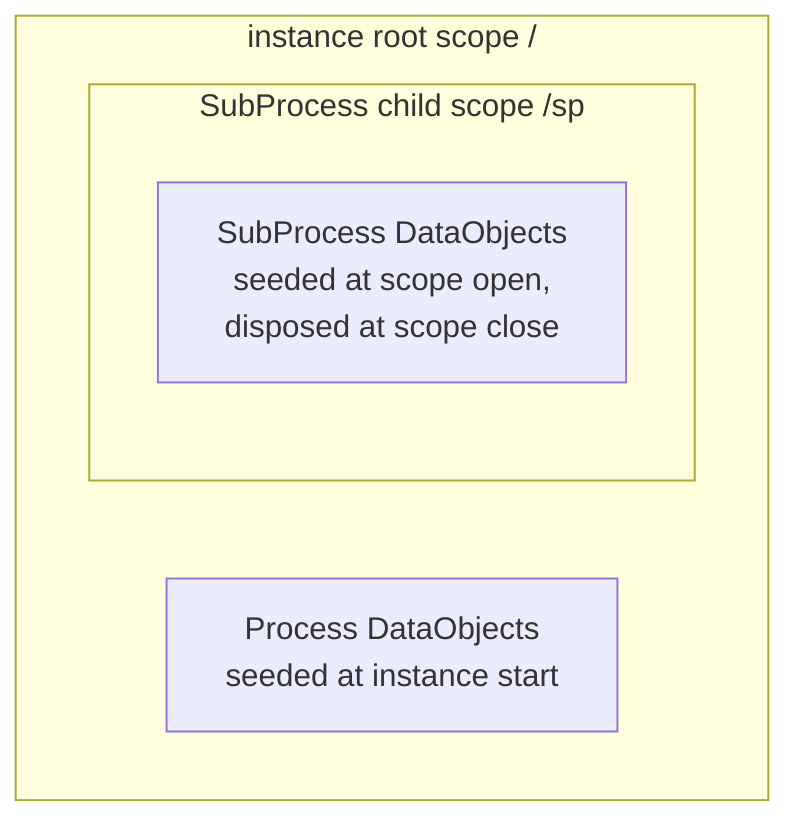
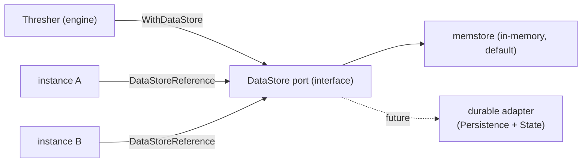

# ADR-030 — BPMN Data Elements: Data Object scope integration + Data Store port

| Field | Value |
|---|---|
| Status | Draft |
| Version | v.1 |
| Date | 2026-07-24 |
| Owner | Ruslan Gabitov |
| Refines | [ADR-011 v.7](ADR-011-process-data-flow.md) (the model-layer data-flow semantics — `ItemAwareElement`, the read-by-name resolver, the commit-diff `DataChange` facts a scope-resident DataObject rides), [ADR-010 v.2](ADR-010-process-data-model.md) (the runtime data plane — per-instance container scopes, seeding, copy/commit, walk-up resolution this integration reuses), [SAD-001 v.1](SAD-001-vision-and-architecture.md) §14.1 (the `DataObjectReference` deviation + BPMN-translation rules this ADR records) / G4 (the infrastructure-port pattern the Data Store follows) |

> **Scope.** This decides two BPMN §10.4.1 data-element concerns: (1) promoting the **`DataObject`** from an association-wired object to a **scope-resident named container** (the "integration with the scope tree" the element still lacks), and (2) introducing the **`DataStore` / `DataStoreReference`** as an **engine-level infrastructure port** with an in-memory adapter. `DataObjectReference` is a deliberate non-implementation (SAD-001 §14.1); durable Data Store persistence is the future Persistence & State workstream. Implementation rides the accompanying SRDs.

---

## 1. Context & problem

gobpm already **executes** Data Objects. A `DataObject` (`pkg/model/data_objects`) is an `ItemAwareElement` wired to activity I/O by explicit **DataAssociations** (`AssociateSource` / `AssociateTarget`), evaluated at runtime through the frame `LoadData` / `UploadData` hooks — a completed task's output flows into its associated DataObject, verified end-to-end by the `process-data` example. That object-to-object data flow is correct and stays.

Two things are missing against **§10.4.1** ([data.md](../bpmn-spec/semantics/data.md)):

1. **The DataObject is not a scope-resident named container.** §10.4.1 makes a `DataObject` a **diagram-visible variable** with scope-tree visibility — "accessible by the parent, its siblings, and their children" — and §10.4.2/§10.4.1 lets a DataAssociation name **"item-aware elements accessible in the current scope (DataObject, Property, Expression)."** gobpm's DataObjects live **outside** the scope tree: a `DataObject` cannot be added to a `Process`/`SubProcess`, is never seeded into the instance's container scopes, and cannot be **resolved by name** the way a `Property` can. So an expression or a by-name data reference cannot reach a DataObject — only a hand-wired object association can. The scope substrate to fix this **already exists** (Properties are seeded into the root scope at instance start and resolved by walk-up); the DataObject simply does not use it.

2. **Data Store is absent.** §10.4.1's `DataStore` is **"persistent storage that outlives the Process instance,"** globally reusable, with a `DataStoreReference` as its in-flow handle. No type exists. Its *persistence* is durable storage — an explicit **ADR-011 §2.8 non-goal** deferred to the future Persistence & State ADR — but the *element* (data shared across instances) is landable now behind an **infrastructure port** with an in-memory adapter, exactly as SAD-001 G4 prescribes for every infrastructure concern ("all behind interfaces; default in-memory").

`DataObjectReference` is **not** implemented — it is a diagram-interchange indirection with no execution capability gobpm lacks (see §2.7).

## 2. Decision

### 2.1 The Data Object becomes a scope-resident named container

A `DataObject` declared in a `Process` or `SubProcess` is **registered on that container** and **seeded into the corresponding execution scope**, becoming a named variable resolvable by the engine's existing walk-up (§10.4). A DataObject is thereby a first-class scope citizen **alongside `Property`** — the difference from a Property is **visibility** (a DataObject is a diagram-visible variable; a Property is hidden engine state, §10.4.1), not mechanism. Read-by-name, walk-up resolution, and commit are the ones already realized for Properties (ADR-010 §data-plane, ADR-011 the reader).

### 2.2 Lifecycle is tied to the parent scope (§10.4.1)

§10.4.1: a DataObject is "instantiated when the parent is, disposed when the parent is." gobpm realizes that on the container-scope tree it already opens and closes:

- A **Process-level** DataObject is seeded into the **root scope** at instance start (the batch that already seeds Properties) and disposed when the instance completes.
- A **SubProcess-level** DataObject is seeded into the **child scope when that scope opens** and disposed when it **closes** (the open/close the engine already drives).
- **Accessibility** follows the scope tree — parent + descendants via walk-up — matching §10.4.1's "parent + siblings + their children."

### 2.3 DataObject data flow unifies through the scope (both directions)

A DataObject is a **scope-resident named variable** (per instance). Its data flows through the scope data plane — the same plane every other value uses, resolved by name via the walk-up — **in both directions** a DataAssociation can bind it (§10.4.1, §10.4.2):

- **DataOutputAssociation (Node → DataObject):** a task's DataOutput is the *source*, the DataObject the *target* (`sourceRef` a DataOutput, `targetRef` the DataObject). At the activity's output step the produced value is written into the DataObject's **per-instance scope entry**.
- **DataInputAssociation (DataObject → Node):** the DataObject is the *source*, a task's DataInput the *target* (`sourceRef` the DataObject, `targetRef` a DataInput). At the activity's input step the DataObject's **per-instance scope value** fills the input.

Either way the value lives in the **per-instance scope**, never in a shared object — so concurrent instances are isolated by the scope being per-instance, with **no** per-instance association retargeting. This is exactly §10.4.2's model: a DataAssociation's `sourceRef`/`targetRef` are "item-aware elements accessible in the current **scope**." It retires the object **side-channel** (the association mutating a shared DataObject object) and the unused `DataObject.Update()`.

The **DataAssociation object itself is a shared declaration** — it names the Node↔DataObject binding and the direction; the runtime *reads* it and reads/writes the **per-instance** DataObject resolved from the frame's scope (never mutating the shared association). gobpm uses a DataAssociation **only** for a Node↔DataObject binding — declared activity I/O flows through the `InputOutputSpecification` + frame, not associations — so the **Source/Target types** (activity param vs DataObject) fully classify it, enforced by validation; no extra "is-DataObject" attribute is needed.

> **Refinement (Draft, from implementation).** An earlier framing kept the object side-channel *and* added scope-residence ("additive coexistence"), then a "route the write through scope" variant that handled only the output direction. Building it (with the owner) settled the model above: a DataObject is a per-instance **scope variable**, DataAssociations are **shared bidirectional declarations** (DO as target for outputs, source for inputs), and the runtime resolves the per-instance DataObject from the frame's scope in both directions. This removes the per-instance association-retargeting a shared-object side-channel would force, removes the dead `Update()`, and is the closest to §10.4.2. See §4.2.

### 2.4 DataState stays on the DataObject (engine choice)

§10.4.1 forbids a `dataState` on a `DataObject` (only a `DataObjectReference` carries one, per-appearance). Because gobpm **defers `DataObjectReference`** (§2.7), gobpm's `DataObject` **retains its single `DataState`** — a readiness qualifier; state-*value* semantics are §10.4.1 **out of scope** (engines define their own). The standard's per-appearance state (the same object shown Draft here, Approved there) is **not** modeled; that need is the deferred reference feature. Recorded as a deliberate engine choice.

### 2.5 The Data Store is an engine-level infrastructure port

`DataStore` is modeled as an **engine port**, not a per-instance element:

- an **interface** — read/write item-aware data by name, with the §10.4.1 `capacity` / `isUnlimited` attributes;
- a **default in-memory adapter**, registered on the engine (a `WithDataStore(…)`-style option), **mirroring `Repository` / `MessageBroker`** (SAD-001 G4 — "every infrastructure concern behind an interface, default in-memory");
- **engine-global**: a DataStore **outlives every instance** within the running engine and is **shared across instances** (§10.4.1's "outlives the Process instance").

**Durability is a swappable adapter behind the interface** — the future Persistence & State workstream. In-memory today satisfies "outlives the instance" *within the process*, not across restart; the seam makes the durable upgrade additive, not a reshape.

### 2.6 The DataStoreReference is the flow-scope handle

A `DataStoreReference` is a **flow-scope `ItemAwareElement`** carrying a `dataStoreRef` (the target store's id/name). Data flowing **into/out of** a DataStoreReference flows **into/out of the engine-global `DataStore`** (§10.4.1) — resolved through the runtime environment at read/write time. It participates in **DataAssociations exactly like a DataObject**, but its backing store is engine-global, not scope-resident. `capacity` is **advisory** in the in-memory adapter (a write is not rejected when nominal capacity is exceeded) — an engine choice; a durable adapter may enforce it.

### 2.7 DataObjectReference — deferred, documented, not built

`DataObjectReference` is **not implemented** — collapsed into the referenced `DataObject`. Both of its §10.4.1 purposes are diagram-motivated: *avoiding spaghetti wiring* has no meaning in a programmatic model, and *per-appearance `dataState`* is engine-defined (out of standard scope) and unused by gobpm's readiness-only `DataState`. Execution is **identical** to the DataObject, so the indirection would add API surface without capability. The deviation and the **BPMN→model translation rules** for the future XML parser (SAD-001 N7) are recorded in **SAD-001 §14.1**. Revisited on concrete demand (XML-import fidelity, or a divergent-state-per-point use case).

### 2.8 Non-goals & out of scope

- **Durable Data Store persistence** — the in-memory adapter is the default; a durable (DB-backed) driver is the **Persistence & State** workstream. The port exists so it is a drop-in adapter.
- **`DataObjectReference` + per-appearance `DataState`** — deferred (§2.7; SAD-001 §14.1).
- **Data Store `capacity` enforcement** — advisory in the in-memory adapter.
- **Full instance-state persistence / rehydration** — a separate epic (the engine stays in-memory-first toward v1.0.0).
- **Collection extraction into Multi-Instance** — a `isCollection` DataObject, once scope-resident, feeds the **landed** MI mediator's `loopDataInputRef` by name with no new mechanism (verified in the SRD, not re-designed here).

### 2.9 Engine notes & Enterprise-readiness recommendations

- **Durability is a plug, not a rewrite.** An operator needing cross-restart persistence or HA supplies a durable `DataStore` adapter (DB-backed) behind the same interface; the in-memory adapter is the reference implementation and the test double.
- **Observability.** A scope-resident DataObject rides the ADR-011 commit-diff `DataChange` facts for free; DataStore reads/writes are a natural future fact kind (engine-global data provenance).
- **Contract-test the port.** Ship a conformance test-kit for the `DataStore` interface (the in-memory adapter as the reference), so third-party durable adapters can prove parity.
- **Isolation.** An engine-global DataStore is shared mutable state across instances; a durable adapter should document its concurrency/transaction contract (last-write-wins vs. transactional), and multi-tenant deployments should scope stores per tenant.

## 3. Standard grounding

All claims verified against [docs/bpmn-spec/semantics/data.md](../bpmn-spec/semantics/data.md) (BPMN 2.0 §10.4):

- **§10.4.1 DataObject** — MUST be contained in a `Process`/`SubProcess`; lifecycle tied to the parent (instantiated/disposed with it); accessibility = parent + siblings + their children; **cannot** specify a `dataState`; `isCollection`. (Grounds §2.1, §2.2, §2.4.)
- **§10.4.1 DataObjectReference** — a visual pointer to a DataObject; exists to avoid spaghetti wiring and to show the object in different `dataState`s; inherits `itemSubjectRef` from the object. (Grounds §2.7.)
- **§10.4.1 DataStore + DataStoreReference** — persistent storage that **outlives the Process instance**; the DataStore lives in `Definitions` (globally reusable); the DataStoreReference is the in-flow `ItemAwareElement` carrying `dataStoreRef`; data into/out of the reference flows into/out of the global store; `capacity` / `isUnlimited`. (Grounds §2.5, §2.6.)
- **§10.4.1 Property** — hidden container tied to a FlowElement; scope-tree accessibility. The DataObject is its **visible** peer with the same scope mechanics. (Grounds §2.1.)
- **§10.4.1 / §10.4.2 DataAssociation** — sources/targets are "item-aware elements accessible in the current scope (DataObject, Property, Expression)" (structure, §10.4.1 p220–223); evaluation is synchronous to the activity lifecycle (§10.4.2 p225). (Grounds §2.3, §2.6.)
- **`dataState` value semantics are out of scope of the standard** (§10.4.1) — engines define their own. (Grounds §2.4.)

## 4. Alternatives considered

| Alternative | Why rejected |
|---|---|
| **Keep DataObjects association-only** (status quo) | Fails §10.4.1 scope-visibility — an expression or by-name reference can't reach a DataObject; only a hand-wired object association can. The scope substrate already exists; not using it is an artificial gap. |
| **Model DataObject as a subtype of `Property`** | Conflates the **visible** DataObject with the **hidden** Property (§10.4.1 draws the distinction deliberately); different diagram semantics. They **share** the scope mechanism without sharing a type. |
| **Keep the object side-channel + retarget associations per instance** | Implementation showed this needs new machinery — an `Association` target-setter, node association-accessors, and a clone-time retarget pass — for no real gain: per-instance cloning changes the read path regardless, so the "don't touch the write path" benefit is largely illusory. Routing DataObject flow through scope (§2.3) is simpler, removes the dead `Update()`, and matches §10.4.2. |
| **Implement the Data Store durably now** | Durable persistence is the deferred Persistence & State workstream; an in-memory port unblocks the element immediately and makes the durable driver a drop-in adapter. |
| **Implement `DataObjectReference`** | Diagram-motivated, no execution capability gobpm lacks; documented as a SAD-001 §14.1 deviation with translation rules instead. |

## 5. Consequences

- DataObjects become **scope-resident and name-resolvable**; DataObject and Property **unify at the scope layer** while staying distinct types (visible vs. hidden).
- A new **`DataStore` infrastructure port** joins the SAD-001 port family (Repository / MessageBroker / …); **cross-instance data sharing** (in-memory) is available now, with durable adapters a future plug.
- **SAD-001 §14.1** gains the `DataObjectReference` deviation + BPMN-translation rules (rides this change-set).
- The conformance tracker **row 11** advances (DataObject execution + scope integration ✅; DataStore/DataStoreReference ✅ in-memory; DataObjectReference documented-deferred).
- Landed by the accompanying SRDs: **DataObject scope integration** and the **Data Store port** (two SRDs on one branch).

## Document History

| Version | Date | Author | Change |
|---|---|---|---|
| v.1 | 2026-07-24 | Ruslan Gabitov | Initial draft — promotes the `DataObject` from an association-wired object to a **scope-resident named container** (registered on Process/SubProcess, seeded into the container scope by parent-tied lifecycle, resolved by the existing walk-up — §2.1–§2.3), keeping `DataState` on the object as an engine choice while `DataObjectReference` is deferred (§2.4, §2.7); introduces `DataStore`/`DataStoreReference` as an **engine-level infrastructure port** with an in-memory adapter and a durable seam (§2.5–§2.6), mirroring the SAD-001 G4 Repository pattern. Additive to the shipped association model (§2.3); durable persistence, `DataObjectReference`, and capacity enforcement out of scope (§2.8). Standard-grounded against §10.4.1/§10.4.2. Implementation by the accompanying SRDs. |
