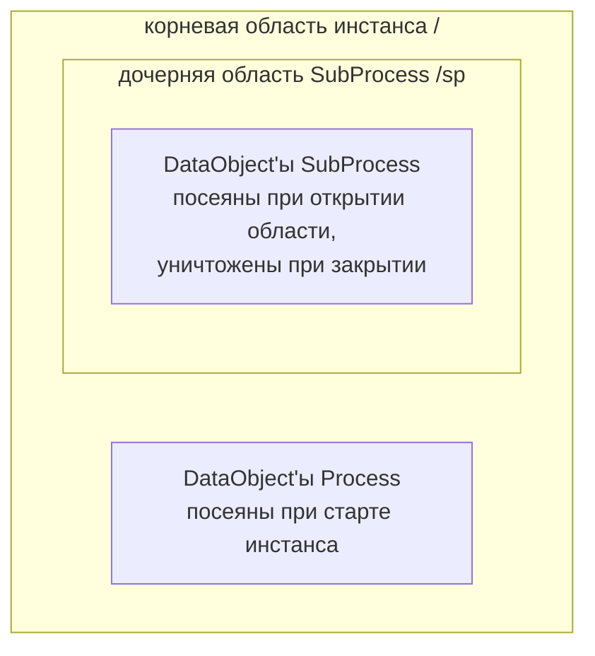
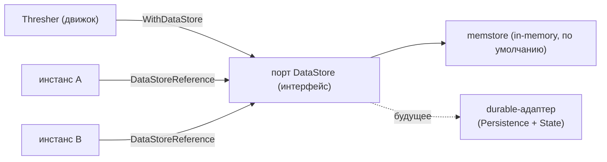

# ADR-030 — BPMN-элементы данных: интеграция Data Object со scope + порт Data Store

| Поле | Значение |
|---|---|
| Статус | Принято |
| Версия | v.1 |
| Дата | 2026-07-24 |
| Владелец | Руслан Габитов |
| Уточняет | [ADR-011 v.7](ADR-011-process-data-flow.md) (семантика потока данных на уровне модели — `ItemAwareElement`, резолвер чтения по имени, факты `DataChange` из commit-diff, на которых «едет» scope-резидентный DataObject), [ADR-010 v.2](ADR-010-process-data-model.md) (runtime-плоскость данных — per-instance контейнерные области, посев, копирование/commit, разрешение по walk-up, которые переиспользует эта интеграция), [SAD-001 v.1](SAD-001-vision-and-architecture.md) §14.1 (отклонение `DataObjectReference` + правила BPMN-трансляции, которые фиксирует этот ADR) / G4 (паттерн инфраструктурного порта, которому следует Data Store) |

> EN-оригинал — канонический: [ADR-030-data-objects-and-store.md](ADR-030-data-objects-and-store.md). Этот файл — его перевод (twin).

> **Область.** Здесь решаются два вопроса по BPMN-элементам данных §10.4.1: (1) продвижение **`DataObject`** из объекта, разведённого ассоциациями, в **scope-резидентный именованный контейнер** («интеграция со scope-деревом», которой элементу всё ещё не хватает), и (2) введение **`DataStore` / `DataStoreReference`** как **инфраструктурного порта уровня движка** с in-memory адаптером. `DataObjectReference` — сознательная не-реализация (SAD-001 §14.1); долговечная (durable) персистентность Data Store — будущий workstream Persistence & State. Реализация — в сопровождающих SRD.

---

## 1. Контекст и проблема

gobpm уже **исполняет** Data Object'ы. `DataObject` (`pkg/model/data_objects`) — это `ItemAwareElement`, разведённый к I/O активности явными **DataAssociation** (`AssociateSource` / `AssociateTarget`), вычисляемыми в runtime через frame-хуки `LoadData` / `UploadData`: вывод завершённой задачи перетекает в связанный DataObject, что проверено end-to-end примером `process-data`. Этот object-to-object поток данных корректен и остаётся.

Против **§10.4.1** ([data.md](../bpmn-spec/semantics/data.md)) недостаёт двух вещей:

1. **DataObject не является scope-резидентным именованным контейнером.** §10.4.1 делает `DataObject` **видимой на диаграмме переменной** с видимостью по scope-дереву — «доступна родителю, его сиблингам и их потомкам», — а §10.4.2/§10.4.1 позволяет DataAssociation ссылаться на **«item-aware элементы, доступные в текущем scope (DataObject, Property, Expression)»**. DataObject'ы gobpm живут **вне** scope-дерева: `DataObject` нельзя добавить в `Process`/`SubProcess`, он никогда не посеян в контейнерные области инстанса и не может быть **разрешён по имени** так, как `Property`. Значит выражение или ссылка-по-имени не могут дотянуться до DataObject — только вручную разведённая объектная ассоциация. Scope-субстрат для этого **уже существует** (Property'и посеяны в корневую область при старте инстанса и разрешаются по walk-up); DataObject просто им не пользуется.

2. **Data Store отсутствует.** `DataStore` из §10.4.1 — это **«персистентное хранилище, переживающее инстанс процесса»**, глобально переиспользуемое, с `DataStoreReference` как in-flow дескриптором. Типа не существует. Его *персистентность* — это durable-хранилище (явный **non-goal ADR-011 §2.8**, отложенный до будущего ADR Persistence & State), но сам *элемент* (данные, разделяемые между инстансами) можно приземлить уже сейчас за **инфраструктурным портом** с in-memory адаптером — ровно как SAD-001 G4 предписывает для любой инфраструктурной заботы («всё за интерфейсами, по умолчанию in-memory»).

`DataObjectReference` **не** реализуется — это diagram-interchange индирекция без исполнительной способности, которой gobpm не хватает (см. §2.7).

## 2. Решение

### 2.1 Data Object становится scope-резидентным именованным контейнером

`DataObject`, объявленный в `Process` или `SubProcess`, **регистрируется на этом контейнере** и **посеян в соответствующую область выполнения**, становясь именованной переменной, разрешимой существующим walk-up движка (§10.4). Тем самым DataObject — полноправный житель scope **наравне с `Property`**; отличие от Property — **видимость** (DataObject — видимая на диаграмме переменная, Property — скрытое состояние движка, §10.4.1), а не механизм. Чтение по имени, разрешение по walk-up и commit — те же, что уже реализованы для Property (ADR-010 §плоскость-данных, ADR-011 — резолвер).

### 2.2 Жизненный цикл привязан к родительской области (§10.4.1)

§10.4.1: DataObject «инстанцируется, когда инстанцируется родитель, уничтожается, когда уничтожается родитель». gobpm реализует это на дереве контейнерных областей, которое уже открывает и закрывает:

- DataObject **уровня Process** посеян в **корневую область** при старте инстанса (та же пачка, что уже сеет Property'и) и уничтожается по завершении инстанса.
- DataObject **уровня SubProcess** посеян в **дочернюю область при её открытии** и уничтожается при её **закрытии** (open/close, которым движок уже управляет).
- **Доступность** следует scope-дереву — родитель + потомки через walk-up — соответствуя «родитель + сиблинги + их дети» из §10.4.1.

### 2.3 Поток данных DataObject унифицируется через scope (в обе стороны)

DataObject — это **scope-резидентная именованная переменная** (на инстанс). Его данные текут через плоскость данных scope — ту же плоскость, что и любое другое значение, разрешаемую по имени через walk-up — **в обе стороны**, в которые DataAssociation может его связать (§10.4.1, §10.4.2):

- **DataOutputAssociation (Node → DataObject):** DataOutput задачи — *источник*, DataObject — *цель* (`sourceRef` — DataOutput, `targetRef` — DataObject). На шаге вывода активности произведённое значение записывается в **per-instance scope-запись** DataObject.
- **DataInputAssociation (DataObject → Node):** DataObject — *источник*, DataInput задачи — *цель* (`sourceRef` — DataObject, `targetRef` — DataInput). На шаге ввода активности **per-instance scope-значение** DataObject заполняет вход.

В любом случае значение живёт в **per-instance scope**, никогда — в разделяемом объекте, так что параллельные инстансы изолированы тем, что scope сам per-instance, **без** per-instance переразведения ассоциаций. Это ровно модель §10.4.2: `sourceRef`/`targetRef` DataAssociation — «item-aware элементы, доступные в текущем **scope**». Это упраздняет объектный **побочный канал** (ассоциация, мутирующая разделяемый объект DataObject) и неиспользуемый `DataObject.Update()`.

**Сам объект DataAssociation — разделяемая декларация**: он именует связку Node↔DataObject и направление; runtime его *читает* и читает/пишет **per-instance** DataObject, разрешённый из scope фрейма (никогда не мутируя разделяемую ассоциацию). gobpm использует DataAssociation **только** для связки Node↔DataObject — декларированный I/O активности течёт через `InputOutputSpecification` + frame, а не через ассоциации, — так что **типы Source/Target** (param активности vs DataObject) полностью его классифицируют, что обеспечивается валидацией; никакого дополнительного атрибута «is-DataObject» не нужно.

> **Уточнение (Draft, из реализации).** Ранняя формулировка держала объектный побочный канал *и* добавляла scope-резидентность («аддитивное сосуществование»), затем — вариант «маршрутизировать запись через scope», покрывавший только направление вывода. Постройка (совместно с владельцем) устаканила модель выше: DataObject — per-instance **scope-переменная**, DataAssociation'и — **разделяемые двунаправленные декларации** (DO как цель для выводов, источник для входов), а runtime разрешает per-instance DataObject из scope фрейма в обе стороны. Это убирает per-instance переразведение ассоциаций, которое навязал бы побочный канал разделяемого объекта, убирает мёртвый `Update()` и ближе всего к §10.4.2. См. §4.2.

### 2.4 DataState остаётся на DataObject (инженерный выбор)

§10.4.1 запрещает `dataState` на `DataObject` (только `DataObjectReference` несёт его, per-appearance). Поскольку gobpm **откладывает `DataObjectReference`** (§2.7), `DataObject` gobpm **сохраняет свой единственный `DataState`** — квалификатор готовности; семантика *значений* состояния — §10.4.1 **вне области** (движки определяют свою). Per-appearance состояние стандарта (один и тот же объект показан Draft здесь, Approved там) **не** моделируется; эта потребность — отложенная фича reference. Зафиксировано как сознательный инженерный выбор.

### 2.5 Data Store — инфраструктурный порт уровня движка

`DataStore` моделируется как **порт движка**, а не per-instance элемент:

- **интерфейс** — чтение/запись item-aware данных по имени, с атрибутами `capacity` / `isUnlimited` из §10.4.1;
- **дефолтный in-memory адаптер**, зарегистрированный на движке (опция вида `WithDataStore(…)`), **зеркалящий `Repository` / `MessageBroker`** (SAD-001 G4 — «любая инфраструктурная забота за интерфейсом, по умолчанию in-memory»);
- **engine-global**: DataStore **переживает любой инстанс** в рамках работающего движка и **разделяется между инстансами** (§10.4.1 — «переживает инстанс процесса»).

Поскольку §10.4.1 позволяет процессу ссылаться на **много** DataStore'ов (каждый — корневой элемент уровня Definitions со своим `capacity`), порт — это **реестр именованных хранилищ**, разрешаемых по `dataStoreRef` из `DataStoreReference` — у каждого хранилища свой адаптер/`capacity`/бэкенд. Разрешение **fail-loud**: ссылка на незарегистрированное хранилище — это ошибка конфигурации, а не тихая авто-провизия (та же поза «ограниченные дефолты, падать на неизвестном», которую движок держит в других местах).

**Долговечность — сменный адаптер за интерфейсом** — будущий workstream Persistence & State. In-memory сегодня удовлетворяет «переживает инстанс» *в пределах процесса*, а не через рестарт; шов делает durable-апгрейд аддитивным, а не переделкой.

### 2.6 DataStoreReference — дескриптор в flow-scope

`DataStoreReference` — это **flow-scope `ItemAwareElement`**, несущий `dataStoreRef` (id/имя целевого хранилища). Данные, текущие **в/из** DataStoreReference, текут **в/из engine-global `DataStore`** (§10.4.1) — разрешаемого через runtime-окружение в момент чтения/записи. Он участвует в **DataAssociation'ах ровно как DataObject**, но его подложка — engine-global, а не scope-резидентная. `capacity` в in-memory адаптере **рекомендательный** (запись не отвергается при превышении номинальной ёмкости) — инженерный выбор; durable-адаптер может его форсировать.

### 2.7 DataObjectReference — отложен, задокументирован, не построен

`DataObjectReference` **не реализуется** — схлопнут в ссылаемый `DataObject`. Обе его §10.4.1-цели diagram-мотивированы: *избегание спагетти-разводки* не имеет смысла в программной модели, а *per-appearance `dataState`* — engine-defined (вне области стандарта) и не используется readiness-only `DataState` gobpm. Исполнение **идентично** DataObject, так что индирекция добавила бы поверхность API без способности. Отклонение и **правила трансляции BPMN→модель** для будущего XML-парсера (SAD-001 N7) зафиксированы в **SAD-001 §14.1**. Пересматривается по конкретному спросу (точность XML-импорта либо кейс расходящегося состояния-по-точкам).

### 2.8 Non-goals и вне области

- **Долговечная персистентность Data Store** — in-memory адаптер по умолчанию; durable (DB-подложенный) драйвер — workstream **Persistence & State**. Порт существует, чтобы это был drop-in адаптер.
- **`DataObjectReference` + per-appearance `DataState`** — отложено (§2.7; SAD-001 §14.1).
- **Форсирование `capacity` Data Store** — рекомендательное в in-memory адаптере.
- **Полная персистентность/регидратация состояния инстанса** — отдельный эпик (движок остаётся in-memory-first к v1.0.0).
- **Извлечение коллекции в Multi-Instance** — `isCollection` DataObject, став scope-резидентным, кормит `loopDataInputRef` **приземлённого** MI-медиатора по имени без нового механизма (проверено в SRD, здесь не перепроектируется).

### 2.9 Инженерные заметки и рекомендации Enterprise-readiness

- **Долговечность — это плагин, а не переписывание.** Оператору, которому нужна персистентность через рестарт или HA, поставляет durable-адаптер `DataStore` (DB-подложенный) за тем же интерфейсом; in-memory адаптер — эталонная реализация и тестовый дубль.
- **Наблюдаемость.** Scope-резидентный DataObject бесплатно едет на фактах `DataChange` из commit-diff ADR-011; чтения/записи DataStore — естественный будущий вид факта (engine-global происхождение данных).
- **Контрактно тестируйте порт.** Поставьте conformance-тест-кит для интерфейса `DataStore` (in-memory адаптер как эталон), чтобы сторонние durable-адаптеры могли доказать паритет.
- **Изоляция.** Engine-global DataStore — разделяемое изменяемое состояние между инстансами; durable-адаптер должен документировать свой контракт конкурентности/транзакций (last-write-wins vs транзакционный), а multi-tenant развёртывания должны разграничивать хранилища по тенанту.

## 3. Обоснование стандартом

Все утверждения проверены по [docs/bpmn-spec/semantics/data.md](../bpmn-spec/semantics/data.md) (BPMN 2.0 §10.4):

- **§10.4.1 DataObject** — ДОЛЖЕН содержаться в `Process`/`SubProcess`; жизненный цикл привязан к родителю (инстанцируется/уничтожается вместе с ним); доступность = родитель + сиблинги + их дети; **не может** задавать `dataState`; `isCollection`. (Обосновывает §2.1, §2.2, §2.4.)
- **§10.4.1 DataObjectReference** — визуальный указатель на DataObject; существует ради избегания спагетти-разводки и показа объекта в разных `dataState`; наследует `itemSubjectRef` объекта. (Обосновывает §2.7.)
- **§10.4.1 DataStore + DataStoreReference** — персистентное хранилище, **переживающее инстанс процесса**; DataStore живёт в `Definitions` (глобально переиспользуемое); DataStoreReference — in-flow `ItemAwareElement`, несущий `dataStoreRef`; данные в/из reference текут в/из глобального хранилища; `capacity` / `isUnlimited`. (Обосновывает §2.5, §2.6.)
- **§10.4.1 Property** — скрытый контейнер, привязанный к FlowElement; доступность по scope-дереву. DataObject — его **видимый** пир с той же scope-механикой. (Обосновывает §2.1.)
- **§10.4.1 / §10.4.2 DataAssociation** — источники/цели — «item-aware элементы, доступные в текущем scope (DataObject, Property, Expression)» (структура, §10.4.1 стр. 220–223); вычисление синхронно жизненному циклу активности (§10.4.2 стр. 225). (Обосновывает §2.3, §2.6.)
- **Семантика значений `dataState` — вне области стандарта** (§10.4.1) — движки определяют свою. (Обосновывает §2.4.)

## 4. Рассмотренные альтернативы

| Альтернатива | Почему отвергнута |
|---|---|
| **Оставить DataObject'ы только-ассоциациями** (статус-кво) | Проваливает scope-видимость §10.4.1 — выражение или ссылка-по-имени не дотягиваются до DataObject; только вручную разведённая объектная ассоциация. Scope-субстрат уже существует; не пользоваться им — искусственный пробел. |
| **Моделировать DataObject как подтип `Property`** | Смешивает **видимый** DataObject со **скрытым** Property (§10.4.1 проводит различие сознательно); разная diagram-семантика. Они **разделяют** scope-механизм, не разделяя тип. |
| **Оставить объектный побочный канал + переразводить ассоциации на инстанс** | Реализация показала, что это требует новой машинерии — target-сеттера `Association`, аксессоров ассоциаций узла и прохода переразведения в момент клонирования — без реальной выгоды: per-instance клонирование меняет путь чтения так или иначе, так что выгода «не трогать путь записи» во многом иллюзорна. Маршрутизация потока DataObject через scope (§2.3) проще, убирает мёртвый `Update()` и соответствует §10.4.2. |
| **Реализовать Data Store durable сразу** | Долговечная персистентность — отложенный workstream Persistence & State; in-memory порт разблокирует элемент немедленно и делает durable-драйвер drop-in адаптером. |
| **Реализовать `DataObjectReference`** | Diagram-мотивирован, без исполнительной способности, которой gobpm не хватает; вместо этого задокументирован как отклонение SAD-001 §14.1 с правилами трансляции. |

## 5. Последствия

- DataObject'ы становятся **scope-резидентными и разрешимыми-по-имени**; DataObject и Property **унифицируются на scope-слое**, оставаясь различными типами (видимый vs скрытый).
- Новый **инфраструктурный порт `DataStore`** присоединяется к семье портов SAD-001 (Repository / MessageBroker / …); **межинстансное разделение данных** (in-memory) доступно уже сейчас, durable-адаптеры — будущий плагин.
- **SAD-001 §14.1** получает отклонение `DataObjectReference` + правила трансляции BPMN (едет с этим change-set'ом).
- Трекер конформности **строка 11** продвигается (исполнение DataObject + интеграция со scope ✅; DataStore/DataStoreReference ✅ in-memory; DataObjectReference documented-deferred).
- Приземлено сопровождающими SRD: **интеграция DataObject со scope** и **порт Data Store** (два SRD в одной ветке).

## История документа

| Версия | Дата | Автор | Изменение |
|---|---|---|---|
| v.1 | 2026-07-24 | Руслан Габитов | Первичный черновик — продвигает `DataObject` из объекта, разведённого ассоциациями, в **scope-резидентный именованный контейнер** (регистрируется на Process/SubProcess, посеян в контейнерную область жизненным циклом, привязанным к родителю, разрешается существующим walk-up — §2.1–§2.3), сохраняя `DataState` на объекте как инженерный выбор, пока `DataObjectReference` отложен (§2.4, §2.7); вводит `DataStore`/`DataStoreReference` как **инфраструктурный порт уровня движка** с in-memory адаптером и durable-швом (§2.5–§2.6), зеркаля паттерн Repository из SAD-001 G4. Аддитивно к приземлённой модели ассоциаций (§2.3); долговечная персистентность, `DataObjectReference` и форсирование capacity вне области (§2.8). Обосновано стандартом против §10.4.1/§10.4.2. Реализация — сопровождающими SRD. |
