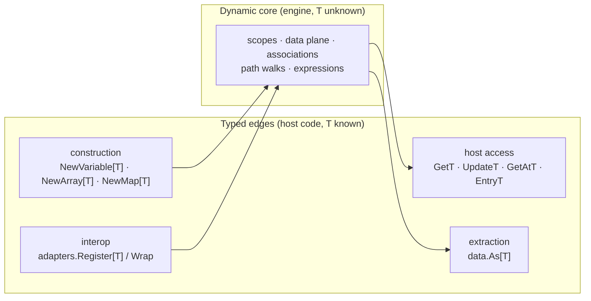

# ADR-034 — Data-Layer Generics Policy

| Field | Value |
|---|---|
| Status | Accepted |
| Version | v.1 |
| Date | 2026-07-29 |
| Owner | Ruslan Gabitov |
| Refines | [ADR-011 v.7 Process Data Flow](ADR-011-process-data-flow.md) |

> **Scope.** This decides where Go generics belong in the engine's data layer:
> whether the `data.Value` / `data.Collection` interface family is
> parameterized, where typed surfaces live instead, and what closes the last
> untyped seam — extracting a typed payload from a bare `data.Value` at the
> consumer edge. It does **not** re-decide data-flow semantics (what is
> evaluated when data crosses a node — [ADR-011 v.7](ADR-011-process-data-flow.md))
> nor the runtime data plane (where data lives and who may touch it —
> [ADR-010 v.2](ADR-010-process-data-model.md)). This is a *shape* policy over
> both.

## 1. Context

### 1.1 Origin — a pre-generics design meets a post-generics language

The `Value` family was designed before Go had type parameters (pre-1.18), so
its contract is a dynamic interface: `Get(ctx) any`, `Update(ctx, any) error`,
`Lock`/`Unlock`, `Type() string`, `Clone() Value`; `Collection`, `Record` and
the map capability extend it, all speaking `any` at the interface boundary.
With generics now a mature language feature, the standing question is whether
the family should be reworked around them — a question that will keep being
asked until a decision record answers it.

### 1.2 What the layer already looks like

The implementations are *already* generic. The dynamic concretes are
`values.Variable[T]`, `values.Array[T]`, `values.Map[T]`; construction is
type-safe (`NewVariable[T]`, `NewArray[T]`, `NewMap[T]`), and each concrete
carries a **T-suffix typed twin** beside every `any`-based interface method:
`Get`/`GetT` (plus `GetP`), `Update`/`UpdateT`, `GetAt`/`GetAtT`,
`Insert`/`InsertT`, `Entry`/`EntryT`, `SetEntry`/`SetEntryT`, and so on. Go
interop is likewise typed at its edge: the adapter registry
(`adapters.Register[T]`, `adapters.Wrap`) lifts a host's own struct into a
navigable value with the type resolved once, at registration.

One seam remains untyped in practice: a consumer holding a **bare
`data.Value`** — from an item-aware element's `Value()`, an external job's
payload, a `Record` field read, a path walk — extracts the payload by hand:

```go
amount, _ := d.Value().Get(ctx).(int)
```

This exact shape recurs across the shipped examples and in host-side task
code. The discarded comma-ok is the defect: a failed assertion silently yields
the zero value, the process continues with wrong data, and the failure
surfaces far from its cause — the same silent-zero class the engine's
error-handling policy ([ADR-022 v.1](ADR-022-error-propagation-and-logging-policy.md))
exists to prevent. The API shape *invites* the discard: the two-line comma-ok
form is verbose enough that examples and users alike collapse it.

### 1.3 Why decide now

Two drivers. First, the "shouldn't `Value` be generic now?" question deserves
a durable, findable answer grounded in language facts rather than habit.
Second, the silent-assert sprinkle is a live defect class that one small,
additive helper closes — but the helper only makes sense inside an explicit
policy of *where* typed surfaces belong.

## 2. Decision

### 2.1 The `Value` interfaces stay dynamic — the erasure boundary is inherent

`data.Value`, `data.Collection`, `data.Record` and the map capability remain
non-generic. This is not conservatism; a parameterized `Value[T]` cannot do
the job, for three composable reasons:

1. **The engine is heterogeneous and late-bound by domain.** In the BPMN
   metamodel every item-aware element carries its *own* `ItemDefinition`
   reference (see `docs/bpmn-spec/elements/data.md` — `itemSubjectRef`,
   0..1, per element), so the data crossing one process is heterogeneous by
   construction; and the engine's decided data-access model resolves data by
   *plain name at runtime* ([ADR-010 v.2 §2.7](ADR-010-process-data-model.md);
   [ADR-011 v.7 §2.6](ADR-011-process-data-flow.md)). A scope therefore holds an `int` amount next to
   a `string` status next to a record; associations, path walks and
   expression inputs all traverse values whose types are unknown at compile
   time. In Go,
   `Value[int]` and `Value[string]` are unrelated types — there is no
   covariance and no existential quantification — so a scope cannot hold them
   in one collection. Any generic family must be *erased* to a non-generic
   interface at exactly the boundary where the engine operates; that erased
   interface is what `data.Value` already is.
2. **Go interfaces cannot declare generic methods.** A method cannot introduce
   its own type parameter, so `Get() T` forces `T` onto the interface itself —
   which is case 1.
3. **The type-safety would land where it is not needed.** The engine core
   never knows `T`; only the two ends of the pipe — the host constructing a
   value and the host consuming one — do. Parameterizing the middle threads
   type parameters through scopes, the data plane, associations and mediators
   for zero checked guarantees at those points.

This mirrors the standard library's settled split: heterogeneous containers
(`context.Context`, `sync.Map`) stay dynamic; generics serve homogeneous
containers and edges.

### 2.2 Generics live at the edges — the T-suffix typed-twin convention

Typed surfaces belong where the caller *statically knows* the payload type,
and the existing pattern is hereby the convention for every current and future
value kind:

- **Construction edge** — generic constructors (`NewVariable[T]`,
  `NewArray[T]`, `NewMap[T]`): the payload type is fixed where the value is
  born.
- **Host-access edge** — on the *generic* concretes, every `any`-based
  interface method has a **T-suffix twin** (`GetT`, `UpdateT`, `GetAtT`,
  `EntryT`, …) operating in the concrete's `T` with no assertion at the call
  site. New methods on generic concretes ship both forms. (`values.Record` is
  deliberately outside the convention: its keys are schema and its fields are
  themselves `data.Value` — there is no single `T`; a field read hands back a
  bare `Value`, which is exactly the extraction edge below.)
- **Interop edge** — the adapter registry is generic at registration
  (`Register[T]`), resolving each host type once; the engine consumes the
  resulting value through the dynamic interface.



### 2.3 The typed extraction edge — `data.As[T]`

The one missing edge is closed by a single generic helper in `pkg/model/data`:

```go
// As returns v's payload as T. It rejects a nil Value and reports a
// self-identifying error when the payload is not a T — naming both the
// held and the requested type — instead of a silent zero value.
func As[T any](ctx context.Context, v Value) (T, error)
```

Semantics:

- **nil guard** — a nil `Value` is a caller error, rejected with an explicit
  error (never a zero-value return), per the engine-wide public-parameter
  validation rule.
- **Self-identifying mismatch** — on assertion failure the error names the
  function, the held dynamic type and the requested type
  (`"As: value holds string, not int"` in shape), carrying the engine's
  structured error details so observability can surface it.
- **The comma-ok becomes unignorable** — the failure is an `error` on the
  ordinary path, not a boolean begging to be discarded.

The consumer edge, before and after:

```go
// before — the comma-ok begs to be discarded; a mismatch is a silent zero
amount, _ := d.Value().Get(ctx).(int)

// after — a mismatch is an ordinary, self-identifying error
amount, err := data.As[int](ctx, d.Value())
if err != nil {
    return fmt.Errorf("reading order amount: %w", err)
}
```

`As` is the blessed extraction idiom wherever code holds a bare `data.Value`;
the T-suffix twins remain preferable when the concrete type is in hand.
The surface stays minimal deliberately: no `MustAs` panic variant, no
positional collection variants (`AsAt[T]` and kin) — each waits for a concrete
driver, matching the layer's phasing discipline.

### 2.4 Non-goals

- A generic `Value[T]` / `Collection[T]` interface family (§2.1 forecloses it).
- A typed data plane or scope API — the engine core stays dynamic.
- Code-generated per-type accessors — the adapter registry already covers
  per-type interop; a generator is machinery disproportionate to one
  assertion.
- Retrofitting existing `any`-based method signatures — the dual surface is
  the design, not a migration debt.

## 3. Consequences

**Positive.**

- The public API stays stable — everything decided here is additive; no
  breaking churn for hosts.
- One blessed extraction idiom ends the hand-rolled assertion sprinkle; the
  silent-zero defect class closes at every seam that adopts `As`.
- The recurring generics question has a citable answer with its reasons.
- Future value kinds inherit a ready convention (constructor + twins + `As`
  compatibility) instead of re-deciding shape.

**Negative / accepted.**

- The dynamic core still admits runtime type mismatches at the seam — the
  policy converts them from drifting zero values into immediate,
  self-identifying errors rather than eliminating them (elimination is
  impossible without the rejected erasure-boundary move).
- Two parallel surfaces (`Xxx` / `XxxT`) are more API to document; the
  convention's uniformity is the mitigation.
- Existing examples and guides keep the hand-assertion form until touched;
  migration is opportunistic, not a sweep.

## 4. Alternatives considered

1. **Parameterize the interface family (`Value[T]`).** Rejected for the three
   §2.1 reasons: heterogeneous scopes cannot store unrelated instantiations,
   interfaces cannot carry generic methods, and the erased interface would
   have to be reintroduced precisely where `Value` stands today — churn
   through every data seam for no checked guarantee where it matters.
2. **A parallel typed view (`TypedValue[T]` wrapping `Value`).** A second
   interface family the host may hold alongside the dynamic one. Rejected:
   it doubles the public surface, the engine still consumes the erased form,
   and the T-suffix twins already deliver typed access wherever the concrete
   is known — the wrapper adds a layer, not a capability.
3. **Code-generated typed accessors per host type.** Rejected: the
   registration-time adapter seam already handles per-type interop with
   bounded, one-shot reflection; generating wrappers to save one assertion
   fails the proportionality test.
4. **Status quo — hand assertions at the consumer edge.** Rejected on
   evidence: the shipped examples systematically discard the comma-ok, and
   the engine's own policy forbids silently discarded failure signals. An API
   whose ergonomic path is the unsafe path is a design defect, not a user
   error.

## 5. Enterprise-readiness recommendations

- **Error taxonomy.** `As` failures should carry structured details (requested
  type, held type, and — where the caller supplies it — the data name or
  source seam) so incident drilldown can distinguish a modeling error from a
  host-code bug.
- **Lint guard.** Once `As` lands, steer contributors with a lint rule (e.g. a
  `forbidigo` pattern) flagging `.Get(ctx).(` / `.Get(context` assertions
  outside the data packages, pointing at `data.As[T]`.
- **Documentation.** The developer manual's value pages should present `As` as
  the canonical extraction idiom and the T-twin convention as the reading key
  for the dual API surface.
- **Compatibility statement.** Everything here is additive; no deprecations
  are triggered, and hosts on the hand-assertion form keep compiling.

## 6. Open questions

None.

## 7. References

- [ADR-010 v.2 Process Data Model](ADR-010-process-data-model.md) — the
  runtime data plane this policy shapes but does not re-decide.
- [ADR-011 v.7 Process Data Flow](ADR-011-process-data-flow.md) — the
  model-layer data semantics; §2.9 defines the value family and the dynamic
  concretes this policy governs.
- [ADR-022 v.1 Error Propagation and Logging Policy](ADR-022-error-propagation-and-logging-policy.md)
  — the no-silent-discard rule the extraction edge enforces.
- The Go Language Specification — method declarations admit no type
  parameters; interface types admit no covariance over type arguments.

## Document History

| Version | Date | Author | Changes |
|---|---|---|---|
| v.1 | 2026-07-29 | Ruslan Gabitov | **Accepted** (landed via the accompanying SRD; `make ci` green, diff-coverage 100% of changed lines, the extraction helper at 100% file coverage). Initial decision: the `Value` interface family stays dynamic (erasure boundary is inherent to late-bound, heterogeneous BPMN data; Go interfaces cannot carry generic methods); generics are confined to the edges under the named **T-suffix typed-twin convention** (generic constructors, `XxxT` accessors, registration-time adapters); the missing consumer edge is closed by **`data.As[T]`** — nil-guarded, self-identifying typed extraction replacing the discard-prone hand assertion. Non-goals: `Value[T]`, typed plane, codegen accessors, `MustAs`. |
