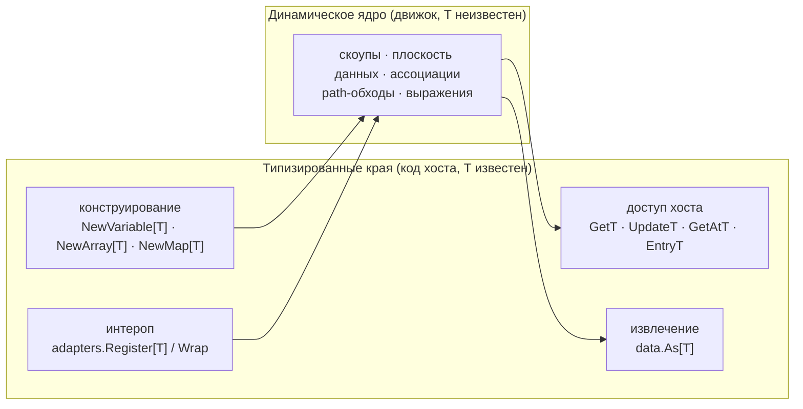

# ADR-034 — Политика применения дженериков в слое данных

| Поле | Значение |
|---|---|
| Статус | Принято |
| Версия | v.1 |
| Дата | 2026-07-29 |
| Владелец | Руслан Габитов |
| Уточняет | [ADR-011 v.7 Process Data Flow](ADR-011-process-data-flow.md) |

> **Область.** Документ решает, где в слое данных движка место дженерикам Go:
> параметризуется ли семейство интерфейсов `data.Value` / `data.Collection`,
> где вместо этого живут типизированные поверхности и что закрывает последний
> нетипизированный шов — извлечение типизированного payload'а из «голого»
> `data.Value` на стороне потребителя. Документ **не** пересматривает
> семантику data-flow (что вычисляется, когда данные пересекают узел —
> [ADR-011 v.7](ADR-011-process-data-flow.md)) и runtime-плоскость данных
> (где данные живут и кто вправе их трогать —
> [ADR-010 v.2](ADR-010-process-data-model.md)). Это политика *формы* поверх
> обоих.

## 1. Контекст

### 1.1 Происхождение — дизайн до дженериков во времена языка с дженериками

Семейство `Value` спроектировано до появления в Go параметров типов
(до 1.18), поэтому его контракт — динамический интерфейс: `Get(ctx) any`,
`Update(ctx, any) error`, `Lock`/`Unlock`, `Type() string`, `Clone() Value`;
`Collection`, `Record` и map-способность расширяют его, разговаривая на
границе интерфейса на `any`. Теперь, когда дженерики — зрелая возможность
языка, регулярно возникает вопрос, не переработать ли семейство вокруг них —
и он будет возникать, пока на него не ответит decision record.

### 1.2 Как слой выглядит уже сейчас

Реализации *уже* дженериковые. Динамические конкреты — `values.Variable[T]`,
`values.Array[T]`, `values.Map[T]`; конструирование типобезопасно
(`NewVariable[T]`, `NewArray[T]`, `NewMap[T]`), и каждый конкрет несёт
**типизированного близнеца с суффиксом T** рядом с каждым `any`-методом
интерфейса: `Get`/`GetT` (плюс `GetP`), `Update`/`UpdateT`, `GetAt`/`GetAtT`,
`Insert`/`InsertT`, `Entry`/`EntryT`, `SetEntry`/`SetEntryT` и так далее.
Go-интероп также типизирован на своей границе: реестр адаптеров
(`adapters.Register[T]`, `adapters.Wrap`) поднимает пользовательскую структуру
в навигируемое значение, разрешая тип один раз, при регистрации.

Один шов на практике остаётся нетипизированным: потребитель, держащий
**«голый» `data.Value`** — из `Value()` item-aware-элемента, чтения поля
`Record.Field`, payload'а external-задачи, path-обхода — извлекает payload
вручную:

```go
amount, _ := d.Value().Get(ctx).(int)
```

Ровно эта форма повторяется по всем поставляемым примерам и в пользовательском
коде задач. Дефект — отброшенный comma-ok: неудачное приведение молча даёт
нулевое значение, процесс продолжает работать с неверными данными, а сбой
всплывает далеко от причины — тот самый класс «тихого нуля», от которого
существует политика обработки ошибок движка
([ADR-022 v.1](ADR-022-error-propagation-and-logging-policy.md)). Форма API
сама *провоцирует* отбрасывание: двухстрочный comma-ok достаточно многословен,
чтобы и примеры, и пользователи его сворачивали.

### 1.3 Почему решаем сейчас

Два драйвера. Во-первых, вопрос «не пора ли сделать `Value` дженериковым?»
заслуживает долговременного, находимого ответа, опирающегося на факты языка,
а не на привычку. Во-вторых, россыпь «тихих» приведений — живой класс
дефектов, который закрывается одним маленьким аддитивным помощником — но
помощник осмыслен только внутри явной политики того, *где* место
типизированным поверхностям.

## 2. Решение

### 2.1 Интерфейсы `Value` остаются динамическими — граница стирания типов неустранима

`data.Value`, `data.Collection`, `data.Record` и map-способность остаются
непараметризованными. Это не консерватизм; параметризованный `Value[T]` не
может выполнить работу — по трём складывающимся причинам:

1. **Движок гетерогенен и поздносвязан по своей предметной области.**
   В метамодели BPMN каждый item-aware-элемент несёт *собственную* ссылку на
   `ItemDefinition` (см. `docs/bpmn-spec/elements/data.md` — `itemSubjectRef`,
   0..1, на элемент), поэтому данные одного процесса гетерогенны по
   построению; а принятая моделью движка адресация разрешает данные по
   *простому имени во время исполнения*
   ([ADR-010 v.2 §2.7](ADR-010-process-data-model.md);
   [ADR-011 v.7 §2.6](ADR-011-process-data-flow.md)). Скоуп, таким образом,
   держит `int`-сумму рядом со `string`-статусом рядом с записью; ассоциации,
   path-обходы и входы выражений обходят значения, типы которых неизвестны на
   этапе компиляции. В Go `Value[int]` и `Value[string]` — несвязанные типы:
   ковариантности и экзистенциальной квантификации нет, поэтому скоуп не
   может держать их в одной коллекции. Любое дженериковое семейство придётся
   *стереть* до непараметризованного интерфейса ровно на той границе, где
   работает движок; этот стёртый интерфейс — и есть сегодняшний `data.Value`.
2. **Интерфейсы Go не могут объявлять дженериковые методы.** Метод не может
   вводить собственный параметр типа, поэтому `Get() T` вынуждает вынести `T`
   на сам интерфейс — а это случай 1.
3. **Типобезопасность приземлилась бы там, где она не нужна.** Ядро движка
   никогда не знает `T`; его знают только два конца трубы — хост, создающий
   значение, и хост, потребляющий его. Параметризация середины протаскивает
   параметры типов через скоупы, плоскость данных, ассоциации и медиаторы
   ради нуля проверяемых гарантий в этих точках.

Это зеркалит устоявшееся разделение стандартной библиотеки: гетерогенные
контейнеры (`context.Context`, `sync.Map`) остаются динамическими; дженерики
обслуживают гомогенные контейнеры и края.

### 2.2 Дженерики живут на краях — конвенция «типизированных близнецов с суффиксом T»

Типизированным поверхностям место там, где вызывающий *статически знает* тип
payload'а, и существующий паттерн настоящим закрепляется как конвенция для
каждого текущего и будущего вида значений:

- **Край конструирования** — дженериковые конструкторы (`NewVariable[T]`,
  `NewArray[T]`, `NewMap[T]`): тип payload'а фиксируется там, где значение
  рождается.
- **Край доступа хоста** — у *дженериковых* конкретов каждый `any`-метод
  интерфейса имеет **близнеца с суффиксом T** (`GetT`, `UpdateT`, `GetAtT`,
  `EntryT`, …), работающего в `T` конкрета без приведения в точке вызова.
  Новые методы дженериковых конкретов поставляются в обеих формах.
  (`values.Record` сознательно вне конвенции: его ключи — схема, а поля —
  сами `data.Value`; единого `T` нет, чтение поля возвращает «голый»
  `Value` — ровно тот край извлечения, что ниже.)
- **Край интеропа** — реестр адаптеров дженериковый при регистрации
  (`Register[T]`), разрешая каждый хост-тип один раз; движок потребляет
  получившееся значение через динамический интерфейс.



### 2.3 Край типизированного извлечения — `data.As[T]`

Единственный недостающий край закрывается одним дженериковым помощником в
`pkg/model/data`:

```go
// As returns v's payload as T. It rejects a nil Value and reports a
// self-identifying error when the payload is not a T — naming both the
// held and the requested type — instead of the silent zero value a
// discarded type assertion produces.
func As[T any](ctx context.Context, v Value) (T, error)
```

Семантика:

- **nil-guard** — nil `Value` — это ошибка вызывающего, отклоняемая явной
  ошибкой (никогда не возвратом нулевого значения), по общедвижковому правилу
  валидации публичных параметров.
- **Самоидентифицирующееся несовпадение** — при неудачном приведении ошибка
  называет функцию, удерживаемый динамический тип и запрошенный тип
  (по форме `"As: value holds string, not int"`), неся структурированные
  детали `errs`, чтобы observability могла её поднять.
- **Comma-ok становится неигнорируемым** — сбой является `error` на
  обычном пути, а не булевым флагом, напрашивающимся на отбрасывание.

Край потребителя до и после:

```go
// раньше — comma-ok напрашивается на отбрасывание; несовпадение — тихий ноль
amount, _ := d.Value().Get(ctx).(int)

// теперь — несовпадение является обычной самоидентифицирующейся ошибкой
amount, err := data.As[int](ctx, d.Value())
if err != nil {
    return fmt.Errorf("reading order amount: %w", err)
}
```

`As` — благословлённая идиома извлечения везде, где код держит «голый»
`data.Value`; близнецы с суффиксом T остаются предпочтительными, когда
конкретный тип в руках. Поверхность сознательно минимальна: без паникующего
варианта `MustAs`, без позиционных коллекционных вариантов (`AsAt[T]` и
родни) — каждый ждёт конкретного драйвера, в духе фазовой дисциплины слоя.

### 2.4 Не-цели

- Дженериковое семейство интерфейсов `Value[T]` / `Collection[T]`
  (§2.1 исключает его).
- Типизированная плоскость данных или API скоупов — ядро движка остаётся
  динамическим.
- Кодогенерированные пер-типовые аксессоры — реестр адаптеров уже покрывает
  пер-типовый интероп; генератор — машинерия, несоразмерная одному
  приведению.
- Ретрофит сигнатур существующих `any`-методов — двойная поверхность и есть
  дизайн, а не миграционный долг.

## 3. Последствия

**Положительные.**

- Публичный API стабилен — всё решённое здесь аддитивно; никакой ломки для
  хостов.
- Одна благословлённая идиома извлечения заканчивает россыпь ручных
  приведений; класс дефектов «тихого нуля» закрывается на каждом шве,
  принявшем `As`.
- У повторяющегося вопроса про дженерики есть цитируемый ответ с причинами.
- Будущие виды значений наследуют готовую конвенцию (конструктор + близнецы +
  совместимость с `As`) вместо пере-решения формы.

**Отрицательные / принятые.**

- Динамическое ядро по-прежнему допускает несовпадения типов во время
  исполнения на шве — политика превращает их из дрейфующих нулевых значений
  в немедленные самоидентифицирующиеся ошибки, а не устраняет (устранение
  невозможно без отвергнутого сдвига границы стирания).
- Две параллельные поверхности (`Xxx` / `XxxT`) — больше API для
  документирования; смягчение — единообразие конвенции.
- Существующие примеры и гайды сохраняют форму ручного приведения до
  прикосновения; миграция оппортунистическая, не sweep.

## 4. Рассмотренные альтернативы

1. **Параметризовать семейство интерфейсов (`Value[T]`).** Отклонено по трём
   причинам §2.1: гетерогенные скоупы не могут хранить несвязанные
   инстанциации, интерфейсы не несут дженериковых методов, а стёртый
   интерфейс пришлось бы заново ввести ровно там, где сегодня стоит `Value` —
   переворот каждого шва данных ради нуля проверяемых гарантий там, где они
   важны.
2. **Параллельное типизированное представление (`TypedValue[T]` поверх
   `Value`).** Второе семейство интерфейсов, которое хост может держать рядом
   с динамическим. Отклонено: удваивает публичную поверхность, движок
   по-прежнему потребляет стёртую форму, а близнецы с суффиксом T уже дают
   типизированный доступ везде, где известен конкрет, — обёртка добавляет
   слой, а не способность.
3. **Кодогенерированные типизированные аксессоры на хост-тип.** Отклонено:
   шов адаптеров времени регистрации уже решает пер-типовый интероп
   ограниченной одноразовой рефлексией; генерировать обёртки ради экономии
   одного приведения — провал теста соразмерности.
4. **Статус-кво — ручные приведения на краю потребителя.** Отклонено по
   свидетельствам: поставляемые примеры систематически отбрасывают comma-ok,
   а собственная политика движка запрещает молча отброшенные сигналы сбоя.
   API, чей эргономичный путь — небезопасный путь, является дефектом дизайна,
   а не ошибкой пользователя.

## 5. Рекомендации enterprise-готовности

- **Таксономия ошибок.** Сбои `As` должны нести структурированные детали
  (запрошенный тип, удерживаемый тип и — где вызывающий его сообщает — имя
  данных или шов-источник), чтобы разбор инцидента отличал ошибку
  моделирования от бага кода хоста.
- **Линт-страж.** После приземления `As` направлять контрибьюторов
  линт-правилом (например, паттерном `forbidigo`), помечающим приведения
  `.Get(ctx).(` / `.Get(context` вне пакетов данных с указанием на
  `data.As[T]`.
- **Документация.** Страницы руководства разработчика о модели значений
  должны представлять `As` как каноническую идиому извлечения, а конвенцию
  T-близнецов — как ключ к чтению двойной поверхности API.
- **Заявление о совместимости.** Всё здесь аддитивно; депрекаций не
  возникает, хосты на форме ручного приведения продолжают компилироваться.

## 6. Открытые вопросы

Нет.

## 7. Ссылки

- [ADR-010 v.2 Process Data Model](ADR-010-process-data-model.md) —
  runtime-плоскость данных, которую эта политика оформляет, но не
  пересматривает.
- [ADR-011 v.7 Process Data Flow](ADR-011-process-data-flow.md) —
  семантика данных модельного слоя; §2.9 определяет семейство значений и
  динамические конкреты, которыми правит эта политика.
- [ADR-022 v.1 Error Propagation and Logging Policy](ADR-022-error-propagation-and-logging-policy.md)
  — правило «никаких тихих отбрасываний», которое край извлечения закрепляет.
- Спецификация языка Go — объявления методов не допускают параметров типов;
  интерфейсные типы не допускают ковариантности по аргументам типов.

## История документа

| Версия | Дата | Автор | Изменения |
|---|---|---|---|
| v.1 | 2026-07-29 | Руслан Габитов | **Принято** (приземлено через сопутствующую SRD; `make ci` зелёный, diff-coverage 100% изменённых строк, помощник извлечения на 100% файлового покрытия). Исходное решение: семейство интерфейсов `Value` остаётся динамическим (граница стирания неустранима для поздносвязанных гетерогенных данных BPMN; интерфейсы Go не несут дженериковых методов); дженерики ограничены краями под именованной конвенцией **типизированных близнецов с суффиксом T** (дженериковые конструкторы, аксессоры `XxxT`, адаптеры времени регистрации); недостающий край потребителя закрыт **`data.As[T]`** — nil-guarded самоидентифицирующееся типизированное извлечение вместо склонного к отбрасыванию ручного приведения. Не-цели: `Value[T]`, типизированная плоскость, кодоген-аксессоры, `MustAs`. |
