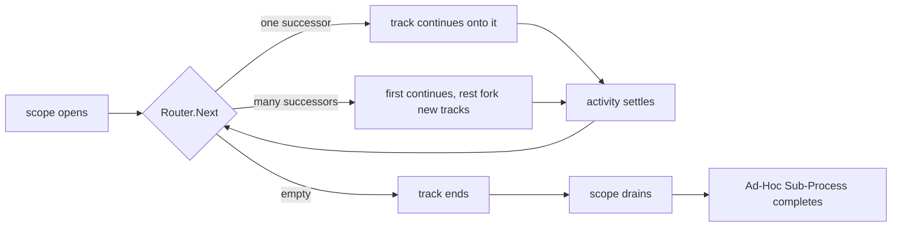

# ADR-035 — Ad-Hoc Sub-Process

| Field | Value |
|---|---|
| Status | Draft |
| Version | v.1 |
| Date | 2026-07-30 |
| Owner | Ruslan Gabitov |
| Refines | [ADR-023 v.3 Sub-Process and Call Activity](ADR-023-sub-process-and-call-activity.md) |

> **Scope.** This decides how gobpm executes the **Ad-Hoc Sub-Process**
> (BPMN §13.3.5): what "enabled", "selected" and "completed" mean for a
> container whose contents are *not* ordered by sequence flows, who decides
> what runs next, and how the human stays in the loop without stalling the
> engine. It refines [ADR-023 v.3](ADR-023-sub-process-and-call-activity.md)
> (the embedded Sub-Process as a nested token scope), reuses the wait-node
> park decided in [ADR-020 v.1](ADR-020-human-interaction-execution-model.md),
> and touches neither data-flow semantics
> ([ADR-011 v.7](ADR-011-process-data-flow.md)) nor the iteration model
> ([ADR-025 v.2](ADR-025-activity-iteration-loop-and-multi-instance.md)).

## 1. Context

### 1.1 What the standard requires

BPMN defines the Ad-Hoc Sub-Process as a *loose-ordered activity container*
whose "contents execute multiple times in an order constrained only by
explicitly specified sequence flows" (§13.3.5). Its operational semantics, as
carried by the vendored extract (`docs/bpmn-spec/semantics/sub-processes.md`,
§13.3.5):

- At any point a **subset** of inner activities is *enabled*; initially, all
  activities **without incoming sequence flows**.
- One enabled activity is "selected for execution — **typically by a Human
  Performer (not necessarily by the implementation)**".
- `ordering` — `sequential`: another activity may be selected only after the
  previous one terminates; `parallel`: another may be selected at any time,
  **allowing multiple parallel instances of the same inner activity**.
- After each inner completion the `completionCondition` is evaluated. `false`:
  "the enabled set is updated; new selections can occur". `true`: the Ad-Hoc
  Sub-Process completes — cancelling live instances when
  `cancelRemainingInstances` is `true`, otherwise waiting for them.
- Inner activities are **not required** to carry incoming or outgoing sequence
  flows; Intermediate Events *must* have outgoing flows. An inner activity that
  *does* have outgoing flows produces tokens on completion, and is re-enabled
  when its incoming flows carry sufficient tokens.
- The realized workflow pattern is **WCP-17 Interleaved Parallel Routing**.

The metamodel (`docs/bpmn-spec/elements/activities.md`, `AdHocSubProcess →
SubProcess → Activity`) adds three own properties: `completionCondition`
(`Expression`, 0..1), `ordering` (`AdHocOrdering`, 0..1) and
`cancelRemainingInstances` (`Boolean`, 0..1, **default `true`**).

### 1.2 What the standard deliberately leaves open

Three gaps shape this decision, and each is a *silence*, not a mandate:

1. **Who selects.** The spec explicitly declines to place the selector inside
   the implementation. An engine must therefore expose selection as a seam,
   not bury it in a policy.
2. **No `ordering` default.** Unlike `cancelRemainingInstances`, the metamodel
   declares no default for `ordering`. Whichever the engine picks is an
   **engine choice** to be registered as such.
3. **No completion rule without a `completionCondition`.** The attribute is
   optional (0..1), yet every completion sentence in §13.3.5 is phrased through
   it. A container with no condition has no spec-defined end.

The usual tie-breaker — align defaults to the BPMN leader — is unavailable
here: **Camunda 7 does not implement the Ad-Hoc Sub-Process at all**, so there
is no de-facto behaviour to match. The decisions below stand on the standard's
own text and on gobpm's existing execution model.

### 1.3 Why now

The Ad-Hoc Sub-Process is the **last unimplemented element** of gobpm's
declared conformance scope (the Common Executable Subclass plus the
ComplexGateway extension). Everything it needs already exists: a nested token
scope with drain-based completion, per-track forking, cooperative wait-node
parks, an expression seam, and the observability fact stream.

## 2. Decision

### 2.1 An Ad-Hoc Sub-Process is a Sub-Process variant on the existing nested scope

It is a variant of the embedded Sub-Process — the same **child scope plus
tracks inside the same instance** decided by ADR-023 v.3 — and **not** a child
instance. Two reasons, both structural:

- **Data visibility.** §10.5.7 gives inner activities visibility of the
  enclosing process's data. In gobpm that is the scope chain's walk-up, which
  exists only within one instance's scope tree. A child instance would sever
  it and force explicit input/output mapping — that is the Call Activity's
  contract, a different element with a different purpose.
- **Nothing else demands isolation.** An Ad-Hoc container's distinguishing
  property is *ordering freedom*, not lifecycle independence. Reaching for a
  new runtime container to express it would be inventing a wheel the engine
  already turns.

Consequently it inherits, unchanged: scope open and dispose, boundary events
on the container, the interrupting/non-interrupting cancellation model, the
Error scope chain, compensation ledger participation, and observability.

### 2.2 The Router answers "what runs next", replacing sequence-flow succession

Inside an ordinary container, a node's successors come from its **outgoing
sequence flows**. Inside an Ad-Hoc container, they come from a host-supplied
**Router**:

> **Router** — given the current state of the Ad-Hoc scope, return the inner
> activities that may run next. **An empty answer ends the track.**

The state offered to the decision has two halves. The **progress** half is what
§13.3.5 implies a selector needs: what has completed and how many times, what is
running now, and which activity's completion triggered this call. The **data**
half is a first-class part of the contract, not an accessory: **the Router reads
the Ad-Hoc scope's data**, and through the ordinary scope-chain walk-up, the
enclosing process's data as well. Routing that could not see the case's own data
would be reduced to counting activities — "enable *senior-review* when the claim
exceeds the threshold" is the ordinary shape of an ad-hoc decision, not an
advanced one.

The read is served by a **transient read frame opened at the Ad-Hoc scope** —
the same mechanism the engine already uses to evaluate loop conditions and
conditional-event expressions. That choice is deliberate on two counts: it gives
the Router a **consistent snapshot** for the whole decision rather than values
that could shift under it mid-call, and it keeps the read compatible with the
single-writer discipline even though the Router itself runs off the instance
loop (§3). The Router **reads**; it never writes. A decision that needs to
record something does so by returning successors whose activities write, so
every mutation still travels the ordinary frame-commit path and appears in the
change stream.

The engine consults the Router at exactly the two moments the standard names:
when the scope opens (yielding the *initially enabled* set — the standard's
"activities without incoming sequence flows" becomes one shippable Router
rather than a hardcoded rule) and after each inner activity settles (the
standard's "the enabled set is updated").

This is a **substitution at one seam**, not a parallel execution model: the
token, the track, the fork rules and the history are the engine's existing
ones. The Standard Loop already establishes the pattern — it computes a looped
activity's successors itself instead of reading the declared flows.

### 2.3 Completion is inherited from scope drain, not built anew

Because an empty Router answer ends a track, and a scope whose tracks have all
ended drains and completes its host activity, **the Ad-Hoc Sub-Process needs no
completion mechanism of its own**. "The Router says stop" and "the container
completes" are the same event observed at two levels.

This is the decision that keeps the element from degenerating. A container that
merely enabled every flow-less activity once and finished when they were done
would be an embedded Sub-Process with a shuffled order — all of the machinery,
none of the ad-hoc value. Making succession itself the pluggable part is what
delivers the repeated, data-driven, human-steered execution §13.3.5 describes.

### 2.4 `completionCondition` is retained as Router sugar

Conformance is not negotiable: `completionCondition` is a real metamodel
attribute and gobpm targets Process Execution Conformance. It does **not**
become a second, competing mechanism. It is defined as a **decorator over a
Router**: evaluate the expression after each inner completion; if true, answer
empty; otherwise delegate. The attribute keeps its standard meaning and the
engine keeps one succession rule.

### 2.5 Ordering — `parallel` is the engine's default (a registered choice)

With no default in the metamodel (§1.2), gobpm defaults `ordering` to
**`parallel`**: it is the less restrictive mode, it is the one §13.3.5
describes most fully (including concurrent instances of one activity), and
`sequential` is then an explicit narrowing a modeller opts into. Registered in
SAD-001 §14.1 as an engine choice, not presented as a standard requirement.

The two modes map onto existing mechanics rather than new ones:

- **`parallel`** — a Router answer with N successors continues the track on the
  first and **forks** the rest, exactly as a diverging sequence-flow split does.
  Two answers naming the same activity yield two concurrent instances in
  distinct child scopes, as §13.3.5 permits (and as parallel Multi-Instance
  already does).
- **`sequential`** — at most one activity may be live, so a Router answering
  with more than one successor is a **loud modelling error**, never a silent
  truncation to the first.

### 2.6 Selection: automatic and human, one mechanism

The spec puts the selector outside the implementation, which in gobpm means the
Router is host code — and host code must never block the engine. A Router that
waited for a person would stall the instance, the precise failure ADR-020 v.1
removed from human tasks. Therefore:

- **The Router decides, it does not wait.** It answers from state it already
  holds and returns promptly.
- **Automatic mode** takes the answer directly: successors run.
- **Manual mode** treats a multi-candidate answer as an *offer*: the track
  **parks as a wait node** — the same cooperative park a User Task uses, with
  the candidates recorded as the enabled set — and resumes onto the chosen
  activity when the host's selection arrives as an event.

Human latency therefore lives entirely outside the engine, where §13.3.5 puts
it, and the two modes differ by whether the track parks between the ask and
the step — not by having two selection subsystems.

Selection is addressed through a **per-scope control handle** (an instance may
hold several Ad-Hoc scopes, including nested ones): it exposes the enabled set,
the running instances, and the act of activating one.

### 2.7 `cancelRemainingInstances` governs the live tracks when the condition fires

The standard attaches `cancelRemainingInstances` to exactly one trigger — the
`completionCondition` evaluating true:

> `true`: Ad-Hoc Sub-Process completes. If `cancelRemainingInstances=true`
> (default): running inner Activity instances are **canceled**. If
> `cancelRemainingInstances=false`: Ad-Hoc Sub-Process waits for remaining
> instances to complete or terminate. (§13.3.5)

gobpm keeps it there. When the condition fires with inner instances still live,
the metamodel's default (`true`) cancels them through the engine's existing
interrupting-cancellation path; `false` lets the scope wait for them to complete
or terminate before it drains. The standard's default is kept.

An empty **Router** answer is a different event and carries no cancellation. It
ends the asking track (§2.2), leaving its siblings to run and the enabled set to
be recomputed at each of their completions — "after each completion of an inner
Activity … the enabled set is updated" — and the container finishes when its
scope drains (§2.3). The two must not be conflated: a momentarily empty enabled
set would otherwise cancel work the model never asked to cancel, and the
standard-shaped Router (§2.9) answers empty precisely while its forked
activities are still in flight.

### 2.8 Containment is validated at registration, and admitted in two steps

§13.3.5 permits Activities, Sequence Flows, Gateways and Intermediate Events
(plus Data Objects and Associations), and **omits Start and End events** — an
Ad-Hoc container is not entered by a start event and does not drain through an
end event. That omission is adopted as a permanent rejection.

The permitted set is then admitted in two steps, because the flow-less
selection model and the token-flow model are different mechanisms:

- **First: leaf Tasks and plain embedded Sub-Processes.** A leaf task executes
  and settles; a Sub-Process opens its own nested scope through the composite
  machinery this ADR already inherits — so an inner Sub-Process needs no new
  execution path, and a **nested Ad-Hoc container works by construction** (the
  outer Router sees it as one selectable activity; the inner one runs its own).
  Data Objects and Data Associations are permitted throughout.
- **Then: sequence flows, gateways and intermediate events** — the token-flow
  half of §13.3.5. Two things justify them, and neither is expressible without
  them. **Gateways** only mean anything once inner activities carry flows, and
  that is exactly the *partial crystallization* shape: a container that is
  mostly ad-hoc but holds one formalized island which branches. **Intermediate
  catch events** are the container's only **external re-entry point**: the
  Router is consulted at scope open and after an activity settles, so it cannot
  react to a stimulus arriving while the scope sits idle — which is precisely
  what the standard's "triggered multiple times while the Ad-Hoc Sub-Process is
  active" describes.

Deferred rather than rejected, each for a stated reason: the **Event
Sub-Process** (a scope-armed handler, not a selectable activity — its
interaction with Router-driven completion needs deciding), the **Transaction**
variant (a Cancel abort inside a Router-driven container is its own question),
and the **Call Activity** (no obstacle, simply out of the first scope).

An Ad-Hoc container that declares **neither a Router nor a completion
condition** is rejected at registration as unexecutable — an honest failure
rather than a silent degradation into an inline Sub-Process. gobpm already
rejects unexecutable models this way (a top-level Conditional start event).

### 2.9 Batteries are shipped, but **no Router is implied**

Following the engine's batteries-included stance the decision includes ready
Routers so common shapes need no host code: a **standard/BPMN-shaped** one (the
flow-less activities, each once — the conformance shape), an **expression** one
(a `FormalExpression` naming the successors, evaluated through the
language-routed expression seam of
[ADR-032 v.1](ADR-032-language-routed-expression-engines.md)), and a **fixed
sequence** one — the crystallized end state where an ad-hoc container has
hardened into a deterministic order.

Every one of them is **explicit**. No Router is applied by default, and in
particular routing is **never** inferred from the order in which elements were
added to the container. Three reasons:

1. **Declaration order is invisible in the diagram.** Two Ad-Hoc containers
   that render identically — same activities, no flows — would execute
   differently depending on the order of construction calls. Diagram-opaque
   behaviour is a standing engine non-goal (it is why implicit gateways and
   joins are rejected).
2. **A default turns a modelling omission into a plausible-looking run.** With
   no default, a container missing its Router fails at registration and the
   modeller learns at once; with one, the same mistake produces a process that
   runs in a silently arbitrary order — the accidental-silence class the
   engine's observability policy treats as the worse failure.
3. **Each-once-in-order is the degraded shape.** A Router that walks every node
   once and stops is an ordinary sequential Sub-Process; making it the default
   would present the element's weakest behaviour as its normal one.

The ergonomic case a default would have served is met by naming a battery — one
call, and the behaviour is a stated property of the model rather than an
artifact of construction order.

### 2.10 Non-goals

- **A Router that blocks or waits** (§2.6) — waiting is expressed by parking.
- **An implied or inferred Router** (§2.9) — including routing by element
  declaration order.
- **A Router that writes to the data scope** (§2.2) — routing observes, its
  chosen activities mutate.
- **A child-instance Ad-Hoc container** (§2.1).
- **Start and End events inside the container** (§2.8) — the standard's
  containment list omits them.
- **`startQuantity`/`completionQuantity` ≠ 1** — already a registered engine
  non-goal; the token-flow rule of §13.3.5 is honoured at quantity 1.
- **Re-ordering or rewriting the container at runtime** (adding activities to a
  live Ad-Hoc scope). The "crystallization" idea — an ad-hoc container maturing
  into a formalized flow — is served by *authoring* a narrower Router or
  ordinary sequence flows, not by mutating a running instance.

## 3. Consequences

**Positive.**

- The element lands on existing machinery: nested scope, track fork, wait-node
  park, drain-based completion, cancellation, observability. The new surface is
  one interface and one control handle.
- Completion, selection and initial enablement stop being three mechanisms and
  become one question asked repeatedly.
- The human stays outside the engine by construction, satisfying §13.3.5
  without a blocking call anywhere.
- Conformance is preserved (`completionCondition`, `cancelRemainingInstances`,
  both `ordering` modes, concurrent instances of one activity) while the
  general mechanism is stronger than the attribute it subsumes.
- It completes gobpm's declared BPMN conformance scope.

**Negative / accepted.**

- A host-supplied Router is engine-adjacent code: a slow or panicking Router
  degrades its Ad-Hoc scope. Mitigated by running it off the instance's
  single-writer loop, as the iteration decorator already does for loops.
- The succession seam gains a second implementation (flows *or* Router).
  Accepted deliberately: one shared fork-and-continue implementation with two
  sources of successors, never two copies of the fork rules.
- A Router is more powerful than `completionCondition`, so two models can
  express the same behaviour differently. The sugar exists precisely so the
  conformance-shaped model stays idiomatic.

## 4. Alternatives considered

1. **`completionCondition` as the primary mechanism, with a separate
   enabled-set bookkeeping.** The literal reading of §13.3.5. Rejected: it
   needs three cooperating mechanisms (initial enablement, the update rule, the
   completion test) to express one question, and its natural default —
   enable the flow-less activities, run each once, finish — is an embedded
   Sub-Process with a shuffled order. The element deserves better than a
   degraded twin of one we already ship.
2. **A child instance per Ad-Hoc container.** Rejected in §2.1: it severs
   §10.5.7 data visibility and duplicates the Call Activity.
3. **An engine-internal selection strategy (an enum of policies).** Rejected:
   the standard explicitly places the selector outside the implementation; a
   closed policy set cannot express a host's real selection rules, and every
   new rule would become an engine change.
4. **A blocking Router that waits for a human choice.** Rejected: it stalls the
   instance's single-writer loop — the failure mode ADR-020 v.1 already
   eliminated for User Tasks.
5. **Synthesizing sequence flows for Router answers**, so the existing
   succession code is reused verbatim. Rejected: phantom flows that exist in no
   model would leak into token history, gateway arrival accounting and the
   observability stream — a lie told to every consumer of those records to save
   one refactor.
6. **A default Router derived from element declaration order**, so that any
   Ad-Hoc container runs without configuration. Rejected on the three grounds
   in §2.9 — the order is invisible in the diagram, the default converts a
   modelling omission into a plausible-looking run, and each-once-in-order is
   the element's degraded shape. The ergonomics are recovered by naming a
   battery explicitly.

## 5. Enterprise-readiness recommendations

- **Observability.** The Ad-Hoc lifecycle deserves its own fact kind — scope
  opened, candidates offered, activity activated (with the actor when a human
  selected it), activity settled, scope stopped (with the reason: Router-empty,
  completion condition, or cancellation) — so an operator can reconstruct *why*
  an ad-hoc case took the path it did. That reconstruction is the audit story
  for human-steered work, and it is the main reason to keep the enabled set
  observable rather than internal.
- **Authorization.** Activation is a human-facing act like claiming a task; it
  should pass the engine's authorization seam, so "who may activate what" is
  answerable in an audit.
- **Router discipline.** Document the Router contract as *read-only, pure and
  prompt* — no I/O, no waiting, no writes, deterministic on its inputs. A host
  needing a remote decision pre-fetches it into scope data (from an activity
  that ran earlier) and lets the Router read it there; that keeps the decision
  reproducible from the recorded data, which is what makes an ad-hoc case
  auditable after the fact. That contract is load-bearing rather than advisory:
  a routing answer is a decision, so the engine evaluates it where it evaluates
  its other conditions — inline, on the instance's own execution loop. A Router
  that blocks therefore stalls every track in its instance, and one that calls
  back into its own instance deadlocks against the channel that would serve it.
  Neither is defended against by machinery; both are excluded by the contract,
  which is why it belongs in the element's documentation and not only here.
- **Operational guidance.** An Ad-Hoc scope steered by a human can stay open
  indefinitely; operators should be able to see long-open scopes, and modellers
  should be encouraged to pair one with a Timer boundary event when a business
  deadline exists.

## 6. Open questions

None.

## 7. References

- `docs/bpmn-spec/semantics/sub-processes.md` §13.3.5 — Ad-Hoc operational
  semantics, ordering, completion, containment, token flow, WCP-17.
- `docs/bpmn-spec/elements/activities.md` — the `AdHocSubProcess` metamodel:
  `completionCondition` 0..1, `ordering` 0..1 (no default),
  `cancelRemainingInstances` 0..1 default `true`.
- [ADR-023 v.3 Sub-Process and Call Activity](ADR-023-sub-process-and-call-activity.md)
  — the nested-scope container this refines.
- [ADR-020 v.1 Human Interaction Execution Model](ADR-020-human-interaction-execution-model.md)
  — the cooperative wait-node park and the no-blocking-interactor rule.
- [ADR-025 v.2 Activity Iteration](ADR-025-activity-iteration-loop-and-multi-instance.md)
  — the off-loop decorator precedent for driving iteration without touching the
  single-writer loop.
- [ADR-011 v.7 Process Data Flow](ADR-011-process-data-flow.md) — the data the
  Router reads.
- [ADR-032 v.1 Language-Routed Expression Engines](ADR-032-language-routed-expression-engines.md)
  — the seam the expression Router and the completion condition evaluate through.
- [ADR-013 v.2 Instance Observability](ADR-013-instance-observability.md) — the
  fact stream the §5 recommendation extends.

## Document History

| Version | Date | Author | Changes |
|---|---|---|---|
| v.1 | 2026-07-30 | Ruslan Gabitov | Initial decision. Containment is admitted in two steps — first leaf Tasks and plain embedded Sub-Processes (an inner Sub-Process reuses the composite park, so a **nested Ad-Hoc container works by construction**), then sequence flows, gateways and intermediate catch events, which carry the two cases the flow-less model cannot express: **partial crystallization** (a formalized branching island inside an ad-hoc container) and **external re-entry** (the Router is consulted only at open and at settle, so it cannot react while the scope idles). Start and End events are rejected outright, the standard's containment list omitting them; Event Sub-Process, Transaction and Call Activity are deferred with stated reasons. Routers are **always explicit — no default and no inference from element declaration order** (invisible in the diagram, converts a modelling omission into a plausible-looking run, and each-once-in-order is the degraded shape). The Ad-Hoc Sub-Process is a **Sub-Process variant on the existing nested scope** (not a child instance — a child instance would sever §10.5.7 data visibility and duplicate the Call Activity). Its distinguishing mechanism is the **Router**: a host-supplied answer to "what runs next" that **replaces sequence-flow succession** inside the container, consulted at scope open and after each inner activity settles; an **empty answer ends the track**, so completion is **inherited from scope drain** rather than built anew. The Router decides on **progress state and the Ad-Hoc scope's data** (read through a transient frame at that scope — a consistent snapshot, compatible with the single-writer discipline, with parent data visible by walk-up); it reads and never writes. `completionCondition` is retained as **Router sugar** for conformance; `cancelRemainingInstances` keeps the metamodel default `true`. `ordering` defaults to **`parallel`** — a registered engine choice, the metamodel declaring no default and Camunda 7 not implementing the element — with `sequential` rejecting a multi-successor answer loudly. Human selection rides the **existing wait-node park**: automatic mode takes the Router's answer, manual mode parks with the candidates offered and resumes on the host's activation through a **per-scope control handle**; the Router itself never blocks. Containment is validated at registration, and a container with neither Router nor completion condition is **rejected as unexecutable**. Batteries: standard/flow-less, expression, and fixed-sequence Routers. Non-goals: blocking Routers, child-instance containers, quantity ≠ 1, runtime mutation of a live container. |
