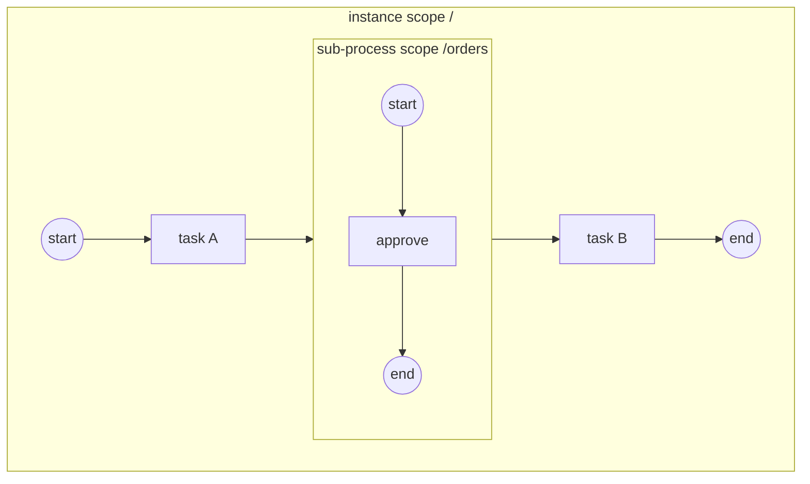

# ADR-023 — Модель выполнения Sub-Process и Call Activity (вложенные области)

| Поле | Значение |
|---|---|
| Статус | Принято |
| Версия | v.5 |
| Дата | 2026-08-28 |
| Владелец | Руслан Габитов |
| Уточняет | [ADR-001 v.6](../ADR-001-execution-model.md), [ADR-010 v.2](../ADR-010-process-data-model.md) §2.2, [ADR-018 v.1](../ADR-018-boundary-events-and-activity-interruption.md) §2.2/§2.6, [ADR-006 v.6](../ADR-006-events-and-subscriptions.md) §2.6/§2.7, [ADR-019 v.1](../ADR-019-definition-versioning.md), [SAD-001 v.1.3](../SAD-001-vision-and-architecture.md) §15.3 |

> EN-оригинал — канонический: [ADR-023-sub-process-and-call-activity.md](../ADR-023-sub-process-and-call-activity.md). Этот файл — его перевод (twin). При расхождении приоритет у английского текста.

Этот ADR решает, как процесс gobpm **композируется**, на одном понятии:
**область выполнения** (execution scope) — совместный контекст токенов, данных и
событий из §10.5.7 — как дерево. **Встроенный Sub-Process** — это узел-контейнер,
открывающий дочернюю область **внутри того же экземпляра**, с валидированными
формами инстанциации, завершением по осушению (drain), отменой области как
единицей прерывания и обходом цепочки областей для Error. **Event Sub-Process** —
обработчик, взведённый на время жизни этой области. **Call Activity** — граница
переиспользования, которую проводит сам стандарт, и потому единственное место,
где появляется **дочерний экземпляр**: callable, разрешаемый через версионируемый
реестр во время вызова, со стандартным прямым отображением I/O и каскадом отмены.

---

## 1. Контекст и проблема

Процесс, который движок не умеет вкладывать, — это процесс, неспособный выразить
**переиспользование** (фрагмент, общий для нескольких определений),
**структуру** (отменяемая, компенсируемая единица работы) и
**контейнеры-обработчики событий** из §13.5.4. Это не три фичи, а одно
недостающее понятие, и форма этого понятия решает сразу несколько вещей: что
такое контекст токена, где данные живут и умирают, какой обработчик ловит
брошенную ошибку и что значит «эта активность закончилась», когда активность
содержит граф.

Риск отвечать на них по отдельности — движок «на каждую конструкцию своё»: одно
правило завершения sub-process'а, другое — времени жизни обработчика, третье —
что именно терминирует Terminate. Этот ADR отвечает один раз, и ограничение,
которое он обязан соблюсти, — это **единственный писатель** цикла gobpm
([ADR-001 v.6](../ADR-001-execution-model.md)): композиция должна расширять учёт
цикла, а не добавлять второй домен синхронизации.

## 2. Решение

### 2.1 Одна концепция: область выполнения

**Область** — это контекст выполнения из §10.5.7, совместный набор:

- **токены**: граф flow-узлов, в котором движутся токены области;
- **данные**: переменные и data objects, видимые по обходу контейнеров вверх
  (Property Sub-Process'а доступно этому Sub-Process'у и его непосредственным
  детям; данные родителя видны из ребёнка, но никогда наоборот);
- **события**: обработчики, взведённые пока область активна, — boundary-события
  на её композитном хосте и event sub-process'ы, объявленные в ней (§2.10).

Области образуют **дерево** с корнем в экземпляре процесса. gobpm идентифицирует
область её **путём**: корень экземпляра — `/`, встроенный sub-process `orders`
открывает `/orders`, вложенный `retry` — `/orders/retry`, — дословно
переиспользуя адресацию контейнерных областей плоскости данных, так что дерево
*данных* и дерево *выполнения* — одно и то же дерево.

**Встроенный sub-process выполняется внутри родительского экземпляра.** Один
экземпляр, один цикл событий, один единственный писатель: вложенные токены — это
обычные треки, которые дополнительно **несут свой путь области**, а реестры цикла
получают осведомлённость об областях вместо дублирования на каждую область. Это
тот же приём «расширяй учёт, а не модель конкурентности», что и в
channel-based-обработке событий, и именно он держит композицию вне дизайна
блокировок. Дочерний *экземпляр* существует только за границей **Call Activity**
(§2.7) — там, где линию переиспользования проводит сам стандарт.

### 2.2 Узел встроенного Sub-Process — контейнер, который является узлом

Sub-Process — это **и то и другое**: flow-узел в графе родителя (у него есть
входящие и исходящие sequence flow, boundary-события, жизненный цикл активности)
— и **контейнер** собственного внутреннего графа.

**Вложенность строгая** (Table 7.2 p.29; §7.6.1 p.40): *«Sequence Flows не могут
пересекать границу Sub-Process»* — внутренний узел соединяется только с
внутренними узлами, а композит соединяется с графом родителя лишь через рёбра
собственного узла и boundary-события.

**Решение движка — самопротиворечие §13.3.4 разрешено в пользу §7.6.1.** §13.3.4
(p.430) содержит абзац, разрешающий инстанциировать sub-process без входящих
потоков через *«Start Events, являющиеся целью Sequence Flows извне
Sub-Process»*. Это прямо противоречит правилам соединения выше и явному
примечанию Table 7.2, является рудиментом BPMN 1.x и не реализовано ни одним
референсным движком. gobpm отвергает пересекающие границу потоки безусловно;
пункт **не поддерживается**.

### 2.3 Инстанциация — детерминированные, валидированные формы

Проверено дословно (§13.3.4 p.430): *«Sub-Process инстанциируется, когда в него
приходит токен по Sequence Flow. У Sub-Process есть либо **единственное пустое
Start Event**, которое получает токен при инстанциации, либо **нет Start
Event**, но есть Activities и Gateways без входящих Sequence Flows. В последнем
случае **все такие Activities и Gateways получают токен**. Sub-Process **НЕ
ДОЛЖЕН иметь непустых Start Events**»*. Table 10.85 (p.241) обосновывает почему:
*«поток Процесса (токен) из родительского Процесса **и есть** триггер
Sub-Process'а»*.

gobpm поддерживает **обе нормативные формы** и отвергает всё остальное на
**валидации процесса** — до того, как появился хоть один экземпляр, — так что
некорректный композит является ошибкой регистрации, а не сюрпризом времени
выполнения:

| Форма | Поведение |
|---|---|
| Ровно одно **None** Start Event | Старт получает входной токен; внутренний поток идёт от него. |
| **Нет** Start Event | Каждая внутренняя активность и шлюз без входящих потоков получают токен (параллельный веер стартов). |
| Триггерный Start Event внутри | **Отвергается** — Message/Timer/Signal/Conditional-старты принадлежат event sub-process'ам (§2.10) или процессам верхнего уровня. |
| None-старт **вперемешку** с другими узлами без потоков | **Отвергается** — спецификация формулирует формы как взаимоисключающую альтернативу; смешанная форма не определена, а тихие полустарты — тот класс некорректного поведения, на котором gobpm падает быстро. |
| Более одного None-старта | **Отвергается** — *«единственное пустое Start Event»*. |

Общие правила активностей не тронуты: несколько входящих потоков в композит —
это неявное исключающее слияние, каждый пришедший токен — независимая
инстанциация (§13.3.1). `startQuantity`/`completionQuantity` ≠ 1 —
**намеренная не-цель** ([SAD-001 v.1.3](../SAD-001-vision-and-architecture.md) §4
N8); рантайм соблюдает значение по умолчанию 1.

### 2.4 Жизненный цикл области — open, seed, drain, close

Когда выполнение входит в узел Sub-Process:

1. **Открыть** дочернюю область: её контейнер данных открывается под путём
   родителя, а её обработчики взводятся — boundary-события композита на хосте и
   event sub-process'ы, объявленные внутри него (§2.10).
2. **Засеять** внутренние токены по валидированной форме (§2.3) — внутренние
   треки, несущие путь дочерней области.
3. Выполнение композита **ожидает своё тело**. Ожидание **внутриэкземплярное**:
   для встроенного sub-process'а никакого дочернего экземпляра нет (§2.1),
   внутренние треки — братья в том же цикле, и ожидание заканчивает собственный
   учёт осушения цикла, а не внешнее завершение. (Парковка как таковая — трек,
   приостановленный в ожидании внешнего события, — это форма Call Activity, §2.7.
   Чем и как приводится в движение выполнение композита — решение
   [ADR-025 v.5.1](../ADR-025-activity-iteration-loop-and-multi-instance.md)
   §2.12/§2.13, а не этого ADR.)
4. **Завершение по осушению** (§13.3.4): область завершается, когда **внутри неё
   не осталось токенов** — каждый внутренний трек закончился и ни одна внутренняя
   активность больше не активна. Потрековый учёт цикла расширяется на область.
5. **Закрыть** область: её контейнер данных закрывается, и внутренние переменные
   утилизируются вместе с ним (жизненный цикл DataObject привязан к его
   контейнеру, §10.5.7); её обработчики снимаются; композит завершается и
   выбирает исходящие потоки по стандартным правилам активности, включая условные
   потоки и default.

Внутренние **End Events** сохраняют своё поведение — Message-конец отправляет,
Signal-конец вещает — и завершают собственный трек, питая правило осушения.
**Error End Event** и **Terminate End Event** получают семантику, осведомлённую
об областях (§2.5, §2.6).

### 2.5 Прерывание — область отменяется как единое целое

Всё, что [ADR-018 v.1](../ADR-018-boundary-events-and-activity-interruption.md)
решил для одиночной активности, распространяется на композит заменой «отменить
трек» на «**отменить область**»: остановить каждый трек, чей путь лежит внутри
области, той же кооперативной отменой, закрыть область и продолжить согласно
прерывающей конструкции.

- **Boundary-события на композите** (прерывающие): срабатывание отменяет дочернюю
  область и направляет токен на exception flow границы; окно взведения/снятия —
  это окно выполнения хоста, без изменений. Непрерывающие границы ветвятся
  параллельно, тоже без изменений. Применяется полный набор триггеров границы —
  Message, Timer, Signal и Conditional по их существующим моделям, Error по §2.6.
- **Областной Terminate** (§13.5.6, проверено): Terminate End Event
  *«терминирует свою **объемлющую область** — для sub-process'а только
  затронутый экземпляр; области более высокого уровня НЕ затрагиваются»*.
  Достижение Terminate внутри sub-process'а отбрасывает оставшиеся токены
  **только этой области** и завершает композит аварийно, но локально; родитель
  продолжает. Terminate верхнего уровня сохраняет семантику всего экземпляра,
  потому что экземпляр — это просто корневая область. Terminate не запускает
  компенсацию ([ADR-006 v.6](../ADR-006-events-and-subscriptions.md) §2.2;
  opt-in-переопределение — [ADR-026 v.1](../ADR-026-compensation-events.md) §2.8,
  выключено по умолчанию).
- **Терминирование или остановка экземпляра** отменяет корневую область, что
  каскадом расходится по дереву на каждую вложенную.

### 2.6 Распространение Error — цепочка областей

Ошибка находит свой обработчик обходом наружу, и обход один и тот же для любого
уровня области:

1. Активность падает с `BpmnError` → сопоставить **Error-границу на этой
   активности**.
2. Нет совпадения → **идти наружу**: на каждой объемлющей области сопоставить
   Error-границу **на композитном хосте этой области** и event sub-process с
   Error-стартом, объявленный в этой области (§2.10), — ближайший объемлющий
   ловец, §10.5.1/§10.5.7. Совпадение отменяет эту область (Error всегда
   прерывающий) и направляет её exception flow.
3. Нет совпадения нигде по цепочке → **отказ экземпляра**, решение движка о
   неперехваченной ошибке, зафиксированное в
   [ADR-006 v.6](../ADR-006-events-and-subscriptions.md) §2.6.
4. **Error End Event** внутри sub-process'а бросает на границе своей области:
   обход начинается с объемлющего композита, поэтому error-конец во вложенной
   области ловится родителем, и только неперехваченный роняет экземпляр.

Escalation следует той же цепочке с некритичной семантикой.

### 2.7 Call Activity — дочерний экземпляр через реестр

Call Activity — это граница **переиспользования** в стандарте (§13.3.4): она
вызывает `CallableElement` — для gobpm **отдельно зарегистрированный процесс**.
Композиция идёт **по ссылке**, а не по вложению, поэтому единица выполнения —
**дочерний экземпляр**, а не вложенная область.

- **Разрешение и привязка версии.** `calledElement` — это **ссылка на callable**:
  ключ, опционально квалифицированный **пространством имён** документа
  definitions, в котором callable был объявлен. Неквалифицированная ссылка
  называет ключ реестра напрямую
  ([ADR-019 v.1](../ADR-019-definition-versioning.md)). Привязка по умолчанию —
  **latest-at-launch**, семантика реестра «просто запусти текущий», а
  **закреплённая версия** — явная опция на Call Activity. Разрешение происходит
  **во время вызова**, поэтому callable может быть зарегистрирован позже или
  переверсионирован; отсутствующий ключ или версия роняют активность вызывающего
  классифицированной ошибкой, входящей в цепочку §2.6 как техническая
  неисправность.
- **Разрешение callable — шов на стороне host'а; решение движка.** Стандарт
  типизирует `calledElement` как простой `String` и оставляет инструменту то, как
  ссылка находит свой `CallableElement`; ссылка в другой документ осмысленна
  только через `<import>` этого документа. Поэтому движок не владеет никакой
  конвенцией именования. **Резолвер callable** — контракт host'а, поставляемый
  один раз на движок, — превращает ссылку на callable в обслуживаемый реестром
  ключ и вызывается во время вызова для **каждого** вызова, **вне всех блокировок
  движка**, потому что это код host'а. **Резолвер по умолчанию** сохраняет
  неквалифицированный случай точным (ссылка *и есть* ключ) и отвечает на
  квалифицированную ссылку классифицированной ошибкой, называющей пространство
  имён: host, который никогда не импортирует между документами, не настраивает
  ничего, а тот, который импортирует, поставляет отображение вместо того, чтобы
  движок его угадывал.
- **Global task — это callable, и реестр обслуживает его как процесс; решение
  движка.** Семейство `GlobalTask` в стандарте — это `CallableElement` без
  собственного потока, а §13.3.4 придаёт вызову семантику вызываемого Процесса.
  Движок реализует global task как **процесс, телом которого является эта одна
  задача**: None-старт, задача, None-конец, — который host регистрирует под id
  global task'а, как любой другой процесс, а `ioSpecification` callable
  становится объявленным контрактом процесса
  ([ADR-040 v.2](../ADR-040-process-io-contract.md)). Переиспользование остаётся
  **по ссылке**: одна регистрация, любое число вызывающих, а перерегистрация
  чеканит версию, как у всякого процесса. На пути вызова ничто не отличает
  вызванный global task от вызванного процесса — а это ровно то, чем §13.3.4
  называет вызов.
- **Семантика вызова** (§13.3.4, проверено): вызываемый процесс инстанциируется
  своим **None** Start Event; его триггерные Start Events — законные для
  глобального процесса — **игнорируются на пути вызова** (*«эти непустые Start
  Events являются альтернативой пустому Start Event и потому игнорируются, когда
  Процесс вызывается»*). У вызванного экземпляра та же семантика инстанциации и
  терминирования, что и у sub-process'а.
- **Вызывающий ждёт внешнюю работу.** Call Activity — настоящий узел ожидания в
  родителе: дочерний экземпляр крутит собственный цикл, а его терминальное
  состояние возвращается в цикл вызывающего и возобновляет ждущий трек.
  Completed → выходы связываются и вызывающий продолжает; Terminated или Failed →
  неисправность входит в цепочку §2.6 вызывающего на узле Call Activity и ловится
  Error-границей на нём.
- **I/O — прямое отображение стандарта** (проверено): DataInputs/DataOutputs Call
  Activity отображаются на InputOutputSpecification callable **без явных data
  associations** — прямое связывание по имени. Входы связываются в корневую
  область ребёнка при запуске; выходы связываются обратно в область вызывающего
  при завершении. Плоскость данных ребёнка **изолирована**: обход вверх не
  пересекает границу вызова, потому что вызываемый процесс обязан выполняться
  одинаково, как бы до него ни дошли, и эта же изоляция является гарантией
  приватности — пересекают границу только объявленные входы. Сторона вызываемого
  в этом отображении — собственные объявленные входы и выходы процесса, что
  связывается при его запуске, что читается при его завершении и проверка по
  именам параметров вызывающего против разрешённого callable при запуске — это
  [ADR-040 v.2](../ADR-040-process-io-contract.md).
- **Каскад отмены — решение движка** (стандарт молчит о терминировании по
  инициативе вызывающего): отмена Call Activity вызывающего — прерывающая граница
  на ней, областной Terminate её области или терминирование экземпляра —
  **каскадирует Terminate в дочерний экземпляр**. Вызов «выстрелил и забыл» вне
  области рассмотрения: ни одна конструкция BPMN его не выражает.
- **Связность в наблюдаемости.** Факты дочернего экземпляра несут родительскую
  связь — id экземпляра вызывающего и id узла Call Activity, — так что трасса
  сшивается через границу.
- **Контракт перезапуска — вызов переживает рестарт целиком** (стандарт молчит о
  рестартах движка; решение движка, управляемое
  [ADR-033 v.5](../ADR-033-persistence-and-state.md) §2.10): дочерний экземпляр
  **долговечен сам по себе**, чекпоинтится под тем же репозиторием и дисциплиной,
  что и любой экземпляр, и несёт родительскую связь, тогда как чекпоинт
  вызывающего записывает вызов в полёте — id ожидаемого дочернего экземпляра и
  узел вызова. Восстановление поднимает **оба конца и связывает их заново**:
  ждущий трек вызывающего возобновляется на восстановленном ребёнке, терминальное
  состояние ребёнка входит в восстановленного вызывающего ровно так же, как вошло
  бы в резидентного, и каскад отмены переживает рестарт. Восстановленный
  вызывающий, у которого нет записи об ожидаемом ребёнке, **громко проваливает
  своё восстановление** — вызов является записанным состоянием, поэтому тихий
  перезапуск ребёнка спроектирован прочь; и наоборот, восстановленный ребёнок,
  чья родительская запись исчезла, падает громко, а не работает сиротой.

### 2.8 Композиты, которые едут на этой модели областей

Область намеренно общая, и несколько конструкций являются **её вариантами**, а не
новыми моделями выполнения. Каждая решается своим ADR и берёт жизненный цикл
данных области, завершение по осушению и отмену без изменений:

- **Transaction** — вариант sub-process'а, чьи Cancel-конец и Cancel-граница едут
  на отмене области плюс компенсации
  ([ADR-028 v.2](../ADR-028-transaction-sub-process.md)).
- **Ad-Hoc** — контейнер, чьё внутреннее разрешение к выполнению управляется
  выбором, а не потоком: переиспользует область и заменяет только правило засева
  токенов ([ADR-035 v.1](../ADR-035-adhoc-sub-process.md)).
- **Итерация** — Standard Loop и Multi-Instance над активностью, в том числе
  композитной. Какие активности получают дочернюю область на итерацию, а какие
  итерируются на месте — решение
  [ADR-025 v.5.1](../ADR-025-activity-iteration-loop-and-multi-instance.md), а не
  этого ADR.
- **Компенсация** — реестр завершений, который несёт дерево областей, и
  обработчики, которые он вызывает
  ([ADR-026 v.1](../ADR-026-compensation-events.md)).

### 2.9 Рекурсия и глубина

Глубина вложенности **не ограничена by design**: области — дерево, а пути
композируются. Call Activity может вызвать собственный процесс — рекурсия
является законной композицией, а разрешение идёт по ключу реестра во время
вызова, — поэтому статическая проверка циклов ни требуется стандартом, ни
разрешима между версиями. Разбежавшаяся рекурсия — ошибка моделировщика, ответ на
которую даёт эксплуатационный предохранитель глубины (§6), а не запрет на уровне
модели.

### 2.10 Event Sub-Process — обработчик, взведённый областью

**Event Sub-Process** (§13.5.4) — это `SubProcess` с пометкой `triggeredByEvent`:
фрагмент-обработчик, живущий **внутри** области и **взводимый событием**, а не
достигаемый sequence flow. Это областной аналог boundary-события: там, где
граница охраняет окно одной активности, event sub-process охраняет окно целой
**области**.

**Модель.** Event sub-process переиспользует контейнер §2.2 и вложенную область
§2.4 и добавляет ровно то, чего требует и что запрещает стандарт:

- **Единственное триггерное Start Event** (§10.5.2 p.241: *«Event Sub-Process
  ДОЛЖЕН иметь единственное Start Event»*) одного вида — Message, Timer, Signal,
  Error, Conditional или Escalation; флаг `isInterrupting` старта выбирает
  вариант.
- **Самодостаточен** (§13.5.4): никаких sequence flow в граф родителя или из
  него, достигается *только* срабатыванием своего старта. Поскольку его старт
  *триггерный*, он **никогда** не является входным узлом: инстанциация §2.3
  засевает None-старт или узлы без потоков и **пропускает** event sub-process,
  регистрируя его вместо этого как **обработчик области**.
- **Никаких boundary-событий** на нём (§13.5.4).
- **Выполняется в контексте данных родителя** (§13.5.4): его внутренние узлы
  читают объемлющую область обходом вверх §2.4, как любой внутренний узел.

**Взведение — паттерн boundary-watch на гранулярности области.** Когда область
открывается (§2.4 или корень экземпляра при старте), каждый event sub-process,
объявленный непосредственно в ней, **взводится**, регистрируя триггер своего
старта той же пер-видовой машинерией, что использует boundary-событие:

| Триггер | Механизм взведения |
|---|---|
| Message | ожидатель в хабе по ключу сообщения, доставляется как событие цикла |
| Signal | ожидатель в хабе на имя сигнала (безопасно к вещанию) |
| Timer | подсистема таймеров, срабатывающая в цикл |
| Conditional | локальная для цикла условная подписка на фронте false→true ([ADR-006 v.6](../ADR-006-events-and-subscriptions.md) §2.7) — сюда приземляется условный старт, и он законно читает объемлющую область |
| Error | обход цепочки областей §2.6 в точке броска — никакого взведённого ожидателя; обход находит ближайшую объемлющую область, чей обработчик ловит код |

Обработчик взведён на **время жизни своей области** — снимается, когда область
осушается (§2.4), отменяется (§2.5) или, для прерывающего обработчика, как только
**любой** прерывающий обработчик в области сработал.

**Прерывающий — отменить область, выполнить обработчик в ней.** По прерывающему
триггеру:

1. Братские треки объемлющей области отменяются — отмена области §2.5,
   применённая к *собственной* области обработчика. Плоскость данных области
   **остаётся открытой**; обработчик выполняется в ней.
2. Жизненный цикл родителя отражает триггер (§13.5.4): **Error**-старт переводит
   родителя в *Failing*, а **не-error** прерывающий старт — в *Terminating*.
   Движок не держит отдельного состояния токена Failing/Terminating —
   сообразно выбору §2.1 не добавлять состояния жизненного цикла активности, в
   которых цикл не нуждается, — и реализует различие тем, *какой* путь отмены
   выполняется (обход Error §2.6 против простой отмены области), выводя его в
   наблюдаемость.
3. Внутренний поток обработчика засевается из его триггерного старта, причём
   старт считается сработавшим, а его полезная нагрузка связывается способом
   «рождённого события» §2.4, в очищенную область; обработчик выполняется до
   своего End в контексте данных области.
4. Когда обработчик **осушается**, область завершается и композит возобновляется,
   следуя исходу обработчика.

**Общий прерывающий бюджет и absorb против re-throw.** Для данного Event
Declaration в области может сработать **только один прерывающий обработчик** — *и
этот бюджет общий между event sub-process'ом и любым boundary-событием на том же
хосте области* (§10.5.6 p.278). Локус поэтому — **один регистр прерывающего
взведения на область**, ключёванный по Event Declaration, к которому обращаются и
boundary-watch, и взведение event sub-process'а; первое прерывающее срабатывание
переводит область в *interrupted* и снимает остальные. Когда область несёт и
встроенный event sub-process, и границу на тот же `EventDefinition`:

- обработчик **завершается без повторного броска** → он **поглощает** событие:
  граница не срабатывает, и родитель возобновляется на своём нормальном потоке;
- обработчик **бросает событие повторно** — Throw того же вида на его End →
  граница срабатывает **после** обработчика: встроенный обработчик является
  **декоратором**, а не терминальным.

Это даёт моделировщику явный контроль «терминальный против декоратора».

**Непрерывающий.** Непрерывающий event sub-process (`isInterrupting=false`, любой
триггер кроме Error — ошибки всегда прерывают, §10.5.6) выполняется
**параллельно** с родителем: триггер потребляется, экземпляр обработчика
порождается новым треком в **свежей дочерней области** под родителем, и родитель
продолжает работать. Несколько могут выполняться одновременно (§10.5.6:
неограниченно, порядок недетерминирован); каждый — своя область, и родитель не
завершается по осушению, пока не осушится каждый порождённый обработчик, что учёт
§2.4 уже покрывает, считая каждый трек под путём.

## 3. Grounding по стандарту

| Утверждение | Источник |
|---|---|
| Инстанциация токеном родителя; единственный None-старт XOR засев узлов без потоков; непустые старты запрещены | §13.3.4 p.430 (проверено дословно) |
| *«Поток Процесса (токен) из родительского Процесса и есть триггер Sub-Process'а»*; None — единственный тип старта sub-process'а | §10.5.2 p.241 + Table 10.85 |
| Sequence flow не могут пересекать границу sub-process'а | Table 7.2 p.29; §7.6.1 p.40 (абзац §13.3.4 о внешнем старте отвергнут как самопротиворечивый — решение движка §2.2) |
| Завершение = внутри не осталось токенов, ни одна внутренняя активность не активна | §13.3.4 p.430 (`sub-processes.md`) |
| Область = контекст данных/событий/бесед; видимость property родитель→дети; жизненный цикл DataObject привязан к контейнеру | §10.5.7 (`data.md`) |
| Областной Terminate — только затронутый (под)экземпляр; вышестоящие области не затронуты | §13.5.6 p.443 (`event-handling.md`) |
| Error и Escalation распространяются к ближайшему объемлющему ловцу; Error критичен | §10.5.1 / §10.5.7 (`event-handling.md`) |
| Call Activity вызывает CallableElement; та же семантика инстанциации/терминирования, что у sub-process'а; триггерные старты вызываемого процесса игнорируются на пути вызова | §13.3.4 p.430-431 (проверено дословно) |
| `calledElement` — простой `String`, 0..1; стандарт не фиксирует для него конвенции именования | собственная таблица свойств `CallActivity` (`elements/activities.md`) |
| Ссылка в другой документ definitions объявляется через `Import` (`importType`, `location`, `namespace`) | таблица элемента `Import` (`elements/foundation.md`) |
| `GlobalTask` и его четыре подтипа — это `CallableElement`ы (`GlobalTask → CallableElement → RootElement`), несущие `name`, `ioSpecification` и `resources`, и не имеющие собственного потока | таблицы семейства GlobalTask (`elements/activities.md`) |
| Только Tasks и CallableElements (Processes, GlobalTasks) МОГУТ объявлять DataInputs/DataOutputs | §10.4.1 p.210 (`data.md`, правила вложенности) |
| I/O Call Activity отображается на callable без явных data associations | семантика данных (`data.md`, строка CallActivity) |
| Триггеры границы на композитах; Error всегда прерывающий | §10.5.4 / §10.5.6 (`event-handling.md`) |
| Event sub-process: `triggeredByEvent`; единственный триггерный старт; самодостаточность; никаких boundary-событий; контекст данных родителя; Error→Failing, не-error прерывающий→Terminating | §13.5.4 p.436-439; §10.5.2 p.241 |
| Один прерывающий обработчик на Event Declaration, **общий** между event sub-process'ом и границей; непрерывающих неограниченно; Error только прерывающий | §10.5.6 p.278 (`event-handling.md`) |
| Встроенный обработчик **поглощает** (нет повторного броска → граница подавлена) против **повторного броска** (→ граница срабатывает после) | §10.5.6 p.278 (`event-handling.md`) |
| Неявное исключающее слияние на нескольких входящих потоках | §13.3.1 p.427 |

Строки, ссылающиеся на таблицу элемента, цитируют файл вендоренного извлечения:
структурная метамодель переписана из bpmn-moddle и не несёт собственного § OMG.

**Умолчания стандарта, разрешённые как решения движка:** абзац о старте,
пересекающем границу (§2.2); каскад отмены от вызывающего в вызванный экземпляр и
шов разрешения callable (§2.7); отказ экземпляра при неразрешённой ошибке
(унаследовано из [ADR-006 v.6](../ADR-006-events-and-subscriptions.md) §2.6);
жизненный цикл родителя Failing/Terminating, реализованный путём отмены плюс
наблюдаемостью, а не отдельным состоянием токена (§2.10); и параллельные
непрерывающие обработчики, выполняющиеся в недетерминированном порядке треков
цикла, что соблюдено отсутствием каких-либо гарантий порядка.

## 4. Рассмотренные альтернативы

| Альтернатива | Почему отвергнута |
|---|---|
| **Дочерний экземпляр на каждый встроенный sub-process** (единообразно с Call Activity) | Встроенный sub-process *разделяет* контекст родителя (видимость §10.5.7; обработчики читают данные объемлющей области), поэтому дочернему экземпляру потребовался бы межэкземплярный мост данных, который обход вверх даёт бесплатно. Это множит циклы и событийную обвязку ради нулевого выигрыша в изоляции и превращает связность завершения и отмены в межэкземплярный протокол вместо учёта внутри цикла. Граница экземпляра осмысленна — стандарт ставит её на линии *переиспользования*. |
| **Инлайнинг графа для Call Activity** (копировать вызываемый граф в snapshot вызывающего при регистрации) | Ломает контракт переиспользования: привязка замерзает на регистрации там, где ADR-019 даёт latest-at-launch; рекурсия становится невозможной из-за бесконечного разворачивания; собственная наблюдаемость и версионная идентичность вызываемого процесса исчезают; изоляция вызывающего и вызываемого теряется. |
| **Уплощение встроенного sub-process'а** в родительский граф с префиксацией имён узлов и без области времени выполнения | Теряет ровно то, ради чего композит существует: завершение по осушению, отмену области, областной Terminate, точки сопоставления цепочки ошибок, жизненный цикл данных на область — и каждое из этого потребовало бы поузловых частных случаев, которые концепция области даёт один раз. |
| **Глобальный для движка реестр областей** (области как first-class объекты движка вне экземпляров) | Ничто не пересекает границу экземпляра, кроме протокола Call Activity; вынос областей наружу заново ввёл бы блокировки разделяемого состояния, которые убрала channel-based-модель событий. |
| **Event sub-process'ы как реестр обработчиков верхнего уровня** (глобальные ловцы) | Ломает локальность области, которую предписывает стандарт (обработчик ловит только внутри своей области), и дублирует цепочку §2.6. Event sub-process *и есть* область, поэтому параллельный областям рантайм переизобрёл бы §2.2–§2.5. |
| **Event sub-process'ы, смоделированные как N boundary-событий на хосте области** | Граница охраняет *занятое* окно одной активности; event sub-process охраняет *открытое* окно области (другое время жизни), ловит *откуда угодно изнутри* и выполняется *в* контексте данных области. Общий прерывающий бюджет — единственное пересечение, и он смоделирован общим регистром на область, а не схлопыванием двух конструкций. |

## 5. Последствия

- Движок получает **композицию**: переиспользование через Call Activity поверх
  версионируемого реестра, структуру через отменяемые единицы и контейнер,
  вариантами которого являются конструкции transaction, ad-hoc и обработчиков.
- **Цикл остаётся единственным писателем.** Вложенное выполнение добавляет
  осведомлённость об областях существующим реестрам — трек знает свой путь
  области, завершение и отмена учитываются по поддереву, — а не второй домен
  синхронизации.
- **Плоскости данных не нужно новое понятие**: дерево контейнерных областей, уже
  построенное [ADR-010 v.2](../ADR-010-process-data-model.md) §2.2, задействует
  свои дочерние области, а видимость и утилизация приходят из существующих обхода
  вверх и закрытия.
- **Механизм границ не меняется**: граница-на-композите — тот же интерфейс с
  композитным хостом и отменой области за ним, чего и ожидал
  [ADR-018 v.1](../ADR-018-boundary-events-and-activity-interruption.md) §2.6.
- **Error End Event перестаёт всегда ронять экземпляр** — он становится ловимым
  объемлющими областями, и только неперехваченная ошибка доходит до экземпляра.
- **Terminate End Event внутри sub-process'а означает «терминировать область»**, а
  не «терминировать экземпляр». Семантически это новое, а не слом, поскольку
  Terminate раньше вообще не мог находиться внутри композита.
- **Учёт областей концентрируется в цикле** — счётчики активных на область,
  отмена поддерева, детекция осушения. Держать это табличным учётом под
  единственным писателем — то, что делает его детерминированно тестируемым.

## 6. Рекомендации по enterprise-готовности

- **Наблюдаемость.** Жизненный цикл области должен быть first-class в потоке
  фактов — область открыта, завершена, отменена, с путём области и идентичностью
  композитного узла, — потому что оператор рассуждает в единицах sub-process'ов, а
  не сырых треков. (Сама граница вызова уже сделана: она несёт родительскую связь
  и **разрешённую пару (ключ, версия)**, которую решил резолвер, §2.7, так что
  аудит показывает, какая регистрация действительно выполнялась, а не какую
  назвал файл. Там, где этот ключ ещё непознаваем — переприкреплённый ребёнок до
  того, как стал резидентным, — атрибут отсутствует, а не приближается ссылкой,
  которая назвала бы другую регистрацию;
  [ADR-022 v.3](../ADR-022-error-propagation-and-logging-policy.md) §2.5.)
- **Эксплуатационный предохранитель глубины.** Выставить опцию движка для
  максимальной глубины дерева областей и цепочки вызовов (щедрую по умолчанию),
  роняющую экземпляр классифицированной ошибкой с именованием цепочки, — что
  превращает разбежавшуюся рекурсию из исчерпания ресурсов в диагностируемую
  неисправность.
- **Дисциплина закрепления версий.** Latest-at-launch — правильное умолчание, но
  продуктивные вызывающие должны иметь возможность закрепиться (§2.7), а эволюция
  callable требует документированного пути устаревания: зарегистрировать новую
  версию, мигрировать вызывающих, вывести старую.
- **Контрактное тестирование.** Вызываемый процесс — это интерфейс: его
  объявленный I/O есть контракт, против которого связывается вызывающий
  ([ADR-040 v.2](../ADR-040-process-io-contract.md) §2.4 валидирует пару при
  запуске, поскольку latest-at-launch означает, что пара известна только тогда).

## 7. Область охвата и отложенное

**В охвате:** область выполнения как дерево (§2.1); встроенный Sub-Process как
узел-контейнер с валидированными формами инстанциации, завершением по осушению и
жизненным циклом области (§2.2–§2.4); отмена области как единица прерывания,
включая областной Terminate (§2.5); цепочка областей для Error (§2.6); Call
Activity как дочерний экземпляр с разрешением callable, прямым I/O, каскадом
отмены и контрактом перезапуска (§2.7); неограниченная вложенность (§2.9); и
Event Sub-Process как обработчик, взведённый областью, с его общим прерывающим
бюджетом и приоритетом absorb-против-re-throw (§2.10).

**Решено в другом месте — указатели, а не отложенное** (§2.8): семантика
транзакции [ADR-028 v.2](../ADR-028-transaction-sub-process.md); ad-hoc-выбор
[ADR-035 v.1](../ADR-035-adhoc-sub-process.md); итерация над активностью и то,
что приводит в движение выполнение композита,
[ADR-025 v.5.1](../ADR-025-activity-iteration-loop-and-multi-instance.md)
§2.12/§2.13; компенсация [ADR-026 v.1](../ADR-026-compensation-events.md);
собственный I/O-контракт вызываемого
[ADR-040 v.2](../ADR-040-process-io-contract.md).

**Не-цели:**

- `startQuantity`/`completionQuantity` ≠ 1 (§2.3) — неявное размножение токенов
  без нотации на диаграмме; явный Parallel Gateway покрывает намерение видимо.
- Call Activity «выстрелил и забыл» (§2.7) — ни одна конструкция BPMN этого не
  выражает.
- Абзац §13.3.4 о старте, пересекающем границу (§2.2), — самопротиворечив с
  §7.6.1 и Table 7.2.
- Статическая проверка рекурсии (§2.9) — неразрешима между версиями реестра.

## 8. Ссылки

**Проектные (вверх / вбок, с версиями):**

- [ADR-001 v.6](../ADR-001-execution-model.md) — ядро «трек/цикл, единственный
  писатель», которое это расширяет.
- [ADR-010 v.2](../ADR-010-process-data-model.md) §2.2 — дерево контейнерных
  областей, которое это задействует.
- [ADR-018 v.1](../ADR-018-boundary-events-and-activity-interruption.md) —
  механизм прерывания, применённый к композитам.
- [ADR-006 v.6](../ADR-006-events-and-subscriptions.md) §2.2/§2.6/§2.7 —
  terminate и компенсация, модель распространения ошибок, реализованная здесь, и
  условный старт, размещённый §2.10.
- [ADR-019 v.1](../ADR-019-definition-versioning.md) — реестр, против которого
  разрешается Call Activity.
- [ADR-033 v.5](../ADR-033-persistence-and-state.md) §2.10 — правило точности
  композитов, управляющее контрактом перезапуска §2.7.
- [ADR-025 v.5.1](../ADR-025-activity-iteration-loop-and-multi-instance.md) —
  модель итерации, едущая на этой области, и единица выполнения, приводящая в
  движение композит.
- [ADR-026 v.1](../ADR-026-compensation-events.md) — реестр компенсации, который
  несёт дерево областей.
- [ADR-028 v.2](../ADR-028-transaction-sub-process.md) — вариант транзакции.
- [ADR-035 v.1](../ADR-035-adhoc-sub-process.md) — вариант ad-hoc.
- [ADR-040 v.2](../ADR-040-process-io-contract.md) — объявленный I/O-контракт
  вызываемого и его валидация во время запуска.
- [SAD-001 v.1.3](../SAD-001-vision-and-architecture.md) §15.3, §4 N8.

**Стандарт (BPMN 2.0 KB):** §7.6.1, Table 7.2, §10.4.1, §10.5.1, §10.5.2
(Table 10.85), §10.5.4, §10.5.6, §10.5.7, §13.3.1, §13.3.4, §13.5.4, §13.5.6 —
рабочие копии:
[`sub-processes.md`](../../bpmn-spec/semantics/sub-processes.md),
[`data.md`](../../bpmn-spec/semantics/data.md) и
[`event-handling.md`](../../bpmn-spec/semantics/event-handling.md).

## Открытые вопросы

Нет.

## История документа

| Версия | Дата | Изменение |
|---|---|---|
| v.1 | 2026-07-16 | Первоначальная концепция, принята на своём приземлении. Композиция решена на ОДНОМ понятии — **области выполнения** как дереве внутри экземпляра: встроенный Sub-Process как узел-контейнер, открывающий дочернюю область в том же экземпляре (один цикл, единственный писатель сохранён, треки несут пути областей), с валидированными формами инстанциации, завершением по осушению, отменой области как единицей прерывания, включая областной Terminate, и обходом цепочки областей для Error. **Call Activity** — граница переиспользования: дочерний экземпляр callable, разрешаемого реестром, latest-at-launch по умолчанию, асинхронное ожидание для вызывающего, стандартное прямое отображение I/O, изолированная плоскость данных ребёнка и каскад terminate при отмене вызывающего. Абзац §13.3.4 о старте, пересекающем границу, отвергнут как самопротиворечивый с §7.6.1 и Table 7.2. |
| v.2 | 2026-07-17 | **Event Sub-Process** (§2.10), принят после приземления прерывающего среза: обработчик `triggeredByEvent`, взведённый пока открыта его объемлющая область, — паттерн boundary-watch, поднятый с окна активности на окно области, — переиспользующий пер-видовую машинерию триггеров и размещающий условный старт. Прерывающий старт отменяет братские треки своей области и выполняет обработчик в контексте данных родителя; прерывающий бюджет — один на Event Declaration и **общий с boundary-событиями**; absorb против re-throw даёт контроль «терминальный против декоратора». Непрерывающие обработчики порождаются параллельно в свежих дочерних областях. |
| v.3 | 2026-07-22 | Принято 2026-08-08. `startQuantity`/`completionQuantity` ≠ 1 переквалифицированы из отложенного в **намеренную не-цель**, а §2.7 получает **контракт перезапуска**: дочерний экземпляр долговечен сам по себе, чекпоинт вызывающего записывает вызов в полёте, восстановление поднимает оба конца и связывает их заново, а отсутствующая запись контрагента громко проваливает восстановление, вместо того чтобы дублировать или осиротить ребёнка. |
| v.4 | 2026-08-26 | Сторона вызываемого в отображении I/O переезжает в [ADR-040 v.2](../ADR-040-process-io-contract.md), и на неё указывают, а не пересказывают: собственные объявленные входы и выходы процесса, связывание при запуске, чтение при завершении и валидация по именам параметров вызывающего против разрешённого callable во время запуска. Только указатели; семантика выполнения не менялась. |
| v.5 | 2026-08-28 | **Ссылка на callable и её резолверный шов** (§2.7): `calledElement` может быть квалифицирован пространством имён документа, объявившего callable; резолвер, поставляемый host'ом, превращает ссылку в ключ реестра во время вызова, вне всех блокировок движка; резолвер по умолчанию сохраняет неквалифицированный случай точным и отказывает квалифицированному по имени. §2.7 также решает **семейство GlobalTask**: global task — это callable-процесс, телом которого является эта одна задача, зарегистрированный под своим id, с `ioSpecification` callable в роли контракта процесса, так что переиспользование остаётся по ссылке. И то и другое — решения движка на почве, которую стандарт оставляет инструменту. Документ также **переписан на актуальность**: blockquote версии, план раскатки приземлённого среза и опережающие ссылки «когда приземлится» удалены, §2.8 становится регистром композитов, решаемых собственными ADR, §2.4 перестаёт предписывать, кто приводит в движение выполнение композита ([ADR-025 v.5.1](../ADR-025-activity-iteration-loop-and-multi-instance.md) §2.12 владеет этим), а сквозные pin'ы перепроверены. |
