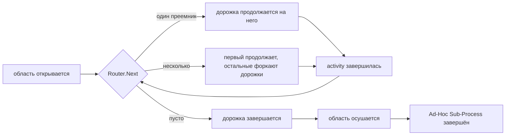

# ADR-035 — Ad-Hoc Sub-Process

| Поле | Значение |
|---|---|
| Статус | Принято |
| Версия | v.1 |
| Дата | 2026-07-30 |
| Владелец | Руслан Габитов |
| Уточняет | [ADR-023 v.3 Sub-Process and Call Activity](../ADR-023-sub-process-and-call-activity.md) |

> EN-оригинал — канонический: [ADR-035-adhoc-sub-process.md](../ADR-035-adhoc-sub-process.md). Этот файл — его перевод (twin).

> **Область решения.** Здесь решается, как gobpm исполняет **Ad-Hoc
> Sub-Process** (BPMN §13.3.5): что означают «доступна», «выбрана» и
> «завершён» для контейнера, содержимое которого *не* упорядочено потоками
> управления, кто решает, что выполнять дальше, и как человек остаётся в
> контуре, не подвешивая движок. Решение уточняет
> [ADR-023 v.3](../ADR-023-sub-process-and-call-activity.md) (встроенный
> Sub-Process как вложенная область токенов), переиспользует парковку узла
> ожидания из [ADR-020 v.1](../ADR-020-human-interaction-execution-model.md) и не
> затрагивает ни семантику потока данных
> ([ADR-011 v.7](../ADR-011-process-data-flow.md)), ни модель итераций
> ([ADR-025 v.2](../ADR-025-activity-iteration-loop-and-multi-instance.md)).

## 1. Контекст

### 1.1 Что требует стандарт

BPMN определяет Ad-Hoc Sub-Process как *контейнер activity со слабым порядком*,
чьё содержимое «выполняется многократно в порядке, ограниченном только явно
заданными потоками управления» (§13.3.5). Его операционная семантика по
вендорённому извлечению (`docs/bpmn-spec/semantics/sub-processes.md`, §13.3.5):

- В каждый момент **подмножество** внутренних activity является *доступным*
  (`enabled`); изначально — все activity **без входящих потоков управления**.
- Одна доступная activity «выбирается на исполнение — **обычно человеком
  (Human Performer), не обязательно реализацией**».
- `ordering` — `sequential`: следующую activity можно выбрать только после
  завершения предыдущей; `parallel`: следующую можно выбрать в любой момент,
  **допуская несколько параллельных экземпляров одной и той же внутренней
  activity**.
- После каждого внутреннего завершения вычисляется `completionCondition`.
  `false`: «набор доступных обновляется; возможны новые выборы». `true`:
  Ad-Hoc Sub-Process завершается — с отменой живых экземпляров при
  `cancelRemainingInstances = true`, иначе с ожиданием их завершения.
- Внутренние activity **не обязаны** иметь входящие или исходящие потоки;
  промежуточные события — обязаны иметь исходящие. Внутренняя activity, у
  которой *есть* исходящие потоки, при завершении порождает токены и снова
  становится доступной, когда её входящие потоки несут достаточно токенов.
- Реализуемый workflow-паттерн — **WCP-17 Interleaved Parallel Routing**.

Метамодель (`docs/bpmn-spec/elements/activities.md`, `AdHocSubProcess →
SubProcess → Activity`) добавляет три собственных свойства:
`completionCondition` (`Expression`, 0..1), `ordering` (`AdHocOrdering`, 0..1) и
`cancelRemainingInstances` (`Boolean`, 0..1, **по умолчанию `true`**).

### 1.2 Что стандарт сознательно оставляет открытым

Решение формируют три пробела, и каждый из них — **умолчание**, а не
предписание:

1. **Кто выбирает.** Спецификация явно отказывается помещать «выбирающего»
   внутрь реализации. Значит, движок обязан выставить выбор наружу как шов, а
   не закопать его в политику.
2. **Нет умолчания для `ordering`.** В отличие от `cancelRemainingInstances`,
   метамодель не объявляет значения по умолчанию. Что бы движок ни выбрал —
   это **инженерное решение**, которое нужно так и зарегистрировать.
3. **Нет правила завершения без `completionCondition`.** Атрибут
   необязательный (0..1), но все формулировки о завершении в §13.3.5
   сформулированы через него. У контейнера без условия нет конца, заданного
   спецификацией.

Обычный тай-брейк — равняться на лидера рынка BPMN — здесь недоступен:
**Camunda 7 вообще не реализует Ad-Hoc Sub-Process**, так что де-факто
поведения, на которое можно опереться, нет. Решения ниже опираются на текст
самого стандарта и на существующую модель исполнения gobpm.

### 1.3 Почему сейчас

Ad-Hoc Sub-Process — **последний нереализованный элемент** заявленной области
соответствия gobpm (Common Executable Subclass плюс расширение
ComplexGateway). Всё необходимое уже есть: вложенная область токенов с
завершением по осушению, форк дорожек, кооперативные парковки узлов ожидания,
шов выражений и поток фактов наблюдаемости.

## 2. Решение

### 2.1 Ad-Hoc Sub-Process — вариант Sub-Process на существующей вложенной области

Это вариант встроенного Sub-Process — та же **дочерняя область плюс дорожки
внутри того же экземпляра**, решённая в ADR-023 v.3, — и **не** дочерний
экземпляр. Две причины, обе структурные:

- **Видимость данных.** §10.5.7 даёт внутренним activity видимость данных
  объемлющего процесса. В gobpm это walk-up по цепочке областей, который
  существует только внутри дерева областей одного экземпляра. Дочерний
  экземпляр разорвал бы его и потребовал явного отображения входа/выхода — а
  это контракт Call Activity, другого элемента с другим назначением.
- **Изоляции больше ничто не требует.** Отличительное свойство Ad-Hoc — свобода
  порядка, а не независимость жизненного цикла. Заводить ради неё новый
  рантайм-контейнер значило бы изобретать колесо, которое движок уже крутит.

Следовательно, он наследует без изменений: открытие и утилизацию области,
граничные события на контейнере, модель прерывающей/непрерывающей отмены,
цепочку областей для Error, участие в журнале компенсаций и наблюдаемость.

### 2.2 Router отвечает «что дальше», заменяя преемственность по потокам

Внутри обычного контейнера преемники узла берутся из его **исходящих потоков
управления**. Внутри Ad-Hoc-контейнера — из предоставленного хостом
**Router**:

> **Router** — по текущему состоянию Ad-Hoc-области вернуть внутренние
> activity, которые могут выполняться дальше. **Пустой ответ завершает
> дорожку.**

У состояния, предлагаемого решению, две половины. **Половина прогресса** — то,
что по §13.3.5 нужно выбирающему: что завершено и сколько раз, что выполняется
сейчас и чьё завершение вызвало этот вызов. **Половина данных** — полноправная
часть контракта, а не довесок: **Router читает данные Ad-Hoc-области**, а через
обычный walk-up по цепочке областей — и данные объемлющего процесса.
Маршрутизация, не видящая данных самого случая, свелась бы к подсчёту activity
— а «сделать доступным *senior-review*, когда сумма претензии превышает порог»
— это обычная форма ad-hoc-решения, а не продвинутая.

Чтение обслуживается **транзитным кадром чтения, открытым на Ad-Hoc-области**,
— тем же механизмом, которым движок уже вычисляет условия циклов и выражения
условных событий. Выбор осознан по двум причинам: он даёт Router **согласованный
снимок** на всё решение вместо значений, которые могли бы поменяться под ним по
ходу вызова, и сохраняет совместимость чтения с дисциплиной единственного
писателя: сам Router вычисляется на loop экземпляра (§3), там же, где движок уже
вычисляет остальные свои условия. Router **читает**; он никогда не пишет.
Решению, которому нужно что-то записать, следует вернуть преемников, чьи
activity пишут, — тогда любая мутация по-прежнему идёт обычным путём
frame-commit и попадает в поток изменений.

Движок опрашивает Router ровно в те два момента, которые называет стандарт: при
открытии области (давая *изначально доступный* набор — «activity без входящих
потоков» из стандарта становится одним поставляемым Router, а не зашитым
правилом) и после завершения каждой внутренней activity («набор доступных
обновляется»).

Это **подстановка в одном шве**, а не параллельная модель исполнения: токен,
дорожка, правила форка и история — существующие движковые. Standard Loop уже
задал этот паттерн — он сам вычисляет преемников зацикленной activity вместо
чтения объявленных потоков.

### 2.3 Завершение унаследовано от осушения области, а не построено заново

Поскольку пустой ответ Router завершает дорожку, а область, все дорожки которой
завершились, осушается и завершает свою host-activity, **Ad-Hoc Sub-Process не
нужен собственный механизм завершения**. «Router сказал стоп» и «контейнер
завершился» — одно и то же событие, наблюдаемое на двух уровнях.

Именно это решение не даёт элементу выродиться. Контейнер, который просто делал
бы доступной каждую activity без потоков по одному разу и заканчивался, когда
все они выполнены, был бы встроенным Sub-Process с перетасованным порядком — вся
машинерия и ничего от ценности ad-hoc. Именно то, что подключаемой становится
сама преемственность, и даёт повторяемое, управляемое данными и человеком
исполнение, которое описывает §13.3.5.

### 2.4 `completionCondition` сохраняется как синтаксический сахар над Router

Соответствие не обсуждается: `completionCondition` — реальный атрибут
метамодели, а gobpm целится в Process Execution Conformance. Он **не**
становится вторым, конкурирующим механизмом. Он определяется как **декоратор
над Router**: вычислить выражение после каждого внутреннего завершения; если
истина — ответить пусто, иначе делегировать. Атрибут сохраняет своё стандартное
значение, а движок — единственное правило преемственности.

### 2.5 Порядок — `parallel` по умолчанию (зарегистрированный выбор движка)

При отсутствии умолчания в метамодели (§1.2) gobpm выбирает `ordering` по
умолчанию **`parallel`**: это менее ограничительный режим, именно его §13.3.5
описывает наиболее полно (включая конкурентные экземпляры одной activity), а
`sequential` тогда — явное сужение, на которое моделировщик соглашается сам.
Зарегистрировано в SAD-001 §14.1 как выбор движка, а не как требование
стандарта.

Оба режима ложатся на существующую механику, а не на новую:

- **`parallel`** — ответ Router из N преемников продолжает дорожку на первом и
  **форкает** остальные, ровно как расходящееся ветвление по потокам. Два
  ответа, называющие одну и ту же activity, дают два конкурентных экземпляра в
  разных дочерних областях, как позволяет §13.3.5 (и как уже делает
  параллельный Multi-Instance).
- **`sequential`** — живой может быть не более одной activity, поэтому Router,
  ответивший более чем одним преемником, — **громкая ошибка моделирования**, а
  не молчаливое усечение до первого.

### 2.6 Выбор: автоматический и человеческий, один механизм

Спецификация помещает выбирающего вне реализации, что в gobpm означает: Router —
это код хоста, а код хоста не должен блокировать движок. Router, ждущий
человека, подвесил бы экземпляр — ровно тот отказ, который ADR-020 v.1 убрал из
пользовательских задач. Поэтому:

- **Router решает, а не ждёт.** Он отвечает по состоянию, которым уже
  располагает, и возвращается быстро.
- **Автоматический режим** берёт ответ напрямую: преемники запускаются.
- **Ручной режим** трактует ответ с несколькими кандидатами как *предложение*:
  дорожка **паркуется как узел ожидания** — та же кооперативная парковка, что у
  User Task, с записанными кандидатами как набором доступных — и возобновляется
  на выбранной activity, когда выбор хоста приходит событием.

Человеческая задержка тем самым целиком живёт вне движка, где её и размещает
§13.3.5, а два режима отличаются лишь тем, паркуется ли дорожка между вопросом
и шагом, — а не наличием двух подсистем выбора.

Выбор адресуется через **ручку управления на область** (экземпляр может держать
несколько Ad-Hoc-областей, в том числе вложенных): она выставляет набор
доступных, выполняющиеся экземпляры и сам акт активации одного из них.

### 2.7 `cancelRemainingInstances` управляет живыми дорожками при срабатывании условия

Стандарт привязывает `cancelRemainingInstances` ровно к одному триггеру — к
истинности `completionCondition`:

> `true`: Ad-Hoc Sub-Process завершается. Если `cancelRemainingInstances=true`
> (по умолчанию): выполняющиеся экземпляры внутренних Activity **отменяются**.
> Если `cancelRemainingInstances=false`: Ad-Hoc Sub-Process ждёт завершения
> или терминации оставшихся экземпляров. (§13.3.5)

gobpm оставляет его там же. Когда условие срабатывает при живых внутренних
экземплярах, умолчание метамодели (`true`) отменяет их через существующий путь
прерывающей отмены; `false` даёт области дождаться их завершения или терминации
перед осушением. Умолчание стандарта сохранено.

Пустой ответ **Router** — другое событие, и отмены он не несёт. Он завершает
спросившую дорожку (§2.2), оставляя её соседей выполняться, а набор доступных —
пересчитываться при каждом их завершении («после каждого завершения внутренней
Activity … набор доступных обновляется»), и контейнер заканчивается, когда его
область осушается (§2.3). Смешивать эти два события нельзя: иначе мгновенно
опустевший набор доступных отменял бы работу, которую модель отменять не
просила, а Router стандартной формы (§2.9) отвечает пусто ровно тогда, когда
его форкнутые activity ещё в полёте.

### 2.8 Содержимое валидируется при регистрации и допускается в два шага

§13.3.5 разрешает Activity, потоки управления, шлюзы и промежуточные события
(плюс Data Object и Association) и **опускает Start и End события** — в
Ad-Hoc-контейнер не входят через стартовое событие и не осушают его через
конечное. Это умолчание принято как постоянный запрет.

Разрешённое множество затем допускается в два шага, потому что модель выбора
без потоков и модель потока токенов — разные механизмы:

- **Сначала: листовые Task и обычные встроенные Sub-Process.** Листовая задача
  выполняется и завершается; Sub-Process открывает собственную вложенную
  область через композитную машинерию, которую этот ADR и так наследует, — так
  что внутреннему Sub-Process не нужен новый путь исполнения, а **вложенный
  Ad-Hoc-контейнер работает по построению** (внешний Router видит его как одну
  выбираемую activity; внутренний крутит свой). Data Object и Data Association
  разрешены везде.
- **Затем: потоки управления, шлюзы и промежуточные события** — половина
  §13.3.5 про поток токенов. Их оправдывают две вещи, и ни одна из них без них
  невыразима. **Шлюзы** обретают смысл только когда внутренние activity несут
  потоки, и это ровно форма *частичной кристаллизации*: контейнер, в основном
  ad-hoc, но содержащий один формализованный островок с ветвлением.
  **Промежуточные ловящие события** — единственная **точка внешнего повторного
  входа** контейнера: Router опрашивается при открытии области и после
  завершения activity, поэтому он не может отреагировать на стимул, пришедший,
  пока область простаивает, — а это ровно то, что описывает «может срабатывать
  многократно, пока Ad-Hoc Sub-Process активен».

Отложены, а не отвергнуты, каждый со своей причиной: **Event Sub-Process**
(обработчик, вооружённый на область, а не выбираемая activity — его
взаимодействие с завершением по Router нужно решать), вариант **Transaction**
(abort по Cancel внутри контейнера, ведомого Router, — отдельный вопрос) и
**Call Activity** (препятствий нет, просто вне первой области работ).

Ad-Hoc-контейнер, объявленный **без Router**, отвергается там же, где строится,
а не оставляется падать позже — честный отказ вместо тихой деградации во
встроенный Sub-Process. gobpm уже так отвергает неисполнимые модели (условное
стартовое событие верхнего уровня).

### 2.9 Батарейки поставляются, но **никакой Router не подразумевается**

Следуя batteries-included-позиции движка, решение включает готовые Router'ы,
чтобы типовые формы не требовали кода хоста: **стандартный/BPMN-формы** (все
activity без потоков, каждая по разу — форма соответствия), **выражением**
(`FormalExpression`, называющее преемников, вычисляемое через шов
языково-маршрутизируемых выражений
[ADR-032 v.1](../ADR-032-language-routed-expression-engines.md)) и **фиксированной
последовательностью** — кристаллизованное конечное состояние, когда
ad-hoc-контейнер затвердел в детерминированный порядок.

Каждый из них **явный**. Никакой Router не применяется по умолчанию, и, в
частности, маршрутизация **никогда** не выводится из порядка, в котором
элементы добавлялись в контейнер. Три причины:

1. **Порядок объявления не виден на диаграмме.** Два Ad-Hoc-контейнера,
   рисующиеся одинаково — те же activity, никаких потоков, — исполнялись бы
   по-разному в зависимости от порядка вызовов конструирования. Непрозрачное
   для диаграммы поведение — постоянный анти-goal движка (по этой же причине
   отвергнуты неявные шлюзы и слияния).
2. **Умолчание превращает упущение моделирования в правдоподобно выглядящий
   прогон.** Без умолчания контейнер без Router отвергается при построении, и
   моделировщик узнаёт об этом сразу; с умолчанием та же ошибка даёт процесс,
   выполняющийся в молчаливо произвольном порядке, — класс «случайной тишины»,
   который политика наблюдаемости движка считает худшим отказом.
3. **«Каждая по разу по порядку» — это деградировавшая форма.** Router,
   обходящий каждый узел один раз и останавливающийся, — обычный
   последовательный Sub-Process; сделать его умолчанием значило бы выдать
   слабейшее поведение элемента за его нормальное.

Эргономический довод, ради которого вводили бы умолчание, закрывается
названием батарейки — один вызов, и поведение становится заявленным свойством
модели, а не артефактом порядка конструирования.

### 2.10 Не-цели

- **Router, который блокируется или ждёт** (§2.6) — ожидание выражается
  парковкой.
- **Подразумеваемый или выводимый Router** (§2.9) — включая маршрутизацию по
  порядку объявления элементов.
- **Router, пишущий в область данных** (§2.2) — маршрутизация наблюдает,
  мутируют выбранные ею activity.
- **Ad-Hoc-контейнер как дочерний экземпляр** (§2.1).
- **Start и End события внутри контейнера** (§2.8) — список содержимого в
  стандарте их опускает.
- **`startQuantity`/`completionQuantity` ≠ 1** — уже зарегистрированная не-цель
  движка; правило потока токенов §13.3.5 соблюдается при quantity = 1.
- **Переупорядочивание или переписывание контейнера во время выполнения**
  (добавление activity в живую Ad-Hoc-область). Идея «кристаллизации» —
  созревание ad-hoc-контейнера в формализованный поток — обслуживается
  *авторингом* более узкого Router или обычных потоков управления, а не
  мутацией работающего экземпляра.

## 3. Последствия

**Положительные.**

- Элемент ложится на существующую машинерию: вложенная область, форк дорожек,
  парковка узла ожидания, завершение по осушению, отмена, наблюдаемость. Новая
  поверхность — один интерфейс и одна ручка управления.
- Завершение, выбор и изначальная доступность перестают быть тремя механизмами
  и становятся одним вопросом, задаваемым многократно.
- Человек по построению остаётся вне движка, что удовлетворяет §13.3.5 без
  единого блокирующего вызова.
- Соответствие сохранено (`completionCondition`, `cancelRemainingInstances`,
  оба режима `ordering`, конкурентные экземпляры одной activity), при том что
  общий механизм сильнее атрибута, который он вбирает.
- Он замыкает заявленную область BPMN-соответствия gobpm.

**Отрицательные / принятые.**

- Router, предоставленный хостом, — код, примыкающий к движку, и он
  вычисляется **на** loop единственного писателя, как и прочие условия движка,
  поэтому медленный Router деградирует не только собственную область, но и
  каждую дорожку экземпляра, а вызывающий обратно в свой экземпляр —
  дедлочится. Это регулируется контрактом, а не машинерией (§2.6: Router
  решает, а не ждёт) — та же сделка, которую движок уже заключил с выражениями
  условных событий и шлюзов.
- Шов преемственности получает вторую реализацию (потоки *или* Router).
  Принято сознательно: одна общая реализация «продолжить-и-форкнуть» с двумя
  источниками преемников, а не две копии правил форка.
- Router мощнее `completionCondition`, поэтому две модели могут выразить одно
  и то же поведение по-разному. Сахар существует именно для того, чтобы
  модель формы соответствия оставалась идиоматичной.

## 4. Рассмотренные альтернативы

1. **`completionCondition` как основной механизм плюс отдельный учёт набора
   доступных.** Буквальное прочтение §13.3.5. Отвергнуто: требует трёх
   взаимодействующих механизмов (изначальная доступность, правило обновления,
   тест завершения) для выражения одного вопроса, а его естественное умолчание —
   сделать доступными activity без потоков, выполнить каждую по разу,
   закончить — это встроенный Sub-Process с перетасованным порядком. Элемент
   заслуживает большего, чем деградировавший двойник того, что уже есть.
2. **Дочерний экземпляр на Ad-Hoc-контейнер.** Отвергнуто в §2.1: разрывает
   видимость данных §10.5.7 и дублирует Call Activity.
3. **Внутридвижковая стратегия выбора (перечисление политик).** Отвергнуто:
   стандарт явно помещает выбирающего вне реализации; закрытый набор политик не
   способен выразить реальные правила выбора хоста, а каждое новое правило
   становилось бы изменением движка.
4. **Блокирующий Router, ждущий человеческого выбора.** Отвергнуто: подвешивает
   loop единственного писателя — режим отказа, который ADR-020 v.1 уже устранил
   для User Task.
5. **Синтез потоков управления под ответы Router**, чтобы дословно
   переиспользовать существующий код преемственности. Отвергнуто: фантомные
   потоки, не существующие ни в одной модели, протекли бы в историю токенов,
   учёт прибытий на шлюзах и поток наблюдаемости — ложь всем потребителям этих
   записей ради экономии одного рефакторинга.
6. **Router по умолчанию, выведенный из порядка объявления элементов**, чтобы
   любой Ad-Hoc-контейнер работал без конфигурации. Отвергнуто по трём
   основаниям §2.9 — порядок не виден на диаграмме, умолчание превращает
   упущение моделирования в правдоподобно выглядящий прогон, а «каждая по разу
   по порядку» — деградировавшая форма элемента. Эргономика возвращается явным
   называнием батарейки.

## 5. Рекомендации по enterprise-готовности

- **Наблюдаемость.** Жизненный цикл Ad-Hoc заслуживает собственного вида
  фактов — область открыта, кандидаты предложены, activity активирована (с
  актором, если выбирал человек), activity завершилась, область остановлена (с
  причиной: пустой Router, условие завершения или отмена), — чтобы оператор мог
  восстановить, *почему* ad-hoc-случай пошёл именно так. Эта реконструкция и
  есть аудиторская история работы, управляемой человеком, и главная причина
  держать набор доступных наблюдаемым, а не внутренним.
- **Авторизация.** Активация — обращённый к человеку акт, как взятие задачи;
  она должна проходить через шов авторизации движка, чтобы «кто что вправе
  активировать» было отвечаемым при аудите.
- **Дисциплина Router.** Контракт Router следует документировать как
  *только-чтение, чистый и быстрый* — без I/O, без ожидания, без записей,
  детерминированный на своих входах. Хосту, которому нужно удалённое решение,
  следует предзагрузить его в данные области (из activity, выполнившейся
  раньше) и дать Router прочитать его там; это сохраняет решение
  воспроизводимым по записанным данным — а именно это и делает ad-hoc-случай
  аудируемым постфактум. Контракт здесь несущий, а не рекомендательный: ответ
  маршрутизации — это решение, поэтому движок вычисляет его там же, где и
  прочие свои условия, — внутри, на собственном loop исполнения экземпляра.
  Значит, блокирующий Router подвешивает каждую дорожку своего экземпляра, а
  вызывающий обратно в свой экземпляр — дедлочится о канал, который должен был
  бы его обслужить. Ни от того, ни от другого не защищает машинерия; и то и
  другое исключается контрактом — потому он и должен быть в документации
  элемента, а не только здесь.
- **Операционные рекомендации.** Ad-Hoc-область, управляемая человеком, может
  оставаться открытой неограниченно долго; операторам стоит видеть
  долгоживущие открытые области, а моделировщиков стоит поощрять ставить рядом
  граничное таймерное событие, когда есть бизнес-срок.

## 6. Открытые вопросы

Нет.

## 7. Ссылки

- BPMN 2.0 §13.3.5 (Ad-Hoc Sub-Process), §10.5.7 (видимость данных),
  вендорённое извлечение: `docs/bpmn-spec/semantics/sub-processes.md`,
  `docs/bpmn-spec/elements/activities.md`.
- [ADR-023 v.3](../ADR-023-sub-process-and-call-activity.md) — вложенная область
  токенов и её осушение (уточняется здесь).
- [ADR-020 v.1](../ADR-020-human-interaction-execution-model.md) — кооперативная
  парковка узла ожидания, переиспользуемая ручным выбором.
- [ADR-025 v.2](../ADR-025-activity-iteration-loop-and-multi-instance.md) — модель
  итераций (не затрагивается).
- [ADR-032 v.1](../ADR-032-language-routed-expression-engines.md) — шов вычисления
  выражений, используемый батарейкой Expression.
- [ADR-013 v.2](../ADR-013-instance-observability.md) — поток фактов, куда
  добавляется вид Ad-Hoc.

## История документа

| Версия | Дата | Автор | Изменения |
|---|---|---|---|
| v.1 | 2026-07-30 | Руслан Габитов | Первоначальное решение. Содержимое допускается в два шага — сначала листовые Task и обычные встроенные Sub-Process (внутренний Sub-Process переиспользует композитную парковку, поэтому **вложенный Ad-Hoc-контейнер работает по построению**), затем потоки управления, шлюзы и промежуточные ловящие события, несущие два случая, невыразимых в модели без потоков: **частичную кристаллизацию** (формализованный островок с ветвлением внутри ad-hoc-контейнера) и **внешний повторный вход** (Router опрашивается только при открытии и при завершении, поэтому не может отреагировать, пока область простаивает). Start и End события отвергнуты полностью — список содержимого в стандарте их опускает; Event Sub-Process, Transaction и Call Activity отложены с указанием причин. Router'ы **всегда явные — никаких умолчаний и никакого вывода из порядка объявления элементов** (не виден на диаграмме, превращает упущение моделирования в правдоподобно выглядящий прогон, а «каждая по разу по порядку» — деградировавшая форма). Ad-Hoc Sub-Process — **вариант Sub-Process на существующей вложенной области** (не дочерний экземпляр: тот разорвал бы видимость данных §10.5.7 и продублировал бы Call Activity). Его отличительный механизм — **Router**: предоставленный хостом ответ на вопрос «что дальше», **заменяющий преемственность по потокам управления** внутри контейнера, опрашиваемый при открытии области и после завершения каждой внутренней activity; **пустой ответ завершает дорожку**, поэтому завершение **унаследовано от осушения области**, а не построено заново. Router решает по **состоянию прогресса и данным Ad-Hoc-области** (читаемым через транзитный кадр на этой области — согласованный снимок, совместимый с дисциплиной единственного писателя, с видимостью родительских данных через walk-up); он читает и никогда не пишет. `completionCondition` сохранён как **сахар над Router** ради соответствия; `cancelRemainingInstances` сохраняет умолчание метамодели `true` и привязан к срабатыванию условия завершения — единственному триггеру, к которому его привязывает стандарт. `ordering` по умолчанию **`parallel`** — зарегистрированный выбор движка, поскольку метамодель умолчания не объявляет, а Camunda 7 элемент не реализует, — при этом `sequential` громко отвергает ответ с несколькими преемниками. Человеческий выбор едет на **существующей парковке узла ожидания**: автоматический режим берёт ответ Router, ручной паркуется с предложенными кандидатами и возобновляется по активации хостом через **ручку управления на область**; сам Router никогда не блокируется. Содержимое валидируется при регистрации, а контейнер, построенный без Router, **отвергается сразу** — неисполнимый контейнер до движка не доходит. Батарейки: Router'ы стандартной формы, по выражению и с фиксированной последовательностью. Не-цели: блокирующие Router'ы, контейнеры-дочерние-экземпляры, quantity ≠ 1, мутация живого контейнера во время выполнения. |
