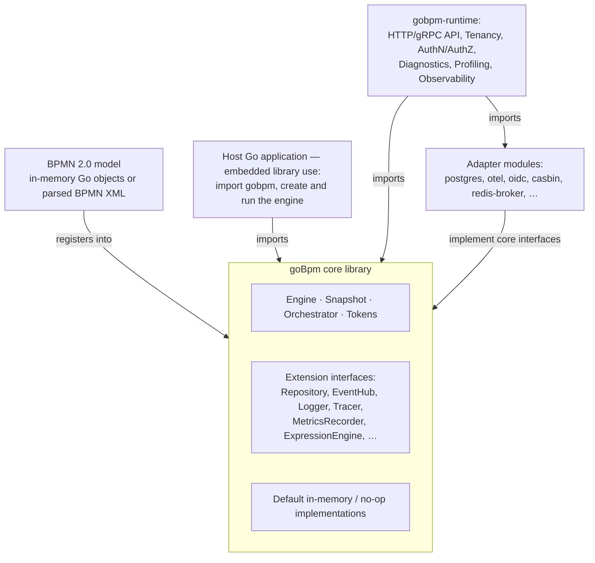

# SAD-001 — goBpm: видение и архитектура

| Поле | Значение |
|---|---|
| Статус | Draft |
| Версия | v.1.3 |
| Дата | 2026-08-28 |
| Владелец | Руслан Габитов |
| Вытесняет | — |
| Область соответствия | [docs/bpmn-spec/conformance.md](../../bpmn-spec/conformance.md) |

> EN-оригинал — канонический: [SAD-001-vision-and-architecture.md](../SAD-001-vision-and-architecture.md). Этот файл — его перевод (twin). При расхождении приоритет у английского текста.
>
> Оригинал находится в статусе **Draft**: он ещё меняется, и этот перевод придётся пересинхронизировать, когда SAD будет принят.

## 1. Назначение

Этот документ — верхнеуровневое архитектурное определение **goBpm**. Он
устанавливает видение, область охвата, границы системы, принципы, раскладку
модулей и ссылки на подчинённые ADR, кристаллизующие конкретные решения. Каждый
ADR в проекте ссылается вверх на этот SAD; этот SAD — единая связная картина
«что мы строим и почему».

Это **не** план реализации. Специфика реализации (требования по фичам, шаги
миграции, топология развёртывания) живёт в SRD и FIX, ссылающихся на этот
документ.

### 1.1 Классы документов, используемые в проекте

| Класс | Назначение | Жизненный цикл |
|---|---|---|
| **SAD** | Верхнеуровневая архитектура; видение + границы системы + принципы | Уровень концепции. Версионируется. Эволюционирует по мере созревания архитектуры. |
| **ADR** | Architecture Decision Record — одно конкретное решение (модель исполнения, раскладка модулей, …) | Уровень концепции. Версионируется. Каждая версия — текущий контракт этого решения. |
| **SRD** | Software Requirements Document — что обязано поставить конкретное приземление | Уровень реализации. Один документ на приземление. Не правится задним числом после приземления — это исторический снимок намерения. |
| **FIX** | Документ дизайна исправления — корневая причина + решение для приземления багфикса | Уровень реализации. Один документ на приземление фикса. Та же одноразовая дисциплина, что у SRD. |

SAD и ADR — правильные места для того содержимого, которое несёт этот документ.
SRD и FIX будут сопровождать конкретные приземления реализации и ссылаться назад
на те SAD/ADR, которые они реализуют.

## 2. Видение

> **goBpm — это нативный Go-движок BPMN 2.0, спроектированный, чтобы встраиваться
> прямо в Go-приложения как минимальная, надёжная библиотека — и масштабироваться
> до самостоятельного сервера процессов через аддитивные runtime-компоненты, не
> вынуждая пользователей тащить зависимости, которые им не нужны.**

Два различных пользовательских пути являются first-class:

1. **Использование как встраиваемой библиотеки.** Go-разработчик импортирует
   `github.com/dr-dobermann/gobpm`, конструирует движок через `thresher.New(id)`
   (ноль опций применяет все умолчания), регистрирует процесс, запускает его.
   Никаких внешних сервисов не требуется. Движок живёт в том же процессе, что и
   host-приложение.

2. **Использование как самостоятельного рантайма.** Оператор разворачивает бинарь
   `gobpm-server`, который выставляет движок по HTTP/gRPC, персистит состояние в
   настоящую базу, интегрируется с поставщиком идентичности организации и выдаёт
   трассы OpenTelemetry и метрики Prometheus. Рантайм построен на библиотеке — он
   не форк и не параллельная реализация.

Оба пути ОБЯЗАНЫ работать с высоким качеством. Библиотека НЕ ДОЛЖНА нести
runtime-балласт; рантайм НЕ ДОЛЖЕН переизобретать движок.

## 3. Цели

| # | Цель | Обоснование |
|---|---|---|
| G1 | **BPMN 2.0 Process Execution Conformance + расширение ComplexGateway** | Соответствие стандарту — причина существования продукта. См. [docs/bpmn-spec/conformance.md](../../bpmn-spec/conformance.md). |
| G2 | **Минимальная основная библиотека: ноль не-stdlib runtime-зависимостей на горячем пути движка** | Встраиваемость требует не навязывать транзитивные зависимости host-приложениям. |
| G3 | **Пригодность из коробки** | Ноль-опционный `thresher.New(id)` даёт работающий движок без обвязки (умолчания и есть умолчание). Новый пользователь получает работающий пример менее чем в 20 строк. |
| G4 | **Расширяемость на каждой инфраструктурной заботе** | Персистентность, события, безопасность, наблюдаемость, выражения, распределение человеческих задач, таймеры, бэкенды корреляции сообщений — всё за интерфейсами. |
| G5 | **Предсказуемая модель исполнения** | Одна горутина событийного цикла на экземпляр процесса владеет состоянием; каждый трек (нить исполнения) выполняется в собственной горутине; токен — проекция позиции трека; `context.Context` — контракт отмены. |
| G6 | **Продуктовый рантайм как аддитивная надстройка** | Мультиарендность, AuthN/Z, диагностика, профилирование, HTTP/gRPC API живут в отдельном модуле. Пользователи библиотеки не платят за них. |
| G7 | **Сопровождаемость соло-разработчиком** | Код организован под инкрементальную разработку. Многомодульный монорепозиторий вместо разделения на репозитории. Понятные вертикальные срезы вместо горизонтальных слоёв. |
| G8 | **Наблюдаемый by design, а не случайно** | Каждый переход состояния выдаёт структурированные события; наблюдаемость по умолчанию — no-op; продуктовая — подключаемая. |

## 4. Не-цели

| # | Не-цель | Причина |
|---|---|---|
| N1 | BPMN-моделлер / редактор диаграмм | Вне области проекта. Пользователи авторят BPMN внешне (Camunda Modeler, bpmn.io). |
| N2 | DMN-движок (таблицы решений) | Отдельный стандарт. Может интегрироваться через `BusinessRuleTask`, вызывающую внешний DMN-движок. |
| N3 | Исполнение хореографий | Отдельный подкласс соответствия; исключено согласно [docs/bpmn-spec/conformance.md](../../bpmn-spec/conformance.md). |
| N4 | Исполнение метамодели Collaboration | `Pool`, `Participant`, `MessageFlow` на уровне Collaboration вне execution conformance. Межпроцессный обмен сообщениями покрыт событиями Message. |
| N5 | Diagram Interchange (DI/DC) | Метамодель визуальной разметки. Не часть execution conformance. |
| N6 | Отображение в BPEL | Отдельный подкласс соответствия; не преследуется. |
| N7 | Парсер BPMN XML как забота основной библиотеки | Парсер будет существовать (обязан, ради внедрения), но это отдельная забота, конструирующая модель в памяти, которую потребляет движок. Основная библиотека принимает уже построенные модели. **Приземлено** ([ADR-024 v.2](../ADR-024-process-interchange-converters.md), [SRD-051 v.2](../../srd/SRD-051-bpmn-converter.md)) как пакет `pkg/convert/bpmn` за швом `pkg/convert`, двунаправленно (импорт **и** экспорт). Это пакет, а не модуль `doc-source/`, который §9 изначально резервировал: парсер — это stdlib `encoding/xml`, поэтому он не стоит ядру никакой зависимости, а инвариант, который защищает N7 — движок никогда не импортирует конвертер, — держится направлением импорта. Движок по-прежнему принимает только уже построенные модели; host делает blank import нужного формата и сам регистрирует результат. |
| N8 | `startQuantity` / `completionQuantity` ≠ 1 (атрибуты количества токенов у Activity) | **Намеренный выбор движка, а не пробел.** Эти атрибуты `Activity` (по умолчанию 1) работают как *неявный* параллельный шлюз (`completionQuantity` > 1 выдаёт N токенов на каждый исходящий поток) или *неявное* AND-соединение (`startQuantity` > 1 ждёт N токенов) — **без нотации на диаграмме**. Размножение/соединение токенов невидимо на холсте, что делает поведение процесса непрозрачным, — ровно поэтому они и не рекомендуются. Camunda 7/8 (цель выравнивания) их не поддерживает (оба трактуются как 1). gobpm сохраняет поведение по умолчанию 1; моделировщик, желающий параллельного веера или соединения, использует **явный параллельный шлюз** — видимый и уже поддержанный. Модель по-прежнему несёт атрибуты (`WithStartQuantity` / `WithCompletionQuantity`) ради точности round-trip XML; рантайм соблюдает только умолчание 1. |

> **Заметка о распределении / кластеризации.** Распределение НЕ является
> не-целью — см. §13 «Распределение и масштаб». Удалённое исполнение на уровне
> задач (ServiceTask / GlobalTask на внешних воркерах через принадлежащую движку
> очередь заданий fetch-and-lock, ADR-021) и распределение на уровне экземпляров
> (sticky-маршрутизация по id экземпляра с failover через персистентность)
> находятся внутри архитектурного конверта как аддитивные надстройки над
> однопроцессным фундаментом. Разделяемое состояние на весь кластер (межузловая
> корреляция, вещание сигналов, общие переменные) — открытый вопрос, решаемый
> через `Repository` на базе БД + вещание событий; браться за него, когда
> материализуется конкретный спрос.

## 5. Стейкхолдеры и сценарии использования

| Стейкхолдер | Основной сценарий | Критические нужды |
|---|---|---|
| **Пользователь встраиваемой библиотеки** (разработчик Go-приложения) | Встроить BPMN-движок в Go-приложение, у которого уже есть свои HTTP, персистентность, наблюдаемость | Минимум зависимостей; чистый API; работает без внешних сервисов в тестах; разумные умолчания |
| **Оператор рантайма** | Развернуть `gobpm-server` как самостоятельный BPMN-сервис для организации | Продуктовая персистентность, мультиарендность, AuthN/Z, наблюдаемость, диагностика, готовность к HA |
| **Разработчик расширений** | Написать свой адаптер Repository / Authorization / Tracer / Expression | Небольшие, стабильные, хорошо документированные интерфейсы; контракты соответствия на каждый |
| **BPMN-моделировщик** | Авторить BPMN 2.0 XML для исполнения goBpm | Строгое соответствие спецификации; внятная обратная связь о неподдерживаемых элементах; предсказуемая семантика рантайма |
| **Владелец процесса / бизнес-пользователь** | Наблюдать, диагностировать, вмешиваться в работающие экземпляры | Диагностический API; история; инспекция состояния экземпляра; ручное вмешательство (передвинуть токен, повторить, терминировать) |

## 6. Атрибуты качества

Уровни приоритета: **P0** — обязательно для v.1.0; **P1** — требуется до
публичного релиза; **P2** — желательно, отслеживается.

| Атрибут | Приоритет | Тактика |
|---|---|---|
| Соответствие BPMN | P0 | Набор тестов соответствия (фикстуры MIWG + внутренние проектные); KB в [docs/bpmn-spec/](../../bpmn-spec/index.md) как нормативная ссылка; каждый реализованный элемент сверяется с KB |
| Надёжность | P0 | Архитектура без утечек горутин; каскад отмены `context.Context`; никакого токена, порождённого для состояний долгого ожидания (модель регидратации); детекция дедлоков для ComplexGateway |
| Минимум зависимостей ядра | P0 | `core` go.mod ограничен stdlib + `github.com/google/uuid` (уже используется). Все прочие зависимости живут в модулях адаптеров или рантайма. |
| Пригодность из коробки | P0 | Ноль-опционный конструктор `thresher.New(id)` (применяет все умолчания) + работающий пример менее чем в 20 строк |
| Расширяемость | P1 | Функциональная опция на расширение: `Repository`, `ExpressionEngine`, `WorkerDispatcher`, `MessageBroker`, `Clock`, `Logger`, `Tracer`, `MetricsRecorder`, `AuthorizationProvider` (интерфейс человеческой маршрутизации `TaskDistributor` отложен в выделенный ADR о человеческом взаимодействии) |
| Тестируемость | P1 | Все интерфейсы расширений мокируемы (mockery); тесты исполнения не требуют внешних сервисов; внедрение детерминированных часов |
| Наблюдаемость | P1 | Каждый переход состояния (по жизненному циклу BPMN) выдаёт типизированное событие. **Политика по умолчанию: видимо по умолчанию, заглушаемо по opt-out.** `Logger` по умолчанию `slog.Default()`, чтобы продуктовые развёртывания случайно не теряли телеметрию. `Tracer` и `MetricsRecorder` по умолчанию no-op только потому, что у Go stdlib нет для них разумного умолчания (адаптер OpenTelemetry поставляется отдельно). Кто хочет меньше шума, отписывается явно, передав отбрасывающий логгер (`thresher.WithLogger(...)`). |
| Документация | P1 | Этот SAD + ADR + KB bpmn-spec + поэлементный справочник + примеры + руководство оператора рантайма |
| Безопасность | P2 | Точки подключения authz в ядре (чувствительные операции определены); модель провайдера AuthN; никакого встроенного движка политик (делегируется рантайму / адаптеру) |
| Производительность | P2 | Горутина на токен даёт естественный параллелизм; бенчмарки отслеживают поэлементную задержку; никакой ранней оптимизации сверх избегания очевидных стоков (никаких аллокаций map на горячих путях). **Выбор движка об ограниченной рефлексии (ADR-011 v.6 §2.9.5):** рефлексия времени выполнения запрещена на путях исполнения — она может выполняться **один раз на тип, при регистрации адаптера** (`pkg/model/data/adapters`, единственное разрешённое место), вне пути исполнения, и больше нигде; работа на доступ — кешированный индексный аксессор. Генератор адаптеров через codegen — свободное от рефлексии обновление на том же шве. |
| Дистрибуция | P2 | Docker-образ быстрого старта пакует рантайм с разумными умолчаниями; единый статический бинарь для встраиваемого использования `gobpm-server` |

## 7. Системный контекст



Направление зависимостей **всегда снаружи внутрь**: рантайм импортирует ядро;
адаптеры поставляют реализации интерфейсов ядра; host-приложения импортируют ядро
напрямую. Ядро не зависит ни от чего вне собственного модуля.

## 8. Обзор архитектуры

### 8.1 Модель слоёв (внутри `core`)

Слои упорядочены **сверху (высший) → вниз (низший)**:

| Слой | Пакет(ы) | Содержимое |
|---|---|---|
| **Публичный API** | `pkg/` | `thresher.Thresher`, `thresher.New(...)`, `pkg/model/*` (конструкторы элементов BPMN), интерфейсы расширений |
| **Жизненный цикл экземпляра** | `internal/instance/`, `internal/runner/`, `internal/exec/` | Оркестратор + токен |
| **Обработка событий** | `internal/eventproc/` | EventHub, ожидатели |
| **Область (scope)** | `internal/scope/` | иерархические данные |
| **Snapshot** | `internal/instance/snapshot/` | неизменяемые определения процессов, вход исполнения |
| **Модель** | `pkg/model/` | типы элементов BPMN (Activity, Event, Gateway, Flow, Data, …) |

Зависимости идут **только вниз**. Высшие слои зависят от низших; низшие ничего не
знают о высших.

### 8.2 Ключевые обязанности

| Компонент | Обязанность |
|---|---|
| **Движок (`thresher`)** | Фасад верхнего уровня. Держит реализации расширений. Управляет реестром процессов и жизненным циклом экземпляров. Имя `thresher` (нынешний `pkg/thresher`) сохраняется — это идентичность проекта для «движка BPM». |
| **Snapshot** | Неизменяемое, валидированное представление определения процесса. Движок принимает Snapshot, а не изменяемую модель. |
| **Оркестратор** | Одна горутина на экземпляр процесса. Владеет состоянием экземпляра. Получает `TokenEvent` от токенов, применяет переходы состояний, порождает новые токены, персистит чекпоинты. |
| **Токен** | Одна горутина на активный токен. Выполняет элемент под токеном (задача, вычисление шлюза, ожидание события). Общается с оркестратором через канал. |
| **EventHub** | Внутреннее распределение событий. Маршрутизирует триггеры Message / Signal / Timer / Conditional подписанным ожидателям между экземплярами. |
| **Scope** | Иерархический контекст данных. Разрешает видимость DataObject, областность Property, область корреляционных ключей. |
| **Repository** (интерфейс) | Персистит состояние экземпляра процесса, историю, входящие сообщения. Умолчание: в памяти. |
| **Все прочие интерфейсы расширений** | Позволяют внедрить `Logger`, `Tracer`, `MetricsRecorder`, `ExpressionEngine`, `WorkerDispatcher`, `MessageBroker`, `Clock`, `AuthorizationProvider`. |

Детальная семантика исполнения: **ADR-001 «Модель исполнения»**. Детальная модель
расширений: **ADR-002 «Архитектура расширений»**.

## 9. Раскладка модулей

Многомодульный монорепозиторий. Каждый перечисленный подкаталог со своим `go.mod`
версионируется независимо и изолирует своё дерево зависимостей от братских
модулей.

```
github.com/dr-dobermann/gobpm/                           ← корень репозитория
├── go.mod                                                ← основная библиотека (текущее состояние)
├── cmd/                                                  ← тонкие точки входа CLI (сейчас)
├── pkg/                                                  ← публичный API ядра (сейчас)
│   ├── model/                                            ← типы элементов BPMN
│   ├── thresher/                                         ← фасад движка (имя `thresher` сохраняется)
│   ├── errs/, set/                                       ← утилиты
│   └── (в будущем: интерфейсы расширений — repository, observer, …)
├── internal/                                             ← внутренности ядра (сейчас)
│   ├── instance/, runner/, exec/, eventproc/,
│   │   scope/, interactor/, renv/
├── examples/                                             ← уже многомодульно
│   ├── basic-process/   (свой go.mod)
│   ├── simple-timer/    (свой go.mod)
│   └── timer-event/     (свой go.mod)
├── runtime/                                              ← В БУДУЩЕМ — gobpm-server (свой go.mod)
│   ├── server/            HTTP / gRPC API
│   ├── tenancy/           проброс мультиарендного контекста
│   ├── auth/              обвязка AuthN + AuthZ
│   ├── obs/               обвязка наблюдаемости
│   ├── diag/              диагностические эндпоинты
│   └── cmd/gobpm-server/  запускаемый бинарь
├── adapters/                                             ← В БУДУЩЕМ — у каждого свой go.mod
│   ├── postgres/          реализация Repository
│   ├── otel/              Tracer + MetricsRecorder через OpenTelemetry
│   ├── oidc/              провайдер AuthN
│   ├── casbin/            движок политик AuthZ
│   └── redis-broker/      реализация MessageBroker
└── docs/                                                 ← общая документация
    ├── design/            ← этот каталог
    ├── adr/, srd/
    ├── analytics/
    └── bpmn-spec/         ← нормативная справочная KB по BPMN 2.0
```

### 9.1 Правила направления импорта

- **`core` (корневой модуль)** зависит только от Go stdlib +
  `github.com/google/uuid`. Больше ни от чего. Никаких импортов из `runtime/`,
  `adapters/`, `examples/`.
- **`runtime/`** импортирует `core` и выбранные оператором `adapters/*`. Никаких
  импортов из `examples/`.
- **`adapters/*`** каждый импортирует `core` (чтобы удовлетворить его интерфейсы)
  и релевантный сторонний SDK (например, `lib/pq` для адаптера postgres). Никаких
  импортов между адаптерами.
- **`examples/*`** каждый импортирует `core` напрямую. Они демонстрируют
  использование библиотеки; они НЕ зависят от `runtime/`.

### 9.2 Эволюция — каркас заранее

Сегодня: как модули существуют только `core` и `examples/`.

**Поставить каркас всех целевых модулей заранее**, даже если поначалу они пустые
заглушки. Обоснование: установить дисциплину направления импорта (§9.1) в первый
день гораздо дешевле, чем дооснащать её потом. Пустой `runtime/go.mod` + один
`doc.go` документируют намерение и резервируют границу; первый настоящий код
приземляется без реструктуризации.

Конкретно первый проход устанавливает:

- `runtime/` с `go.mod` + `doc.go` + `cmd/gobpm-server/main.go` (заглушка: печатает
  «not yet implemented»)
- каталог `adapters/` хотя бы с одним модулем-заглушкой (например,
  `adapters/memory/` для дефолтного in-memory Repository, вынесенного из
  референсной реализации ядра)
- уборку устаревших или неуместных файлов в `docs/` (черновики excalidraw,
  протухший индекс README и т.п. — отсортировать до принятия этого SAD)
- правила направления импорта (§9.1), обеспеченные в CI с первого дня (`go vet` +
  таргет `make lint-modules`, падающий на запрещённых рёбрах импорта)

Последующие модули (`adapters/postgres/`, `adapters/otel/`, …) добавляются, когда
материализуется их первый конкретный потребитель, — но всегда в уже
установленную структуру, никогда через реорганизацию.

### 9.3 Опция на будущее: разделение на отдельные репозитории

Если монорепозиторий станет неповоротливым (маловероятно при соло-разработке,
возможно при масштабе), многомодульная структура делает разделение операцией
переноса каталога:
- `runtime/` → `github.com/dr-dobermann/gobpm-runtime`
- `adapters/postgres/` → `github.com/dr-dobermann/gobpm-postgres`
- и т.д.

Детальное решение о раскладке модулей и правилах импорта: **ADR-003 «Раскладка
модулей»**.

## 10. Модель исполнения (обзор)

Детально в **ADR-001 v.3 «Модель исполнения»** (Принято). Ключевые пункты
зафиксированы здесь ради связности на уровне видения:

- **Одна горутина событийного цикла на экземпляр процесса.** Владеет состоянием
  экземпляра. Однопоточная мутация — никаких блокировок на состоянии экземпляра.
- **Одна горутина трека на нить исполнения.** `track` несёт свою текущую позицию в
  потоке и выполняет элемент там, отчитываясь через типизированный канал событий.
  **Токен** является *проекцией* текущего шага трека (управляющей позиции BPMN), а
  не сохранённым объектом и не собственной горутиной.
- **`context.Context` — контракт отмены.** Экземпляр владеет корневым контекстом.
  Каждый трек получает производный контекст. Terminate End Event → отменить
  корневой контекст → все треки видят `ctx.Done()` → корректный выход.
- **Сохранение/восстановление контекста экземпляра — способность уровня P0.**
  Движок ОБЯЗАН уметь чекпоинтить полный контекст исполнения экземпляра процесса в
  `Repository` и позже воссоздавать его — либо в тот же runtime-процесс (после
  рестарта), либо в другой (для миграции / failover / распределения). Горутины —
  **среда исполнения**, персистентность — **состояние-запись**.
- **Долгие ожидания НЕ держат горутин.** UserTask, ждущая 3 дня, выносит состояние
  в `Repository`. Горутина трека завершается. Когда приходит триггер (человек
  отправил форму, сработал таймер, пришло сообщение), экземпляр регидратируется из
  персистентности и порождает свежий трек. Комбинированные или альтернативные
  механизмы (пробуждение по событию, опрос, push от внешней системы) все
  допустимы — инвариантен контракт «персистентность + регидратация».
- **Чекпоинты персистентности выровнены по переходам жизненного цикла.**
  Состояние персистится на каждом наблюдаемом переходе состояния BPMN (по
  `docs/bpmn-spec/state-machines/activity-lifecycle.md`).
- **На старте / рестарте рантайма** рантайм запрашивает у `Repository`
  незавершённые экземпляры и регидратирует их. Восстановление должно быть прямым и
  ограниченным — не хрупким танцем.
- **Экземпляры создаются явным стартом *или* событием.** Помимо `StartProcess`,
  **message start event** или инстанциирующая `ReceiveTask` порождают экземпляр,
  когда приходит подходящее сообщение: экземпляр *рождён из события* (стартовый
  узел предсработал, его нагрузка связана), создан **стартером экземпляров**
  уровня определения (ADR-014/ADR-015). **Корреляция сообщений** (ADR-016)
  решает, создаёт ли сообщение новый экземпляр или маршрутизируется в
  существующий, по составному ключу, выведенному из нагрузки; регистрация
  `WithManualStart` отписывает процесс от авто-инстанциации (тесты /
  противодавление).

### 10.1 Что значит «экземпляр» и как называется всё остальное

Три разных объекта времени выполнения назывались *экземпляром*, и эта перегрузка
стоила реальной работы: документ мог сказать «каждый экземпляр разрешает своего
исполнителя» и быть прочитан тремя способами, один из которых был реализован, а
два — нет. Поэтому словарь фиксируется здесь, один раз, для каждого документа и
каждого идентификатора в дереве.

| Термин | Что это | Чем это НЕ является |
|---|---|---|
| **Экземпляр** | **Экземпляр процесса** — одно исполнение определения процесса, владеющее своим событийным циклом, своей плоскостью данных и своим чекпоинтом. | Ничем иным. Это единственное, что называет слово. |
| **Исполнитель узла** (*единица узла*, где он декорирован) | Объект времени выполнения, который выполняет ОДИН узел один раз и владеет ожиданием этого узла (ADR-025 §2.13). | Не «экземпляр узла». У шлюзов и событий тоже есть исполнители и нет декоратора — поэтому *единица* зарезервирована за декорированным случаем, а не используется как синоним. |
| **Итерация** | Одно исполнение активности, которая итерируется, — один проход Standard Loop, один член Multi-Instance. У неё свой фрейм, свой порядковый номер, своя идентичность запаркованной работы. | Не «экземпляр» и не трек: у листовой итерации нет собственного трека. |
| **Хост** (*декоратор*) | Объект, владеющий итерациями активности: он держит их ожидания, применяет их завершения последовательно и отвечает за них перед всем, что вне узла (ADR-025 §2.13b.1, §2.15a). | Не планировщик над N независимыми вещами — итерации выполняются под его управлением, а не рядом с ним. |

**Почему различие несущее, а не косметическое.** Экземпляр процесса — это то, что
движок персистит, восстанавливает и считает. Исполнитель узла — то, что владеет
ожиданием. Итерация — то, над чем человек реально работает, когда три согласования
предложены одновременно, и то, *на что* приходятся идентичность, исполнитель и
результат. Схлопывание трёх в одно слово позволяло написать требование об
итерациях, реализовать его для экземпляра процесса, и обоим прочтениям выглядеть
правильными на странице.

**Правомочность следует отсюда.** Правомочность человеческой задачи разрешается
ОДИН раз, при объявлении, в контексте данных **объявляемой итерации**, — поэтому
веер по трём рецензентам называет трёх разных людей. Она замораживается на записи
реестра и далее только *проверяется*; хост — то, что маршрутизирует действие к
итерации, которой оно принадлежит (ADR-020 §2.7, ADR-025 §2.15).

**Где дерево всё ещё говорит иначе.** Идентификаторы, предшествующие этому
разделу, местами сохраняют старое написание (`activityInstance`,
`instanceOutputs`). Они переименовываются по мере того, как трогается окружающий
их код, а не одним махом, потому что переименование такого размера — плохая вещь
для ревью рядом с поведением. Новый код использует словарь выше.

## 11. Модель расширений (обзор)

Детально в **ADR-002 «Архитектура расширений»**. Ключевые пункты:

- Идиоматично для Go: интерфейсы + функциональные опции.
- У каждой инфраструктурной заботы есть реализация по умолчанию в ядре (no-op или
  в памяти), поэтому ноль-опционный `thresher.New(id)` работает.
- Продуктовые реализации живут в модулях `adapters/*`.
- Сборка: `thresher.New(id, thresher.WithRepository(r), thresher.WithLogger(l),
  thresher.WithTracer(t), ...)`.

Начальный набор интерфейсов расширений (уточняется в ADR-002):

| Интерфейс | Назначение | Реализация по умолчанию |
|---|---|---|
| `Repository` | Персистентность экземпляров + истории + входящих | в памяти |
| `EventHub` | Распределение событий (уже в репозитории) | в памяти |
| `ExpressionEngine` | Вычисление FormalExpression | нативное Go-вычисление |
| `TaskDistributor` | Маршрутизация UserTask к людям | отложено — ADR о человеческом взаимодействии (текущий код поставляет `WorkerDispatcher` ниже, а не это) |
| `WorkerDispatcher` | Асинхронная очередь заданий (enqueue + fetch-and-lock + отчёт) для внешних воркеров ServiceTask / GlobalTask (§13.2, ADR-021) | внутрипроцессная (очередь в памяти + локальный пул воркеров) |
| `MessageBroker` | Входящие корреляции сообщений | в памяти |
| `Clock` | Источник времени для таймеров (тестируемость) | обёртка `time.Now` |
| `Logger` | Структурированное логирование | `slog.Default()` — видимо по умолчанию; передайте отбрасывающий логгер через `thresher.WithLogger(...)` для малошумных окружений |
| `Tracer` | Распределённая трассировка | no-op |
| `MetricsRecorder` | Выдача counter / gauge / histogram | no-op |
| `AuthorizationProvider` | Решение авторизации на чувствительных операциях | «разрешить всё» |

## 12. Среда выполнения (обзор)

Детально в **ADR-004 «Контракт среды выполнения»**. Живёт в подмодуле `runtime/`.

| Забота | Владение | Заметки |
|---|---|---|
| Мультиарендность | Рантайм, пробрасывается в ядро через `context.Context` | Ядро принимает арендо-осведомлённый контекст, использует как ключ областности для поиска в `Repository`. Рантайм обеспечивает политику изоляции. |
| AuthN | Рантайм | Подключаемые провайдеры идентичности: OIDC, JWT, mTLS. Ядро не аутентифицирует. |
| AuthZ | Точки подключения в ядре; движок политик в рантайме / адаптере | Ядро определяет чувствительные операции (запустить процесс, забрать пользовательскую задачу, отменить экземпляр, …) и вызывает `AuthorizationProvider.Authorize(...)`. Реализация по умолчанию разрешает всё. Продуктовая подключается адаптером. |
| Наблюдаемость | Хуки в ядре; обвязка в рантайме / адаптере | Ядро выдаёт через `Logger`, `Tracer`, `MetricsRecorder`. Рантайм обвязывает OpenTelemetry. |
| Диагностика | Рантайм | REST API: дамп состояния экземпляра, позиции токенов, запрос истории, ручное вмешательство (передвинуть токен, повторить, терминировать). |
| Профилирование | Рантайм + хуки ядра | Встроенный эндпоинт `pprof`; поэлементные метрики задержки; специфичные для BPMN алерты о застрявшем токене / дедлоке. |
| HTTP / gRPC API | Рантайм | Публичная поверхность для не-Go клиентов. Отображает операции движка на протокол. |

## 13. Распределение и масштаб

> _**Статус: предварительно, подлежит уточнению.** Этот раздел был набросан в
> первом раунде ревью, но явно отложен для более глубокого обсуждения до принятия
> SAD. Заголовочная рамка (аддитивная надстройка; принадлежащая движку асинхронная
> очередь заданий fetch-and-lock по ADR-021; персистентность как фундамент) —
> рабочее направление. Модель исполнения на уровне задач теперь решена в
> **ADR-021**; оставшаяся специфика — выбор удалённого протокола (ADR-004), дизайн
> состояния на весь кластер — будет уточнена здесь или перенесена в выделенный ADR
> «Распределение и масштаб» до того, как этот SAD перейдёт в Принято._

Однопроцессное исполнение — фундамент. Распределение достигается **аддитивной
надстройкой** через точки расширения и диспетчеризацию на уровне рантайма —
никогда переписыванием модели оркестрации ядра.

### 13.1 Уровни распределения

| Уровень | Механизм | Статус |
|---|---|---|
| **Один экземпляр, один узел** | Событийный цикл + горутины треков, всё в одном процессе (фундамент, §10) | Всегда поддерживается |
| **Удалённое исполнение на уровне задач** | Выбранные задачи (ServiceTask, GlobalTask) выполняются на внешних воркерах, которые **fetch-and-lock** задания из принадлежащей движку асинхронной очереди (ADR-021) | Точка расширения; внутрипроцессная очередь в памяти в 0.1.x (ADR-021), удалённый транспорт в ADR-004; см. §13.2 |
| **Распределение на уровне экземпляров** | Каждый экземпляр процесса закреплён за одним узлом рантайма sticky-маршрутизацией (консистентный хеш по id экземпляра); failover через регидратацию из персистентности (§10) | Осуществимо by design; отложено до появления спроса на многоузловое развёртывание |
| **Разделяемое состояние кластера** | Межузловая видимость сигналов / корреляции сообщений / общих переменных | Открытый вопрос; решаемо через `Repository` на базе БД + вещание событий + расширение бэкенда корреляции. Браться при появлении конкретного спроса. |

### 13.2 Модель удалённого исполнения на уровне задач

Рантайм выставляет **асинхронную очередь заданий** — модель внешних задач
Camunda, решённая в **ADR-021 «Модель исполнения сервисной задачи»** (конкретный
удалённый протокол — HTTP long-poll, gRPC-стрим или подобное — решается в
ADR-004). Поток:

1. Движок **ставит в очередь** задание, ограниченное DataInputs активности, а не
   полным контекстом экземпляра, ключёванное по топику, и **паркует** задачу.
   Движок не держит живого вызова: только поставленное задание и запаркованный
   трек, оба персистируемы.
2. Воркер **забирает и блокирует** задания по топикам, которые умеет выполнять
   (объявляя свои способности при заборе), выполняет локально и **отчитывается** об
   исходе (complete / статус / ошибка BPMN / техническое падение).
3. Отчёт возвращается во владеющий оркестратор, который возобновляет запаркованный
   экземпляр. Техническое падение **переставляет в очередь с backoff** (повторы
   заданий); блокировка, истёкшая без отчёта (падение воркера), снова делает
   задание доступным для забора.

**Почему очередь fetch-and-lock, принадлежащая движку** *(пересмотрено — вытесняет
ранний набросок «прямая диспетчеризация, а не очередь»; полное обоснование в
ADR-021 §2.4)*: pull развязывает движок от адресации воркеров и не держит **живого
вызова в полёте**, поэтому экземпляр, ждущий воркера, **дегидратируем** (задание
лежит в хранилище, трек запаркован) — что прямо включает failover на базе
персистентности (§13.3), а не блокирует его. Повтор-как-перепостановка и
устойчивость-к-падениям-как-истечение-блокировки достаются даром. Изначальная
озабоченность — зависимость от стороннего брокера, лишний домен отказов,
инфраструктура очередей, которая большинству развёртываний не нужна, — снимается
тем, что очередь **принадлежит движку**, а не является внешним брокером: по
умолчанию это очередь **в памяти** + локальный пул воркеров (ноль лишней
инфраструктуры); долговечное хранилище приходит только с персистентностью
(ADR-009), а удалённый проводной протокол — только когда развёртыванию нужны
внепроцессные воркеры (ADR-004). Топология остаётся двухуровневой (движок +
воркер); обработка отказов по-прежнему выровнена с оркестратором, владеющим
экземпляром.

Это **просто ещё одно расширение**, реализующее интерфейс `WorkerDispatcher`
(§11), — никаких архитектурных изменений в ядре не требуется. Пользователи
библиотеки, которым оно не нужно, не платят за него ничего (реализация по
умолчанию — внутрипроцессная очередь в памяти с локальным пулом воркеров).

### 13.3 Персистентность и восстановление как фундамент

Все режимы распределения — рестарт одного процесса, failover экземпляра,
многоузловое развёртывание — опираются на способность движка **чисто сохранять и
восстанавливать контекст экземпляра**:

- Состояние экземпляра чекпоинтится на каждом наблюдаемом переходе жизненного
  цикла BPMN (по
  [docs/bpmn-spec/state-machines/activity-lifecycle.md](../../bpmn-spec/state-machines/activity-lifecycle.md)).
- На старте / рестарте рантайма рантайм запрашивает у `Repository` незавершённые
  экземпляры и регидратирует их — заново порождая событийный цикл и горутины
  треков по мере надобности.
- Состояния долгого ожидания (UserTask, многодневные таймеры, ожидание внешнего
  сообщения) НЕ держат горутин — они их отпускают и полагаются на регидратацию по
  приходе триггера. См. §10.

Надёжное сохранение/восстановление — качество уровня P0 (§6). Без него недостижимы
ни восстановление после рестарта, ни распределение на уровне экземпляров.

### 13.4 Открытый вопрос: разделяемое состояние между узлами кластера

Когда goBpm работает на нескольких узлах, некоторые конструкции BPMN требуют
видимости на весь кластер:

- **Сигналы** — брошенный Signal ОБЯЗАН достичь всех ловящих обработчиков во всех
  экземплярах, независимо от того, какой узел владеет каждым.
- **Корреляция сообщений** — пришедшее сообщение ОБЯЗАНО найти целевой экземпляр,
  даже если им владеет узел, отличный от принявшего сообщение.
- **Общие корреляционные ключи** в долгоживущих Conversation, охватывающих
  несколько экземпляров.

Это решаемо через модель расширений:
- `MessageBroker` поверх Redis Streams / Kafka и т.п. для межузловой маршрутизации
  сообщений.
- Слой вещания событий (расширение `EventHub`) для распределения сигналов.
- `Repository` на базе БД, дающий разделяемую в кластере видимость незавершённых
  экземпляров.

Детальный дизайн **вне области v.1** — будет рассмотрен в будущем ADR
«Распределение и масштаб», когда материализуется конкретный многоузловой спрос.

### 13.5 Валидация конфигурации кластера (заметка на будущее)

Когда goBpm работает в кластерном режиме, некоторые конфигурации расширений
принципиально несовместимы: `Repository` в памяти, `MessageBroker` в памяти,
`EventHub` в памяти, поддельные `Clock` и так далее не могут соблюсти кластерную
семантику. Каждый адаптер ДОЛЖЕН объявлять свою кластерную совместимость через
опциональный интерфейс `ClusterAware` (по
[ADR-002 §8.3](../ADR-002-extension-architecture.md)); слой рантайма валидирует
объявленную совместимость на старте, когда включён `cluster_mode`, и отказывается
стартовать с несовместимыми подключёнными адаптерами. Содержательное
рассмотрение — стратегии маршрутизации, требования к backplane вещания сигналов,
полная матрица «жёсткий блок / предупреждение / вынуждает явный выбор» — живёт в
том будущем ADR «Распределение и масштаб».

## 14. Область соответствия и комплаенса

**Соответствие заявляет *инструмент*, а библиотека не является инструментом.**
Клаузы соответствия стандарта адресованы реализации, которую пользователь
разворачивает: «**Инструмент**, заявляющий тип Process Execution Conformance,
ОБЯЗАН…» (§2.3.1, §2.3.2). `goBpm` поставляется как две вещи (§2): **встраиваемая
библиотека** и, построенный на ней, продукт **`gobpm-server`**. Поэтому цель
соответствия разделяется по той же линии, и две половины упорядочены: сначала
библиотека, сервер после.

| Требование BPMN 2.0.2 | Владелец | Состояние |
|---|---|---|
| **§2.3.1 Семантика исполнения** — «ОБЯЗАН полностью поддерживать и интерпретировать операционную семантику и жизненный цикл Activity»; неоперациональные элементы МОГУТ игнорироваться | **библиотека** | цель движка; существенно построено |
| **§2.3.2 Импорт Process-диаграмм** — «ОБЯЗАН поддерживать импорт типов BPMN Process-диаграмм, включая их определительную Collaboration» | **продукт `gobpm-server`**, через конвертер (N7, `pkg/convert/bpmn`) | конвертер читает in-scope-набор элементов, включая определительную Collaboration, за вычетом конструкций, которые ещё отслеживает его регистр способностей; серверная поверхность, которая *заявляет* требование, — оставшаяся половина |
| **`GlobalTask` как цель `CallActivity`** (§10 — «элементы … вызываемые Call Activity … суть: Process и GlobalTask») | **библиотека**, через реестр процессов | global task является callable-процессом ([ADR-023 v.5](../ADR-023-sub-process-and-call-activity.md) §2.7); конвертер его строит, а реестр обслуживает |

**Почему `GlobalTask` не нуждается в отдельном реестре.** `GlobalTask` — это
переиспользование **по ссылке**: одно определение в области `Definitions`,
вызываемое многими `CallActivity`. Переиспользованию по ссылке нужен реестр
вызываемых определений — а у движка ровно такой уже есть: **реестр процессов**,
против которого разрешается `CallActivity`. Стандарт ставит `Process` и
`GlobalTask` на равные основания как callable (§10), а §13.3.4 придаёт вызову
семантику вызываемого Процесса в любом случае, поэтому движок реализует global
task как **процесс, телом которого является эта одна задача**, и регистрирует его
под id global task'а ([ADR-023 v.5](../ADR-023-sub-process-and-call-activity.md)
§2.7): одна регистрация, любое число вызывающих, версионирование как у любого
определения. На пути вызова ничто их не различает, и никакой второй реестр не
изобретается ради различия, которого стандарт не проводит.

Два следствия стоит проговорить, потому что оба читались наоборот, пока вопрос был
открыт. Обязанность конвертера — **построить** этот процесс, а не отвергнуть
элемент и не инлайнить копию задачи на каждом месте вызова: инлайнинг превратил бы
переиспользование-по-ссылке в дублирование, а это другая диаграмма, чем
нарисованная ([ADR-024 v.7](../ADR-024-process-interchange-converters.md) §2.13).
И потребность *авторинга*, ради которой элемент существует, по-прежнему покрыта
конструированием на Go: элемент существует в BPMN потому, что **у XML нет
функций** — файл не может вызвать билдер, поэтому стандарту нужно именованное,
ссылаемое определение, чтобы получить переиспользование вообще, — тогда как
Go-конструктор, возвращающий сконфигурированную задачу, *и есть* переиспользуемое
определение, причём параметризуемое. Библиотека здесь приобрела путь по ссылке для
определений, которые приходят **как документы**, — а это ровно то, что несёт файл
моделировщика.

**Основание области: операционная семантика §13, а не подкласс моделирования.**
In-scope-набор элементов выведен из семейств, которым Clause 13 придаёт
операционную семантику: инстанциация и терминирование процесса (§13.2), активности,
включая Sub-Process, Call Activity, Ad-Hoc, Loop и Multi-Instance (§13.3), все пять
шлюзов (§13.4) и все позиции событий, включая boundary, event sub-process и
компенсацию (§13.5), — вместе с **поддерживающими классами**, необходимыми чтобы их
выразить (данные, foundation, корреляция, операции, человеческое взаимодействие),
которые Clause 13 потребляет, но отдельно не анимирует. Эта двухуровневая
структура — собственная структура стандарта, и именно её
[conformance.md](../../bpmn-spec/conformance.md) перечисляет как авторитетный
список in/out.

**Носители только для модели: держатся ради загрузки BPMN, невидимы для
исполнения.** Между исполняемым набором и списком вне области сидит третий ярус:
элементы, которые стандарт делает неоперациональными, но которые утверждает
диаграмма, — `Lane`/`LaneSet` и артефакты §8.4.1 `Association`, `TextAnnotation` и
`Group`. Модель **несёт** их, потому что обязательство загрузки §2.3.2 и
семантический round-trip конвертеров могут выдать обратно только то, что модель
держит; **исполнение игнорирует их полностью**, как разрешает §2.3.1 — ни один
runtime-тип их не читает, ни одно решение движка их не спрашивает, и ничего из их
состояния не существует на экземпляре. Они часть точности *загрузки* BPMN, а не
семантики исполнения движка.

**Что `goBpm` заявляет сегодня.** §2.1 строга к середине: реализация, лишь частично
совпадающая с точками комплаенса, «может заявлять только, что ПО было **основано
на** этом Международном Стандарте, но не может заявлять комплаенс или
соответствие». Поэтому честное утверждение в настоящем времени таково:
*библиотека реализует семантику исполнения §13 для набора элементов из
`conformance.md`, с расхождениями, зарегистрированными в §14.1*. Само соответствие
— заявление, которое сделает сервер, когда §2.3.2 будет выполнено по всему набору
элементов.

> **Здесь исправлены две ошибки цитирования (2026-08-02).** Ранние редакции
> ссылались на «§2.1.2» для Process Execution Conformance и «§2.1.3» для основания
> набора элементов. **Ни одна из этих клауз не существует**: §2.1 — *Общее*, §2.2 —
> Process **Modeling** Conformance, а Process **Execution** Conformance — это
> **§2.3**. Ошибка прослеживается к самой спецификации: абзац перекрёстных ссылок
> §2.1 смещён на единицу относительно собственных заголовков («тип Process
> Execution Conformance ДОЛЖЕН соответствовать … подпункту 2.2») — вторая errata
> того же семейства, что и неверная ссылка на Table 8.49 в §10.3.4.1. **Common
> Executable Subclass** также был неверным основанием: §2.2.1 определяет его как
> альтернативу полному Process **Modeling** Conformance — подкласс для
> *инструментов моделирования, выдающих исполняемые модели*, — и он предписывает,
> что язык типов данных «ОБЯЗАН быть XML Schema», язык сервисных интерфейсов
> «ОБЯЗАН быть WSDL», а язык доступа к данным «ОБЯЗАН быть XPath». `goBpm` by
> design использует Go-типы, Go-операции и `goexpr`/Lua, поэтому этот подкласс
> никогда не был применимой целью. Следствие: **ComplexGateway перестаёт быть
> «расширением»** — §13.4.5 придаёт ему полную операционную семантику, поэтому
> §2.3.1 всегда его требовала.

Верификация соответствия:
- Поэлементная реализация сверяется с
  [docs/bpmn-spec/elements/](../../bpmn-spec/index.md) (структурные атрибуты) и
  [docs/bpmn-spec/state-machines/](../../bpmn-spec/index.md) +
  [docs/bpmn-spec/semantics/](../../bpmn-spec/index.md) (поведение).
- **Набор покрытия элементов** — внутрирепозиторный модуль, привязывающий каждый
  элемент из `conformance.md` к исполняемому свидетельству, так что регистр
  проверяется CI, а не руками. Операциональные элементы доказываются сценарием,
  принадлежащим набору; поддерживающие классы — проверяемой guard'ом привязкой к
  именованному тесту. Публичные фикстуры MIWG — более поздний отдельный вопрос:
  они упражняют *обмен*, поэтому относятся к §2.3.2 и серверу.
- Каждая выпущенная версия закрепляется за SHA снимка bpmn-spec, чтобы заявление
  выше было воспроизводимо против того извлечения, с которым его проверяли.

### 14.1 Намеренные расхождения с BPMN 2.0

Некоторые нормативные поведения стандарта **намеренно не реализованы** — не «пока
нет» (такое отслеживается в roadmap как непостроенные элементы), а проектное
решение их *не* реализовывать.

Они распадаются на два семейства. Первое, и ради него этот раздел существует:
**gobpm отвергает скрытое, управляемое данными управление, которого диаграмма
процесса не показывает.** Неявное поведение, которого моделировщик не видит на
диаграмме, непредсказуемо и немоделируемо; там, где стандарт выражает управление
через невидимые условия на данных, gobpm требует от моделировщика выразить его
**явно** теми конструкциями, которые диаграмма показывает (события, шлюзы). Второе
семейство уже и не имеет отношения к видимости на диаграмме: поведение, чья
**единственная** соответствующая реализация потребовала бы подсистемы, которой у
движка намеренно нет, — внешнего каталога, реестра идентичностей. Такие строки
говорят это прямо и называют, что бы их закрыло, потому что именно их будущее
решение может развернуть.

| Поведение BPMN (спека) | Решение gobpm и почему |
|---|---|
| **Ожидание доступности данных** (§10.4.2) — активность, чьи входные данные недоступны, *ждёт*, пока они не станут доступны. | **Не реализовано.** Ожидание данных — скрытая синхронизация: токен сидит и ждёт условия, отсутствующего на диаграмме. gobpm трактует недоступный *обязательный* вход как **ошибку/инцидент**, никогда как ожидание. Процесс, который обязан приостановиться до появления данных, моделирует это ловящим событием или шлюзом — видимо на диаграмме. |
| **Несколько наборов входов/выходов + выбор по данным** (§10.4.2) — активность может объявить несколько `InputSet`/`OutputSet`; движок выбирает, в порядке объявления, первый, чьи данные доступны, с IORule, спаривающим входы и выходы. | **Не реализовано.** Выбор набора по тому, какие данные случились доступны, — скрытое, недиаграммное ветвление, та же опасность, что и ожидание данных, а фича почти не используется на практике (инструменты её едва выставляют, движки едва реализуют). gobpm моделирует **один `InputSet` и один `OutputSet`** на активность; настоящие альтернативные режимы входов/выходов моделируются шлюзами или boundary-событиями. Различия «опциональный/обязательный» и «во время выполнения» сохранены *внутри* единственного набора, поэтому практически ничего не теряется; модель сформирована так, что выбор из нескольких наборов можно добавить расширением, если появится реальный спрос. **Следствие — `InputOutputBinding` схлопывается в неявную тождественную привязку.** BPMN даёт `CallableElement` `ioBinding: InputOutputBinding [0..*]`, чтобы там, где существует несколько `InputSet`/`OutputSet`, привязка могла сказать, *какая пара* идёт с какой `Operation` (§10.4.3: «привязывает один Input и один Output из InputOutputSpecification к Operation сервисного интерфейса»). Ровно с одним каждого выбирать нечего, поэтому привязка не несёт информации и не нуждается в идентичности: она реализуется самим контрактом `Operation` — `BindInputOnly` привязывает входное сообщение из данных активности, а `Execute` возвращает элемент, зафиксированный как её выход. Отдельный объект привязки был бы типом ровно с одним возможным значением. Это зафиксировано, потому что *отсутствие именованного типа* иначе читается как недостающий элемент, а не как то, чем оно является, — прямым следствием расхождения выше. |
| **Недоопределённый item-aware элемент** — BPMN делает `itemSubjectRef`/структуру у `ItemAwareElement` опциональными (`0..1`), поэтому Property / DataObject МОЖЕТ быть объявлен без структуры и заполнен во время выполнения. | **Не поддерживается.** В gobpm структура `ItemDefinition` *и есть* её значение — неизменяемая типизированная `Variable[T]`, связанная при конструировании, без сеттера, чтобы установить значение туда, где его нет. Item-aware элемент без значения поэтому никогда не может быть заполнен, так что **процесс, объявляющий такой, не может быть исполнен**; он отвергается на snapshot/регистрации, а не допускается как мёртвая заглушка. Намерение «объявить пустым, заполнить в рантайме» выражается **типизированным нулевым значением** (`NewVariable(0)` / `""`). |
| **`DataObjectReference`** (§10.4.1) — визуальный указатель на `DataObject`; один и тот же объект может появляться в нескольких точках диаграммы, и каждая ссылка несёт свой `dataState`. | **Не реализовано как отдельный элемент — схлопнуто в ссылаемый `DataObject`** (ADR-030). Обе его цели мотивированы диаграммой: *избежание спагетти-проводки* (один объект, нарисованный во многих местах) не имеет смысла в программной модели, а *`dataState` на появление* определяется движком (семантика значений состояния вне области §10.4.1) и не используется readiness-only `DataState` в gobpm. Исполнение идентично `DataObject` (данные текут в/из подлежащего объекта), поэтому косвенность добавила бы API-поверхности без способности. **Правила трансляции BPMN→модель (для будущего XML-парсера, N7):** (1) `dataObjectReference` отображается на целевой `DataObject` из своего `dataObjectRef`; (2) `dataInput`/`dataOutputAssociation`, чей `sourceRef`/`targetRef` — `dataObjectReference`, **перенацеливается** на этот `DataObject`; (3) несколько ссылок на один объект все схлопываются в единственный `DataObject`; (4) `dataState` ссылки **не сохраняется** (у `DataObject` в gobpm одно состояние готовности) — модель, которой нужны одни и те же данные в расходящихся состояниях в разных точках, — это отложенная фича `DataObjectReference`, пересматриваемая при конкретном спросе. |
| **Назначение ресурсов через каталог** (§10.3.1, Table 10.5) — `ResourceRole` может называть своих людей через `resourceRef` + `resourceParameterBindings`, разрешаемые запросом «например, в Организационный каталог» (§8.4.12 *Resources*). | **Не реализовано; отвергается на регистрации** для авторизующих видов ролей (ADR-020 v.3 §2.5.4). Table 10.5 даёт роли **два взаимоисключающих** способа называть людей и сама об этом говорит в тексте своих атрибутов: `resourceRef` «не следует указывать, когда предоставлен `resourceAssignmentExpression`», и наоборот. gobpm полностью реализует режим **выражения**: выражение назначения «ОБЯЗАНО возвращать типы данных, связанные с сущностью Resource, такие как Users или Groups», — что и есть то, во что разрешается `HumanPerformer` / `PotentialOwner`, поэтому назначение на основе выражений соответствует стандарту и исполняется. Режим **каталога** требует организационного каталога, которым движку владеть не пристало — идентичность и оргструктура принадлежат встраивающему, — поэтому `HumanPerformer` или `PotentialOwner`, несущий `resourceRef`, **отвергается при регистрации процесса**, по тому же принципу, что и item-aware элемент без значения выше: объявление, которое движок никогда не сможет удовлетворить, отвергается на этапе сборки, а не допускается и молча игнорируется во время выполнения. **Декларативные** виды (голый `ResourceRole`, `Performer`) не затронуты — они не дают авторизации независимо от того, разрешаются или нет, поэтому ресурс из каталога, названный там, является соответствующей стандарту аннотацией, что и описывает Table 10.3 («конкретный человек, группа, организационная роль или позиция либо организация»). **Что бы это закрыло:** подсистема каталога / запроса ресурсов, которую откладывает ADR-020 §7; та же модель тогда исполняется без изменений. |
| **Переназначение на кандидата, правомочного только через группу** — движок, передающий задачу человеку, правомочному исключительно через группу. | **Не поддерживается** (ADR-020 v.3 §7). `Reassign` валидирует своего кандидата против замороженного набора правомочных, но членство в группе может быть только **аутентифицировано для присутствующего актора**, который сам сообщает свои группы; его нельзя утверждать для отсутствующего. Поэтому задача, правомочная только через `candidateGroups` — или через роль, разрешающуюся в идентификаторы групп, — может быть взята любым членом и переназначена никому. Это следствие отсутствия подсистемы идентичности, а не решение моделирования, и оно ограничено: задача остаётся доступной для взятия каждым правомочным членом, поэтому работа не застревает. **Что бы это закрыло:** та же подсистема каталога, что и в строке выше. |
| **`DataState` как открытая метка** (§10.4.1) — BPMN прикрепляет `DataState` к `ItemAwareElement` и оставляет её `name` неограниченным, не назначая значению **никакой** семантики. | **Заменено закрытой, осмысленной для движка моделью состояний** (ADR-010 §2.1). У `SrcState` в gobpm ровно два значения, на которые движок действует, — недоступно и готово, — и data associations на них шлюзуются. Открытая метка добавила бы поверхность, на которую движок не может действовать: стандарт не определяет поведения ни для одного имени состояния, поэтому произвольное состояние было бы инертным пассажиром, который *выглядит* управляющим потоком данных. Закрытая пара несёт то единственное различие, которое исполнению реально нужно, а намерение «объяви своё состояние» выражается данными процесса. Следствие: модель, которой нужны одни и те же данные в расходящихся именованных состояниях в разных точках, невыразима — то же ограничение, что и в строке `DataObjectReference` выше, и пересматривается при том же конкретном спросе. |

Эти расхождения релевантны соответствию (две строки о потоке данных — часть
§10.4.2, строки о ресурсах — §10.3.1) и записаны здесь, чтобы читатель, пришедший
из другого движка, не удивился; этот раздел — авторитетный регистр намеренных
нереализаций стандарта в gobpm.

### 14.2 Намеренные расширения BPMN 2.0

gobpm также добавляет способности **сверх** стандарта, через собственные точки
расширяемости стандарта. Они аддитивны — они не убирают никакого соответствующего
поведения — и записаны здесь, чтобы расхождение со строгим прочтением было явным.

| Способность gobpm | Основание в стандарте и почему |
|---|---|
| **Вид значения «отображение по ключу данных»** — рядом со стандартными record и list значение может быть `data.Map`: однородный словарь, чьи ключи суть **данные** времени выполнения (произвольные строки), адресуемый `["key"]`, перечисляемый в отсортированном порядке, с first-class удалением записей (ADR-011 v.7 §2.9.7, приземлено SRD-047). Нативный `map[string]V` host'а участвует вживую через ярус адаптеров; **записи в нативную map поэлементны** (`SetEntry`/`DeleteEntry` заменяют значения целиком, составные записи — навигируемые для чтения замороженные снимки), потому что значение Go-map не адресуемо: глубокая запись в составную запись map падает громко, а не мутирует отсоединённую копию. Нативные map с нестроковыми ключами остаются непрозрачными листьями (без стрингификации ключей). | Модель данных BPMN — это `ItemDefinition.structureRef` = комплексный тип или элемент XSD (§8.4.10): record + list; стандарт **молчит** о словарях по ключу данных. Вид map поэтому является **удобством** Go-интеропа и моделирования, аддитивным (не убирает соответствующего поведения) и не пунктом соответствия — записан здесь как намеренное расхождение. Контракт записи, ограниченный адресуемостью, — выбор движка, а не стандарта. |
| **Устанавливаемый `taskPriority`** — `UserTask` может объявить приоритет (`WithTaskPriority`), который движок сообщает `TaskDistributor` в `TaskInfo` (ADR-020 v.3 §2.11). | BPMN определяет `taskPriority` как атрибут **экземпляра** UserTask (§10.3.4.1, Table 10.14), и весь его нормативный текст — «Возвращает приоритет пользовательской задачи»: *читатель*, без шкалы, без направления, без умолчания и без поведения §13, которое бы его потребляло. Будучи атрибутом экземпляра, **ни одно XML-определение не может его установить**; собственное расширение Camunda `camunda:priority` существует именно поэтому. gobpm реализует соответствующий читатель и добавляет сеттер как расширение, чтобы значение было полезно встраивающему, упорядочивающему свой инбокс. Движок не назначает ему **никакого смысла**: он не сортирует, не планирует, не эскалирует и не маршрутизирует по нему и намеренно не подаёт его в Ad-Hoc Router — выдумать упорядочение, которое стандарт отказался дать, под именем стандарта, ввело бы в заблуждение каждого читателя, пришедшего из другого движка. Принимается любой `int`, включая отрицательные, потому что стандарт не даёт диапазона для валидации. |
| **Разложенный `timeCycle`** — повторение объявляется двумя типизированными выражениями: `timeCycle` несёт **количество** повторений (`int`), а `timeDuration` — **интервал**, вместо единой строки стандарта. `NewISO8601Timer("R3/PT10H")` и `NewISO8601TimerExpr` принимают собственную нотацию стандарта и разбирают её в эту пару, поэтому разложение является внутренним представлением, а не требованием авторинга (SRD-077). | BPMN типизирует все три атрибута таймера как `Expression` и требует, чтобы значение `timeCycle` соответствовало формату **повторяющегося интервала** ISO 8601 (§10.5.5, Table 10.101) — одна строка, несущая оба числа. gobpm хранит их раздельно, потому что у программной модели есть типы там, где у XML только текст: `(count, interval)` проверяется компилятором, тогда как `R3/PT10H` проверяется парсером во время выполнения. Оба обозначают **одно и то же расписание**, поэтому ни одно соответствующее стандарту повторение невыразимым не становится; отличается лишь то, где живёт пара. Следствие, которое стандарт всё же ограничивает, — взаимоисключаемость — сохранено для `timeDate` и `timeDuration`, а одинокий `timeCycle` отвергается, потому что количество без интервала ничего не планирует. **Неограниченное повторение** (`R/PT10H`) намеренно не поддерживается: ни один элемент не может потребить его безопасно, поскольку цикл доходит до BPMN только через непрерывающую границу, а любая другая позиция оседает на первом срабатывании (SRD-077 §4.6). |
| **`gobpm:lite` как язык выражений движка и эквивалентность JUEL** — движок интерпретирует ровно один текстовый язык выражений, `gobpm:lite`, и трактует **JUEL** — язык, на котором авторская диаграмма Camunda пишет свои условия, — как его *исходный диалект*: импортёр переписывает JUEL в `gobpm:lite`, а не интерпретирует его, поэтому движок держит одну семантику выражений, сколько бы нотаций до него ни доходило. Грамматики согласны в сравнении (`== != < <= > >=`), арифметике (`+ - * / %`), доступе к членам и по индексу (`order.customer.tier`, `rates["EUR"]`), скобках и литералах; различаются они в разделителях (`${…}`), в написании булевых (`&&`/`\|\|`/`!` против `and`/`or`/`not`) и в идиоме доступа к переменным (`execution.getVariable("x")` против голого `x`) — всё механическое. **Чего у `gobpm:lite` нет и что переписывание поэтому отвергает, а не приближает:** условный (тернарный) оператор; оператор `empty`; словесные формы `div`, `mod`, `eq`, `ne`, `lt`, `gt`, `le`, `ge`; побитовые `&` и `\|`; **произвольные вызовы** — у языка три встроенные функции (`has`, `len`, `time`) и никакого способа вызвать бин host'а, метод или пространство имён функций; неявные runtime-объекты помимо чтения именованного данного; и составные шаблоны (`${a}${b}`), которые являются интерполяцией строк, а не выражением. | BPMN типизирует каждое условие, присваивание и критерий завершения как `Expression`/`FormalExpression` и делает язык атрибутом на выражение (`FormalExpression.language`, 0..1) поверх умолчания уровня документа (`Definitions.expressionLanguage`, 0..1, чьё схемное умолчание — XPath), отказываясь предписывать какой-либо конкретный. Стандарт поэтому **молчит** о том, какой язык инструмент обязан реализовать, и поставка одного является выбором движка, а не расхождением. Как намеренное здесь записано следствие: определение, написанное на языке, который движок не интерпретирует, **отвергается при чтении**, с именованием языка, вместо того чтобы нестись инертным и упасть на первом решении, которому оно нужно. Список отказов выше — цена удержания одной семантики: каждая опущенная конструкция — та, чьё значение иначе пришлось бы угадывать, а угаданное условие уводит токен не туда, и проследить это назад не по чему. |
| **Go-операция с читателем данных** — `Operation` сервисной задачи может быть реализована как внутрипроцессный Go-функтор, который получает узкий, публичный, доступный только на чтение читатель данных (свойства процесса + runtime-переменные движка `STARTED_AT`/`STATE`/`TRACKS_CNT`, по имени) и возвращает свой результат. Он композирует это со стандартным контрактом «сообщение на входе / сообщение на выходе» так, как выберет автор: только читатель, только message I/O или оба (§8.4.3, §13.3.3). | Стандарт фиксирует только *контракт сообщений* операции; `implementationRef` оставляет **механизм реализации определяемым движком**. Go-функтор с аксессором данных — один из таких механизмов. Разделение проходит по **локусу исполнения**: внешняя (внепроцессная) message-операция остаётся чистой и только-сообщенческой по локусу; окружающий доступ на чтение ограничен внутрипроцессным Go-видом, поэтому он не гнёт стандарт ради соответствующих/внешних сервисов. |

## 15. Стратегия репозитория и релизов

### 15.1 Репозиторий

**Многомодульный монорепозиторий.** Единый git-репозиторий на
`github.com/dr-dobermann/gobpm`. Несколько файлов `go.mod` в корнях модулей внутри
репозитория.

Обоснование:
- **Когнитивная нагрузка соло-разработчика:** один репозиторий, один трекер задач,
  одна конфигурация CI, один PR на сквозное изменение.
- **Чистая изоляция зависимостей:** пользователи, импортирующие
  `github.com/dr-dobermann/gobpm` (ядро), не получают зависимостей `runtime/` или
  какого-либо `adapters/*`.
- **Независимое версионирование:** модули могут релизиться в своём темпе
  (`core v0.5`, `runtime v0.2`, `adapters/postgres v0.1`).
- **Лёгкое выделение позже:** если монорепозиторий станет неповоротливым, любой
  подмодуль переезжает в собственный репозиторий одной операцией переноса каталога.

Детали обоснования: **ADR-003 «Раскладка модулей»**.

### 15.2 Артефакты релиза

| Аудитория | Артефакт | Источник |
|---|---|---|
| Пользователи библиотеки | Go-модуль `github.com/dr-dobermann/gobpm` | `go get` |
| Операторы рантайма (быстрый старт) | Единый статический бинарь `gobpm-server` с упакованными in-memory умолчаниями | `go install github.com/dr-dobermann/gobpm/runtime/cmd/gobpm-server` |
| Операторы рантайма (продуктив) | Docker-образ с конфигурируемыми адаптерами | Реестр контейнеров (TBD: GHCR или Docker Hub) |
| Моделировщики | (со временем) образцы BPMN XML + работающие примеры | `examples/` в репозитории |

Версионирование следует semver на модуль. Основная библиотека — версия-запись для
«движка BPMN»; рантайм ведёт собственную версию.

### 15.3 Релиз 0.1.0 — область элементов MVP

**Цель** соответствия `goBpm` — полный Common Executable Subclass + ComplexGateway
(§14); 0.1.0 — **первая веха на пути** к этой цели, а не её урезание. Набор
элементов 0.1.0 выбран по **реальной частоте**, а не по полноте спецификации:
эмпирические исследования использования BPMN (zur Muehlen & Recker; анализ крупных
репозиториев моделей) и телеметрия вендоров BPMS последовательно показывают
**распределение Парето** — ядро из ~10–15 типов элементов покрывает ~80–90%
исполняемых моделей, тогда как большинство из 100+ элементов нотации редки. 0.1.0
поставляет это высокочастотное ядро, чтобы движок был *пригоден для большинства
реальной автоматизации* до того, как будет заполнен длинный хвост.

**В 0.1.0 — всё исполняемо** (запланированный набор элементов полон):

| Категория | Элементы |
|---|---|
| События | None Start / None End; Intermediate Catch/Throw для **Timer**, **Message**, **Signal**; **Error End** (throw); **Terminate End** |
| Задачи | **Service**, **User**, **Send**, **Receive** |
| Шлюзы | **Exclusive**, **Parallel**, **Inclusive** (split + OR-join), **Complex**, **Event-Based** |
| Boundary-события | прерывающие + непрерывающие **Timer** / **Message** / **Signal** / **Error** boundary-события |
| Обмен сообщениями | межэкземплярная корреляция Message (ключи бесед) |

Три высокочастотных пробела, которые открывали 0.1.0, все приземлились:
**boundary-события**
([ADR-018 v.1](../ADR-018-boundary-events-and-activity-interruption.md), SRD-029) —
сначала Timer-граница, затем Message/Signal/Error на той же инфраструктуре;
**обработка ошибок** — Error End Event (throw) + Error Boundary Event (catch) с
распространением `ErrorEventDefinition`/BpmnError (эпик #79; межобластное
распространение и распространение Sub-Process отложены с #85 на 0.2.0 —
**цепочка областей для Error** с тех пор там приземлилась вместе со встроенным
Sub-Process, SRD-049, а boundary-на-CallActivity с SRD-050; boundary-на-SubProcess
тоже приземлился там — закрывая #79); и **Terminate End Event** (SRD-030) —
аварийное терминирование всего экземпляра на собственной событийной полосе цикла,
завершающее историю терминирования экземпляра в рантайме
([ADR-001 v.6](../ADR-001-execution-model.md) §4.6,
[ADR-006 v.2](../ADR-006-events-and-subscriptions.md) §2.2).

**Отложено на 0.2.0:** встроенный **Sub-Process** и **Call Activity** (#85) —
высокая ценность для переиспользования/структуры, но самодостаточный инкремент, на
котором 0.1.0 не блокируется. *(Оба с тех пор приземлились в линии 0.2.x —
встроенный Sub-Process как вложенная область,
[ADR-023 v.1](../ADR-023-sub-process-and-call-activity.md)/SRD-049; Call Activity
как дочерний экземпляр, SRD-050 — закрывая #85.)*

**Отложено на более поздние релизы** (отслеживается как эпики, упорядочено по
частоте, а не по порядку спецификации): задачи Script и Business-Rule/DMN (#87)
*(с тех пор приземлилось — обе задачи на своих подключаемых швах правил/скриптов,
с модулями адаптеров таблицы решений и Lua)*, Multi-Instance / Loop (#88) *(с тех
пор приземлилось — стандартный цикл и последовательный/параллельный
Multi-Instance с `behavior`)*, условные события (#89) *(с тех пор приземлилось)*,
события Compensation / Escalation / Cancel / Link (#90) *(с тех пор приземлились —
все четыре)*, Transaction и Event Sub-Process (#91) *(с тех пор приземлилось —
прерывающий и непрерывающий Event Sub-Process и Transaction с Cancel)*, Ad-hoc
Sub-Process (#92), Data Objects / Data Store (#82), персистентность и гидратация
таймеров (#84), наблюдаемость / ядро событий (#76), отказоустойчивость —
инциденты/повторы/DLQ (#80) и платформенные эпики (версионирование #94, миграция
#95, мультиарендность/IAM #73, формы #75, слой выражений #74 *(с тех пор
приземлилось — маршрутизируемые по языку движки выражений с текстовой батареей
`gobpm:lite`)*, админ-инструменты #96). **Manual Task** намеренно понижена в
приоритете — движок трактует её как сквозной проход (без блокировки токена),
поэтому она несёт почти нулевую исполнительскую ценность.

**Постоянные не-цели** неизменны — см. **§4** (нет моделлера, нет DMN-*движка*,
нет исполнения метамодели Choreography/Collaboration, нет DI, нет BPEL,
парсер-как-отдельная-забота) и расхождения уровня спецификации в **§14.1**.
Авторитетный список элементов in/out остаётся
[conformance.md](../../bpmn-spec/conformance.md); этот раздел — **фазирование
релизов** поверх него.

## 16. Ссылки

### Подчинённые ADR

| ID | Название | Статус | Область |
|---|---|---|---|
| ADR-001 | Модель исполнения | **Принято v.3** | Двухслойный Instance + track; одна горутина событийного цикла на экземпляр; токен как проекция; каскад отмены ctx. (Соединения/события/долгие ожидания/персистентность перенесены в ADR ниже + ADR о персистентности.) |
| ADR-002 | Архитектура расширений | **Принято v.2** | Каталог интерфейсов; сборка функциональными опциями; реализации по умолчанию; конвенции модулей-адаптеров |
| ADR-003 | Раскладка модулей | **Принято v.1** | Многомодульный монорепозиторий; направления импорта; эволюция модулей; будущий путь выделения |
| ADR-004 | Контракт среды выполнения | Draft | Арендность, AuthN, AuthZ, наблюдаемость, диагностика, профилирование — владение и интерфейсы |
| ADR-005 | Шлюзы и соединения | **Принято v.2** | Синхронизирующее соединение, несинхронизирующее слияние, OR-join, Event-Based Gateway + `Withdrawn`; активация ветвящих потоков по типу шлюза |
| ADR-006 | События и подписки | **Принято v.1** | Доставка EventHub, Terminate End Event, прерывающие boundary-события, узлы ожидания |
| ADR-007 | Долгие ожидания в памяти | Draft | Подписка → горутина завершается → пересоздание (долговечная версия → ADR о персистентности) |
| — | Распределение и масштаб | планируется, без номера | Предварительное содержимое §13, когда материализуется многоузловой спрос; получит следующий свободный номер при авторинге |
| ADR-009 | Граф узлов на экземпляр | **Принято v.1** | Состояние времени выполнения, принадлежащее узлу; каждый экземпляр клонирует граф узлов — снимает отложенное из ADR-001 §4.7 и устраняет гонку данных на разделяемом узле |
| ADR-010 | Модель данных процесса | **Принято v.2** | Плоскость данных контейнерных областей + фреймы на исполнение; §2.7 адресуемый доступ к данным (область по умолчанию по имени + именованные провайдеры `SOURCE/address`) |
| ADR-011 | Поток данных процесса | **Принято v.7** | Один набор входов/выходов на активность (флаги на параметр, без типа Set); старт, шлюзованный доступностью; полиморфная Operation (message + внутрипроцессный Go-вид). v.6: **структурные данные** — семейство `Value` получает способность `Record` рядом с `Collection` (навигируемые `scalar｜list｜record`, схема обходом); адресация путями (`order.items[0].price`) в шве доступа к данным, обслуживающем отображения/выражения/условия; детекция изменений через commit-diff; интероп с нативными struct через реестр адаптеров на тип (стандарт рефлексии во время регистрации, обновление через codegen). v.7: добавляет **вид map** — четвёртая способность `data.Map` (словарь по ключу данных, отсортированное перечисление, first-class удаление, шаг пути `["key"]`, commit-diff на запись, подъём нативного `map[string]V`; нестроковые ключи остаются непрозрачными — выбор движка §14.2). Приземлилось пять срезов (SRD-042/043/044/045/**047**): S1 чтение, S2 запись, S3 commit-diff + DataChange, S4 адаптеры нативных struct (`adapters.Wrap`/`Register` — выбор движка об ограниченной рефлексии, §6 Производительность; codegen = аддитивный follow-up), **S5 вид map** (записи в нативную map поэлементны — Go-map не адресуемы, §14.2) |
| ADR-012 | Слоение исполнения | **Принято v.1** | Контракты исполнения перенесены в публичные `pkg/exec`/`renv`/`eventproc`/`interactor`; `pkg/model` не импортирует никакой `internal/*` (depguard `model-no-internal`) |
| ADR-013 | Наблюдаемость и управление | **Принято v.2** | v.1: InstanceHandle + один канал жизненного цикла, в который включаются узлы. v.2: таксономия наблюдаемых событий на весь движок (13 видов, открытые фазы, зарезервированные слоты), один продюсер, питающий поток наблюдателя И эхо в операторский лог, реестр наблюдателей уровня движка и шов политики видимости (опциональные способности на расширении auth, пропуск по умолчанию) — выдача DataChange приземлилась через commit-diff из ADR-011 (SRD-044): выдаются все 13 видов |
| ADR-014 | Обработка сообщений | **Принято v.1** | SendTask/ReceiveTask + throw/catch события сообщений поверх подключаемого `MessageBroker` через не зависящий от узла `MessageWaiter`; шов продюсера/консьюмера; `Envelope` |
| ADR-015 | Инстанциация по событию | **Принято v.1** | Message start event / инстанциирующая ReceiveTask порождает экземпляр через стартер экземпляров уровня определения; засев «рождён из события»; opt-out через ручной старт |
| ADR-016 | Корреляция сообщений | **Принято v.1** | Разрешение «сообщение → экземпляр» (маршрутизировать / создать / придержать); корреляция по ключам (составной ключ, выведенный из нагрузки); прошивка токена беседы (фаза 2c) реализована через SRD-015/SRD-017 — многоключевая, ленивая инициализация вторичного ключа, guard на несовпадение; корреляция на основе контекста (фаза 3) решена, но отложена |
| ADR-017 | Обработка событий на каналах | **Принято v.1** | Парковка на буферизованном канале на трек (отложенный выбор атомарен по построению) + цикл как единственный владелец доставки и позиций токенов; убирает busy-spin и межгорутинные чтения |
| ADR-018 | Boundary-события и прерывание активности | **Принято v.1** | Принадлежащие циклу boundary-наблюдения над окном охраняемой активности; контекст отмены на трек; различение прерывающих/непрерывающих при срабатывании; Error-границы сопоставляются в точке сбоя |
| ADR-019 | Версионирование определений | **Принято v.1** | `RegisterProcess` возвращает хэндл регистрации, называющий `(ключ, версия)`; замороженные снимки на версию; старт по хэндлу / ключу+версии / последней; latest-supersedes для автостарта, продвижение при удалении |
| ADR-020 | Модель исполнения человеческого взаимодействия | **Принято v.1** | UserTask как узел ожидания на том же шве парковки, что и события; авторизация триадой в стиле Camunda над `Actor`; граница announce/withdraw у `TaskDistributor` + `TaskView`; ManualTask как сквозной проход |
| ADR-021 | Модель исполнения сервисной задачи | **Принято v.1** | Два локуса исполнения: внутрипроцессный (`WithTimeout`) и внешние воркеры поверх асинхронной очереди заданий fetch-and-lock; декларативная классификация исходов (`ErrorMapper`), политика повторов, отображение выходов и ручка доверия воркеру |
| ADR-022 | Распространение ошибок и политика логирования | **Принято v.1** | Обработать каждую ошибку ровно один раз (log XOR return); fail-fast против best-effort по поверхности отказа; перечисленные границы обработки; дисциплина уровней; один канонический словарь атрибутов лога; молчание — это opt-out |

### Справочные материалы

- [docs/bpmn-spec/](../../bpmn-spec/index.md) — KB по BPMN 2.0 Process Execution
  Conformance
- [docs/bpmn-spec/conformance.md](../../bpmn-spec/conformance.md) — список
  элементов in-scope / out-of-scope
- [docs/analytics/gobpm Development Roadmap.md](../../analytics/gobpm%20Development%20Roadmap.md)
  — пофазный roadmap
- PDF спецификации BPMN 2.0: `docs/BPMN formal-13-12-09.pdf` (OMG formal/2013-12-09,
  v2.0.2)

## Приложение A — Глоссарий

| Термин | Значение |
|---|---|
| **Движок** | Фасад верхнего уровня, выставляемый основной библиотекой. Держит реализации расширений и реестр процессов. |
| **Процесс** | Определение процесса BPMN 2.0 (модель). |
| **Snapshot** | Неизменяемое, валидированное представление процесса. Движок принимает Snapshot, а не изменяемую модель. |
| **Экземпляр процесса** | Работающее исполнение процесса. Принадлежит одной горутине оркестратора. |
| **Оркестратор** | Горутина, владеющая состоянием одного экземпляра процесса. Получает события токенов, применяет переходы состояний. |
| **Токен** | Теоретическое понятие BPMN «присутствие исполнения» во flow-узле. В goBpm это *проекция* текущего шага трека (вычисляемая по требованию), а не сохранённый объект; **трек** — это горутина, выполняющая поведение узла и отчитывающаяся экземпляру (по ADR-001 v.3). |
| **Регидратация** | Восстановление экземпляра процесса в памяти из его персистированного состояния, когда срабатывает триггер долгого ожидания. |
| **Интерфейс расширения** | Go-интерфейс, определяющий точку расширения (Repository, Logger, Tracer, …). Реализация по умолчанию поставляется в ядре; продуктовые — в модулях-адаптерах. |
| **Модуль-адаптер** | Модуль под `adapters/*`, поставляющий конкретную реализацию одного или нескольких интерфейсов расширений. |
| **Рантайм** | Подмодуль `runtime/`. Самостоятельный сервер, хостящий движок и предоставляющий HTTP/gRPC API, мультиарендность, AuthN/Z, наблюдаемость. |

## История документа

| Версия | Дата | Автор | Изменение |
|---|---|---|---|
| v.1.3 | 2026-08-28 | Руслан Габитов | §14 — **`GlobalTask` переезжает со стороны сервера в библиотеку.** Переиспользованию по ссылке нужен реестр вызываемых определений, а реестр процессов им уже является: global task — это callable-процесс, телом которого служит эта одна задача, зарегистрированный под своим id и вызываемый как любой процесс ([ADR-023 v.5](../ADR-023-sub-process-and-call-activity.md) §2.7), поэтому конвертер строит этот процесс вместо того, чтобы отвергать элемент ([ADR-024 v.7](../ADR-024-process-interchange-converters.md) §2.13). Обоснование авторинга не изменилось — элемент существует потому, что у XML нет функций, а Go-конструктор покрывает эту потребность по построению, — но путь по ссылке теперь существует для определений, приходящих как документы. Состояние строки §2.3.2 обновлено до того, что конвертер реально читает. |
| v.1.2 | 2026-08-25 | Руслан Габитов | §14 явно называет **ярус носителей только для модели**: `Lane`/`LaneSet` и артефакты §8.4.1 (`Association`, `TextAnnotation`, `Group`) несутся моделью ради **загрузки BPMN** (§2.3.2 + семантический round-trip конвертеров) и **невидимы для исполнения** (§2.3.1) — ни один runtime-тип их не читает, ни одно состояние экземпляра их не держит. Никаких изменений в видении, границах модулей или любой другой строке области. |
| v.1.1 | 2026-07-30 | — | Обновление ссылки вниз по итогам приземления [ADR-024 v.2](../ADR-024-process-interchange-converters.md) / [SRD-051 v.2](../../srd/SRD-051-bpmn-converter.md): §9 дерево модулей — резервация `doc-source/` **упразднена**, поскольку BPMN-конвертер поставился как пакет `pkg/convert/bpmn` внутри корневого модуля, а не как собственный модуль; N7 аннотирован тем, что реально приземлилось, и почему пакет его удовлетворяет. Также убрана ссылка §References на `docs/analytics/Analysis of the gobpm project.md`, удалённый как устаревший в `8159359`. Никаких изменений в видении, области, принципах или любой другой границе модулей. |
| v.1 | 2026-05-29 | Руслан Габитов | Первоначальный драфт, включающий первый раунд ревью: §1.1 таксономия классов документов; наблюдаемость по умолчанию = **видима** (`slog.Default()`) с явным opt-out для малошумных окружений; §9.2 каркас модулей заранее, а не инкрементально; §10 акцент на сохранение/восстановление + восстановление как P0; §11 добавлено расширение `WorkerDispatcher`; §13 новый раздел «Распределение и масштаб», помеченный **предварительным, подлежащим уточнению** (отложен для более глубокого обсуждения до принятия SAD); N8 кластеризация переформулирована из не-цели в аддитивную надстройку; имя `thresher` сохранено за фасадом движка. |
