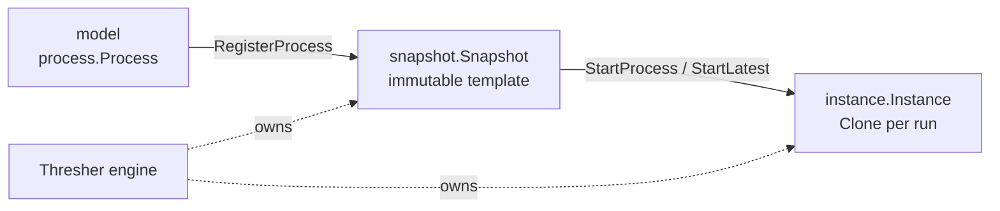

# Architecture overview

gobpm is a **library, not a framework**: you build a process out of model
objects, hand the definition to the engine, and drive instances through a small
public surface. Under that surface the engine passes your definition through
four layers — **model → snapshot → instance → engine** — each with a distinct
job and lifetime. This page explains what each layer is, how a definition flows
through them at run time, and which layers you actually call (only two are
public API; the other two you observe, never construct).

> The short version: you write **model**, the engine freezes it into an
> immutable **snapshot**, `Clone`s that snapshot per **instance** to run, and the
> **`Thresher`** engine owns registration, launch, and the instance registry.

## The layer stack

| Layer | Package | You... | Lifetime |
|---|---|---|---|
| Model | `pkg/model/…` (`process`, `activities`, `events`, `gateways`, `flow`, `data`, `foundation`) | **build** it — nodes, flows, data | authored once, reusable |
| Snapshot | `internal/instance/snapshot` (behavior only) | **observe** it — the engine builds it for you | one per registered version, immutable |
| Instance | `internal/instance` (behavior only) | **observe** it via `InstanceHandle` | one per run, mutable, disposable |
| Engine | `pkg/thresher` | **call** it — register, start, inspect | one per application, long-lived |

Only the **model** and the **`Thresher`** engine are API you construct and call
directly. Snapshot and instance are `internal/…` — the engine builds and drives
them; you touch them only through read-only windows (`ProcessRegistration`,
`InstanceHandle`). The rationale for keeping them internal lives in
[SAD-001 — vision & architecture](../../design/SAD-001-vision-and-architecture.md).



## Model — what you build

The model is the plain BPMN object graph: a `process.Process` holding nodes
(activities, events, gateways), sequence flows, properties, and data. It is
inert data — building a model runs nothing. Every element descends from
`foundation.BaseElement`, so the whole tree carries identity and documentation;
see [The entity stack](entities.md) for the full class chain.

```go
p, _ := process.New("order")
// … add nodes and flows to p …
```

You hand `p` to the engine; from here the engine owns the transformation.

## Snapshot — the frozen launch template

When you register a process, the engine converts the definition **once** into a
`snapshot.Snapshot`: a validated, immutable launch template. Registration calls
`snapshot.New` for you — `RegisterProcess` "registers a process directly,
creating its snapshot internally" — so you never build one by hand.

A snapshot is the wired, validated node graph plus the immutable header the
engine needs to launch: the process id/name, its `Properties`, cloned
process-level `DataObjects`, declared `CorrelationKeys`, the discovered
`InstantiatingStarts` (message/signal start triggers), and precomputed flags
like `HasConditionals`. Discovering the instantiating starts once — rather than
re-scanning the node graph on every launch — is exactly what the snapshot exists
to amortize.

Two properties matter to a developer:

- **Immutable & shared.** A snapshot is never mutated after `New`. Re-registering
  a key mints a **new version** (each its own snapshot) rather than editing the
  existing one — see [Registering & versioning](../operating/registering-and-versioning.md).
- **A launch template, not a persistence mechanism.** The snapshot is *not*
  durable state: instance tracks, scopes, and history are not stored in it, and
  it is not a recovery format. That is the Repository's checkpoint document —
  see [Persistence & recovery](../operating/persistence.md).

You never call `snapshot`; you receive a `ProcessRegistration` — a read-only
receipt for one registered `(key, version)` — and address launches with it.

## Instance — one running copy

To run, the engine `Clone`s the snapshot into a fresh `instance.Instance`. The
instance owns a private copy of the node graph and mutates only its own copy;
the immutable header (ids, properties, correlation keys) is shared **by
reference** across all instances of the same snapshot. That is what lets two
instances of the same process run concurrently without interfering: each clones
the mutable graph, all share the read-only header.

The instance is where execution actually happens — tokens move through tracks,
data lives in scopes, boundary events arm, the run loop drives nodes through
their `LoadData` / `Exec` / `UploadData` phases. Its internal mechanics
(single-writer event loop, track goroutines, parking) are covered as behavior in
[How a process executes](process-execution.md) and grounded in
[ADR-001 — execution model](../../design/ADR-001-execution-model.md); you do not
construct or call an `Instance`.

What you *do* touch is the **`InstanceHandle`** — a read-only window returned by
`StartProcess`/`StartLatest` and found via `Thresher.Instance`. It "exposes only
observation — never the instance object itself nor any mutating method, so a host
cannot corrupt a running instance":

| `InstanceHandle` member | What it gives you |
|---|---|
| `ID() string` | the instance id |
| `State() InstanceState` | current lifecycle state (open vocabulary — tolerate unknowns) |
| `WaitCompletion(ctx) (InstanceState, error)` | block until the instance finishes |
| `Cancel(ctx) (InstanceState, error)` | request cancellation |
| `Suspend(ctx)` / `Resume(ctx)` | pause and continue |
| `Data() service.DataReader` | read instance data by name |
| `Tokens() []TokenView` | live token positions |
| `History() []TokenPath` | recorded per-track paths |
| `Observe(o Observer) *Subscription` | subscribe to this instance's facts |

`InstanceState` is the standard-named, **open** lifecycle vocabulary
(`StateCreated`, `StateActive`, `StateDehydrated`, `StateCompleted`, `StateTerminating`,
`StateTerminated`) — it grows additively, so consumers must tolerate unknown
values. See [Instance lifecycle](../operating/instance-lifecycle.md) for the full
handle workflow.

## Engine — the `Thresher`

`Thresher` is the top layer and the only one you construct at the engine level.
One `Thresher` per application owns the registry (definitions × versions),
launches instances, and holds the live-instance registry. You create it with
`thresher.New`, override any bundled subsystem with a `With…` option, then `Run`
it:

```go
eng, _ := thresher.New("engine")
reg, _ := eng.RegisterProcess(p)   // model → snapshot
_ = eng.Run(ctx)                   // start the event queue
h, _ := eng.StartProcess(reg)      // snapshot → instance, returns a handle
st, _ := h.WaitCompletion(ctx)
```

`thresher.New` "creates a new empty Thresher in NotStarted state" — a
zero-option `New` already produces a fully working engine; each `WithXxx`
overrides one bundled extension. The engine's own state machine
(`NotStarted → Starting → Started → Stopping → Stopped`, plus `Paused`) gates
what it accepts: a `Stopped` engine rejects register/start/run.

The layer-crossing methods you call most:

| Method | Layer crossing |
|---|---|
| `RegisterProcess(p, opts…) (*ProcessRegistration, error)` | model → snapshot (new version) |
| `StartProcess(reg) (*InstanceHandle, error)` | snapshot → instance (pinned version) |
| `StartLatest(key)` / `StartVersion(key, n)` | snapshot → instance (by key) |
| `Run(ctx)` / `Shutdown(ctx)` | engine lifecycle |
| `Instance(id)` / `Instances(filter)` | inspect the live-instance registry |

The engine also exposes the extension seams (`WithExpressionEngine`,
`WithWorkerDispatcher`, `WithTaskDistributor`, …) — see the
[Engine options catalog](../reference/engine-options.md) and
[The engine (Thresher)](engine.md). For the full API surface run
`go doc github.com/dr-dobermann/gobpm/pkg/thresher`.

## Putting it together

One request — "run this process" — walks the whole stack:

1. **Model.** You build a `process.Process` (inert).
2. **Register.** `RegisterProcess` freezes it into an immutable `Snapshot` and
   hands back a `ProcessRegistration` (a version receipt).
3. **Start.** `StartProcess` `Clone`s that snapshot into a fresh `Instance` and
   returns an `InstanceHandle`.
4. **Run & observe.** The instance's run loop executes; you watch it through the
   handle (`WaitCompletion`, `Tokens`, `Observe`), never through the instance
   object itself.

The invariant across all four: **you build and call two layers (model, engine)
and observe the other two (snapshot, instance)**. That boundary — public
construction at the ends, read-only windows in the middle — is what keeps a host
application from corrupting engine-internal state.

## See also

- Next: [The entity stack](entities.md) · [Process, instance, track, token](execution-model.md) · [How a process executes](process-execution.md)
- Engine detail: [The engine (Thresher)](engine.md) · [Engine options catalog](../reference/engine-options.md)
- Operating: [Registering & versioning](../operating/registering-and-versioning.md) · [Instance lifecycle](../operating/instance-lifecycle.md)
- Design: [SAD-001 — vision & architecture](../../design/SAD-001-vision-and-architecture.md) · [ADR-001 — execution model](../../design/ADR-001-execution-model.md) · [ADR-013 — instance observability](../../design/ADR-013-instance-observability.md) · [ADR-019 — definition versioning](../../design/ADR-019-definition-versioning.md)
- Full API: `go doc github.com/dr-dobermann/gobpm/pkg/thresher`
